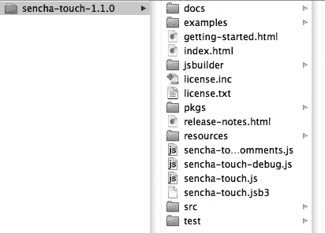
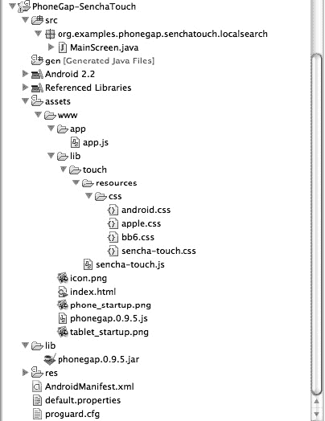
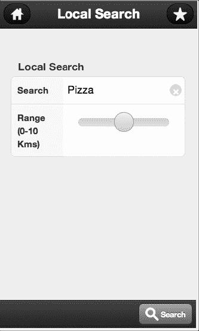
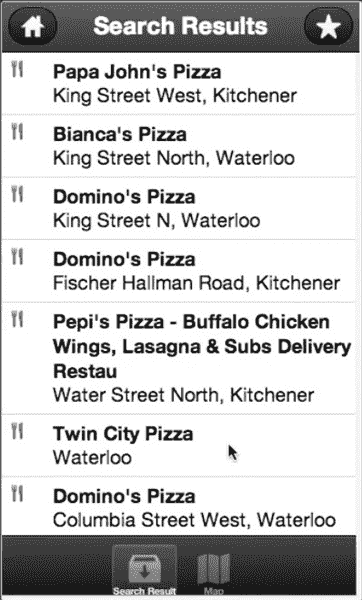
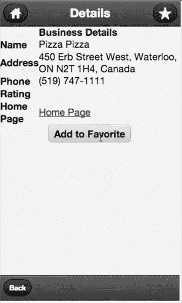

# 五、使用 PhoneGap 和 Sencha Touch

Sencha Touch 是一家名为“ExtJS”的公司的产品。“ExtJS”是 Ajax RIA 世界中一家受欢迎的公司，它提供了一个丰富的、经过打磨的 JavaScriptui 框架，名为“ExtJS”。该公司的热门产品有“ExtJS”JavaScript UI 框架，“Ext-GWT”，GWT UI 框架(Ext js 的 GWT 计数器部分)，以及“Sencha Touch”移动端 JavaScript 库。

“ExtJS”公司最近更名为“Sencha”。因此，虽然名称是新的，但是“Sencha Touch”库中的内容是基于多年来使用 JavaScript 构建 UI 的经验。

如果你熟悉“ExtJS”，你会注意到“ExtJS”和“Sencha Touch”有很多相似之处，尤其是在基础类。然而，“Sencha Touch”是专为移动应用设计的。

### 为什么要用 Sencha Touch？

Sencha Touch 允许您为 iPhone、Android 和 BlackBerry 开发基于浏览器的应用，具有原生的外观和感觉。还有，Sencha Touch 是基于 HTML5 的。

Sencha Touch 为您提供以下优势:

1.  触摸优化的丰富小部件集，以及支持点击、双击、滑动、点击并按住、挤压并旋转、滑动和手势的触摸事件。
2.  新时代网络标准 HTML5 和 CSS3。
3.  与 PhoneGap 集成。
4.  支持 iOS、Android 和黑莓，以及这些设备的原生主题
5.  对 Ajax、JSONP 和 Yahoo！查询语言(YQL)，以及支持本地存储来支持小部件。

总之，Sencha Touch 是目前移动应用开发最好的 JavaScript ui 库之一。如果你没有从事过 ExtJS，那么学习曲线一开始可能会有点陡。

#### 煎茶触摸的优点

Sencha Touch 的优点远远超过缺点。首先，Sencha Touch 基于 web 标准，如 HTML5 和 CSS3，而不是基于任何专有技术。Sencha Touch 的社区支持也很好。商业使用是免费的。

你可以在 Sencha Touch 中构建一个应用，它可以检测我们是在平板电脑上还是在手机上，并且你可以编写代码来使相同的应用以不同的方式工作。例如，看看厨房的水槽。当您在平板电脑和移动设备上查看它时，您将会看到该示例根据实际情况进行了自我调整。

小部件集相当丰富。用 JavaScript 构建整个小部件确保了与用户的高度交互性。你有更多的控制权。

Sencha Touch 的性能很好，并且随着每个版本的发布而不断改进。此外，随着更新版本的 iOS 和 Android 操作系统的发布，这些操作系统附带的 webkit 在性能上也有所提高。

有对国际化的支持，有像网格和传送带这样的小部件，它们是非常新时代的可视化辅助工具。

#### 煎茶触摸的缺点

Sencha Touch 最大的缺点是它的学习曲线。使用 Sencha Touch，您很少使用任何预渲染的 HTML。一切都是通过 JavaScript 添加到 DOM 中的。对一些人来说，这可能是观念上的转变。

如果你的应用仅仅是几个带有导航的页面，视图主要是列表视图、表单和工具栏，那么 Sencha Touch 就太过了。

### 下载 Sencha Touch

从 Sencha 的网站-`[www.sencha.com/products/touch/](http://www.sencha.com/products/touch/)`下载 Sencha 触摸库。一旦你下载并解压 sdk，你会看到如图 5-1 所示的结构。

**图 5-1。** *森查摸目录结构*

### 集成 Sencha 和 PhoneGap

让我们从将 Sencha Touch 与 PhoneGap 项目集成开始。本章将假设它是针对 Android 平台的。其他平台的步骤类似。

参考[第 2 章](02.html#ch2)和[第 3 章](03.html#ch3)为你的目标平台设置 PhoneGap 项目。

如[图 5-2](#fig_5_2) 所示，从 Sencha Touch sdk 中，您需要添加以下文件:

1.  将 sencha-touch.js JavaScript 文件添加到 www/lib。
2.  将 resources/css 文件夹添加到 www/lib
3.  将所有应用代码放在一个名为 app/app.js 的文件中，这将是我们的主 JavaScript 文件。

出于本章和示例的考虑，请从 sencha-touch-1 . 1 . 0/examples/map 文件夹中复制 icon.png、phone_startup.png 和 tablet_startup.png。

**图 5-2。** *PhoneGap 和 Sencha Touch 项目结构*

### 使用 Sencha Touch 构建本地搜索应用

本地搜索应用的要求类似于我们在[第 5 章](#ch5)中的要求。用户通过关键字输入搜索，从他/她的当前位置搜索范围，用户获得列表视图中列出的本地位置。用户可以点击其中一个项目，并查看该地方的详细信息。在详细信息屏幕上，用户可以选择将该地点放入他/她的收藏夹列表(存储在应用数据库中以供离线访问)。用户还可以在地图视图中看到搜索结果。

最后但同样重要的是，用户可以点击收藏夹按钮(星形图标)来查看他/她的收藏夹列表。

让我们开始构建应用。请记住，Sencha Touch 相当大，本章将带您浏览该应用所需的 Sencha Touch API 的子集。

#### 初始化煎茶触摸

第一步是确保 index.html 有 Sencha 触摸库，PhoneGap 库，和 CSS 链接。注意我们的身体是空的。这是因为，在 Sencha Touch 中，我们用 JavaScript 构建整个 ui。注意，我们包含了以下 JavaScript 和样式表。

1.  Sencha Touch 样式表
2.  谷歌地图 JavaScript
3.  我们的应用 JavaScript

`<!DOCTYPE HTML>
<html>

    <head>
        <title>Local Search</title>
        <link rel="stylesheet" type="text/css" href="lib/touch/resources/css/sencha-touch.css"></link>
        <!-- applications that determine the user's location via a sensor must
        passsensor=true when loading the Maps API JavaScript. -->
        
        
        
        
    </head>

    <body>
    </body>

</html>` 

现在让我们转到 app . js。PhoneGap 应用是在函数 Ext.setup()中设置的。根据经验，记住所有 Sencha Touch 函数都采用 JSON 结构作为配置。

我们将对 Ext.setup 进行同样的操作。我们将为应用提供一些图标，以及手机闪屏和平板电脑闪屏。但这些都不是我们想在本章重点讨论的部分。

这里最重要的部分是 onReadyfunction()。这就好比 jQuery 的文档就绪，PhoneGap 的设备就绪功能。我们可以在这个函数中开始绘制 Sencha Touch 的 UI。

`Ext.setup({
    tabletStartupScreen: 'tablet_startup.png',
    phoneStartupScreen: 'phone_startup.png',
    icon: 'icon.png',
    glossOnIcon: false,
    onReady: function () {` `        //Sencha Touch framework has initialized here.
        //Create Panels and bind event handlers.
    }
});`

#### 创建布局(应用框架)

下一步是将一个面板声明为主面板。为此，我们将创建一个新面板(new Ext。Panel())并在其配置 JSON 中，我们将声明以下内容:

1.  布局:“卡片”-布局是卡片布局，这意味着它是一叠卡片，我们一次只展示一张卡片
2.  full screen:true–指定此面板将占用 100%的可用宽度和高度，并自动将其自身绘制到页面上
3.  items: [searchPanel，tabResultPanel，favourites，result detail panel]–要添加到此面板的子组件数组。由于我们使用的是“卡片”布局，它将一次显示一个子组件。我们的主面板中有四个子面板:searchPanel、tabResultPanel、favourites 和 resultDetailPanel。searchPanel 和 tabResultPanel 的声明方式与 mainPanel 相同。默认情况下，searchPanel 是可见的卡片，而其他面板隐藏在 searchPanel 后面
4.  docket items:[]–用于声明停靠的小部件，通常用于工具栏按钮。
5.  dockedItems 内部有一个由 JSON 表示声明的工具栏。这个工具栏有两个按钮和一个分隔它们的间隔。
    1.  对于主页按钮，我们使用图标:“主页”
    2.  对于最喜欢的按钮，我们使用图标:“星形”

对于这两个按钮，我们都声明了一个处理程序，当单击按钮时会调用这个处理程序。

`//Main Panel with CardLayout
var mainPanel = new Ext.Panel({
    layout: 'card',
    fullscreen: true,
    items: [searchPanel, tabResultPanel, favorites, resultDetailPanel],
    dockedItems: [{
        xtype: 'toolbar',
        title: 'Local Search',
        dock: 'top',
        items: [{
            iconMask: true,
            ui: 'round',
            iconCls: 'home',
            handler: function () {

            }

        }, {` `            xtype: 'spacer'
        }, {
            iconMask: true,
            ui: 'round',
            iconCls: 'star',
            handler: function () {}

        }]
    }]
});`

在没有任何子部件的情况下，[图 5-3](#fig_5_3) 显示了该面板的外观。

**图 5-3。** *带工具栏按钮的主应用面板*

接下来，我们声明搜索面板。搜索面板有一个文本框，用户可以在其中输入搜索关键字，并有一个范围选择器，允许用户选择他/她的搜索范围。最后，搜索面板有一个带有搜索按钮的工具栏。声明如下:

`**var searchPanel = new Ext.form.FormPanel({**
**    layout: 'fit',**
**    fullscreen: true,**
**    scroll: 'vertical',**
**    standardSubmit: false,**
**    //Adding form field**
**    items: [{**` `**        xtype: 'fieldset',**
**        title: 'Local Search',**
**        items: [{**
**            xtype: 'textfield',**
**            name: 'search',**
**            label: ‘Search',**
**            value: ‘Pizza',**
**            userClearIcon: true,**
**            autoCapitalize: false**
**        }, {**
**            xtype: 'sliderfield',**
**            name: 'range',**
**            label: 'Range (0-10 Kms)',**
**            value: 5,**
**            minValue: 0,**
**            maxValue: 10**
**        }]**

**    }],**
**    //Docking a toolbar at bottom**
**    dockedItems: [{**
**        xtype: 'toolbar',**
**        dock: 'bottom',**
**        items: [{**
**            xtype: 'spacer'**
**        }, {**
**            text: 'Search',**
**            iconCls: 'search',**
**            title: 'Search',**
**            iconMask: true,**
**            ui: 'confirm',**
**            handler: function () {**

**            }**
**        }]**
**    }]**
**});**`

[图 5-4](#fig_5_4) 显示了搜索面板的显示方式。

**图 5-4。** *应用搜索面板*

当用户进行搜索时，用户会看到两个视图。

1.  显示搜索结果的列表视图
2.  显示搜索结果的地图视图

这两个视图都封装在选项卡面板中。我们将选项卡面板声明如下:

`**var tabResultPanel = new Ext.TabPanel({**
**    layout: 'fit',**
**    tabBar: {**
**        dock: 'bottom',**
**        layout: {**
**            pack: 'center'**
**        }**
**    },**
**    items: [result, map],**

**});**`

没有任何子面板的选项卡面板如图 5-5 所示。请注意，我们在配置 JSON 中定义了将选项卡栏放置在两个选项卡“result”和“map”的底部。默认情况下，将选择“结果”选项卡。当我们创建“结果”和“映射”对象时，我们将为这两个选项卡定义标签和图标。

**图 5-5。** *搜索结果面板带标签*

现在，我们将看到当用户进行搜索时如何显示搜索结果。在本章的后面部分，我们将会谈到如何使用 AJAX 调用。

出于本章的考虑，假设您有一个来自 Google place 服务器的 JSON，如下所示:

`{
    "status": "OK",
    "results": [{
        "name": "Zaaffran Restaurant - BBQ and GRILL, Darling Harbour",
        "vicinity": "Darling Drive, Darling Harbour, Sydney",
        "types": ["restaurant", "food", "establishment"],
        "geometry": {
            "location": {
                "lat": -33.8712950,
                "lng": 151.1984770
            }
        },
        "icon": "http://maps.gstatic.com/mapfiles/place_api/icons/restaurant-71.png",
        "reference": "CpQBiwAAANM1CkdWcBxiExHinloJpp7kX2D3nyb_D0qoQ_-RuBhq9cwJKYvU8-
sRJUaXF4U2kET_OH3Oh3Yz4tf5_6gBgcsFAPyRappCrJ5WksvMkXrT5lA7q9U_S0ZI0u3mrsvTtXnTDMKlBMywE_
5Yy6lbshqPIatWZ6QkPZBNdmkifyN3vM7H2vL-
300iY6EoartWuxIQNckbM0Bs4D946thThmKOsBoUCmGgFrtYgtO0CIUc79fQi3waO0w",
        "id": "677679492a58049a7eae079e0890897eb953d79b"
    }, {
        "name": "Toros Restaurant Darling Harbour",
        "vicinity": "Murray Street, Sydney",` `"types": ["restaurant", "food", "establishment"],
        "geometry": {
            "location": {
                "lat": -33.8714080,
                "lng": 151.1975410
            }
        },
        "icon": "http://maps.gstatic.com/mapfiles/place_api/icons/restaurant-71.png",
        "reference": "CoQBdQAAALFujBuIMYXsG8Qlus2zSHeikZQNCsSbeII0-55zkhCiArbPkACXRU-
CcLZbeKsXaBpoBNH5iyYJg6Nquct2LTE127X4CD1YtKpozmbjZpyCRFrJ_V5DI4IDGLCWeY_8NMxznbiqb9prR8m
XJoAKv7jNz6KEMxAuGLRAXbi7G6CYEhBeR6Ur-x2ABlS3pKXsKXLvGhRWFzL3Q5TO0xe-gm_LJm9cgtzYJw",
        "id": "aefbc59325ffd5f3e93d67932375d20d143289de"
    }, {
        "name": "Strike Bowling Bar Darling Harbour",
        "vicinity": "Sydney",
        "types": ["restaurant", "food", "establishment"],
        "geometry": {
            "location": {
                "lat": -33.8662990,
                "lng": 151.2016580
            }
        },
        "icon": "http://maps.gstatic.com/mapfiles/place_api/icons/restaurant-71.png",
        "reference": "CoQBeAAAAO-prCRp9Atcj_rvavsLyv-
DnxbGkw8QyRZb6Srm6QHOcww6lqFhIs2c7Ie6fMg3PZ4PhicfJL7ZWlaHaLDTqmRisoTQQUn61WTcSXAAiCOzcm0
JDBnafqrskSpFtNUgzGAOx29WGnWSP44jmjtioIsJN9ik8yjK7UxP4buAmMPVEhBXPiCfHXk1CQ6XRuQhpztsGhQ
U4U6-tWjTHcLSVzjbNxoiuihbaA",
        "id": "0a4e24c365f4bd70080f99bb80153c5ba3faced8"
    }
    ...additional results...],
    "html_attributions": ["Listings by \u003ca href=\"http://www.yellowpages.com.au/\"\u003eYellow Pages\u003c/a\u003e"]
}` 

现在我们已经看到了 Google places 结果的 JSON 结构，我们将创建面板来显示结果。在本例中，我们扩展了一个组件，并在组件中声明了一个模板(tpl)。

模板化是 Sencha Touch 的一个特性，你可以在<tpl>标签中声明一个 html。在我们的例子中，我们传递上述 JSON 的结果对象。结果对象实际上是一个数组。在我们的模板代码中，请注意<tpl for="”.”">。这是在告诉 Sencha 模板引擎迭代结果中的所有对象。</tpl></tpl>

在 html 的后面部分，您会注意到占位符，如{reference}、{icon}、{name}等。如果你们中的任何一个人使用过 java 的消息格式，你会注意到这是非常相似的。这些{}条目将被 JSON 中相应的数据替换。

{name}将被结果->条目->名称中的名称替换。

为了用数据填充这个面板，我们将调用以下 API:

`//This will call the template engine and draw the AJAX's response
    //result. Here ‘result' is the Component object to show the results
    //HTML and response.results is the JSON array.
result.update(response.results);`

现在，让我们看看用来创建结果面板的代码。

`**var result = new Ext.Component({**

**    title: 'Search Result',**
**    iconMask: true,**
**    iconCls: 'organize',**
**    cls: 'timeline',**
**    scroll: 'vertical',**
**    tpl: ['<tpl for=".">',**
**          '
',**
**          '
<imgsrc="{icon}" />
',**
**          '
', '<h2>{name}</h2>',**
**          '
{vicinity}
',**
**          '
',**
**          '
',**
**          '</tpl>']**
**    listeners: {**
**        el: {**
**            tap: detailClickHandler,**
**            //function which**
**            //will handle tap event**
**        }**
**    }**
**});**`

注意最后的听众和 el 部分。这告诉 Sencha Touch，我们有兴趣接收关于该组件元素的事件。此外，我们告诉它，我们专门寻找点击事件。这段代码的结果是，每当用户点击结果中列出的任何地方，它都会调用 detailClickHandler 函数。

**图 5-6。** *搜索结果面板*

Sencha Touch 的地图小工具让生活变得简单多了。否则，我们将不得不使用谷歌地图应用编程接口。我们简单地创建一个新的 Ext。映射并给它一些选项。这是制作地图最简单的方法。请注意,“地图”对象将在 AJAX 回调中使用，以在其上添加位置标记。AJAX 调用在“获取地点列表”中有描述。

`**var map = new Ext.Map({**
**    iconMask: true,**
**    iconCls: 'maps',**
**    title: 'Map',**
**    // Name that appears on this tab**
**    mapOptions: {**
**         // Used in rendering map**
**        zoom: 12**
**    }**
**});**` 

**图 5-7。*地图面板显示地名*T4】**

接下来是面板，显示一个地方的细节。注意，一旦用户点击搜索条目，应用将从 Google places 服务器获取详细信息。该请求的 JSON 响应如下所示:

`{
    "status": "OK",
    "result": {
        "name": "Google Sydney",
        "vicinity": "Pirrama Road, Pyrmont",
        "types": ["establishment"],
        "formatted_phone_number": "(02) 9374 4000",
        "formatted_address": "5/48 Pirrama Road, Pyrmont NSW, Australia",
        "address_components": [{
            "long_name": "48",
            "short_name": "48",
            "types": ["street_number"]
        }, {
            "long_name": "Pirrama Road",
            "short_name": "Pirrama Road",
            "types": ["route"]
        }, {
            "long_name": "Pyrmont",
            "short_name": "Pyrmont",
            "types": ["locality", "political"]
        }, {
            "long_name": "NSW",
            "short_name": "NSW",` `            "types": ["administrative_area_level_1", "political"]
        }, {
            "long_name": "2009",
            "short_name": "2009",
            "types": ["postal_code"]
        }],
        "geometry": {
            "location": {
                "lat": -33.8669710,
                "lng": 151.1958750
            }
        },
        "rating": 4.5,
        "url": "http://maps.google.com/maps/place?cid=10281119596374313554",
        "icon": "http://maps.gstatic.com/mapfiles/place_api/icons/generic_business-71.png",
        "reference":
"CmRRAAAAUgylGnuntxKOuZy9_c5zxdFi6e491_Fv0m1hks5YkeaH7k1SP9ujAkG4GROr1XCHFnMsDhuEIgQQq2W
Wyd33oGRAT8Vwr8rjTWEYEMvCZ1RxTzXSVDZ4gEFqLZcRyAw_EhBS8uZHidMMbYHuf9KHapRyGhQQ1dnf3uMghMR
BlXqJE6ygh_a3ag",
        "id": "4f89212bf76dde31f092cfc14d7506555d85b5c7"
    },
    "html_attributions": []
}`

这个想法是以表格的方式向用户显示上述信息。为此，我们将结合使用以下方法:

1.  将上述 JSON 显示为表的一部分的模板
2.  一个按钮，将允许用户添加这个地方作为收藏或删除它作为收藏。

因此，我们使用一个名为 resultDetailPanel 的包装面板。这个面板有一个 vbox 布局(垂直堆叠部件)。第一个子元素是 placeDetailsPanel(见下)，第二个是 button。

该按钮的文本从“添加到收藏夹”变为“从收藏夹中移除”，这取决于用户是否已经将该位置设为收藏夹。应用中为同一定义了一个名为 isFav()的函数。

`**var resultDetailPanel = new Ext.Panel({**
**    layout: {**
**        type: 'vbox',**
**    },**
**    items: [**
**    placeDetailsPanel,**
**    {**
**        xtype: 'button',**
**        text: 'Add to Favorite',**
**        handler: function (button, event) {**
**            if (button.text == "Add to Favorite") {**
**                addCurrentToFav();**
**                button.setText("Remove from Favorite");**
**            } else {**
**                removeCurrentFromFav();**` `**                button.setText("Add to Favorite");**
**            }**

**        }**

**    }],**
**    dockedItems: [{**
**        xtype: 'toolbar',**
**        dock: 'bottom',**
**        items: [{**
**            ui: 'round',**
**            text: 'Back',**
**            handler: function () {}**

**        }]**
**    }]**

**});**`

这是以表格形式显示 JSON 结果的面板。它使用相同的模板。模板是 html 模板，它有由{ < <variable>>}表示的占位符。使用模板代码，占位符由实际值替换:</variable>

`**var placeDetailsPanel = new Ext.Panel({**
**    tpl: ['<table>',**
**          '<tr>',**
**          '<td>',**
**          '</td>',**
**          '<td>',**
**          '<h1 class="bold">Business Details</h1>',**
**          '</td>',**
**          '</tr>',**
**          '<tr>',**
**          '<td>',**
**          '<h1 class="bold">Name</h1>',**
**          '</td>',**
**          '<td>',**
**          '<h1>{name}</h1>',**
**          '</td>',**
**          '</tr>',**
**          '<tr>',**
**          '<td>',**
**          '<h1 class="bold">Address</h1>',**
**          '</td>',**
**          '<td>',**
**          '<h1>{formatted_address}</h1>',**
**          '</td>',**
**          '</tr>',**
**          '<tr>',**
**          '<td>',**
**          '<h1 class="bold">Phone</h1>',**
**          '</td>',**` `**          '<td>',**
**          '<h1>{formatted_phone_number}</h1>',**
**          '</td>',**
**          '</tr>',**
**          '<tr>',**
**          '<td>',**
**          '<h1 class="bold">Rating</h1>',**
**          '</td>',**
**          '<td>',**
**          '<h1>{rating}</h1>',**
**          '</td>',**
**          '</tr>',**
**          '<tr>',**
**          '<td>',**
**          '<h1 class="bold">Home Page</h1>',**
**          '</td>',**
**          '<td>',**
**          '<a href="{url}" target="_blank">Home Page</a>',**
**          '</td>',**
**          '</tr>',**
**          '</table>'**

**    ]**
**});**`

位置细节面板如图 5-8 中的[所示。](#fig_5_8)

**图 5-8。** *地点详情面板*

现在我们已经了解了如何在收藏夹中添加或删除地点，让我们来看看列出用户收藏地点的面板。是的，这个面板与结果面板非常相似。唯一的区别是结果面板被赋予了来自 Google places 服务器的 JSON，而收藏夹面板被赋予了来自数据库的 JSON。

`**var favorites = new Ext.Component({**
**    title: 'Favotites',**
**    iconMask: true,**
**    iconCls: 'organize',**

**    cls: 'timeline',**
**    scroll: 'vertical',**
**    tpl: ['<tpl for=".">',**
**          '
',**
**          '
<imgsrc="{icon}" />
',**
**          '
',**
**          '<h2>{name}</h2>',**
**          '
{vicinity}
',**
**          '
',**
**          '
',**
**          '</tpl>'],**
**    listeners: {**
**        el: {**
**            tap: detailClickHandler,**
**        }**
**    }**
});` 

**图 5-9。** *最喜欢的地方面板*

#### 面板之间的切换

随着您探索更多的应用代码，您将需要从一个面板切换到另一个面板。这是我们在主面板上使用“卡片”布局的主要原因。

为了在卡片布局中从一个面板切换到另一个面板，我们将使用下面的代码。注意 mainPanel 的 items 中提供的小部件的第一个参数索引号。第二个论点是动画效果。

`mainPanel.setActiveItem(0, "slide");
mainPanel.setActiveItem(1, {type: 'slide', direction: 'right'});`

此外，主面板拥有工具栏。我们需要改变这个工具栏的标题，让用户知道他在哪里。这是使用以下代码完成的:

`mainPanel.dockedItems.items[0].setTitle('Details');`

#### 获取地点列表

当用户点击搜索面板上的搜索按钮时，我们需要调用 Ajax 来获取 Google places 的结果。下面的函数展示了如何在 Sencha Touch 和 PhoneGap 中进行同样的操作。

步骤很简单。

1.  从 PhoneGap 获取地理位置
2.  在 getcurrentPosition 的成功调用中，通过调用 Ext.ajax.request(url，successCallback，failureCallback)来发起 Ajax 调用
3.  在 Ext.ajax.request 的 successCallback 中，会得到 JSON 字符串。
    1.  将这个 JSON 字符串转换成 JSON 对象
    2.  通过调用 result.update(obj.results)填充结果面板；
    3.  在谷歌地图上填充市场

`**var fetchFromGoogle = function () {**

**        var keyword = searchPanel.items.items[0].items.items[0].value;**
**        var range = searchPanel.items.items[0].items.items[1].value * 1000;**
**        navigator.geolocation.getCurrentPosition(**

**        function (position) {**
**            var lat = position.coords.latitude;**
**            var lng = position.coords.longitude;**

**            map.update({**
**                latitude: lat,**
**                longitude: lng**
**            });**

**            var googlePlaceUrl = 'https://maps.googleapis.com/maps/api/place/search/json?location='**
**                  + lat + ',' + lng + '&radius=' + range + '&types=food&name=' + keyword + '&sensor=true&key=API_Key';**
**            //Note that you will need to replace the API_Key with your own key. You //can get API Key from    **
**            //http://code.google.com/apis/maps/documentation/places/**
**            Ext.Ajax.request({**
**                url: googlePlaceUrl,**
**                success: function (response, opts) {**

**                    var obj = Ext.decode(response.responseText);**

**                    result.update(obj.results);**
**                    var data = obj.results;**
**                    for (var i = 0, ln = data.length; i < ln; i++) { // Loop to add points to the map**
**                        var place = data[i];**

**                        if (place.geometry && place.geometry.location) {**
**                            var position = new google.maps.LatLng(place.geometry.location.lat, place.geometry.location.lng);**
**                            addMarker(place.name, place.reference, position); // Call addMarker function with new data**
**                        }**` `**                    }**

**                },**
**                failure: function (response, opts) {**
**                    console.log('server-side failure with status code ' + response.status);**

**                }**
**            }, function (err) {**
**                console.log('Failed to get geo location from phonegap ' + err);**
**            });**
**        })**
**    }**`

#### 取件地点详情

从 Google places 服务器获取地点信息甚至更容易。你需要的东西甚至更少。

1.  通过调用 Ext.ajax.request(url，successCallback，failureCallback)启动 Ajax 调用
2.  在 Ext.ajax.request 的 successCallback 中，会得到 JSON 字符串。
    1.  将这个 JSON 字符串转换成 JSON 对象
    2.  通过调用 placedetailspanel . update(obj . result)填充结果面板；
    3.  此外，我们将通过调用 isFav()函数来检查这个地方是否是收藏夹
        1.  如果这个地方是一个收藏，我们将这个按钮重命名为“从收藏中删除”
        2.  否则，我们将该按钮重命名为“添加到收藏夹”

`**var cachedDetails = null;**

**/****
** * Ensure we have the table before we use it**
** * @param {Object} tx**
** */**
**var ensureTableExists = function (tx) {**
**    tx.executeSql('CREATE TABLE IF NOT EXISTS Favourite (id unique, reference,**
**                          name,address,phone,rating,icon,vicinity)');**
**}**

**/****
** * Add currentDetails to DB**
** */**
**var addCurrentToFav = function () {**
**    addToFavorite(cachedDetails);**
**}**

**/****` `** * Remove currentDetails from DB**
** */**
**var removeCurrentFromFav = function () {**
**    removeFromFavorite(cachedDetails);**
**}**

**/****
** * Add current business data to favourite**
** * @param {Object} data**
** */**
**var addToFavorite = function (data) {**
**    var db = window.openDatabase("Favourites", "1.0", "Favourites", 20000000);**

**    db.transaction(function (tx) {**

**        ensureTableExists(tx);**

**        var id = (data.id != null) ? ('"' + data.id + '"') : ('""');**
**        var reference = (data.reference != null) ? ('"' + data.reference + '"') : ('""');**
**        var name = (data.name != null) ? ('"' + data.name + '"') : ('""');**
**        var address = (data.formatted_address != null) ? ('"' + data.formatted_address + '"') : ('""');**
**        var phone = (data.formatted_phone_number != null) ? ('"' + data.formatted_phone_number + '"') : ('""');**
**        var rating = (data.rating != null) ? ('"' + data.rating + '"') : ('""');**
**        var icon = (data.icon != null) ? ('"' + data.icon + '"') : ('""');**
**        var vicinity = (data.vicinity != null) ? ('"' + data.vicinity + '"') : ('""');**

**        var insertStmt = 'INSERT INTO Favourite (id,reference,**
**                          name,address,phone,rating,icon,vicinity) VALUES**
**                          (' + id + ',' + reference + ',' + name + ',' + address + ','**
**                         + phone + ',' + rating + ',' + icon + ',' + vicinity + ')';**

**        tx.executeSql(insertStmt);**

**    }, function (error) {**
**       console.log("Data insert failed " + error.code + "   " + error.message);**
**    }, function () {**
**        console.log("Data insert successful");**
**    });**

**}**

**/****
** * Remove current business data from favourite**
** * @param {Object} data**
** */**
**var removeFromFavorite = function (data) {**
**    try {**
**        var db = window.openDatabase("Favourites", "1.0", "Favourites", 20000000);**` `**        db.transaction(function (tx) {**
**            ensureTableExists(tx);**
**            var deleteStmt = "DELETE FROM Favourite WHERE id = '" + data.id + "'";**
**            console.log(deleteStmt);**
**            tx.executeSql(deleteStmt);**

**        }, function (error) {**
**            console.log("Data Delete failed " + error.code + "   " + error.message);**
**        }, function () {**
**            console.log("Data Delete successful");**
**        });**

**    } catch (err) {**
**        console.log("Caught exception while deleting favourite " + data.name);**
**    }**

**}**

**/****
** ***
** * @param {Object} reference**
** * @return true if place is favourite else false**
** */**
**var isFav = function (data, callback) {**

**    var db = window.openDatabase("Favourites", "1.0", "Favourites", 200000);**

**    try {**
**        db.transaction(function (tx) {**
**            ensureTableExists(tx);**

**            var sql = "SELECT * FROM Favourite where id='" + data.id + "'";**

**            tx.executeSql(sql, [], function (tx, results) {**
**                var result = (results != null && results.rows != null && results.rows.length > 0);**
**                callback(result);**
**            }, function (tx, error) {**
**                var fetchDetails = function (reference) {**
**                    placeDetailsPanel.update({**
**                        name: "",**
**                        formatted_address: "",**
**                        formatted_phone_number: "",**
**                        rating: "",**
**                        url: ""**
**                    });**
**                    Ext.Ajax.request({**
**                        url: 'https://maps.googleapis.com/maps/api/place/details/json?reference='**
**                            + reference + '&sensor=true&key=API_Key',**
**                        success: function (response, opts) {**
**                            var obj = Ext.decode(response.responseText);**
**                            //global variable to store the current place**` `**                                cachedDetails = obj.result;**
**                                isFav(obj.result, function (result) {**
**                                    if (result) {**

**                                        resultDetailPanel.items.items[1].setText("Remove from Favorite");**
**                                    } else {**

**                                        resultDetailPanel.items.items[1].setText("Add to Favorite");**
**                                    }**
**                                    placeDetailsPanel.update(obj.result);**
**                                });**

**                            },**
**                            failure: function (response, opts) {**
**                                console.log('server-side failure with status code ' + response.status);**
**                            }**
**                        })**
**                    }**

**                    console.log("Got error in isFaverror.code =" + error.code + "**
**                          error.message = " + error.message);**
**                    callback(false);**
**                });**
**            });**

**        } catch (err) {**
**            console.log("Got error in isFav " + err);**
**            callback(false);**
**        }**
**    }**`

#### 从数据库中存储和检索收藏夹

该应用的最后一个重要部分是定义函数来完成以下任务:

1.  向收藏表添加位置
2.  从收藏夹表中移除一个位置
3.  检查某个位置是否已经在收藏表中
4.  从收藏夹表中获取所有条目。

为了在各种函数调用之间传递位置条目，我们在该应用中所做的是声明一个名为 cachedDetails 的变量。当我们在显示地点细节的页面中时，我们在 cachedDetails 中缓存当前地点。cachedDetails 用于将一个位置添加到收藏夹，将其从收藏夹中删除，以及检查它是否已经是用户收藏夹的一部分。

`**var cachedDetails = null;**

**/****
** * Ensure we have the table before we use it**
** * @param {Object} tx**
** */**
**var ensureTableExists = function (tx) {**
**    tx.executeSql('CREATE TABLE IF NOT EXISTS Favourite (id unique, reference,**
**                          name,address,phone,rating,icon,vicinity)');**
**}**

**/****
** * Add currentDetails to DB**
** */**
**var addCurrentToFav = function () {**
**    addToFavorite(cachedDetails);**
**}**

**/****
** * Remove currentDetails from DB**
** */**
**var removeCurrentFromFav = function () {**
**    removeFromFavorite(cachedDetails);**
**}**

**/****
** * Add current business data to favourite**
** * @param {Object} data**
** */**
**var addToFavorite = function (data) {**
**    var db = window.openDatabase("Favourites", "1.0", "Favourites", 20000000);**

**    db.transaction(function (tx) {**

**        ensureTableExists(tx);**

**        var id = (data.id != null) ? ('"' + data.id + '"') : ('""');**
**        var reference = (data.reference != null) ? ('"' + data.reference + '"') : ('""');**
**        var name = (data.name != null) ? ('"' + data.name + '"') : ('""');**
**        var address = (data.formatted_address != null) ? ('"' + data.formatted_address + '"') : ('""');**
**        var phone = (data.formatted_phone_number != null) ? ('"' + data.formatted_phone_number + '"') : ('""');**
**        var rating = (data.rating != null) ? ('"' + data.rating + '"') : ('""');**
**        var icon = (data.icon != null) ? ('"' + data.icon + '"') : ('""');**
**        var vicinity = (data.vicinity != null) ? ('"' + data.vicinity + '"') : ('""');**

**        var insertStmt = 'INSERT INTO Favourite (id,reference,**
**                          name,address,phone,rating,icon,vicinity) VALUES**
**                          (' + id + ',' + reference + ',' + name + ',' + address + ',' + phone**
**                          + ',' + rating + ',' + icon + ',' + vicinity + ')';**` `**        tx.executeSql(insertStmt);**

**    }, function (error) {**
**        console.log("Data insert failed " + error.code + "   " + error.message);**
**    }, function () {**
**        console.log("Data insert successful");**
**    });**

**}**

**/****
** * Remove current business data from favourite**
** * @param {Object} data**
** */**
**var removeFromFavorite = function (data) {**
**    try {**
**        var db = window.openDatabase("Favourites", "1.0", "Favourites", 20000000);**

**        db.transaction(function (tx) {**
**            ensureTableExists(tx);**
**            var deleteStmt = "DELETE FROM Favourite WHERE id = '" + data.id + "'";**
**            console.log(deleteStmt);**
**            tx.executeSql(deleteStmt);**

**        }, function (error) {**
**            console.log("Data Delete failed " + error.code + "   " + error.message);**
**        }, function () {**
**            console.log("Data Delete successful");**
**        });**

**    } catch (err) {**
**        console.log("Caught exception while deleting favourite " + data.name);**
**    }**

**}**

**/****
** ***
** * @param {Object} reference**
** * @return true if place is favourite else false**
** */**
**var isFav = function (data, callback) {**

**    var db = window.openDatabase("Favourites", "1.0", "Favourites", 200000);**

**    try {**
**        db.transaction(function (tx) {**
**            ensureTableExists(tx);**

**            var sql = "SELECT * FROM Favourite where id='" + data.id + "'";**` `**            tx.executeSql(sql, [],**
**                function (tx, results) {**
**                    var result = (results != null && results.rows != null && results.rows.length > 0);**
**                    callback(result);**
**                },**
**                function (tx, error) {**
**                    console.log("Got error in isFaverror.code =" + error.code + "**
**                          error.message = " + error.message);**
**                    callback(false);**
**                });**
**            });**

**    } catch (err) {**
**        console.log("Got error in isFav " + err);**
**        callback(false);**
**    }**
**}**` 

这包括应用的布局部分，如何从 Google places 服务器填充数据，以及如何导航和使用数据库。

请参考下面列出的完整示例，以了解事件是如何处理的。

##### 1。index.html

`<!DOCTYPE HTML>
<html>
    <head>
        <title>Sencha Touch Layout</title>
        <link rel="stylesheet" type="text/css" href="lib/touch/resources/css/sencha-touch.css"></link>
        
        
        
        
    </head>
    <body>
    </body>
</html>`

##### 2。app.js

`Ext.setup({
    tabletStartupScreen: 'tablet_startup.png',
    phoneStartupScreen: 'phone_startup.png',
    icon: 'icon.png',
    glossOnIcon: false,
    onReady: function () {
        var lastPanelId = 0;

        var SEARCHPAGE = 0;
        var TABPAGE = 1;
        var FAVPAGE = 2;
        var DETAILSPAGE = 3;

        var cachedDetails = null;

        var searchPanel = newExt.form.FormPanel({
            layout: 'fit',
            fullscreen: true,
            scroll: 'vertical',
            standardSubmit: false,
            //Adding form field
            items: [{
                xtype: 'fieldset',
                title: 'Local Search',
                items: [{
                    xtype: 'textfield',
                    name: 'search',
                    label: 'Search',
                    value: 'Pizza',
                    useClearIcon: true,
                    autoCapitalize: false
                }, {
                    xtype: 'sliderfield',
                    name: 'range',
                    label: 'Range (0-10 Kms)',
                    value: 5,
                    minValue: 0,
                    maxValue: 10
                }]
            }] //Docking a toolbar at bottom` `dockedItems: [{
                xtype: 'toolbar',
                dock: 'bottom',
                items: [{
                    xtype: 'spacer'
                }, {
                    text: 'Search',
                    iconCls: 'search',
                    title: 'Search',
                    iconMask: true,
                    ui: 'round',
                    ui: 'confirm',
                    handler: function () {
                        lastPanelId = TABPAGE;
                        fetchFromGoogle();

                        mainPanel.dockedItems.items[0].setTitle('Search Results');
                        mainPanel.setActiveItem(lastPanelId);
                    }
                }]
            }]
        });

        var detailClickHandler = function (event) {
                var reference = event.getTarget(".place").id;
                fetchDetails(reference);
                mainPanel.dockedItems.items[0].setTitle('Details');
                mainPanel.setActiveItem(DETAILSPAGE, "slide");
            }

        var result = new Ext.Component({

            title: 'Search Result',
            iconMask: true,
            iconCls: 'organize',
            cls: 'timeline',
            scroll: 'vertical',
            tpl: ['<tpl for=".">',
                  '
',
                  '
<imgsrc="{icon}" />
',
                  '
',
                  '<h2>{name}</h2>',

            '
{vicinity}
', '
', '
', '</tpl>'

            ],
            listeners: {
                el: {
                    tap: detailClickHandler,
                    delegate: '.place'

                }
            }

        });

        var favorites = new Ext.Component({` `title: 'Favotites',
            iconMask: true,
            iconCls: 'organize',

            cls: 'timeline',
            scroll: 'vertical',
            tpl: ['<tpl for=".">',
                  '
',
                  '
<imgsrc="{icon}" />
',
                  '
',
                  '<h2>{name}</h2>',
                  '
{vicinity}
',
                  '
',
                  '
',
                  '</tpl>'],
            listeners: {
                el: {
                    tap: detailClickHandler,
                    delegate: '.place'

                }
            }

        });

        var map = new Ext.Map({
            iconMask: true,
            iconCls: 'maps',
            title: 'Map',
            // Name that appears on this tab
            fullscreen: true,
            mapOptions: { // Used in rendering map
                zoom: 12
            }
        });

        var tabResultPanel = new Ext.TabPanel({
            layout: 'fit',
            tabBar: {
                dock: 'bottom',
                layout: {
                    pack: 'center'
                }
            },
            items: [result, map],

        });

        var placeDetailsPanel = new Ext.Panel({
            //layout: 'fit',
            tpl: ['<table>',
                  '<tr>',
                  '<td>',
                  '</td>',
                  '<td>',
                  '<h1 class="bold">Business Details</h1>',` `'</td>',
                  '</tr>',
                  '<tr>',
                  '<td>',
                  '<h1 class="bold">Name</h1>',
                  '</td>',
                  '<td>',
                  '<h1>{name}</h1>',
                  '</td>',
                  '</tr>',
                  '<tr>',
                  '<td>',
                  '<h1 class="bold">Address</h1>',
                  '</td>',
                  '<td>',
                  '<h1>{formatted_address}</h1>',
                  '</td>',
                  '</tr>',
                  '<tr>',
                  '<td>',
                  '<h1 class="bold">Phone</h1>',
                  '</td>',
                  '<td>',
                  '<h1>{formatted_phone_number}</h1>',
                  '</td>',
                  '</tr>',
                  '<tr>',
                  '<td>',
                  '<h1 class="bold">Rating</h1>',
                  '</td>',
                  '<td>',
                  '<h1>{rating}</h1>',
                  '</td>',
                  '</tr>',
                  '<tr>',
                  '<td>',
                  '<h1 class="bold">Home Page</h1>',
                  '</td>',
                  '<td>',
                  '<a href="{url}" target="_blank">Home Page</a>',
                  '</td>',
                  '</tr>',
                  '</table>'

            ]
        });

        var resultDetailPanel = new Ext.Panel({
            layout: {
                type: 'vbox',
            },
            items: [
            placeDetailsPanel,
            {
                xtype: 'button',
                text: 'Add to Favorite',
                handler: function (button, event) {` `if (button.text == "Add to Favorite") {
                        addCurrentToFav();
                        button.setText("Remove from Favorite");
                    } else {
                        removeCurrentFromFav();
                        button.setText("Add to Favorite");
                    }

                }

            }],
            dockedItems: [{
                xtype: 'toolbar',
                dock: 'bottom',
                items: [{
                    ui: 'round',
                    text: 'Back',
                    handler: function () {

                        if (lastPanelId == 0) {
                            mainPanel.dockedItems.items[0].setTitle('Home Page');
                        } else if (lastPanelId == 1) {
                            mainPanel.dockedItems.items[0].setTitle('Search Results');
                        } else if (lastPanelId == 2) {
                            fetchFromDB();
                            mainPanel.dockedItems.items[0].setTitle('Favourites');
                        } else if (lastPanelId == 3) {
                            //Shouldn't happen
                            mainPanel.dockedItems.items[0].setTitle('Details');
                        }

                        mainPanel.setActiveItem(lastPanelId, {
                            type: 'slide',
                            direction: 'right'
                        });
                    }

                }]
            }]

        });

        //Main Panel with CardLayout
        var mainPanel = new Ext.Panel({
            layout: 'card',
            fullscreen: true,
            items: [searchPanel, tabResultPanel, favorites, resultDetailPanel],
            dockedItems: [{
                xtype: 'toolbar',
                title: 'Local Search',
                dock: 'top',
                items: [{

                    iconMask: true,
                    ui: 'round',
                    iconCls: 'home',
                    handler: function () {` `lastPanelId = SEARCHPAGE;

                        mainPanel.dockedItems.items[0].setTitle('Home Page');
                        mainPanel.setActiveItem(lastPanelId, "slide");
                    }

                }, {
                    xtype: 'spacer'
                }, {

                    iconMask: true,
                    ui: 'round',
                    iconCls: 'star',
                    handler: function () {
                        fetchFromDB();
                        lastPanelId = FAVPAGE;
                        mainPanel.dockedItems.items[0].setTitle('Favourites');
                        mainPanel.setActiveItem(lastPanelId, "slide");
                    }

                }]
            }]
        });

        // These are all Google Maps APIs
        var addMarker = function (name, reference, position) {

                var marker = new google.maps.Marker({
                    map: map.map,
                    position: position,
                    clickable: true,
                    optimized: true,
                    title: name
                });
                google.maps.event.addListener(marker, 'click', function () {
                    fetchDetails(reference);

                    mainPanel.dockedItems.items[0].setTitle('Details');
                    mainPanel.setActiveItem(DETAILSPAGE, "slide");

                });

            };

        var fetchFromGoogle = function () {

                var keyword = searchPanel.items.items[0].items.items[0].value;
                var range = searchPanel.items.items[0].items.items[1].value * 1000;
                navigator.geolocation.getCurrentPosition(

                function (position) {
                    var lat = position.coords.latitude;
                    var lng = position.coords.longitude;` `map.update({
                        latitude: lat,
                        longitude: lng
                    });

                    var googlePlaceUrl = 'https://maps.googleapis.com/maps/api/place/search/json?location='
                         + lat + ',' + lng + '&radius=' + range + '&types=food&name=' + keyword + '&sensor=true&key=API_Key';
                    //Note that you will need to replace the API_Key with your own key. You
                    //can get API Key from //http://code.google.com/apis/maps/documentation/places/
                    Ext.Ajax.request({
                        url: googlePlaceUrl,
                        success: function (response, opts) {

                            var obj = Ext.decode(response.responseText);

                            result.update(obj.results);
                            var data = obj.results;
                            for (var i = 0, ln = data.length; i < ln; i++) { // Loop to add points to the map
                                var place = data[i];

                                if (place.geometry && place.geometry.location) {
                                    var position = new google.maps.LatLng(place.geometry.location.lat, place.geometry.location.lng);

                                    addMarker(place.name, place.reference, position); // Call addMarker function with new data
                                }
                            }

                        },
                        failure: function (response, opts) {
                            console.log('server-side failure with status code ' + response.status);

                        }
                    }, function (err) {
                        console.log('Failed to get geo location from phonegap ' + err);
                    });
                })
            }

        var fetchFromDB = function () {
                var db = window.openDatabase("Favourites", "1.0", "Favourites", 200000);
                try {
                    db.transaction(function (tx) {
                        tx.executeSql('SELECT * FROM Favourite', [], function (tx, results) {
                            var arr = [];
                            for (var i = 0; i < results.rows.length; i++) {` `var data = results.rows.item(i)
                                arr[i] = data;

                            }

                            favorites.update(arr);

                        }, function (error) {
                            console.log("Got error fetching favourites " + error.code + " " + error.message);
                        });
                    });
                } catch (err) {
                    console.log("Got error while reading favourites " + err);
                }

            }

        var fetchDetails = function (reference) {
                placeDetailsPanel.update({
                    name: "",
                    formatted_address: "",
                    formatted_phone_number: "",
                    rating: "",
                    url: ""
                });
                Ext.Ajax.request({
                    url: 'https://maps.googleapis.com/maps/api/place/details/json?reference=' + reference + '&sensor=true&key=API_Key',
                    success: function (response, opts) {
                        var obj = Ext.decode(response.responseText);
                        cachedDetails = obj.result;
                        isFav(obj.result, function (result) {
                            if (result) {

                                resultDetailPanel.items.items[1].setText("Remove from Favorite");
                            } else {

                                resultDetailPanel.items.items[1].setText("Add to Favorite");
                            }
                            placeDetailsPanel.update(obj.result);
                        });

                    },
                    failure: function (response, opts) {
                        console.log('server-side failure with status code ' + response.status);
                    }
                })
            }` `/**
             * Ensure we have the table before we use it
             * @param {Object} tx
             */
        var ensureTableExists = function (tx) {
                tx.executeSql('CREATE TABLE IF NOT EXISTS Favourite (id unique, reference, name,address,phone,rating,icon,vicinity)');
            }

        var addCurrentToFav = function () {
                addToFavorite(cachedDetails);
            }

        var removeCurrentFromFav = function () {
                removeFromFavorite(cachedDetails);
            }

            /**
             * Add current business data to favourite
             * @param {Object} data
             */
        var addToFavorite = function (data) {
                var db = window.openDatabase("Favourites", "1.0", "Favourites", 20000000);

                db.transaction(function (tx) {
                    ensureTableExists(tx);
                    var id = (data.id != null) ? ('"' + data.id + '"') : ('""');
                    var reference = (data.reference != null) ? ('"' + data.reference + '"') : ('""');
                    var name = (data.name != null) ? ('"' + data.name + '"') : ('""');
                    var address = (data.formatted_address != null) ? ('"' + data.formatted_address + '"') : ('""');
                    var phone = (data.formatted_phone_number != null) ? ('"' + data.formatted_phone_number + '"') : ('""');
                    var rating = (data.rating != null) ? ('"' + data.rating + '"') : ('""');
                    var icon = (data.icon != null) ? ('"' + data.icon + '"') : ('""');
                    var vicinity = (data.vicinity != null) ? ('"' + data.vicinity + '"') : ('""');
                    var insertStmt = 'INSERT INTO Favourite (id,reference, name,address,phone,rating,icon,vicinity) VALUES (' + id
                       + ',' + reference + ',' + name + ',' + address + ',' + phone + ',' + rating + ',' + icon + ',' + vicinity + ')';
                    tx.executeSql(insertStmt);

                }, function (error) {
                    console.log("Data insert failed " + error.code + "   " + error.message);

                }, function () {
                    console.log("Data insert successful");

                });

            }` `/**
             * Remove current business data from favourite
             * @param {Object} data
             */
        var removeFromFavorite = function (data) {
                try {
                    var db = window.openDatabase("Favourites", "1.0", "Favourites", 20000000);

                    db.transaction(function (tx) {
                        ensureTableExists(tx);
                        var deleteStmt = "DELETE FROM Favourite WHERE id = '" + data.id + "'";
                        console.log(deleteStmt);
                        tx.executeSql(deleteStmt);

                    }, function (error) {
                        console.log("Data Delete failed " + error.code + "   " + error.message);
                    }, function () {
                        console.log("Data Delete successful");
                    });
                } catch (err) {
                    console.log("Caught exception while deleting favourite " + data.name);
                }

            }

       /**
        *
        * @param {Object} reference
        * @return true if place is favourite else false
        */
        var isFav = function (data, callback) {

                var db = window.openDatabase("Favourites", "1.0", "Favourites", 200000);

                try {
                    db.transaction(function (tx) {
                        ensureTableExists(tx);

                        var sql = "SELECT * FROM Favourite where id='" + data.id + "'";

                        tx.executeSql(sql, [], function (tx, results) {
                            var result = (results != null && results.rows != null && results.rows.length > 0);

                            callback(result);
                        }, function (tx, error) {
                            console.log("Got error in isFaverror.code =" + error.code + " error.message = " + error.message);
                            callback(false);
                        });
                    });

                } catch (err) {
                    console.log("Got error in isFav " + err);
                    callback(false);` `                }

            }

    }
});`

### 结论

如果你正在构建一个相当复杂的移动应用，你应该使用 Sencha Touch。jQueryMobile 适用于较小的、不太复杂的 Ajax 应用。虽然 jQueryMobile 可以用于更复杂的应用，但是您必须自己处理 DOM，这样事情会变得更复杂。

Sencha Touch 性能不错，widget 集丰富。它的一些小部件使用数据存储来与服务器组件对话。你可以在 Sencha Touch 中使用 mvc 设计模式，甚至可以将你的应用分成几个部分。用于改进模块化代码的 js 文件。