# 七、PhoneGap 模拟器和远程调试

### 简介

我在开发 PhoneGap 应用时经历的最大痛苦是以下循环:

1.  开发一个 eclipse/xcode 或无关的 IDE
2.  编译二进制可执行文件并将其放在设备/仿真器上
3.  在设备/模拟器上测试 PhoneGap 应用
4.  调整代码并从第 1 步开始重复

显然，这一循环非常耗时且令人沮丧。如果你是一个有经验的 JavaScript 开发人员，这对你来说将是一场噩梦。

JavaScript 开发人员习惯于在以下现代浏览器上使用便捷的工具:

1.  火狐浏览器
2.  旅行队
3.  铬
4.  微软公司出品的 web 浏览器

(注意，对于 iPhone 和 Android 开发，ie 浏览器没什么用。我们建议 iPhone 和 Android 开发使用 Firefox、Safari 或 Chrome。)

这些工具很少是开发人员的扩展。Firefox 有自己的 firebug，这是 javascript/html 调试工具系列的第一款，它不仅允许您调试页面元素(DOM 结构)，还允许您调试脚本、样式表和网络。它还允许您动态地更改这些内容，并立即进行测试。Chrome 和 Safari 自带开发工具。Internet Explorer 也不例外，它有自己的扩展来做类似的事情。

显然，我们在开发 PhoneGap 时需要类似的东西。这里列出我们的两个要求。我们需要以下内容:

1.  使用 PhoneGap 模拟器在浏览器世界中创建和测试 PhoneGap 之外的应用的能力
2.  一旦我们将 PhoneGap 应用部署在某个仿真器或设备上，就可以对其进行调试

本章我们将讨论如何使用 PhoneGap 模拟器和远程调试工具。

### Chrome PhoneGap 模拟器–使用 Ripple

Ripple 是一个多平台移动平台模拟器，来自一家名为 tinyHippos 的公司。最近，这家公司被动态研究公司(RIM)收购。Ripple 出现的主要原因是为了减少当今移动 web 开发人员面临的挑战，这些挑战是由移动操作系统世界的巨大碎片化造成的。

Ripple 是一个 Chrome 扩展，提供以下模拟:

1.  语音间隙
2.  Webworks(来自黑莓)
3.  web works-平板电脑-操作系统(来自黑莓)
4.  移动网络
5.  陆军妇女队
6.  歌剧
7.  沃达丰

出于本书的目的，我们将只关注 Ripple 的 PhoneGap 仿真。

#### 安装波纹

Ripple 唯一的先决条件是你需要 Chrome 浏览器。任何支持扩展的版本都可以，不用担心安装哪个版本的 Chrome。但是，我们建议使用最新版本。

打开 Chrome 并访问网站—`[http://ripple.tinyhippos.com](http://ripple.tinyhippos.com)/`

您将看到如图[图 7–1](#fig_7_1)所示的页面；你所需要做的就是点击“获取波纹”按钮。

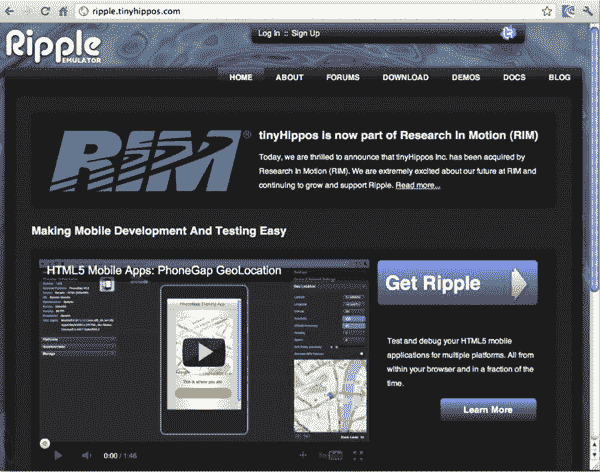

**图 7–1。** *涟漪首页*

这将带您进入图 7–2 中显示的页面。现在点击“安装”

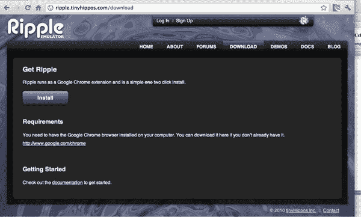

**图 7–2。**T3】安装 Ripple 作为 Chrome 扩展

正如我们之前提到的，Ripple 是 Chrome 的扩展。点击“安装”进入 Chrome 网上商店。当你点击“添加到 Chrome”时，扩展/插件实际上是从 Chrome 网络商店下载的，并自动安装在你的 Chrome 浏览器中(参见[Figure 7–3](#fig_7_3))。

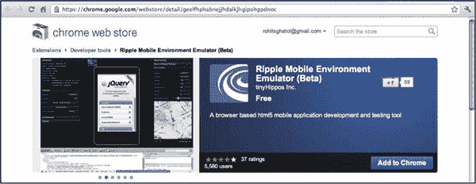

**图 7–3。** *从 Chrome 网上商店安装 Ripple*

一旦插件安装完毕，你会看到一个类似于[图 7–3](#fig_7_3)所示的屏幕。

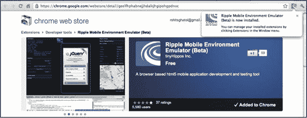

**图 7–4。** *在 Chrome 上安装波纹*

为了验证插件已经正确安装，在 Chrome 中打开一个类似`[www.google.com](http://www.google.com)`的站点，右键点击页面。如果插件已经正确安装，您应该会看到一个“模拟器”启用/禁用选项。这在[图 7–5](#fig_7_5)中进行了描述。

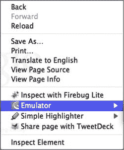

**图 7–5。** *在 Chrome 上右击选项打开波纹模拟器*

继续点击“模拟器”并选择“启用”如果你看到[图 7–6](#fig_7_6)中的屏幕，你的 Ripple 插件工作正常。要退出该屏幕，只需右击并选择仿真器- >禁用。

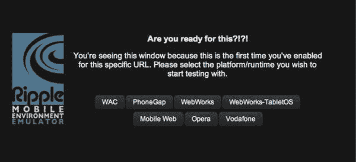

**图 7–6。** *第一次发射涟漪*

#### 为 PhoneGap 有效地使用 Chrome

在我们继续在 Chrome 上使用 Ripple 之前。让我们来了解一下 PhoneGap 如何有效地使用 Chrome。PhoneGap 与移动网络应用有相似之处，但在许多方面也有所不同。让我们列出两个主要的区别。

1.  PhoneGap 应用是基于 HTML/JavaScript 的应用，但它们从不被托管。它们被捆绑为本地移动应用的一部分，显示在应用内部的嵌入式浏览器中。这类似于在 Chrome 上从磁盘测试 HTML/JavaScript 应用。Chrome 需要调整以支持从磁盘运行 html/javascript 应用。
2.  PhoneGap 没有任何与之相关联的域名。这就是为什么他们不遵循单一原产地政策。如果您想为 PhoneGap 应用模拟不遵守单一来源策略，该应用由文件系统或本地 web 服务器托管，您需要调整 Chrome 以支持关闭单一来源策略。

为了从本地文件系统测试 PhoneGap 应用，并使其不遵循单一来源策略，您需要使用下面几段中讨论的命令行参数启动 Chrome。

##### Windows

在 Windows 中，创建一个名为 chrome.cmd 的. cmd 文件，并将以下脚本复制到该文件中。现在使用 chrome.cmd 启动 chrome。

`**chrome.exe --disable-web-security** -–allow-file-access-from-files`

##### Mac 和 Linux

在 Mac 上，创建一个名为 chrome.sh 的脚本，并将以下脚本复制到其中。现在用 chrome.sh 启动 chrome。

`open "/Applications/Google Chrome.app" --args --disable-web-security -–allow-file-access-from-files`

更改 chrome.sh 脚本的权限，使其可执行(需要运行脚本)。

`$>chmod +x chrome.sh
Run the script from terminal as follows:
$>./chrome.sh` 

#### 利用波纹

现在我们将了解如何使用 Ripple，以及在 Ripple 中运行 PhoneGap 应用需要做哪些更改。

以下是在 Ripple 中使用 PhoneGap 应用的先决条件:

1.  该应用需要是一个没有插件的纯欧米茄应用。
2.  您需要从所有 HTML 文件中删除对 PhoneGap JavaScript 的任何引用。

#### 针对 Ripple 调整您的应用

让我们举一个来自[第二章](02.html#ch2)的代码例子。

我们将致力于指南针应用的例子。从这个 URL-`[http://beginingphonegap.googlecode.com/files/compass.png](http://beginingphonegap.googlecode.com/files/compass.png)`获取指南针图像。该图像显示在[图 7–7](#fig_7_7)中。

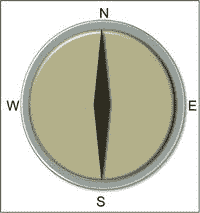

**图 7–7。***PhoneGap 应用中使用的指南针图像*

现在，让我们修改 index.html 文件，如下所示。请注意，我们已经删除了对 phonegap.js 的任何引用。这是目前使用 Ripple 的先决条件。Ripple 正在与 PhoneGap 合作，以消除这种变化。希望在即将发布的版本中，我们会看到这个需求消失。

`<!DOCTYPE HTML>
<html>

    <head>
        <title>
            PhoneGap
        </title>` `
    </head>

    <body onLoad="init()">
        <h1>
            Compass
        </h1>
        <table>
            <tr>
                <td>
                    Compass Heading
                </td>
                <td>
                    

                        ....
                    

                </td>
                <td>
                    Degrees
                </td>
            </tr>
        </table>
        
        </img>
    </body>

</html>` 

你的应用目录看起来会像[图 7–8](#fig_7_8)。它包含应用的所有 HTML、JavaScript 和 CSS 文件。

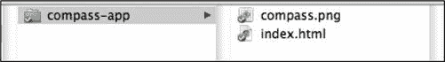

**图 7–8。** *指南针 App 的应用目录*

#### 用特殊标志启动 Chrome

下一步是用特殊的标志启动 Chrome(就像我们在本章前面开始的那样)。

Start Chrome with --disable-web-security -–allow-file-access-from-files flags.

Chrome 启动后，进入窗口->扩展，找到“Ripple Mobile Environment Emulator”扩展，启用“允许访问文件 URL”复选框(参见[图 7–9](#fig_7_9))。

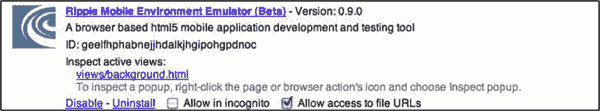

**图 7–9。** *允许访问文件的网址为波纹扩展名*

#### 在 Chrome 中加载应用

现在在 Chrome 中加载指南针应用。在右上角，您会看到波纹图标。点击该项目，为该应用启用 Ripple。这显示在[图 7–10](#fig_7_10)中。

请注意，因为我们用上述标志启动了 Chrome，这就是 Chrome 能够从本地文件系统加载 HTML 文件的原因。此外，如果 PhoneGap 应用使用 Ajax 加载数据，它也可以在 Chrome 中工作，因为我们已经禁用了单一来源策略。

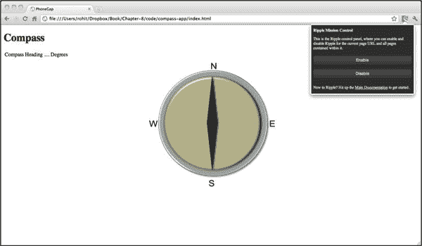

**图 7–10。** *在 Chrome 浏览器中加载指南针 app*

#### 启用纹波

第一次启用 Ripple 时，您会看到[Figure 7–11](#fig_7_11)。我们需要选择 PhoneGap 选项。

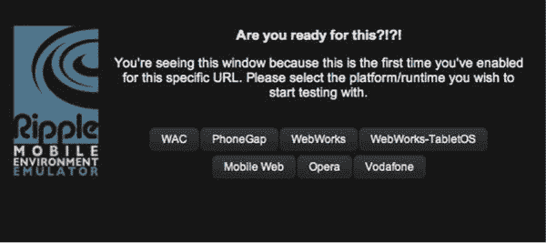

**图 7–11。** *为指南针 app 启用纹波*

#### 玩波纹设置

现在我们已经启用了 Ripple，我们将看到网页已经改变。以前占据整个屏幕的应用现在看起来不同了。这是因为现在 Ripple 是主要应用。Ripple 在 iframe 中加载我们自己的应用，并注入自身来模拟 PhoneGap 环境。在主页上，Ripple 提供了许多控件来改变 PhoneGap 模拟的设备的状态和属性(参见[图 7–12](#fig_7_12))。

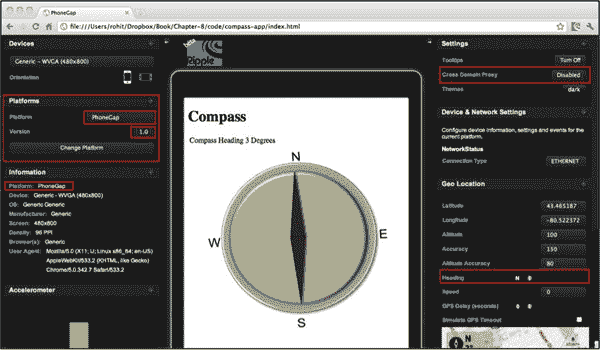

**图 7–12。***Chrome 浏览器中加载的指南针应用启用了 Ripple*

#### 用纹波测试应用

测试中的应用是一个 compass 应用。为了测试该应用，我们将使用右下角红色标记的地理和指南针控件(参见[图 7–12](#fig_7_12))。如果我们改变方向，这意味着我们正在模拟用户移动他/她的设备的罗盘方位。

正如您在[图 7–13](#fig_7_13)中看到的，当我们改变航向时，我们可以看到罗盘图像围绕中心旋转。

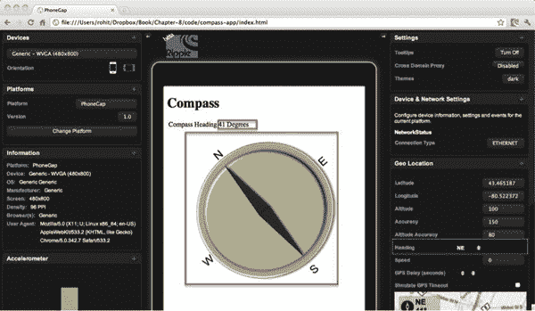

**图 7–13。** *用 Ripple 模仿 PhoneGap 的 Compass api*

模拟 PhoneGap 只是涟漪的一个角度。Ripple 允许开发人员使用常规的浏览器工具来调试和更改应用的 DOM 和 CSS。在[图 7–14](#fig_7_14)中，我们右击图像并点击“检查元素”然后我们可以检查被检查的 DOM 元素的 css 样式，在我们的例子中是 html img。

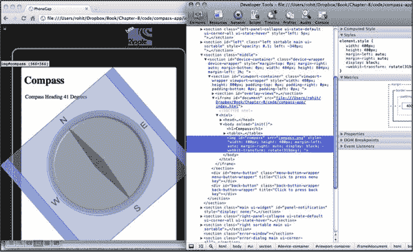

**图 7–14。** *使用 Chrome 的开发者工具查看 HTML DOM 变化*

### 远程调试—[http://debug.phonegap.com](http://debug.phonegap.com)

虽然使用 Ripple 来模拟、测试和调试 PhoneGap 应用是可行的，并且非常有帮助，但是没有什么比得上在实际的仿真器或设备上进行调试。

在实际的仿真器或设备上进行调试的问题是，用于显示 PhoneGap 应用的 webkit webview 非常孤立，无法从外部访问。与 Chrome、Firefox 或 Safari 相比，在这些浏览器中，用户可以检查 html 元素。但是在网络视图中运行的应用(HTML/Javascript)比如 PhoneGap 应用不能被检查。

这就是远程调试发挥作用的地方。参见[图 7–15](#fig_7_15)更好地理解这个概念。基本思想是将调试 JavaScript 注入到我们的 PhoneGap 应用中。这打开了一个与 debug.phonegap.com 服务器[的通道。然后开发人员在浏览器中打开 debug.phonegap.com 的](http://debug.phonegap.com)[并检查运行在设备/模拟器上的 PhoneGap 应用。](http://debug.phonegap.com)

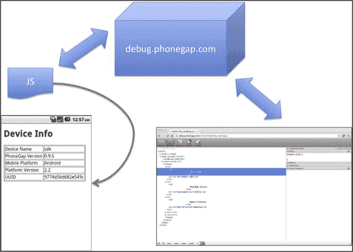

**图 7–15。** *远程调试架构*

#### 设置远程调试

进行远程调试的第一步是在浏览器中打开`[http://debug.phonegap.com](http://debug.phonegap.com)`。在这里你可以提供一个你自己的向导(就像我们一样)或者使用服务器随机分配的向导。

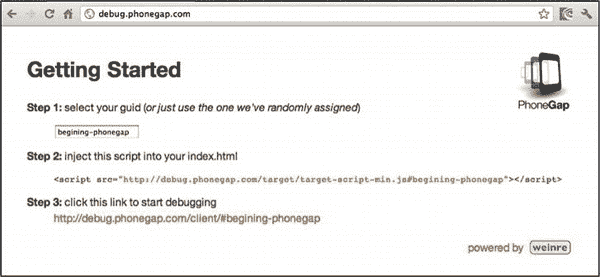

**图 7–16。**T3 使用[debug.phonegap.com](http://debug.phonegap.com)调试你的 PhoneGap 应用

#### 在 PhoneGap 应用中注入远程调试

下一步是复制来自`[http://debug.phonegap.com](http://debug.phonegap.com)`的 JavaScript 片段，并将其注入到 PhoneGap 应用中。这在下面用下划线表示。

`<!DOCTYPE HTML>
<html>
    <head>
        <title>PhoneGap</title>
        
        
        <ins>
    </head>
    <body onLoad="init()">
        <h1>Device Info</h1>
        <table border="1">
            <tr>
                <td>
                    Device Name` `                </td>
                <td id="deviceName">
                </td>
            </tr>
            <tr>
                <td>
                    PhoneGap Version
                </td>
                <td id="phoneGapVersion">
                </td>
            </tr>
            <tr>
                <td>
                    Mobile Platform
                </td>
                <td id="mobilePlatform">
                </td>
            </tr>
            <tr>
                <td>
                    Platform Version
                </td>
                <td id="platformVersion">
                </td>
            </tr>
            <tr>
                <td>
                     UUID
                </td>
                <td id="uuid">
                </td>
            </tr>
        </table>
    </body>
</html>`

#### 调试和修改 DOM 元素

下一步是在模拟器或设备上启动 PhoneGap 应用。当这个应用启动时，运行在其中的 JavaScript 将与 debug.phonegap.com 服务器通信。然后，我们将为远程调试做好准备(参见[图 7–17](#fig_7_17))。

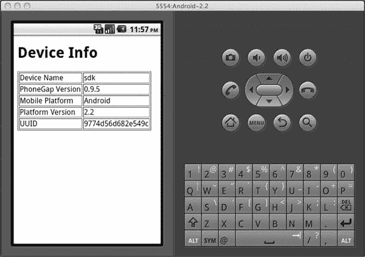

**图 7–17。** *在安卓模拟器中加载设备信息应用*

最后一步是在浏览器中打开`[http://debug.phonegap.com/client/#begining-phonegap](http://debug.phonegap.com/client/#begining-phonegap)`(参见[图 7–18](#fig_7_18))。请记住，我们是从`[http://debug.phonegap.com](http://debug.phonegap.com)`网站获得这个 URL 的。

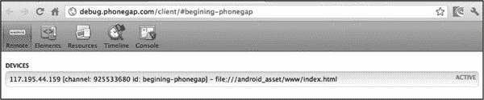

**图 7–18。** *日志消息显示一个 Android 应用连接到了[http://debug.phonegap.com](http://debug.phonegap.com)T5】*

现在移动到元素选项卡(参见[图 7–19](#fig_7_19))。在这里，您将能够在 PhoneGap 应用中看到页面的 DOM 元素。

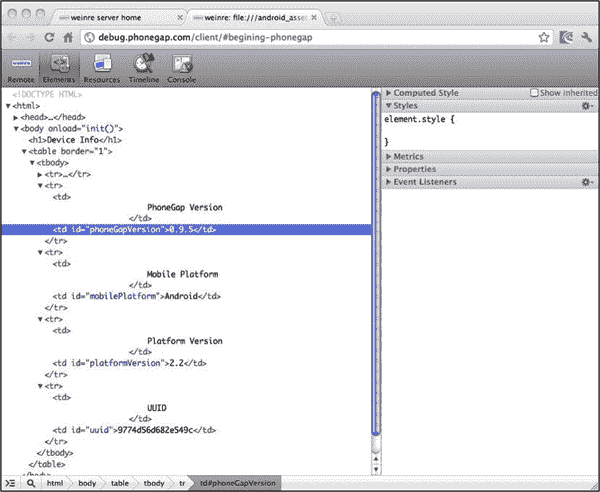

**图 7–19。** *在*上检查 DOM

乐趣不止于此。现在您可以更改 DOM 元素(参见[Figure 7–20](#fig_7_20))。为此，双击任何 DOM 元素(在我们的例子中是 TD)并手动输入样式部分。在我们的例子中，我们将向包含 0.9.5 文本的 td 添加一个样式“style='background:red '”。现在，我们将切换到运行在模拟器中的 PhoneGap 应用，以查看即将生效的更改。

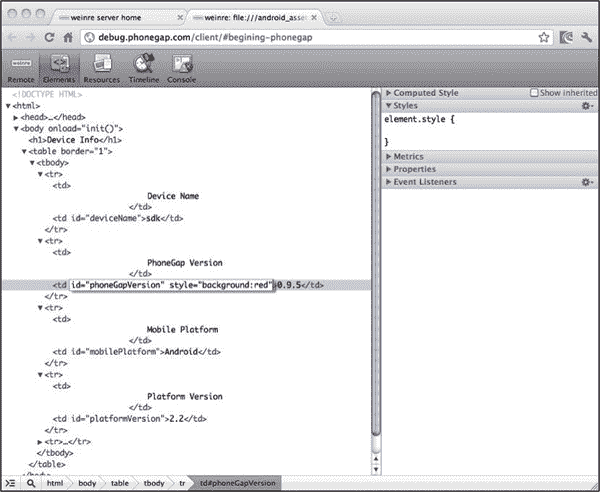

**图 7–20。** *在【http://debug.phonegap.com】*上改变一个 DOM 属性

现在，包含“0.9.5”的 TD 元素的背景色变为红色(参见[图 7–21](#fig_7_21))。这种调试帮助我们在设备/仿真器上实时调试应用。

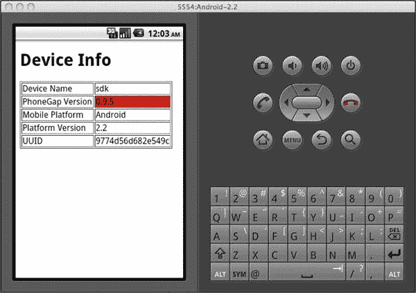

**图 7–21。** *对`[http://debug.phonegap.com](http://debug.phonegap.com)`所做的更改反映在一个 Android 模拟器上*

#### 与[debug.phonegap.com](http://debug.phonegap.com)的问题

到目前为止，我们已经看到`[http://debug.phonegap.com](http://debug.phonegap.com)`的使用在检查真实设备或仿真器内部运行的内容时非常有用。但是，我们不想使用它，原因如下:

1.  在开发过程中，我们不想使用外部服务器。
2.  我们希望节省带宽并提高调试速度。

注:A Weinre(**we**b I**n**spector**re**mote)服务器 power[debug.phonegap.com](http://debug.phonegap.com)。PhoneGap 的人也开发了 Weinre，他们已经很好地记录了它。

#### 安装当地[debug.phonegap.com](http://debug.phonegap.com)

虽然 Weinre 的安装和部署超出了本书的范围，但是我将以链接的形式给出一些关于如何在本地部署 Weinre 的说明。

Weinre 的文档非常好，如果您遵循它，在本地安装和使用 Weinre 应该没有问题。

访问`[http://phonegap.github.com/weinre/Installing.htm](http://phonegap.github.com/weinre/Installing.htm)` <ins>l</ins> 获取安装文件(参见[图 7–22](#fig_7_22))。

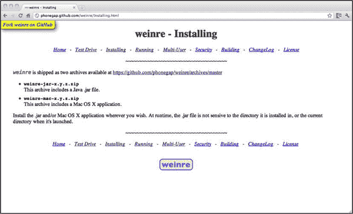

**图 7–22。** *关于如何安装 Weinre 的说明*

访问`[http://phonegap.github.com/weinre/Running.html](http://phonegap.github.com/weinre/Running.html)`获取如何运行的说明(参见[图 7–23](#fig_7_23))。

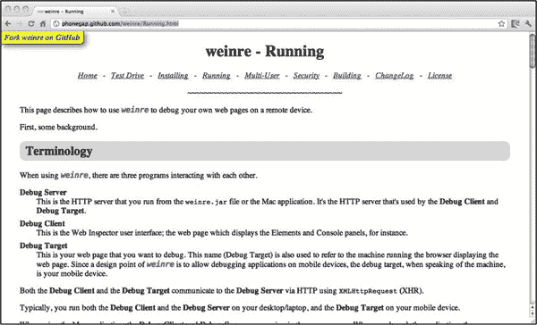

**图 7–23。** *关于如何运行的说明*

### 结论

当开发 PhoneGap 应用时，使用 iPhone/Android 模拟器来测试代码是非常耗时和令人沮丧的。为了节省时间和精力并简化开发，请使用 Ripple PhoneGap 模拟器。充分利用 Chrome 的开发者工具，加速你的开发。对于远程调试，使用`[http://debug.phonegap.com](http://debug.phonegap.com)`或本地安装的 Weinre 服务器。这有助于您了解当应用在 iPhone/Android 模拟器或实际设备上运行时，HTML DOM 实际上发生了什么。