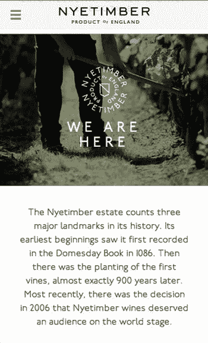

# 一、响应式设计导论

在过去的 20 年里，网站的构建方式已经发生了变化。20 世纪 90 年代，以表格形式构建的网站占主导地位，尽管级联样式表(CSS)规范于 1996 年发布，但 CSS 直到 2003 年中期才真正占据中心舞台。这带来了 CSS Zen Garden 的推出，它展示了 CSS 的力量，以及如何用它来完全重新设计一个站点，甚至不需要接触 HTML。随着后来 CSS 的流行，开发社区标准化了分辨率为 1024×800 的目标屏幕，较大的屏幕边缘留有空白，较小的屏幕需要滚动。这是为了使网站的设计和建设能够为尽可能多的受众服务，因为大多数用户都是通过 1024×800 的分辨率访问网站的。

随着 2007 年 iPhone 的推出，互联网的完整体验随处可见。过去简单、难用的移动浏览器一去不复返了，突然间我们口袋里有了一个完整的桌面级浏览器。各公司的第一反应是创建一个独立的、针对移动设备进行优化的网站，他们认为提供有针对性的用户体验会增加销售额。通常情况下，这些网站是完整网站的缩小版，往往无法向访问者提供他们想要的内容，这意味着最终他们要么离开网站，要么转向完整的网站。

2010 年，手机浏览器实现了 CSS3(层叠样式表 3)媒体查询，从 Android 2.1 开始，到 iOS 3.2。媒体查询的到来带来了针对不同屏幕分辨率的特定风格的能力。

除了屏幕尺寸的变化，随着高像素密度屏幕变得越来越普遍，也有一个巨大的驱动力来提高正在使用的屏幕的质量。retina display 一词是苹果公司在 2010 年 6 月构想出来的，用来描述他们自己手机上的高 dpi(每 CSS 英寸点数)屏幕，他们被认为是将高 dpi 屏幕带入主流的人。因为他们不是唯一部署该技术的公司，所以在构建过程中考虑高 dpi 显示变得越来越重要，以确保您的网站在这些设备上看起来非常棒。确保和实现这一点的最佳方式是通过使用响应式设计方法。

响应式设计已经迅速成为当前 web 开发的趋势，本书旨在带您了解实现响应式设计的不同方法。本章将向你介绍响应式设计。本章包含的部分有:

What is responsive design?   Why is mobile so important?   Responsive design vs. device-specific experiences   Responsive web design is not limited just to mobile   When would you not use responsive web design?   Examples of responsive web design   Looking at HTML5 technologies   What’s new in CSS3  

## 什么是响应式设计？

响应式设计这个术语来源于浏览器对其环境做出反应的方式。响应式设计是一种开发网站的方法，旨在为网站用户提供良好的体验，而不管使用什么浏览器、设备或屏幕大小。使用响应式设计方法设计的网站通过使用流动网格、流动内容(例如，图像、视频和文本)和 CSS3 媒体查询来调整其布局。

响应式设计不再使用像素等固定单位，而是更倾向于百分比等相对单位。这意味着站点不同部分的宽度被设计为视口的百分比。

伊桑·马科特在他的文章《一份清单之外》中首次创造了响应式网页设计这个术语，他将网页比作建筑。他提出了一个关键观点，即我们应该如何将日益增多的网络设备视为同一体验的不同方面。

我们可以把越来越多的网络设备视为同一体验的不同方面，而不是为每一个设备量身定制不相关的设计。我们可以为最佳的视觉体验而设计，但是将基于标准的技术嵌入到我们的设计中，使它们不仅更加灵活，而且更加适应呈现它们的媒体。简而言之，我们需要练习响应式网页设计。1

> Ethan Marcotte, off the list.

Ethan 在这里建议的是所有的显示器应该接收相同的内容。然而，它需要被构建为灵活的，以便正确地适合显示器。网站应该以优化设备体验的方式进行调整。

## 为什么移动如此重要？

随着智能手机的进步，人们可以在任何时候从口袋或包里简单地取出东西来访问互联网。从在当地电器商店查看您感兴趣的电视机的评论，到找到最近的比萨饼店，互联网不再要求您被束缚在一台有过多电缆的计算机上，但它可以与您形影不离。考虑到这一点，开发一个不适合在移动设备上运行的网站的想法是荒谬的。

智能手机市场不再是手机行业的利基部分，而是随着普及而蓬勃发展，智能手机占 2013 年全球手机销量的 57.6%。虽然你可能会认为这些销售中的一部分只是智能手机作为手机计划的一部分的结果，但这仍然是一个惊人的数字。

关于智能手机市场的增长，最有趣的事情之一是来自移动设备的网络流量的百分比正在迅速增加，WalkerSands Digital 估计仅在 2013 年移动流量就增加了 67%(见图 1-1 )。当我们更详细地查看这些统计数据时，我们可以清楚地看到，移动的增长不容忽视。

图 1-1。

Percentage of web traffic coming from mobile devices in 2012-2013

需要记住的一点是，这些数据并没有将商业和消费者流量分开。如果数据是专门针对消费者流量的，我们可能会发现来自移动端的流量比例要高得多。我们之所以会有这样的预期，是因为在工作时间，大多数用户会使用台式电脑来访问互联网。

2013 年 11 月，乔·麦肯在布莱顿正面全裸的演讲中讨论了移动对大型零售商的预期在线影响。在谈到移动的重要性时，他提到了他与一位来自 Target.com 的人就移动对其业务的影响进行的讨论，他的说法支持了我们的预期，即移动的消费者流量将高于商业和消费者流量的总和。他说:

“今年，预计有史以来第一次有超过一半的 Target.com 流量来自移动设备。”3

> —— Joe McCann, creative and technical director of new york's mother, August 11th, 2013

这将是一个令人难以置信的数字，随着移动设备的使用越来越普遍，预计这一数字还会继续上升。移动设备有潜力实现真正的无处不在，这可能是台式电脑和笔记本电脑永远不可能实现的。原因有两个:首先，入门成本低得多，现在购买平板电脑不到 50 美元，购买智能手机不到 30 美元。第二，触摸界面比桌面界面更直观，这意味着以前在使用电脑时可能有问题的人更有可能使用移动平台。虽然现在有触摸界面的台式机和笔记本电脑，但这些都被认为会导致手臂劳损，特别是在肩部，使移动平台更具吸引力。 4

移动市场好转的另一个指标是移动电话的销售数据。它们揭示了智能手机市场尚未饱和，50 亿手机用户群中只有 15 亿是智能手机。此外，2012 年第四季度，平板电脑的销量超过了台式电脑和笔记本电脑的总销量。 5

## 响应式设计与特定设备体验

正如刚才所讨论的，移动是一个巨大的增长领域，您可能会问，为什么我们不针对我们的目标平台量身打造特定于设备的体验。

当比较响应式网站和独立网站时，很容易断言一个独立的网站会让你提供更好的体验。这是雅各布·尼尔森(Jakob Nielsen)的观点，他写的一篇文章的摘要如下:

“在不同的媒体形式之间重复使用内容和设计，比如平面媒体与网络媒体，或者桌面媒体与移动媒体，虽然成本低廉，但却有失身份。卓越的 UX 需要紧密的平台集成。”6

> —Jacob Nelson

事实上，我认为这是一个被误导的观点。响应式开发允许您定义移动设备接收的用户体验，因此，可以通过隐藏和显示不特定于平台的内容来调整内容。

响应式网站设计的主要好处之一就是简单。不需要单独的移动存在，因为 responsive 允许使用相同的 URL 和相同的代码库。有了一个代码库，测试变得更简单，如果您在使用测试驱动开发的工作场所工作，这尤其有用，因为两个代码库可能会导致需要更多的单元测试。

这种简单性的一部分是，使用响应式设计，您只需管理一批内容，而不是本质上管理多个站点上的相同内容。这在网站内容需要由几个人或法律团队批准的组织中尤其重要。这当然会加快速度，从而节省时间和金钱。

对于大多数网站来说，在搜索引擎上获得好的排名是很重要的，谷歌提供了他们希望你如何建立网站的指导。作为他们指南的一部分，Google 建议使用以下注释进行响应式开发:

A single URL for content makes it easier for your users to interact with and share the content.   A single URL for content helps Google’s algorithms index your site.   No redirection or server side device detection is needed for users to get to the device-optimized view, which reduces loading time.   Googlebot user agents have to crawl your pages once, as opposed to crawling multiple times with different user agents, to retrieve your content.  

有了这些建议，走响应路线就更有意义了，尤其是如果你的业务依赖于通过谷歌找到。

在权衡使用响应式网站设计或独立网站的利弊时，考虑如何通过更新、修改和添加新功能来继续支持网站也很重要。两个代码库需要两倍的工作、时间和精力来更新和支持。

如果你已经有了一个满意的网站，你可以考虑转换你当前的网站，而不是完全重建。虽然这种方法首先不是移动的(所以根据定义，你将采取一种优雅的降级方法，而不是渐进的增强方法)，但它可能允许你使你的站点响应更快。转换现有的站点部分包括重构现有的代码和向 CSS 添加媒体查询。

这种比较似乎严重倾向于响应性开发；但是，单独的站点构建也有一些好处。首先，优化移动站点的性能要容易得多，因为您不需要担心桌面站点所需的媒体查询、JavaScript 和 JavaScript 库的开销。此外，拥有单独的站点构建意味着您不需要接触现有的桌面站点，这反过来意味着不需要重新构建和重新测试。

## 响应式网页设计不仅限于手机

到目前为止，很多关于响应式 web 设计的讨论都集中在响应式开发如何让你构建在移动设备上运行良好的网站。然而，不仅仅是移动设备可以从响应式网页设计技术中受益。

尽管基于网络的电视服务如 BBC 的 iPlayer、网飞和亚马逊的 Lovefilm 都可以在移动设备上使用，但电视仍然是家庭娱乐的中心。电视最常见的用途是消费媒体:观看电视节目、在视频游戏控制台上玩游戏，或者只是用来播放背景音乐或听广播。

2013 年 4 月，德勤的媒体和娱乐业务进行了一项调查，发现现在 50%的家庭都可以找到视频游戏机；他们还发现，26%的电视直接或通过机顶盒(机顶盒的例子包括游戏控制台、媒体电脑)连接到互联网。在展望这一领域的未来增长时，我们还需要记住，自 2012 年 10 月以来，所有主要的游戏主机都包含网络浏览器，这意味着随着更多用户将这些设备连接到互联网，还有进一步增长的潜力。

除了电视，分辨率更高、显示器更大的台式机或笔记本电脑正变得越来越普遍。如前所述，历史上的网站宽度是以 1024×800 分辨率的屏幕为目标的，然而，截至 2012 年 3 月，1366×768 屏幕已经成为最常见的分辨率。使用响应式技术，你可以利用这些额外的空间，而不仅仅是在网站的两边留有很大的空白。图像可以更大，内容可以间隔更大，用户甚至可以在开始滚动之前看到更多的内容。

如果我们只看一小部分设备，很容易发现屏幕分辨率各不相同。图 1-2 显示了来自同一个制造商(本例中为苹果公司)的移动设备的不同屏幕分辨率，以及最常见的屏幕分辨率和常见的电视分辨率。

图 1-2。

Screen resolutions of Apple devices

正如这个简单的例子所展示的那样，仅一家设备制造商就需要支持多种分辨率，当您考虑到其他制造商的大量设备时，现在常见的不同分辨率的绝对水平是惊人的。我们还必须记住，具有新屏幕分辨率的新设备会定期被开发和发布，所以你需要确保你的网站足够灵活，能够与这些新设备一起工作，不管它们是什么。

响应式设计不仅仅是简单的移动与桌面的对比；因此，当您考虑响应式设计时，重要的是不要简单地从这些方面考虑，而是要考虑如何让您的设计在尽可能多的设备上工作，而不管屏幕大小和它们的功能如何。一个很好的例子是，不要假设所有移动浏览器都支持地理位置 API(应用程序编程接口)，您可以使用功能检测来识别用户浏览器支持的功能，并逐步增强站点。

## 什么时候你不会使用响应式网页设计？

有时，使用响应式设计技术并不总是合适的，但相反，对于用户体验来说，构建特定于设备的体验会更好。

响应式设计不适合的一个主要例子是在浏览器中提供类似桌面体验的 web 应用程序。谷歌文档就是这样一个网络应用，在桌面浏览器上你可以得到一个全功能的文字处理器，但由于这种体验在移动浏览器上无法实现，你只能得到一个大大简化的移动版本。原因是对于像 Google Docs 这样功能丰富的网络应用程序来说，小屏幕尺寸是一个很大的挑战。在一个更大的视窗中，很容易将所有的功能放到一个工具栏中，但是，在移动设备上，这是不可能的。因此，为了提供更好的用户体验，将界面剥离回典型用户实际使用的界面是有意义的。这种条带化的后界面将与桌面界面非常不同，以允许代码库精简，这样移动和桌面体验分开构建就有意义了。

除了大型 web 应用程序之外，如果您希望转换现有的站点而不是重建它，查看现有的代码库以确保它不会臃肿是很重要的。只有在现有的代码库相当精简的情况下，才应该将现有的代码库转换为响应式构建。如果你发现你现有的网站过于臃肿，你可以选择在转换网站之前花时间精简它；但是，如果这是不可能的或者预算不允许重建，您可以选择单独构建移动站点。

### 了解视口

响应设计中的一个重要概念是视口。顾名思义，视口是用来查看网站的视图。

在 HTML5 和 CSS3 之前，我们通常认为网站与浏览器窗口的大小有关。通常情况下，我们的用户会使用 1024×800 的最小显示尺寸，窗口全屏显示，因此，我们会将我们的网站构建为固定的宽度，通常在 960px 到 980px 之间。然而，在开发早期的小型设备时，制造商面临一个问题。当时大多数网站都是这样固定宽度的，比他们新设备的屏幕宽度要宽得多。如果他们以设备的原生分辨率加载站点，那么用户将需要水平和垂直滚动来查看站点。

解决这个问题的方法是将视窗宽度设置为大于设备宽度，这意味着站点将被缩放以适合屏幕。例如，iOS 默认将视窗宽度设置为 980 像素，这样，典型站点的整个宽度将适合屏幕，而无需水平滚动。因此，网站将被缩小，因此，为了阅读网站的内容，用户将放大他们感兴趣的内容。这为旧网站提供了最佳的折衷方案，以确保它们可以在较小的设备上使用。

为了让开发人员控制视口宽度，引入了一个 meta 标签，它允许设置视口宽度和初始比例；我将在本章后面介绍如何使用这个 meta 标签。这意味着您可以告诉移动浏览器以不同的视口宽度呈现站点。在使用响应式设计技术的情况下，您可以选择告诉浏览器将视窗宽度设置为等于浏览器窗口的宽度(或者在单个窗口设备的情况下，等于该设备的宽度)。

图 1-3 显示了视窗宽度和视窗高度相对于浏览器窗口的测量位置。

图 1-3。

A diagram illustrating the viewport width and viewport height

多种多样的设备意味着您需要确保在多种不同的视窗尺寸下进行测试。要轻松查找各种流行设备的视口大小，您可以查看 [`http://viewportsizes.com`](http://viewportsizes.com/) ，它允许您搜索设备列表，以及设备视口大小的信息。

### 了解断点

除了理解视口，您还需要很好地理解什么是断点。响应式设计中的断点是网站根据媒体查询声明更改布局的宽度。典型地，响应站点将被构建成与针对特定类型的设备的至少两个但通常是三个不同的断点一起工作。最常用的断点有:

Extra small devices, for example, Phones (<768px)   Small devices, for example, tablets (≥768px and <992px)   Medium devices, for example, desktop computers (≥992px and <1200px)   Large devices, for example, desktops computers (≥1200px)  

除了断点，您需要理解的另一个重要术语是状态，即每个断点之间的站点版本。因此，移动、平板和桌面是您的状态，在它们之间有两个断点。

请务必记住，媒体查询响应视窗的宽度，而不是屏幕的宽度。这就是为什么你可以简单地调整你的浏览器来测试你的断点。

## 响应式网页设计的例子

在编写响应式网页之前，让我们看看一些响应式网站的最佳例子。最好在网上访问这些网站，看看它们所描述的功能。截至本文撰写之时，在此对它们进行了描述。

### 八月

我们的第一个例子是八月( [`http://www.agst.co/`](http://www.agst.co/) )，这是一个发现世界上最有才华的艺术家的地方。该网页是一个单页网站，在页面的末尾有一个表格来记录您的兴趣。

当你调整网站大小时，你会注意到这些变化看起来非常微妙。当您查看每个断点之间发生的变化时，您会注意到下面几节中讨论的差异。

#### 大中型设备

对于大型设备和中型设备状态，August 使用 HTML5 视频循环播放。背景被拉伸到全宽，而内容在容器中居中。当你向下滚动页面时，你会发现这个网站的图片非常多，图片小心翼翼地包裹在文本周围(见图 1-4 和 1-5 )。

图 1-5。

The imagery on the “august” site wraps around the copy on large and medium devices

图 1-4。

The initial view of the “august” site, with the video playing in the background

#### 小型设备

对于较小的设备(如平板电脑)，August 禁止在后台播放视频，而是选择用图像来代替(见图 1-6 )。

图 1-6。

On small devices, the “august” site replaces the background video with a static image

调整文字环绕图像的方式，使文字位于图像的上方，以免覆盖主要图像(见图 1-7 )。

图 1-7。

The wrapping of the copy is adapted to better fit the screen of smaller devices and not cover the image

#### 超小型设备

在针对移动设备的最小视图上，网站通过替换不适合移动设备的图像来适应更小的设备。以视窗高度为目标的媒体查询用于进一步调整字体大小，以确保文本正确地位于页面上(见图 1-8 )。

图 1-8。

On our extra small devices, the text is resized and the imagery is sized to be fit the smaller display better

当您查看图像的变化时，您可以看到它现在被裁剪了视窗的宽度，并且文本再次被移动到图像的上方，以防止它与图像重叠(参见图 1-9 )。

图 1-9。

In the content sections, the copy is moved up above the imagery to prevent it overlapping

### 楠木

Nyetimber ( [`http://nyetimber.com/our-story/`](http://nyetimber.com/our-story/) )网站与 August 网站有很大不同，它是一个多页面响应网站。该网站有一个题为“我们的故事”的部分，它使用视差滚动效果告诉你关于业务的故事；这一页将是下面例子的焦点。

#### 大中型设备

该公司的故事是用桌面上的视差效果讲述的，当你滚动网站时，不同的元素在不同的时间间隔出现在视图中(见图 1-10 )。

图 1-10。

The Nyetimber site starts wth an introduction to the story

如果你点击任何一个观看电影按钮，你将被带到一个充满视窗的视频(见图 1-11 )。

图 1-11。

When opened, the videos fill the viewport

当你滚动页面时，你会看到一个区域，在那里你可以将鼠标悬停在面板上，以找到关于该公司的更多信息(见图 1-12 )。

图 1-12。

Tiled panels allow the user to hover over them

小型设备

在平板电脑上，导航已降至徽标下方，视差功能已被移除(参见图 1-13 )。

图 1-13。

Instead of

视频现在是内嵌的，而不是全屏显示(见图 1-14 )。

图 1-14。

The videos are shown inline on small devices, uses the Vimeo HTML5 player for playing the videos

由于用户不能悬停在触摸设备上，面板不再具有悬停动作，而是显示为关于 Nyetimber 的信息列表(见图 1-15 )。

图 1-15。

The information panels are visible by default on small devices

#### 超小型设备

在手机上，页眉被进一步缩小，以移除导航，并在顶部的一条带上显示徽标(参见图 1-16 )。

图 1-16。

The menu be default is collapsed on extra small devices, with a menu icon now available to toggle it

点击标题上的导航按钮，导航现在打开(参见图 1-17 )。

图 1-17。

Taping the menu icon expands the menu

其余内容的大小被调整得更窄，字体大小也更小(参见图 1-18 )

图 1-18。

The content is narrower, blocks are all stacked and the text size optimized for the device

#### 其他示例

在 AWWWards 网站上有更多的例子，那里有一整节是关于响应式设计的。 7

## HTML5 入门

响应式设计建立在 HTML5 和 CSS3 带来的新技术之上。让我们看看 HTML5 带来的变化，这样我们可以更好地理解我们正在编写的代码。

HTML5 是最新版本的 HTML 语言规范的规范草案，由万维网联盟(W3C)达成一致。HTML5 规范是 W3C 称之为“开放 web 平台”的更大技术集的一部分，简单地说，这意味着它允许我们构建在任何地方都可以工作的网站和 web 应用程序。当人们提到术语 HTML5 时，他们通常谈论的是“开放网络平台”

在您的项目中使用 HTML5 有很多好处，我现在将讨论这些。

### 易接近

HTML5 让你的网站更容易被访问。新的 HTML5 语义标签允许屏幕阅读器更容易地识别内容的类型，这允许它们为用户提供更好的体验。此外，HTML5 支持 ARIA(accessible rich Internet application)数据角色，这允许您将角色分配给内容的各个部分。这在使用 JavaScript 更新页面内容时尤其有用，因为您可以定义 ARIA 角色来监视页面的某些部分的变化并通知用户。

### 视频和音频支持

HTML5 对视频和音频代码都有本地支持。HTML5 视频和 HTML5 音频的主要优势之一是，它们提供强大的移动设备支持，因为它们在浏览器中工作，不需要任何像 Adobe Flash 这样的插件。目前正在讨论的一个领域是 HTML5 是否应该支持内容的数字版权管理(DRM ),并且出于防止像电影和音乐这样的数字媒体的盗版的目的，可能会将某种形式的 DRM 添加到规范中。

### 更智能的存储

在 HTML5 之前，客户端存储数据的主要方式是使用 cookies 这样做的缺点是，即使服务器不使用它们，它们也会随 HTTP 请求一起发送到服务器。HTML5 引入了 DOM(文档对象模型)存储，它包括 localStorage(持久的)和 sessionStorage(仅在会话期间可用)。DOM 存储的好处是数据只保留在客户端，所以它们不会影响 HTTP 请求的大小，并且它允许您存储更多的数据；目前，DOM 存储允许每个域存储 5MB 的数据。

### 新的互动

HTML5 的新 JavaScript APIs 使您能够添加新的和改进的交互。这方面的一个例子是新的 API，如拖放、地理定位和历史记录。这些新交互的目的是让你能够构建更丰富、更易于使用的界面。

### 帆布

HTML5 引入了`canvas`元素，这是新的 HTML5 标签，可用于绘图。它允许您构建丰富的互联网应用程序，就像过去使用 Adobe Flash 一样。

### 移动的

HTML5 引入了许多针对移动设备的改进，新的 API(如地理定位)允许网站确定用户的位置并提供特定位置的数据。HTML5 有一个 viewport 标签，允许你定义视窗宽度和缩放设置。还有一些设备特定的标签，使开发人员能够与浏览器特定的功能进行交互，例如，当使用 meta 标签时，开发人员可以告诉 iOS，如果在主页上添加了书签，它应该作为全屏 web 应用程序打开。

## 查看 HTML5 技术

既然您已经意识到了 HTML5 带来的好处，那么让我们来看看一些单独的核心变化。

### 文档类型

doctype 告诉浏览器应该如何解析你的文档；因此，它是文档的重要部分，应该包含在 HTML 文档的第一行。先前的 doctype 不仅将文档定义为 HTML4，还提供了规范文档的 URL，如下例所示:

`<!DOCTYPE HTML PUBLIC "-//W3C//DTD HTML 4.01 Transitional//EN" "`[`http://www.w3.org/TR/html4/loose.dtd`](http://www.w3.org/TR/html4/loose.dtd)

新的 HTML5 doctype 要简单得多，您不再需要指定 HTML 的版本或规范文档的 URL，如下例所示:

`<!DOCTYPE html>`

变化的原因是 HTML 是一个活的规范，在标准化过程中，浏览器将继续规范的新部分。这个想法是，将来可以添加新的特性，而无需对 doctype 做进一步的更改。

### 新的语义 HTML 标签

当您第一次打开一个 HTML5 文档时，您首先会注意到在整个文档中使用了更多的语义标签。最值得注意的是:

`<article>`: Defines an article.   `<aside>`: Defines content alongside the main content.   `<figure>`: Defines related content, an example of use is photos or code listings.   `<figcaption>`: Defines the caption for your `<figure>` element.   `<header>`: Defines a header for the document or section.   `<footer>`: Defines a footer for the document or section.   `<nav>`: Defines a series of links used for navigation around the site.   `<section>`: Defines a section of content.  

下面是一个 HTML5 文档布局的简单示例:

`<!DOCTYPE html>`

`<html>`

`<head>`

`<title>Title</title>`

`</head>`

`<body>`

`<header>`

`<h1>Hello World</h1>`

`</header>`

`
`

`
`

`<footer>`

`</footer>`

`</body>`

`</html>`

### 新元标签

除了 HTML5 引入的新语义标签，还引入了一些新的元标签。

#### 视口元标记

新 meta 标记中最重要的是 viewport meta 标记。这个 meta 标签最初是由 Mobile Safari 引入的，它是一种允许开发人员定义视窗宽度和缩放比例的方式。如果使用不当，viewport meta 标签会给用户带来可怕的体验。

视口元标记内容由逗号分隔的键值对列表组成，可以使用的值有:

`width`:– The width of the viewport.   `initial-scale`: The scale of the site when it initially loads.   `user-scalable`: By default, the user can zoom the site, setting “user-scalable” to “no” disables this. This is bad for the accessability of the site so it is discouraged.   `maximum-scale`: Allows you to define a maximum level that the user can zoom the site. Although not as bad as user-scalable, this can still be harmful to accessability.  

如果您要将这个 meta 标记添加到一个无响应的站点，您应该将 viewport meta 标记设置为一个合理的宽度，以便舒适地显示该站点。如果您以一个 980px 的站点为例，它是居中对齐的，您可能希望在边缘周围包括一点间距，因此您可以将视区宽度设置为 1024px，如下例所示:

`<meta name="viewport" content="width=1024, initial-scale=1">`

对于响应式设计，您希望视口的宽度等于您正在使用的设备的宽度。这有两个主要原因:首先，您将构建以视口宽度为目标的 CSS，因此您希望视口宽度与设备宽度相匹配。第二，它告诉设备该站点是移动优化的，因此它不需要加载一个缩小的大默认视窗。

要使视窗等于您正在使用的设备的宽度，您可以将视窗宽度的值设置为`device-width`，而不是指定一个特定的大小。您还希望您的站点以默认的缩放级别开始，因此您将`initial-scale`设置为 1，如下例所示:

`<meta name="viewport" content="width=device-width, initial-scale=1">`

#### 苹果触摸图标

另一个引入的新 meta 标记是 Apple touch icon meta 标记，它允许您定义当用户将网页保存到主屏幕时将在 iOS 上使用的图标，如下例所示:

`<link rel="apple-apple-icon" href="apple-icon-iphone.png">`

`<link rel="apple-apple-icon" sizes="76x76" href="apple-icon-ipad.png">`

`<link rel="apple-apple-icon" sizes="120x120" href="apple-icon-iphone-retina.png">`

`<link rel="apple-apple-icon" sizes="152x152" href="apple-icon-ipad-retina.png">`

`Although not part of the HTML5 specs, these icons are necessary to allow iOS users to have a nice icon if they save the web site or web application to their home screen.`

### Web 表单

使用 HTML5 规范升级了输入表单字段。以前，我们仅限于单选、复选框和文本字段，但是，现在我们有了更大范围的输入类型:

`search`   `email`   `url`   `tel`   `number`   `range`   `date`   `month`   `week`   `time`   `datetime`   `datetime-local`   `color`  

使用新输入类型的好处之一是它允许浏览器呈现相关的控件。例如，在移动设备上，如果输入类型设置为`email`，则会显示一个专用于插入电子邮件地址的键盘。或者，如果输入类型设置为`date`，则显示本地日期选择器，而不是键盘。这提供了非常好的用户体验，因为它使得表单输入更快。提供了一个为日期字段显示的自定义控件的简单示例:

`<input type="date"  id="field" name="field" />`

当你在手机上访问它时，在这种情况下是运行 iOS7 的苹果 iPhone，它会在浏览器中显示原生日期选取器桶(见图 1-19 )。

图 1-19。

<input type="date" id="field" name="field" />as shown on an iPhone running iOS7

当您在桌面浏览器中加载相同的控件时，您将获得桌面的本地控件(参见图 1-20 )。

图 1-20。

The date input control shown on a desktop in Chrome

HTML5 允许您在输入字段中添加占位符；这意味着您可以为用户提供一个例子，告诉他们应该在输入字段中输入什么样的数据。向输入字段添加占位符属性的示例如下:

`<input type="input" placeholder="Sample placeholder" id="field" name="field" />`

当载入浏览器时，您会看到占位符的灰色文本框(参见图 1-21 )。

图 1-21。

Input element with a placeholder

在 HTML5 中，您还可以轻松地向表单添加验证。为了演示这是如何工作的，让我们看几个简单的例子。

最简单的验证形式是使字段成为必填字段，您可以通过将属性`required`添加到输入字段来实现这一点，如下例所示:

`<input type="text" placeholder="e.g``example@example.com`

当您点击浏览器中的提交按钮时，用户会看到一条错误消息，提醒他们填写该字段(见图 1-22 )。

图 1-22。

The browsers error message shown when user tries to submit the form without filling in a required value

如果您想验证一个电子邮件地址，您只需将输入类型设置为`email`，如下例所示:

`<input type="email" placeholder="e.g``example@example.com`

当您单击浏览器中的提交按钮时，用户会看到一个错误，告诉他们输入的电子邮件地址无效(参见图 1-23 )。

图 1-23。

The browsers error message shown when user tries to submit the form with an invalid email address

### 聚合填充

尽管 HTML5 中有这么多奇妙的新特性，但令人失望的是，我们发现并非所有这些特性都能很好地与我们需要支持的传统浏览器兼容。谢天谢地，这就是 polyfills 的用武之地。术语 polyfill 是 Remy Sharp 在 2009 年写“HTML 简介”时首次提出的。

Remy 说“Shim，对我来说，意味着你可以添加一段代码来修复某些功能，但它通常有自己的 API。我想要一种你可以放进去的东西，它会无声无息地工作。” [`http://remysharp.com/2010/10/08/what-is-a-polyfill/`](http://remysharp.com/2010/10/08/what-is-a-polyfill/) 。

因此，根据 Remy 的定义，polyfill 是简单地为浏览器添加缺失功能的一段代码，这通常使用 JavaScript 来实现。这个术语并不意味着暗示旧的浏览器，因为新的浏览器通常也需要填充最新的特性。

HTML5 技术已经有了大量的聚合填充，其中一些流行的有:

Respond.js: [`https://github.com/scottjehl/Respond`](https://github.com/scottjehl/Respond) Respond.js adds support for min/max-width CSS3 Media Queries to older versions of Internet Explorer (IE6-8). If you are planning on making mobile first responsive sites and need to support older IE, this is required.   HTML5 Shiv: [`https://github.com/aFarkas/html5shiv`](https://github.com/aFarkas/html5shiv) HTML5 Shiv enables support for styling HTML5 semantic elements in older versions of Internet Explorer.   CupCake.js: [`http://www.rivindu.com/p/cupcakejs.html`](http://www.rivindu.com/p/cupcakejs.html) CupCake.js adds support to both localStorage and sessionStorage with a generic API.   FlashCanvas: [`http://flashcanvas.net/`](http://flashcanvas.net/) HTML5 Canvas Polyfill based on using Adobe Flash.  

### 验证 HTML5 页面

您可能以前使用过 W3C 验证器来验证您的 HTML 但是，您可能不知道它已经被更新为对 HTML5 规范草案的实验性支持。

要验证您的 HTML，请访问 W3C 验证器(`validator.w3.org`)，或者通过输入您站点的直接 URL 进行验证，或者将您站点的 HTML 粘贴到提供的文本区域。

可以使用 HTML 的验证:

As a debugging tool: The simplest bug to fix in HTML are those caused by writing invalid code. A simple validation should highlight problems with your HTML, which you can promptly fix.   To maintain quality of code: By ensuring code always passes the W3C validation, it maintains a level of quality in the code.   Ensuring ease of maintenance: Although invalid code may not break your site in the short term, unexpected bugs can crop up when you later amend that code, and validating helps minimize this.  

## CSS3 的新特性

随着 HTML5 带来的变化，我们也有了新的 CSS3 规范。CSS3 是 CSS 的第三个化身，它扩展了 CSS，允许我们构建更深入、更丰富的用户界面。在您开始使用响应式设计之前，了解使用 CSS3 可以实现什么是非常重要的，因为它将构成您在媒体查询中所做的许多工作的基础。

### 浏览器供应商前缀

在你开始看 CSS3 的例子之前，你需要了解一些关于 CSS 浏览器前缀的知识。

由于 CSS3 规范仍然是一个工作草案，浏览器供应商经常在特定于供应商的前缀后面实现新功能。这意味着它们能够实现尚未被所有浏览器完全认同的特性。每个供应商都有自己的前缀，最受欢迎的供应商的前缀是:

`-moz-` Firefox and browsers using Mozilla’s Gecko engine   `-webkit-` Safari, Chrome, and WebKit   `-o-` Opera   `-ms-` Internet Explorer  

正如您将在一些示例中看到的，并非所有浏览器都需要 CSS3 属性的前缀版本，因为该属性已经开发了足够长的时间，不需要浏览器前缀，并且一些浏览器供应商从未实现过前缀版本。

在实现了 CSS 属性的前缀版本的地方，实现通常是非常相似的。然而，有一些带有前缀的 CSS 属性互不相同。线性渐变属性就是一个例子，它对每个浏览器前缀都有不同的实现。

值得注意的是，随着谷歌迁移到他们从 WebKit 中分出来的新 Blink 引擎，他们不再在浏览器前缀下添加新功能。引用他们背后的原因:

历史上，浏览器依赖于供应商前缀(例如-webkit-feature)来向 web 开发者提供实验性特征。这种方法可能对兼容性有害，因为 web 内容开始依赖这些供应商前缀名称。”8–闪烁信息页面。

这对开发者来说意味着，当 CSS3 的一些新的实验性特性进入浏览器时，我们将无法立即使用它们，因为我们网站的用户无法使用它们。这并不妨碍我们在自己的浏览器中启用实验性功能，并尝试它们，因为它们可以在 Chrome 的 about: flags 中启用。

厂商前缀 CSS 属性的完整列表可以在: [`http://peter.sh/experiments/vendor-prefixed-css-property-overview/`](http://peter.sh/experiments/vendor-prefixed-css-property-overview/) 找到。

### CSS3 示例

为了真正探索你可以用 CSS3 做什么，让我们看看一些常见的元素，并讨论我们以前如何对它们进行样式化，以及 CSS3 如何使样式化变得更容易。

#### 小跟班

网站使用按钮的目的多种多样，常见的例子有动作调用、表单提交按钮和动作按钮。从历史上来看，设计按钮的样式是相当棘手的，因为你需要使用图像，比如渐变、非网页安全字体和阴影。当我们有不同大小的按钮时，我们就需要一组不同的图像。使用 CSS3，您可以通过编写代码来实现所有这些。这不仅更简单，还意味着您可以将按钮缩放到不同的大小，而无需重新定义一般的按钮样式。清单 1-1 定义了一个渐变的按钮大小。

清单 1-1。带有渐变的单个按钮

`<!DOCTYPE html>`

`<html>`

`<head>`

`<title>Button example</title>`

``

`</head>`

`<body>`

`<a href="#" class="button">Call to action</a>`

`</body>`

`</html>`

这段代码将在浏览器中创建一个按钮，如图 1-24 所示。

图 1-24。

The finished CSS button

#### RGBA 吗

在 CSS 中，颜色通常被定义为十六进制或 RGB(红、绿、蓝)。如果我们想要半透明的背景，就需要使用 1 `×` 1px 24 位。png 然而，有了 CSS3，我们现在可以用 RGBA 颜色做到这一点。RGBA 颜色是一种应用了 alpha 透明度的 RGB 颜色。这样做的好处是，您不再需要包含图像。为了演示 RGBA，让我们在一个随机的半透明背景的图像上放置一些文本(见清单 1-2)。

清单 1-2。展示 RGBA

`<!DOCTYPE html>`

`<html>`

`<head>`

`<title>RGBA example</title>`

``

`</head>`

`<body>`

`
`

`Hello World
`

`
`

`</body>`

`</html>`

正如您在清单中看到的，您已经将背景设置为`rgba(255,255,255,0.5)`，它是 50%不透明度的白色。根据 RGB 值，您定义的前三个值是红色、绿色和蓝色，第四个值是颜色的不透明度，以十进制数表示。这可以在图 1-25 所示的截图中看到。

图 1-25。

The finished text over a translucent image

#### 多列

在以前，如果你想实现多列文本，这是非常困难的。您可以选择在后端计算每列中应该出现多少个单词，或者使用 JavaScript 来设置这些列。CSS3 允许添加多个列，这意味着您可以在样式表中定义列，而不是以编程方式定义。在清单 1-3 中，您将把段落标记中的内容分成两列，每列 10px。

清单 1-3。创建两列

`<!DOCTYPE html>`

`<html>`

`<head>`

`<title>Multiple col example</title>`

``

`</head>`

`<body>`

`
Sed posuere consectetur est at lobortis. Fusce dapibus, tellus ac cursus commodo, tortor mauris condimentum nibh, ut fermentum massa justo sit amet risus. Donec id elit non mi porta gravida at eget metus. Integer posuere erat a ante venenatis dapibus posuere velit aliquet.
`

`</body>`

`</html>`

在这个清单中，您将`column-count`设置为 2，这样内容将显示为两列。然后您将`column-gap`定义为 10px 来分隔列。您会注意到，对于需要前缀版本的浏览器，您还包括了这些 CSS3 属性的前缀版本。你可以在图 1-26 中看到结果。

图 1-26。

The finished two columns

#### 渐变面板

作为设计的一部分，你可能想有一个径向渐变，所以不使用图像，你可以使用 CSS3 来实现这一点。对于响应式站点来说，这样做的好处是它将随着块的宽度而缩放。参见清单 1-4 中的例子。

清单 1-4。创建径向渐变

`<!DOCTYPE html>`

`<html>`

`<head>`

`<title>Gradient panel example</title>`

``

`</head>`

`<body>`

`
`

`<h1>Intro</h1>`

`
Cras mattis consectetur purus sit amet fermentum.
`

`
<a href="#">read more</a>
`

`
`

`</body>`

`</html>`

你可以在图 1-27 中看到完成的径向梯度。

图 1-27。

Our finished gradient

## 摘要

这一章解释了响应式设计技术如何使你能够构建在各种不同设备上运行良好的网站。重要的是要记住，响应式设计不仅仅是让一个网站能够跨移动和桌面设备工作，还包括构建一个足够灵活的网站，能够跨多种设备良好运行。您无法预测未来访问您站点的设备将如何显示，因此，对于您的编程来说，最好按照大型、中型、小型和超小型来考虑设备，而不是桌面、平板和移动设备。

除了了解在哪里使用响应式设计之外，你现在应该能够识别出不适合使用响应式技术的时候。一个很好的例子是像 Google Docs 这样的桌面替代应用程序，它有很多小设备没有的功能，或者没有足够的空间展示给用户。

了解了响应式设计以及它能为你的网站提供什么之后，看看一些现有的响应式网站，了解一下使用这些技术能实现什么是个好主意。本章还看了几个正在使用的响应式设计的例子。然而，随着响应式设计的流行，有更多的好例子。AWWWARDS 网站有一个很好的不同响应网站的列表，可以在: [`http://www.awwwards.com/websites/responsive-design/`](http://www.awwwards.com/websites/responsive-design/) 找到。

让响应式设计成为可能的当然是 HTML5 和 CSS3 浏览器的改进。作为 HTML5 的一部分，新的语义标签使我们能够为我们的 HTML 带来更多的意义，这不仅有助于我们作为开发人员，而且也使屏幕阅读器能够理解页面的结构。CSS3 也带来了许多改进，让我们能够更好地控制我们的页面样式。

在下一章，我们将探索如何有效地测试我们的响应站点。我们将首先在我们的浏览器中测试我们的网站，看看我们的网站如何在调整到不同宽度的浏览器窗口中工作。然后，我们将开始研究如何在不同的设备上进行测试，从使用模拟器开始，然后研究如何在真实设备上进行测试。

Footnotes 1

伊森·马科特，名单分开。[`http://alistapart.com/article/responsive-web-design`](http://alistapart.com/article/responsive-web-design)

  2

娜塔莎·洛马斯，科技危机。[`http://techcrunch.com/2014/02/13/smartphones-outsell-dumb-phones-globally/`](http://techcrunch.com/2014/02/13/smartphones-outsell-dumb-phones-globally/)

  3

Joe McCann，纽约 Mother 创意技术总监，2013 年 8 月 11 日。

  4

[`http://www.theguardian.com/technology/2013/apr/09/windows-8-touchscreen-laptops-pain`](http://www.theguardian.com/technology/2013/apr/09/windows-8-touchscreen-laptops-pain)

  5

[`http://www.pcpro.co.uk/news/384172/tablet-sales-to-overtake-pcs-this-quarter`](http://www.pcpro.co.uk/news/384172/tablet-sales-to-overtake-pcs-this-quarter)

  6

雅各布·尼尔森- [`http://www.nngroup.com/articles/repurposing-vs-optimized-design/`](http://www.nngroup.com/articles/repurposing-vs-optimized-design/)

  7

[`https://www.awwwards.com/websites/responsive-design/`](https://www.awwwards.com/websites/responsive-design/)

  8

闪烁信息页面 [`http://www.chromium.org/blink#vendor-prefixes`](http://www.chromium.org/blink#vendor-prefixes)