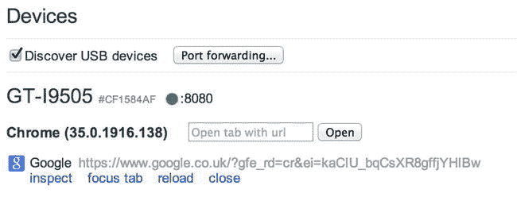

# 二、测试响应站点

在第一章中已经介绍了响应式设计以及 CSS3 和 HTML5 中的一些新特性，本章将介绍如何在你开发响应式网站时测试它们。

很可能你已经对你的站点做了一些浏览器测试，以确保你支持你的用户正在使用的浏览器。然而，当测试一个响应站点时，可能会更棘手，因为需要支持的设备范围要大得多。

你需要知道如何有效地测试你的响应站点，记住这一点，本章将解释:

How to test responsive site in the web browser   How to test on a device  

## 在浏览器中测试响应式设计

在网站的开发生命周期中，您测试网站的第一个地方很可能就是您在网上冲浪时使用的浏览器。使用响应式设计，只要你的浏览器支持媒体查询(IE9+，Chrome，Firefox，Opera，Safari)，你就可以继续这样做，当你到达需要跨浏览器测试的时候，就转向其他浏览器。

要开始测试响应站点，第一步是将响应站点的 URL 加载到浏览器中。对于这个例子，让我们看看我在 [`www.jonathanfielding.com`](http://www.jonathanfielding.com/) 的博客(见图 2-1 )。

图 2-1。

My blog at [`www.jonathanfielding.com`](http://www.jonathanfielding.com/)

因为这个站点是响应性的，所以可以调整浏览器的大小来测试移动视图(见图 2-2 )。

图 2-2。

My blog resized on a smaller device

这就是我的网站，在桌面和移动视图中。这种简单的调整窗口大小的过程在所有支持媒体查询的浏览器中都是一样的。

### 浏览器特定的测试功能

我之前提到过，你不需要改变你的浏览器来测试一个响应站点。一些浏览器提供了额外的开发工具来帮助我们测试一个响应站点。虽然您不需要为您的核心开发切换浏览器，但是了解浏览器提供的不同工具是很有用的，因此当您觉得对您的工作流有好处时，您可以切换浏览器来利用特定的工具。

#### 谷歌 Chrome

在 Chrome 中，您可以通过以下步骤模拟一些最流行的设备:

Open the Developer tools, there are two ways in which you can do this, the first is to right-click your page and click Inspect element. The second method is to click on the menu button found to the right of the url field and select Tools ➤ Developer Tools.   Click the Show console icon to the right of the Developer Tools or press the Esc key on your keyboard. This will open the Console drawer, as shown in Figure 2-3.  With the Console drawer open, you can now select the Emulation tab. As you can see in Figure 2-4, the Device line indicates it will default to Google Nexus 4.  

图 2-3。

The Console drawer open in Chrome’s InspectorUsing the drop-down menu, you have the option to emulate a specific device. Select the Apple iPhone 4 and click Emulate (see Figure 2-5).  

图 2-4。

The Emulation tab, preselected with a default deviceHaving selected the device to emulate, you will see the viewport has now automatically narrowed, and when you move your mouse cursor over the viewport, it will turn into a circle to signify your finger (see Figure 2-6).  

图 2-5。

Selecting the iPhone in the Emulation tab

图 2-6。

With a device selected and emulation enabled, the browsers viewport changes Note

Chrome 中的模拟并不是真正的设备模拟，而是简单地模拟设备的一些关键特性。这些包括视窗大小、设备像素比率、用户代理和触摸事件。这意味着任何特定于浏览器的错误都不会显示出来，因为你仍然在 Chrome 中测试。

#### 火狐浏览器

Firefox 对此采取了一种稍微不同的方法。您可以进入响应式设计模式，而不是模拟特定设备，该模式允许您测试常见的视口宽度。

Open the developer tools. The easiest way to do this is to right-click the web page and click Inspect element.   Enter responsive design view; this is achieved using the icon tab on the far right.   Now that you are in responsive design view, you can see the site in a smaller viewport. You have the option to switch to landscape view, enable touch events, or change the viewport size to other commonly used viewport sizes. You can also resize the viewport and then save the new viewport size as a preset. You can see the Firefox interface in Figure 2-7.  

图 2-7。

The Firefox inspector with the Responsive Design view active

## 在设备模拟器上测试

到目前为止，您一直在通过调整浏览器窗口大小或使用浏览器内置的工具来测试响应性站点。虽然这对于查看媒体查询是如何工作的是有效的，但是它不能提供它们将如何影响移动设备上的站点的全貌。我们现在将看看如何在设备模拟器和实际设备上测试我们的项目。

在开始在真正的移动浏览器上进行测试之前，您需要确定您将支持哪些浏览器。根据网站的目标受众，这可能因网站而异，所以如果你已经对用户使用的浏览器进行了一些分析，这是一个好的开始。此外，如果您的网站针对某个特定的国家，通过查看 StatCounter GlobalStats 网站( [`http://gs.statcounter.com/`](http://gs.statcounter.com/) )，很容易找到使用每个平台的用户百分比的统计数据。

目前有五种主要的智能手机操作系统:

iOS   Android   Windows Mobile   BlackBerry OS   Firefox OS  

决定了要在哪些浏览器上进行测试之后，让我们看看如何在真正的移动浏览器上进行测试。有两种选择:第一种是使用模拟器，第二种是使用一些实际的设备开始测试。

### 模拟器

模拟器为测试您的响应站点提供了一个极好的开端。它们能够在您的本地机器上运行，通常能够访问您所有的本地文件和您所在网络上的文件。

#### iOS 模拟器

如果你使用的是 Mac，你可以从苹果应用商店下载 Mac 开发者工具包 Xcode。其中包括 iOS 模拟器，可用于测试响应站点。要开始使用 iOS 模拟器，您需要遵循以下步骤:

Download Xcode from the Apple App Store.   Open Xcode.   Use the menu bar to navigate to Xcode ➤ Open Developer Tool ➤ iOS Simulator.   Open Safari by clicking the Safari icon in the dock.  

现在，您可以访问任何网站，包括存储在 Hosts 文件中的本地网站。如果你只是想测试一个 HTML 文件，你甚至可以将它拖放到 iOS 模拟器窗口中。

不幸的是，由于苹果尚未推出与操作系统兼容的 iOS 模拟器版本，因此无法在微软 Windows 上测试移动 Safari 中的网站。

#### 机器人

Android 模拟器作为 Android SDK(软件开发工具包)的一部分在 Windows 和 Mac 上都可用。

##### 苹果个人计算机

Download the Android SDK from [`http://developer.android.com/sdk`](http://developer.android.com/sdk) .   Extract the zip file to `∼/bin/Android` (∼is the Unix shorthand for your user directory, so if your username is Jonathan, the full folder path would be `/Users/jonathan/bin/Android`).   Open your terminal.   Navigate to the SDK, which is located at `∼/bin/Android/sdk/tools`. You can navigate to this path using the change directory Unix command `cd`, so the full command you enter into your terminal would be `∼/bin/Android/sdk/tools`.   Run the SDK Manager by running the `./android` command in your terminal. This will load another application (be aware this application may take a while to load and unfortunately does not give any indication of the status of it loading).  

##### Windows 操作系统

Download Android SDK from [`http://developer.android.com/sdk`](http://developer.android.com/sdk) .   Extract the zip file to C:\Program Files\Android.   Launch the SDK Manager.exe.  

##### 共享步骤

You will now be able to select the SDK version you want to test. In this case I have selected Android 4.3\. Then simply click Install, reading and accepting any licenses as required.   You then need to select Tools ➤ Manage AVDs on the menu bar. Then click the New button to create a new Android Virtual Device.   You will now need to enter the settings for your Simulator (see Figure 2-8).  You can now select your simulator and click Start (see Figure 2-9).  

图 2-8。

The create a Simulator prompt allows you to configure your simulatorWith the Android emulator installed, you can now simply use the emulator as you would with a normal Android device (see Figure 2-10).  

图 2-9。

Android Virtual Device Manager lists the available Simulators

图 2-10。

The Android Simulator, with the hardware buttons included in the window

#### Firefox OS 模拟器

Firefox OS Simulator 作为 Firefox 的附加软件运行，从 Firefox 26.0 开始，它的安装非常简单。

Launch Firefox and open the URL `about:app-manager`. You will be presented with the built-in App Manager, as shown in Figure 2-11.  You can now click Start Simulator. Because there is no simulator installed, you will be given the option to install the simulator, so click Install Simulator to continue, as shown in Figure 2-12.  

图 2-11。

The Firefox App Manager tool can be used to launch a Firefox OS SimulatorYou will now be taken to a web page to install a simulator, simply follow the instructions to install the latest version.   Once installed, go back to `about:app-manager` and refresh the page. Click Start Simulator and then select the version of the simulator you wish to start. If it still says Install Simulator, you should try to install a different version (see Figure 2-13).  

图 2-12。

The App Manager allows you to install the simulator if it is not already installedAfter a short loading time, you will find yourself at the Firefox OS home screen, where you can select the web browser. The OS Simulator is shown in Figure 2-14.  

图 2-13。

The option to choose from different versions of the Simulator to installUpon loading the browser, you can enter your web site URL and start testing your site. The browser is shown in Figure 2-15.  

图 2-14。

Firefox OS Simulator home screen, with the browser found in the bottom right-hand corner

图 2-15。

Firefox running on the Firefox OS Simulator

#### 黑莓操作系统模拟器

BlackBerry Limited 为 BlackBerry OS 提供了可以在 Windows 和 Mac 上运行的模拟器，它们安装起来非常简单。但是，如果您还没有安装这些应用程序，您还需要在 Windows 上安装 VMware Player 或在 Mac 上安装 VMware Fusion，这些应用程序可以在 [`www.vmware.com`](http://www.vmware.com/) 找到。

Download the emulator at [`http://uk.blackberry.com/sites/developers/resources/simulators.html`](http://uk.blackberry.com/sites/developers/resources/simulators.html) .   Run the Installer.   Run the Virtual Machine in VMware, as shown in Figure 2-16.  

图 2-16。

BlackBerry simulator running in VMware

#### Windows Phone 模拟器

Windows Phone 模拟器是 Windows Phone SDK 的一部分，目前仅适用于 Windows 8+。不幸的是，运行 Windows Phone 模拟器也有特定的硬件要求，可以在`msdn.microsoft.com/en-us/library/windowsphone/develop/ff626524(v=vs.105).aspx`找到。

Download the Windows Phone SDK from [`http://dev.windowsphone.com/en-us/downloadsdk`](http://dev.windowsphone.com/en-us/downloadsdk) .   Run the SDK installer (this requires 6.5GB of hard drive space).   Upon completion of the installation, you will be told you need a license for Visual Studio, so you can either cancel and use the trial or register for a free license at [`http://www.visualstudio.com/en-US/products/visual-studio-express-vs`](http://www.visualstudio.com/en-US/products/visual-studio-express-vs) .   Check for available updates to the SDK.   Open the command line (cmd) by right-clicking and clicking Run as administrator.   Run the command:  

`"C:\Program Files (x86)\Microsoft XDE\8.0\XDE.exe" /vhd "C:\Program Files (x86)\Microsoft SDKs\Windows Phone\v8.0\Emulation\Images\Flash.vhd" /name WP8SDK`

With the emulator now open, you should now be able to run Internet Explorer in the Simulator, as shown in Figure 2-17.  To make opening the simulator easier in the future, create a .bat file with the command.  

图 2-17。

Internet Explorer running on Windows Phone Simulator

## 物理设备

到目前为止，我一直关注如何通过在浏览器中测试站点和使用电话模拟器来测试开发机器上的站点。尽管用这些方法测试一个站点非常实用，并且可以让你快速地进行初始测试，但是它们并不能真实地反映出这个站点在真实设备上的运行情况。

其中一个原因是，在开发机器上，您只能使用键盘和鼠标模拟设备使用的不同输入方法。通过在真实设备上进行测试，您可以使用用户会使用的输入法进行测试。如果不在物理设备上测试网站，您可能不会注意到可用性方面的问题。您可能没有注意到的常见问题是按钮太小而无法点击，或者文本在小显示屏上不可读。

考虑到这一点，在尽可能多的设备上测试响应站点是非常重要的。然而，如果你刚刚开始收集设备，选择购买哪些设备可能会非常困难，尤其是在你预算有限的情况下。在这种情况下，了解一下用户正在使用的设备是很有意义的，在选择您需要的设备时，请确保您考虑周全。设备应该至少覆盖最流行的操作系统，如果可能的话，混合高端和低端。

### 在设备上调试网站

当在各种不同的设备上测试网站时，您需要能够调试用户可能面临的任何问题。进行调试的方式取决于设备的操作系统。

#### 在 iOS 上调试站点

随着 iOS6 的发布，苹果为 iOS 引入了远程调试功能，使开发人员能够将 Mac Safari Web Inspector 连接到移动 Safari 中打开的网站。若要启用此功能，您需要打开 iOS 设置➤ Safari 设置➤高级设置并打开 Web 检查器。在图 2-18 中，您可以看到 Web Inspector 设置已启用。

图 2-18。

Advanced settings for iOS Safari with Web Inspector enabled

您还需要确保在 Mac Safari 上启用了“开发”菜单项。要做到这一点，只需打开 Safari 并检查“开发”项目是否出现在顶部菜单上。如果看不到，您需要打开“高级”标签下的 Safari 偏好设置。要启用开发菜单，只需勾选菜单栏中的显示开发菜单复选框，如图 2-19 所示。

图 2-19。

Safari preferences with Develop menu enabled

现在，Mac Safari 和 iOS 设备都已设置好，您可以开始将两者连接在一起，以便调试您的站点。为此，首先使用 USB 电缆将您的设备插入电脑。完成此操作后，您可以在 Mobile Safari 中打开您的站点。要在 Mac 上打开检查器，只需打开显示设备的开发菜单。选择您的设备后，您将看到一个页面列表，您可以选择调试，如图 2-20 所示。

图 2-20。

The Develop menu in Safari

选择要调试的站点后，Safari 检查器面板将会打开，您可以完全访问站点代码。从这里开始调试就像在桌面 Safari 上调试一样，突出显示源代码中的一个元素将会突出显示 iOS 设备上的相应元素。Safari 检查器面板如图 2-21 所示。

图 2-21。

Safari Inspector panel

#### 在 Android 上调试网站

与 iOS 类似，你可以从你的开发机器上调试运行在 Android 上的 Chrome 中的网站。

第一步是配置您的 Android 设备，使其允许远程调试。您的操作方式取决于您的设备运行的 Android 版本。

对于 Android 4.2 或更高版本，进入设置➤关于手机，并点击建立号码七次(听起来有点像旧的 Konami 代码！)，然后返回上一个屏幕。然后导航到新菜单选项 Developer options 出现的前一个屏幕。在调试下，您现在可以启用 USB 调试。该设置在图 2-22 中突出显示。

对于 Android 4.0 或 4.1，进入设置➤开发者选项。在调试下，您现在可以启用 USB 调试。该设置在图 2-22 中突出显示。

图 2-22。

The Android Developer options with USB debugging enabled

如果您使用的是 Windows，在这个阶段您需要安装 USB 设备驱动程序来连接 Android 设备。这些都可以在 [`http://developer.android.com/tools/extras/oem-usb.html`](http://developer.android.com/tools/extras/oem-usb.html) 下载。

此时，您需要更改 Chrome 中的设置来启用远程调试支持。为此，请在您的网络浏览器中输入 URL `about:inspect`。这将显示 Chrome 开发工具的设置页面。然后，您可以通过选中“发现 USB 设备”复选框来启用设备发现，如图 2-23 所示。

图 2-23。

Enable device discovery in Chrome

您现在处于可以通过 USB 连接设备的阶段。连接时，您可能会在设备上看到请求 USB 调试权限的警告。为了避免将来出现这种情况，您可以在单击“确定”之前选中“总是允许来自这台计算机”复选框。

你现在可以在你的设备上用 Chrome 打开你的网站了。这将出现在您插入电脑的设备下方的`chrome://inspect`页面上。如图 2-24 所示。

图 2-24。

Choose a tab on your device you want to inspect

在您的设备上加载一个页面后，您现在可以单击站点名称下方的 Inspect 链接，这将打开检查器。这是你用来检查你桌面上的网站的普通 Chrome 检查器(如图 2-25 所示)。此外，您安装在浏览器上的所有开发工具插件也可以用来调试您的站点。

图 2-25。

Chrome Developer Tools inspecting the site on the Android device

### 开放设备实验室

如果你没有预算购买任何自己的设备，你可以看看在你工作或居住的地方附近是否有任何开放的设备实验室( [`http://opendevicelab.com/`](http://opendevicelab.com/) )。开放设备实验室是一项社区运动，旨在建立任何人都可以去测试的设备池。他们通常有一系列不同的设备，这将使您能够很好地了解您的网站如何在这些设备上工作。

## 在线解决方案

您可能会遇到这样的情况:您无法接触到设备，并且不住在开放的设备实验室附近。在这种情况下，也有在线解决方案，允许您跨各种设备进行测试。

第一个在线解决方案是 Perfecto Mobile ( `www.perfectomobile.com/`)。Perfecto Mobile 不是一个模拟器，而是你可以远程控制真实的设备。这意味着你可以更真实地了解用户在使用你的网站时的感受。

第二个解决方案是 BrowserStack ( `www.browserstack.com`)，它允许你在大量不同的浏览器上测试你的网站。除了允许你测试和调试你的响应站点，BrowserStack 还允许你在不同的浏览器和设备上快速生成你的手机截图。值得一提的是，使用 BrowserStack 并不需要公开您的站点，因为它会安装一个浏览器插件，将您的本地站点安全地代理到它们的服务器。

## 摘要

测试网站对于构建可在各种不同设备上运行的网站至关重要。因此，确保你有一个关于如何测试你的站点的策略是非常重要的。

在计划测试网站的策略时，你应该确保考虑到用户使用的浏览器和设备。

本章探讨了如何在这些不同的平台上进行测试，包括最初如何在浏览器中进行测试，然后在真实设备或模拟器上进行测试。您的策略应该将两者都考虑在内，因为如果您只在桌面浏览器上进行过测试，就不能简单地指望网站在真实设备上运行。像 Perfecto Mobile 和 BrowserStack 这样的第三方工具可能是这个策略中很有价值的部分，因为它们可以让你更好地访问额外的浏览器进行测试。

在 web 开发的大背景下，你需要确保你有足够的时间来测试你的站点。测试不是你可以在过程的最后简单地做的事情，而是应该成为你工作的一个组成部分，你应该能够在实现的时候测试一个特定的特性。

彻底的测试使你能够确保不会遗漏任何东西，并且你已经看到了用户从不同设备获得的不同体验。

在下一章，我们将探索媒体查询的力量，以及它们对响应式设计的重要性。你不仅会对什么是媒体查询有一个全面的了解，还会了解它们在构建一个能够响应用户浏览器环境的站点时所给予你的灵活性。