# 三、媒体查询的力量

第一章介绍了 CSS3，但有一个明显的遗漏:没有讨论媒体查询。而且理由很充分；媒体查询是响应开发的一个如此大的领域，它们应该有自己的一章。

媒体查询是响应式设计的核心，因为它们允许开发人员根据设备的功能来确定特定的 CSS 样式。最常见的目标功能是视口宽度；然而，媒体查询远不止这些，我将在本章中解释这些功能。

本章将涵盖:

*   媒体查询简介
*   在 CSS 中使用媒体查询
*   移动优先与桌面优先
*   瞄准高像素密度显示器

## 媒体查询简介

媒体查询是响应式设计的基础，允许您根据指定的查询来更改网站的外观。媒体查询可以分成两种类型的部分:媒体类型和媒体表达式。

为了开始对媒体查询的介绍，让我们看看媒体类型，它是作为 CSS2.1 规范的一部分引入的。

### 媒体类型

在新的 CSS3 草案规范之前，CSS2.1 引入了媒体类型，允许开发人员添加针对不同类型设备的媒体相关样式表。总共有十种不同的媒体类型，其中三种你可能已经遇到过:全媒体、屏幕媒体和印刷媒体。

如果您在过去遇到过媒体类型，很可能您已经看到过它们被用来根据设备类型启用或禁用样式表。这方面的一个例子是:

`<link rel="stylesheet" type="text/css" href="all.css"    media="all" />`

`<link rel="stylesheet" type="text/css" href="screen.css" media="screen" />`

`<link rel="stylesheet" type="text/css" href="print.css"  media="print" />`

除了屏幕和打印样式表，还有许多其他媒体类型支持各种其他设备:

all: all devices   aural: speech synthesizers   braille: braille tactile feedback devices   embossed: paged braille printers   handheld: small or handheld devices   print: printers   projection: projected presentations, like projectors and projected slides   screen: computer screens   tty: media using a fixed-pitch character grid, like teletypes and terminals   tv: television-type devices  

除了能够为每种媒体类型指定不同的样式表之外，还可以使用以下语法将这些样式包含在您的样式表中:

`@media print {`

`/* print styles go here */`

`}`

在主样式表中包含不同的媒体类型查询有几个好处:

It reduces the number of HTTP requests. An increase in the number of HTTP requests can lead to reduced performance of loading a site.   Separate style sheets can increase the time that the page is blocked from rendering, as most browsers will wait until all the individual style sheets are downloaded before they will render the content.  

Stoyan Stefanov 的一项实验发现，不仅浏览器下载打印样式表，大多数浏览器还在呈现之前等待它下载(即使并不严格要求向用户显示页面)。这包括用户不太可能打印的移动浏览器。 1 因此，这里的好处是通过减少浏览器必须加载的样式表数量来减少这种阻塞。

当应用媒体类型时，考虑浏览器在任何给定的时间将只声明一种媒体类型。这意味着，如果浏览器实现了手持媒体类型，那么您的屏幕媒体类型的样式将不会被应用，尽管假设手持设备具有屏幕。

对于媒体类型，您依赖于浏览器来实现您期望的设备媒体类型。浏览器供应商并不总是像预期的那样实现媒体类型的一个很好的例子是电视上的浏览器。尽管有些浏览器可以正确支持电视媒体类型(包括 Opera)，但有些电视浏览器会错误地同时应用电视和屏幕媒体类型。这意味着，如果您使用一种屏幕媒体类型，将特定于您的桌面体验的样式作为目标，它们可能会意外地应用到电视上，这根据规范是不正确的:

> A user agent can only support one media type when rendering documents. 2 

### 媒体查询

CSS3 中添加了媒体查询作为媒体类型的扩展，目的是让开发人员能够更好地控制他们的网站在不同浏览器和设备上的显示方式。其思想是，不必为不同的设备构建和维护每个页面的多个版本，而是可以根据设备的属性、特性或特征在 CSS 中修改单个网站。

与简单地告诉您设备类型的媒体类型不同，媒体查询为 CSS 添加了一个逻辑层次，即如果满足某个条件，则应该应用样式，否则应该忽略它们。这意味着，您现在可以针对设备的单个特征，而不是简单地针对设备的类型。

#### 媒体查询可以测试什么？

媒体查询可以测试各种不同类型的查询。这些将在接下来的章节中讨论。

##### 宽度|最小宽度|最大宽度

`width`查询允许您测试浏览器视窗的宽度。这使您能够以特定的浏览器宽度为目标样式。您不仅可以根据设定的宽度进行测试，还可以将浏览器视窗的最小宽度或最大宽度作为目标。这意味着您可以使用该查询来匹配各种不同的设备宽度。`width`媒体表达是最常用的媒体表达之一，用于调整站点以做出响应。

##### 高度|最小高度|最大高度

`height`查询允许您测试浏览器视窗的高度。类似于`width`查询，您可以确定精确的高度、最小高度或最大高度。虽然`height`查询比`width`查询用得少，但是`height`查询在您希望确保特定内容在页面首次加载时对您的用户可见(或不可见)的情况下特别有用，因为您可以使用它来调整内容的高度，使其最适合视窗的高度。

##### 设备宽度|最小设备宽度|最大设备宽度

`device-width`查询允许您测试设备的宽度。您可以设定精确宽度、最小宽度或最大宽度。`width`和`device-width`的区别在于，宽度与浏览器的`width`有关，而`device-width`与设备屏幕的宽度有关。虽然有一些使用`device-width`的用例，但问题是如果用户在桌面上调整浏览器的大小，网站不会调整到合适的大小。此外，如果您正在使用 viewport meta 标签并将`width`设置为等于`device-width`，您应该只使用`width`查询。

##### 设备高度|最小设备高度|最大设备高度

`device-height`查询允许您测试设备的高度。您可以设定精确的高度、最小高度或最大高度。`device-height`和`height`的区别在于`device-height`与设备屏幕的高度有关，而`height`与视窗的高度有关。这种区别在能够调整浏览器窗口大小的设备上非常重要。

##### 纵横比|最小纵横比|最大纵横比

`aspect-ratio`查询允许您测试设备视窗的纵横比。器件的纵横比是器件较长边的长度与器件较短边的长度之比。当您想要将资产定位为匹配设备的宽高比时，包括显示视频，这是对用户设备的最佳优化，那么`aspect-ratio`查询可能特别有用。

##### 设备纵横比|最小设备纵横比|最大设备纵横比

`device-aspect-ratio`查询允许您测试设备的纵横比。`device-aspect-ratio`和`aspect-ratio`的区别在于`device-aspect-ratio`与设备屏幕的纵横比有关，而`aspect-ratio`与视窗的纵横比有关。这种区别在能够调整浏览器窗口大小的设备上很重要，因为`aspect-ratio`和视窗大小一样灵活，而`device-aspect-ratio`的值不会改变。

##### 颜色|最小颜色|最大颜色

`color query`允许您根据每个颜色组件的位数来测试设备的颜色功能。

##### 颜色指数|最小颜色指数|最大颜色指数

`color-index`查询允许您测试设备支持的颜色数量，该值必须是整数，不能是负数。

##### 单色|最小单色|最大单色

`monochrome`查询允许您在单色设备上测试每像素位数，使用`1`表示真，`0`表示假。

##### 分辨率|最小分辨率|最大分辨率

`resolution`查询允许您测试设备的像素密度。分辨率查询接受三种不同类型的值:`dpi`(每 CSS 英寸点数)`dpcm`(每 CSS 厘米点数)和`dppx`(每像素点数)。首选是使用`dppx`，这是比`dpcm`和`dpi`更新的规范。dppx 相对于其前辈的优势在于，它与屏幕的像素密度直接相关，因此开发人员更容易理解。

##### 扫描

`scan`查询允许您测试设备的扫描过程。这是电视机特有的，它可以进行逐行或隔行扫描。这两者的区别在于，逐行显示一次在显示器上画出所有的线，而隔行显示画出所有的奇数线，然后画出偶数线，以欺骗眼睛认为他们一次看到了所有的线。

##### 格子

`grid`查询允许您测试设备是网格设备还是位图设备，有两个可能的值。如果该值被设置为 1，那么如果设备的显示是基于网格的，查询将启用 CSS，例如只有一种固定字体的电话显示。或者，您可以通过将该值设置为 0 来检查所有其他设备。

##### 方向

`orientation`查询允许您测试设备是横向的还是纵向的，并适当地应用您的 CSS。`orientation`查询的一个典型用例是，您可能希望在纵向的一列和横向的两列之间切换。

Note

您可以使用的查询类型取决于设备的媒体类型。并非所有媒体类型都支持所有查询的原因是，这并不总是有意义的，例如，如果用户使用听觉设备，则涉及视口或屏幕的查询(如宽度和设备宽度)将没有意义。

#### 媒体查询的语法

既然您已经熟悉了媒体类型和媒体查询及其用途，那么让我们来探索编写它们的方法。

媒体查询至少由媒体类型组成，并且可以另外具有一个或多个媒体表达式，其返回 true 或 false。对于要应用的 CSS，媒体类型应该与加载页面的设备相匹配，并且所有媒体表达式必须返回 true。媒体查询可以根据您的需要具体或模糊，从而确保您的 CSS 完全按照您期望的方式应用。查看编写媒体查询的语法的最佳方式是深入研究一些示例。

第一个例子展示了如何将 CSS 添加到具有小视窗的设备中；通常是移动电话。如果您只想在小视窗上启用 CSS，那么您需要添加一个规则来定义 CSS 将应用到的视窗的宽度上限。在这种情况下，您可以添加一个`max-width`规则，并将值设置为`767px`。一个简单的例子是: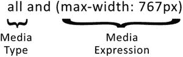

在本例中，媒体类型被设置为`all`，这意味着它适用于所有媒体类型。然后有一个 max-width 设置为`767px`的媒体表达式，因为您希望将目标指向额外的小设备(例如，移动电话)，在这种情况下，它被定义为小于`767px`。这里的理由是，许多可能被归类为小型设备的设备，如 iPad，其最小宽度为`768px`。这个媒体查询背后的逻辑是，对于所有设备，如果视口的宽度小于或等于`767px`，则应用 CSS 样式。

如果您只想将 CSS 应用于屏幕设备，您可以将媒体查询中使用的媒体类型更改为 screen。这一变化反映在这个更新的例子中: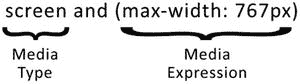

这个媒体查询的逻辑类似于上一个例子，但是，关键的区别是您已经将媒体类型更改为`screen`。因此，逻辑是，对于类型屏幕的所有设备，如果视口的宽度小于或等于`767px`，则 CSS 是活动的。

##### “非”逻辑运算符

如果您想将 CSS 应用于除屏幕之外的所有媒体类型，您可以利用`not`逻辑运算符。媒体查询中的 not 逻辑运算符告诉浏览器反转表达式的结果。对于屏幕示例，您可以简单地将 not 逻辑运算符添加到表达式的开头: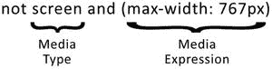

所以对于这个例子，逻辑是如果浏览器不是宽度小于等于`767px`的屏幕设备，那么样式表就会被激活。

##### “唯一”逻辑运算符

`only`逻辑运算符用于防止不支持媒体表达式的旧浏览器试图处理媒体查询。如果没有`only`操作符，旧的浏览器将读取媒体类型，但是，它将不能理解媒体表达式；因此，媒体表达式被忽略，样式被应用。

出现这种现象的原因是，在用于媒体查询之前，媒体属性最初用于媒体类型。尽管 CSS 规范已经扩展到包括 CSS3 中的媒体查询，但是您仍然需要支持使用旧规范的旧浏览器。使用`only`逻辑运算符的媒体查询只是在媒体类型运算符前加上。此示例更新了先前用于测试超小型设备的媒体查询: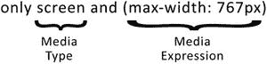

本例中媒体查询的逻辑与之前完全相同，但是，您现在添加了`only`逻辑运算符，这将防止此媒体查询中包装的样式在较旧的浏览器中被错误地应用。

##### 使用多个表达式

媒体查询真正强大的原因之一是能够一起使用多种媒体表达式。这意味着，如果你想针对小型设备，如平板电脑，而不影响额外的小型设备，你可以这样做，使用两种媒体表达方式，而不是一种。

要链接表达式，您需要在媒体表达式之间使用`and`关键字。本例使用最小宽度`768px`和最大宽度`1023px`来确定设备是否为小型设备: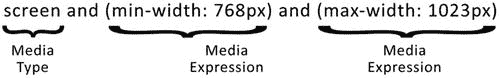

这个媒体查询的逻辑是，如果媒体类型是 screen，viewport 等于或大于`768px`，并且小于或等于`1023px`，那么样式表将被激活。

##### 链接媒体查询

到目前为止，示例只是使用了单独的媒体查询；但是，通过链接媒体查询并允许在多种情况下应用 CSS，您可以在任何查询返回 true 时应用 CSS。每个媒体查询可以具有其自己的媒体类型和其自己的媒体表达，这意味着单独的媒体查询可以针对不同的媒体特征、类型和状态。要使用多个媒体查询，只需在每个查询之间添加一个逗号来分隔它们，然后将对每个查询进行单独评估，以查看它们是否为真，如下例所示: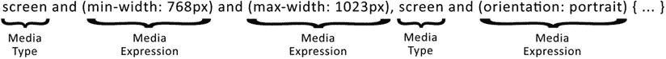

在本例中，有两个媒体查询。如果浏览器的宽度等于或大于`768px`并且小于或等于`1023px`，则第一个媒体查询将为真。如果设备的方向是纵向，则第二媒体查询将为真。现在，如果这两个媒体查询中的任何一个为真，那么样式将被激活。

您可能希望使用多个媒体查询的一个常见示例是针对在不同浏览器中以不同方式实现的功能。例如，当您使用最小分辨率表达式时，如以下代码所示:

`@media only screen and ( -webkit-min-device-pixel-ratio: 2 ),`

`only screen and ( -o-min-device-pixel-ratio: 2/1 ),`

`only screen and ( min--moz-device-pixel-ratio: 2 ),`

`only screen and ( min-device-pixel-ratio: 2 ),`

`only screen and ( min-resolution: 192dpi ),`

`only screen and ( min-resolution: 2dppx ) {`

`/* High resolution styles here */`

`}`

在 CSS3 媒体查询的早期，需要实现一种针对高像素密度设备的方法，这导致 WebKit 在其供应商前缀下实现`device-pixel-ratio`表达式。随着规范的成熟，正确的实现是使用“resolution”表达式；然而，为了支持这些旧的浏览器，您需要使用多个媒体查询。

## 在 CSS 中使用媒体查询

既然您已经探索了编写媒体查询的语法，那么是时候看看如何将它们应用到页面上了。这三种方法是:

Separate style sheets for each media query   Use @import in the main CSS file to load CSS files conditionally   Use the media queries inside CSS file  

### 单独的样式表

通常，在过去使用屏幕或打印样式表时，每种样式表都有一个样式表，其中包含适用于哪种媒体类型的规则。类似地，您可以通过媒体查询来有条件地启用和禁用样式表。为此，您可以在用于包含样式表的链接标签上使用 media 属性。这个属性与您之前在样式表中添加媒体类型规则时使用的属性相同。添加规则时，只需将其放入“媒体”属性，如下例所示:

`<link rel="stylesheet" media="screen and (min-width: 768px) and (max-width: 1023px)`

`" href="tablet.css" />`

在这个例子中，媒体查询用于检查用户是否在小型设备上，并且这被简单地添加到媒体属性中。

使用单独的样式表的好处是，它允许您更容易地划分代码。请记住，媒体查询中的所有样式表都被下载到用户的设备上，如果不需要，它们就不会被激活。这意味着，通过使用单独的样式表，可以增加向服务器发出的 HTTP 请求的数量。

### 使用@import

如果您想为每个媒体查询使用单独的样式表，但不想在 HTML 中定义它们，您可以使用 CSS @import 语法并应用媒体查询。@import 语法可以分为三个部分:

The @import declaration   The URL to CSS file to include   One or more media queries  

将这些放在一起，您最终会得到以下结果:

`@import url("tablet.css") screen and (min-width: 768px) and (max-width: 1023px);`

在本例中，您使用媒体查询来检查用户是否在小型设备上，并简单地将其添加到用于加载`tablet.css`文件的@import 语法中。

类似于在标签中使用链接到页面的单独样式表，通过@import 加载的样式表增加了 HTTP 请求的数量。然而，除此之外,@import 可以防止样式表被同时下载。

### 在 CSS 中使用媒体查询

您可以在站点的样式表中定义媒体查询，而不是将 CSS 分成单独的样式表。这允许您定义新的样式，并在条件为真时对现有样式应用覆盖，从而利用 CSS 的级联特性。

要在 CSS 文档中编写媒体查询，可以使用@media 语法。如何使用该语法的分类如下:

The `@media` declaration   One or more media expressions  

因此，`@media`语法的一个例子是:

`@media only screen and (min-width: 768px) and (max-width: 1023px){`

`/* Your styles. */`

`}`

尽管这只是一个简单的例子，但它向您展示了在 CSS 文件中包含媒体查询是多么容易。与添加到您的`<head>`中的`@import`和单独的文件不同，在主 CSS 文档中使用媒体查询与在主 CSS 文档中包含您的媒体类型具有相同的好处，这些好处是减少 HTTP 请求和减少阻塞。

## 移动优先与桌面优先

开发人员通常会以他们最舒服的方式编码——毕竟，人类是习惯性的动物，不管有些人怎么认为，开发人员也是人。因此，当响应式 web 设计出现时，最常见的方法是首先构建桌面站点，然后使用媒体查询使其适应移动应用程序；毕竟，他们的大部分用户仍然来自于桌面应用，开发人员已经习惯了为桌面开发。

这种方法被称为适度降级，其思想是，你应该首先创造尽可能好的体验，然后开始考虑浏览器功能下降时的降级。对于一个响应式网站来说，这意味着当视窗缩小时，网站会缩小，删除内容和功能。

然而，还有一种更适合响应式设计的方法，叫做渐进增强。渐进增强并不是一个新的想法；它是由 Steven Champeon 在 2003 年奥斯汀的西南偏南互动会议上首次提出的。在为 Webmonkey 写的后续文章中，Steven 说:

> Don't try to mix the representation into the tag that the lowest common denominator browser can't handle anyway, but strip it out. Make sure that only competent browsers will request it first. The more we know about what browsers support, the better it will be for us to set tags and styles. 3 

Steven 所说的是用最少的功能为浏览器建立你的网站，然后通过增加新的功能和内容逐步改进网站。如果您想将这种方法应用到一个响应式站点，您应该首先构建移动站点。然后，随着设备性能的提高，您可以增强这些站点。这种渐进式改进被称为移动优先响应设计。

当把优雅的退化与渐进的增强相比较时，乍一看，它们只是一枚硬币的两面。对于适度降级，我们只需从构建最好的网站开始，然后降低体验；对于渐进增强，我们从构建功能最差的浏览器的体验开始，然后渐进增强桌面的体验。

事实上，当我们首先构建桌面网站时，我们通常会在网站上添加许多功能。这些可能为桌面用户提供了很好的用户体验，但是，通常有一些功能不能很好地扩展。接下来的问题是如何让网站的这一部分在移动应用上工作。这正是卢克·乌鲁布莱夫斯基 2009 年在他的博客上提出的观点:

> Mobile devices require the software development team to focus only on the most important data and actions in the application. There is no room for irrelevant and unnecessary elements on a 320×480 pixel screen. You must prioritize. Therefore, when a team first designs a mobile device, the end result is an experience of focusing on the key tasks that users want to complete, without unnecessary detours and interface fragments that can be seen everywhere in today's desktop access websites. This is a good user experience, which is also good for enterprises. 4 

他的意思是，通过首先关注移动设备，我们可以为用户提供更好的体验。我们不会让不必要的功能塞满我们的界面，因为我们必须优先考虑对用户重要的功能。通过扩展浏览器的功能，移动应用还使我们能够添加额外的功能，例如，精确的地理位置信息和触摸事件。这意味着，虽然移动浏览器在某些方面可能有局限性，但它们提供了我们可以轻松利用的额外功能。

当我们对我们的移动构建感到满意时，我们就可以继续扩展视口并逐步增强站点，使用诸如特征检测之类的技术来允许我们在支持它们的浏览器上瞄准特征。

### 先看看如何建立一个移动网站

既然您已经了解了构建移动优先的响应型站点的好处及其背后的方法，那么让我们来看看如何构建移动优先的站点。

首先要开始使用移动设备，你需要把一些基本的 HTML 放在一起。在这个例子中，你将输入一些可用于博客文章的 HTML，包括标题、文章和相关文章的列表，如清单 3-1 所示。

清单 3-1。我们的移动第一个例子的 HTML

`<!DOCTYPE html>`

`<html>`

`<head>`

`<title>Mobile First</title>`

`<meta name="viewport" content="width=device-width">`

`<link rel="stylesheet" type="text/css" href="mobile-first.css">`

`</head>`

`<body>`

`<header>`

`<h1>Blog</h1>`

`</header>`

`
`

`<article>`

`<h2>Article title</h2>`

`
02/12/2013
`

`
Praesent commodo cursus magna, vel scelerisque nisl consectetur et. Cras justo odio, dapibus ac facilisis in, egestas eget quam. Vivamus sagittis lacus vel augue laoreet rutrum faucibus dolor auctor. Etiam porta sem malesuada magna mollis euismod. Cras mattis consectetur purus sit amet fermentum. Duis mollis, est non commodo luctus, nisi erat porttitor ligula, eget lacinia odio sem nec elit. Vestibulum id ligula porta felis euismod semper.
`

`</article>`

`<aside>`

`<h2>Related Articles</h2>`

`<nav>`

`<ul>`

`<li><a href="#">Article item 1</a></li>`

`<li><a href="#">Article item 2</a></li>`

`<li><a href="#">Article item 3</a></li>`

`</ul>`

`</nav>`

`</aside>`

`
`

`</body>`

`</html>`

如果你把它加载到你的浏览器中，你会得到一个简单的没有任何样式的单列页面，如图 3-1 所示。

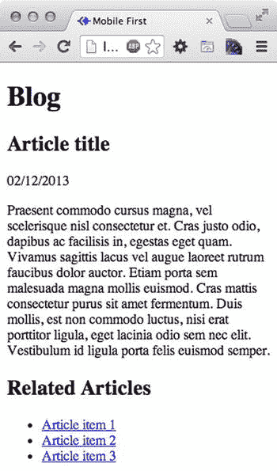

图 3-1。

Our mobile first example site before we have applied any styles

因为您首先构建移动设备，所以您将首先集中精力构建主 CSS 来设计页面样式。您将应用以下样式:

`body`: Both margin and padding set to 0px, the font size set to 14px, and the line height set to 18px   `header`: Add background color and padding   `h1`: Set the color to white   `aside` and `article`: add margin of 20px to both the left and right   `article`: add a border to separate the article from the related articles  

将这些放在一起后，它会看起来像是我为清单 3-2 编写的代码。

清单 3-2。我们的示例 mobile first 站点的基本 CSS

`body{`

`margin: 0;`

`padding: 0;`

`font-size: 14px;`

`line-height: 18px;`

`}`

`header{`

`background: #304480;`

`padding: 10px 20px;`

`}`

`h1{`

`color: #fff;`

`}`

`article, aside{`

`margin: 0 20px;`

`}`

`article{`

`border-bottom: 1px solid #304480;`

`}`

如果你看一看应用了这些额外样式的网站，你会发现你的网站在我们的超小型设备上运行得很好，如图 3-2 所示。

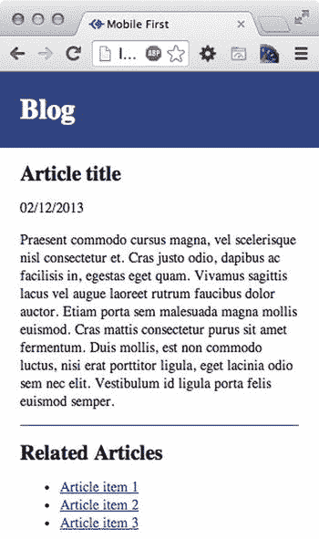

图 3-2。

The site, as it looks on browsers with a extra small viewport

然而，如果你只是简单地将浏览器拉伸到屏幕的宽度，网站看起来就不那么好了，如图 3-3 所示。

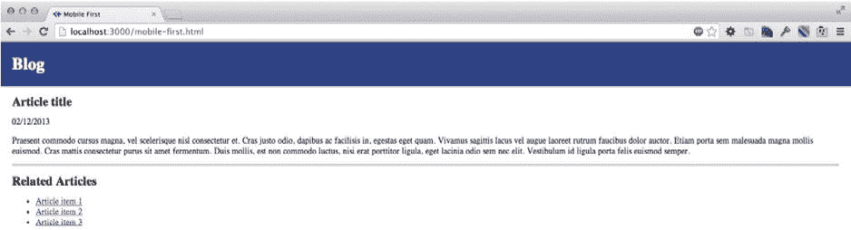

图 3-3。

Our mobile first site, shown on a larger viewport

单栏网站在移动设备上运行良好，但是在较大的视窗中，将相关文章列表显示为侧边栏并限制网站的宽度是有意义的。

当您从超小型设备视图增加站点的视口时，您会达到小型设备的宽度，例如平板电脑。在本例中，您将把 iPad 的最小宽度 768px 作为小型设备视图的基础，并将其用于媒体查询。因此，媒体查询的目标最小宽度为 768 像素，如清单 3-3 所示。

清单 3-3。我们的媒体查询针对我们的小型设备

`@media screen and (min-width: 768px){`

`header, .content{`

`width: 728px;`

`margin: 0 auto;`

`padding: 10px 20px;`

`}`

`article, aside{`

`float: left;`

`margin: 0px;`

`}`

`article{`

`width: 80%;`

`border-bottom: 0px;`

`}`

`aside{`

`width: 20%;`

`}`

`}`

因为你已经做了所有的移动来使站点在平板电脑上工作，你只需要增加页面的宽度来利用更大的视窗，代码如清单 3-4 所示。

清单 3-4。我们针对更大视窗的媒体查询

`@media screen and (min-width: 1024px){`

`header, .content{`

`width: 940px;`

`}`

`}`

现在，如果你在浏览器中查看这个，你会看到网站现在被设计成一个漂亮的两栏布局，相关文章显示在侧边栏中，如图 3-4 所示。

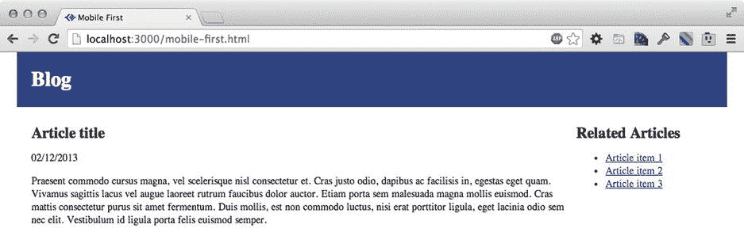

图 3-4。

Our completed site shown on a larger device viewport

在这个例子中，我们从移动优先的角度构建了一个简单的响应博客。我们最初构建了核心样式，然后随着浏览器视窗大小的增加，我们引入了新的媒体查询，以使我们的网站能够响应视窗的宽度，并利用增加的空间。

### 移动优先的警告

使用移动优先的方法建立网站有一些警告，最大的警告是浏览器对媒体查询的支持程度。总的来说，浏览器对媒体查询的支持是好的，然而，最早支持媒体查询的 Internet Explorer 版本是 Internet Explorer 9。这意味着通过移动优先的方法，Internet Explorer 8 和更早版本将接收您的移动站点。您可能很乐意保留它，或者您可以选择添加一个名为`Respond.js`的 polyfill，这将为 Internet Explorer 8 提供有限的媒体查询支持。

在手机的限制下建立一个网站也是一个挑战；如果你像我一样，在职业生涯中使用鼠标事件(如悬停和点击)来积累经验，你会发现它们在较小的触摸屏设备上消失了，取而代之的是手指点击和滑动。

从移动优先的角度出发，我们应该从一开始就考虑用户使用的输入类型，旨在支持用户与网站交互的各种方式。我们在正确支持多种输入类型时可能会发现的一个问题是，对于某些动作，一些浏览器试图预测我们希望我们的网站如何工作。

一个例子是鼠标悬停交互；在一些触摸屏设备上，浏览器已经实现了悬停事件，以便可以切换它，当你第一次点击元素时，悬停状态会打开，第二次点击时会关闭。这样做的目的是允许用户访问原本只能在悬停状态下访问的内容(并且您不能在移动设备上悬停)。这本身增加了额外的挑战，因为具有悬停状态的区域也可能是一个链接，这意味着当用户点击它时，它应该已经有一个动作。不幸的是，媒体查询不能确定设备是否是触摸设备，并且特征检测技术也不能准确地确定用户是否正在使用触摸设备。因此，在构建网站时，我们需要考虑处理这些交互的新方法。

## 瞄准高像素密度显示器

移动设备具有高像素密度变得越来越普遍。对于最终用户来说，高像素密度显示器的优势显而易见，可以提供更清晰的文本和图像。受益于这场显示技术革命的不仅仅是移动设备；笔记本电脑制造商也在他们的高端电脑上提供更高质量的显示器。

考虑到这一点，在构建网站时，您需要考虑如何利用显示技术的这一变化，谢天谢地，浏览器没有让我们束手无策，因为媒体查询支持使用分辨率媒体功能测试显示器的像素密度。

当使用媒体查询来定位具有高像素密度显示的设备时，您可以使用媒体查询分辨率功能来检查最低屏幕分辨率。此功能支持三种不同类型的设备:

`dpi`: dots per CSS inch   `dpcm`: dots per CSS centimeter   `dppx`: dots per pixel unit, 1dppx = 96dpi  

尽管这些都是受支持的单元，但浏览器供应商建议开发人员使用 dppx。如果你正在使用`dpi` :

> Consider using "dppx" instead of "dpi", because "dpi" in CSS refers to dots per CSS inch, not dots per physical inch, so it does not correspond to the actual "dpi" of the screen. In the media query expression: print, not all, (-WebKit-min-device-pixel-ratio: 1.25), (min-resolution: 120 dpi) [`https://github.com/h5bp/html5-boilerplate/issues/1474`](https://github.com/h5bp/html5-boilerplate/issues/1474)

这个警告是在使用一个流行的开源模板 HTML5 boilerplate 时显示的。正如警告所指出的，dpi 是每 CSS 英寸的点数，这可能会给开发人员造成混淆，他们不知道媒体查询中的 dpi 不是屏幕的实际 dpi。

在我展示一些如何实现针对高像素密度显示器的媒体查询的例子之前，您需要了解浏览器支持。如前所述，CSS3 仍然是一个草案标准，这意味着每种浏览器都有自己的厂商前缀实现。此外，媒体查询分辨率的一些早期实现使用设备的物理分辨率，而不是其 CSS 分辨率。此外，尽管您应该使用 dppx 作为解析查询的单位，但它是在 dpi 之后添加到规范中的，因此为了与没有实现`dppx`的浏览器兼容，您还应该包括`dpi`。这意味着您在编写媒体查询时需要考虑所有这些因素，这增加了读取媒体查询时的复杂性。为了覆盖尽可能多的浏览器，可以使用以下媒体查询:

`@media only screen and (-webkit-min-device-pixel-ratio: 2),`

`only screen and (-o-min-device-pixel-ratio: 2/1),`

`only screen and (min--moz-device-pixel-ratio: 2),`

`only screen and (min-device-pixel-ratio: 2),`

`only screen and (min-resolution: 192dpi),`

`only screen and (min-resolution: 2dppx) {`

`/* High resolution styles here */`

`}`

为了正确地了解我们如何处理这些高像素密度设备，让我们看一个简单的例子，看看一个徽标在没有任何媒体查询的情况下会是什么样子，然后编写媒体查询以在其位置显示更高分辨率的图像。

首先，让我们编写一些简单的 HTML，使用图像替换技术在页面上的 H1 中添加一个徽标。我们的 HTML 如清单 3-5 所示。

清单 3-5。高分辨率图像示例的 HTML

`<!DOCTYPE html>`

`<html>`

`<head>`

`<title>High Res Image Example</title>`

`<meta name="viewport" content="width=device-width">`

`<link rel="stylesheet" type="text/css" href="high-res-images.css">`

`</head>`

`<body>`

`<h1>logo</h1>`

`</body>`

`</html>`

然后你需要创建 CSS。现在，您只需创建 CSS 来显示标准分辨率的徽标。让我们在徽标周围添加一个边框，以清楚地显示图像的大小。

清单 3-6。我们的标志的基本 CSS，使用正常的低分辨率图像

`h1{`

`width: 100px;`

`height: 100px;`

`text-indent: 100%;`

`white-space: nowrap;`

`overflow: hidden;`

`background-image: url("low-res-image.png");`

`border: 3px solid #d3000c;`

`margin: 0px;`

`}`

现在，当你在具有高像素密度显示器的设备上查看时，你可以看到图像的放大导致了一些模糊，如图 3-5 所示。

图 3-5。

Our lower resolution logo shown on iOS

我们现在可以看看如何添加媒体查询来处理加载更高分辨率版本的徽标。

要加载图像的更高质量版本，请使用您之前使用的查询，然后添加一些 CSS 来将背景图像更改为图像的更高分辨率版本。您还需要将背景图像缩放到原始图像的大小，以便它适合相同的尺寸(清单 3-7)。

清单 3-7。CSS 媒体查询以在高像素密度显示器上显示更高分辨率的徽标

`@media only screen and (-webkit-min-device-pixel-ratio: 2),`

`only screen and (-o-min-device-pixel-ratio: 2/1),`

`only screen and (min--moz-device-pixel-ratio: 2),`

`only screen and (min-device-pixel-ratio: 2),`

`only screen and (min-resolution: 192dpi),`

`only screen and (min-resolution: 2dppx) {`

`h1{`

`background-image: url("high-res-image.png");`

`background-size: 100px 100px;`

`}`

`}`

现在，如果您在高像素密度设备上进行测试，您将会看到徽标图像显示得更加清晰，如图 3-6 所示。

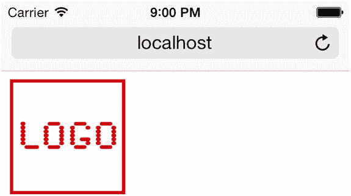

图 3-6。

Our high resolution logo shown on iOS

这只是一个简单的例子，说明如何使用媒体查询来改善网站在高像素密度设备上的显示。

## 摘要

有各种各样的设备可供使用，建立一个能够支持所有这些设备的网站是非常具有挑战性的。开发人员需要支持各种不同类型的设备，从电视到音频合成器，正如本章所讨论的，自 CSS2.1 规范以来，我们现在有能力使用媒体类型来支持这些设备。媒体类型限制了开发人员直接针对这些不同的类型，然而，现在各种各样的现代设备都使用屏幕媒体类型，这意味着尽管对开发人员来说它们也应该适合这些其他类别(如电视或手持设备)是合乎逻辑的，但事实并非如此。

这就是媒体提问的地方。与媒体类型相比，它们允许开发人员更好地控制目标样式。媒体查询允许开发人员针对设备的各种功能，包括屏幕宽度、屏幕高度和分辨率。这种细粒度的控制意味着我们可以更好地针对各种可用的设备。

媒体查询构成了响应式 web 设计的基础，因此开发人员很好地理解如何使用它们来优化网站以在各种设备上工作是非常重要的。展望未来，媒体查询将使我们能够支持越来越多的设备，随着新设备类别的不断出现，通过使用媒体查询，我们已经能够很好地支持它们。

在我们的下一章中，你将学习网页设计中通常使用的不同类型的布局，重点关注流体设计的工作原理，以及我们如何将流体设计作为一个响应式网站的一部分来实现。

Footnotes 1

[`http://www.phpied.com/5-years-later-print-css-still-sucks/`见](http://www.phpied.com/5-years-later-print-css-still-sucks/)。

  2

W3C 媒体类型规范， [`http://www.w3.org/TR/CSS2/media.html`](http://www.w3.org/TR/CSS2/media.html) 。

  3

steven champeon，Webmonkey .我是 steven champeon，webmonkey . [`http://www.hesketh.com/thought-leadership/our-publications/progressive-enhancement-and-future-web-design`](http://www.hesketh.com/thought-leadership/our-publications/progressive-enhancement-and-future-web-design) 。

  4

卢克·乌鲁布莱夫斯基，[`http://www.lukew.com/ff/entry.asp?933`](http://www.lukew.com/ff/entry.asp?933)`=`2009 年 11 月 3 日。