# 四、使用流体布局

已经研究了媒体查询的使用，本章将研究如何将这些与 CSS3 的其他方面结合起来，为您的用户构建更好的体验，这种体验既灵活又能够在更广泛的设备上工作。

本章将探讨:

The different types of layouts.   Principles when working with a fluid design.   Building a fluid design using a CSS grid.  

## 布局类型

谈到页面的结构布局，有多种类型的布局可供选择。三种最流行的布局类型是固定宽度布局、流动布局和弹性布局，每种布局都有自己的优点和缺点。

当决定使用哪种类型的布局时，考虑用户的体验是很重要的。对于一个响应式站点，你的布局选择需要在大量设备上都能很好地工作。由于使用的用户数量庞大，因此选择一种能够为大多数用户提供最佳体验的布局类型非常重要。你还需要考虑到，从最小的智能手机到客厅里的 85 英寸电视，任何东西都有可能访问你的网站。

让我们来看看不同的布局风格，并考虑每种风格的优点和缺点，目的是学习如何从每种风格中选择最佳的部分，以便为网站用户建立良好的体验。

### 固定宽度布局

顾名思义，固定宽度布局主要是用具有固定宽度的包装器构建的。然后将其定位在屏幕上，通常位于浏览器视口的中心。无论用于访问网站的屏幕大小如何，固定宽度布局将保持其固定宽度。

从历史上看，当开发人员构建网站时，他们是从一个有固定宽度的设计开始构建的。通常，设计者会将站点设计成`960px`宽，因为这是使用网格布局的理想宽度，因为这个数字可以被 3、4、5、6、8、10、12 和 15 整除。当开发人员开始构建这些设计时，他们会在`960px`宽的地方构建站点，努力使构建尽可能像素完美。这里的想法是，他们可以让设计在浏览器中看起来像平面设计一样精彩。图 4-1 显示了一个典型的三列固定布局的例子，有两个侧栏和一个主要内容区。

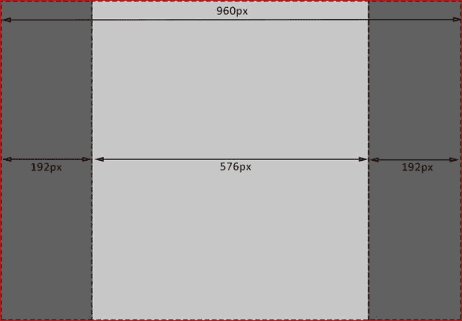

图 4-1。

An example of a 960px wide, three-column fixed layout

如果你看看一个典型的固定宽度布局是如何组成的，你通常会有一个固定宽度为`960px`的包装器，在这个包装器里面你会有你的网站内容，通常有以像素定义的宽度。在图 4-1 的例子中，有一个宽度为`576px`的主要内容区域，两侧有两个`192px`列。

固定宽度构建仍然非常受欢迎，当您考虑到创建内容(包括完全符合设计的图像)的能力时，就很容易理解为什么了。图 4-2 展示了三星固定宽度网站的当前示例。

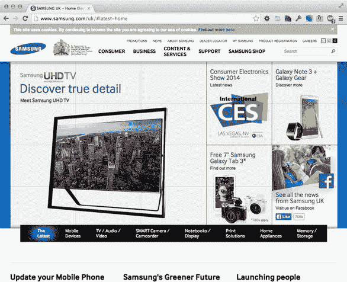

图 4-2。

The Samsung web site is a good example of a fixed layout

三星网站被构建为`960px`宽，使该网站能够针对各种流行的视窗。尽管没有响应，该网站仍然可以在移动设备上使用；它最初加载全屏，整个网站可见，然后，为了与网站交互，用户能够利用浏览器内置的捏、拉和双击用户交互来缩放和导航内容。虽然这是可用的，但它并没有提供我们在移动设备上期望的奇妙的用户体验。

如果你在 iPhone 上的 Mobile Safari 中查看三星网站，你会看到如图 4-3 所示的图像。

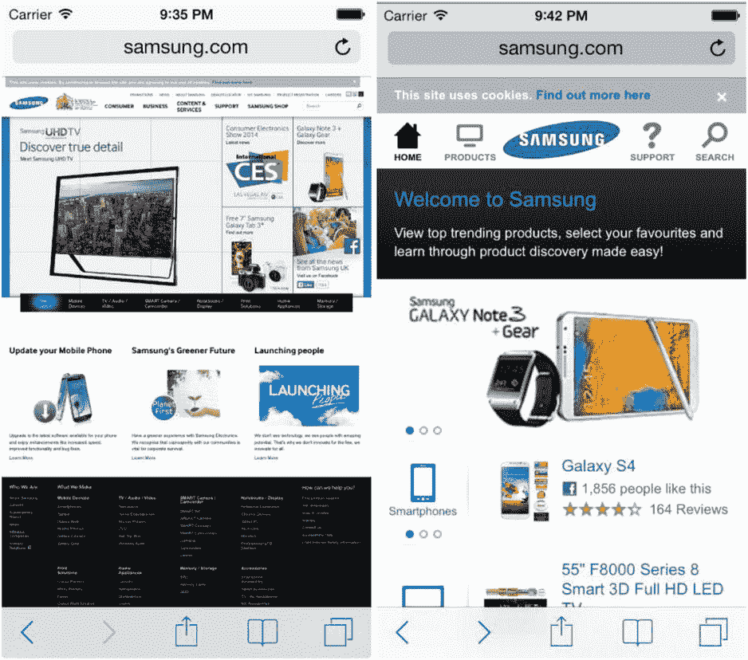

图 4-3。

Samsung desktop site (left) vs. Samsung mobile site (right)

三星确实提供了特定的移动网站，如图 4-3 所示，然而，它并不与桌面网站共享相同的内容。这意味着用户最终仍然可以在他们的移动设备上使用桌面站点来访问通过其他方式无法访问的内容。

固定宽度设计的一个主要问题是，你在判断你的站点应该设计和建造到什么宽度。做出这种决定的局限性在于要支持的浏览器宽度范围很大。这样做的结果是，在小于所选固定宽度的浏览器窗口上，你会得到水平滚动，而在较大的浏览器窗口上，你的站点两侧有多余的空间可以得到更好的利用。

当苹果在 2007 年推出 iPhone 时，大多数网站都是固定宽度的，因此开发者试图通过默认缩小网站来弥补这一点(按照三星的说法)，这意味着用户可以看到网站的整个宽度，尽管对他们的设备来说太大了。虽然这比仅仅看到网站的一角提供了更好的体验，但浏览一个大型网站仍然会令人沮丧。

使用固定宽度的设计不一定是一个坏的决定，重要的是要考虑你的网站的用途和目标受众。固定宽度的场地适用于希望在所有视口中保持相同布局和比例的场地。

### 弹性布局

弹性布局不以像素定义宽度，而是以 ems 度量。em 单位是字体大小的倍数，所以如果你设置你的字体大小为`16px`，那么`2em`的宽度将等于`32px`。这意味着，如果用户在查看网站时更改字体大小，网站的布局也将随着字体大小的增加或减少而成比例地改变。

弹性布局给了开发人员更多的控制，因为当用户在浏览器中调整文本大小时，设计比例保持不变。这意味着，如果用户需要增加你的网站上使用的字体大小，他们在你的网站上获得的体验与用户以原始字体大小查看网站没有什么不同。站点元素的大小与字体大小成比例。这意味着弹性布局在使开发者确保他们的站点对所有用户都是可访问的方面非常有效。

如果您采用原始的固定宽度网站设计，使用 16px 的基本字体大小，您可以通过将每个像素列宽除以字体大小(在本例中为 16)来轻松地将布局转换为使用 em 而不是像素。图 4-4 显示了图 4-1 中使用的相同布局，用于转换为弹性布局的固定布局示例。

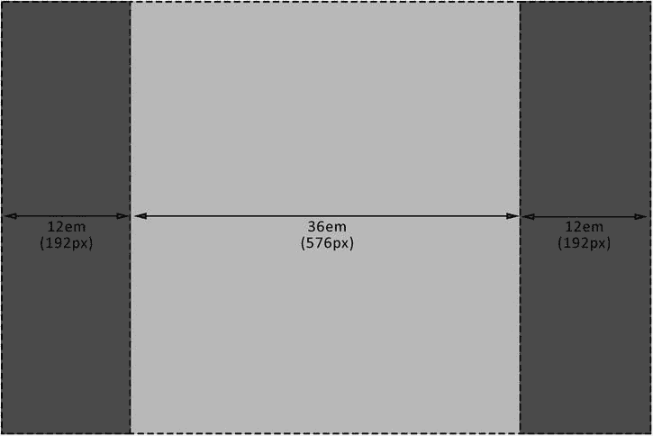

图 4-4。

An example of a 960px wide, three-column elastic layout with em conversion

该示例现在使用 ems 而不是像素来定义列宽。从像素到 ems 的计算非常容易执行:

像素宽度/基本字体大小= em 宽度

使用这个简单的公式，您可以很容易地计算出 ems 中元素的宽度。在图 4-4 中，您可以看到如何通过将像素宽度代入计算中来计算元素宽度:

576 / 16 = 36em

192 / 16 = 12em

重要的是要知道，ems 可以有一个小数值，所以如果您的计算没有得到一个整数，这不是一个问题。

使用弹性布局的一个例子是北爱尔兰社区档案馆关于阿尔斯特种植园的微型网站，如图 4-5 所示。 1

图 4-5。

The Plantation site is a good example of an elastic layout

这个网站使用 ems 来定义外部包装的宽度和布局的列。如果增加了基本字体大小，整个网站就会调整大小以适应更大的文本，如图 4-6 所示。

图 4-6。

The Plantation site after increasing the base font size

弹性布局最初的问题之一是，因为站点的宽度是基于基本字体大小的，如果用户将字体大小增加到某一点以上，站点在视口中会变得非常大，可能会导致浏览器出现水平滚动条。

弹性布局的另一个问题是，它们本质上仍然是一种固定宽度的布局，我的意思是弹性是基于基本字体大小的，所以除非用户改变字体大小，否则网站将保持开发者想要的基本宽度。这意味着，虽然弹性布局提供了比基于像素的固定布局更易访问的方法，但是布局仍然看起来在每个断点处都咬合到位，因为应用了每个媒体查询内的 CSS 因此，它们之间没有流动性，因为网站适应不同的大小。

弹性布局不太流行的原因之一是因为在 ems 中必须计算宽度所带来的困难。在查看基本字体大小之前，不清楚`36em`的宽度是多少像素。基本字体大小为`16px`，宽度为`576px`；然而，通过简单地改变基本字体大小为`14px`，宽度将减少到`504px`。不得不执行这个(虽然简单)计算给开发人员增加了一个额外的步骤。

你可能面临的另一个问题是`ems`是相对于父节点计算的；因此，如果父元素定义了不同于正文的字体大小，您可能会发现元素的宽度不是您所期望的。这是因为您可能已经根据正文的字体大小计算了宽度；要解决这个问题，只需根据父元素的字体大小重新计算即可。为了完全避免这个问题，一个选择是对字体大小使用 rem 而不是 em，这意味着所有的字体大小都相对于基本字体大小，而不管父元素的字体大小，警告是 rem 在诸如 Internet Explorer 8 和更早版本的传统浏览器中不工作。

### 流畅的布局

流体布局也称为液体布局或相对布局，其宽度根据用户的视口而变化。与固定布局不同，在固定布局中，宽度以像素为单位定义，相反，您可以将宽度定义为百分比，其中百分比引用其在视口中的部分，如图 4-7 所示。

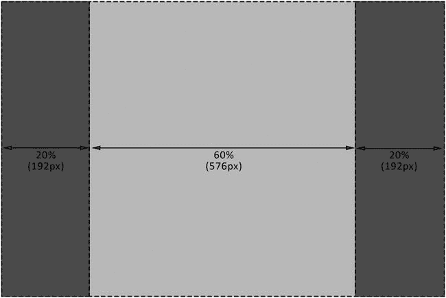

图 4-7。

An example of a fluid web site, with browser currently open at 960px wide

如果你以固定宽度布局的图 4-1 中的例子为例，将尺寸转换成百分比，你将有两列宽度为 20 %,一列宽度为 60%。浏览器视口在`960px`时，等效像素值与固定示例中的像素值相同(括号中显示的像素)，如图 4-8 所示。

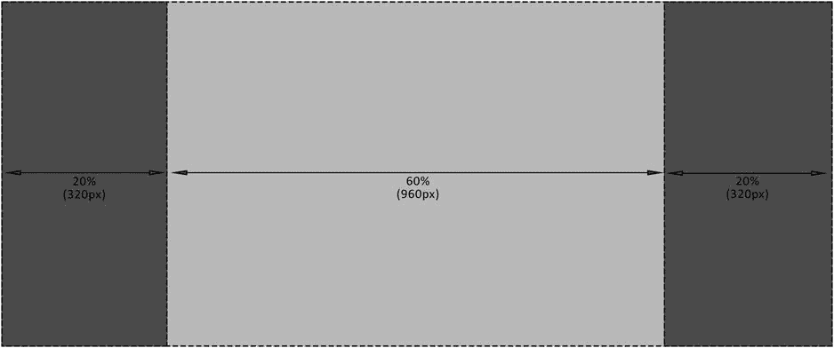

图 4-8。

An example of a fluid web site, with the browser open at 1,600px wide

如果您随后要调整浏览器的大小，使视窗宽度为`1,600px`，网站会自然地放大到浏览器的全宽。较小的列现在的宽度为`320px`，较大的列的宽度为`960px`。这样做的好处是内容会自然地填充页面，潜在地放大任何图像并使文本流动以填充可用空间。

雅虎！最近重新设计了 Flickr 网站，使用了一种流体布局方法(如图 4-9 所示)，利用额外的可用空间来增加图像的大小，并根据屏幕大小，增加每行的图像数量。这样做的好处是网站的用户可以更快地浏览更多的图片，并且更加关注网站。

图 4-9。

The Flickr web site is a good example of a fluid web site

如果您要调整浏览器窗口的大小，Flickr 站点会随着浏览器一起缩放，从而更好地利用可用空间。图像要么增加尺寸，要么允许在一行中显示更多，利用用户的观看空间，并最大限度地增加他们在任何给定时间能够观看的内容。你可以在图 4-10 中看到 Flickr 网站的全景图。

图 4-10。

The Flickr web site when viewed on a wider screen

使用流体布局对 Flickr 的好处是显而易见的；图像可以填满所有可用的空间，允许用户适当地欣赏照片。用户体验的改善也可以通过网站参与度的增加来衡量。虽然雅虎！没有公布任何确切的数字，一个名叫托马斯·霍克斯 2 的 Flickr 用户自己做了一些研究。在重新设计启动后的六天内，有 8000 万张新照片上传到网站，而在重新设计前的六天，用户仅上传了 4700 万张照片。

流畅的布局不仅有利于像 Flickr 这样只有图片的网站，也有利于平铺内容的网站。Pinterest 就是一个例子，虽然它也非常注重图片，但也显示其他内容。对于 Pinterest，用户经常会浏览他们感兴趣的版块，寻找吸引他们注意力的东西，通过使用流畅的布局，Pinterest 能够显示用户当时能够查看的最大数量的内容，让他们更快地找到他们想要的东西。Pinterest 的流体宽度、平铺界面如图 4-11 所示。

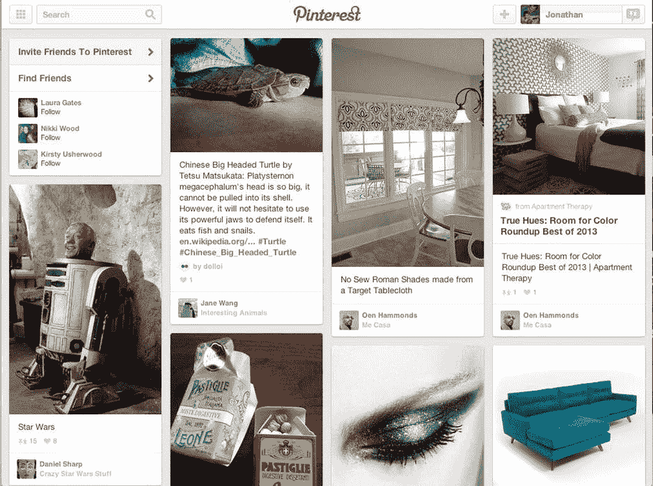

图 4-11。

The tiled interface of Pinterest benefits from fluid design to show more content

使用流体布局的一个好处是，它可以更加用户友好，因为它可以根据用户的设备进行调整。流体布局可以利用可用空间，让内容填满所有可用空间，而不是有多余的空白空间，在较大的设备上，它允许内容间隔更大，有额外的呼吸空间。

尽管流动布局非常强大，但它们也有一些缺点，其中最重要的是它们会导致内容呈现方式的问题。由于流畅的布局可以在任何浏览器宽度下查看，您可能会发现图像的外观存在问题。虽然可以随着浏览器的大小调整来缩放图片，但重要的是要知道有些图片的缩放效果不好。包含焦点的图像会受到影响，因为缩小它们不仅会失去效果，还会使焦点太小。同样，低分辨率的图片在放大时，质量会显著下降。

除了内容呈现方面的问题之外，fluid width 网站可能还会面临一些交互功能方面的问题。网站通常使用 JavaScript 来增强用户体验，例如，显示等高的列。当用户调整浏览器大小时，问题就来了；文本重排，然后列变得太高或太短。因此，JavaScript 需要在调整大小时重新计算高度。

### 为什么要在响应式设计中使用流体布局

探讨了固定布局、流动布局和弹性布局之后，很重要的一点是要很好地理解每种方法的优缺点。然而，我还没有真正讨论这一切与响应式设计的关系。

在第三章中，我解释了如何使用媒体查询使你的网站适应不同的视窗。这样做的问题是，无论是固定布局还是弹性布局，它们都会在适应不同屏幕尺寸的两种或更多种不同布局之间切换。它们不是对各种不同的设备做出反应，而是适应于在几种不同的普通屏幕尺寸上工作。

但是设备不再符合几种不同的普通屏幕尺寸；相反，开发人员现在面对的浏览器具有任何尺寸的视窗，可以在从 85 英寸电视到 3.5 英寸手机屏幕的设备上观看。开发人员必须有这样的心态，无论如何都希望他们的网站看起来很棒，而不仅仅是在几个选择的屏幕尺寸上。如果用户要调整浏览器的大小，你会希望调整平滑流畅，布局在任何给定的分辨率下都能工作。

当考虑选择布局样式时，您应该确保您熟悉可用的替代选项，这就是为什么我在前面的部分中介绍了优点和缺点。在构建网站时，你应该对你选择的布局风格感到满意，并根据你的需要进行调整，而不是受它们的限制。也就是说，响应式设计确实需要一个流畅的布局，以便在最大范围的设备上提供最佳的用户体验，同时在不同的视窗大小之间保持最小的中断。这并不意味着你不能有断点，这导致布局捕捉改变它，以更好地利用可用的屏幕空间。事实上，这是受到鼓励的；你会希望能够以最好的方式利用你现有的空间。

## 处理流体设计时的原则

构建流体设计可以为响应式设计带来多种益处；然而，有一些重要的原则要记住，以确保您的网站保持可用，无论视窗的大小。

您应该努力遵循的主要原则是:

Do not use fixed heights.   Do not necessitate horizontal scroll bars.   Think about how your images look at different sizes.   Think about wrapping content.   Think about spacing.   Think about the length of your lines of text.  

让我们更详细地探讨这些问题，看看解决您可能遇到的问题的潜在方法。

### 不要使用固定高度

如果您习惯于构建固定的布局，您很可能会遇到这样的问题:您已经为元素定义了固定的高度，但是当内容发生变化时，该高度或者有多余的间距，或者内容溢出到定义的高度之外。

随着流体设计带来的可变宽度，这个问题变得更加普遍，因为内容换行的方式会根据视口的大小而改变，所以在 CSS 中设置固定的高度变得不切实际。

不幸的是，有时在相同的栏中显示内容是设计的一部分，每个栏都有自己的背景颜色。如果不在 CSS 中定义高度，这可能很难实现；因此，要么在 CSS 中创建假列，要么使用 JavaScript 动态设置列的高度。

#### 使用 CSS 创建假列

简单地使用一些 CSS 就可以创建列的效果。

对于两列布局，您知道一列总是比另一列高，只需将父元素的背景色设置为较短列的背景色。然后，通过设置 longer column 元素的背景色，您已经创建了具有两列的效果。让我们快速看一下处理这个问题的代码，从一些简单的 HTML 开始:

`
`

`<aside class="col">`

`Sidebar`

`</aside>`

`
`

`Main Content Area`

`
`

`
`

如上所述，您将把列的背景应用到列容器和主内容列。为了实现列的效果，您还可以将列的宽度定义为 50 %,向左浮动，使它们彼此相邻:

`.col-container{`

`background: #000;`

`color: #fff;`

`}`

`.col-container:after{`

`content: ' ';`

`clear: both;`

`display: block;`

`}`

`.col{`

`float: left;`

`width: 50%;`

`}`

`.col.main{`

`background: #999;`

`}`

值得注意的是，您已经向列容器添加了一个伪元素来清除浮动的列。这是必要的，以便浏览器计算列容器本身的高度。如果您的站点已经为此使用了 clearfix 类，那么您可以选择将它添加到您的列容器中，而不是添加一个特定于该元素的伪元素。

如果你在你的浏览器中签出这个，布局有两列和预期的一样高，如图 4-12 所示。

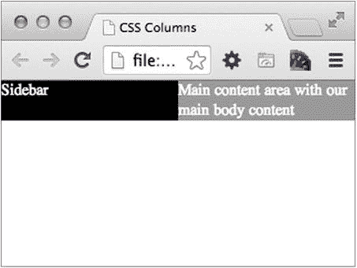

图 4-12。

Two columns with equal height using CSS

虽然这很简单，但是这种两列的方法适用于所有的浏览器，并且非常有效，需要注意的是这种方法只适用于两列，并且需要知道哪一列更高。

如果有两列以上，可以选择在父级上使用 CSS3 渐变来达到相同的效果。但是，请记住，这种方法只能在 Internet Explorer 10 或更高版本中使用。扩展上面的示例，您可以在 HTML 中添加一个额外的列:

`
`

`<aside class="col">`

`Sidebar`

`</aside>`

`
`

`Main content area with our main body content`

`
`

`
`

`Related content`

`</aside>`

`
`

然后，您可以简单地修改现有的 CSS，因为您不再需要向主列添加背景。因此，您可以删除 CSS 的这一部分。然后将 CSS3 背景渐变添加到列容器中。在下面的示例中，您只包括 W3C CSS3 属性，对于实时代码来说，添加带前缀的版本以确保浏览器支持是很重要的:

`.col-container{`

`background: linear-gradient(to right, #000000 0%,#000000 33%,#a0a0a0 33%,#a0a0a0 66%,#a0a0a0 66%,#707070 66%);`

`color: #fff;`

`}`

`.col-container:after{`

`content: ' ';`

`clear: both;`

`display: block;`

`}`

`.col{`

`float: left;`

`width: 33.3%;`

`}`

当在浏览器中查看运行结果时，新列以正确的背景颜色出现，如图 4-13 所示。

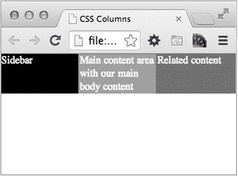

图 4-13。

Three columns with equal height using CSS

如果您需要支持旧版本的 Internet Explorer，或者您想要支持动态数量的列，您可能应该考虑使用 JavaScript。

#### 使用 JavaScript

已经了解了如何使用 CSS 创建仿列效果，让我们看看如何使用 JavaScript 创建等高的列。JavaScript 方法并不试图伪造列的外观，而是让所有的列都具有相同的高度。

使用 JavaScript 创建等高列的方法是遍历每个列，找到最高的列，然后将所有列设置为最高列的高度。

为了演示这一点，让我们看一个简单的例子，从一些 HTML 开始:

`
`

`<aside class="col nav">`

`Sidebar`

`</aside>`

`
`

`Main content area with our main body content`

`
`

`
`

`Related content`

`</aside>`

`
`

然后，您需要设置列的样式，使它们具有不同的背景颜色:

`.col-container{`

`color: #fff;`

`}`

`.col-container:after{`

`content: ' ';`

`clear: both;`

`display: block;`

`}`

`.col{`

`float: left;`

`width: 33.3%;`

`}`

`.col.nav{`

`background: #aaa;`

`}`

`.col.main{`

`background: #000;`

`}`

`.col.related{`

`background: #999;`

`}`

有了这个地方，现在所有的列都很好，每个都有独特的背景颜色；然而，柱子的高度仍然不相等。你可以在图 4-14 中看到它的样子。

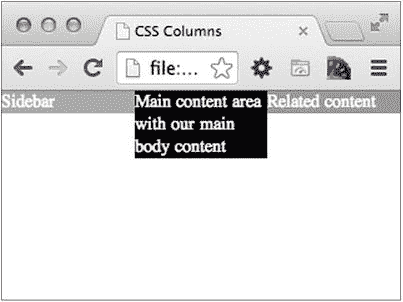

图 4-14。

Three columns with unequal height before adding the JavaScript

为了使列相等，您需要添加一些 JavaScript。在下面的例子中，我使用了`document.getElementsByClassName`，它只受 Internet Explorer 9 或更高版本的支持。但是，您可以使用聚合填充来支持此方法，此要点`code` : [`https://gist.github.com/eikes/2299607`](https://gist.github.com/eikes/2299607) 中提供了一个这样的聚合填充。

``

equal column JavaScript 简单地遍历所有列，找到最高的元素。然后，它再次遍历元素来定义高度。你可以看到 JavaScript 在图 4-15 中工作。

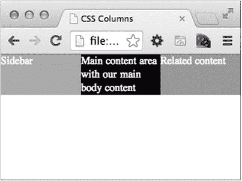

图 4-15。

Three columns with equal height after adding the JavaScript

对于固定的、非响应性的设计，在页面加载后简单地运行这个 JavaScript 就足够了。然而，对于一个流畅的、响应性的设计，用户可以调整浏览器的大小，因此 JavaScript 需要能够在调整大小时更新列的高度:

``

有了这个修改后的 JavaScript，您已经将我们的`equalColumns` JavaScript 包装成一个函数，并对其进行了更新，以便它在重新计算高度之前重置所有列的高度。然后，当页面加载并将其作为事件侦听器附加到 resize 事件时，运行该方法。现在，如果用户调整浏览器的大小，列的高度也会随之调整。

### 不需要水平滚动条

当使用一个网站时，内容通常会沿着页面向下流动，因此能够双向滚动会损害用户的体验。

有一个创建水平布局的用例；然而，在这种情况下，你应该避免使用垂直滚动条，专注于提供水平体验。你可能想要建立一个水平布局的例子是一个艺术家或摄影师的在线作品集，比如 C. L. Holloway 的作品集网站，他通过允许用户水平滚动创建了一个类似画廊的体验。 3 需要注意的是，尽管这个网站的开发者选择了使用水平滚动条，但该网站选择了避免垂直滚动条，除非视口太浅而无法显示所有内容(大约在`610px`，这非常适合最流行的垂直屏幕分辨率)。

### 想想你的图片在不同尺寸下看起来是什么样的

当使用流体设计在网站上实现图像时，仔细观察图像在不同尺寸下的外观是很重要的。你需要考虑如何缩放你的图片，这取决于你是想把图片作为标签放在你的页面上，还是想把图片作为背景图片。

#### 缩放内嵌图像

要缩放内嵌图像，只需对图像应用宽度。如果您的站点是响应式的，您实际上并不知道将哪个宽度大小应用于图像，因此您可以将`max-width`属性设置为 100 %,而不是定义绝对宽度，如以下代码所示:

`img {`

`max-width:100%`

`}`

有了这个，如果一个图像比它的容器大，它将缩小；但是，如果图像比容器小，它将保持原来的大小。

#### 缩放背景图像

如果要缩放背景图像，可以使用 CSS3 `background-size`属性。这可以采用三个不同的值:覆盖、包含和宽度/高度值。

`.image{`

`background-size:80px 60px;`

`}`

`background-size`的问题在于，虽然你可以使用相对宽度来设置元素的宽度，但是对于元素的高度来说，这并不容易。

第一步是定义将包含背景图像的`div`:

`

`

接下来你需要定义 CSS。首先，您将定义图像容器。因为您希望宽度是相对的，所以您将使用一个百分比值，在本例中为`width: 100%`。图像的高度需要与图像的宽度成比例；使用 height 属性无法实现这一点，因为高度不能是相对的。相反，你可以使用填充。因为百分比填充是基于元素的宽度，所以您可以使用它来定义高度。不幸的是，这是有点复杂的地方，因为你需要设置填充底部，以便它保持图像的正确纵横比。

有了正确的宽度和高度，您现在只需添加图像作为背景图像，并设置`background-size`使其缩放到元素的全宽和全高:

`.image{`

`width: 100%;`

`position: relative;`

`padding-bottom: 125%;`

`background: url(scalableimage.jpg) 0 0 no-repeat;`

`background-size: 100% 100%;`

`}`

有了这个，你可以在浏览器中查看图像，看到它现在与页面的宽度成比例。图 4-16 显示了它在浏览器中的样子。

图 4-16。

Scaling a background image with CSS

### 考虑包装内容

当构建一个流动的站点时，元素不断变小并不总是有意义的，因为最终内容会变得不稳定和不可读。相反，随着视口变大，将内容块堆叠在一起是没有意义的。这两种情况下的选项都是考虑内容如何在不同的视口换行。

这种情况的一个例子是，在网站的一侧有一个包含相关内容的侧边栏。如果侧边栏占页面宽度的 25 %,而视窗只有 320 像素宽，那么该列只有 80 像素宽。侧边栏可以移动到页面主要内容的下方，为主要内容释放额外的空间，并允许侧边栏也变成全宽，而不是保持栏的结构。

### 想想间距

使用流体设计时，使用元素宽度的百分比，好处是浏览器能够根据视口的宽度缩放宽度。除了用百分比计算元素的宽度，您还需要考虑如何处理每个元素之间的间距。

增加间距的一种方法是使用填充的百分比值。这里的问题是，在较大的视窗上，间距会太大，而在较小的视窗上，间距会太小。

理想情况下，您希望用百分比定义元素宽度，用像素或 ems 定义元素填充。不幸的是，默认情况下，浏览器呈现盒子模型的方式将填充放在宽度的外部，这意味着当定义填充的像素时，设计的流畅度会随着水平滚动条的出现而破坏，如图 4-17 所示。

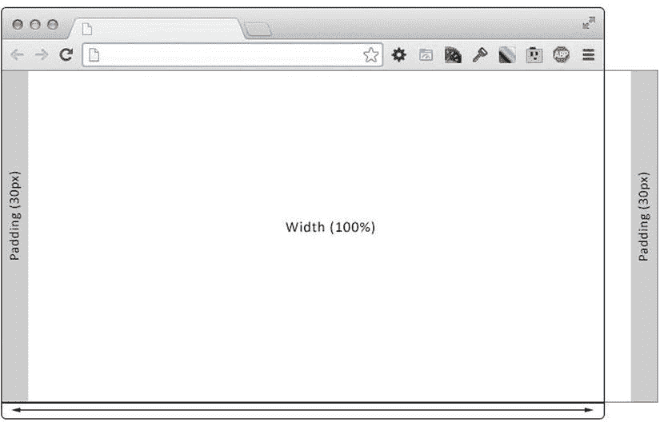

图 4-17。

Using pixel values for paddings, the Fluidness of the design breaks and horizontal scrollbars appear

如果你从事 web 开发已经有一段时间了，你可能知道 quirks 模式。从本质上讲，在旧的浏览器中，这些标准没有得到正确的实现，而到了 Internet Explorer 6，人们决定要实现 HTML 和 CSS 标准，就需要为没有更新以支持这些标准的旧站点留一条退路。这种后退被称为 quirks 模式，它是通过在 HTML 文档的第一行不包含`doctype`来触发的。

特别是，在这些旧的浏览器中，与标准相比，盒子模型的实现是不正确的。W3C 标准要求，当定义元素的宽度或高度时，它不包括填充、边框和边距，这些应用于宽度或高度的外部。在这些较旧的浏览器中，实现包括内容、填充和边框，都在指定的宽度或高度内。

quirks 模式的实现对于允许你增加你的流体设计站点的间距是理想的，但是，你不想强迫你的站点进入 quirks 模式，因为你希望你的站点是标准兼容的。随着 CSS3 的到来，对盒子模型如何工作的控制权交给了开发人员，我们现在能够使用新的盒子大小 CSS 属性来确定盒子如何呈现。

box-sizing 属性提供了三个值供我们选择，每个值将呈现一个具有不同版本的盒子模型的盒子。可用于调整框大小的值有内容框、填充框和边框框。

#### 内容盒

默认样式由 CSS 标准指定。宽度和高度属性被测量为仅包括内容区域。边框、边距和填充被添加到外部。示例如图 4-18 所示。

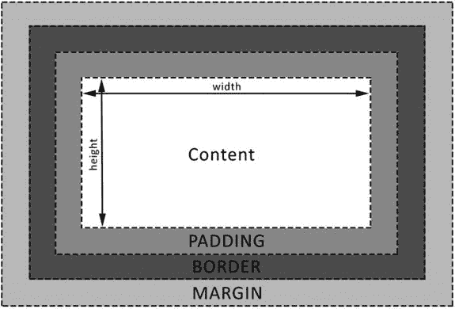

图 4-18。

The box model as applied by setting the CSS property box-sizing to content-box

#### 填充盒

对于 padding-box，width 和 height 属性包括填充大小，但不包括边框或边距。示例如图 4-19 所示。

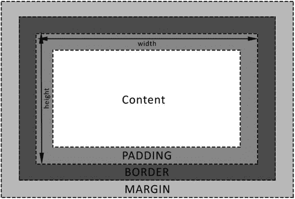

图 4-19。

The box mode asl applied by setting the CSS property box-sizing to padding-box

#### 边框

width 和 height 属性都包括填充和边框，但不包括边距。如果您已经开发了一段时间，您可能会熟悉 border-box 的工作方式，因为它是 Internet Explorer 在文档处于 quirks 模式时使用的。示例如图 4-20 所示。

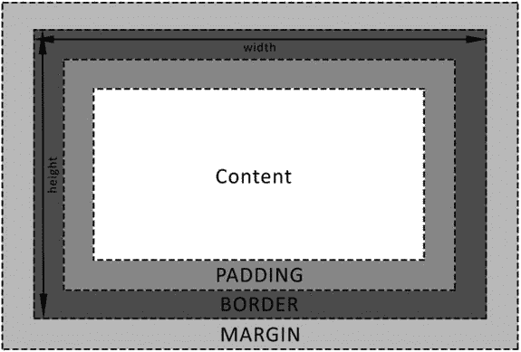

图 4-20。

The box model as applied by setting the CSS property box-sizing to border-box

边框是响应式开发的圣杯，因为它允许我们向元素添加一致的填充，同时仍然使用基于百分比的宽度。

对于一个响应式站点来说，对所有元素使用边框是完全有意义的。它不仅保持了一致性，还意味着您可以对从`div`到输入字段的所有内容使用百分比宽度。将边框应用于所有元素的方法是使用通用选择器(*):

`* {`

`-webkit-box-sizing: border-box; /* Safari/Chrome, other WebKit */`

`-moz-box-sizing: border-box;    /* Firefox, other Gecko */`

`box-sizing: border-box;         /* Opera/IE 8+ */`

`}`

### 想想你的文本行的长度

当构建一个流畅的站点时，不管浏览器大小如何，简单地允许一个站点是全幅的是非常容易的。然而，这通常会导致很长的文本行。

Chris Coyier 在 2013 年 11 月就这个问题写了一篇关于 CSS 窍门的文章:

> The traditional idea is that the text (long text, multiple paragraphs, need to look at it again when reading ...) should be between 45 and 75 characters per line. It's awkward when it's short, and it's easy to find the position and the next line when it's long.

这完全有道理；一眼看去，不算过长的台词读起来更舒服；报纸使用专栏也是出于同样的原因。在流畅的布局中，很容易让文本行变得过长。为了避免这种情况，您可以使用一个名为`max-width`的 CSS 属性，它是作为 CSS2.1 规范的一部分引入的。

CSS `max-width`属性允许你定义一个元素可以跨越的最大宽度，使你能够通过直接定义包含元素或者段落标签的最大宽度来控制文本行的长度。在定义这个最大宽度时，实际上可以通过在 ems 中定义您的`max-width`来考虑每行的最大字符数。这意味着元素的最大宽度将保持相对于定义的字体大小，因此如果用户增加默认字体大小，元素将适当缩放。需要注意的是，使用像素宽度来包含 em 定义的宽度是很棘手的，所以与您定义宽度的方式保持一致是很重要的。

同样，您也希望确保您的文本行不会显得太短。为此，您可以使用 CSS 属性`min-width`，它也是作为 CSS2.1 规范的一部分引入的。`min-width`属性允许你指定一个元素可以拥有的最小宽度，如果元素的宽度低于`min-width`值，它会覆盖`width`和`max-width`属性的值。对于单行文本来说，副本太短的情况，`min-width`属性没有帮助；但是，它确实有助于防止出现这样的情况:由于元素不够宽，多行文本每行只有几个单词。需要注意的是，如果容器的宽度小于元素的宽度，那么元素将溢出容器。此外，如果容器的 CSS 属性 overflow 设置为 hidden，元素的内容将被裁剪，这当然是不希望的。

浏览器对`max-width`和`min-width`的支持在 Internet Explorer 7 和更高版本、Firefox、Chrome 和 Safari 中都很好，包括移动版本，它们都支持该属性。

## 使用 CSS 网格构建流畅的设计

至此，您已经很好地理解了构建流体设计时应遵循的原则。让我们来看看如何将这些付诸实践，以构建一个流畅的设计。在第三章中已经构建了一个响应式站点，当你学习了媒体查询时，让我们看看如何使用流体设计原理构建一个响应式 CSS 布局网格。

布局网格起源于出版业，在出版业中，公司会使用预定义的网格来布局杂志和书籍等印刷材质。这样做的目的是让他们在整个印刷作品中实现视觉对称。这些不可见网格的目的是为读者提供一个更简单、一致的阅读体验。早在响应式设计成为趋势之前，印刷品中的网格所带来的好处就促使它们以 CSS 网格的形式向网络过渡。

CSS 网格通常使用列来构建；这些是网格的最小度量单位，块可以跨越一列或多列。通常，一个网格有 12 到 16 列，每列之间会有间距。间距是每列之间的间距，通常定义为填充或边距。

为了让我更容易说明网格是如何工作的，我把一个固定布局网格的例子放在一起，如图 4-21 所示。在本例中，我们有一个四列网格，每列宽 215 像素，每列的两边都应用了 20 像素的装订线。

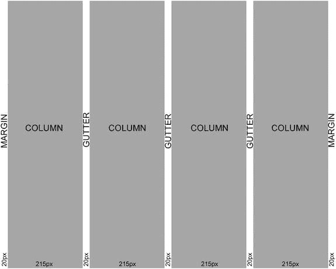

图 4-21。

An example of a fixed width grid

固定宽度的布局允许我们描绘网格是如何分布的，但是我们希望网格是流动的。为了实现这一点，我们将把我们的每一列定义为 25%的宽度，然后为我们的站点启用槽，我们将使用 box-sizing 属性来移动我们的列内部的填充。总宽为 960 像素，每列宽为 240 像素；但是，如果您要将其缩小到 320 像素，则浏览器中的列会随着每列而缩放，而不是每列 80 像素宽。该流体网格如图 4-22 所示。

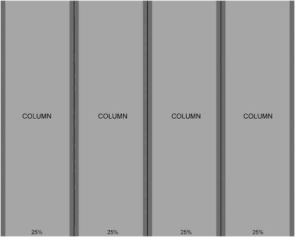

图 4-22。

Grid adapted to fluid layout

### 构建网格

虽然您可以简单地使用 CSS 网格框架，但首先重要的是要很好地理解网格框架是如何工作的，这样您就可以充分利用它们。让我们先看看如何编写一个简单的移动响应 CSS 网格。

最简单的形式是，CSS 网格由以下内容组成:

Columns   Gutters   Rows   Wrappers  

让我们更详细地看看网格的这些元素:

#### 列

在开发 CSS 网格时，您需要决定网格系统将使用的列数，正如前面提到的，网格系统通常有 12 或 16 列。

CSS 网格中的列通常宽度相等，位置相邻。通常，这是通过将列向左浮动来实现的:

`.col{`

`float: left;`

`width: 25%;`

`}`

对于您将要编写的示例 CSS 网格，您将使用四列。您可能还记得我之前提到过，您可能希望您的内容跨越多列，因此为了支持这一点，您需要做一些调整。通过简单地定义每个支持的宽度，很容易使网格支持跨越多个列。之前我将一个列命名为`.col`，但是，为了使您能够使用一个选择器将共享样式应用到我们的附加列，您将把它重命名为`".col-span-x"`，其中 x 是该列应该跨越的列数..列名应该反映它们将跨越多少列:

`[class*="col-span"]{`

`float: left;`

`}`

`.col-span-1{`

`width: 25%;`

`}`

`.col-span-2{`

`width: 50%;`

`}`

`.col-span-3{`

`width: 75%;`

`}`

`.col-span-4{`

`width: 100%;`

`}`

你可能已经注意到，在这里我使用了一种我在本书中没有涉及的 CSS 语法，一种你以前可能没有使用过的语法，叫做属性通配符选择器。使用的属性通配符选择器`[class*="col-span"]`允许您定位所有列，而不必添加额外的类。在这个例子中，我用它来代替书写:

`.col-span-1, .col-span-2, .col-span-3, .col-span-4{`

`float: left;`

`}`

到目前为止，您已经创建了四列，但是，在这里您将希望能够根据视窗的大小来调整您的站点。当我讨论构建响应式流体设计的原则时，我提到过将某些内容调整得过小会带来糟糕的用户体验。因此，您应该能够控制内容在较小设备和较大设备上分别占据多少列。您可以通过改进具有媒体查询的类来做到这一点:

`[class*="col-span"]{`

`float: left;`

`}`

`.sm-col-span-1{`

`width: 25%;`

`}`

`.sm-col-span-2{`

`width: 50%;`

`}`

`.sm-col-span-3{`

`width: 75%;`

`}`

`.sm-col-span-4{`

`width: 100%;`

`}`

`@media screen and (min-width: 768px){`

`.lg-col-span-1{`

`width: 25%;`

`}`

`.lg-col-span-2{`

`width: 50%;`

`}`

`.lg-col-span-3{`

`width: 75%;`

`}`

`.lg-col-span-4{`

`width: 100%;`

`}`

`}`

由于您首先构建的是可移动的 CSS 网格，因此您首先定义了默认的列宽，然后为更大的设备定义了类，如果设备的最小宽度为 768px，这些类将被激活。您已经将原来的类改为前缀为`sm-`和`lg-`。`sm-`前缀类针对小型及以上设备，`lg-`前缀类针对较大设备。其思想是将带有`sm-`前缀的列类应用于 HTML 元素，为较小的设备定义布局，然后使用带有`lg-`前缀的列在适当的地方覆盖列跨度。

#### 沟壑

CSS 网格的间距是每列之间的间距；从历史上看，这是通过保证金实现的。但是，在处理流体设计时，您希望间距成为列的一部分，因此可以选择对列宽使用百分比。因此，您应该对列之间的间距使用填充。

使用空白填充的缺点是，它会阻止您为列添加背景色。这样做的原因是，如果你给列添加一种背景色，背景也会出现在槽中。解决这个问题的唯一方法是向列内的元素添加任何背景色，而不是向列本身添加背景色。

之前我解释了 CSS3 `box-sizing`属性，它允许你改变盒子模型的工作方式，允许你控制填充是在宽度的内部还是外部。对于此网格，您将希望列包括填充，这将用于装订线。为了实现这一点，这些列将把`box-sizing`设置为`border-box`。如果您已经像我之前建议的那样将它应用到通用选择器，您不需要在这里再次添加`box-sizing`:

`[class*="col-span"] {`

`box-sizing: border-box;`

`padding-left: 15px;`

`padding-right: 15px;`

`}`

如您所见，您还向列添加了填充。您已经使用完整的`padding-left`、`padding-right`属性名称添加了填充，因为这可以防止您覆盖添加到元素顶部或底部的任何填充，而这些填充可能已经在 CSS 的其他地方指定了。

#### 行

行用于包含列。因为列是向左浮动的，所以它们被从页面流中取出；因此，浮动元素前后的非定位块元素就像不存在一样。因此，为了防止这个问题，行还负责清除列使用的浮点数。

通常的方法是添加一个伪元素作为清除浮动的行的一部分:

`.row:after{`

`content: ' ';`

`clear: both;`

`display: block;`

`}`

如上所述，伪元素是一个应用了`clear: both`的空块级元素。

#### 包装材质

最后，您将在所有行周围添加一个包装器。它用于向站点的左侧和右侧添加额外的填充:

`.wrapper{`

`padding-left: 15px;`

`padding-right: 15px;`

`}`

#### 将网格放在一起

前面的例子着重于如何构建一个响应式博客，这样就有可能看到这些例子之间的差异，因此这个新代码将为一个博客构建一个响应式网格。

我已经解释了组成这个网格的 CSS，所以让我们把它们放在一起(清单 4-1)。

清单 4-1。用于网格的示例 HTML

`<!DOCTYPE html>`

`<html>`

`<head>`

`<title>Responsive Grid</title>`

`<meta name="viewport" content="width=device-width">`

`<link rel="stylesheet" type="text/css" href="responsive-grid.css">`

`</head>`

`<body>`

`<header>`

`
`

`
`

`
`

`<h1>Blog</h1>`

`
`

`<nav class="sm-col-span-2 lg-col-span-4">`

`<ul>`

`<li><a href="#">Latest posts</a></li>`

`<li><a href="#">Popular posts</a></li>`

`</ul>`

`</nav>`

`
`

`
`

`</header>`

`
`

`
`

`
`

`<article class="sm-col-span-4 lg-col-span-3">`

`<h2>Article title</h2>`

`
02/12/2013
`

`
Praesent commodo cursus magna, vel scelerisque nisl consectetur et. Cras justo odio, dapibus ac facilisis in, egestas eget quam. Vivamus sagittis lacus vel augue laoreet rutrum faucibus dolor auctor. Etiam porta sem malesuada magna mollis euismod. Cras mattis consectetur purus sit amet fermentum. Duis mollis, est non commodo luctus, nisi erat porttitor ligula, eget lacinia odio sem nec elit. Vestibulum id ligula porta felis euismod semper.
`

`</article>`

`<aside class="sm-col-span-4 lg-col-span-1">`

`<h2>Related Articles</h2>`

`<nav>`

`<ul>`

`<li><a href="#">Article item 1</a></li>`

`<li><a href="#">Article item 2</a></li>`

`<li><a href="#">Article item 3</a></li>`

`</ul>`

`</nav>`

`</aside>`

`
`

`
`

`
`

`</body>`

`</html>`

现在让我们把 CSS 放在一起；所以 CSS 很容易理解，让我们把 CSS 网格从站点特定的样式中分离出来，使它看起来像一个博客。完整的 CSS 代码如清单 4-2 所示。

清单 4-2。网格的完整 CSS

`/*Grid styles*/`

`.wrapper{`

`padding-left: 15px;`

`padding-right: 15px;`

`}`

`.row:after{`

`content: ' ';`

`clear: both;`

`display: block;`

`}`

`[class*="col-span"] {`

`float: left;`

`box-sizing: border-box;`

`padding-left: 15px;`

`padding-right: 15px;`

`}`

`.sm-col-span-1{`

`width: 25%;`

`}`

`.sm-col-span-2{`

`width: 50%;`

`}`

`.sm-col-span-3{`

`width: 75%;`

`}`

`.sm-col-span-4{`

`width: 100%;`

`}`

`@media screen and (min-width: 768px){`

`.lg-col-span-1{`

`width: 25%;`

`}`

`.lg-col-span-2{`

`width: 50%;`

`}`

`.lg-col-span-3{`

`width: 75%;`

`}`

`.lg-col-span-4{`

`width: 100%;`

`}`

`}`

`/*Site specific*/`

`body{`

`margin: 0;`

`padding: 0;`

`font-size: 14px;`

`line-height: 18px;`

`}`

`header{`

`background: #304480;`

`padding-top: 10px;`

`padding-bottom: 10px;`

`color: #fff;`

`}`

`ul{`

`padding: 0px;`

`margin: 0px;`

`}`

`ul li{`

`list-style: none;`

`}`

`header nav{`

`text-align: right;`

`}`

`header nav a{`

`color: #fff;`

`}`

`@media screen and (min-width: 768px){`

`header nav{`

`text-align: center;`

`padding-top: 10px;`

`border-top: 1px dashed #ccc;`

`margin-top: 10px;`

`}`

`header nav li{`

`display: inline-block;`

`}`

`}`

我们现在可以看看这在一个额外的小设备上看起来如何(如图 4-23 所示)。

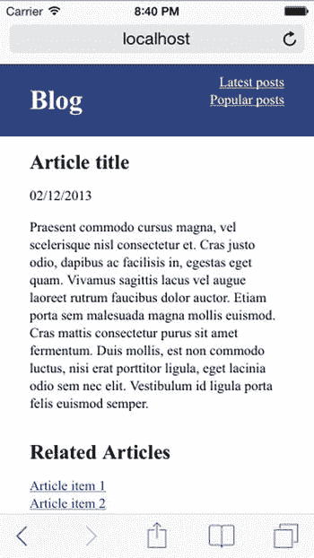

图 4-23。

Our site shown on an extra small device (in this example an iOS device)

已经看到我们的网站在一个额外的小设备上的样子，我们还应该看看它在更大的设备上的样子，我们可以通过启动桌面浏览器并加载我们的网站来做到这一点。图 4-24 显示了我们期望看到的情况。

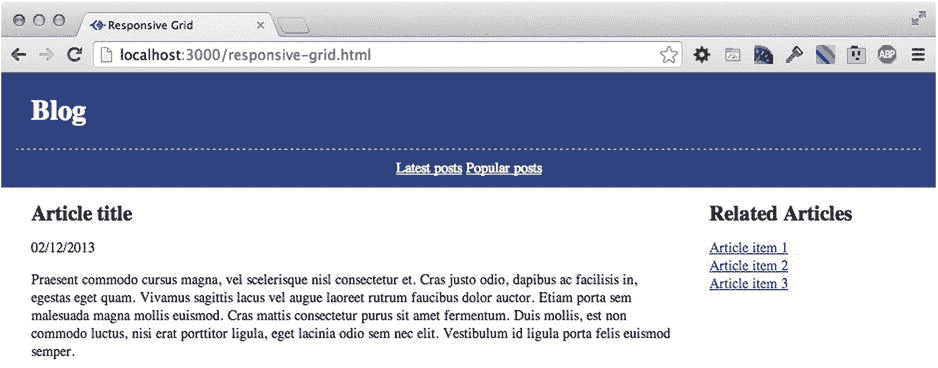

图 4-24。

Our site shown on a larger device (in this example a desktop browser)

但是，如果您将视窗宽度进一步增加到 1，440px，您将开始注意到文章中的文本行开始变得相当长。如前所述，每行的最佳字符数在 45 到 75 之间，查看图 4-25 中的截图，您会注意到文本远远超出了这个范围。

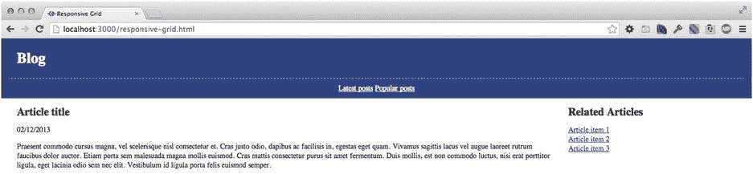

图 4-25。

Text beyond the optimum number of characters per line

防止这一点并不太难；您只需调整包装器，使其具有最大宽度，之后它将简单地使站点居中:

`.wrapper{`

`padding-left: 15px;`

`padding-right: 15px;`

`max-width: 1200px;`

`margin: 0 auto;`

`}`

现在，如果你在大视窗上检查站点，当视窗超过 1200 像素时，它会居中，如图 4-26 所示。

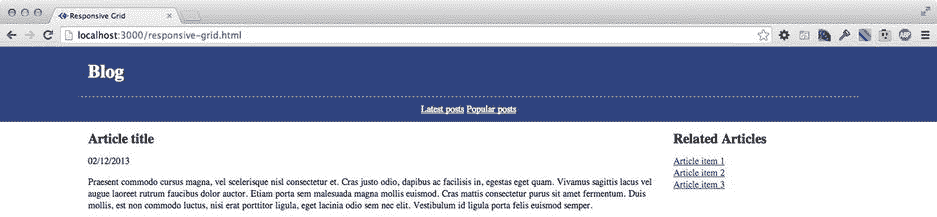

图 4-26。

Text now centering with larger viewport

#### 改善电网

现在已经完成了第一个响应式网格，您已经了解了构建 CSS 网格的基本原则。如果你想更进一步，有很多方法可以改进网格，让你建立更好、更有用的站点。

第一种方法是增加列数。典型的网格使用 12 到 16 列，然而，为了简单起见，我只选择了 4 列。增加列数相对来说比较简单，只需使用以下公式计算每一列:

列宽= (100 /总列数)*列跨度

您可以选择使用 Nicolaj Kirkgaard Nielsen 的网格计算器，而不是手动计算。 4

改进网格的第二种方法是更好地控制不同视口大小的列数。您已经添加了媒体查询，以允许独立确定小型和大型设备的列数；但是，您可以通过添加针对中型设备的功能来添加更细粒度的控制。

## 摘要

流畅的布局是任何响应式网站的显著特征，因为它们允许网站利用任何可用的空间。正如本章所强调的，流体布局的这一特性对于响应式设计尤为重要，因为我们正在开发各种形状和大小的设备。

然而，流动的布局确实给我们作为开发者带来了一些额外的挑战，所以我们研究了一些可以遵循的原则，以确保我们能够优化我们的响应网站的可用性。此外，这些原则应该指导你能够快速有效地建立你的网站。

了解了流体设计之后，我解释了如何应用这些技术；特别是，我专注于构建一个流体响应 CSS 网格。这解释了如何将您已经学到的关于媒体查询的知识应用到流畅的布局中。

看了流畅的布局，学习了如何自己构建一个基本的网格，在下一章，你将学习更多关于现有的 CSS 网格和框架，我们可以用它们来构建我们的响应站点。

Footnotes 1

[`http://niarchive.org/trails/plantation-rewriting-the-story/`](http://niarchive.org/trails/plantation-rewriting-the-story/) 。

  2

[`http://thomashawk.com/2013/05/flickr-users-uploading-71-more-photos-to-flickr-since-new-design-rolled-out.html`](http://thomashawk.com/2013/05/flickr-users-uploading-71-more-photos-to-flickr-since-new-design-rolled-out.html) 。

  3

[`http://www.clholloway.co.za`](http://www.clholloway.co.za/) 。

  4

[`http://gridcalculator.dk/`](http://gridcalculator.dk/) 。