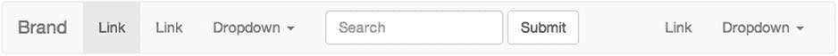
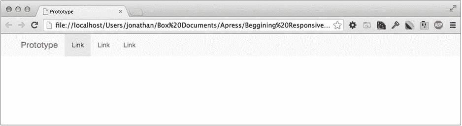

# 五、响应式设计的框架

我相信您能够理解，响应式开发确实给项目增加了额外的工作，在这种情况下，开发人员需要考虑网站在不同屏幕分辨率下的所有不同变化。在构建网站时，我们可以减少工作量的一种方法是使用响应式框架作为起点。

当看到第四章中讨论的流体设计时，我解释了 CSS 网格的基础，你学会了如何开发自己的网格。然而，在所提供的示例中，网格被大大简化了，开发一个更复杂的网格实际上可能相当耗时。值得庆幸的是，作为开发人员，我们有一个开放源代码的世界，本章将探索一些最流行的网格和框架。

在关于网格和框架的这一章中，我将解释的主题是:

Grid systems   CSS frameworks   What is best for a particular web site   Prototyping a site using CSS frameworks  

## 网格系统

最简单的形式是，网格系统是一种结构，您可以在其中构建网站的布局。它由水平行和垂直列组成，包含网站的内容，可以跨越一列或多列。在构建网站时，网格系统可以提供很大的好处，允许你在构建中实现间距的一致性，从而提高网站的可用性，因为文本更容易理解。

在寻找开源网格系统时，您会注意到它们通常非常简单，只包含渲染网格所需的样式，而将如何构建站点的所有其他决定留给您自己。本章中解释的网格系统都是为响应而构建的，所以除了基本网格之外，它们还包括允许它们响应浏览器视窗宽度的媒体查询。

尽管 mobile first 响应式设计有很多好处，并且在 web 开发社区中也有接受它的驱动力，但是大多数独立的网格系统仍然是先构建桌面的。因此，在考虑网格系统时，首先要考虑它们是否是移动的，这一点很重要。

本章将介绍三种流行的移动优先响应网格。检查的网格系统有:

Fluidable ( [`http://fluidable.com/`](http://fluidable.com/) )   CSS Smart Grid ( [`http://dryan.github.io/css-smart-grid/`](http://dryan.github.io/css-smart-grid/) )   csswizardry-grids ( [`http://csswizardry.com/csswizardry-grids/`](http://csswizardry.com/csswizardry-grids/) )  

### 流动的

Fluidable ( [图](http://fluidable.com/) 5-1 显示其主页。

图 5-1。

The Fluidable home page

我问 Andri 他开发自己的网格系统背后的原因是什么，他解释如下:

> I want a grid that can be configured for any number of columns, which is fluid (usage percentage), and most importantly, has slots of fixed width. I think this is the only way to make a grid. From the design point of view, shrinking your gutters is a big taboo. You want to be able to control when to change gutters. Then, when responsive design began to appear, it was no longer meaningful to use pixels. My last reason is that I really want something lightweight, which can be used for smaller projects, such as single pages and smaller websites, where it is unnecessary to use a mature framework.

在与 Andri 交谈后，很明显他在构建他的网格时试图实现我们在构建自己的网格时探索的许多内容，然而，在花了更多时间进行工作后，他已经实现了一个完整的 12 列网格(见图 5-2 )。

图 5-2。

Screenshot of the different grid arrangements shown on the Fluidable web site

在查看 Fluidable grid 是如何构建的过程中，可以看到它为每种不同的设备类型定义元素跨越多少列的能力，这意味着当使用这种技术时，可以轻松控制站点如何向下查看单个设备类型。实现这一点的方法是通过用于元素类名的命名约定:

`.col-mb-x` Defines how many columns it should span on mobile   `.col-x` Defines how many columns it should span on a tablet   `.col-dt-x` Defines how many columns it should span on a desktop  

对于其中的每一个，`x`代表元素应该跨越的列数。在示例网格中使用了类似的方法，允许移动设备具有不同的网格布局，但是，它没有将平板电脑与桌面分开。Fluidable 没有这个限制，而是提供了三个不同的列类集，如上所列。我对他们实现的唯一不满是列类名的命名约定不一致，tablet 使用了`col-x`,这还不清楚。

从技术的角度来看，Fluidable 是使用 CSS 预处理器 LESS (leaner CSS [CSS 预处理器将在本书后面讨论])构建的，这意味着如果您通过更改变量的值来使用 LESS，也可以自定义您的网格。Fluidable 可使用五个变量进行配置，即@columns、@maxWidth、@gutterWidth、@ screenTablet 和@screenDesktop，这使得它更加灵活。

### CSS 智能电网

下一个电网系统是丹尼尔·瑞恩( [`http://dryan.github.io/css-smart-grid/`](http://dryan.github.io/css-smart-grid/) )的 CSS 智能电网。Daniel 最初于 2011 年在 GitHub 上发布了 CSS 智能电网，在九次发布之后，在撰写本文时它已经是 4.0 版了。图 5-3 显示了 CSS 智能电网的主页和文档网站。

图 5-3。

The CSS Smart Grid home page

我联系了 Daniel，问他为什么选择开发自己的网格系统，而不是使用现有的网格。我创建的网格诞生于 2011 年夏天，是专门为奥巴马竞选而设计的。我们希望首先实现移动化，但当时并没有很多健壮的网格采用这种方法。然后我们遇到了 polyfilling @media 查询对我们来说是一个真正的问题，因为所有的 JavaScript 解决方案都使用 AJAX 来加载和解析 CSS。我们的 CSS 是在一个不支持 CORS 报头的 CDN 上提供的，所以这对我们来说是不可行的。我的最后一个要求是网格必须是轻量级和高性能的。

他提出的最有趣的一点是他过去在多填充媒体查询方面的问题，所以我将解释这是如何作为 CSS 智能网格的一部分进行设计的。

CSS 智能网格设计巧妙，无需 JavaScript polyfill 即可支持 Internet Explorer 8。这是通过使用条件注释将类添加到 HTML 标记来实现的，HTML 标记可用于向 Internet Explorer 8 显示默认的 960 网格。通过使用这种技术，仍然可以使用移动优先的方法来构建网格，并在不需要任何 JavaScript 的情况下为 Internet Explorer 8 提供桌面布局。

已经了解了是什么让这个网格脱颖而出，让我们看看实际的网格，看看网格本身如何与这里正在研究的其他网格系统相比较(见图 5-4 )。

图 5-4。

Screenshot of the different grid arrangements shown on the CSS Smart Grid site

CSS 智能网格中的列是通过添加类“columns”和附加类来定义的，以指定它应该跨越的列数(例如，一、二、三)。最多支持 12 列。或者，您也可以使用关键字来指定元素的宽度，它们是:

one-fourth: equal to 25 percent or three columns’ width   one-half: equal to 50 percent or six columns’ width   one-third: equal to 33.33 percent or four columns’ width   two-thirds: equal to 66.66 percent or eight columns’ width  

下面是一个实际使用网格的例子。正如您将看到的，定义了一行和两列，每列的宽度都是使用上面讨论的关键字定义的:

`
`

`
`

`
Lorem ipsum
`

`
`

`
`

`
Lorem ipsum
`

`
`

`
`

使用这些关键字为您选择如何标记列增加了额外的灵活性，但是，重要的是要注意，在 CSS 中，它的作用就像您简单地使用数字列类名一样。

网格本身是使用 SASS(语法上令人敬畏的样式表)CSS 预处理器构建的，对于 CSS 智能网格，Daniel 提供了将列宽作为“mixin”的选项，而不是使用 HTML 中的类。这样做的好处是 HTML 看起来不那么混乱，因为您不需要在标记中添加那么多的类。然而，这样做的缺点是，因为您是在 CSS 中定义宽度，所以您的元素只能在该特定宽度下工作。相反，如果您要在 HTML 中使用列宽类，您可以简单地通过更改类来更改元素的大小。在这方面，块本身将是一个流体宽度；然后 column 类会简单地给它一个定义的宽度。这使您的代码更加灵活，因为您可以通过简单地更改所使用的列宽类，在不同宽度的多个位置使用相同的代码块。

### CSS wizardy-网格

下一个网格是 Harry Roberts 的 CSS wizardy-grids([`http://csswizardry.com/csswizardry-grids/`](http://csswizardry.com/csswizardry-grids/))。这是一个移动优先的响应网格，可以在 GitHub 上下载(见图 5-5 )。

图 5-5。

csswizardry-grids home page

我联系了 Harry Roberts，询问他开发 CSS wizard-grids 背后的原因:

> I want a practical answer to a complex question; Most other solutions look complicated. 1 

网格非常灵活，与前面讨论的网格相比还有一个额外的好处，就是它允许您定义列是居中还是无间距。这意味着，您可以通过使用一个类来简单地使列居中，而不是尝试均匀地偏移列来使其居中。网格还具有额外的灵活性，允许您在其他列中嵌套列(参见图 5-6 )。

图 5-6。

Screenshot of the different grid arrangements shown on the csswizardry-grid site

与 CSS 智能网格类似，这个网格系统使用一个类命名约定，将列宽称为分数，例如:

one-half   one-third, two thirds   one-quarter, two-quarters, three-quarters  

这种类命名约定比大量网格系统使用的 span-X 方法更容易阅读。

同样，以类似于 CSS 智能网格的方式，csswizardry-grids 允许您使用 SASS(这是一个 CSS 预处理器，将在本书后面讨论)，您可以简单地将列的规则扩展到您自己的 CSS 类选择器，这意味着如果您选择，您可以避免将额外的类添加到 HTML 本身。使用这种方法的优点和缺点与使用 CSS 智能电网的优点和缺点相同。

使用 csswizardry-grids 的一个主要缺点是，它不使用 floats，而是使用 inline 块将列一个接一个地放置，所以如果 HTML 中的列之间有空格，那么在呈现的页面中就会出现多余的空格。有两种常见的方法可以防止这种情况:在元素之间放置 HTML 注释，如下所示:

`
`

`lorem ipsum`

`
<!--`

`-->
`

`lorem ipsum`

`
`

或者简单地删除列之间的空格，如下所示:

`
`

`lorem ipsum`

`

`

`lorem ipsum`

`
`

虽然这是使用内联块的一个缺点，但是使用内联块比使用浮点有几个优点。它允许您使用`dir` HTML 属性颠倒内容的顺序。这可以添加到一个特定的元素中来定位站点的特定区域，也可以添加到 HTML 元素中来定位整个页面。HTML 属性有两个可能的值:`ltr`代表从左到右，而`rtl`代表从右到左的文本。图 5-7 显示了使用`dir`属性如何影响 CSS wizard-grids。

图 5-7。

Grid default alignment on the left, the text direction set to “right to left” on the right

使用`dir`属性有它自己的优点；首先，你可以按照可访问性和搜索引擎优化的重要性来排列你的内容，而不是简单地按照设计来组织你的内容。第二，如果你正在构建一个支持从右到左语言的多语言网站，你可以使用`dir`属性简单地反转布局。

对网格使用 inline block 的另一个好处是，元素自然具有正确的高度，并且您不必清除浮动。

## CSS 框架

除了开源网格系统，还有各种各样的开源网格框架。CSS 框架是典型 CSS 网格系统的扩展，除了提供网格布局之外，它还提供标准的浏览器重置、版式和用户界面元素，您可以使用它们来构建响应性站点。虽然它被称为 CSS 框架，但重要的是要知道，这些 CSS 框架中常见的一些界面元素通常需要框架附带的 JavaScript。

有许多不同的 CSS 框架可用，但是，有两个真正被 web 开发社区所接受:Twitter Bootstrap 和 Zurb Foundation。

CSS 框架中常见的用户界面元素有:

Dropdowns   Button’s and button groups   Forms   Navbar   Breadcrumbs   Pagination   Labels   Badges   Page header   Thumbnails   Alerts   Progress bars   Media object   List group  

通过提供广泛的组件选择，CSS framework 使开发人员的生活更加轻松，因为当他们需要一个公共元素时，他们可以简单地从现有的组件中进行选择，使他们能够将时间集中在站点的外观和感觉上，以及适应他们正在构建的站点的新的自定义组件上。

让我们看看几个最流行的 CSS 框架。

### Twitter 引导

Twitter Bootstrap 是一个 CSS 框架，最初由 Mark Otto 和 Jacob Thornton 构建；然而，它已经成为 GitHub 上最受欢迎的项目，有近 600 名贡献者和超过 25，000 个分支。该框架也相当成熟，已经发布了 25 个版本，在撰写本文时已经发布到 3.2.0 版。

显然，Twitter Bootstrap 正在被大量的开发者使用，但是这并没有立即显示出一些使用 Twitter Bootstrap 的网站的规模。包括 Healthcare.gov、Virgin Active 和愤怒的小鸟星球大战 II 的 Tumblr 在内的品牌都在使用 Twitter Bootstrap，并且以非常不同的方式使用，这也表明了该框架是多么通用。

马克·奥托(Mark Otto)为 List Apart ( [`http://alistapart.com/article/building-twitter-bootstrap`](http://alistapart.com/article/building-twitter-bootstrap) )写了一篇文章，谈到了 Twitter Bootstrap 开发背后的原因:

> A year and a half ago, a small group of Twitter employees set out to improve our team's internal analysis and management tools. After some early meetings around this product, we set out with greater ambition to create a toolkit for anyone inside or outside Twitter. Therefore, we set out to build a system to help people like us build new projects on this basis, so Bootstrap came into being. 2

马克的这个更高的目标是试图建立一个每个人都可以使用的工具包，这个目标非常成功；Twitter Bootstrap 实现了 Twitter 团队的目标，即它是一个可用于各种项目的工具包，通过开源项目，它为更广泛的开发社区提供了这些好处。

当我们开始深入研究 Twitter Bootstrap 所提供的东西时，从基础开始是很重要的，Twitter Bootstrap 的基础是一个移动优先、响应迅速的网格系统。开箱即用的框架有一个 12 列的网格，分为超小型(移动)、小型(平板电脑/小型上网本)、中型(台式机/笔记本)和大型(大屏幕台式机)，以便您能够根据不同的视窗大小完全调整站点。

Twitter Bootstrap 中一些最常用的组件如图 5-8 所示。

Navigation  

Buttons  

Forms  

Typography  

图 5-8。

Twitter Bootstrap components Thumbnails  

这是 Twitter Bootstrap 附带的组件的一个小样本，为了探究它们，您应该看一看 [`www.getbootstrap.com`](http://www.getbootstrap.com/) 来全面了解 Twitter Bootstrap 组件提供了什么。

除了内置组件，web 开发社区还用第三方组件扩展了 Twitter Bootstrap，这些组件可以简单地添加进来。一些流行的附加组件示例如下:

Fuel UX: ( [`http://exacttarget.github.io/fuelux/`](http://exacttarget.github.io/fuelux/) ) Fuel UX extends Bootstrap by adding additional lightweight JavaScript components.   Bootstrap Image Gallery: ( [`http://blueimp.github.io/Bootstrap-Image-Gallery`](http://blueimp.github.io/Bootstrap-Image-Gallery) ) This component adds the ability to have a gallery with a light box that can navigate through a series of images.   Bootstrap Application Wizard: ( [`http://www.panopta.com/2013/02/06/bootstrap-application-wizard/`](http://www.panopta.com/2013/02/06/bootstrap-application-wizard/) ) The Bootstrap Application Wizard component allows you easily to make multipart forms with Bootstrap. These are shown inside a modal that shows above your page.  

这种用其他开源组件扩展 Twitter Bootstrap 的能力使它非常强大。然而，与 jQuery 不同的是，jQuery 有一个用户定制插件的存储库，没有用于引导组件的存储库，这意味着你必须依靠像 Google 这样可靠的搜索引擎来找到这些组件。虽然这不是一个主要的缺点，但它会使找到推荐的组件变得更加困难。

作为开发人员，理解框架是如何构建的是很重要的，因为我们经常希望能够删除我们不使用的部分，这样他们就不会不必要地膨胀我们的站点。使用 Twitter Bootstrap，主项目的构建使用了更少的资源。然而，有一个官方的 SASS 端口，所以当涉及到您使用哪个版本时，您可以选择。我会在第七章单独讨论 CSS 预处理器。

如果你陷入困境，需要 Twitter Bootstrap 的帮助，你可以求助于一个大型的开发人员社区，很可能通过快速搜索，你会发现有人可能已经问过同样的问题，这意味着你可以快速解决你的任何问题。

### Zurb 基金会

Zurb Foundation 是一个由 web 设计机构 Zurb 构建的 CSS 框架，于 2011 年 2.0 版首次成为开源。从这个初始版本开始，已经有了三个后续版本，其中 5.3.3 是撰写本文时的版本。

看看谁在使用 Zurb 基金会，我们可以看到许多大型网站都在使用它，包括 Dictionary.com、英国 HTC 在线商店和世界野生动物基金会。

Zurb Foundation 中的组件与 Twitter Bootstrap 中的组件非常相似。简单看一下其中的一些组件，就会发现两者提供的主要组件是相同的，如图 5-9 所示。

Navigation  

Buttons  

Forms  

Typography  

图 5-9。

Zurb Foundation components Thumbnails  

如果你想看看 Zurb Foundation 真正与众不同的地方，那就是它的 Interchange Responsive 内容(或简称 Interchange)。简而言之，Interchange 允许您为特定的媒体查询将 HTML 的不同部分加载到页面中。这意味着，当您构建 HTML 时，您不需要在主页中包含所有视窗宽度的 HTML，而是专注于提供移动优先的 HTML，然后使用 Interchange 加载不同视窗的附加 HTML。此外，Interchange 可用于根据视窗宽度加载不同的图像，因此您可以在较小的视窗中加载较小的优化图像，在较大的视窗中加载较大的图像。

Zurb 基金会不仅仅是 Zurb 开发的开源项目。它还提供付费支持，帮助您充分利用该框架以及培训和资格鉴定。尽管并非所有项目都负担得起这个选项，但它通常被认为对一些公司环境有益。

## 什么最适合我的网站？

看了 CSS 网格系统和 CSS 网格框架之后，您现在应该对两者的优缺点很熟悉了。当你开始构建一个站点的时候，决定使用哪一个框架或者网格系统是很重要的，因为一旦你的构建有了进展，就很难改变了。

很难改变框架或网格系统的原因是，您已经承诺了代码结构和命名约定，这些都是与您选择的框架或网格一起出现的，因此改变可能意味着需要进行大量的重构。在框架的情况下，您可能也使用了一些用户界面组件，因此改变框架将涉及到寻找替代框架的等价物或在其他地方寻找替代物。

当要在使用 CSS 网格和 CSS 框架之间做出决定时，问自己是否想要预构建用户界面组件是一个简单的问题。您还应该看看除了接口组件之外还提供了什么；像用于排版的基本 CSS 这样的东西可以节省你大量的时间，你可能会发现这会让你使用 CSS 框架而不是 CSS 网格。

重要的是要记住，没有一个放之四海而皆准的解决方案，尽管您可能选择在一个网站上使用网格系统或网格框架，但您可能会发现对于另一个网站，您会做出不同的决定。

CSS 框架经常受到很多批评，也许这是你过去不喜欢的一个原因，那就是它们的文件大小。文件大小背后的原因是 CSS 框架包括许多不同的组件，每个组件都会增加框架的文件大小。为了能够充分利用您选择的框架，您应该尽可能地使用它们。然而，这并不是忽视框架的理由，因为你可以选择在项目中使用框架的哪些部分，你可以简单地删除任何未使用的 CSS 选项，手动或使用自动工具，如后处理器`uncss`(这将在第七章的中介绍)。

### 选择 CSS 网格

在决定了网格更适合您，并且您希望能够构建自己的所有组件之后，看看可用的选项是很重要的:

选择网格时，您需要问自己一些问题:

Do you feel comfortable working with the grid? It is important that you feel comfortable with the grid, even small things like how classes are named can be an annoyance if it does not fit with the way you normally code, so it is important that you are 100 percent comfortable with the grid, especially because you may be maintaining the site for a number of years.   Is the grid suitable for your site? Your grid of choice should work for your site. This is especially important if you already have had the site designed without a prior discussion about grids. This means if you want to use a grid, it needs to fit the number of columns for which the site has been designed. Some grid systems will allow you to configure the number of columns they use, which can aid you in trying to get a design to fit into a grid. A better approach is to have chosen the grid before the site is designed and discuss this with the designer so you know your grid is suitable.  

### 选择 CSS 框架

在决定使用一个 CSS 框架后，确保你选择一个你乐意使用的框架是很重要的——记住你不太可能建立一个你不会再接触的网站，所以你需要做出一个你乐意的选择，因为你可能会在可预见的将来维护这个网站。

选择框架时，您需要问自己一些问题:

Do you like the grid the framework is built on? As previously discussed, the base of a CSS framework includes a grid system, so you have to be comfortable with the grid.   Are you happy with the selection of components that the framework comes with? The user interface components that the framework comes with are a core part of the framework, so it is important that you are happy with the selection. Although you can add your own, using the components that come with the framework will not only make your life easier it can also save you a significant amount of time.   Does the framework suit the way you work and the tools you use? Some frameworks might require you to use specific tools, and it is likely you already have a set of tools you know and love, so you will need to consider this when choosing a framework.  

### 既不选择网格也不选择框架

也有一些 CSS 网格系统和 CSS 框架都不合适的情况，例如:

The design uses uneven column sizes.   The design has uneven margins in between the columns.   The width of the design is not easily divisible.   The site content is placed on the page in a irregular manor (an example of this could be a parallax site).  

如果你的网站属于这些类别中的任何一个，你很可能会花费大量的时间试图让你的网站适应网格，而不是花时间在没有网格的情况下构建你的网站，但仍然遵循已经讨论过的移动优先的方法。

## 使用 CSS 框架构建网站原型

传统上，作为网站开发生命周期的一部分，用户经验丰富的设计师会将一系列静态线框放在一起，向客户、设计师和网站开发人员说明网站应该如何工作。连同解释功能的注释，这将是构建网站的基础。最近，已经开发了允许构建交互式线框的应用程序，然而，许多这些应用程序仍然非常局限于简单地将一系列静态图像与链接捆绑在一起。

这是传统网站开发之外的一个领域，使用 CSS 框架可以提供显著的改进。CSS 框架真正的亮点在于能够使用作为框架的一部分提供的组件快速构建网站原型。无需编写一行 CSS 代码，使用包含的组件快速模拟原型是非常容易的。

我们已经探索了一些不同的 CSS 框架，其中之一，Twitter Bootstrap，我们将用于模拟一个网站的原型。

首先，您需要为组件设置一个基本模板。为此，你需要包含 Twitter 的 CSS 框架，可以在 [`www.getbootstrap.com`](http://www.getbootstrap.com/) 下载。对于基本模板的 HTML，你只需要一些基本的 HTML，包括 jQuery、Twitter Bootstrap CSS 和 JavaScript。输入清单 5-1 中的代码。

清单 5-1。基本模板 HTML

`<!DOCTYPE html>`

`<html>`

`<head>`

`<title>Prototype</title>`

`<meta name="viewport" content="width=device-width">`

`<link rel="stylesheet" type="text/css" href="css/bootstrap.min.css">`

`</head>`

`<body>`

``

`</body>`

`</html>`

有了这些，现在可以开始用 Twitter 引导组件构建原型了。为此，您将从 Twitter Bootstrap 文档中提取模块的代码片段，并在适当的地方缩短它们。

您将包含的第一个元素是一个`navbar`。Twitter Bootstrap 文档中的`navbar`模块包括下拉框和搜索表单，然而，在本例中，您将包括一个简化版本，如清单 5-2 所示。

清单 5-2。原始资料改编自 [`http://getbootstrap.com/components/#nav`](http://getbootstrap.com/components/#nav) 的文档

`<header>`

`<nav class="navbar-default" role="navigation">`

`
`

`<!-- Brand and toggle get grouped for better mobile display -->`

`
`

`<button type="button" class="navbar-toggle" data-toggle="collapse" data-target="#bs-example-navbar-collapse-1">`

`Toggle navigation`

``

``

``

`</button>`

`<a class="navbar-brand" href="#">Prototype</a>`

`
`

`<!-- Collect the nav links, forms, and other content for toggling -->`

`
`

`<ul class="nav navbar-nav">`

`<li class="active"><a href="#">Link</a></li>`

`<li><a href="#">Link</a></li>`

`<li><a href="#">Link</a></li>`

`</ul>`

`
<!-- /.navbar-collapse -->`

`
`

`</nav>`

`</header>`

正如当你建立一个响应式网站时，你首先建立的是这个原型手机，所以第一站是在一个额外的小设备上测试导航，如图 5-10 所示。

图 5-10。

Testing the navigation on an extra small device

如果你现在在桌面浏览器中测试同样的导航，你会得到一个全幅导航，如图 5-11 所示。

图 5-11。

The navigation shown on a larger viewport, showing the full-sized navigation

无需编写任何 CSS 或 JavaScript，您现在就拥有了一个在移动设备上响应迅速、折叠自如的导航。

接下来，您要添加超大屏幕组件，它本质上是一个大的功能标题区域，有时被称为 hero。键入清单 5-3 中的代码来添加这个组件。

清单 5-3。原始资料改编自 [`http://getbootstrap.com/components/#jumbotron`](http://getbootstrap.com/components/#jumbotron) 的文档

`<section class="jumbotron">`

`
`

`<h1>Prototype</h1>`

`
This is our prototype
`

`
<a href="#" class="btn btn-primary btn-lg" role="button">Learn more</a>
`

`
`

`</section>`

如果您现在在我们的超小型设备上再次测试，标题看起来更完整。通过简单地放入超大屏幕组件，你已经为页面添加了一个标题和一个主要的行动号召，如图 5-12 所示。

图 5-12。

The extra small viewport of the site featuring the jumbotron

当您查看原型现在如何显示在桌面上时，您可以看到 Twitter Bootstrap 超大屏幕组件以更大的版式响应更宽的视窗，如图 5-13 所示。

图 5-13。

The jumbotron viewed on a wide viewport

接下来，您将添加一些面板来展示您网站的产品。对于图像，您将使用一个名为`lorempixel.com`的服务，它将显示一个随机图像作为占位符。对于产品，使用缩略图组件，如清单 5-4 所示。

清单 5-4。原始资料改编自 [`http://getbootstrap.com/components/#thumbnails-custom-content`](http://getbootstrap.com/components/#thumbnails-custom-content) 的文档

`<section class="container">`

`
`

`
`

`
`

``

`<h3>Product one</h3>`

`
...
`

`
`

`
`

`
`

`
`

`
`

``

`<h3>Product two</h3>`

`
...
`

`
`

`
`

`
`

`
`

`
`

``

`<h3>Product three</h3>`

`
...
`

`
`

`
`

`
`

`
`

`</section>`

缩略图组件就绪后，您现在可以刷新浏览器，主页的原型现在看起来已经完成。为了让您能清楚地看到产品模块，我在图 5-14 中展示了这些模块在我们的超小型设备上的外观。

图 5-14。

The product panels viewed on a small device

同样，当你在桌面上查看原型时，你可以看到网站现在使用了三栏，而不是使用一栏来显示产品，如图 5-15 所示。

图 5-15。

Larger device showing the product panels alongside one another

之所以有三列，是因为您选择了使用列类`col-sm-4`，这意味着每一列跨越了组成网格的十二列中的四列(这是页面宽度的三分之一)。使用这些引导组件的好处是，您可以使用列类来定义它们在不同浏览器宽度下的外观。只需将类别更改为`col-sm-3`并添加一个额外的产品框，就会并排显示四个产品，如图 5-16 所示。

图 5-16。

Four product columns shown on larger device

正如刚才演示的那样，不需要编写任何 CSS，只需修改文档中的 HTML，使用 CSS 框架创建一个原型真的很容易。虽然这是一个非常简单的例子，但它确实突出了 CSS 框架必须提供的一些好处。构建原型比花时间创建线框有几个主要好处:

Those using the prototype can get a feel for how the site will work rather than relying on the notes attached to the wireframe.   By using a responsive CSS framework, your prototype is by default responsive, allowing you to show how the site will function on different devices.   Rather than starting from scratch when building the site, you might be able to build on top of the prototype.  

按照这里的第 2 点，已经使用响应式 CSS 框架构建了这个原型，您已经能够构建完全响应的原型。这使得这个原型的用户可以快速看到他们应该如何期望最终的网站能够跨各种设备工作。

## 摘要

本章研究了 CSS 网格系统和 CSS 框架，特别关注在哪里可以使用它们，以及它们可以给你的响应式设计项目带来的好处。

本章考察了选择最适合您的项目的网格或框架的重要性，而不是将其建立在对特定框架的忠诚感上。最重要的方面是网格或框架相对于您的需求的灵活性。

CSS 框架特别有用的一个领域是当你想要建立一个网站的原型时，这一章探讨了如何通过简单地改编来自 Bootstrap 网站的 HTML 例子并把它们放在一起制作一个页面来快速建立一个网站的原型。这是非常强大的，因为这意味着你可以构建一个工作原型，然后利益相关者可以自己测试交互，而不是构建平面的用户体验图，然后解释各种交互。这个原型可能会成为构建整个网站的基础。

在下一章中，我们将探讨如何使一个现有的网站具有响应性。

Footnotes 1

哈里·罗伯茨，2014 年 1 月 17 日，推特@csswizardry。

  2

马克·奥托,《与众不同的清单》, 2012。