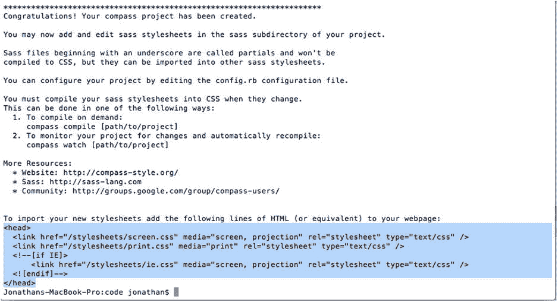
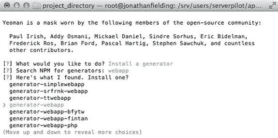
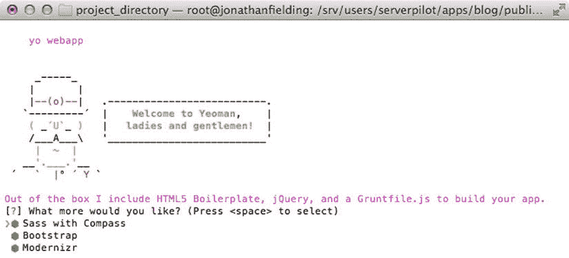
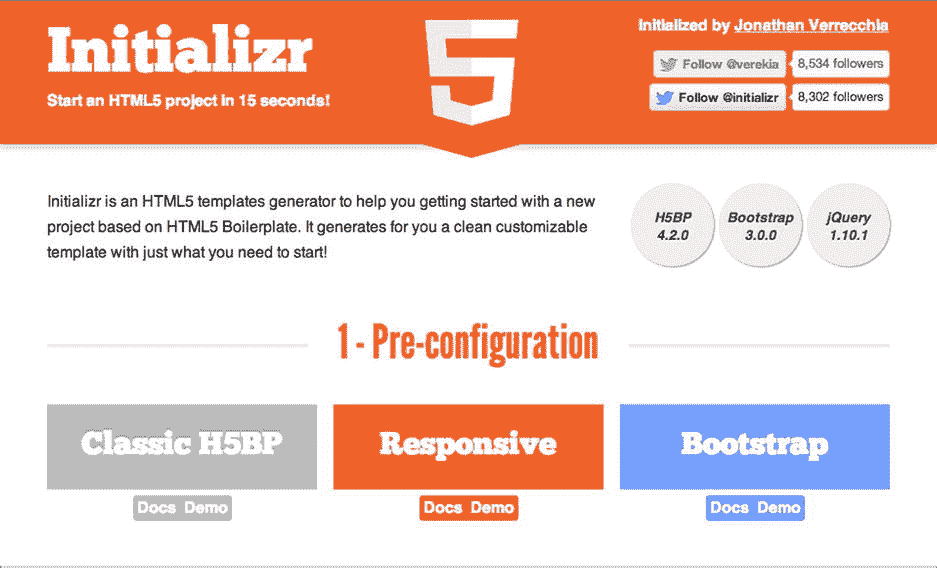
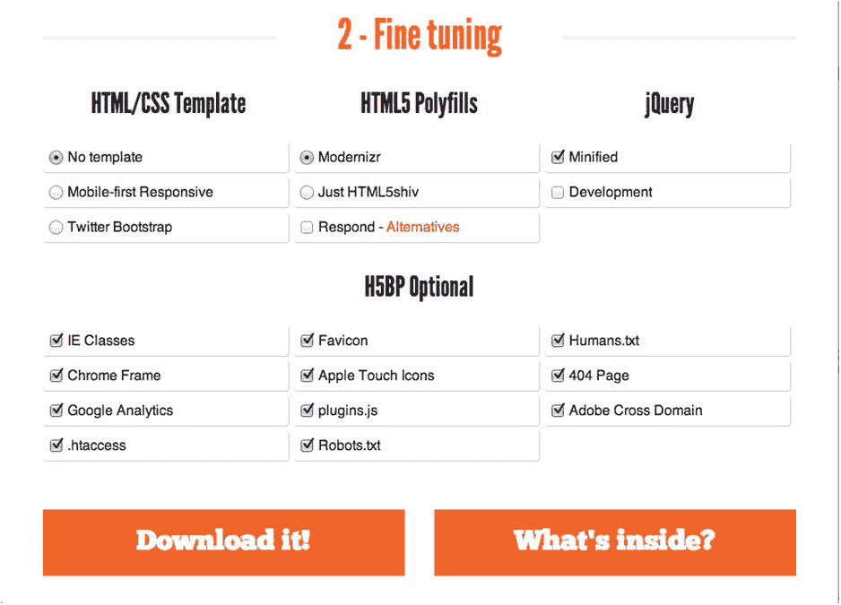
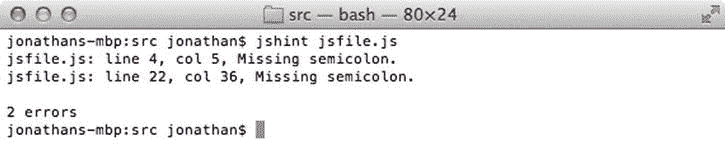
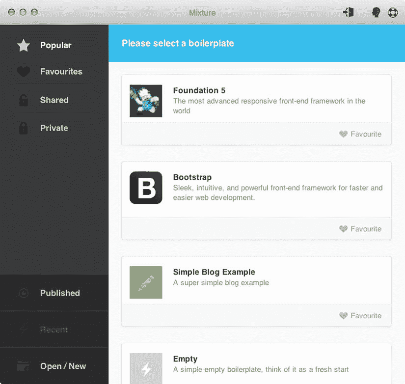
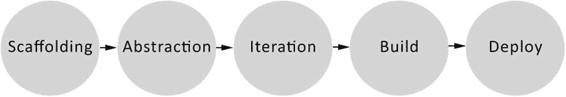
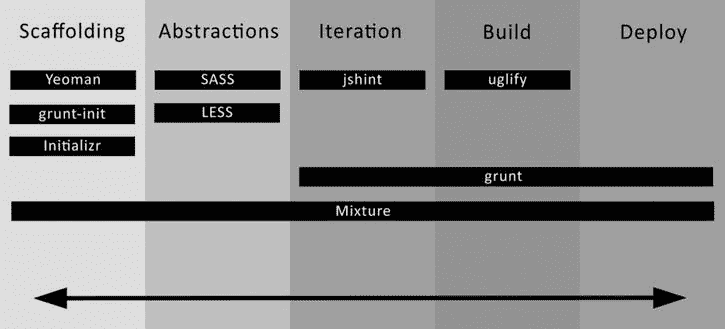

# 七、工具和工作流程

随着响应式设计的发展，开发一个网站所需的时间也在增加；原因是在开发网站的过程中有更多的变量需要考虑。考虑到这一点，找到优化我们工作流程的方法以使我们能够在其他开发领域节省时间变得越来越重要。随着响应式设计的增长，前端工具也在增长，这使我们能够更有效地编写代码。

本章将探讨:

Knowing your command line   Version control with Git   CSS preprocessors   Bower   Grunt   Gulp   Scaffolding   Other tools   Workflow  

## 了解您的命令行

一开始，你的操作系统的命令行界面可能非常吓人，但是，它也可能非常强大。学习如何使用命令行有很多好处:

A large number of web development tools now reside as command-line utilities.   It allows you to do batch file processing, such as the renaming of files, which may not be achievable using the normal graphical user interface (GUI).   The same interface is used when you secure shell (SSH) into servers, so the skills are transferable if you later want to manage your own hosting server.  

考虑到这些好处，让我们看看命令行，这样您就可以在您的网站开发中更多地利用它。

### 准备命令行

在我开始讨论命令行之前，您必须准备好一些基本工具。这在 Mac OS X 和 Windows 之间略有不同，所以我为每一个都提供了单独的说明。

#### Mac OS X

在第二章中，我讨论了安装 Xcode 来允许你使用 iOS 模拟器。Xcode 对前端开发人员有用的另一部分是命令行工具。安装命令行工具最简单的方法是从苹果开发者网站 [`https://developer.apple.com/downloads/index.action`](https://developer.apple.com/downloads/index.action) 下载。你需要使用苹果开发者账户登录，你可以免费注册，然后为你的特定操作系统下载最新的“命令行工具”。下载完成后，您可以简单地运行安装程序来加载工具。

安装完成后，您可以安装 Homebrew 软件包管理器，这是一个命令行工具，允许您安装 Node.js 等软件包。要安装 Homebrew，您需要运行以下命令:

`ruby -e "$(curl -fsSL`[`https://raw.github.com/Homebrew/homebrew/go/install`](https://raw.github.com/Homebrew/homebrew/go/install)

然后命令行会引导你完成家酿的安装。

#### Windows 操作系统

要在 Windows 上准备命令行工具，您需要安装 Git 和 Bash。这些可以从 [`http://msysgit.github.io/`](http://msysgit.github.io/) 一起下载。下载 msysgit 包时，它会建议你下载最新版本。

在安装过程中，您可以使用默认安装选项。当询问您希望使用哪种安装方法时，选择“仅使用 Git Bash”安装完成后，您只需单击 Finish 即可。您将使用 Git Bash 作为命令行界面，而不是使用内置的 Windows 命令行。要打开 Git Bash，只需在开始菜单的 Git 文件夹中找到它。

### 命令您的命令行

确保命令行设置正确后，您现在可以了解如何使用命令行的一些基础知识。命令行为广泛的计算机功能提供了一个简单的界面，从简单的创建文件夹到递归地改变文件权限。

#### 遍历目录

在命令行中工作时，您可能希望执行的一个基本操作是在目录之间导航并查看目录内容。您可以使用两个主要命令来实现这一点:`ls`和`cd`。

##### 限位开关（Limit Switch）

`ls`命令将允许您列出当前目录中的所有文件和目录。

##### 激光唱片

`cd`命令允许你改变一个目录。你可以传递一个绝对路径(以/开头)，例如`/Users/jonathan/`，或者你可以传递一个与你当前文件夹相关的路径，例如`Users/jonathan`。

此外，还可以使用`cd ..`导航到父目录，或者使用倍数导航到多个父目录，比如`../../`。

#### 简单的文件操作

您还需要能够使用命令行操作文件，并且能够创建、复制、移动和删除目录和文件。

##### 创建目录

`mkdir`命令允许你在当前目录下创建一个新目录。这是通过输入`mkdir dirname`实现的。如果您想为名为`project_name`的项目创建一个文件夹，您可以运行命令:

`mkdir project_name`

##### 触控

有时，当您设置目录结构时，您可能希望在目录中创建占位符文件。不必打开文本编辑器并创建每个文件，您可以使用`touch`命令简单地创建它们。要创建名为`index.html`的空文件，只需使用命令:

`touch index.html`

##### 丙酸纤维素

`cp`命令允许您复制现有文件。要使用该命令，您只需提供原始文件的相对或绝对路径，后跟您要将它复制到的位置的路径。使用该命令的语法如下所示:

`cp original-file-path new-file-path`

例如，如果您想要将文件复制到当前文件夹的子目录中。在这种情况下，您只需提供原始文件的路径以及要将其复制到的位置:

`cp hello.jpg img/hello.jpg`

##### 平均变化

`mv`命令与`cp`命令的相似之处在于，您只需提供原始文件的相对或绝对路径，然后是您想要将它移动到的位置的路径。使用该命令的语法如下所示:

`mv original-file-path new-file-path`

例如，如果您想要将文件移动到当前文件夹的子目录中。在本例中，您只需提供原始文件的路径以及要将它移动到的位置。

`mv hello.jpg img/hello.jpg`

##### 空间

如果你想删除你已经创建的文件，你可以使用`rm`命令。使用`rm`命令的语法是:

`rm file-to-be-removed-path`

因此，如果您想从 images 目录中删除文件`hello.jpg`,您可以使用以下命令:

`rm img/hello.jpg`

Note

`rm`命令不会将文件放入回收站，而是将它从系统中永久删除。

#### 其他有用的命令

除了已经介绍的核心命令之外，在使用命令行时，还有一些额外的命令会很有用。

##### 日本首藤

`sudo`命令用于以系统超级用户(通常称为 root)的身份运行任何命令，目的是如果您想要修改当前用户没有权限的文件，您可以使用`sudo`来完成。使用`sudo`命令的一个例子是删除一个您自己无权删除的文件，命令行是:

`sudo rm protectedFile.jpg`

##### 猫

`cat`命令允许你读取文件的内容。要使用`cat`命令，您可以运行该命令，然后运行您想要输出的文件:

`cat error.log`

除了允许您简单地读取文件，它还可以用来连接文件。这是通过运行`cat`,后跟一个您想要连接的文件名列表来实现的:

`cat file1 file2 file3`

在上面的示例中，连接的文件只是输出到屏幕上，但是，您可以通过使用大于号(>)后跟要输出的文件名来选择将其输出到文件中:

`cat file1 file2 file3 > concatfile`

##### 尾巴

`tail`命令允许您简单地将文件的最后几行输出到命令行。要使用`tail`命令，您可以运行该命令，后跟您想要读取的文件名:

`tail error.log`

您也可以使用`-n`标志后跟您想要读取的行数来选择您想要查看的行数:

`tail –n 5 error.log`

#### 进一步的文件

通过在您想要了解的命令前使用`man`命令，可以直接在您的终端中查看关于这些命令的更多文档，例如`man rm`。

### 工具先决条件

在开始安装和使用这些工具之前，您需要安装它们所依赖的一些先决条件。您将在这里探索的工具需要的两个先决条件是 Ruby 和 Node.js。

#### 红宝石

Ruby 是一种动态的、面向对象的编程语言，可用于多种用途。我们在这里对它感兴趣的原因是，它被你将在本章中探索的少量工具所使用。

### 装置

#### Mac OS X

Mac OS X 附带了一个版本的 Ruby。这将是您在本章示例中使用的版本。你可以选择安装一个像 RVM 这样的工具来升级到 Ruby 的新版本(关于这个的信息可以在 [`http://rvm.io`](http://rvm.io/) 找到)。

#### Windows 操作系统

要在 Windows 上安装 Ruby，可以使用位于 [`http://rubyinstaller.org/`](http://rubyinstaller.org/) 的 RubyInstaller 包。这是一个自包含的 Windows 安装程序，它将安装 Ruby 语言以及执行环境和文档。

在安装过程中，你会被要求输入 Ruby 的目的地。在这个阶段，您需要选中复选框“将 Ruby 可执行文件添加到您的路径中”

#### Node.js

最重要的先决条件之一是 Node.js，它是 JavaScript 的服务器端实现，带有服务器端 API。这是本书示例中使用的许多工具所需要的，包括 Bower、Grunt 和 Serve。

### 装置

在 Windows 和 Mac OS X 上安装 Node.js 是非常不同的，所以我将分别详细说明每个步骤。

#### Mac OS X

要在 Mac OS X 上安装 Node.js，您将使用名为 Homebrew 的 Mac OS X 软件包管理器。安装相对简单，您只需打开终端并运行命令:

`brew install node`

这将为您下载并安装 Node.js。以这种方式使用 Homebrew 安装 Node.js 的好处是，您可以使用以下命令轻松更新到较新的版本:

`brew update node`

要测试 Node.js 是否已安装，只需安装以下工具之一。

#### Windows 操作系统

Node.js for Windows 可以通过 Windows installer 轻松安装，可从 [`http://nodejs.org/download/`](http://nodejs.org/download/) 获得。

## 使用 Git 进行版本控制

Git ( [`http://git-scm.com/`](http://git-scm.com/) )是版本控制系统(VCS)，在大量开源项目中使用，使开发人员能够跟踪已经发生的变化。当您最初设置命令行时，您安装了 Git 源代码控制管理工具，因为它是您将使用的一些其他工具的先决条件。

使用 Git 的核心概念之一是它是一个分布式 VCS，这意味着在本地您将拥有一个存储库的副本，您可以使用它来执行所有主要的 VCS 操作，如提交、分支和合并。您可以继续简单地在本地使用 Git 来管理项目代码，但是，强大之处在于能够将您的代码从本地存储库推到远程存储库，您可以使用它来与其他开发人员协作。当您想要共享本地存储库中的代码时，您可以将本地提交推送到远程存储库。类似地，当您想要获得其他开发人员所做的最新变更时，您可以将它们从共享存储库中下载到您自己的存储库中。

如果你以前使用过像 Subversion (SVN)这样的集中版本控制系统，你会注意到这是非常不同的。然而，这种方法的好处是，即使没有互联网连接，您仍然可以提交，这允许您继续定期提交。

为了开始学习如何使用 Git VCS，让我们看看如何在命令行上使用它的基础知识。

### 初始化存储库

要在本地机器上初始化新的存储库，只需运行以下命令:

`git init`

这就产生了一个隐藏的。git 目录，Git 将使用它来管理目录中文件的版本。此时，存储库仍然是空的，因为没有任何文件添加到其中。

### 添加文件

当使用 Git 时，您需要告诉它您希望它对哪些文件进行版本控制。这是通过使用`git add`命令实现的。要添加单个文件，您只需运行命令`git add`以及您想要添加的文件名。添加 JavaScript 文件的一个例子是:

`git add scripts/main.js`

尽管以这种方式添加单个文件很容易，但是您可能需要添加大量文件，尤其是在进行初始提交时。这就是`git add .`发挥作用的地方，它告诉 Git 将当前目录下的所有文件添加到存储库中。

### 做出承诺

一旦添加了文件，就可以进行初始提交了。你可以通过使用`git commit`命令来完成。您可以使用`-m`标志来设置提交消息；因此，该命令将类似于:

`git commit -m 'initial commit'`

在您完成这个初始提交之后，您可以继续使用`git commit`来提交任何更改的文件。

### 添加遥控器

现在，您已经添加了一些文件并进行第一次提交，您可能希望将这些更改推送到远程存储库进行共享。要添加新的存储库，您需要使用`git remote add`命令，提供存储库的名称和 URL。这方面的一个例子是:

`git remote add origin git@github.com:jonathan-fielding/repo.git`

### 推动提交

要将提交推送到远程服务器，可以使用`git push`命令。第一次推送到远程服务器时，您需要设置刚刚添加的远程服务器的上游，为此您使用了`-u`标志。您将用于推送到远程服务器的命令是:

`git push -u origin master`

后续的推送可以简单地通过单独使用`git push`命令来实现。

### 拉动更改

使用`git pull`命令可以从远程服务器获取更改。

### 克隆存储库

到目前为止，您一直在开发自己的存储库；但是，在某些时候，您可能需要克隆一个远程存储库。这是通过使用后跟存储库 URL 的`git clone`命令来实现的。克隆 HTML5 样板文件库的一个例子是:

`git clone git@github.com:h5bp/html5-boilerplate.git`

克隆的存储库与本地初始化的存储库的工作方式完全相同。您可以添加新文件、删除文件、提交新文件，如果您对存储库有写权限，还可以提交您的更改。

## CSS 预处理程序

CSS 预处理器背后的核心概念是，它是一种可以编译成普通 CSS 的语言。这个想法是，通过添加新的特性来扩展 CSS，您可以编写更少的代码。CSS 预处理器的一些主要特性是:

Variables   Nesting   Import external files   Extend existing styles   Mixins  

CSS 预处理器已经变得非常流行，因此，预处理器的一些特性已经被改编以提交给 W3C。这里的想法是变量、混合和嵌套都有可能成为 CSS 规范未来版本的特征。

在我讨论各个预处理程序之前，让我们先来看看它们的核心特性以及它们如何工作的例子。下面的例子是使用 Sass 编写的，但是，这些是适用于大多数 CSS 预处理程序的核心概念。

### 变量

在 CSS 中，如果你想在多个地方使用一个值，你必须把它硬编码到那些地方。如果您稍后想要更新该值，您将需要遍历并更新每个地方的值。这可能很耗时，而且很容易出错，错过您想要更新的事件。CSS 预处理程序通过允许您将值定义为可以在整个代码中使用的变量来缓解这种情况。通过更新变量，它将更新所有使用该变量的地方，使它不容易出错。如何在 CSS 预处理器中使用变量的一个例子是使用蓝色。在本例中，您希望将颜色存储为一个变量，在这里您将把它命名为`$blue`。当需要使用变量时，只需将变量放在通常放置属性值的位置:

`$blue: #3bbfce;`

`p{`

`color: $blue;`

`}`

### 嵌套

CSS 预处理程序的另一个特性是，它们允许你以一种允许你写更少代码的方式嵌套你的 CSS。举一个普通 CSS 的例子:

`.class-name{`

`background: #000;`

`}`

`.class-name p{`

`color: #fff;`

`}`

`.class-name p span{`

`color: #eee;`

`}`

如果您要使用 CSS 预处理器来重写，您可以选择嵌套 CSS 选择器，就像在 HTML 中嵌套元素一样。这意味着您可以编写更少的代码，因为您不再需要编写长的选择器。为使用 CSS 预处理程序而重写的 CSS 示例如下:

`.class-name{`

`background: #000;`

`p{`

`color: #fff;`

`span{`

`color: #eee;`

`}`

`}`

`}`

您会注意到您已经在类选择器中嵌套了`p`选择器，并且在这个选择器中有`span`。编译后，生成的 CSS 将与原始 CSS 相同；但是，您用更简洁的方式编写了这段代码。另外，如果你以后想把`class-name`改成`another-class-name`，你只需要在一个地方更新它:

`.another-class-name{`

`background: #000;`

`p{`

`color: #fff;`

`span{`

`color: #eee;`

`}`

`}`

`}`

### 导入

当编写一个普通的 CSS 文档时，对于一个大型网站来说，即使 CSS 文档是以一种优化的方式编写的，它变得相当长也是正常的。响应式设计增加了这个问题，因为我们现在将媒体查询添加到我们的 CSS 中。

使用 CSS 预处理器可以让您将代码分割成单独的文件，从而避免处理大文件。这样做有几个主要的好处，第一个是可以更容易地管理较小的文件，第二个是如果在源代码控制中出现冲突，它们更容易解决。

CSS 预处理程序允许你通过实现一个叫做 partials 的概念来分割文件，partials 是一个单独的文件，里面有一小部分你的代码。为了防止分部被单独编译，您需要用下划线(`_`)作为前缀来命名您的分部，这告诉预处理器它是一个分部，只能作为另一个样式表的一部分来编译。

通常你会有一个主文件用来导入你的部分；在这里，您可以使用`@import`将一部分导入到文档中:

`@import "utilities/_reset.scss";`

`@import "utilities/_typography.scss";`

当使用 CSS 预处理器进行编译时，部分代码被内联到编译后的 CSS 文档中。

### 扩展

针对特定元素编写了一些样式后，您可能会发现在站点的其他地方也有类似的元素。与其重新声明 CSS 规则集或将类名添加到现有的选择器中，您可以做的只是使用预处理器扩展现有的样式。为此，首先要定义第一个元素的样式；在本例中，您将为一个简单的按钮定义样式:

`.button{`

`display: inline-block;`

`background: #ccc;`

`border-radius: 10px;`

`padding: 5px 50px;`

`}`

然后，您可以为新元素定义样式；在这种情况下，您将定义一个填充较少的小按钮。要扩展一个现有的元素，您可以使用`@extend`,后跟您正在扩展的选择器:

`.button-sml{`

`@extend .button;`

`padding: 5px 20px;`

`}`

### 混入类

CSS 预处理程序最强大的特性是定义混合的能力。mixin 是一个可重用的代码块，一旦定义，就可以在 CSS 中的任何地方使用。它允许您声明代码，您可以将变量应用到代码中，以输出所需的结果。有几个地方使用 mixin 可以使编写 CSS 变得更容易。让我们来看几个这样的例子。

#### 加前缀

第一个例子展示了如何使用 mixin 解决浏览器前缀的问题。在本书的前面我提到过，当新的 CSS 特性在浏览器中实现时，它们通常以浏览器前缀为前缀。因为您想要支持所有的浏览器，所以您需要确保您的代码输出所有正确的浏览器前缀，为此您可以使用 mixin。要编写一个能够为 CSS 属性`border-radius`生成前缀代码的 mixin，您需要编写一个接受一个参数(`border-radius`的值)的 mixin，并编写属性的每个前缀版本，其值设置为传递给 mixin 的参数:

`@mixin border-radius($argument) {`

`-webkit-border-radius: $argument;`

`-moz-border-radius: $argument;`

`-o-border-radius: $argument;`

`border-radius: $argument;`

`}`

如果你现在想要使用`border-radius` mixin，你可以使用`@include border-radius(value)`，其中`(value)`等于你想要设置的`border-radius`:

`@include border-radius(10px);`

#### 快捷指令

你可能想使用 mixin 的另一个领域是写快捷方式。一个例子是 mixin，它获取用于定位元素的值，然后输出 CSS。虽然这是一个简单的例子，但它展示了编写一个 mixin 来处理您可能经常编写的 CSS 输出是多么容易:

`@mixin position($top, $right, $bottom, $left) {`

`top: $top;`

`right: $right;`

`bottom: $bottom;`

`left: $left;`

`}`

#### 功能

在一些 CSS 预处理器中，除了 mixins，还有函数。虽然 mixin 和函数之间有相似之处，但关键的区别是 mixin 将直接输出 CSS，而函数将返回一个值，然后您自己输出该值。

使用函数而不是 mixin 的一个例子是当你想计算一个值的时候。在本例中，您可能希望返回计算的结果，然后在其他地方使用它。您甚至可以使用 mixin 中的函数来执行您需要的计算。

这种计算的一个简单例子是，您希望将像素字体大小转换为 rems。这方面的一个例子是:

`@function px-to-rem($font-size){`

`$baseline-px: 16 //This is the base font size used on our HTML element`

`$baseline-rem: $baseline-px / 1rem * 1;`

`@return $font-size / $baseline-rem`

`}`

要使用这个函数，您只需调用它，传递您想要的字体大小:

`p{`

`font-size: px-to-rem(12px);`

`}`

### 不同的预处理程序可用

在探索了 CSS 预处理器的一些关键原理之后，让我们来看看几个流行的预处理器。我将解释为什么它们应该成为您的工具集的一部分，以及在构建一个响应式站点时它们将如何节省您的时间。

#### Sass +指南针

Sass ( [`http://sass-lang.com/`](http://sass-lang.com/) )是语法上令人敬畏的样式表的缩写。我之前解释了 CSS 预处理器通常会包含的一些不同特性，您会很高兴地了解到 Sass 包含了所有这些特性。Sass 也是许多开源项目选择的 CSS 预处理器，包括本书前面讨论的 Foundation。此外，甚至还有一个 Sass 版本的 Twitter Bootstrap。

Compass 是位于 Sass 之上的一个附加框架，为它增加了额外的功能。这种功能的例子包括混音和生成精灵的能力。

有各种各样的工具可以与 Sass 和 Compass 一起使用来编译代码，所以让我们从使用命令行工具开始。

##### 装置

Sass 和 Compass 都是作为 Ruby gems 安装的。要安装它们，只需运行:

`gem update --system`

`gem install compass`

安装 Compass 时，它也会安装 Sass，因为它是一个依赖项。

##### 使用

Sass 语法有两种风格:第一种是 Sassy CSS，它是 CSS3 语法的超集，第二种是缩进语法。我将把重点放在 Sassy CSS 语法上，因为它不仅比缩进语法更受欢迎，而且从该语言的版本 3 开始，它已经成为 Sassy 的主要语法。

因为在这里的例子中您将使用带有 Compass 的 Sass，所以让我们从使用 Compass 来设置这个项目开始。为此，您将使用`compass create`命令，该命令将创建项目目录以及基本的 Sass 文件和编译的 CSS。对于这个例子，您将告诉命令项目的名称是`sass_project`:

`compass create sass_project`

在运行上面的命令时，Compass 将为项目创建一个新文件夹，其中包含文件。此外，它还会给出如何将编译好的 CSS 添加到 HTML 文档中的说明(见图 7-1 )。

图 7-1。

Creating Sass project with Compass, with instructions to add to HTML highlighted

在这个阶段，您仍然在刚刚创建的项目的父目录中，因此您将使用`cd`命令移动到这个项目的目录中:

`cd sass_project`

现在您已经在目录中，可以编译 Sass 了。要检查编译是否正常工作，只需运行以下命令:

`compass compile`

命令行会告诉你编译成功了。

在命令行中设置了项目之后，您还需要编写自己的代码。让我们打开文本编辑器中生成的 screen.scss 文件 Compass。打开文件后，您会发现以下六行 Sass:

`/* Welcome to Compass.`

`* In this file you should write your main styles. (or centralize your imports)`

`* Import this file using the following HTML or equivalent:`

`* <link href="/stylesheets/screen.css" media="screen, projection" rel="stylesheet" type="text/css" /> */`

`@import "compass/reset";`

这段代码所做的是将默认浏览器重置导入到样式表的顶部。如果您想查看编译后的代码，只需查看样式表目录中的 screen.css 文件。

能够只使用一行代码添加 CSS 浏览器重置对于完整的站点构建非常有帮助；然而，对于这个例子，您将从头开始并清除这个 Sass 文件。

让我们从编写一些嵌套的 CSS 开始:

`.class-name{`

`background: #000;`

`p{`

`color: #fff;`

`span{`

`color: #eee;`

`}`

`}`

`}`

如果您随后在命令行中使用`compass compile`对其进行编译，并从样式表的目录中打开编译后的 screen.css 文件，您会发现编译后的代码如下所示:

`/* line 1, ../sass/screen.scss */`

`.class-name {`

`background: #000;`

`}`

`/* line 3, ../sass/screen.scss */`

`.class-name p {`

`color: #fff;`

`}`

`/* line 6, ../sass/screen.scss */`

`.class-name p span {`

`color: #eee;`

`}`

您会注意到，除了生成的 CSS 之外，每个选择器都有一个注释，告诉您可以在 Sass 文件中找到该选择器的行号和文件。

正如你可能已经意识到的，每次做出改变都运行`compass compile`并不实际。这就是`compass watch`命令的用武之地。`compass watch`命令的作用是监视你的 Sass 文件，所以如果你改变了元素的背景颜色，它会自动重新编译。这样，任何进一步的更改都会自动编译，您现在可以运行以下命令:

`compass watch`

前面我讨论了如何将几个片段(CSS 文档的一部分)导入到一个文档中。在这里我将解释这是如何与 Sass 一起工作的。

首先，您将为片段创建一个目录，在这种情况下我们称之为`partials`。在这个文件夹中，你将创建两个名为`_layout.scss`和`_typography.scss`的 Sass 文件。在这些分部之前加上下划线的原因是告诉编译器这是一个分部，不应该单独编译。

Inside _layout.scss 您将把这些基本样式:

`.container{`

`max-width: 960px;`

`margin: 0 auto;`

`}`

Inside _typography.scss 您将把这些基本样式:

`html{`

`font-size: 100%;`

`}`

`h1{`

`font-size: 3rem;`

`}`

`p{`

`font-size: 1.2rem;`

`}`

然后，您可以使用`@import`将它们包含在 screen.scss 文件中。screen.scss 代码中的代码将如下所示:

`@import "partials/typography";`

`@import "partials/layout";`

您会注意到，尽管原始文件以下划线为前缀，并带有文件扩展名的后缀，但在导入部分文件时，这些都是不必要的。因为您在命令行中运行了`compass watch`命令，Compass 正在监视这些文件的变化，所以在保存 screen.scss 文件时，该文件将被重新编译为 css。如果您接下来查看 screen.css 输出文件，您会看到这两个文件现在包含在同一个 css 文件中:

`/* line 1, ../sass/partials/_typography.scss */`

`html {`

`font-size: 100%;`

`}`

`/* line 5, ../sass/partials/_typography.scss */`

`h1 {`

`font-size: 3rem;`

`}`

`/* line 9, ../sass/partials/_typography.scss */`

`p {`

`font-size: 1.2rem;`

`}`

`/* line 1, ../sass/partials/_layout.scss */`

`.container {`

`max-width: 960px;`

`margin: 0 auto;`

`}`

导入的 Sass 文件按照声明的顺序进行编译和插入。请注意，注释强调了代码的每一部分来自哪个部分。

看了 Sass 的一些基本用法后，希望您对如何使用这些工具编译 CSS 有了很好的理解。我已经介绍了 CSS 预处理程序的核心功能，记住这些也适用于 Sass 是很重要的。

#### 较少的

另一个很受欢迎的 CSS 预处理程序是 LESS。我之前介绍了 CSS 预处理器通常会包含的一些不同的特性，不幸的是 LESS 不支持编写自己的自定义函数，然而，讨论的所有其他特性都是受支持的。

Twitter 的开发者已经发布了几个使用较少的开源项目，最流行的是 Bootstrap 然而，他们也发布了一个名为 recession 的代码质量工具，这是一个测试 LESS 和 CSS 文件代码质量的工具。

##### 装置

使用 LESS 有几种不同的方法，这里我将重点介绍使用命令行工具。LESS 命令行工具是用 Node.js 编写的，所以您需要使用`npm`来安装它。您将使用的命令是:

`npm install -g less`

###### 使用

要开始使用 LESS，你需要建立一个文件夹，你可以调用`less`:

`mkdir less`

一旦创建了这个文件夹，您将使用文本编辑器创建一个名为 screen.less 的 LESS 文件。让我们从向 LESS 文件添加一些嵌套代码开始:

`.class-name{`

`background: #000;`

`p{`

`color: #fff;`

`span{`

`color: #eee;`

`}`

`}`

`}`

有了这些，您现在可以使用`lessc`命令行工具将 LESS 文件编译成 CSS。您需要提供要编译的文件名以及编译后的文件名:

`lessc screen.less screen.css`

文件编译完成后，您可以查看 screen.css 文件中的输出:

`.class-name {`

`background: #000;`

`}`

`.class-name p {`

`color: #fff;`

`}`

`.class-name p span {`

`color: #eee;`

`}`

输出与没有预处理器的情况下的编码非常相似，但是，实际编写的代码要简单得多。注意，与 Sass 不同，LESS 不会在源代码中添加调试注释。

我在前面讨论了导入的概念，并解释了如何在 Sass 中这样做，在 LESS 中非常相似。您只需使用一个`@import`语句来包含几个不同的文件。

您首先需要为这些片段创建一个目录，在本例中，您可以将其命名为`partials`。在这个文件夹中，你将创建两个名为`_layout.less`和`_typography.less`的小文件。为了使 LESS 不编译部分代码，可以在文件前加一个下划线。

在`_layout.less`里面，你会把这些基本样式:

`.container{`

`max-width: 960px;`

`margin: 0 auto;`

`}`

Inside _typography.less，你会把这些基本样式:

`html{`

`font-size: 100%;`

`}`

`h1{`

`font-size: 3rem;`

`}`

`p{`

`font-size: 1.2rem;`

`}`

然后您需要更新 screen.less 来使用`@import`语句导入这两个文件。与 Sass 不同，您需要提供 LESS 文件的完整路径，包括文件扩展名:

`@import "partials/_typography.less";`

`@import "partials/_layout.less";`

要将 LESS 文件重新编译成 CSS，只需重新运行前面的命令:

`lessc screen.less screen.css`

然后将`screen.less`文件编译成 screen.css 文件。如果您现在查看`screen.css`文件，您会看到这两个文件现在在同一个文档中，其顺序与您用`@import`语句声明它们的顺序相同:

`html {`

`font-size: 100%;`

`}`

`h1 {`

`font-size: 3rem;`

`}`

`p {`

`font-size: 1.2rem;`

`}`

`.container {`

`max-width: 960px;`

`margin: 0 auto;`

`}`

命令行并不是减少使用的唯一方式。当你开发的时候，你可以选择直接使用 LESS 文件作为链接，就像你在页面中包含 CSS 一样。除此之外，您还包括了`less.js`，这是一个将在浏览器中解析 LESS 文件的库。您将添加到 head 元素中的代码如下所示:

`<link rel="stylesheet/less" type="text/css" href="screen.less" />`

``

这使您能够在开发时快速测试代码，但是，建议您不要以这种方式部署设置较少的实时代码，因为浏览器需要在呈现样式之前解析文件。另外，添加`less.js`解析器当然也会增加页面的权重。

### 使用 CSS 预处理程序的问题

正如我前面提到的，使用 CSS 预处理器可以为您的开发带来巨大的好处，但是，它们也有缺点。

使用 CSS 预处理器时，您可能会遇到的第一个问题是，它会导致 CSS 文件变得臃肿。这是因为当你写代码的时候，很容易嵌套你的选择器，直到你的选择器变得非常具体和非常长。尽管这不是预处理器的错误，但由于不断嵌套的诱惑，这是一个容易陷入的陷阱。一个很好的例子可能是你想设计一个按钮标签的样式。如果您过度嵌套 CSS 预处理程序代码，它可能看起来像这样:

`.main`

`.container{`

`.row{`

`.column{`

`p{`

`button{`

`color: #000`

`}`

`}`

`}`

`}`

`}`

`}`

该嵌套代码将编译成如下所示的 CSS:

`.main .container .row .column p button{`

`color: #000`

`}`

在可能的情况下，您可以简单地将目标指向`p`中的一个按钮，因为在这种情况下，父节点可能与正确定位锚点无关:

`p{`

`button{`

`color: #000`

`}`

`}`

看到这个例子后，你应该意识到意外地开始嵌套是多么容易。这实际上是很多开发人员第一次使用 CSS 预处理程序时犯的一个非常常见的错误，所以如果您以前犯过这个错误，请不要担心。一个很好的规则是永远不要让你的嵌套超过三个选择器的深度，这意味着生成的 CSS 将会有更短的选择器。此外，通过不过度嵌套您的代码，可以更容易地使 CSS 可重用。

使用 CSS 预处理程序的另一个缺点是使用它们有一个轻微的学习曲线。尽管嵌套和变量等一些更简单的东西确实很容易掌握，但学习如何编写混合和函数可能需要更长的时间。尽管我在这里讨论的一些预处理程序之间存在语法差异，但是许多核心概念是相同的，所以一旦您选择了一个，就很容易转移到不同的预处理程序。

最后一个缺点是，在项目中设置使用 CSS 预处理器可能需要您对工作流进行更改。您不仅需要在每次保存时编译预处理器代码，还可能需要在部署过程中添加额外的步骤，以便在生产模式下编译预处理器代码。

### 选择预处理程序

我已经讨论了两个最流行的 CSS 预处理器 LESS 和 Sass，您已经看到了两者之间的一些差异。

Sass 本身提供了很多功能，对函数的支持是一个特别突出的特性。如果您将 Compass 添加到等式中，那么选择 Sass 作为您的预处理器将会增加很多价值。首先，Compass 包括一个 mixins 库，允许您生成不同版本的前缀代码。这比自己定义所有前缀要简单得多。此外，如果您提供一个装满图像的文件夹，Compass 将为您生成图像精灵和 CSS，并在您的页面上显示它们。

然而，LESS 也提供 mixin 库，试图通过提供输出前缀代码的 mixin 来提供类似的功能。然而，没有什么比 Compass 更好的了。

## 凉亭

Bower 是 Twitter 开发者的一个包管理器，它允许你安装前端包。使用包管理器的主要好处是，不用从 GitHub 或 packages 网站手动下载包，只需从命令行将其添加到项目中。此外，在下载软件包的同时，Bower 将下载它可能拥有的任何依赖项。一个简单的例子是，如果您要下载一个 jQuery 插件，它会检查您当前是否安装了 jQuery，如果发现没有安装 jQuery，它也会为您下载 jQuery。

除了允许你安装软件包之外，Bower 还允许你将软件包更新到新的版本，这意味着用最新版本的库来更新你的项目要容易得多。

### 装置

Bower 是一个节点包，因此需要安装节点才能工作。可以使用节点程序包管理器通过以下命令安装它:

`npm install –g bower`

#### 使用

使用 Bower 最简单的方法是简单地运行`bower install <package-name>`，所以如果您想将 jQuery 安装到这个项目中，您可以使用:

`bower install jquery`

但是，有时您可能希望指定要安装的软件包的版本。最可能的原因是最新版本缺乏对您需要支持的浏览器的支持。jQuery 就是一个例子，它的 2.x 分支不能在 Internet Explorer 8 和更早的版本中工作，所以如果你想支持这些浏览器，你需要使用 1.x 分支。安装一个特定版本的包可以通过在包名后使用`#version-number`来实现。对于 jQuery，安装 1.10 版需要以下命令:

`bower install jquery#1.10`

使用 Bower 的好处之一是，您不需要在自己的源代码控制库中保存依赖项的副本。事实上，我们鼓励您在 bower.json 文件中简单地保存一个依赖项列表。为了能够以这种方式使用 Bower，首先需要初始化项目，这可以通过运行以下命令来实现:

`bower init`

这是启动一系列关于您的项目的问题，然后用这些信息生成一个 bower.json 文件。然后，您可以开始添加依赖项。有两种类型依赖关系:

General dependencies: These are the core dependencies used by your web site or web application in production. It is also assumed you will use these dependencies in production as well.   Development dependencies: These are the dependencies used specifically when you are developing your site, which might include unit testing, packaging scripts, and documentation generation.  

如果您想将依赖项保存为开发依赖项，您可以简单地将`—save-dev`标志附加到命令的末尾:

`bower install jquery#1.10 –save-dev`

类似地，如果您想将依赖项保存为普通的依赖项，您可以简单地将`--save`标志附加到命令的末尾:

`bower install jquery#1.10 --save`

将依赖项保存到 bower.json 文件后，另一个想要建立项目的开发人员可以从存储库中下载项目，然后只需在项目的根目录中运行`bower install`即可自动下载所有需要的依赖项。

## 咕哝

Grunt ( [`http://gruntjs.com/`](http://gruntjs.com/) )是另一个使用 Node.js 构建的工具。它有时被称为构建工具，但是，这有点不准确，因为构建工具的唯一目的是将一些源代码转换成最终产品。相反，Grunt 是一个任务跑步者；关键的区别在于，虽然其中一个任务可能是构建您的代码，但它也可以用于运行您想要自动化的任何一系列任务，包括单元测试、回归测试和代码质量检查。对于一个大型项目，拥有一个任务运行器是非常宝贵的，因为它使您能够优化您的工作流程。

使用像 Grunt 这样的任务运行器有几个主要的好处，最明显的是，它可以自动完成你原本需要手动完成的任务，从而节省你的时间。另一个好处是它减少了人为错误的机会——我的意思是，一旦任务被设置，它们每次都以相同的方式运行。如果这是一个手动过程，出错的可能性会更大。

一个大型的开发人员社区已经围绕 Grunt 走到了一起，帮助构建一个令人惊叹的可插入任务生态系统，这些任务可以添加到您的 Grunt 构建中。这意味着有插件可以处理从构建 Sass 到在构建任务完成时通知您的所有事情。

### 装置

Grunt 接口分为两个组件:第一个是命令行接口组件，它是全局安装的。第二个组件是安装在您的项目上的本地 Grunt 安装。让我们从安装命令行接口组件开始，它是使用命令中的`npm`安装的:

`npm install –g grunt-cli`

#### 使用

要开始使用 Grunt，您需要首先建立一个 package.json 文件(如果您还没有的话),只需运行以下命令:

`npm init`

运行此命令后，将会询问您一些有关项目的信息，这些是您将会被问到的问题:

Name: This is the name of your project, which should not contain spaces or any special characters.   Version: The current version of your project.   Description: The description of your project (optional).   Entry point: This is not applicable if you are just using Grunt on a project. It is used when you are writing a Node.js package (optional).   Test command: A command used to run tests on your project, for a Grunt project you can point this to a Grunt task (e.g., `grunt test --verbose`) (optional).   Git repository: The URL to the repository used for your project (optional).   Keywords: The keywords about your project.   Author: Your name.   License: If you are distributing the code, what license does it fall under.  

一旦您回答了这些问题，您将看到 package.json 文件的代码。如果没问题，只需按回车键。该项目的 package.json 如下所示:

`{`

`"name": "gruntproject",`

`"version": "1.0.0",`

`"description": "First Grunt Project",`

`"scripts": {`

`"test": "grunt test --verbose"`

`},`

`"author": "Jonathan Fielding",`

`"license": "MIT"`

`}`

您现在需要在您的项目上执行本地 Grunt 安装，这是通过使用命令`npm`再次完成的:

`npm install grunt --save-dev`

这会下载 Grunt 及其依赖项，并将它安装在 node_modules 文件夹中。除此之外，通过使用`--save-dev`标志，您还可以将它添加到存储在 package.json 中的依赖列表中。因此，下一步是创建一个 Gruntfile。

Gruntfile 是决定您能够运行的任务的文件。要开始使用 Gruntfile，您需要首先创建 Gruntfile.js，并在其中设置基本配置，如下所示:

`module.exports = function(grunt) {`

`//Grunt configuration goes here`

`grunt.initConfig({`

`pkg: grunt.file.readJSON('package.json')`

`});`

`};`

Grunt 配置将加载您之前创建的 package.json 文件，并将其存储在 Grunt 的配置中，这意味着您可以访问有用的信息，如项目名称和当前版本号，而不必再次声明这些信息。准备好这个基本文件后，您现在可以找到一些对这个项目有用的简单任务。要查找插件，只需在 [`http://gruntjs.com/plugins`](http://gruntjs.com/plugins) 进行搜索。Grunt 网站的这个页面允许您搜索所有不同的可用 Grunt 插件。在这一章的前面，我讨论了 CSS 预处理器的使用，所以你可以寻找一个将 Sass 编译成 CSS 的任务。如果您在 Grunt 网站上搜索 compass，您可以找到一个名为 contrib-compass 的 Grunt 插件，这就是您将在下面的示例中使用的任务。

要安装 contrib-compass 插件，您需要再次使用`npm`，在插件名称前加上`grunt-`。您还需要使用`--save-dev`标志将其作为依赖项保存在 package.json 文件中。安装插件的完整命令是:

`npm install grunt-contrib-compass --save-dev`

下载完成后，您可以将 Grunt compass 插件的配置添加到 Grunt 文件中。您需要做的第一件事是提供配置选项，通过添加到传递给`initConfig`方法的对象中来完成。对于 Compass 插件，您需要添加一个名为`compass`的属性，在这个属性中，您可以定义不同的目标，并为每个目标包含不同的选项。对于这个例子，您将简单地建立一个名为`dev`的开发目标，并提供一些简单的选项来告诉 Compass 文件的位置以及您正在使用的开发环境:

`grunt.initConfig({`

`pkg: grunt.file.readJSON('package.json'),`

`compass: {`

`dev: {`

`options: {`

`sassDir: 'sass',`

`cssDir: 'css',`

`imagesDir: 'images',`

`environment: 'development',`

`httpGeneratedImagesPath: ' images'`

`}`

`}`

`}`

`});`

准备就绪后，您现在需要设置任务，您将通过加载您希望能够使用的任务来完成。在这种情况下，您希望能够使用 Compass 任务。这是使用`grunt.loadNpmTask`方法加载的。您将这些命令放在配置选项之后，因此对于 Compass 插件，命令应该是:

`grunt.loadNpmTasks('grunt-contrib-compass');`

在测试之前，您需要编译一些文件。让我们使用您在前面学习 CSS 预处理程序时使用的 Sass 文件。准备就绪后，您可以返回到终端并运行命令`grunt compass`，它将把 Sass 编译成 CSS。如果你现在检查 CSS 文件夹，你会发现 Sass 已经按照你的预期编译好了。

Grunt 的强大之处不仅仅在于你可以单独运行单个任务，而是在于定义任务，这些任务本身运行一系列不同的任务。为此，您可以使用方法`grunt.registerTask`，该方法允许您定义一个任务名称以及将由该任务运行的一组任务。对于这个例子，数组中只有一个任务，它是指向您定义的`dev`目标的 Compass 任务:

`grunt.registerTask('default', ['compass:dev']);`

在上面的例子中，您为任务使用了名称`default`,这很特别，因为它不像其他任务那样作为参数在命令行中传递，默认任务只是在您运行`grunt`命令时运行。

到目前为止，我一直专注于使用 Grunt 来编译 Sass 代码，虽然您以前可以简单地通过使用`compass`命令行工具来完成这项工作，但是通过使用 Grunt，您可以让它更多地成为您工作流程的一部分。已经有超过 3000 种不同的 Grunt 插件可用，其中一些最流行的包括:

grunt-contrib-watch: Allows you to watch files for changes and run tasks based on what has changed.   grunt-contrib-uglify: Allows you to minify and concatenate your JavaScript files.   grunt-contrib-copy: Copies files and folders.   grunt-contrib-jshint: Checks your JavaScript for common errors and mistakes.  

你应该从中吸取的是，Grunt 是一个非常强大和灵活的工具，虽然最初设置它可能会令人望而生畏，但一旦你设置好了任务，它将为你节省大量的时间。有一个巨大的社区正在开发插件和扩展 Grunt，所以随着时间的推移，它的有用性将会继续增长。

## 吞咽

Gulp ( [`http://gulpjs.com/`](http://gulpjs.com/) )是一个类似 Grunt 的工具，它是一个任务运行器，可以用来运行一系列任务。任务本身是通过向 Gulp 添加插件来添加的。与 Grunt 采用的基于配置的方法不同，Gulp 采用的方法是您编写代码来完成您的任务。它这样做的方式是，它可以获取一些文件，然后您可以通过需要运行的不同任务来处理这些文件。一个例子是一系列 JavaScript 文件，您可能首先想要连接这些文件，然后将其缩小，要实现这一点，您只需在将最终文件保存回磁盘之前，通过一个“concat”任务，后跟一个“uglify”。这与 Grunt 的工作方式非常不同。

Gulp 采用的这种基于流的方法非常快，这在詹德·马蒂诺( [`http://labs.tmw.co.uk/2014/01/speedtesting-gulp-and-grunt/`](http://labs.tmw.co.uk/2014/01/speedtesting-gulp-and-grunt/) )的测试中得到了证明，他发现在编译 Sass 时，Gulp 比 Grunt 快一秒多。Zander Martineau 还表示，预计随着时间的推移，用于 Gulp 的 Sass 插件将进一步优化，从而使编译速度更快。

安装 Gulp 是一个两步过程，第一步是在您的系统上全局安装 Gulp，这是通过以下命令实现的:

`npm install –g gulp`

下一步是将 Gulp 安装到您的项目中。为此，您需要使用命令`npm`:

`npm install --save-dev gulp`

然后您需要创建一个名为 gulpfile.js 的文件，它是决定您想要运行的任务的脚本文件。在其中，您将首先设置基本代码:

`var gulp = require('gulp');`

然后，您需要开始添加插件。为了比较 Gulp 和 Grunt 的工作原理，让我们用同样的例子来编译 Sass。为此，您需要使用`npm`将 gulp-sass 插件安装到项目中:

`npm install gulp-sass`

然后需要将 gulp-sass 插件放入 gulpfile.js 文件。因为 gulpfile.js 是在 Node 中编写的，所以只需使用`require`将模块加载到一个变量中:

`var sass = require('gulp-sass');`

下一步是为 Sass 添加任务，以便它能够将 Sass 文件编译成 CSS。通过使用`gulp.task`方法，将任务的名称作为第一个参数传递，将函数作为第二个参数传递，可以做到这一点。与 Grunt 类似，如果您将名称设置为`default`，那么当您在命令行中简单地运行`gulp`命令时，这个任务就会运行:

`gulp.task('default', function() {`

`});`

设置好该任务后，您现在可以开始向该任务添加功能。首先，您需要使用`gulp.src`方法获取您想要处理的源文件，在 Sass 的情况下，这是您想要编译的原始`scss`文件。您可以使用`pipe`方法将文件传输到 S `ass`方法，它会告诉 Gulp 您想要编译这些文件。最后，您可以使用`pipe`将编译后的输出传递给`gulp.dest`，?? 将输出编译后的源文件:

`gulp.task('default', function() {`

`gulp.src('./scss/*.scss')`

`.pipe(sass())`

`.pipe(gulp.dest('./css/'));`

`});`

这个例子突出了 Gulp 的关键特性，即如何通过管道将文件从一个方法传递到另一个方法，并在传递过程中对它们执行任务。gulp 插件的一个关键原则是，每个插件处理一件事情，通过组合这些插件，您可以灵活地构建完全符合您需求的任务。

有各种不同的插件可以与 Gulp 一起使用。一些受欢迎的是:

gulp-uglify: The Uglify plug-in can be used to minify JavaScript files.   gulp-concat: The Concat plug-in allows you to concatenate multiple files into a single file.   gulp-jshint: The JSHint plug-in allows you to lint your JavaScript files for common errors.  

Gulp 的主要弱点是，在撰写本文时，它没有 Grunt 那么成熟，这意味着它没有那么多插件，社区仍在学习如何最好地使用它。这并不意味着你不应该使用 Gulp 围绕它有一个快速发展的社区，你只需要确保你的项目需要的插件是可用的。

## 脚手架

开始一个新项目时，整合初始模板可能非常耗时，因为它通常包括:

Putting together the base HTML   Pulling together any JavaScript libraries you want to use   Adding any CSS frameworks or CSS grids you want to use.  

幸运的是，已经发布了许多不同的工具，允许您生成这些起始模板。让我们来看看其中的一些工具，看看如何将它们集成到您的工作流程中。

### 自耕农

约曼( [`www.yeoman.io`](http://www.yeoman.io/) )是一个项目搭建工具，允许你快速搭建一个基于预定义生成器的项目。有各种各样的生成器可用，尽管如果没有一个符合您的需要，您甚至可以自己编写一个。

一些可用的发电机包括:

webapp   angular   ember   backbone   chromeapp   chrome-extension   bootstrap  

当使用这些生成器时，Yeoman 将搭建文件夹结构和一些特定于生成器的文件。生成器还会在 bower.json 文件中设置任何依赖项，然后运行 Bower install 来下载所有需要的依赖项。

#### 装置

要开始使用 Yeoman，您需要使用`npm`安装节点包。Yeoman 的节点包叫做`yo`，它需要在全球范围内安装，这样你就可以在命令行的任何地方访问它来启动你的项目。要在全球范围内安装 Yeoman，您需要使用`–g`旗帜。因此，安装 Yeoman 的完整命令是:

`npm install -g yo`

安装 Yeoman 可能需要相当长的时间，因为它需要安装许多依赖项。一旦安装了 Yeoman，只需使用以下命令就可以测试它是否安装正确:

`yo`

#### 使用

要使用 Yeoman 搭建项目，您需要为您的项目创建一个目录。这可以通过 Finder/Windows 资源管理器或直接从命令行完成。对于此示例，让我们直接在命令行中创建文件夹目录:

`mkdir project_directory`

`cd project_directory`

一旦进入目录，就可以开始使用 Yeoman 来搭建项目了。第一次安装时，约曼没有配备任何发电机，因此，要开始安装，你需要安装一台发电机。您可能使用的最常见的生成器是 webapp 生成器，所以让我们首先安装它。第一步是运行`yo`命令。

然后，您需要使用箭头键选择“安装发电机”并按 Enter 键。然后，您将能够通过输入术语 webapp 来搜索 webapp 生成器(参见图 7-2

图 7-2。

Yeoman shows a list of generators it finds

然后，您需要使用箭头键向下滚动到“generator-webapp”，选择它后，您只需按 Enter 键。Yeoman 现在将为您下载并安装 webapp 生成器。

您现在应该会看到一个名为“运行 Webapp 生成器”的附加命令在括号中，它将给出您当前安装的发电机的版本。如果列表没有更新，只需选择“让我离开这里”并再次运行`yo`命令。要运行生成器，只需选择它并按回车键。

有些生成器允许您在设置模板之前选择选项，从而额外配置正在设置的脚手架。webapp 就是这样一个生成器，它将为您提供一系列可配置的选项(参见图 7-3 )。

图 7-3。

Yeoman gives a list of configurable options

要选择/取消选择这些选项，只需使用箭头键上下移动，并使用空格键来选择/取消选择。对于选定的选项，圆圈填充为绿色，对于未选定的选项，圆圈为空。

当您现在按下回车键时，Yeoman 将首先搭建您的项目，包括为 Grunt 和 Bower 准备配置文件，然后运行`npm` install 和 Bower install 命令，这将下载所有需要的依赖项。这部分过程可能需要一段时间，取决于您的互联网连接速度。

然后，约曼将确认你的项目已经全部设置好了。

如果在任何时候您发现事情不像您预期的那样工作，您的安装可能有问题。为了对此进行诊断，Yeoman 有一个名为`yo doctor`的命令，它将检查一切是否按预期工作。只需运行这个命令，Yeoman 就会告诉您是否有任何需要解决的问题。

在这一阶段，你将有一个完全脚手架项目，所以你可以继续建设网站。然而，需要注意的是，许多生成器都会附带预定义的繁重任务。因此，让我们来看看用 webapp generator 设置的简单任务:

grunt: Runs jshint on the JavaScript following by the test and build commands.   grunt build: Compiles the projects, including minifying/concatting js, building the Sass into minified CSS, and compressing and renaming images (for cache busting).   grunt watch: Watches the JavaScript, CoffeeScript, Sass, and style sheets to detect any changes and recompiles if they change.   grunt server: Creates a Node server for running the project, watches for any file changes, and refreshes browser on file change.   grunt test: Runs any tests set up for the project.  

您现在已经看到了使用 Yeoman 搭建项目是多么容易。它是快速开始项目的一个很好的工具，并且有各种各样的生成器可用，很容易找到一个适合你的。

如果您想进一步使用 Yeoman，您可以选择编写您自己的生成器，该生成器专门针对您希望如何搭建您的站点。一旦你编写了自己的生成器，你就可以一次又一次地使用它，并在使用过程中不断完善它。当然，你可以开源，这样其他人也可以使用它。

### 咕哝初始化

替代的命令行工具 grunt-init(gruntjs.com/project-scaffolding)使您能够快速搭建您的项目。

#### 装置

要开始使用 grunt-init，请运行命令行:

`npm install -g grunt-init`

#### 使用

尽管 grunt-init 与 Yeoman 有很多相似之处，但是安装模板的方式却非常不同。使用 grunt-init，您需要将生成器添加到一个名为。用户主目录中的 grunt-init。

将它们安装到正确目录的一个简单方法是使用 Git 将它们克隆到。grunt-初始化文件夹。Pascal Duez 开发的 web app grunt-init web app 模板可以在 [`https://github.com/pascalduez/grunt-init-webapp`](https://github.com/pascalduez/grunt-init-webapp) 找到。您可以使用以下命令行通过克隆来安装此模板:

`git clone`[`https://github.com/pascalduez/grunt-init-webapp.git`](https://github.com/pascalduez/grunt-init-webapp.git)

一旦模板存储库的 Git 克隆完成，您就可以使用 webapp 模板来搭建新项目。

要开始，您需要创建项目目录，这可以通过 Finder/Windows Explorer 或直接从命令行完成。对于此示例，让我们直接在命令行中创建文件夹目录:

`mkdir project_directory`

`cd project_directory`

现在，您可以使用 grunt-init 为 web 应用程序生成脚手架，这可以通过运行命令并向其传递您之前下载的模板的名称来实现:

`grunt-init webapp`

运行此命令后，将会询问您以下问题:

`Please answer the following:`

`[?] WebApp package and root directory. (project_directory)`

`[?] WebApp name. (A human-readable name for the app: Project Directory)`

`[?] WebApp description. (A human-readable description of the app.)`

`[?] Version (0.1.0)`

`[?] Project git repository (git://github.com/jonathan/project_directory.git)`

`[?] Project homepage (`[`https://github.com/jonathan/project_directory`](https://github.com/jonathan/project_directory)

`[?] Author name (Jonathan Fielding)`

`[?] Author url (none)`

`[?] Licenses (MIT)`

`[?] Do you need to make any changes to the above before continuing? (y/N)`

回答完这些问题后，grunt-init 将下载并安装脚手架所需的组件。

与 Yeoman 类似，grunt-init 将预配置 grunt file—在 webapp 模板的情况下，它将具有以下命令:

grunt: Runs jshint on the JavaScript.   grunt server: Creates a Node server for running the project, watches for any file changes, and refreshes the browser on file change.  

您现在已经看到了使用 grunt-init 是多么容易。Grunt-init 使安装新模板变得非常简单，因为您可以简单地将它们放入{/中。grunt-init/目录。在本例中，您从公共 Git 存储库中克隆了一个模板，但是，您可以在私有存储库中维护自己的模板，这样您就可以与朋友或同事共享它们。或者，您可以简单地编写自己的生成器并将其放在目录中，不需要源代码控制。

### 初始化

Initializr ( [`http://www.initializr.com/`](http://www.initializr.com/) )与 Yeoman 和 grunt-init 非常不同，它是一个基于 web 的工具，可以生成一个可以下载为 zip 存档的脚手架。

#### 使用

要开始使用 Initializr，只需访问 Initializr 网站，之后您将看到该模板的三个起点选项(见图 7-4 )。

图 7-4。

Initializr web site allows you to choose what type of site you want

选择一个选项后，您将看到配置模板的更多选项。一旦你对你的选择感到满意，你可以简单地点击下载它！按钮(见图 7-5 )。

图 7-5。

Initializr provides you with the option to fine-tune your template

一旦你下载了搭建好的模板，你就可以马上开始编码了。

如您所见，Initializr 对于快速获得项目模板非常有用，但是，它也有其局限性。关键的限制是所提供的 CSS 只是普通的 CSS，没有提供预处理程序的设置，所以你必须自己做。如果你不打算在你的项目中使用 CSS 预处理器，那么你应该没问题，但是意识到这一点很重要。

### 脚手架工具概述

我已经讨论了搭建项目的三种不同的工具，其中两种是命令行工具，一种是基于 web 的工具。

首先，Initializr 是一个非常好的工具，可以非常快速地生成脚手架，但是它在创建定制模板的能力上有所欠缺，这一点在易用性上得到了弥补。如果你想要一个快捷、易用的模板，你绝对应该考虑使用 Initializr 然而，如果你需要一个更具体的模板，那么你需要看看约曼或格朗特。

如果你打算主要使用你自己的模板而不是下载预置模板，那么 grunt-init 可能是你唯一的选择。然而，如果你希望能够搜索大量不同的模板，那么 Yeoman 将为你提供额外的灵活性。

## 其他有用的工具

### 杰林特

jslint 工具使您能够从 JavaScript 代码中检测错误和潜在问题。包括 Mozilla、脸书和 Twitter 在内的世界各地的开发人员都依赖它来确保它检测到的问题不在它的代码库中。

jshint 能够检测的问题类型是语法错误、泄漏变量和与隐式类型转换相关的错误，它确保您的代码遵循定义的编码约定。

使用 jshint 的主要好处是:

Shows you any simple errors or mistakes in your JavaScript code   Enables you to enforce your team’s coding conventions   Fully configurable so you are not forced to follow someone else’s standards  

我之前讨论过在 Grunt 中使用 jshint，但是，您也可以很容易地将它作为一个独立的命令行工具来快速检查代码的质量。

#### 装置

jshint 工具是一个命令行工具，可由节点包管理器安装。要安装 jshint，只需运行以下命令:

`npm install jshint -g`

#### 使用

使用 jshint 非常简单——您只需将您想要 lint 的 JavaScript 文件的路径传递给`jshint`命令:

`jshint jsfile.js`

然后，jshint 将在您的 JavaScript 文件中查找任何问题，这些问题将与导致问题的行号和字符位置一起输出(参见图 7-6 )。

图 7-6。

Any issues found by jshint are output to the command line

### 服务

服务器 serve 是一个简单的节点服务器，它将为您在终端中使用的当前文件夹提供服务。这意味着，如果您需要在本地机器上的服务器上快速抛出一些东西，您可以使用 serve，然后在浏览器中导航到 localhost:3000 来查看您的站点。

#### 装置

要安装服务器，请运行以下命令:

`npm install serve -g`

#### 使用

开始使用 serve 的最简单方法是导航到您希望为您的浏览器提供服务的目录，然后简单地运行命令:

`serve`

这将为 localhost:3000 提供当前目录，此外，您还可以指定其他选项:

`-F, --format <fmt>`: Specify the log format string   `-p, --port <port>`: Specify the port [3000]   `-H, --hidden`: Enable hidden file serving   `-S, --no-stylus`: Disable stylus rendering   `-J, --no-jade`: Disable Jade rendering   `--no-less`: Disable less CSS rendering   `-I, --no-icons`: Disable icons   `-L, --no-logs`: Disable request logging   `-D, --no-dirs`: Disable directory serving   `-f, --favicon <path>`: Serve the given favicon   `-C, --cors`: Allows cross origin access serving   `–compress`: Zip or deflate the response  

这些选项使用起来非常简单。如何更改端口的一个示例是使用以下命令:

`serve --port 2000`

### -是啊

关于苹果 iOS 模拟器的一个主要抱怨是打开它需要多少努力。首先，你必须打开 Xcode，然后进入菜单栏，从开发者工具中选择模拟器。幸运的是，有人开发了一个小工具，可以让我们快速、轻松地从命令行打开 iOS 模拟器，这个工具叫做 ios-sim。

#### 装置

ios-sim 是使用`npm`安装的，要安装它，您需要运行:

`npm install ios-sim -g`

#### 使用

要使用 ios-sim 命令行工具启动 iOS Simulator，只需运行:

`ios-sim start`

然而，您可以通过传递`--family`参数来选择您想要使用的设备:

`ios-sim start --family ipad`

如果你想加载 retina iPhone，你可以在命令后面加上`--retina`:

`ios-sim start --retina`

### 混合

Mixture ( [`http://mixture.io/`](http://mixture.io/) )是一个将搭建、预处理、测试、模板化、构建和部署整合到一个界面中的工具。

当您第一次打开 Mixture 时，会出现一个窗口，您可以在其中选择想要用来搭建项目的样板文件(参见图 7-7 )。

图 7-7。

Mixture allows you to select from a variety of popular templates

你可以通过点击你想要的来选择一个样板文件，然后你会被要求提供一个项目的目录。选择目录后，Mixture 将从 GitHub 下载样板文件所需的文件。

设置完成后，您可以点击本地查看(见图 7-8 )直接在浏览器中查看您的项目。

图 7-8。

A project shown in Mixture

Mixture 会监视你的文件，如果你做了任何修改，它会从 CSS 预处理器处理 CSS 的编译，并自动为你重新加载页面。这意味着您可以并排使用您的文本编辑器，并在进行更改时快速查看所做的更改。

Mixture 是一个非常强大的工具，虽然它缺乏使用 Yeoman、Grunt 和 Bower 的灵活性，但它使用起来要简单得多，因为只需点击几下鼠标，您就可以配置好一个项目并开始工作。当您的项目完成后，您可以轻松地将它部署到一个活动服务器上。

## 工作流程

到目前为止，我已经讨论了一些很棒的工具，然而，当你建立一个网站时，它们本身只是解决方案的一部分。当你开始将它们整合到一个工作流程中时，它们就会变得非常强大，帮助你更高效地构建网站。

当你开始看开发工作流程时，你可以把它分成五个独立的步骤，如图 7-9 所示。

图 7-9。

The five steps of the development workflow

更详细地了解这些步骤将有助于您准确理解每个步骤所涉及的内容。

### 脚手架

当您第一次启动一个新项目时，您通常会花时间设置项目目录和基本文件，并下载标准库，如 jQuery 和 respond.js。这个过程称为搭建，通常是开发过程的第一步。

在本章的前面，我讨论了三种可以用来搭建项目的工具:Initializr、Yeoman 和 grunt-init。这些工具本质上允许您通过自动化更快地完成构建的初始步骤，因此您只需告诉他们您需要什么。

### 抽象

在开发时，抽象是一种编写代码的方式，这些代码最终会被编译成另一种形式。在这一章中，我讨论了 CSS 预处理程序，它是你以前编写的 CSS 的抽象。然而，CSS 预处理程序并不是您可能在项目中使用的唯一抽象工具。有针对 JavaScript 的抽象工具，包括 CoffeeScript、Dart 和 Typekit，也有针对 HTML 的抽象工具，包括 HAML、Markdown 和 Emmet。

所有这些抽象的目的是让你的开发更有效率。他们通过多种方式做到这一点，包括添加功能，有时甚至简化原始形式。这是工作流的一部分，因为你是在抽象中开发，而不是在原始形式中。

### 循环

当你建立一个站点时，你通过定期在文本编辑器和浏览器之间切换来迭代，检查你所做的改变。这通常包括切换到浏览器、刷新、检查更改、返回到文本编辑器、进行更改，然后重复。此外，如果您正在使用某种抽象，您需要构建抽象，以便它可以在浏览器中显示。

这是迭代工具让我们的生活变得更容易的地方；它们是允许我们自动构建抽象的工具，当我们做出改变时自动刷新我们的浏览器，等等。

在这一章中，我介绍了几个不同的迭代工具，第一个是`compass watch`命令，每当 Sass 文件改变时，它将重建 CSS。这真的很重要，因为你不希望每次刷新浏览器页面时都需要手动重建。然而，这是一个单一目的的迭代工具，当你迭代你的项目时，你可能经常使用多个抽象或者想要更多的自动化。这样做的问题是，您不希望必须运行多个单一目的的工具，因为这不仅难以管理，而且还可能存在工具试图同时使用相同文件的潜在冲突。

我之前讨论的另一个工具是 task runner Grunt，正如您所了解的，它非常适合运行多个任务，因此将其用作迭代工具是有意义的，因为在每次迭代中，您都可以使用它来运行一系列任务。grunt 本身并不监视文件，但是，您可以使用 grunt-contib-watch 插件来添加这一功能，您可以像使用 Grunt 插件一样使用和配置该插件。不过，这意味着你可以让 Grunt 监视一个目录，当你对文件进行修改时，你可以让它自动运行你定义的一系列任务。这意味着您可以在单个工具中编译多个抽象，此外还有一些插件，允许您运行诸如重新加载浏览器和运行单元测试之类的任务，以检查您没有破坏任何东西。

除了 Grunt 之外，我还讨论了 Mixture，它是一个 GUI 工具，允许您为站点设置迭代工作流。Mixture 允许你编译一个抽象列表，它可以缩小你的 CSS/JS，这样当你做了一个文件改变时，两者都会为你重新加载浏览器。该工具的缺点是您不能添加任何自定义任务，因此，如果您发现有一个您想要的功能是该应用程序不支持的，您就不能添加它。

构建的迭代阶段是您花费大量时间的地方，因此在这里获得合适的工具非常重要。有许多工具可以帮助您改进处理迭代的方式，投入时间正确设置这些工具可以在以后节省您更多的时间。需要记住的一点是，您的迭代工作流可以按照您认为合适的方式发展，因此，如果您发现某些部分并不真正适合您的项目，您可以调整它以更好地满足您的需求。

### 建设

在您构建了您的站点之后，您将希望能够为实时部署构建您的代码。这可能包括运行单元测试、构建抽象、缩小 CSS 和 JS 以及压缩图像。

手动执行这些构建任务可能很耗时，因此这就是设置构建工具的重要之处。正如我前面所解释的，您可以使用 Grunt 来定义本身执行多个任务的任务，这意味着您可以为 Grunt 定义一个构建任务，它将运行您已经定义的一系列任务。当我讨论使用 Grunt 编译 Sass 时，我提到了如何为任务定义目标，以及为每个任务定义不同的选项。在编写构建任务时，您应该考虑在您的任务中使用这些目标，以允许您告诉 Compass 等任务您正在部署到生产中。

除了使用 Grunt 来建立你的网站，你也可以使用 Mixture。然而，类似于您如何在迭代阶段使用它的限制，您不能容易地在它们已经支持的基础上向构建过程添加额外的功能，这意味着您受限于 Mixture 支持的构建功能。

了解了如何优化您的构建工作流之后，很容易看到自动化构建过程是多么简单。因为您可能会一次又一次地使用这个构建过程，所以正确地使用它是很重要的。因此，确保您能够在这上面花费足够的时间，并且类似于您的迭代工作流，不要害怕对您的过程进行更改，并继续发展它以适应您的需求。

### 部署

站点开发的最后一步是将其部署到生产环境中；从历史上看，这可能是一个非常手动的过程，尤其是在只能通过 FTP 访问的服务器上。

您的部署方式很可能因您的服务器设置而异，因此您的工具需要允许您根据您的设置对其进行定制，而不是改变您的工作方式来适应工具。这就是为什么像 Grunt 这样的任务运行器对您的部署工作流是一个很好的补充，因为您可以定义自己的部署任务，该任务将执行您的特定设置所要求的步骤来部署站点。Grunt deploy 任务可以从可插拔任务中构建，这意味着构建适合您的工作流非常容易。

另一个能够自动化部署过程的工具是 Mixture。Mixture 能够将站点部署到两个 FTP 服务器上，对于开源站点，它能够部署到 GitHub 页面上。这意味着一旦配置完毕，您只需点击一个按钮就可以快速部署构建好的站点。主要问题是 Mixture 仅限于部署到 Mixture.io、FTP 服务器和 GitHub 页面，所以如果你的部署过程需要涉及到其他任何东西，那你就倒霉了。

### 工作流摘要

了解了开发人员工作流程中涉及的不同步骤后，您应该看看本章中讨论的每个工具是如何适应这些步骤的(参见图 7-10 )。

图 7-10。

How tools fit into the different parts of your workflow

值得注意的是，一些工具本身包含一个工作流，例如 Mixture。如您所见，Mixture 将直接将您从搭建阶段带到部署阶段。这意味着，如果您愿意，您可以在整个项目工作流程中使用单一工具(除了代码编辑器之外)。这样做的局限性在于，你没有足够的灵活性来按照你想要的方式工作。

或者，像 Grunt 这样的工具可以用来帮助你管理工作流程的重要部分；它可以将其他工具作为任务包含在内，为您提供一个通用的界面，供您在迭代代码、构建和最终部署时使用。以这种方式使用 Grunt 确实需要时间来正确设置，所以你需要花时间来充分利用 Grunt。一些工具只是单一用途的工具，它们都服务于特定的目的，但是对于大多数这些工具，有一个简单的插件来包装功能，并使其作为简单的任务可用。这使得它们更易于使用，并允许您将它们更好地集成到您的工作流程中。

一般来说，你需要确保你的工作流程是最适合你的。本章试图介绍各种可以用来改进工作流程的工具，但它们的帮助程度取决于您的工作方式。我建议您查看每种工具并尝试一下——有些您可能喜欢，有些您可能讨厌，但最重要的是了解可能对您有益的工具。

## 摘要

我们使用的工具可以对我们的开发工作流程产生巨大的影响，因为它们可以使我们以更高效的方式工作，允许我们在完成时交付一个更好的网站。

在本章的前面，我解释了如何使用命令行。理解如何使用命令行非常重要，所以我解释了一些基本的命令来帮助您入门。了解了命令行之后，我接着探索了如何使用版本控制来管理 web 站点的源代码。虽然这在团队中工作时特别重要，但在处理个人项目时也很有用，因为它允许您查看随着时间的推移您做了哪些更改，如果引入了 bug，它将允许您查看引入它的更改。

当设计你的网站时，也有一些工具可以让你的生活变得更简单。我解释了 CSS 预处理程序，它允许您使用 CSS 的抽象来编写样式，然后将抽象编译成 CSS，从而允许您以更快、更灵活的方式编写样式。

管理、安装和升级站点中的依赖项可能是一个乏味的过程，尽管已经讨论了 Bower 的使用，您可以看到有更简单的方法来实现这些目标。我还探讨了流行的任务运行器的优点和缺点，所以现在您应该知道在处理典型的繁重任务时如何利用它们。

最终，你的工作流程真的很重要，它可以是一件非常个性化的事情，所以选择适合你的工作流程很重要。然而，不要害怕随着时间的推移而改进你的工作流程，因为新的工具总是在开发，你的需求可能会随着时间的推移而改变。

在下一章，我们将看看如何通过管理用户旅程来优化我们的响应网站的用户体验。