# 八、让用户旅程响应迅速

用户的旅程是通过网站的一系列步骤，因此它是使用体验的一个重要因素。用户的旅程可能因网站而异，这取决于谁是目标受众，他们需要从网站获得什么，以及他们将如何使用网站。

有两个主要因素促成了一个网站的用户之旅:企业的需求和用户的需求。当涉及到业务需求时，这是站点的业务目标被确定的地方；这些可能是为了推动销售，增加参与度，或发展品牌知名度。当谈到用户的需求时，这就是用户在访问网站时试图达到的目标，包括他们的目标和动机。

考虑到这一点，让我们来看一个以健康俱乐部网站为特色的用户旅程示例。在这种情况下，用户需要找到有关健身俱乐部的信息，以便确定他们是否有兴趣注册。对于企业来说，他们的需求是销售健身俱乐部会员资格。因此，用户之旅应该通过研究如何将它们结合起来来满足这两种需求。这是通过清晰的用户旅程来实现的，首先为用户提供他们需要的关于健身俱乐部的信息，但最终通过将他们带到注册页面来鼓励他们注册。

虽然这里的例子并不复杂，但并不是所有用户的旅程都这么简单，或者在所有设备上都适用。如果旅程在您支持的一个或多个设备上没有意义，您应该考虑如何调整旅程，为用户提供更好的体验。

这一章将教你如何调整用户通过你的网站的旅程，以优化他们的用户体验，不管他们使用的是什么设备。为此，我将介绍:

Adapting your content   Adapting the user’s journey   User testing your responsive site   Using web analytics tools  

## 调整您的内容

如果您正在构建一个网站，组成网站的 HTML、CSS 和 JavaScript 允许您将内容呈现给用户。

如果您在浏览器中单独打开一个 HTML 页面，而没有应用任何 CSS 或 JavaScript，您只会看到应用了浏览器默认样式的站点，如果结构正确，它应该仍然有一个有意义的流。

如果你把 HTML 看作是网站的骨架，那么 CSS 就是网站的血肉，是使网站更加完整的衬垫和细节。通过添加 CSS，您已经开始添加视觉效果，帮助内容更容易阅读并提供结构。根据这个类比，JavaScript 就像是网站的神经系统，协调已经添加到网站中的功能。

正如这个类比所强调的，内容是网站的核心，因此，当构建一个响应式网站时，你要确保它以最好的方式呈现。实现这一点的方法是根据观看内容的设备来调整内容。

当选择修改响应式网站的内容时，你需要考虑各种不同的事情。我们现在来看看在改编我们的内容时需要考虑的关键因素。

### 视口的大小

由于用于查看站点的设备有如此多种不同的形状和大小，这可能会对您选择如何调整内容产生重大影响，因为您需要考虑用户在各种不同视区大小上的体验。

当响应式设计开始流行时，基于视口大小调整内容的两种方法开始流行，第一种是隐藏被认为不太重要的内容，第二种是将内容堆叠在彼此之上。

让我们从第一种方法开始，你将很快看到使用它可能产生的问题。在他的书《响应式网页设计》中，Ethan Marcotte 谈到了将不同体验的内容分割开来是不可持续的。尽管他特别谈到了移动和桌面网站的分离，但是当你采取简单的隐藏内容的方法来使一个响应性网站很好的在移动上运行时，你就把用户看到的内容分割了。这里的关键区别在于，用户不能选择简单地切换到桌面站点来查看全部内容，这使得这些内容在他们使用的设备上完全不可访问。

虽然简单地隐藏一些内容可能会使页面的长度更令人满意，但问题是，如果对用户完全隐藏，您可能会面临这样的风险，即它可能实际上是用户正在寻找的内容，并可能在 Google 上搜索时将他们带到该页面。真正需要考虑的是内容是否不重要到需要在移动设备上显示，以及它是否对用户在更大的视窗上有任何真正的好处。如果它不能给用户带来真正的好处，那么最好把它从网站上彻底删除，而不是藏在手机上。

第二种方法是在较大的设备上并排堆叠内容。这样做的问题是，如果有问题的网站有大量的内容，当堆叠起来时，这可能会导致一个很长的页面，而这又会导致用户正在寻找的内容在页面的很下方。

尽管这两种方法都非常流行，尤其是在从桌面优先的角度构建的网站上，正如我前面提到的，它们都有缺点。为了克服这些方法的缺点，您可以选择将这些方法结合起来。这里的解决方案是修改响应式设计上的内容，使你觉得不太重要的内容可以折叠，这意味着用户可以选择扩展部分，如果他们有兴趣阅读它，而不必求助于一个很长的页面。

某些类型的内容比其他内容更适合改编，一系列常见问题就是一个例子。您可以在不同的视窗尺寸上以不同的方式显示这些内容，而不会对用户完全隐藏内容。在较小的设备上，您可以折叠 FAQ，以便只看到问题，直到单击问题以展开答案。这有利于用户，因为他们可以快速找到他们需要答案的问题。在较大的设备上，您可以默认打开它，因为空间和长度不是问题。

### 设备支持的功能

一些内容特定于支持给定功能的设备。您需要考虑您的目标设备，以及它们是否具有您可以整合到您的网站中的功能，但是记住同样大小的其他设备可能没有这些功能也很重要。当涉及到只有部分使用网站的设备支持的目标功能时，您需要尽可能确保那些使用不支持某个功能的设备的人不会得到更糟糕的体验。

特定于设备功能的内容的一个例子是“查找我最近的商店”，其中您将使用地理定位 API 来确定用户的位置，然后查找离他们最近的商店。在这种情况下，并非所有设备都支持地理位置 API，因此默认情况下，您可以显示一个输入字段，用户可以使用它来输入他们的位置。对于支持地理定位 API 的设备，您可以通过检测 API(使用第九章中讨论的功能检测技术)来逐步增强网站，然后添加使用 API 检测用户位置所需的功能。

### 用户输入方法

用户与 web 内容交互的方式会对您显示内容的方式产生重大影响。在考虑如何调整内容时，您需要考虑各种各样的输入方法，其中一些最常见的是键盘、鼠标和触摸屏。

与基于功能定位内容不同，这里您无法可靠地检测用户正在使用的输入法。你所能做的最好的事情就是以一种在你所支持的不同输入法中都能很好工作的方式来显示内容。然而，您可以提供更好的体验的地方是通过基于用户用来与页面交互的输入方法添加不同的交互。

根据所用的输入方法，可以使用不同交互的一个例子是转盘。在用户使用键盘浏览转盘面板的情况下，他们将能够使用左右键遍历内容。当使用鼠标时，他们可以使用按钮来向前和向后导航。对于触摸输入，您可以选择允许用户在不同的面板之间使用滑动手势。

第二个例子是用户使用能够在内容面板之间滑动的触摸设备进行导航，类似地，用户使用鼠标进行导航，当鼠标悬停在元素上时可以看到不同的内容。这只是对某些输入法有意义的用户交互的两个例子。因为这些输入法直接控制内容的显示方式，所以您需要考虑如何适应不同的响应状态。

看了这两个例子，你会发现不同的交互方式会给用户带来非常不同的体验，因此你需要了解利用它们的不同方式来提供最佳体验。

尽管您无法可靠地检测用户使用的是哪种输入法，但是您可以添加对不同类型事件的支持，比如触摸事件和键盘事件(比如 keydown 和 keyup)。

重要的是要记住，在构建网站时，有可能会开发新的输入法，如果新的输入法变得流行，您可能需要调整您的站点来支持它。

### 内容本身

当构建一个响应式网站时，你的内容会陷入两种情况之一:你将从现有的需要修改的内容开始，以便做出响应；或者你将足够幸运，能够从你的内容开始。

#### 改编现有内容

当开始一个新的响应式构建或修改现有站点以响应时，很可能您已经有了现有的内容可以使用，可能来自站点的旧版本。因此，在考虑对现有内容进行改编时，考虑这些内容非常重要。

在处理现有内容时，首先需要考虑的事情之一是它给用户增加了什么价值。如果你觉得有些内容对你的用户没有真正的帮助，你可以和你的利益相关者讨论这个问题，并在他们的许可下删除它。

#### 为响应式网站构建内容

如果您正在为响应式站点构建新内容，那么您将处于优势地位，因为您可以首先专门为较小的设备构建内容，然后再调整内容以在较大的视窗中更好地工作，而不是调整内容以在较小的设备上工作。这意味着，你不要试图从内容中抽离，而是要看看通过调整内容来适应它，你能为更大的体验增加什么价值。

然而，在为这些更大的设备调整网站内容时，你不应该简单地试图将额外的内容放入页面。你应该首先把你在小设备上使用的内容隔开，然后看看如何使用增加的间距和图像来增强体验。

#### 区分内容优先级

在决定是修改现有内容还是为响应站点创建新内容后，考虑如何对内容进行优先级排序是很重要的。您还需要考虑如何确保每个设备的最相关内容以可见的方式显示。让我们以一家餐馆为例。当用户使用台式计算机时，他们可能想要找到关于餐馆的信息，可能浏览菜单，看看餐馆有什么样的气氛，并查看关于餐馆所在区域的信息，如当地剧院和其他要做的事情。在移动设备上，用户的目标可能大不相同；他们可能只想知道餐馆的营业时间，或者预订并找到从他们当前位置到餐馆的方向。这些用户目标的差异会对你如何调整网站内容产生深远的影响。

要以这种方式区分内容的优先级，您可以使用 CSS Flexbox 规范的`order`属性。首先，让我们用一个简单的包装器`div`将一些 HTML 放在一起，这个包装器包含三个块，这三个块将在不同的视窗尺寸下以不同的顺序显示。由于 flexbox 没有可用的 polyfill，为了在不支持 flex box 的浏览器上正确排序 flex 项目，我们应该按照我们希望它们在不支持的浏览器中显示的顺序来排序子元素。这方面的代码应该是:

`
`

`
`

`
This is the first block
`

`
`

`
`

`
This is the second block
`

`
`

`
`

`
This is the third block
`

`
`

`
`

将 HTML 放在一起后，下一步是告诉浏览器将包装器显示为 flex 容器，您可以通过将`display`属性的值设置为`flex`来实现这一点。这为我们的 flex 容器的子元素启用了 flex 上下文，这些子元素被称为 flex 项目。

在设置我们的 flex 容器时，我们还可以指定它包含的元素的方向。这可以通过为`flex-direction`属性设置一个值来实现。`flex-direction`属性的默认值是`row`，它从左到右并排显示 flex 项目。我们可以使用的可选值有:`column`，它将 flex 项目堆叠在另一个项目的顶部；`row-reverse`，它将颠倒项目的顺序；以及`column-reverse`，它将把项目以相反的顺序堆叠在另一个项目的顶部。

在这个例子中，让我们对堆叠在一起的元素进行排序。为了实现这一点，我们需要将 flex 样式应用于我们的包装器，第一步是将`display`属性设置为值`flex`，然后将属性`flex-direction`设置为值`column`。我们应用于包装器的 CSS 如下所示:

`.wrapper {`

`display: flex;`

`flex-direction: column;`

`}`

已经告诉浏览器包装器的子元素是 flex 项目，现在可以设置它们的显示顺序。之前我们选择了 flex 项目的顺序，因此默认情况下，项目会按照我们希望的方式显示，我们的内容在不支持`flexbox`的浏览器中会被排序。虽然这意味着在这种情况下，我们的 HTML 不是移动优先的，但这确实意味着对于支持`flexbox`的浏览器，我们正在逐步增强网站。这意味着如果我们想要在较小的设备上有不同的顺序，我们将需要定义我们想要项目出现的顺序。我们通过用它应该出现的位置的值给`order`属性设置一个值来做到这一点。

`.block1 {`

`order: 2;`

`}`

`.block2 {`

`order: 1;`

`}`

`.block3 {`

`order: 3;`

`}`

对于较大的设备，您可能希望再次更改块的顺序，因此您可以简单地使用媒体查询，为每个块更改`order`的值，如这段代码所示:

`@media only screen and (min-width: 1200px){`

`.block1 {`

`order: 3;`

`}`

`.block2 {`

`order: 2;`

`}`

`.block3 {`

`order: 1;`

`}`

`}`

新的 Flexbox 规范提供的灵活性在构建站点时非常有用，虽然我在这里讨论的是如何使用它通过基于视窗大小设置顺序来区分不同内容的优先级，但规范本身要宽泛得多，提供了新的、高效的方法来布局站点。

目前使用 Flexbox 规范有一些限制。首先，它并不被你可能必须支持的所有浏览器所支持，支持 Flexbox 的最早版本是 Internet Explorer 10。

也有两个独立的规范，旧规范在一些第一批实现 Flexbox 的浏览器中，新规范在较新的浏览器中实现。例如，Internet Explorer 10 使用旧规范，但 Internet Explorer 11 使用新规范。这意味着在编写代码时，您需要考虑同时支持这两种规范，以支持最广泛的浏览器。

虽然它并不被全面支持，但是你不需要所有的浏览器都支持 Flexbox 来利用它来优先排序你的内容。您可以在 HTML 中默认一个通用的内容顺序，然后使用 Flexbox 以不同的视窗大小对内容进行重新排序，以适合支持它的浏览器。

最新浏览器支持的完整详细信息可在 [`http://caniuse.com/flexbox`](http://caniuse.com/flexbox) 的“我可以使用吗”网站上找到，其中指出了部分支持，很可能实现使用的是旧规范。

## 适应用户的旅程

重要的是，在你着手建立一个网站之前，你要确保你已经适当地计划了用户可以通过这个网站的旅程。作为其中的一部分，您需要考虑如何调整用户的旅程，以便在具有不同视窗大小、不同输入方法和不同功能支持的各种不同设备上很好地工作。

在响应式设计出现之前，很容易规划出用户在一个网站中可能经历的不同旅程，通常有一个起点和一个你想让他们到达的终点，并有有限的几种方式让他们在两者之间穿行。虽然在某些情况下，你可以用响应式设计来维持这种方法，但基于用户使用的设备来构建额外的用户旅程通常是有意义的。

### 常见站点交互

有各种各样的站点交互构成了用户旅程的一部分，当构建一个响应式站点时，检查每一个交互以确定它们是否能很好地响应是很重要的。这样做的时候，您可能需要考虑改进用户体验所需的任何调整。让我们看一些你可能在你的站点上实现的用户交互的例子，并探索你可能想要如何调整它们以在你的站点支持的各种设备上提供更好的体验。

#### 模态窗口

第一个常见的站点交互是模式窗口。模式窗口是一种方法，在这种方法中，您可以在用户当前查看的页面内容之上的容器中显示新内容。最初是为了显示更大版本的图像，后来它的使用范围扩大了，并被用于许多不同目的的大量网站。由于这种在用户当前查看的页面顶部显示内容的灵活性，它允许您显示与当前页面相关的内容，而无需将用户导航到新页面。

如前所述，模态窗口最初且仍然常见的用途是显示图像缩略图的放大版本。在较大的视口中，这可以很好地工作，但是，通常在较小的设备上,“放大”的图像在灯箱中实际上看起来很小。对于不同长宽比的图像来说尤其如此:当设备是纵向的时，高的图像可能看起来不错，但对于宽而短的图像，图像会显得小。

模式窗口的另一个用途是通过允许用户在表单中输入数据来收集用户信息。之所以把它放在模态窗口而不是另一个页面中，是因为你想让用户更方便。这种数据收集可以只是一个联系表单，也可以是网站的登录表单。

对于这两个例子来说，模态窗口在较小的设备上并不是正确的答案，因为它为用户提供了不太好的体验。然而，在更大的设备上使用一个仍然是有意义的。这是一个很好的例子，说明您可以轻松地为使用较小设备而不是较大设备的用户提供略有不同的旅程，目的是为每个设备提供最佳体验。

模态窗口在较小的设备上提供较差的体验有几个主要原因。首先，用于定位模式窗口的技术(CSS 属性 position 设置为值 fixed)不能在所有移动浏览器上可靠地工作。事实上，布拉德·弗罗斯特 1 决定研究固定定位在移动浏览器中的实际效果。在他的结果中，他发现跨浏览器的支持是不一致的；即使是看似支持位置固定的移动浏览器，有时在实现时也会有些古怪。

第二个原因是，在较小的视口中，即使显示正确，对于移动用户来说，拥有模态窗口的整个体验可能会很笨拙。根据您在模式中显示的内容的长度，它可能会超出浏览器视窗的高度。在这种情况下，用户需要滚动模式窗口中的内容。不幸的是，在一些移动浏览器中，滚动条仅在你滚动内容时显示，所以用户可能不清楚他们是否可以滚动内容。除此之外，当用户想返回到页面的主要内容时，如何做可能并不明显。在更大的视口中，用户有多种方式可以退出模态；通常可以通过单击关闭按钮、在模式窗口外单击或按键盘上的 Esc 键来退出它们。在较小的视口中，模式窗口周围没有任何空间允许用户单击或触摸来退出视口，并且在触摸设备上，用户可能没有键盘。虽然您可以用与其他视窗大小类似的方式实现关闭按钮，但全屏模式窗口可能会让用户感觉他们在一个新页面上。在这种情况下，他们可能会使用浏览器导航按钮，这可能会将他们带到错误的页面。

对此的解决方案是，在较小的视口中，用户将在新页面上打开内容，但在较大的视口中，它将继续显示在模式窗口中。这样做的好处是，在较小的设备上，用户可以像查看任何其他页面一样查看内容，还可以访问导航和其他信息，而模态窗口会隐藏这些信息。

为了说明这可能是如何工作的，让我们看一个图片库的例子。在较大的视窗中，当用户点击图库图像时，它会在灯箱中显示较大的图像。这个旅程不会让用户离开画廊，他们可以简单地关闭灯箱，继续观看画廊的图像。我已经在图 8-1 中对此进行了说明。

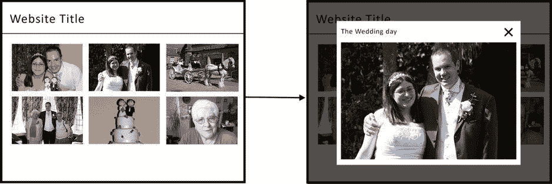

图 8-1。

The journey the user takes on larger viewports

如果您了解这在较小的视窗中是如何工作的，那么您可以调整用户在站点中的行程，以便在点击图像时，它会打开一个新页面来显示较大的图像。此外，在新页面上，您需要确保包含返回到原始图库的链接。图 8-2 显示了用户浏览网站的步骤。

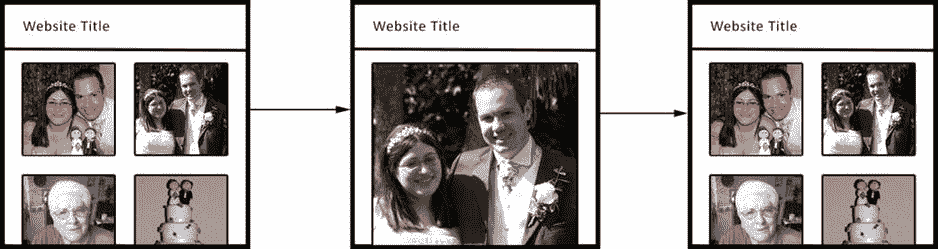

图 8-2。

The journey the user takes on smaller devices

实现这一点的方法是在图像周围设置一个链接到新页面的锚链接，对于较大的视窗，只需使用 JavaScript 在模式窗口中加载图像。我将在第九章中解释如何实现这一点。

#### 产品搜索

通常情况下，如果你的网站是一个产品，你的用户很容易快速找到你的产品信息；然而，对于销售各种不同产品的大型零售网站来说，用户能够快速方便地找到他们正在寻找的产品和相关信息是非常重要的。

用户在大型零售网站上搜索产品的典型过程是在搜索框中输入产品名称，然后进入搜索结果页面，如图 8-3 所示。

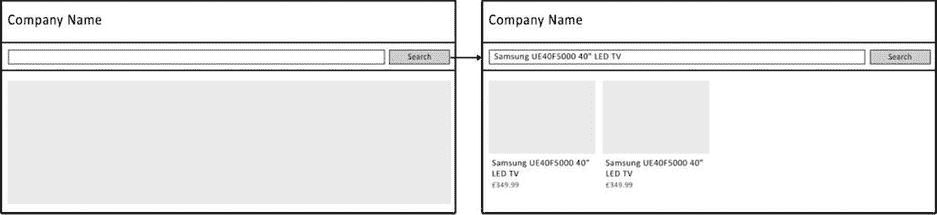

图 8-3。

Path to the results page after entering a search term

这个旅程在一个响应式网站上工作得很好，但是，它没有考虑用户的情况，在这种情况下，结合了用户的当前位置和实际搜索的目的。

传统的情况下，用户可能会在家里的台式电脑上搜索产品，比较功能和价格。这种传统情况是过去大多数用户使用网站的方式。然而，随着智能手机的普及，出现了新的情况，有人可能在外面购物，看到他们感兴趣的产品，并希望确保他们得到最好的价格。为了做到这一点，用户拿出他们的手机，在网上搜索产品，也许是通过访问你的网站，搜索产品。

这种情境行为在以前是不会被考虑，但是对于一个响应式站点，开发人员现在需要开始假设一个站点可以在任何地方使用，因此在设计网站时需要考虑这一点。部分问题是访问者的情境行为不容易被检测到。开发人员不知道用户是在商店里还是在家里，虽然您可以尝试使用地理定位 API 来确定他们的位置，但这是不切实际的，原因有几个。您必须知道您的客户可能在的所有不同商店的位置，并且您还需要请求用户允许您使用他们当前的位置。

因此，与其试图检测用户的情况，不如对预期的用户情况进行有根据的猜测。要做到这一点，您应该研究用户选择使用特定设备的典型情况，然后考虑在这种特定情况下他们会从哪些功能中受益最多。此外，如果你已经有了一个网站的在线版本，并且你可以访问分析数据，你可以看看你的用户已经在使用你的网站做什么，以告知你如何针对某种情况优化你的网站。

如果您再次查看产品搜索的示例，您可能会认为用户在商店时很可能会使用该站点来查找价格。很自然，您会希望确保他们能够以尽可能少的步骤完成这项工作。这样做的第一步是优先考虑用于产品发现的内容；对于销售各种产品的网站，这可以通过确保当页面加载时，产品搜索框立即对用户可见来实现。如果你的网站专注于销售一些你自己的产品，你应该展示一些基本信息，包括价格，这样用户甚至不用离开他们登陆的页面就能找到他们想要的信息。

在较大的视窗中，虽然搜索仍然是网站的一大特色，但用户更可能只是浏览网站，并不完全确定他们在寻找什么(可能是为朋友寻找礼物，但不确定买什么)。因此，你要确保产品发现是网站的一个重要部分，根据以前的购买显示类别和建议。

除了如何确定内容的优先级，您还应该考虑如何使用渐进式增强来利用设备提供的新功能。产品搜索的一个例子是允许用户拍摄产品或条形码的照片来搜索产品。对用户的好处是，他们不需要输入复杂的产品名称，比如“Samsung ue40 f 5000 40”LED TV，而是简单地拍一张照片。

为了实现这一点，您需要确定设备是否支持摄像机 API，然后对于那些支持的设备，为用户提供一个额外的按钮，他们可以激活该按钮来加载摄像机。如果只找到一种产品，网站可以直接把用户带到该产品，否则他们将被带到一个搜索结果页面。本例的用户旅程如图 8-4 所示。

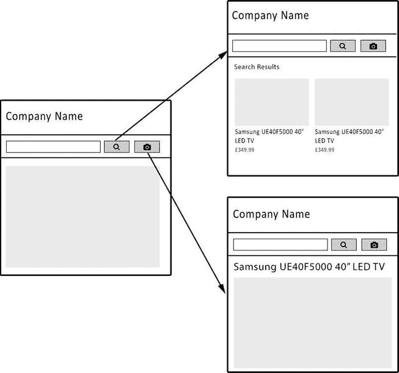

图 8-4。

User journey for devices that support the camera API

#### 选项卡式容器

组织网站内容的一种方法是将内容分成用标签切换的容器。这些使您能够将内容分成有意义的部分，允许站点的用户通过在选项卡上显示内容的清晰标题来直接找到他们正在寻找的内容。它们在较大的显示器上工作得非常好，然而，在较小的设备上，标签会变得拥挤，通常没有足够的空间来正确显示标题。在这种情况下，有必要调整功能，使其更适用于较小的视口。

在较小的视口中更改功能的一种方法是对其进行调整，使选项卡面板在较小的视口中像手风琴一样显示。通过这样做，标题将有更多的空间可见，用户仍然可以点击不同的内容容器。

### 下拉菜单

对于 web 站点来说，将下拉菜单作为主导航的一部分是很常见的，通常用户将鼠标光标悬停在下拉菜单上就会激活这些下拉菜单。不幸的是，这一功能并不能很好地适用于用户使用触摸屏而不是鼠标的移动设备。一些移动浏览器试图通过在用户点击项目时触发 CSS 悬停来解决这个问题，然而，通常用户很难禁用他们悬停的内容。因此，您需要考虑如何调整这些下拉列表，以便更好地跨设备工作。Twitter Bootstrap 下拉菜单使用的一个建议是完全放弃悬停功能，只允许用户点击或点击来切换下拉菜单的打开或关闭。

#### 视差

视差是一种当用户上下滚动时以不同速度滚动页面元素的技术。这种技术允许您在用户向下滚动时显示动画，以增加页面的深度。

该技术擅长的地方是在较大的视口中，那里有用于过度动画的空间。这是一种非常好的讲述故事的技巧，无论是关于产品、服务还是公司。当您开始考虑如何在更小的视口中工作时，问题就出现了，因为那里没有足够的空间来讲述故事。

开发人员在试图让 parallax 在小型设备上工作时面临的一个问题是，当用户滚动时，parallax 通常使用固定定位来定位元素。不幸的是，小型设备不能依靠固定定位，因为许多移动浏览器的实现不完整或有问题。

另一个问题与浏览器触发`onscroll`事件的方式有关。在桌面浏览器上，当用户滚动时，它被连续触发，但是在较小的设备上，直到滚动动作停止时，才触发`onscroll`事件。这意味着当用户滚动时，你不能使用`onscroll`事件来激活元素，因为元素直到用户停止滚动后才会更新。

通过首先构建站点移动，您可以从一开始就考虑这一点，构建一个用户可以轻松上下滚动的线性页面，然后对于较大的视窗，您可以逐步增强页面。通过逐步添加视差效果，它使您能够建立一个响应视差网站。

#### 社会的

随着社交网络越来越受欢迎，有一种趋势是包括按钮，使用户能够通过点击或触摸按钮来与他们的朋友和追随者共享内容。有大量这些不同的按钮可用于共享内容。值得注意的包括脸书的“喜欢”按钮，Twitter 的“Tweet”按钮，Google+“加一个按钮”，以及 Pinterest 的“Pin”按钮。

分享你的内容只是用户浏览你的网站的一小部分，然而，值得考虑的是，你的用户如何与他们互动可能会因他们使用的设备而有所不同。事实上，最近在 Marketing Land 2 上的一个帖子谈到了几乎两倍的社交份额来自移动设备。这意味着开发人员需要确保按钮位于清晰的位置，并且大小合适(苹果的指南建议移动设备上的按钮最小大小为 40×40px)。由于可用空间有限，这在小设备上可能很难做到，尤其是有许多不同的分享按钮，所以选择与用户和网站主题最相关的社交网络很重要。

除了知道三分之二的社交网络分享可能来自移动设备之外，看看社交分享按钮的总体效果也很重要，因为三分之二的无仍然是无。最近，英国政府网站进行了一项试验，将社交共享链接纳入其页面。他们发现，十周后，只有 0.2%的页面浏览量导致用户在他们的社交网络上分享该页面。如果你接着查看试验数据的分类，就会发现内容类型和分享频率之间有明显的联系，最受欢迎的内容是在世界定位页面上分享的(0.58%)，最不受欢迎的是咨询信息(0.06%)。

### 适应用户旅程的总结

查看了一些常见的用户交互示例后，您现在应该对可能不适用于所有视口大小的用户交互类型有所了解。记住这一点，您现在应该能够在需要的地方调整这些交互，以便更好地适应不同的视口大小。

## 用户测试你的响应网站

通常，开发人员必须对我们的用户做出许多明智的假设，然而，不可能总是正确的，通过了解我们的用户，我们可以不断改进我们的网站。了解网络用户的最好方法是通过用户测试，让真正的用户使用你的网站，看看他们如何与网站互动。

等到你的网站开发过程结束才开始思考甚至做用户测试，为时已晚；重要的是从早期阶段你就知道你能在你的网站上使用什么样的测试。你可能听说过“最低生存产品”这个术语；这基本上是你的基本网站，没有多余的装饰，但是它是功能性的，并且已经安排好了用户的旅程。从本质上来说，网站应该处于这样一个阶段:如果你开始使用它，它仍然会为用户工作。当你有了这个最低限度的可行产品，你就可以开始让用户测试网站，这样你就可以开始得到一些关于用户旅程的不同部分是如何工作的反馈。

从用户测试中你可以学到一些重要的东西:

The different journeys the user takes through the site, so you can then compare this against how you originally thought the user would go through the site and learn from it.   Where the user faces difficulties using the site.   What the user likes about the site, which can guide how you develop the site going forward as you continue to use similar ways of displaying content.  

您可能已经在以前的站点上使用了用户测试，但是，当您开始在一个响应站点上使用用户测试时，它会变得更加困难，因为它是为跨各种不同的视口工作而构建的。这意味着，在现实中，测试一个响应站点更像是测试几个站点，每个站点针对不同的设备，而不是简单地测试单个站点。当你为不同的用户提供不同的旅程时尤其如此。

### 进行用户测试

有许多不同的方法来执行用户测试，但是，所有的方法都有不同的优缺点，所以在做出决定之前，权衡每种方法的利弊是很重要的。

#### 小组讨论

焦点小组是你聚集一群个人，最好不超过十个，他们是你的目标市场的一部分，让他们测试网站。测试完网站后，你可以让他们和一个主持人组成一个小组，讨论他们对网站的想法。焦点小组的目的是收集各种不同的人对网站工作方式的想法。

经营焦点小组有很多好处，最主要的好处是他们能让你了解用户对你网站的看法。为焦点小组选择的人来自目标市场，所以这将让你对你的目标用户有一个概念，包括他们觉得容易的和他们觉得困难的。

此外，在焦点小组中，在主持人的指导下，用户可以讨论他们对网站的想法。这允许用户基于彼此的答案，解释他们同意和不同意小组中其他人的地方。有了这种格式，你就可以平衡个人用户对网站的任何极端观点，否则这些观点可能会扭曲焦点小组的结果。作为焦点小组的一员，主持人有责任防止不必要的偏见，并且作为其中的一部分，他们需要负责确保焦点小组的一名或多名成员不会主导回答。相反，你要确保你得到的回答在整个团队中是平衡的。

当谈到在一个响应性网站上运行焦点小组时，重要的是你的用户都在讨论同一件事。这就是为什么对于每个站点断点，您需要运行一个单独的焦点组。通过这种方式，您可能会有一个针对移动体验的焦点小组，一个针对平板电脑体验的焦点小组，以及一个针对桌面体验的焦点小组。除此之外，你可能希望你的焦点小组专注于对你的网站至关重要的特定用户旅程，如果是这样的话，你应该要求你的焦点小组成员把他们的注意力放在那里。

使用焦点小组测试网站有许多缺点，主要是与运行焦点小组相关的成本。你不仅需要补偿焦点小组成员的时间，还需要在焦点小组会议期间雇佣一名独立的主持人来主持会议。你还需要考虑焦点小组不是在自然环境中；我的意思是，用户在使用网站时通常会被观察到，这可能会让他们感到不安，不太可能坦率地表达他们对网站的感受。

此外，在向焦点小组成员提问时，主持人可能会以影响答案的方式提问，从而引入偏见。因此，在会议之前审查问题以确保措辞不会扭曲答案是非常重要的。

#### 可用性测试

可用性测试是目标市场成员和服务商之间一对一的对话。辅导员的角色是引导用户完成您希望他们执行的任务，然后分析用户在每项任务上的表现。

与焦点小组类似，您需要在您设置的所有不同响应断点上运行可用性测试。不幸的是，让每个用户测试站点的所有不同状态可能会引入不必要的偏见，所以您需要让不同的用户测试每个状态。

使用可用性测试的主要优点是，使用这种一个用户，一个主持人的方法，主持人可以观察用户使用网站时遇到的困难，这些困难在焦点小组环境中可能不会出现。与此类似，用户面临的在焦点小组中提出来可能会令人尴尬的困难可能会更容易与主持人讨论，而没有其他人在场听取。

除了主持人在用户使用网站时观察他们之外，记录会话也是值得的，这样你可以在以后回去更详细地回顾用户面临的困难。这种重新观看会话的能力意味着可能被忽略的问题也可以被修复。

类似于运行焦点小组，运行可用性测试也有相关的成本。对于你运行的每个可用性测试会议，你需要补偿用户和主持人的时间。可用性测试是一个一对一的会议，这比组织焦点小组更昂贵，因为你必须为每个参加会议的用户付费。

#### 朋友、家人和同事

如果焦点小组和可用性测试由于成本原因都不是合适的选择，很可能你认识的朋友、家人，甚至同事会很乐意浏览你的网站并给你他们的想法。

你对这些用户进行测试的过程是让他们坐在设备前，让他们使用你的网站，可能是给他们一个简单的任务，让他们在使用网站的过程中完成。在测试过程中，你应该注意他们完成给定任务需要多长时间，因为这将帮助你确定旅程是否过于复杂。

除了记笔记，如果你有摄像机，你可以拍摄测试网站的人，特别是确保摄像机可以看到屏幕。这意味着您可以在以后回放视频，以防记笔记时遗漏了什么。

朋友和家人可能是测试你网站的宝贵资源，但是，重要的是要考虑他们是否是你网站的目标受众，甚至是你网站试图销售的产品，因为你可能最终会得到错误的结果。你也可能会发现，由于他们与你的关系，他们过于挑剔或不够挑剔。这些问题可能会扭曲向他们寻求帮助所获得的结果。

同事很可能知道你的产品，并有可能成为目标受众，但这可能意味着他们有投资兴趣，这影响了他们在测试网站时的判断。

除了这些问题，朋友、家人和同事是用户测试最便宜的选择，尽管你可能会发现有些结果需要保留，但你也有希望得到一些反馈，可以用来改善网站的用户体验。

## 网络分析工具

当谈到建立一个响应用户的旅程时，能够衡量这个旅程如何影响用户是很重要的，这样你就可以改善这一点。在您做出任何改进之后，您可以衡量它对用户体验产生了积极还是消极的影响。

衡量用户旅程的主要方法是跟踪网站的有效性。我的意思是通过观察用户使用网站的时间长度，他们在只看了一页后离开网站的可能性，以及他们通过网站的流量。衡量有效性可能真的很重要，例如，在企业的情况下，他们希望确保网站实现其将网站用户转化为客户的目的。您还需要能够衡量为改进网站而对网站进行的更改对网站产生了积极还是消极的影响。最好的方法是通过使用网络分析工具。

网络分析工具是可以安装在网站上的工具，使您能够测量网络流量，以评估和提高网站的有效性。他们通过跟踪用户如何使用网站来做到这一点，跟踪的类型取决于所使用的个人分析工具。

有许多可用的网络分析工具，其中一些是完全免费的，一些是收费的。我将在这里重点介绍的两个分析解决方案是 Google Analytics 和 ClickTale，这两个解决方案提供了非常不同的功能集，可以同时使用来帮助您了解更多关于您的用户的信息。

### 谷歌分析

Google Analytics 是一个免费的分析网站，可以让你追踪网站用户的信息。这些信息是完全匿名的，但是它可以给你一个明确的指示，告诉你访问你的网站的用户的类型。您可能以前在您的网站或您的一些客户网站上使用过 Google Analytics，但是，您可能没有做过的是深入到统计数据中查看访问您的网站的设备类型，或者使用它来查看您的用户在您的网站上的旅程。

对开发者来说，非常重要的一件事是了解我们网站的访问者使用的浏览器和设备。虽然 StatCounter ( [`http://gs.statcounter.com/`](http://gs.statcounter.com/) )提供的全球统计数据很好地展示了用户的总体使用情况，但这可能与您在自己的网站上体验到的情况有很大差异。这样做的主要原因是网站的目标受众对他们使用的浏览器和设备有很大的影响。例如，支持政府组织的公司可能有大量用户来自一个特定的浏览器，因为这是政府选择使用的浏览器。这就是像 Google Analytics 这样的分析工具可以为开发者增加价值的地方，因为他们能够记录用户正在使用的技术。

当涉及到提供关于浏览器的信息时，谷歌分析可以提供很多。要访问 Google Analytics 的浏览器部分，您需要点击“受众”菜单项，然后点击“技术”,再点击“浏览器和操作系统”。这将显示一个表格，列出所有访问该网站的浏览器，按最流行的排序。包括从该浏览器访问的用户数量信息以及他们的行为信息。如果你看一下我在图 8-6 中展示的谷歌分析工具的截图，你会注意到还有一个额外的选项，可以通过添加第二个维度来进一步过滤这些信息，或者你可以选择单击浏览器的名称来了解更多关于访问你的网站所使用的浏览器的具体版本的信息。图 8-5 显示了用来查看我的网站的浏览器和操作系统的分解视图。

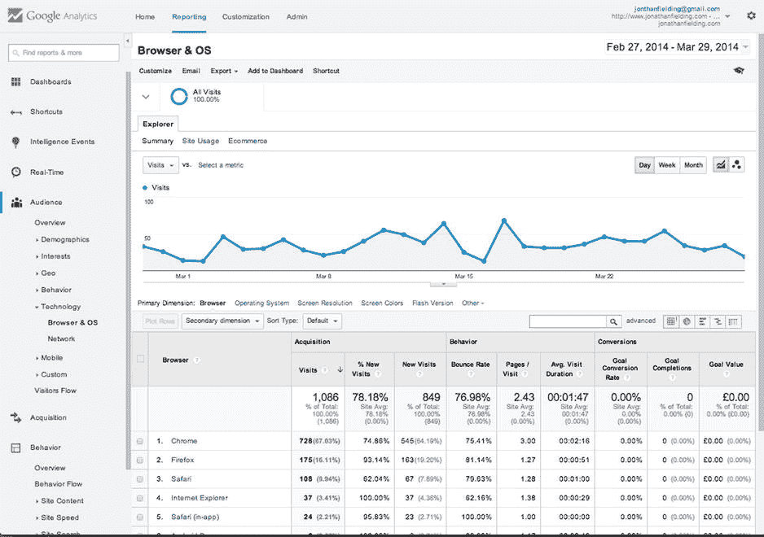

图 8-5。

Breakdown of different browsers being used to access my site in Google Analytics

知道哪些浏览器被用来访问你的网站是非常重要的，因为你想知道哪些浏览器你需要支持和测试你的网站。但是，因为您正在开发一个响应站点，所以了解哪些设备正被用来访问站点也很重要，因为这将使您能够确保您的站点在访问站点时最常用的设备上进行测试。

谷歌分析的设备信息有两个部分；首先，是概述页面。要访问 Google Analytics 的浏览器部分，您可以单击受众菜单项，然后单击移动设备，然后单击概览。在本节中，您将看到按设备类别分类的设备，目前包括台式机、移动设备和平板电脑。这使您能够很好地了解用户正在使用的设备类型。定期检查这些数据非常重要，因为新设备类型的当前采用率可能会频繁变化。

谷歌分析的设备信息部分的第二部分允许你确定你的用户使用哪些设备访问你的网站。要查看这些信息，请访问“设备”页面中“移动设备”下的“受众”部分。在这个页面中，您可以很容易地看到访问您站点的不同设备，包括来自每个设备的用户百分比的统计数据。图 8-6 中的截图向您展示了设备视图，默认情况下，该视图显示按每台设备的访问次数排序的设备，最常见的设备显示在最前面。谷歌在这个视图中包含了一个小彩蛋，如果你点击设备名称旁边的小相机图标，你会看到设备的图像。图 8-6 显示了我的网站的谷歌分析设备列表视图。

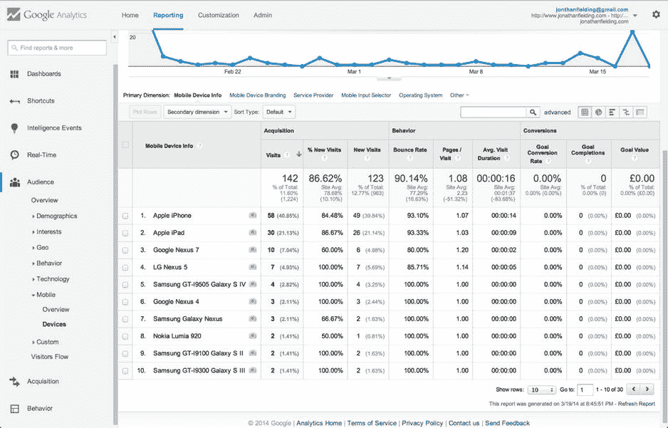

图 8-6。

Breakdown of the devices used to access my site as shown in Google Analytics

了解用户使用的浏览器和设备对开发人员来说非常重要，但是正如本章所强调的，开发人员也需要考虑用户浏览网站的过程。规划你认为用户将如何浏览一个网站是很重要的，但是你也需要能够衡量这一点，看看你的期望是否与现实相符。这就是谷歌分析行为流工具特别有用的地方。

如图 8-7 所示，行为流工具从左侧开始，显示用户到达我的网站时所登陆的页面。向左移动可以显示用户继续浏览网站的位置，下降的是在该点离开网站的用户数量。

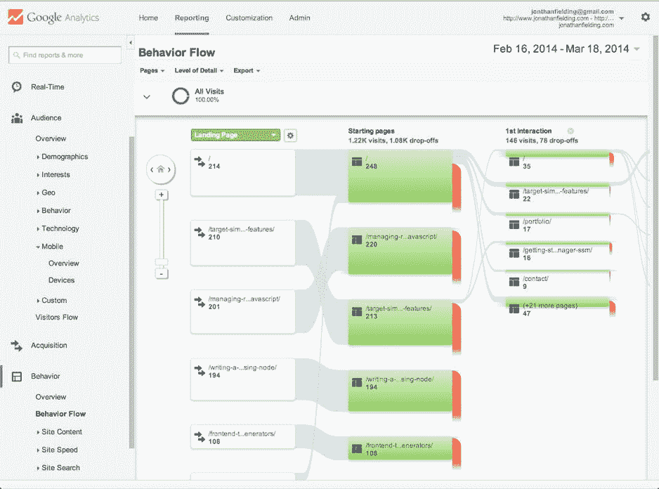

图 8-7。

The Behavior Flow of a site shown in Google Analytics

在了解了用户如何使用你的网站后，你可能会想尝试做些改变来改进它。很难确定对网站的改进会给用户带来更好的体验；然而，Google Analytics 能让你做的是创建一个实验，向用户展示一个页面的多个版本之一。这与脸书和 Twitter 等社交网络向一小部分用户推出新功能，以试验用户如何与他们互动的方式类似。然后，成功的实验会在整个站点铺开，不太成功的实验会被丢弃或查看，以了解它们出错的原因，并在做出更改后重新运行。

当在 Google Analytics 中使用实验时，您可以点击 Create experiment，这将带您进入实验创建屏幕。我的网站的实验列表页面如图 8-8 所示。

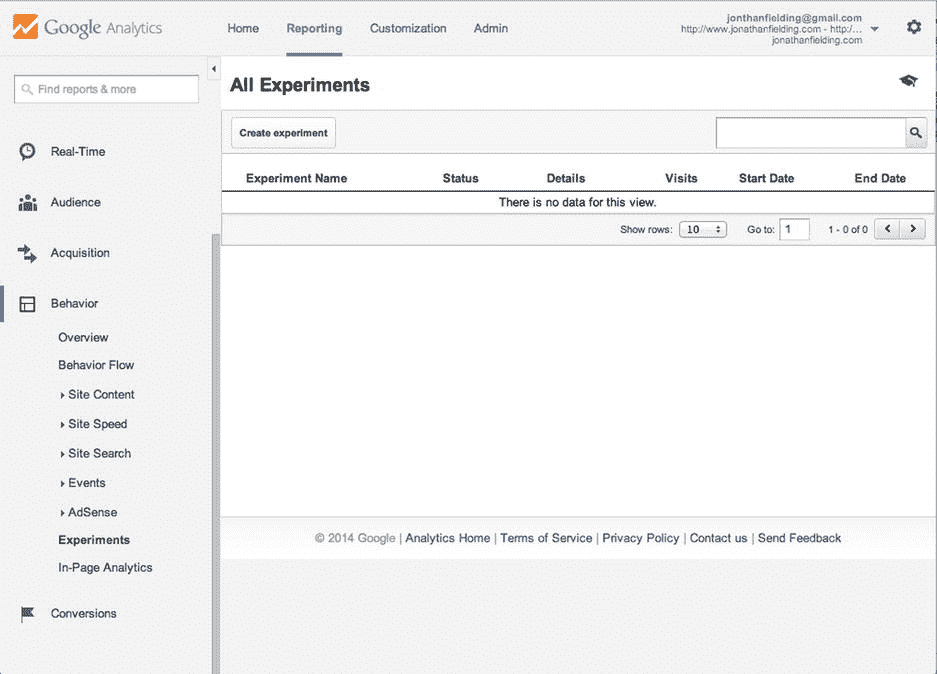

图 8-8。

The experiments listing page in Google Analytics

然后，系统会提示您输入实验的名称，定义一个目标，然后选择要用于实验的流量百分比。重要的是要注意，你选择的流量百分比完全取决于你在进行实验时期望你的网站获得的访问者数量。你要保证你从实验中得到足够好的样本量，但是，你也要保证你把实验的风险降到最低。百分比越低，风险越低。还有一些额外的高级选项，允许您定义实验将持续多长时间，以及如何在实验期间分配流量。图 8-9 显示了如何创建实验。

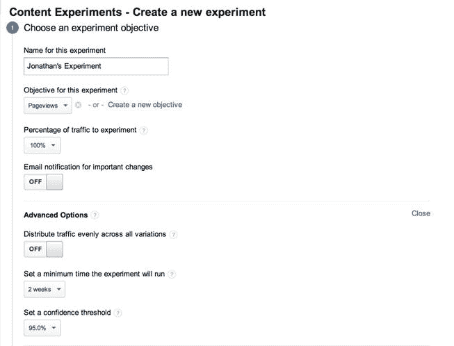

图 8-9。

Creating an experiment in Google Analytics

在您设置了实验的目标之后，您可以单击“下一步”按钮，并且您将能够开始配置它。要配置实验，请输入您想要实验的原始页面的 URL，然后您可以添加多达九种页面变体(图 8-10 )。您可以为每个变体命名，并且需要包含一个直接指向每个变体的链接。

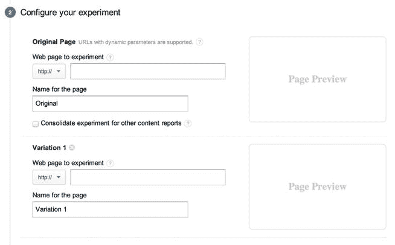

图 8-10。

You can configure multiple variations for your experiment

设置好变体并单击“下一步”按钮后，您可以选择手动将实验所需的代码插入到您的网页中，或者通过电子邮件发送给网站管理员。因为您是开发人员，所以您只想从文本框中复制代码(如图 8-11 所示)并粘贴到您的页面中。

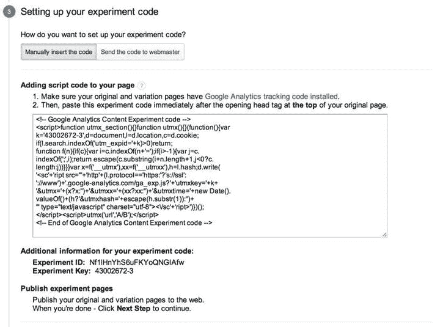

图 8-11。

The final step of creating an experiment outputs the script to add to your page

将代码添加到您的 web 页面之后，您现在可以单击 next step 按钮，这将验证代码是否已经就绪，并允许您开始实验。然后，您可以定期查看页面的不同版本的执行情况。

在 Google Analytics 中使用实验可以非常有效地让你测试如何改善用户体验的新想法。如果使用正确，这些工具可以让你继续改进你的网站，让你知道哪些改进用户喜欢，哪些不喜欢。

### 点击式

ClickTale 是一种不同类型的分析工具，专注于衡量有多少访问者访问了一个网站，而不是关注访问者的行为。

ClickTale 的核心功能之一是它能够记录用户如何与网站交互，这是通过跟踪用户在页面上执行的操作并记录下来实现的。这对开发者来说意味着，我们可以很容易地看到用户在浏览网站时的困难所在。

在图 8-12 中，正在播放一个 ClickTale 会话。您可以完全控制如何播放用户的会话，能够播放、滚动视频以及以不同的速度回放。

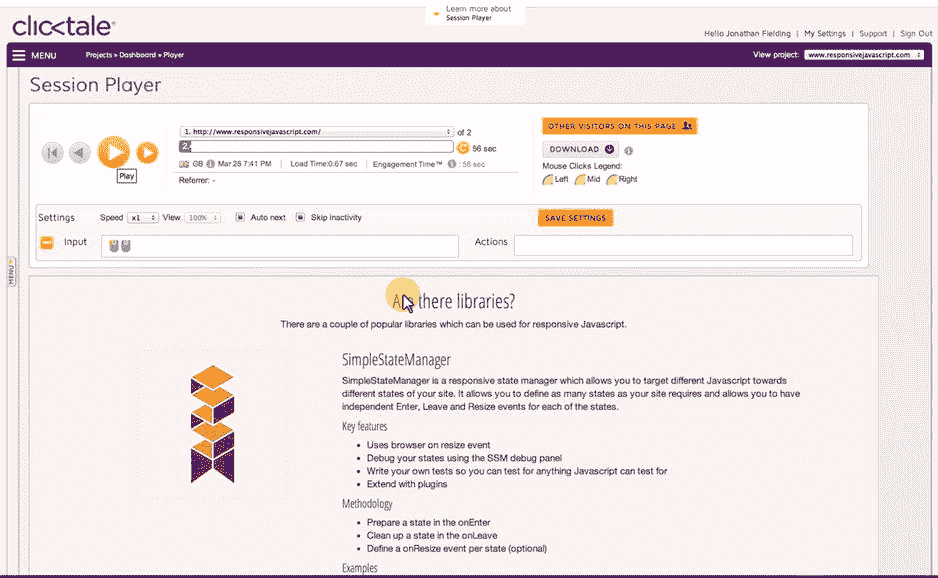

图 8-12。

Playback of a ClickTale user session

除了记录浏览网站的用户，ClickTale 还可以利用这些数据生成热图。热图是数据的图形表示，显示数据中的相关性，在这种情况下，这就是用户如何与网站交互。ClickTale 允许您查看一系列不同的热图，每个热图关注不同的指标:鼠标移动、用户点击的位置、用户关注的位置以及用户通常在页面上滚动到的位置。

要在 ClickTale 中查看热图，只需从主仪表板中选择您想要查看的热图。在图 8-13 中，我选择了鼠标移动热图，正如所料，您可以看到用户移动鼠标的主要区域是主导航。您还会注意到，在导航上的链接周围有一个小方框，下面有一个百分比。这是点击这些链接的用户的百分比。

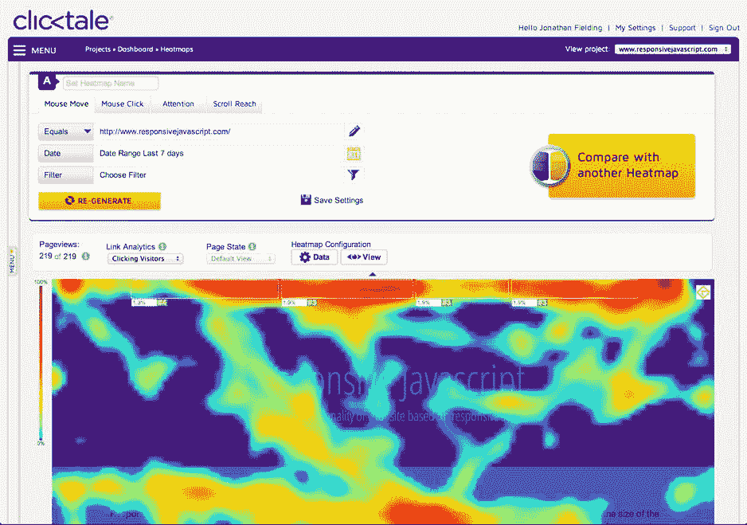

图 8-13。

The heatmap view of ClickTale

与谷歌分析类似，ClickTale 允许你观察用户如何浏览网站，这是通过他们的转换漏斗实现的。ClickTale 的实现相对于 Google Analytics 的好处在于，它允许你更容易地进行过滤，而不必进行大量的配置，并且它专注于在达到最终目标之前查看用户退出你的网站的位置。界面也更简洁，更容易使用。

要开始使用转换漏斗(如图 8-14 所示)，请转到仪表板并向下滚动到转换漏斗部分，单击查看/编辑漏斗链接，或者使用侧栏菜单并选择转换漏斗。

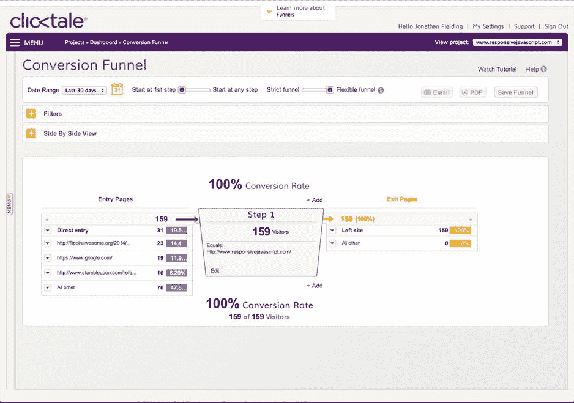

图 8-14。

The ClickTale conversion funnel

虽然 ClickTale 是一项商业服务，但它提供了一个能够记录 5000 次浏览量的免费账户。尽管这只是一个小样本，但您可以通过向 ClickTale 提供您预计会收到多少浏览量的估计来使它更加公平，这样它就可以记录一个随机样本。例如，如果你预计有 50，000 次浏览量，那么 ClickTale 可以被设置为记录这些用户中的十分之一。

## 摘要

我相信管理用户体验不是一门科学，而更像是一门艺术——因此，做事没有严格的对错之分。这一章的目的仅仅是引导你开始塑造你的响应站点的旅程。值得注意的是，虽然讨论的许多内容都可以作为构建响应之旅的起点，但用户的最佳体验是围绕他们试图通过您的网站实现的目标而定制的。

网站的内容是网站的核心，当你了解到用户感兴趣的内容时，你不应该害怕改变它。您可以通过使用用户测试和这里讨论的分析工具来测量用户感兴趣的内容，然后进行调整和再次测量，看看您是否做出了任何改进。

当开发你的用户之旅时，重要的是要记住你不一定第一次就 100%正确，这没关系；这是构建良好用户体验的本质。然而，你需要确保的是，你把你在船上学到的东西反馈到改进和发展你的网站上。

响应式设计是一种相对较新的技术，它可能会非常强大，但正如网站开发中的所有新事物一样，它将如何影响用户体验还有许多未知因素。这就是为什么恰当地衡量你的站点完成目标的程度是非常重要的，这样你就可以迭代和改进它。

作为这一章的一部分，我解释了你可以分析你的网站的用户旅程的方法，特别是看看你如何使用用户测试和分析工具来进一步改善你的网站。本章中解释的测试用户旅程的两种方法在你的站点中都有一席之地，它们可以很好地相互补充。

下一章将介绍如何使用响应式 JavaScript 技术将本章讨论的一些技术应用到一个站点上。

Footnotes 1

[`http://bradfrostweb.com/blog/mobile/fixed-position/`。](http://bradfrostweb.com/blog/mobile/fixed-position/)。

  2

[`http://marketingland.com/when-it-comes-to-social-media-sharing-mobile-rules-52750`](http://marketingland.com/when-it-comes-to-social-media-sharing-mobile-rules-52750) 。

  3

[`https://insidegovuk.blog.gov.uk/2014/02/20/gov-uk-social-sharing-buttons-the-first-10-weeks/`](https://insidegovuk.blog.gov.uk/2014/02/20/gov-uk-social-sharing-buttons-the-first-10-weeks/) 。