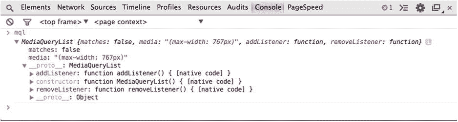
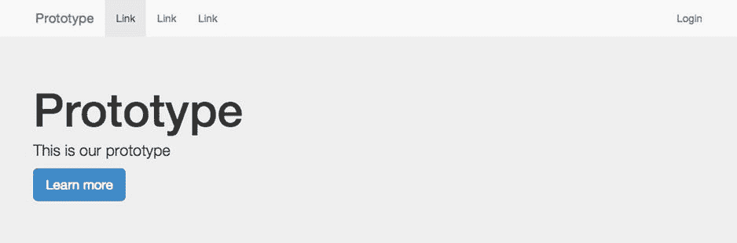
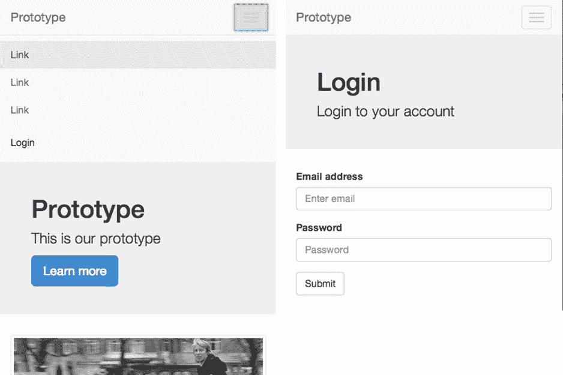
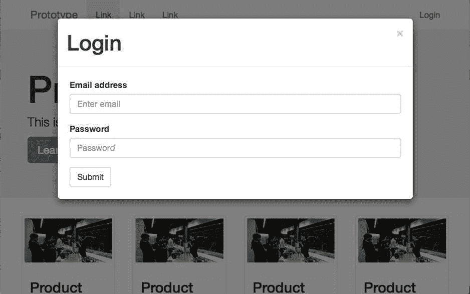

# 九、跨响应状态的 JavaScript

使网站具有响应性的最常见方法是在样式表中使用媒体查询。媒体查询定义了浏览器显示这些特定样式所必须满足的规则。然而，使用媒体查询的主要限制是，它们只能用于改变站点的外观和感觉，因为它们在改变网站功能的方式方面只有有限的用途。为了正确响应网站支持的不同类型设备之间的差异，并提供真正的响应体验，必须结合样式表中的媒体查询使用其他技术。

对功能改变的潜在需求将由设备上可用功能的差异和它提供的视窗的大小来确定。设备之间的差异可能意味着不同设备上的用户可能会以完全不同的方式与您的网站进行交互。特别是，不同的输入方法，如触摸屏、电视遥控器、键盘和鼠标交互，都需要以不同的方式进行整合，以允许各种设备访问最高级别的网站功能。

为了满足跨响应状态更改功能的需求，您需要学习如何使用 JavaScript 来响应浏览器。甚至当我坐在这里写这一章的时候，我意识到用户体验设计师和开发者都在思考可以添加到网站中的新交互。在试用时，您可能会发现这些交互在您想要支持的各种设备上不能很好地工作，您可能希望能够调整这些功能。因为不可能涵盖您可能发现自己正在实现的每一个交互，所以本章着重于用必要的工具武装您，使您能够通过使用渐进增强技术来处理变化。

本章将探讨:

Different functionality across responsive states   Techniques for changing functionality   Implementing responsive JavaScript techniques  

## 不同响应状态的不同功能

在响应式设计出现之前，当构建网站时，开发人员的目标是在他们想要支持的各种浏览器上提供相同的网站功能。在这不可能的地方，他们可能会尝试给老版本的浏览器提供降级的体验。然而，开发人员可以依赖的是，用户可能会使用键盘和鼠标与网站进行交互，因为用于控制网站的输入方法的数量非常有限。知道用户只会用键盘和鼠标与站点交互意味着开发人员可以优化这种体验，一个例子是当用户悬停在页面的特定元素上时添加功能。

随着新设备(特别是智能手机)进入主流，开发人员已经看到越来越多的用户开始与网站交互的输入方法。智能电视的触摸屏和简单遥控器等新的输入方法大大拓宽了旧的输入范围。因此，开发人员现在需要在为网站添加功能时考虑这些新的输入法。因此，开发人员需要考虑一些他们已经开始依赖的用户交互，比如悬停、鼠标进入和鼠标离开，在触摸屏上是行不通的。

除了不同的用户输入方法之外，还有越来越多的功能可以在为其构建网站的设备上使用。在这些功能中，越来越常见的是具有支持功能的设备，如摄像头、地理定位、运动和不同的设备方向。

如果我们放眼未来，设备会有许多新功能。一个这样的新 API 是振动 API，它通知用户应用程序中的变化，或者提供类似于游戏控制台如何通过振动提供反馈的反馈。

凭借所有这些新功能，它使开发人员能够添加桌面浏览器无法实现的新功能。这些技术需要使用渐进增强来实现，因为并非所有设备都是生而平等的。因此，尽管您可能已经在使用媒体查询逐步增强您的站点，但您也需要开始用 JavaScript 来做这件事。

第八章着眼于不同的、常见的用户交互，目的是探索如何使它们更好地工作。第八章提供了几个常见用户交互的例子，其中五个需要对用 JavaScript 构建的功能进行修改:

*   模态窗口
*   产品搜索
*   选项卡式容器
*   下拉菜单
*   视差

## 改变功能的技术

在第八章的中，我们已经探讨了为什么要根据不同设备的功能来改变它们的功能，现在让我们来看看如何实现这些功能上的改变。

可用于更改功能的技术可以分为两类:功能检测和状态管理。对这两种技术都有很好的理解是很重要的，这样你就知道什么时候可以单独使用或者一起使用来获得想要的结果。

### 特征检测

媒体查询极其受限的主要领域之一是检测浏览器的特征。虽然媒体类型可以在很小程度上用于确定用户使用的设备类型，但是有许多设备具有大量不同的可用功能，所有这些功能都响应媒体类型“屏幕”这意味着你不能依赖媒体类型来给你任何关于一个设备可能有哪些功能的想法。类似地，虽然媒体查询可以检测视口的大小或设备像素密度，但它们不能检测 JavaScript APIs 或大多数 HTML5 功能。考虑到这一点，您需要找到其他方法来检测这些特性，这可以在 JavaScript 中完成。

使用 JavaScript，您可以通过编程来检测某个特性是否受支持，并且可以构建一个网站来做出适当的响应。根据您想要检测的功能类型，可以采用不同的技术来确定它是否受支持。了解检测特性的不同方法很重要，所以让我们来看看可以使用的不同方法。

#### 全局对象的一部分

检测一个特性是否被支持的最简单的方法是它是否被暴露在全局对象上(例如，`window`对象)。如果它属于`window`对象，那么该特征被支持。

应用这种技术的一个例子是测试浏览器是否支持 localStorage API。您可以简单地检查`window`对象上的`localStorage`是否存在，如以下代码所示:

`var hasLocalStorage = function(){`

`return 'localStorage' in window;`

`}`

#### 元素的一部分

相反，如果您想要测试对作为 HTML5 规范的一部分添加的特定元素的支持，您将需要创建一个元素并测试该元素的特定特性。

可以使用这种方法测试的元素的一个例子是`Canvas`元素。您首先需要创建一个虚拟元素。在本例中，您将把它存储在一个名为`elem`的变量中。然后，您可以通过尝试在元素上调用特定于画布的方法来测试元素对画布 API 的支持；在这种情况下，您将使用`getContext`。通常调用`getContext`时，如果支持 Canvas，会得到一个 Canvas 渲染上下文，否则会得到 undefined。要将其转换为布尔值，只需使用两个感叹号(！！)放在`elem.getContext`之前，如果支持 Canvas，则该方法返回 true，否则返回 false，如下面的代码所示:

`var hasCanvas = function(){`

`var elem = document.createElement('canvas');`

`return !!(elem.getContext)`

`}`

仅仅知道一个元素被支持并不总是足够的；HTML5 视频元素就是一个例子，它在不同的浏览器中支持不同的视频格式。如果您动态添加视频，将所有不同的格式添加到页面中是没有意义的，因此，您需要能够确定浏览器支持哪些视频格式。这方面的一个例子是包括 iPad 和 iPhone 上的 Safari 在内的 Webkit 浏览器支持的 H264 视频格式。要测试对 H264 的支持，您首先要测试方法`canPlayType`，如果它受支持，那么您可以使用该方法来测试对 H264 编解码器的支持。

需要注意的是来自`canPlayType`的值将返回一个具有三个可能值的字符串:可能，也许，或者一个空字符串。考虑到这一点，您需要将变量类型转换(更改变量类型)为 Boolean，这样它就可以返回 true 或 false。为了实现这一点，您可以使用双感叹号(！！)之后再返回值。第一个感叹号将根据值是真还是假进行类型转换，然后取其倒数。然后，第二个感叹号将再次反转该值，因此它与预期的一样。以下代码说明了这一点:

`var hasVideoH264 = function(){`

`var elem = document.createElement('video');`

`if(!!elem.canPlayType){`

`return !!(elem.canPlayType('video/mp4; codecs="avc1.42E01E, mp4a.40.2"'));`

`}`

`return false`

`};`

#### 检查值是否被保留

有时，您希望测试旧元素的新功能，您可以通过向属性添加一个值并测试浏览器是否保留该值或退回到其他受支持的内容来实现这一点。

一个使用它的例子是测试浏览器是否支持新的输入类型。您可以通过将属性类型的值设置为`email`，然后测试浏览器是否忽略这个新值。在忽略该值的情况下，浏览器会默认将输入类型设置为`text`。以下代码说明了这一点:

`var hasInputEmail = function(){`

`var elem = document.createElement('input');`

`elem.setAttribute("type","email");`

`return elem.type === "email";`

`}`

#### 使用图书馆

看了编写测试之后，您可以很容易地看到，测试对特定特性的支持是相对简单的。当你需要测试大量的特性时，问题就来了，因为在不同的浏览器上编写和测试每一个特性是非常耗时的。除了编写自己的测试，您还可以选择使用一个包含各种不同测试的库，这些测试可以在您的代码中使用。一个这样的库是 Modernizr。

Modernizr 是由 Faruk Ateş创建的功能检测库，由一个开发人员社区开发。Modernizr 的目标是允许您测试各种各样的特性。特性检测可以以两种不同的方式使用:首先，它可以在 CSS 中使用，其次，它可以在您的 JavaScript 中使用。

通过检查存储在 Modernizr 对象上的值，可以在 JavaScript 中非常容易地使用 Modernizr。这意味着您可以轻松地将与特定浏览器特性相关的代码包装在条件语句中，以便在运行 JavaScript 之前检查支持。使用 Modernizr 检查地理定位 API 支持的一个例子是:

`if(Modernizr.geolocation){`

`//JavaScript specific to the geolocation API`

`}`

Modernizr 还允许您对 CSS 中不同特性的可用性做出反应；它通过向 HTML 元素添加类来实现这一点，您可以从 CSS 中使用这些类来向您的站点添加样式，以便使用特定的功能:

`.geolocation .local-search{`

`background: #666 url('geosearch.png') center center no-repeat;`

`width: 40px;`

`height: 40px;`

`}`

除了为浏览器支持的特性添加类，Modernizr 还为它不支持的特性添加类，这些类带有前缀`no-`。您可以使用这些带前缀的类来隐藏部件，或者为您选择在您的站点上使用的任何不受支持的功能提供替代或后备。一个例子是:

`.no-geolocation .local-search{`

`display: none;`

`}`

这使您能够逐步增强您的站点，充分利用用户浏览器提供的功能，同时为浏览器不支持这些功能的用户提供支持。

#### 基于特征的动态加载

我已经解释过，您可以通过使用条件语句简单地检查一个特性来对其做出响应，然后如果它是真的，您可以添加或删除特定的功能。但是，在某些情况下，当某个功能可用或不可用时，您可能希望加载附加的 JavaScript 库或聚合填充。例如，对于不支持 window.matchMedia API 的设备，您可以有条件地加载 polyfill。要处理 JavaScript 的这种有条件加载，您可以使用一个名为 yepnope.js 的 JavaScript 库。该库允许您提供一个测试，然后根据该测试的通过或失败提供一组您想要加载的 JavaScript 文件。

要使用 yepnope，只需将带有参数的对象传递给`yepnope`方法。yepnope.js 方法支持的参数有:

`test`: The test you want to use, this should be either true or false, however you can use a method if you immediately run it.   `yep`: An array of JavaScript files to load if the test passes.   `nope`: An array of JavaScript files to load if the test fails.   `both`: An array of JavaScript files to always load for both yep and nope.   `load`: An array of JavaScript files to always load (similar to “both”).   `callback`: A callback for after the file has loaded.   `complete`: A callback for after all files have loaded.  

如果您想了解如何使用 yepnope.js 来测试是否支持 matchMedia API，并在不支持的情况下加载 polyfill，您需要提供一个测试，并将 polyfill 添加到传递给`nope`参数的数组中:

`yepnope({`

`test : function(){`

`if(typeof window.matchMedia === "function"){`

`return true`

`}`

`else{`

`return false;`

`}`

`}(),`

`nope : ['matchMedia.js']`

`});`

这样，如果 window.matchMedia API 不可用，您现在可以有条件地加载聚合填充。

### 国家管理

虽然能够基于浏览器的功能集有条件地运行代码和应用 CSS 确实非常强大，但有时您需要管理基于浏览器状态运行的代码。

当您第一次想到浏览器状态时，您可能会想到关键视口大小。通过这种方式思考，你可能会猜测有四种不同的状态:超小、小、中和大。然而，浏览器状态的定义可以进一步简化为视口在任意给定点的大小。这意味着当谈论状态时，不要从关键视口大小或设备的角度来考虑它们，而应该从代码所针对的一系列维度来考虑它们。

理解什么是状态可以让你正确地思考你需要做什么来管理你的状态。管理状态时，您需要做的关键事情是如何激活、停用和管理不同状态之间的转换。例如，当状态被激活时，您可能想要添加一项功能，而当状态被停用时，您可能想要移除该功能。

有许多方法可以使用浏览器提供的 API 来管理浏览器状态。我将解释的两个 API 中的第一个是 window.matchMedia API，这是一个与媒体查询一起引入的新 API，允许您在 JavaScript 中测试媒体查询。我要解释的第二个 API 是 window.onresize API，虽然它最初不是为响应式设计而设计的，但正如我将要解释的，它可以用于管理响应式状态。

为了正确理解如何使用这些 API，让我们分别研究一下，看看每种方法的好处。

#### window.matchMedia

使用 window.matchMedia API，您可以测试单个媒体查询，以检查它是否与当前浏览器状态匹配。您在 API 中使用的媒体查询与您已经了解的在 CSS 中使用的媒体查询是相同的。

使用这个 API 最简单的方法是检查媒体查询当前是否匹配。这可以通过调用`window.matchMedia`并将想要测试的媒体查询作为参数传递来实现。然后，API 将返回一个 MediaQueryList，这是一个包含几个属性的对象，其中一个属性是`matches`，当查询时，它的值将为 true 或 false。如果您将这些放在一起作为一个简单的条件语句来检查媒体查询是否匹配，它将类似于下面的代码:

`if (window.matchMedia("(max-width: 767px)").matches) {`

`// the viewport is a small device`

`} else {`

`// the viewport is a larger device`

`}`

虽然能够测试媒体查询当前是否匹配非常有用，但 window.matchMedia API 的真正强大之处在于它能够将侦听器添加到使用媒体查询创建的 MediaQueryList 中。如果您将侦听器添加到 MediaQueryList，它允许浏览器在媒体查询匹配或不匹配时通知您，从而允许您做出适当的响应。

我已经解释过，将媒体查询作为参数传递将返回一个 MediaQueryList 对象，该对象具有许多属性。为了使您能够在必要时使用这些属性，而不是直接从 API 调用中调用它们，您可以将 MediaQueryList 存储在一个变量中:

`//Create match media list`

`var mql = window.matchMedia("(max-width:767px)");`

很容易看出这个 MediaQueryList 对象在浏览器控制台中的样子，您只需在浏览器中运行这段代码，然后检查您定义的变量的值(见图 9-1 )。

图 9-1。

The media query list object as shown in the browser console

从查看控制台中的对象可以看出，MediaQueryList 提供了通过查看`matches`属性立即查看媒体查询是否匹配以及添加和删除侦听器的能力。

要将侦听器添加到 MediaQueryList，可以通过传递一个`listener`方法来使用 addListener。您定义的侦听器将把 MediaQueryList 作为第一个参数传递回来，然后您可以用它来检查用户定义的媒体查询当前是否匹配。这是通过使用前面讨论的`matches`属性并检查值是否等于 true 或 false 来实现的。如果使用条件语句，可以很容易地将进入状态(匹配将等于真)与退出状态(匹配将等于假)区分开来。综合起来，`listener`方法将如下所示:

`//Create an the listener for mobile`

`var mobileListener = function(mqlObj){`

`if(mqlObj.matches){`

`console.log('enter mobile');`

`}`

`else{`

`console.log('exit mobile');`

`}`

`};`

值得注意的是，虽然您可以向`addListener`方法传递一个匿名函数，但是在添加侦听器时，这样做有一个缺点。这是因为当您传递一个匿名函数时，当您稍后想要删除侦听器时，您没有一个参考点可以使用。

MediaQueryList 和`listener`方法完成后，现在可以将`listener`方法附加到 MediaQueryList。这可以通过简单地使用`mql.addListener`，将监听器方法作为参数传递来实现:

`mql.addListener(mobileListener);`

如果将所有这些放在一起看，您会得到以下结果:

`//Create match media list`

`var mql = window.matchMedia("(max-width:767px)");`

`//Create an the listener for mobile`

`var mobileListener = function(e){`

`if(e.matches){`

`console.log('enter mobile');`

`}`

`else{`

`console.log('exit mobile');`

`}`

`};`

`//Add the listener to the MediaQueryList`

`mql.addListener(mobileListener);`

MediaQueryList 对象用于管理侦听器的第二个方法是`removeListener`方法。此方法的目的是让您可以轻松地删除以前添加的侦听器。在添加侦听器之前，您将侦听器分配给一个变量；因此，要删除一个侦听器，您需要将这个变量传递给`removeListener`，这将从 MediaQueryList 中删除该侦听器:

`mql.removeListener(mobileListener);`

到目前为止，我已经解释了如何在单个媒体查询中添加和删除侦听器。通常，这是不够的，因为您很可能需要管理各种不同的状态。因此，您可以选择设置多个 MediaQueryLists，将特定于状态的侦听器附加到每个列表:

`//Create match media list`

`var smallMediaQuery = window.matchMedia("(max-width:767px)"),`

`mediumMediaQuery = window.matchMedia("(min-width:768px) and (max-width:991px)"),`

`largeMediaQuery = window.matchMedia("(min-width:992px)");`

`//Create an the listener for small devices`

`var smallListener = function(e){`

`if(e.matches){`

`console.log('enter small device');`

`}`

`};`

`//Create an the listener for medium devices`

`var mediumListener = function(e){`

`if(e.matches){`

`console.log('enter medium device');`

`}`

`};`

`//Create an the listener for large devices`

`var largeListener = function(e){`

`if(e.matches){`

`console.log('enter large device');`

`}`

`};`

`//Add the listener to the MediaQueryList`

`smallMediaQuery.addListener(smallListener);`

`mediumMediaQuery.addListener(mediumListener);`

`largeMediaQuery.addListener(largeListener);`

在上面的示例中，我为每个媒体查询创建了一个 MediaQueryList，并为每个查询附加了一个不同的侦听器。或者，我可以创建一个共享侦听器方法，该方法将被添加到每个 MediaQueryList 中，但是，在这种情况下，我必须额外查询传递给侦听器的 MediaQueryList，以确定正在管理哪个状态。

正如您现在所了解的，您可以使用 window.matchMedia API 轻松管理您的状态，主要好处是您可以在 JavaScript 中重用您在 CSS 中使用的相同媒体查询。

值得注意的是，浏览器对 matchMedia API 的支持仅限于较新的浏览器，因此，如果您希望在早于 Internet Explorer 10 的浏览器中使用 matchMedia API，您将需要使用 polyfill。

#### window.onresize

已经了解了 window.matchMedia API，让我们看看如何使用 window.onresize API 来管理响应状态。这个 API 在 responsive design 之前很久就已经存在了，所以它最初不是用来管理响应状态的，但是，它非常适合这样做，因为它会在浏览器调整大小时触发，就像当用户调整浏览器大小时您希望如何切换响应状态一样。

考虑到这一点，让我们看看如何以响应的方式使用 window.onresize API。这里的例子将着眼于如何响应浏览器的视窗宽度。

对于这个例子，我将使用 Christian Heilmann 开发的启示模块模式，作为 Richard Cornford 的模块模式的改编。这是有意义的，因为它封装了代码。我不会深入探讨我正在使用的模式，但是，如果你想了解更多，Christian 在他的博客上写了一篇有用的文章。 1 例子从简单的代码开始:

`var stateManager = (function(){`

`return {`

`}`

`}());`

因为您需要知道您在任何给定时刻所处的状态，所以您需要在模块的顶部创建一个变量，您将使用该变量来存储当前状态的名称:

`var stateManager = (function(){`

`var state = "";`

`return {`

`}`

`}());`

当 resize 方法触发时，您需要检查浏览器宽度以确定当前状态是否已更改。考虑到这一点，您需要编写一个方法来确定浏览器的宽度。不幸的是，这并不像你想象的那么简单，因为我们发现不同浏览器的宽度是不一致的。

`var getWidth = function () {`

`var x = 0;`

`if (typeof(document.body.clientWidth) == 'number') {`

`// Newer generation of browsers`

`x = document.body.clientWidth;`

`}`

`else if( typeof( window.innerWidth ) == 'number' ) {`

`//None Internet Explorer`

`x = window.innerWidth;`

`}`

`else if( document.documentElement && document.documentElement.clientWidth ) {`

`//Internet Explorer 6 and above in 'standards compliant mode'`

`x = document.documentElement.clientWidth;`

`}`

`return x;`

`};`

有了这个检查浏览器宽度的方法，现在需要编写方法来处理 resize 事件。resize 事件的方法可以细分如下:

Check the width against different values to determine which state the browser is currently in.   Determine if that state is currently active.   If the state is not active, fire the relevant method and set the state to the name of the new state.  

考虑到这种方法，该方法的代码如下所示:

`var onResizePage = function () {`

`if (getWidth() < 768) {`

`if (state !== "small") {`

`//Enter mobile method goes here`

`state = "small";`

`}`

`}`

`else if (getWidth() >= 768 && getWidth() < 992 && state !== "medium") {`

`if (state !== "medium") {`

`//Enter tablet method goes here`

`state = "medium";`

`}`

`}`

`else if (getWidth() < 992) {`

`if (state !== "large") {`

`//Enter desktop method goes here`

`state = "large";`

`}`

`}`

`};`

下一步是定义当您进入每个状态时将被调用的方法。因为您已经定义了三个状态，所以您将创建三个方法:`enableSmall`、`enableMedium`和`enableLarge`。对于本例，只需将状态的名称记录到控制台:

`var enableSmall = function(){`

`console.log('enter small);`

`};`

`var enableMedium = function(){`

`console.log('enter medium);`

`};`

`var enableLarge = function(){`

`console.log('enter large);`

`};`

定义了进入状态时的方法后，您现在想要将对这些方法的调用添加到已经创建的`onResizePage`方法中:

`var onResizePage = function () {`

`if (getWidth() < 768) {`

`if (state !== "small") {`

`enableSmall();`

`state = "small";`

`}`

`}`

`else if (getWidth() >= 768 && getWidth() < 992 && state !== "medium") {`

`if (state !== "medium") {`

`enableMedium();`

`state = "medium";`

`}`

`}`

`else if (getWidth() < 992) {`

`if (state !== "large") {`

`enableLarge();`

`state = "large";`

`}`

`}`

`};`

早先当你定义一个模块时，你定义一个返回值作为一个对象；现在，您将需要向该对象添加一个键值对，将键设置为`init`，将其值设置为一个方法。在这个方法中，您将定义并运行`onResizePage`方法，然后添加一个 resize 事件监听器，它将在浏览器调整大小时运行`onResizePage`方法:

`var stateManager = (function() {`

`var state = "";`

`var getWidth = function () {`

`var x = 0;`

`if (typeof(document.body.clientWidth) == 'number') {`

`// Newer generation of browsers`

`x = document.body.clientWidth;`

`}`

`else if( typeof( window.innerWidth ) == 'number' ) {`

`//None Internet Explorer`

`x = window.innerWidth;`

`}`

`else if( document.documentElement && document.documentElement.clientWidth ) {`

`//Internet Explorer 6 and above in 'standards compliant mode'`

`x = document.documentElement.clientWidth;`

`}`

`return x;`

`};`

`var onResizePage = function() {`

`if (getWidth() < 768 && state !== "small") {`

`enableSmall();`

`state = "small";`

`}`

`else if (getWidth() >= 768 && getWidth() < 992 && state !== "medium") {`

`enableMedium();`

`state = "medium";`

`}`

`else if (getWidth() < 992 && state !== "large") {`

`enableLarge();`

`state = "large";`

`}`

`};`

`var enableSmall = function() {`

`console.log('enter small');`

`};`

`var enableMedium = function() {`

`console.log('enter medium');`

`};`

`var enableLarge = function() {`

`console.log('enter large');`

`};`

`return {`

`init: function() {`

`onResizePage();`

`window.addEventListener("resize", onResizePage, true);`

`}`

`};`

`}());`

完成状态管理器后，最后一步是运行它，只需运行返回的`init`方法即可实现:

`stateManager.init();`

使用`window.onresize`方法实现响应式状态的关键问题是，您必须自己做大量的工作。浏览器中的`window.onresize`事件的目的是在用户调整浏览器大小时简单地触发一些 JavaScript，因此它没有响应或状态的概念。这意味着，在这个简单的例子中，您必须检查一个状态是否有效，并跟踪自己何时启用这些状态。

虽然能够使用`window.onresize`方法编写一个响应状态管理器是针对不同响应状态的 JavaScript 的一个很好的解决方案，但为了正确，它可能比 window.matchMedia API 需要更多的时间来实现。记住这一点，不要让这些额外的工作影响你使用这种方法。由于所有主流浏览器都支持 window.onresize API，这种方法提供了最好的浏览器支持。

同样值得注意的是，如果使用 window.matchMedia polyfill，监听器事件将使用 window.onresize API 来 poly fill window . match media API。这意味着您可能需要跨不同的浏览器进行额外的测试，因为您的代码将根据是否支持 window.matchMedia API 以不同的方式工作。

### 图书馆

看了编写响应式 JavaScript 时可以使用的两个核心 API，您现在对两者的区别和功能有了很好的理解。您可能已经注意到的一件事是，两者都需要您编写大量的代码来管理您的状态。幸运的是，有许多可用的库，使您能够编写更少的代码，并在浏览器 API 的基础上提供更多的功能。

在这里，我将重点介绍两个 JavaScript 库:SimpleStateManager 和 enquire.js。这两个库对响应式 JavaScript 采取了不同的方法，但旨在解决开发人员在尝试针对不同的响应状态提供不同的功能时面临的相同的基本问题。

#### 简单状态管理器

我将解释的第一个 JavaScript 库是 SimpleStateManager，它是一个构建在 window.onresize API 之上的响应性状态管理器。

在使用 SimpleStateManager 之前，您需要下载该库并将其添加到您的站点中。有两种方法可以将这个库添加到你的项目中:第一种也是最简单的方法是使用 Bower，你应该记得这是在第七章中讨论的包管理器。您可以使用 Bower 通过以下命令将 SimpleStateManager 添加到项目中:

`bower install SimpleStateManager`

一旦使用 Bower 下载了包，只需在页面中包含 JavaScript 文件:

``

请注意，根据您配置 Bower 的方式，SimpleStateManager 的路径可能会有所不同。

如果你没有在你的项目中使用 Bower，将 SimpleStateManager 添加到你的项目中的另一种方法是直接从 [`www.simplestatemanager.com`](http://www.simplestatemanager.com/) 下载这个库，并将它包含在你的页面中。

在项目中设置了 SimpleStateManager 之后，现在可以添加响应状态了。SimpleStateManager 中的状态是通过设置许多配置选项来定义的，包括定义在进入、离开状态和调整状态大小时要运行的任何回调。要在 SimpleStateManager 中添加状态，请使用`ssm.addState`方法，该方法允许您使用一系列不同的选项来定义状态。SimpleStateManager 中支持的状态选项有:

`id` (optional): The ID is the unique identifier, if provided, you can use this ID to query the state and later remove the state if necessary.   `minWidth` (optional): Allows you to define the minimum width that the state is active.   `maxWidth` (optional): Allows you to define the maximum width that the state is active.   `onEnter` (optional): Allows you to define a callback for when you enter the state.   `onResize` (optional): Allows you to define a method for when the browser is resized while the state is active.   `onLeave` (optional): Allows you to define a method for when you leave the state. This potentially could be used to clean up your state when you leave it.  

重要的是要理解 SimpleStateManager 中的所有选项都是可选的，允许您以最适合您的项目的方式使用该库。既然您已经看到了创建状态时可用的选项，让我们添加第一个状态。第一个状态将针对移动设备，应用最大宽度 767，对于`onEnter`、`onResize`和`onLeave`方法，您只需将状态当前正在做的事情记录到控制台。

当您设置好所有的状态后，您需要告诉 SimpleStateManager 您已经准备好让它应用这些状态了。这是通过使用`ssm.ready`方法实现的，该方法不需要任何参数，只是简单地测试每个状态，看它们是否有效。对于任何有效的状态，将运行`onEnter`方法。`ssm.ready`的用法简单如下:

`ssm.ready();`

现在状态都设置好了，您可能会发现，在 JavaScript 的后面，可能作为处理用户动作的一部分，您想要确定某个特定的状态当前是否是活动的。这可以通过使用`ssm.isActive`方法来实现，该方法接受一个参数，即您想要检查活动状态的状态的 ID。如果您要测试移动设备状态是否是活动的，您可能会希望使用条件语句。在本例中，如果移动状态当前处于活动状态，您将登录到控制台:

`if(ssm.isActive('mobile')){`

`console.log('mobile is active');`

`}`

有时状态可能变得多余，所以您需要删除它们；这是通过使用`ssm.removeState`方法实现的。类似于`ssm.isActive`方法，该方法接受一个参数，即您想要删除的状态的 ID:

`ssm.removeState('mobile');`

需要注意的重要一点是，`removeState`方法只是从 SimpleStateManager 中移除状态，并不处理任何可能需要的整理工作。这是有意的，因为当你删除状态时，库不知道你的意图。在某些情况下，如果删除状态，您可能会发现需要触发`onLeave`事件。虽然 SimpleStateManager 不会为您这样做，但是使用`ssm.getStates`方法获得您要删除的状态并自己触发`onLeave`方法是非常容易的。

向 SimpleStateManager 添加状态时，您并不局限于一次添加一个状态。您可以使用`ssm.addStates`方法通过传递定义每个状态选项的对象数组来添加多个状态:

`ssm.addStates([`

`{`

`id: 'mobile',`

`maxWidth: 767,`

`onEnter: function(){`

`console.log('enter mobile');`

`}`

`},`

`{`

`id: 'tablet',`

`minWidth: 768,`

`maxWidth: 991,`

`onEnter: function(){`

`console.log('enter tablet');`

`}`

`},`

`{`

`id: 'desktop',`

`minWidth: 992,`

`onEnter: function(){`

`console.log('enter desktop');`

`}`

`}`

`]);`

使用 SimpleStateManager，您可以添加无限数量的状态，这些状态可以相互重叠。需要注意的是，尽管可以添加大量的状态，但这可能会影响性能，因此，合理使用添加的状态数量非常重要。

SimpleStateManager 真正突出的地方在于它能够向您的状态添加您自己的定制配置选项。这意味着您可以定义一个测试，然后在状态选项中设置一个测试值。

要添加自定义配置选项，您只需传递一个包含测试名称的对象(这将成为您传递给 state 的选项，因此建议您使用骆驼大小写字体)，然后传递测试方法。然后，测试方法能够读取状态选项中设置的值，并测试是否满足条件。然后，该方法应该返回 true 或 false。如果您查看一个如何实现新配置选项的示例，它将是这样的:

`ssm.addConfigOption({name:"maxHeight", test: function(){`

`if(typeof this.state.maxHeight === "number" && this.state.maxHeight >=document.documentElement.clientHeight){`

`return true;`

`}`

`return false;`

`}});`

对于此配置选项，您将定义一个规则，该规则允许您在视口内设定视口的最大高度。如果您的浏览器视窗超过了状态选项中`maxHeight`定义的高度，该特定状态将不会被应用或被停用。

要测试新的配置选项，只需将它添加到状态中，并像使用 SimpleStateManager 附带的默认配置选项一样使用它:

`ssm.addState({`

`id: 'mobile',`

`maxWidth: 767,`

`maxHeight: 320,`

`onEnter: function(){`

`console.log('enter mobile');`

`}`

`}).ready();`

测试了定制配置选项之后，您现在可以看到设置定制测试来针对您的状态运行是多么容易。这样做的真正好处是，您可以在 JavaScript 中测试的任何能够返回 true 或 false 值的东西都将作为一个配置选项，这意味着这不仅仅是简单地查询视窗，还可以用来测试浏览器是否支持某个特定的特性。例如，测试设备是否支持`localStorage`:

`ssm.addConfigOption({name:"localStorage", test: function(){`

`if('localStorage' in window){`

`return true;`

`}`

`return false;`

`}});`

然后，您可以将它作为一个配置选项添加到您的状态中:

`ssm.addState({`

`id: "localStorage",`

`localStorage: true,`

`onEnter: function(){`

`console.log('supports local storage');`

`}`

`}).ready();`

如果没有必要，您甚至不需要提供任何宽度配置选项，并且可以将一组浏览器支持的功能作为一种状态。

除了添加自定义配置选项之外，还有另一种方法可以向 SimpleStateManager 添加功能——通过使用或编写自己的插件。类似于 jQuery 允许您编写自己的插件，SimpleStateManager 允许您编写扩展其功能的插件。您可能使用的 SimpleStateManager 插件的一个例子是带有 Colorbox ( [`http://colorbox.simplestatemanager.com/`](http://colorbox.simplestatemanager.com/) )的 SSM，这是 SimpleStateManager 团队开发的官方插件之一。这个插件用一个包装器包装了 jQuery 插件 Colorbox，该包装器允许您在您的状态中启用和禁用插件。

在考虑 SimpleStateManager 是否适合您的项目时，重要的是要看它会给项目带来的好处。使用 SimpleStateManager 的主要好处是:

It removes the need to manage your responsive states manually, you simply add a state and the library manages the activation and deactivation.   You can define enter, resize, and leave events for each of your states.   You are able to extend SimpleStateManager with custom config options, allowing you to add custom tests to your states.   There are a growing number of plug-ins for SimpleStateManager, allowing you to extend the library further.   Through using the window.onresize API, the library does not require a polyfill to work in older browsers such as Internet Explorer 7, 8, or 9.  

另一方面，使用 SimpleStateManager 有一个主要缺点。SimpleStateManager 使用配置选项来定义状态，您不能使用与您在 CSS 或 JavaScript 中使用的相同的媒体查询，而是必须为选项提供值。这只是使用 SimpleStateManager 可以做什么的一个简短示例。在 SimpleStateManager 网站的 [`www.simplestatemanager.com`](http://www.simplestatemanager.com/) 上有完整的文档。

### enquire.js

您可以使用的另一个库是 enquire.js，在这种情况下，它构建在 window.matchMedia API 之上，允许您编写响应性 JavaScript。它是作为 API 的包装器构建的，扩展了功能，使其更易于使用，并增加了在不支持 API 的浏览器中降级的灵活性。

在项目上开始使用 enquire.js 的第一步是下载库并将其添加到您的站点；这可以通过两种方式实现。第一种，也是最简单的，将这个库添加到你的项目中的方法是使用第七章中讨论的 Bower 包管理器。您可以简单地使用 Bower，通过以下命令将 enquire.js 添加到项目中:

`bower install enquire`

一旦使用 Bower 下载了包，只需在页面中包含 JavaScript 文件:

``

需要注意的是，enquire.js 库的路径可能会有所不同，这取决于您配置 Bower 的方式。

如果您的项目中没有使用 Bower，将 enquire.js 添加到项目中的另一种方法是直接从 [`http://wicky.nillia.ms/enquire.js/`](http://wicky.nillia.ms/enquire.js/) 下载库，并将其包含在您的页面中。

用 enquire.js 添加状态的方法是通过用`enquire.register`方法注册它们。这个方法有两个参数，第一个是媒体查询，它定义了何时应用状态。第二个参数可以采用两种形式，一种是回调，它只是在媒体查询匹配时触发，另一种是包含状态的不同事件的对象。您可以传递给`enquire.register`的选项有:

`match`: Provides a method that will fire when the media query is matched.   `unmatch`: Provides a method that will fire when the media query is unmatched.   `setup`: Provides a method that will fire when the state is first registered.   `deferSetup`: Provides a method that will fire when the media query first matches.   `destroy`: Provides a method that will fire when the state is unregistered.  

为这些事件提供回调是可选的，这允许您选择最适合用于状态更改的回调。让我们看看如何创建第一个状态。为此，您将利用之前学到的关于编写媒体查询的知识，编写一个针对移动设备的媒体查询。在这个例子中，您将使用媒体类型`screen`和媒体表达式`max-width` : 767px，当它们放在一起时被编码为`screen and (max-width: 767px)`。您将把它作为第一个参数传递，对于选项，让我们传递一个`match`和`unmatch`方法，两者都记录到控制台。放在一起，看起来是这样的:

`enquire.register("screen and (max-width: 767px)", {`

`match : function() {`

`console.log('enter mobile');`

`},`

`unmatch : function() {`

`console.log('leave mobile');`

`}`

`});`

在您的浏览器中进行测试时，在您进入状态后，控制台将输出 enter mobile，当您离开该状态时，控制台将输出 leave mobile。如您所见，使用 enquire.js 添加单个状态非常简单，但是添加多个状态也同样简单，因为 enquire.js 是一个可链接的库，这意味着您可以像在 jQuery 中链接命令一样链接命令。记住这一点，让我们尝试通过链接`.register`方法来添加多个状态。对于本例，我们不传递不同方法的对象作为第二个参数，而是简单地传递一个在状态匹配时使用的方法:

`enquire.register("screen and (max-width: 767px)", function() {`

`console.log("enter mobile");`

`})`

`.register("screen and (min-width:768px) and (max-width:991px)", function() {`

`console.log("enter tablet");`

`})`

`.register("screen and (min-width:992px)", function() {`

`console.log("enter desktop");`

`});`

到目前为止，您已经添加了状态，但是，有时您可能会发现您想要删除状态。这可以通过简单地将原始媒体查询传递给`enquire.unregister`方法来实现:

`enquire.unregister("screen and (max-width: 767px)");`

成功移除一个状态后，让我们看看 enquire.js 是如何处理浏览器支持的。如前所述，enquire.js 所基于的 window.matchMedia API 只有较新的浏览器才支持。这意味着 Internet Explorer 7、8 和 9 将不支持该 API。但是 enquire.js 考虑到了这一点，并使您能够将您的体验降级为仅桌面体验。这是通过将`true`作为第三个参数传递给桌面状态的 register 方法来实现的，告诉 enquire.js 如果不支持 window.matchMedia API，那么这个 stage 应该总是匹配的:

`enquire.register("screen and (min-width:992px)", function() {`

`console.log("enter desktop");`

`}, true);`

如果您想让您的测试在这些较旧的浏览器中工作而不是降级，您可以对 window.matchMedia API 使用 polyfill 来增加对较旧浏览器的 API 支持。我在前面解释 window.matchMedia API 时讨论过一个这样的 polyfill。

在考虑 enquire.js 是否适合你的项目时，重要的是要看它会给项目带来的好处。使用 enquire.js 的主要好处是:

It takes away the need to manage your responsive states manually, simply add a media query and relevant listeners.   You are able to use the same media queries in your JavaScript as you are using within your CSS  

另一方面，使用 enquire.js 也有一些缺点:

It does not provide a built-in plug-in API.   It requires the use of a matchMedia polyfill in order to support older browsers such as Internet Explorer 7, 8, and 9.  

这只是一个简短的例子，你可以用 enquire.js 做什么。在 enquire.js 网站上有完整的文档，网址是 [`http://wicky.nillia.ms/enquire.js/`](http://wicky.nillia.ms/enquire.js/) 。

### 对高级状态使用特征检测

到目前为止，我已经解释了如何使用特征检测来响应浏览器的特征；然而，我没有解释如何构建考虑到浏览器特性的状态。这意味着状态仅限于简单地响应视口宽度；虽然对于许多网站来说这可能已经足够了，但是理解为什么以及如何考虑州内的特性是很重要的。

作为开发人员，当我们构建响应式站点时，我们经常被迫对用户做出假设。我们通常通过视口来划分设备；一个例子是所有小型设备都是智能手机。这种假设可能会损害我们用户的体验，因为使用非智能手机的小设备的用户可能会获得更糟糕的体验。这是因为我们假设他们使用的是智能手机，而实际上他们可能只是调整了浏览器窗口的大小。这就是为什么当瞄准像触摸屏这样的功能时，它成为我们逐步增强网站的方式的一部分变得很重要。

如果您正在逐步增强您的站点以使用特定于设备的功能，您可能需要在您的州内测试这些功能。这是因为只有在特定视口状态和设备特定特征配对的情况下，才需要改变功能。这为您的状态增加了额外的复杂性，因为您不仅基于浏览器状态来定位功能，而且还基于可用的特性来分离功能。

继续智能手机的例子，让我们看看如何针对一个小设备的触摸屏。对于这个例子，让我们使用前面讨论过的 Modernizr 特征检测库。要确定设备是否为触摸屏，您可以在您的状态下检查`Modernizr.touch`的值:

`var smallState = function(){`

`if(Modernizr.touch){`

`console.log('small device with a touch screen');`

`}`

`else{`

`console.log('small device without a touch screen');`

`}`

`}`

从这个例子中很容易看出，将使用状态与特征检测结合起来是多么简单。然而，仅仅通过添加一个条件语句来确定它是否是触摸设备，就使被测试设备的类型增加了一倍。你现在测试的不是“小型设备”，而是“支持触摸事件的小型设备”和“不支持触摸事件的小型设备”

这给原本简单的状态增加了更多的复杂性。这可能会变得更复杂的一个例子是，如果您想在测试 touch API 的同时测试地理定位 API，但需要根据它是否是触摸设备做出不同的响应:

`var smallState = function(){`

`if(Modernizr.touch){`

`if(Modernizr.geolocation){`

`console.log('small device with a touch screen and geolocation');`

`}`

`else{`

`console.log('small device with a touch screen');`

`}`

`}`

`else{`

`if(Modernizr.geolocation){`

`console.log('small device without a touch screen but with geolocation');`

`}`

`else{`

`console.log('small device without a touch screen');`

`}`

`}`

`}`

正如您所看到的，通过添加地理定位 API，您现在已经将可能发生的不同用例的数量增加了一倍。虽然这是可管理的，但重要的是要强调，虽然在状态管理中结合功能检测可以提供巨大的好处，但您需要意识到它会增加您需要管理的代码的复杂性。

如前所述，管理该代码的一个选项是使用 SimpleStateManager 库，它允许您添加自定义配置选项，并允许您添加功能检测。这也允许您在状态级别上配置您的功能检测，但是，缺点是您需要为您支持的每个不同的功能组合定义一个新的状态。

## 实现响应式 JavaScript 技术

到目前为止，我主要关注的是为什么您想要改变功能以及如何实现这一点背后的理论，但是一旦您理解了这一理论，那么理解如何将响应式 JavaScript 技术应用到您的网站就变得非常重要。

对于这个例子，让我们看看如何在一个站点上实现一个登录提示，它将出现在较小设备上的一个新页面上，而在较大设备上将出现在一个模态窗口中。为了简化这些例子，我将使用 jQuery 来处理一些 DOM 操作。如果您更喜欢使用原生 JavaScript 或其他库，请随意替换 jQuery 的用法。

作为起点，让我们以使用 Twitter Bootstrap 在第五章中构建的代码为例。这包含在第五章的代码包中。以此为起点建立项目后，您可以开始向导航添加一个新的超链接，以链接到登录页面。要实现这一点，只需在导航条上添加第二个导航。因为您希望这个导航位于导航栏的右侧，所以让我们添加类`navbar-right`:

`
`

`<ul class="nav navbar-nav">`

`<li><a href="#">Link</a></li>`

`<li><a href="#">Link</a></li>`

`<li><a href="#">Link</a></li>`

`</ul>`

`<ul class="nav navbar-nav navbar-right">`

`<li><a href="login.html" class="login-link">Login</a></li>`

`</ul>`

`
`

一旦您添加了此链接，它就会出现在导航栏上。中型视口如图 9-2 所示。

图 9-2。

The navigation on the medium viewport

为了使您能够添加功能，请在页面底部靠近 body 标记的位置添加一个新的 JavaScript 文件，将其命名为 main.js。您还将使用 SimpleStateManager 来管理响应状态，所以我们也将它添加到页面中:

``

``

链接到登录页面并添加了新的 JavaScript 文件后，让我们创建您刚才链接到的登录页面。最简单的方法是复制 index.html 文件，将其命名为 login.html。

创建了 login.html 页面之后，现在可以开始创建登录页面了。首先，您需要用告诉用户登录的信息来更新大屏幕:

`<section class="jumbotron">`

`
`

`<h1>Login</h1>`

`
Login to your account
`

`
`

`</section>`

接下来，您希望用您的登录表单替换当前的产品面板。因为这个站点是使用 Bootstrap 构建的，所以您可以简单地使用 Bootstrap 文档中指出的类( [`http://getbootstrap.com/css/#forms`](http://getbootstrap.com/css/#forms) )来实现表单。请注意，我已经将 id `content`添加到了 section 元素中，稍后当您将内容拖入较大设备上的模式窗口时，将会用到它:

`<section class="container" id="content">`

`
`

`
`

`<form role="form">`

`
`

`<label for="email">Email address</label>`

`<input type="email" class="form-control" id="email">`

`
`

`
`

`<label for="password">Password</label>`

`<input type="password" class="form-control" id="password">`

`
`

`<button type="submit" class="btn btn-default">Submit</button>`

`</form>`

`
`

`
`

`</section>`

实现表单后，构建您打算为较小视窗实现的用户旅程，单击标题中的登录链接，用户将进入登录页面，如图 9-3 所示。

图 9-3。

The home page with navigation open (left), and the login page the user clicks through to (right)

下一步是研究如何通过将登录表单加载到较大视窗的模态窗口中来逐步增强站点。让我们使用 Twitter Bootstrap 附带的默认模态样式，但是您将添加 JavaScript 来在中型和大型视口中显示和隐藏模态。首先，将模态 HTML 添加到 index.html 文件中(这取自 [`http://getbootstrap.com/javascript/#modals`](http://getbootstrap.com/javascript/#modals) )。您会注意到，在代码中，我将 modal-body 留空，这是因为我将动态地从登录页面获取这些内容，这样在更新表单时，我只需更新 HTML 一次:

`
`

`
`

`
`

`
`

`<button type="button" class="close">&times;Close</button>`

`<h1 class="modal-title">Login</h1>`

`
`

`
`

`
`

`
<!-- /.modal-content -->`

`
<!-- /.modal-dialog -->`

`
<!-- /.modal -->`

设置好模式窗口的 HTML 后，打开 main.js 文件并开始编写功能。让我们首先创建一个立即调用的函数表达式，它本质上是一个匿名函数，一旦被 JavaScript 引擎读取，就会被调用。在这种情况下，它允许您将变量的范围限定为代码库:

`(function(){`

`}());`

下一步是将模式窗口缓存在一个变量中，以便以后可以访问它。此时，您还将创建站点覆盖，它出现在模式窗口后面的一个变量中，以便您可以在显示模式窗口时将它添加到页面中:

`var $modal = $('.modal');`

`var $modalBackdrop = $('

');`

下一步是将激活时打开模式窗口的方法放在一起。首先，将该方法声明为一个名为`loginClick`的变量:

`var loginClick = function(e){`

`};`

我前面提到过，login.html 页面上包含的表单将被拖到模式窗口中。为此，使用 jQuery 的`ajax`方法，将 URL 传递给登录页面和一个包含成功方法的对象:

`$.ajax('/login.html',{ success: function(data){`

`}});`

检索登录页面的 HTML 后，过滤它以从页面中提取登录表单。为此，使用 jQuery 的`filter`方法，传递前面包含登录表单的部分中指定的`id`。过滤完返回的 HTML 后，使用`html`方法从过滤后的数据中获取最终的 HTML，并将其输出到变量中:

`var html = $(data).filter('#content').html();`

过滤完 HTML 后，将其添加到模式窗口的主体中。因为已经在变量中缓存了模态，所以可以简单地使用 jQuery `find`方法来查找模态体，然后使用`html`方法从登录面板用 HTML 更新模态体内容:

`$modal.find('.modal-body').html(html);`

更新了模式体之后，现在可以显示模式窗口了。首先，使用 jQuery 的`show`方法显示元素，然后使用`removeClass`方法移除类`out`(该元素可能在之前淡出内容时出现)，最后使用`addClass`方法添加`in`类，这将导致元素使用 CSS3 过渡淡入:

`$modal.show().removeClass('out').addClass('in');`

接下来，您将通过使用`insertAfter`将背景插入到模态窗口之后来显示背景，使用`show`方法来显示背景，然后添加类`in`，该类将执行 CSS 动画:

`$modalBackdrop.insertAfter($modal).show().addClass('in');`

将所有这些放在一起后，最终方法的代码如下所示:

`var loginClick = function(e){`

`$.ajax('/login.html',{ success: function(data){`

`var html = $(data).filter('#content').html();`

`$modal.find('.modal-body').html(html);`

`$modal.show().removeClass('out').addClass('in');`

`$modalBackdrop.insertAfter($modal).show().addClass('in');`

`}});`

`e.preventDefault();`

`};`

在这个阶段，您已经编写了显示模态窗口的方法，但是您不必编写任何 CSS，因为您只是使用了 Twitter Bootstrap 附带的样式。完成这些后，编写用于隐藏模态的方法。

首先，将方法定义为一个名为`modalClose`的变量:

`var modalClose = function(e){`

`};`

接下来，删除使用`removeClass`方法显示时添加到模态的`in`类:

`$modal.removeClass('in');`

然后对背景做同样的事情:

`$modalBackdrop.removeClass('in');`

移除这些类将导致模态及其背景淡出。动画完成后，隐藏模态并移除背景，为此，您需要设置一个超时。Twitter Bootstrap 指定的动画是 300ms，我们就把超时设置为 300ms 后运行吧。在超时内，使用 jQuery `hide`方法隐藏模态，然后使用`remove`方法移除背景:

`setTimeout(function(){`

`$modal.hide();`

`$modalBackdrop.remove();`

`}, 300);`

最后，在`modalClose`方法的末尾，使用事件的`preventDefault`方法来阻止按钮触发默认的浏览器动作:

`e.preventDefault();`

将这个 close 方法组合在一起后，代码如下所示:

`var modalClose = function(e){`

`$modal.removeClass('in');`

`$modalBackdrop.removeClass('in');`

`setTimeout(function(){`

`$modal.hide();`

`$modalBackdrop.removeClass('in').remove();`

`}, 300);`

`e.preventDefault();`

`};`

到目前为止，我已经讨论了 open 和 close 方法，但是我还没有将它们附加到任何事件上。您只希望模式窗口显示在较大的视口中，因此只有在这些较大的视口中时才添加这些事件侦听器。为此，请使用 SimpleStateManager 创建一个状态，当您进入该状态时，将添加事件侦听器，如果您离开该状态，则将删除事件侦听器。

如前所述，要添加状态，请使用 SimpleStateManagers 的`addState`方法。将状态的最小宽度设置为 768px，这样在特别小的设备上，用户可以直接进入新页面。对于`onEnter`回调，使用 jQuery 的`on`方法向标题中的登录链接和模式中的关闭按钮添加一个点击事件。在用户调整浏览器大小并离开状态的情况下，只需使用 jQuery 的`off`方法来删除这些事件监听器:

`ssm.addState({`

`id: "mediumUp",`

`minWidth: 768,`

`onEnter: function(){`

`$('.login-link').on('click', loginClick);`

`$modal.on('click','.close', modalClose);`

`},`

`onLeave: function(){`

`$('.login-link, .modal').off(‘click’);`

`}`

`});`

添加了状态之后，现在只需运行 SimpleStateManagers 的`ready`方法来告诉库设置状态:

`ssm.ready();`

准备就绪后，在具有较大视窗的浏览器中打开页面，然后单击 login 链接。这将显示灯箱，如图 9-4 所示。

图 9-4。

The modal window shown on larger viewports

完成这个例子之后，您现在已经实现了第一个响应式 JavaScript。正如您所看到的，根据用户的响应状态为他们提供不同的功能并不困难，但是，它确实让用户在使用网站时有更好的总体体验。因此，我们的目标应该是找出网站中在特定设备上不太好用的地方，然后利用这些技术来优化它们。

## 摘要

已经分别研究了功能检测和状态管理，然后研究了如何一起使用它们，您现在应该很好地理解了如何使用 JavaScript 通过更改站点的功能以最适合用户的设备来改善用户体验。

你应该从中吸取一些要点:

Providing the same functionality to all users, regardless of device, can cause a bad user experience.   Functionality can be targeted based on both the state of the browser and the features it supports.   You can use feature detection alongside the state of the browser to enable you to progressively enhance your site.  

我们已经了解了如何响应设备，以及如何根据视窗大小和设备支持的特性来改变功能，下一章将更深入地探讨在构建一个响应式站点时必须做出的用户体验决策。

Footnotes 1

[`http://christianheilmann.com/2007/08/22/again-with-the-module-pattern-reveal-something-to-the-world/`](http://christianheilmann.com/2007/08/22/again-with-the-module-pattern-reveal-something-to-the-world/) 。