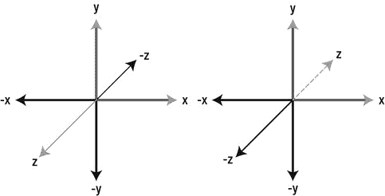
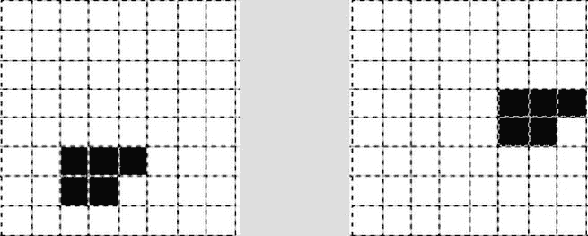
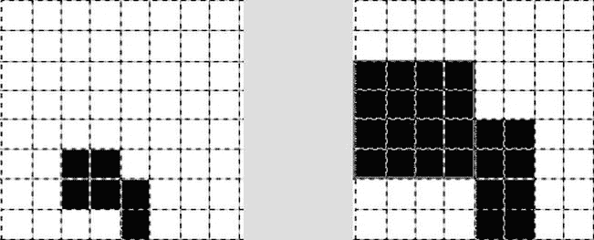
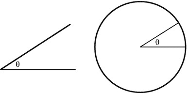

# 十三、附录 B：图形刷新程序

本书假设读者对 3D 图形有一个基本的了解，但是我们将在本附录中刷新一些相关主题的记忆。

像素

当我们在计算机屏幕上以数字方式呈现一幅图像时，它是由一个矩形网格组成的，这个网格由称为*像素*的单个颜色点组成。这种类型的表示被称为*光栅图形* 或*位图* 。显示图像的真实程度取决于屏幕上的像素数量:分辨率。在图 B-1 中，我们在左边显示了一个输入图像，在中间显示了一个 4 × 4 像素的网格表示，在右边显示了一个 16 × 16 的网格表示。随着分辨率的增加，原始图像与渲染图像之间的差异会减小。

图 B-1 。左图:输入图像；中心:4 × 4 像素输出；右图:16 × 16 像素输出

基元

图形元素是我们可以用来组成图像和场景的最小构建模块。我们可用的图元取决于所使用的语言，可以是点、线、多边形(如三角形和四边形)或一些高级语言中的立体形状。

彩色

颜色有几个属性，包括色调(色调)、饱和度(暗度)和值(强度)。事实上，颜色可以由色调-饱和度-值(HSV)颜色模型中的这三个属性来表示。然而，呈现颜色的方式不止一种，这取决于我们使用的是加色理论还是减色理论，以及诸如打印图像或在屏幕上显示图像等应用用途。

当我们打印图像时，通常使用减色法 CMYK 模式，它有四个通道，由青色、洋红色、黄色和暗度(K)组成。这就是为什么有些打印机有彩色 CMY 墨盒和黑色墨盒。

在计算机显示器上，颜色值通常使用加色 RGBA 方案来表示，该方案有四个通道，包括红色、绿色、蓝色和 Alpha(透明度)值。每个通道值的范围可以是 0.0 至 1.0 的浮点值、0 至 255 的整数值或 0×000000 至 0×ffffff 的十六进制值。

为了从 CMY 转换到 RGB，我们采用[(1.0，1.0，1.0)-CMY]。所以黄色在 CMY 是(0.0，0.0，1.0)，在 RGB 是(1.0，1.0，0.0)。在本书中，我们将专门使用 RGB(A)颜色模型。

 **注**更多关于 RGBA 彩色格式的信息可以在维基百科上的[`en.wikipedia.org/wiki/RGBA_color_space`](http://en.wikipedia.org/wiki/RGBA_color_space)找到。

坐标系统

笛卡尔坐标系 以数学家、哲学家和作家勒内·笛卡尔的名字命名，在二维中使用(x，y)对，在三维中使用(x，y，z)三元组。原点是所有轴的交点。在二维中，这是(0，0)，在三维中是(0，0，0)。对于每个轴，原点一侧的值增加，另一侧的值减少。有两个独立的三维坐标系方向，如图图 B-2 所示。它们之间的区别是相对于 x 和 y 轴的 z 方向。

图 B-2 。两种不同的 3D 坐标系方向

变换

初等变换或仿射变换会改变图形的顶点。有三种基本变换:平移、旋转和缩放，如图图 B-3 所示。

图 B-3 。平移(左)、旋转(中)和缩放(右)的变换

图 B-4 中显示了向右移动 3 个位置和向上移动 2 个位置的着色区域的平移。

图 B-4 。翻译一张图片

图像子区域围绕其中心像素顺时针旋转 90 度，如图 B-5 所示。

图 B-5 。图像的旋转

在图 B-6 中显示了两倍于已着色子区域原始尺寸的缩放比例。

图 B-6 。图像的缩放

图形编程使用了大量的数学知识，尽管库可以抽象掉大量的计算，但是了解一些基本知识还是很有好处的。

数学

我们首先应该知道的是角度、度数、圆周率和弧度。

角度

两条光线相交形成一个角度，如图 B-7 左侧所示。从技术上来说，角度是两条射线的弧长与圆内接半径的商的度量，如图 B-7 右侧所示。圆有 360 度，所以角度有时用度来度量。

图 B-7 。左图:形成内角的两条射线；右:圆内的角度

圆周率

用π表示的常数π大约是 3.14159，它是圆的周长与直径的比值。圆周率广泛应用于三角学、几何学和其他数学分支。

弧度

除了度，我们还有弧度，它被定义为 360 度= 2π弧度。这意味着 1 弧度约为 57.3 度。图 B-8 ，显示了各种角度和四个象限直角的弧度值。角度 A 看起来大约是 45 度，E 大约是 150 度，这使得角度 B 大约是 30 度。角度 D 看起来是-60 度，这将使角度 C 大约为 30 度。

图 B-8 。各种旋转角度

三角形的角和边的关系是在称为三角学的数学分支中研究的。

三角学

对于直角三角形(一个角正好是 90 度)和三角形中的另一个角 q，我们可以知道边长的比值。图 B-9 显示了直角的斜边(直角的对边)、对边和邻边。

图 B-9 。直角三角形的边

给定这些边和角度 q，我们可以用边来表示角度如下:

sin θ =对边/斜边

cos θ =邻边/斜边

tan θ =相对/相邻

这些关系常被记忆为 *soh、cah、*和 *toa* ，它们是关系名和边的首字母缩写。

旋转

在二维中，旋转使用旋转矩阵:

[什么-Sina][x]=[xcosa-ysina]

[sinA 什么] [y] = [xsinA + ycosA]

我们可以用这些方程来计算旋转 A 度后新的 x，y 坐标。

矢量

有了坐标为(x 1 ，y 1 ，z 1 )，(x 2 ，y 2 ，z 2 的两个点，我们现在将定义一些有用的计算。

点积

点积通过返回两个输入向量按分量相乘的和来返回标量值:

x1* x2+y1* y2+y1* z2

交叉乘积

叉积 (x，y，z)返回一个垂直于由两个输入向量形成的平面的向量。因此，我们用它来寻找法向量。叉积的计算方法如下:

x = y1*z2–y2* z1

y =-x1* z2+x2* z1

z = x1* y2-x2* y1

长度

两点之间的长度可以计算为每个分量差的平方和的平方根:

平方根((x1-x2)2+(y1-y2)2+(z1-z2)2)