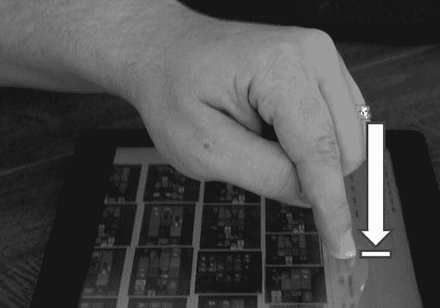
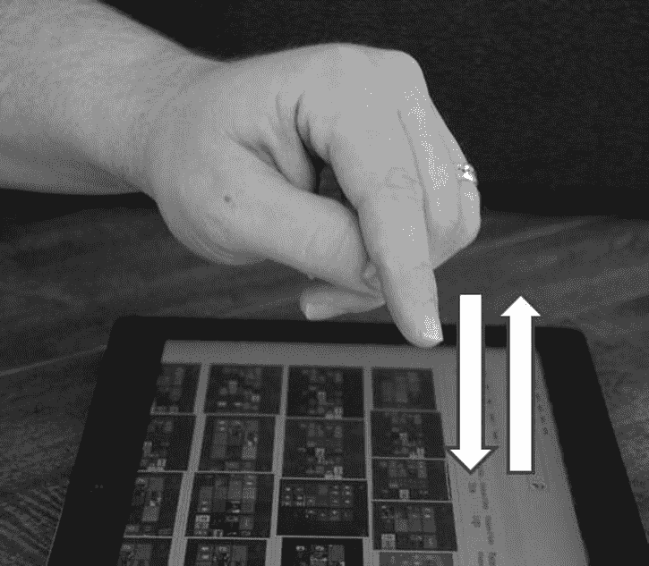
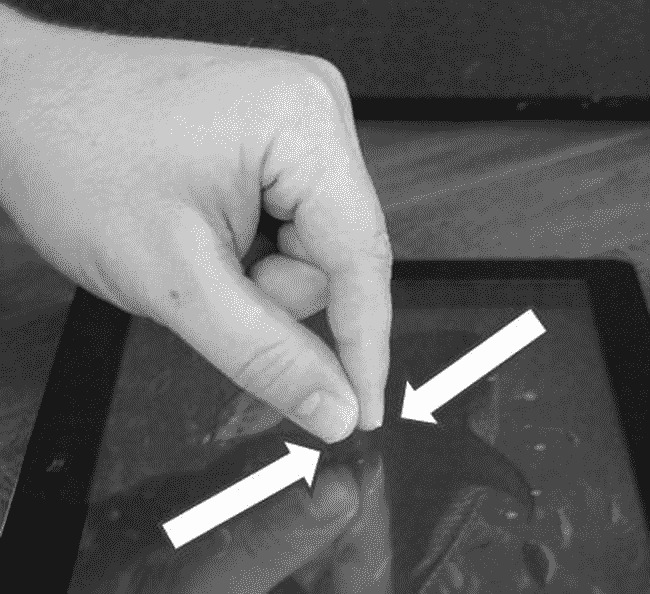
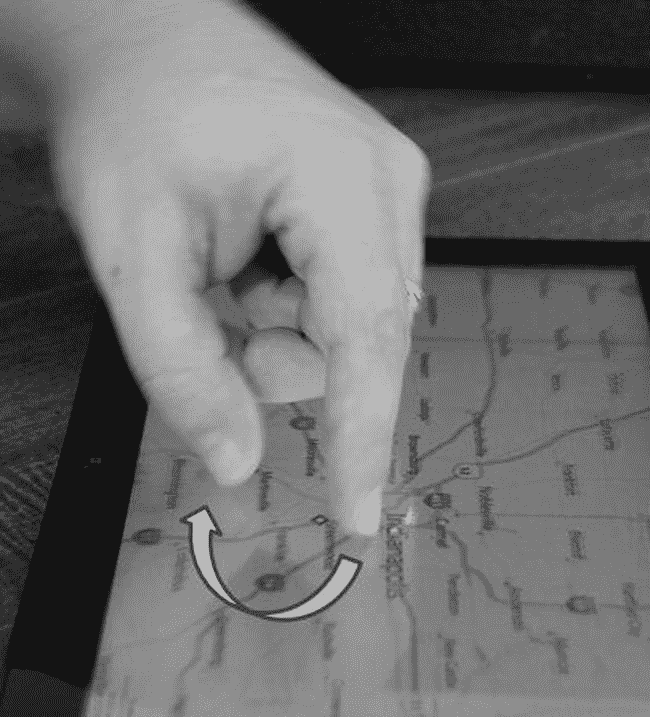

# 一、欢迎来到触摸优先的世界

2010 年 4 月，我第一次听到定义微软新战略的短语:“三块屏幕和云。”这指的是一种有针对性的方法，以确保微软的产品在手机、台式电脑和电视屏幕上无处不在，并且这些平台通过在云端与数据结合在一起提供无缝体验。三个屏幕上展示的产品分别是 Windows Phone 7、Windows 7 和 Xbox 360。微软仍然主导着电视屏幕，其 Xbox 系列约占全球销售的所有游戏主机的一半，并继续专注于将该平台转移到游戏之外，但对我来说，Windows 8 给三个屏幕和云带来了不同的意义——其中三个屏幕包括手机、平板电脑和个人电脑，所有这些都运行在 Windows 8 核心上，并与云服务绑定，如图 1-1 所示。

图 1-1 。Windows 8 三屏和云的愿景

这本书是关于在这个新环境中开发应用的，但是在你开始任何开发之前，你必须了解这个环境以及它将如何被使用。在这一章中，我将提供一些关于 Windows 8 用户界面的背景知识，以及用户将如何与运行在该平台上的应用进行交互。我将主要关注触摸，但由于 Windows 8 是一个触摸优先的环境，而不是只有触摸的环境，我也将讨论触摸何时不合适，并涵盖替代的输入方法。

移动到更自然的交互

1985 年，用户主要通过使用键盘与 PC 进行交互，但第一台 Macintosh 正在增加鼠标的普及程度，微软推出了 Windows 1.0，它本质上是一个外壳，允许人们点击打开程序和文档，而不是要求他们记住适当的命令来打字。这些基于鼠标的环境在商业和消费市场上都取得了成功，并使大众能够进行计算:到 Windows 95 发布时，个人电脑在人们的家庭中并不罕见。

多年来，计算机和软件制造商一直在考虑可以放在口袋里或挂在腰带上随身携带的计算机。苹果早在 1992 年就试图实现这一愿景，但直到 2000 年代中期，技术才真正跟上，硬件制造商才能制造出小型、轻量级的计算设备，能够运行与台式机相当的软件。当硬件为消费者的黄金时间移动计算做好准备时，Windows 品牌在市场上已经根深蒂固，微软用 Windows CE、Pocket PC 和各种 Windows Mobile 进行了几次尝试，以创建一个简单的 Windows 缩小版的移动体验。这种方法产生的屏幕需要很高的交互精度，而运行移动版 Windows 的电脑在很大程度上被视为专用设备，不被普通消费者接受。

2010 年 Windows Phone 7 的推出，可能是受三年前苹果 iPhone 的成功和随后安卓的流行的推动，摒弃了小版本 Windows 的概念，并采用了一种被称为微软设计语言的全新用户界面概念。微软设计语言基于一套以用户为中心的核心设计原则，手指成为与计算机交互的主要工具。与之前版本的微软移动操作系统不同，Windows Phone 设备不再将手写笔作为标准组件。

 **注**你可能对*地铁*这个名词比较熟悉。 Metro 是微软和其他公司以前在一些不同的上下文中使用的代号。微软设计语言被广泛称为 Metro 设计语言。此外，Windows 开始屏幕通常被称为 Metro 界面。以前称为 Metro 应用的应用正式称为 Windows 应用商店应用。

随着 Windows 8 的推出，微软抓住机会按下了用户界面期望的“重置”按钮，并通过将移动世界中必然会出现的交互带到桌面环境中，而不是将桌面概念带到移动世界，扭转了之前的策略。

Windows 8 触摸语言

随着触控作为一等公民在 Windows 8 中的全面融入，了解操作系统识别的触控手势语言非常重要。这不仅对于 Windows 8 用户来说很重要，对于希望确保用户能够尽快学习应用并获得一致体验的开发人员来说更是如此。Windows touch 语言主要由八种手势组成，我将在本节中讨论。

按住

*按住*手势 如图图 1-2 所示，类似于鼠标右键手势。该手势旨在允许用户了解关于目标的一些信息，或者向用户提供额外的选项，如上下文菜单。这种手势是通过用单个手指触摸屏幕并暂停直到系统确认保持来实现的，通常是通过描绘保持的用户界面元素来实现的。

图 1-2 。按住

龙头

虽然按住手势可以很容易地等同于单个鼠标手势，但对于*轻击*手势来说就不一样了。在图 1-3 中所示的点击手势旨在调用用户界面元素上的主要动作。通常，这是一个动作，比如激活一个按钮或跟随一个链接。与点击手势最相似的鼠标手势是左击，但是左击也用于在触摸语言中具有自己的手势的其他任务，例如选择。这个手势是通过将手指放在用户界面元素上，然后立即将手指垂直抬起来实现的。

图 1-3 。龙头

幻灯片

Windows touch 语言中的*滑动* 手势，如图图 1-4 所示，用于平移或滚动超出屏幕或屏幕部分边界的内容。在鼠标驱动的环境中，这是通过使用滚动条来实现的，但在触摸环境中，滑动手势更自然，滚动条要么必须增长到占用屏幕太多空间的程度，要么就是一个很难触摸的目标。为了完成滑动手势，手指放在屏幕上，然后上下或左右拉动，这取决于内容的方向。

图 1-4 。幻灯片

偷窃

*滑动* 手势用于传达选择，很像使用鼠标和键盘与计算机交互时使用的左键单击、Ctrl+左键单击和 Shift+左键单击。为了实现这个手势，如图图 1-5 所示，手指放在屏幕上所选项目的上面或旁边，然后在项目中划过。手势的方向取决于内容的方向，水平方向的内容被垂直滑动，垂直方向的内容被水平滑动。这种与滑动相反的手势有时会被称为*交叉滑动*。使用这种手势，而不是点击，可以消除在没有键盘修饰键(如 Ctrl 和 Shift)来帮助鼠标选择的情况下尝试完成多选时可能出现的混乱。

图 1-5 。偷窃

少量

在图 1-6 中所示的*捏捏* 手势在大多数鼠标中没有直接的等效物，被认为是一种“缩放”手势。夹点从具有高细节级别的窄视图缩小到具有较少细节的更宽视图。你将在后面的章节中看到，除了光学变焦，应用还可以在语义级别利用这种手势，并使用它来导航摘要和详细数据。为了完成捏手势，两个手指分开放置，并且与作为手势目标的元素的中心大致等距，然后手指一起滑动，直到达到期望的缩放或者手指相遇。

图 1-6 。少量

 **注意**在许多带有滚轮的鼠标上，滚动时按下 Ctrl 键执行与收缩或拉伸手势相同的动作。

伸展

*拉伸* 手势，如图图 1-7 所示，是捏手势的反义词，在执行和结果上都是如此。拉伸手势用于从较宽、不太详细的视图放大到较窄、包含更多细节的视图。就像捏一样，你会发现应用可以被设计成允许手势是光学缩放还是语义缩放。为了完成手势，手指放在一起，以要缩放的元素为中心，然后沿着屏幕向相反的方向移动，直到达到所需的缩放级别或者其中一个手指到达屏幕的边缘。

图 1-7 。伸展

从边缘滑动

随着你对 Windows 8 和微软设计语言的了解越来越多，你会发现内容才是王道，任何分散内容注意力的东西都应该从屏幕上消失。您还会发现，用户必须能够尽可能轻松地执行操作。Windows Store 应用通过将不常访问的命令放在屏幕边缘的所谓*应用栏*和*魅力栏* 来平衡这些需求。图 1-8 中的*从边缘滑动*手势用于访问这些命令。为了实现该手势，手指被放置在屏幕边缘之外，然后被拉到屏幕上。

图 1-8 。从边缘推送

转动

*转动* 手势，如图图 1-9 所示，用于旋转视图或视图内的内容。这种手势的一个例子是经典视频游戏俄罗斯方块的触摸版，其中下落的方块可以旋转到一起。为了完成这个手势，将两个手指放在屏幕上，然后将两个手指绕着一个圆的圆周拉动，或者一个手指绕着另一个手指旋转，后者保持静止。

图 1-9 。转动

成功触摸界面的关键

构建一个成功的触摸界面需要设计者和开发者的仔细思考和考虑。这些考虑因素中的许多都包含在管理微软设计语言的设计原则中，我将在第二章中讨论，但在这一节中，我将讨论一些对触摸界面至关重要的概念，无论它们是否使用这些原则。

响应性

虽然响应速度对任何应用都很重要，但对于触摸应用的用户来说，永远不要看着没有响应的屏幕是特别重要的。用户意识到，即使只是在潜意识层面，鼠标指针是比手指末端更精确的工具，因此如果不容易看出用户的最后命令被接受并被执行，用户可能会觉得他或她没有击中目标并再次发出命令。响应性可以通过一些操作来实现，例如给出一个长时间运行的过程已经开始的视觉线索，或者确保内容随着用户的手指在屏幕上拖动而移动。

触摸目标

如前一节所述，鼠标指针是一种比人类指尖精确得多的工具。虽然在某些应用中没有什么可以消除用户错过目标的可能性，但是使用间隔很大的大触摸目标是最大限度减少错过目标的重要方法。在所有可能的情况下，目标应不小于 7 毫米见方，它们之间至少有 2 毫米。一般来说，当击中错误的目标造成严重后果或难以纠正时，该目标的比例应该更大，并且它与其他目标之间也应该有更大的空间。

直观的界面

对最终用户来说，最好的应用“就是工作”通常，这是因为应用使用户更容易做需要做的事情，而不是弄清楚如何做需要做的事情。如今，许多桌面应用通过在工具提示中提供详细的说明来弥补直观性的不足，当用户用鼠标指针浏览应用时，工具提示就会出现。触摸界面仍然可以使用工具提示，触摸语言为这种类型的学习定义了按住手势，但这比使用鼠标需要更多的努力，所以应该在清晰传达用户应该做什么的设计上投入更多的努力。

 **注**关于实现高质量基于触摸的用户体验的额外指导，请参考这两篇 MSDN 文章:`http://msdn.microsoft.com/en-us/library/windows/apps/xaml/hh465415.aspx`和`http://msdn.microsoft.com/en-us/library/windows/desktop/cc872774.aspx`。

触摸不到

和 Windows 8 一样，本章非常重视用户通过触摸手势与电脑的互动。然而，应该注意的是，Windows 8 用户界面被称为*触摸优先* ，而不是*纯触摸*。Windows 8 拥有在 Windows XP 和 Windows 7 上运行的大部分硬件上运行的能力，并且在许多情况下，由于为适应移动设备而进行的优化，性能会更好。这意味着，尽管供应商们正争先恐后地向市场推出创新的触摸硬件，但在可预见的未来，应用开发人员必须承认，他们的许多用户将只使用键盘和鼠标来开发应用。

除了仍在使用的大量旧硬件之外，了解一些使用场景并不能很好地转化为触摸环境也很重要。用户坐着数小时进行数据输入，将会比用户使用键盘和鼠标进行同样的任务，伸出手臂去够像今天大多数显示器一样设置的触摸屏显示器更舒服，并且更少疲劳和损伤。硬件供应商将通过继续创新来满足这一新需求，您可能会看到一些变化，如多点触控板取代传统的鼠标和显示器，这些鼠标和显示器可以调整为平放或至少倾斜在桌面上。此外，预计会看到类似于微软 Kinect 设备的设备不断发展，并以比今天更具创新性的方式使用。

结论

在本章中，您将 Windows 8 视为您的应用将生活在其中的触摸优先世界。您了解了 Windows touch 语言中定义的基本手势，以及最终用户期望应用如何对这些手势做出反应。您还了解到，无论未来的计算机是什么样子，今天的计算机通常看起来非常像 Windows 8 上市前一天甚至五年前销售的计算机，您的应用必须考虑到今天计算机的用户。不管用户是用手还是鼠标进行交互，Windows 应用商店应用都应该流畅、直观、响应迅速。