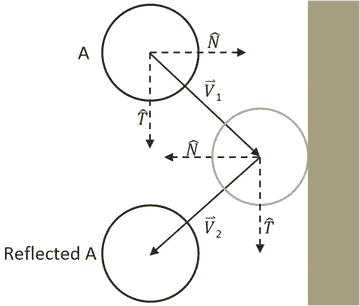

# 四、完成物理引擎和刚性形状组件


在前一章中，你已经实现了检测刚性圆和矩形之间碰撞的算法。除了碰撞是否确实发生的布尔条件之外，您实现的算法还计算了告诉您重要细节的信息——碰撞信息，包括穿透深度和法向。在本章中，您将进一步扩展物理引擎，使用碰撞信息来修正相互穿透条件，并了解模拟类似于真实世界刚性形状行为的碰撞响应。最初，您的响应将是线性运动，最终您将支持由于碰撞而旋转的对象。

从调查的最后一个阶段开始，您将首先修改刚体形状类，以支持牛顿运动的正确模拟，并包括相关的物理属性，以允许模拟碰撞对象之间的能量传递。在物理引擎中实现运动以及上一章的碰撞检测算法后，您可以开始解决碰撞。通过纠正刚性形状的相互渗透状态，并建立适当的响应，可以解决碰撞问题。将通过移动碰撞形状使它们不重叠来纠正相互渗透，并且将基于脉冲方法建立碰撞响应来模拟线性和角动量的转移。

完成本章后，您将能够:

*   了解如何用欧拉法和辛欧拉积分近似积分。

*   辛欧拉积分的近似牛顿运动公式。

*   基于数值稳定松弛方法解决互穿碰撞。

*   计算并实现对碰撞的响应，类似于真实世界中刚体的响应。

*   完成模拟刚性圆和矩形的碰撞和响应的物理引擎。

## 活动

运动是对模拟世界中物体位置如何变化的描述。从数学上讲，运动可以用多种方式来表达。在前面的章节中，你已经体验了用一个常量或一个位移来不断改变物体位置的运动。尽管可以获得期望的结果，但是从数学上来说这是有问题的，因为速度和位置是具有不同单位的不同类型的量，并且这两者不能简单地组合。如图 [4-1](#Fig1) 和下面的等式所示，实际上，你一直在基于恒定位移来描述运动。

*   


###### 图 4-1。基于恒定位移的运动

当需要随时间改变位移量时，由恒定位移公式控制的运动变得受限。牛顿力学通过在运动公式中考虑时间来解决这一限制，如下面的方程所示。

*   

*   

这两个方程实现了基于牛顿的运动，其中 *v* ( *t* )是描述位置随时间变化的速度，而 *a* ( *t* )是描述速度随时间变化的加速度。

请注意，速度和加速度都是矢量，对大小和方向的变化进行编码。速度向量的大小定义了速度，标准化的速度向量标识了对象行进的方向。加速度矢量通过加速度的大小和方向让你知道物体是在加速还是减速。加速度因作用在物体上的力而改变。例如，如果你将一个球抛向空中，地球的引力会随着时间的推移影响物体的加速度，这反过来会改变物体的速度。

### 显式欧拉积分

以下两个方程表明，欧拉方法，或显式欧拉积分，基于初始值近似积分。尽管可能不稳定，但这是最简单的方法之一，因此是学习积分近似方法的良好起点。如下面两个方程所示，在牛顿运动公式化的情况下，物体的新速度 *v* <sub class="calibre29">*新*</sub> ，可以近似为当前速度 *v* <sub class="calibre29">*当前*</sub> ，加上当前加速度*<sub class="calibre29">*当前*</sub> ，乘以经过的时间量。同样，物体的新位置， *p* <sub class="calibre29">*新*</sub> ，可以近似为物体的当前位置， *p* <sub class="calibre29">*当前*</sub> ，加上当前速度， *v* <sub class="calibre29">*当前*</sub> ，乘以经过的时间量。*

 *###### 注意

数值不稳定系统的一个例子是，在重力的作用下，一个弹跳的球会减速，但永远不会停止抖动，在某些情况下，甚至会再次开始弹跳。

*   

*   

图 [4-2](#Fig2) 的左图展示了一个用显式欧拉积分近似运动的简单例子。请注意，新位置*p*<sub xmlns:xsi="http://www.w3.org/2001/XMLSchema-instance" class="calibre29">T5】new</sub>是基于当前速度*v*<sub xmlns:xsi="http://www.w3.org/2001/XMLSchema-instance" class="calibre29">*current*</sub>计算的，而新速度*v*<sub xmlns:xsi="http://www.w3.org/2001/XMLSchema-instance" class="calibre29">*new*</sub>是为下一个更新周期移动位置而计算的。


###### 图 4-2。显式(左)和辛(右)欧拉积分

### 辛欧拉积分

实际上，由于系统稳定性的考虑，显式欧拉积分很少实现。这个缺点可以用你将要实现的方法来克服，这种方法被称为半隐式欧拉积分或辛欧拉积分，其中中间结果用于随后的近似。下面的方程显示了辛欧拉积分。注意，除了在计算新位置时使用新速度 *v* <sub class="calibre29">*new*</sub> 和 *p* <sub class="calibre29">*new*</sub> 之外，它与欧拉方法几乎相同。这实质上意味着下一帧的速度被用来计算该帧的位置。

*   

*   

图 [4-2](#Fig2) 的右图说明了利用辛欧拉积分，基于新计算的速度计算出新位置*p*<sub xmlns:xsi="http://www.w3.org/2001/XMLSchema-instance" class="calibre29">T5】new</sub>， *v* <sub xmlns:xsi="http://www.w3.org/2001/XMLSchema-instance" class="calibre29">*new*</sub> 。

## 实现辛欧拉积分并定义属性以支持碰撞响应

现在你已经准备好实现辛欧拉积分了。游戏引擎的固定时间步长更新函数架构允许将 *dt* 量实现为更新时间间隔和每个更新周期评估一次的积分。

除了实现辛欧拉积分，这个项目还定义了属性及其相应的访问器和 getter 函数。虽然相对简单，但这里介绍这些函数是为了避免分散对后续项目中涉及的更复杂概念的讨论。

您将为此实现修改 RigidShape 类。

### 刚体运动项目

该项目将指导您完成刚性形状组件，以支持运动计算和碰撞响应。除了实现辛欧拉积分，您要添加的信息还包括碰撞模拟和响应所需的属性，如质量、惯性、摩擦和恢复。正如将要解释的，这些属性中的每一个都将在基于欧拉积分的模拟物体运动和碰撞响应的计算中起作用。你可以在图 [4-3](#Fig3) 中看到这个项目运行的例子。该项目的源代码是在“刚性形状运动”项目文件夹中定义的。


###### 图 4-3。运行刚性形状运动项目

项目目标:

*   体验基于辛欧拉积分的动作实现。

*   完成 RigidShape 类的实现，以包含相关的物理属性。

*   来建立应对碰撞的基础设施。

#### 实现辛欧拉积分

您必须在引擎核心和刚性形状中定义运动支持和常数。

##### 修改发动机旧件

让我们从发动机核心开始:

1.  修改 Core.js 文件，在构造函数中再包含两个实例变量，第一个支持对所有对象应用重力，第二个支持启用/禁用对象移动。

    ```js
    var mGravity = new Vec2(0, 10);
    var mMovement = false;
    ```

2.  更新 mPublic 变量以允许外部访问新定义的实例。

    ```js
    var mPublic = {
        initializeEngineCore: initializeEngineCore,
        mAllObject: mAllObject,
        mWidth: mWidth,
        mHeight: mHeight,
        mContext: mContext,
        mGravity: mGravity,
        mUpdateIntervalInSeconds: mUpdateIntervalInSeconds,
        mMovement: mMovement
    };
    ```

##### 修改 RigidShape 类

修改 RigidShape 类构造函数以支持速度、角速度和加速度，如以下代码所示。

```js
function RigidShape(center, mass, friction, restitution) {
  this.mCenter = center;
  this.mVelocity = new Vec2(0, 0);
  this.mAcceleration = gEngine.Core.mGravity;

  //angle
  this.mAngle = 0;
  //negetive-- clockwise
  //positive-- counterclockwise
  this.mAngularVelocity = 0;

  this.mAngularAcceleration = 0;

  gEngine.Core.mAllObject.push(this);
}
```

##### 实现辛欧拉积分

现在，您可以将行为添加到刚性形状对象，以进行数值积分。继续使用 RigidShape 基类，并完成更新函数以将辛欧拉积分应用于刚性形状，其中更新的速度用于计算新位置。请注意线性运动和角运动在实现上的相似之处。在这两种情况下，在将结果应用于位移之前，会更新速度。旋转将在本章的最后一节详细讨论。

```js
RigidShape.prototype.update = function () {
    if (gEngine.Core.mMovement) {
        var dt = gEngine.Core.mUpdateIntervalInSeconds;
        //v += a*t
        this.mVelocity = this.mVelocity.add(this.mAcceleration.scale(dt))                                                                            ;
        //s += v*t
        this.move(this.mVelocity.scale(dt));

        this.mAngularVelocity += this.mAngularAcceleration * dt;
        this.rotate(this.mAngularVelocity * dt);
    }
};
```

#### 定义支持碰撞模拟和响应的属性

如前所述，为了在后面的章节中集中讨论更复杂的概念，在这个项目中引入了支持碰撞的属性和相应的支持功能。这些属性在 RigidShape 类中定义。

##### 修改 RigidShape 类

现在是刚性形状类的时间了:

1.  再次修改 RigidShape 类构造函数，这次是为了支持质量、恢复(弹性)和摩擦力，如以下代码所示。请注意，质量值的倒数实际上是为了计算效率而存储的(通过在每次更新计算期间避免额外的除法)。此外，请注意，零质量用于表示静止物体。

    ```js
    function RigidShape(center, mass, friction, restitution) {
      this.mCenter = center;
      this.mInertia = 0;
      if (mass !== undefined)
          this.mInvMass = mass;
      else
          this.mInvMass = 1;

      if (friction !== undefined)
          this.mFriction = friction;
      else
          this.mFriction = 0.8;

      if (restitution !== undefined)
          this.mRestitution = restitution;
      else
          this.mRestitution = 0.2;

      this.mVelocity = new Vec2(0, 0)                                                                                                    ;

      if (this.mInvMass !== 0) {
          this.mInvMass = 1 / this.mInvMass;
          this.mAcceleration = gEngine.Core.mGravity;
      } else {
          this.mAcceleration = new Vec2(0, 0);
      }

      //angle
      this.mAngle = 0;
    //negetive-- clockwise 
      //positive-- counterclockwise
      this.mAngularVelocity = 0;

      this.mAngularAcceleration = 0;

      this.mBoundRadius = 0;

      gEngine.Core.mAllObject.push(this);
    }
    ```

2.  定义函数 updateMass，以支持运行时质量的变化。请注意，updateInertia 函数是空的。这反映了这样一个事实，即转动惯量是特定于形状的，实际的实现是各个子类(矩形和圆形)的责任。

    ```js
    RigidShape.prototype.updateMass = function (delta) {
        var mass;
        if (this.mInvMass !== 0)
            mass = 1 / this.mInvMass;
        else
            mass = 0;

        mass += delta;
        if (mass <= 0) {
            this.mInvMass = 0;
            this.mVelocity = new Vec2(0, 0);
            this.mAcceleration = new Vec2(0, 0)                                                                                                    ;
            this.mAngularVelocity = 0;
            this.mAngularAcceleration = 0;
        } else {
            this.mInvMass = 1 / mass;
            this.mAcceleration = gEngine.Core.mGravity;
        }
        this.updateInertia();
    };

    RigidShape.prototype.updateInertia = function () {
        // subclass must define this.
        // must work with inverted this.mInvMass
    };
    ```

##### 修改圆形和矩形类

接下来，修改 Circleand 和 Rectangle 类:

1.  修改 Circle 类以实现 updateInertia 函数。该函数计算质量变化时圆的转动惯量。

    ```js
    Circle.prototype.updateInertia = function() {
        if (this.mInvMass === 0) {
            this.mInertia = 0;
        } else {
            // this.mInvMass is inverted!!
            // Inertia=mass * radius^2
            // 12 is a constant value that can be changed
            this.mInertia = (1 / this.mInvMass) * (this.mRadius * this.mRadius) / 12;
        }
    };
    ```

2.  更新 Circle 对象构造函数，调用新的 RigidShape 基类，并接受物理属性的相关参数。记得调用新定义的 updateInertia 进行初始化。

    ```js
    var Circle = function (center, radius, mass, friction, restitution) {
        RigidShape.call(this, center, mass, friction, restitution);
        this.mType = "Circle";
    //...identical to previous project 
        this.updateInertia();
    };
    ```

3.  修改 Rectangle 类以实现其 updateIntertia 函数。

    ```js
    Rectangle.prototype.updateInertia = function() {  
        // Expect this.mInvMass to be already inverted!
        if (this.mInvMass === 0)
            this.mInertia = 0                                                                                  ;
        else {
            //inertia=mass*width^2+height^2
            this.mInertia = (1 / this.mInvMass) * (this.mWidth * this.mWidth + this.mHeight * this.mHeight) / 12;
            this.mInertia = 1 / this.mInertia;
        }
    };
    ```

4.  以类似于 Circle 类的方式更新 Rectangle 构造函数，以接受物理属性的相关参数，并调用新定义的特定于形状的 updateIntertia 函数。

    ```js
    var Rectangle = function (center, width, height, mass, friction, restitution) {
        RigidShape.call(this, center, mass, friction, restitution);
        this.mType = "Rectangle";
        this.mWidth = width;
        this.mHeight = height;
        //...indetical to previous project
        this.updateInertia();
    }                                                                                                                              ;
    ```

##### 修改 updateUIEcho 函数

由于引擎变得更加强大和灵活，您希望 UI 显示相应的属性，并允许用户出于测试目的控制这些属性。修改 Core.js 文件中的 updateUIEcho 函数，打印出用户控制的所有选项。

```js
var updateUIEcho = function () {
    document.getElementById("uiEchoString").innerHTML =
        "<p><b>Selected Object:</b>:</p>" +
        "<ul style=\"margin:-10px\">" +
        "<li>Id: " + gObjectNum + "</li>" +
        "<li>Center: " + mAllObject[gObjectNum].mCenter.x.toPrecision(3) +
        "," + mAllObject[gObjectNum].mCenter.y.toPrecision(3) + "</li>"  +
        "<li>Angle: " + mAllObject[gObjectNum].mAngle.toPrecision(3) + "</li>" +
        "<li>Velocity: " + mAllObject[gObjectNum].mVelocity.x.toPrecision(3) +
        "," + mAllObject[gObjectNum].mVelocity.y.toPrecision(3) + "</li>"  +
        "<li>AngluarVelocity: " + mAllObject[gObjectNum].mAngularVelocity.toPrecision(3) + "</li>"  +
        "<li>Mass: " + 1 / mAllObject[gObjectNum].mInvMass.toPrecision(3) + "</li>"  +
        "<li>Friction: " + mAllObject[gObjectNum].mFriction.toPrecision(3) + "</li>"  +
        "<li>Restitution                                                                                                                                  : " + mAllObject[gObjectNum].mRestitution.toPrecision(3) + "</li>"  +
        "<li>Movement: " + gEngine.Core.mMovement + "</li>"  +
        "</ul> <hr>" +
        "<p><b>Control</b>: of selected object</p>" +
        "<ul style=\"margin:-10px\">" +
        "<li><b>Num</b> or <b>Up/Down Arrow</b>: Select Object</li>" +
        "<li><b>WASD</b> + <b>QE</b>: Position [Move + Rotate]</li>" +
        "<li><b>IJKL</b> + <b>UO</b>: Velocities [Linear + Angular]</li>" +
        "<li><b>Z/X</b>: Mass [Decrease/Increase]</li>" +
        "<li><b>C/V</b>: Frictrion [Decrease/Increase]</li>" +
        "<li><b>B/N</b>: Restitution [Decrease/Increase]</li>" +
        "<li><b>,</b>: Movement [On/Off]</li>" +
        "</ul> <hr>" +
        "<b>F/G</b>: Spawn [Rectangle/Circle] at selected object" +
        "<p><b>H</b>: Excite all objects</p>" +
        "<p><b>R</b>: Reset System                                                                                                                                  </p>" +
        "<hr>";    
};
```

#### 修改用户控制功能

出于测试目的，您希望更新 UserControl.js 文件，以允许在运行时修改游戏引擎属性。将以下案例添加到 userControl 函数中。

```js
//... identical to previous project
if (keycode === 73)     //I
    gEngine.Core.mAllObject[gObjectNum].mVelocity.y -= 1;
if (keycode === 75)     //k
    gEngine.Core.mAllObject[gObjectNum].mVelocity.y += 1;
if (keycode === 74)     //j
    gEngine.Core.mAllObject[gObjectNum].mVelocity.x -= 1;
if (keycode === 76)     //l
    gEngine.Core.mAllObject[gObjectNum].mVelocity.x += 1;
if (keycode === 85)     //U
    gEngine.Core.mAllObject[gObjectNum].mAngularVelocity -= 0.1;
if (keycode === 79)     //O
    gEngine.Core.mAllObject[gObjectNum].mAngularVelocity += 0.1;
if (keycode === 90)     //Z
    gEngine.Core.mAllObject[gObjectNum].updateMass(-1);
if (keycode === 88)     //X
    gEngine.Core.mAllObject[gObjectNum].updateMass(1);
if (keycode === 67)     //C
    gEngine.Core.mAllObject[gObjectNum].mFriction -= 0.01;
if (keycode === 86)     //V
    gEngine.Core.mAllObject[gObjectNum].mFriction += 0.01;
if (keycode === 66)     //B
    gEngine.Core.mAllObject[gObjectNum].mRestitution -= 0.01;
if (keycode === 78)     //N
    gEngine.Core.mAllObject[gObjectNum].mRestitution += 0.01;
if (keycode === 188)    //’
    gEngine.Core.mMovement = !gEngine.Core.mMovement;
if (keycode === 70)     //f
    var r1 = new Rectangle                (new Vec2(gEngine.Core.mAllObjects[gObjectNum].mCenter.x,
                                  gEngine.Core.mAllObjects[gObjectNum].mCenter.y),
                         Math.random() * 30 + 10, Math.random() * 30 + 10,
                         Math.random() * 30, Math.random(), Math.random());
if (keycode === 71)    //g
    var r1 = new Circle(new Vec2(gEngine.Core.mAllObjects[gObjectNum].mCenter.x,
                               gEngine.Core.mAllObjects[gObjectNum].mCenter.y),
                      Math.random() * 10 + 20, Math.random() * 30,
                      Math.random(), Math.random                ());
if (keycode === 72) {   //H
    var i;
    for (i = 0; i < gEngine.Core.mAllObject.length; i++) {
        if (gEngine.Core.mAllObject[i].mInvMass !== 0)
            gEngine.Core.mAllObject[i].mVelocity =
                new Vec2(Math.random() * 20 - 10, Math.random() * 20 - 10);
    }
}
//... identical to previous project 
```

### 观察

运行项目以测试您的实现。在场景中创建一些对象；您可以检查所选对象的属性。请注意，当您通过按下逗号(，)键来启用移动时，具有较高向下初始速度的对象会因为重力或加速度而下落得更快。现在创建一个物体，并设置它的初始 y 速度为负。观察到物体会向上运动，直到 y 分量速度为零，然后由于重力加速度，它开始向下下落。你也可以改变物体的初始 x 速度，观察抛射体的运动。另一个有趣的例子是创建一些对象，通过按 H 键来激发它们。观察所有的物体如何按照它们自己的速度运动。您可能会看到移动到场景边界之外的对象。这是因为此时物理引擎不支持碰撞解决。这将在下一节中进行补救。

## 解决相互渗透

在游戏引擎的上下文中，冲突解决是指确定对象在冲突后如何响应的过程，包括解决可能发生的潜在穿插情况的策略。请注意，在真实世界中没有碰撞解决过程，因为碰撞受物理定律的严格控制，所以不会发生刚性对象的相互渗透。只有在虚拟模拟世界中，相互渗透的分辨率才是相关的，在虚拟模拟世界中，运动是近似的，不可能的情况可能发生，但可以用开发者或设计者期望的方式解决。

一般来说，有三种常见的方法来响应互穿碰撞。第一种是简单地通过穿透深度使物体彼此移位。这就是所谓的投影方法，因为您只需移动一个对象的位置，使其不再穿透另一个对象。虽然这很容易计算和实现，但当许多物体相互靠近并相互依靠时，它缺乏稳定性。一对相互渗透的对象的简单解析可以导致与其他附近对象的新渗透。但是，对于简单的引擎或者对象交互规则简单的游戏来说，这仍然是一种常用的方法。例如，在乒乓球比赛中，球永远不会停在球拍或墙上，而是通过反弹与它碰撞的任何物体来持续保持运动。投影方法非常适合解决这些类型的简单对象交互的碰撞。第二种方法被称为脉冲方法，它使用物体速度来计算和应用脉冲，以启动物体在碰撞点向相反方向移动。这种方法倾向于快速减慢碰撞物体的速度，并收敛到相对稳定的解。这是因为冲量是根据动量转移计算的，而动量转移又对碰撞物体的速度产生阻尼效应。第三种方法称为罚函数法，该方法将对象渗透的深度建模为弹簧的压缩程度，并近似加速度以施加力来分离对象。最后一种方法最复杂，也最难实现。

对于您的引擎，您将结合投影和脉冲方法的优势。投影方法将用于分离相互渗透的物体，而脉冲方法将用于施加小脉冲，以降低导致相互渗透的方向上的物体速度。如上所述，简单的投影方法会导致系统不稳定，例如堆叠时物体会相互陷入。您将通过实现一个松弛循环来克服这种不稳定性，在该循环中，通过在单个更新周期中重复应用投影方法来递增地分离相互穿透的对象。对于松弛循环，应用投影方法的次数被称为*松弛迭代*。在每次松弛迭代过程中，投影法按总渗透深度的固定百分比逐渐减少渗透。例如，默认情况下，引擎将松弛迭代次数设置为 15，在每次松弛迭代期间，穿插减少 80%。这意味着在一次更新函数调用中，在运动积分近似之后，碰撞检测和解决过程将被执行 15 次。虽然成本高，但重复的增量分离确保了正常情况下系统的稳定。然而，当系统经历突然的大变化时，15 次松弛迭代可能是不够的。例如，如果大量明显重叠的对象，例如 100 个重叠的圆，被同时添加到系统中，那么 15 次松弛迭代可能是不够的。这种情况可以通过以性能损失为代价增加松弛迭代来解决。根据我们的经验，在正常工作条件下，15 左右的松弛迭代是精度和性能之间的平衡。

### 位置校正项目

这个项目将指导你通过松弛迭代的实现来逐步解决物体间的相互渗透。您将使用上一章计算的碰撞信息来校正碰撞对象的位置。你可以在图 [4-4](#Fig4) 中看到这个项目运行的例子。该项目的源代码在位置校正项目文件夹中定义。


###### 图 4-4。运行位置校正项目

项目目标:

*   理解所计算的碰撞信息的重要性。

*   用松弛迭代实现位置校正。

*   理解并体验实现互穿解决方案。

#### 更新物理引擎

这个项目将只修改 Physics.js，因为这是实现碰撞细节的文件。

1.  编辑 Physics.js 并添加以下变量，以支持通过松弛迭代增量校正位置。

    ```js
    //...identical to previous project
    gEngine.Physics = (function () {
        var mPositionalCorrectionFlag = true;
        // number of relaxation iteration
        var mRelaxationCount = 15;  
        // percentage of separation to project objects
        var mPosCorrectionRate = 0.8;

        //... identical to previous project

        var mPublic = {
            collision: collision,
            mPositionalCorrectionFlag: mPositionalCorrectionFlag
        };
        return mPublic;
    }());
    ```

2.  修改碰撞函数以在碰撞检测循环上包括封闭松弛迭代循环。

    ```js
    var collision = function () {
        var i, j, k;
        for (k = 0; k < mRelaxationCount; k++) {
            for (i = 0; i < gEngine.Core.mAllObject.length; i++) {
                //...identical to previous project
            }
        }
    };
    ```

3.  在 gen engine 中创建新函数。物理学并命名为位置校正。此函数通过预定义的常量 mPosCorrectionRate(默认值为 80%)减少对象之间的重叠。为了在模拟中正确支持对象动量，每个对象的移动量由其相应的质量控制。例如，在两个物体碰撞时，质量较大的物体的移动量通常小于质量较小的物体。请注意，移动方向是沿着碰撞法线，如 collisionInfo 结构中所定义的。

    ```js
    var positionalCorrection = function (s1, s2, collisionInfo) {
        var s1InvMass = s1.mInvMass;
        var s2InvMass = s2.mInvMass;

        var num = collisionInfo.getDepth() / (s1InvMass + s2InvMass) * mPosCorrectionRate;
        var correctionAmount = collisionInfo.getNormal().scale(num);

        s1.move(correctionAmount.scale(-s1InvMass));
        s2.move(correctionAmount.scale(s2InvMass));
    };
    ```

4.  创建另一个函数，并将其命名为 resolveCollision。该函数接收两个 RigidShape 对象作为参数，并确定检测到的碰撞是否应该进行位置校正。如前所述，质量无限大或质量倒数为零的物体是静止的，碰撞后不会参与位置校正。

    ```js
    var resolveCollision = function (s1, s2, collisionInfo) {
        if ((s1.mInvMass === 0) && (s2.mInvMass === 0))
            return;
        //  correct positions
        if(gEngine.Physics.mPositionalCorrectionFlag)
            positionalCorrection(s1, s2, collisionInfo);
    };
    ```

5.  最后，当检测到冲突时，应该从碰撞函数中调用新定义的 resolveCollision 函数。调用 drawCollisionInfo 函数后，可以调用 resolveCollision。

    ```js
    var collision = function () {
        var i, j, k;
        var collisionInfo = new CollisionInfo();
        for (k = 0; k < mRelaxationCount; k++) {
            //....identical to previous project
            drawCollisionInfo(collisionInfo, gEngine.Core.mContext);
            resolveCollision(gEngine.Core.mAllObject[i], gEngine.Core.mAllObject[j], collisionInfo);
            //... identical to previous project
    ```

    请注意，drawCollisionInfo 函数是一个绘制操作，严格来说，它不属于 collision 函数中的更新循环。此外，该绘制操作在松弛循环迭代的核心内被调用，这在计算上是昂贵的。幸运的是，这个函数是用于调试目的的，在这个项目之后将被注释掉。

### 观察

运行项目以测试您的实现。在场景中创建一些对象。请注意，使用 M 键，您可以控制新创建的对象是否重叠。现在，使用 R 键重置场景，然后创建一些对象，然后启用移动。你会注意到有少量的相互渗透发生，如果不去管它，物体可能会沉入场景的底部。选择任意对象，注意不断增加的负 y 速度分量。在每个更新周期中，所有物体的 y 速度都被重力加速度改变，然而位置校正松弛迭代阻止它们向下移动。通过禁用移动，您会注意到重叠完全消失，因为位置校正将不再被抵消。当试图创建一个稳定的系统时，对象的不断增加的 y 速度是一个严重的问题。不断增加/减少数字将导致不稳定和不可预测的行为，正如在物体下沉到底部边界以下时所看到的那样。在接下来的部分中，您将了解进一步提高碰撞分辨率的脉冲方法。

## 解决冲突

有了正常工作的位置校正系统，您现在可以开始实现碰撞解决，并支持类似于真实世界情况的行为。为了将重点放在碰撞解决系统的核心功能上，包括理解和实现脉冲方法以及确保系统稳定性，您将继续使用与轴对齐的刚性形状。在完全理解并实现线性脉冲分辨率背后的机制之后，我们将在下一节讨论与角度脉冲分辨率相关的复杂性。

在下面的讨论中，矩形和圆形不会因碰撞而旋转。然而，所描述的概念和实现概括为支持旋转碰撞响应。本项目旨在帮助您理解基于冲量的碰撞解决方案的基本概念，以及轴对齐的形状。

### 制定脉冲方法

你将通过首先回顾在一个完美的世界中，一个圆如何从一面墙和其他圆上弹开来制定脉冲方法的解决方案。这将随后用于导出适当碰撞响应的近似值。注意，下面的讨论集中在推导冲量法的公式上，并不试图对牛顿力学的基本原理进行综述。下面是一些相关术语的简要回顾。

*   质量是物体中物质的数量，或者说物体的密度。

*   力是施加在物体上的任何相互作用或能量，它将改变该物体的运动。

*   相对速度是两个运动形状之间的速度差。

*   恢复系数是碰撞前后相对速度的比值。这是一个衡量物体从一个物体反弹到另一个物体的动能剩余量，或弹性的指标。

*   摩擦系数是一个描述两个物体之间摩擦力比率的数字。在你非常简单的实现中，摩擦力被直接用来减缓线性运动或旋转。

*   冲量是一段时间内积累的力，它可以导致速度的变化，例如，由碰撞引起的速度变化。

#### 分解碰撞中的速度

图 [4-5](#Fig5) 显示了三个不同阶段的圆 A。在第一阶段，圆圈以速度向右边的墙移动。在第二阶段，圆圈与墙壁相撞。在阶段 3，圆被反射并以速度离开墙壁。



###### 图 4-5。完美世界中圆与墙的碰撞

从数学上讲，这种碰撞及其响应可以通过将初始速度分解成平行于或相切于碰撞壁的分量，以及垂直于或正交于碰撞壁的分量来描述。如下面的等式所示。

*   

在没有摩擦和动能损失的完美世界中，碰撞后，沿切线方向的分量不受影响，而法向分量将简单地反转。这样，反射向量可以表示为的法向分量和切向分量的线性组合，如下所示。

*   

注意组件前面的负号。你可以在图 [4-5](#Fig5) 中看到，由于碰撞，矢量的分量指向与相反的方向。还要注意，切线分量仍然指向相同的方向，因为它平行于墙的方向，并且不受碰撞的影响。这演示了一个矢量反射。

#### 碰撞形状的相对速度

这种将向量分解为碰撞的法线方向和切线方向的方法也适用于碰撞形状都在运动的一般情况。例如，图 [4-6](#Fig6) 显示了两个行进的圆形 A 和 B 发生碰撞。


###### 图 4-6。两个圆之间的碰撞

在图 [4-6](#Fig6) 的情况下，在碰撞之前，形状 A 以速度行进，而形状 B 以速度行进。碰撞的法线方向被定义为两个圆心之间的矢量，而碰撞的切线方向是在碰撞点与两个圆相切的矢量。为了解决这种碰撞，必须计算碰撞后形状 A 和 B 的速度和。

形状 A 和 B 之间的相对速度定义如下。

*   

碰撞矢量分解现在可以应用于相对速度的法线方向，其中碰撞后的相对速度为。

*   ①

恢复系数 *e* 模拟了真实世界的情况，即在碰撞过程中，一些动能转变为其他形式的能量。请注意，等式右侧的所有变量( [1](#Equ1) )都已定义，因为它们在碰撞时是已知的，并且形状 A 和 B 碰撞后相对速度的法向分量也已定义。重要的是要记住，

*   。

你现在已经准备好估算和，碰撞后碰撞形状的速度。

#### 近似脉冲响应

准确描述碰撞涉及复杂的考虑因素，包括能量变化形式或不同材料特性产生的摩擦等因素。如果不考虑这些高级问题，对发生在一个形状上的碰撞的简单描述是，一个恒定质量的物体在与另一个物体接触后，其速度从变为。方便的是，这就是脉冲的定义，如下所示。

*   

或者，在求解时，

*   

从数学上退一步，想想这个公式说明了什么。直觉上讲得通。它指出速度的变化与形状的质量成反比。换句话说，一个形状的质量越大，碰撞后它的速度变化就越小。冲量法实现了这种观察，对于法向分量，它定义了形状 A 和 B 碰撞后的速度，和，如下所示。在这种情况下，*m*<sub xmlns:xsi="http://www.w3.org/2001/XMLSchema-instance" class="calibre29">T5】A</sub>， *m* <sub xmlns:xsi="http://www.w3.org/2001/XMLSchema-instance" class="calibre29">* B *</sub> 是形状 A 和 B 的质量

*   

*   

减去上述两个方程计算出相对速度的法向分量。

*   

回想一下，就是简单的，而就是，这个等式简化为如下。

*   

将等式( [1](#Equ1) )代入左侧，可导出以下等式。

*   

收集项，求解公式为 *j* <sub class="calibre29">*N*</sub> ，法线方向的冲量，给你以下。

*    (2g)

最后，切线方向上的冲量， *j* <sub class="calibre29">*T*</sub> ，可以以类似的方式导出下面的结果。

*    (3)

摩擦系数 *f* ，是一个简单的摩擦近似值。

### 解决冲突的步骤

现在，您可以修改 Physics.js 文件中的 resolveCollision 函数来实现两个碰撞形状之间的碰撞解决。解决过程需要访问两个 RigidShape 对象和相应的碰撞信息。以下是涉及的详细步骤:

*   **步骤** **答**:确保至少有一个碰撞的形状不是静态的(质量倒数不等于 0)。

*   **步骤 B** :调用位置校正功能，以一定百分比的渗透深度将形状分开。回想一下，在您的实现中，默认情况下，碰撞的形状将被推开 80%的穿透深度。

*   **步骤 C** :计算两个形状之间的相对速度。如推导中所述，相对速度对于计算法向和切线方向的冲量至关重要。

*   **步骤 D** :计算相对速度在碰撞法线方向的分量。该分量表示两个形状相互靠近或远离的速度。正值表示形状彼此远离，不需要脉冲响应。

*   **步骤 E** :根据上一步的结果、复原(弹性)和碰撞形状的质量，计算法线方向的冲量。

*   **步骤 F** :计算切线方向的冲量。

*   **步骤 G** :应用脉冲来修改形状速度的法向和切向分量，以模拟碰撞和摩擦后两个形状的反射。

在模拟碰撞结果时，冲量的法向分量和切向分量实现了不同的目的。法线组件模拟形状的弹性，而切线组件处理摩擦力。如图 [4-7](#Fig7) 所示，当球从左侧抛向右侧时，其初始旋转方向将决定与地面碰撞后的运动。在图的左边 [4-7](#Fig7) 球开始逆时针旋转，而在图的右边球开始顺时针旋转。在与地板碰撞时，由相应摩擦力改变的切线冲量分量将根据球的初始旋转方向降低或增加球的向右线速度。这种特殊的功能将在下一节旋转碰撞响应中实现。但是，请注意，不管物体旋转，在碰撞后，球的高度是相等的。这是由于摩擦只影响切向脉冲分量，而恢复影响法向脉冲分量。


###### 图 4-7。切线分量冲量和摩擦力

### 碰撞冲动项目

这个项目将指导您实现概述的步骤，以创建一个函数，使用脉冲方法解决轴对齐的形状之间的冲突。你可以在图 [4-8](#Fig8) 中看到这个项目运行的例子。这个项目的源代码是在碰撞脉冲项目文件夹中定义的。


###### 图 4-8。运行碰撞脉冲项目

项目目标:

*   理解脉冲法计算的细节。

*   建立一个系统来解决碰撞形状之间的碰撞。

#### 修改物理引擎组件

为了正确支持冲突解决，您只需要修改 physics.js 文件来实现前面概述的步骤。

1.  打开 Physics.js 文件，转到 resolveCollision 函数。

2.  位置校正后，您将通过计算碰撞法线、相对速度、恢复系数和碰撞形状的摩擦力来开始实施。

    ```js
    var resolveCollision = function (s1, s2, collisionInfo) {
        if ((s1.mInvMass === 0) && (s2.mInvMass === 0))
            return;

    // correct positions 
        if (gEngine.Physics.mPositionalCorrectionFlag)
            positionalCorrection(s1, s2, collisionInfo);

        var n = collisionInfo.getNormal();
        var v1 = s1.mVelocity;
        var v2 = s2.mVelocity;
        var relativeVelocity = v2.subtract(v1)                                                                                                                              ;

        // Relative velocity in normal direction
        var rVelocityInNormal = relativeVelocity.dot(n);

        // if objects moving apart ignore
        if (rVelocityInNormal > 0)
            return;

        // compute and apply response impulses for each object    
        var newRestituion = Math.min(s1.mRestitution, s2.mRestitution);
        var newFriction = Math.min(s1.mFriction, s2.mFriction);
            //... details in the following steps
    };
    ```

3.  根据方程式( [2](#Equ2) )计算碰撞法线方向的冲量。

    ```js
    //...continue from the previous step
    // Calc impulse scalar
    var jN = -(1 + newRestituion) * rVelocityInNormal;
    jN = jN / (s1.mInvMass + s2.mInvMass);
    //... details in the next step
    ```

4.  将脉冲应用于碰撞图形的速度。

    ```js
    //...continue from the previous step
    //impulse is in direction of normal ( from s1 to s2)
    var impulse = n.scale(jN);
    // impulse = F dt = m * Δv 
    // Δv = impulse / m
    s1.mVelocity = s1.mVelocity.subtract(impulse.scale(s1.mInvMass));
    s2.mVelocity = s2.mVelocity.add(impulse.scale(s2.mInvMass));
    //... details in the next step
    ```

5.  计算与碰撞法线相切的方向。

    ```js
    //... continue from the previous step
    var tangent = relativeVelocity.subtract(n.scale(relativeVelocity.dot(n)));
    // relativeVelocity.dot(tangent) should less than 0
    tangent = tangent.normalize().scale(-1);
    //... details in the next step 
    ```

6.  根据方程式( [3](#Equ3) )计算与碰撞法线相切方向的冲量 jT，并将冲量应用于碰撞形状的速度。

    ```js
    //...continue from the previous step
    var jT = -(1 + newRestituion) * relativeVelocity.dot(tangent) * newFriction;
    jT = jT / (s1.mInvMass + s2.mInvMass);

    // friction should be less than force in normal direction
    if (jT > jN) jT = jN;
    //impulse is from s1 to s2 (in opposite direction of velocity)
    impulse = tangent.scale(jT);

    s1.mVelocity = s1.mVelocity.subtract(impulse.scale(s1.mInvMass));
    s2.mVelocity = s2.mVelocity.add(impulse.scale(s2.mInvMass))                                                                                                                              ;
    ```

#### 在 Mygame.js 中定义初始矩形

为了进行测试，您需要修改 Mygame.js 文件来定义一个初始的矩形 RigidShape 对象。编辑 Mygame.js 并添加以下代码来定义一个质量无限大的静止矩形。

```js
function MyGame() {
    //...identical to previous project
    var r2 = new Rectangle(new Vec2(200, 400), 400, 20, 0, 1, 0);
    //...identical to previous project
}
```

### 观察

您应该用两种方式测试您的实现。首先，确保移动的形状碰撞和行为自然。第二，当有许多形状非常接近时，确保碰撞解决系统是稳定的。您还可以测试规则形状和具有无限质量的形状之间的碰撞分辨率。

请注意，场景现在具有类似平台的形状。这是一个具有无限质量的形状，可以测试它与其他规则移动形状的碰撞解决方案。现在确保用逗号(，)键打开移动，用 F 和 G 键创建几个矩形和圆形。请注意，形状逐渐落在地板上，它们的运动停止，并略有反弹。这清楚地表明欧拉积分、碰撞检测和解决方案的基本情况都按预期运行。按 H 键激发所有形状。请注意，漫游的形状与游戏世界的平台和墙壁进行了适当的交互，具有柔和的反弹，没有明显的相互渗透。另外，注意碰撞时能量的表观转移。尝试调整形状属性，例如，质量，并观察当两个质量非常不同的形状碰撞时会发生什么。请注意，质量更大的形状在碰撞后不会改变太多轨迹。最后，请注意，形状不会因为碰撞而旋转。这是因为您当前的实现只考虑了形状的线速度。在下一个项目中，您将改进分辨率函数，以考虑碰撞导致的角速度变化。

可以通过增加场景中形状的数量来测试系统的稳定性。除了脉冲校正之外，松弛循环计数为 15 会在每次迭代过程中持续将互穿形状推开 80%的互穿深度。例如，您可以使用逗号和 M 键关闭移动和位置校正，并在完全相同的位置创建多个(例如 10 到 20 个)重叠的形状。现在，使用 M 键启用位置校正，注意，短暂停顿后，形状将再次出现，没有任何穿插。

## 支持碰撞响应中的旋转

既然您已经有了具体的理解，并且已经成功地实现了线性速度碰撞响应的脉冲方法，那么是时候集成对更一般的旋转情况的支持了。在讨论细节之前，把牛顿线性力学的相关对应关系与旋转力学的对应关系联系起来是有帮助的。也就是说，线性位移对应于旋转，速度对应于角速度，力对应于扭矩，质量对应于转动惯量。从基础力学来看，转动惯量也被称为角质量。它决定了围绕旋转轴的期望角加速度所需的扭矩。下面的讨论集中在将旋转整合到冲量方法公式中，并不试图呈现关于旋转的牛顿力学的评论。方便地，将适当的旋转整合到脉冲方法中不涉及任何新算法的推导。所需要的只是适当考虑旋转属性的脉冲响应公式。

### 旋转的牛顿力学积分

将旋转整合到脉冲方法公式中的关键是认识到这样一个事实，即你一直在处理的线速度，例如形状 A 的速度，实际上是该形状在其中心位置的速度。在没有旋转的情况下，该速度在整个形状中是恒定的，并且可以应用于任何位置。然而，如图 [4-9](#Fig9) 所示，当一个形状的运动包含角速度时，其在位置 *P* 、处的线速度，实际上是该点与该形状旋转中心的相对位置的函数。

*   


###### 图 4-9。*存在旋转时某一位置的线速度*

###### 注意

角速度是一个垂直于线速度的矢量。在这种情况下，由于线速度是在 X/Y 平面上定义的，是 z 方向上的矢量，因为物体围绕其质心旋转。为了简单起见，在您的实现中，将被存储为一个简单的标量，表示矢量的 z 分量幅度。

### 用旋转表述冲量法

类似于线性脉冲响应的情况，碰撞后角速度的变化与转动惯量成反比也是事实。如图 [4-10](#Fig10) 所示，对于转动惯量为*I*<sub xmlns:xsi="http://www.w3.org/2001/XMLSchema-instance" class="calibre29">T5】A</sub>和 *I* <sub xmlns:xsi="http://www.w3.org/2001/XMLSchema-instance" class="calibre29">*B*</sub> 的形状 A 和 B；以及和的初始角速度；碰撞后，角速度和定义如下。

*   

*   

其中和是从每个形状的旋转中心到碰撞点的位置向量，*P*；和是碰撞的法线和切线。


###### 图 4-10。*两个碰撞形状的角速度*

回想一下，冲量法公式是基于将碰撞后的相对速度分解为法线方向和切线方向而得出的。是碰撞前的相对速度，上一节的方程式( [1](#Equ1) 重复如下。

*   

注意，这个方程是在考虑旋转之前导出的，公式假设每个形状的速度在整个形状上是恒定的。为了支持旋转，这个方程必须推广，在碰撞点求解， *P* 。

*    (4)

在这种情况下，和是碰撞位置 *P* 处的相对速度，在碰撞之前和之后，以下对于这些矢量仍然成立。

*   

*   

如前所述，现在可以将下列方程和相对矢量的定义一起代入方程( [4](#Equ4) )并求解脉冲 *j* 。

*   

*   

*   

*   

*   

*   

虽然繁琐，但简化代数相对直接，由此产生的碰撞法向冲量， *j* <sub class="calibre29">*N*</sub> ，可表示如下。

*    (5)

类似于线性响应的情况，切线方向上的脉冲 *j* <sub class="calibre29">*T*</sub> ，可以推导并表示如下。

*    (6)

同样，摩擦系数， *f* ，是一个简单的摩擦近似值。此外，请注意，由于和是 X/Y 平面中的向量，因此在实现中是代表结果向量的 z 分量幅度的标量。

现在，您已经准备好实施支持旋转或角度脉冲的脉冲方法碰撞响应。

### 角脉冲项目

这个项目将指导你完成角脉冲的实现。你可以在图 [4-11](#Fig11) 中看到这个项目运行的例子。这个项目的源代码在 Angular Impulse 项目文件夹中定义。


###### 图 4-11。*运行角脉冲项目*

项目目标:

*   为了理解角冲量的细节

*   将旋转整合到碰撞解决方案中

*   完成物理部分

要实现角冲量，在解决碰撞函数中，只需要修改 Physics.js 文件来实现导出的广义公式。

1.  编辑 Physics.js 文件，并转到您在前面的项目中创建的 resolveCollision 函数。

2.  计算碰撞位置和的速度很重要。在下面，r1 和 r2 是形状 A 和 b 的和位置向量。注意，在实现中，碰撞位置 *P* 只是碰撞信息中的 mStart 位置。变量 v1 和 v2 是实际的和向量。

    ```js
    var resolveCollision = function (s1, s2, collisionInfo) {
        //..identical to previous project
        var n = collisionInfo.getNormal();
        //the direction of collisionInfo is always from s1 to s2
        //but the Mass is inversed, so start scale with s2 and end scale with s1
        var start = collisionInfo.mStart.scale(s2.mInvMass / (s1.mInvMass + s2.mInvMass));
        var end = collisionInfo.mEnd.scale(s1.mInvMass / (s1.mInvMass + s2.mInvMass));
        var p = start.add(end);
        //r is vector from center of shape to collision point
        var r1 = p.subtract(s1.mCenter);
        var r2 = p.subtract(s2.mCenter);

        //newV = V + mAngularVelocity cross R
        var v1 = s1.mVelocity.add(new Vec2(-1 * s1.mAngularVelocity * r1.y,
                                        s1.mAngularVelocity * r1.x));
        var v2 = s2.mVelocity.add(new Vec2(-1 * s2.mAngularVelocity * r2.y,
                                        s2.mAngularVelocity * r2.x));
        var relativeVelocity = v2.subtract(v1);

        // Relative velocity in normal direction
        var rVelocityInNormal = relativeVelocity.dot(n);

        //..details in the next step
    };
    ```

3.  下一步是根据方程( [5](#Equ5) )计算碰撞法向冲量 *j* <sub class="calibre29">*N*</sub> 。

    ```js
    //...identical to previous project
    //...continue from previous step
    var newFriction = Math.min(s1.mFriction, s2.mFriction);
    //R cross N
    var R1crossN = r1.cross(n);
    var R2crossN = r2.cross(n);

    // Calc impulse scalar
    // Reference: http://www.myphysicslab.com/collision.html
    var jN = -(1 + newRestituion) * rVelocityInNormal;
    jN = jN / (s1.mInvMass + s2.mInvMass +
              R1crossN * R1crossN * s1.mInertia +
              R2crossN * R2crossN * s2.mInertia);
    //...details in the next step
    ```

4.  现在，根据引入的冲量法公式更新角速度。

    ```js
    s1.mAngularVelocity -= R1crossN * jN * s1.mInertia;
    s2.mAngularVelocity += R2crossN * jN * s2.mInertia;
    //...details in the next step
    ```

5.  现在，根据方程( [6](#Equ6) )，计算碰撞切线方向的冲量， *j* <sub class="calibre29">*T*</sub> 。

    ```js
    //...identical to previous project
    //relativeVelocity.dot(tangent) should less than 0
    tangent = tangent.normalize().scale(-1);

    var R1crossT = r1.cross(tangent);
    var R2crossT = r2.cross(tangent);

    var jT = -(1 + newRestituion) * relativeVelocity.dot(tangent) * newFriction;
    jT = jT / (s1.mInvMass + s2.mInvMass +
              R1crossT * R1crossT * s1.mInertia +
              R2crossT * R2crossT * s2.mInertia);
    //...identical to previous project
    ```

6.  最后，基于切线方向脉冲更新角速度

    ```js
    s1.mAngularVelocity -= R1crossT * jT * s1.mInertia;
    s2.mAngularVelocity += R2crossT * jT * s2.mInertia;
    ```

### 观察

运行项目以测试您的实现。您插入到场景中的形状现在应该以类似于真实世界的方式旋转、碰撞和响应。当其他形状与圆形碰撞时，圆形会滚动，而矩形在碰撞时会自然旋转。形状之间的相互渗透在正常情况下应该是不可见的。然而，两个原因仍然会导致明显的相互渗透。首先，一个小的松弛迭代，或者第二，你的 CPU 正在与形状的数量作斗争。在第一种情况下，您可以尝试增加松弛迭代来防止任何渗透。现在，您的 2D 物理引擎实现已经完成。您可以通过创建额外的形状来继续测试，以观察您的 CPU 何时开始努力保持实时性能。

## 摘要

这一章将引导你理解物理引擎背后的基础。一步一步地推导模拟的相关公式，然后详细指导如何构建一个运行系统。您已经计算了形状的运动，解决了碰撞后的相互渗透，实现了基于线性和旋转形状的脉冲方法的解决方案。现在你已经完成了你的物理引擎，你可以将这个系统集成到几乎所有的 2D 游戏引擎中。此外，您可以通过支持其他形状来测试您的实现。您还可以仔细检查系统，并确定优化和进一步抽象的潜力。对物理引擎的许多改进仍然是可能的。*