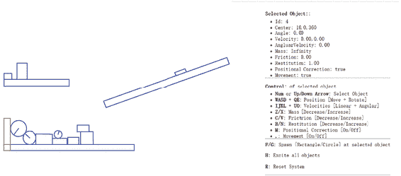

# 五、物理引擎总结

恭喜你！您已经学习了背后的基本思想和概念，并完成了 2D 物理引擎的实现。这一章将总结你从第一章到第四章所做的所有工作，你应该从这本书里了解和学到什么，并强调你所创造的物理引擎的改进或未来的探索。

本章首先总结了你在整本书中学到和使用的所有物理引擎理论和概念。接下来，会显示源代码文件的详细列表，以及您编写的相关函数，作为一个简单的“自述”文件。最后，你可以在你的物理引擎中探索和实现的更多主题将作为你未来游戏物理引擎努力的起点。本章还将包括一个简单的项目，作为您的引擎的最终和完整的功能和特性测试。您可以按照项目指南来设置和运行模拟，或者发挥创造力，设置自己的测试用例。

## 概念和理论

这本书旨在指导你建立自己的物理模拟。因此，介绍的所有主题都与这样一个系统的构建相关。

*   **刚性形状** -在物理交互过程中不改变形状的原语。为了支持有效的交互模拟，这些通常是简单的几何形状，例如圆形和矩形。刚性形状有自己的属性，支持物理模拟，如质量、宽度、高度、重心、惯性、摩擦、恢复等。

*   **引擎循环** -一个持续运行的循环，更新对象状态，调用对象间交互的计算，并渲染对象。引擎循环必须循环所有操作，并保持实时性能。通过在循环中实现固定的时间步长更新，模拟运动整合和维持确定的游戏状态变得简单明了。

*   **碰撞检测** -一种确定物体是否与其他物体重叠和/或相互穿透的算法。

*   **宽相位法** -通过利用物体的接近度来优化碰撞检测。引擎使用轴对齐的边界框来减少调用实际碰撞检测算法的开销。

*   **分离轴定理**-2D 最流行的检测一般凸形之间碰撞的算法之一。通常在此之前先进行一次宽相位方法的初始处理，以提高其整体性能。该算法可以检测轴对齐以及旋转形状之间的碰撞。

*   **碰撞信息** -描述碰撞细节的信息，包括穿插深度、导致穿插的法线方向以及穿插的开始和结束。此信息对于解决冲突至关重要。

*   **辛欧拉积分**——一种基于初值的积分逼近方法。该引擎使用辛欧拉积分来逼近对象的新的线性和旋转速度及其新的位置。

*   **位置修正**——使用碰撞检测过程中收集的碰撞信息分离两个穿插物体的过程。

*   **松弛循环** -物理引擎核心中的一个迭代循环，它重复并递增地对相互渗透的对象应用位置校正，试图消除碰撞对象相互渗透的发生。

*   **脉冲法-** 一种大大简化的基于物理的碰撞响应公式，能够捕捉碰撞过程中物体的弹性和摩擦因素。

*   **碰撞解决** -一个决定物体在碰撞后如何反应的过程。当应用脉冲方法来解决碰撞时，碰撞的对象会获得新的线速度和角速度。

## 引擎源代码

下面是源代码文件和相关功能的列表。

*   Core.js

    *   核心引擎回路

    *   更新功能

    *   绘图功能

    *   用户界面控件

*   物理学. js

    *   冲突检出

    *   松弛循环

    *   位置校正

    *   解决冲突

*   CollisionInfo.js

    *   碰撞信息对象

    *   构造函数和 getter/setter

*   事情 2.js

    *   2D 矢量计算

*   刚性形状. js

    *   刚性形状的基类

    *   构造器

    *   更新功能

    *   支持宽相位方法的包围盒碰撞测试

*   Rectangle.js & Circle.js

    *   从刚性形状基类继承

    *   每个的特定构造函数

    *   旋转功能

    *   绘图功能

    *   移动功能

*   rectangle _ collision . js & Circle _ collision . js

    *   碰撞检测功能

    *   收集碰撞信息

*   使用者控制. js

    *   用户输入控制器

*   MyGame.js .我的游戏. js

    *   模拟场景控制器

*   Index.html

    *   脚本调用

    *   初始化模拟场景

## 很酷的演示项目

这个项目指导你设置场景来测试你的物理引擎实现的功能。你可以在图 5-1 中看到这个项目运行的例子。这个项目的源代码在一个很酷的演示项目文件夹中定义。



###### 图 5-1。运行很酷的演示项目

项目目标:

*   测试并使用物理引擎的所有功能和特性

### 修改模拟场景

让我们从修改模拟场景开始:

1.  编辑 MyGame.js 文件。

2.  替换 MyGame 构造函数中的所有代码，为模拟创建一个新场景。

    ```js
    "use strict";
    /* global height, width, gEngine */
    function MyGame() {
    }
    ```

3.  在 MyGame 构造函数中，创建四个平台，其中一个旋转以测试角度运动。

    ```js
    //...continue from previous step
    var r1 = new Rectangle(new Vec2(500, 200), 400, 20, 0, 0.3, 0);
    r1.rotate(2.8);
    var r2 = new Rectangle(new Vec2(200, 400), 400, 20, 0, 1, 0.5);
    var r3 = new Rectangle(new Vec2(100, 200), 200, 20, 0);
    var r4 = new Rectangle(new Vec2(10, 360), 20, 100, 0, 0, 1);
    //...more in next step
    ```

4.  创建 10 个具有随机属性的圆形和矩形对象，以开始模拟。

    ```js
    //...continue from previous step
    for (var i = 0; i < 10; i++) {
      var r1 = new Rectangle(new Vec2(Math.random() * gEngine.Core.mWidth,
                        Math.random() * gEngine.Core.mHeight / 2),
                    Math.random() * 50 + 10, Math.random() * 50 + 10,
                    Math.random() * 30, Math.random(), Math.random());
      r1.mVelocity = new Vec2(Math.random() * 60 - 30, Math.random() * 60 - 30);
      r1 = new Circle(new Vec2(Math.random() * gEngine.Core.mWidth,
                   Math.random() * gEngine.Core.mHeight / 2),
               Math.random() * 20 + 10, Math.random() * 30,
               Math.random(), Math.random());
      r1.mVelocity = new Vec2(Math.random() * 60 - 30, Math.random() * 60 - 30);
    }
    ```

### 观察

您可以看到场景中没有边界。这允许对象从屏幕上掉落，而不会挤满空间。这样，您可以继续创建新对象，并观察对象行为的模拟。您还可以通过在模拟开始时创建更多对象来测试引擎的性能。请注意，这本书为您提供了创建自己的物理引擎的基本理解。从选择替代算法、支持不同特性到优化计算效率等等，都有很大的改进空间。下一节将指出一些你可以用来改进引擎的话题。

## 进一步探索和相关主题

现在你的物理引擎完成了，你可能会问自己，现在做什么？我应该如何继续我已经获得的知识，我应该如何处理我创建的物理引擎或者我接下来应该学习什么？最终，正如最常见的情况一样，答案是视情况而定。这首先取决于你对游戏物理引擎的兴趣，以及你为什么决定阅读并跟随这本书。如果您希望从头开始创建游戏或游戏引擎，您可能希望将这个物理引擎集成到您自己的游戏引擎或现有的游戏引擎中，以便将刚体物理功能添加到项目中。如果你的理由更多的是学术性的，目的是学习和理解游戏物理引擎是如何工作的，你可能想进一步探索游戏物理中的相关主题。

无论您属于哪个类别，您都可能希望通过添加更高级的特性或组件来改进物理引擎的性能和功能，从而扩展其功能。如果是这样的话，那么下面的主题为你提供了一些建议，让你在游戏物理学中进一步探索。

### 物理话题

*   **高级 2-D 刚体物理学** -如果您喜欢脉冲方法，并希望通过添加运动学(通常用于移动平台)、关节(用于更复杂的刚体行为)或许多其他优秀功能来改进物理引擎的功能，我们建议您查看 Box2D 物理引擎及其创建者 Erin Catto 的文献。Box2D 是普及了脉冲方法的游戏物理引擎，有几种编程语言版本。http://box2d.org/

*   如果你想模拟软体物理学，那么我们建议你探索一下 Verlet 物理学。Verlet physics 通过使用粒子、约束(弹簧)和 Verlet 集成来构建复杂的软体对象，提供了一种快速简单的方法来模拟软体，如布娃娃、绳子、果冻状的对象甚至布料。特别是，我们建议你看看 Thomas Jakobsen 关于*高级角色物理*的论文，这可能是对游戏物理感兴趣的人最受欢迎的起点，因为它易于实现和理解。当应用于刚体模拟时，Verlet 物理学的缺点是潜在的不稳定性。

*   **网络物理学** -网络物理学的主题包含了它自己独特的一组需要解决的问题，其中许多都围绕着同步。为了让你对这个问题有所了解，我们建议你看看下面的网站。http://gafferongames.com/game-physics/

*   3d 刚体物理学 -如果你对尝试 3d 物理模拟感兴趣，一个很好的起点就是脉冲法！impulse 方法的伟大之处在于，它也可以用于三维物理和二维物理。纽卡斯尔大学提供了一些关于在三维物理中实现 Impulse 方法的重要信息。[`research . ncl . AC . uk/game/masters degree/gamte technologies/`](https://research.ncl.ac.uk/game/mastersdegree/gametechnologies/)

### 碰撞检测主题

*   **连续碰撞** -连续碰撞是一种解决物理对象穿过其他太小的物理对象几何体或者以太高的速度行进的方法。由于游戏引擎的离散时间步长特性，这是一个问题。有几种方法可以解决这个问题。Erin Catto 的 GDC(游戏开发者大会)演示是一个很好的开始和了解这个主题的地方。[`www . gdcvault . com/play/1018239/Physics-for-Game-Programmers-Continuous`](http://www.gdcvault.com/play/1018239/Physics-for-Game-Programmers-Continuous)

*   **碰撞回调**——碰撞回调提供了一种更高级、更灵活的碰撞行为。它们可用于自定义物理对象的行为，如 OnCollisionEnter 或 OnCollisionExit。此外，它们还可以用于传递任何游戏逻辑所需的任何碰撞信息。碰撞回调通常是更高级的物理引擎的一个关键特性。

*   **GJK 碰撞检测**——GJK(Gilbert-Johnson-keer thi)算法是分离轴定理的替代碰撞检测方法。GJK 提供了更大的灵活性，并对多面凸多边形执行碰撞检测。

*   **空间分割** -空间分割是一种更先进的宽相位方法，常用于物理引擎，以提高碰撞检测和响应的性能。该方法将世界空间分成离散的区域，以便检测可能的碰撞。在 2D，一种更常用的空间划分技术被称为四叉树。

## 参考

以下是我们学习这个题目时查阅的一些参考资料。

*   一般定义:[`en.wikipedia.org/`](https://en.wikipedia.org/)

*   物理形状和属性:[`buildnewgames.com/gamephysics/`](http://buildnewgames.com/gamephysics/)

*   分离轴定理:[`www . metanet software . com/technique/tutoriala . html # section 3`](http://www.metanetsoftware.com/technique/tutorialA.html#section3)

*   不旋转解决碰撞:[`game development . tuts plus . com/tutorials/how-to-create-a-custom-2d-physics-engine-friction-scene-and-jump-table-game dev-7756`](https://gamedevelopment.tutsplus.com/tutorials/how-to-create-a-custom-2d-physics-engine-friction-scene-and-jump-table%2D%2Dgamedev-7756)

*   旋转碰撞冲量公式:[`www.myphysicslab.com/collision.html`](http://www.myphysicslab.com/collision.html)

*   解决碰撞旋转和分离轴定理:[`game development . tuts plus . com/tutorials/how-to-create-a-custom-2d-physics-engine-oriented-rigid-bodies-game dev-8032`](https://gamedevelopment.tutsplus.com/tutorials/how-to-create-a-custom-2d-physics-engine-oriented-rigid-bodies%2D%2Dgamedev-8032)