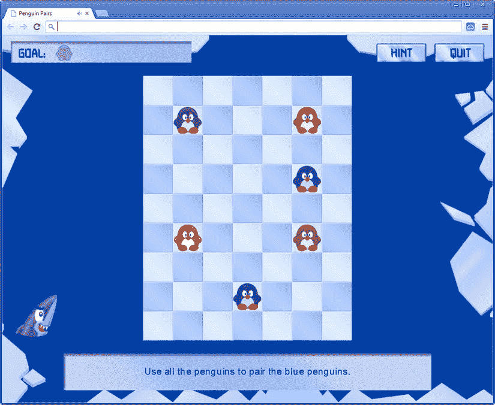

# 二十一、存储和调用游戏数据

许多游戏由不同的关卡组成。尤其是在解谜、迷宫类的休闲游戏中，一个游戏可能有几百个关卡。到目前为止，你的游戏一直依靠随机性来保持游戏的趣味性。虽然随机性是实现可玩性的强大工具，但在很多情况下，游戏设计者希望对游戏的进展有更多的控制。这种控制一般通过设计*级*来实现。每个关卡都有自己的游戏世界，玩家必须在其中实现某种目标。

使用到目前为止您所看到的工具，您可以想象，对于游戏中的每个关卡，您都可以编写一个特定的类，在其中用游戏对象填充特定的关卡，并添加您想要的行为。这种方法有一些缺点。最大的缺点是你把*游戏逻辑*(游戏玩法、获胜条件等等)和*游戏内容*混在了一起。这意味着每次你想给游戏添加另一个关卡时，你都必须编写一个新的类，这导致了当一个游戏被加载到浏览器中时，需要检索大量的类。此外，如果一个游戏设计师想给你开发的游戏增加一个关卡，他需要深入了解你的代码是如何工作的。设计者在编写代码时犯的任何错误都会导致你的游戏出现错误或崩溃。

更好的方法是将关卡信息与实际的游戏代码分开存储。当游戏加载时，关卡信息被检索。理想情况下，信息需要以非程序员能够理解和使用的简单格式存储。这样，关卡可以由某人来设计，而不需要那个人知道游戏如何将数据转换成可玩的游戏关卡。JavaScript 是一种非常适合表示结构化信息的语言。这很容易，主要是因为可以在 JavaScript 中定义对象文字。看看下面的例子:

```js
var ticTacToeSaveGame = {
    scorePlayerX : 2,
    scorePlayerO : 1,
    currentStatus : ["x x",
                     "oox",
                     "o "],
    turn : "x"
}

```

这个变量描述了两个玩家的*井字游戏*的游戏状态。第一个玩家赢了两局，第二个玩家只赢了一局。游戏的当前状态存储在一个字符串数组中。最后，放置 *x* 标记的玩家轮到他们了。通过编辑这个变量，你可以很容易地改变分数或游戏的当前状态。您甚至可以通过向`currentStatus`变量添加列和行来决定让棋盘变得更大。所有这些都可以在不知道*井字游戏*实际工作原理的情况下完成。游戏设计者可以编辑以这种方式构建的数据，游戏可以从这样的变量中读取数据，并让玩家继续他们的游戏。此外，由于 JavaScript 对象文字，这种格式相对容易理解，即使对于很少或没有编程经验的人也是如此。最后，随着游戏变大，开发游戏的团队也会变大。通过将关卡设计和之前介绍的东西(比如精灵表)分开，你可以让擅长游戏设计和图形设计的非程序员帮助你更有效地创建令人敬畏的游戏。

你可以用类似的方式处理企鹅配对中的不同等级。在这一章中，你将看到如何在你的游戏中建立这样一个关卡加载方案。你要看的另一件事是在不同的会话中存储和调用游戏的状态。诸如 Painter 和 Jewel Jam 之类的游戏不会保留玩家以前玩该游戏时的任何信息，这在那些游戏中并不重要。然而，在企鹅配对的情况下，这很重要，因为你不希望玩家每次启动游戏都要从头开始。如果玩家完成了一个关卡，浏览器应该会在玩家下一次启动游戏时记住，这样玩家就可以从他们停止的地方继续。

层次的结构

我们先来看看企鹅配对游戏里一个关卡里能有什么样的东西。首先，有某种背景图像。让我们假设这个背景在您加载关卡时是固定的，所以没有必要在文本文件中存储任何关于它的信息。

在这一层有许多不同的动物，如企鹅、海豹和鲨鱼。还有冰山，企鹅可以移动的背景块，还有其他一些东西。您希望将所有这些信息存储在一个结构化变量中。一种可能是存储每个对象的位置和类型，但这将使变量变得复杂。另一种可能是将关卡分成小块，也叫*瓦片* 。每个方块都有特定的类型(可能是企鹅、运动场瓷砖、透明瓷砖、企鹅等等)。一个方块可以用一个字符来表示，你可以将关卡的结构存储在一个变量中，就像你对*井字游戏*所做的一样，例如:

```js
var myLevel = {
    tiles : ["#.......#",
                            "#...r...#",
                            "#.......#",
                            "#. .#",
                            "#. .#",
                            "#. .#",
                            "#.......#",
                            "#...r...#",
                            "#.......#"]
};

```

在这个级别定义中，定义了许多不同的块。冰山(墙)瓷砖由`#`符号定义，企鹅由`r`字符定义，背景瓷砖由`.`字符定义，空瓷砖由空格字符定义。现在您可以编写一个方法，使用这些信息来创建图块并将它们存储在某个地方(可能在一个`GameObjectGrid`实例中)。这意味着你需要不同类型的瓷砖:企鹅可以站在上面的普通瓷砖，透明的背景瓷砖，以及企鹅可以碰撞的墙壁(冰山)瓷砖。

瓷砖类

首先，让我们写一个基本的`Tile`类。 这个类是`SpriteGameObject`类的子类。现在，你不考虑更复杂的项目，如企鹅，海豹和鲨鱼。您只需查看背景(透明)瓷砖、普通瓷砖和墙壁(冰山)瓷砖。让我们引入一个变量来表示这些不同种类的瓷砖:

```js
var TileType = {
    normal: 0,
    background: 1,
    wall: 2
};

```

`Tile`类是`SpriteGameObject`的基本扩展。在构造函数中，您声明一个成员变量`type`来存储一个实例所代表的图块类型:

```js
function Tile(sprite, layer) {
    SpriteGameObject.call(this, sprite, layer);
    this.type = TileType.normal;
}

```

为了适应透明拼贴，只有当拼贴不是背景拼贴时，才覆盖`draw`方法来绘制 sprite:

```js
Tile.prototype.draw = function () {
    if (this.type === TileType.background)
        return;
    SpriteGameObject.prototype.draw.call(this);
};

```

当您加载关卡时，您为每个角色创建一个图块，并将其存储在一个网格结构中，如`GameObjectGrid`。

其他级别信息

除了瓷砖，您还需要在`levelData`变量中存储一些其他的东西:

*   级别是否被锁定
*   关卡是否已经被玩家解决
*   关卡的提示
*   要制作的对数
*   提示箭头的位置和方向

因此，您可以在变量中定义一个完整级别，如下所示:

```js
var myLevel = {
    locked : true,
    solved : false,
    hint : "Don't let the penguins fall in the water!",
    nrPairs : 1,
    hint_arrow_x : 3,
    hint_arrow_y : 1,
    hint_arrow_direction : 2,
    tiles : ["#.......#",
                            "#...r...#",
                            "#.......#",
                            "#. .#",
                            "#. .#",
                            "#. .#",
                            "#.......#",
                            "#...r...#",
                            "#.......#"]
};

```

您需要为每个级别定义这样一个变量。将所有这些级别存储在一个*数组*中是有意义的。因为级别信息需要随处可用，所以您将级别信息存储在一个*全局变量*中。一般来说，如果可能的话，应该避免使用全局变量，原因如下:

*   全局名称空间将被大量的全局变量弄得混乱不堪，这可能会降低脚本的执行速度。
*   如果两个不同的 JavaScript 文件碰巧使用相同的全局变量，就会发生冲突。
*   您源代码变得不容易阅读，因为很难了解哪些数据在哪里使用。

在这种情况下，您使用一个全局变量，因为级别数据需要随处可访问。然而，你可以做一些事情来确保你使用的是一个全局变量。你要做的一件事是用大写字母写变量名，以强调它不同于其他普通变量。您还可以显式地将变量附加到全局域(在 JavaScript 中称为`window`)。下面是变量初始化:

```js
window.LEVELS = [];

```

现在您唯一需要做的就是用级别信息填充这个变量。对于每一级，使用`push`方法 : 向数组添加一个条目

```js
window.LEVELS.push({
    locked : false,
    solved : false,
    hint : "Click on a penguin and select the arrow to let
                             it move towards the other penguin.",
    nrPairs : 1,
    hint_arrow_x : 4,
    hint_arrow_y : 3,
    hint_arrow_direction : 3,
    tiles : ["#########",
                            "#.......#",
                            "#...r...#",
                            "#.......#",
                            "#.......#",
                            "#.......#",
                            "#...r...#",
                            "#.......#",
                            "#########"]
});

```

这个例子是第一个层次。如你所见，第一关的锁定状态被设置为`false`，所以玩家被允许玩这一关。所有其他级别的锁定状态被设置为`true`。当玩家完成一个级别，你更新这个状态。等级在`levels.js`文件中定义。这是一个 JavaScript 文件，但它位于`PenguinPairs4`示例的`assets`文件夹中，因为这些数据与其说是代码，不如说是*素材*。此外，这样设计者可以在`assets`文件夹中工作，改变精灵和等级数据，而不必查看游戏运行代码。

播放状态

在前一章中，你看到了如何创建多个游戏状态，比如标题屏幕、关卡选择菜单和选项菜单。在本节中，您添加了一个*播放状态*。游戏状态基本上由一系列关卡组成，每个关卡都有自己的游戏世界。对于标题屏幕和选项菜单这样的状态，您可以创建一个`GameObjectList`的子类。然而，在这里这没有太大的意义，因为游戏状态需要在游戏世界之间切换。因此，你不会从`GameObjectList`继承。但是你确实想定义游戏循环方法，比如`update`和`draw`。您可以通过引入一个新的类`IGameLoopObject`，稍微改变软件设计来适应这一点。这个类唯一做的事情是提供游戏循环的任何对象部分应该拥有的方法的定义。下面是完整的类:

```js
function IGameLoopObject() {
}

IGameLoopObject.prototype.handleInput = function (delta) {};
IGameLoopObject.prototype.update = function (delta) {};
IGameLoopObject.prototype.draw = function () {};
IGameLoopObject.prototype.reset = function () {};

```

这个类被称为`IGameLoopObject`，而不是例如`GameLoopObject`，因为在软件设计中，这样的类通常被称为*接口*。接口非常有用，因为它们为程序员提供了当一个类*实现那个接口*(换句话说，从接口类继承)时可以预期的方法(或属性)种类的信息。相当多的编程语言都有一个特殊的编程结构，可以让你创建这些接口。JavaScript 不是这种情况，但是您仍然可以使用这个概念来获得相同的结果。

接口构成了所有拥有游戏循环方法的对象的基础。您可以更改示例中的现有类来遵循这种方法。例如，`GameObject`类现在也继承自`IGameLoopObject`:

```js
function GameObject(layer, id) {
    IGameLoopObject.call(this);

    // initialize the game object...
}
GameObject.prototype = Object.create(IGameLoopObject.prototype);

```

看看`PenguinPairs4`例子中的类，看看`IGameLoopObject`类是如何集成到程序设计中的。如您所见，该示例添加了一个`PlayingState`类，它也继承自`IGameLoopObject`:

```js
function PlayingState() {
    IGameLoopObject.call(this);

    // initialize the playing state...
}
PlayingState.prototype = Object.create(IGameLoopObject.prototype);

```

在播放状态下创建关卡

在本节中，您将从存储在全局`windows.LEVELS`变量中的数据创建游戏中的关卡。为了表示一个级别，您创建了一个继承自`GameObjectList`的`Level`类。对于每个需要创建的级别，您创建一个`Level`实例，并根据全局`LEVELS`变量中的数据填充它。在`PlayingState`构造函数中，您初始化一个数组，在其中存储所有这些实例。您还可以存储玩家当前正在玩的关卡:

```js
this.currentLevelIndex = -1;
this.levels = [];

```

然后您调用一个方法`loadLevels`，它负责从级别数据创建`Level`实例:

```js
this.loadLevels();

```

在`loadLevels`方法中，您放置了一个`for`循环，在其中您创建了`Level`实例。在`Level`构造函数中，你将关卡数据转换成实际的游戏对象，这些对象是每个关卡的一部分:

```js
PlayingState.prototype.loadLevels = function () {
    for (var currLevel = 0; currLevel < window.LEVELS.length; currLevel++)
        this.levels.push(new Level(currLevel));
};

```

创建`Level`实例

在`Level`构造函数中，你必须创建属于那个级别的不同游戏对象。作为第一步，您检索级别数据并将其存储在一个名为`levelData` : 的变量中

```js
function Level(levelIndex) {
    GameObjectList.call(this);
    var levelData = window.LEVELS[levelIndex];
    this.levelIndex = levelIndex;

    // to do: fill this level with game objects according to the level data
}

```

你还需要跟踪企鹅和海豹等动物。您在一个单独的数组中这样做，以便以后可以快速查找它们。这同样适用于某些级别的鲨鱼:

```js
this.animals = [];
this.sharks = [];

```

现在你可以开始创建游戏对象来填充游戏世界。首先向游戏世界添加一个背景图像:

```js
this.add(new SpriteGameObject(sprites.background_level, ID.layer_background));

```

然后你读水平的宽度和高度。您可以通过检索`tiles`数组的长度以及该数组中单个字符串的长度来确定它们:

```js
var width = levelData.tiles[0].length;
var height = levelData.tiles.length;

```

然后创建一个`GameObjectList`实例来包含游戏区域，就像在宝石果酱游戏中一样。你把这个游戏场放在屏幕的正中央:

```js
var playingField = new GameObjectList(ID.layer_objects);
playingField.position = new Vector2((Game.size.x - width * 73) / 2, 100);
this.add(playingField);

```

现在您需要从`levelData`变量中检索图块信息。您重用了`GameObjectGrid`类来表示瓷砖网格。要读取所有的瓷砖，你使用一个嵌套的`for`指令。看看下面几行代码:

```js
var tileField = new GameObjectGrid(height, width, ID.layer_objects, ID.tiles);
tileField.cellHeight = 72;
tileField.cellWidth = 73;
for (var row = 0; row < height; row++) {
    for (var col = 0; col < width; col++) {
        // handle the tile 'levelData.tiles[row][col]' here
    }
}

```

首先创建一个`GameObjectGrid`实例，并将网格中一个单元格的宽度和高度设置为给定的大小。然后开始读取包含瓷砖信息的字符。

现在，根据您从表达式`levelData.tiles[row][col]`中获得的角色，您需要创建不同种类的游戏对象并将它们添加到网格中。你可以使用一个`if`指令来实现:

```js
if (levelData.tiles[row][col] === '.')
    // create an empty tile
else if (levelData.tiles[row][col] === ' ')
    // create a background tile
else if (levelData.tiles[row][col] === 'r')
    // create a penguin tile
//... and so on

```

原则上，这种代码是可行的。但是每次都要写一个复杂的条件。很容易犯错误，比如变量名拼写错误或者忘记加括号。还有另一种选择，可以让你以稍微干净的方式写这个。JavaScript 提供了一种特殊的处理案例的指令:`switch`。

**注意**当以基于文本的格式定义等级时，你必须决定每个字符代表哪种对象。这些决定影响了关卡设计者和开发者的工作，前者必须在关卡数据文件中输入字符，后者必须编写代码来解释关卡数据。这显示了文档是多么重要，即使是在活动开发期间。有一个“备忘单”是很好的，这样当你写这段代码时，你就不必记住所有关卡设计的想法。如果你和设计师一起工作，这样的备忘单也很有用，可以确保你们在同一页上。

使用`switch`处理备选方案

`switch`指令允许您指定替代方案，以及每个替代方案应执行的指令。例如，前面有多个替代项的`if`指令可以重写为一个`switch`指令如下:

```js
switch(levelData.tiles[row][col]) {
    case '.': // create an empty tile
              break;
    case ' ': // create a background tile
              break;
    case 'r': // create a penguin tile
              break;
}

```

`switch`指令有一些便利的属性，这使得它在处理不同的选择时非常有用。请看下面的代码示例:

```js
if (x === 1)
    one();
else if (x === 2) {
    two();
    alsoTwo();
} else if (x === 3 || x === 4)
    threeOrFour();
else
    more();

```

您可以用如下的`switch`指令重写它:

```js
switch(x) {
    case 1: one();
             break;
    case 2: two();
             alsoTwo();
             break;
    case 3:
    case 4: threeOrFour();
             break;
    default: more();
             break;
}

```

当执行`switch`指令时，计算括号之间的表达式。然后执行字`case`和特定值之后的指令。如果没有对应于该值的案例，则执行`default`关键字之后的指令。不同情况背后的值需要是常量值(数字、字符、双引号中的字符串或声明为常量的变量)。

`break`指令

如果不小心，`switch`指令不仅会执行相关案例后面的指令，还会执行其他案例后面的指令。您可以通过在每个案例后放置特殊的`break`指令来防止这种情况。`break`指令的基本意思是，“停止执行你当前所在的`switch`、`while`或`for`指令。”如果在前面的例子中没有`break`指令，那么在`x === 2`的情况下，将调用方法`two`和`alsoTwo`，以及方法`threeOrFour`和`more`。

在某些情况下，这种行为是有用的，这样，在某种意义上，不同的案例可以相互交流。但是，当这样做时，您必须小心，因为这可能导致错误——例如，如果程序员忘记将`break`指令放在某个地方，这将导致非常奇怪的行为。当您使用`switch`指令时，请确保案例始终由`break`指令分隔。唯一的例外是当你在一组指令前写多个`case`标签时，就像你在例 3 和例 4 中所做的那样。`switch`指令的语法是*指令*语法图的一部分。图 21-1 显示了属于`switch`指令的那部分图表。


图 21-1 。`switch`指令的语法图

装载不同种类的瓷砖

您可以使用`switch`指令来加载所有不同的图块和游戏对象。对于`levelData.tiles`变量中的每个字符，您需要执行不同的任务。例如，当字符“.”时被读取，您需要创建一个正常的运动场瓷砖。下面的指令就是这样做的:

```js
t = new Tile(sprites.field, ID.layer_objects);
t.sheetIndex = row + col % 2;
tileField.addAt(t, col, row);
break;

```

用于图块的精灵是由两个不同精灵组成的条带。通过使用公式`row + col % 2`切换工作表索引，您会得到一个交替的棋盘图案，正如您通过运行属于本章的示例程序所看到的。另一个例子是添加透明背景拼贴:

```js
t = new Tile(sprites.wall, ID.layer_objects);
t.type = TileType.background;
tileField.addAt(t, col, row);
break;

```

尽管背景精灵是不可见的，你仍然可以加载一个属于这个图块的精灵。为什么会这样？因为`Tile`类继承自`SpriteGameObject`类，后者需要一个 sprite。当然，另一个选择是修改`SpriteGameObject`类，这样它就可以处理一个名为`null`的精灵。然而，在这种情况下，您遵循提供精灵的简单解决方案，即使玩家永远不会看到它。当你必须安置一只企鹅时，需要做两件事:

*   放置普通瓷砖。
*   放置一只企鹅。

因为企鹅需要在棋盘上走来走去，而你需要与它们互动，所以你创建了一个类`Animal`来表示一种动物，比如企鹅或海豹。在本节的后面，您将看到这个类的样子。为了跟踪游戏中的动物，您维护了一个数组作为`Level`类的成员变量，正如您之前看到的:

```js
this.animals = [];

```

在`switch`指令中，你创建一个普通的瓷砖和一只企鹅，如下所示:

```js
t = new Tile(sprites.field, ID.layer_objects);
t.sheetIndex = row + col % 2;
tileField.addAt(t, col, row);
var animalSprite = sprites.penguin;
if (levelData.tiles[row][col] === levelData.tiles[row][col].toUpperCase())
    animalSprite = sprites.penguin_boxed;
var p = new Animal(levelData.tiles[row][col], animalSprite, ID.layer_objects_1);
p.position = t.position.copy();
p.initialPosition = t.position.copy();
playingField.add(p);
this.animals.push(p);
break;

```

你也在做一些其他的事情。例如，你希望普通动物和被装箱的动物(不能移动的动物)有所不同。您可以通过使用大写或小写字符来进行区分。JavaScript 知道一个方法`toUpperCase`将一个字符转换成它的大写变体。您在一个`if`指令的条件中使用该方法来确定应该使用的素材的名称。创建了`Animal`对象后，你将它的位置设置为你创建的图块的位置，这样它就被正确放置了。您还将名为`initialPosition`的变量设置为相同的值。你这样做是为了当玩家卡住并按下重试按钮时，你可以知道每个动物在关卡中的原始位置。

在`Animal`构造函数中，您将字符作为参数传递。这样做是为了在构造函数中决定应该选择哪个元素。你也可以检查角色，看看你是否在和一只被装箱的动物打交道。装箱状态存储在`Animal`类的布尔成员变量中:

```js
this.boxed = (color === color.toUpperCase());

```

在下一条指令中，你使用一个叫做`indexOf`的方法，根据作为参数传递的字符，聪明地计算出你想要显示的动物。方法检查字符串中一个字符的第一个索引。例如:

```js
"game".indexOf('a') // returns 1
"over".indexOf('x') // returns -1
"penguin pairs".indexOf('n') // returns 2

```

以下是如何使用该方法计算动物的床单指数:

```js
this.sheetIndex = "brgyopmx".indexOf(color.toLowerCase());

```

您将字符转换为小写，这样指令对正常企鹅和盒装企鹅都有效。为了完成`Animal`类，您添加了一些方便的方法来检查您是否正在处理一个特殊情况，比如一只五彩企鹅、一个空盒子或一只海豹。有关完整的`Animal`类，请参见属于本章的示例程序`PenguinPairs4`。

最后，在企鹅配对游戏中还有鲨鱼。鲨鱼是相对简单的动物，它们不能被玩家控制(非常像在现实生活中！).因此，您没有使用`Animal`类，而是为它们使用了`SpriteGameObject`，它包含了您需要的一切。你遵循一个与企鹅相似的程序。您创建了一个图块和一条鲨鱼，并将鲨鱼存储在一个数组中，以便以后可以轻松找到它们:

```js
t = new Tile(sprites.field);
t.sheetIndex = row + col % 2;
tileField.addAt(t, col, row);
var s = new SpriteGameObject(sprites.shark, ID.layer_objects_1);
s.position = t.position.copy();
playingField.add(s);
this.sharks.push(s);
break;

```

现在你已经在`switch`指令中处理了所有这些不同的情况，你可以加载每个级别了。看看示例中的`Level`类，了解完整的级别创建过程。图 21-2 显示了一个关卡加载后的截图。



图 21-2 。企鹅配对游戏中的一个关卡

维持玩家的进度

为了完成这一章，这一节将向你展示一个跟踪玩家在不同阶段的进度的好方法。你希望游戏记住玩家最后一次玩游戏时的位置。有几种方法可以做到这一点。一种方法是让玩家来做这项工作，默认情况下简单地向玩家开放所有关卡。这是一个解决方案，但它并没有真正激励玩家按顺序解决每个关卡。另一种方法是在服务器上使用一个可以被 JavaScript 应用访问的数据库。然后，您可以在服务器上存储玩家信息，并通过这种方式跟踪玩家。这是可行的，但也不理想，因为除了 JavaScript 应用之外，还需要一台服务器启动并运行。第三个选择是使用 HTML5 中引入的一个叫做 *HTML5 网络存储*的特性。

HTML5 web 存储提供了一种以两种不同方式存储信息的方法，使用两个不同的变量。如果你给变量`code.sessionStorage`，赋值，这个信息会一直保留到应用运行的标签关闭。如果给变量`window.localStorage`赋值，该值将在不同的会话中保留。后者是一个非常有用的选择。例如，您可以执行以下操作:

```js
window.localStorage.playerName = "Bridget";

```

下一次开始游戏时，您可以读取变量的值，并通过记住她的名字来让玩家大吃一惊。然而，使用本地存储有一些附加条件。首先，很容易意外清除`localStorage` 变量，因为任何 JavaScript 程序都可以访问它。此外，用户可以从浏览器菜单中显式地这样做，因此您的程序不应该依赖于以这种方式存储的数据，而没有数据的备份或默认值。现代浏览器在私有模式下运行时，通常会禁用本地存储。如果你的游戏严重依赖本地存储，并且被禁用了，以某种方式通知玩家可能是个好主意。

另一个限制是，您只能在本地存储中将*字符串*存储为值。这意味着您想要存储的任何复杂数据都必须转换为字符串值。当您读取数据时，您需要解析字符串并将数据转换回来。因为`windows.LEVELS`变量包含所有级别数据，包括每个级别的锁定/已解决状态，所以您希望将该对象转换为字符串，并将其完整地存储在本地存储中。问题是，你如何把这样一个复杂的变量转换成一个字符串，然后再转换回来？

JavaScript 再次拯救了我们！这种语言的一个真正伟大的特性是 JavaScript 允许无缝地转换成和转换成对象文字的字符串，比如`windows.LEVELS`。这是使用`JSON`对象完成的。JavaScript Object Notation(JSON)是一个将结构化对象表示为字符串的开放标准，很像 XML。JavaScript 有几个有用的方法可以自动将对象文字转换成这样的字符串。例如，要将所有级别数据作为 JSON 字符串存储在本地存储中，您只需要以下代码行:

```js
localStorage.penguinPairsLevels = JSON.stringify(window.LEVELS);

```

从 JSON 字符串到对象文字同样简单:

```js
window.LEVELS = JSON.parse(localStorage.penguinPairsLevels);

```

在`Level`类中，您添加了两个方法`loadLevelsStatus`和`writeLevelsStatus`，它们从本地存储中读取级别信息，并将其写入本地存储。您在这些方法中添加了一些检查，以确保本地存储实际上是可用的(只有在较新的浏览器中才有)。下面是两种方法的定义:

```js
PlayingState.prototype.loadLevelsStatus = function () {
    if (localStorage && localStorage.penguinPairsLevels) {
        window.LEVELS = JSON.parse(localStorage.penguinPairsLevels);
    }
};
PlayingState.prototype.writeLevelsStatus = function () {
    if (!localStorage)
        return;
    localStorage.penguinPairsLevels = JSON.stringify(window.LEVELS);
};

```

您在`PlayingState`的构造函数中调用`loadLevelsStatus`方法，这样当游戏开始时，就可以使用本地存储中更新的关卡信息。每当玩家完成一个关卡，你就调用`writeLevelsStatus`方法。这样，下次玩家开始游戏时，游戏会记住玩家已经完成的关卡。

在练习中，尝试通过存储更多信息来扩展`PenguinPairs4`示例。例如，目前游戏不记得玩家对音乐音量的偏好或是否应该显示提示。你能创建一个在不同阶段保留这些信息的游戏版本吗？

保存游戏的诅咒

大多数游戏都有一个让玩家保存进度的机制。这通常用于三种方式之一:以后继续玩，当玩家在游戏中失败时返回到以前的保存点，或者利用替代策略或故事情节。这些可能性听起来都很合理，但也带来了问题；当你设计游戏时，你必须仔细考虑何时(以及如何)允许玩家保存和加载游戏状态。

例如，在较老的第一人称射击游戏中，所有的敌人都在游戏世界中的固定位置。玩家之间的一个常见策略是保存游戏，跑进一个房间看看敌人在哪里(这导致了即时死亡)，加载保存的游戏，并根据敌人的位置信息，仔细清理房间。这让游戏玩起来轻松了很多，但这绝对不是创作者的本意。这可以通过使保存游戏或加载已保存的游戏变得困难来部分补救。其他游戏只允许在特定的保存点保存。有些人甚至将到达保存点作为挑战的一部分。但这可能会导致挫败感，因为如果有一个非常困难的地方，玩家可能不得不一遍又一遍地重放游戏的各个部分。最有趣的游戏是那些你永远不需要返回来节省点数的游戏，因为你从来没有真正失败过，但这是非常难以设计的。

所以仔细想想你的储蓄机制。什么时候允许保存？你允许多少种不同的扑救？游戏中的保存是如何工作的？玩家如何加载保存的游戏？玩家保存或加载游戏需要花费一些东西吗？所有这些决定都会影响游戏性和玩家满意度。

你学到了什么

在本章中，您学习了:

*   如何创建基于磁贴的游戏世界
*   如何使用`switch`指令处理不同的情况
*   如何使用本地存储检索和存储液位状态数据