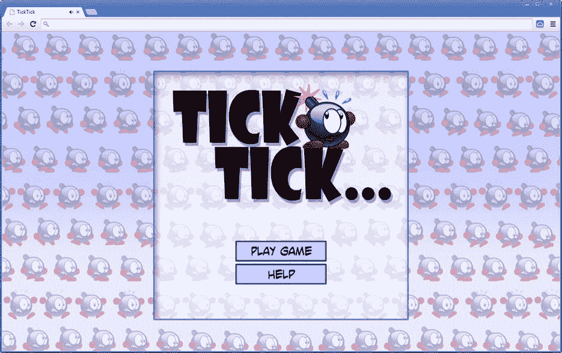
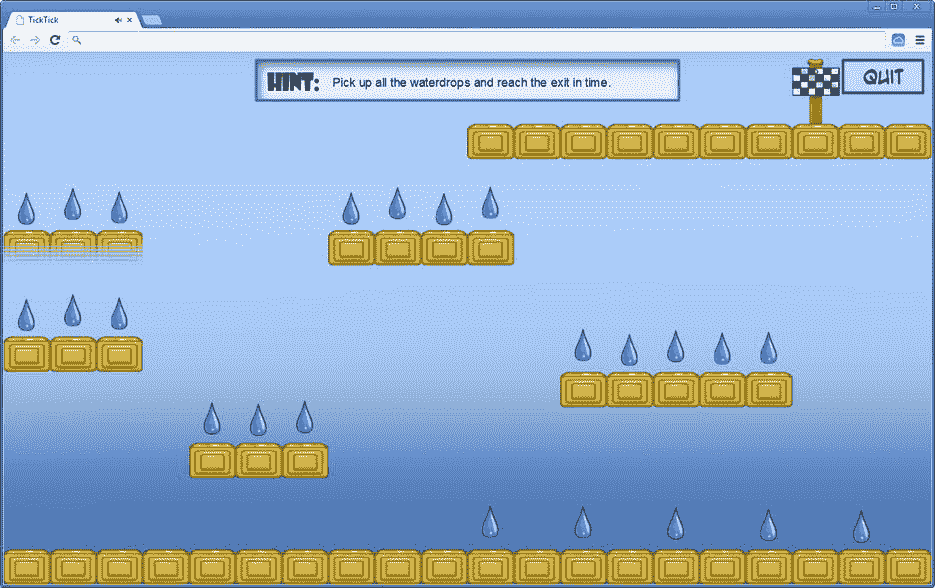

# 二十四、主游戏结构

在这一章中，你将为滴答滴答游戏设计一个框架。因为你已经为之前的游戏做了很多工作，所以你可以依赖很多已经存在的类。事实上，你是在前一章的`powerupjs`命名空间/库中分组的类上构建游戏的。这意味着你已经有了处理游戏状态和设置的基本设计，游戏对象的层次结构，等等。稍后，您可以通过添加与动画游戏对象相关的类来扩展`powerupjs`库。你可以在图书馆看到这些课程；它们将在下一章讨论。

游戏结构概述

这个游戏的结构与企鹅配对游戏非常相似。有一个标题屏幕允许玩家进入等级选择菜单或帮助页面(见图 24-1 )。为了简单起见，您不需要实现选项页面，尽管添加它会很简单，因为您可以使用与 Penguin Pairs 中相同的方法。因为菜单结构非常相似，所以这里不讨论。您可以在`TickTick1`文件夹中看到包含属于本章的示例代码的代码。



图 24-1 。滴答滴答游戏的标题画面

`PlayingState`类保持当前等级，处理载入和保存等级状态(已解决/锁定)，就像企鹅配对游戏一样。游戏状态创建了`Level`对象，每个对象包含一个基于瓷砖的游戏世界，同样非常类似于企鹅配对的构造方式。

级别的结构

我们先来看看嘀嗒嘀嗒里什么样的东西可以在一个等级里。首先，有一个背景图像。现在，您显示一个简单的背景精灵；不需要在 level 数据变量中存储任何相关信息。也有不同种类的块，玩家可以跳，随着水滴，敌人，玩家的开始位置，和玩家必须到达的结束位置。就像在企鹅配对游戏中一样，你将等级信息存储在一个全局变量中。这个变量存储在本地存储器中，以便当玩家完成一个级别时，浏览器在玩家下一次玩游戏时记住它。当然，这是假设玩家没有同时清空本地存储器。

使用瓷砖定义标高，其中每个瓷砖都有特定的类型(墙、背景等)。然后，在 level 数据变量中用一个字符来表示每种瓷砖类型。就像在企鹅配对游戏中一样，您可以在与游戏场地相对应的二维空间中以文本的形式显示关卡。在实际的图块旁边，还存储了一个提示和级别定义。这里你可以看到在`LEVELS`全局变量中存储第一级的指令:

```js
window.LEVELS.push({
    hint : "Pick up all the water drops and reach the exit in time.",
    locked : false,
    solved : false,
    tiles : ["....................",
                ".................X..",
                "..........##########",
                "....................",
                "WWW....WWWW.........",
                "---....####.........",
                "....................",
                "WWW.................",
                "###.........WWWWW...",
                "............#####...",
                "....WWW.............",
                "....###.............",
                "....................",
                ".1........W.W.W.W.W.",
                "####################"]
});

```

该级别定义定义了许多不同的单幅图块和对象。例如，墙砖由`#`符号定义，水滴由`W`字符定义，玩家的开始位置由`1`字符定义。如果在特定的位置没有牌，你使用`.`字符。对于平台游戏，您需要不同类型的瓷砖:玩家可以站在上面或与之碰撞的墙壁瓷砖，以及指示该位置没有障碍物的背景/透明瓷砖。您还想定义一个*平台图块*。这种瓷砖的特性是玩家可以像墙砖一样站在上面，但是如果他们站在下面，他们可以从下面跳过去。这种磁贴在很多经典的平台游戏中都有使用，这里不收录就太可惜了！在级别数据变量中，平台瓦片由一个`-`字符表示。表 24-1 给出了滴答滴答游戏中不同牌的完整列表。

表 24-1 。Tick Tick 游戏中不同种类的牌概述

| 

性格；角色；字母

 | 

瓷砖描述

 |
| --- | --- |
| `.` | 背景瓷砖 |
| `#` | 瓷面砖 |
| `^` | 墙砖(热的) |
| `*` | 墙砖(冰) |
| `-` | 平台瓷砖 |
| `+` | 平台瓷砖(热) |
| `@` | 平台瓷砖(冰) |
| `X` | 末端瓷砖 |
| `W` | 水滴 |
| `1` | 开始牌(初始玩家位置) |
| `R` | 火箭敌人(向左移动) |
| `r` | 火箭敌人(向右移动) |
| `S` | 闪亮的敌人 |
| `T` | 龟敌 |
| `A` | 火焰敌人(随机速度和方向变化) |
| `B` | 火焰敌人(玩家跟随) |
| `C` | 火焰敌人(巡逻) |

水滴

每一关的目标是收集所有的水滴。每个水滴都由一个`WaterDrop`类的实例来表示。这个类是一个`SpriteGameObject`子类，但是你想给它添加一点行为:水滴应该上下弹跳。你可以用`update`方法做到这一点。首先你计算一个*反弹偏移量*，你可以把它加到水滴的当前位置上。这个反弹偏移量存储在成员变量`_bounce`中，该变量在构造函数 中初始设置为 0

```js
this._bounce = 0;

```

为了计算每个游戏循环迭代中的反弹偏移，您使用了一个*正弦*函数。根据水滴的 *x* 位置，你可以改变正弦信号的相位，这样就不会所有的水滴同时上下移动:

```js
var t = powerupjs.Game.totalTime * 3 + this.position.x;
this._bounce = Math.sin(t) * 5;

```

将反弹值加到水滴的 *y* 位置:

```js
this.position.y += this._bounce;

```

`+=`运算符将反弹值加到 *y* 位置(关于这些类型运算符的更多信息，参见第十章)。然而，简单地将反弹值加到 *y* 位置是不正确的，因为这是反弹*偏移*——换句话说，是相对于*原始 y* 位置的偏移。要获得原始的 *y* 位置，您需要从`update`方法的第一条指令中的 *y* 位置减去*反弹偏移量:*

```js
this.position.y -= this._bounce;

```

这是可行的，因为此时,`_bounce`变量仍然包含前一次游戏循环迭代的反弹偏移量。所以，从 *y* 位置中减去就得到原始的 y 位置。

在下一章，你会添加更多的游戏对象，比如玩家和各种各样的敌人。但是我们先来看看在 Tick Tick 这样的平台游戏中如何定义瓦片。

瓷砖类

`Tile`类与企鹅配对中使用的非常相似，但也有一些不同。首先，在变量中定义不同的图块类型:

```js
var TileType = {
    background: 0,
    normal: 1,
    platform: 2
};

```

在`Tile`类中，然后声明一个成员变量`type`来存储一个实例所代表的图块类型。除了这些基本的牌类型，还有冰牌和热牌，它们是普通牌或平台牌的特殊版本。在级别数据变量中，一个冰砖由`*`字符表示(如果是平台砖，则由`@`字符表示)，一个热砖由`^`字符表示(对于平台版本，则由`+`字符表示)。您向`Tile`类添加两个布尔成员变量及其相关属性来表示这些不同种类的图块。下面是完整的`Tile`构造函数:

```js
function Tile(sprite, tileTp, layer, id) {
    sprite = typeof sprite !== 'undefined' ? sprite : sprites.wall;
    powerupjs.SpriteGameObject.call(this, sprite, layer, id);

    this.hot = false;
    this.ice = false;
    this.type = typeof tileTp !== 'undefined' ? tileTp : TileType.background;
}

```

如您所见，您检查了是否定义了`sprite`和`tileTp`变量。如果不是，就给它们分配一个默认值。这允许您创建`Tile`实例，而不必一直传递参数。例如，以下指令创建了一个简单的背景(透明)单幅图块:

```js
var myTile = new Tile();

```

现在，让我们看看`Level`类和`Tile`实例是如何创建的。

水平等级

本节展示了`Level`类是如何在 Tick Tick 中设计的。这与企鹅配对的方式非常相似。在`Level`类的构造函数中，你做了几件事:

*   创建背景精灵游戏对象。
*   添加退出按钮。
*   从关卡数据中创建基于图块的游戏世界。

前两个很简单。看看示例代码中的`Level`类，看看它们是如何工作的。创建基于磁贴的游戏世界是在一个叫做`loadTiles`的独立方法中完成的。根据等级指数的不同，创造出不同的游戏世界。第一步是创建一个具有所需高度和宽度的`GameObjectGrid`实例，取自`levelData`变量:

```js
var tiles = new powerupjs.GameObjectGrid(levelData.tiles.length,
    levelData.tiles[0].length, 1, ID.tiles);
this.add(tiles);

```

您设置网格中每个单元格的宽度和高度，以便游戏对象网格知道在屏幕上的何处绘制图块:

```js
tiles.cellWidth = 72;
tiles.cellHeight = 55;

```

然后创建`Tile`对象，并将它们添加到`GameObjectGrid`对象中:

```js
for (var y = 0, ly = tiles.rows; y < ly; ++y)
    for (var x = 0, lx = tiles.columns; x < lx; ++x) {
        var t = this.loadTile(levelData.tiles[y][x], x, y);
        tiles.add(t, x, y);
    }

```

嵌套的`for`循环检查从级别数据变量中读取的所有字符。你使用一个叫做`loadTile`的方法，它为你创建一个`Tile`对象，给定一个角色和格子中瓷砖的 *x* -和*y*-位置。

在`loadTile`方法中，您希望根据作为参数传递的字符加载不同的图块。对于每种类型的图块，您向`Level`类添加一个方法来创建这种特殊类型的图块。例如，`LoadWaterTile`加载一个顶部有水滴的背景拼贴:

```js
Level.prototype.loadWaterTile = function (x, y) {
    var tiles = this.find(ID.tiles);
    var w = new WaterDrop(ID.layer_objects);
    w.origin = w.center.copy();
    w.position = new powerupjs.Vector2((x + 0.5) * tiles.cellWidth,
        (y + 0.5) * tiles.cellHeight - 10);
    this._waterdrops.add(w);
    return new Tile();
};

```

这个特殊的例子创建了一个`WaterDrop`实例，并将其放置在图块的中心。您将每个水滴放置在比中心高 10 个像素的位置，这样水滴就不会在它下面的瓷砖上反弹。查看`Level`类，了解如何在每一层创建不同的图块和对象。图 24-2 显示了第一关中物体的截图(除了玩家角色，你会在后面的章节中处理)。



图 24-2 。属于滴答滴答第一关的游戏世界

你学到了什么

在本章中，您学习了:

*   如何设置滴答滴答游戏的总体结构
*   如何创建一个弹跳水滴