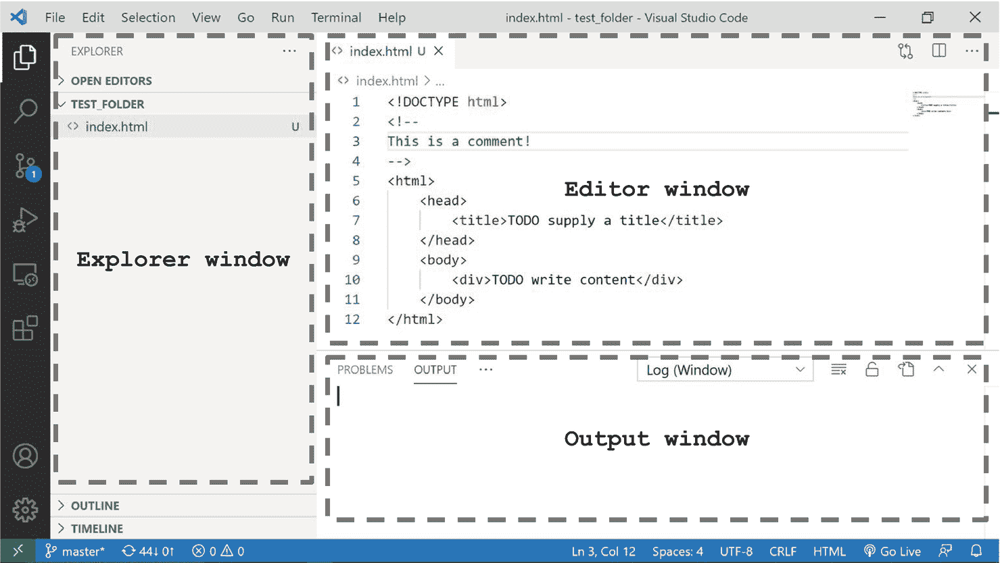
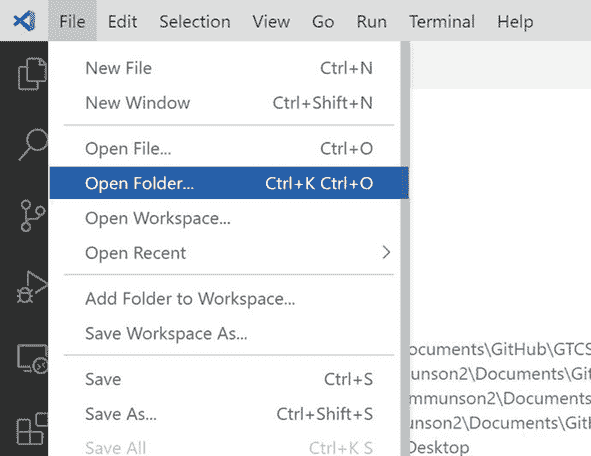
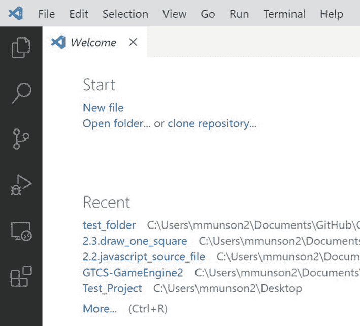
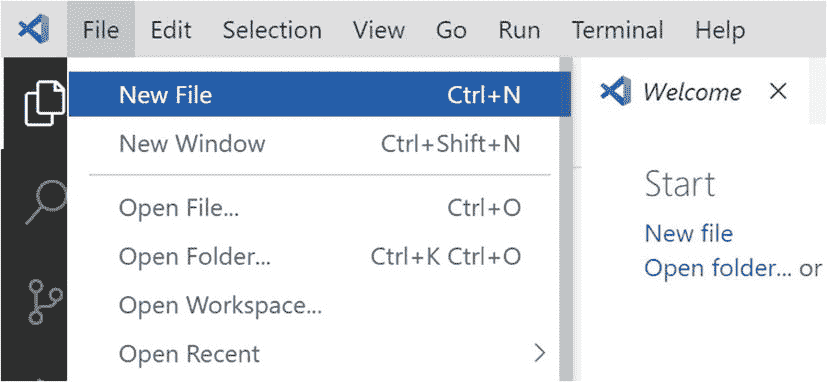
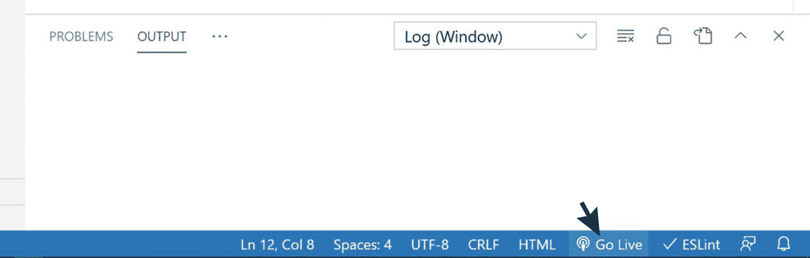
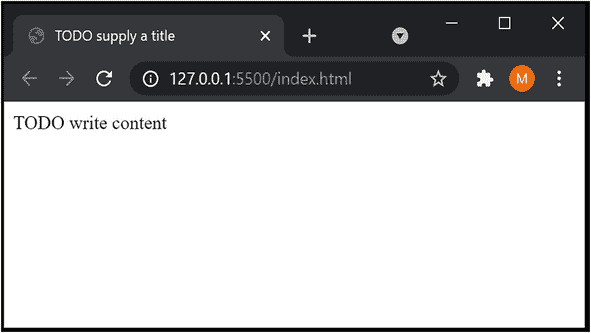

# 一、使用 JavaScript 开发 2D 游戏引擎的简介

视频游戏是复杂的、交互式的多媒体软件系统。他们必须实时处理玩家输入，模拟半自动对象的交互，并生成高保真的图形和音频输出，同时努力吸引玩家。由于需要精通软件开发以及如何创建吸引人的玩家体验，构建视频游戏的尝试可能会很快变得势不可挡。第一个挑战可以通过一个软件库或游戏引擎来缓解，它包含一个专门为开发视频游戏而设计的实用程序和对象的一致集合。玩家参与的目标通常是通过仔细的游戏设计和整个视频游戏开发过程中的微调来实现的。这本书是关于一个游戏引擎的设计和开发；它将专注于实现和隐藏引擎的日常操作，同时支持许多复杂的模拟。通过本书中的项目，你将构建一个实用的游戏引擎，用于开发可通过互联网访问的视频游戏。

游戏引擎使游戏开发者不必执行简单的例行任务，例如解码键盘上的特定按键，为常见操作设计复杂的算法，例如模仿 2D 世界中的阴影，以及理解实现中的细微差别，例如加强物理模拟的精确度容差。商业和成熟的游戏引擎，如 *Unity* 、*虚幻引擎*和 *Panda3D* 通过图形用户界面(GUI)展示他们的系统。友好的 GUI 不仅简化了游戏设计的一些繁琐过程，例如在关卡中创建和放置对象，而且更重要的是，它确保了这些游戏引擎可以被具有不同背景的创意设计师访问，这些设计师可能会发现软件开发细节令人分心。

这本书关注独立于 GUI 的游戏引擎的核心功能。虽然全面的 GUI 系统可以改善最终用户的体验，但实现要求也会分散游戏引擎的注意力并使其复杂化。例如，关于在用户界面系统中实施兼容数据类型的问题，例如限制来自特定类的对象被分配为阴影接收器，对于 GUI 设计是重要的，但是与游戏引擎的核心功能无关。

这本书从两个重要方面探讨了游戏引擎开发:可编程性和可维护性。作为一个软件库，游戏引擎的接口应该便于游戏开发者通过良好抽象的实用方法和对象进行编程，这些方法和对象隐藏了简单的例行任务并支持复杂但常见的操作。作为一个软件系统，游戏引擎的代码库应该通过设计良好的基础设施和组织良好的源代码系统来支持可维护性，从而实现代码重用、持续的系统维护、改进和扩展。

本章描述了本书的实现技术和组织。讨论引导您完成下载、安装和设置开发环境的步骤，指导您构建您的第一个 HTML5 应用，并使用这第一个应用开发经验来解释阅读和学习本书的最佳方法。

## 这些技术

建立一个游戏引擎的目标是允许游戏在万维网上可访问，这是由免费可用的技术实现的。

几乎所有的网络浏览器都支持 JavaScript，因为世界上几乎每台个人电脑上都安装了解释器。作为一种编程语言，JavaScript 是动态类型的，支持继承和作为一级对象的功能，并且易于与完善的用户和开发人员社区一起学习。有了这项技术的战略选择，任何人都可以通过适当的网络浏览器在互联网上访问基于 JavaScript 开发的视频游戏。因此，JavaScript 是为大众开发视频游戏的最佳编程语言之一。

虽然 JavaScript 是实现游戏逻辑和算法的优秀工具，但软件库或应用编程接口(API)形式的附加技术对于支持用户输入和媒体输出需求是必要的。HTML5 和 WebGL 的目标是构建可以通过网络浏览器访问的游戏，它们提供了理想的补充输入和输出 API。

HTML5 旨在通过互联网构建和呈现内容。它包括详细的处理模型和相关的 API 来处理用户输入和多媒体输出。这些 API 是 JavaScript 自带的，非常适合实现基于浏览器的视频游戏。虽然 HTML5 提供了基本的可缩放矢量图形(SVG) API，但它不支持视频游戏对实时照明、爆炸或阴影等效果的要求。Web Graphics Library (WebGL)是一个 JavaScript API，专门用于通过 Web 浏览器生成 2D 和 3D 计算机图形。凭借其对 OpenGL 着色语言(GLSL)的支持以及访问客户端计算机上图形处理单元(GPU)的能力，WebGL 能够实时生成高度复杂的图形效果，非常适合作为基于浏览器的视频游戏的图形 API。

这本书是关于游戏引擎的概念和开发，JavaScript、HTML5 和 WebGL 只是实现的工具。本书中的讨论集中在应用技术来实现所需的实现，并不试图涵盖技术的细节。例如，在游戏引擎中，继承是通过基于对象原型链的 JavaScript 类功能实现的；然而，没有讨论基于原型的脚本语言的优点。引擎音频提示和背景音乐功能基于 HTML5 AudioContext 接口，但其功能范围并未描述。游戏引擎对象是基于 WebGL 纹理贴图绘制的，而 WebGL 纹理子系统的特性并没有呈现。技术的细节会分散对游戏引擎的讨论。这本书的主要学习成果是游戏引擎的概念和实现策略，而不是任何技术的细节。这样，读完这本书后，你将能够基于任何一套可比较的技术，如 C#和一夫一妻制、Java 和 JOGL、C++和 Direct3D 等等，构建一个类似的游戏引擎。如果你想学习更多关于 JavaScript、HTML5 或 WebGL 的知识，请参考本章末尾“技术”部分的参考资料。

## 设置您的开发环境

您将要构建的游戏引擎将可以通过运行在任何操作系统(OS)上的 web 浏览器来访问。您将要设置的开发环境也是与操作系统无关的。为简单起见，以下说明基于 Windows 10 操作系统。您应该能够在基于 Unix 的环境(如 MacOS 或 Ubuntu)中复制一个类似的环境，只需稍加修改。

您的开发环境包括一个集成开发环境(IDE)和一个能够托管运行中的游戏引擎的运行时 web 浏览器。我们发现的最方便的系统是 Visual Studio Code (VS Code) IDE，使用 Google Chrome web 浏览器作为运行时环境。以下是详细情况:

*   **IDE** :本书所有项目都基于 VS 代码 IDE。您可以从 [`https://code.visualstudio.com/`](https://code.visualstudio.com/) 下载并安装该程序。

*   **运行环境**:你将在谷歌 Chrome 网络浏览器中执行你的视频游戏项目。您可以从 [`www.google.com/chrome/browser/`](http://www.google.com/chrome/browser/) 下载并安装该浏览器。

*   glMatrix 数学库:这是一个实现基本数学运算的库。你可以从 [`http://glMatrix.net/`](http://glmatrix.net/) 下载这个库。在第三章中，你将把这个库集成到你的游戏引擎中，所以更多的细节将会在那里提供。

请注意，支持 JavaScript 编程语言、HTML5 或 WebGL 没有特定的系统要求。所有这些技术都嵌入在 web 浏览器运行时环境中。

Note

如前所述，我们选择了基于 VS 代码的开发环境，因为我们发现它是最方便的。还有许多其他的选择也是免费的，包括但不限于 NetBeans、IntelliJ IDEA、Eclipse 和 Sublime。

### 下载和安装 JavaScript 语法检查器

我们发现 ESLint 是检测潜在 JavaScript 源代码错误的有效工具。您可以通过以下步骤将 ESLint 集成到 VS 代码中:

*   转到 [`https://marketplace.visualstudio.com/items?itemName=dbaeumer.vscode-eslint`](https://marketplace.visualstudio.com/items?itemName=dbaeumer.vscode-eslint) ，点击安装。

*   您将被提示打开 VS 代码，并且可能需要在应用中再次单击 install。

以下是使用 ESLint 的一些有用参考:

*   有关如何使用 ESLint 的说明，请参见 [`https://eslint.org/docs/user-guide/`](https://eslint.org/docs/user-guide/) 。

*   有关 ESLint 如何工作的详细信息，请参见 [`https://eslint.org/docs/developer-guide/`](https://eslint.org/docs/developer-guide/) 。

### 下载和安装 LiveServer

运行游戏引擎需要 VS 代码的 LiveServer 扩展。它通过 VS 代码在你的计算机上本地启动一个 web 服务器来托管开发的游戏。与 ESLint 非常相似，您可以通过以下步骤安装 LiveServer:

*   转到 [`https://marketplace.visualstudio.com/items?itemName=ritwickdey.LiveServer`](https://marketplace.visualstudio.com/items?itemName=ritwickdey.LiveServer) ，点击安装。

*   您将被提示打开 VS 代码，并且可能需要在应用中再次单击 install。

## 在 VS 代码开发环境中工作

VS 代码 IDE 易于使用，本书中的项目只需要编辑器。组织在父文件夹下的相关源代码文件被 VS 代码解释为一个项目。要打开项目，请选择文件➤打开文件夹，导航并选择包含项目源代码文件的父文件夹。一旦项目打开，你需要熟悉 VS 代码的基本窗口，如图 1-1 所示。



图 1-1

VS 代码集成开发环境

*   **Explorer 窗口**:该窗口显示项目的源代码文件。如果您不小心关闭了此窗口，可以通过选择查看➤资源管理器来调用它。

*   **编辑器窗口**:该窗口显示并允许您编辑项目的源代码。通过在资源管理器窗口中单击一次相应的文件名，可以选择要使用的源代码文件。

*   **输出窗口**:我们的项目中没有使用这个窗口；单击窗口右上角的“x”图标，随意关闭它。

### 用 VS 代码创建 HTML5 项目

您现在已经准备好创建您的第一个 HTML5 项目了:



图 1-2

打开项目文件夹

*   使用文件资源管理器，在您想要保存项目的位置创建一个目录。该目录将包含与您的项目相关的所有源代码文件。在 VS 代码中，选择文件➤打开文件夹并导航到您创建的目录。



图 1-3

空的 VS 代码项目

*   VS 代码将打开项目文件夹。您的 IDE 看起来应该类似于图 1-3；请注意，当项目文件夹为空时，资源管理器窗口也为空。



图 1-4

创建`index.html`文件

*   您现在可以创建您的第一个 HTML 文件`index.html`。选择文件➤新文件，并将文件命名为`index.html`。这将作为应用启动时的主页或登录页。

*   在编辑器窗口中，将以下文本输入您的`index.html`:

```js
<!DOCTYPE html>
<!--
This is a comment!
-->
<html>
    <head>
        <title>TODO supply a title</title>
    </head>
    <body>
        <div>TODO write content</div>
    </body>
</html>

```

第一行声明该文件是一个 HTML 文件。在`<!--`和`-->`标签内的块是注释块。互补的`<html></html>`标签包含了所有的 HTML 代码。在这种情况下，模板定义头部和身体部分。页眉设置网页的标题，而正文是网页所有内容的位置。

如图 1-5 所示，你可以通过点击你的 VS 代码右下角的“上线”按钮或者按 Alt+L Alt+O 来运行这个项目，有可能在你第一次进入之前的 HTML 代码之后，“上线”按钮就不会出现了。在这种情况下，只需在浏览器窗口中右键单击`index.html`文件，然后单击“用实时服务器打开”菜单项即可启动网页。第一次后，IDE 的右下区域会出现“上线”按钮，如图 1-5 所示。



图 1-5

单击“上线”按钮运行项目

Note

要运行一个项目，当点击“Go Live”按钮或按下 Alt+L Alt+O 键时，必须在编辑器中打开该项目的`index.html`文件。当项目中有其他 JavaScript 源代码文件时，这将在后续章节中变得很重要。

图 1-6 显示了运行默认项目时的样子。请注意，在项目开始运行后，“Go Live”按钮会更新其标签，显示“Port:5500”您可以再次单击此按钮，断开 IDE 与网页的连接，再次观察“上线”标签。再次单击该按钮将重新运行项目。



图 1-6

运行简单的 HTML5 项目

要停止程序，只需关闭网页。您已经成功运行了您的第一个 HTML5 项目。通过开发这个非常简单的项目，您已经熟悉了 IDE 环境。

Note

对于调试，我们推荐 Chrome 开发者工具。当您的项目正在运行时，可以通过在浏览器窗口中键入 Ctrl+Shift+I(或 F12 键)来访问这些工具。要了解关于这些工具的更多信息，请参考 [`https://developer.chrome.com/docs/devtools/`](https://developer.chrome.com/docs/devtools/) 。

## 如何使用这本书

这本书通过构建与你刚刚经历过的项目相似的项目来指导你开发一个游戏引擎。每章涵盖了一个典型游戏引擎的基本组件，并且每章中的部分描述了构成相应组件的重要概念和实现项目。在整个文本中，每一节的项目都是建立在前面项目的成果之上的。虽然这使得在书中跳来跳去有点挑战性，但它会给你实践经验，并对不同概念之间的关系有一个坚实的理解。此外，与总是处理新的和极简的项目不同，您将获得构建更大和更有趣的项目的经验，同时将新功能集成到您不断扩展的游戏引擎中。

这些项目从演示简单的概念开始，如画一个简单的正方形，但很快发展到演示更复杂的概念，如使用用户定义的坐标系和实现像素精确的碰撞检测。最初，由于您已经有了构建第一个 HTML5 应用的经验，您将得到详细步骤和完整源代码清单的指导。随着您对开发环境和技术的熟悉，每个项目附带的指南和源代码清单将转移到重要的实现细节上。最终，随着项目复杂性的增加，讨论将只集中在重要和相关的问题上，而简单的源代码更改将不会被提及。

最终的代码库是一个完整而实用的游戏引擎，你将在本书的过程中逐步开发它；这是一个很好的平台，在这个平台上你可以开始构建你自己的 2D 游戏。这正是本书最后一章所做的，引导你从概念化到设计到实现一个休闲的 2D 游戏。

有几种方法可以让你理解这本书。最显而易见的方法是，按照书中的每一步，将代码输入到项目中。从学习的角度来看，这是吸收所呈现信息的最有效方式；然而，我们知道这可能不是最现实的，因为这种方法可能需要大量的代码或调试。或者，我们建议您在开始新的部分时运行并检查已完成项目的源代码。这样做可以让您预览当前部分的项目，让您清楚地了解最终目标，并让您看到项目试图实现的目标。当您自己构建代码时遇到问题时，您可能会发现完整的项目代码非常有用，因为在调试困难的情况下，您可以将自己的代码与完整项目的代码进行比较。

Note

我们发现 WinMerge 程序( [`http://winmerge.org/`](http://winmerge.org/) )是比较源代码文件和文件夹的优秀工具。Mac 用户可以出于类似的目的使用 FileMerge 工具。

最后，在完成一个项目之后，我们建议您将您的实现的行为与所提供的已完成的实现进行比较。通过这样做，您可以观察您的代码是否如预期的那样运行。

## 你如何制作一个伟大的电子游戏？

虽然这本书的重点是游戏引擎的设计和实现，但理解不同的组件如何有助于创建一个有趣和引人入胜的视频游戏也很重要。从第四章开始，在每一章的结尾都包含了“游戏设计注意事项”一节，将引擎组件的功能与游戏设计的元素联系起来。本节介绍了这些讨论的框架。

这是一个复杂的问题，制作人们喜欢玩的视频游戏没有确切的公式，就像制作人们喜欢看的电影没有确切的公式一样。我们都见过看起来很棒的大预算电影，其特点是顶级的演技、编剧和导演在票房上的才华炸弹，我们也都见过大型工作室的大预算游戏无法抓住玩家的想象力。同样的道理，不知名导演的电影可以吸引全世界的注意力，不知名的小工作室的游戏可以席卷市场。

虽然制作一款优秀的游戏没有明确的指导，但许多元素和谐地共同作用，创造出的最终体验要大于其各个部分的总和，所有的游戏设计师都必须成功地解决其中的每一个问题，才能制作出值得一玩的东西。这些要素包括以下内容:

*   **技术设计**:这包括所有游戏代码和游戏平台，一般不会直接暴露给玩家；相反，它为游戏体验的各个方面奠定了基础。这本书主要关注与游戏技术设计相关的问题，包括特定的任务，如在屏幕上绘制元素所需的代码行，以及更多的架构考虑因素，如确定如何以及何时将资产加载到内存中的策略。技术设计问题以多种方式影响玩家体验(例如，玩家在游戏期间经历“加载”延迟的次数或者游戏每秒显示多少帧)，但是技术设计通常对玩家是不可见的，因为它运行在所谓的表示层或者玩家在游戏期间遇到的所有视听和/或触觉反馈之下。

*   游戏机制:游戏机制是对给定游戏体验的基础的抽象描述。游戏机制的类型包括谜题、诸如跳跃或瞄准的灵活性挑战、定时事件、战斗遭遇等。游戏机制是一个框架；特定的谜题、遭遇和游戏互动是框架的实现。例如，一个即时战略(RTS)游戏可能包括一个资源收集机制，该机制可能被描述为“玩家需要收集特定类型的资源，并将它们组合起来以构建他们可以在战斗中使用的单位。”该机制的具体实现(玩家如何定位和提取游戏中的资源，他们如何将资源从一个地方运输到另一个地方，以及组合资源以产生单位的规则)是系统设计、关卡设计和交互模型/游戏循环(在本节稍后描述)的一个方面。

*   **系统设计**:向核心游戏机制提供结构化挑战的内部规则和逻辑关系被称为游戏的系统设计。使用前面的 RTS 示例，一个游戏可能需要玩家收集一定量的金属矿石，并将其与一定量的木材结合，以制作一个游戏对象；制造对象需要多少资源的具体规则和创建对象的独特过程(例如，对象只能在玩家基地的特定结构中产生，并且在玩家开始过程后需要 *x* 分钟数才能出现)是系统设计的方面。休闲游戏可能有基本的系统设计。例如，像 Popcore Games 的*拉动别针*这样的简单益智游戏是一种系统少、复杂度低的游戏，而 RTS 游戏这样的主流游戏可能有非常复杂且相互关联的系统设计，由整个设计团队来创建和平衡。游戏系统设计通常是游戏设计最隐藏的复杂性所在；当设计者在定义所有有助于实现游戏机制的变量时，很容易迷失在复杂和平衡依赖的海洋中。对玩家来说看起来相当简单的系统可能需要许多组件一起工作，并且彼此之间达到完美的平衡，低估系统的复杂性可能是新手(和老手)遇到的最大陷阱之一！)游戏设计师。在你知道你将要进入的是什么之前，总是假设你创建的系统将会比你预期的要复杂得多。

*   **关卡设计**:一个游戏的关卡设计反映了其他八个元素在游戏的各个“模块”中的具体组合方式，玩家必须完成某个模块的目标才能进入下一个部分(一些游戏可能只有一个关卡，而另一些则有几十个)。单个游戏中的关卡设计都可以是同一核心机制和系统设计的变体(像*俄罗斯方块*和*宝石迷阵*这样的游戏是许多关卡都专注于同一机制的游戏的例子)，而其他游戏将混合和匹配机制和系统设计以实现不同关卡之间的多样性。大多数游戏都有一个主要的机制和一个跨游戏的系统设计方法，并会在不同的关卡之间添加一些小的变化来保持新鲜感(不断变化的环境、不断变化的难度、增加时间限制、增加复杂性等)，尽管偶尔游戏会引入新的关卡，这些关卡依赖于完全独立的机制和系统来给玩家带来惊喜并保持他们的兴趣。游戏中的高级设计是在创建展示机械和系统设计的游戏“块”和在这些块之间进行足够的改变以保持玩家在游戏过程中的兴趣之间的平衡(但不要在块之间改变太多以至于游戏感觉脱节和脱节)。

*   **交互模型**:交互模型是按键、按钮、控制杆、触摸手势等的组合，用于与游戏交互以完成任务，以及支持游戏世界中这些交互的图形用户界面。一些游戏理论家将游戏的用户界面(UI)设计分成一个单独的类别(游戏 UI 包括菜单设计、物品清单、平视显示器(hud))等内容)，但交互模型与 UI 设计密切相关，将这两个元素视为不可分割是一个很好的做法。在前面提到的 RTS 游戏中，交互模型包括选择游戏中的对象、移动这些对象、打开菜单和管理库存、保存进度、开始战斗和排队构建任务所需的动作。交互模型完全独立于机械和系统设计，并且只涉及玩家必须采取的物理动作来发起行为(例如，点击鼠标按钮、按键、移动操纵杆、滚轮)；UI 是连接到那些动作(屏幕上的按钮、菜单、状态、音频提示、振动等)的视听或触觉反馈。

*   **游戏设定**:你是在外星球吗？在幻想世界里？在抽象的环境中？游戏设置是游戏体验的重要组成部分，通过与视听设计的合作，将原本互不关联的基本交互转变为引人入胜的体验。游戏设定不需要精心制作才能有效；长期受欢迎的益智游戏*俄罗斯方块*有一个相当简单的设置，没有真正的叙事包装，但抽象设置、视听设计和关卡设计的结合非常匹配，对玩家年复一年投入数百万小时的体验做出了重大贡献。

*   视觉设计:视频游戏在很大程度上是一种视觉媒体，所以毫不奇怪，公司经常花在游戏视觉设计上的钱和花在代码技术执行上的钱一样多，甚至更多。大型游戏是成千上万视觉资产的集合，包括环境、角色、物体、动画和电影艺术；即使是小型的休闲游戏，通常也会附带成百上千个独立的视觉元素。玩家在游戏中与之互动的每个对象都必须是一个独特的资产，如果该资产包括比将它从屏幕上的一个位置移动到另一个位置或更改比例或不透明度更复杂的动画，则该对象很可能需要由艺术家制作动画。游戏图形不需要像照片一样逼真，也不需要在风格上精心制作，以获得出色的视觉效果或有效地表现场景(许多游戏有意利用简单的视觉风格)，但最好的游戏会将艺术指导和视觉风格视为玩家体验的核心，视觉选择会是有意的，并与游戏场景和机制很好地匹配。

*   **音频设计**:这包括音乐和音效，环境背景声音，以及所有与玩家动作(选择/使用/交换物品，打开库存，调用菜单等)相关的声音。音频设计功能与视觉设计携手传递和强化游戏设置，许多新设计师严重低估了声音让玩家沉浸在游戏世界中的影响。想象一下*星球大战*，例如，没有音乐，光剑音效，达斯·维德的呼吸，或者 R2D2 特有的哔哔声；音效和乐谱与视觉效果一样是体验的基础。

*   元游戏(Meta-game):元游戏的核心是个人目标如何聚集在一起，推动玩家体验游戏(通常通过得分、按顺序解锁个人关卡、通过叙事进行游戏，等等)。在许多现代游戏中，元游戏是叙事弧线或故事；玩家通常不会收到“分数”本身，而是随着他们在游戏关卡中的进展，揭示一个线性或半线性的故事，推动故事向前发展。其他游戏(尤其是社交和竞技游戏)涉及玩家“升级”他们的角色，这可能是通过游戏叙事体验进行游戏的结果，或者只是冒险进入游戏世界并接受个人挑战，从而为角色提供经验值。当然，其他游戏继续专注于得分或赢得对其他玩家的回合。

视频游戏的魔力通常来自这九个元素之间的相互作用，最成功的游戏在统一的视觉中很好地平衡了每一个元素，以确保和谐的体验；这种平衡对于每个人的努力来说都是独一无二的，在从任天堂的*动物穿越*到摇滚明星的*红色死亡救赎 2* 的游戏中都可以找到。许多成功游戏的核心游戏机制通常是一个或多个相当简单、常见的主题的变体(例如，*拉针*，是一个完全基于从容器中拉出虚拟针来释放彩色球的游戏)，但视觉设计、叙事背景、音频效果、交互和进度系统与游戏机制一起工作，创造了一种独特的体验，这种体验比其各个部分的总和更有吸引力，让玩家想一次又一次地回到它。伟大的游戏从简单到复杂都有，但它们都以支持设计元素的优雅平衡为特色。

## 参考

本书中的示例是在假设您理解数据封装、继承和基本数据结构(如链表和字典)的基础上创建的，并且熟悉代数和几何的基础知识，尤其是线性方程和坐标系。本书中的许多例子应用并实现了计算机图形学和线性代数中的概念。这些概念需要更深入的研究。感兴趣的读者可以在其他书中了解更多关于这些主题的内容。

*   计算机图形:
    *   马斯纳和雪莉。*计算机图形学基础*，第 4 版。CRC 出版社，2016。

    *   安格尔和施赖纳。交互式计算机图形:使用 WebGL 的自顶向下方法，第 7 版。培生教育，2014 年。

*   线性代数:
    *   宋和史密斯。【Unity 3D 游戏开发的基础数学:数学基础初学者指南。Apress，2019。

    *   约翰逊，里斯和阿诺德。*线性代数入门*，第 5 版。艾迪森-韦斯利，2002 年。

    *   安东和罗里斯。*初等线性代数:应用版*，第 11 版。威利，2013。

### 技术

以下列表提供了获取本书中使用的技术的其他信息的链接:

*   **JavaScript** : [`www.w3schools.com/js`](http://www.w3schools.com/js)

*   **html 5**:[`www.w3schools.com/html/html5_intro.asp`](http://www.w3schools.com/html/html5_intro.asp)

*   **WebGL** : [`www.khronos.org/webgl`](http://www.khronos.org/webgl)

*   **OpenGL** : [`www.opengl.org`](http://www.opengl.org)

*   **Visual Studio 代码** *:* [`https://code.visualstudio.com/`](https://code.visualstudio.com/)

*   **铬** : [`www.google.com/chrome`](http://www.google.com/chrome)

*   **GL matrix**:[`http://glMatrix.net`](http://glmatrix.net)

*   **ESLint** : [`www.eslint.org`](http://www.eslint.org)