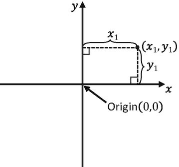

# 三、世界上的绘画对象

完成本章后，您将能够

*   创建并绘制多个矩形对象

*   控制创建的矩形对象的位置、大小、旋转和颜色

*   定义从中进行绘制的坐标系

*   在画布上定义要绘制到的目标子区域

*   使用`Renderable`对象、变换操作符和相机的抽象表示

## 介绍

理想情况下，视频游戏引擎应该提供适当的抽象来支持在有意义的上下文中设计和构建游戏。例如，当设计一个足球游戏时，游戏引擎应该提供适当的工具来支持在足球场上奔跑的运动员的设计，而不是具有固定的 1.0 绘图范围的单个正方形。这种高级抽象要求用数据隐藏和有意义的函数封装基本操作，以设置和接收期望的结果。

虽然这本书是关于构建游戏引擎的抽象，但这一章的重点是创建支持绘图的基本抽象。基于足球游戏示例，对在有效游戏引擎中绘图的支持可能包括轻松创建足球运动员、控制他们的大小和方向，以及允许他们在足球场上移动和绘图的能力。此外，为了支持正确的表示，游戏引擎必须允许在画布上绘制特定的子区域，以便可以在不同的子区域显示不同的游戏状态，例如在一个子区域中显示足球场，而在另一个子区域中显示运动员统计数据和得分。

本章确定了基本绘图操作的适当抽象实体，介绍了基于基础数学的运算符来控制绘图，概述了用于配置画布以支持子区域绘图的 WebGL 工具，定义了实现这些概念的 JavaScript 类，并将这些实现集成到游戏引擎中，同时保持了源代码的组织结构。

## 封装图

尽管绘图能力是游戏引擎最基本的功能之一，但绘图是如何实现的细节通常会分散游戏编程的注意力。例如，在足球比赛中创建、控制位置和绘制足球运动员是很重要的。然而，暴露每个玩家实际上是如何定义的细节(通过形成三角形的顶点的集合)会很快淹没游戏开发过程并使其复杂化。因此，对于游戏引擎来说，为绘图操作提供定义良好的抽象接口是非常重要的。

有了组织良好的源代码结构，就有可能通过对相应文件夹进行本地化更改来实现新概念，从而逐渐地、系统地增加游戏引擎的复杂性。第一个任务是扩展引擎以支持绘图的封装，这样就有可能将绘图操作作为一个逻辑实体或一个可以渲染的对象来操作。

Note

在计算机图形和视频游戏的背景下， *render* 这个词指的是改变与抽象表示相对应的像素颜色的过程。例如，在前一章中，你学习了如何渲染一个正方形。

### 可渲染对象项目

这个项目引入了`Renderable`类来封装绘图操作。在接下来的几个项目中，您将学习更多的支持概念，以细化`Renderable`类的实现，从而可以创建和操作多个实例。图 3-1 显示了运行可渲染对象项目的输出。这个项目的源代码在`chapter3/3.1.renderable_objects`文件夹中定义。


图 3-1

运行可渲染对象项目

该项目的目标如下:

*   重新组织源代码结构以预期功能的增加

*   支持游戏引擎内部资源共享

*   通过`index.js`文件为游戏开发者引入系统化的界面

*   通过首先抽象相关的绘图功能，开始构建封装绘图操作的类的过程

*   演示创建多个`Renderable`对象的能力

#### 源代码结构重组

在向游戏引擎引入额外的功能之前，认识到前一个项目中引擎源代码组织的一些不足是很重要的。特别要注意以下几点:

1.  `core.js`源代码文件包含 WebGL 接口、引擎初始化和绘图功能。这些应该模块化，以支持系统复杂性的预期增加。

2.  应该定义一个系统来支持游戏引擎内部资源的共享。例如，`SimpleShader`负责从游戏引擎到从`simple_vs.glsl`和`simple_fs.glsl`源代码文件编译的 GLSL 着色器的接口。由于编译后的着色器只有一个副本，所以只需要有一个`SimpleShader`对象的实例。游戏引擎应该通过允许方便地创建和共享对象来促进这一点。

3.  正如您所经历的，JavaScript `export`语句是隐藏详细实现的优秀工具。然而，在一个大型复杂的系统中，例如您将要开发的游戏引擎，确定从大量文件中导入哪些类或模块可能会令人困惑和不知所措，这也是事实。应该提供一个易于操作的系统化界面，使得游戏开发者、游戏引擎的用户可以不受这些细节的影响。

在下一节中，游戏引擎源代码将被重新组织以解决这些问题。

##### 定义特定于 WebGL 的模块

源代码重组的第一步是识别和隔离内部功能，游戏引擎的客户端不应访问这些功能:

1.  在您的项目中，在`src/engine`文件夹下，创建一个新文件夹，并将其命名为`core`。从现在开始，这个文件夹将包含游戏引擎内部的所有功能，并且不会导出给游戏开发者。

2.  您可以将先前项目中的`vertex_buffer.js`源代码文件剪切并粘贴到`src/engine/core`文件夹中。图元顶点的细节是游戏引擎内部的，并且不应该被游戏引擎的客户端看到或访问。

3.  在`src/engine/core`文件夹中新建一个源代码文件，命名为`gl.js`，定义 WebGL 的初始化和访问方法:

```js
"use strict"

let mCanvas = null;
let mGL = null;

function get() { return mGL; }

function init(htmlCanvasID) {
    mCanvas = document.getElementById(htmlCanvasID);
    if (mCanvas == null)
        throw new Error("Engine init [" +
                         htmlCanvasID + "] HTML element id not found");

    // Get standard or experimental webgl and binds to the Canvas area
    // store the results to the instance variable mGL
    mGL = mCanvas.getContext("webgl2") ||
          mCanvas.getContext("experimental-webgl2");

    if (mGL === null) {
        document.write("<br><b>WebGL 2 is not supported!</b>");
        return;
    }
}

export {init, get}

```

请注意，`init()`函数与上一个项目中`core.js`中的`initWebGL()`函数相同。与之前的`core.js`源代码文件不同，`gl.js`文件只包含特定于 WebGL 的功能。

##### 定义内部着色器资源共享的系统

由于从`simple_vs.glsl`和`simple_fs.glsl`源代码文件中仅创建和编译了 GLSL 着色器的单个副本，因此在游戏引擎中仅需要`SimpleShader`对象的单个副本来与编译后的着色器接口。现在，您将创建一个简单的资源共享系统，以支持将来添加不同类型的着色器。

在`src/engine/core`文件夹下新建一个源代码文件，命名为`shader_resources.js`，定义`SimpleShader`的创建和访问方法。

Note

回想一下前一章，`SimpleShader`类是在位于`src/engine`文件夹中的`simple_shader.js`文件中定义的。记住要从之前的项目中复制所有相关的源代码文件。

```js
"use strict";

import SimpleShader from "../simple_shader.js";

// Simple Shader
let kSimpleVS = "src/glsl_shaders/simple_vs.glsl"; // to VertexShader
let kSimpleFS = "src/glsl_shaders/simple_fs.glsl"; // to FragmentShader
let mConstColorShader = null;

function createShaders() {
    mConstColorShader = new SimpleShader(kSimpleVS, kSimpleFS);
}

function init() {
    createShaders();
}
function getConstColorShader() { return mConstColorShader; }

export {init, getConstColorShader}

```

Note

引用常量值的变量名称以小写字母“k”开头，如`kSimpleVS`。

由于`shader_resources`模块位于`src/engine/core`文件夹中，定义的着色器在游戏引擎的客户端内共享，并且不能从游戏引擎的客户端访问。

##### 为游戏开发者定义一个访问文件

您将定义一个引擎访问文件`index.js`，以实现游戏引擎的基本功能，并提供与头文件`C++`、Java 中的`import`语句或 C#中的`using`语句类似的功能，无需深入了解引擎源代码结构即可轻松访问这些功能。也就是说，通过导入`index.js`，客户端可以从引擎访问所有的组件和功能来构建他们的游戏。

1.  在`src/engine`文件夹中创建`index.js`文件；`import`从`gl.js`、`vertex_buffer.js`、`shader_resources.js`；并定义`init()`函数，通过调用三个导入模块对应的`init()`函数来初始化游戏引擎:

1.  定义`clearCanvas()`函数来清除绘图画布:

```js
// local to this file only
import * as glSys from "./core/gl.js";
import * as vertexBuffer from "./core/vertex_buffer.js";
import * as shaderResources from "./core/shader_resources.js";

// general engine utilities
function init(htmlCanvasID) {
    glSys.init(htmlCanvasID);
    vertexBuffer.init();
    shaderResources.init();
}

```

1.  现在，为了正确地向游戏引擎的客户端公开`Renderable`符号，请确保导入该类以便正确地导出该类。下一节将详细介绍`Renderable`类。

```js
function clearCanvas(color) {
    let gl = glSys.get();
    gl.clearColor(color[0], color[1], color[2], color[3]);
    gl.clear(gl.COLOR_BUFFER_BIT); // clear to the color set
}

```

1.  最后，记住为游戏引擎的客户端导出正确的符号和功能:

```js
// general utilities
import Renderable from "./renderable.js";

```

```js
export  default {
    // Util classes
    Renderable,

    // functions
    init, clearCanvas
}

```

通过对这个`index.js`文件进行适当的维护和更新，游戏引擎的客户端，即游戏开发者，可以简单地从`index.js`文件导入，以获得对整个游戏引擎功能的访问，而无需了解任何源代码结构。最后，请注意`engine/src/core`文件夹中定义的`glSys`、`vertexBuffer`和`shaderResources`内部功能不是由`index.js`导出的，因此游戏开发者无法访问。

#### 可渲染的类

最后，您准备定义`Renderable`类来封装绘图过程:

1.  通过在`src/engine`文件夹中创建一个新的源代码文件来定义游戏引擎中的`Renderable`类，并将该文件命名为`renderable.js`。

2.  打开`renderable.js`，从`gl.js`和`shader_resources.js`导入，用构造函数定义`Renderable`类，初始化对着色器和颜色实例变量的引用。注意，着色器是对在`shader_resources`中定义的共享`SimpleShader`实例的引用。

1.  为`Renderable`定义一个`draw()`函数:

```js
import * as glSys from "./core/gl.js";
import * as shaderResources from "./core/shader_resources.js";

class Renderable {
    constructor() {
        this.mShader = shaderResources.getConstColorShader();
        this.mColor = [1, 1, 1, 1]; // color of pixel
    }
    ... implementation to follow ...
}

```

```js
draw() {
    let gl = glSys.get();
    this.mShader.activate(this.mColor);
    gl.drawArrays(gl.TRIANGLE_STRIP, 0, 4);
}

```

请注意，在使用`gl.drawArrays()`函数发送顶点之前，通过调用`activate()`函数来激活 GPU 中适当的 GLSL 着色器是非常重要的。

1.  为 color 实例变量定义 getter 和 setter 函数:

1.  默认导出`Renderable`符号，以确保该标识符不能被重命名:

```js
setColor(color) {this.mColor = color; }
getColor() { return this.mColor; }

```

```js
export default Renderable;

```

虽然这个例子很简单，但是现在可以用不同的颜色创建和绘制多个`Renderable`对象的实例。

#### 测试可呈现对象

为了测试`MyGame`中的`Renderable`对象，白色和红色实例被创建并绘制如下:

```js
// import from engine/index.js for all engine symbols
import engine from "../engine/index.js";

class MyGame {
    constructor(htmlCanvasID) {

        // Step A: Initialize the webGL Context
        engine.init(htmlCanvasID);

        // Step B: Create the Renderable objects:
        this.mWhiteSq = new engine.Renderable();
        this.mWhiteSq.setColor([1, 1, 1, 1]);
        this.mRedSq = new engine.Renderable();
        this.mRedSq.setColor([1, 0, 0, 1]);

        // Step C: Draw!
        engine.clearCanvas([0, 0.8, 0, 1]);  // Clear the canvas

        // Step C1: Draw Renderable objects with the white shader
        this.mWhiteSq.draw();

        // Step C2: Draw Renderable objects with the red shader
        this.mRedSq.draw();
    }
}

```

请注意，`import`语句被修改为从引擎访问文件`index.js`导入。此外，`MyGame`构造函数被修改为包括以下步骤:

1.  步骤 A 初始化`engine`。

2.  步骤 B 创建了两个`Renderable`实例，并相应地设置了对象的颜色。

3.  步骤 C 清除画布；步骤 C1 和 C2 简单地调用了白色和红色方块各自的`draw()`函数。虽然两个方块都已绘制，但现在，您只能在画布中看到最后一个绘制的方块。详情请参考下面的讨论。

### 观察

运行项目，你会注意到只有红色方块是可见的！发生的情况是两个方块被画到了同一个位置。由于大小相同，这两个正方形完全重叠在一起。因为红色方块是最后绘制的，所以它会覆盖白色方块的所有像素。您可以通过注释掉红色正方形的绘图(注释掉线条`mRedSq.draw()`)并重新运行项目来验证这一点。一个有趣的观察是出现在前面的物体被画在最后(红色方块)。当你使用透明的时候，你将会利用这个观察。

这个简单的观察引出了您的下一个任务——允许多个`Renderable`实例同时可见。`Renderable`对象的每个实例需要支持在不同位置以不同大小和方向绘制的能力，这样它们就不会彼此重叠。

## 变换可渲染对象

需要一种机制来操纵`Renderable`对象的位置、大小和方向。在接下来的几个项目中，您将了解如何使用矩阵变换来平移或移动对象的位置，缩放对象的大小，以及在画布上更改对象的方向或旋转对象。这些操作是对象操作中最直观的操作。然而，在实现转换矩阵之前，需要快速回顾一下矩阵的操作和功能。

### 作为变换运算符的矩阵

在我们开始之前，重要的是要认识到矩阵和变换是数学中的一般主题领域。以下讨论并不试图全面涵盖这些主题。相反，从游戏引擎需要什么的角度来看，重点是相关概念和操作符的小集合。这样，覆盖面是如何利用运营商，而不是理论。如果你对矩阵的细节以及它们与计算机图形的关系感兴趣，请参考第一章中的讨论，在那里你可以通过钻研线性代数和计算机图形的相关书籍来了解更多关于这些主题的内容。

一个矩阵是由一个由 *m* 行 *n* 列 2D 数字组成的数组。为了这个游戏引擎的目的，你将专门使用 4×4 矩阵。虽然 2D 游戏引擎可以使用 3×3 矩阵，但 4×4 矩阵用于支持将在后面章节中介绍的功能。在许多强大的应用中，4×4 矩阵可以被构造为顶点位置的变换算子。这些操作符中最重要和最直观的是平移、缩放、旋转和恒等操作符。


图 3-2

将正方形平移 T(tx，ty)

*   平移算子`T(tx,ty)`，如图 3-2 所示，将给定的顶点位置从(x，y)平移或移动到(x+tx，y+ty)。请注意，`T(0,0)`不会改变给定顶点位置的值，是累积平移操作的方便初始值。


图 3-3

用 S(sx，sy)缩放正方形

*   缩放操作符`S(sx, sy)`，如图 3-3 所示，将给定的顶点位置从(x，y)缩放到(x×sx，y×sy)。请注意，`S(1, 1)`不会改变给定顶点位置的值，是累积缩放操作的一个方便的初始值。


图 3-4

将正方形旋转 R(θ)

*   旋转操作符`R(` θ `)`如图 3-4 所示，相对于原点旋转给定的顶点位置。

在旋转的情况下，`R(0)`不会改变给定顶点的值，是累积旋转操作的方便初始值。θ值通常用弧度(而不是度数)表示。

*   恒等运算符`I`不会影响给定的顶点位置。该运算符主要用于初始化。

例如，一个 4×4 的单位矩阵看起来如下:

![$$ I=\left[\begin{array}{llll}1&amp; 0&amp; 0&amp; 0\\ {}0&amp; 1&amp; 0&amp; 0\\ {}0&amp; 0&amp; 1&amp; 0\\ {}0&amp; 0&amp; 0&amp; 1\end{array}\right] $$](img/334805_2_En_3_Chapter_TeX_Equa.png)

数学上，矩阵变换运算符通过矩阵向量乘法对顶点进行运算。为了支持这个操作，顶点位置 *p* = ( *x* 、 *y* 、 *z* )必须表示为如下的 4x1 向量:

![$$ p=\left[\begin{array}{l}x\\ {}y\\ {}z\\ {}1\end{array}\right] $$](img/334805_2_En_3_Chapter_TeX_Equb.png)

Note

z 分量是顶点位置的第三维或深度信息。大多数情况下，您应该将 z 分量保留为 0。

例如，如果位置`p'`是平移运算符`T`对顶点位置`p`进行运算的结果，那么从数学上讲，`p'`将通过以下方式计算:


#### 矩阵运算符的串联

多个矩阵运算符可以*连接*或组合成一个运算符，同时保留与原始运算符相同的转换特性。例如，您可能想要在给定的顶点位置上应用缩放操作符`S`，然后是旋转操作符`R`，最后是平移操作符`T`，或者使用下面的


来计算`p'`

或者，您可以通过连接所有的转换操作符来计算一个新的操作符`M`，如下所示:


然后在顶点位置`p`操作`M`，如下，产生相同的结果:


`M`操作符是记录和重新应用多个操作符结果的一种方便有效的方式。

最后，注意当使用转换操作符时，操作的顺序很重要。例如，缩放操作后跟随平移操作通常不同于平移后跟随缩放，或者通常:


### glMatrix 库

矩阵运算符和运算的细节至少可以说是很重要的。开发一个完整的矩阵库很耗时，也不是本书的重点。幸运的是，在公共领域中有许多开发良好、记录完善的矩阵库。图书馆就是这样一个例子。要将该库集成到源代码结构中，请按照下列步骤操作:


图 3-5

下载 glMatrix 库

1.  在`src`文件夹下新建一个文件夹，命名为`lib`。

2.  进入 [`http://glMatrix.net`](http://glmatrix.net) ，如图 3-5 所示，将生成的`glMatrix.js`源文件下载、解压并保存到新的`lib`文件夹中。

本书所有项目都基于【2.2.2 版。

1.  作为一个游戏引擎和客户端游戏开发者都必须访问的库，您将通过在加载`my_game.js`之前添加以下内容来加载主`index.html`中的源文件:

```js
<!-- external library -->
<script type="text/javascript" src="src/lib/gl-matrix.js"></script>

<!-- our game -->
<script type="module" src="./src/my_game/my_game.js"></script>

```

### 矩阵变换项目

这个项目介绍并演示了如何使用变换矩阵作为操作符来操作画布上绘制的`Renderable`对象的位置、大小和方向。通过这种方式，现在可以将一个`Renderable`绘制到任何位置，具有任何大小和任何方向。图 3-6 显示了运行矩阵变换项目的输出。这个项目的源代码在`chapter3/3.2.matrix_transform`文件夹中定义。


图 3-6

运行矩阵转换项目

该项目的目标如下:

*   引入变换矩阵作为绘制 a `Renderable`的运算符

*   理解如何使用变换操作符来操作`Renderable`

#### 修改顶点着色器以支持变换

如前所述，矩阵变换运算符对几何图形的顶点进行运算。顶点着色器是从 WebGL 上下文传入所有顶点的地方，也是应用变换操作的最方便位置。

您将继续使用之前的项目来支持顶点着色器中的变换操作符:

1.  编辑`simple_vs.glsl`以声明一个统一的 4×4 矩阵:

Note

回想一下第二章的讨论，glsl 文件包含 OpenGL 着色语言(GLSL)指令，这些指令将被加载到 GPU 并由 GPU 执行。你可以通过参考第一章末尾提供的 WebGL 和 OpenGL 参考找到更多关于 GLSL 的信息。

```js
// to transform the vertex position
uniform mat4 uModelXformMatrix;

```

回想一下，GLSL 着色器中的关键字`uniform`声明了一个变量，该变量的值不会因该着色器中的所有顶点而改变。在这种情况下，`uModelXformMatrix`变量是所有顶点的变换操作符。

Note

GLSL 统一变量名总是以小写字母“u”开头，如`uModelXformMatrix`。

1.  在`main()`功能中，将`uModelXformMatrix`应用到当前参考的顶点位置:

```js
gl_Position = uModelXformMatrix * vec4(aVertexPosition, 1.0);

```

请注意，该运算直接来自对矩阵变换运算符的讨论。将`aVertexPosition`转换为`vec4`的原因是为了支持矩阵向量乘法。

通过这个简单的修改，单位正方形的顶点位置将由`uModelXformMatrix`操作符操作，因此正方形可以被绘制到不同的位置。现在的任务是设置`SimpleShader`将适当的转换操作符加载到`uModelXformMatrix`中。

#### 修改 SimpleShader 以加载变换运算符

请遵循以下步骤:

1.  编辑`simple_shader.js`并添加一个实例变量来保存对顶点着色器中`uModelXformMatrix`矩阵的引用:

1.  在步骤 E 下的`SimpleShader`构造函数的末尾，将引用设置为`uPixelColor`后，添加以下代码来初始化该引用:

```js
this.mModelMatrixRef = null;

```

1.  修改`activate()`函数以接收第二个参数，并通过`mModelMatrixRef`将该值加载到`uModelXformMatrix`:

```js
// Step E: Gets a reference to uniform variables in fragment shader
this.mPixelColorRef = gl.getUniformLocation(
                          this.mCompiledShader, "uPixelColor");
this.mModelMatrixRef = gl.getUniformLocation(
                          this.mCompiledShader, "uModelXformMatrix");

```

```js
activate(pixelColor, trsMatrix) {
    let gl = glSys.get();
    gl.useProgram(this.mCompiledShader);

        ... identical to previous code ...

    // load uniforms
    gl.uniform4fv(this.mPixelColorRef, pixelColor);
    gl.uniformMatrix4fv(this.mModelMatrixRef, false, trsMatrix);
}

```

`gl.uniformMatrix4fv()`函数将值从`trsMatrix`复制到顶点着色器位置，该位置由顶点着色器中的`this.mModelMatrixRef`或`uModelXfromMatrix`操作符确定。变量的名字`trsMatrix`表明它应该是一个矩阵运算符，包含平移(`T`)、旋转(`R`)和缩放(`S`或`TRS`)的级联结果。

#### 修改可呈现类以设置变换运算符

编辑`renderable.js`来修改`draw()`函数，以接收和转发一个变换操作符到`mShader.activate()`函数来加载到 GLSL 着色器:

```js
draw(trsMatrix) {
    let gl = glSys.get();
    this.mShader.activate(this.mColor, trsMatrix);
    gl.drawArrays(gl.TRIANGLE_STRIP, 0, 4);
}

```

这样，当顶点着色器处理单位正方形的顶点时，`uModelXformMatrix`将包含适当的操作符，用于转换顶点，从而在所需的位置、大小和旋转角度绘制正方形。

#### 测试转换

既然游戏引擎支持变换，您需要修改客户端代码来使用它进行绘制:

1.  编辑`my_game.js`；在步骤 C 之后，代替激活和绘制两个正方形，替换步骤 C1 和 C2 来创建一个新的恒等式变换操作符，`trsMatrix`:

1.  将矩阵连接到一个变换操作符，该操作符实现平移(`T`)、旋转(`R`)和缩放(`S`或`TRS`):

```js
// create a new identify transform operator
let trsMatrix = mat4.create();

```

```js
// Step D: compute the white square transform
mat4.translate(trsMatrix, trsMatrix, vec3.fromValues(-0.25, 0.25, 0.0));
mat4.rotateZ(trsMatrix, trsMatrix, 0.2);      // rotation is in radian
mat4.scale(trsMatrix, trsMatrix, vec3.fromValues(1.2, 1.2, 1.0));

// Step E: draw the white square with the computed transform
this.mWhiteSq.draw(trsMatrix);

```

步骤 D 串联`T(-0.25, 0.25)`，向左上移动；用`R(0.2)`，顺时针旋转 0.2 弧度；还有`S(1.2, 1.2)`，尺寸增加了 1.2 倍。串联顺序首先应用缩放操作符，然后是旋转，最后是平移操作，即`trsMatrix=TRS`。在步骤 E 中，用`trsMatrix`操作符或 1.2×1.2 的白色矩形稍微旋转并位于中心的左上方来绘制`Renderable`对象。

1.  最后，步骤 F 定义了`trsMatrix`操作符来绘制一个 0.4×0.4 的正方形，该正方形被旋转了 45 度，并位于画布中心的右下方，步骤 G 绘制红色正方形:

```js
// Step F: compute the red square transform
mat4.identity(trsMatrix); // restart
mat4.translate(trsMatrix, trsMatrix, vec3.fromValues(0.25, -0.25, 0.0));
mat4.rotateZ(trsMatrix, trsMatrix, -0.785);   // about -45-degrees
mat4.scale(trsMatrix, trsMatrix, vec3.fromValues(0.4, 0.4, 1.0));

// Step G: draw the red square with the computed transform
this.mRedSq.draw(trsMatrix);

```

### 观察

运行项目，您应该会看到画布上绘制了相应的白色和红色矩形。你可以通过改变值来获得操作者的一些直觉；例如，将正方形移动和缩放到不同的位置，使用不同的大小。您可以通过移动相应的代码行来尝试更改串联的顺序；例如，将`mat4.scale()`移动到`mat4.translate()`之前。您会注意到，一般来说，转换后的结果与您的直觉不一致。在本书中，你将总是按照固定的`TRS`顺序应用变换操作符。变换运算符的这种排序符合典型的人类直觉。大多数支持转换操作的图形 API 和应用都遵循`TRS`操作顺序。

既然您已经了解了如何使用矩阵变换操作符，那么是时候对它们进行抽象并隐藏它们的细节了。

## 封装转换操作符

在前一个项目中，变换操作符是根据矩阵直接计算的。虽然结果很重要，但计算涉及令人分心的细节和重复的代码。这个项目指导您遵循良好的编码实践，通过用类隐藏详细的计算来封装转换操作符。这样，您可以通过支持进一步扩展来保持游戏引擎的模块化和可访问性，同时保持可编程性。

### 转换对象项目

这个项目定义了`Transform`类来提供一个逻辑接口，用于操作和隐藏矩阵变换操作符的细节。图 3-7 显示了运行矩阵变换项目的输出。请注意，这个项目的输出与前一个项目的输出相同。这个项目的源代码在`chapter3/3.3.transform_objects`文件夹中定义。


图 3-7

运行转换对象项目

该项目的目标如下:

*   创建`Transform`类来封装矩阵转换功能

*   将`Transform`类集成到游戏引擎中

*   演示如何使用`Transform`对象

#### 转换类

继续使用上一个项目:

1.  通过在`src/engine`文件夹中创建一个新的源代码文件来定义游戏引擎中的`Transform`类，并将该文件命名为`transform.js`。

2.  定义构造函数来初始化对应于操作符的实例变量:`mPosition`用于平移，`mScale`用于缩放，`mRotationInRad`用于旋转。

1.  为每个运算符的值添加 getters 和 setters:

```js
class Transform {
    constructor() {
        this.mPosition = vec2.fromValues(0, 0);  // translation
        this.mScale = vec2.fromValues(1, 1);     // width (x), height (y)
        this.mRotationInRad = 0.0;               // in radians!
    }
    ... implementation to follow ...
}

```

1.  定义`getTRSMatrix()`函数来计算并返回连接的转换操作符`TRS`:

```js
// Position getters and setters
setPosition(xPos, yPos) { this.setXPos(xPos); this.setYPos(yPos); }
getPosition() { return this.mPosition; }
// ... additional get and set functions for position not shown
// Size setters and getters
setSize(width, height) {
    this.setWidth(width);
    this.setHeight(height);
}
getSize() { return this.mScale; }
// ... additional get and set functions for size not shown
// Rotation getters and setters
setRotationInRad(rotationInRadians) {
    this.mRotationInRad = rotationInRadians;
    while (this.mRotationInRad > (2 * Math.PI)) {
        this.mRotationInRad -= (2 * Math.PI);
    }
}
setRotationInDegree(rotationInDegree) {
    this.setRotationInRad(rotationInDegree * Math.PI / 180.0);
}
// ... additional get and set functions for rotation not shown

```

```js
getTRSMatrix() {
    // Creates a blank identity matrix
    let matrix = mat4.create();

    // Step A: compute translation, for now z is always at 0.0
    mat4.translate(matrix, matrix,
                   vec3.fromValues(this.getXPos(), this.getYPos(), 0.0));
    // Step B: concatenate with rotation.
    mat4.rotateZ(matrix, matrix, this.getRotationInRad());
    // Step C: concatenate with scaling
    mat4.scale(matrix, matrix,
               vec3.fromValues(this.getWidth(), this.getHeight(), 1.0));

    return matrix;
}

```

这段代码类似于上一个项目中`my_game.js`的步骤 D 和 F。串联运算符`TRS`首先执行缩放，然后是旋转，最后是平移。

1.  最后，记得导出新定义的`Transform`类:

```js
export default Transform;

```

#### 可转换的可呈现类

通过集成`Transform`类，`Renderable`对象现在可以有位置、大小(缩放)和方向(旋转)。这种集成可以通过以下步骤轻松完成:

1.  编辑`renderable.js`并添加一个新的实例变量来引用构造函数中的`Transform`对象:

1.  为转换运算符定义一个访问器:

```js
this.mXform = new Transform();     // transform operator for the object

```

1.  修改`draw()`函数，在绘制单位正方形之前，通过`mXform`对象的`trsMatrix`操作符激活着色器:

```js
getXform() { return this.mXform; }

```

```js
draw() {
    let gl = glSys.get();
    this.mShader.activate(this.mColor, this.mXform.getTRSMatrix());
    gl.drawArrays(gl.TRIANGLE_STRIP, 0, 4);
}

```

通过这个简单的修改，`Renderable`对象将被绘制成具有由它自己的变换操作符的值定义的特征。

#### 修改引擎访问文件以导出转换

保持引擎访问文件`index.js`为最新是很重要的，以便游戏开发者可以访问新定义的`Transform`类:

1.  编辑`index.js`；从新定义的`transform.js`文件导入:

1.  导出`Transform`供客户端访问:

```js
// general utilities
import Transform from "./transform.js";
import Renderable from "./renderable.js";

```

```js
export default {
    // Util classes
    Transform, Renderable,

    // functions
    init, clearCanvas
}

```

#### 修改绘图以支持变换对象

为了测试`Transform`和改进的`Renderable`类，可以修改`MyGame`构造函数来相应地设置每个`Renderable`对象中的转换操作符:

```js
// Step D: sets the white Renderable object's transform
this.mWhiteSq.getXform().setPosition(-0.25, 0.25);
this.mWhiteSq.getXform().setRotationInRad(0.2); // In Radians
this.mWhiteSq.getXform().setSize(1.2, 1.2);
// Step E: draws the white square (transform behavior in the object)
this.mWhiteSq.draw();

// Step F: sets the red square transform
this.mRedSq.getXform().setXPos(0.25); // alternative to setPosition
this.mRedSq.getXform().setYPos(-0.25);// setX/Y separately
this.mRedSq.getXform().setRotationInDegree(45);  // this is in Degree
this.mRedSq.getXform().setWidth(0.4); // alternative to setSize
this.mRedSq.getXform().setHeight(0.4);// set width/height separately
// Step G: draw the red square (transform in the object)
this.mRedSq.draw();

```

运行项目，观察与上一个项目相同的输出。您现在可以在画布中的任何位置创建和绘制一个`Renderable`，并且 transform 操作符现在已经被正确封装。

## 摄影机变换和视口

当设计和构建一个视频游戏时，游戏设计者和程序员必须能够关注内在的逻辑和表现。为了促进这些方面，重要的是设计者和程序员可以在方便的维度和空间中制定解决方案。

例如，继续足球游戏的想法，考虑创建一个足球场的任务。场地有多大？测量单位是什么？一般来说，在构建游戏世界时，参考现实世界往往更容易设计出解决方案。在现实世界中，足球场大约有 100 米长。然而，在游戏或图形世界中，单位是任意的。因此，一个简单的解决方案可能是创建一个 100 米单位的场地和一个坐标空间，其中原点位于足球场的中心。以这种方式，球场的相对侧可以简单地由 x 值的符号来确定，并且在位置(0，1)绘制球员将意味着将球员从足球场的中心向右绘制 1 米。

一个相反的例子是构建一个类似国际象棋的棋盘游戏。基于原点位于电路板左下角的无单位 n×n 网格来设计解决方案可能更方便。在这种情况下，在位置(0，1)绘制棋子将意味着在棋盘左下角向右一个单元格或单位的位置绘制棋子。正如将要讨论的，定义特定坐标系的能力通常是通过计算和使用表示来自摄像机的视图的矩阵来实现的。

在所有情况下，为了支持游戏的正确表现，允许程序员控制内容在画布上的任何位置的绘制是很重要的。例如，您可能希望将足球场和球员绘制到一个子区域，并将小地图绘制到另一个子区域。这些轴对齐的矩形绘图区域或画布的子区域被称为视口。

在本节中，您将了解坐标系以及如何使用矩阵变换作为工具来定义符合 WebGL 固定 1 绘图范围的绘图区域。

### 坐标系和变换

2D 坐标系唯一地标识了 2D 平面上的每个位置。本书中的所有项目都遵循笛卡尔坐标系，在该坐标系中，根据从称为*原点*的参考点的垂直距离来定义位置，如图 3-8 所示。测量距离的垂直方向被称为*主轴*。在 2D 空间中，这些是我们熟悉的 x 和 y 轴。



图 3-8

使用 2D 笛卡尔坐标系

#### 建模和标准化设备坐标系

到目前为止，在本书中，你已经体验了两个不同的坐标系。第一个是定义顶点缓冲区中 1×1 正方形顶点的坐标系。这被称为建模坐标系，它定义了模型空间。对于每个几何对象，模型空间都是唯一的，就像单位正方形的情况一样。模型空间被定义为描述单个模型的几何形状。您使用的第二个坐标系是 WebGL 绘制的坐标系，其中 x 轴和 y 轴的范围限制为 1.0。这就是所谓的标准化设备坐标(NDC)系统。正如您所经历的，WebGL 总是绘制到 NDC 空间，并且 1.0 范围内的内容覆盖了画布中的所有像素。

建模转换通常由矩阵转换运算符定义，是将几何图形从其模型空间转换到另一个便于绘图的坐标空间的操作。在之前的项目中，`simple_vs.glsl`中的`uModelXformMatrix`变量是建模转换。如图 3-9 所示，在这种情况下，建模转换将单位正方形转换为 WebGL 的 NDC 空间。图 3-9 中标注有*固定映射*标签的最右边箭头从 *WebGL NDC* 指向*画布坐标*表示 WebGL 总是在画布中显示 NDC 空间的全部内容。


图 3-9

将广场从模型转换到 NDC 空间

#### 世界坐标系统

尽管可以使用建模转换绘制到任何位置，但是将正方形绘制为矩形的不均衡缩放仍然是一个问题。此外，固定的-1.0 和 1.0 NDC 空间对于设计游戏来说不是一个方便的坐标空间。世界坐标(WC)系统描述了解决这些问题的方便的世界空间。为了方便和可读性，在本书的其余部分，WC 也将用于指代由特定世界坐标系定义的世界空间。

如图 3-10 所示，使用 WC 而不是固定的 NDC 空间，建模变换可以将模型变换到一个方便的坐标系中，该坐标系有助于游戏设计。对于足球游戏示例，世界空间维度可以是足球场的大小。与任何笛卡尔坐标系一样，WC 系统由参考位置及其宽度和高度定义。参考位置可以是 WC 的左下角或中心。


图 3-10

使用世界坐标(WC)系统

WC 是设计游戏的一个方便的坐标系统。但是，它并不是 WebGL 绘制的空间。因此，从 WC 到 NDC 的转换非常重要。在本书中，这种变换被称为相机变换。要完成这一变换，您必须构建一个操作符来将 WC 中心与 NDC(原点)的中心对齐，然后缩放 WC WxH 维度以匹配 NDC 的宽度和高度。请注意，NDC 空间具有-1 到+1 的恒定范围，因此具有 2x2 的固定维度。这样，相机变换就是简单的一个平移，后面跟着一个缩放操作:


在这种情况下，`(center.x, center.y)`和`WxH`是 WC 系统的中心和尺寸。

#### 视窗

视口是要绘制的区域。正如您所经历的，默认情况下，WebGL 将整个画布定义为用于绘图的视口。方便的是，WebGL 提供了一个函数来覆盖这个默认行为:

```js
gl.viewport(
    x,     // x position of bottom-left corner of the area to be drawn
    y,     // y position of bottom-left corner of the area to be drawn
    width, // width of the area to be drawn
    height // height of the area to be drawn
);

```

`gl.viewport()`功能为所有后续图形定义一个视口。图 3-11 用视口说明了摄像机的变换和绘制。


图 3-11

使用 WebGL 视口

### 摄影机变换和视口项目

这个项目演示了如何使用相机转换从任何所需的坐标位置绘制到画布或视口的任何子区域。图 3-12 显示了运行相机变换和视口项目的输出。这个项目的源代码在`chapter3/3.4.camera_transform_and_viewport`文件夹中定义。


图 3-12

运行摄影机变换和视口项目

该项目的目标如下:

*   为了理解不同的坐标系

*   体验使用 WebGL 视口在画布中定义和绘制不同的子区域

*   为了理解相机变换

*   开始绘制到用户定义的世界坐标系

现在，您已经准备好修改游戏引擎，以支持相机转换来定义您自己的 WC 和相应的绘图视口。第一步是修改着色器以支持新的变换操作符。

#### 修改顶点着色器以支持相机变换

添加对相机变换的支持需要相对较小的更改:

1.  编辑`simple_vs.glsl`添加一个新的`uniform`矩阵操作符来表示摄像机变换:

1.  确保在顶点着色器程序中对顶点位置应用操作符:

```js
uniform mat4 uCameraXformMatrix;

```

```js
gl_Position = uCameraXformMatrix *
              uModelXformMatrix *
              vec4(aVertexPosition, 1.0);

```

回想一下，矩阵运算的顺序很重要。在这种情况下，`uModelXformMatrix`首先将顶点位置从模型空间转换到 WC，然后`uCameraXformMatrix`从 WC 转换到 NDC。`uModelxformMatrix`和`uCameraXformMatrix`的顺序不能互换。

#### 修改 SimpleShader 以支持相机变换

必须修改`SimpleShader`对象，以访问相机变换矩阵并将其传递给顶点着色器:

1.  编辑`simple_shader.js`，并在构造函数中添加一个实例变量，用于存储对`simple_vs.glsl`中摄像机变换操作符的引用:

1.  在`SimpleShader`构造函数的末尾，在检索了对`uModelXformMatrix`和`uPixelColor`的引用之后，检索对摄像机变换操作符`uCameraXformMatrix`的引用:

```js
this.mCameraMatrixRef = null;

```

1.  修改`activate`函数以接收相机变换矩阵并将其传递给着色器:

```js
// Step E: Gets reference to uniform variables in fragment shader
this.mPixelColorRef = gl.getUniformLocation(
                          this.mCompiledShader, "uPixelColor");
this.mModelMatrixRef = gl.getUniformLocation(
                          this.mCompiledShader, "uModelXformMatrix");
this.mCameraMatrixRef = gl.getUniformLocation(
                          this.mCompiledShader, "uCameraXformMatrix");

```

```js
activate(pixelColor, trsMatrix, cameraMatrix) {
    let gl = glSys.get();
    gl.useProgram(this.mCompiledShader);

    ... identical to previous code ...

    // load uniforms
    gl.uniform4fv(this.mPixelColorRef, pixelColor);
    gl.uniformMatrix4fv(this.mModelMatrixRef, false, trsMatrix);
    gl.uniformMatrix4fv(this.mCameraMatrixRef, false, cameraMatrix);
}

```

正如您之前看到的，`gl.uniformMatrix4fv()`函数将`cameraMatrix`的内容复制到`uCameraXformMatrix`操作符中。

#### 修改可渲染以支持摄影机变换

回想一下，着色器是在`Renderable`类的`draw()`函数中激活的；因此，`Renderable`也必须被修改以接收和传递`cameraMatrix`来激活着色器:

```js
draw(cameraMatrix) {
    let gl = glSys.get();
    this.mShader.activate(this.mColor,
                          this.mXform.getTRSMatrix(), cameraMatrix);
    gl.drawArrays(gl.TRIANGLE_STRIP, 0, 4);
}

```

现在可以为绘图设置一个 WC，并在画布中定义一个子区域。

#### 设计场景

如图 3-13 所示，出于测试目的，世界空间(WC)将被定义为以(20，60)为中心，尺寸为 20×10。将在 WC 的中心绘制两个旋转的正方形，一个 5x5 的蓝色正方形和一个 2×2 的红色正方形。为了验证坐标界限，将在每个 WC 角绘制一个颜色不同的 1×1 正方形。


图 3-13

设计一个支持绘图的 WC

如图 3-14 所示，WC 将被绘制到一个左下角位于(20，40)的视口中，尺寸为 600×300 像素。值得注意的是，为了让正方形按比例显示，WC 的宽高比必须与视口的宽高比相匹配。在这种情况下，WC 的长宽比为 20:10，这个 2:1 的比例与 600:300 的视口比例相匹配。


图 3-14

将厕所绘制到视口

请注意，以(20，60)为中心、尺寸为 20x10 的 WC 的细节，以及(20，40)左下角、尺寸为 600x300 的视口，都是随机选择的。这些只是可以证明实现正确性的合理值。

##### 实施设计

将修改`MyGame`类以实现该设计:

1.  编辑`my_game.js`。在构造函数中，执行步骤 A 来初始化游戏引擎，执行步骤 B 来创建六个具有相应颜色的`Renderable`对象(在中心绘制两个，在 WC 的每个角绘制四个)。

1.  步骤 C 和 D 清除整个画布，设置视窗，并将视窗清除为不同的颜色:

```js
constructor(htmlCanvasID) {
    // Step A: Initialize the game engine
    engine.init(htmlCanvasID);

    // Step B: Create the Renderable objects:
    this.mBlueSq = new engine.Renderable();
    this.mBlueSq.setColor([0.25, 0.25, 0.95, 1]);
    this.mRedSq = new engine.Renderable();
    this.mRedSq.setColor([1, 0.25, 0.25, 1]);
    this.mTLSq = new engine.Renderable();
    this.mTLSq.setColor([0.9, 0.1, 0.1, 1]);
    this.mTRSq = new engine.Renderable();
    this.mTRSq.setColor([0.1, 0.9, 0.1, 1]);
    this.mBRSq = new engine.Renderable();
    this.mBRSq.setColor([0.1, 0.1, 0.9, 1]);
    this.mBLSq = new engine.Renderable();
    this.mBLSq.setColor([0.1, 0.1, 0.1, 1]);
    ... implementation to follow ...
}

```

```js
// Step C: Clear the entire canvas first
engine.clearCanvas([0.9, 0.9, 0.9, 1]);

// get access to the gl connection to the GPU
let gl = glSys.get();

// Step D: Setting up Viewport
// Step D1: Set up the viewport: area on canvas to be drawn
gl.viewport(
    20,     // x position of bottom-left corner of the area to be drawn
    40,     // y position of bottom-left corner of the area to be drawn
    600,    // width of the area to be drawn
    300);   // height of the area to be drawn

// Step D2: set up the corresponding scissor area to limit clear area
gl.scissor(
    20,     // x position of bottom-left corner of the area to be drawn
    40,     // y position of bottom-left corner of the area to be drawn
    600,    // width of the area to be drawn
    300);   // height of the area to be drawn

// Step D3: enable scissor area, clear and then disable the scissor area
    gl.enable(gl.SCISSOR_TEST);
    engine.clearCanvas([0.8, 0.8, 0.8, 1.0]);  // clear the scissor area
    gl.disable(gl.SCISSOR_TEST);

```

步骤 D1 定义视口，步骤 D2 定义相应的剪刀区域。剪刀区域测试并限制要清除的区域。由于`gl.scissor()`中涉及的测试计算量很大，因此在使用后会立即禁用。

1.  步骤 E 通过连接适当的缩放和平移操作符来定义具有相机变换的 WC:

```js
// Step E: Set up camera transform matrix
// assume camera position and dimension
let cameraCenter = vec2.fromValues(20, 60);
let wcSize = vec2.fromValues(20, 10);
let cameraMatrix = mat4.create();

// Step E1: after translation, scale to: -1 to 1: a 2x2 square at origin
mat4.scale(cameraMatrix, mat4.create(),
           vec3.fromValues(2.0/wcSize[0], 2.0/wcSize[1], 1.0));

// Step E2: first to perform is to translate camera center to origin
mat4.translate(cameraMatrix, cameraMatrix,
               vec3.fromValues(-cameraCenter[0], -cameraCenter[1], 0));

```

步骤 E1 定义缩放操作符`S(2/W, 2/H)`，将 WC WxH 缩放到 NDC 2x2 尺寸，步骤 E2 定义平移操作符`T(-center.x, -center.y)`，将 WC 与 NDC 中心对齐。请注意，串联顺序首先实现转换，然后是缩放运算符。这正是前面描述的相机变换，它将 WC 定义如下:

1.  **中心** : (20，60)

2.  **左上角** : (10，65)

3.  **右上角** : (30，65)

4.  **右下角** : (30，55)

5.  **左下角** : (10，55)

回想一下，乘法的顺序很重要，缩放和平移运算符的顺序不能互换。

1.  在 WC 的中心设置一个轻微旋转的 5x5 蓝色方块，并使用相机变换操作符进行绘制，`cameraMatrix`:

1.  现在画另外五个正方形，首先是中间的 2x2，在厕所的一个角上各画一个:

```js
// Step F: Draw the blue square
// Center Blue, slightly rotated square
this.mBlueSq.getXform().setPosition(20, 60);
this.mBlueSq.getXform().setRotationInRad(0.2); // In Radians
this.mBlueSq.getXform().setSize(5, 5);
this.mBlueSq.draw(cameraMatrix);

```

```js
// Step G: Draw the center and the corner squares
// center red square
this.mRedSq.getXform().setPosition(20, 60);
this.mRedSq.getXform().setSize(2, 2);
this.mRedSq.draw(cameraMatrix);

// top left
this.mTLSq.getXform().setPosition(10, 65);
this.mTLSq.draw(cameraMatrix);

// top right
this.mTRSq.getXform().setPosition(30, 65);
this.mTRSq.draw(cameraMatrix);

// bottom right
this.mBRSq.getXform().setPosition(30, 55);
this.mBRSq.draw(cameraMatrix);

// bottom left
this.mBLSq.getXform().setPosition(10, 55);
this.mBLSq.draw(cameraMatrix);

```

运行这个项目，观察四个角的不同颜色:左上角(`mTLSq`)为红色，右上角(`mTRSq`)为绿色，右下角(`mBRSq`)为蓝色，左下角(`mBLSq`)为深灰色。更改角方块的位置，以验证这些方块的中心位置位于 WC 的边界内，因此实际上只有四分之一的方块可见。例如，将`mBlSq`设置为(12，57)以观察深灰色正方形实际上是四倍大小。该观察验证了视口/剪刀区域之外的正方形区域被 WebGL 剪裁。

虽然缺乏适当的抽象，但现在可以定义任何方便的 WC 系统和画布的任何矩形子区域来进行绘制。通过建模和相机转换，游戏程序员现在可以根据游戏的语义需求设计游戏解决方案，并忽略不相关的 WebGL NDC 绘图范围。然而，`MyGame`类中的代码很复杂，可能会分散注意力。正如您到目前为止所看到的，重要的下一步是定义一个抽象来隐藏相机变换矩阵计算的细节。

## 照相机

相机变换允许定义一个 WC。在现实世界中，这类似于用照相机拍照。你相机取景器的中心就是 WC 的中心，通过取景器看到的世界的宽度和高度就是 WC 的尺寸。以此类推，拍摄照片的行为相当于计算 WC 中每个对象的绘图。最后，视口描述显示计算图像的位置。

### 相机对象项目

这个项目演示了如何抽象相机转换和视口，以隐藏矩阵计算和 WebGL 配置的细节。图 3-15 显示运行 Camera Objects 项目的输出；请注意，这个项目的输出与前一个项目的输出相同。这个项目的源代码在`chapter3/3.5.camera_objects`文件夹中定义。


图 3-15

运行相机对象项目

该项目的目标如下:

*   定义`Camera`类来封装 WC 和 viewport 功能的定义

*   将`Camera`类集成到游戏引擎中

*   演示如何使用`Camera`对象

#### 相机类

在前面的例子中，`Camera`类必须封装由`MyGame`构造函数中的缩放和转换操作符定义的功能。一个干净的、可重用的类设计应该用合适的 getter 和 setter 函数来完成。

1.  通过在`src/engine`文件夹中创建一个新的源文件来定义游戏引擎中的`Camera`类，并将该文件命名为`camera.js`。

2.  为`Camera`添加构造函数:

```js
class Camera {
    constructor(wcCenter, wcWidth, viewportArray) {
        // WC and viewport position and size
        this.mWCCenter = wcCenter;
        this.mWCWidth = wcWidth;
        this.mViewport = viewportArray;  // [x, y, width, height]

        // Camera transform operator
        this.mCameraMatrix = mat4.create();

        // background color
        this.mBGColor = [0.8, 0.8, 0.8, 1]; // RGB and Alpha
    }
    ... implementation to follow ...
}

```

`Camera`定义了 WC 中心和宽度、视口、摄像机变换操作符和背景颜色。请注意以下几点:

1.  在`Camera`类定义之外，定义访问`viewportArray`的枚举索引:

1.  `mWCCenter`是一个`vec2` ( `vec2`在`glMatrix`库中定义)。这是一个由两个元素组成的浮点数组。`vec2`的第一个元素(索引位置 0)是 x 轴，第二个元素(索引位置 1)是 y 轴。

2.  `viewportArray`的四个元素依次是左下角的 x 和 y 位置以及视口的宽度和高度。视口的这种紧凑表示将实例变量的数量保持在最小，并有助于保持`Camera`类的可管理性。

3.  `mWCWidth`是 WC 的宽度。为了保证 WC 和视口之间的纵横比匹配，WC 的高度总是根据视口和`mWCWidth`的纵横比来计算。

4.  `mBgColor`是一个由四个浮点数组成的数组，代表一种颜色的红、绿、蓝和 alpha 分量。

```js
const eViewport = Object.freeze({
    eOrgX: 0,
    eOrgY: 1,
    eWidth: 2,
    eHeight: 3
});

```

Note

枚举元素的名字以小写字母“e”开头，如`eViewport`和`eOrgX`。

1.  定义基于视口纵横比计算 WC 高度的函数:

1.  为实例变量添加 getters 和 setters:

```js
getWCHeight() {
    // viewportH/viewportW
    let ratio = this.mViewport[eViewport.eHeight] /
                this.mViewport[eViewport.eWidth];
    return this.getWCWidth() * ratio;
}

```

1.  创建一个函数来设置视口并计算该`Camera`的摄像机变换操作符:

```js
setWCCenter(xPos, yPos) {
    this.mWCCenter[0] = xPos;
    this.mWCCenter[1] = yPos;
}
getWCCenter() { return this.mWCCenter; }
setWCWidth(width) { this.mWCWidth = width; }

setViewport(viewportArray) { this.mViewport = viewportArray; }
getViewport() { return this.mViewport; }

setBackgroundColor(newColor) { this.mBGColor = newColor; }
getBackgroundColor() { return this.mBGColor; }

```

```js
// Initializes the camera to begin drawing
setViewAndCameraMatrix() {
    let gl = glSys.get();
    // Step A: Configure the viewport
    ... implementation to follow ...

    // Step B: compute the Camera Matrix
    ... implementation to follow ...
}

```

注意，这个函数被称为`setViewAndCameraMatrix()`,因为它配置 WebGL 来绘制所需的视口，并设置相机变换操作符。下面解释步骤 A 和 b 的细节。

1.  在步骤 A 中配置视口的代码如下:

```js
// Step A1: Set up the viewport: area on canvas to be drawn
gl.viewport(this.mViewport[0],  // x of bottom-left of area to be drawn
    this.mViewport[1],  // y of bottom-left of area to be drawn
    this.mViewport[2],  // width of the area to be drawn
    this.mViewport[3]); // height of the area to be drawn
// Step A2: set up the corresponding scissor area to limit the clear area
gl.scissor(this.mViewport[0], // x of bottom-left of area to be drawn
    this.mViewport[1], // y of bottom-left of area to be drawn
    this.mViewport[2], // width of the area to be drawn
    this.mViewport[3]);// height of the area to be drawn

// Step A3: set the color to be clear
gl.clearColor(this.mBGColor[0], this.mBGColor[1],
              this.mBGColor[2], this.mBGColor[3]);
// set the color to be cleared
// Step A4: enable scissor area, clear and then disable the scissor area
gl.enable(gl.SCISSOR_TEST);
gl.clear(gl.COLOR_BUFFER_BIT);
gl.disable(gl.SCISSOR_TEST);

```

注意这些步骤与前一个例子的`MyGame`中的视窗设置代码相似。唯一的区别是通过`this`对实例变量的正确引用。

1.  在步骤 B 中设置 Camera transform 操作符的代码如下:

```js
// Step B: Compute the Camera Matrix
let center = this.getWCCenter();

// Step B1: after translation, scale to -1 to 1: 2x2 square at origin
mat4.scale(this.mCameraMatrix, mat4.create(),
           vec3.fromValues(2.0 / this.getWCWidth(),
                           2.0 / this.getWCHeight(), 1.0));

// Step B2: first translate camera center to the origin
mat4.translate(this.mCameraMatrix, this.mCameraMatrix,
               vec3.fromValues(-center[0], -center[1], 0));

```

同样，这段代码类似于上一个例子中的`MyGame`构造函数。

1.  定义一个函数来访问计算出的摄像机矩阵:

1.  最后，记得导出新定义的`Camera`类:

```js
getCameraMatrix() { return this.mCameraMatrix; }

```

```js
export default Camera.

```

#### 修改可渲染以支持摄影机类

必须修改`Renderable`类的`draw()`函数，以接收新定义的`Camera`，从而访问计算出的摄像机矩阵:

```js
draw(camera) {
    let gl = glSys.get();
    this.mShader.activate(this.mColor, this.mXform.getTRSMatrix(),
                          camera.getCameraMatrix());
    gl.drawArrays(gl.TRIANGLE_STRIP, 0, 4);
}

```

#### 修改引擎访问文件以导出相机

保持引擎访问文件`index.js`为最新是很重要的，以便游戏开发者可以访问新定义的`Camera`类:

1.  编辑`index.js`；从新定义的`camera.js`文件导入:

1.  导出`Camera`供客户端访问:

```js
// general utilities
import Camera from "./camera.js";
import Transform from "./transform.js";
import Renderable from "./renderable.js";

```

```js
export default {
    // Util classes
    Camera, Transform, Renderable,

    // functions
    init, clearCanvas
}

```

#### 测试摄像机

正确定义了`Camera`类后，从`my_game.js`开始测试就很简单了:

1.  编辑`my_game.js`；在步骤 A 中初始化游戏引擎之后，创建一个`Camera`对象的实例，其设置定义了步骤 B 中的前一个项目的 WC 和视口:

1.  继续创建六个`Renderable`对象，并在步骤 C 和 D 中清除画布:

```js
class MyGame {
    constructor(htmlCanvasID) {
        // Step A: Initialize the game engine
        engine.init(htmlCanvasID);

        // Step B: Setup the camera
        this.mCamera = new engine.Camera(
            vec2.fromValues(20, 60),   // center of the WC
            20,                        // width of WC
            [20, 40, 600, 300]         // viewport:orgX, orgY, W, H
            );
        ... implementation to follow ...
}

```

1.  现在，调用中的`Camera`对象的`setViewAndCameraMatrix()`函数来配置 WebGL 视口并在步骤 E 中计算相机矩阵，在步骤 F 和 g 中使用`Camera`对象绘制所有的`Renderable`

```js
// Step C: Create the Renderable objects:
this.mBlueSq = new engine.Renderable();
this.mBlueSq.setColor([0.25, 0.25, 0.95, 1]);
this.mRedSq = new engine.Renderable();
this.mRedSq.setColor([1, 0.25, 0.25, 1]);
this.mTLSq = new engine.Renderable();
this.mTLSq.setColor([0.9, 0.1, 0.1, 1]);
this.mTRSq = new engine.Renderable();
this.mTRSq.setColor([0.1, 0.9, 0.1, 1]);
this.mBRSq = new engine.Renderable();
this.mBRSq.setColor([0.1, 0.1, 0.9, 1]);
this.mBLSq = new engine.Renderable();
this.mBLSq.setColor([0.1, 0.1, 0.1, 1]);

// Step D: Clear the canvas
engine.clearCanvas([0.9, 0.9, 0.9, 1]);        // Clear the canvas

```

```js
// Step E: Starts the drawing by activating the camera
this.mCamera.setViewAndCameraMatrix();

// Step F: Draw the blue square
// Center Blue, slightly rotated square
this.mBlueSq.getXform().setPosition(20, 60);
this.mBlueSq.getXform().setRotationInRad(0.2); // In Radians
this.mBlueSq.getXform().setSize(5, 5);
this.mBlueSq.draw(this.mCamera);

// Step G: Draw the center and the corner squares

// center red square
this.mRedSq.getXform().setPosition(20, 60);
this.mRedSq.getXform().setSize(2, 2);
this.mRedSq.draw(this.mCamera);

// top left
this.mTLSq.getXform().setPosition(10, 65);
this.mTLSq.draw(this.mCamera);

// top right
this.mTRSq.getXform().setPosition(30, 65);
this.mTRSq.draw(this.mCamera);

// bottom right
this.mBRSq.getXform().setPosition(30, 55);
this.mBRSq.draw(this.mCamera);

// bottom left
this.mBLSq.getXform().setPosition(10, 55);
this.mBLSq.draw(this.mCamera);

```

`mCamera`对象被传递给`Renderable`对象的`draw()`函数，这样摄像机变换矩阵操作符可以被检索并用于激活着色器。

## 摘要

在这一章中，你学习了如何创建一个支持多种对象绘制的系统。该系统由三部分组成:对象、每个对象的细节以及对象在浏览器画布上的显示。对象由`Renderable`封装，它使用一个`Transform`来捕捉它的细节——位置、大小和旋转。显示对象的细节由`Camera`定义，其中特定位置的对象可以显示在画布上期望的子区域。

您还了解了对象都是相对于世界空间或 WC(一种方便的坐标系)绘制的。基于坐标变换为场景合成定义 WC。最后，Camera 变换用于选择在浏览器中的画布上实际显示 WC 的哪一部分。这可以通过定义一个可由`Camera`查看的区域并使用 WebGL 提供的视窗功能来实现。

当您构建绘图系统时，游戏引擎源代码结构一直被重构为抽象和封装的组件。这样，源代码结构继续支持进一步的扩展，包括下一章将讨论的附加功能。