# 五、使用纹理、精灵和字体

完成本章后，您将能够

*   使用任何图像或照片作为代表游戏中角色或物体的纹理

*   理解并使用纹理坐标来识别图像上的位置

*   通过将多个角色和对象合并到一个图像中来优化纹理内存利用率

*   使用 sprite 工作表制作和控制动画

*   在游戏中的任何地方显示不同字体和大小的文本

## 介绍

在大多数 2D 游戏中，定制的图像被用来表现几乎所有的物体，包括人物、背景，甚至是动画。因此，对图像操作的适当支持是 2D 游戏引擎的核心。游戏通常在三个不同的阶段处理图像:加载、渲染和卸载。

*加载*是将图像从网络服务器的硬盘读取到客户端的系统主内存中，并在图形子系统中进行处理和存储。*渲染*发生在游戏过程中，当载入的图像被连续绘制以代表各自的游戏对象。*卸载*发生在游戏不再需要某个图像，并且相关资源被回收以备将来使用的时候。由于硬盘的响应速度较慢，并且可能需要传输和处理大量数据，因此加载映像可能需要很长时间。此外，就像图像所代表的对象一样，图像的有用性通常与单个游戏级别相关联，图像加载和卸载操作通常发生在游戏级别转换期间。为了优化装载和卸载操作的数量，通常的做法是将多个较低分辨率的图像合并成一个较大的图像。这个较大的图像被称为*子画面*。

为了表现物体，带有有意义的图画的图像被粘贴，或者*映射*在简单的几何图形上。例如，游戏中的一匹马可以用一个用马的图像映射的正方形来表示。这样，一个游戏开发者就可以操纵方块的变换来控制马。图像在几何图形上的映射在计算机图形学中被称为*纹理映射*。

通过在同一几何体上有策略地映射选定的图像，可以创建运动的幻觉或动画。例如，在随后的游戏循环更新期间，可以将同一匹马的不同图像与策略性绘制的腿位置映射在同一方块上，以创建该马正在飞奔的假象。通常，这些不同动画位置的图像存储在一个 sprite 表或动画 sprite 表中。对这些图像进行排序以创建动画的过程被称为*子画面动画*或*子画面动画*。

本章首先向你介绍了纹理坐标的概念，这样你就可以理解并使用 WebGL 纹理映射接口进行编程。然后，您将构建一个核心纹理组件和相关类，以支持简单纹理的映射，处理包含多个对象的 sprite 工作表，创建和控制动画 sprite 工作表的运动，并从 sprite 工作表中提取字母字符以显示文本消息。

Note

纹理是加载到图形系统中并准备映射到几何图形的图像。当讨论纹理映射的过程时，“一个图像”和“一个纹理”经常互换使用。像素是图像中的颜色位置，而*纹理元素*是纹理中的颜色位置。

## 纹理映射和纹理坐标

如前所述，纹理映射是在几何体上粘贴图像的过程，就像在物体上贴标签一样。在您的游戏引擎中，您将创建 GLSL 着色器，从纹理中有策略地选择纹理元素，并在单位正方形所覆盖的屏幕像素位置显示相应的纹理元素颜色，而不是为单位正方形所占据的每个像素绘制恒定的颜色。选择一个纹理元素或将一组纹理元素转换为单一颜色以显示到屏幕像素位置的过程称为纹理采样。为了渲染纹理映射的像素，必须对纹理进行采样以提取相应的纹理元素颜色。

将任何分辨率的纹理映射到固定大小的几何体的过程都是令人望而生畏的。指定纹理空间的纹理坐标系被设计成隐藏纹理的分辨率，以便于该映射过程。如图 5-1 所示，纹理坐标系是定义在整个纹理上的归一化系统，原点位于左下角，而(1，1)位于右上角。不管分辨率如何，归一化的 0 到 1 范围总是在整个纹理上定义，这个简单的事实是纹理坐标系的优雅之处。给定任何分辨率的纹理，(0.5，0.5)总是中心，(0，1)总是左上角，依此类推。注意，在图 5-1 中，横轴标为 u 轴，纵轴标为 v 轴。纹理坐标或与纹理坐标相关联的 uv 值经常被互换使用来指代纹理坐标系中的位置。

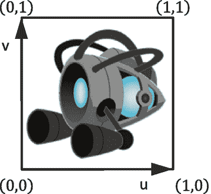

图 5-1

为所有图像定义的纹理坐标系和相应的 uv 值

Note

有定义 v 轴向上或向下增加的惯例。在本书的所有例子中，你将编写 WebGL 来遵循图 5-1 中的约定，v 轴向上增加。

要将纹理映射到单位正方形上，必须为每个顶点位置定义相应的 uv 值。如图 5-2 所示，除了为正方形的四个角定义 xy 位置值外，为了将图像映射到该正方形上，还必须定义相应的 uv 坐标。在这种情况下，左上角有 xy=(-0.5，0.5)和 uv=(0，1)，右上角有 xy=(0.5，0.5)和 uv=(1，1)，以此类推。根据这一定义，可以通过对顶点处定义的 uv 值进行线性插值来计算正方形内任何位置的唯一 uv 值。例如，给定图 5-2 中所示的设置，你知道沿着正方形顶边的中点映射到纹理空间中的 uv(0.5，1.0)，沿着左边缘的中点映射到 uv(0，0.5)，等等。

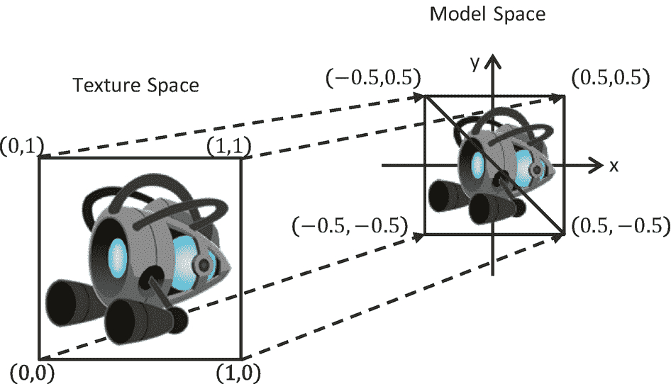

图 5-2

定义纹理空间 uv 值，以将整个图像映射到模型空间中的几何图形上

### 纹理着色器项目

这个项目演示了用 WebGL 加载、渲染和卸载纹理。你可以在图 5-3 中看到这个项目运行的一个例子，左边和右边是两个场景的截图。请注意左边截图中没有白色边框的自然物体和右边截图中白色背景的图像。这个项目还将突出有和没有阿尔法通道，或*透明度*的图像之间的差异。这个项目的源代码在`chapter5/5.1.texture_shaders`文件夹中定义。

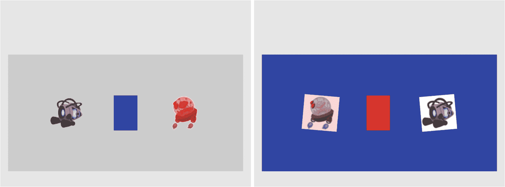

图 5-3

对两个场景运行纹理着色器项目

对于这两个场景，项目的控件如下:

*   **右箭头键**:向右移动中间的矩形。如果这个矩形通过了窗口的右边界，它将被绕到窗口的左边。

*   **左箭头键**:向左移动中间的矩形。如果这个矩形越过左窗口边界，游戏将过渡到下一个场景。

该项目的目标如下:

*   演示如何使用 WebGL 定义几何图形的 uv 坐标

*   用 WebGL 在图形系统中创建纹理坐标缓冲区

*   构建 GLSL 着色器以渲染纹理几何体

*   定义`Texture`核心引擎组件，将图像加载并处理到纹理中，以及卸载纹理

*   为了实现简单的纹理着色，用程序员指定的颜色修改所有纹理元素

您可以在`assets`文件夹中找到以下外部资源文件:一个场景级文件(`blue_level.xml`)和四个图像(`minion_collector.jpg`、`minion_collector.png`、`minion_portal.jpg`和`minion_portal.png`)。

#### 概观

创建和整合纹理涉及到相对重大的变化和新的类被添加到游戏引擎。以下概述介绍了这些变化的背景和原因:

*   `texture_vs.glsl`和`texture_fs.glsl`:这些是新创建的文件，用于定义 GLSL 着色器，以支持使用 uv 坐标绘制。回想一下，GLSL 着色器必须在游戏引擎初始化期间加载到 WebGL 中并进行编译。

*   `vertex_buffer.js`:修改该文件，创建相应的 uv 坐标缓冲区，为单位正方形的顶点定义纹理坐标。

*   `texture_shader.js`:这是一个新文件，它将`TextureShader`定义为`SimpleShader`的子类，以将游戏引擎与相应的 GLSL 着色器(`TextureVS`和`TextureFS`)接口。

*   `texture_renderable.js`:这是一个新文件，它将`TextureRenderable`定义为`Renderable`的子类，以便于创建、操作和绘制纹理对象的多个实例。

*   `shader_resources.js`:回想一下，这个文件定义了一个`SimpleShader`实例来覆盖相应的 GLSL 着色器，由`Renderable`对象的所有实例在系统范围内共享。以类似的方式，这个文件被修改以定义一个由所有`TextureRenderable`对象的实例共享的`TextureShader`实例。

*   `gl.js`:修改该文件，配置 WebGL 支持纹理贴图绘制。

*   `texture.js`:这是一个新文件，定义了能够加载、激活(用于渲染)和卸载纹理图像的核心引擎组件。

*   `my_game.js`和`blue_level.js`:这些游戏引擎客户端文件被修改以测试新的纹理映射功能。

创建两个新的源代码文件夹`src/engine/shaders`和`src/engine/renderables`，用于组织引擎源代码。创建这些文件夹是为了支持相应的纹理相关功能所需的许多新的着色器和渲染器类型。同样，持续的源代码重组对于支持复杂性的相应增加是很重要的。在维护和扩展大型软件系统的功能时，一个系统的和逻辑的源代码结构是至关重要的。

#### 简单着色器/可渲染架构的扩展

回想一下，`SimpleShader` / `Renderable`对象对被设计为支持将相关游戏引擎数据加载到`SimpleVS/FS` GLSL 着色器，并支持游戏引擎客户端实例化`Renderable`几何图形的多个副本。如图 5-4 所示，水平虚线将游戏引擎与 WebGL 分开。注意，GLSL 着色器`SimpleVS`和`SimpleFS`是 WebGL 中的模块，在游戏引擎之外。`SimpleShader`对象维护对 GLSL 着色器中所有属性和统一变量的引用，并充当将所有变换和顶点信息发送到`SimpleVS/FS`着色器的管道。虽然在图 5-4 中没有明确描述，但是在游戏引擎中只创建了一个`SimpleShader`对象的实例，在`shader_resources`中，并且这个实例由所有`Renderable`对象共享。

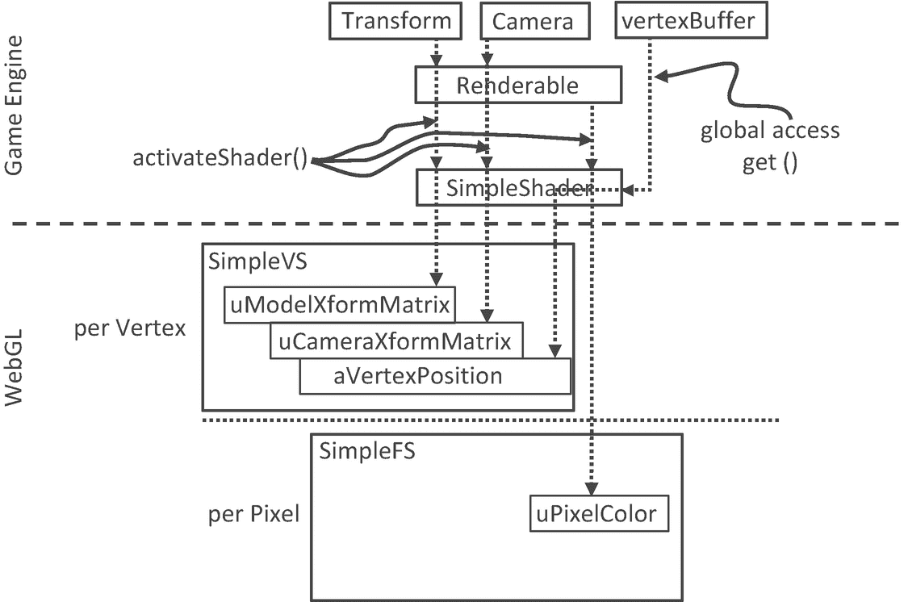

图 5-4

`SimpleShader`和`Renderable`架构

纹理映射的正确支持需要新的 GLSL 顶点和片段着色器，因此需要在游戏引擎中定义相应的着色器和可渲染对象对。如图 5-5 所示，GLSL `TextureVS` / `FS`着色器和`TextureShader` / `TextureRenderable`对象对都是相应现有对象的扩展(或子类)。`TextureShader` / `TextureRenderable`对象对从对应的`SimpleShader` / `Renderable`对象扩展，将纹理坐标转发给 GLSL 着色器。`TextureVS` / `FS`着色器是对相应的`SimpleVS` / `FS`着色器的扩展，用于在计算像素颜色时从提供的纹理贴图中读取纹理元素。注意，因为 GLSL 不支持子类化，所以`TextureVS` / `FS`源代码是从`SimpleVS` / `FS`文件中复制的。

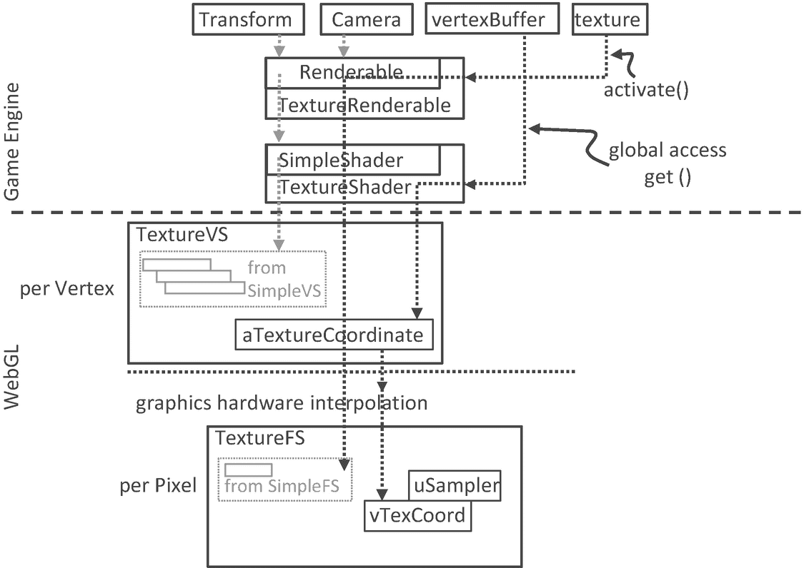

图 5-5

`TextureVS/FS` GLSL 着色器和相应的`TextureShader` / `TextureRenderable`对象对

#### GLSL 纹理明暗器

要支持使用纹理进行绘制，必须创建一个着色器，该着色器在每个顶点都接受几何(xy)和纹理(uv)坐标。您将通过复制和修改相应的`SimpleVS`和`SimpleFS`程序来创建新的 GLSL 纹理顶点和片段着色器。现在，您可以开始创建纹理顶点着色器。

1.  在`src/glsl_shaders`文件夹中创建一个新文件，并将其命名为`texture_vs.glsl`。

2.  将以下代码添加到`texture_vs.glsl`文件中:

```js
attribute vec3 aVertexPosition; // expects one vertex position
attribute vec2 aTextureCoordinate; // texture coordinate attribute

// texture coordinate that maps image to the square
varying vec2 vTexCoord;

// to transform the vertex position
uniform mat4 uModelXformMatrix;
uniform mat4 uCameraXformMatrix;

void main(void) {
    // Convert the vec3 into vec4 for scan conversion and
    // transform by uModelXformMatrix and uCameraXformMatrix before
    // assign to gl_Position to pass the vertex to the fragment shader
    gl_Position = uCameraXformMatrix *
                  uModelXformMatrix *
                  vec4(aVertexPosition, 1.0);

    // pass the texture coordinate to the fragment shader
    vTexCoord = aTextureCoordinate;
}

```

你可能会注意到`TextureVS`着色器类似于`SimpleVS`着色器，只增加了三行代码:

1.  第一行添加了`aTextureCoordinate`属性。这定义了一个顶点，包括一个`vec3` ( `aVertexPosition`，顶点的 xyz 位置)和一个`vec2` ( `aTextureCoordinate`，顶点的 uv 坐标)。

2.  第二个声明了`varying vTexCoord`变量。GLSL 中的关键字`varying`表示相关变量将被线性插值并传递给片段着色器。如前所述，如图 5-2 所示，uv 值仅在顶点位置定义。在这种情况下，`varying vTexCoord`变量指示图形硬件对 uv 值进行线性插值，以计算每次调用片段着色器的纹理坐标。

3.  第三行也是最后一行将顶点 uv 坐标值指定给可变变量，用于插值和转发到片段着色器。

定义了顶点着色器后，现在可以创建关联的片段着色器:

1.  在`src/glsl_shaders`文件夹中创建一个新文件，并将其命名为`texture_fs.glsl`。

2.  将以下代码添加到`texture_fs.glsl`文件中，以声明变量。`sampler2D`数据类型是一个 GLSL 实用程序，能够从 2D 纹理中读取纹理元素值。在这种情况下，`uSampler`对象将被绑定到一个 GLSL 纹理，这样就可以对渲染的每个像素进行纹理采样。`uPixelColor`和`SimpleFS`的一样。`vTexCoord`是每个像素的插值 uv 坐标值。

1.  添加以下代码来计算每个像素的颜色:

```js
// The object that fetches data from texture.
// Must be set outside the shader.
uniform sampler2D uSampler;

// Color of pixel
uniform vec4 uPixelColor;

// "varying" keyword signifies that the texture coordinate will be
// interpolated and thus varies.
varying vec2 vTexCoord;

```

```js
void main(void)  {
    // texel color look up based on interpolated UV value in vTexCoord
    vec4 c = texture2D(uSampler, vec2(vTexCoord.s, vTexCoord.t));

    // tint the textured. transparent area defined by the texture
    vec3 r = vec3(c) * (1.0-uPixelColor.a) +
             vec3(uPixelColor) * uPixelColor.a;
    vec4 result = vec4(r, c.a);

    gl_FragColor = result;
}

```

`texture2D()`函数使用来自`vTexCoord`的插值 uv 值从与`uSampler`相关联的纹理中采样并读取纹理元素值。在这个例子中，根据*透明度*或相应 alpha 通道的值，通过`uPixelColor`中定义的颜色值的加权和来修改或着色纹理元素的颜色。总的来说，对纹理颜色的着色没有一致的定义。你可以自由地尝试不同的方法来组合`uPixelColor`和采样的纹理颜色。例如，您可以尝试将两者相乘。在提供的源代码文件中，建议了一些替代方法。请用它们做实验。

#### 定义和设置纹理坐标

回想一下，所有着色器共享在`vertex_buffer.js`文件中定义的单位正方形的相同 xy 坐标缓冲区。以类似的方式，必须定义相应的缓冲区来为 GLSL 着色器提供纹理坐标。

1.  修改`vertex_buffer.js`为单位正方形定义 xy 和 uv 坐标。如图 5-2 所示，`mTextureCoordinates`变量定义了`mVerticesOfSquare`中依次定义的单位正方形对应的四个 xy 值的 uv 值。例如，(1，1)是与(0.5，0.5，0) xy 位置相关联的 uv 值，(0，1)表示(-0.5，0.5，0)，依此类推。

1.  定义变量`mGLTextureCoordBuffer`，为`mTextureCoordinates`的纹理坐标值和相应的 getter 函数保存对 WebGL 缓冲存储的引用:

```js
// First: define the vertices for a square
let mVerticesOfSquare = [
    0.5, 0.5, 0.0,
    -0.5, 0.5, 0.0,
    0.5, -0.5, 0.0,
    -0.5, -0.5, 0.0
];

// Second: define the corresponding texture coordinates
let mTextureCoordinates = [
    1.0, 1.0,
    0.0, 1.0,
    1.0, 0.0,
    0.0, 0.0
];

```

1.  修改`init()`函数，加入步骤 D，将纹理坐标初始化为 WebGL 缓冲区。注意，初始化过程与顶点 xy 坐标的初始化过程相同，除了对新缓冲区的引用存储在`mGLTextureCoordBuffer`中，传输的数据是 uv 坐标值。

```js
let mGLTextureCoordBuffer = null;
function getTexCoord() { return mGLTextureCoordBuffer; }

```

1.  记得在最终清理期间释放分配的缓冲区:

```js
function init() {
    let gl = glSys.get();

    ... identical to previous code ...

    // Step  D: Allocate and store texture coordinates
    // Create a buffer on the gl context for texture coordinates
    mGLTextureCoordBuffer = gl.createBuffer();

    // Activate texture coordinate buffer
    gl.bindBuffer(gl.ARRAY_BUFFER, mGLTextureCoordBuffer);

    // Loads textureCoordinates into the mGLTextureCoordBuffer
    gl.bufferData(gl.ARRAY_BUFFER,
                  new Float32Array(mTextureCoordinates), gl.STATIC_DRAW);
}

```

1.  最后，记得导出更改:

```js
function cleanUp() {
    ... identical to previous code ...

    if (mGLTextureCoordBuffer !== null) {
        gl.deleteBuffer(mGLTextureCoordBuffer);
        mGLTextureCoordBuffer = null;
    }
}

```

```js
export {init, cleanUp, get, getTexCoord}

```

#### 将 GLSL 着色器接口到引擎

正如`SimpleShader`对象被定义为与`SimpleVS`和`SimpleFS`着色器接口一样，相应的着色器对象需要在游戏引擎中创建，以与`TextureVS`和`TextureFS` GLSL 着色器接口。如本项目概述中所述，您还将创建一个新文件夹来组织不断增加的不同着色器。

1.  在`src/engine`中新建一个名为`shaders`的文件夹。将`simple_shader.js`文件移动到这个文件夹中，不要忘记更新`index.js`中的参考路径。

2.  在`src/engine/shaders`文件夹中创建一个新文件，并将其命名为`texture_shader.js`。

```js
class TextureShader extends SimpleShader {
    constructor(vertexShaderPath, fragmentShaderPath) {
        // Call super class constructor
        super(vertexShaderPath, fragmentShaderPath);

        // reference to aTextureCoordinate within the shader
        this.mTextureCoordinateRef = null;

        // get the reference of aTextureCoordinate within the shader
        let gl = glSys.get();
        this.mTextureCoordinateRef = gl.getAttribLocation(
                                        this.mCompiledShader,
                                        "aTextureCoordinate");
        this.mSamplerRef = gl.getUniformLocation(this.mCompiledShader,
                                                 "uSampler");
    }
    ... implementation to follow ...

```

在列出的代码中，请注意以下几点:

1.  覆盖`activate()`功能以启用纹理坐标数据。超类`super.activate()`函数设置 xy 顶点位置，并将`pixelColor`、`trsMatrix`和`cameraMatrix`的值传递给着色器。其余代码将`mTextureCoordinateRef`(在`vertex_buffer`模块中定义的纹理坐标缓冲区)绑定到 GLSL 着色器中的`aTextureCoordinate`属性，并将`mSampler`绑定到纹理单元 0(稍后将详细描述)。

1.  定义的`TextureShader`类是`SimpleShader`类的扩展或子类。

2.  构造函数实现首先调用`SimpleShader`的构造函数`super()`。回想一下，`SimpleShader`构造函数将加载并编译由`vertexShaderPath`和`fragmentShaderPath`参数定义的 GLSL 着色器，并设置`mVertexPositionRef`来引用着色器中定义的`aVertexPosition`属性。

3.  在构造函数的其余部分中，`mTextureCoordinateRef`保持对在`texture_vs.glsl`中定义的`aTextureCoordinate`属性的引用。

4.  这样，顶点位置(`aVertexPosition`)和纹理坐标(`aTextureCoordinate`)属性都被一个 JavaScript `TextureShader`对象引用。

```js
// Overriding the Activation of the shader for rendering
activate(pixelColor, trsMatrix, cameraMatrix) {
    // first call the super class's activate
    super.activate(pixelColor, trsMatrix, cameraMatrix);

    // now our own functionality: enable texture coordinate array
    let gl = glSys.get();
    gl.bindBuffer(gl.ARRAY_BUFFER, this._getTexCoordBuffer());
    gl.vertexAttribPointer(this.mTextureCoordinateRef, 2,
                           gl.FLOAT, false, 0, 0);
    gl.enableVertexAttribArray(this.mTextureCoordinateRef);

    // bind uSampler to texture 0
    gl.uniform1i(this.mSamplerRef, 0);
        // texture.activateTexture() binds to Texture0
}

```

通过组合`SimpleShader`和`TextureShader`的功能，在`activate()`函数调用之后，GLSL `texture_vs`着色器中的两个属性变量(`aVertexPosition`和`aTextureCoordinate`)都被连接到 WebGL 内存中相应的缓冲区。

#### 使用 shader_resources 促进共享

与`SimpleShader`是可重用资源一样，只需要创建`TextureShader`的一个实例，并且这个实例可以共享。应该修改`shader_resources`模块来反映这一点。

1.  在`shader_resources.js`中，添加变量以保存纹理着色器:

1.  定义一个函数来检索纹理着色器:

```js
// Texture Shader
let kTextureVS = "src/glsl_shaders/texture_vs.glsl"; // VertexShader
let kTextureFS = "src/glsl_shaders/texture_fs.glsl"; // FragmentShader
let mTextureShader = null;

```

1.  在`createShaders()`函数中创建纹理着色器的实例:

```js
function getTextureShader() { return mTextureShader; }

```

1.  修改`init()`函数以追加`loadPromise`来包含纹理着色器源文件的加载:

```js
function createShaders() {
    mConstColorShader = new SimpleShader(kSimpleVS, kSimpleFS);
    mTextureShader = new TextureShader(kTextureVS, kTextureFS);
}

```

1.  记得在清理期间释放新分配的资源:

```js
function init() {
    let loadPromise = new Promise(
        async function(resolve) {
            await Promise.all([
                text.load(kSimpleFS),
                text.load(kSimpleVS),
                text.load(kTextureFS),
                text.load(kTextureVS)
            ]);
            resolve();
        }).then(
            function resolve() { createShaders(); }
        );
    map.pushPromise(loadPromise);
}

```

1.  最后，记住导出新定义的功能:

```js
function cleanUp() {
    mConstColorShader.cleanUp();
    mTextureShader.cleanUp();

    text.unload(kSimpleVS);
    text.unload(kSimpleFS);
    text.unload(kTextureVS);
    text.unload(kTextureFS);
}

```

```js
export {init, cleanUp, getConstColorShader, getTextureShader}

```

#### TextureRenderable 类

就像`Renderable`类封装并方便了`SimpleShader`对象多个实例的定义和绘制一样，需要定义一个对应的`TextureRenderable`类来支持`TextureShader`对象多个实例的绘制。

##### 对可渲染类的更改

正如项目概述中提到的，由于在`Shaders`文件夹中创建和组织着色器类的原因，应该创建一个`renderables`文件夹来组织不断增长的不同种类的`Renderable`对象。此外，必须修改`Renderable`类以支持它成为所有`Renderable`对象的基类。

1.  创建`src/engine/renderables`文件夹并将`renderable.js`移动到该文件夹中。记得更新`index.js`以反映文件位置的变化。

2.  定义`_setShader()`函数来设置`Renderable`的着色器。这是一个受保护的函数，允许子类修改`mShader`变量，以引用每个相应子类的适当着色器。

```js
// this is private/protected
_setShader(s) { this.mShader = s; }

```

Note

名称以“_”开头的函数是私有的或受保护的，不应从类外部调用。这是本书遵循的惯例，并不是由 JavaScript 强制执行的。

##### 定义 TextureRenderable 类

您现在已经准备好定义`TextureRenderable`类了。如前所述，`TextureRenderable`是从`Renderable`类派生而来的，并扩展了其渲染纹理映射对象的功能。

1.  在`src/engine/renderables`文件夹中创建一个新文件，并将其命名为`texture_renderable.js`。添加构造函数。回想一下，`super()`是对超类(`Renderable`)构造函数的调用；类似地，`super.setColor()`和`super._setShader()`是对超类函数的调用。正如将在讨论引擎`texture`资源模块时详细描述的那样，`myTexture`参数是包含纹理图像的文件的路径。

1.  定义一个`draw()`函数来附加在`Renderable`类中定义的函数以支持纹理。`texture.activate()`功能激活并允许用特定纹理绘图。该功能的细节将在下一节讨论。

```js
class TextureRenderable extends Renderable {
    constructor(myTexture) {
        super();
        super.setColor([1, 1, 1, 0]); // Alpha 0: no texture tinting
        super._setShader(shaderResources.getTextureShader());
        this.mTexture = myTexture;  // cannot be a "null"
    }
... implementation to follow ...

```

1.  为纹理引用定义一个 getter 和 setter:

```js
draw(camera) {
    // activate the texture
    texture.activate(this.mTexture);
    super.draw(camera);
}

```

1.  最后，记得导出类:

```js
getTexture() { return this.mTexture; }
setTexture(newTexture) { this.mTexture = newTexture; }

```

```js
export default TextureRenderable;

```

#### 引擎中的纹理支持

为了支持使用纹理进行绘制，游戏引擎的其余部分需要进行两项主要修改:WebGL 上下文配置和一个专用引擎组件，以支持与纹理相关的操作。

##### 配置 WebGL 以支持纹理

必须更新 WebGL 上下文的配置以支持纹理。在`gl.js`中，根据以下内容更新`init()`功能:

```js
function init(htmlCanvasID) {
    mCanvas = document.getElementById(htmlCanvasID);
    if (mCanvas == null)
        throw new Error("Engine init [" +
                         htmlCanvasID + "] HTML element id not found");

    // the standard or experimental webgl and binds to the Canvas area
    // store the results to the instance variable mGL
    mGL = mCanvas.getContext("webgl2", {alpha: false}) ||
          mCanvas.getContext("experimental-webgl2", {alpha: false});

    if (mGL === null) {
        document.write("<br><b>WebGL 2 is not supported!</b>");
        return;
    }

    // Allows transparency with textures.
    mGL.blendFunc(mGL.SRC_ALPHA, mGL.ONE_MINUS_SRC_ALPHA);
    mGL.enable(mGL.BLEND);

    // Set images to flip y axis to match the texture coordinate space.
    mGL.pixelStorei(mGL.UNPACK_FLIP_Y_WEBGL, true);
}

```

传递给`mCanvas.getContext()`的参数通知浏览器画布应该是不透明的。这可以加速透明内容和图像的绘制。使用 alpha 通道绘制图像时，`blendFunc()`功能启用透明。`pixelStorei()`函数将 uv 坐标的原点定义在左下角。

##### 创建纹理资源模块

与文本和音频文件类似，必须定义新的引擎组件来支持相应的纹理操作，包括从服务器文件系统加载、通过 WebGL 上下文存储到 GPU 内存、激活用于绘制的纹理缓冲区以及从 GPU 中移除:

1.  在`src/engine/resources`文件夹中创建一个新文件，并将其命名为`texture.js`。这个文件将实现`Texture`引擎组件。

2.  定义`TextureInfo`类来表示游戏引擎中的纹理。`mWidth`和`mHeight`是纹理图像的像素分辨率，`mGLTexID`是对 WebGL 纹理存储的引用。

```js
class TextureInfo {
    constructor(w, h, id) {
        this.mWidth = w;
        this.mHeight = h;
        this.mGLTexID = id;
    }
}

```

Note

出于效率的考虑，很多图形硬件只支持图像分辨率为 2 的幂次的纹理，比如 2x4(2<sup>1</sup>x2<sup>2</sup>，或者 4x 16(2<sup>2</sup>x2<sup>4</sup>，或者 64x 256(2<sup>6</sup>x2<sup>8</sup>等等。WebGL 也是这种情况。本书中的所有例子只适用于分辨率为 2 次方的纹理。

1.  从`resource_map`导入核心资源管理功能:

1.  定义一个函数来异步加载一个图像作为承诺，并将该承诺作为`map`中待定承诺的一部分。与文本和音频资源不同，JavaScript `Image` API 支持直接的图像文件加载，在这种情况下不需要`map.loadDecodeParse()`。一旦图像被加载，它就被传递给`processLoadedImage()`函数，并以其文件路径作为名称。

```js
import * as map from "../core/resource_map.js";
// functions from resource_map
let has = map.has;
let get = map.get;

```

1.  增加一个`unload()`函数来清理引擎，释放 WebGL 资源:

```js
// Loads a texture so that it can be drawn.
function load(textureName) {
    let image = new Image();
    let texturePromise = new Promise(
        function(resolve) {
            image.onload = resolve;
            image.src = textureName;
        }).then(
            function resolve() {
                processLoadedImage(textureName, image); }
        );
    map.pushPromise(texturePromise);
    return texturePromise;
}

```

1.  现在定义`processLoadedImage()`函数来转换图像的格式，并将其存储到 WebGL 上下文中。`gl.createTexture()`函数创建一个 WebGL 纹理缓冲区并返回一个唯一的 ID。`texImage2D()`函数将图像存储到 WebGL 纹理缓冲区，而`generateMipmap()`为纹理计算一个 mipmap。最后，实例化一个`TextureInfo`对象来引用 WebGL 纹理，并根据纹理图像文件的文件路径存储到`resource_map`中。

```js
// Remove the reference to allow associated memory
// to be available for subsequent garbage collection
function unload(textureName) {
    let texInfo = get(textureName);
    if (map.unload(textureName)) {
        let gl = glSys.get();
        gl.deleteTexture(texInfo.mGLTexID);
    }
}

```

```js
function processLoadedImage(path, image) {
    let gl = glSys.get();

    // Generate a texture reference to the webGL context
    let textureID = gl.createTexture();

    // binds texture reference with current texture in the webGL
    gl.bindTexture(gl.TEXTURE_2D, textureID);

    // Loads texture to texture data structure with descriptive info.
    // Parameters:
    //  1: "binding point" or target the texture is being loaded to.
    //  2: Level of detail. Used for mipmapping. 0 is base texture level.
    //  3: Internal format. The composition of each element. i.e. pixels.
    //  4: Format of texel data. Must match internal format.
    //  5: The data type of the texel data.
    //  6: Texture Data.
    gl.texImage2D(gl.TEXTURE_2D, 0,
                  gl.RGBA, gl.RGBA, gl.UNSIGNED_BYTE, image);

    // Creates a mipmap for this texture.
    gl.generateMipmap(gl.TEXTURE_2D);

    // Tells WebGL done manipulating data at the mGL.TEXTURE_2D target.
    gl.bindTexture(gl.TEXTURE_2D, null);

    let texInfo = new TextureInfo(image.naturalWidth,
                                  image.naturalHeight, textureID);
    map.set(path, texInfo);
}

```

Note

一个*小中见大贴图*是便于高质量渲染的纹理图像的表示。请查阅计算机图形学参考书，了解更多关于纹理贴图表示和相关纹理贴图算法的信息。

1.  定义一个函数来激活用于绘图的 WebGL 纹理:

1.  `get()`函数根据`textureName`从`resource_map`中定位`TextureInfo`对象。在`bindTexture()`函数中使用定位的`mGLTexID`来激活相应的 WebGL 纹理缓冲区进行渲染。

2.  `texParameteri()`函数定义了纹理的渲染行为。`TEXTURE_WRAP_S/T`参数确保纹理元素值不会在纹理边界处绕回。`TEXTURE_MAG_FILTER`参数定义了如何放大一个纹理，换句话说，当一个低分辨率的纹理被渲染到游戏窗口中的许多像素时。`TEXTURE_MIN_FILTER`参数定义了如何最小化一个纹理，换句话说，当一个高分辨率纹理被渲染到少量像素时。

3.  `LINEAR`和`LINEAR_MIPMAP_LINEAR`配置通过模糊原始图像的细节来生成平滑纹理，而注释掉的`NEAREST`选项将产生最适合像素化效果的未处理纹理。请注意，在这种情况下，纹理图像的颜色边界可能会呈现锯齿状。

```js
function activate(textureName) {
    let gl = glSys.get();
    let texInfo = get(textureName);

    // Binds texture reference to the current webGL texture functionality
    gl.activeTexture(gl.TEXTURE0);
    gl.bindTexture(gl.TEXTURE_2D, texInfo.mGLTexID);

    // To prevent texture wrapping
    gl.texParameteri(gl.TEXTURE_2D, gl.TEXTURE_WRAP_S, gl.CLAMP_TO_EDGE);
    gl.texParameteri(gl.TEXTURE_2D, gl.TEXTURE_WRAP_T, gl.CLAMP_TO_EDGE);

    // Handles how magnification and minimization filters will work.
    gl.texParameteri(gl.TEXTURE_2D, gl.TEXTURE_MAG_FILTER, gl.LINEAR);
    gl.texParameteri(gl.TEXTURE_2D, gl.TEXTURE_MIN_FILTER,
                     gl.LINEAR_MIPMAP_LINEAR);

    // For the texture to look "sharp" do the following:
    // gl.texParameteri(gl.TEXTURE_2D, gl.TEXTURE_MAG_FILTER,gl.NEAREST);
    // gl.texParameteri(gl.TEXTURE_2D, gl.TEXTURE_MIN_FILTER,gl.NEAREST);
}

```

Note

一般来说，最好使用分辨率与游戏中物体所占像素数量相近的纹理图像。例如，占据 64x64 像素空间的正方形应该理想地使用 64x64 纹理。

1.  如下定义停用纹理的函数。该函数将 WebGL 上下文设置为不使用任何纹理的状态。

1.  最后，记得导出功能:

```js
function deactivate() {
    let gl = glSys.get();
    gl.bindTexture(gl.TEXTURE_2D, null);
}

```

```js
export {has, get, load, unload,
    TextureInfo,
    activate, deactivate}

```

##### 将新功能导出到客户端

将纹理功能集成到引擎中的最后一步涉及修改引擎访问文件`index.js`。编辑`index.js`并添加以下导入和导出语句，以授予客户端对`texture`资源模块和`TextureRenderable`类的访问权限:

```js
... identical to previous code ...
import * as texture from "./resources/texture.js";
// renderables
import Renderable from "./renderables/renderable.js";
import TextureRenderable from "./renderables/texture_renderable.js";
... identical to previous code ...

export default {
    // resource support
    audio, text, xml, texture,

    // input support
    input,

    // Util classes
    Camera, Scene, Transform,

    // Renderables
    Renderable, TextureRenderable,

    // functions
    init, cleanUp, clearCanvas
}

```

#### 纹理映射功能的测试

通过所描述的修改，游戏引擎现在可以渲染恒定颜色的对象以及具有有趣和不同类型纹理的对象。下面的测试代码类似于前面的例子，其中两个场景`MyGame`和`BlueLevel`用于演示新添加的纹理映射功能。主要修改包括纹理图像的加载和卸载以及`TextureRenderable`对象的创建和绘制。此外，`MyGame`场景使用 PNG 图像高亮显示带有 alpha 通道的透明纹理贴图，`BlueScene`场景使用 JPEG 格式的图像显示相应的纹理。

正如在所有构建游戏的案例中一样，确保所有外部资源都得到合理组织是至关重要的。回想一下，`assets`文件夹是专门为组织外部资源而创建的。注意位于`assets`文件夹中的四个新纹理文件:`minion_collector.jpg`、`minion_collector.png`、`minion_portal.jpg`和`minion_portal.png`。

##### 修改蓝色级别场景文件以支持纹理

`blue_level.xml`场景文件修改自上一个例子，以支持纹理映射:

```js
<MyGameLevel>

    <!-- cameras -->
            <!-- Viewport: x, y, w, h -->
    <Camera CenterX="20" CenterY="60" Width="20"
            Viewport="20 40 600 300"
            BgColor="0 0 1 1.0"/>

    <!-- The red rectangle -->
    <Square PosX="20" PosY="60" Width="2" Height="3"
            Rotation="0"  Color="1 0 0 1" />

    <!-- Textures Square -->
    <TextureSquare PosX="15" PosY="60" Width="3" Height="3"
                   Rotation="-5" Color="1 0 0 0.3"
                   Texture="assets/minion_portal.jpg" />

    <TextureSquare PosX="25" PosY="60" Width="3" Height="3"
                   Rotation="5" Color="0 0 0 0"
                   Texture="assets/minion_collector.jpg"/>
        <!-- without tinting, alpha should be 0 -->

</MyGameLevel>

```

元素`TextureSquare`类似于`Square`,增加了一个`Texture`属性，指定哪个图像文件应该被用作正方形的纹理贴图。注意，正如在`texture_fs.glsl`中实现的那样，`Color`元素的 alpha 值被用来给纹理贴图着色。XML 场景描述旨在支持`minion_portal.jpg`纹理的轻微着色和`minion_collector.jpg`纹理的不着色。这种纹理着色效果可以在图 5-3 的右图中观察到。此外，请注意，指定的两个图像都是 JPEG 格式。由于 JPEG 格式不支持 alpha 通道的存储，两幅图像的未使用区域在图 5-3 的右图中显示为门户和 collector minions 外部的白色区域。

##### 修改 SceneFileParser

修改场景文件解析器`scene_file_parser.js`，支持解析更新后的`blue_scene.xml`，特别是将`Square`元素解析为`Renderable`对象，将`TextureSquare`元素解析为`TextureRenderable`对象。变更详情请参考`src/my_game/util`文件夹下的源代码文件。

##### 用 JPEGs 测试 BlueLevel

对`blue_level.js`的修改是在构造函数、`load()`、`unload()`、`next()`和`init()`函数中，在这些函数中加载和卸载纹理图像并解析新的`TextureRenderable`对象:

1.  编辑`blue_level.js`并修改构造函数以定义常数来表示纹理图像:

1.  在`load()`功能中启动纹理加载:

```js
class BlueLevel extends engine.Scene {
    constructor() {
        super();
        // scene file name
        this.kSceneFile = "assets/blue_level.xml";

        // textures: (Note: jpg does not support transparency)
        this.kPortal = "assets/minion_portal.jpg";
        this.kCollector = "assets/minion_collector.jpg";

        // all squares
        this.mSqSet = [];        // these are the Renderable objects

        // The camera to view the scene
        this.mCamera = null;
    }
    ... implementation to follow ...

```

1.  同样，通过在`unload()`函数中卸载纹理来添加代码进行清理:

```js
load() {
    // load the scene file
    engine.xml.load(this.kSceneFile);

    // load the textures
    engine.texture.load(this.kPortal);
    engine.texture.load(this.kCollector);
}

```

1.  支持用`next()`功能加载下一个场景:

```js
unload() {
    // unload the scene file and loaded resources
    engine.xml.unload(this.kSceneFile);
    engine.texture.unload(this.kPortal);
    engine.texture.unload(this.kCollector);
}

```

1.  解析`init()`函数中的纹理方块:

```js
next() {
    super.next();
    let nextLevel = new MyGame();  // load the next level
    nextLevel.start();
}

```

1.  在`update()`函数中包含适当的代码，以连续改变门户`TextureRenderable`的着色，如下所示:

```js
init() {
    let sceneParser = new SceneFileParser(this.kSceneFile);

    // Step A: Read in the camera
    this.mCamera = sceneParser.parseCamera();

    // Step B: Read all the squares and textureSquares
    sceneParser.parseSquares(this.mSqSet);
    sceneParser.parseTextureSquares(this.mSqSet);
}

```

1.  `mSqSet`的索引 1 是门户`TextureRenderable`对象，颜色数组的索引 3 是 alpha 通道。

2.  列出的代码不断增加并包装`TextureRenderable`对象中`mColor`变量的 alpha 值。回想一下，这个变量的值被传递给`TextureShader`，然后被加载到`TextureFS`的`uPixelColor`来着色纹理贴图的结果。

3.  正如在`blue_scene.xml`文件的第一个`TextureSquare`元素中所定义的，为门户对象定义的颜色是红色。由于这个原因，当运行这个项目时，在蓝色级别中，门户对象以红色闪烁。

```js
update() {
    ... identical to previous code ...

    // continuously change texture tinting
    let c = this.mSqSet[1].getColor();
    let ca = c[3] + deltaX;
    if (ca > 1) {
        ca = 0;
    }
    c[3] = ca;
}

```

##### 用 PNGs 测试我的游戏

与`BlueLevel`场景相似，`MyGame`是对上一个例子的简单修改，修改后载入和卸载纹理图像，并创建`TextureRenderable`对象:

1.  编辑`my_game.js`；修改`MyGame`构造函数，定义纹理图像文件和引用`TextureRenderable`对象的变量；

1.  在`load()`功能中启动纹理加载:

```js
class MyGame extends engine.Scene {
    constructor() {
        super();

        // textures:
        this.kPortal = "assets/minion_portal.png"; // with transparency
        this.kCollector = "assets/minion_collector.png";

        // The camera to view the scene
        this.mCamera = null;

        // the hero and the support objects
        this.mHero = null;
        this.mPortal = null;
        this.mCollector = null;
    }

```

1.  确保你记得卸载`unload()`中的纹理:

```js
load() {
    // loads the textures
    engine.texture.load(this.kPortal);
    engine.texture.load(this.kCollector);
}

```

1.  定义`next()`函数启动蓝色电平:

```js
unload() {
    // Game loop not running, unload all assets
    engine.texture.unload(this.kPortal);
    engine.texture.unload(this.kCollector);
}

```

1.  在`init()`函数中创建并初始化`TextureRenderables`对象:

```js
next() {
    super.next();
    // starts the next level
    let nextLevel = new BlueLevel();  // next level to be loaded
    nextLevel.start();
}

```

```js
init() {
    // Step A: set up the cameras
    this.mCamera = new engine.Camera(
                vec2.fromValues(20, 60),   // position of the camera
                20,                // width of camera
                [20, 40, 600, 300] // viewport (X, Y, width, height)
               );
    this.mCamera.setBackgroundColor([0.8, 0.8, 0.8, 1]);
    // sets the background to gray

    // Step B: Create the game objects
    this.mPortal = new engine.TextureRenderable(this.kPortal);
    this.mPortal.setColor([1, 0, 0, 0.2]);  // tints red
    this.mPortal.getXform().setPosition(25, 60);
    this.mPortal.getXform().setSize(3, 3);

    this.mCollector = new engine.TextureRenderable(this.kCollector);
    this.mCollector.setColor([0, 0, 0, 0]);  // No tinting
    this.mCollector.getXform().setPosition(15, 60);
    this.mCollector.getXform().setSize(3, 3);

    // Step C: Create the hero object in blue
    this.mHero = new engine.Renderable();
    this.mHero.setColor([0, 0, 1, 1]);
    this.mHero.getXform().setPosition(20, 60);
    this.mHero.getXform().setSize(2, 3);
}

```

记住纹理文件路径被用作`resource_map`中的唯一标识符。因此，文件纹理加载和卸载以及`TextureRenderable`对象的创建必须引用相同的文件路径。在给定的代码中，所有三个函数都引用构造函数中定义的相同常数。

1.  对`draw()`函数的修改通过调用相应的`draw()`函数来绘制两个新的`TextureRenderable`对象，而对`update()`函数的修改与前面讨论的`BlueLevel`类似。详情请参考`src/my_game`文件夹中的`my_game.js`源代码文件。

当在`chapter5/5.1.texture_shaders`文件夹中运行这个项目的例子时，再次注意连续改变纹理着色的结果——门户小程序以红色闪烁。此外，请注意`MyGame`级别中基于 PNG 的纹理和`BlueLevel`中对应的带白色边框的 JPEG 纹理之间的差异。使用带有 alpha(或透明度)通道的纹理来表示对象在视觉上更令人愉快和准确。PNG 是支持 alpha 通道的最流行的图像格式之一。

#### 观察

这个项目是你合作过的时间最长、最复杂的一个项目。这是因为使用纹理映射需要您理解纹理坐标，实现跨越引擎中的许多文件，并且实际的图像必须被加载、转换成纹理并通过 WebGL 存储/访问。为了帮助总结这些变化，图 5-6 显示了与用于纹理映射的图像状态和一些主要游戏引擎操作相关的游戏引擎状态。

图 5-6 的左栏标识了主要的游戏引擎状态，从 WebGL 初始化到场景初始化，再到游戏循环，最后到场景卸载。中间一列显示了将被用作纹理的图像的相应状态。最初，这个映像存储在服务器文件系统中。在场景初始化期间，`Scene.load()`函数将调用`engine/resources/texture.load()`函数加载图像，并使加载的图像由`engine/resources/texture.processLoadedImage()`函数处理成相应的 WebGL 纹理，存储在 GPU 纹理缓冲区中。在游戏循环周期中，`TextureRenderable.draw()`功能通过`engine/resources/texture.activate()`功能激活适当的 WebGL 纹理。这使得相应的 GLSL 片段着色器能够在渲染过程中从正确的纹理中采样。最后，当游戏不再需要某个纹理时，`Scene.unload()`函数会调用`engine/resources/texture.unload()`将加载的图像从系统中移除。

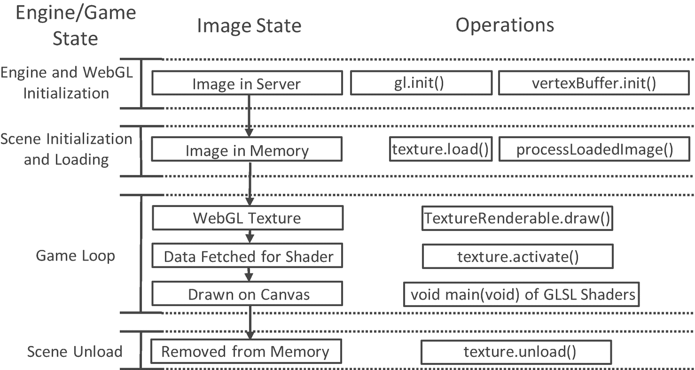

图 5-6

图像文件和相应 WebGL 纹理的状态概述

## 用 Sprite 工作表绘图

如前所述，sprite sheet 是由多个分别代表不同对象的低分辨率图像组成的图像。这些单独的图像中的每一个都被称为 *sprite sheet 元素*。例如，图 5-7 是一个 sprite 表，有来自 4 个不同对象的 13 个元素。上面两行的每一行都包含同一对象在不同动画位置的五个元素，在最后一行中，有不同对象的三个元素:角色染料、门户小程序和收集器小程序。创建子画面的艺术家或软件程序必须将每个子画面元素的像素位置传达给游戏开发者，就像图 5-7 所示的一样。

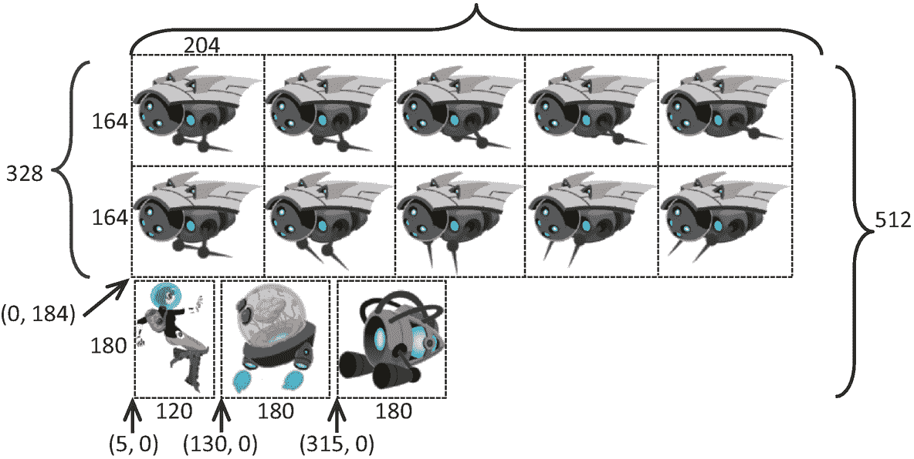

图 5-7

示例 sprite sheet: `minion_sprite.png`由不同对象的低分辨率图像组成

定义子画面表是为了优化内存和处理需求。例如，回想一下，WebGL 只支持由分辨率为 2<sup>*x*</sup>×2<sup>*y*</sup>的图像定义的纹理。这个要求意味着分辨率为 120x180 的染料字符必须存储在 128x256 (2 <sup>7</sup> × 2 <sup>8</sup> )图像中，以便将其创建为 WebGL 纹理。此外，如果图 5-7 的 13 个元素被存储为单独的图像文件，那么这将意味着需要 13 个缓慢的文件系统访问来加载所有的图像，而不是一个单一的系统访问来加载子画面。

使用 sprite sheet 和相关元素的关键是要记住，不管实际的图像分辨率如何，纹理坐标 uv 值都是在 0 到 1 的归一化范围内定义的。例如，图 5-8 关注图 5-7 中收集器 minion 的 uv 值，第三行最右边的 sprite 元素。图 5-8 的顶行、中间行和底行显示了入口元素的坐标值。

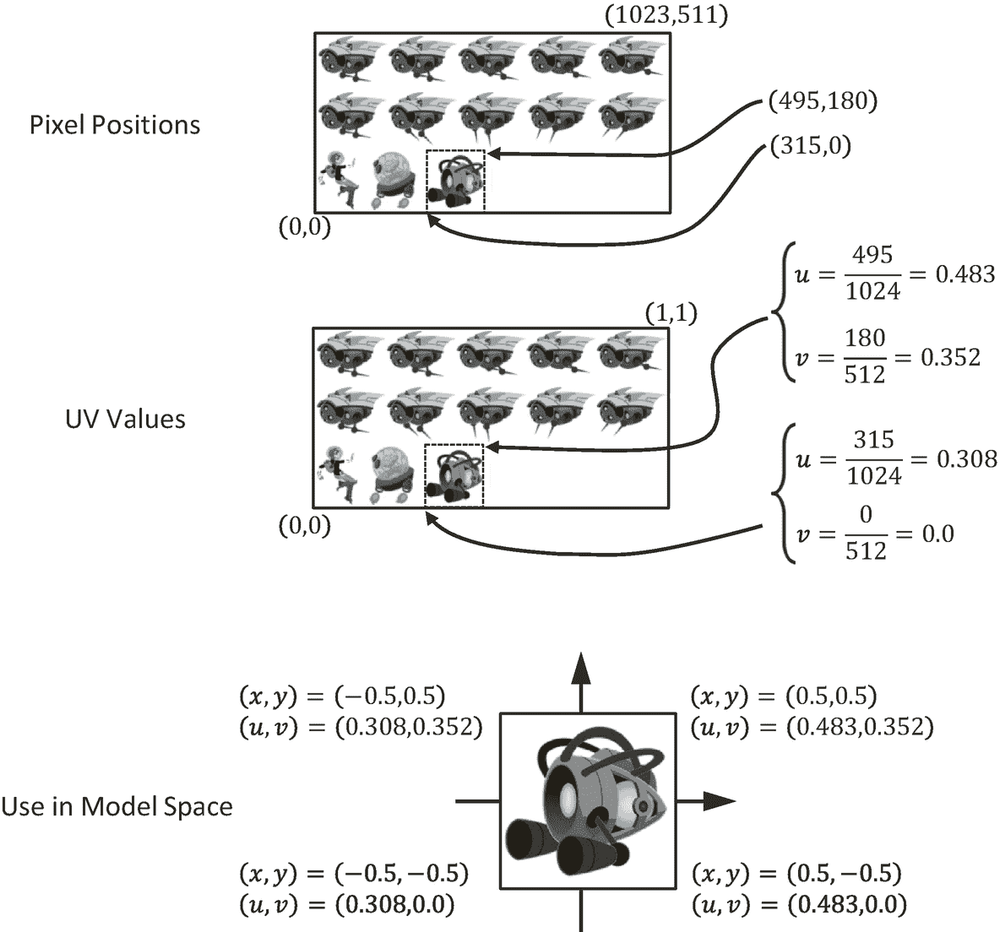

图 5-8

从像素位置到 uv 值的坐标转换，用于在几何体上贴图

*   **像素位置**:左下角为(315，0)，右上角为(495，180)。

*   **UV 值**:左下角为(0.308，0.0)，右上角为(0.483，0.352)。

*   **在** **模型空间**中使用:元素的纹理映射是通过将对应的 uv 值与每个顶点位置的 xy 值相关联来完成的。

### 精灵着色器项目

这个项目演示了如何通过定义适当的抽象和类来绘制带有 sprite sheet 元素的对象。你可以在图 5-9 中看到这个项目运行的例子。这个项目的源代码在`chapter5/5.2.sprite_shaders`文件夹中定义。

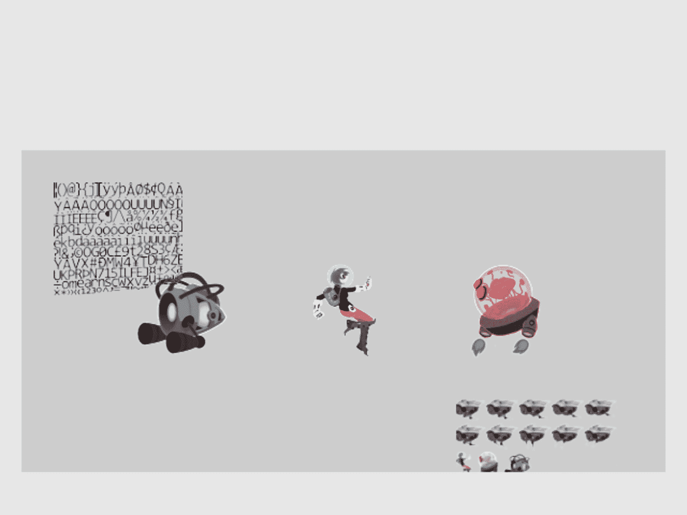

图 5-9

运行精灵着色器项目

该项目的控制措施如下:

*   **右箭头键**:向右移动染色角色(英雄)并在到达右边界时循环到左边界

*   **左箭头键**:向左移动英雄，当到达左边界时，将位置重置到窗口的中间

该项目的目标如下:

*   为了更深入地理解纹理坐标

*   体验在图像中为纹理映射定义子区域

*   通过映射 sprite sheet 元素来绘制正方形

*   准备使用精灵动画和位图字体

您可以在`assets`文件夹中找到以下外部资源文件:`consolas-72.png`和`minion_sprite.png`。注意`minion_sprite.png`是图 5-7 所示的图像。

如图 5-5 所示，上一节定义的纹理支持的主要优缺点之一是通过`getTexCoord()`函数访问的纹理坐标是在`vertex_buffer.js`文件中静态定义的。这是一个优势，因为在整个图像被映射到一个正方形的情况下，所有`TextureShader`对象的实例可以共享相同的默认 uv 值。这也是一个缺点，因为静态纹理坐标缓冲区不允许处理图像的不同子区域，因此不支持处理 sprite sheet 元素。如图 5-10 所示，本节中的示例通过在`SpriteShader`和`SpriteRenderable`对象中定义每对象纹理坐标来克服这一缺点。请注意，没有定义新的 GLSL 着色器，因为它们的功能与`TextureVS/FS`相同。

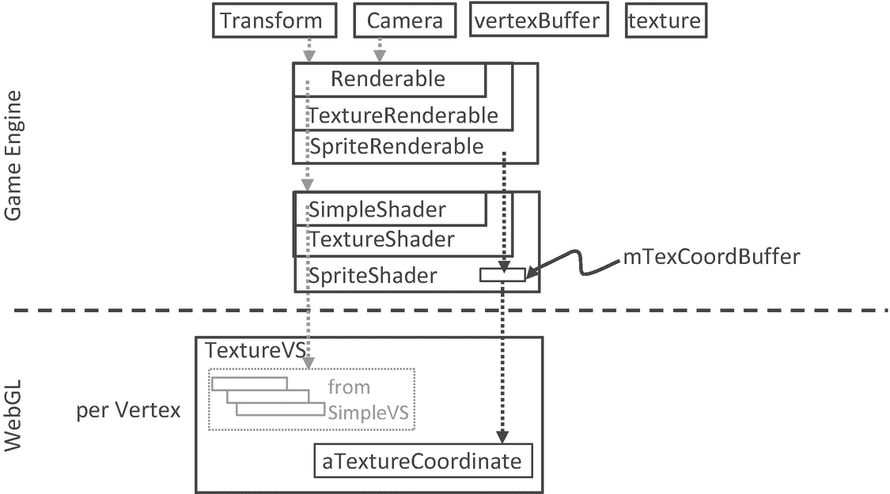

图 5-10

在`SpriteShader`中定义纹理坐标缓冲区

#### 使用 SpriteShader 将 GLSL 纹理着色器连接到引擎

支持带有 sprite sheet 元素的纹理映射的着色器必须能够识别图像的不同子区域。为了支持这个功能，你将实现`SpriteShader`来定义它自己的纹理坐标。由于这个新的着色器扩展了`TextureShader`的功能，将它实现为子类是合乎逻辑的。

1.  在`src/engine/shaders`文件夹中创建一个新文件，并将其命名为`sprite_shader.js`。

2.  定义`SpriteShader`类及其构造函数来扩展`TextureShader`类:

```js
class SpriteShader extends TextureShader {
    constructor(vertexShaderPath, fragmentShaderPath) {
        // Call super class constructor
        super(vertexShaderPath, fragmentShaderPath);

        this.mTexCoordBuffer = null; // gl buffer with texture coordinate

        let initTexCoord = [
            1.0, 1.0,
            0.0, 1.0,
            1.0, 0.0,
            0.0, 0.0
        ];

        let gl = glSys.get();
        this.mTexCoordBuffer = gl.createBuffer();

        gl.bindBuffer(gl.ARRAY_BUFFER, this.mTexCoordBuffer);
        gl.bufferData(gl.ARRAY_BUFFER,
                      new Float32Array(initTexCoord), gl.DYNAMIC_DRAW);
                     // DYNAMIC_DRAW: says buffer content may change!
    }
... implementation to follow ...

```

`SpriteShader`在 WebGL 中定义自己的纹理坐标缓冲区，对这个缓冲区的引用由`mTexCoordBuffer`保存。注意，当在 WebGL `bufferData()`函数中创建这个缓冲区时，指定了`DYNAMIC_DRAW`选项。当定义系统默认纹理坐标缓冲时，这与`vertex_buffer.js`中使用的`STATIC_DRAW`选项相比较。动态选项通知 WebGL 图形系统，该缓冲区的内容将发生变化。

1.  定义一个函数来设置 WebGL 纹理坐标缓冲区:

```js
setTextureCoordinate(texCoord) {
    let gl = glSys.get();
    gl.bindBuffer(gl.ARRAY_BUFFER, this.mTexCoordBuffer);
    gl.bufferSubData(gl.ARRAY_BUFFER, 0, new Float32Array(texCoord));
}

```

注意，`texCoord`参数是一个 8 个浮点数的数组，指定了 WebGL 上下文的纹理坐标位置。这个数组的格式和内容由 WebGL 接口定义为右上角、左上角、右下角和左下角。在您的例子中，这些应该是 sprite sheet 元素的四个角。

1.  覆盖纹理坐标访问函数`_getTexCoordBuffer()`，这样当着色器被激活时，返回本地分配的动态缓冲区，而不是全局静态缓冲区。注意，`activate()`函数是从`TextureShader`继承来的。

1.  记得导出类:

```js
_getTexCoordBuffer() {
    return this.mTexCoordBuffer;
}

```

```js
export default SpriteShader;

```

#### sprite 可呈现类

类似于`Renderable`类(用`SimpleShader`加阴影)和`TextureRenderable`类(用`TextureShader`加阴影)，应该定义一个相应的`SpriteRenderable`类来表示将用`SpriteShader`加阴影的对象:

1.  在`src/engine/renderables`文件夹中创建一个新文件，并将其命名为`sprite_renderable.js`。

2.  定义从`TextureRenderable`类扩展的`SpriteRenderable`类和构造函数。请注意，四个实例变量`mElmLeft`、`mElmRight`、`mElmTop`和`mElmBottom`一起标识了纹理空间内的一个子区域。这些是 sprite sheet 元素的边界。

1.  用标识 WebGL 纹理坐标规范数组的相应偏移位置的值定义枚举数据类型:

```js
class SpriteRenderable extends TextureRenderable {
    constructor(myTexture) {
        super(myTexture);
        super._setShader(shaderResources.getSpriteShader());
        // sprite coordinate
        this.mElmLeft = 0.0;   // texture coordinate bound
        this.mElmRight = 1.0;  //   0-left, 1-right
        this.mElmTop = 1.0;    //   1-top   0-bottom
        this.mElmBottom = 0.0; // of image
    }
... implementation to follow ...

```

```js
// texture coordinate array is an array of 8 floats where elements:
//  [0] [1]: is u/v coordinate of Top-Right
//  [2] [3]: is u/v coordinate of Top-Left
//  [4] [5]: is u/v coordinate of Bottom-Right
//  [6] [7]: is u/v coordinate of Bottom-Left
const eTexCoordArrayIndex = Object.freeze({
    eLeft: 2,
    eRight: 0,
    eTop: 1,
    eBottom: 5
});

```

Note

枚举数据类型的名称以“e”开头，如`eTexCoordArrayIndex`。

1.  定义函数以允许在纹理坐标空间(在 0 和 1 之间标准化)和像素位置(转换为 uv 值)中为 sprite sheet 元素指定 uv 值:

```js
// specify element region by texture coordinate (between 0 to 1)
setElementUVCoordinate(left, right, bottom, top) {
    this.mElmLeft = left;
    this.mElmRight = right;
    this.mElmBottom = bottom;
    this.mElmTop = top;
}

// element region defined pixel positions (0 to image resolutions)
setElementPixelPositions(left, right, bottom, top) {
    let texInfo = texture.get(this.mTexture);
    // entire image width, height
    let imageW = texInfo.mWidth;
    let imageH = texInfo.mHeight;

    this.mElmLeft = left / imageW;
    this.mElmRight = right / imageW;
    this.mElmBottom = bottom / imageH;
    this.mElmTop = top / imageH;
}

```

注意，`setElementPixelPositions()`函数在用相应的实例变量存储结果之前，从像素转换到纹理坐标。

1.  添加一个函数来构造适合传递给 WebGL 上下文的纹理坐标规范数组:

1.  覆盖`draw()`函数，在实际绘制之前将特定的纹理坐标值加载到 WebGL 上下文中:

```js
getElementUVCoordinateArray() {
    return [
        this.mElmRight,  this.mElmTop,          // x,y of top-right
        this.mElmLeft,   this.mElmTop,
        this.mElmRight,  this.mElmBottom,
        this.mElmLeft,   this.mElmBottom
    ];
}

```

1.  最后，记住导出类和定义的枚举类型:

```js
draw(camera) {
   // set the current texture coordinate
   // activate the texture
   this.mShader.setTextureCoordinate(this.getElementUVCoordinateArray());
   super.draw(camera);
}

```

```js
export default SpriteRenderable;
export {eTexCoordArrayIndex}

```

#### 使用 shader_resources 促进共享

与`SimpleShader`和`TextureShader`类似，`SpriteShader`是一种可以共享的资源。因此，应该将其添加到发动机的`shaderResources`中。

1.  在`engine/core/shader_resources.js`文件中，导入`SpriteShader`，添加一个变量进行存储，并定义相应的 getter 函数来访问共享的`SpriteShader`实例:

1.  修改`createShaders()`函数来创建`SpriteShader`:

```js
import SpriteShader from "../shaders/sprite_shader.js";
let mSpriteShader = null;
function getSpriteShader() { return mSpriteShader; }

```

```js
function createShaders() {
    mConstColorShader = new SimpleShader(kSimpleVS, kSimpleFS);
    mTextureShader = new TextureShader(kTextureVS, kTextureFS);
    mSpriteShader = new SpriteShader(kTextureVS, kTextureFS);
}

```

请注意，`SpriteShader`实际上覆盖了在`texture_vs.glsl`和`texture_fs.glsl`文件中定义的现有 GLSL 着色器。从 WebGL 的角度来看，使用纹理进行绘制的功能保持不变。与`SpriteShader`的唯一区别是纹理的坐标值现在是可编程的。

1.  更新`cleanUp()`函数以正确释放资源:

1.  确保导出新功能:

```js
function cleanUp() {
    mConstColorShader.cleanUp();
    mTextureShader.cleanUp();
    mSpriteShader.cleanUp();

    ... identical to previous code ...
}

```

```js
export {init, cleanUp,
    getConstColorShader, getTextureShader, getSpriteShader}

```

#### 将新功能导出到客户端

将 sprite 元素功能集成到引擎中的最后一步涉及修改引擎访问文件`index.js`。编辑`index.js`并添加以下导入和导出语句，以授予客户端对`SpriteRenderable`和`eTexCoordArrayIndex`的访问权限，这是用于访问 WebGL 纹理坐标数组的枚举数据类型。

```js
// renderables
import Renderable from "./renderables/renderable.js";
import TextureRenderable from "./renderables/texture_renderable.js";
import SpriteRenderable from "./renderables/sprite_renderable.js";
import { eTexCoordArrayIndex } from "./renderables/sprite_renderable.js";
... identical to previous code ...

export default {
    ... identical to previous code ...

    // Renderables
    Renderable, TextureRenderable, SpriteRenderable,

    // constants
    eTexCoordArrayIndex,

    // functions
    init, cleanUp, clearCanvas
}

```

#### 测试 SpriteRenderable

应该测试 sprite 元素和纹理坐标的两个重要功能:作为对象的 sprite sheet 元素的正确提取、绘制和控制；以及物体上 uv 坐标的改变和控制。为了正确测试添加的功能，您必须修改`my_game.js`文件。

1.  `MyGame`的构造、加载、卸载、绘制与前面的例子类似，这里不再赘述。详情请参考`src/my_game`文件夹中的源代码。

2.  如下修改`init()`功能。

1.  修改了`update()`功能，以支持对英雄对象的控制和对 uv 值的更改。

1.  在步骤 A 中设置好摄像机后，注意在步骤 B 中`mPortal`和`mCollector`都是基于同一个图像`kMinionSprite`创建的，分别调用`setElementPixelPositions()`和`setElementUVCoordinate()`来指定用于渲染的实际 sprite 元素。

2.  步骤 C 创建了另外两个`SpriteRenderable`对象:`mFontImage`和`mMinion`。sprite 元素 uv 坐标设置是默认设置，其中纹理图像将覆盖整个几何体。

3.  类似于步骤 B，步骤 D 基于相同的`kMinionSprite`图像创建英雄角色作为`SpriteRenderable`对象。对应于主人公的 sprite 工作表元素用`setElementPixelPositions()`调用来标识。

    请注意，在本例中，创建的五个`SpriteRenderable`对象中有四个基于同一个`kMinionSprite`图像。

```js
init() {
    // Step A: set up the cameras
    this.mCamera = new engine.Camera(
       vec2.fromValues(20, 60),   // position of the camera
       20,                        // width of camera
       [20, 40, 600, 300]         // viewport (orgX, orgY, width, height)
    );
    this.mCamera.setBackgroundColor([0.8, 0.8, 0.8, 1]);
    // sets the background to gray

    // Step B: Create the support objects
    this.mPortal = new engine.SpriteRenderable(this.kMinionSprite);
    this.mPortal.setColor([1, 0, 0, 0.2]);  // tints red
    this.mPortal.getXform().setPosition(25, 60);
    this.mPortal.getXform().setSize(3, 3);
    this.mPortal.setElementPixelPositions(130, 310, 0, 180);

    this.mCollector = new engine.SpriteRenderable(this.kMinionSprite);
    this.mCollector.setColor([0, 0, 0, 0]);  // No tinting
    this.mCollector.getXform().setPosition(15, 60);
    this.mCollector.getXform().setSize(3, 3);
    this.mCollector.setElementUVCoordinate(0.308, 0.483, 0, 0.352);

    // Step C: Create the font and minion images using sprite
    this.mFontImage = new engine.SpriteRenderable(this.kFontImage);
    this.mFontImage.setColor([1, 1, 1, 0]);
    this.mFontImage.getXform().setPosition(13, 62);
    this.mFontImage.getXform().setSize(4, 4);

    this.mMinion = new engine.SpriteRenderable(this.kMinionSprite);
    this.mMinion.setColor([1, 1, 1, 0]);
    this.mMinion.getXform().setPosition(26, 56);
    this.mMinion.getXform().setSize(5, 2.5);

    // Step D: Create hero object with texture from lower-left corner
    this.mHero = new engine.SpriteRenderable(this.kMinionSprite);
    this.mHero.setColor([1, 1, 1, 0]);
    this.mHero.getXform().setPosition(20, 60);
    this.mHero.getXform().setSize(2, 3);
    this.mHero.setElementPixelPositions(0, 120, 0, 180);
}

```

1.  注意键盘控制和 hero 对象的绘制与前面的项目相同。

2.  注意对`mFontImage`和`mMinion`的`setElementUVCoordinate()`调用。这些调用不断减少并重置对应于底部的 V 值，对应于`mFontImage`右侧的 U 值，对应于顶部的 V 值，以及对应于`mMinion`左侧的 U 值。最终结果是纹理的不断变化和这两个对象上的缩放动画的出现

```js
update() {
    // let's only allow the movement of hero,
    let deltaX = 0.05;
    let xform = this.mHero.getXform();

    // Support hero movements
    if (engine.input.isKeyPressed(engine.input.keys.Right)) {
        xform.incXPosBy(deltaX);
        if (xform.getXPos() > 30) { // right-bound of the window
            xform.setPosition(12, 60);
        }
    }

    if (engine.input.isKeyPressed(engine.input.keys.Left)) {
        xform.incXPosBy(-deltaX);
        if (xform.getXPos() < 11) {  // left-bound of the window
            xform.setXPos(20);
        }
    }

    // continuously change texture tinting
    let c = this.mPortal.getColor();
    let ca = c[3] + deltaX;
    if (ca > 1) {
        ca = 0;
    }
    c[3] = ca;

    // New update code for changing the sub-texture regions being shown"
    let deltaT = 0.001;

    // The font image:
    // zoom into the texture by updating texture coordinate
    // For font: zoom to the upper left corner by changing bottom right
    let texCoord = this.mFontImage.getElementUVCoordinateArray();
    // The 8 elements:
    //      mTexRight,  mTexTop,          // x,y of top-right
    //      mTexLeft,   mTexTop,
    //      mTexRight,  mTexBottom,
    //      mTexLeft,   mTexBottom
    let b = texCoord[engine.eTexCoordArrayIndex.eBottom] + deltaT;
    let r = texCoord[engine.eTexCoordArrayIndex.eRight] - deltaT;
    if (b > 1.0) {
        b = 0;
    }
    if (r < 0) {
        r = 1.0;
    }
    this.mFontImage.setElementUVCoordinate(
        texCoord[engine.eTexCoordArrayIndex.eLeft],
        r,
        b,
        texCoord[engine.eTexCoordArrayIndex.eTop]
    );
    //

    // The minion image:
    // For minion: zoom to the bottom right corner by changing top left
    texCoord = this.mMinion.getElementUVCoordinateArray();
    // The 8 elements:
    //      mTexRight,  mTexTop,          // x,y of top-right
    //      mTexLeft,   mTexTop,
    //      mTexRight,  mTexBottom,
    //      mTexLeft,   mTexBottom
    let t = texCoord[engine.eTexCoordArrayIndex.eTop] - deltaT;
    let l = texCoord[engine.eTexCoordArrayIndex.eLeft] + deltaT;
    if (l > 0.5) {
        l = 0;
    }
    if (t < 0.5) {
        t = 1.0;
    }
    this.mMinion.setElementUVCoordinate(
        l,
        texCoord[engine.eTexCoordArrayIndex.eRight],
        texCoord[engine.eTexCoordArrayIndex.eBottom],
        t
    );
}

```

## 精灵动画

在游戏中，您通常希望创建反映角色运动或动作的动画。在上一章中，您学习了如何使用变换运算符移动这些对象的几何图形。然而，正如您在前面的示例中控制英雄角色时所观察到的，如果这些对象上的纹理不以与控制相对应的方式改变，则交互传达的感觉是移动静态图像，而不是使角色运动。需要的是能够在需要时在几何图形上创建动画的幻觉。

在前面的示例中，您从`mFontImage`和`mMinion`对象中观察到，动画的外观可以通过不断更改纹理映射几何体上的 uv 值来创建。正如本章开始时所讨论的，控制这种类型动画的一种方法是使用动画精灵表。

### 动画精灵工作表概述

回想一下，动画 sprite sheet 是一个 sprite sheet，它包含动画中对象的图像序列，通常位于一行或多行或多列中。例如，在图 5-11 中，你可以看到一个 2x5 的动画 sprite 表，其中包含两个独立的动画组织成两行。动画描绘了一个对象在顶行中向右收缩其尖峰，并在底行中向左延伸它们。在这个例子中，动画被分成行。动画精灵表也可以定义沿着列的动画。sprite 表的组织和元素像素位置的细节通常由其创建者处理，并且必须明确地传达给游戏开发者以便在游戏中使用。

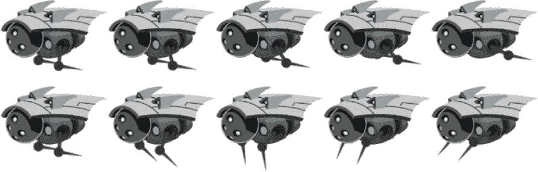

图 5-11

组织成两行的动画 sprite 工作表，表示同一对象的两个动画序列

图 5-12 显示，为了实现一个对象向右收缩其尖刺的动画效果，如图 5-11 的顶行所示，你按照 1，2，3，4，5 的顺序从左向右映射元素。当这些图像被映射到相同的几何图形，排序，并以适当的速率循环时，它传达了这样一种感觉，即对象确实在重复收回其尖峰的动作。或者，如果顺序颠倒，其中元素以从右到左的顺序映射，则它将创建与向左延伸尖峰的对象相对应的动画。也可以在从左到右的摆动循环中映射序列，然后从右到左返回。在这种情况下，动画将对应于对象不断收缩和伸展其尖状物的运动。

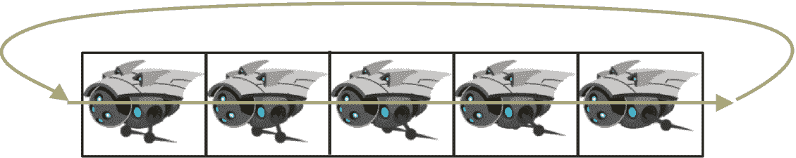

图 5-12

循环的精灵动画序列

### 精灵动画项目

这个项目演示了如何使用动画精灵表并生成连续的精灵动画。你可以在图 5-13 中看到这个项目运行的例子。项目场景包含前一个场景中的对象以及两个动画对象。这个项目的源代码在`chapter5/5.3.sprite_animate_shaders`文件夹中定义。

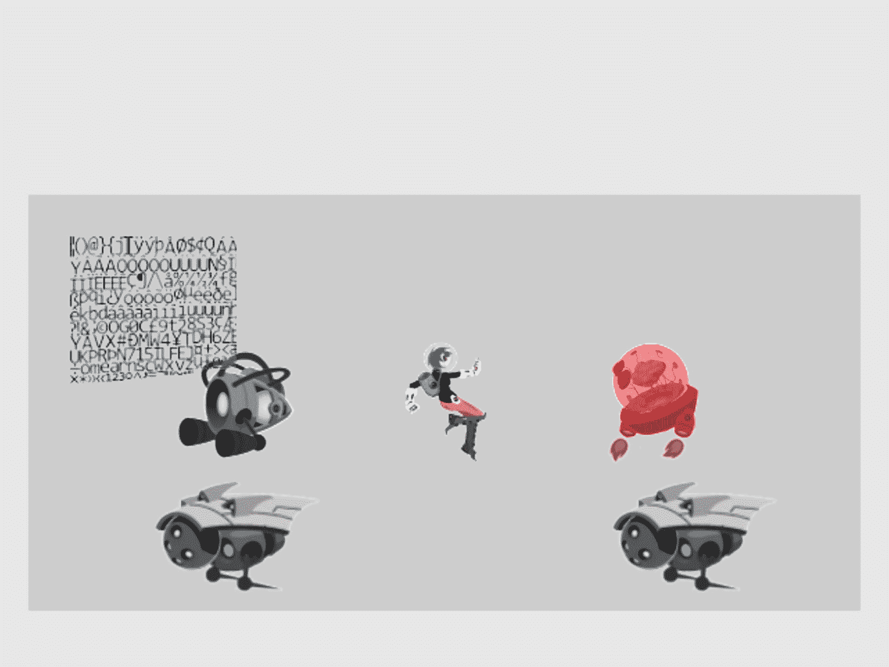

图 5-13

运行精灵动画着色器项目

该项目的控制措施如下:

*   **右箭头键**:向右移动英雄；当穿越右边界时，英雄被绕回到左边界

*   **左箭头键**:右箭头键的反向移动

*   **1 号键**:从右到左连续显示精灵元素

*   **数字键**:动画显示精灵元素从左到右和从右到左连续来回移动

*   **数字键 3**:从左到右连续显示精灵元素

*   **数字键 4**:增加动画速度

*   **数字键 5**:降低动画速度

该项目的目标如下:

*   要了解动画精灵工作表

*   体验精灵动画的制作

*   定义实现精灵动画的抽象

您可以在`assets`文件夹中找到与上一个项目相同的文件。

#### SpriteAnimateRenderable 类

精灵动画可以通过策略性地控制`SpriteRenderable`的 uv 值来实现，以在期望的时间段显示适当的精灵元素。因此，只需要定义一个类`SpriteAnimateRenderable`来支持 sprite 动画。

为了简单和易于理解，以下实现假设与动画相关联的所有 sprite 元素总是沿着同一行组织。例如，在图 5-11 中，长钉的向右收缩和向左伸展运动都是沿一行组织的；两者都不超过一行，也不沿着一列组织。不支持按列组织的动画 sprite 元素。

1.  在`src/engine/renderables`文件夹中创建一个新文件，并将其命名为`sprite_animate_renderable.js`。

2.  为要制作动画的三个不同序列定义枚举数据类型:

```js
// Assumption: first sprite is always the leftmost element.
const eAnimationType = Object.freeze({
    eRight: 0, // from left to right, when ended, start from left again
    eLeft: 1,  // from right animate left-wards,
    eSwing: 2  // left to right, then, right to left
});

```

`eAnimationType`枚举定义了三种动画模式:

1.  定义从`SpriteRenderable`扩展的`SpriteAnimateRenderable`类，并定义构造函数:

1.  从最左边的元素开始，通过沿着同一行向右迭代来制作动画。当到达最后一个元素时，动画会从最左边的元素开始继续播放。

2.  `eLeft`是`eRight`的反转；它从右边开始，向左移动，到达最左边的元素后，从最右边的元素开始继续。

3.  `eSwing`是从左到右再从右到左的连续循环。

```js
class SpriteAnimateRenderable extends SpriteRenderable {
    constructor(myTexture) {
        super(myTexture);
        super._setShader(shaderResources.getSpriteShader());

        // All coordinates are in texture coordinate (UV between 0 to 1)
        // Information on the sprite element
        this.mFirstElmLeft = 0.0; // 0.0 is left corner of image
        this.mElmTop = 1.0;  // image top corner (from SpriteRenderable)
        this.mElmWidth = 1.0;
        this.mElmHeight = 1.0;
        this.mWidthPadding = 0.0;
        this.mNumElems = 1;   // number of elements in an animation

        // per animation settings
        this.mUpdateInterval = 1;   // how often to advance
        this.mAnimationType = eAnimationType.eRight;

        this.mCurrentAnimAdvance = -1;
        this.mCurrentElm = 0;
        this._initAnimation();
    }
    ... implementation to follow ...

```

`SpriteAnimateRenderable`构造函数定义了三组变量:

1.  第一组包括`mFirstElmLeft`、`mElmTop`等等，定义了每个 sprite 元素的位置和尺寸以及动画中元素的数量。当元素按行和列排序时，此信息可用于精确计算每个 sprite 元素的纹理坐标。注意所有坐标都在纹理坐标空间(0 到 1)。

2.  第二组存储关于如何制作动画的信息，左、右或摆动的`mAnimationType`，以及在前进到下一个 sprite 元素之前等待多长时间的`mUpdateInterval`。该信息可以在运行时更改，以反转、循环或控制角色的移动速度。

3.  第三组`mCurrentAnimAdvance`和`mCurrentElm`，描述前进的偏移和当前帧号。这两个变量都是以元素计数为单位的，并不是为游戏程序员设计的，因为它们在内部用于计算下一个要显示的 sprite 元素。

`_initAnimation()`函数计算`mCurrentAnimAdvance`和`mCurrentElm`的值来初始化动画序列。

1.  定义`_initAnimation()`函数，根据当前动画类型计算`mCurrentAnimAdance`和`mCurrentElm`的合适值；

```js
_initAnimation() {
        // Currently running animation
        this.mCurrentTick = 0;
        switch (this.mAnimationType) {
        case eAnimationType.eRight:
            this.mCurrentElm = 0;
            this.mCurrentAnimAdvance = 1; // either 1 or -1
            break;
        case eAnimationType.eSwing:
            this.mCurrentAnimAdvance = -1 * this.mCurrentAnimAdvance;
            this.mCurrentElm += 2 * this.mCurrentAnimAdvance;
            break;
        case eAnimationType.eLeft:
            this.mCurrentElm = this.mNumElems - 1;
            this.mCurrentAnimAdvance = -1; // either 1 or -1
            break;
        }
        this._setSpriteElement();
    }

```

`mCurrentElm`是从最左边偏移的元素数量，`mCurrentAnimAdvance`记录每次更新时`mCurrentElm`偏移量是应该增加(对于向右动画)还是减少(对于向左动画)。调用`_setSpriteElement()`函数来设置与当前识别的 sprite 元素相对应的 uv 值以进行显示。

1.  定义`_setSpriteElement()`函数来计算和加载当前识别的 sprite 元素的 uv 值进行渲染:

```js
_setSpriteElement() {
    let left = this.mFirstElmLeft +
               (this.mCurrentElm * (this.mElmWidth+this.mWidthPadding));
    super.setElementUVCoordinate(left, left + this.mElmWidth,
                           this.mElmTop - this.mElmHeight, this.mElmTop);
}

```

变量`left`是`mCurrentElm`的左 u 值，用于计算右 u 值，假设所有动画序列都沿着子画面元素的同一行，并且顶部和底部的 v 值是恒定的，在给定的动画序列中它们不会改变。这些 uv 值被设置为超类`SpriteRenderable`进行绘制。

1.  定义一个函数来设置动画类型。请注意，当动画类型(左、右或摆动)改变时，动画总是重置为从头开始。

1.  定义一个函数来指定精灵动画序列。该函数的输入以像素为单位，通过除以图像的宽度和高度转换为纹理坐标。

```js
setAnimationType(animationType) {
    this.mAnimationType = animationType;
    this.mCurrentAnimAdvance = -1;
    this.mCurrentElm = 0;
    this._initAnimation();
}

```

1.  定义直接或通过偏移来更改动画速度的函数:

```js
// Always set the leftmost element to be the first
setSpriteSequence(
    topPixel,   // offset from top-left
    leftPixel, // offset from top-left
    elmWidthInPixel,
    elmHeightInPixel,
    numElements,      // number of elements in sequence
    wPaddingInPixel  // left/right padding
) {
    let texInfo = texture.get(this.mTexture);
    // entire image width, height
    let imageW = texInfo.mWidth;
    let imageH = texInfo.mHeight;

    this.mNumElems = numElements;   // number of elements in animation
    this.mFirstElmLeft = leftPixel / imageW;
    this.mElmTop = topPixel / imageH;
    this.mElmWidth = elmWidthInPixel / imageW;
    this.mElmHeight = elmHeightInPixel / imageH;
    this.mWidthPadding = wPaddingInPixel / imageW;
    this._initAnimation();
}

```

1.  为每次游戏循环更新定义一个推进动画的函数:

```js
setAnimationSpeed(tickInterval) {
    this.mUpdateInterval = tickInterval; }
incAnimationSpeed(deltaInterval) {
    this.mUpdateInterval += deltaInterval; }

```

```js
updateAnimation() {
    this.mCurrentTick++;
    if (this.mCurrentTick >= this.mUpdateInterval) {
        this.mCurrentTick = 0;
        this.mCurrentElm += this.mCurrentAnimAdvance;
        if ((this.mCurrentElm>=0) && (this.mCurrentElm<this.mNumElems)) {
            this._setSpriteElement();
        } else {
            this._initAnimation();
        }
    }
}

```

每次调用`updateAnimation()`函数时，`mCurrentTick`计数器递增，当刻度数达到`mUpdateInterval`值时，动画由`_initAnimation()`函数重新初始化。需要注意的是，控制动画的时间单位是`updateAnimation()`函数被调用的次数，而不是真实世界经过的时间。回想一下，引擎`loop.loopOnce()`功能确保系统范围的更新以`kMPF`的间隔发生，即使帧速率滞后。游戏引擎架构确保`updateAnimation()`函数调用相隔`kMPF`毫秒。

1.  最后，记住导出定义的类和枚举的动画类型:

```js
export default SpriteAnimateRenderable;
export {eAnimationType}

```

#### 将新功能导出到客户端

将动画 sprite 元素功能集成到引擎中的最后一步涉及修改引擎访问文件`index.js`。编辑`index.js`并添加以下导入和导出语句，以授予客户端对`SpriteAnimateRenderable`和`eAnimationType:`的访问权限

```js
// renderables
import Renderable from "./renderables/renderable.js";
import SpriteRenderable from "./renderables/sprite_renderable.js";
import SpriteAnimateRenderable from
                            "./renderables/sprite_animate_renderable.js";
import { eTexCoordArrayIndex } from "./renderables/sprite_renderable.js";
import { eAnimationType } from
                            "./renderables/sprite_animate_renderable.js";
... identical to previous code ...

export default {
    ... identical to previous code ...

    // Renderables
    Renderable, TextureRenderable,
    SpriteRenderable, SpriteAnimateRenderable,

    // constants
    eTexCoordArrayIndex, eAnimationType,

    // functions
    init, cleanUp, clearCanvas
}

```

#### 测试精灵动画

对象的测试用例必须展示游戏程序员对动画模式(左、右、摇摆)和速度的控制。`MyGame`对象被修改来完成这些目的。

1.  `MyGame`的构建、加载、卸载和绘制与前面的示例类似，不再重复。

2.  在`init()`函数中，添加代码来创建和初始化步骤 C 和 D 之间的`SpriteAnimateRenderable`对象:

```js
init() {
    ... identical to previous code ...

    // The right minion
    this.mRightMinion = new engine.SpriteAnimateRenderable(
                                   this.kMinionSprite);
    this.mRightMinion.setColor([1, 1, 1, 0]);
    this.mRightMinion.getXform().setPosition(26, 56.5);
    this.mRightMinion.getXform().setSize(4, 3.2);
    this.mRightMinion.setSpriteSequence(
        512, 0,   // first element pixel positions: top: 512 left: 0
        204, 164, // widthxheight in pixels
        5,       // number of elements in this sequence
        0);      // horizontal padding in between
    this.mRightMinion.setAnimationType(engine.eAnimationType.eRight);
    this.mRightMinion.setAnimationSpeed(50);
    // the left minion
    this.mLeftMinion = new engine.SpriteAnimateRenderable(
                                  this.kMinionSprite);
    this.mLeftMinion.setColor([1, 1, 1, 0]);
    this.mLeftMinion.getXform().setPosition(15, 56.5);
    this.mLeftMinion.getXform().setSize(4, 3.2);
    this.mLeftMinion.setSpriteSequence(
        348, 0,   // first element pixel positions: top: 164 left: 0
        204, 164, // widthxheight in pixels
        5,       // number of elements in this sequence
        0);      // horizontal padding in between
    this.mLeftMinion.setAnimationType(engine.eAnimationType.eRight);
    this.mLeftMinion.setAnimationSpeed(50);

    ... identical to previous code ...
}

```

`SpriteAnimateRenderable`对象的创建方式类似于`SpriteRenderable`对象，使用一个 sprite sheet 作为纹理参数。在这种情况下，有必要调用`setSpriteSequence()`函数来识别动画中涉及的元素，包括位置、尺寸和元素总数。

1.  `update()`函数必须调用`SpriteAnimateRenderable`对象的`updateAnimation()`函数来推进精灵动画:

```js
update() {
    ... identical to previous code ...

    // remember to update the minion's animation
    this.mRightMinion.updateAnimation();
    this.mLeftMinion.updateAnimation();

    // Animate left on the sprite sheet
    if (engine.input.isKeyClicked(engine.input.keys.One)) {
        this.mRightMinion.setAnimationType(engine.eAnimationType.eLeft);
        this.mLeftMinion.setAnimationType(engine.eAnimationType.eLeft);
    }

    // swing animation
    if (engine.input.isKeyClicked(engine.input.keys.Two)) {
        this.mRightMinion.setAnimationType(engine.eAnimationType.eSwing);
        this.mLeftMinion.setAnimationType(engine.eAnimationType.eSwing);
    }

    // Animate right on the sprite sheet
    if (engine.input.isKeyClicked(engine.input.keys.Three)) {
        this.mRightMinion.setAnimationType(engine.eAnimationType.eRight);
        this.mLeftMinion.setAnimationType(engine.eAnimationType.eRight);
    }

    // decrease duration of each sprite element to speed up animation
    if (engine.input.isKeyClicked(engine.input.keys.Four)) {
        this.mRightMinion.incAnimationSpeed(-2);
        this.mLeftMinion.incAnimationSpeed(-2);
    }

    // increase duration of each sprite element to slow down animation
    if (engine.input.isKeyClicked(engine.input.keys.Five)) {
        this.mRightMinion.incAnimationSpeed(2);
        this.mLeftMinion.incAnimationSpeed(2);
    }

    ... identical to previous code ...
}

```

按键 1、2 和 3 改变动画类型，按键 4 和 5 改变动画速度。注意，动画速度的极限是游戏循环的更新速率。

## 文本的字体和绘图

许多游戏用于各种任务的一个有价值的工具是文本输出。绘制文本消息是与用户以及开发人员沟通的有效方式。例如，在开发过程中，可以使用文本消息来交流游戏的故事、玩家的分数或调试信息。遗憾的是，WebGL 不支持文本的绘制。本节简单介绍位图字体，并引入`FontRenderable`对象来支持文本的绘制。

### 位图字体

必须定义字体，以便可以提取单个字符来绘制文本消息。顾名思义，位图字体是一个简单的映射，描述了必须打开哪个位(或像素)来表示字体中的字符。将位图字体的所有字符组合成单个图像并定义伴随的解码描述文档为绘制文本输出提供了直接的解决方案。例如，图 5-14 显示了一个位图字体精灵，其中所有已定义的字符都紧密地组织在同一个图像中。图 5-15 是附带的 XML 格式解码描述的片段。

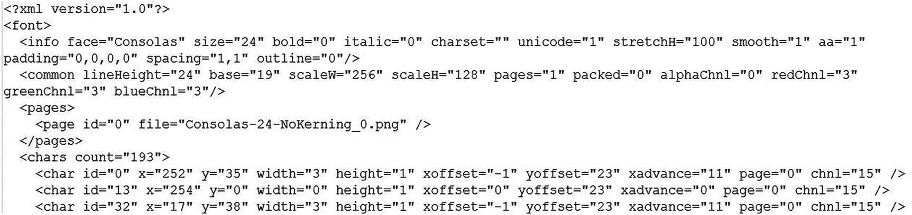

图 5-15

图 5-14 中所示的带有位图字体图像解码信息的 XML 文件片段

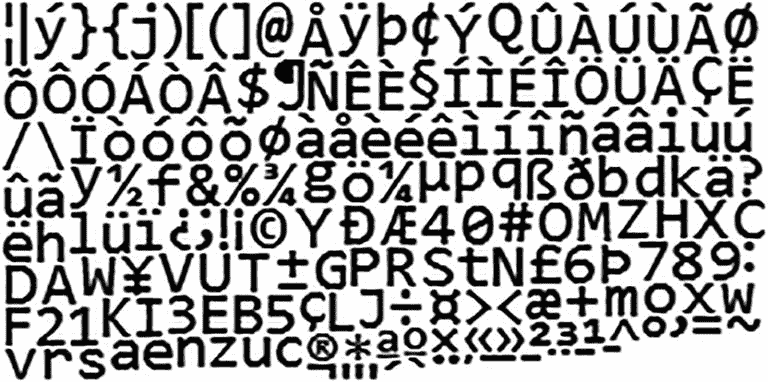

图 5-14

位图字体精灵图像示例

注意，如图 5-15 所示的解码信息唯一定义了图像中每个字符的 uv 坐标位置，如图 5-14 所示。这样，`SpriteRenderable`对象可以直接显示位图字体精灵图像中的单个字符。

Note

有许多位图字体文件格式。本书中使用的格式是 XML 格式的 AngleCode BMFont 兼容字体。BMFont 是一款开源软件，可以将 TrueType、OpenType 等矢量字体转换成位图字体。更多信息见 [`www.angelcode.com/products/bmfont/`](http://www.angelcode.com/products/bmfont/) 。

### 字体支持项目

这个项目演示了如何使用`SpriteRenderable`对象从位图字体中绘制文本。你可以在图 5-16 中看到这个项目运行的例子。这个项目的源代码在`chapter5/5.4.font_support`文件夹中定义。

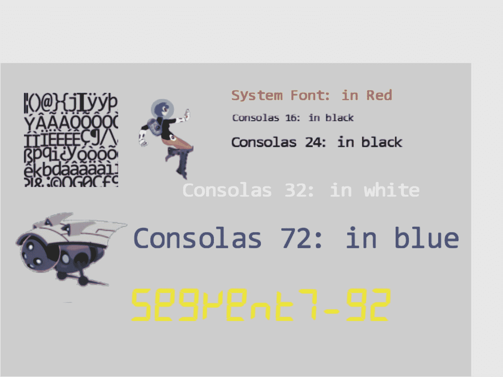

图 5-16

运行字体支持项目

该项目的控制措施如下:

*   **数字键 0、1、2、3** :分别选择 Consolas、16、24、32 或 72 种字体进行尺寸修改。

*   **按住 X/Y 键的同时按向上/向下键**:增加或减少(箭头键)所选字体的宽度(X 键)或高度(Y 键)。

*   **左右箭头键**:向左或向右移动英雄。如果英雄出界，他就结束比赛。

该项目的目标如下:

*   要了解位图字体

*   获得在游戏中绘制文本字符串的基本理解

*   在游戏引擎中实现文本绘制支持

您可以在`assets`文件夹中找到以下外部资源文件:`consolas-72.png`和`minion_sprite.png`。在`assets/fonts`文件夹中是位图字体 sprite 图像文件和包含解码信息的相关 XML 文件:`consolas-16.fnt`、`consolas-16.png`、`consolas-24.fnt`、`consolas-24.png`、`consolas-32.fnt`、`consolas-32.png`、`consolas-72.fnt`、`consolas-72.png`、`segment7-96.fnt`、`segment7-96.png`、`system-default-font.fnt`和`system-default-font.png`。

请注意，`.fnt`和`.png`文件是成对的。前者包含后者的解码信息。这些文件对必须包含在同一文件夹中，以便引擎正确加载字体。`system-default-font`是游戏引擎的默认字体，假设该字体一直存在于`asset/fonts`文件夹中。

Note

从`.fnt`文件中解析、解码和提取角色信息的动作独立于游戏引擎的基本操作。因此，不介绍这些操作的细节。有兴趣的话可以去查阅一下源代码。

#### 在引擎中加载和存储字体

加载字体文件是特殊的，因为字体是成对定义的:包含解码信息的`.fnt`文件和相应的`.png` sprite 图像文件。然而，由于`.fnt`文件是一个 XML 文件，而`.png`文件是一个简单的纹理图像，引擎已经支持这两种类型文件的加载。引擎中加载和存储字体的细节由一个新的引擎组件`font`封装。

1.  在`src/engine/resources`文件夹中创建一个新文件，并将其命名为`font.js`。

2.  从用于加载`.fnt`文件的`xml`模块和用于`.png` sprite 图像文件的`texture`模块中导入资源管理功能，并为这些文件扩展名定义本地常量:

1.  定义一个类，用于存储与角色关联的 uv 坐标位置和大小。该信息可以根据`.fnt`文件的内容进行计算。

```js
import * as xml from "./xml.js";
import * as texture from "./texture.js";

let kDescExt = ".fnt";   // extension for the bitmap font description
let kImageExt = ".png";  // extension for the bitmap font image

```

1.  定义两个函数，根据不带文件扩展名的路径返回正确的扩展名。注意`fontName`是字体文件的路径，但没有任何文件扩展名。例如，`assets/fonts/system-default-font`是字符串，这两个函数标识两个关联的`.fnt`和`.png`文件。

```js
class CharacterInfo {
    constructor() {
        // in texture coordinate (0 to 1) maps to the entire image
        this.mTexCoordLeft = 0;
        this.mTexCoordRight = 1;
        this.mTexCoordBottom = 0;
        this.mTexCoordTop = 0;

        // nominal char size, 1 is "standard width/height" of a char
        this.mCharWidth = 1;
        this.mCharHeight = 1;
        this.mCharWidthOffset = 0;
        this.mCharHeightOffset = 0;

        // reference of char width/height ratio
        this.mCharAspectRatio = 1;
    }
}

```

1.  定义`load()`和`unload()`功能。注意，实际上在每个文件中调用了两个文件操作:一个是针对`.fnt`文件，另一个是针对`.png`文件。

```js
function descName(fontName) { return fontName+kDescExt;}
function imageName(fontName) { return fontName+kImageExt;}

```

1.  定义一个函数来查询给定字体的加载状态:

```js
function load(fontName) {
    xml.load(descName(fontName));
    texture.load(imageName(fontName));
}

function unload(fontName) {
    xml.unload(descName(fontName));
    texture.unload(imageName(fontName));
}

```

1.  定义一个函数，根据`.fnt`文件中的信息计算`CharacterInfo`:

```js
function has(fontName) {
    return texture.has(imageName(fontName)) &&
           xml.has(descName(fontName));
}

```

```js
function getCharInfo(fontName, aChar) {
    ... details omitted for lack of relevancy

    returnInfo = new CharacterInfo();

    // computes and fills in the contents of CharacterInfo
    ... details omitted for lack of relevancy

    return returnInfo;
};

```

省略了给定角色的解码和提取信息的细节，因为它们与游戏引擎实现的其余部分无关。

Note

关于`.fnt`格式的详细信息，请参考 [`www.angelcode.com/products/bmfont/doc/file_format.html`](http://www.angelcode.com/products/bmfont/doc/file_format.html) 。

1.  最后，记住从这个模块导出函数:

```js
export {has, load, unload,
      imageName, descName,
      CharacterInfo,
      getCharInfo
}

```

#### 向引擎添加默认字体

为了游戏程序员的方便，游戏引擎应该提供默认的系统字体。为了实现这一点，应该定义一个引擎实用程序来加载和初始化与游戏开发者共享的默认资源。回想一下，`src/engine/core`文件夹中的`shader_resources`模块被定义为支持引擎范围的着色器共享。可以复制这种模式，以便与客户机共享默认资源。可以在`src/engine/resources`文件夹中定义一个`default_resources`模块来完成这种共享。

1.  在`src/engine/resources`文件夹中创建一个文件，命名为`default_resources.js`，从`font`和`resource_map`模块中导入功能，为默认系统字体的路径定义一个常量字符串及其 getter 函数:

1.  定义一个`init()`函数，在 JavaScript `Promise`中发出默认的系统字体加载请求，并将`Promise`添加到`resource_map`中未完成的加载请求数组中。回想一下，`loop`模块中的`loop.start()`功能在开始游戏循环之前等待所有`resource_map`加载承诺的履行。因此，与所有其他异步加载的资源一样，当游戏循环开始时，默认的系统字体将被正确加载。

```js
import * as font from "./font.js";
import * as map from "../core/resource_map.js";

// Default font
let kDefaultFont = "assets/fonts/system_default_font";
var getDefaultFont = function() { return kDefaultFont; }

```

1.  定义`cleanUp()`函数释放所有分配的资源，在这种情况下，卸载字体:

```js
function init() {
    let loadPromise = new Promise(
      async function (resolve) {
           await Promise.all([
               font.load(kDefaultFont)
           ]);
           resolve();
      }).then(
           function resolve() { /* nothing to do for font */ }
      );
    map.pushPromise(loadPromise);
}

```

1.  最后，记住导出所有已定义的功能:

```js
// unload all resources

function cleanUp() {
    font.unload(kDefaultFont);
}

```

```js
export {
    init, cleanUp,

    // default system font name: this is guaranteed to be loaded
    getDefaultFontName
}

```

#### 定义一个 FontRenderable 对象来绘制文本

定义的`font`模块能够加载字体文件并提取每个字符的 uv 坐标和大小信息。有了这个功能，通过识别字符串中的每个字符，检索相应的纹理映射信息，并使用`SpriteRenderable`对象渲染字符，就可以完成文本字符串的绘制。将定义`FontRenderable`对象来完成这个任务。

1.  在`src/engine/renderables`文件夹中创建一个新文件，并将其命名为`font_renderable.js`。

2.  定义`FontRenderable`类及其构造函数，接受一个字符串作为其参数:

1.  定义`draw()`函数，使用`mOneChar`变量解析并绘制字符串中的每个字符:

1.  `aString`变量是要绘制的消息。

2.  请注意，`FontRenderable`对象不定制`SpriteRenderable`对象的行为。相反，它依靠一个`SpriteRenderable`对象来绘制字符串中的每个字符。因此，`FontRenderable`不是的子类，而是包含了`SpriteRenderable`对象的一个实例，即`mOneChar`变量。

```js
class FontRenderable {
    constructor(aString) {
        this.mFontName = defaultResources.getDefaultFontName();
        this.mOneChar = new SpriteRenderable(
                            font.imageName(this.mFontName));
        this.mXform = new Transform(); // to move this object around
        this.mText = aString;
    }
    ... implementation to follow ...

```

```js
draw(camera) {
    // we will draw the text string by calling mOneChar for each of the
    // chars in the mText string.
    let widthOfOneChar = this.mXform.getWidth() / this.mText.length;
    let heightOfOneChar = this.mXform.getHeight();
    let yPos = this.mXform.getYPos();

    // center position of the first char
    let xPos = this.mXform.getXPos() -
               (widthOfOneChar / 2) + (widthOfOneChar * 0.5);
    let charIndex, aChar, charInfo, xSize, ySize, xOffset, yOffset;
    for (charIndex = 0; charIndex < this.mText.length; charIndex++) {
        aChar = this.mText.charCodeAt(charIndex);
        charInfo = font.getCharInfo(this.mFontName, aChar);

        // set the texture coordinate
        this.mOneChar.setElementUVCoordinate(
            charInfo.mTexCoordLeft, charInfo.mTexCoordRight,
            charInfo.mTexCoordBottom, charInfo.mTexCoordTop);

        // now the size of the char
        xSize = widthOfOneChar * charInfo.mCharWidth;
        ySize = heightOfOneChar * charInfo.mCharHeight;
        this.mOneChar.getXform().setSize(xSize, ySize);

        // how much to offset from the center
        xOffset = widthOfOneChar * charInfo.mCharWidthOffset * 0.5;
        yOffset = heightOfOneChar * charInfo.mCharHeightOffset * 0.5;

        this.mOneChar.getXform().setPosition(xPos-xOffset, yPos-yOffset);

        this.mOneChar.draw(camera);

        xPos += widthOfOneChar;
    }
}

```

每个字符的尺寸由`widthOfOneChar`和`heightOfOneChar`定义，其中宽度就是总的`FontRenderable`宽度除以字符串中的字符数。然后`for`循环执行以下操作:

1.  实现转换的 getters 和 setters、要绘制的文本消息、用于绘制的字体和颜色:

1.  提取字符串中的每个字符

2.  调用`getCharInfo()`函数来接收`charInfo`中角色的 uv 值和大小信息

3.  使用来自`charInfo`的 uv 值来识别`mOneChar`的精灵元素位置(通过调用并将信息传递给`mOneChar.setElementUVCoordinate()`函数)

4.  使用来自`charInfo`的尺寸信息计算角色的实际尺寸(`xSize`和`ySize`)和位置偏移(`xOffset`和`yOffset`)，并使用适当的设置绘制角色`mOneChar`

1.  定义`setTextHeight()`函数来定义要输出的消息的高度:

```js
getXform() { return this.mXform; }
getText() { return this.mText; }

setText(t) {
    this.mText = t;
    this.setTextHeight(this.getXform().getHeight());
}

getFontName() { return this.mFontName; }
setFontName(f) {
    this.mFontName = f;
    this.mOneChar.setTexture(font.imageName(this.mFontName));
}

setColor(c) { this.mOneChar.setColor(c); }
getColor() { return this.mOneChar.getColor(); }

```

```js
setTextHeight(h) {
    let charInfo = font.getCharInfo(this.mFontName, "A".charCodeAt(0));
    let w = h * charInfo.mCharAspectRatio;
    this.getXform().setSize(w * this.mText.length, h);
}

```

请注意，要绘制的整个消息的宽度是根据消息字符串长度自动计算的，并保持字符宽度与高度的纵横比。

1.  最后，记住导出定义的类:

```js
export default FrontRenderable;

```

Note

`FontRenderable`不支持整个消息的旋转。文本消息总是从左向右水平绘制。

#### 初始化、清理和导出字体功能

与所有引擎功能一样，更新引擎访问文件`index.js`以授予游戏开发者访问权限非常重要。在这种情况下，初始化和清理与默认系统字体相关联的资源也很重要。

1.  编辑`index.js`以从`font`和`default_resources`模块和`FontRenderable`类导入功能:

1.  在引擎`init()`和`cleanUp()`函数中添加默认资源初始化和清理:

```js
// resources
import * as audio from "./resources/audio.js";
import * as text from "./resources/text.js";
import * as xml from "./resources/xml.js";
import * as texture from "./resources/texture.js";
import * as font from "./resources/font.js";
import * as defaultResources from "./resources/default_resources.js";

... identical to previous code ...

// renderables
import Renderable from "./renderables/renderable.js";
import SpriteRenderable from "./renderables/sprite_renderable.js";
import SpriteAnimateRenderable from
                     "./renderables/sprite_animate_renderable.js";
import FontRenderable from "./renderables/font_renderable.js";
... identical to previous code ...

```

1.  记住导出新定义的功能:

```js
function init(htmlCanvasID) {
    glSys.init(htmlCanvasID);
    vertexBuffer.init();
    input.init();
    audio.init();
    shaderResources.init();
    defaultResources.init();
}

function cleanUp() {
    loop.cleanUp();
    shaderResources.cleanUp();
    defaultResources.cleanUp();
    audio.cleanUp();
    input.cleanUp();
    vertexBuffer.cleanUp();
    glSys.cleanUp();
}

```

```js
export default {
    // resource support
    audio, text, xml, texture, font, defaultResources,

    ... identical to previous code ...

    // Renderables
    Renderable, TextureRenderable,
    SpriteRenderable, SpriteAnimateRenderable, FontRenderable,

    ... identical to previous code ...
}

```

#### 测试字体

您现在可以修改`MyGame`场景，用`assets`文件夹中的各种字体打印消息:

1.  在`my_game.js`文件中，修改构造函数来定义打印消息的相应变量，并修改`draw()`函数来相应地绘制所有对象。有关代码的详细信息，请参考`src/my_game/my_game.js`文件。

2.  修改`load()`功能以加载纹理和字体。再次注意，字体路径，例如`assets/fonts/consolas-16`，不包括文件扩展名。回想一下，这个路径后面会追加`.fnt`和`.png`，其中会加载两个独立的文件来支持字体的绘制。

1.  修改`unload()`功能，卸载纹理和字体:

```js
load() {
    // Step A: loads the textures
    engine.texture.load(this.kFontImage);
    engine.texture.load(this.kMinionSprite);

    // Step B: loads all the fonts
    engine.font.load(this.kFontCon16);
    engine.font.load(this.kFontCon24);
    engine.font.load(this.kFontCon32);
    engine.font.load(this.kFontCon72);
    engine.font.load(this.kFontSeg96);
}

```

1.  定义一个私有的`_initText()`函数来设置`FontRenderable`对象的颜色、位置和高度。修改`init()`功能，设置正确的 WC 系统并初始化字体。注意对`setFont()`函数的调用，以改变每条消息的字体类型。

```js
unload() {
    engine.texture.unload(this.kFontImage);
    engine.texture.unload(this.kMinionSprite);

    // unload the fonts
    engine.font.unload(this.kFontCon16);
    engine.font.unload(this.kFontCon24);
    engine.font.unload(this.kFontCon32);
    engine.font.unload(this.kFontCon72);
    engine.font.unload(this.kFontSeg96);
}

```

1.  用以下内容修改`update()`功能:

```js
_initText(font, posX, posY, color, textH) {
    font.setColor(color);
    font.getXform().setPosition(posX, posY);
    font.setTextHeight(textH);
}

init() {
    // Step A: set up the cameras
    this.mCamera = new engine.Camera(
      vec2.fromValues(50, 33),    // position of the camera
      100,                        // width of camera
      [0, 0, 600, 400]            // viewport (orgX, orgY, width, height)
    );
    this.mCamera.setBackgroundColor([0.8, 0.8, 0.8, 1]);
    // sets the background to gray

    // Step B: Create the font and minion images using sprite
    this.mFontImage = new engine.SpriteRenderable(this.kFontImage);
    this.mFontImage.setColor([1, 1, 1, 0]);
    this.mFontImage.getXform().setPosition(15, 50);
    this.mFontImage.getXform().setSize(20, 20);

    // The right minion
    this.mMinion = new engine.SpriteAnimateRenderable(
                              this.kMinionSprite);
    this.mMinion.setColor([1, 1, 1, 0]);
    this.mMinion.getXform().setPosition(15, 25);
    this.mMinion.getXform().setSize(24, 19.2);
    this.mMinion.setSpriteSequence(512, 0,  // first element: top, left
        204, 164,    // widthxheight in pixels
        5,           // number of elements in this sequence
        0);          // horizontal padding in between
    this.mMinion.setAnimationType(engine.eAnimationType.eSwing);
    this.mMinion.setAnimationSpeed(15);
    // show each element for mAnimSpeed updates

    // Step D: Create hero object with texture from lower-left corner
    this.mHero = new engine.SpriteRenderable(this.kMinionSprite);
    this.mHero.setColor([1, 1, 1, 0]);
    this.mHero.getXform().setPosition(35, 50);
    this.mHero.getXform().setSize(12, 18);
    this.mHero.setElementPixelPositions(0, 120, 0, 180);

    // Create the fonts
    this.mTextSysFont = new engine.FontRenderable("System Font: in Red");
    this._initText(this.mTextSysFont, 50, 60, [1, 0, 0, 1], 3);

    this.mTextCon16 = new engine.FontRenderable("Consolas 16: in black");
    this.mTextCon16.setFontName(this.kFontCon16);
    this._initText(this.mTextCon16, 50, 55, [0, 0, 0, 1], 2);

    this.mTextCon24 = new engine.FontRenderable("Consolas 24: in black");
    this.mTextCon24.setFontName(this.kFontCon24);
    this._initText(this.mTextCon24, 50, 50, [0, 0, 0, 1], 3);

    this.mTextCon32 = new engine.FontRenderable("Consolas 32: in white");
    this.mTextCon32.setFontName(this.kFontCon32);
    this._initText(this.mTextCon32, 40, 40, [1, 1, 1, 1], 4);

    this.mTextCon72 = new engine.FontRenderable("Consolas 72: in blue");
    this.mTextCon72.setFontName(this.kFontCon72);
    this._initText(this.mTextCon72, 30, 30, [0, 0, 1, 1], 6);

    this.mTextSeg96 = new engine.FontRenderable("Segment7-92");
    this.mTextSeg96.setFontName(this.kFontSeg96);
    this._initText(this.mTextSeg96, 30, 15, [1, 1, 0, 1], 7);

    this.mTextToWork = this.mTextCon16;
}

```

```js
update() {
    ... identical to previous code ...

    // choose which text to work on
    if (engine.input.isKeyClicked(engine.input.keys.Zero)) {
        this.mTextToWork = this.mTextCon16;
    }
    if (engine.input.isKeyClicked(engine.input.keys.One)) {
        this.mTextToWork = this.mTextCon24;
    }
    if (engine.input.isKeyClicked(engine.input.keys.Three)) {
        this.mTextToWork = this.mTextCon32;
    }
    if (engine.input.isKeyClicked(engine.input.keys.Four)) {
        this.mTextToWork = this.mTextCon72;
    }
    let deltaF = 0.005;
    if (engine.input.isKeyPressed(engine.input.keys.Up)) {
        if (engine.input.isKeyPressed(engine.input.keys.X)) {
            this.mTextToWork.getXform().incWidthBy(deltaF);
        }
        if (engine.input.isKeyPressed(engine.input.keys.Y)) {
            this.mTextToWork.getXform().incHeightBy(deltaF);
        }
        this.mTextSysFont.setText(
               this.mTextToWork.getXform().getWidth().toFixed(2) + "x" +
               this.mTextToWork.getXform().getHeight().toFixed(2));
    }

    if (engine.input.isKeyPressed(engine.input.keys.Down)) {
        if (engine.input.isKeyPressed(engine.input.keys.X)) {
            this.mTextToWork.getXform().incWidthBy(-deltaF);
        }
        if (engine.input.isKeyPressed(engine.input.keys.Y)) {
            this.mTextToWork.getXform().incHeightBy(-deltaF);
        }
        this.mTextSysFont.setText(
               this.mTextToWork.getXform().getWidth().toFixed(2) + "x" +
               this.mTextToWork.getXform().getHeight().toFixed(2));
    }
}

```

列出的代码显示您可以在运行时执行以下操作:

1.  根据键盘 0 到 4 的输入选择使用哪个`FontRenderable`对象。

2.  当同时按下左/右箭头键和 X/Y 键时，控制所选`FontRenderable`对象的宽度和高度。

现在，您可以与字体支持项目交互，以修改每个显示的字体消息的大小，并向左和向右移动主角。

## 摘要

在这一章中，你学习了如何在单位方格上粘贴或纹理映射图像，以更好地表现游戏中的物体。您还学习了如何识别图像的选定子区域，以及如何基于标准化范围的纹理坐标系将纹理映射到单位正方形。本章然后解释了精灵表如何减少加载纹理图像所需的时间，同时促进动画的创建。这一知识然后被推广并应用于位图字体的绘制。

纹理映射和子画面渲染的实现利用了游戏引擎架构的一个重要方面:`SimpleShader` / `Renderable`对象对，其中 JavaScript `SimpleShader`对象被定义为与相应的 GLSL 着色器和`Renderable`对象接口，以促进多个对象实例的创建和交互。例如，你创建了`TextureShader`与`TextureVS`和`TextureFS` GLSL 着色器接口，并创建了`TextureRenderable`供游戏程序员使用。对`SpriteShader`和`SpriteRenderable`重复相同的模式。与`SpriteAnimateRenderable`配对的`SpriteShader`对象的经验表明，在适当的时候，同一个着色器对象可以在游戏引擎中支持多种可渲染对象类型。这个`SimpleShader` / `Renderable`对实现模式会在第八章再次出现，当你学习创建 3D 光照效果的时候。

在这一章的开始，你的游戏引擎支持玩家用键盘操作对象，并以不同的大小和方向绘制这些对象。有了本章的功能，您现在可以用有趣的图像来表示这些对象，并在需要时创建这些对象的动画。在下一章中，您将了解如何定义和支持这些对象的行为，包括伪自主行为，如追逐和碰撞检测。

### 游戏设计注意事项

在第四章中，你学习了反应灵敏的游戏反馈对于让玩家感受到与游戏世界的联系是多么重要，这种联系感在游戏设计中被称为*存在感*。当你阅读本书的后续章节时，你会注意到大多数游戏设计最终都是以这样或那样的方式来增强临场感，你会发现视觉设计是临场感最重要的贡献者之一。例如，想象一个游戏，玩家控制的一个物体(也称为*英雄*物体)必须在 2D 平台风格的游戏世界中机动；玩家的目标可能是使用鼠标和键盘在游戏中呈现的各个表面之间跳跃英雄，而不会穿过这些表面之间存在的间隙。环境中英雄和其他物体的视觉表现决定了玩家如何认同游戏设置，进而决定了游戏如何有效地创造临场感:英雄是被表现为一个有生命的生物，还是只是一个像正方形或圆形这样的抽象形状？这些表面是被描绘成建筑物的屋顶、外星球上漂浮的岩石，还是仅仅被描绘成抽象的矩形？在选择视觉表现或游戏设置时，没有正确或错误的答案，但重要的是为所有游戏元素设计一种视觉风格，感觉统一并集成到您选择的任何游戏设置中(例如，如果您的游戏设置是热带雨林，抽象的矩形平台可能会对存在产生负面影响)。

*纹理着色器*项目展示了`.png`透明图像如何比不支持透明的`.jpg`等格式更有效地将游戏元素集成到游戏环境中。如果你向右移动英雄(这里简单地表示为一个矩形)，屏幕上没有任何变化，但是如果你向左移动英雄，你最终会触发一个状态变化，改变显示的视觉元素，就像你在第四章的*场景对象*项目中所做的那样。请注意，当机器人精灵是在灰色背景上透明的`.png`文件时，与它们是在蓝色背景上不透明的`.jpg`图像时相比，它们更有效地融入了游戏场景。

*精灵着色器*项目引入了一个与游戏设置中的其他元素更加匹配的英雄:你已经用一个在风格上与屏幕上的飞行机器人匹配的人形人物替换了*纹理着色器*项目中的矩形，并且矩形英雄图像中未被人形人物占据的区域是透明的。如果您要将 Sprite Shaders 项目中的英雄与*纹理着色器*项目中的屏幕改变动作结合起来，想象一下当英雄向屏幕右侧的机器人移动时，机器人可能会在英雄过于靠近时变红。在这一点上，编码的事件仍然很简单，但是你可以看到视觉设计和一些简单的触发动作已经开始传达游戏设置和增强临场感。

请注意，作为游戏设计者，我们经常迷恋于非常详细和精细的视觉设计，我们开始相信制作最好的游戏需要更高的保真度和更精细的视觉元素；这种对更强大图形的驱动是许多 AAA 游戏参与竞争的熟悉竞赛。虽然游戏体验和存在感在与优秀的艺术指导搭配时确实可以得到相当大的增强，但优秀并不总是需要精心和复杂的。伟大的艺术指导依赖于开发一种统一的视觉语言，其中所有元素相互协调，并有助于推动游戏向前发展，这种协调可以通过任何东西来实现，从 2D 平面中的简单形状和颜色到超真实 3D 环境以及两者之间的任何组合。

向游戏的视觉元素添加动画运动可以进一步增强游戏的真实感，因为动画为游戏带来了电影般的动感，从而进一步将玩家与游戏世界联系起来。在我们的世界中，我们通常以互联系统的形式体验运动；例如，当你穿过房间时，你不只是滑行而不移动身体，而是以不同的方式一起移动身体的不同部分。通过向屏幕上的对象添加有针对性的动画，使这些对象以您可能期望复杂系统移动或动作的方式运行，您可以以更身临其境和令人信服的方式将玩家与游戏世界中正在发生的事情联系起来。*精灵动画*项目演示了动画如何通过让你清晰地表达飞行机器人的尖刺，控制方向和速度来增加存在感。再想象一下把*精灵动画*项目和本章前面的项目结合起来；当英雄靠近机器人时，它可能会先变红，最终触发机器人的动画，并使其靠近或远离玩家。动画通常在游戏设计过程中出现得相当晚，因为通常有必要首先很好地定义游戏机制和其他系统，以避免环境和关卡设计更新时可能需要的耗时的更改。设计师通常在开发的早期阶段使用简单的占位符资产，只有当游戏的所有其他元素都已最终确定时，才添加精致和动画的最终资产，以最大限度地减少返工的需要。

就像视觉设计一样，动画方法不需要复杂就能有效。虽然动画需要有意识的和统一的，并且应该感觉流畅，没有口吃，除非它是有意设计的，但在如何在屏幕上表现运动方面可以采用很大程度的艺术许可。

*字体支持*项目向你介绍游戏字体。虽然字体很少对游戏有直接影响，但它们可以对存在感产生巨大影响。字体是视觉交流的一种形式，字体的风格通常和它所传达的文字一样重要，可以支持或削弱游戏的设置和视觉风格。特别注意这个项目中显示的字体，注意黄色字体如何传达一种与科幻小说启发的英雄和机器人的视觉风格相匹配的数字感觉，而 Consolas 字体家族及其圆形字体与这个游戏设置有点格格不入(尽管游戏设置可能仍然稀疏)。作为一个更极端的例子，想象一下在一个发生在宇宙飞船上的未来主义游戏中，一种流畅的书法字体(通常用于高幻想游戏中的类型)会出现怎样的不连贯。

有多少人和想法，游戏就有多少视觉风格的可能性，伟大的游戏可以采用极其简单的图形。请记住，优秀的游戏设计是九个要素的组合(如果你需要刷新你的记忆，请回到引言)，作为一个游戏设计师，要记住的最重要的事情是保持专注于这些要素中的每一个如何与其他要素协调并提升其他要素，以创造出大于其部分总和的东西。