# 八、实现照明和阴影

完成本章后，您将能够

*   了解简单照明模型的参数

*   定义使用多个光源的基础设施支持

*   理解漫反射和法线贴图的基础

*   了解镜面反射和 Phong 照明模型的基础知识

*   实现 GLSL 着色器来模拟漫反射和镜面反射以及 Phong 照明模型

*   创建和操纵点光源、平行光源和聚光灯

*   使用 WebGL 模具缓冲区模拟阴影

## 介绍

到目前为止，在游戏引擎中，你已经实现了大部分功能模块，以提供许多类型的 2D 游戏所需的基础。也就是说，你已经开发了引擎组件和工具类，它们被设计成直接支持实际的游戏性。这是一个很好的方法，因为它允许你系统地扩展引擎的能力，以支持更多类型的游戏和玩法。例如，到目前为止，你可以实现各种不同的游戏，包括益智游戏，自上而下的空间射击游戏，甚至简单的平台游戏。

照明模型或照明模型是一种数学公式，它基于场景中表面反射的近似光能来描述场景的颜色和亮度。在这一章中，你将实现一个照明模型，它间接影响你的游戏引擎可以支持的游戏类型和可以达到的视觉逼真度。这是因为来自游戏引擎的照明支持可以不仅仅是简单的美学效果。当创造性地应用时，照明可以增强游戏性或者为你的游戏提供一个戏剧性的场景。例如，您可以有一个场景，用手电筒照亮英雄的黑暗道路，手电筒闪烁以向玩家传达不安或危险的感觉。此外，虽然照明模型基于物理世界中的灯光行为，但在您的游戏实现中，照明模型允许超现实或物理上不可能的设置，例如显示明亮或彩虹色的过饱和光源，甚至是吸收周围可见光能量的负光源。

当实现游戏引擎中常见的照明模型时，您将需要尝试 3D 空间中的概念来正确模拟光线。因此，必须为光源指定第三维或深度，以将光能投射到游戏对象或`Renderable`对象上，它们是平面 2D 几何体。一旦考虑了 3D 概念，实现照明模型的任务就变得简单多了，并且您可以应用计算机图形学的知识来适当地照亮场景。

一个简化的 Phong 光照模型将被导出并实现，它是专门为你的游戏引擎的 2D 方面而设计的。然而，照明模型的原理保持不变。如果您需要更多信息或对 Phong 照明模型的进一步深入分析，请参考第 [1](01.html) 章的推荐参考书。

## 照明和 GLSL 实施概述

一般来说，照明模型是一个或一组数学方程，描述人类如何观察环境中光与物体材料的相互作用。正如你所想象的，一个基于物理世界的精确的照明模型可能非常复杂，计算量也很大。Phong 照明模型用一个可以有效实现的相对简单的方程捕捉了光/材料相互作用的许多有趣方面。本章中的项目按以下顺序指导您理解 Phong 照明模型的基本元素:

*   **环境光**:在没有明确光源的情况下查看灯光效果

*   **光源**:检测单个光源的照明效果

*   **多光源**:开发游戏引擎基础设施以支持多光源

*   **漫反射和法线贴图**:模拟粗糙或漫反射表面的光反射

*   **镜面光和材质**:模拟从发光表面反射并到达相机的光

*   **光源类型**:根据不同类型的光源引入照明

*   **阴影**:近似光线被阻挡的结果

总的来说，这一章中的项目为你的游戏增加了视觉上的复杂性。为了正确地渲染和显示照明的结果，必须对每个受影响的像素执行相关的计算。回想一下，GLSL 片段着色器负责计算每个像素的颜色。这样，Phong 照明模型的每个基本元素都可以作为现有或新的 GLSL 片段着色器的附加功能来实现。在本章的所有项目中，你将从使用 GLSL 片段着色器开始。

## 背景光

环境光，通常称为背景光，允许您在没有明确光源的情况下看到环境中的对象。例如，在黑夜中，即使所有的灯都关了，你也能看到房间里的物体。在现实世界中，来自窗户、门下或背景的光线会为你照亮房间。背景光照明的真实模拟，通常称为间接照明，在算法上是复杂的，并且在计算上是昂贵的。相反，在计算机图形和大多数 2D 游戏中，环境照明是通过给当前场景或世界中的每个对象添加一种恒定的颜色或环境光来实现的。值得注意的是，虽然环境照明可以提供所需的结果，但这只是一个粗略的近似值，并不能模拟真实世界的间接照明。

### 全球环境项目

这个项目演示了如何通过为绘制每个`Renderable`对象定义一个全局环境颜色和一个全局环境亮度来实现场景中的环境照明。你可以在图 [8-1](#Fig1) 中看到这个项目运行的例子。这个项目的源代码位于`chapter8/8.1.global_ambient`文件夹中。

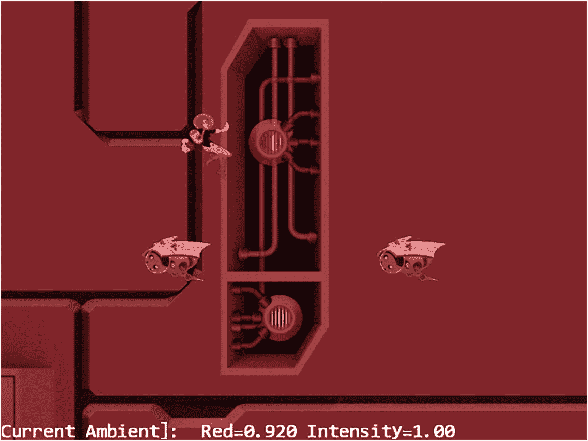

图 8-1

运行全局环境项目

该项目的控制措施如下:

*   **鼠标左键**:增加全局红色环境

*   **鼠标中键**:降低全局红色环境

*   **左/右箭头键**:降低/增加全局环境亮度

该项目的目标如下:

*   体验环境照明的效果

*   为了理解如何在场景中实现简单的全局环境照明

*   用`SimpleShader` / `Renderable`对结构重新熟悉自己，以连接 GLSL 着色器和游戏引擎

您可以在`assets`文件夹中找到以下外部资源。`fonts`文件夹包含默认的系统字体和两个纹理图像:`minion_sprite.png`，它定义了英雄和奴才的精灵元素，以及`bg.png`，它定义了背景。

#### 修改 GLSL 着色器

为游戏引擎实现新的着色器或着色功能时，一个很好的起点是 GLSL 着色器。GLSL 代码的创建或修改允许您实现实际的功能细节，这反过来又作为扩展引擎的需求。例如，在本项目中，您将首先向所有现有的 GLSL 着色器添加环境照明功能。对这个新增加的功能的支持变成了指导引擎其余部分修改的需求。对于本章中的所有示例，您都将观察到这种实现模式。因此，首先，将全局环境整合到你的`simple_fs.glsl`中。

1.  通过定义两个新的统一变量`uGlobalAmbientColor`和`uGlobalAmbientIntensity`来修改片段着色器`simple_fs.glsl`，并在计算每个像素的最终颜色时将这些变量与`uPixelColor`相乘:

1.  类似地，通过添加`uniform`变量`uGlobalAmbientColor`和`uGlobalAmbientIntensity`来修改纹理片段着色器`texture_fs.glsl`。将这两个变量与采样纹理颜色相乘，以创建背景照明效果。

```js
precision mediump float;

// Color of pixel
uniform vec4 uPixelColor;
uniform vec4 uGlobalAmbientColor;  // this is shared globally
uniform float uGlobalAmbientIntensity;  // this is shared globally

void main(void) {
    // for every pixel called sets to the user specified color
    gl_FragColor = uPixelColor * uGlobalAmbientIntensity *
                                 uGlobalAmbientColor;
}

```

```js
uniform sampler2D uSampler;

// Color of pixel
uniform vec4 uPixelColor;
uniform vec4 uGlobalAmbientColor;  // this is shared globally
uniform float uGlobalAmbientIntensity;  // this is shared globally

varying vec2 vTexCoord;

void main(void)  {
    // texel color look up based on interpolated UV value in vTexCoord
    vec4 c = texture2D(uSampler, vec2(vTexCoord.s, vTexCoord.t));
    c = c * uGlobalAmbientIntensity * uGlobalAmbientColor;

    ... identical to previous code ...
}

```

#### 定义为全球共享资源

环境照明影响整个场景，因此，相关的变量必须是全局的和共享的。在这种情况下，两个变量，一个颜色(环境颜色)和一个浮点(颜色的强度)，对于引擎的其余部分和客户端应该是全局可访问的。`defaultResources`模块非常适合这一目的。编辑`src/engine/resources/default_resources.js`文件，定义颜色和亮度变量，以及它们对应的 getters 和 setters，记住要导出功能。

```js
import * as font from "./font.js";
import * as map from "../core/resource_map.js";

// Global Ambient color
let mGlobalAmbientColor = [0.3, 0.3, 0.3, 1];
let mGlobalAmbientIntensity = 1;
function getGlobalAmbientIntensity() { return mGlobalAmbientIntensity; }
function setGlobalAmbientIntensity(v) { mGlobalAmbientIntensity = v; }
function getGlobalAmbientColor() { return mGlobalAmbientColor; }
function setGlobalAmbientColor(v) {
    mGlobalAmbientColor = vec4.fromValues(v[0], v[1], v[2], v[3]); }

... identical to previous code ...

export {
    init, cleanUp,

    // default system font name: this is guaranteed to be loaded
    getDefaultFontName,

    // Global ambient: intensity and color
    getGlobalAmbientColor, setGlobalAmbientColor,
    getGlobalAmbientIntensity, setGlobalAmbientIntensity
}

```

#### 修改简单着色器

现在在 GLSL 着色器中实现了全局环境颜色和强度，您需要修改游戏引擎的其余部分来支持新定义的功能。回想一下，`simple_fs.glsl`被`SimpleShader`类引用，而`texture_fs.glsl`被`TextureShader`类引用。由于`TextureShader`是`SimpleShader`的子类，在`texture_fs.glsl`中新定义的 GLSL 功能将通过适当的`SimpleShader`修改得到支持。

1.  修改`src/engine/shaders`文件夹中的`simple_shader.js`文件，从`defaultResources`模块导入，用于访问全局环境光效果变量:

1.  在构造函数中定义两个新的实例变量，用于存储 GLSL 着色器中环境颜色和强度变量的引用或位置:

```js
import * as defaultResources from "../resources/default_resources.js";

```

1.  在`SimpleShader`构造函数的步骤 E 中，调用 WebGL `getUniformLocation()`函数来查询并存储环境颜色和强度的统一变量在 GLSL 着色器中的位置:

```js
this.mGlobalAmbientColorRef = null;
this.mGlobalAmbientIntensityRef = null;

```

1.  在`activate()`函数中，从`defaultResources`模块中检索全局环境颜色和强度值，并传递给 GLSL 着色器中相应的统一变量。请注意用于设置统一变量的特定于数据类型的 WebGL 函数名。你大概能猜到，`uniform4fv`对应的是`vec4`，是颜色存储，`uniform1f`对应的是浮动，是强度。

```js
// Step E: Gets references to the uniform variables
this.mPixelColorRef = gl.getUniformLocation(
                                    this.mCompiledShader, "uPixelColor");
this.mModelMatrixRef = gl.getUniformLocation(
                              this.mCompiledShader, "uModelXformMatrix");
this.mCameraMatrixRef = gl.getUniformLocation(
                             this.mCompiledShader, "uCameraXformMatrix");
this.mGlobalAmbientColorRef = gl.getUniformLocation(
                            this.mCompiledShader, "uGlobalAmbientColor");
this.mGlobalAmbientIntensityRef = gl.getUniformLocation(
                        this.mCompiledShader, "uGlobalAmbientIntensity");

```

```js
activate(pixelColor, trsMatrix, cameraMatrix) {
    let gl = glSys.get();

    ... identical to previous code ...

    // load uniforms
    gl.uniformMatrix4fv(this.mCameraMatrixRef, false, cameraMatrix);
    gl.uniform4fv(this.mGlobalAmbientColorRef,
                  defaultResources.getGlobalAmbientColor());
    gl.uniform1f(this.mGlobalAmbientIntensityRef,
                 defaultResources.getGlobalAmbientIntensity());
}

```

#### 测试环境照明

现在可以定义`MyGame`类来验证新定义的环境照明效果的正确性。预计到测试中即将到来的复杂性，`MyGame`类源代码将被分成多个文件，类似于你在第 [7](07.html) 章中使用`Camera`类的经历。所有实现`MyGame`的文件都有一个以`my_game`开头的名字，并以文件中定义的相关功能的指示结束。例如，在后面的示例中，`my_game_light.js`表示文件实现了光源相关的逻辑。对于本项目，类似于`Camera`类命名方案，`MyGame`类的基本功能将在`my_game_main.js`中实现，访问将通过文件`my_game.js`进行。

1.  在`src/my_game`中创建`MyGame`类访问文件。现在，`MyGame`功能应该从基类实现文件`my_game_main.js`中导入。有了对`MyGame`类的完全访问权，在这个文件中定义网页`onload()`函数就很方便了。

1.  创建`my_game_main.js`；从引擎访问文件`index.js`导入，从`Hero`和`Minion`导入；并且记得导出`MyGame`功能。现在，和前面所有的例子一样，用将实例变量初始化为`null`的`constructor`将`MyGame`定义为`engine.Scene`的子类。

```js
import engine from "../engine/index.js";
import MyGame from "./my_game_main.js";

window.onload = function () {
    engine.init("GLCanvas");

    let myGame = new MyGame();
    myGame.start();
}

```

1.  加载和卸载背景和爪牙:

```js
import engine from "../engine/index.js";

// user stuff
import Hero from "./objects/hero.js";
import Minion from "./objects/minion.js";

class MyGame extends engine.Scene {
    constructor() {
        super();
        this.kMinionSprite = "assets/minion_sprite.png";
        this.kBg = "assets/bg.png";

        // The camera to view the scene
        this.mCamera = null;
        this.mBg = null;

        this.mMsg = null;

        // the hero and the support objects
        this.mHero = null;
        this.mLMinion = null;
        this.mRMinion = null;
    }

    ... implementation to follow ...

}

export default MyGame;

```

1.  用相应的值初始化相机和场景对象，以确保启动时的正确场景视图。请注意场景中的简单元素，相机，大背景，a `Hero`，左右`Minion`对象，以及状态消息。

```js
load() {
    engine.texture.load(this.kMinionSprite);
    engine.texture.load(this.kBg);
}

unload() {
    engine.texture.unload(this.kMinionSprite);
    engine.texture.unload(this.kBg);
}

```

1.  定义`draw()`功能。像往常一样，最后绘制状态消息，这样它就不会被任何其他对象覆盖。

```js
init() {
    // Step A: set up the cameras
    this.mCamera = new engine.Camera(
       vec2.fromValues(50, 37.5), // position of the camera
       100,                       // width of camera
       [0, 0, 640, 480]           // viewport (orgX, orgY, width, height)
    );
    this.mCamera.setBackgroundColor([0.8, 0.8, 0.8, 1]);
    // sets the background to gray

    let bgR = new engine.SpriteRenderable(this.kBg);
    bgR.setElementPixelPositions(0, 1900, 0, 1000);
    bgR.getXform().setSize(190, 100);
    bgR.getXform().setPosition(50, 35);
    this.mBg = new engine.GameObject(bgR);

    this.mHero = new Hero(this.kMinionSprite);

    this.mLMinion = new Minion(this.kMinionSprite, 30, 30);
    this.mRMinion = new Minion(this.kMinionSprite, 70, 30);

    this.mMsg = new engine.FontRenderable("Status Message");
    this.mMsg.setColor([1, 1, 1, 1]);
    this.mMsg.getXform().setPosition(1, 2);
    this.mMsg.setTextHeight(3);
}

```

1.  最后，实现`update()`函数来更新所有对象，并接收对全局环境颜色和强度的控制:

```js
draw() {
    // Clear the canvas
    engine.clearCanvas([0.9, 0.9, 0.9, 1.0]); // clear to light gray

    // Set up the camera and draw
    this.mCamera.setViewAndCameraMatrix();
    this.mBg.draw(this.mCamera);
    this.mHero.draw(this.mCamera);
    this.mLMinion.draw(this.mCamera);
    this.mRMinion.draw(this.mCamera);

    this.mMsg.draw(this.mCamera);   // draw last
}

```

```js
update() {
    let deltaAmbient = 0.01;
    let msg = "Current Ambient]: ";

    this.mCamera.update();  // ensure proper interpolated movement
    this.mLMinion.update(); // ensure sprite animation
    this.mRMinion.update();
    this.mHero.update();  // allow keyboard control to move
    this.mCamera.panWith(this.mHero.getXform(), 0.8);

    let v = engine.defaultResources.getGlobalAmbientColor();
    if (engine.input.isButtonPressed(engine.input.eMouseButton.eLeft))
        v[0] += deltaAmbient;

    if (engine.input.isButtonPressed(engine.input.eMouseButton.eMiddle))
        v[0] -= deltaAmbient;

    if (engine.input.isKeyPressed(engine.input.keys.Left))
        engine.defaultResources.setGlobalAmbientIntensity(
               engine.defaultResources.getGlobalAmbientIntensity() –
                                                      deltaAmbient);

    if (engine.input.isKeyPressed(engine.input.keys.Right))
        engine.defaultResources.setGlobalAmbientIntensity(
               engine.defaultResources.getGlobalAmbientIntensity() +
                                                      deltaAmbient);

    msg += " Red=" + v[0].toPrecision(3) + " Intensity=" +
      engine.defaultResources.getGlobalAmbientIntensity().toPrecision(3);
    this.mMsg.setText(msg);
}

```

#### 观察

您现在可以运行项目并观察结果。请注意，初始场景是黑暗的。这是因为全局环境颜色的 RGB 值都被初始化为 0.3。由于环境颜色乘以从纹理中采样的颜色，因此结果类似于在整个场景中应用暗色。如果 RGB 值设置为 1.0，强度设置为 0.3，可以实现相同的效果，因为这两组值只是简单地相乘。

在移动到下一个项目之前，尝试摆弄环境红色通道和环境强度，以观察它们对场景的影响。通过按右箭头键，您可以增加整个场景的亮度，并使所有对象更加可见。继续此增量，观察当强度达到超过 15.0 的值时，场景中的所有颜色都向白色收敛或开始过饱和。没有适当的背景，过饱和会分散注意力。然而，同样正确的是，在选择性对象上策略性地创建过饱和可以用于指示重要事件，例如触发陷阱。下一节将介绍如何创建和引导光源来照亮选定的对象。

## 光源

检查你的周围环境，你可以观察到许多类型的光源，例如，你的台灯，来自太阳的光线，或者一个孤立的灯泡。孤立的灯泡可以描述为向所有方向均匀发光的点或点光源。点光源是你开始分析光源的地方。

基本上，点光源照亮指定点周围的区域或半径。在 3D 空间中，这个照明区域只是一个球体，称为照明体积。点光源的照明体积由光源的位置或球体的中心以及光源照明的距离或球体的半径来定义。为了观察光源的效果，物体必须存在并且在照明体积内。

正如本章介绍中提到的，2D 引擎将需要冒险进入第三维度，以正确模拟光能的传播。现在，考虑你的 2D 发动机；到目前为止，你已经实现了一个系统，其中一切都在 2D。另一种方法是解释引擎在 z = 0 的单个平面上定义和呈现所有内容，对象按绘制顺序分层。在此系统中，您将添加 3D 光源。

要观察光源的效果，其照明体积必须与定义对象的 XY 平面上的对象重叠。图 [8-2](#Fig2) 显示了位于 z = 10 的简单点光源与 z = 0 的平面相交产生的照明体积。这种相交会在平面上产生一个被照亮的圆。下一个项目实现了图 [8-2](#Fig2) ，在这里你将使用面向对象的方法检查光源，同时坚持灯光如何照亮场景的预期。这可以通过定义一个`Light`对象来表示光源来实现。

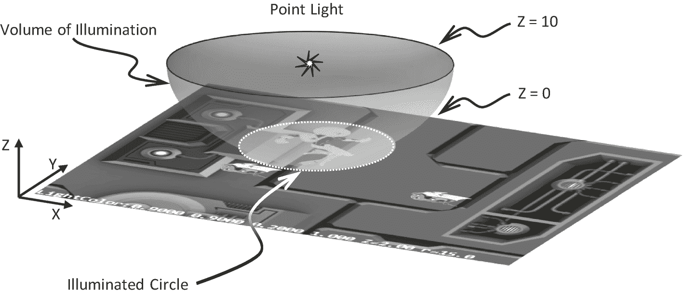

图 8-2

点光源和相应的 3D 照明体积

### GLSL 实现并集成到游戏引擎中

回想一下，引擎通过`SimpleShader` / `Renderable`对的相应子类连接到 GLSL 着色器。`SimpleShader`及其子类与 GLSL 着色器和`Renderable`接口，其子类为程序员提供了操作具有相同着色器类型的几何图形的许多副本的便利。例如，`texture_vs.glsl`和`texture_fs.glsl`通过`TextureShader`对象连接到游戏引擎，而`TextureRenderable`对象允许游戏程序员创建和操作由`texture_vs` / `fs`着色器着色的几何图形的多个实例。图 [8-3](#Fig3) 描绘了下一个项目扩展该架构以实现点光源照明。类封装了点光源的属性，包括位置、半径和颜色。该信息通过`LightShader` / `LightRenderable`对转发给 GLSL 片段着色器`light_fs`，用于计算适当的像素颜色。GLSL 顶点着色器`texture_vs`被重用，因为光源照明涉及到在每个顶点处理的相同信息。

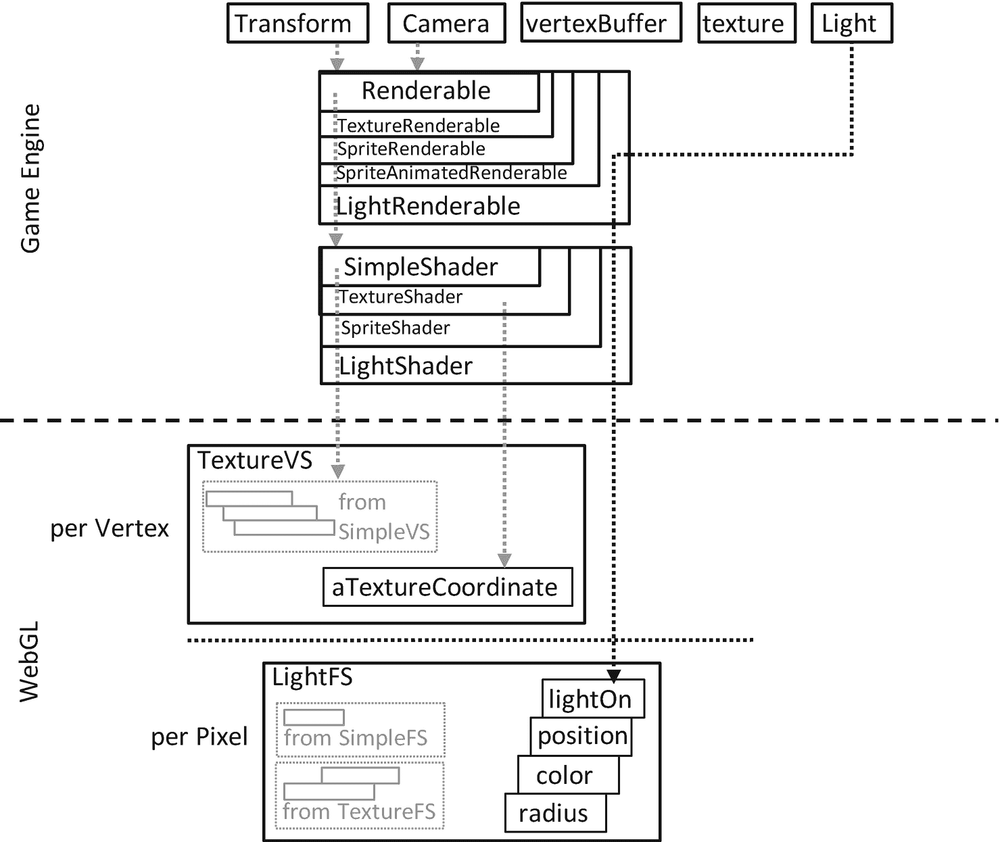

图 8-3

灯光阴影/可渲染灯光对和相应的 GLSL 灯光阴影

最后，重要的是要记住，GLSL 片段着色器会为相应几何体覆盖的每个像素调用一次。这意味着您将要创建的 GLSL 片段着色器将在每帧中被调用多次，可能在几十万甚至几百万的范围内。考虑到游戏循环以实时速率启动重绘，或者大约每秒 60 帧重绘，GLSL 碎片着色器每秒将被调用数百万次！实现的效率对于流畅的体验很重要。

### 简单灯光着色器项目

这个项目演示了如何实现和照明一个简单的点光源。你可以在图 [8-4](#Fig4) 中看到这个项目运行的例子。这个项目的源代码位于`chapter8/8.2.simple_light_shader`文件夹中。

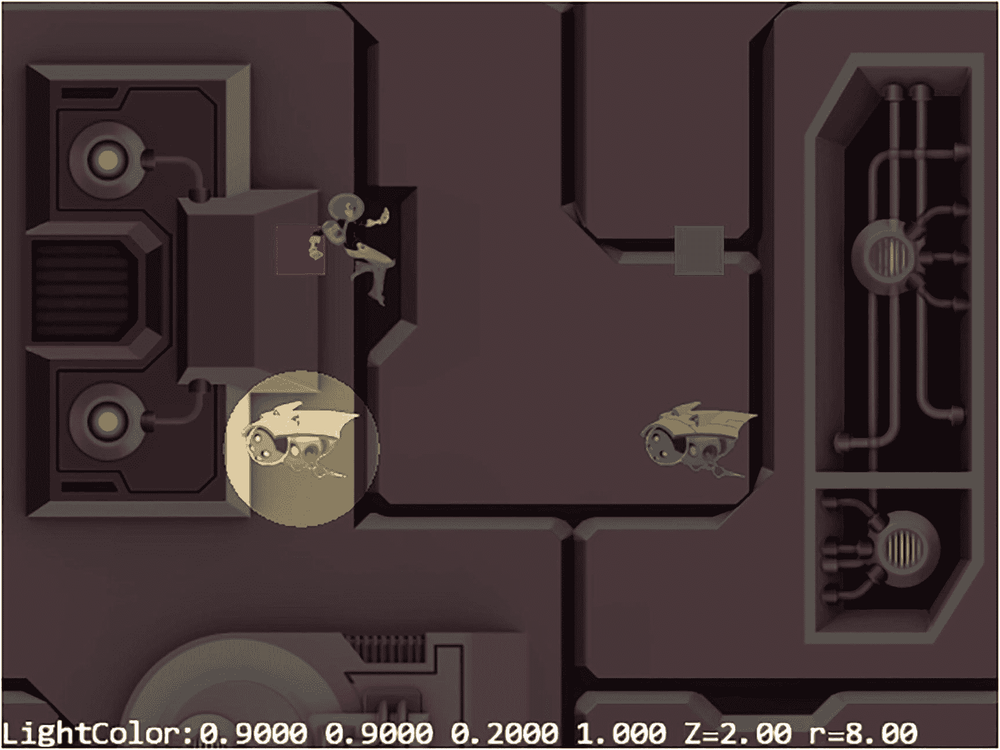

图 8-4

运行简单灯光着色器项目

该项目的控制措施如下:

*   **WASD 键**:移动屏幕上的英雄角色

*   **WASD 键+鼠标左键**:在屏幕上移动英雄人物和光源

*   **左/右箭头键**:减弱/增强光线强度

*   **Z/X 键**:增加/减少灯的 Z 位置

*   **C/V 键**:增大/减小光线半径

该项目的目标如下:

*   了解如何模拟点光源的照明效果

*   观察点光源照明

*   实现支持点光源照明的 GLSL 着色器

#### 创建 GLSL 灯光片段着色器

与前一节一样，实现将从 GLSL 着色器开始。没有必要定义一个新的 GLSL 顶点着色器，因为所涉及的每顶点信息和计算与`texture_vs`相同。必须定义一个新的 GLSL 片段着色器来计算照亮的圆。

1.  在`src/glsl_shaders`文件夹中，创建一个新文件并将其命名为`light_fs.glsl`。

2.  参考`texture_fs.glsl`并复制所有统一和变化的变量。这是重要的一步，因为`light_fs`片段着色器将通过`LightShader`类与游戏引擎接口。反过来，`LightShader`类将被实现为`TextureShader`的子类，这里假设存在这些变量。

1.  现在，定义支持点光源的变量:开/关开关、颜色、位置和半径。需要注意的是，位置和半径是以像素为单位的。

```js
precision mediump float;

// The object that fetches data from texture.
// Must be set outside the shader.
uniform sampler2D uSampler;

// Color of pixel
uniform vec4 uPixelColor;
uniform vec4 uGlobalAmbientColor; // this is shared globally
uniform float uGlobalAmbientIntensity;

// "varying" keyword signifies that the texture coordinate will be
// interpolated and thus varies.
varying vec2 vTexCoord;

... implementation to follow ...

```

1.  按如下方式在`main()`功能中实现灯光照明:
    1.  步骤 A，采样纹理颜色并应用环境颜色和强度。

    2.  步骤 B，进行光源照明。这是通过确定是否需要计算来实现的——测试灯光是否打开以及像素是否不透明。如果两者都是有利的，则将光位置和当前像素之间的距离与光半径进行比较，以确定像素是否在照明体积内。注意`gl_FragCord.xyz`是当前像素位置的 GLSL 定义变量，并且该计算假设像素空间单位。当所有条件都有利时，光的颜色累积到最终结果。

    3.  最后一步是应用色调，并通过`gl_FragColor`设置最终颜色。

```js
// Light information
uniform bool uLightOn;
uniform vec4 uLightColor;
uniform vec3 uLightPosition;   // in pixel space!
uniform float uLightRadius;    // in pixel space!

```

```js
void main(void)  {
    // Step A: sample the texture and apply ambient
    vec4 textureMapColor = texture2D(uSampler,
                                     vec2(vTexCoord.s, vTexCoord.t));
    vec4 lgtResults = uGlobalAmbientIntensity * uGlobalAmbientColor;

    // Step B:  decide if the light should illuminate
    if (uLightOn && (textureMapColor.a > 0.0)) {
        float dist = length(uLightPosition.xyz - gl_FragCoord.xyz);
        if (dist <= uLightRadius)
            lgtResults += uLightColor;
    }
    lgtResults *= textureMapColor;

    // Step C: tint texture leave transparent area defined by texture
    vec3 r = vec3(lgtResults) * (1.0-uPixelColor.a) +
             vec3(uPixelColor) * uPixelColor.a;
    vec4 result = vec4(r, textureMapColor.a);

    gl_FragColor = result;
}

```

#### 定义轻类

定义了 GLSL `light_fs`着色器后，现在可以定义一个类来封装游戏引擎的点光源:

1.  在`src/engine`文件夹中新建一个`lights`文件夹。在`lights`文件夹中，添加一个新文件，命名为`lights.js`。

2.  编辑`lights.js`创建`Light`类，定义`constructor`初始化灯光颜色、位置、半径和开/关状态。记得导出类。

1.  为实例变量定义 getters 和 setters:

```js
class Light {

    constructor() {
        this.mColor = vec4.fromValues(0.1, 0.1, 0.1, 1);  // light color
        this.mPosition = vec3.fromValues(0, 0, 5); // WC light position
        this.mRadius = 10;  // effective radius in WC
        this.mIsOn = true;
    }

    ... implementation to follow ...

}
export default Light;

```

```js
// simple setters and getters
setColor(c) { this.mColor = vec4.clone(c); }
getColor() { return this.mColor; }

set2DPosition(p) {
    this.mPosition = vec3.fromValues(p[0], p[1], this.mPosition[2]); }
setXPos(x) { this.mPosition[0] = x; }
setYPos(y) { this.mPosition[1] = y; }
setZPos(z) { this.mPosition[2] = z; }
getPosition() { return this.mPosition; }

setRadius(r) { this.mRadius = r; }
getRadius() { return this.mRadius; }

setLightTo(isOn) { this.mIsOn = isOn; }
isLightOn() { return this.mIsOn; }

```

最后，记得更新引擎访问文件`index.js`，以便将新定义的功能转发给客户端。

#### 定义 LightShader 类

`LightShader`类继承了`SpriteShader`类，封装了特定于在`light_fs`片段着色器中为点光源定义的统一变量的值的通信。这样，`LightShader`类可以作为 GLSL 片段着色器的一个方便的接口。

1.  在`src/engine/shaders`文件夹中，创建一个新文件并将其命名为`light_shader.js`。

2.  将`LightShader`类定义为`SpriteShader`的子类。在构造函数中，定义必要的变量来支持将与点光源相关的信息发送到`light_fs`片段着色器。引擎中的点光源信息存储在`mLight`中，而对`Camera`的引用对于将所有信息从 WC 转换到像素空间非常重要。构造函数的最后四行查询获取`light_fs`中统一变量的引用位置。不要忘记导出类。

1.  定义一个简单的 setter 函数，将灯光和摄影机与着色器相关联:

```js
import SpriteShader from "./sprite_shader.js";
import * as glSys from "../core/gl.js";

class LightShader extends SpriteShader {
    constructor(vertexShaderPath, fragmentShaderPath) {
        // Call super class constructor
        super(vertexShaderPath, fragmentShaderPath);

        // glsl uniform position references
        this.mColorRef = null;
        this.mPosRef = null;
        this.mRadiusRef = null;
        this.mIsOnRef = null;

        this.mLight = null;  // the light source in the Game Engine
        this.mCamera = null; // camera to draw, need for WC to DC xform
        //
        // create the references to these uniforms in the LightShader
        let shader = this.mCompiledShader;
        let gl = glSys.get();
        this.mColorRef = gl.getUniformLocation(shader, "uLightColor");
        this.mPosRef = gl.getUniformLocation(shader, "uLightPosition");
        this.mRadiusRef = gl.getUniformLocation(shader, "uLightRadius");
        this.mIsOnRef = gl.getUniformLocation(shader, "uLightOn");
    }

    ... implementation to follow ...

}

export default LightShader;

```

1.  覆盖`activate()`函数，添加新的功能，当光线出现时，在`mLight`中加载点光源信息。请注意，您仍然调用超类的`activate()`函数来将其余的值传递给`light_fs`片段着色器的统一变量。

```js
setCameraAndLight(c, l) {
    this.mCamera = c;
    this.mLight = l;
}

```

1.  实现`_loadToShader()`函数，将点光源的值传递给着色器中的统一变量。回想一下，这种通信是通过在构造函数和统一函数集中创建的引用来执行的。需要注意的是，摄像机提供了新的坐标空间转换功能`wcPosToPixel()`和`wcSizeToPixel()`。这两个函数确保`light_fs`中的相应值在像素空间中，从而可以执行相关计算，例如位置之间的距离。这些功能的实现将很快被检查。

```js
activate(pixelColor, trsMatrix, cameraMatrix) {
    // first call the super class' activate
    super.activate(pixelColor, trsMatrix, cameraMatrix);

    if (this.mLight !== null) {
        this._loadToShader();
    } else {
        glSys.get().uniform1i(this.mIsOnRef, false); // switch off light!
    }
}

```

```js
_loadToShader(aCamera) {
    let gl = glSys.get();
    gl.uniform1i(this.mIsOnRef, this.mLight.isLightOn());
    if (this.mLight.isLightOn()) {
        let p = this.mCamera.wcPosToPixel(this.mLight.getPosition());
        let r = this.mCamera.wcSizeToPixel(this.mLight.getRadius());
        let c = this.mLight.getColor();

        gl.uniform4fv(this.mColorRef, c);
        gl.uniform3fv(this.mPosRef, vec3.fromValues(p[0], p[1], p[2]));
        gl.uniform1f(this.mRadiusRef, r);
    }
}

```

#### 定义 LightRenderable 类

随着`LightShader`被定义为 GLSL `light_fs`着色器的接口，你现在可以专注于为游戏程序员定义一个新的`Renderable`类。重要的是灯光可以照亮所有的`Renderable`类型，包括纹理和动画精灵。因此，新类必须封装所有现有的`Renderable`功能，并且是`SpriteAnimateRenderable`的子类。你可以把这个新类想象成一个可以被一个`Light`物体照亮的`SpriteAnimateRenderable`。

1.  在`src/engine/renderables`文件夹中创建一个新文件，并将其命名为`light_renderable.js`。

2.  定义`LightRenderable`类来扩展`SpriteAnimateRenderable`，设置着色器来引用新的`LightShader`，并在构造函数中初始化一个`Light`引用。这是照耀和照亮`SpriteAnimateRenderable`的光。不要忘记导出类。

1.  在调用超类`draw()`函数完成绘图之前，定义一个`draw`函数将相机和照明光源传递给`LightShader`;

```js
import SpriteAnimateRenderable from "./sprite_animate_renderable.js";
import * as defaultShaders from "../core/shader_resources.js";

class LightRenderable extends SpriteAnimateRenderable {

    constructor(myTexture) {
        super(myTexture);
        super._setShader(defaultShaders.getLightShader());

        // here is the light source
        this.mLight = null;
    }

    ... implementation to follow ...

}
export default LightRenderable;

```

1.  最后，只需添加支架即可获得和设置灯光:

```js
draw(camera) {
    this.mShader.setCameraAndLight(camera, this.mLight);
    super.draw(camera);
}

```

```js
getLight() { return this.mLight; }
addLight(l) { this.mLight = l; }

```

在继续之前，记得更新引擎访问文件`index.js`，以便将新定义的功能转发给客户端。

#### 定义默认的 LightShader 实例

如前所述，当你第一次定义`TextureShader`(第 [5 章](05.html))时，每个着色器类型只需要一个实例，所有着色器总是被相应的`Renderable`类型对游戏程序员隐藏。着色器类型的每个实例都是在引擎初始化期间由`src/engine/core`文件夹中的`shaderResources`模块创建的。

您现在可以修改引擎，以支持初始化、加载和卸载要在引擎范围内共享的`LightShader`对象:

1.  编辑`src/engine/core`文件夹中的`shader_resources.js`，导入`LightShader`；为着色器定义 GLSL 源代码、相应变量和访问函数的路径:

1.  在`createShaders()`函数中创建灯光着色器的新实例:

```js
... identical to previous code ...

import LightShader from "../shaders/light_shader.js";

// Light Shader
let kLightFS = "src/glsl_shaders/light_fs.glsl"; // FragmentShader
let mLightShader = null;

function getLightShader() { return mLightShader; }

```

1.  在`init()`函数中加载灯光着色器 GLSL 源代码:

```js
function createShaders() {
    mConstColorShader = new SimpleShader(kSimpleVS, kSimpleFS);
    mTextureShader = new TextureShader(kTextureVS, kTextureFS);
    mSpriteShader = new SpriteShader(kTextureVS, kTextureFS);
    mLineShader =  new LineShader(kSimpleVS, kLineFS);
    mLightShader = new LightShader(kTextureVS, kLightFS);
}

```

1.  记得在清理期间释放 GLSL 资源并卸载源代码:

```js
function init() {
    let loadPromise = new Promise(
        async function(resolve) {
            await Promise.all([
                text.load(kSimpleFS),
                text.load(kSimpleVS),
                text.load(kTextureFS),
                text.load(kTextureVS),
                text.load(kLineFS),
                text.load(kLightFS)
            ]);
            resolve();
        }).then(
            function resolve() { createShaders(); }
        );
    map.pushPromise(loadPromise);
}

```

1.  最后，导出访问函数以允许在引擎中共享创建的实例:

```js
function cleanUp() {
    mConstColorShader.cleanUp();
    mTextureShader.cleanUp();
    mSpriteShader.cleanUp();
    mLineShader.cleanUp();
    mLightShader.cleanUp();

    text.unload(kSimpleVS);
    text.unload(kSimpleFS);
    text.unload(kTextureVS);
    text.unload(kTextureFS);
    text.unload(kLineFS);
    text.unload(kLightFS);
}

```

```js
export {init, cleanUp,
    getConstColorShader, getTextureShader,
    getSpriteShader, getLineShader, getLightShader}

```

#### 修改相机

在渲染`LightShader`对象时，多次调用`Camera`实用函数，如`wcPosToPixel()`。这些函数计算 WC 和像素空间之间的转换。这种转换需要计算中间值，例如 WC 窗口的左下角，这些值在每次渲染调用期间不会改变。为了避免重复计算这些值，应该为`Camera`对象定义一个每次渲染的调用缓存。

##### 为相机定义每渲染缓存

定义每渲染缓存以存储支持着色操作所需的中间值:

1.  编辑`camera_main.js`并定义一个`PerRenderCache`类；在构造函数中，定义变量来保存 WC 空间和像素空间之间的比率以及`Camera`的原点。这些是计算从 WC 到像素空间的变换所需的中间值，并且一旦渲染开始，这些值不会改变。

1.  修改`Camera`类来实例化一个新的`PerRenderCache`对象。值得注意的是，这个变量代表信息的本地缓存，应该对引擎的其他部分隐藏。

```js
class PerRenderCache {
    // Information to be updated once per render for efficiency concerns
    constructor() {
        this.mWCToPixelRatio = 1;  // WC to pixel transformation
        this.mCameraOrgX = 1; // Lower-left corner of camera in WC
        this.mCameraOrgY = 1;
    }
}

```

1.  通过添加一个步长 B3 来初始化`setViewAndCameraMatrix()`函数中的每渲染缓存，以根据`Camera`视口宽度、世界宽度和世界高度来计算和设置缓存:

```js
constructor(wcCenter, wcWidth, viewportArray, bound) {

    ... identical to previous code ...

    // per-rendering cached information
    // needed for computing transforms for shaders
    // updated each time in SetupViewProjection()
    this.mRenderCache = new PerRenderCache();
        // SHOULD NOT be used except
        // xform operations during the rendering
        // Client game should not access this!
}

```

```js
setViewAndCameraMatrix() {

    ... identical to previous code ...

    // Step B2: first operation is to translate camera center to origin
    mat4.translate(this.mCameraMatrix, this.mCameraMatrix,
                   vec3.fromValues(-center[0], -center[1], 0));

    // Step B3: compute and cache per-rendering information
    this.mRenderCache.mWCToPixelRatio =
                   this.mViewport[eViewport.eWidth] / this.getWCWidth();
    this.mRenderCache.mCameraOrgY = center[1] - (this.getWCHeight() / 2);
    this.mRenderCache.mCameraOrgX = center[0] - (this.getWCWidth() / 2);
}

```

请注意，`PerRenderCache`类完全位于`camera_main.js`文件的本地。隐藏并小心处理复杂的本地缓存功能非常重要。

##### 添加相机变换功能

现在，每渲染缓存已经定义并正确初始化，您可以扩展相机的功能，以支持从 WC 到像素空间的转换。为了代码的可读性和可维护性，这个功能将在一个单独的文件中实现。另一个重要的注意事项是，由于您正在从 WC 转换到像素空间，而像素空间没有 z 轴，因此您需要为像素空间坐标计算一个*假* z 值。

1.  编辑`Camera`访问文件`camera.js`，以从文件`camera_xform.js`导入，该文件将包含最新的附加功能，WC 到像素空间转换支持:

1.  在`src/engine/cameras`文件夹中，创建一个新文件并将其命名为`camera_xform.js`。从`camera_input.js`导入，这样您可以继续向`Camera`类添加新功能，并且不要忘记导出。

```js
import Camera from "./camera_xform.js";
export default Camera;

```

1.  根据`mWCToPixelRatio`变量，通过缩放输入参数，创建一个近似假像素空间 z 值的函数:

```js
import Camera from "./camera_input.js";
import { eViewport } from "./camera_main.js";

... implementation to follow ...

export default Camera;

```

1.  定义一个函数，通过减去相机原点，然后用`mWCToPixelRatio`缩放，从 WC 转换到像素空间。x 和 y 转换结束时的 0.5 偏移确保您使用的是像素的中心而不是角落。

```js
Camera.prototype.fakeZInPixelSpace = function (z) {
    return z * this.mRenderCache.mWCToPixelRatio;
}

```

1.  最后，通过使用`mWCToPixelRatio`变量进行缩放，定义一个将长度从 WC 转换到像素空间的函数:

```js
Camera.prototype.wcPosToPixel = function (p) {  // p is a vec3, fake Z
    // Convert the position to pixel space
    let x = this.mViewport[eViewport.eOrgX] +
            ((p[0] - this.mRenderCache.mCameraOrgX) *
            this.mRenderCache.mWCToPixelRatio) + 0.5;
    let y = this.mViewport[eViewport.eOrgY] +
            ((p[1] - this.mRenderCache.mCameraOrgY) *
            this.mRenderCache.mWCToPixelRatio) + 0.5;
    let z = this.fakeZInPixelSpace(p[2]);
    return vec3.fromValues(x, y, z);
}

```

```js
Camera.prototype.wcSizeToPixel = function (s) {  //
    return (s * this.mRenderCache.mWCToPixelRatio) + 0.5;
}

```

#### 测试光线

必须修改`MyGame`级别，以利用和测试新定义的灯光功能。

##### 修改英雄和仆从

修改`Hero`和`Minion`类以适应新的`LightRenderable`对象:

1.  编辑`src/my_game/objects`文件夹中的`hero.js`文件；在构造函数中，用一个`LightRenderable`实例化替换`SpriteRenderable`:

1.  编辑`src/my_game/objects`文件夹中的`minion.js`文件；在构造函数中，用一个`LightRenderable`实例化替换`SpriteRenderable`:

```js
constructor(spriteTexture) {
    super(null);
    this.kDelta = 0.3;
    this.mRenderComponent = new engine.LightRenderable(spriteTexture);
    ... identical to previous code ...
}

```

```js
constructor(spriteTexture, atX, atY) {
    super(null);
    this.kDelta = 0.2;
    this.mRenderComponent = new engine.LightRenderable(spriteTexture);
    ... identical to previous code ...
}

```

##### 修改 MyGame 对象

随着灯光的实现完成和游戏对象的正确更新，你现在可以修改`MyGame`等级来显示和测试光源。由于在为新对象添加变量、初始化对象、绘制对象和更新对象的`my_game_main.js`文件中代码变化的简单性和重复性，这里将不显示细节。

#### 观察

现在项目已经完成，您可以运行它并检查结果。有一些观察值得注意。首先，光源的照明效果看起来像一个圆形。如图 [8-2](#Fig2) 所示，这是你的物体所在的 z = 0 平面上的点光源的照射圆。按 Z 或 X 键增加或减少灯光的 Z 位置，以观察被照亮的圆因相交区域的变化而变小或变大。当您继续增加/减少 z 位置时，可以验证球体/平面相交的结果。当球体离开 z=0 平面的距离超过其半径时，被照亮的圆最终将开始变小，并最终完全消失。

您也可以按 C 或 V 键来增加或减少点光源半径，以增加或减少照明量，并观察照明圆半径的相应变化。

现在，按住 WASD 键和鼠标左键移动`Hero`，观察点光源总是跟随`Hero`并正确照亮背景。请注意，光源照亮了左侧的仆人、英雄和背景，但没有照亮场景中的其他三个对象。这是因为右边的迷你和红色和绿色块不是`LightRenderable`对象，因此不能被定义的光源照亮。

## 多光源和距离衰减

在上一个项目中，定义了能够照亮球形体积的单点光源。这种类型的光源在许多游戏中是有用的，但是仅限于单个光源是有限制性的。引擎应该支持来自多个光源的照明，以满足不同游戏的设计需求。这个缺点将在下一个项目中得到弥补，对多种光源提供全面支持。多个光源的实现原理与之前的项目相同，只是将单个光源替换为一个光源阵列。如图 [8-5](#Fig5) 所示，将定义一个新的`Light`对象，而`LightRenderable`对象将被修改以支持`Light`对象的数组。`LightShader`对象将定义一个由`ShaderLightAtIndex`对象组成的数组，这些对象能够将光源信息传递给 GLSL `light_fs`片段着色器中的`uLights`数组，以进行照明计算。

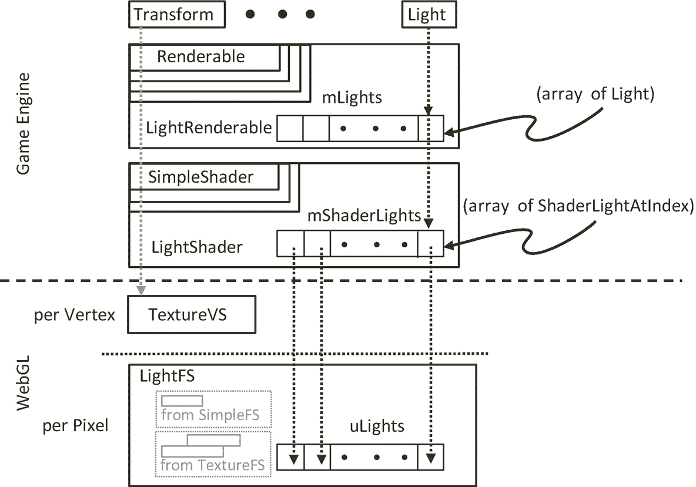

图 8-5

支持多种光源

可以改进上一个项目的点光源照明效果。你已经观察到在它的边界处，被照亮的圆突然消失，并有一个明显的亮度过渡。照明结果的这种突然消失并不反映真实生活，在真实生活中，来自给定光源的效果随着距离逐渐减小，而不是突然关闭。视觉上更令人愉悦的灯光照明结果应该显示一个照亮的圆，其中边界处的照明结果逐渐消失。这种光照效果随距离的逐渐减少被称为距离衰减。用二次函数来近似距离衰减是一种常见的做法，因为它们产生的效果类似于真实世界。一般来说，距离衰减可以通过多种方式近似计算，并且通常会根据游戏的需要进行调整。

在下文中，您将实现近截止距离和远截止距离，即距离衰减效果开始和结束的光源的两个距离。这两个值使您可以控制光源，以显示完全照亮的中心区域，照明衰减仅发生在指定的距离。最后，光强度将被定义为允许光变暗而不改变其颜色。有了这些附加参数，就有可能定义显著不同的效果。例如，可以有一个柔和的、几乎不明显的灯光覆盖很大的区域，或者一个过饱和的发光灯光集中在场景中的一小块区域。

### 多重灯光项目

这个项目演示了如何在一个场景中实现多个点光源。它还演示了如何增加点光源模型的复杂性，以便它们更灵活地服务于更广泛的用途。你可以在图 [8-6](#Fig6) 中看到这个项目运行的例子。这个项目的源代码位于`chapter8/8.3.multiple_lights`文件夹中。

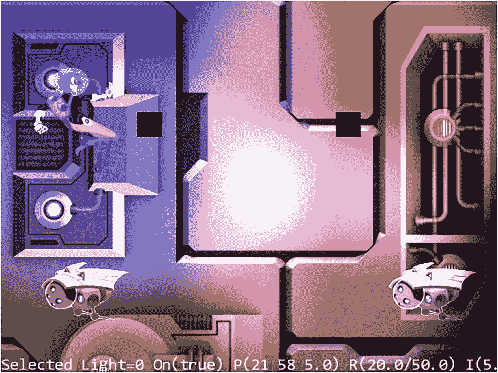

图 8-6

运行多重灯光项目

该项目的控制措施如下:

*   **WASD 键**:移动屏幕上的英雄角色

*   **数字键 0、1、2、3** :选择对应的光源

*   **箭头键**:移动当前选中的灯

*   **Z/X 键**:增加/减少灯的 Z 位置

*   **C/V 和 B/N 键**:增加/减少所选光线的远近截止距离

*   **K/L 键**:增加/减少所选光线的强度

*   **H 键**:打开/关闭选择的灯

该项目的目标如下:

*   构建支持引擎和 GLSL 着色器中多个光源的基础结构

*   理解和检查光的距离衰减效应

*   体验控制和操纵场景中的多个光源

#### 修改 GLSL 灯光片段着色器

需要修改`light_fs`片段着色器以支持距离衰减、截止和多光源:

1.  在`light_fs.glsl`文件中，删除为单个灯光添加的灯光变量，并添加一个`struct`用于保存位置、颜色、近距离、远距离、强度和开/关变量的灯光信息。定义好`struct`后，给片段着色器添加一个`uniform`灯光阵列。请注意，添加了一个`#define`来保存要使用的光源数量。

Note

GLSL 要求数组大小和循环迭代次数为常数。`kGLSLuLightArraySize`是光阵列大小和相应循环迭代控制的常数。您可以随意更改该值，以定义硬件支持的尽可能多的灯光。例如，您可以尝试将灯的数量增加到 50，然后测试和测量性能。

1.  定义`LightEffect()`函数来计算光源的照明结果。该函数使用光源和当前像素之间的距离来确定像素是位于近半径内、近半径和远半径之间，还是比远半径更远。如果像素位置位于近半径内，则没有衰减，因此`strength`被设置为 1。如果位置在远近半径之间，那么`strength`由二次函数调制。大于远半径的距离将导致相应光源没有照明，或者`strength`为 0。

```js
// Light information
#define kGLSLuLightArraySize 4
    // GLSL Fragment shader requires loop control
    // variable to be a constant number. This number 4
    // says, this fragment shader will _ALWAYS_ process
    // all 4 light sources.
    // ***********WARNING***********************
    // This number must correspond to the constant with
    // the same name defined in LightShader.js file.
    // ***********WARNING**************************
    // To change this number MAKE SURE: to update the
    //     kGLSLuLightArraySize
    // defined in LightShader.js file.

struct Light  {
    vec3 Position;   // in pixel space!
    vec4 Color;
    float Near;     // distance in pixel space
    float Far;     // distance in pixel space
    float Intensity;
    bool IsOn;
};
uniform Light uLights[kGLSLuLightArraySize];
        // Maximum array of lights this shader supports

```

1.  修改 main 函数以遍历所有已定义的光源，并调用`LightEffect()`函数来计算和累加阵列中相应光源的贡献:

```js
vec4 LightEffect(Light lgt) {
    vec4 result = vec4(0);
    float strength = 0.0;
    float dist = length(lgt.Position.xyz - gl_FragCoord.xyz);
    if (dist <= lgt.Far) {
        if (dist <= lgt.Near)
            strength = 1.0;  //  no attenuation
        else {
            // simple quadratic drop off
            float n = dist - lgt.Near;
            float d = lgt.Far - lgt.Near;
            strength = smoothstep(0.0, 1.0, 1.0-(n*n)/(d*d));
                                // blended attenuation
        }
    }
    result = strength * lgt.Intensity * lgt.Color;
    return result;
}

```

```js
void main(void)  {
    // simple tint based on uPixelColor setting
    vec4 textureMapColor = texture2D(uSampler,
                                     vec2(vTexCoord.s, vTexCoord.t));
    vec4 lgtResults = uGlobalAmbientIntensity * uGlobalAmbientColor;

    // now decide if we should illuminate by the light
    if (textureMapColor.a > 0.0) {
        for (int i=0; i<kGLSLuLightArraySize; i++) {
            if (uLights[i].IsOn) {
                lgtResults +=  LightEffect(uLights[i]);
            }
        }
    }
    lgtResults *= textureMapColor;

    ... identical to previous code ...
}

```

#### 修改灯光类别

游戏引擎`Light`对象必须修改，以反映`light_fs`片段着色器中新添加的属性:近和远衰减和强度。

1.  修改`Lights.js`构造函数，为新属性定义变量:

1.  为变量定义相应的 get 和 set 访问器。请注意，半径变量已被一般化，并被远近截止距离所取代。

```js
constructor() {
    this.mColor = vec4.fromValues(0.1, 0.1, 0.1, 1);  // light color
    this.mPosition = vec3.fromValues(0, 0, 5); // light position in WC
    this.mNear = 5;  // effective radius in WC
    this.mFar = 10;  // within near is full on, outside far is off
    this.mIntensity = 1;
    this.mIsOn = true;
}

```

```js
setNear(n) { this.mNear = n; }
getNear() { return this.mNear; }

setFar(f) { this.mFar = f; }
getFar() { return this.mFar; }

setIntensity(i) { this.mIntensity = i; }
getIntensity() { return this.mIntensity; }

setLightTo(on) { this.mIsOn = on; }

```

#### 定义最轻等级

您将定义一个`LightSet`类来帮助处理一组`Light`对象。在`src/engine/lights`文件夹中，创建一个新文件，命名为`light_set.js`。定义使用一组`Light`对象的基本接口。

```js
class LightSet {
    constructor() { this.mSet = []; }

    numLights() { return this.mSet.length; }

    getLightAt(index) { return this.mSet[index]; }

    addToSet(light) { this.mSet.push(light); }
}
export default LightSet;

```

最后，不要忘记导出该类，并记住更新引擎访问文件`index.js`，以便将新定义的功能转发给客户端。

#### 定义 ShaderLightAt 类

定义`ShaderLightAt`类，将信息从`Light`对象发送到`light_fs` GLSL 片段着色器中`uLights`数组中的元素:

1.  在`src/engine/shaders`文件夹中，新建一个文件，命名为`shader_light_at.js`；定义`ShaderLightAt`类和构造函数来接收着色器和`uLight`数组的索引。不要忘记导出类。

1.  实现`_setShaderReferences()`函数，将灯光属性引用设置为`light_fs`片段着色器中`uLights`数组中的特定索引:

```js
import * as glSys from "../core/gl.js";

class ShaderLightAt {
    constructor(shader, index) {
        this._setShaderReferences(shader, index);
    }

    ... implementation to follow ...
}
export default ShaderLightAt;

```

1.  实现`loadToShader()`函数将灯光属性推送到`light_fs`片段着色器。注意，这个函数类似于前一个项目的`light_shader.js`文件中定义的`_loadToShader()`函数。重要的区别在于，在这种情况下，光线信息被加载到特定的数组索引中。

```js
_setShaderReferences(aLightShader, index) {
    let gl = glSys.get();
    this.mColorRef = gl.getUniformLocation(
                          aLightShader, "uLights[" + index + "].Color");
    this.mPosRef = gl.getUniformLocation(
                       aLightShader, "uLights[" + index + "].Position");
    this.mNearRef = gl.getUniformLocation(
                           aLightShader, "uLights[" + index + "].Near");
    this.mFarRef = gl.getUniformLocation(
                            aLightShader, "uLights[" + index + "].Far");
    this.mIntensityRef = gl.getUniformLocation(
                      aLightShader, "uLights[" + index + "].Intensity");
    this.mIsOnRef = gl.getUniformLocation(
                           aLightShader, "uLights[" + index + "].IsOn");
}

```

1.  定义一个简单的函数来更新`light_fs`片段着色器数组中灯光的开/关状态:

```js
loadToShader(aCamera, aLight) {
    let gl = glSys.get();
    gl.uniform1i(this.mIsOnRef, aLight.isLightOn());
    if (aLight.isLightOn()) {
        let p = aCamera.wcPosToPixel(aLight.getPosition());
        let n = aCamera.wcSizeToPixel(aLight.getNear());
        let f = aCamera.wcSizeToPixel(aLight.getFar());
        let c = aLight.getColor();
        gl.uniform4fv(this.mColorRef, c);
        gl.uniform3fv(this.mPosRef, vec3.fromValues(p[0], p[1], p[2]));
        gl.uniform1f(this.mNearRef, n);
        gl.uniform1f(this.mFarRef, f);
        gl.uniform1f(this.mIntensityRef, aLight.getIntensity());
    }
}

```

```js
switchOffLight() {
    let gl = glSys.get();
    gl.uniform1i(this.mIsOnRef, false);
}

```

请注意，`ShaderLightAt`类是为将光线加载到 GLSL 片段着色器中的特定数组元素而定义的。这是一个内部发动机操作。游戏程序员没有理由访问这个类，因此，不应该修改引擎访问文件`index.js`来转发这个类的定义。

#### 修改 LightShader 类

您现在必须修改`LightShader`对象，以正确处理`Light`对象和`light_fs`片段着色器中的灯光阵列之间的通信:

1.  首先编辑`light_shader.js`文件，导入`ShaderLightAt`，然后*移除*的`_loadToShader()`功能。光线信息向`light_fs`片段着色器的实际加载现在由新定义的`ShaderLightAt`对象处理。

1.  修改构造函数来定义`mLights`，它是一个由`ShaderLightAt`对象组成的数组，对应于在`light_fs`片段着色器中定义的`uLights`数组。需要注意的是，`mLights`和`uLights`数组的大小必须完全相同。

```js
import ShaderLightAt from "./shader_light_at.js";

```

1.  修改`activate()`函数，通过调用相应的`loadToShader()`函数迭代并加载每个`ShaderLightAt`对象的内容到`light_fs`着色器。回想一下，GLSL 片段着色器要求 for 循环控制变量为常量。这意味着在每次调用`light_fs`时，都会处理`uLights`数组的所有元素。因此，确保关闭所有不用的灯非常重要。以下代码中的最后一个 while 循环确保了这一点:

```js
constructor(vertexShaderPath, fragmentShaderPath) {
    // Call super class constructor
    super(vertexShaderPath, fragmentShaderPath);

    this.mLights = null;  // lights from the Renderable
    this.mCamera = null;  // camera to draw, need for WC to DC xform

    //*******WARNING***************
    // MUST correspond to GLSL uLight[] array size (for LightFS.glsl)
    //*******WARNING********************
    this.kGLSLuLightArraySize = 4;  // must be the same as LightFS.glsl
    this.mShaderLights = [];
    let i, ls;
    for (i = 0; i < this.kGLSLuLightArraySize; i++) {
        ls = new ShaderLightAt(this.mCompiledShader, i);
        this.mShaderLights.push(ls);
    }
}

```

1.  将`setCameraAndLight()`函数重命名为`setCameraAndLights()`；除了设置相应的变量，检查以确保灯光数组大小不大于在`light_fs`片段着色器中定义的数组大小。最后，记得更新`sprite_shader.js`中相应的函数名。

```js
activate(pixelColor, trsMatrix, cameraMatrix) {
    // first call the super class' activate
    super.activate(pixelColor, trsMatrix, cameraMatrix);

    // now push the light information to the shader
    let numLight = 0;
    if (this.mLights !== null) {
        while (numLight < this.mLights.length) {
            this.mShaderLights[numLight].loadToShader(
                                  this.mCamera, this.mLights[numLight]);
            numLight++;
        }
    }
    // switch off the left over ones.
    while (numLight < this.kGLSLuLightArraySize) {
        this.mShaderLights[numLight].switchOffLight(); // off the un-use
        numLight++;
    }
}

```

```js
setCameraAndLights(c, l) {
    this.mCamera = c;
    this.mLights = l;
    if (this.mLights.length > this.kGLSLuLightArraySize)
        throw new Error ("Error: " ...);
}

```

#### 修改 LightRenderable 类

你现在可以修改`LightRenderable`类来支持多个光源:

1.  在`LightRenderable`构造函数中，用一个数组替换单个光线引用变量:

1.  确保更新绘制功能以反映对多个光源的更改:

```js
constructor(myTexture) {
    super(myTexture);
    super._setShader(defaultShaders.getLightShader());

    // the light sources
    this.mLights = [];
}

```

1.  为灯光阵列定义相应的访问器函数:

```js
draw(camera) {
    this.mShader.setCameraAndLights(camera, this.mLights);
    super.draw(camera);
}

```

```js
getLightAt(index) { return this.mLights[index]; }
addLight(l) { this.mLights.push(l); }

```

#### 用我的游戏测试光源

通过在引擎中正确集成多种灯光支持，您现在可以修改`MyGame`来测试您的实现并检查结果。除了添加多个灯光到场景中，您还将添加控制每个灯光属性的功能。为了保持可读性，您将把灯光实例化和控制划分到单独的文件中。为了避免冗余和重复的代码列表，没有显示简单实现的细节。

1.  修改`src/my_game`文件夹中的`my_game_main.js`文件，以反映对构造函数、初始化函数、绘制函数和更新函数的更改。所有这些变化都围绕着通过灯光组处理多个灯光。

2.  在`src/my_game`文件夹中，创建新文件`my_game_lights.js`以从`my_game_main.js`导入`MyGame`类，并添加实例化和初始化灯光的功能。

3.  在`src/my_game`文件夹中，创建从`my_game_lights.js`导入的新文件`my_game_light_control.js`，并继续添加灯光控制到`MyGame`。

4.  修改`my_game.js`以从`my_game_light_control.js`导入，确保可以访问所有新定义的功能。

#### 观察

运行项目以检查实现。尝试使用 0、1、2 和 3 键选择灯，并切换所选灯的开/关。请注意，游戏程序员可以控制哪个灯光照亮哪个对象:所有灯光照亮背景，而英雄只被灯光 0 和 3 照亮，左边的小兵只被灯光 1 和 3 照亮，右边的小兵只被灯光 2 和 3 照亮。

用 WASD 键移动`Hero`对象，观察当它通过光源 0 的远近半径时，照明是如何变化的。选择光源 0(类型 0)，按 C 键增加灯光的近半径。请注意，随着近半径接近远半径的值，照亮的圆边界边也会变得更清晰。最终，当近半径大于远半径时，你可以再次观察到边界处突然的亮度变化。您观察到的是违反了基本照明模型的隐含假设，即近半径总是小于远半径。这种确切的情况可以通过使用 N 键减小远半径来创建。

您可以使用箭头键移动光源，以观察光源的相加性。尝试更改光源的 z 位置及其近/远值，观察不同的 z/近/远设置如何实现相似的照明效果。特别是，尝试用 K/L 键调整光强度，以观察过饱和和几乎不明显的光照的影响。您可以继续按 L 键，直到强度变为负值，以创建一个从场景中移除颜色的源。场景中有两个恒定颜色的正方形，用于确认未被照亮的对象仍然可以被渲染。

## 漫反射和法线贴图

现在，您可以放置或移动许多光源，并控制目标区域的照明或阴影。但是，如果您运行之前的项目并移动其中一个光源，您可能会注意到一些特殊的效果。图 [8-7](#Fig7) 通过将左侧先前项目的照明结果与右侧您可能预期的照明进行比较，突出了这些效果。现在，参考左边的图片。首先，请注意近截止区域内的一般均匀照明，在该区域内，无法观察到点光源位置周围的预期亮点。其次，检查几何块的垂直面，并注意底面上的明亮照明，该照明明显位于光源的后面，或*指向远离光源的方向。这两个特点在图 [8-7](#Fig7) 的右图中都没有。*

虽然视觉上有些奇怪，但图 8-7 左边图像的结果在 2D 世界中是意料之中的。垂直面只是艺术家的再现，并且您的照明计算不考虑图像内容建议的几何轮廓。平面 2D 世界中的这种照明限制在本节中通过引入漫反射和法线贴图来近似曲面的法线向量而得以弥补。

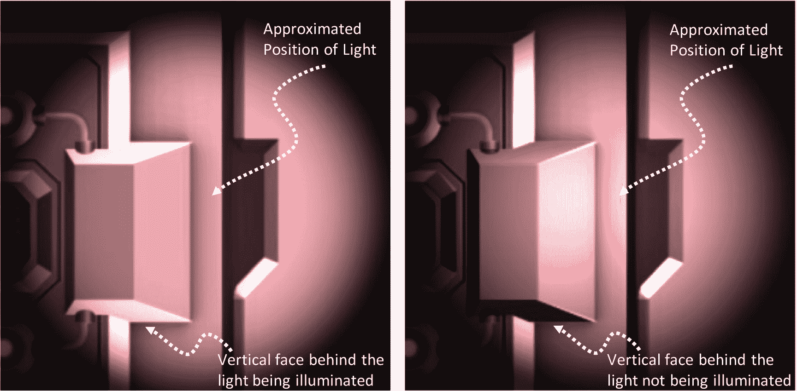

图 8-7

左图:来自上一个项目。右图:预期照明

如图 [8-8](#Fig8) 左图所示，表面法向矢量、表面法线或法向矢量是垂直于给定表面元素的矢量。图 [8-8](#Fig8) 右图显示，在三维空间中，物体的表面法向量描述了物体的形状或轮廓。

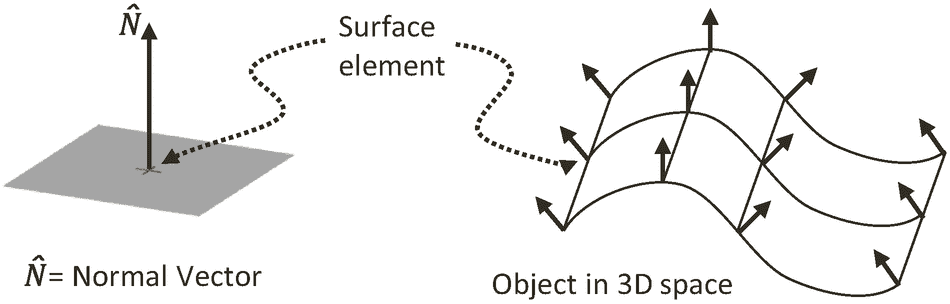

图 8-8

物体的表面法向量

人类对光照的观察是来自光源的可见能量从物体表面反射并到达眼睛的结果。漫射面、粗糙面或朗伯面将光能均匀地反射到各个方向。漫射表面的示例包括典型的打印纸或无光涂漆表面。图 [8-9](#Fig9) 显示了照亮三个漫射面元素位置 A、B 和 c 的光源。首先，注意从被照亮位置朝向光源的方向被定义为该位置的光矢量。重要的是要注意到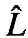矢量的方向总是朝向光源，并且这是一个大小为 1 的归一化矢量。

图 [8-9](#Fig9) 还举例说明了漫射照明或漫反射的大小。位置 A 不能从给定的光源接收任何能量，因为它的法向量垂直于它的光向量或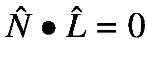。位置 B 可以接收所有的能量，因为它的法向量与它的光向量指向相同的方向，或者说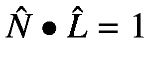。一般来说，如位置 C 所示，漫射表面接收和反射的光能比例与其法线和光矢量之间的夹角余弦成正比，即。在照明模型中，计算的术语被称为漫射或朗伯分量。

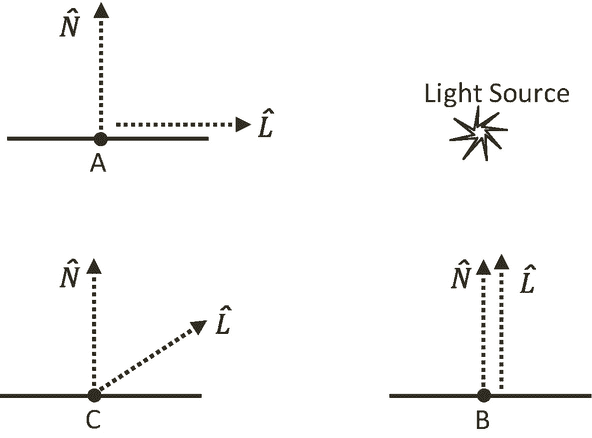

图 8-9

法线和灯光向量以及漫射照明

人类视觉系统主要基于或漫射分量来推断 3D 几何形状轮廓。例如，图 [8-10](#Fig10) 显示了一个有(左图)和没有(右图)相应漫射组件的球体和圆环体(环形物体)。显然，在这两种情况下，物体的 3D 轮廓被具有漫射分量的图像的左侧版本捕获。

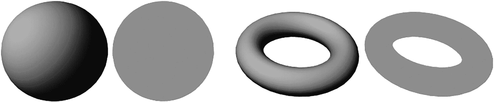

图 8-10

包含和不包含漫射组件的 3D 对象示例

在 2D 世界中，就像你的游戏引擎一样，所有的物体都用 2D 图像或纹理来表示。因为所有对象都是定义在 xy 平面上的 2D 纹理图像，所以所有对象的法向量都是相同的:z 方向的向量。缺少物体的不同法向量意味着不可能为物体计算不同的漫射分量。幸运的是，与纹理贴图解决每个几何体只有一种颜色的限制类似，法线贴图可以解决每个几何体只有一个法线向量的问题。

图 [8-11](#Fig11) 显示了法线贴图背后的思想，除了彩色纹理图像，还需要相应的法线纹理图像。图 [8-11](#Fig11) 的左图是典型的彩色纹理图像，右图是左图上高亮显示的正方形的放大图像。请再次注意，法线贴图中涉及到两个图像:彩色纹理图像，其中纹理的 RGB 通道记录了对象的颜色(图 [8-11](#Fig11) 的右图底部)和相应的法线纹理图像，其中 RGB 通道记录了彩色纹理中相应对象的法线矢量的 x、y 和 z 值(右图顶部)。

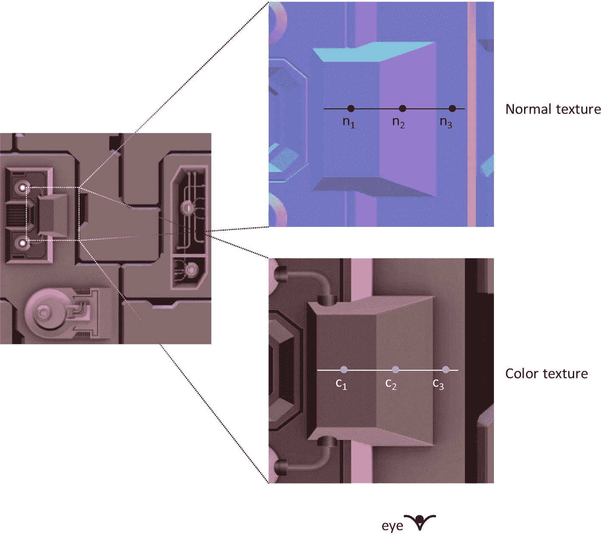

图 8-11

具有两个纹理图像的法线贴图:法线和彩色纹理

图 [8-12](#Fig12) 捕捉了图 [8-11](#Fig11) 右图中标注的三个对应位置，法线纹理上的位置 n <sub>1</sub> ，n <sub>2</sub> ，n <sub>3</sub> 以及颜色纹理上的对应位置 c <sub>1</sub> ，c <sub>2</sub> ，c <sub>3</sub> 的视图，以说明法线贴图的细节。图 [8-12](#Fig12) 的底层显示颜色纹理记录颜色，颜色 c <sub>1</sub> ，c <sub>2</sub> ，c <sub>3</sub> 在这三个位置采样。图 [8-12](#Fig12) 中间层显示法线纹理的 RGB 分量记录了物体在相应颜色纹理位置的法线矢量 xyz 值。图 [8-12](#Fig12) 的顶层显示，当被光源照射时，通过正确计算和显示项，人类视觉系统将感知到倾斜的轮廓。

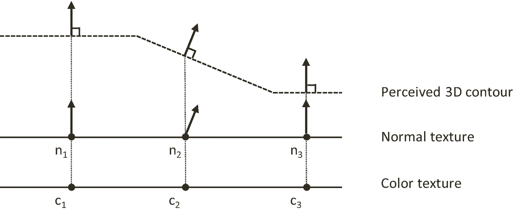

图 8-12

具有两个纹理图像的法线贴图:法线和彩色纹理

总之，法线纹理贴图或法线贴图是存储法线向量信息而不是通常的颜色信息的纹理贴图。法线贴图的每个纹理元素对 RGB 通道中法线向量的 xyz 值进行编码。与使用颜色纹理显示法线贴图纹理元素不同，纹理元素纯粹用于计算表面如何与光线交互。以这种方式，代替指向 z 方向的恒定法向量，当正方形被法线映射时，被渲染的每个像素的法向量将由来自法线贴图的纹理元素来定义，并且可以用于计算漫射分量。因此，渲染图像将显示类似于法线贴图中编码的形状的轮廓。

在上一个项目中，您扩展了引擎以支持多种光源。在本节中，您将定义`IllumShader`类来概括一个`LightShader`以支持基于法线贴图的漫射组件的计算。

### 法线贴图和照明着色器项目

这个项目演示了如何将法线贴图集成到你的游戏引擎中，并使用结果来计算物体的漫反射部分。你可以在图 [8-13](#Fig13) 中看到这个项目运行的例子。这个项目的源代码位于`chapter8/8.4.normal_maps_and_illumination_shaders`文件夹中。

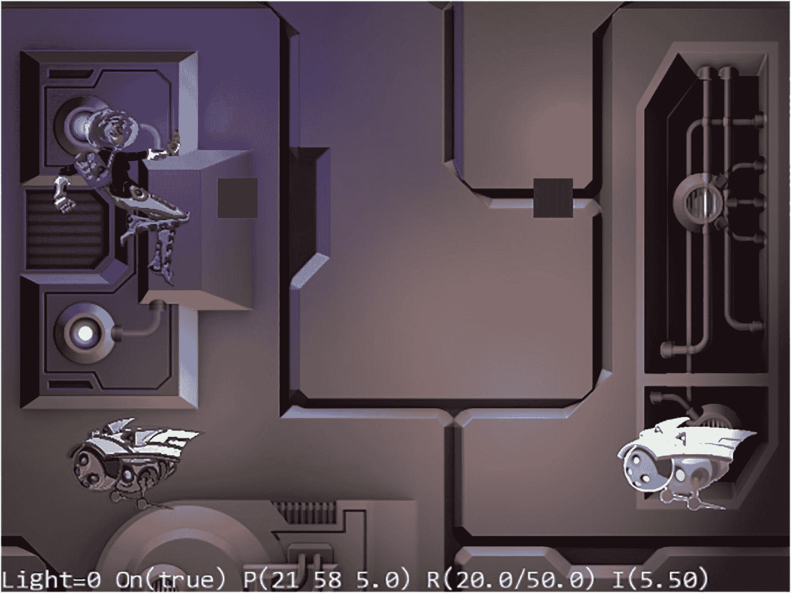

图 8-13

运行法线贴图和照明着色器项目

该项目的控件与之前的项目相同:

*   **WASD 键**:移动屏幕上的英雄角色

*   **数字键 0、1、2、3** :选择对应的光源

*   **箭头键**:移动当前选中的灯

*   **Z/X 键**:增加/减少灯的 Z 位置

*   **C/V 和 B/N 键**:增加/减少所选光线的远近截止距离

*   **K/L 键**:增加/减少所选光线的强度

*   **H 键**:打开/关闭选择的灯

该项目的目标如下:

*   理解和使用法线贴图

*   在游戏引擎中实现法线贴图作为纹理

*   实现支持漫射组件照明的 GLSL 着色器

*   检查照明模型中的漫射组件

您可以在`assets`文件夹中找到以下外部资源文件。`fonts`文件夹包含默认的系统字体，两张纹理图像，以及对应纹理图像的两张法线贴图`minion_sprite.png`和`bg.png`，以及对应的法线贴图`minion_sprite_normal.png`和`bg_normal.png`。和之前的项目一样，对象是`minion_sprite.png`的 sprite 元素，背景用`bg.png`表示。

Note

基于`minion_sprite.png`图像，从 [`http://cpetry.github.io/NormalMap-Online/`](http://cpetry.github.io/NormalMap-Online/) 通过算法生成`minion_sprite_normal.png`法线贴图。

#### 创建 GLSL 照明片段着色器

与前面的项目一样，法线贴图的集成将从 GLSL 着色器的实现开始。请注意，这个新的着色器将与您的`light_fs.glsl`非常相似，但包含了法线贴图和漫射计算支持。为了确保支持没有法线贴图的简单照明，您将创建一个新的 GLSL 片段着色器。

1.  从`light_fs.glsl`开始复制并粘贴到`src/glsl_shaders`文件夹中的一个新文件`illum_fs.glsl`中。

2.  编辑`illum_fs.glsl`文件，添加一个`sampler2D`对象`uNormalSampler`，对法线贴图进行采样:

1.  修改`LightEffect()`函数以接收法向量参数`N`。这个法向量`N`被认为是归一化的，大小为 1，并将用于漫射分量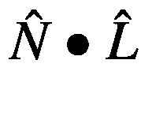的计算。输入代码以计算向量，记住标准化向量，并使用的结果相应地缩放光线`strength`。

```js
uniform sampler2D uSampler;
uniform sampler2D uNormalSampler;

... identical to the variables declared in light_fs.glsl ...

```

1.  编辑`main()`功能，用`uSampler`从彩色纹理中取样，用`uNormalSampler`从普通纹理中取样。请记住，法线贴图为您提供了一个表示给定位置的表面元素的法向量的向量。因为 xyz 法线向量值以 0 到 1 的 RGB 颜色格式存储，所以采样的法线贴图结果必须缩放并偏移到-1 到 1 的范围。此外，回想一下，纹理 uv 坐标可以用向上或向下增加的 v 方向来定义。在这种情况下，根据法线贴图的 v 方向，您可能还需要翻转采样法线贴图值的 y 方向。然后，标准化的法向量`N`被传递给`LightEffect()`函数，用于照明计算。

```js
vec4 LightEffect(Light lgt, vec3 N) {
    vec4 result = vec4(0);
    float strength = 0.0;
    vec3 L = lgt.Position.xyz - gl_FragCoord.xyz;
    float dist = length(L);
    if (dist <= lgt.Far) {
        if (dist <= lgt.Near) {
            ... identical to previous code ...
        }
        L = L / dist; // To normalize L
            // Not calling normalize() function to avoid re-computing
            // "dist". This is computationally more efficient.
        float NdotL = max(0.0, dot(N, L));
        strength *= NdotL;
    }
    result = strength * lgt.Intensity * lgt.Color;
    return result;
}

```

```js
void main(void)  {
    // simple tint based on uPixelColor setting
    vec4 textureMapColor = texture2D(uSampler, vTexCoord);
    vec4 normal = texture2D(uNormalSampler, vTexCoord); // same UV
    vec4 normalMap = (2.0 * normal) - 1.0;

    //
    // normalMap.y = -normalMap.y;  // flip Y
    //    depending on the normal map you work with,
    //    this may or may not be flipped
    //
    vec3 N = normalize(normalMap.xyz);

    vec4 lgtResult = uGlobalAmbientColor * uGlobalAmbientIntensity;

    // now decide if we should illuminate by the light
    if (textureMapColor.a > 0.0) {
        for (int i=0; i<kGLSLuLightArraySize; i++) {
            if (uLights[i].IsOn) {
                lgtResult += LightEffect(uLights[i], N);
            }
        }
    }
    ... identical to previous code ...
}

```

Note

法线贴图可以在各种不同的布局中创建，其中 x 或 y 可能需要翻转以正确表示所需的表面几何图形。这完全取决于创建地图的工具或艺术家。

#### 定义 IllumShader 类

使用支持法线贴图的`Illum_fs`片段着色器，您可以创建 JavaScript `IllumShader`类来与之交互:

1.  在`src/engine/shaders`文件夹中，创建`illum_shader.js`，并将`IllumShader`定义为`LightShader`的子类，以利用与光源相关的功能。在构造函数中，定义一个变量`mNormalSamplerRef`，以维护对`illum_fs`片段着色器中普通采样器的引用。不要忘记导出类。

1.  覆盖并扩展`activate()`函数，将普通纹理采样器引用绑定到 WebGL 纹理单元 1。你可能还记得第 [5 章](05.html)中的`TextureShader`将颜色纹理采样器绑定到纹理单元 0。通过将法线贴图绑定到纹理单元 1，WebGL 纹理系统可以同时处理两个活动纹理:单元 0 和单元 1。正如将在下一小节中讨论的，通过`texture`模块配置 WebGL 来激活相应目的的适当纹理单元是很重要的:颜色与普通纹理映射。

```js
import LightShader from "./light_shader.js";
import * as glSys from "../core/gl.js";

class IllumShader extends LightShader {
    constructor(vertexShaderPath, fragmentShaderPath) {
        super(vertexShaderPath, fragmentShaderPath);
        let gl = glSys.get();
        // reference to the normal map sampler
        this.mNormalSamplerRef = gl.getUniformLocation(
                                 this.mCompiledShader, "uNormalSampler");
    }
    ... implementation to follow ...
}
export default IllumShader;

```

```js
activate(pixelColor, trsMatrix, cameraMatrix) {
    // first call the super class' activate
    super.activate(pixelColor, trsMatrix, cameraMatrix);
    let gl = glSys.get();
    gl.uniform1i(this.mNormalSamplerRef, 1); // binds to texture unit 1
    // do not need to set up texture coordinate buffer
    // as we are going to use the ones from the sprite texture
    // in the fragment shader
}

```

Note

WebGL 支持在渲染过程中同时激活多个纹理单元。根据 GPU 的不同，在一次渲染过程中，至少有八个纹理单元可以同时处于活动状态。在本书中，您将在渲染过程中仅激活两个纹理单元:一个用于彩色纹理，另一个用于普通纹理。

#### 修改纹理模块

到目前为止，您已经将颜色纹理贴图绑定到 WebGL 纹理单元 0。添加了正常纹理后，绑定到 WebGL 纹理系统的单元现在必须参数化。幸运的是，这是一个简单的改变。

通过打开`src/engine/resources`文件夹中的`texture.js`修改`texture`模块。编辑`activate()`函数以接受第二个参数，即要绑定到的 WebGL 纹理单元。请注意，这是一个可选参数，默认值设置为纹理单位 0。这使得对`activate()`函数的任何现有调用都不需要改变。

```js
function activate(textureName, textureUnit = glSys.get().TEXTURE0) {
    let gl = glSys.get();
    let texInfo = get(textureName);

    // Binds texture reference to current webGL texture functionality
    gl.activeTexture(textureUnit);  // activate the WebGL texture unit
    gl.bindTexture(gl.TEXTURE_2D, texInfo.mGLTexID);

    ... identical to previous code ...
}

```

#### 创建 IllumRenderable 类

现在可以定义照明`Renderable`类来利用新创建的照明着色器:

1.  首先在`src/engine/renderables`文件夹中创建`illum_renderable.js`，将`IllumRenderable`类定义为`LightRenderable`的子类，并初始化一个`mNormalMap`实例变量来记录法线贴图 ID。`IllumRenderable`对象使用两个纹理贴图:`myTexture`用于颜色纹理贴图，`myNormalMap`用于法线贴图。注意，这两个纹理贴图共享在`SpriteShader`的`mTexCoordBuffer`中定义的相同纹理坐标。这种纹理坐标的共享隐含地假设物体的几何形状在彩色纹理图中被描绘，并且法线纹理图被导出以捕捉物体的轮廓，这几乎总是*的情况。最后，不要忘记导出这个类。*

```js
import * as texture from "../resources/texture.js";
import * as glSys from "../core/gl.js";
import LightRenderable from "./light_renderable.js";
import * as defaultShaders from "../core/shader_resources.js";

class IllumRenderable extends LightRenderable {
    constructor(myTexture, myNormalMap) {
        super(myTexture);
        super._setShader(defaultShaders.getIllumShader());

        // here is the normal map resource id
        this.mNormalMap = myNormalMap;

        // Normal map texture coordinate is same as sprite sheet
        // This means, the normal map MUST be based on the sprite sheet
    }
    ... implementation to follow ...
}

export default IllumRenderable;

```

Note

再次强调，法线纹理贴图是一个必须由艺术家显式创建或者由适当的程序通过算法创建的图像，这一点很重要。使用常规颜色纹理贴图图像作为普通纹理贴图通常是行不通的。

1.  接下来，在调用超类的`draw()`方法之前，覆盖`draw()`函数来激活法线贴图。请注意`texture.activate()`函数调用的第二个参数，其中明确指定了 WebGL 纹理单元 1。这样，随着`IllumShader`将`uNormalSampler`链接到 WebGL 纹理单元 1 并且`illum_fs`将`uNormalSampler`采样为法线贴图，您的引擎现在支持正确的法线贴图。

```js
draw(camera) {
    texture.activate(this.mNormalMap, glSys.get().TEXTURE1);
    // Here the normal map texture coordinate is copied from those of
    // the corresponding sprite sheet
    super.draw(camera);
}

```

最后，记得更新引擎访问文件`index.js`，以便将新定义的功能转发给客户端。

#### 定义默认 IllumShader 实例

与引擎中的所有其他着色器类似，`IllumShader`的默认实例必须定义为共享。定义默认的`IllumShader`实例的代码与本章前面介绍的`LightShader`的代码相同，只是替换了相应的变量名和数据类型。请参考“定义一个默认的 LightShader 实例”小节和`src/engine/core`文件夹中的`shader_resources.js`源代码文件了解详情。

#### 测试法线贴图

测试新集成的法线贴图功能必须包括验证非法线贴图简单颜色纹理是否正常工作。为了实现这一点，背景、英雄和左仆从将被创建为新定义的`IllumRenderable`对象，而右仆从将保持为`LightRenderable`对象。

##### 修改英雄和奴才

`Hero`和`Minion`对象应该被实例化为新定义的`IllumRenderable`对象:

1.  编辑`src/my_game/objects`中的`hero.js`，修改`Hero`类的构造函数，用`IllumRenderable`实例化游戏对象:

1.  在同一个文件夹中，编辑`minion.js`以修改`Minion`类的构造函数，从而在正常纹理贴图存在时，有条件地用`LightRenderable`或`IllumRenderable`实例化游戏对象:

```js
constructor(spriteTexture, normalMap) {
    super(null);
    this.kDelta = 0.3;
    this.mRenderComponent = new engine.IllumRenderable(
                                       spriteTexture, normalMap);
    this.mRenderComponent.setColor([1, 1, 1, 0]);
    ... identical to previous code ...
}

```

```js
constructor(spriteTexture, normalMap, atX, atY) {
    super(null);
    this.kDelta = 0.2;

    if (normalMap === null) {
        this.mRenderComponent = new engine.LightRenderable(
                                           spriteTexture);
    } else {
        this.mRenderComponent = new engine.IllumRenderable(
                                           spriteTexture, normalMap);
    }

    ... identical to previous code ...
}

```

##### 修改我的游戏

您现在可以修改`MyGame`来测试和显示您的照明着色器的实现。修改`src/my_game`文件夹中的`my_game_main.js`文件，加载和卸载新的法线贴图，并用法线贴图文件创建`Hero`和`Minion`对象。如前所述，所涉及的变化是简单明了的，而且相对来说是最小的；因此，这里不显示细节。

#### 观察

现在项目已经完成，您可以运行它并检查您的结果，以观察漫射照明的效果。请注意，`Hero`、左边的`Minion`和背景物体是用漫射计算照亮的，看起来从灯光中提供了更多的深度。这些物体的颜色和阴影有更多的变化。

您可以确认在图 [8-7](#Fig7) 的左图中观察到的特殊效果已经解决。为了更清楚地观察，关闭除灯 2 以外的所有其他灯(在 H 键后键入灯号)。现在，移动灯光位置(用箭头键)照亮`Hero`字符后面的几何块；你可以用 WASD 键把它移走。验证您正在查看的结果与图 [8-7](#Fig7) 右图中的结果相似。您应该能够清楚地观察到对应于点光源位置的最亮点。此外，请注意，只有当灯光位置在面前面*或漫射项为正时，块的底面才会被照亮。*

通常，移动光源时，观察垂直方向的面，例如，几何块或间隙的侧面。当灯光位置移动越过这样的边界时，项的符号将翻转，相应的表面照明将经历剧烈的变化(从暗到亮，反之亦然)。为了获得更生动的效果，将灯光的 z 高度(使用 X 键)降低到小于 5 的值。使用法线贴图和漫射计算，您已经将静态背景图像转换为由复杂的 3D 几何形状定义的背景。尝试移动其他光源，并观察光源穿过所有对象时，这些对象上的照明变化。

最后，`Hero`和左`Minion`略微像素化和粗糙的外观证明了一个事实，即这些物体的法线贴图是通过算法从相应的彩色图像中生成的，并且这些贴图不是由艺术家创建的。

## 镜面反射和材料

您实现的漫射照明适用于模拟无光泽表面的照明，如典型的打印纸、许多粉刷过的内墙，甚至是传统的黑板。Phong 照明模型通过引入镜面反射项来模拟光源在光亮表面上的反射，从而扩展了这种简单的漫射照明。图 [8-14](#Fig14) 显示了一个三个球体的例子，一个简单的无光泽球体，一个具有适度高光的球体，以及一个高度抛光的球体。右边两个球体上的高光是 Phong 镜面反射项的结果。

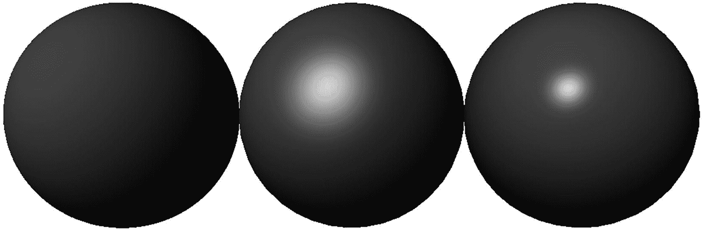

图 8-14

物体的镜面反射和闪光

图 [8-15](#Fig15) 显示了给定一个光亮或反射表面，如抛光地板或抛光塑料，当眼睛或摄像机位于光源的反射方向时，光源的反射将是可见的。光源在光亮表面上的反射被称为*镜面反射*、*镜面高光*或*镜面度*。

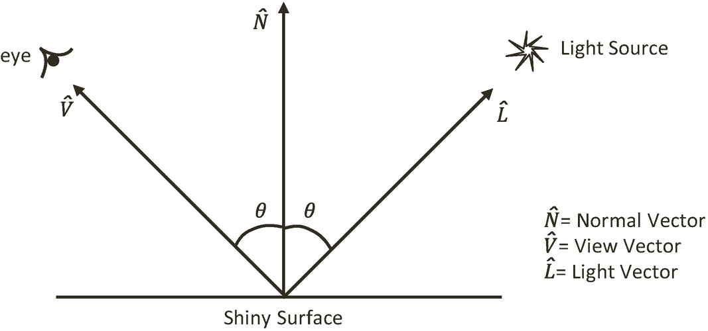

图 8-15

镜面反射:光源的反射

根据实际经验，即使眼睛的观察方向与光源的反射方向不完全一致，镜面高光也是可见的。如图 [8-16](#Fig16) 所示，其中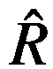矢量是光线矢量的反射方向，即使观察方向与矢量不完全一致，物体上的镜面高光也是可见的。现实生活的经验也告诉你离越远，或者角度-α越大，你就越不可能观察到光的反射。事实上，你知道当α为零时，你会观察到最大的光反射，当α为 90°或当和垂直时，你会观察到零光反射。

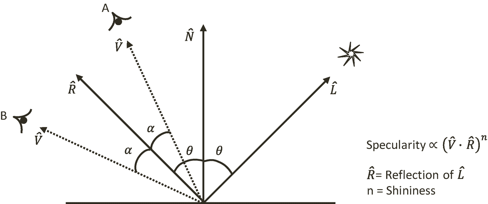

图 8-16

Phong 镜面反射模型

Phong 照明模型用一个项模拟镜面反射的特征。当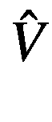和对准时，或者当α=0 时，镜面反射率项计算为 1，当和之间的间隔增加到 90°或者当α= 90°时，根据余弦函数，镜面反射率项下降到 0。功率 *n* ，被称为闪亮度，描述了当α增加时镜面高光滚降的速度。 *n* 值越大，余弦函数随着α的增加下降得越快，镜面高光下降得越快，表面看起来就越有光泽。例如，在图 [8-14](#Fig14) 中，左、中、右球体对应的 *n* 值分别为 0、5 和 30。

虽然项有效地模拟了镜面高光，但是为每个着色像素计算向量所涉及的成本可能是巨大的。如图 [8-17](#Fig17) 所示，中间矢量定义为和矢量的平均值。据观察，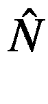和之间的角度β也可用于表征镜面反射。虽然略有不同，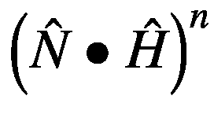产生的结果与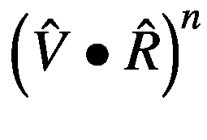相似，但每像素计算成本更低。中途向量将用于在您的实现中近似镜面反射率。

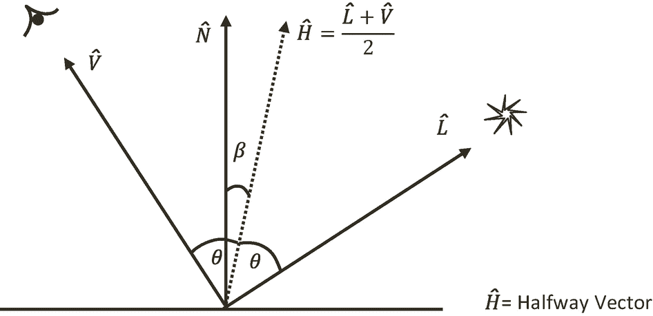

图 8-17

中途向量

如图 [8-18](#Fig18) 所示，您将实现的 Phong 照明模型的变体包括通过三个不同的术语模拟场景中三个参与元素的相互作用。三个参与元素是全局环境照明、光源和被照明对象的材质属性。前面的例子已经解释了前两个:全局环境照明和光源。这样，为了支持 Phong 光照模型，一个物体的材质属性可以用*K*<sub>T5】a</sub>， *K* <sub>*d*</sub> ， *K* <sub>*s*</sub> ， *n* 来表示。它们代表三种颜色，分别代表环境反射率、漫反射率和镜面反射率，以及一个表示对象亮度的浮点数。用全局环境光强度， *I* <sub>*a*</sub> ，和颜色， *C* <sub>*a*</sub> ，和光源强度， *I* <sub>*L*</sub> ，和颜色， *C* <sub>*L*</sub> ，Phong 光照模型的三个术语如下

*   **环境术语**:*I*<sub>T5】a</sub>*C*<sub>*a*</sub>*K*<sub>*a*</sub>

*   **扩散术语** : 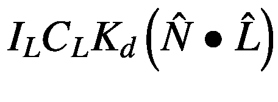

*   **镜面反射项** : 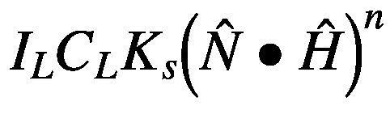

请注意，前两个术语，环境和漫射术语，已经在前面的示例中涵盖。前一个示例中的`illum_fs` GLSL 片段着色器实现了这两个项，具有灯光距离衰减，并且没有 *K* <sub>*a*</sub> 和 *K* <sub>*d*</sub> 材质属性。该项目指导您构建对每对象材质属性的支持，并使用`IllumShader` / `IllumRenderable`对象对中的引擎支持在`illum_fs` GLSL 着色器中完成 Phong 光照模型实现。

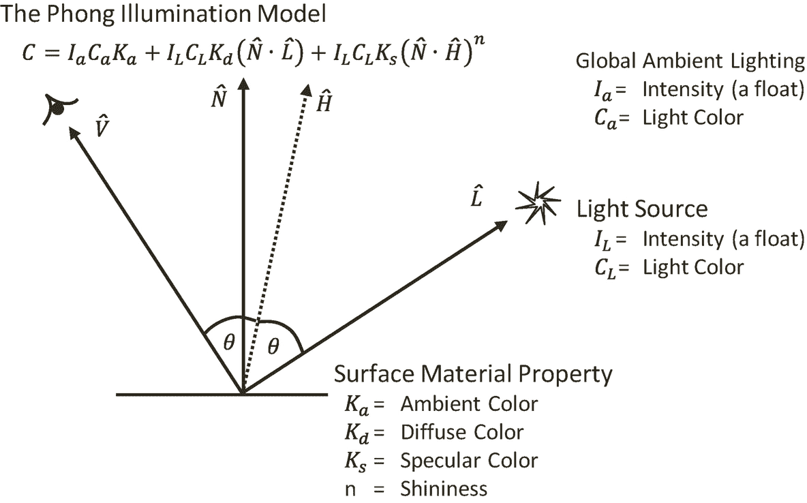

图 8-18

Phong 光照模型

### 游戏引擎和 GLSL 着色器中材质的集成

为了实现 Phong 照明模型，封装图 [8-18](#Fig18) 中表面材质属性的`Material`类必须由每个`IllumRenderable`对象定义和引用，该对象将由相应的`illum_fs`片段着色器进行着色。图 [8-19](#Fig19) 说明了在您的实现中，一个新的`ShaderMaterial`对象将在`IllumShader`中被定义和引用，以将`Material`对象的内容加载到`illum_fs` GLSL 片段着色器中。

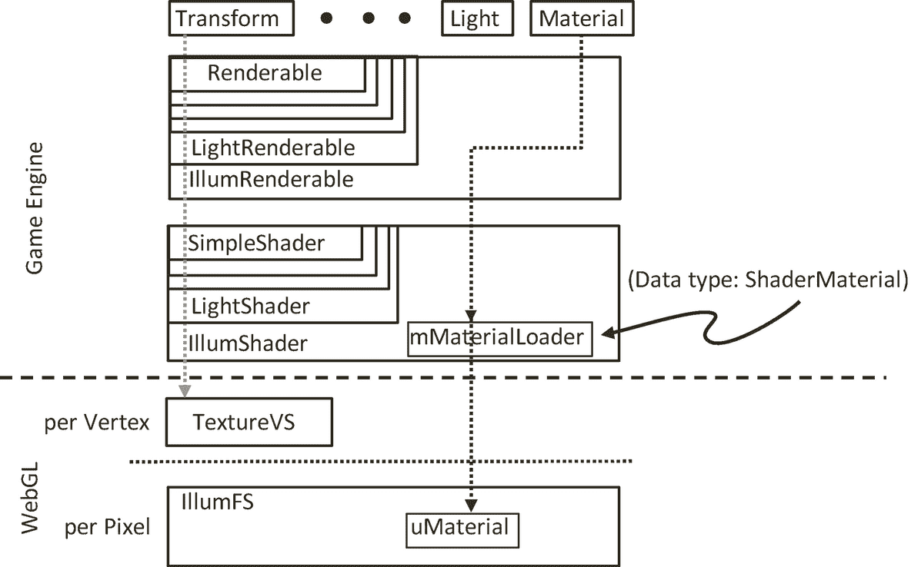

图 8-19

材料支持

### 材料和镜面项目

这个项目演示了一个 Phong 光照模型版本的实现，它利用了法线贴图和摄像机的位置。它还实现了一个系统，该系统存储并转发每个对象的材质属性到 GLSL 着色器，用于 Phong 光照计算。你可以在图 [8-20](#Fig20) 中看到项目运行的例子。这个项目的源代码位于`chapter8/8.5.material_and_specularity`文件夹中。

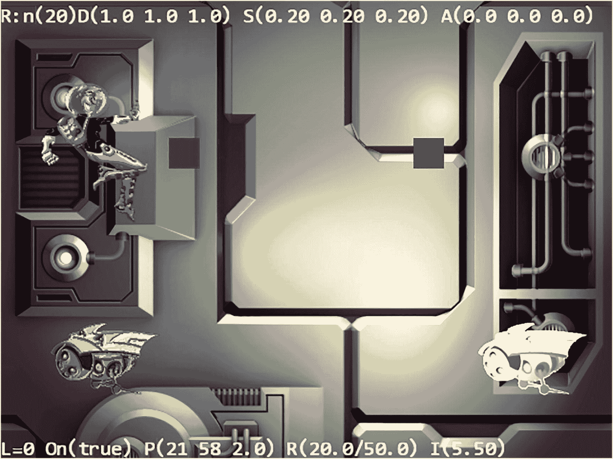

图 8-20

运行材料和镜面反射项目

该项目的主要控制与前一个项目相同:

*   **WASD 键**:移动屏幕上的英雄角色

照明控制:

*   **数字键 0、1、2、3** :选择对应的光源

*   **箭头键**:移动当前选中的灯

*   **Z/X 键**:增加/减少灯的 Z 位置

*   **C/V 和 B/N 键**:增加/减少所选光线的远近截止距离

*   **K/L 键**:增加/减少所选光线的强度

*   **H 键**:打开/关闭选择的灯

材质特性控件是该项目的新功能:

*   **数字键 5 和 6** :选择左边的仆人和英雄

*   **数字键 7、8、9** :选择*K*<sub>T5】a</sub>， *K* <sub>*d*</sub> ， *K* <sub>*s*</sub> 所选角色(左仆从或英雄)的材料属性

*   **E/R、T/Y、U/I 键**:增加/减少所选材质属性的红色、绿色、蓝色通道

*   **O/P 键**:增加/减少所选材料属性的亮度

该项目的目标如下:

*   为了理解镜面反射和 Phong 镜面反射术语

*   在 GLSL 碎片着色器中实现镜面高光照明

*   理解并体验控制被照明物体的`Material`

*   检查照明图像中的镜面高光

#### 修改 GLSL 照明片段着色器

与之前的项目一样，您将从在 GLSL `illum_fs`片段着色器中实现实际的照明模型开始:

1.  编辑`illum_fs.glsl`文件并定义一个变量`uCameraPosition`，用于存储摄像机位置。该位置用于计算矢量，即观察方向。现在，创建一个材质`struct`和一个相应的变量`uMaterial`，用于存储每个对象的材质属性。注意变量名`Ka`、`Kd`、`Ks`和`n`与图 [8-18](#Fig18) 中 Phong 光照模型中术语的对应关系。

1.  为了支持可读性，照明模型中的数学术语将被定义到单独的函数中。您将从定义`DistanceDropOff()`函数开始，执行与前一个项目完全相同的近/远截止计算。

```js
// for supporting a simple Phong-like illumination model
uniform vec3 uCameraPosition; // for computing the V-vector
// material properties
struct Material {
    vec4 Ka;    // simple boosting of color
    vec4 Kd;    // Diffuse
    vec4 Ks;    // Specular
    float Shininess; // this is the "n"
};
uniform Material uMaterial;

```

1.  定义计算扩散项的函数。请注意，纹理贴图颜色应用于漫射项。

```js
// Computes the L-vector, returns strength
float DistanceDropOff(Light lgt, float dist) {
    float strength = 0.0;
    if (dist <= lgt.Far) {
        if (dist <= lgt.Near)
            strength = 1.0;  //  no attenuation
        else {
            // simple quadratic drop off
            float n = dist - lgt.Near;
            float d = lgt.Far - lgt.Near;
            strength = smoothstep(0.0, 1.0, 1.0-(n*n)/(d*d));
                                // blended attenuation
        }
    }
    return strength;
}

```

1.  定义计算镜面反射项的函数。通过归一化从当前像素位置`gl_FragCoord`减去`uCameraPosition`的结果来计算向量`V`。注意这个操作是在像素空间中执行的，并且`IllumShader` / `IllumRenderable`对象对必须在发送信息之前将 WC 摄像机位置转换到像素空间，这一点很重要。

```js
vec4 DiffuseResult(vec3 N, vec3 L, vec4 textureMapColor) {
    return uMaterial.Kd * max(0.0, dot(N, L)) * textureMapColor;
}

```

1.  现在，您可以实现 Phong 照明模型来累积漫反射和镜面反射项。请注意，图 [8-18](#Fig18) 中的`lgt.Intensity`、 *I* <sub>*L*</sub> 和`lgt.Color`、 *C* <sub>*L*</sub> 被分解并乘以漫反射和镜面反射结果的总和。基于近/远截止计算的光强度的缩放，`strength`是该实现与图 [8-18](#Fig18) 中列出的漫射/镜面反射项之间的唯一区别。

```js
vec4 SpecularResult(vec3 N, vec3 L) {
    vec3 V = normalize(uCameraPosition - gl_FragCoord.xyz);
    vec3 H = (L + V) * 0.5;
    return uMaterial.Ks * pow(max(0.0, dot(N, H)), uMaterial.Shininess);
}

```

1.  通过考虑环境项并循环所有定义的光源以累积`ShadedResults()`，完成`main()`函数中的实现。主函数的大部分类似于前一个项目中的`illum_fs.glsl`文件中的函数。唯一重要的区别用粗体突出显示。

```js
vec4 ShadedResult(Light lgt, vec3 N, vec4 textureMapColor) {
    vec3 L = lgt.Position.xyz - gl_FragCoord.xyz;
    float dist = length(L);
    L = L / dist;
    float strength = DistanceDropOff(lgt, dist);
    vec4  diffuse = DiffuseResult(N, L, textureMapColor);
    vec4  specular = SpecularResult(N, L);
    vec4 result = strength * lgt.Intensity *
                             lgt.Color * (diffuse + specular);
    return result;
}

```

```js
void main(void)  {
    ... identical to previous code ...
    vec3 N = normalize(normalMap.xyz);

    vec4 shadedResult = uGlobalAmbientIntensity *
                        uGlobalAmbientColor * uMaterial.Ka;

    // now decide if we should illuminate by the light
    if (textureMapColor.a > 0.0) {
        for (int i=0; i<kGLSLuLightArraySize; i++) {
            if (uLights[i].IsOn) {
                shadedResult += ShadedResult(
                                      uLights[i], N, textureMapColor);
            }
        }
    }

    ... identical to previous code ...
}

```

#### 定义材料类别

如上所述，需要一个简单的`Material`类来封装 Phong 照明模型的 per- `Renderable`材质属性:

1.  在`src/engine`文件夹中创建`material.js`，定义`Material`类，在构造函数中，初始化图 [8-18](#Fig18) 中表面材质属性中定义的变量。请注意，环境光、漫反射和镜面反射(`Ka`、`Kd`和`Ks`)是颜色，而光泽是浮点数。

1.  为变量提供简单的 get 和 set 访问器:

```js
class Material {
    constructor() {
        this.mKa = vec4.fromValues(0.0, 0.0, 0.0, 0);
        this.mKs = vec4.fromValues(0.2, 0.2, 0.2, 1);
        this.mKd = vec4.fromValues(1.0, 1.0, 1.0, 1);
        this.mShininess = 20;
    }
    ... implementation to follow ...
}

export default Material;

```

```js
setAmbient(a) { this.mKa = vec4.clone(a); }
getAmbient() { return this.mKa; }

setDiffuse(d) { this.mKd = vec4.clone(d); }
getDiffuse() { return this.mKd; }

setSpecular(s) { this.mKs = vec4.clone(s); }
getSpecular() { return this.mKs; }

setShininess(s) { this.mShininess = s; }
getShininess() { return this.mShininess; }

```

请注意，`Material`类被设计用来表示`Renderable`对象的材质属性，并且必须是游戏程序员可以访问的。因此，记得更新引擎访问文件`index.js`，以便将新定义的功能转发给客户端。

#### 定义 ShaderMaterial 类

类似于定义`ShaderLightAt`类来将数组索引处的光源信息传递给 GLSL 片段着色器，应该定义一个新的`ShaderMaterial`类来将`Material`的内容传递给 GLSL `illum_fs`着色器。类似于`ShaderLightAt`的实现，`ShaderMaterial`类也将在`src/engine/shaders`文件夹中定义。

1.  在`src/engine/shaders`文件夹中创建`shader_material.js`，定义`ShaderMaterial`类，在构造函数中，初始化变量作为对`illum_fs` GLSL 着色器中的环境、漫反射、镜面反射和光亮的引用。

1.  定义`loadToShader()`函数将`Material`的内容推送到 GLSL 着色器:

```js
import * as glSys from "../core/gl.js";

class ShaderMaterial {
    constructor(aIllumShader) {
        let gl = glSys.get();
        this.mKaRef = gl.getUniformLocation(
                                      aIllumShader, "uMaterial.Ka");
        this.mKdRef = gl.getUniformLocation(
                                      aIllumShader, "uMaterial.Kd");
        this.mKsRef = gl.getUniformLocation(
                                      aIllumShader, "uMaterial.Ks");
        this.mShineRef = gl.getUniformLocation(
                               aIllumShader, "uMaterial.Shininess");
    }
    ... implementation to follow ...
}

export default ShaderMaterial;

```

```js
loadToShader(aMaterial) {
    let gl = glSys.get();
    gl.uniform4fv(this.mKaRef, aMaterial.getAmbient());
    gl.uniform4fv(this.mKdRef, aMaterial.getDiffuse());
    gl.uniform4fv(this.mKsRef, aMaterial.getSpecular());
    gl.uniform1f(this.mShineRef, aMaterial.getShininess());
}

```

类似于`ShaderLightAt`类，`ShaderMaterial`类被定义用于将材质加载到 GLSL 片段着色器。这是一个内部发动机操作。游戏程序员没有理由访问这个类，因此，不应该修改引擎访问文件`index.js`来转发这个类的定义。

#### 修改 IllumShader 类

回想一下，`IllumShader`类是引擎与相应的 GLSL `illum_fs`片段着色器的接口。现在必须修改`IllumShader`类来支持`illum_fs`中新定义的 Phong 照明功能。这种支持可以通过修改`IllumShader`来定义一个`ShaderMaterial`对象，以将`Material`对象的内容加载到`illum_fs`片段着色器来实现。

1.  编辑`src/engine/shaders`中的`illum_shader.js`导入`ShaderMaterial`，修改构造函数定义新变量`mMaterial`和`mCameraPos`，支持 Phong 光照计算。然后定义变量`mMaterialLoader`和`mCameraPosRef`，用于保存引用和将相应内容加载到着色器中的统一变量。

1.  修改`activate()`函数，将材质和相机位置加载到`illum_fs`片段着色器:

```js
import ShaderMaterial from "./shader_material.js";
constructor(vertexShaderPath, fragmentShaderPath) {
    // Call super class constructor
    super(vertexShaderPath, fragmentShaderPath);

    // this is the material property of the Renderable
    this.mMaterial = null;
    this.mMaterialLoader = new ShaderMaterial(this.mCompiledShader);

    let gl = glSys.get();
    // Reference to the camera position
    this.mCameraPos = null;  // points to a vec3
    this.mCameraPosRef = gl.getUniformLocation(
                               this.mCompiledShader, "uCameraPosition");

    // reference to the normal map sampler
    this.mNormalSamplerRef = gl.getUniformLocation(
                                this.mCompiledShader, "uNormalSampler");
}

```

1.  定义`setMaterialAndCameraPos()`函数，为 Phong 照明计算设置相应的变量:

```js
activate(pixelColor, trsMatrix, cameraMatrix) {
    // first call the super class' activate
    super.activate(pixelColor, trsMatrix, cameraMatrix);
    let gl = glSys.get();
    gl.uniform1i(this.mNormalSamplerRef, 1); // binds to texture unit 1

    this.mMaterialLoader.loadToShader(this.mMaterial);
    gl.uniform3fv(this.mCameraPosRef, this.mCameraPos);
}

```

```js
setMaterialAndCameraPos(m, p) {
    this.mMaterial = m;
    this.mCameraPos = p;
}

```

#### 修改 IllumRenderable 类

您现在可以修改`IllumRenderable`类来包含一个材质属性并正确支持`IllumShader`。这是一个简单的改变。

1.  编辑`src/engine/renderables`文件夹中的`illum_renderable.js`，修改构造函数实例化一个新的`Material`对象:

1.  更新`draw()`函数，在实际渲染之前将材质和相机位置设置到着色器。注意，在对`camera.getWCCenterInPixelSpace()`的调用中，摄像机位置被正确地转换到像素空间。

```js
import Material from "../material.js";
constructor(myTexture, myNormalMap) {
    ... identical to previous code ...

    // Material for this Renderable
    this.mMaterial = new Material();
}

```

1.  为 material 对象定义一个简单的访问器:

```js
draw(camera) {
    texture.activate(this.mNormalMap, glSys.get().TEXTURE1);
    this.mShader.setMaterialAndCameraPos(
         this.mMaterial, camera.getWCCenterInPixelSpace());
    super.draw(camera);
}

```

```js
getMaterial() { return this.mMaterial; }

```

#### 修改相机类

正如你在`illum_fs`片段着色器实现中看到的，计算向量所需的摄像机位置必须在像素空间中。必须修改`Camera`对象来提供这样的信息。由于`Camera`对象将它的位置存储在 WC 空间中，所以这个位置必须被转换到每个`IllumRenderable`对象渲染的像素空间中。

一个场景中可能会有大量的`IllumRenderable`物体，一旦开始渲染就无法改变相机位置。这些观察表明，像素空间相机位置应该被计算一次，并且对于每个绘制周期被缓存。在*简单光照着色器*项目中定义的`PerRenderCache`类专门用于缓存每一个绘制周期的信息，是缓存像素空间相机位置的理想选择。

1.  编辑`camera_main.js`文件并在`PerRenderCache`中添加一个`vec3`来缓存摄像机在像素空间中的位置:

1.  在`Camera`构造函数中，定义一个 z 变量来模拟`Camera`对象和其余`Renderable`对象之间的距离。这第三条信息表示深度，并且是照度计算所需要的。

```js
class PerRenderCache {
    // Information to be updated once per render for efficiency concerns
    constructor() {
        this.mWCToPixelRatio = 1;  // WC to pixel transformation
        this.mCameraOrgX = 1; // Lower-left corner of camera in WC
        this.mCameraOrgY = 1;
        this.mCameraPosInPixelSpace = vec3.fromValues(0, 0, 0);
    }
}

```

1.  在`setViewAndCameraMatrix()`函数的步骤 B4 中，调用`wcPosToPixel()`函数将摄像机的位置转换到 3D 像素空间并缓存计算结果:

```js
This.kCameraZ = 10; // this is for illumination computation

```

1.  为像素空间中的相机位置定义访问器:

```js
// Step B4: compute and cache per-rendering information
this.mRenderCache.mWCToPixelRatio =
                   this.mViewport[eViewport.eWidth] / this.getWCWidth();
this.mRenderCache.mCameraOrgX = center[0] – (this.getWCWidth() / 2);
this.mRenderCache.mCameraOrgY = center[1] – (this.getWCHeight() / 2);
let p = this.wcPosToPixel(this.getWCCenter());
this.mRenderCache.mCameraPosInPixelSpace[0] = p[0];
this.mRenderCache.mCameraPosInPixelSpace[1] = p[1];
this.mRenderCache.mCameraPosInPixelSpace[2] =
                                  this.fakeZInPixelSpace(this.kCameraZ);

```

```js
getWCCenterInPixelSpace() {
    return this.mRenderCache.mCameraPosInPixelSpace; }

```

#### 测试镜面反射

现在可以测试 Phong 照明模型的实现，并观察改变对象的材质属性和镜面反射的效果。由于背景、`Hero`和左`Minion`已经是`IllumRenderable`对象的实例，这三个对象现在将显示镜面反射。为了保证镜面反射的突出，在`init()`功能中将背景物体的镜面材质属性`Ks`设置为鲜红色。

定义了一个新功能`_selectCharacter()`，允许用户使用`Hero`或左侧`Minion`对象的材料属性。文件`my_game_material_control.js`实现了用于控制所选材料属性的实际用户交互。

#### 观察

您可以运行项目并交互控制当前选定对象的材质属性(键入 5 键选择左边的`Minion`，键入 6 键选择`Hero`)。默认情况下，选择`Hero`对象的材质属性。您可以尝试通过按 E/R、T/Y 或 U/I 键来更改漫射 RGB 分量。请注意，您可以同时按多个键来同时更改多个颜色通道。

背景图像的法线贴图是仔细生成的，因此最适合检查镜面效果。您可以在背景图像中沿垂直边界观察到红色高光。如果你不确定，注意背景图像的右上区域，选择灯光 3(键入 3 键)，并切换开/关开关(键入 H 键)。请注意，随着灯光从关闭切换到打开，整个右上区域变得更亮，沿垂直边界有一个红色高亮显示。这个红色的亮点是光线 3 向相机的反射。现在，打开灯 3，向左和向右移动它(左/右箭头键)。观察高光是如何随着中间向量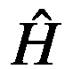和面法线向量之间的角度变化而增强然后减弱的。

您也可以在`Hero`上调整材质以观察镜面反射度。现在，选择`Hero`对象(键入 6 键)，将其漫反射材质属性(同时按下 R、Y 和 I 键)降低到 0.2 左右，并将镜面反射属性(键入 9 以选择镜面反射，然后同时按下 E、T 和 U 键)增加到超过 1 的值。有了这个设置，漫射项减少了，镜面高光得到了强调，你可以观察到一个带有明亮高光点的黑色`Hero`图形。如果您不确定，请尝试切换灯 0(键入 0 键)开/关(键入 H 键)。此时，您可以按住 P 键来降低亮度 n 的值。随着 n 值的降低，您可以观察到高亮显示的点的大小增加，同时这些点的亮度降低。如图 [8-14](#Fig14) 的中间球体所示，较小的 n 值对应于抛光程度较低的表面，该表面通常呈现面积较大但强度较低的高光。

相对较小的物体，如`Hero`，不会占据很多像素；相关联的高光可能跨越甚至更少数量的像素，并且可能难以观察。镜面高光可以传达微妙而重要的效果；然而，掌握它的用法也很有挑战性。

## 光源类型

在这一点上，你的游戏引擎支持由单一类型的灯光，点光源的许多实例照明。点光源的行为很像真实世界中的灯泡。它从具有远近半径的单一位置照明，在该位置物体可以被光完全、部分或完全照亮。在大多数游戏引擎中，还有另外两种常见的灯光类型:平行光和聚光灯。

与点光源相反，平行光没有光源位置或范围。相反，它以特定的方向照亮了一切。虽然这些特性看起来不直观，但它们非常适合一般的背景照明。现实世界就是这样。白天，一般环境由太阳照明，其中来自太阳的光线可以方便地建模为平行光。从地球的角度看，来自太阳的光线实际上是平行的，来自一个固定的方向，这些光线照亮了一切。平行光是一种简单的光类型，只需要一个方向变量，没有距离衰减。平行光通常用作照亮整个场景的全局光。

聚光灯模拟了一个带有锥形灯罩的台灯。如图 [8-21](#Fig21) 所示，聚光灯是由一个指向特定方向(光线方向)的圆锥体包围的点光源，具有内锥角和外锥角的角度衰减参数。类似于距离衰减的远近半径，内锥角内的对象被完全照亮，外锥角外的对象不被照亮，而两个角之间的对象被部分照亮。就像点光源一样，聚光灯通常用于在游戏场景的特定区域创建照明效果。聚光灯具有方向和角度衰减参数，为模拟游戏中特定区域的局部效果提供了更好的控制。

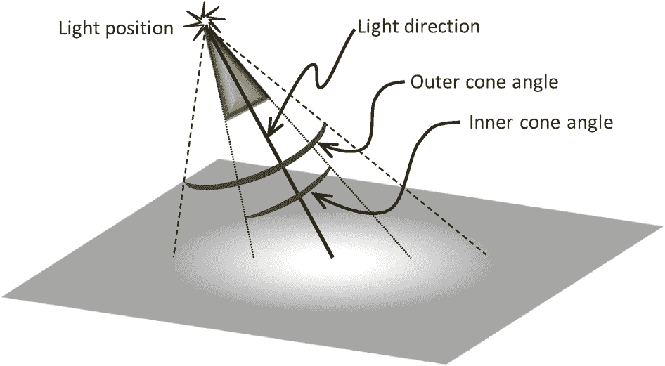

图 8-21

聚光灯及其参数

Note

在示意图中，如图 [8-21](#Fig21) 所示，为了清晰起见，光线方向通常由从光线位置向环境延伸的线条表示。这些线条通常用于说明目的，并不具有数学意义。这些示意图与解释照明计算的矢量图形成对比，如图 [8-15](#Fig15) 和 [8-16](#Fig16) 。在矢量图中，所有矢量总是指向远离被照亮的位置，并被假定为以 1 的量级归一化。

### 平行光和聚光灯项目

这个项目演示了如何将平行光和聚光灯集成到引擎中，以支持更广泛的照明效果。你可以在图 [8-22](#Fig22) 中看到项目运行的例子。这个项目的源代码位于`chapter8/8.6.directional_and_spotlights`文件夹中。

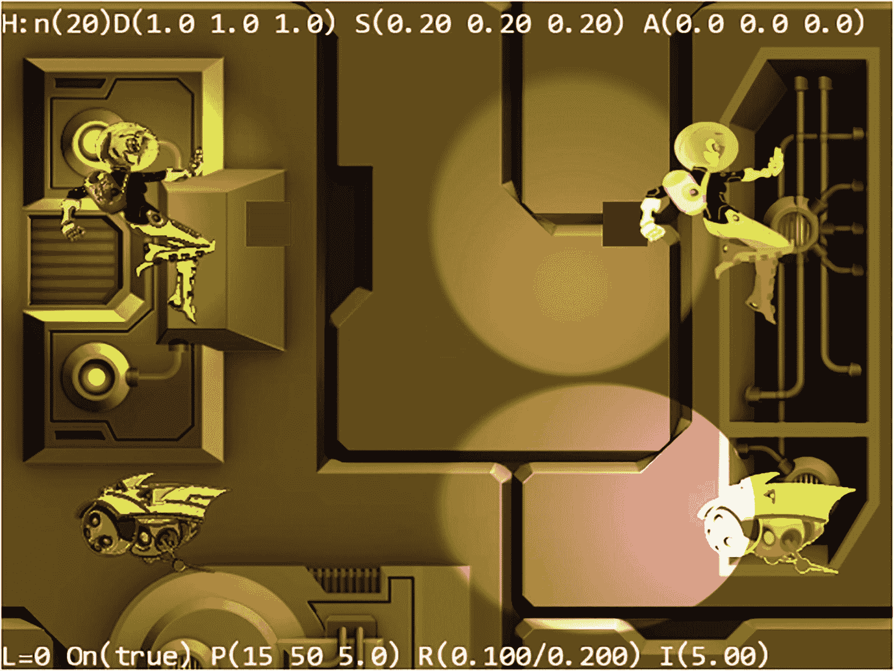

图 8-22

运行平行光和聚光灯项目

该项目的控制措施如下:

*   **WASD 键**:移动屏幕上的英雄角色

照明控制:

*   **数字键 0、1、2、3** :选择对应的光源。

*   **箭头键**:移动当前选中的灯；请注意，这对平行光(灯光 1)没有影响。

*   **按空格键的箭头键**:改变当前选择的光的方向；请注意，这对点光源(光源 0)没有影响。

*   **Z/X 键**:增加/减少灯光 Z 位置；请注意，这对平行光(灯光 1)没有影响。

*   **C/V 和 B/N 键**:增加/减少所选光线的内外锥角；请注意，这些仅影响场景中的两个聚光灯(灯光 2 和 3)。

*   **K/L 键**:增加/减少所选光线的强度。

*   **H 键**:切换所选灯的开/关。

材料属性控制:

*   **数字键 5 和 6** :选择左边的仆人和英雄

*   **数字键 7、8、9** :选择*K*<sub>T5】a</sub>， *K* <sub>*d*</sub> ， *K* <sub>*s*</sub> 所选角色(左仆从或英雄)的材料属性

*   **E/R、T/Y、U/I 键**:增加/减少所选材质属性的红色、绿色、蓝色通道

*   **O/P 键**:增加/减少所选材料属性的亮度

该项目的目标如下:

*   了解另外两种光源类型:平行光和聚光灯

*   检查所有三种不同光源类型的照明结果

*   为了体验控制所有三种光类型的参数

*   在引擎和 GLSL 着色器中支持三种不同的灯光类型

#### 在 GLSL 碎片着色器中支持新的灯光类型

与之前的项目一样，新功能的集成将从 GLSL 着色器开始。您必须修改 GLSL `IllumShader`和`LightShader`片段着色器，以支持这两种新的灯光类型。

##### 修改 GLSL 照明片段着色器

回想一下`IllumShader`基于点光源模拟 Phong 照明模型。这将扩展到支持两种新的光源类型。

1.  首先编辑`illum_fs.glsl`并为三种光类型定义常数。注意，为了支持 GLSL 着色器和引擎之间的正确通信，这些常量必须具有与在`light.js`文件中定义的相应枚举数据相同的值。

1.  扩展光源`struct`以适应新的光源类型。平行光只需要一个`Direction`变量，而聚光灯需要一个`Direction`、内角和外角以及一个`DropOff`变量。如接下来将详细描述的，代替实际的角度值，内角和外角的余弦被存储在该结构中以便于高效实现。`DropOff`变量控制聚光灯内外角之间光线衰减的速度。`LightType`变量标识在结构中表示的光的类型。

```js
#define ePointLight      0
#define eDirectionalLight  1
#define eSpotLight      2
    // ******** WARNING ******
    // The above enumerated values must be identical to
    // Light.eLightType values defined in Light.js
    // ******** WARNING ******

```

1.  定义一个`AngularDropOff()`函数来计算聚光灯的角度衰减:

```js
struct Light  {
    vec3 Position;  // in pixel space!
    vec3 Direction;    // Light direction
    vec4 Color;
    float Near;
    float Far;
    float CosInner;    // Cosine of inner cone angle for spotlight
    float CosOuter;    // Cosine of outer cone angle for spotlight
    float Intensity;
    float DropOff;    // for spotlight
    bool  IsOn;
    int LightType;    // One of ePoint, eDirectional, or eSpot
};

```

```js
float AngularDropOff(Light lgt, vec3 lgtDir, vec3 L) {
    float strength = 0.0;
    float cosL = dot(lgtDir, L);
    float num = cosL - lgt.CosOuter;
    if (num > 0.0) {
        if (cosL > lgt.CosInner)
            strength = 1.0;
        else {
            float denom = lgt.CosInner - lgt.CosOuter;
            strength = smoothstep(0.0, 1.0, pow(num/denom, lgt.DropOff));
        }
    }
    return strength;
}

```

参数`lgt`是`Light struct`中的一个聚光灯，`lgtDir`是聚光灯的方向(或`Light.Direction`归一化)，而`L`是当前被照明位置的光线矢量。注意，由于归一化矢量的点积是矢量之间角度的余弦，所以用相应的余弦值来表示所有的角位移并根据角位移的余弦值进行计算是很方便的。图 [8-23](#Fig23) 显示了角衰减计算中涉及的参数。

Note

`lgtDir`是聚光灯的方向，而光矢量 **L** 是从被照亮的位置到聚光灯位置的矢量。

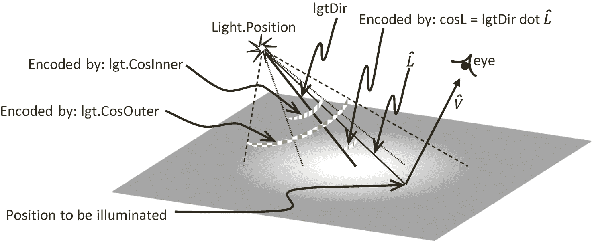

图 8-23

计算聚光灯的角度衰减

Note

以下代码基于角位移的余弦值。一定要记住，给定两个角度 *α* 和 *β* ，其中两者都在 0 到 180 度之间，如果 *α* > *β* ，那么，cos *α* < cos *β* 。

1.  在将结果组合成一种颜色之前，修改`ShadedResults()`函数以处理光源类型的每一种单独情况:

1.  `cosL`是`L`与`lgtDir`的点积；它记录当前被照亮位置的角位移。

2.  `num`变量存储了`cosL`和`cosOuter`之间的差值。负的`num`意味着当前被照亮的位置在外锥之外，该位置将不被照亮，因此不需要进一步计算。

3.  如果要照明的点在内锥内，`cosL`将大于`lgt.CosInner`，将返回光的最大强度 1.0。

4.  如果要照亮的点在内外锥角之间，使用`smoothstep()`功能计算光线的有效强度。

```js
vec4 ShadedResult(Light lgt, vec3 N, vec4 textureMapColor) {
    float aStrength = 1.0, dStrength = 1.0;
    vec3 lgtDir = -normalize(lgt.Direction.xyz);
    vec3 L; // light vector
    float dist; // distance to light
    if (lgt.LightType == eDirectionalLight) {
        L = lgtDir;
    } else {
        L = lgt.Position.xyz - gl_FragCoord.xyz;
        dist = length(L);
        L = L / dist;
    }
    if (lgt.LightType == eSpotLight) {
        // spotlight: do angle dropoff
        aStrength = AngularDropOff(lgt, lgtDir, L);
    }
    if (lgt.LightType != eDirectionalLight) {
        // both spot and point light has distance dropoff
        dStrength = DistanceDropOff(lgt, dist);
    }
    vec4  diffuse = DiffuseResult(N, L, textureMapColor);
    vec4  specular = SpecularResult(N, L);
    vec4 result = aStrength * dStrength *
                  lgt.Intensity * lgt.Color * (diffuse + specular);
    return result;
}

```

##### 修改 GLSL 灯光片段着色器

现在可以修改 GLSL `light_fs`片段着色器来支持两种新的灯光类型。所涉及的修改与对`illum_fs`所做的更改非常相似，其中定义了对应于光类型的常数值，扩展了`Light struct`以支持方向和聚光灯，并定义了角度和距离衰减函数以正确计算光的强度。具体实现请参考`light_fs.glsl`源代码文件。

#### 修改灯光类别

您必须扩展`Light`类来支持两种新光源类型的参数:

1.  编辑`src/engine/lights`文件夹中的`light.js`,定义并导出不同灯类型的枚举数据类型。重要的是，枚举值对应于 GLSL `illum_fs`和`light_fs`着色器中定义的常量值。

1.  修改构造函数，定义并初始化与平行光和聚光灯参数相对应的新变量。

```js
// **** WARNING: The following enumerate values must be identical to
// the values of
//
//   ePointLight, eDirectionalLight, eSpotLight
//
// defined in LightFS.glsl and IllumFS.glsl
const eLightType = Object.freeze({
    ePointLight: 0,
    eDirectionalLight: 1,
    eSpotLight: 2
});

export { eLightType }

```

1.  为新变量定义 get 和 set 访问器。这里没有列出这些函数的全部内容。详情请参考`light.js`源代码文件。

```js
constructor() {
    this.mColor = vec4.fromValues(1, 1, 1, 1);  // light color
    this.mPosition = vec3.fromValues(0, 0, 5); // light position in WC
    this.mDirection = vec3.fromValues(0, 0, -1); // in WC
    this.mNear = 5;  // effective radius in WC
    this.mFar = 10;
    this.mInner = 0.1;  // in radian
    this.mOuter = 0.3;
    this.mIntensity = 1;
    this.mDropOff = 1;  //
    this.mLightType = eLightType.ePointLight;
    this.mIsOn = true;
}

```

#### 修改 ShaderLightAt 类

回想一下，`ShaderLightAt`类负责从光源加载值到 GLSL 片段着色器。必须优化该对象，以支持与平行光和聚光灯对应的新光源参数。

1.  编辑`shader_light_at.js`从`light.js`导入`eLightType`枚举类型:

1.  修改`_setShaderReferences()`功能，设置对新添加的灯光属性的引用:

```js
import { eLightType } from "../lights/light.js";

```

1.  修改`loadToShader()`函数，为平行光和聚光灯加载新添加的灯光变量。请注意，根据灯光类型，一些变量的值可能不会传递到 GLSL 着色器。例如，与角度衰减、内角和外角以及衰减相关的参数将仅针对聚光灯进行传递。

```js
_setShaderReferences(aLightShader, index) {
    let gl = glSys.get();
    this.mColorRef = gl.getUniformLocation(
                          aLightShader, "uLights[" + index + "].Color");
    this.mPosRef = gl.getUniformLocation(
                       aLightShader, "uLights[" + index + "].Position");
    this.mDirRef = gl.getUniformLocation(
                      aLightShader, "uLights[" + index + "].Direction");
    this.mNearRef = gl.getUniformLocation(
                           aLightShader, "uLights[" + index + "].Near");
    this.mFarRef = gl.getUniformLocation(
                            aLightShader, "uLights[" + index + "].Far");
    this.mInnerRef = gl.getUniformLocation(
                       aLightShader, "uLights[" + index + "].CosInner");
    this.mOuterRef = gl.getUniformLocation(
                       aLightShader, "uLights[" + index + "].CosOuter");
    this.mIntensityRef = gl.getUniformLocation(
                      aLightShader, "uLights[" + index + "].Intensity");
    this.mDropOffRef = gl.getUniformLocation(
                        aLightShader, "uLights[" + index + "].DropOff");
    this.mIsOnRef = gl.getUniformLocation(
                           aLightShader, "uLights[" + index + "].IsOn");
    this.mLightTypeRef = gl.getUniformLocation(
                      aLightShader, "uLights[" + index + "].LightType");
}

```

```js
loadToShader(aCamera, aLight) {
    let gl = glSys.get();
    gl.uniform1i(this.mIsOnRef, aLight.isLightOn());

    // Process a light only when it is switched on
    if (aLight.isLightOn()) {

        ... identical to previous code ...

        gl.uniform1f(this.mFarRef, f);
        gl.uniform1f(this.mInnerRef, 0.0);
        gl.uniform1f(this.mOuterRef, 0.0);
        gl.uniform1f(this.mIntensityRef, aLight.getIntensity());
        gl.uniform1f(this.mDropOffRef, 0);
        gl.uniform1i(this.mLightTypeRef, aLight.getLightType());

        // Point light does not need the direction
        if (aLight.getLightType() === eLightType.ePointLight) {
            gl.uniform3fv(this.mDirRef, vec3.fromValues(0, 0, 0));
        } else {
            // either spot or directional lights: must compute direction
            let d = aCamera.wcDirToPixel(aLight.getDirection());
            gl.uniform3fv(this.mDirRef, vec3.fromValues(d[0],d[1],d[2]));
            if (aLight.getLightType() === eLightType.eSpotLight) {
                gl.uniform1f(this.mInnerRef,
                             Math.cos(0.5 * aLight.getInner()));
                gl.uniform1f(this.mOuterRef,
                             Math.cos(0.5 * aLight.getOuter()));
                gl.uniform1f(this.mDropOffRef, aLight.getDropOff());
            }
        }
    }
}

```

注意，对于`mInnerRef`和`mOuterRef`，实际计算并传递一半角度的余弦。内角和外角是聚光灯的总角展度，其中这些角的一半描述了与光线方向的角位移。由于这个原因，半角的余弦将实际用于计算。这种优化使 GLSL 片段着色器无需在每次调用时重新计算这些角度的余弦值。

#### 修改相机变换类

平行光和聚光灯需要灯光方向，GLSL `illum_fs`和`light_fs`着色器希望在像素空间中指定该方向。编辑相机对象的`camera_xform.js`文件，定义`wcDirToPixel()`函数，将方向从 WC 转换到像素空间。

```js
Camera.prototype.wcDirToPixel = function (d) {  // d:vec3 direction in WC
    // Convert the position to pixel space
    let x = d[0] * this.mRenderCache.mWCToPixelRatio;
    let y = d[1] * this.mRenderCache.mWCToPixelRatio;
    let z = d[2];
    return vec3.fromValues(x, y, z);
}

```

#### 测试新的照明类型

`MyGame`级的主要目标是测试和提供操纵新光源类型的功能。所涉及的修改是简单的；修改`my_game_lights.js`以创建所有三种灯光类型，修改`my_game_light_control.js`以支持同时按下箭头键和空格键时对所选灯光方向的操作。这里没有显示这些简单更改的实现。有关详细信息，请参考源代码文件。

#### 观察

您可以运行项目并交互控制灯光来检查相应的效果。定义了四个光源，每个光源照亮场景中的所有对象。光源 0 是点光源，1 是平行光，2 和 3 是聚光灯。

通过键入 1 键选择平行光，可以检查平行光的效果。现在按住空格键，同时轮流按左/右或上/下键来改变方向灯的方向。您会注意到背景图像中 3D 几何形状的边界上的照明发生了剧烈变化，偶尔还会出现镜面反射的突出红色斑点。现在，键入 H 键关闭方向灯，观察整个场景变得更暗。没有任何种类的衰减，平行光可以用作照亮整个场景的有效工具。

再次键入 2 或 3 键选择一个聚光灯，方法是按住空格键，同时轮流按下左/右或上/下键来改变聚光灯的方向。使用聚光灯，您将观察到照明区域在一个圆形(当聚光灯垂直指向背景图像时)和不同的拉长椭圆之间摆动和改变形状。箭头键将移动被照亮的区域。尝试使用 C/V 和 B/N 键来增加/减少内外锥角。请注意，如果将内锥角设置为大于外锥角，照明区域的边界会变得清晰，聚光灯的照明效果会突然减弱。为了更清楚地观察聚光灯效果，可以考虑关闭方向灯“灯光 1”。

尝试不同的灯光设置，包括重叠灯光照明区域并将灯光强度、K 键和 L 键设置为负数。虽然在现实世界中不可能，但在游戏世界中，负强度灯光是完全有效的选择。

## 阴影模拟

阴影是光线被阻挡或遮挡的结果。作为一种日常现象，影子是你观察到但可能没有太多考虑的东西。然而，阴影在人类的视觉感知系统中起着至关重要的作用。例如，物体的阴影传达了相对大小、深度、距离、顺序等重要信息。在视频游戏中，适当的阴影模拟可以提高外观质量和逼真度。例如，您可以使用阴影来恰当地传达两个游戏对象之间的距离或英雄正在跳跃的高度。

可以通过确定环境中要照明的位置和每个光源位置之间的可见度来模拟阴影。如果某个位置被光源遮挡，或者从光源看不到该位置，则该位置相对于光源处于阴影中。在计算上，这是一个昂贵的操作，因为一般的可见性确定是一个 *O(n)* 操作，其中 *n* 是场景中对象的数量，并且必须对被照亮的每个像素执行该操作。从算法上来说，这是一个具有挑战性的问题，因为在照明计算期间，对于每个被照明的像素，可见性的解决方案必须在片段着色器中可用。

由于计算和算法的挑战，许多视频游戏不是根据物理世界来模拟阴影，而是基于专用的硬件资源仅为选定的对象近似或创建类似阴影的效果。在本节中，您将学习通过选择基于 WebGL 模板缓冲区的专用阴影投射器和接收器来近似阴影。

图 [8-24](#Fig24) 显示了一个游戏想要将`Hero`物体的阴影投射到小精灵而不是背景上的例子。在这种情况下，背景对象将不参与阴影计算，因此不会接收到阴影。

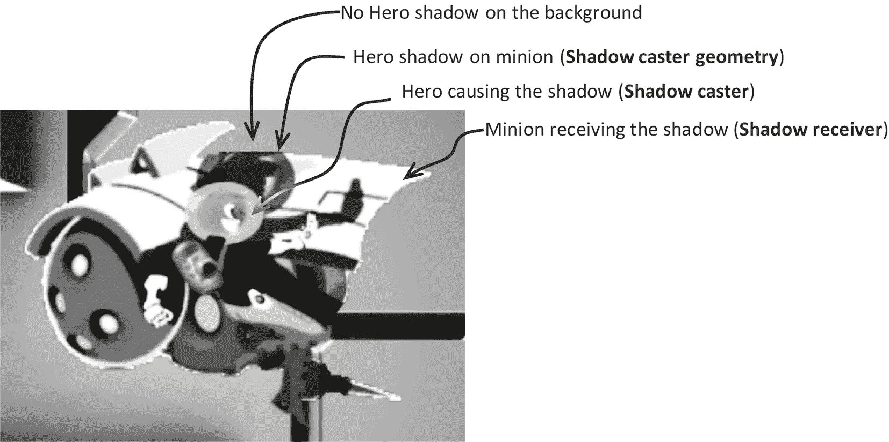

图 8-24

英雄在仆从身上投射阴影，但不在背景上

为了正确模拟和渲染图 [8-24](#Fig24) 中的阴影，如图 [8-25](#Fig25) 所示，有三个重要的要素。

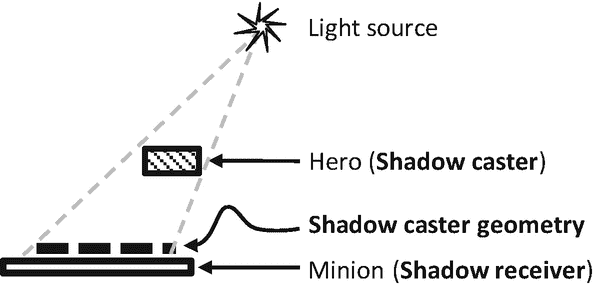

图 8-25

阴影模拟的三个参与元素:投射者、投射者几何体和接收者

*   **影子施法者**:这是产生影子的物体。在图 [8-24](#Fig24) 的例子中，`Hero`物体是阴影投射者。

*   **阴影接收器**:这是出现阴影的物体。在图 [8-24](#Fig24) 的例子中，`Minion`物体是阴影接收器。

*   **阴影投射者几何**:这是实际的阴影，换句话说，阴影接收器上的黑暗是因为光线的遮挡。在图 [8-24](#Fig24) 的例子中，出现在实际英雄物体后面的奴才身上的英雄黑暗印记是阴影施法者的几何图形。

给定三个参与元素，阴影模拟算法相当简单:计算阴影投射器几何体，照常渲染阴影接收器，将阴影投射器几何体渲染为接收器上的暗阴影投射器对象，最后，照常渲染阴影投射器。例如，为了渲染图 [8-24](#Fig24) 中的阴影，首先根据光源、`Hero`对象(阴影投射者)和`Minion`对象(阴影接收器)的位置计算黑暗英雄阴影投射者的几何体。之后，`Minion`对象(阴影接收器)首先像往常一样渲染，然后像`Hero`对象一样渲染阴影投射器几何体，颜色保持不变，最后`Hero`对象(阴影投射器)像往常一样渲染。

请注意，阴影实际上是一种视觉效果，因为光能被阻挡，物体上的颜色看起来更暗。需要注意的重要一点是，当一个人观察阴影时，没有新的物体或几何图形参与其中。这与所描述的算法形成了鲜明的对比，在所描述的算法中，阴影是由阴影投射几何体(深色物体)模拟的。这个深色物体实际上并不存在于场景中。它是通过算法创建的，以近似光线被遮挡的视觉感知。这种创建和渲染额外的几何图形来模拟人类视觉感知的结果，虽然有趣，但也有其自身的挑战。

如图 [8-26](#Fig26) 所示，当阴影投射者的几何图形超出阴影接受者的界限时，阴影的幻觉就会消失。这种情况必须被适当地解决，以便阴影看起来是真实的。在图 [8-24](#Fig24) 中可以看到正确处理这种情况的例子；英雄头盔阴影的顶部超出了仆从的范围，所以没有画出来。

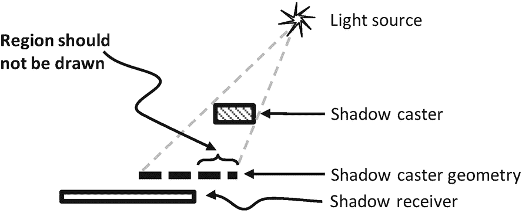

图 8-26

阴影投射者超出了阴影接受者的范围

幸运的是，WebGL 模板缓冲区是专门为解决这些情况而设计的。WebGL 模板缓冲区可以配置为开/关开关的 2D 阵列，其像素分辨率与 web 浏览器上显示的画布相同。使用这种配置，当启用模板缓冲区检查时，画布中可以绘制的像素将仅是那些对应的模板缓冲区像素被打开的像素。

图 [8-27](#Fig27) 用一个例子来说明该功能。在这个例子中，中间层是模板缓冲区，除了白色三角形区域中的像素被初始化为 on 之外，所有像素都被初始化为 off。当启用模板缓冲区检查时，顶层图像的绘制将导致画布(底层)中仅出现一个三角形区域。这个三角形区域由对应于模板缓冲区中三角形的 on 位置的像素形成。这样，模板缓冲区就像画布上的模板一样，只能在画布上绘制 on 区域。

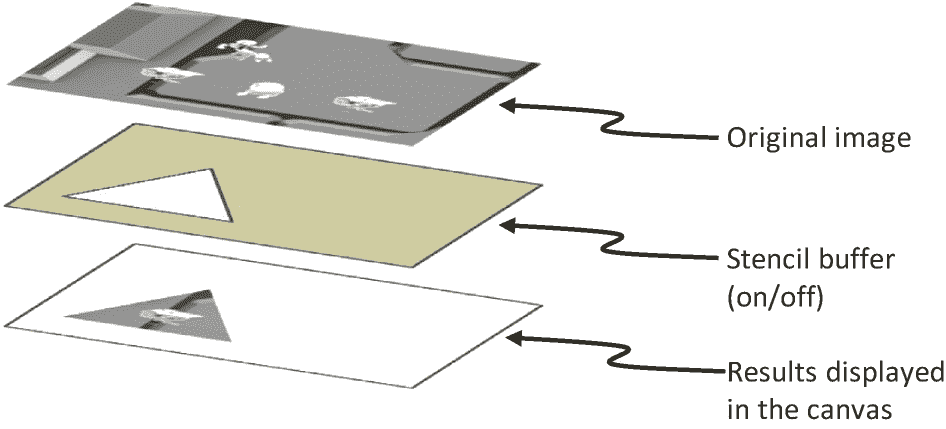

图 8-27

WebGL 模具缓冲区

在 WebGL 模板缓冲区的支持下，现在可以通过识别所有阴影接收器和将每个接收器对应的阴影投射器分组来相应地指定阴影模拟。在图 [8-24](#Fig24) 的例子中，`Hero`物体被分组为 minion 阴影接收器的阴影投射者。在这个例子中，背景物体要接收英雄的阴影，它必须被明确地标识为阴影接收器，并且`Hero`物体必须作为阴影投射者与它组合在一起。请注意，如果没有明确地将 minion 对象分组为背景阴影接收器的阴影投射者，minion 将不会在背景上投射阴影。

如将在下面的实现讨论中详细描述的，阴影投射器和接收器的透明度以及投射光源的强度都会影响阴影的生成。重要的是要认识到，这种阴影模拟实际上是一种算法创造，其效果可以用来近似人类的感知。这个过程并没有描述阴影在现实世界中是如何形成的，完全有可能创造出不真实的戏剧效果，比如投射透明或者蓝色的阴影。

### 阴影模拟算法

阴影模拟和渲染算法现在可以概述如下:

```js
Given a shadowReceiver
    A: Draw the shadowReceiver to the canvas as usual

    // Stencil op to enable the region for drawing on the shadowCaster
    B1: Initialize all stencil buffer pixels to off
    B2: Switch on stencil buffer pixels correspond to shadowReceiver
    B3: Enable stencil buffer checking

    // Compute shadowCaster geometries and draw them on shadowReceiver
    C: For each shadowCaster of this shadowReceiver
      D: For each shadow casting light source
            D1: Compute the shadowCaster geometry
            D2: Draw the shadowCaster geometry

```

列出的代码渲染阴影接收器和所有阴影投射器几何体，而不渲染实际的阴影投射器对象。B1、B2 和 B3 步骤打开对应于阴影接收器的模板缓冲像素。这类似于打开与图 [8-27](#Fig27) 中白色三角形相关的像素，启用可绘制的区域。步骤 C 和 D 的循环指出，必须为每个阴影投射光源计算单独的几何图形。到 D1 绘制阴影投射器几何图形的时间步时，包含阴影接收器印记的模板缓冲区和检查已启用，只有阴影接收器占用的像素才能在画布上绘制。

### 阴影着色器项目

这个项目演示了如何实现和集成阴影模拟算法到你的游戏引擎中。您可以在图 [8-28](#Fig28) 中看到项目运行的示例。这个项目的源代码位于`chapter8/8.7.shadow_shaders`文件夹中。

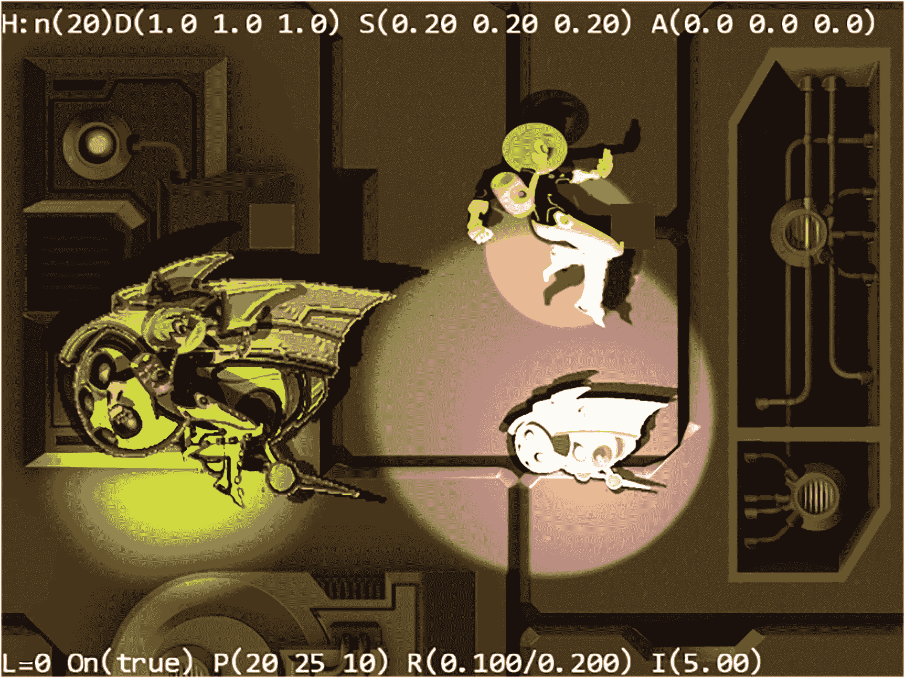

图 8-28

运行阴影着色器项目

这个项目的控制与前一个项目相同:

*   **WASD 键**:移动屏幕上的英雄角色

照明控制:

*   **数字键 0、1、2、3** :选择对应的光源

*   **箭头键**:移动当前选中的灯；请注意，这对平行光(灯光 1)没有影响。

*   **按空格键的箭头键**:改变当前选择的光的方向；请注意，这对点光源(光源 0)没有影响。

*   **Z/X 键**:增加/减少灯光 Z 位置；请注意，这对平行光(灯光 1)没有影响。

*   **C/V 和 B/N 键**:增加/减少所选光线的内外锥角；请注意，这些仅影响场景中的两个聚光灯(灯光 2 和 3)。

*   **K/L 键**:增加/减少所选光线的强度。

*   **H 键**:切换所选灯的开/关。

材料属性控制:

*   **数字键 5 和 6** :选择左边的仆人和英雄

*   **数字键 7、8、9** :选择*K*<sub>T5】a</sub>， *K* <sub>*d*</sub> ， *K* <sub>*s*</sub> 所选角色(左仆从或英雄)的材料属性

*   **E/R、T/Y、U/I 键**:增加/减少所选材质属性的红色、绿色、蓝色通道

*   **O/P 键**:增加/减少所选材料属性的亮度

该项目的目标如下:

*   理解阴影可以通过算法定义和渲染明确的几何图形来近似

*   欣赏 WebGL 模板缓冲区的基本操作

*   理解使用阴影投射器和接收器模拟阴影

*   基于 WebGL 模板缓冲区实现阴影模拟算法

#### 创建 GLSL 片段着色器

需要两个独立的 GLSL 片段着色器来支持阴影的渲染，一个用于将阴影投射器几何体绘制到画布上，另一个用于将阴影接收器绘制到模板缓冲区中。

##### 定义 GLSL 阴影投射片段着色器

GLSL `shadow_caster_fs`片段着色器支持阴影投射几何体的绘制。参见图[8-25](#Fig25)；阴影投射者的几何体是一个几何体，它假装是阴影投射者的阴影。该几何图形通常由引擎根据其与阴影投射者的距离进行缩放；离施法者越远，这个几何体就越大。

在片段着色器中，该几何体应该渲染为深色对象，以创建它是阴影的错觉。注意，每个阴影投射光源需要一个阴影投射几何体；因此，片段着色器仅支持一个光源。最后，该对象的黑暗程度取决于阴影投射光源的有效强度，因此，片段着色器必须定义功能来计算每种类型光源的强度。

1.  在`src/glsl_shaders`文件夹中，创建一个文件`shadow_caster_fs.glsl`。由于所有灯光类型都可以投射阴影，因此必须支持现有的灯光结构。现在，从`light_fs`(未显示)复制`Light struct`和光类型常量。这些数据结构和常量必须完全相同，以便引擎中相应的接口着色器可以重用现有的支持`LightShader`的实用程序。唯一的区别是，由于必须为每个光源定义阴影投射几何体，在这种情况下，`uLight`数组大小正好为 1。

2.  定义阴影渲染的常数。`kMaxShadowOpacity`是不透明阴影应该达到的程度，而`kLightStrengthCutOff`是一个截止阈值，强度小于该值的光线不会投射阴影。

1.  为了正确支持来自三种不同光源类型`AngularDropOff()`和`DistanceDropOff()`的阴影投射，函数也必须以与`light_fs`(和`illum_fs`)中完全相同的方式定义。你可以从`light_fs`那里复制这些功能。请注意，由于`uLight`阵列中只有一个光源，您可以从这些函数中移除光源参数，并在计算中直接引用`uLight[0]`。这个参数替换是唯一需要的修改，因此这里没有显示代码。

2.  请记住，阴影是因为光线遮挡而被观察到的，与光源的颜色无关。现在，修改`LightStrength()`函数来计算到达被照亮位置的光强度，而不是阴影颜色。

```js
#define kMaxShadowOpacity 0.7  // max of shadow opacity
#define kLightStrengthCutOff 0.05 // any less will not cause shadow

```

```js
float LightStrength() {
    float aStrength = 1.0, dStrength = 1.0;
    vec3 lgtDir = -normalize(uLights[0].Direction.xyz);
    vec3 L; // light vector
    float dist; // distance to light
    if (uLights[0].LightType == eDirectionalLight) {
        L = lgtDir;
    } else {
        L = uLights[0].Position.xyz - gl_FragCoord.xyz;
        dist = length(L);
        L = L / dist;
    }
    if (uLights[0].LightType == eSpotLight) {
        // spotlight: do angle dropoff
        aStrength = AngularDropOff(lgtDir, L);
    }
    if (uLights[0].LightType != eDirectionalLight) {
        // both spot and point light has distance dropoff
        dStrength = DistanceDropOff(dist);
    }
    float result = aStrength * dStrength;
    return result;
}

```

将列出的`LightStrength()`与`light_fs`中的相同功能进行比较，主要有两个区别。首先，该函数不考虑灯光的颜色，而是返回一个浮点值，即光源的聚合强度。其次，由于`uLight`数组的大小为 1，该函数在计算中移除了灯光参数并引用了`uLight[0]`。

1.  根据光源的强度，在`main()`函数中计算阴影的颜色。请注意，如果光线强度小于`kLightStrengthCutOff`，将不会投射阴影，并且阴影的实际颜色并不完全是黑色或不透明。相反，它是程序员定义的`uPixelColor`和来自纹理贴图的采样透明度的混合。

```js
void main(void)
{
    vec4 texFragColor = texture2D(uSampler, vTexCoord);
    float lgtStrength = LightStrength();
    if (lgtStrength < kLightStrengthCutOff)
        discard;
    vec3 shadowColor = lgtStrength * uPixelColor.rgb;
    shadowColor *= uPixelColor.a * texFragColor.a;
    gl_FragColor = vec4(shadowColor,
                       kMaxShadowOpacity * lgtStrength * texFragColor.a);
}

```

##### 定义 GLSL 阴影接收器片段着色器

GLSL `shadow_receiver_fs`片段着色器是用于将阴影接收器绘制到模板缓冲区中的着色器。请注意，模板缓冲区被配置为开/关缓冲区，其中`gl_FragColor`中返回的任何值都会将相应的像素切换到开。因此，必须丢弃透明的接收器片段。

1.  在`src/glsl_shaders`文件夹下，创建`shadow_receiver_fs.glsl`，定义一个`sampler2D`对象对阴影接收对象的颜色纹理贴图进行采样。此外，将常数`kSufficientlyOpaque`定义为不透明度较小的片段将被视为透明并被丢弃的阈值。对应于丢弃片段的模板缓冲像素将保持关闭，因此将不能接收阴影几何图形。

```js
// The object that fetches data from texture.
// Must be set outside the shader.
uniform sampler2D uSampler;
uniform vec4 uPixelColor;

// "varying" signifies that the texture coordinate will be
// interpolated and thus varies.
varying vec2 vTexCoord;

#define kSufficientlyOpaque       0.1

```

注意，为了便于引擎着色器类代码重用，不得更改变量名称`uSampler`和`vTexCoord`。这些对应于`texture_fs.glsl`中定义的变量名，游戏引擎可以使用现有的`SpriteShader`来方便信息加载到这个着色器中。

1.  执行`main()`函数对阴影接收器对象的纹理进行采样，并测试不透明度阈值，以确定是否可以接收阴影:

```js
void main(void)
{
    vec4 texFragColor = texture2D(uSampler, vTexCoord);
    if (texFragColor.a < kSufficientlyOpaque)
        discard;
    else
       gl_FragColor = vec4(1, 1, 1, 1);

}

```

#### 将 GLSL 阴影着色器连接到引擎

定义了两个新的 GLSL 着色器后，您可能会认为有必要定义两个对应的`SimpleShader` / `Renderable`对来促进通信。情况并非如此，原因有二:

*   首先，只需要一个新的引擎着色器类型来支持`shadow_caster_fs`。使用`shadow_receiver_fs`着色器中的策略变量命名，现有的`SpriteShader`对象可以用于与`shadow_receiver_fs` GLSL 片段着色器进行通信。

*   第二，不需要新的`Renderable`类。`Renderable`类旨在支持使用相应的着色器绘制和操作游戏对象。这样，`Renderable`的物体就被玩家看到了。在阴影着色器的情况下，`shadow_caster_fs`绘制阴影投射几何体，`shadow_receiver_fs`将阴影接收器几何体绘制到模板黄油中。请注意，这两个着色器都不支持绘制玩家可见的对象。由于这些原因，不需要相应的`Renderable`对象。

##### 创建阴影投射着色器

必须定义一个 JavaScript `SimpleShader`子类，以便于从游戏引擎向 GLSL 着色器加载信息。在这种情况下，需要定义一个`ShadowCasterShader`来与 GLSL `shadow_caster_fs`片段着色器进行通信。

1.  在`src/engine/shaders`文件夹下，创建`shadow_caster_shader.js`；定义从`SpriteShader`继承的`ShadowCasterShader`类。因为每个阴影投射几何体都是由一个投射光源创建的，所以为着色器定义一个光源。

1.  覆盖`activate()`函数以确保单个光源正确加载到着色器:

```js
import SpriteShader from "./sprite_shader.js";
import ShaderLightAt from "./shader_light_at.js";

class ShadowCasterShader extends SpriteShader {
    // constructor
    constructor(vertexShaderPath, fragmentShaderPath) {
        super(vertexShaderPath, fragmentShaderPath);

        this.mLight = null;  // The light that casts the shadow
        this.mCamera = null;

        // GLSL Shader must define uLights[1] (size of 1)!!
        this.mShaderLight = new ShaderLightAt(this.mCompiledShader, 0);
    }
    ... implementation to follow ...
}
export default ShadowCasterShader;

```

1.  定义一个函数来设置该着色器的当前相机和光源:

```js
// Overriding the activation of the shader for rendering
activate(pixelColor, trsMatrix, cameraMatrix) {
    // first call the super class' activate
    super.activate(pixelColor, trsMatrix, cameraMatrix);
    this.mShaderLight.loadToShader(this.mCamera, this.mLight);
}

```

```js
setCameraAndLights(c, l) {
    this.mCamera = c;
    this.mLight = l;
}

```

##### 实例化默认阴影投射器和接收器着色器

必须创建引擎着色器的默认实例，以连接到新定义的 GLSL 着色器主减速器和接收器片段着色器:

1.  修改`src/engine/core`文件夹中的`shader_resources.js`导入`ShadowCasterShader`，为两个新的阴影相关着色器定义常量和变量。

1.  编辑`createShaders()`函数来定义引擎着色器，以连接到新的 GLSL 片段着色器。注意，两个引擎着色器都基于`texture_vs` GLSL 顶点着色器。此外，如前所述，引擎`SpriteShader`的一个新实例被创建来连接`shadow_receiver_fs` GLSL 片段着色器。

```js
import ShadowCasterShader from "../shaders/shadow_caster_shader.js";
let kShadowReceiverFS = "src/glsl_shaders/shadow_receiver_fs.glsl";
let mShadowReceiverShader = null;
let kShadowCasterFS = "src/glsl_shaders/shadow_caster_fs.glsl";
let mShadowCasterShader = null;

```

1.  对`shader_resources.js`文件的其余修改都是例行的，包括定义访问器、加载和卸载 GLSL 源代码文件、清理着色器以及导出访问器。这里不包括这些的详细列表，因为您在许多场合看到过类似的变化。请参考实际实现的源代码文件。

```js
function createShaders() {
    ... identical to previous code ...
    mIllumShader = new IllumShader(kTextureVS, kIllumFS);
    mShadowCasterShader = new ShadowCasterShader(
                                           kTextureVS, kShadowCasterFS);
    mShadowReceiverShader = new SpriteShader(
                                         kTextureVS, kShadowReceiverFS);
}

```

#### 配置和支持 WebGL 缓冲区

将 WebGL 模板缓冲区集成到游戏引擎中需要三个修改。首先，必须启用并正确配置 WebGL 模板缓冲区。其次，必须定义函数来支持带有模板缓冲区的绘图。第三，在每次拉伸循环之前，必须适当地清除缓冲器。

1.  编辑`src/engine/core`文件夹中的`gl.js`文件，以便在引擎初始化期间启用和配置 WebGL 模板缓冲区。在`init()`函数中，添加 WebGL 初始化期间模板和深度缓冲区的分配和配置请求。请注意，深度缓冲区或 z 缓冲区也被分配和配置。这对于正确的阴影投射者支持是必要的，阴影投射者必须在接收者的前面，或者有更大的 z 深度以便在接收者上投射阴影。

1.  继续使用`gl.js`；定义函数来开始、结束和禁止使用模板缓冲区绘图。记得导出这些新的模板缓冲支持函数。

```js
function init(htmlCanvasID) {
    ... identical to previous code ...
    mGL = mCanvas.getContext("webgl2",
                     {alpha: false, depth: true, stencil: true}) ||
          mCanvas.getContext("experimental-webgl2",
                     {alpha: false, depth: true, stencil: true});

    ... identical to previous code ...

    // make sure depth testing is enabled
    mGL.enable(mGL.DEPTH_TEST);
    mGL.depthFunc(mGL.LEQUAL);
}

```

1.  在`clearCanvas()`功能中清除画布时，编辑`src/engine`文件夹中的引擎访问文件`index.js`，以清除模板和深度缓冲区:

```js
function beginDrawToStencil(bit, mask) {
    mGL.clear(mGL.STENCIL_BUFFER_BIT);
    mGL.enable(mGL.STENCIL_TEST);
    mGL.colorMask(false, false, false, false);
    mGL.depthMask(false);
    mGL.stencilFunc(mGL.NEVER, bit, mask);
    mGL.stencilOp(mGL.REPLACE, mGL.KEEP, mGL.KEEP);
    mGL.stencilMask(mask);
}

function endDrawToStencil(bit, mask) {
    mGL.depthMask(mGL.TRUE);
    mGL.stencilOp(mGL.KEEP, mGL.KEEP, mGL.KEEP);
    mGL.stencilFunc(mGL.EQUAL, bit, mask);
    mGL.colorMask(true, true, true, true);
}

function disableDrawToStencil() { mGL.disable(mGL.STENCIL_TEST); }

```

```js
function clearCanvas(color) {
    ... identical to previous code ...
    gl.clear(gl.COLOR_BUFFER_BIT | gl.STENCIL_BUFFER_BIT |
             gl.DEPTH_BUFFER_BIT);
}

```

#### 为游戏开发者定义影子支持

如定义`ShadowCasterShader`时所述，`Renderable`类不应被定义为与阴影投射器和接收器着色器配对，因为这将允许游戏开发者能够将算法创建的对象作为常规游戏对象来操作。相反，引入了`ShadowCaster`和`ShadowReceiver`类来允许游戏开发者创建阴影，而无需授权操作底层几何图形。

##### 定义阴影施法者职业

与熟悉的`Renderable`类层次不同，`ShadowCaster`类被定义为封装隐式定义的阴影投射几何体的功能。回想一下图 [8-25](#Fig25) ，阴影投射者的几何图形是基于阴影投射者`Renderable`和阴影接收器`Renderable`的位置，通过算法为每个阴影投射光源导出的。

为了支持在动画 sprite 元素上接收阴影，阴影接收器必须是`SpriteRenderable`或它的子类。阴影投射`Renderable`对象必须能够接收光源，因此必须属于`LightRenderable`或其子类。一个`ShadowCaster`对象维护对实际阴影投射和接收`Renderable`对象的引用，并定义算法来计算和渲染由投射者`LightRenderable`对象引用的每个光源的阴影投射几何图形。`ShadowCaster`类的详细信息如下:

1.  创建用于组织影子相关支持文件的`src/engine/shadows`文件夹和文件夹中的`shadow_caster.js`文件。

2.  定义`ShadowCaster`类和构造函数来初始化主销后倾角几何计算所需的实例变量和常数:

```js
import * as shaderResources from "../core/shader_resources.js";
import SpriteRenderable from "../renderables/sprite_renderable.js";
import Transform from "../utils/transform.js";
import { eLightType } from "../lights/light.js";

// shadowCaster: GameObject referencing at least a LightRenderable
// shadowReceiver: GameObject referencing at least a SpriteRenderable
class ShadowCaster {
    constructor(shadowCaster, shadowReceiver) {
        this.mShadowCaster = shadowCaster;
        this.mShadowReceiver = shadowReceiver;
        this.mCasterShader = shaderResources.getShadowCasterShader();
        this.mShadowColor = [0, 0, 0, 0.2];
        this.mSaveXform = new Transform();

        this.kCasterMaxScale = 3;   // Max amount a caster will be scaled
        this.kVerySmall = 0.001;    //
        this.kDistanceFudge = 0.01; // to avoid caster-receiver overlap
        this.kReceiverDistanceFudge = 0.6;
                 // Factor to reduce the projected caster geometry size
    }

    setShadowColor(c) {
        this.mShadowColor = c;
    }

    ... implementation to follow ...
}

export default ShadowCaster;

```

`mShadowCaster`是对至少有一个`LightRenderable`的阴影投射者`GameObject`的引用，`mShadowReceiver`是至少有一个`SpriteRenderable`渲染组件的`GameObject`。正如将在下一步中详细描述的，`mCasterShader`、`mShadowColor`和`mSaveXform`是支持阴影投射器几何图形渲染的变量。

1.  实现`draw()`功能，为照亮`mShadowCaster`的`Renderable`物体的每个光源计算并绘制阴影投射几何体:

```js
draw(aCamera) {
    let casterRenderable = this.mShadowCaster.getRenderable();
    // Step A: save caster xform/shader/color. Set caster to shadow color
    this.mShadowCaster.getXform().cloneTo(this.mSaveXform);
    let s = casterRenderable.swapShader(this.mCasterShader);
    let c = casterRenderable.getColor();
    casterRenderable.setColor(this.mShadowColor);
    let l, lgt;
    // Step B: loop through each light, if shadow casting is on
    //         compute the proper shadow offset
    for (l = 0; l < casterRenderable.getNumLights(); l++) {
        lgt = casterRenderable.getLightAt(l);
        if (lgt.isLightOn() && lgt.isLightCastShadow()) {
            // Step C: turn caster into caster geometry
            //         draws as SpriteRenderable
            this.mSaveXform.cloneTo(this.mShadowCaster.getXform());
            if (this._computeShadowGeometry(lgt)) {
                this.mCasterShader.setCameraAndLights(aCamera, lgt);
                SpriteRenderable.prototype.draw.call(
                                         casterRenderable, aCamera);
            }
        }
    }
    // Step D: restore the original shadow caster
    this.mSaveXform.cloneTo(this.mShadowCaster.getXform());
    casterRenderable.swapShader(s);
    casterRenderable.setColor(c);
}

```

`casterRenderable`是实际投射阴影的`Renderable`物体。以下是`draw()`功能的四个主要步骤:

1.  定义`_computeShadowGeometry()`函数，根据`mShadowCaster`、`mShadowReceiver`和投射光源计算阴影投射几何体。虽然在长度上有点吓人，但下面的功能在逻辑上可以分为四个区域。第一个区域声明并初始化变量。第二和第三个区域是`if`语句的两种情况，处理方向和点/聚光灯的变换参数的计算。最后一个区域将计算的参数设置为主销后倾角几何体的变换，`cxf`。

1.  步骤 A 保存投射器`Renderable`状态、变换、着色器和颜色，并通过将其着色器设置为`ShadowCasterShader` ( `mCasterShader`)及其颜色设置为阴影颜色，将其设置为阴影投射器几何体。

2.  步骤 B 遍历照亮`casterRenderable`的所有光源，寻找打开并投射阴影的光源。

3.  步骤 C，对于每个产生光的阴影，调用`_computeShadowGeometry()`函数来计算一个适当大小和位置的阴影投射几何体，并将其渲染为`SpriteRenderable`。使用替换的`ShadowCasterShader`和阴影颜色，渲染的几何体显示为实际`casterRenderable`的阴影。

4.  步骤 D 恢复`casterRenderable`的状态。

```js
_computeShadowGeometry(aLight) {
    // Region 1: declaring variables
    let cxf = this.mShadowCaster.getXform();
    let rxf = this.mShadowReceiver.getXform();
    // vector from light to caster
    let lgtToCaster = vec3.create();
    let lgtToReceiverZ;
    let receiverToCasterZ;
    let distToCaster, distToReceiver; // along the lgtToCaster vector
    let scale;
    let offset = vec3.fromValues(0, 0, 0);

    receiverToCasterZ = rxf.getZPos() - cxf.getZPos();
    if (aLight.getLightType() === eLightType.eDirectionalLight) {
        // Region 2: Processing a directional light
        if (((Math.abs(aLight.getDirection())[2]) < this.kVerySmall) ||
            ((receiverToCasterZ * (aLight.getDirection())[2]) < 0)) {
            return false;   // direction light casting side way or
            // caster and receiver on different sides of light in Z
        }
        vec3.copy(lgtToCaster, aLight.getDirection());
        vec3.normalize(lgtToCaster, lgtToCaster);

        distToReceiver = Math.abs(receiverToCasterZ / lgtToCaster[2]);
                                         // measured along lgtToCaster
        scale = Math.abs(1 / lgtToCaster[2]);
    } else {
        // Region 3: Processing a point or spot light
        vec3.sub(lgtToCaster, cxf.get3DPosition(), aLight.getPosition());
        lgtToReceiverZ = rxf.getZPos() - (aLight.getPosition())[2];

        if ((lgtToReceiverZ * lgtToCaster[2]) < 0) {
            return false;  // caster and receiver
                           // on different sides of light in Z
        }

        if ((Math.abs(lgtToReceiverZ) < this.kVerySmall) ||
           ((Math.abs(lgtToCaster[2]) < this.kVerySmall))) {
            // almost the same Z, can't see shadow
            return false;
        }
        distToCaster = vec3.length(lgtToCaster);
        vec3.scale(lgtToCaster, lgtToCaster, 1 / distToCaster);
                                           // normalize lgtToCaster
        distToReceiver = Math.abs(receiverToCasterZ / lgtToCaster[2]);
                                           // measured along lgtToCaster
        scale = (distToCaster +
                 (distToReceiver * this.kReceiverDistanceFudge)) /
                distToCaster;
    }
    vec3.scaleAndAdd(offset, cxf.get3DPosition(),
                     lgtToCaster, distToReceiver + this.kDistanceFudge);

    // Region 4: Setting casterRenderable xform
    cxf.setRotationInRad(cxf.getRotationInRad());
    cxf.setPosition(offset[0], offset[1]);
    cxf.setZPos(offset[2]);
    cxf.setWidth(cxf.getWidth() * scale);
    cxf.setHeight(cxf.getHeight() * scale);

    return true;
}

```

`aLight`参数是投射光源。这个函数的目标是通过使用`aLight`将阴影投射器投射到阴影接收器上，来计算和设置阴影投射器的几何变换`cxf`。如图 [8-29](#Fig29) 所示，投射主销后倾角几何尺寸有两种情况需要考虑。首先，对于定向光源，投影大小是一个常数。第二，对于一个点或聚光灯，投影的大小是到接收器的距离的函数。这是`if`语句的两种情况，区域 2 和 3，详细信息如下:

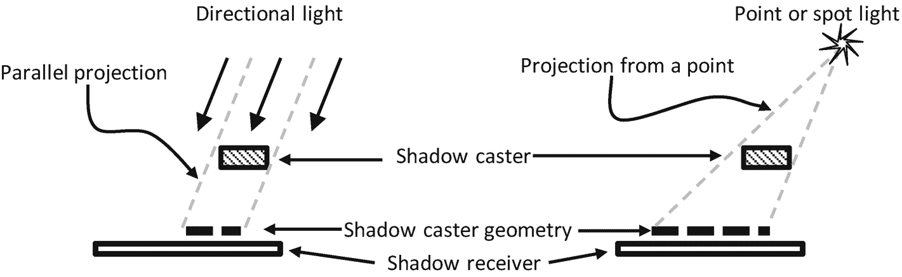

图 8-29

计算阴影投射几何图形

1.  **区域 2** :根据平行光计算平行投影。该区域内的`if`声明是为了确保当光线方向平行于 xy 平面时，或者当光线方向是从阴影接收器朝向阴影投射者时，不会计算出阴影。请注意，为了获得戏剧性的效果，阴影投射者的几何图形将被适度缩放。

2.  **区域 3** :从点或聚光灯位置计算投影。该区域内的两个`if`声明是为了确保阴影投射者和接收者在灯光位置的同一侧，并且为了保持数学稳定性，两者都不太靠近光源。

3.  **区域 4** :使用计算出的`distToReceiver`和`scale`来设置阴影投射者或`cxf`的变换。

对象是给游戏开发者定义和使用阴影的。因此，请记住更新引擎访问文件`index.js`，以便将新定义的功能转发给客户端。

##### 定义影子接收器类

回想图 [8-25](#Fig25) ，`ShadowReceiver`是施法者物体的影子会出现的物体。如图 [8-26](#Fig26) 所示，`ShadowReceiver`必须将其自身绘制到模板缓冲区中，以确保阴影投射几何体只出现在被`ShadowReceiver`对象占据的像素上。

1.  在`src/engine/shadows`文件夹中创建一个新文件`shadow_receiver.js`；定义`ShadowReceiver`类。在构造函数中，初始化接收阴影所需的常量和变量。如前所述，`mReceiver`是一个至少带有`SpriteRenderable`参考的`GameObject`，并且是阴影的实际接收方。注意`mShadowCaster`是一个由`ShadowCaster`对象组成的数组。这些物体会在`mReceiver`上投射阴影。

1.  定义`addShadowCaster()`函数来添加一个游戏对象作为这个接收者的阴影投射者:

```js
import * as shaderResources from "../core/shader_resources.js";
import ShadowCaster from "./shadow_caster.js";
import * as glSys from "../core/gl.js";

class ShadowReceiver {
    constructor(theReceiverObject) {
        this.kShadowStencilBit = 0x01;   // stencil bit for shadow
        this.kShadowStencilMask = 0xFF;  // The stencil mask
        this.mReceiverShader = shaderResources.getShadowReceiverShader();

        this.mReceiver = theReceiverObject;

        // To support shadow drawing
        this.mShadowCaster = [];         // array of ShadowCasters
    }

    ... implementation to follow ...
}
export default ShadowReceiver;

```

1.  定义`draw()`函数来绘制接收器和所有阴影投射器的几何图形:

```js
addShadowCaster(lgtRenderable) {
    let c = new ShadowCaster(lgtRenderable, this.mReceiver);
    this.mShadowCaster.push(c);
}
// for now, cannot remove shadow casters

```

```js
draw(aCamera) {
    let c;

    // Step A: draw receiver as a regular renderable
    this.mReceiver.draw(aCamera);

    // Step B: draw receiver into stencil to enable corresponding pixels
    glSys.beginDrawToStencil(this.kShadowStencilBit,
                             this.kShadowStencilMask);
    //        Step B1: swap receiver shader to a ShadowReceiverShader
    let s = this.mReceiver.getRenderable().swapShader(
                             this.mReceiverShader);
    //        Step B2: draw the receiver again to the stencil buffer
    this.mReceiver.draw(aCamera);
    this.mReceiver.getRenderable().swapShader(s);
    glSys.endDrawToStencil(this.kShadowStencilBit,
                           this.kShadowStencilMask);

    // Step C: draw shadow color to pixels with stencil switched on
    for (c = 0; c < this.mShadowCaster.length; c++) {
        this.mShadowCaster[c].draw(aCamera);
    }

    // switch off stencil checking
    glSys.disableDrawToStencil();
}

```

这个函数实现了轮廓阴影模拟算法，并没有画出实际的阴影投射者。请注意，在步骤 A 和 B2 中，`mReceiver`对象被绘制了两次。步骤 A，第一个`draw()`函数，照常将`mReceiver`渲染到画布上。步骤 B 为绘图启用模板缓冲器，其中所有随后的绘图将被引导至打开模板缓冲器像素。由于这个原因，步骤 B2 的`draw()`函数使用`ShadowReceiverShader`并打开模板缓冲区中对应于`mReceiver`对象的所有像素。有了正确的模板缓冲设置，在步骤 C 中，对`mShadowCaster`的`draw()`函数调用将只在接收器覆盖的像素中绘制相应的阴影投射几何图形。

最后，再一次，`ShadowReceiver`对象是为客户端游戏开发者创建阴影而设计的。因此，请记住更新引擎访问文件`index.js`，以便将新定义的功能转发给客户端。

#### 更新引擎支持

定义了新对象并配置了引擎后，必须修改一些现有的引擎类以支持新的影像操作。下面总结了所需的更改，但没有列出直接的更改。具体实现细节请参考源代码文件。

*   `renderable.js`:`ShadowCaster`和`ShadowReceiver`对象都需要交换着色器的能力来渲染用于阴影模拟目的的对象。这个`swapShader()`功能最好在`Renderable`层级的根中实现。

*   `light.js`:`Light`源现在定义了`mCastShadow`，一个布尔变量，以及相关的 getter 和 setter，指示灯光是否应该投射阴影。

*   `camera_main.js`:现在`Camera` WC 中心必须位于 z 距离处。为此定义了一个`kCameraZ`常数，并在`setViewAndCameraMatrix()`函数的`mCameraMatrix`计算中使用。

*   `transform.js`:必须修改`Transform`类以支持`cloneTo()`和 z 深度值的操作。

#### 测试阴影算法

测试阴影模拟有两个重要方面。首先，您必须了解如何根据实现来编程和创建阴影效果。第二，你必须验证`Renderable`物体可以作为阴影投射者和接收者。除了阴影设置和绘制之外，`MyGame`级测试用例与之前的项目类似。

##### 设置阴影

设置阴影系统的正确方法是创建所有的`ShadowCaster`对象，然后创建并添加到`ShadowReceiver`对象。`my_game_shadow.js`文件定义了`_setupShadow()`函数来演示这一点。

```js
MyGame.prototype._setupShadow = function () {
        // mLgtMinion has a LightRenderable
    this.mLgtMinionShadow = new engine.ShadowReceiver(this.mLgtMinion);
    this.mLgtMinionShadow.addShadowCaster(this.mIllumHero);
    this.mLgtMinionShadow.addShadowCaster(this.mLgtHero);

        // mIllumMinion has a SpriteAnimateRenderable
    this.mMinionShadow = new engine.ShadowReceiver(this.mIllumMinion);
    this.mMinionShadow.addShadowCaster(this.mIllumHero);
    this.mMinionShadow.addShadowCaster(this.mLgtHero);
    this.mMinionShadow.addShadowCaster(this.mLgtMinion);

        // mBg has a IllumRenderable
    this.mBgShadow = new engine.ShadowReceiver(this.mBg);
    this.mBgShadow.addShadowCaster(this.mLgtHero);
    this.mBgShadow.addShadowCaster(this.mIllumMinion);
    this.mBgShadow.addShadowCaster(this.mLgtMinion); }

```

在`MyGame`结束时调用`_setupShadow()`函数。当所有其他的`GameObject`实例都被正确地创建和初始化时，`init()`函数。这个函数演示了不同类型的`Renderable`物体可以作为阴影接收器。

*   `LightRenderable` : `mLgtMinionShadow`是用`mLgtMinon`作为接收者创建的，它引用了一个`LightRenderable`对象。

*   `IllumRenderable` : `mBgShadow`和`mMinionShadow`是用`mBg`和`mIllumMinion`作为接收者创建的，它们都引用`IllumRenderable`对象。

请注意，为了观察对象上的阴影，必须创建一个显式对应的`ShadowReceiver`，然后将`ShadowCaster`对象显式添加到接收器。例如，`mLgtMinionShadow`将`mLgtMinion`对象定义为接收器，只有`mIllumHero`和`mLgtHero`会在该对象上投射阴影。最后，注意`mLgtMinon`和`mIllumMinion`都是阴影的接收者和投射者。

##### 画阴影

在 2D 图形中，通过覆盖以前绘制的对象来绘制对象。因此，在绘制阴影投射器之前，绘制阴影接收器和阴影投射器的几何图形是很重要的。`my_game_main.js`中的以下`my_game.draw()`函数说明了对象的重要绘制顺序:

```js
draw() {
    // Clear the canvas
    engine.clearCanvas([0.9, 0.9, 0.9, 1.0]); // clear to light gray

    // Set up the camera and draw
    this.mCamera.setViewAndCameraMatrix();

    // always draw shadow receivers first!
    this.mBgShadow.draw(this.mCamera); // also draws the receiver object
    this.mMinionShadow.draw(this.mCamera);
    this.mLgtMinionShadow.draw(this.mCamera);

    this.mBlock1.draw(this.mCamera);
    this.mIllumHero.draw(this.mCamera);
    this.mBlock2.draw(this.mCamera);
    this.mLgtHero.draw(this.mCamera);

    this.mMsg.draw(this.mCamera);   // draw last
    this.mMatMsg.draw(this.mCamera);
}

```

注意抽签顺序是很重要的。首先画出所有三个阴影接收器。此外，在三个接收器中，`mBgShadow`对象是实际的背景，因此是第一个被绘制的。回想一下，在`ShadowReceiver`类的定义中，`draw()`函数也绘制了接收器对象。因此，不需要调用`mLgtMinion`、`mIllumMinion`和`mBg`对象的`draw()`函数。

其余的`MyGame`关卡和之前的项目很大程度上是相似的，这里就不一一列举了。详情请参考源代码。

#### 观察

现在，您可以运行项目并观察阴影。注意模板缓冲区的效果，其中来自`mIllumHero`对象的阴影投射到了 minion 上，但没有投射到背景上。按下 WASD 键移动两个`Hero`对象。观察阴影随着两个英雄物体移动时如何提供深度和距离线索。右边的`mLgtHero`被四盏灯照亮，因此投射出许多阴影。尝试选择和操作每个灯光，例如移动或更改方向，或者打开/关闭灯光，以观察对阴影的影响。你甚至可以尝试将阴影的颜色(在`shadow_caster.js`中)改变成某种戏剧性的颜色，比如亮蓝色[0，0，5，1]，并观察现实世界中不可能存在的阴影。

## 摘要

这一章指导你为游戏引擎开发一个简单而完整的 Phong 照明模型。这些示例是按照 Phong 照明模型的三个术语组织的:环境光、漫反射和镜面反射。光源的覆盖范围被巧妙地混合在一起，以确保每个讨论的主题都能观察到适当的照明。

本章中关于环境照明的第一个例子介绍了交互控制和微调场景颜色的概念。以下两个关于光源的例子提出了这样一个概念，即照明，一种颜色处理的算法方法，可以在引擎基础结构中本地化和开发，以支持最终的 Phong 照明模型。漫反射和法线贴图的例子非常关键，因为它支持基于简单物理模型的照明计算和 3D 环境模拟。

Phong 照明模型和对每对象材质属性的需求在镜面反射示例中进行了介绍。Phong 照明模型的中间向量版本被实现以避免计算每个像素的光源反射向量。光源类型项目演示了如何通过模拟真实世界中的不同光源来实现微妙但重要的照明变化。最后，最后一个例子说明了精确的阴影计算是非常重要的，并介绍了一种近似算法。最终的阴影模拟，尽管从真实世界的角度来看不准确并且有局限性，但在美学上是有吸引力的，并且能够传达许多相同的重要视觉线索。

本书的前四章介绍了游戏引擎的基本基础和组件。第 [5](05.html) 、 [6](06.html) 和 [7](07.html) 章扩展了核心引擎功能，分别支持绘图、游戏对象行为和相机控制。本章补充了第 [5](05.html) 章，将引擎渲染高保真场景的能力提升到了一个新的水平。在接下来的三章中，这种互补的模式将会重复。第 [9](09.html) 章将介绍物理行为模拟，第 [10](10.html) 章将讨论粒子效果，第 [11](11.html) 章将完成引擎开发，为相机提供更高级的支持，包括平铺和视差。

### 游戏设计注意事项

你在第 [7](07.html) 章的“*游戏设计考虑*”部分所做的工作是创建一个基本的良好的游戏机制，最终需要与游戏设计的其他元素相结合，以创建一些让玩家感到满意的东西。除了基本的游戏循环之外，你还需要考虑游戏的系统、设置和元游戏，以及它们将如何帮助决定你设计的关卡种类。当你开始定义场景时，你将开始探索视觉和听觉设计的想法。

与大多数视觉艺术一样，游戏在很大程度上依赖于有效地利用灯光来传达背景。发生在午夜墓地的恐怖游戏通常会使用非常不同的灯光模型和调色板，而不是专注于乐观、快乐主题的游戏。许多人认为照明主要适用于在 3D 引擎中创建的游戏，这些引擎能够模拟真实的光线和阴影，但是照明的概念也适用于大多数 2D 游戏环境；考虑 Playdead 工作室的 2D 侧滚平台游戏 *Limbo* 给出的例子，如图 [8-30](#Fig30) 所示。

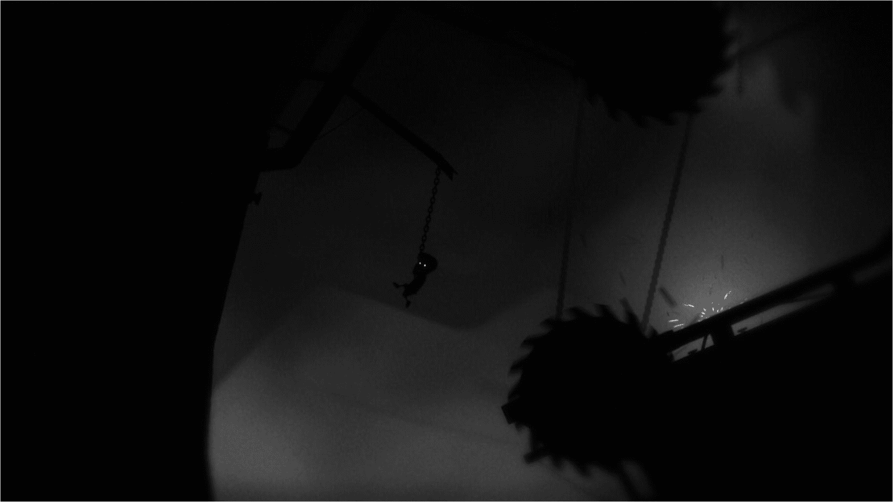

图 8-30

Playdead 和双十一的 Limbo，这是一款 2D 的侧滚游戏，巧妙利用背景照明和明暗对比技术来传达紧张和恐怖。照明既可以通过编程生成，也可以由视觉艺术家设计到图像本身的调色板中，并且通常是两者的组合(图像版权 Playdead media 详情请见 [www. playdead. com/ limbo](http://www.playdead.com/limbo)

灯光除了设置情绪，也经常作为游戏循环的核心元素；一个明显的例子是，玩家可能在黑暗中用虚拟手电筒导航，但灯光也可以通过提供关于游戏环境的重要信息来间接支持游戏机制。红色脉冲灯通常指示危险区域，某些种类的绿色环境灯可能指示安全区域或有致命气体的区域，地图上的闪光灯可以帮助指引玩家到重要的位置，等等。

在*简单全局环境*项目中，你看到了彩色环境照明对游戏设置的影响。在这个项目中，主角在金属面板、管道和机械的背景前移动，这可能是一艘宇宙飞船的外部。环境光是红色的，可以产生脉冲——注意当强度设置为相对较低的 1.5 和设置为过饱和的 3.5 时对情绪的影响，想象两个值之间的脉冲可能会传递一个故事或增加张力。在*简单灯光着色器*项目中，一个灯光被附加到英雄角色上(在这种情况下是一个点光源)，你可以想象英雄必须在环境中导航以收集对象来完成只有在被灯光照亮时才可见的关卡(或者可能激活只有在被照亮时才打开的对象)。

*多种灯光*项目展示了各种光源和颜色如何为环境增添可观的视觉趣味(有时也称为局部环境照明)。改变灯光的类型、强度和颜色值通常会使环境看起来更加生动和迷人，因为您在现实世界中遇到的灯光通常来自许多不同的来源。这一章中的其他项目都是为了增强游戏中的存在感；当您使用漫反射着色器，法线贴图，镜面反射，不同的灯光类型和阴影时，请考虑如何将这些技术的一部分或全部集成到关卡的视觉设计中，以使游戏对象和环境感觉更加生动有趣。

在你开始思考照明和其他设计元素如何增强游戏设置和视觉风格之前，让我们暂时回到第 [7](07.html) 章的“游戏设计注意事项”一节中的简单游戏机制项目，并考虑你可能如何考虑将照明添加到机制中以使拼图更具吸引力。图 [8-31](#Fig31) 从练习结束时的基本机械开始。

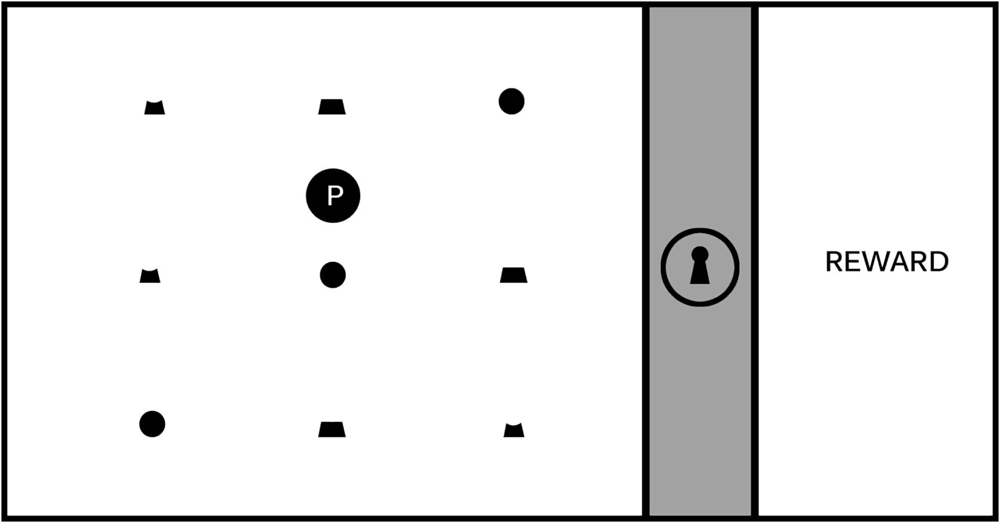

图 8-31

简单的游戏机械项目，没有照明。回想一下，玩家控制标有 P 的圆圈，并且必须以正确的顺序激活锁的三个部分中的每一个，以脱离障碍并获得奖励

对于简单游戏机制项目的下一阶段，你如何将光直接整合到游戏循环中，使其成为游戏性的一部分？和前面的练习一样，最小化复杂性，并限制自己一次只能对当前游戏循环进行一次添加或改进，将有助于防止设计变得负担过重或过于复杂。通过考虑光线可能影响当前游戏屏幕的所有不同方式来开始这一阶段的练习。你可以选择一个黑暗的环境，玩家只能看到模糊的形状，除非用手电筒照亮一个区域，你可以使用彩色的光来改变被照亮的物体的可见颜色，或者你可以使用 X 射线或紫外线来显示肉眼看不到的物体信息。在这个例子中，你将在简单的序列机制中增加一个额外的维度:一束显示物体隐藏信息的光束，如图 [8-32](#Fig32) 所示。

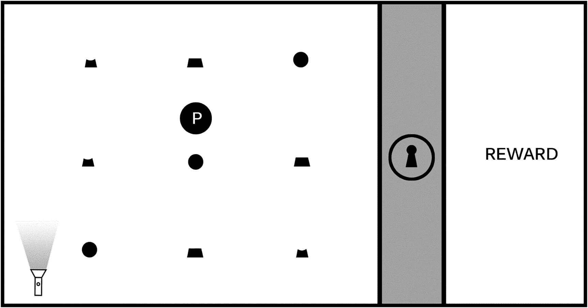

图 8-32

增加了一个可移动的“手电筒”,可以发出特殊的光束

在这个游戏循环的第一次迭代中，设计要求玩家以正确的相对位置(顶部在顶部，中间在中间，底部在底部)和正确的顺序(顶部-中间-底部)激活锁的每个部分。交互设计为正确和错误的移动提供了一致的视觉反馈，使玩家能够理解游戏规则，通过一些实验，精明的玩家将推断出解锁障碍所需的正确顺序。现在想象一下，添加一个特殊的光束会如何将游戏带入一个新的方向:基于序列的基本概念，你可以创建一个越来越聪明的谜题，要求玩家首先在环境中发现手电筒，并在锁上取得任何进展之前将其作为一种工具进行实验。想象一下，即使没有手电筒，当英雄人物触摸形状时，玩家仍然可以直接激活形状(触发对象周围的高亮环，就像第一次迭代中的情况一样，如图 [8-33](#Fig33) 所示)，但直接交互不足以激活锁的相应区域，除非手电筒首先揭示理解谜题所需的秘密线索。图 [8-34](#Fig34) 显示移动手电筒，用光束照亮其中一个物体，露出一个白点。

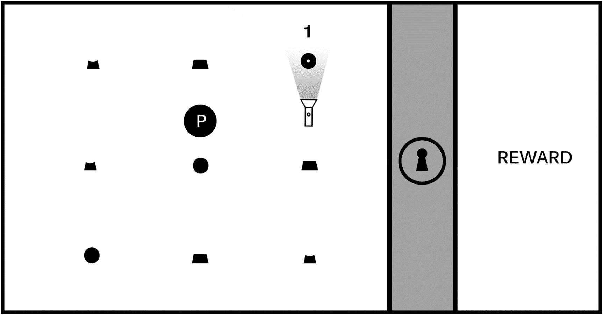

图 8-34

玩家将手电筒移至其中一个形状下，以揭示隐藏的线索(#1)

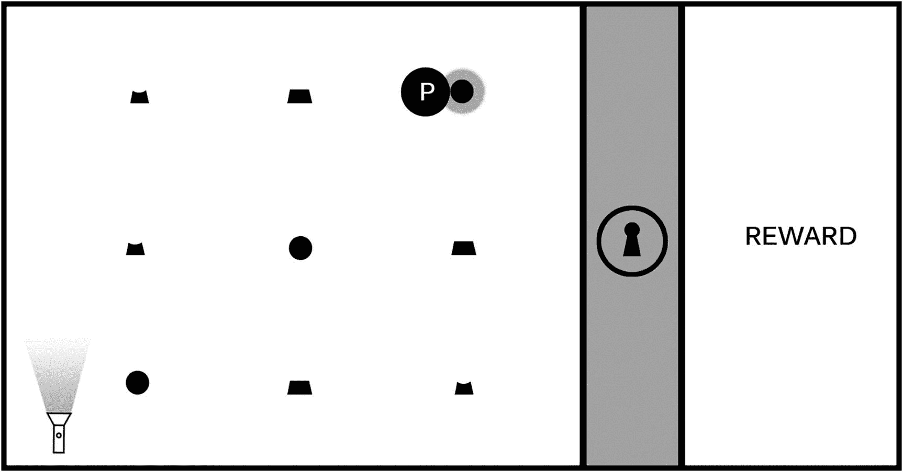

图 8-33

玩家能够直接激活物体，就像在第一次机械迭代中一样，但是锁的相应部分现在保持不活动

从游戏性来看，一个游戏环境中的任何物体都可以作为工具；作为一名设计师，你的工作是确保工具遵循一致的逻辑规则，玩家可以首先理解这些规则，然后预测性地应用这些规则来实现他们的目标。在这种情况下，有理由假设玩家会探索游戏环境，寻找工具或线索；如果手电筒是一个活动的物体，玩家将试图了解它在关卡中的作用。

我们的示例项目中的游戏循环随着手电筒的发展而发展，但是使用相同的基本排序原则和反馈隐喻。当玩家用手电筒显示物体上的秘密符号时，玩家可以通过仅在符号可见时激活物体来开始解锁序列。新的设计要求玩家以正确的顺序激活与锁的每个部分相对应的三个对象中的每一个，在这种情况下，从一个点到三个点；当一个部分中的所有对象都按顺序激活时，锁的那个部分将像在第一次迭代中一样亮起来。图 [8-35](#Fig35) 至 [8-37](#Fig37) 显示了使用手电筒光束的新顺序。

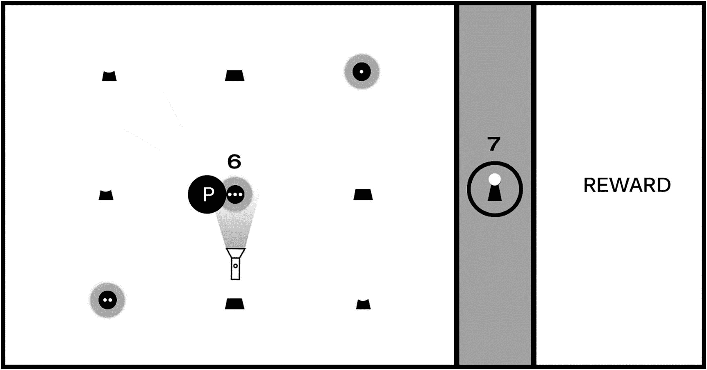

图 8-37

三个顶部部分中的第三个用手电筒的光束显露出来，并被游戏者激活(#6)，从而激活锁的顶部部分(#7)。一旦锁的中部和下部被类似地激活，屏障被禁用，玩家可以要求奖励

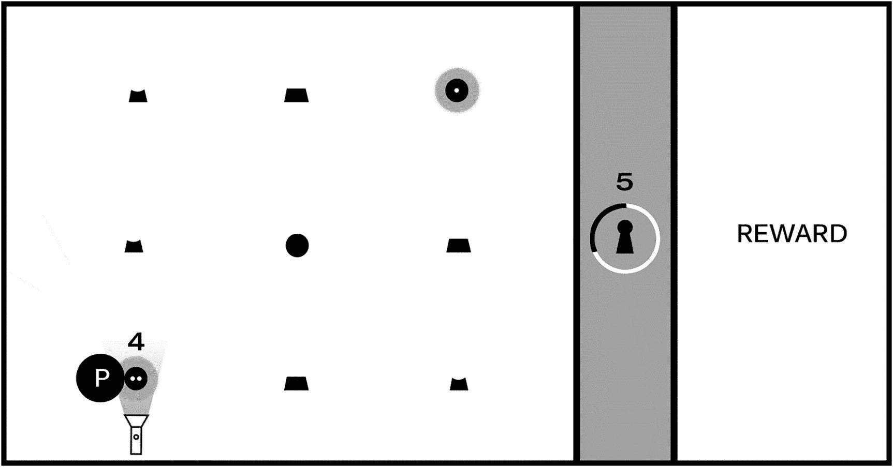

图 8-36

玩家以正确的顺序激活三个顶部部分中的第二个(#4)，进度条通过点亮另一个部分来确认正确的顺序(#5)。在这种实现中，玩家在激活具有一个点的对象之前不能激活具有两个点的对象(规则要求按照从一个点到三个点的顺序激活类似的对象)

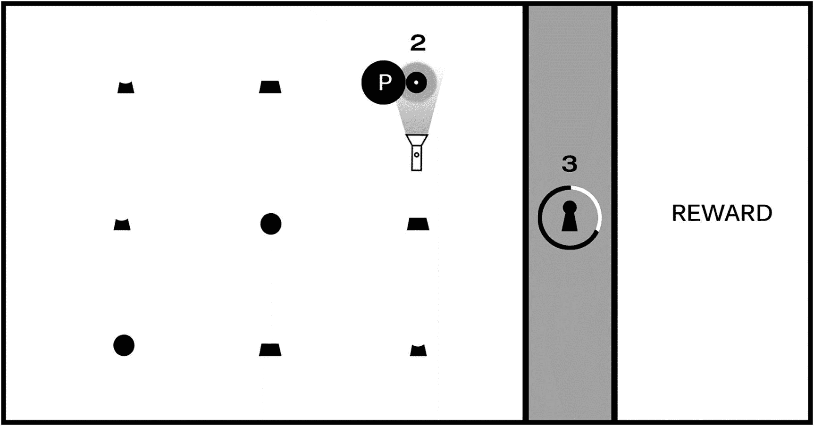

图 8-35

随着手电筒显示隐藏的符号，玩家现在可以激活对象(#2)，锁上的进度条(#3)指示玩家正在正确的轨道上完成一个序列

请注意，您对玩家从游戏循环的第一次迭代中收到的反馈进行了轻微的更改:您最初使用进度条来表示解锁障碍的总体进度，但您现在使用它来表示解锁锁的每个部分的总体进度。手电筒在通向关卡解决方案的因果链中引入了额外的一步，你现在已经采取了一步基本游戏循环，并在保持逻辑一致性和遵循玩家可以首先学习然后预测性地应用的一组规则的同时，做出了相当复杂和具有挑战性的东西。事实上，这个关卡已经开始成为许多冒险游戏中常见的谜题类型:游戏屏幕是一个充满了许多可移动物体的复杂环境；找到手电筒，并了解它的光束揭示了游戏世界中物体的隐藏信息，这将成为游戏设置本身的一部分。

重要的是要意识到，随着游戏复杂性的增加，交互模型的复杂性也会增加，为玩家提供适当的视听反馈以帮助他们理解自己的行为也变得更加重要(回想一下第 [1](01.html) 章，交互模型是玩家用来完成游戏任务的按键、按钮、操纵杆、触摸手势等的组合)。在当前的例子中，玩家现在不仅能控制英雄角色，还能控制手电筒。创建直观的交互模型是游戏设计的重要组成部分，通常比设计者意识到的要复杂得多；举一个例子，考虑将许多为鼠标和键盘设计的 PC 游戏移植到使用按钮和拇指棒的游戏控制台或仅使用触摸的移动设备的困难。开发团队经常在控制方案上投入数千小时的研究和测试，然而他们仍然经常错过目标；交互设计很难做好，经常需要数千小时的测试和改进，即使是很基本的动作，所以如果可能的话，你应该利用已有的惯例。当你设计交互时，记住两条黄金法则:第一，尽可能使用已知的和经过测试的模式，除非你有令人信服的理由要求玩家学习新的东西；第二，尽量减少玩家必须记住的独特动作的数量。几十年的用户测试清楚地表明，玩家不喜欢重新学习跨标题类似任务的基本组合键(例如，这就是为什么如此多的游戏在 WASD 上实现了移动标准化)，类似的数据显示，当你要求玩家记住几个简单的独特按钮组合时，他们会变得不知所措。当然也有例外；例如，许多经典的街机格斗游戏使用几十种复杂的组合，但这些类型是针对特定类型的玩家的，他们认为掌握按钮组合是使体验变得有趣的基本组成部分。一般来说，如果不是游戏的有意组成部分，大多数玩家更喜欢保持交互的复杂性尽可能的精简和简单。

有许多方法可以控制多个对象。我们的手电筒最常见的模式可能是玩家“装备”它；也许如果玩家移动手电筒并点击鼠标左键，它就成为玩家的一个新技能，可以通过按下键盘上的某个键或点击鼠标右键来激活。或者，也许英雄角色可以使用 WASD 键在游戏屏幕上自由移动，而其他活动对象，如手电筒，首先通过鼠标左键选中，然后通过按住鼠标左键并将它们拖到位来移动。类似地，有多种方式向玩家提供上下文反馈，这将有助于教授谜题逻辑和规则(在这种情况下，我们使用锁周围的环作为进度条来确认玩家正在遵循正确的顺序)。当你尝试各种互动和反馈模型时，回顾一下其他游戏是如何处理类似任务的总是一个好主意，特别注意你认为特别有效的东西。

在下一章中，你将通过对游戏世界中的物体应用简单的物理学来研究你的游戏循环如何再次进化。