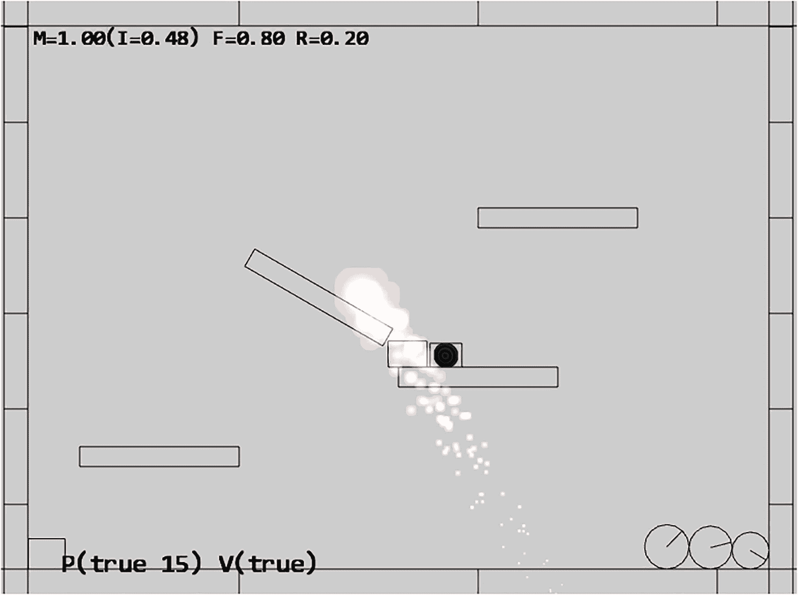
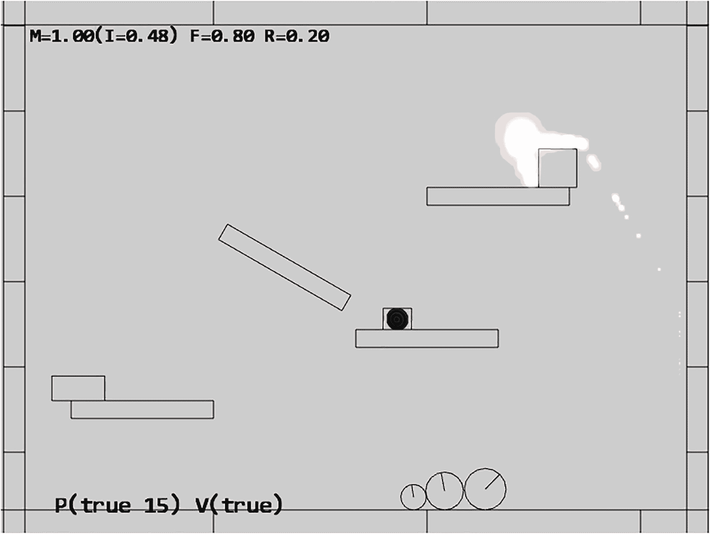
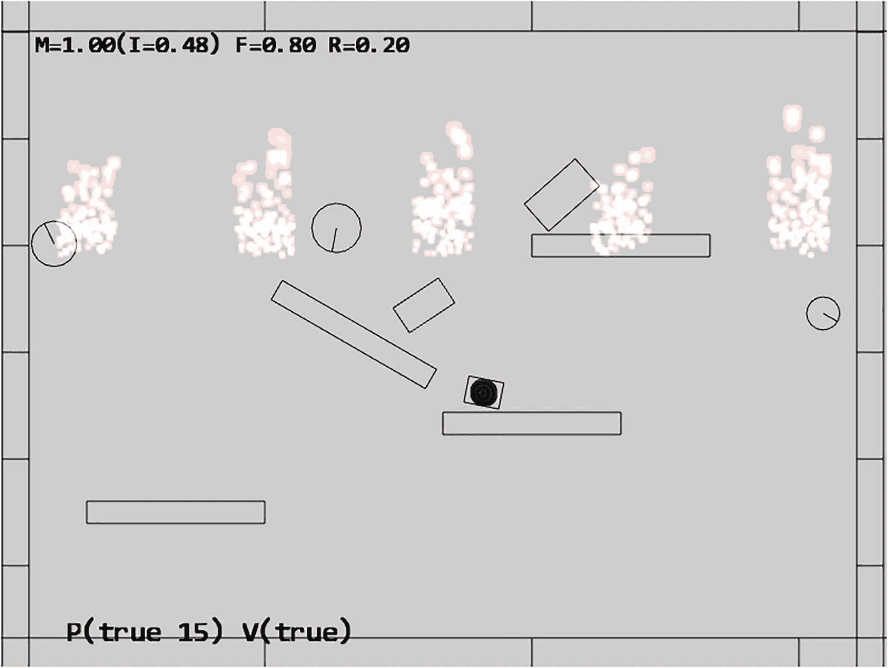
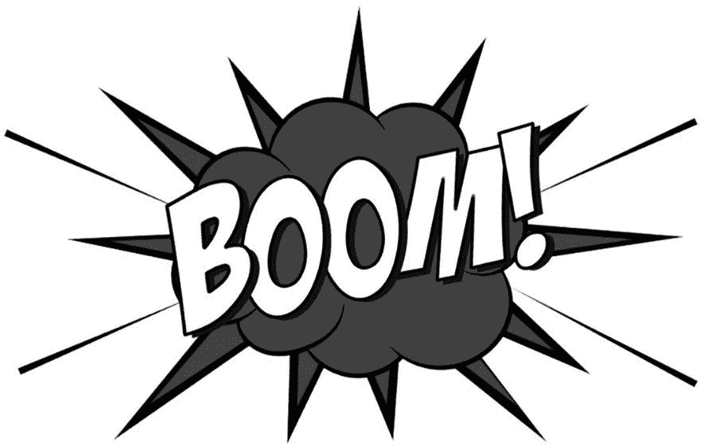

# 十、使用粒子系统创建效果

完成本章后，您将能够

*   理解粒子、粒子发射器和粒子系统的基础知识

*   意识到许多有趣的物理效果可以基于专用粒子的集合来建模

*   近似粒子的基本行为，使得这些粒子集合的再现类似于简单的爆炸效果

*   实现一个简单的粒子系统，它与物理组件的`RigidShape`系统集成在一起

## 介绍

到目前为止，在您的游戏引擎中，假设游戏世界可以由一组几何图形来描述，其中所有对象都是具有纹理或动画精灵的`Renderable`实例，并且可能被光源照亮。这个游戏引擎非常强大，能够描述现实世界中的大部分物体。然而，对你的游戏引擎来说，描述许多日常遭遇也是具有挑战性的，例如，火花、火、爆炸、污垢、灰尘等等。这些观测中有许多是由改变物理状态的物质或对物理扰动作出反应的非常小的实体的集合产生的瞬时效应。总的来说，这些观察结果通常被称为特殊效果，通常不适合用带有纹理的固定形状的几何图形来表示。

粒子系统通过发射一组粒子来描述特殊效果，这些粒子的属性可能包括位置、大小、颜色、寿命和策略选择的纹理贴图。这些粒子定义了特定的行为，一旦发射，它们的属性就会更新以模拟物理效果。例如，发射的火粒子可能会向上移动并带有红色。随着时间的推移，粒子的大小可能会减小，向上运动的速度会变慢，颜色会变黄，并在一定次数的更新后最终消失。通过精心设计的更新功能，这种粒子集合的再现可以类似于燃烧的火焰。

在本章中，您将学习、设计和创建一个简单而灵活的粒子系统，该系统包括实现常见效果(如爆炸和魔法效果)所需的基本功能。此外，您将实现一个粒子着色器，以正确地将粒子集成到场景中。粒子会相应地与`RigidShape`物体发生碰撞和相互作用。您还将发现需要并定义粒子发射器，以在一段时间内生成粒子，如篝火或火炬。

本章的主要目标是理解粒子系统的基础:简单粒子的属性和行为，粒子发射器的细节，以及与游戏引擎其余部分的集成。这一章不会引导你创建任何特定类型的特效。这类似于在第八章中学习一个照明模型，没有创建任何灯光效果的细节。操纵光源参数和材料属性以创建引人入胜的照明条件，以及模拟特定物理效果的粒子行为是游戏开发人员的职责。游戏引擎的基本职责是定义足够的基本功能，以确保游戏开发者能够完成他们的工作。

## 粒子和粒子系统

粒子是一个没有维度的纹理位置。这种描述可能看起来矛盾，因为你已经知道纹理是一种图像，图像总是由宽度和高度定义，并且肯定会占用一个区域。重要的澄清是，游戏引擎逻辑将粒子处理为没有区域的位置，而绘图系统将粒子显示为具有适当尺寸的纹理。这样，即使显示了实际显示的区域，纹理的宽度和高度尺寸也会被底层逻辑忽略。

除了位置，粒子还具有大小(用于缩放纹理)、颜色(用于给纹理着色)和寿命等属性。与典型的游戏对象类似，每个粒子都定义有在每次更新期间修改其属性的行为。这个更新函数的责任是确保粒子集合的再现类似于熟悉的物理效果。粒子系统是控制每个粒子生成、更新和移除的实体。在你的游戏引擎中，粒子系统将被定义为一个独立的组件，就像物理组件一样。

在以下项目中，您将首先了解绘制粒子对象所需的支持。之后，您将研究如何创建实际粒子对象并定义其行为的细节。粒子是游戏引擎的一种新型对象，需要整个绘图系统的支持，包括自定义 GLSL 着色器、默认可共享着色器实例和一个新的`Renderable`对。

### 粒子项目

这个项目演示了如何实现一个粒子系统来模拟爆炸或类似法术的效果。你可以在图 10-1 中看到这个项目运行的例子。这个项目的源代码位于`chapter10/10.1.particles`文件夹中。



图 10-1

运行粒子项目

这个项目是上一章的延续，支持所有的刚性形状和碰撞控制。为简洁起见，本章不再重复这些控制的细节。项目的粒子系统特定控制如下:

*   **Q 键**:在当前鼠标位置产生粒子

*   **E 键**:切换粒子边界的绘制

该项目的目标如下:

*   要了解如何绘制粒子并定义其行为的细节

*   实现一个简单的粒子系统

您可以在`assets`文件夹中找到以下外部资源:包含默认系统字体的`fonts`文件夹，包含`particle.png`的粒子文件夹，默认粒子纹理，以及之前项目中相同的四个纹理图像。

*   定义英雄和小兵的精灵元素。

*   `platform.png`定义平台、地板和天花板。

*   `wall.png`定义墙壁。

*   `target.png`标识当前选择的对象。

#### 支持粒子的绘制

粒子是没有区域的纹理位置。然而，正如介绍中所讨论的，你的引擎会将每个粒子绘制成一个纹理矩形。出于这个原因，你可以简单地重用现有的纹理顶点着色器`texture_vs.glsl`。

##### 创建 GLSL 粒子片段着色器

当涉及到每个像素颜色的实际计算时，必须创建一个新的 GLSL 片段着色器`particle_fs.glsl`，以忽略全局环境项。火焰和爆炸等物理效果不参与照明计算。

1.  在`src/glsl_shaders`文件夹下，新建一个文件，命名为`particle_fs.glsl`。

2.  类似于在`texture_fs.glsl`中定义的纹理片段着色器，您需要声明`uPixelColor`和`vTexCoord`来从游戏引擎接收这些值，并定义`uSampler`来采样纹理:

1.  现在实现 main 函数来累积颜色，不考虑全局环境效果。这是计算粒子颜色的一种方法。这个函数可以被修改以支持不同种类的粒子效果。

```js
precision mediump float;
// sets the precision for floating point computation

// The object that fetches data from texture.
// Must be set outside the shader.
uniform sampler2D uSampler;

// Color of pixel
uniform vec4 uPixelColor;

// "varying" signifies that the texture coordinate will be
// interpolated and thus varies.
varying vec2 vTexCoord;

```

```js
void main(void)  {
    // texel color look up based on interpolated UV value in vTexCoord
    vec4 c = texture2D(uSampler, vec2(vTexCoord.s, vTexCoord.t));

    vec3 r = vec3(c) * c.a * vec3(uPixelColor);
    vec4 result = vec4(r, uPixelColor.a);

    gl_FragColor = result;
}

```

##### 定义默认 ParticleShader 实例

现在，您可以定义要共享的默认粒子着色器实例。回想在前面章节中使用其他类型的着色器时，着色器创建一次，并在`src/engine/core`文件夹的`shader_resoruces.js`文件中共享引擎范围。

1.  首先编辑`src/engine/core`文件夹中的`shader_resources.js`文件，为默认粒子着色器定义常量、变量和访问函数:

1.  在`init()`函数中，确保加载新定义的`particle_fs` GLSL 片段着色器:

```js
// Particle Shader
let kParticleFS = "src/glsl_shaders/particle_fs.glsl";
let mParticleShader = null;
function getParticleShader() { return mParticleShader }

```

1.  正确加载新的 GLSL 片段着色器`particle_fs`，当调用`createShaders()`函数时，可以实例化一个新的粒子着色器:

```js
function init() {
    let loadPromise = new Promise(
        async function(resolve) {
            await Promise.all([

                ... identical to previous code ...

                text.load(kShadowReceiverFS),
                text.load(kParticleFS)
            ]);
            resolve();
        }).then(
            function resolve() { createShaders(); }
        );
    map.pushPromise(loadPromise);
}

```

1.  在`cleanUp()`功能中，记得执行正确的清理和卸载操作:

```js
function createShaders() {

    ... identical to previous code ...

    mShadowReceiverShader = new SpriteShader(kTextureVS,
                                             kShadowReceiverFS);
    mParticleShader = new TextureShader(kTextureVS, kParticleFS);
}

```

1.  最后，不要忘记导出新定义的函数:

```js
function cleanUp() {

    ... identical to previous code ...

    mShadowCasterShader.cleanUp();
    mParticleShader.cleanUp();

    ... identical to previous code ...

    text.unload(kShadowReceiverFS);
    text.unload(kParticleFS);
}

```

```js
export {init, cleanUp,
        getConstColorShader, getTextureShader,
        getSpriteShader, getLineShader,
        getLightShader, getIllumShader,
        getShadowReceiverShader, getShadowCasterShader,
        getParticleShader}

```

##### 创建粒子可渲染对象

使用定义为 GLSL `particle_fs`着色器接口的默认粒子着色器类，您现在可以创建新的`Renderable`对象类型来支持粒子的绘制。幸运的是，一个粒子或者一个纹理位置的详细行为与一个`TextureRenderable`是相同的，除了不同的着色器。因此，`ParticleRenderable`对象的定义是琐碎的。

在`src/engine/renderables`文件夹中，创建`particle_renderable.js`文件；从`defaultShaders`导入以访问粒子着色器，从`TextureRenderable`导入以访问基类。将`ParticleRenderable`定义为`TextureRenderable`的子类，并在构造函数中设置合适的默认着色器。记得导出类。

```js
import * as defaultShaders from "../core/shader_resources.js";
import TextureRenderable from "./texture_renderable.js";

class ParticleRenderable extends TextureRenderable {
    constructor(myTexture) {
        super(myTexture);
        this._setShader(defaultShaders.getParticleShader());
    }
}
export default ParticleRenderable;

```

##### 加载默认粒子纹理

为了绘制时的方便，游戏引擎会预加载默认的粒子纹理`particle.png`，位于`assets/particles`文件夹。该操作可以作为`defaultResources`初始化过程的一部分。

1.  在`src/engine/resources`文件夹中编辑`default_resources.js`，从`texture.js`添加一个导入来访问纹理加载功能，并为粒子纹理贴图的位置定义一个常量字符串和这个字符串的一个访问器:

1.  在`init()`函数中，调用`texture.load()`函数加载默认的粒子纹理贴图:

```js
import * as font from "./font.js";
import * as texture from "../resources/texture.js";
import * as map from "../core/resource_map.js";

// Default particle texture
let kDefaultPSTexture = "assets/particles/particle.png";

function getDefaultPSTexture() { return kDefaultPSTexture; }

```

1.  在`cleanUp()`功能中，确保卸载默认纹理:

```js
function init() {
    let loadPromise = new Promise(
        async function (resolve) {
            await Promise.all([
                font.load(kDefaultFont),
                texture.load(kDefaultPSTexture)
            ]);
            resolve();
        })

    ... identical to previous code ...
}

```

1.  最后，记住导出访问器:

```js
function cleanUp() {
    font.unload(kDefaultFont);
    texture.unload(kDefaultPSTexture);
}

```

```js
export {

    ... identical to previous code ...

    getDefaultFontName, getDefaultPSTexture,

    ... identical to previous code ...
}

```

通过这种集成，默认的粒子纹理文件将在系统初始化期间加载到`resource_map`中。这个默认的纹理贴图可以很容易地用从`getDefaultPSTexture()`函数返回的值来访问。

#### 定义引擎粒子组件

定义了绘图基础结构后，现在可以定义引擎组件来管理粒子系统的行为。目前，唯一需要的功能是包括所有粒子的默认系统加速。

在`src/engine/components`文件夹中，创建`particle_system.js`文件，并为默认粒子系统加速定义变量、getter 和 setter 函数。记得导出新定义的功能。

```js
let mSystemAcceleration = [30, -50.0];

function getSystemAcceleration() {
    return vec2.clone(mSystemAcceleration); }
function setSystemAcceleration(x, y) {
    mSystemAcceleration[0] = x;
    mSystemAcceleration[1] = y;
}

export {getSystemAcceleration, setSystemAcceleration}

```

在继续之前，请确保更新引擎访问文件`index.js`，以允许游戏开发者访问新定义的功能。

#### 定义粒子和粒子游戏类

现在，您已经准备好定义实际的粒子、其默认行为以及粒子集合的类。

##### 创建粒子

粒子是轻量级的游戏对象，具有简单的属性，缠绕在`ParticleRenderable`周围进行绘制。为了恰当地支持运动，粒子也用辛欧拉积分实现运动近似。

1.  首先在`src/engine`文件夹中创建`particles`子文件夹。该文件夹将包含特定于粒子的实现文件。

2.  在`src/engine/particles`文件夹中，创建`particle.js`，并定义构造函数以包含用于调试的位置、速度、加速度、阻力和绘图参数的变量:

1.  定义`draw()`函数将粒子绘制为`TextureRenderable`和`drawMarker()`调试函数在粒子位置绘制一个 X 标记:

```js
import * as loop from "../core/loop.js";
import * as particleSystem from "../components/particle_system.js";
import ParticleRenderable from "../renderables/particle_renderable.js";
import * as debugDraw from "../core/debug_draw.js";

let kSizeFactor = 0.2;

class Particle {
    constructor(texture, x, y, life) {
        this.mRenderComponent = new ParticleRenderable(texture);
        this.setPosition(x, y);

        // position control
        this.mVelocity = vec2.fromValues(0, 0);
        this.mAcceleration = particleSystem.getSystemAcceleration();
        this.mDrag = 0.95;

        // Color control
        this.mDeltaColor = [0, 0, 0, 0];

        // Size control
        this.mSizeDelta = 0;

        // Life control
        this.mCyclesToLive = life;
    }

    ... implementation to follow ...

}

export default Particle;

```

1.  您现在可以实现`update()`函数来计算基于辛欧拉积分的粒子位置，其中使用`mDrag`变量的缩放模拟粒子上的阻力。请注意，该函数还对其他参数(包括颜色和大小)执行增量更改。`mCyclesToLive`变量通知粒子系统何时该移除这个粒子。

```js
draw(aCamera) {
    this.mRenderComponent.draw(aCamera);
}

drawMarker(aCamera) {
    let size = this.getSize();
    debugDraw.drawCrossMarker(aCamera, this.getPosition(),
                              size[0] * kSizeFactor, [0, 1, 0, 1]);
}

```

1.  定义简单的`get`和`set`访问器。这些函数很简单，这里没有列出。

```js
update() {
    this.mCyclesToLive--;

    let dt = loop.getUpdateIntervalInSeconds();

    // Symplectic Euler
    //    v += a * dt
    //    x += v * dt
    let p = this.getPosition();
    vec2.scaleAndAdd(this.mVelocity,
                     this.mVelocity, this.mAcceleration, dt);
    vec2.scale(this.mVelocity, this.mVelocity, this.mDrag);
    vec2.scaleAndAdd(p, p, this.mVelocity, dt);

    // update color

    let c = this.mRenderComponent.getColor();
    vec4.add(c, c, this.mDeltaColor);

    // update size
    let xf = this.mRenderComponent.getXform();
    let s = xf.getWidth() * this.mSizeDelta;
    xf.setSize(s, s);
}

```

##### 创建粒子集

为了处理一组粒子，你现在可以创建`ParticleSet`来支持方便的`Particle`循环。出于轻量级的目的，`Particle`类没有从更复杂的`GameObject`派生出子类；然而，由于 JavaScript 是一种非类型化的语言，`ParticleSet`仍然有可能继承并提炼`GameObjectSet`来利用现有的特定于集合的功能。

1.  在`src/engine/particles`文件夹中，创建`particle_set.js`，并将`ParticleSet`定义为`GameObjectSet`的子类:

1.  覆盖`GameObjectSet`的`draw()`功能，以确保使用添加剂混合绘制粒子:

```js
import * as glSys from "../core/gl.js";
import GameObjectSet from "../game_objects/game_object_set.js";

class ParticleSet extends GameObjectSet {
    constructor() {
        super();
    }

    ... implementation to follow ...

}

export default ParticleSet;

```

Note

回想一下第五章，默认的`gl.blendFunc()`设置通过根据阿尔法通道值混合来实现透明度。这被称为阿尔法混合。在这种情况下，`gl.blendFunc()`设置只是累积颜色，而不考虑 alpha 通道。这被称为添加剂混合。加法混合通常会导致像素颜色过饱和，即 RGB 分量的值大于最大显示值 1.0。当模拟火焰和爆炸的强烈亮度时，像素颜色的过饱和通常是可取的。

1.  覆盖`update()`功能，确保清除过期颗粒:

```js
draw(aCamera) {
    let gl = glSys.get();
    gl.blendFunc(gl.ONE, gl.ONE);  // for additive blending!
    super.draw(aCamera);
    gl.blendFunc(gl.SRC_ALPHA, gl.ONE_MINUS_SRC_ALPHA);
                                  // restore alpha blending
}

drawMarkers(aCamera) {
    let i;
    for (i = 0; i < this.mSet.length; i++) {
        this.mSet[i].drawMarker(aCamera);
    }
}

```

```js
update() {
    super.update();
    // Cleanup Particles
    let i, obj;
    for (i = 0; i < this.size(); i++) {
        obj = this.getObjectAt(i);
        if (obj.hasExpired()) {
            this.removeFromSet(obj);
        }
    }
}

```

最后，记得更新引擎访问文件`index.js`，以便将新定义的功能转发给客户端。

#### 测试粒子系统

测试应该验证两个主要目标。首先，实现的粒子系统能够产生视觉上令人愉快的效果。第二，粒子被正确地处理，被正确地创建、破坏，并表现出预期的行为。这个测试用例主要基于之前的项目，带有一个新的`_createParticle()`函数，当 Q 键被按下时，这个函数被调用。在`my_game_main.js`文件中实现的`_createParticle()`函数创建具有伪随机行为的粒子，如下所示:

```js
function _createParticle(atX, atY) {
    let life = 30 + Math.random() * 200;
    let p = new engine.Particle(
            engine.defaultResources.getDefaultPSTexture(),
            atX, atY, life);
    p.setColor([1, 0, 0, 1]);

    // size of the particle
    let r = 5.5 + Math.random() * 0.5;
    p.setSize(r, r);

    // final color
    let fr = 3.5 + Math.random();
    let fg = 0.4 + 0.1 * Math.random();
    let fb = 0.3 + 0.1 * Math.random();
    p.setFinalColor([fr, fg, fb, 0.6]);

    // velocity on the particle
    let fx = 10 - 20 * Math.random();
    let fy = 10 * Math.random();
    p.setVelocity(fx, fy);

    // size delta
    p.setSizeDelta(0.98);

    return p;
}

```

关于`_createParticle()`函数有两个重要的观察结果。首先，多次使用`random()`函数来配置每个创建的`Particle`。粒子系统利用大量相似但略有不同的粒子来构建和传达所需的视觉效果。使用随机性来避免任何模式是很重要的。第二，配置中使用了很多看似任意的数字，比如将粒子的寿命设置在 30 到 230 之间，或者将最终的红色分量设置为 3.5 到 4.5 之间的数字。不幸的是，这就是使用粒子系统的本质。经常有相当多的临时实验。商业游戏引擎通常通过发布其粒子系统的预设值集合来缓解这一困难。这样，游戏设计者可以通过调整提供的预设来微调特定的期望效果。

#### 观察

运行项目，按 Q 键观察生成的粒子。看起来好像有燃烧发生在鼠标指针下面。按住 Q 键并慢慢移动鼠标指针来观察燃烧，就好像在鼠标下面有一个引擎产生火焰一样。键入 E 键来切换单个粒子位置的绘制。现在，您可以观察到一个绿色的 X 标记了每个生成粒子的位置。

如果您快速移动鼠标指针，您可以观察到带有绿色 X 中心的单个粉红色圆圈在向地板下落时会改变颜色。虽然所有粒子都是由`_createParticle()`函数创建的，并且在改变颜色时都具有类似的向地板下落的行为，但是每个粒子看起来都略有不同，并且没有表现出任何行为模式。现在，您可以清楚地观察到在创建的粒子中整合随机性的重要性。

修改`_createParticle()`函数的方式有无限多种。例如，只需将初始和最终颜色更改为不同的灰色和透明度，就可以将类似爆炸的效果更改为蒸汽或烟雾。此外，可以通过反转颜色来修改默认粒子纹理，以创建黑烟效果。您也可以将大小变化增量修改为大于 1，以随着时间的推移增加粒子的大小。事实上，粒子的产生是没有限制的。您实现的粒子系统允许游戏开发者创建具有自定义行为的粒子，这些行为最适合他们正在构建的游戏。

最后，请注意生成的粒子不与`RigidShape`对象交互，看起来好像粒子被绘制在游戏场景中的其余对象上。这个问题将在下一个项目中研究和解决。

## 粒子碰撞

将粒子整合到游戏场景中的方法是让粒子遵循场景的隐含规则，并相应地与非粒子对象进行交互。检测碰撞的能力是物体之间交互的基础。出于这个原因，有时支持粒子与其他非粒子游戏对象的碰撞是很重要的。

由于粒子仅由它们的位置定义，没有维度，实际的碰撞计算可能相对简单。然而，通常有大量的粒子；同样地，要执行的冲突的数量也可以是很多的。作为计算成本的折衷和优化，粒子碰撞可以基于`RigidShape`而不是实际的`Renderable`对象。这类似于物理组件的情况，其中实际模拟是基于简单的刚性形状来近似潜在的几何复杂的`Renderable`物体。

### 粒子碰撞项目

这个项目演示了如何实现一个粒子碰撞系统，它能够解决粒子和现有的`RigidShape`对象之间的碰撞。你可以在图 10-2 中看到这个项目运行的例子。这个项目的源代码位于`chapter10/10.2.particle_collisions`文件夹中。



图 10-2

运行粒子碰撞项目

该项目的控件与上一个项目相同，并支持所有刚性形状和碰撞控件。特定于粒子系统的控件如下:

*   **Q 键**:在当前鼠标位置产生粒子

*   **E 键**:切换粒子边界的绘制

*   **1 键**:切换`Particle` / `RigidShape`碰撞

该项目的目标如下:

*   了解并解决单个粒子位置和`RigidShape`对象之间的碰撞

*   构建支持与`RigidShape`交互的粒子引擎组件

#### 修改粒子系统

有了设计良好的基础设施，新功能的实现可以本地化。在粒子碰撞的情况下，所有的修改都在`src/engine/components`文件夹的`particle_system.js`文件中。

1.  编辑`particle_system.js`定义并初始化临时局部变量，以解决与`RigidShape`对象的冲突。`mCircleCollider`物体将被用来代表碰撞中的单个粒子。

1.  定义`resolveCirclePos()`函数，通过将位置推到圆形之外来解决`RigidCircle`和位置之间的冲突:

```js
import Transform from "../utils/transform.js";
import RigidCircle from "../rigid_shapes/rigid_circle.js";
import CollisionInfo from "../rigid_shapes/collision_info.js";

let mXform = null;  // for collision with rigid shapes
let mCircleCollider = null;
let mCollisionInfo = null;
let mFrom1to2 = [0, 0];

function init() {
    mXform = new Transform();
    mCircleCollider = new RigidCircle(mXform, 1.0);
    mCollisionInfo = new CollisionInfo();
}

```

1.  定义`resolveRectPos()`函数，通过将`mCircleCollider`局部变量包裹在位置周围并调用`RigidCircle`到`RigidRectangle`碰撞函数来解决`RigidRectangle`和位置之间的碰撞。当检测到穿插时，根据计算出的`mCollisionInfo`，该位置被推到矩形形状之外。

```js
function resolveCirclePos(circShape, particle) {
    let collision = false;
    let pos = particle.getPosition();
    let cPos = circShape.getCenter();
    vec2.subtract(mFrom1to2, pos, cPos);
    let dist = vec2.length(mFrom1to2);
    if (dist < circShape.getRadius()) {
        vec2.scale(mFrom1to2, mFrom1to2, 1/dist);
        vec2.scaleAndAdd(pos, cPos, mFrom1to2, circShape.getRadius());
        collision = true;
    }
    return collision;
}

```

1.  实现`resolveRigidShapeCollision()`和`resolveRigidShapeSetCollision()`以方便客户端游戏开发者调用。这些函数解决单个或一组`RigidShape`对象与`ParticleSet`对象之间的碰撞。

```js
function resolveRectPos(rectShape, particle) {
    let collision = false;
    let s = particle.getSize();
    let p = particle.getPosition();
    mXform.setSize(s[0], s[1]); // referred by mCircleCollision
    mXform.setPosition(p[0], p[1]);
    if (mCircleCollider.boundTest(rectShape)) {
        if (rectShape.collisionTest(mCircleCollider, mCollisionInfo)) {
            // make sure info is always from rect towards particle
            vec2.subtract(mFrom1to2,
                 mCircleCollider.getCenter(), rectShape.getCenter());
            if (vec2.dot(mFrom1to2, mCollisionInfo.getNormal()) < 0)
                mCircleCollider.adjustPositionBy(
                 mCollisionInfo.getNormal(), -mCollisionInfo.getDepth());
            else
                mCircleCollider.adjustPositionBy(
                 mCollisionInfo.getNormal(), mCollisionInfo.getDepth());
            p = mXform.getPosition();
            particle.setPosition(p[0], p[1]);
            collision = true;
        }
    }
    return collision;
}

```

1.  最后，记住导出新定义的函数:

```js
// obj: a GameObject (with potential mRigidBody)
// pSet: set of particles (ParticleSet)
function resolveRigidShapeCollision(obj, pSet) {
    let i, j;
    let collision = false;

    let rigidShape = obj.getRigidBody();
    for (j = 0; j < pSet.size(); j++) {
        if (rigidShape.getType() == "RigidRectangle")
            collision = resolveRectPos(rigidShape, pSet.getObjectAt(j));
        else if (rigidShape.getType() == "RigidCircle")
            collision = resolveCirclePos(rigidShape,pSet.getObjectAt(j));
    }

    return collision;
}

// objSet: set of GameObjects (with potential mRigidBody)
// pSet: set of particles (ParticleSet)
function resolveRigidShapeSetCollision(objSet, pSet) {
    let i, j;
    let collision = false;
    if ((objSet.size === 0) || (pSet.size === 0))
        return false;
    for (i=0; i<objSet.size(); i++) {
        let rigidShape = objSet.getObjectAt(i).getRigidBody();
        for (j = 0; j<pSet.size(); j++) {
            if (rigidShape.getType() == "RigidRectangle")
                collision = resolveRectPos(rigidShape,
                                       pSet.getObjectAt(j)) || collision;
            else if (rigidShape.getType() == "RigidCircle")
                    collision = resolveCirclePos(rigidShape,
                                       pSet.getObjectAt(j)) || collision;
        }
    }
    return collision;
}

```

```js
export {init,
        getSystemAcceleration, setSystemAcceleration,
        resolveRigidShapeCollision, resolveRigidShapeSetCollision}

```

#### 初始化粒子系统

`particle_system.js`中定义的临时变量必须在游戏循环开始前初始化。编辑`loop.js`，从`particle_system.js`导入，在`start()`函数中完成异步加载后调用`init()`函数。

```js
... identical to previous code ...

import * as debugDraw from "./debug_draw.js";
import * as particleSystem from "../components/particle_system.js";

... identical to previous code ...

async function start(scene) {

    ... identical to previous code ...

    // Wait for any async requests before game-load
    await map.waitOnPromises();

    // system init that can only occur after all resources are loaded
    particleSystem.init();

    ... identical to previous code ...
}

```

#### 测试粒子系统

`MyGame`类所需的修改非常简单。必须定义一个新的变量来支持冲突解决的切换，在`my_game_main.js`中定义的`update()`函数修改如下:

```js
update() {

    ... identical to previous code ...

    if (engine.input.isKeyClicked(engine.input.keys.One))
            this.mPSCollision = !this.mPSCollision;
    if (this.mPSCollision) {
        engine.particleSystem.resolveRigidShapeSetCollision(
                                     this.mAllObjs, this.mParticles);
        engine.particleSystem.resolveRigidShapeSetCollision(
                                     this.mPlatforms, this.mParticles);
    }

    ... identical to previous code ...
}

```

#### 观察

与之前的项目一样，您可以运行项目并使用 Q 和 E 键创建粒子。但是，请注意，生成的粒子不会与任何对象重叠。您甚至可以尝试将鼠标指针移动到其中一个`RigidShape`对象的边界内，然后键入 Q 键。请注意，在所有情况下，粒子都是在形状外部生成的。

您可以尝试键入 1 键来切换与刚性形状的碰撞。请注意，启用碰撞后，粒子有点类似于火灾或爆炸中的琥珀色粒子，它们从场景中的`RigidShape`对象的表面反弹回来。当“碰撞”关闭时，正如您在之前的项目中所观察到的，粒子看起来像是在其他对象前面燃烧或爆炸。这样，碰撞只是控制粒子系统与游戏引擎其余部分集成的另一个参数。

你可能会觉得继续按 Q 键生成粒子很麻烦。在下一个项目中，你将学习在一段固定的时间内粒子的产生。

## 粒子发射器

使用当前的粒子系统实现，您可以在特定的点和时间创建粒子。这些粒子可以根据它们的性质移动和改变。然而，只有当有一个明确的状态变化时，如按键点击，才能创建粒子。当需要在状态改变后持续生成粒子时，这就变得很受限制，例如在创建一个新的`RigidShape`对象后持续一段时间的爆炸或烟火。粒子发射器通过定义在一段时间内生成粒子的功能来解决这个问题。

### 粒子发射器项目

这个项目演示了如何为你的粒子系统实现一个粒子发射器来支持粒子发射。你可以在图 10-3 中看到这个项目运行的例子。这个项目的源代码位于`chapter10/10.3.particle_emitters`文件夹中。



图 10-3

运行粒子发射器项目

该项目的控件与上一个项目相同，并支持所有刚性形状和碰撞控件。项目的粒子系统特定控制如下:

*   **Q 键**:在当前鼠标位置产生粒子

*   **E 键**:切换粒子边界的绘制

*   **1 键**:切换`Particle` / `RigidShape`碰撞

该项目的目标如下:

*   为了理解对粒子发射器的需求

*   体验实现粒子发射器

#### 定义粒子发射器类

您已经观察并体验了在处理粒子时避免模式的重要性。在这种情况下，随着`ParticleEmitter`对象随着时间的推移生成新的粒子，再次强调注入*随机性*以避免出现任何图案是很重要的。

1.  在`src/engine/particles`文件夹中，创建`particle_emitter.js`；用接收位置、数量和如何发射新粒子的构造函数定义`ParticleEmitter`类。注意`mParticleCreator`变量需要一个回调函数。需要时，将调用该函数来创建粒子。

1.  定义一个函数来返回发射器的当前状态。当没有更多的粒子发射时，发射器应该被移除。

```js
let kMinToEmit = 5; // Smallest number of particle emitted per cycle

class ParticleEmitter {
    constructor(px, py, num, createrFunc) {
        // Emitter position
        this.mEmitPosition = [px, py];

        // Number of particles left to be emitted
        this.mNumRemains = num;

        // Function to create particles (user defined)
        this.mParticleCreator = createrFunc;
    }

    ... implementation to follow ...
}

export default ParticleEmitter;

```

1.  创建一个函数来实际创建或发射粒子。注意实际发射的粒子数量的随机性以及对`mParticleCreator()`回调函数的调用。采用这种设计，不太可能遇到随着时间推移而产生的粒子数量的模式。此外，发射器仅定义粒子发射的方式、时间和位置的机制，而不定义所创建粒子的特征。`mParticleCreator`指向的函数负责定义每个粒子的实际行为。

```js
expired() { return (this.mNumRemains <= 0); }

```

```js
emitParticles(pSet) {
    let numToEmit = 0;
    if (this.mNumRemains < this.kMinToEmit) {
        // If only a few are left, emits all of them
        numToEmit = this.mNumRemains;
    } else {
        // Otherwise, emits about 20% of what's left
        numToEmit = Math.trunc(Math.random() * 0.2 * this.mNumRemains);
    }
    // Left for future emitting.
    this.mNumRemains -= numToEmit;
    let i, p;
    for (i = 0; i < numToEmit; i++) {
        p = this.mParticleCreator(
                          this.mEmitPosition[0], this.mEmitPosition[1]);
        pSet.addToSet(p);
    }
}

```

最后，记得更新引擎访问文件`index.js`，以允许游戏开发者访问`ParticleEmitter`类。

#### 修改粒子集

定义的`ParticleEmitter`类需要集成到`ParticleSet`中来管理发射的粒子:

1.  编辑`src/engine/particles`文件夹中的`particle_set.js`,定义一个新变量用于维护发射器:

1.  定义一个函数来实例化一个新的发射器。记下`func`参数。这是负责实际创建单个`Particle`对象的回调函数。

```js
constructor() {
    super();
    this.mEmitterSet = [];
}

```

1.  修改更新函数以循环通过发射器集，从而生成新粒子并移除过期发射器:

```js
addEmitterAt(x, y, n, func) {
    let e = new ParticleEmitter(x, y, n, func);
    this.mEmitterSet.push(e);
}

```

```js
update() {
    super.update();
    // Cleanup Particles
    let i, obj;
    for (i = 0; i < this.size(); i++) {
        obj = this.getObjectAt(i);
        if (obj.hasExpired()) {
            this.removeFromSet(obj);
        }
    }

    // Emit new particles
    for (i = 0; i < this.mEmitterSet.length; i++) {
        let e = this.mEmitterSet[i];
        e.emitParticles(this);
        if (e.expired()) {  // delete the emitter when done
            this.mEmitterSet.splice(i, 1);
        }
    }
}

```

#### 测试粒子发射器

这是对`ParticleEmitter`对象正确运行的直接测试。修改`MyGame`类`update()`功能，当按下 G 或 H 键时，在`RigidShape`对象的位置创建一个新的`ParticleEmitter`。这样，当创建新的`RigidShape`对象或给`RigidShape`对象分配新的速度时，看起来好像发生了爆炸。

在这两种情况下，本章第一个项目中讨论的`_createParticle()`函数都是作为`ParticleEmitter`构造函数中的`createrFunc`回调函数参数的参数传递的。

#### 观察

运行该项目，并在创建初始`RigidShape`对象的位置观察初始的类似烟火的爆炸。键入 G 键，观察新创建的`RigidShape`对象附近伴随的爆炸。或者，您可以键入 H 键将速度应用到所有形状，并观察每个`RigidShape`对象旁边类似爆炸的效果。为了粗略了解这个粒子系统在游戏中的样子，你可以试着启用纹理(用 T 键)，禁用`RigidShape`绘制(用 R 键)，并键入 H 键来应用速度。注意看起来好像`Renderable`物体正在被爆炸炸开。

注意每次爆炸是如何持续一段时间，然后逐渐消失的。将这种效果与短按 Q 键产生的效果进行比较，可以观察到，如果没有专用的粒子发射器，爆炸似乎在开始前就已经失败了。

与粒子类似，发射器也可以具有完全不同的特性来模拟不同的物理效果。例如，您实现的发射器由要创建的粒子数驱动。可以很容易地修改此行为，以使用时间作为驱动因素，例如，在给定的时间段内发射近似数量的粒子。发射器的其他潜在应用包括但不限于

*   允许发射器的位置随时间变化，例如，将发射器连接到火箭的末端

*   允许发射器影响创建的粒子的属性，例如，改变所有创建的粒子的加速度或速度来模拟风的效果

基于你已经实现的简单而灵活的粒子系统，你现在可以用一种简单的方式试验所有这些想法。

## 摘要

这一章有三个简单的要点。首先，你已经学习了粒子，具有适当纹理和没有维度的位置，在描述有趣的物理效果时是有用的。第二，与其他物体碰撞和互动的能力有助于在游戏场景中整合和放置粒子。最后，为了实现常见的物理效果，粒子的发射应该持续一段时间。

您已经开发了一个简单而灵活的粒子系统，以支持单个粒子及其发射器的一致管理。您的系统很简单，因为它由一个组件组成，定义在`particle_system.js`中，只有三个简单的支持类定义在`src/engine/particles`文件夹中。该系统是灵活的，因为实际创建粒子的回调机制，游戏开发者可以自由地定义和生成具有任意行为的粒子。

你建立的粒子系统用来演示基本原理。为了增加粒子行为的复杂性，你可以从简单的`Particle`类派生出子类，定义额外的参数，并相应地修改`update()`函数。为了支持额外的物理效果，你可以考虑从`ParticleEmitter`类修改或子类化，并根据你想要的公式发射粒子。

### 游戏设计注意事项

正如在第九章中所讨论的，在游戏中的存在感不仅仅是通过在游戏环境中重建我们的物理世界体验来实现的；虽然引入真实世界的物理通常是将玩家带入虚拟世界的有效方式，但还有许多其他设计选择可以非常有效地将玩家吸引到游戏中，无论是与对象物理合作还是独立进行。例如，想象一个 2D 漫画书视觉风格的游戏，显示“嘣！”每当有东西爆炸时，基于文本的图像；物体不显示“轰！”当它们在物理世界爆炸时，当然，但程式化和熟悉的使用“轰！”在漫画视觉美学的背景下，如图 10-4 本身就可以非常有效地将玩家与游戏世界中发生的事情联系起来。



图 10-4

像本图中所示的视觉技术经常在漫画小说中使用，以表现各种快速移动或高冲击力的动作，如爆炸、拳击、撞车等；类似的视觉技术也在电影和视频游戏中得到了有效的应用

粒子效果也可以用于模拟我们期望它们在现实世界中的行为的现实方式，或者用于与现实世界物理无关的更具创造性的方式。试着用你从本章的例子中学到的东西，在你当前的游戏原型中试验粒子，就像我们在第九章中离开时一样:你能想出当前关卡中粒子的一些用途来支持和加强现有游戏元素的存在吗(例如，如果玩家角色接触力场，火花就会飞溅)？引入可能与游戏不直接相关但能增强和增加游戏设置趣味性的粒子效果怎么样？