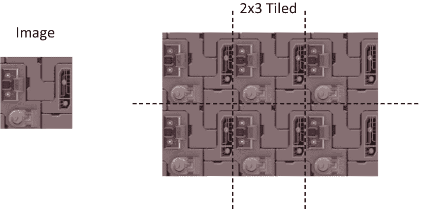
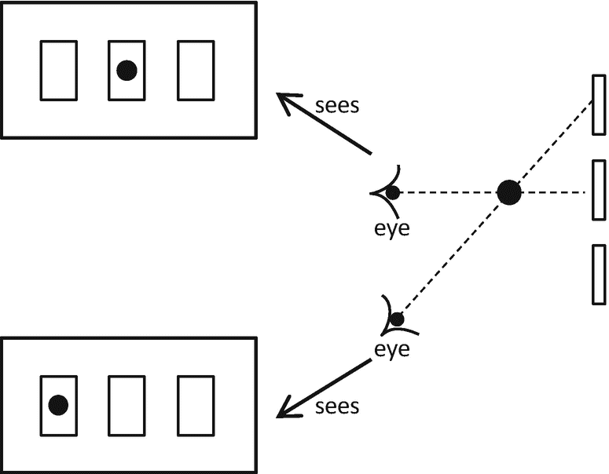
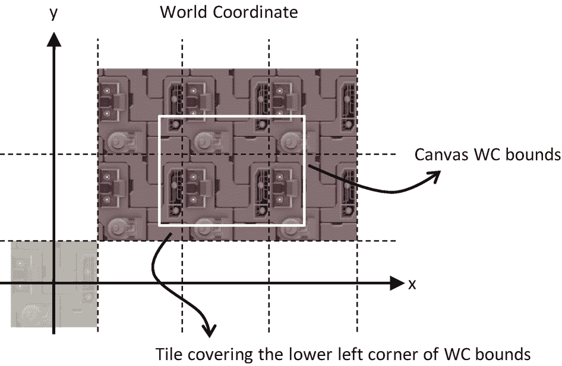
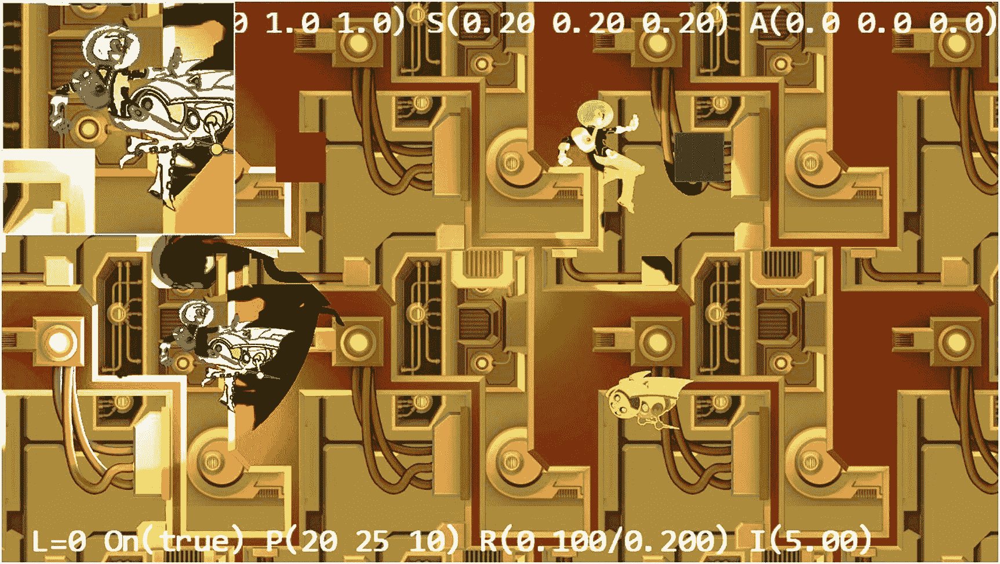
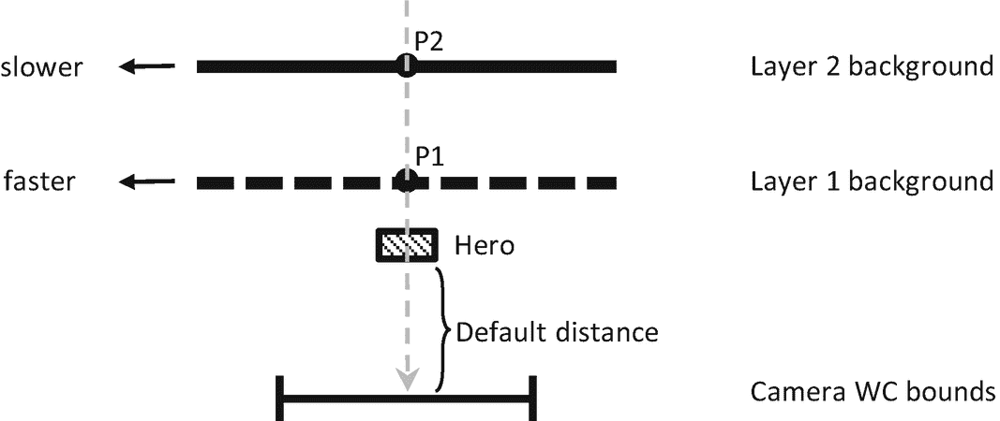
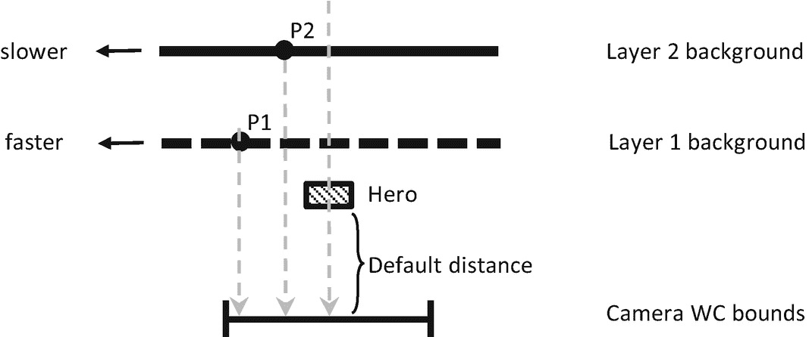
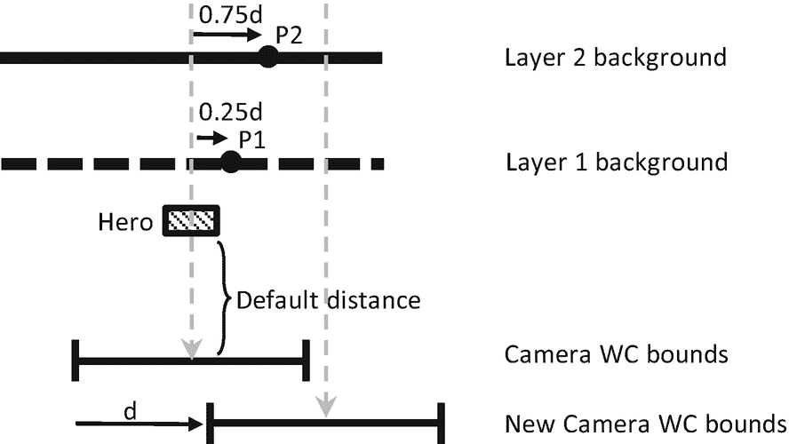
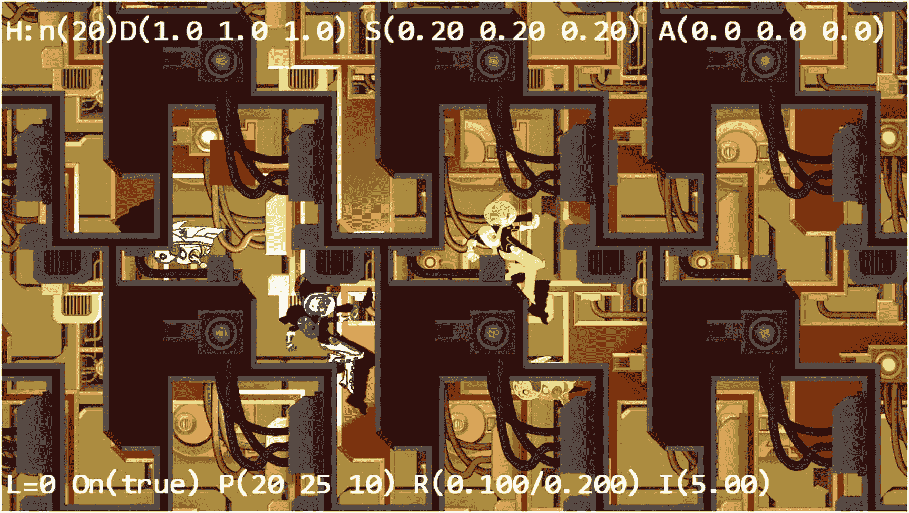
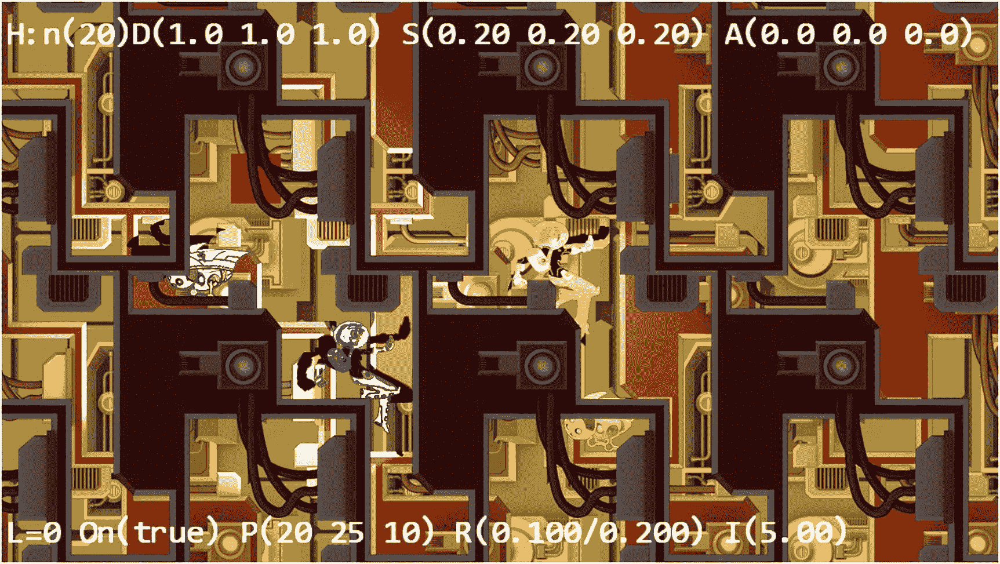

# 十一、支持摄像机背景

完成本章后，您将能够

*   在任何给定的相机 WC 边界内，用任何图像实现背景平铺

*   理解视差和用视差滚动模拟运动视差

*   理解 2D 游戏中分层物体的需要，并支持分层绘图

## 介绍

至此，您的游戏引擎能够照亮 2D 图像以生成高光和阴影，并模拟基本的物理行为。作为本书引擎开发的总结，这一章主要关注对使用背景平铺和视差创建游戏世界环境的一般支持，以及减轻游戏程序员管理绘制顺序的负担。

包括背景图像或物体来装饰游戏世界，以进一步吸引玩家。这通常要求图像规模庞大，视觉复杂微妙。例如，在侧滚游戏中，背景必须始终存在，简单的运动视差可以创建深度感，并进一步捕捉玩家的兴趣。

在计算机图形和视频游戏的上下文中，平铺指的是沿着 x 和 y 方向复制图像或图案。在视频游戏中，用于平铺的图像通常被战略性地构建，以确保内容在复制边界上的连续性。图 11-1 显示了一个策略性绘制的背景图像示例，该图像在 x 方向平铺三次，在 y 方向平铺两次。注意跨越复制边界的完美延续。适当的拼贴通过只创建一个单一的图像来传达无限游戏世界中的复杂性。



图 11-1

策略性绘制的背景图像的平铺

视差是当从不同的位置观看时物体的明显位移。图 11-2 显示了一个阴影圆的视差示例。当从中间的眼睛位置观察时，中心阴影圆看起来覆盖了中心矩形块。然而，当从底部眼睛位置观察时，这个相同的阴影圆似乎覆盖了顶部的矩形块。运动视差是观察到当一个人在运动时，附近的物体似乎比远处的物体移动得更快。这是传达深度知觉的基本视觉线索。在 2D 游戏中，运动视差的模拟是一种引入深度复杂性以进一步吸引玩家的直接方法。



图 11-2

视差:从不同的角度观察时，物体出现在不同的位置

这一章介绍了一个用于平铺摄像机 WC 边界的通用算法，并描述了一个隐藏视差滚动细节的抽象。随着背景视觉复杂性的增加，本章讨论了图层管理器的重要性，并创建了一个图层管理器，以减轻游戏程序员对绘制顺序的关注。

## 背景平铺

在 2D 游戏中平铺背景时，重要的是要认识到只需要绘制覆盖摄像机 WC 边界的平铺。如图 11-3 所示。在本例中，要平铺的背景对象在 WC 原点定义，具有自己的宽度和高度。然而，在这种情况下，相机 WC 边界不与定义的背景对象相交。图 11-3 显示背景对象需要平铺六次以覆盖摄像机 WC 边界。请注意，由于它在摄像机中不可见，因此不需要在原点绘制玩家定义的背景对象。



图 11-3

为摄像机 WC 边界生成平铺背景

有许多方法可以计算给定背景对象和相机 WC 边界所需的平铺。一种简单的方法是确定覆盖 WC 边界左下角的图块位置，并在正 x 和 y 方向上图块。

### 平铺对象项目

这个项目演示了如何实现简单的背景平铺。你可以在图 11-4 中看到这个项目运行的例子。这个项目的源代码在`chapter11/11.1.tiled_objects`文件夹中定义。



图 11-4

运行平铺对象项目

该项目的控制如下:

*   **WASD 键**:移动`Dye`角色(英雄)来平移厕所窗口边界

该项目的目标如下:

*   体验使用多层背景

*   为摄像机 WC 窗口边界实现背景对象的平铺

您可以在`assets`文件夹中找到以下外部资源。`fonts`文件夹包含默认的系统字体和六幅纹理图像:`minion_sprite.png`、`minion_sprite_normal.png`、`bg.png`、`bg_normal.png`、`bg_layer.png`和`bg_layer_normal.png`。`Hero`和`Minion`对象由`minion_sprite.png`图像中的 sprite 元素表示，`bg.png`和`bg_layer.png`是两层背景图像。对应的`_normal`文件是法线贴图。

#### 定义 TiledGameObject

回想一下，`GameObject`抽象了游戏中一个对象的基本行为，它的外观由它引用的`Renderable`对象决定。一个`TiledGameObject`是一个`GameObject`，它能够平铺被引用的`Renderable`对象以覆盖给定`Camera`对象的 WC 边界。

1.  在`src/engine/game_objects`文件夹中创建一个新文件，并将其命名为`tiled_game_object.js`。添加以下代码来构造对象。`mShouldTile`变量提供了停止平铺过程的选项。

1.  为`mShouldTile`定义 getter 和 setter 函数:

```js
class TiledGameObject extends GameObject {
    constructor(renderableObj) {
        super(renderableObj);
        this.mShouldTile = true; // can switch this off if desired
    }
… implementation to follow …
export default TiledGameObject;

```

1.  定义函数来平铺并绘制`Renderable`对象，以覆盖`aCamera`对象的 WC 边界:

```js
setIsTiled(t) { this.mShouldTile = t; }
shouldTile() { return this.mShouldTile; }

```

```js
_drawTile(aCamera) {
    // Step A: Compute the positions and dimensions of tiling object.
    let xf = this.getXform();
    let w = xf.getWidth();
    let h = xf.getHeight();
    let pos = xf.getPosition();
    let left = pos[0] - (w / 2);
    let right = left + w;
    let top = pos[1] + (h / 2);
    let bottom = top - h;

    // Step B: Get WC positions and dimensions of the drawing camera.
    let wcPos = aCamera.getWCCenter();
    let wcLeft = wcPos[0] - (aCamera.getWCWidth() / 2);
    let wcRight = wcLeft + aCamera.getWCWidth();
    let wcBottom = wcPos[1] - (aCamera.getWCHeight() / 2);
    let wcTop = wcBottom + aCamera.getWCHeight();

    // Step C: Determine offset to camera window's lower left corner.
    let dx = 0, dy = 0; // offset to the lower left corner
    // left/right boundary?
    if (right < wcLeft) { // left of WC left
        dx = Math.ceil((wcLeft - right) / w) * w;
    } else {
        if (left > wcLeft) { // not touching the left side
            dx = -Math.ceil((left - wcLeft) / w) * w;
        }
    }
    // top/bottom boundary
    if (top < wcBottom) { // Lower than the WC bottom
        dy = Math.ceil((wcBottom - top) / h) * h;
    } else {
        if (bottom > wcBottom) {  // not touching the bottom
            dy = -Math.ceil((bottom - wcBottom) / h) * h;
        }
    }

    // Step D: Save the original position of the tiling object.
    let sX = pos[0];
    let sY = pos[1];

    // Step E: Offset tiling object and update related position variables
    xf.incXPosBy(dx);
    xf.incYPosBy(dy);
    right = pos[0] + (w / 2);
    top = pos[1] + (h / 2);

    // Step F: Determine number of times to tile in x and y directions.
    let nx = 1, ny = 1; // times to draw in the x and y directions
    nx = Math.ceil((wcRight - right) / w);
    ny = Math.ceil((wcTop - top) / h);

    // Step G: Loop through each location to draw a tile

    let cx = nx;
    let xPos = pos[0];
    while (ny >= 0) {
        cx = nx;
        pos[0] = xPos;
        while (cx >= 0) {
            this.mRenderComponent.draw(aCamera);
            xf.incXPosBy(w);
            --cx;
        }
        xf.incYPosBy(h);
        --ny;
    }

    // Step H: Reset the tiling object to its original position.
    pos[0] = sX;
    pos[1] = sY;
}

```

`_drawTile()`函数计算并重新定位`Renderable`对象，以覆盖摄像机 WC 边界的左下角，并在正 x 和 y 方向平铺对象。请注意以下几点:

1.  启用平铺时，覆盖`draw()`函数以调用`_drawTile()`函数:

1.  步骤 A 和 B 计算平铺对象和摄像机 WC 边界的位置和尺寸。

2.  步骤 C 计算`dx`和`dy`偏移量，这将平移`Renderable`对象，其边界覆盖了`aCamera` WC 边界的左下角。对`Math.ceil()`函数的调用确保计算出的`dx`和`dy`是`Renderable`宽度和高度的整数倍。这对于确保平铺过程中没有重叠或间隙非常重要。

3.  在偏移和绘制之前，步骤 D 保存`Renderable`对象的原始位置。步骤 E 偏移`Renderable`对象以覆盖摄像机 WC 边界的左下角。

4.  步骤 F 计算所需的重复次数，步骤 G 在正 x 和 y 方向上平铺`Renderable`对象，直到结果覆盖整个摄像机 WC 边界。对`Math.ceil()`函数的调用确保计算出的`nx`和`ny`(在 x 和 y 方向上平铺的次数)是整数。

5.  步骤 H 将平铺对象的位置重置为原始位置。

```js
draw(aCamera) {
    if (this.isVisible() && (this.mDrawRenderable)) {
        if (this.shouldTile()) {
            // find out where we should be drawing
            this._drawTile(aCamera);
        } else {
            this.mRenderComponent.draw(aCamera);
        }
    }
}

```

最后，记得更新引擎访问文件`index.js`，以便将新定义的功能转发给客户端。

#### 修改我的游戏来测试平铺的对象

`MyGame`应该测试对象平铺的正确性。为了测试多层平铺，创建了两个单独的实例`TiledGameObject`和`Camera`。这两个`TiledGameObject`实例位于离摄像机不同的距离(z 深度),并由不同的光源组合照亮。增加的第二个摄像头聚焦在一个`Hero`物体上。

只对`TiledGameObject`实例的创建感兴趣。这是因为一旦创建了一个`TiledGameObject`实例，就可以像处理一个`GameObject`实例一样处理它。出于这个原因，只详细检查`MyGame`类的`init()`函数。

```js
init() {
    // Step A: set up the cameras
    this.mCamera = new engine.Camera(
        vec2.fromValues(50, 37.5), // position of the camera
        100,                       // width of camera
        [0, 0, 1280, 720]          // viewport (X, Y, width, height)
    );
    this.mCamera.setBackgroundColor([0.8, 0.8, 0.8, 1]);
    // sets the background to gray

    this.mHeroCam = new engine.Camera(
        vec2.fromValues(20, 30.5), // position of the camera
        14,                        // width of camera
        [0, 420, 300, 300],        // viewport (X, Y, width, height)
        2
    );
    this.mHeroCam.setBackgroundColor([0.5, 0.5, 0.9, 1]);

    // Step B: the lights
    this._initializeLights();   // defined in MyGame_Lights.js

    // Step C: the far Background
    let bgR = new engine.IllumRenderable(this.kBg, this.kBgNormal);
    bgR.setElementPixelPositions(0, 1024, 0, 1024);
    bgR.getXform().setSize(30, 30);
    bgR.getXform().setPosition(0, 0);
    bgR.getMaterial().setSpecular([0.2, 0.1, 0.1, 1]);
    bgR.getMaterial().setShininess(50);
    bgR.getXform().setZPos(-5);
    bgR.addLight(this.mGlobalLightSet.getLightAt(1));
                                     // only the directional light
    this.mBg = new engine.TiledGameObject(bgR);

    // Step D: the closer Background
    let i;
    let bgR1 = new engine.IllumRenderable(
                                    this.kBgLayer, this.kBgLayerNormal);
    bgR1.getXform().setSize(30, 30);
    bgR1.getXform().setPosition(0, 0);
    bgR1.getXform().setZPos(-2);
    for (i = 0; i < 4; i++) {
        bgR1.addLight(this.mGlobalLightSet.getLightAt(i)); // all lights
    }
    bgR1.getMaterial().setSpecular([0.2, 0.2, 0.5, 1]);
    bgR1.getMaterial().setShininess(10);
    this.mBgL1 = new engine.TiledGameObject(bgR1);

    ... identical to previous code ...
}

```

在列出的代码中，首先在步骤 A 中创建两个摄像机，然后在`_initializeLights()`函数中创建并初始化所有光源。步骤 C 将`bgR`定义为一个被一个光源照亮的`IllumRenderable`的`TiledGameObject`。步骤 D 基于被四个光源照亮的另一个`IllumRenderable`定义第二个`TiledGameObject`。由于`TileGameObject`类的`mShouldTile`变量默认为 true，两个平铺对象将平铺它们正在绘制的摄像机。

#### 观察

现在，您可以运行项目并使用 WASD 键移动`Hero`对象。正如所料，两层平铺背景清晰可见。您可以通过选择并关闭光源 1(键入 1 键，然后键入 H 键)来关闭对更远背景的照明。移动`Hero`对象平移摄像机，以验证两个摄像机中的平铺和背景移动行为是否正确。

一个有趣的观察结果是，当两层背景位于离摄像机不同的距离时，当摄像机平移时，两个背景图像同步滚动。如果不是因为光源照明的差异，看起来好像背景实际上是一个单一的图像。这个例子说明了模拟运动视差的重要性。

## 用视差滚动模拟运动视差

视差滚动通过以不同的速度定义和滚动对象来模拟运动视差，以传达这些对象位于离相机不同距离的感觉。图 11-5 用俯视图说明了这个想法，显示了物体与摄像机的概念距离。由于这是一个鸟瞰图，摄像机 WC 边界的宽度在底部显示为一条水平线。在两层背景`Layer1`和`Layer2`的前面，`Hero`物体是离摄像机最近的。对于典型的 2D 游戏来说，游戏中的绝大多数物体将位于离摄像机的这个默认距离处。背景对象位于离相机更远的位置，在默认距离之后。距离感可以通过背景物体上的战略图来传达(例如`Layer1`的草地和`Layer2`的远山)，并伴有适当的滚动速度。注意背景物体`Layer1`和`Layer2`上的位置 *P* <sub>1</sub> 和 *P* <sub>2</sub> 在`Hero`物体的正后方。



图 11-5

具有两个不同距离的背景对象的场景的俯视图

图 11-6 显示了固定摄像机向左视差滚动的结果。随着`Layer1`以比`Layer2`更快的速度滚动，位置*P*1 比*P*2 从其原始位置有更大的位移。连续滚动将使`Layer1`比`Layer2`移动得更快，并恰当地传达出它比`Layer2`更近的感觉。在视差滚动中，离相机较近的对象总是比较远的对象滚动速度快。



图 11-6

固定相机的视差滚动俯视图

在摄像机运动的情况下，当实现视差滚动时，必须考虑物体的相对速度。图 11-7 用俯视图展示了移动的摄像机和静止的物体的情况。在本例中，摄像机 WC 边界向右移动了`d`个单位。由于运动是在相机中进行的，所以相机视图中的所有静止物体将看起来被相机运动的逆运动所取代。例如，静止的`Hero`对象从中心向左移动到新 WC 边界的左边缘。为了正确地模拟运动视差，两个背景`Layer1`和`Layer2`必须移动不同的相对距离。在这种情况下，必须计算相对距离，使得更远的物体看起来移动得更慢。在摄像机移动结束时，在新的 WC 边界内，离摄像机最近的`Hero`对象看起来已经向左移动了`d`个单位，`Layer1`对象移动了`0.75d`，而`Layer2`对象移动了`0.25d`。这样，对象的位移反映了它们与相机的相对距离。为此，`Hero`对象的平移为零，`Layer1`和`Layer2`对象必须分别向右平移`0.25d`和`0.75d`。请注意，背景向右平移的量小于相机移动的量，因此，背景实际上是向左移动的。例如，虽然`Layer1`对象被`0.25d`向右平移，但是当从已经被`d`向右移动的摄像机来看时，产生的相对移动使得`Layer1`对象已经被`0.75d`向左移位。



图 11-7

相机运动时视差滚动的俯视图

重要的是要注意，在所描述的为移动的摄像机实现视差滚动的方法中，静止的背景物体被移动。这种方法有两个局限性。首先，改变对象位置是为了传达视觉提示，并不反映任何特定的游戏状态逻辑。如果游戏逻辑要求精确控制背景物体的运动，这会产生具有挑战性的冲突。幸运的是，背景物体通常是为了装饰环境和吸引玩家而设计的。背景物体通常不参与实际的游戏逻辑。第二个限制是静止的背景物体实际上是运动的，并且当从除了引起运动视差的摄像机之外的摄像机观看时，将会出现这种情况。当在存在运动视差的情况下需要来自多个摄像机的视图时，仔细协调它们以避免玩家混淆是很重要的。

### 视差物体项目

这个项目演示了视差滚动。你可以在图 11-8 中看到这个项目运行的例子。这个项目的源代码在`chapter11/11.2.parallax_objects`文件夹中定义。



图 11-8

运行视差对象项目

该项目的控制措施如下:

*   **P 键**:在模拟视差滚动时，切换不运动的第二台摄像机的画面，以突出背景物体的运动

*   **WASD 键**:移动`Dye`角色(英雄)来平移厕所窗口边界

该项目的目标如下:

*   为了理解和欣赏运动视差

*   使用视差滚动模拟运动视差

#### 定义 ParallaxGameObject 来实现视差滚动

视差滚动涉及到物体的连续滚动，`TiledGameObject`为永不停止的滚动提供了一个方便的平台。因此，`ParallaxGameObject`被定义为`TiledGameObject`的子类。

1.  在`src/engine/game_objects`文件夹中创建`parallax_game_object.js`，并添加以下代码来构造对象:

```js
import TiledGameObject from "./tiled_game_object.js";

class ParallaxGameObject extends TiledGameObject {
    constructor(renderableObj, scale, aCamera) {
        super(renderableObj);
        this.mRefCamera = aCamera;
        this.mCameraWCCenterRef =
                              vec2.clone(this.mRefCamera.getWCCenter());
        this.mParallaxScale = 1;
        this.setParallaxScale(scale);
    }
    ... implementation to follow ...
}
export default ParallaxGameObject;

```

`ParallaxGameObject`对象维护`mRefCamera`，一个对`aCamera`和`mCameraWCCenterRef`的引用，当前 WC 边界中心。这些值用于根据参考摄像机的运动计算相对运动，以支持视差滚动。`scale`参数是一个正值。`scale`值 1 表示对象位于默认距离，小于 1 的值表示对象在默认距离的前面。大于 1 的`scale`表示在默认距离之后的对象。`scale`值越大，物体离相机越远。

1.  为`mParallaxScale`定义 getter 和 setter 函数。注意负值的箝位；此变量必须是正数。

1.  覆盖`update()`函数实现视差滚动:

```js
getParallaxScale() { return this.mParallaxScale; }
setParallaxScale(s) {
    this.mParallaxScale = s;
    if (s <= 0) {
        this.mParallaxScale = 1;
    }
}

```

```js
update() {
    // simple default behavior
    this._refPosUpdate(); // check to see if the camera has moved
    super.update();
}

```

`_refPosUpdate()`功能是根据参考摄像机的 WC 中心位置计算相对位移的功能。

1.  定义`_refPosUpdate()`功能:

```js
_refPosUpdate() {
    // now check for reference movement
    let deltaT = vec2.fromValues(0, 0);
    vec2.sub(deltaT,
               this.mCameraWCCenterRef, this.mRefCamera.getWCCenter());
    this.setWCTranslationBy(deltaT);

    // update WC center ref position
    vec2.sub(this.mCameraWCCenterRef, this.mCameraWCCenterRef, deltaT);
}

```

`deltaT`变量记录摄像机的移动，`setWCTranslationBy()`移动物体模拟视差滚动。

1.  定义函数来平移对象以实现视差滚动。底片`delta`的设计目的是将物体向与相机相同的方向移动。注意变量`f`是 1 减去`mParallaxScale`的倒数。

```js
setWCTranslationBy(delta) {
    let f = (1 – (1/this.mParallaxScale));
    this.getXform().incXPosBy(-delta[0] * f);
    this.getXform().incYPosBy(-delta[1] * f);
}

```

当`mParallaxScale`小于 1 时，倒数大于 1，`f`变为负数。在这种情况下，当相机移动时，对象将向相反的方向移动，从而产生对象在默认距离前面的感觉。

相反，当`mParallaxScale`大于 1 时，其倒数将小于 1，并导致正`f`的值小于 1。在这种情况下，物体的运动方向与相机的运动方向相同，只是速度较慢。更大的`mParallaxScale`将对应于更接近 1 的`f`值，并且对象的移动将更接近相机的移动，或者对象将看起来离相机更远。

最后，记得更新引擎访问文件`index.js`，以便将新定义的功能转发给客户端。

#### 在 MyGame 中测试 ParallaxGameObject

`ParallaxGameObject`的测试包括在摄像机运动时测试视差滚动的正确性，默认距离的前面和后面都有物体，同时从一个单独的固定摄像机观察`ParallaxGameObject`。`MyGame`级别的源代码与上一个项目的很大程度上相似，细节就不列出来了。为了说明如何创建`ParallaxGameObject`实例，列出了`init()`函数的相关部分。

```js
init() {
    // Step A: set up the cameras
    this.mCamera = new engine.Camera(
       vec2.fromValues(50, 37.5), // position of the camera
       100,                       // width of camera
       [0, 0, 1280, 720]          // viewport (orgX, orgY, width, height)
    );
    this.mCamera.setBackgroundColor([0.8, 0.8, 0.8, 1]);
    // sets the background to gray

    this.mParallaxCam = new engine.Camera(
        vec2.fromValues(40, 30), // position of the camera
        45,                      // width of camera
        [0, 420, 600, 300],      // viewport (orgX, orgY, width, height)
        2
    );
    this.mParallaxCam.setBackgroundColor([0.5, 0.5, 0.9, 1]);

    // Step B: the lights
    this._initializeLights();   // defined in MyGame_Lights.js

    // Step C: the far Background
    let bgR = new engine.IllumRenderable(this.kBg, this.kBgNormal);
    bgR.setElementPixelPositions(0, 1024, 0, 1024);
    bgR.getXform().setSize(30, 30);
    bgR.getXform().setPosition(0, 0);
    bgR.getMaterial().setSpecular([0.2, 0.1, 0.1, 1]);
    bgR.getMaterial().setShininess(50);
    bgR.getXform().setZPos(-5);

    // only the directional light
    bgR.addLight(this.mGlobalLightSet.getLightAt(1));
    this.mBg = new engine.ParallaxGameObject(bgR, 5, this.mCamera);

    // Step D: the closer Background
    let i;
    let bgR1 = new engine.IllumRenderable(
                                    this.kBgLayer, this.kBgLayerNormal);
    bgR1.getXform().setSize(25, 25);
    bgR1.getXform().setPosition(0, -15);
    bgR1.getXform().setZPos(0);
    // the directional light
    bgR1.addLight(this.mGlobalLightSet.getLightAt(1));
    // the hero spotlight light
    bgR1.addLight(this.mGlobalLightSet.getLightAt(2));
    // the hero spotlight light
    bgR1.addLight(this.mGlobalLightSet.getLightAt(3));
    bgR1.getMaterial().setSpecular([0.2, 0.2, 0.5, 1]);
    bgR1.getMaterial().setShininess(10);
    this.mBgL1 = new engine.ParallaxGameObject(bgR1, 3, this.mCamera);

    // Step E: the front layer
    let f = new engine.TextureRenderable(this.kBgLayer);
    f.getXform().setSize(50, 50);
    f.getXform().setPosition(-3, 2);
    this.mFront = new engine.ParallaxGameObject(f, 0.9, this.mCamera);

    ... identical to previous code ...
}

```

将`mBg`对象创建为`scale`为 5 的`ParallaxGameObject`、`scale`为 3 的`mBgL1`和`scale`为 0.9 的`mFront`。回想一下`scale`是`ParallaxGameObject`构造函数的第二个参数。此参数表示物体与相机的距离，大于 1 的值表示距离更远，小于 1 的值表示距离更近。在这种情况下，`mBg`离摄像机最远，而`mBgL1`更近。无论如何，两者仍落后于默认距离。`mFront`物体离摄像机最近，在默认距离前或在`Hero`物体前。

#### 观察

现在你可以运行这个项目，观察较暗的前景层部分遮挡了`Hero`和`Minion`对象。你可以移动`Hero`物体来平移相机，观察两个背景层以不同的速度滚动。`mBg`物体距离更远，因此滚动速度比`mBgL1`物体慢。你还会注意到前层视差滚动的速度比所有其他物体都快，因此，平移相机会显示静止`Minion`物体的不同部分。

按 P 键启用第二台摄像机的绘制。请注意，当`Hero`静止时，该相机中的视图与预期一样，没有移动。现在，如果您移动`Hero`对象来平移主摄像机，请注意第二个摄像机视图中的前景和背景对象也在移动，并且表现出运动视差，即使第二个摄像机没有移动！作为游戏设计者，确保这种副作用不会困扰玩家是很重要的。

## 层管理

虽然你正在开发的引擎是为 2D 游戏开发的，但是你已经处理过一些深度排序和绘制顺序很重要的情况。例如，阴影接收器必须始终定义在阴影投射器的后面，正如前面的示例中所讨论的，前景和背景视差对象必须仔细定义，并按照其深度排序的顺序绘制。游戏引擎提供一个工具管理器来帮助游戏程序员管理和使用深度分层是很方便的。一个典型的 2D 游戏可以有以下层，按照离摄像机的距离从最近到最远的顺序:

*   **平视显示器(HUD)层**:通常，最靠近显示重要用户界面信息的摄像机

*   **前景或前层**:游戏对象前面的层，用于装饰或部分遮挡游戏对象

*   **演员层**:图 11-5 中默认的距离层，所有游戏对象都驻留在此

*   **阴影接收层**:演员层后面的层，用于接收潜在的阴影

*   **背景层**:装饰背景

每个图层都将引用为该图层定义的所有对象，这些对象将按照它们插入图层的顺序进行绘制，最后插入的对象在最后绘制，覆盖对象在它之前。本节介绍了支持所述五层的`Layer`引擎组件，以将游戏程序员从管理更新和绘制对象的细节中解放出来。请注意，游戏引擎应该支持的层数由引擎设计构建的游戏种类决定。所呈现的五层对于简单的游戏来说是合乎逻辑和方便的。你可以选择在你自己的游戏引擎中增加层数。

### 图层管理器项目

这个项目演示了如何开发一个工具组件来帮助游戏程序员管理游戏中的层。你可以在图 11-9 中看到这个项目运行的例子。这个项目的源代码在`chapter11/11.3.layer_manager`文件夹中定义。



图 11-9

运行图层管理器项目

该项目的控件与之前的项目相同:

*   **P 键**:在模拟视差滚动时，切换不运动的第二台摄像机的画面，以突出背景物体的运动

*   **WASD 键**:移动染色角色(英雄)来平移厕所窗口边界

该项目的目标如下:

*   为了理解分层在 2D 游戏中的重要性

*   开发图层管理器引擎组件

#### 引擎中的层管理

例如，遵循定义引擎组件的模式，类似于物理和粒子系统的模式:

1.  在`src/engine/components`文件夹中创建一个新文件，并将其命名为`layer.js`。这个文件将实现`Layer`引擎组件。

2.  为层定义枚举器:

1.  定义适当的常数和实例变量来跟踪层。`mAllLayers`变量是代表五层中每一层的`GameObjectSet`实例的数组。

```js
const eBackground = 0;
const eShadowReceiver = 1;
const eActors = 2;
const eFront = 3;
const eHUD = 4;

```

1.  定义一个`init()`函数来创建`GameObjectSet`实例的数组:

```js
let kNumLayers = 5;
let mAllLayers = [];

```

1.  定义一个`cleanUp()`函数来重置`mAllLayer`数组:

```js
function init() {
    mAllLayers[eBackground] = new GameObjectSet();
    mAllLayers[eShadowReceiver] = new GameObjectSet();
    mAllLayers[eActors] = new GameObjectSet();
    mAllLayers[eFront] = new GameObjectSet();
    mAllLayers[eHUD] = new GameObjectSet();
}

```

1.  定义添加、移除和查询图层的函数。注意`addAsShadowCaster()`函数假设阴影接收器对象已经插入到`eShadowReceiver`层，并将投射对象添加到该层的所有接收器中。

```js
function cleanUp() {
    init();
}

```

1.  定义绘制特定层或所有层的函数，从最远到最近的摄像机:

```js
function addToLayer(layerEnum, obj) {
    mAllLayers[layerEnum].addToSet(obj); }
function removeFromLayer(layerEnum, obj) {
    mAllLayers[layerEnum].removeFromSet(obj); }
function layerSize(layerEnum) { return mAllLayers[layerEnum].size(); }

function addAsShadowCaster(obj) {
    let i;
    for (i = 0; i < mAllLayers[eShadowReceiver].size(); i++) {
        mAllLayers[eShadowReceiver].getObjectAt(i).addShadowCaster(obj);
    }
}

```

1.  定义一个函数来移动特定对象，使其最后绘制(在顶部):

```js
function drawLayer(layerEnum, aCamera) {
    mAllLayers[layerEnum].draw(aCamera); }
function drawAllLayers(aCamera) {
    let i;
    for (i = 0; i < kNumLayers; i++) {
        mAllLayers[i].draw(aCamera);
    }
}

```

1.  定义更新特定图层或所有图层的函数:

```js
function moveToLayerFront(layerEnum, obj) {
    mAllLayers[layerEnum].moveToLast(obj);
}

```

1.  记住导出所有已定义的功能:

```js
function updateLayer(layerEnum) { mAllLayers[layerEnum].update(); }
function updateAllLayers() {
    let i;
    for (i = 0; i < kNumLayers; i++) {
        mAllLayers[i].update();
    }
}

```

```js
export {
    // array indices
    eBackground, eShadowReceiver, eActors, eFront, eHUD,

    // init and cleanup
    init, cleanUp,

    // draw/update
    drawLayer, drawAllLayers,
    updateLayer, updateAllLayers,

    // layer-specific support
    addToLayer, addAsShadowCaster,
    removeFromLayer, moveToLayerFront,
    layerSize
}

```

最后，记得更新引擎访问文件`index.js`，以便将新定义的功能转发给客户端。

#### 修改引擎组件和对象

你必须稍微修改游戏引擎的其余部分来整合新的`Layer`组件。

##### 增强游戏对象集功能

添加以下函数以支持将对象移动到集合数组的末尾:

```js
moveToLast(obj) {
    this.removeFromSet(obj);
    this.addToSet(obj);
}

```

##### 初始化 index.js 中的图层

除了导入/导出`Layer`组件外，修改`index.js`中的引擎`init()`和`cleanUp()`函数来初始化和清理组件:

```js
... identical to previous code ...
function init(htmlCanvasID) {
    glSys.init(htmlCanvasID);
    vertexBuffer.init();
    input.init(htmlCanvasID);
    audio.init();
    shaderResources.init();
    defaultResources.init();
    layer.init();
}

function cleanUp() {
    layer.cleanUp();
    loop.cleanUp();
    shaderResources.cleanUp();
    defaultResources.cleanUp();
    audio.cleanUp();
    input.cleanUp();
    vertexBuffer.cleanUp();
    glSys.cleanUp();
}

```

##### 定义图层成员的更新函数

为可能作为成员出现在`Layer` : `Renderable`和`ShadowReceiver`中的对象定义更新函数。

#### 修改 MyGame 以使用层组件

`MyGame`级别实现了与前一个项目相同的功能。唯一的区别是层管理委托给了`Layer`组件。以下描述仅关注与层管理相关的函数调用。

1.  修改`unload()`函数来清理`Layer`:

1.  修改`init()`函数，将游戏对象添加到`Layer`组件中的相应层:

```js
unload() {
    engine.layer.cleanUp();

    engine.texture.unload(this.kMinionSprite);
    engine.texture.unload(this.kBg);
    engine.texture.unload(this.kBgNormal);
    engine.texture.unload(this.kBgLayer);
    engine.texture.unload(this.kBgLayerNormal);
    engine.texture.unload(this.kMinionSpriteNormal);
}

```

1.  修改`draw()`功能，以依赖`Layer`组件进行实际绘图:

```js
init() {
    ... identical to previous code ...

    // add to layer managers ...
    engine.layer.addToLayer(engine.layer.eBackground, this.mBg);
    engine.layer.addToLayer(engine.layer.eShadowReceiver,
                                               this.mBgShadow1);

    engine.layer.addToLayer(engine.layer.eActors, this.mIllumMinion);
    engine.layer.addToLayer(engine.layer.eActors, this.mLgtMinion);
    engine.layer.addToLayer(engine.layer.eActors, this.mIllumHero);
    engine.layer.addToLayer(engine.layer.eActors, this.mLgtHero);

    engine.layer.addToLayer(engine.layer.eFront, this.mBlock1);
    engine.layer.addToLayer(engine.layer.eFront, this.mBlock2);
    engine.layer.addToLayer(engine.layer.eFront, this.mFront);

    engine.layer.addToLayer(engine.layer.eHUD, this.mMsg);
    engine.layer.addToLayer(engine.layer.eHUD, this.mMatMsg);
}

```

1.  修改`update()`函数，依靠`Layer`组件对所有游戏对象进行实际更新:

```js
draw() {
    engine.clearCanvas([0.9, 0.9, 0.9, 1.0]); // clear to light gray

    this.mCamera.setViewAndCameraMatrix();
    engine.layer.drawAllLayers(this.mCamera);

    if (this.mShowParallaxCam) {
        this.mParallaxCam.setViewAndCameraMatrix();
        engine.layer.drawAllLayers(this.mParallaxCam);
    }
}

```

```js
update() {
    this.mCamera.update();  // to ensure proper interpolated movement
    this.mParallaxCam.update();

    engine.layer.updateAllLayers();

    ... identical to previous code ...
}

```

#### 观察

您现在可以运行该项目，并观察与上一个项目相同的输出和交互。对这个项目的重要观察是在实现中。通过在`init()`期间将游戏对象插入到`Layer`组件的适当层，游戏关卡的`draw()`和`update()`功能可以更加简洁。更简单、更干净的`update()`功能尤为重要。这个函数现在可以专注于实现游戏逻辑和控制游戏对象之间的交互，而不是被平凡的游戏对象`update()`函数调用所困扰。

## 摘要

本章解释了平铺的必要性，并介绍了`TileGameObject`来实现一个简单的算法，平铺并覆盖给定的摄像机 WC 边界。介绍了视差的基本原理和用视差滚动模拟运动视差的方法。检查了静止和移动摄像机的运动视差，并推导和实现了解决方案。您已经了解到，计算相对于摄像机运动的移动来替换背景对象会产生视觉上令人满意的运动视差，但当从不同的摄像机观看时，可能会导致玩家混淆。随着早期引入的阴影计算和现在的视差滚动，游戏程序员必须投入代码和注意力来协调不同类型对象的绘制顺序。为了促进游戏引擎的可编程性，`Layer`引擎组件被呈现为一个实用工具，以将游戏程序员从管理层的绘制中解放出来。

这本书提出的游戏引擎现在已经完成。它可以用纹理贴图、精灵动画来绘制对象，甚至支持各种光源的照明。该引擎为简单行为定义适当的抽象，实现近似和精确计算碰撞的机制，并模拟物理行为。来自多个摄像机的视图可以方便地显示在相同的游戏屏幕上，具有平滑插值的操作功能。支持键盘/鼠标输入，现在背景对象可以无边界滚动，模拟运动视差。

重要的下一步，正确地测试你的引擎，是通过一个简单的游戏设计过程，并实现一个基于你新完成的游戏引擎的游戏。

### 游戏设计注意事项

在前面的章节中，您已经探索了如何从头开始开发一个简单的游戏机制，它可以引导许多方向并应用于各种类型的游戏。游戏设计工作室的创意团队经常争论游戏设计的哪些元素在创意过程中起主导作用:作家通常认为故事是第一位的，而许多设计师认为故事和其他一切都必须从属于游戏性。当然，没有正确或错误的答案；创作过程是一个混乱的系统，每个团队和工作室都是独一无二的。一些创意总监希望讲述一个特定的故事，并将寻找最适合支持特定叙事的机制和类型，而其他人则是游戏纯粹主义者，完全致力于“游戏性优先，其次，最后”的文化这个决定通常归结为理解你的听众；例如，如果你正在创建竞争性的多人第一人称射击游戏体验，消费者将对游戏的许多核心元素有特定的期望，确保游戏性驱动设计通常是一个明智的举动。然而，如果你正在创建一个冒险游戏，旨在讲述一个故事，并为玩家提供新的体验和意想不到的转折，故事和设定可能会引领潮流。

许多游戏设计者(包括经验丰富的老手和新手)开始新的项目时，设计的体验是对现有的熟知机制的相对较小的改变；虽然这种方法有很好的理由(如 AAA 工作室为特别苛刻的观众开发内容，或者希望与许多游戏中已被证明成功的机制合作)，但它往往会极大地限制对新领域的探索，这也是许多游戏玩家抱怨同一类型游戏之间创意停滞和缺乏游戏多样性的一个原因。许多专业游戏设计师从小就喜欢某些类型的游戏，并梦想着基于我们所知道和喜爱的机制创造新的体验，几十年来，这种文化已经将行业的大部分注意力集中在相对较少的类似机制和惯例上。也就是说，近年来，一个快速增长的独立小型工作室社区已经大胆地开始抛弃长期存在的类型传统，移动应用商店和 Valve 的 Steam 等易于访问的分发平台为各种新的游戏机制和体验的蓬勃发展提供了机会。

如果你继续探索游戏设计，你会意识到完全独特的核心机制相对较少，但随着你将这些基本的交互构建到更复杂的因果链中，并通过与游戏设计的其他元素的优雅集成来添加独特的味道和纹理，创新的机会是无穷的。一些最具突破性和最成功的游戏是通过练习创建的，这些练习非常类似于您在这些“*游戏设计考虑事项*”部分中所做的机械探索；例如，Valve 的门户网站是基于你一直在探索的同类“逃离房间”沙盒，并且是围绕一个类似的简单基础机制设计的。是什么让《传送门》取得如此突破性的成功？虽然创建一个热门游戏需要许多东西，但 Portal 受益于一个设计团队，该团队开始从最基本的机制开始构建体验，并随着他们对其独特的结构和特征越来越熟悉而智能地增加复杂性，而不是从 10，000 英尺的高度开始，采用一种已编纂的类型和一套预定的设计规则。

当然，没有人在谈论传送门时不提到流氓人工智能角色 GLaDOS 和她的 Aperture Laboratories 游乐场:设置、叙事和视听设计对于传送门体验来说与传送门启动游戏机制一样重要，鉴于它们是如何巧妙地交织在一起，很难将游戏性与叙事分开。本章中的项目提供了一个很好的机会，让我们从*“游戏设计考虑事项”*部分开始，在一个独特的环境和背景中类似地定位游戏机制:你可能已经注意到本书中的许多项目都朝着科幻视觉主题发展，有穿着宇航服的英雄角色，各种各样的飞行机器人，现在在第十一章中引入了视差环境。虽然你没有像《传送门》一样构建一个环境和交互复杂程度相同的游戏，但这并不意味着你没有同样的机会来开发一个高度引人入胜的游戏环境、背景和角色。

关于*平铺对象*项目，你应该注意到的第一件事是与早期项目相比，对环境体验和规模的巨大影响。在这个项目中，增强存在感的因素是三个独立移动的层(英雄人物、移动的墙和静止的墙)以及两个背景层的无缝拼接。将*平铺对象*项目与第八章中的*阴影着色器*项目进行比较，并注意当环境被分成多个层时存在的差异，这些层似乎以类似于(如果不是物理上准确的)您在物理世界中体验运动的方式移动。在*视差物体*项目中加入多个视差运动的背景层，存在感进一步加强；当你在物质世界中移动时，环境似乎以不同的速度移动，较近的物体似乎快速通过，而靠近地平线的物体似乎移动缓慢。视差环境对象模拟了这种效果，为游戏环境增加了相当大的深度和趣味性。层管理器项目将所有的事情整合在一起，并开始展示游戏设置的潜力，立即吸引玩家的想象力。只需几项技术，你就能创造出一个巨大环境的印象，这个环境可能是古代外星机器的内部，大型宇宙飞船的外部，或者你想创造的任何东西。尝试用这种技术使用不同种类的图像资产:外部景观、水下位置、抽象形状等等都是有趣的探索。你经常会通过尝试一些基本元素来寻找游戏设置的灵感，就像你在第十一章中所做的那样。

将环境设计(音频和视觉)与交互设计(偶尔包括类似控制器振动的触觉反馈)相结合，是一种可以用来创建和增强临场感的方法，环境和交互与游戏机制的关系贡献了玩家在游戏中的大部分体验。环境设计和叙事背景创造了游戏设定，正如前面提到的，最成功和最令人难忘的游戏实现了游戏设定和玩家体验之间的完美和谐。在这一点上，来自第九章*【游戏设计注意事项】*部分的游戏机制已经被有意地去除了任何游戏设定背景，你只是简单地考虑了交互设计，让你自由地探索任何你感兴趣的设定。在第十二章中，你将通过*“游戏设计注意事项”*部分的解锁机制进一步发展主要章节项目中使用的科幻设定和图像资产，以创建一个相当先进的 2D 平台游戏级原型。