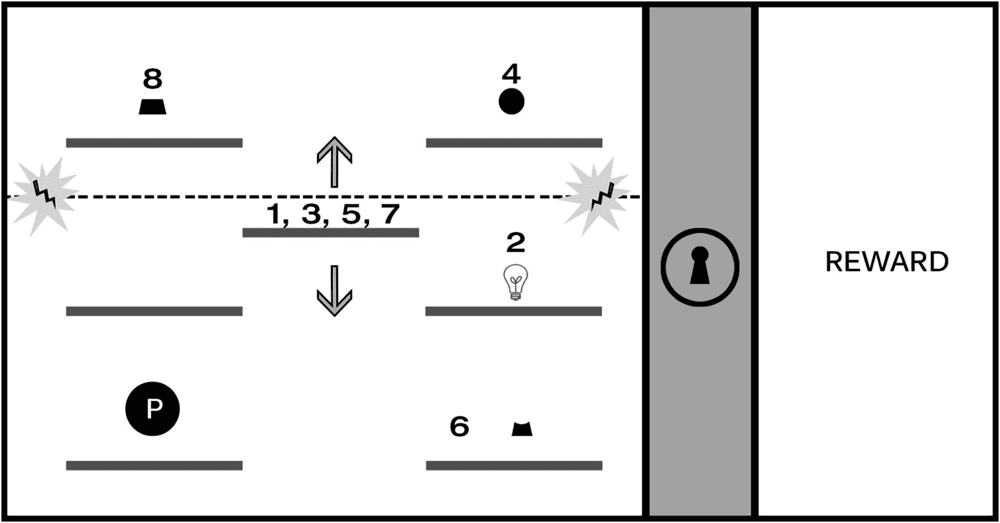
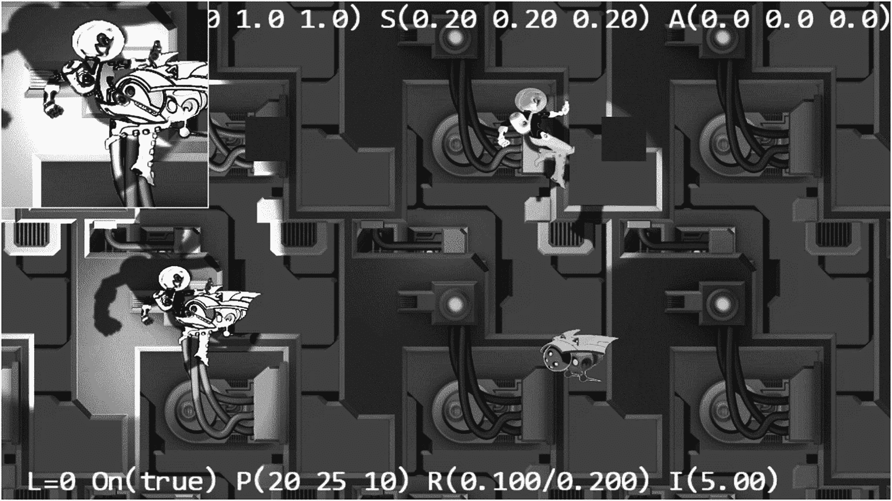
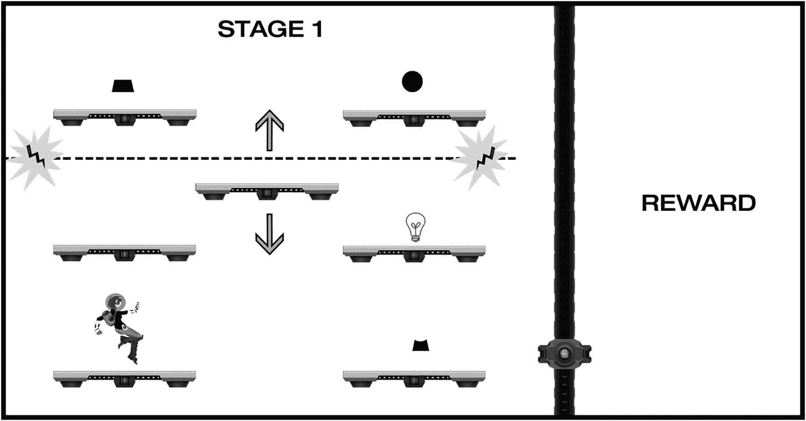
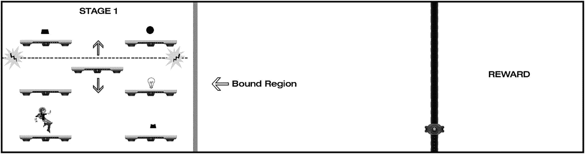
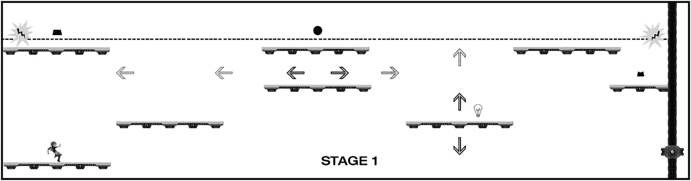
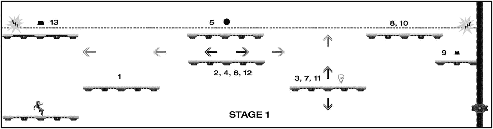
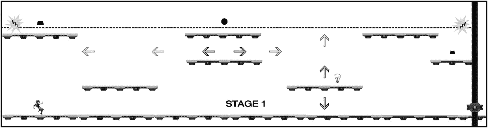
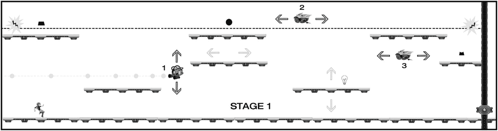
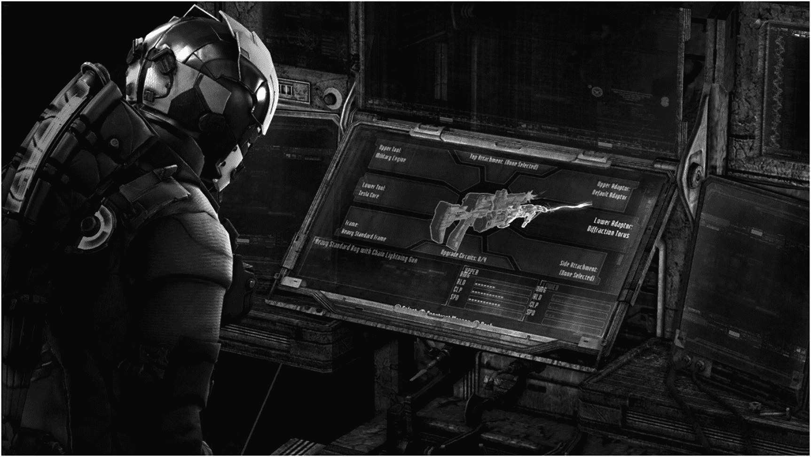
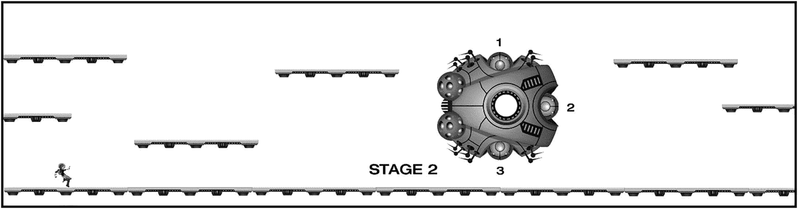

# 十二、构建一个示例游戏：从设计到完成

第 [1](01.html) 到 [11](11.html) 章节主要章节所包含的项目，从简单的形状开始，慢慢引入人物和环境，来说明每一章的概念；这些项目专注于个人行为和技术(如碰撞检测、物体物理、照明等)，但缺乏提供完整游戏体验所需的结构化挑战。*“设计考虑”*部分的项目展示了如何引入将基本行为转化为良好的游戏机制所需的逻辑规则和挑战。本章现在改变重点，强调从早期概念到功能原型的设计过程，通过使用前几章中的一些角色和环境以及第 [11](11.html) 章*“设计考虑事项”*部分中解锁平台游戏的基本思想，将早期项目中所做的工作汇集并扩展。和前面的章节一样，这里使用的设计框架从一个简单灵活的初始模板开始，并有意识地增加复杂性，以允许游戏以可控的方式发展。

到目前为止，设计练习一直避免考虑游戏设计的九个要素中的大部分，这些要素在*“你如何制作一个伟大的视频游戏？”第 [1](01.html) 章的*部分，而是专注于制作基本的游戏机制，以便清晰地定义和提炼游戏本身的核心特征。本书中使用的设计方法是一个全新的框架，强调在考虑游戏的类型或设定之前，首先使用一个孤立的游戏机制；当你开始加入一个设定，并在核心机制的基础上构建包含额外设计元素的关卡时，随着游戏世界的发展，游戏性将会朝着独特的方向发展和进化。一个游戏的机制和你设计的相关游戏循环有无穷无尽的潜在变化。你会惊讶地发现，基于你所做的创造性选择，同样的游戏基本元素会有多么不同的发展和演变。

## 第 1 部分:提炼概念

至此，您应该已经有了使用 2D 跳跃和解谜机制的概念，该机制围绕解锁障碍和获得奖励展开。从第 [11](11.html) 章中调出图 [12-1](#Fig1) 作为最终的屏幕布局和设计。

图 12-1

第十一章[2D 实现从](11.html)

这个设计已经有了一个多阶段的解决方案，要求玩家既要展示基于时间的灵活性，又要展示解谜逻辑。在目前的设计中，玩家控制英雄角色(可能通过使用 A 和 D 键左右移动，使用空格键跳跃)。玩家可以在同一层的水平平台之间跳跃，但如果不使用升降的中间“电梯”平台，就无法到达上面的平台。如果玩家触摸一个水平的“能量场”,它就会电击玩家，导致游戏重置。完成该级别的明确步骤如下:

1.  玩家必须在移动的电梯平台(图 [12-1](#Fig1) 中的#1)上跳下英雄角色(图 [12-1](#Fig1) 中间带字母 *p* 的圆圈)并跳下到右侧立柱的中间平台，才能触碰到能量场。

2.  玩家通过碰撞英雄角色来激活能量场的关闭开关(#2，由图 [12-1](#Fig1) 中的灯泡图标表示)。

3.  当能量场关闭时，玩家乘坐电梯平台到达顶部(#3)，并使英雄跳到右栏的顶部平台。

4.  玩家将英雄与代表锁图标上三分之一的小圆圈(#4)碰撞，激活锁图标的相应部分，使其发光。

5.  玩家将英雄跳回电梯平台(#5)，然后将英雄跳到右栏的底部平台。

6.  玩家将英雄与锁图标中间部分对应的形状(#6)碰撞，激活锁图标对应的部分，使其发光。三分之二的锁图标现在发光，表示进度。

7.  玩家在电梯平台上再跳一次英雄(#7)，然后将英雄跳至左栏顶部平台。

8.  玩家将英雄与锁图标(#8)底部对应的形状碰撞，激活图标的最后一部分，解锁关卡。

鉴于你已经创建的模拟屏幕，写出这个序列(或*游戏流程图*)可能看起来没有必要。然而，对于设计师来说，重要的是要理解玩家必须按照准确的顺序和细节做的每一件事，以确保你能够调整、平衡和发展游戏，而不会陷入复杂性或忘记玩家如何通过关卡。从前面的游戏流程图中可以清楚地看到，例如，电梯平台是这一关的核心，是完成每个动作所必需的；这是示意图和游戏流程描述中可用的重要信息，因为它提供了一个机会来智能地完善游戏逻辑，使您可以可视化每个变化对整个关卡流程的影响。

你可以继续构建机制，使关卡更有趣和更具挑战性(例如，你可以在能量场的关闭开关上包括一个计时器，要求玩家在有限的时间内碰撞所有的锁部件)。然而，在概念开发的这个阶段，从游戏性后退一步，开始考虑游戏设置和类型，使用这些元素来帮助告知游戏机制如何从这里演变，通常是有帮助的。

回想一下第 [11](11.html) 章，这些项目以一系列支持科幻场景的概念探索结束。图 [12-2](#Fig2) 展示了一个未来派的工业环境设计，一个穿着太空服的英雄角色，以及看起来像是会飞的机器人。

图 12-2

第 11 章中的概念

请注意，你一直在创造的游戏机制没有任何具体的东西会把你引向科幻的方向；游戏机制是抽象的互动结构，通常可以与任何类型的设置或视觉风格相结合。在这种情况下，作者选择了一个发生在宇宙飞船上的背景，所以本章将使用这个主题作为游戏原型的背景。在设计过程中，考虑探索其他场景:第 11 章中的游戏机制如何适应丛林场景、当代城市场景、中世纪幻想世界或水下大都市？

## 第 2 部分:集成设置

现在是开始分配一些基本的虚构背景的好时机，以独特的方式进化和扩展游戏机制，增强你选择的设置(不要担心，如果现在这还不清楚；随着关卡设计的进行，这个机制会变得更加明显。例如，想象一下，英雄人物是一艘大型宇宙飞船上的一名船员，她必须完成许多目标以防止飞船爆炸。再一次，没有任何关于驱动这个故事的游戏机制的现状；这一阶段的设计任务包括头脑风暴一些虚构的背景，推动玩家通过游戏并捕捉他们的想象力。使用已经创建/提供的一些概念艺术资产，英雄可以很容易地参与一场比赛，寻找丢失的东西，探索一艘被遗弃的外星船只，或者一百万种其他可能性中的任何一种。

### 背景图片赋予场景以生命

现在，您已经描述了一个基本的叙事和虚构的包装，内容类似于“玩家必须完成一系列平台谜题关卡，以在飞船爆炸前拯救飞船”，只需将之前早期原型的一些形状与一些包含的概念元素进行交换。图 [12-3](#Fig3) 介绍了一个人形英雄角色，感觉有点像飞船部件的平台，以及一个带锁的门的障碍墙，以取代机械设计中的抽象锁。

图 12-3

引入几个视觉设计元素来支持游戏设定和不断发展的叙事

虽然你只做了一些小的替换，还没有将视觉元素固定在一个环境中，但图 [12-3](#Fig3) 比图 [12-1](#Fig1) 的抽象形状传达了更多的虚构背景，并对在场做出了更大的贡献。英雄角色现在建议了一个尺度，当玩家将相对大小与人形进行比较时，该尺度将自然地被上下文化，这将整个游戏环境的相对大小带入玩家的焦点。在第 10 章[中描述的英雄角色的物理实现也成为游戏的一个重要组成部分:模拟的重力、动量等将玩家与英雄角色在游戏世界中的移动联系起来。通过实现图](10.html) [12-3](#Fig3) 中描述的设计，你已经完成了一些令人印象深刻的认知壮举，仅仅通过添加一些视觉元素和一些物体物理就可以支持在场。

### 定义可玩空间

在设计过程的这一点上，你已经充分描述了游戏的核心机制和设置，开始将单个屏幕扩展为一个完整的概念。在这个阶段定义一个最终的视觉风格并不重要，但是包含一些概念艺术将有助于指导水平如何增长。(图 [12-3](#Fig3) 提供了一个很好的视觉展示，展示了在给定对象比例的情况下，在单个屏幕上将会发生的游戏数量。)这也是一个很好的阶段，将图 [12-3](#Fig3) 中的元素“封闭”在一个工作原型中，开始感受运动的感觉(例如，英雄角色奔跑的速度，英雄可以跳跃的高度，等等)，环境中物体的比例，相机的变焦水平，等等。在这个阶段不需要包括交互和行为，比如锁组件或能量场，因为你还没有设计关卡将如何进行。现在你正在试验基本的英雄角色移动、物体放置和碰撞。下一组任务包括布局整个级别和调整所有交互。

图 [12-3](#Fig3) 中设计的当前状态仍然需要一些工作来提供足够的挑战。虽然一个结构良好的关卡的所有要素都已到位，但当前的难度是微不足道的，大多数玩家将可能能够快速完成该关卡。然而，有一个强大的基础来开始扩展跳跃和排序机制；首先，你可以扩展水平游戏空间以包含更多可玩的区域，并为角色提供额外的活动空间，如图 [12-4](#Fig4) 所示。

图 12-4

关卡设计增加了额外的可玩区域

回想一下第 7 章中的简单相机操作项目，你可以通过移动角色靠近边界区域的边缘来“推动”游戏屏幕向前，这允许你设计一个远远超出单一静态屏幕尺寸的关卡。当然，你可能会选择将这个级别限制在原始游戏屏幕的大小之内，并增加基于时间的敏捷性和逻辑顺序挑战的复杂性(事实上，这是一个挑战自己在空间限制内工作的良好设计练习)，但出于这种设计的目的，水平滚动演示增加了兴趣和挑战。

### 向可玩空间添加布局

现在是时候开始布置楼层了，以充分利用额外的水平空间。在这一点上没有必要改变基本的游戏玩法；你只需要扩展当前的关卡设计来适应游戏屏幕的新尺寸。图 [12-5](#Fig5) 包括一些额外的平台，除了确保玩家可以成功到达每个平台外，没有特别的方法。

图 12-5

扩展布局以使用额外的屏幕空间，该图显示了第一阶段的整个长度，玩家可以在任何时候看到整个关卡的大约 50%。当玩家向屏幕边界区域移动英雄角色时，摄像机向前或向后滚动屏幕。注意:对于所示的移动平台，深色箭头表示方向，浅色箭头表示平台移动的范围

现在这个级别有了一些额外的工作空间，有几个因素需要评估和调整。例如，图 [12-5](#Fig5) 中的英雄角色的比例已经缩小，以增加单个屏幕上可以执行的垂直跳跃次数。请注意，在这一点上，如果需要的话，你也有机会在设计中加入额外的垂直游戏，实现你用来左右移动相机的相同机制来上下移动相机；许多 2D 平台游戏允许玩家在游戏世界中横向和纵向移动。为了简单起见，这个关卡原型将限制移动到 x 平面(左和右),尽管您可以很容易地扩展关卡设计，以便在未来的迭代和/或后续的关卡中包括垂直游戏。

当你在关卡中放置平台时，你会再次希望在阻止游戏流程的同时最小化设计的复杂性。图 [12-5](#Fig5) 增加了一个额外的设计元素:一个从左向右移动的平台。使用与图 [12-1](#Fig1) 所示相同的编号方法，尝试列出图 [12-5](#Fig5) 中三个锁段启动所需的详细顺序。当你完成绘制顺序后，将其与图 [12-6](#Fig6) 进行比较。

图 12-6

打开屏障最有效的顺序

你的顺序符合图 [12-6](#Fig6) 吗，或者你有额外的步骤？有许多潜在的路径可供玩家选择来完成这一关，很可能没有两个玩家会选择相同的路线(机械设计的唯一要求是从上到下按顺序激活锁部分)。

### 调整挑战并增加乐趣

在设计的这个阶段是拼图制作过程真正开始的时候；图 [12-6](#Fig6) 展示了只用你一直在使用的几个基本元素来创造高度吸引人的游戏的潜力。作者在多种游戏的头脑风暴会议中使用了之前的模板和类似的变化——向一个众所周知的机制引入一两个新元素，并探索新添加的元素对游戏性的影响——结果通常会开辟令人兴奋的新方向。作为一个例子，你可以介绍出现和消失的平台，开关被激活后旋转的平台，移动的能量场，传送站，等等。构建这种机制的方法当然是无限的，但是当前的模板有足够的定义，添加一个新元素是相当容易试验和测试的，即使是在纸上。

新扩展的关卡设计有两个因素增加了挑战。首先，水平移动平台的增加需要玩家更精确地计算跳跃到“电梯”平台的时间(如果他们在平台上升时跳跃，在它电击他们之前几乎没有时间停用能量场)。第二个因素不太明显，但同样具有挑战性:在任何时候只有一部分关卡是可见的，所以玩家无法轻松地创建整个关卡序列的心理模型，就像他们可以在单个屏幕上看到整个布局一样。对于设计师来说，理解明确的挑战(例如要求玩家在两个移动平台之间进行时间跳跃)和不太明显(通常是无意的)的挑战(例如在任何给定时间只能看到关卡的一部分)都很重要。回想一下你玩过的一个游戏，感觉设计者期望你记住太多的元素；这种挫折感通常是由于无意的挑战超过了玩家在短期记忆中可以合理保持的内容。

作为一名设计师，你需要意识到隐藏的挑战和无意的挫折或困难；这些是为什么尽可能早和经常地观察人们玩你的游戏是至关重要的关键原因。一般来说，任何时候你 100%确定你已经设计出完美的东西，至少有一半玩你的游戏的人会告诉你完全相反的事情。虽然详细讨论用户测试的好处超出了本书的范围，但是你应该计划观察人们从最早的概念验证一直到最终发布都在玩你的游戏。没有什么可以替代你从观看不同的人演奏你设计的作品中获得的洞察力。

前面图中描述的关卡目前假设英雄角色只能在平台上休息；虽然没有设计计划说明如果角色错过一次跳跃并掉到屏幕底部会发生什么，但玩家可能会合理地想象这会导致失败并触发游戏重置。如果你在关卡中增加了一个“地板”,玩家的策略将会发生显著的变化；除了消除重大风险，玩家还可以直接进入电梯平台，如图 [12-7](#Fig7) 所示。

图 12-7

游戏世界增加了一个“地板”,极大地改变了关卡挑战

### 进一步调整:引入敌人

你现在正在尝试关卡布局的变化，以使其随着设定而发展，并寻找增加玩家参与度的方法，同时也增加挑战(如果需要的话)。在添加楼层之前，关卡有两个风险:未能降落在平台上并触发损失条件，以及与能量场碰撞并触发损失条件。地板的添加消除了坠落的风险，并潜在地降低了关卡的挑战性，但你可能会决定地板鼓励玩家更自由地探索、实验和更密切地关注环境。你现在也越来越熟悉这种机制和布局的游戏性和流程，所以让我们引入一个新元素:攻击敌人(我们不能让前几章的机器人设计浪费掉)！图 [12-8](#Fig8) 介绍了两种基本的敌方机器人类型:一种发射炮弹，一种只是巡逻。

图 12-8

关卡中引入了两种新的物体类型:垂直移动并以恒定速度射击的射击机器人(#1)和在特定范围内来回移动的巡逻机器人(#2)

你现在已经到达了这一关设计的转折点，这里的设置开始对机制和游戏循环的发展产生重大影响。机制的核心从第 [11 章](11.html)开始就没有改变，这一关基本上仍然是按照正确的顺序激活锁的各个部分来移除障碍，但是移动的平台和攻击的敌人是额外的障碍，并且受到你选择的特定设置的强烈影响。

当然，你当然可以添加攻击敌人的行为，同时仍然使用抽象的形状和纯力学。然而，值得注意的是，一个机制变得越复杂和多阶段，设置就越需要符合实现；这就是为什么从纯粹抽象的机械设计过渡到在一个特殊的环境中设计一个关卡(或者一个关卡的一部分)是很有帮助的，因为机械仍然是相当基本的。设计者通常希望游戏机制能与游戏环境深度融合，因此让两者协同发展是有益的。找到最佳点可能很有挑战性:有时机械师主导设计，但随着场景的演变，它通常会进入驾驶员的位置。过早引入设定，你会失去对精炼纯粹游戏性的关注；太晚引入设定，游戏世界可能会感觉像是一种事后的想法或者是附加的东西。

### 总则

回到当前的设计，如图 [12-8](#Fig8) 所示，你现在拥有了在新兴环境中创造一个真正吸引人的序列所需的所有元素。你也可以很容易地调整单个单位的移动和位置，使事情变得更具挑战性或更不具挑战性。玩家将需要观察平台和敌人的运动模式来计时他们的跳跃，这样他们就可以在不被电击或撞击的情况下导航，同时发现并解决解锁难题。请注意这一关是如何迅速地从非常容易完成变成潜在的相当具有挑战性:使用多个移动平台增加了复杂性，并且需要使用跳跃的时间和避免攻击敌人——即使是图 [12-8](#Fig8) 中锁定基本运动模式的简单敌人——以可控和故意的方式创造出几乎无限的可能性。

如果你还没有，现在是一个用代码原型化你的关卡设计(包括交互)来验证游戏性的好时机。对于这个早期的原型，重要的是主要的行为(奔跑、跳跃、发射炮弹、移动平台、物体激活等等)和完成关卡所需的步骤(拼图序列)都要正确实现。一些设计师在这个阶段坚持认为，以前从未遇到过这个关卡的玩家应该能够在很少或没有帮助的情况下玩完整个游戏，并完全理解他们需要做什么，而其他人则愿意提供指导，并填补屏幕上缺失的 UI 和不完整的谜题序列。通常的做法是在这个阶段测试和验证游戏的主要部分，并为玩家提供额外的指导，以弥补不完整的 UI 或序列中未实现的部分。一般来说，在这个阶段，你越不需要依赖玩家的指导，你对整体设计的洞察力就越强。您在这个阶段实现的早期原型的数量也取决于您设计的规模和复杂性。大型和高度复杂的关卡可以在整个关卡可以一次玩完之前分几个(或许多)部分来实现和测试，但是即使在大型和复杂的关卡的情况下，目标也是尽可能早地获得完整的可玩体验。

Note

如果你一直在探索这本书里的工作原型，你会发现在这一章的设计概念和可玩等级之间有一些细微的变化(例如，能量场不包括在工作原型里)。考虑使用包含的资产探索替代设计实现；探索和即兴创作是创造性设计过程的关键要素。你能创建多少个当前机械师的扩展？

## 第 3 部分:集成附加设计元素

您在本章中构建的原型可以作为当前开发水平的完整游戏的有效概念证明，但它仍然缺少完整游戏体验通常所需的许多元素(包括视觉细节和动画、声音、评分系统、获胜条件、菜单和用户界面[UI]元素等)。在游戏术语中，原型水平现在处于封锁加阶段(*封锁*是一个用于描述原型的术语，包括布局和功能游戏，但缺乏其他设计元素；包含一些额外的概念艺术是这里的“加分项”)。现在是开始探索音频、评分系统、菜单和屏幕 UI 等的好时机。如果这个原型是在一个游戏工作室生产的，一个小团队可能会把当前的水平提高到最终的生产水平，同时另一个团队工作来设计和制作其他水平的原型。一个单独的关卡或关卡的一部分被称为*垂直部分*，这意味着游戏的一个小部分包括了将随最终产品一起发布的所有东西。创建垂直切片有助于团队关注最终体验的外观、感觉和声音，并可用于验证 playtesters 的创意方向。

### 视觉设计

尽管你已经开始整合一些与设定和叙事相一致的视觉设计资产，但游戏通常在这个时候只有很少(如果有的话)的最终制作资产，任何动画都将是粗糙的或尚未实现的(游戏音频也是如此)。虽然让游戏性与游戏设置并行发展是一个很好的做法，但工作室不希望浪费时间和资源来创建制作资产，直到团队确信关卡设计已经锁定，并且他们知道需要什么对象以及它们将被放置在哪里。

你现在应该有了一个相当好的关卡设计的布局和序列(如果你一直在试验一个与示例中所示不同的布局，确保你有一个完整的游戏流程，如图 [12-1](#Fig1) 和 [12-6](#Fig6) 所示)。)在项目的这一点上，你可以自信地开始“重新调整”生产资产(*中的重新调整是游戏工作室使用的一个术语，意思是随着时间的推移增加分辨率——在这种情况下，是关卡的视觉效果和整体生产质量)。重新分区通常是一个多阶段的过程，从关卡设计的主要元素被锁定时开始，并且可以持续大部分活动生产计划。通常有数百个(或数千个)单独的资产、动画、图标等，它们通常需要基于它们在游戏构建外部和游戏构建内部的不同而被调整多次。在孤立和实体模型中看起来很和谐的元素，在整合到游戏中后往往会有很大的不同。*

 *重新划分资产的过程可能是乏味和令人沮丧的(资产似乎总是比你想象的要多一个数量级)。让游戏中的东西看起来像艺术家的模型一样棒也是一个挑战。然而，当这一切开始走到一起时，这通常是一种令人满意的体验:当关卡设计从封闭过渡到完美的生产关卡时，神奇的事情发生了，通常会有一个构建，其中一些关键的视觉资产已经进来，使团队评论说:“哇，现在这感觉像我们的游戏！”对于 AAA 3D 游戏，这些“哇”的时刻经常发生，因为高分辨率纹理被添加到 3D 模型中，复杂的动画、灯光和阴影使世界变得栩栩如生；对于目前的原型水平，添加平行的背景和一些局部的灯光效果应该真的使飞船设置流行。

这本书包含的工作原型代表了最终游戏的构建，通常介于封锁和成品润色之间。英雄角色包括几个动画状态(空闲、奔跑、跳跃)，英雄和机器人上的局部照明增加了视觉兴趣和戏剧性，关卡具有两层平行平行背景，法线贴图对照明做出响应，主要游戏行为都在适当的位置。你可以在这个原型的基础上继续完善游戏，或者按照你认为合适的方式修改它。

### 游戏音频

许多新的游戏设计师(甚至一些资深设计师)错误地认为音频没有视觉设计重要，但正如每个游戏玩家都知道的那样，在某些情况下，糟糕的音频可能意味着你喜欢的游戏和你很快就停止玩的游戏之间的差异。与视觉设计一样，音频通常直接有助于游戏机制(例如，倒计时定时器、警笛、指示敌人位置的位置音频)，背景音乐增强了戏剧性和情感，就像导演使用乐谱来支持电影中的动作一样。然而，手机游戏中的音频通常被认为是可选的，因为许多玩家在他们的移动设备上静音。然而，设计良好的音频甚至可以对手机游戏的临场感产生巨大的影响。除了与游戏对象相对应的声音(行走的角色的行走声音，开火的敌人的射击声音，弹出的东西的弹出声音等等)，游戏内动作附带的上下文音频是玩家重要的反馈机制。菜单选择、激活游戏中的开关等都应该评估潜在的音频支持。作为一般规则，如果游戏中的对象响应玩家的交互，应该评估它的上下文音频。

音频设计师与关卡设计师一起工作，创建一个需要声音的游戏对象和事件的综合回顾，随着视觉效果的重新调整，相关的声音通常会随之而来。游戏声音经常落后于视觉设计，因为音频设计师想知道他们创造声音的目的；例如，如果你看不到机器人长什么样，也看不到它是如何移动的，就很难创造出“机器人行走”的声音。就像设计师希望将游戏设置和机械紧密结合一样，音频工程师希望确保视觉和音频设计能够很好地协同工作。

### 交互模型

目前的原型使用一种常见的交互模型:键盘上的 A 和 D 键左右移动角色，空格键用于跳跃。世界中的物体激活仅仅是通过英雄人物与物体的碰撞而发生的，对于这些交互来说，设计的复杂性是相当低的。然而，想象一下，当你继续构建这个机制时(也许在后面的关卡中)，你包括了角色发射射弹和收集游戏物品以储存在库存中的能力。随着游戏中可能的交互范围的扩大，复杂性可能会急剧增加，并且无意的挑战(如前所述)可能会开始积累，这可能会导致坏的玩家沮丧(与“好的”玩家沮丧相反，如前所述，好的玩家沮丧是有意设计的挑战的结果)。

了解在不同平台之间调整交互模型时遇到的挑战也很重要。最初为鼠标和键盘设计的交互在转移到游戏控制台或基于触摸的移动设备时通常面临相当大的困难。与游戏控制器不精确的拇指棒相比，鼠标和键盘交互方案允许极其精确和快速的移动，尽管触摸交互可以是精确的，但移动屏幕往往明显较小，并且被覆盖游戏区域的手指所遮挡。该行业花了多年时间和迭代来适应第一人称射击游戏(FPS)类型，从使用鼠标和键盘到游戏控制台，并且在第一次移动 FPS 体验推出十多年后，触摸设备的 FPS 惯例仍然高度可变(部分是由于市场上许多手机和平板电脑的处理能力和屏幕尺寸的差异)。如果你计划开发一款跨平台的游戏，确保你在开发游戏时考虑了每个平台的独特需求。

### 游戏系统和元游戏

目前的原型有几个系统需要平衡，也没有整合元游戏，但想象一下添加需要平衡的元素，如对象激活或能量场的可变长度计时器。如果你不确定这意味着什么，考虑下面的场景:英雄人物有两种潜在的方法去激活能量场，每种选择都是一种权衡。第一个选项可能会永久停用能量场，但会产生更多的敌人机器人，并大大增加到达目标对象的难度，而第二个选项不会产生更多的机器人，但只会在短时间内停用能量场，这需要玩家选择最有效的路径并执行近乎完美的计时。为了在这两个选项之间取得有效的平衡，您需要理解与每个系统相关的设计和挑战程度(无限时间和有限时间)。类似地，如果你给英雄角色增加生命值，让射击机器人创造 *x* 的伤害量，而冲锋的仆从每击创造 *y* 的伤害量，你会想要理解通往目标的路径之间的相对权衡，也许会使一些路径不那么危险但导航更复杂，而另一些路径可能导航更快但更危险。

与当前设计的大多数其他方面一样，在元游戏的开发中有许多方向可以选择；当玩家玩一个原型级别风格的完整游戏时，你能为他们提供什么额外的正面强化或总体环境？举一个例子，想象玩家必须收集一定数量的物体才能进入最终区域，并防止船只爆炸。也许每一关都有一个对象，要求玩家在进入之前解决某种谜题，只有在收集到该对象后，他们才能解决该关的开门组件。或者，也许每个级别都有一个对象，玩家可以访问以解锁电影，并了解更多关于船上发生的事情，以达到如此可怕的状态。或者也许玩家能够以某种方式禁用敌人的机器人并收集分数，目标是在游戏结束时收集尽可能多的分数。也许你会选择完全放弃传统的输赢条件。游戏并不总是将明确的输赢条件作为元游戏的核心组成部分，对于越来越多的当代游戏，尤其是独立游戏，它更多的是关于旅程而不是竞争体验(或者竞争元素变得可选)。也许你可以找到一种方法，将竞争性方面(例如，获得最高分或在最短时间内完成每一关)和更注重提高游戏性的元游戏元素结合起来。

关于系统和元游戏的最后一点说明:玩家教育(通常通过游戏内教程实现)通常是这些过程的重要组成部分。设计者非常熟悉他们设计的机制是如何工作的，控制是如何工作的，并且很容易(也很常见)忘记游戏对于第一次遇到它的人会是什么样子。早期和频繁的游戏测试有助于提供关于玩家需要多少解释才能理解他们需要做什么的信息，但是大多数游戏需要某种程度的教程支持来帮助教授游戏世界的规则。教程设计技术超出了本书的范围，但是当玩家玩一个或多个入门关卡时，教他们游戏的逻辑规则和交互通常是最有效的。向玩家展示你想让他们做的事情也比让他们阅读大段文字更有效(研究表明，许多玩家从不访问可选教程，并且会在不阅读的情况下解雇文本过多的教程；每个辅导活动一两个非常简短的句子是一个合理的目标)。如果你正在为你的原型创建一个内部教程系统，你将如何实现它？你认为玩家自己会合理地发现什么，而你可能需要在教程中向他们展示什么？

### 用户界面(UI)设计

游戏 UI 设计不仅从功能的角度(游戏中的菜单、教程和上下文相关的重要信息，如健康、分数等)来看很重要，而且作为体验的整体设置和视觉设计的贡献者也很重要。游戏 UI 是视觉游戏设计的核心组成部分，经常被新设计师忽略，这可能意味着人们喜欢的游戏和没人玩的游戏之间的差异。回想一下你玩过的游戏，这些游戏利用了复杂的库存系统，或者有许多级别的菜单，你必须通过这些菜单才能访问常用功能或物品；你还记得在那些游戏中，你经常需要浏览多个子关卡来完成经常使用的任务吗？或者是需要你记住复杂的按钮组合来访问普通游戏对象的游戏？

优雅且符合逻辑的用户界面对玩家的理解至关重要，但是集成到游戏世界中的用户界面也支持游戏设置和叙事。使用当前的原型和提议的系统设计作为参考，你将如何以一种支持设定和美学的方式可视化地表现游戏 UI？如果你以前没有花时间评估 UI(即使你有)，重新访问几个具有科幻设置的游戏，并特别注意它们如何在游戏屏幕中视觉上集成 UI 元素。图 [12-9](#Fig9) 显示了内脏游戏的*死亡空间 3* 中的武器定制 UI:注意界面设计是如何完全嵌入到游戏设定中的，表现为虚拟飞船上的信息屏幕。

图 12-9

内脏游戏《死亡空间 3》中的大部分用户界面元素完全呈现在游戏场景和小说中，菜单以全息投影的形式出现，由英雄角色调用，或者出现在游戏世界中的物体上(图片版权归电子艺界所有)

许多游戏选择将它们的 UI 元素放在游戏屏幕的保留区域(通常在外部边缘周围),这些区域不与游戏世界直接交互；然而，将视觉美感与游戏设置相结合是另一种直接促成游戏存在的方式。想象一下当前的科幻原型例子，它有一个以幻想为主题的用户界面和菜单系统，使用中世纪的美学设计和书法字体，用于像 Bioware 的*龙腾世纪*这样的游戏；由此产生的不匹配将是不和谐的，很可能会把玩家从游戏环境中拉出来。用户界面设计是一门复杂的学科，很难掌握；然而，花时间确保将直观、可用、美观的 UI 集成到你创建的游戏世界中，会对你有好处。

### 游戏叙事

在这个阶段，您只是向原型示例添加了一个基本的叙事包装:一个英雄角色必须完成许多目标，以防止他们的飞船爆炸。目前，你还没有明确地与玩家分享这个故事，他们没有办法知道环境是在一艘宇宙飞船上，或者除了最终打开屏幕最右边的门之外的目标是什么。设计师有很多向玩家展示游戏叙事的选择；您可以创建一个介绍性的电影或动画序列，向玩家介绍英雄人物、他们的飞船和危机，也许可以选择一些简单的东西，如在关卡开始时弹出一个窗口，其中有简短的介绍文本，为玩家提供所需的信息。或者，你可以不提供任何关于游戏开始时发生了什么的信息，而是选择随着玩家在游戏世界中的进展，慢慢揭示船的可怕情况和目标。你甚至可以选择保留任何隐含的叙事元素，允许玩家覆盖他们自己的解释。与游戏设计的许多其他方面一样，没有单一的方式向玩家介绍叙事，也没有通用的指南来说明要获得令人满意的体验需要多少叙事。

叙事也可以被设计师用来影响关卡的发展和构建方式，即使这些元素从来没有向玩家展示过。在这种原型的情况下，它有助于设计师想象爆炸船只的威胁，以推动英雄人物带着紧迫感通过一系列挑战；然而，玩家可能会体验到一个结构良好的侧滚动作平台，只有一系列非常聪明的关卡。你可以围绕感染了病毒的机器人创造额外的虚构故事，使它们转而攻击英雄，作为它们攻击行为的一个原因(这只是一个例子)。通过创建一个叙事框架来展开动作，你可以做出明智的决定来扩展机制，即使你不与玩家分享所有的背景，也会感觉很好地融入到设置中。

当然，一些游戏体验实际上没有明确的叙事元素，无论是否向玩家公开，只是简单地实现了新颖的机制。像 Zynga 的 *Words with Friends* 和 Gabriele Cirulli 的超休闲 *2048* 这样的游戏是纯粹基于没有叙事包装的机制的游戏体验的例子。

如果你继续开发这个原型，你会选择包含多少叙事，你会向玩家透露多少以使游戏变得生动？

## 奖励内容:在关卡中增加第二个阶段

如果你已经完成了包括原型的第一阶段，你将进入第二个房间，有一个大的移动单元；这是一个沙盒，有一组资产供您探索。原型实现只包括一些激发你想象力的基本行为:一个大型的动画 boss 单元在房间里盘旋，产生一种新的敌人机器人，它寻找英雄角色，每隔几秒钟就产生一个新的单元。

图 [12-10](#Fig10) 显示了一个你一直用于原型基本机械的布局。

图 12-10

一个可能的第二阶段，英雄人物可以在第一阶段打开门后进入。这个概念包括一个具有三个节点的大型“boss”单元；此阶段的一个目标可能是禁用每个节点以关闭 boss

从图 [12-10](#Fig10) 中的图表开始机械探索是一条捷径，但是因为你已经确定了设置和一些视觉元素，用一些已经存在的视觉资产继续开发新的舞台会很有帮助。该图包括第一阶段中使用的相同类型的平台，但如果，例如，这个区域没有重力，英雄人物能够自由飞行，会怎么样？将这一区域与第一阶段进行比较，并思考如何在不从根本上改变游戏的情况下，稍微改变一下体验，将事情混合起来；理想情况下，你已经相当熟练地掌握了第一阶段的测序机制，第二阶段的经历可能是该机制或多或少的演变。

如果你选择包括寻找英雄的飞行机器人单位，游戏流程图将变得比第一阶段使用的模型更复杂，因为新机器人类型的移动不可预测。你可能还想考虑一个机制让英雄角色消灭机器人单位(也许甚至可以把机器人单位的移除加入到禁用 boss 节点的机制中)。如果你发现你的设计变得难以作为一个明确的和可重复的游戏流程的一部分来描述，这可能表明你正在与更复杂的系统一起工作，可能需要在一个可玩的原型中评估它们，然后你才能有效地平衡它们与关卡的其他组件的集成。当然，你也可以重用阶段 1 中的约定和单元；例如，你可以选择将巡逻机器人与寻找英雄的机器人和一个能量场结合起来，为玩家创建一个具有挑战性的潜在风险网络，让他们在工作中禁用 boss 节点。

你也可以决定这个关卡的主要目标是*启用*boss 节点以解锁游戏的下一个阶段或关卡。你可以向你喜欢的任何方向扩展故事，因此单位可以是有益的或有害的，目标可以涉及禁用或启用，英雄人物可以奔向某物或远离某物，或者你可以想象的任何其他可能的场景。请记住，叙事发展和关卡设计将相互影响，推动体验向前发展，所以当你越来越熟悉这个原型的关卡设计时，请保持警惕，寻找灵感。

## 摘要

游戏设计在创意艺术中是独一无二的，因为它要求玩家在体验中成为积极的伙伴，这可能会因玩家的不同而发生巨大的变化。尽管一些游戏与电影有很多相似之处(尤其是随着故事驱动的游戏变得越来越流行)，但当玩家或多或少地控制屏幕上的动作时，总会有不可预测的因素。与电影和书籍不同，视频游戏是互动的体验，需要与玩家持续的双向互动，设计糟糕的机制或规则不明确的关卡会阻止玩家享受你创造的体验。

本书介绍的设计方法首先着重于教你设计字母表的字母(基本交互)，引导你创造单词(游戏机制和游戏性)，然后是句子(关卡)；我们希望你能迈出下一步，开始写下一部伟大的小说(现有或全新类型的完整游戏体验)。这里介绍的“逃离房间”设计模板可用于快速原型化多种游戏体验的各种机制，从附带的 2D 侧滚轮到等距游戏，再到第一人称体验等等。请记住，游戏机制从根本上来说是结构良好的抽象谜题，可以根据需要进行调整。如果你发现自己在开始时难以集思广益新的机制，从普通休闲游戏中借用一些简单的现有机制(“比赛 3”的变体是灵感的伟大来源)，并从那里开始，随着你的进行添加一两个简单的变体。与任何创造性学科一样，你对基础练习得越多，你对这个过程就越流畅，在你获得一些简单的机械和系统的经验后，你可能会惊讶于你能快速创造的有趣变化的数量。其中一些变化可能会促成下一个突破性的标题。

这本书展示了游戏设计的技术和经验方面的关系。设计师、开发人员、艺术家和音频工程师必须紧密合作，提供最佳体验，在整个制作过程中考虑性能/响应、用户输入、系统稳定性等问题。你在本书中开发的游戏引擎非常适合本章中描述的游戏类型(以及许多其他类型)。现在，您应该已经准备好探索自己的游戏设计，具备强大的技术基础，并对游戏设计的九个要素如何协同工作以创造玩家喜爱的体验有了全面的了解。*