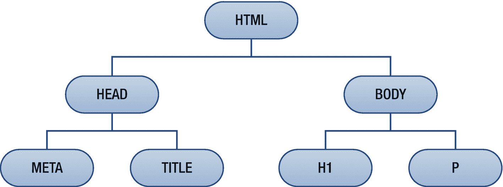

# 六、关系选择器

关系选择器根据元素与其他元素的关系来匹配元素。要理解这些选择器，重要的是要认识到 web 文档中的元素是如何相互关联的。

## HTML 层次结构

一个 HTML 文档可以被想象成一棵以`<html>`元素为根的树。每个元素都适合这个树上的某个位置，并且每个元素都是另一个元素的父元素或子元素。任何位于另一个元素之上的元素都称为祖先，直接位于其上的元素是父元素。类似地，一个元素在另一个元素之下称为后代，直接在它之下的元素是子元素。反过来，与另一个元素共享同一个父元素的元素称为兄弟元素。考虑下面这个简单的 HTML 5 文档:

```html
<!DOCTYPE html>
<html>
  <head>
    <meta charset="UTF-8">
    <title>Example</title>
  </head>
  <body>
    <h1>Heading</h1>
    <p>Paragraph</p>
  </body>
</html>

```

在这个例子中，`<h1>`和`<p>`是兄弟元素，因为它们共享同一个父元素。它们的父元素是`<body>`，和`<html>`一起，它们都是兄弟元素的祖先。反过来，这两个兄弟元素是`<body>`的子元素以及`<body>`和`<html>`的后代。图 6-1 显示了这个简单文件的层次结构。



图 6-1

HTML 层次结构示例

## 遗产

继承是 CSS 中的另一个重要概念。它使某些样式不仅适用于指定的元素，还适用于它的所有后代元素。例如，`color`属性是默认继承的，而`border`属性不是。这通常是预期的行为，使得继承使用起来非常直观。任何属性都可以显式地被赋予值`inherit`,以使用与该属性的父元素相同的值。

```html
/* Inherit parent’s border */
p { border: inherit; }

```

继承使您能够在找到每个后代元素都需要相同样式的地方时，将该样式应用于共同的祖先。这个过程比将样式应用于需要特定样式的每个后代元素更方便，也更易于维护。例如，如果整个文档的文本需要设置为特定的颜色，您可以将该样式应用于`<body>`元素，它是所有可见元素的共同祖先。

```html
/* Set document text color to gray */
body { color: gray; }

```

现在您已经了解了 HTML 层次结构和继承概念，可以讨论 CSS 的关系选择器了。

## 相邻选择器

如果第二个元素紧跟在第一个元素之后，则相邻的同级选择器选择第二个元素。

```html
div+p { color: red; }

```

这个选择器匹配跟在`<div>`元素后面的段落。

```html
<div>Not red</div>
<p>Red</p>
<p>Not red</p>

```

## 后代选择器

如果一个元素是另一个元素的子元素或孙元素，则后代选择器匹配该元素。当您希望仅在一个元素驻留在另一个元素中时将样式应用于该元素时，这很有用。

```html
div p { background: gray; }

```

前面的规则适用于下面的段落，因为它是从`<div>`元素派生出来的:

```html
<div>
  <p>Gray</p>
</div>

```

## 直接子选择器

如果第二个元素是第一个元素的直接后代，则直接子选择器匹配第二个元素。

```html
div > span { color: green; }

```

当应用于以下标记时，该规则将第二个`<span>`元素涂成绿色。第一个`<span>`元素没有颜色，因为它不是`<div>`的直接子元素。

```html
<div>
  <p>
    <span>Not green</span>
  </p>
  <span>Green</span>
</div>

```

## 通用兄弟选择器

CSS 3 添加了通用的兄弟选择器，只有当第二个元素前面有第一种类型的兄弟元素时，它才匹配第二个元素。

```html
h1~p { color: blue; }

```

在下面的例子中，最后两个段落被选中，因为它们前面有`<h1>`并且都共享同一个父段落:

```html
<p>Not blue</p>
<h1>Not blue</h1>
<p>Blue</p>
<p>Blue</p>

```

所有主流浏览器都支持通用兄弟选择器，包括 Chrome 1+、Firefox 3.5+、Safari 3.2+、Opera 10+和 IE 7+。