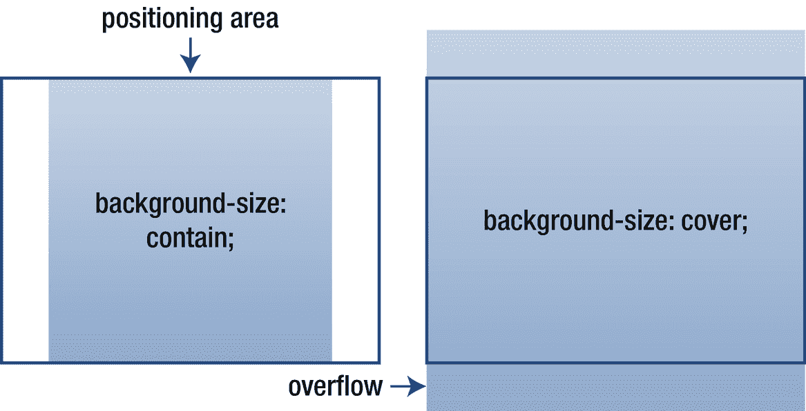

# 十四、背景

背景属性可以添加背景效果。这些属性都不继承，它们可以应用于任何元素。

## 背景色

元素背景的颜色是用`background-color`属性设置的。默认情况下，其值设置为`transparent`。

```html
background-color : transparent | <color>

```

即使使用背景图像，设置背景颜色也是一个好主意。这样，在背景图像由于任何原因不可用的情况下，就有了后备颜色。

```html
background-color: #ccc;

```

## 背景图像

`background-image`用`url`功能指定用作背景的图像。

```html
background-image : none | url(<url>)

```

用`url`函数定义的图像位置可以是绝对的，也可以是相对于 CSS 文件的位置。

```html
/* Relative path */
background-image: url(img/mybg.jpg);

/* Absolute path */
background-image: url(http://mydomain.cimg/mybg.jpg);

```

## 背景-重复

默认情况下，背景图像会水平和垂直重复。这可以用`background-repeat`属性改变，使背景只水平重复(`repeat-x`)、只垂直重复(`repeat-y`)或根本不重复(`no-repeat`)。

```html
background-repeat : repeat | repeat-x | repeat-y | no-repeat

```

## 背景-附件

在浏览器中滚动视区时，背景图像通常会跟随页面的其余部分。这种行为由具有初始值`scroll`的`background-attachment`属性决定。如果该值设置为`fixed`，背景的位置相对于视窗，即使页面滚动，背景也保持不动。

```html
background-attachment : scroll | fixed | local

```

CSS 3 为这个属性引入了第三个值`local`，它固定了相对于元素内容的背景，而不是整个视口。有了这个值，只有当元素滚动时，背景才会随着元素的内容一起滚动(通过使用`overflow`属性实现)。Chrome 4+、Firefox 25+、Safari 5+、Opera 10.5+和 IE 9+中引入了对该值的支持。

## 背景位置

属性用于定位背景图像，一个值用于垂直放置，另一个值用于水平放置。它们都可以设置为长度或元素大小的百分比，并且允许负值。该属性还有一些预定义的值，包括垂直放置的`top`、`center`和`bottom`；以及水平放置的`left`、`center`和`right`。

```html
background-position : <length> <length> | <percentage> <percentage> |
                      top/center/bottom + left/center/right

```

默认情况下，背景图像位于其父元素填充区域的左上角。给定的任何长度值都会相对于这些边缘移动背景图像。例如，下列属性将背景向下偏移 5 个像素，向右偏移 10 个像素:

```html
background-position: 5px 10px;

```

CSS 3 增加了一个四值语法，允许选择图像相对于元素的哪一侧放置。使用此语法，下一个示例中的背景相对于元素的右下角而不是左上角定位。

```html
background-position: bottom 5px right 5px;

```

只有 Chrome 25+、Firefox 13+、Safari 5.28+、Opera 10.5+和 IE 9+支持这种四值符号。

## 背景尺寸

背景图像的尺寸通常与图像的实际尺寸相同。它可以通过`background-size`属性来改变，该属性允许背景被调整到以像素为单位或者以相对于背景定位区域的百分比来指定的尺寸。

```html
background-size (1-2) : auto | <length> | <percentage> | cover | contain

```

有两个值，第一个值决定图像的宽度，第二个值决定图像的高度。

```html
background-size: 150% 100%;

```

单个值仅定义图像的宽度。然后高度被隐式设置为`auto`，保持图像的纵横比。

```html
 background-size: 150%;

```

`contain`和`cover`关键字调整背景大小以填充父容器，同时保持纵横比。`cover`值确保图像完全覆盖背景定位区域，而`contain`确保背景包含在该区域内。它们的区别如图 14-1 所示。



图 14-1

背景大小与封面和包含关键字

该属性是在 CSS 3 中添加的，在 Chrome 4+、Firefox 4+、Safari 5+、Opera 10.5+和 IE 9+中受支持。使用`-webkit`和`-moz`前缀扩展了对 Chrome 1+、Safari 3+和 Firefox 3.6+的支持。

## 背景剪辑

背景图像或颜色的绘画区域可以用`background-clip`属性设置。

```html
background-clip : border-box | padding-box | content-box

```

背景通常延伸到边框的外边缘(`border-box`)并呈现在任何可见边框的后面。相反，`padding-box`的值在元素的填充内绘制背景。第三个可能的值`content-box`，在内容区域内绘制背景。使用下面的声明，背景被裁剪到内容的外部边缘:

```html
background-clip: content-box;

```

`background-clip`在 Chrome 1+、Firefox 4+、Safari 3+、Opera 12+和 IE 9+中受支持。

## 背景-来源

`background-origin`属性决定背景图像或颜色的起点。

```html
background-origin : padding-box | border-box | content-box

```

背景图像通常从元素填充区域的左上角开始呈现(`padding-box`)。可以进行更改，使背景从边框区域的左上边缘(`border-box`)或内容区域(`content-box`)开始。

`background-origin`属性通常与`background-clip`一起使用来改变背景的起点和剪辑区域。以下声明将它们都设置为内容区域:

```html
background-origin: content-box;
background-clip: content-box;

```

`background-origin`属性是一个 CSS 3 属性，可以在 Chrome 4+、Firefox 4+、Opera 10.5+、Safari 5+和 IE 9+中工作。所有版本的 Firefox 和 Chrome 以及 Safari 4 都支持前缀为`-moz`和`-webkit`的浏览器，如下例所示。注意火狐在版本 4 之前使用了值`padding`和`border`；没有将内容框指定为原点的值。

```html
/* Chrome 1-3, Safari 4 */
-webkit-background-origin: border-box;

/* Firefox 1-3.6 */
-moz-background-origin: border;

background-origin: border-box;

```

## 背景

`background`属性是在一个声明中设置所有背景属性的快捷方式。

```html
background : <background-color> + <background-image> +
             <background-repeat> + <background-attachment> +
             <background-position> + <background-size> +
             <background-clip> + <background-origin>

```

这些值的顺序无关紧要，因为它们之间没有歧义。任何一个值都可以省略，但是请记住，在使用该属性时，那些被省略的属性将被重置为默认值。

```html
background: url(bg.png) no-repeat fixed right bottom;

```

在大多数情况下，当设置多个单独的属性时，最好使用像这样的简写属性。与使用此处所示的等效手写属性相比，它具有更好的性能，并且更易于维护:

```html
background-image: url(bg.png);
background-repeat: no-repeat;
background-attachment: fixed;
background-position: right bottom;

```

## 多重背景

通过在逗号分隔的列表中指定属性值，可以将多个背景应用于同一元素。列表中的第一个背景出现在顶部，每个后续背景只能通过堆叠在它上面的背景的透明区域看到。

```html
background-image: url(bg1.png), url(bg2.png);
background-repeat: no-repeat, repeat-y;
background-attachment: fixed, fixed;
background-position: right bottom, top left;

```

速记属性也可以通过以下方式用于多种背景:

```html
background: url(bg1.png) no-repeat fixed right bottom,
            url(bg2.png) repeat-y fixed top left;

```

对多背景的支持是在 CSS 3 中添加的，并且从 Chrome 4+、Firefox 3.6+、Safari 3.1+、Opera 10.5+和 IE 9+开始就包含在浏览器中。可以为不支持多背景的旧浏览器提供后备图像。

```html
background-image: bg.png; /* fallback */
background-image: bg1.png, bg2.png;

```