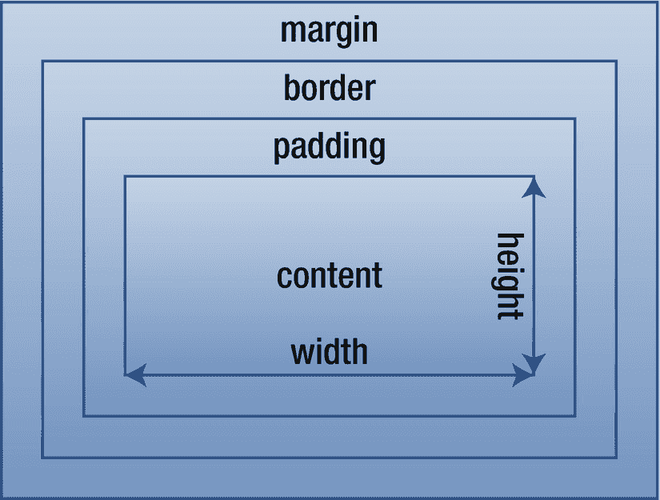

# 十六、盒子模型

CSS 的所谓盒子模型描述了 HTML 元素所占据的空间。在这个模型中，每个元素由四个框组成:内容、填充、边框和边距，如图 16-1 所示。



图 16-1

CSS 盒子模型

内容周围的三个框在元素的顶部、右侧、底部和左侧可以有不同的大小。任何或所有这些大小也可以设置为零。

## 内嵌和块

HTML 有两个主要的元素类别:块和内联。盒子模型对这两种元素的应用是不同的，所以了解它们之间的区别是很重要的。内嵌元素的例子包括`<a>`、`<strong>`和`<em>`，而`<p>`、`<h1>`和`<form>`是块元素。

内联元素随文本内容流动，并根据需要拆分以适合其容器的宽度。它们可能不包含块元素，除了`<a>`元素，它可以包装任何类型的元素。

块元素可以包含块元素和行内元素(见图 16-2 )。它们通过在自身周围创建一个水平扩展的虚拟框来中断文本流，使其看起来好像在每个块元素的前后都有换行符。由于这些属性，块元素也被称为盒子或容器。


图 16-2

块和内联元素

内联元素和块元素周围的框具有不同的功能。block 元素可以操作 box 模型中的所有属性，包括内容区域的宽度和高度，以及边框、填充和边距。如果没有设置宽度，block 元素将水平扩展到包含元素所允许的最大值。

内联元素的局限性更大，因为它不能设置垂直边距(顶部或底部)。它也不能改变其内嵌框的宽度或高度。对于内联元素，可以用`line-height`属性设置最小高度，但是宽度和高度会自动调整以适合元素容纳的内容。

内联元素有一个子类，叫做替换内联元素，它使用外部对象，比如``、`<video>`和`<object>`；并形成`<input>`、`<textarea>`等元素。有了这些内嵌元素，所有的框属性都可以像块元素一样被操作。

## 跨度和分度

使用`<span>`和`<div>`元素是向 web 文档添加结构的一种通用方式。这些元素没有关联的样式，这使得它们特别适合使用类和 id 选择器。两者的区别在于`<span>`是内嵌元素，而`<div>`是块元素。

```html
<span>Inline</span>
<div>Block</div>

```

作为一个行内元素，`<span>`主要用于给文本添加样式。它不能用于样式块元素，因为根据 HTML 规范，这种元素不允许出现在内联元素中。

```html
<span style="color: red;">Red text</span>

```

相反，`<div>`用于为其他块和行内元素创建样式化的容器。这些自定义容器通常构成了网页的布局。因为它是一个 block 元素，`<div>`允许操作元素的所有 box 属性(宽度、高度、填充、边框和边距)。

```html
<div class="a">
  <div class="b">Block within a block</div>
</div>

```

## 语义元素

在 HTML 4 中，一般的`<div>`元素是用来定义用 CSS 格式化的网页部分的主要元素。它没有传达任何语义，这被认为是语言的一个缺点。HTML 5 规范引入了许多其他鼓励使用的结构元素，比如`<header>`、`<footer>`、`<section>`、`<article>`和`<nav>`。

出于可访问性和可维护性的原因，当这些新的容器元素在给定的上下文中合适时，它们是首选的。每当没有语义上更合适的元素可用时，`<div>`元素仍然是合适的，并继续被广泛用作通用容器。HTML 5 元素在 Chrome 6+、Firefox 4+、Safari 5+、Opera 11.5+和 IE 9+中得到支持。

HTML 5 元素的 CSS 样式可以通过 HTML 5 Shiv 脚本添加到 IE 6-8 中。 <sup>1</sup> 这个 JavaScript 文件可以使用 IE 条件注释下载和引用，这样就不会影响现代 web 浏览器的性能:

```html
<!--[if lt IE 9]>
  <script src="html5shiv.js"></script>
<![endif]-->

```

Firefox 3+、Safari 3.1+和 Opera 10+已经允许未知元素的样式化。但是，要按预期方式运行，这些元素需要显式设置为显示为块元素，因为这不是默认样式。

```html
header, footer, section, article, aside, details, figcaption, figure, hgroup, menu, nav {
  display: block;
}

```

<aside class="FootnoteSection" epub:type="footnotes">Footnotes 1

[`http://code.google.com/p/html5shiv/`](http://code.google.com/p/html5shiv/)

 </aside>