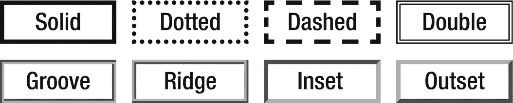
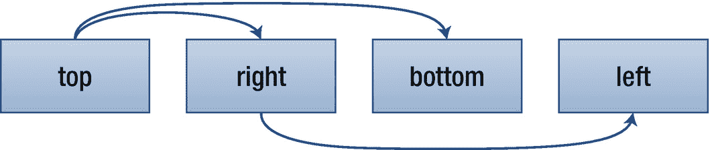
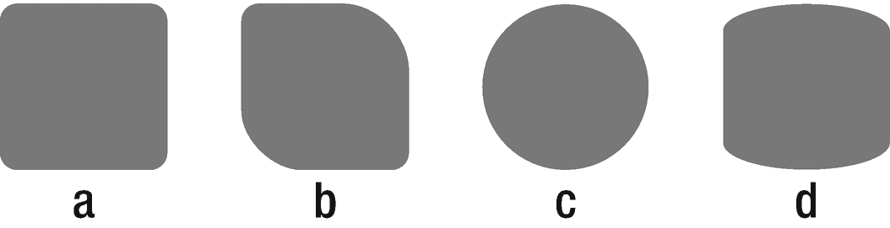

# 十七、边框

边框属性用于格式化元素周围的边框。它们可以应用于任何元素，并且不继承。

## 边框样式

要使元素周围的边框可见，必须将`border-style`属性设置为除默认值`none`之外的值。

```html
border-style (1-4) | border-top-style |
border-right-style | border-bottom-style |
border-left-style :
  none | dashed | dotted | double | groove |
  hidden | inset | outset | ridge | solid

```

实心边框样式是最常用的一种，但是还有其他几种显示边框的选项，如图 17-1 所示。`hidden`值移除边框，与`none`同义，除了它还隐藏具有折叠边框的表格中的共享边框。



图 17-1

边框样式外观

`border-style`属性是可以设置一到四个值的几个属性之一。当指定的值少于四个时，`border-style`值被复制，如图 17-2 所示。



图 17-2

解释了 1 到 4 值语法

根据这些规则，下列声明是同义的，并且在元素的顶部和底部显示实线边框:

```html
border-style: solid none solid none;
border-style: solid none solid;
border-style: solid none;

```

要以相同的样式呈现所有边框，只需指定一个样式值。

```html
border-style: solid;

```

`border-style`属性有四个子属性，也可以用来定位每个边框的样式。

```html
border-top-style:    dotted;
border-right-style:  dashed;
border-bottom-style: ridge;
border-left-style:   inset;

```

## 边框宽度

控制边框宽度的`border-width`属性可以用长度单位或预定义值之一来设置:`thin`、`medium`或`thick`。初始值为`medium`，通常渲染为 3 个像素。

```html
border-width (1-4) | border-top-width |
border-right-width | border-bottom-width |
border-left-width :
  <length> | thin | medium | thick

```

与`border-style`一样，该属性可以有一到四个值，并且有四个子属性用于设置各个边框的宽度。

```html
/* Shortcut property */
border-width: thin medium;

/* Full-length properties */
border-top-width:    thin;
border-right-width:  medium;
border-bottom-width: thin;
border-left-width:   medium;

```

宽度为零表示不显示边框。该值与将边框样式设置为`none`的效果相同。

## 边框颜色

`border-color`设置边框的颜色。CSS 没有指定默认的边框颜色，但是大多数浏览器都是黑色的。该属性可以有一到四个值，并且有四个子属性用于设置各个边框的颜色。

```html
border-color (1-4) | border-top-color |
border-right-color | border-bottom-color |
border-left-color :
  <color> | transparent

```

将颜色设置为透明会使边框不可见，而不会更改布局。从 CSS 3 开始，`transparent`关键字可以用在任何需要颜色值的地方。

```html
border-color: transparent;

```

## 边界

属性可以在一个声明中设置宽度、样式和颜色边框属性。这是控制边框最常用的属性。

```html
border | border-top | border-right |
border-bottom | border-left :
  <border-width> + <border-style> + <border-color>

```

这些值可以按任何顺序设置，因为它们之间没有歧义。这两个值中的任何一个都可以省略。

```html
border: 1px solid black;

```

`border`属性有四个子属性，用于指定四个边的边界设置。

```html
border-top:    1px solid red;
border-right:  1px solid blue;
border-bottom: 1px solid aqua;
border-left:   1px solid lime;

```

## 边框半径

使用`border-radius`属性或它的四个子属性可以使边框的角变圆。

```html
border-radius (1-4) | border-top-left-radius |
border-top-right-radius | border-bottom-right-radius |
border-bottom-left-radius :
  <length> | <percentage> [ / <length> | <percentage> ]

```

`border-radius`属性可以有一到四个值。每个半径值可以通过使用一个圆半径值或两个椭圆半径值来设置。该值可以是长度或百分比。如果使用百分比，它是相对于容器的尺寸。以下示例如图 17-3 所示。



图 17-3

边框半径示例

```html
.a { border-radius: 5px; }
.b { border-radius: 5px 20px; }
.c { border-radius: 50%; }
.d { border-radius: 30px/10px; }

```

可以使用`border-radius`的四个子属性设置四条边的半径。以下示例渲染与图 17-3 中的第二个盒子相同:

```html
border-top-left-radius:     5px;
border-top-right-radius:    20px;
border-bottom-right-radius: 5px;
border-bottom-left-radius:  20px;

```

`border-radius`是一个支持良好的 CSS 3 属性。为了增加对旧浏览器的支持，可以使用浏览器前缀`-webkit`和`-moz`。

```html
.round {
  /* Safari 3-4 */
  -webkit-border-radius: 5px;

  /* Firefox 1-3.6 */
  -moz-border-radius: 5px;

  /* Chrome 1+, Firefox 4+, Safari 5+, Opera 10.5+, IE 9+ */
  border-radius: 5px;
}

```