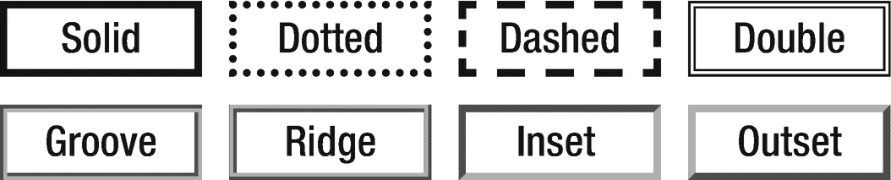

# 十八、概述

轮廓是围绕元素绘制的线条，位于边框边缘之外。它通常呈现为交互式元素周围的虚线，以显示哪个元素具有焦点。虽然与边框相似，但轮廓的不同之处在于它不占用盒子模型中的任何空间。此外，与边框不同，轮廓的所有四个边都必须相同。大纲属性可以应用于任何元素，并且它们都不会继承。

## 轮廓样式

轮廓的样式用`outline-style`属性设置。要显示大纲，需要将该值设置为除默认的`none`之外的值。

```html
outline-style : none | solid | dotted | dashed | double |
                groove | ridge | inset | outset

```

该属性允许与`border-style`相同的值，除了`hidden`不是有效的`outline-style`。它们的渲染也是一样的，如图 18-1 所示。



图 18-1

轮廓样式的外观

## 轮廓宽度

轮廓的粗细由`outline-width`属性指定。像`border-width`属性一样，它的值可以是指定的长度或者关键字`thin`、`medium`或`thick`中的一个。

```html
outline-width : <length> | thin | medium | thick

```

CSS 没有定义这三个关键字的数值粗细，但是它们通常分别呈现为 1px、3px 和 5px。像`border-width`一样，这个属性的初始值是`medium`。

## 轮廓颜色

轮廓的颜色可以用`outline-color`属性改变。除了标准的颜色符号，关键字`invert`也是该属性的有效值。

```html
outline-color : invert | <color>

```

为了确保适当的对比度，规范建议默认值为`invert`，它将轮廓设置为下面颜色的反义词。但是实际上只有 IE 8+和 Opera 7+支持这个可选值，所以不常用。

## 概述

`outline`是一个简写属性，用于在一个声明中设置所有前面的大纲属性。

```html
outline : <outline-width> + <outline-style> + <outline-color>

```

这些值可以按任何顺序指定，因为它们之间没有歧义。他们中的任何一个都可以被忽略。

```html
outline: thin solid red;

```

这与设置所有单个属性的效果相同，但语法更方便:

```html
outline-width: thin;
outline-style: solid;
outline-color: red;

```

## 轮廓偏移

轮廓和边框边缘之间的间距可以用 CSS 3 中引入的`outline-offset`属性来设置。

```html
outline-offset : <length>

```

以下声明将轮廓向外移动 3 个像素。允许负值，但这会将轮廓移动到元素内部。

```html
outline-offset: 3px;

```

虽然 IE 不支持该属性，但它可以在所有现代浏览器中工作，包括 Chrome 4+、Firefox 2+、Safari 3.1+、Opera 12.1+和 Edge 15+。