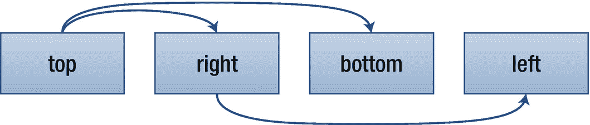

# 十九、边距和填充

边距和填充用于调整元素的位置并在其周围创建空间。

## 填料

填充是元素内容与其边框之间的空间。它是使用这里显示的填充属性设置的。这些属性不继承，可以应用于任何元素。

```html
padding (1-4) | padding-top | padding-right |
padding-bottom | padding-left :
  <length> | <percentage>

```

有四个属性可以分别设置每一侧的填充。在下面的示例中，垂直(上、下)边距为 10 像素，水平(右、左)边距为零。

```html
padding-top:    10px;
padding-right:  0;
padding-bottom: 10px;
padding-left:   0;

```

可以使用`padding`属性将这些声明缩短为一个声明。然后按顺时针顺序指定填充值:顶部、右侧、底部和左侧。

```html
padding: 10px 0 10px 0;

```

像许多其他与盒子模型相关的属性一样，`padding`属性可以用一到四个对应于元素盒子边缘的值来设置。少于四个值时，如图 19-1 所示重复填充。



图 19-1

解释了 1 到 4 值语法

例如，如果指定了两个值，第一个值设置顶部和底部填充，第二个值设置右侧和左侧填充。这给出了一种更短的方式来编写前面的例子。

```html
padding: 10px 0;

```

请记住，填充是元素背景的一部分，受背景属性的影响，而边距总是透明的。

## 边缘

边距是元素边框周围的空间，使用下面列出的边距属性进行设置。这些属性不会被继承，可以应用于任何元素，但垂直边距不会影响未替换的行内元素。

```html
margin (1-4) | margin-top | margin-right |
margin-bottom | margin-left :
  <length> | <percentage> | auto

```

Margin 和 padding 都可以使用相对于包含元素的宽度和高度的百分比值。与填充相反，边距可以是负数，这允许元素区域重叠。`auto`关键字让浏览器自动计算边距。

像填充和边框属性一样，`margin`属性可以用一到四个值来设置。例如，在下面的声明中，上下边距为 1 厘米，左右边距为 0:

```html
margin: 1cm 0;

```

`margin`属性也有四个子属性，它们为设置四条边的边距提供了一个更详细的方法。

```html
margin-top:    1cm;
margin-right:  0;
margin-bottom: 1cm;
margin-left:   0;

```

上下边距在相邻的框之间共享，因此两个框之间的垂直距离不是边距之和，而只是两个边距中较大的一个。因此，下面两个`<div>`框之间的距离只有 10 个像素:

```html
<div style="margin-bottom: 5px;">Top box</div>
<div style="margin-top: 10px;">Bottom box</div>

```