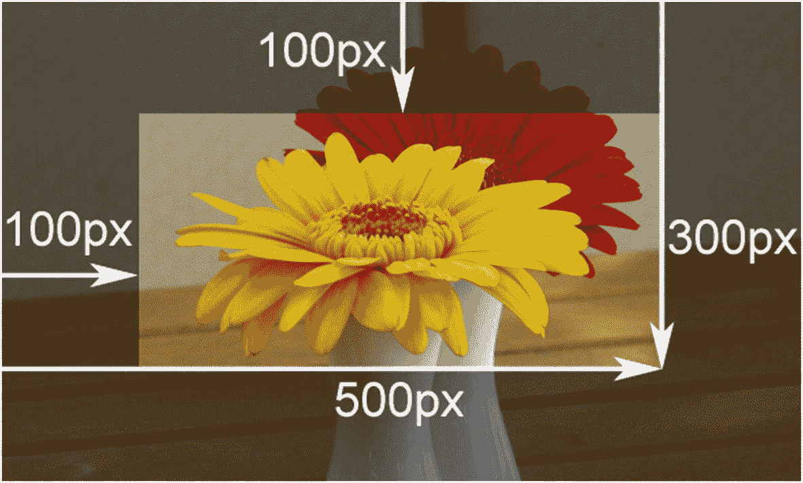
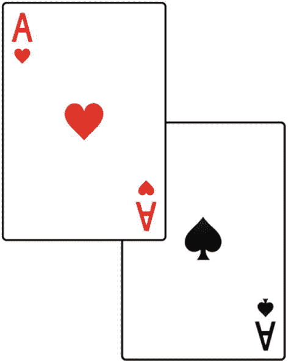
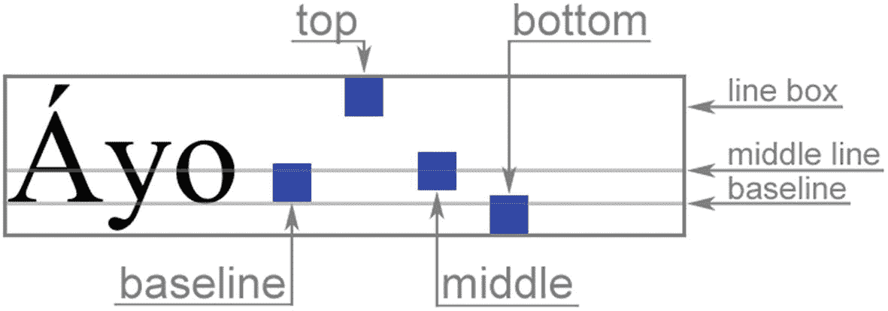
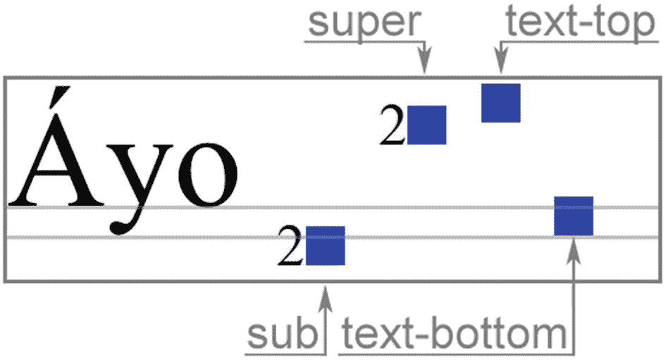
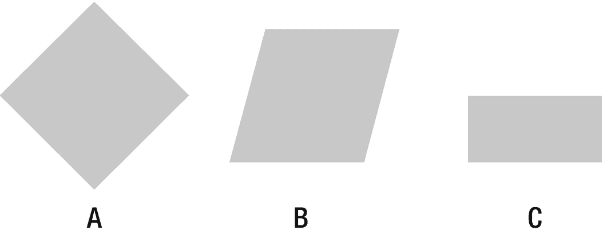
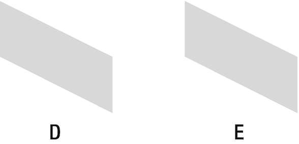

# 二十一、定位

定位属性可以更改元素的显示方式和位置。它们能够非常精确地控制网页布局。

## 位置

使用`position`属性可以用四种不同的方式定位元素。属性设置为除了`static`之外的任何值的元素被称为定位元素。

```html
position : static | relative | absolute | fixed

```

可以使用`top`、`left`、`right`和`bottom`属性移动已定位的元素，这些属性可用于将元素定位在页面上的任何位置，还可以水平和垂直调整元素的大小。它们允许正负长度和百分比值，百分比与包含块的尺寸相关。

```html
top | right | bottom | left (positioned) :
  auto | <length> | <percentage>

```

### 静电

默认情况下，`position`属性的值为`static`。该值表示元素出现在页面流中的常规位置，不受`top`、`left`、`right`或`bottom`定位属性的影响。

```html
/* Not positioned element */
.static { position: static; }

```

因为`position`属性没有被继承，而`static`是默认值，所以不需要显式地将`position`属性设置为`static`。

### 亲戚

将`position`值更改为`relative`意味着元素可以相对于其在页面流中的正常位置进行定位。例如，要显示比正常位置低 20 个像素的选定元素，使用以下声明:

```html
/* Move element 20 pixels down */
.relative {
  position: relative;
  top: 20px;
}

```

相对定位的元素被视为正常页面流的一部分，因此其他元素不会移动来填充移动元素留下的间隙。

相对于正常位置移动元素的效果也可以通过使用元素的边距来实现。这种解决方案通常是首选的，除非有特定的需要使元素定位，例如它是否将是一个绝对定位的子元素的容器。

```html
/* Move element 20 pixels down */
margin-bottom: -20px;

```

请记住，更改边距会影响布局和填充间隙，而相对位置不会。

### 绝对的

`position`值`absolute`将元素从任何包含元素中分离出来，并允许它相对于其最近的定位祖先或文档体(如果没有的话)进行定位。

```html
/* Place element in upper left corner */
.absolute {
  position: absolute;
  top: 0;
  left: 0;
}

```

### 固定的；不变的

固定元素相对于屏幕视口定位。当页面滚动时，它不会移动。与绝对定位元素类似，固定元素在正常页面流中不保留任何空间。

```html
/* Place element

fixed in bottom right corner */
.fixed {
  position: absolute;
  bottom: 0;
  right: 0;
}

```

## 泛滥

属性决定如何处理块元素的内容溢出。它默认为`visible`，意味着扩展到元素内容区域之外的文本和子元素是可见的。将值设置为`hidden`会隐藏溢出的内容，使用`scroll`值，元素的块可以滚动以容纳溢出的内容。`auto`值类似于`scroll`，但是滚动条仅在必要时出现。

```html
overflow (block) : visible | hidden | scroll | auto

```

该属性控制水平和垂直溢出的行为。另外两个属性`overflow-x`和`overflow-y`可用于区分水平溢出和垂直溢出的处理方式。这两个属性的值与`overflow`属性的值相同。

```html
overflow: hidden;   /* hide all overflow */
overflow-x: hidden; /* hide horizontal overflow */
overflow-y: hidden; /* hide vertical overflow */

```

## 夹子

如果一个元素被定位为绝对或固定，那么`clip`属性可以将它裁剪成一个矩形。它使用一个名为`rect()`的 CSS 函数来指定剪辑区域。

```html
clip (absolute | fixed) :
  auto | rect(<top>, <right>, <bottom>, <left>)

```

`rect()`需要四个长度值，每个值用逗号分隔。这些值相对于元素的左上角。图 21-1 所示的例子从应用它的元素中剪切并显示一个 200 x 400 的像素区域。



图 21-1

阴影区域被移除

```html
.myclip {
  position: absolute;
  clip: rect(100px, 500px, 300px, 100px);
}

```

关键字`auto`可以用作右侧或底部的值，分别表示元素的全宽或全高。这个关键字也是`clip`属性的默认值，这意味着元素不会被裁剪。

```html
/* Remove 100px from left and top */
clip: rect(100px, auto, auto, 100px);

/* No clipping */
clip: auto;

```

浏览器对 clip 属性的支持几乎是通用的:Chrome 1+、Firefox 1+、Safari 1+、Opera 7+和 IE 8+。

## z 指数

相互重叠的定位元素通常根据它们在 web 文档中的顺序进行分层。这种自然的堆叠顺序可以用`z-index`属性来改变

```html
z-index (positioned) : auto | <integer>

```

`z-index`属性取一个正整数或负整数作为它的值，表示堆叠顺序。值较高的元素位于值较低的元素之前，如下例所示:

```html


```

在本例中，如图 21-2 所示，红桃 a 由于其较高的堆叠顺序而层叠在黑桃 a 之上。



图 21-2

*定制堆叠顺序*

## 垂直对齐

一行中文本和行内元素的垂直对齐可以用`vertical-align`属性来控制。该属性也可用于表格单元格元素。

```html
vertical-align (inline | table-cell) :
  baseline | <length> | <percentage> | top | middle |
  bottom | text-top | text-bottom | super | sub

```

默认情况下，文本和内联元素(如图像)的底部在基线处对齐，基线是所有字母所在的不可见线。值`top`和`bottom`分别将图像与线条的顶部和底部对齐。不太直观的是值`middle`，它将图像的中间与父图像中小写字母的中间对齐。图 21-3 中显示了这些公共对准值的渲染。



图 21-3

常见垂直对齐值

`vertical-align`的两个不常用值是`text-bottom`和`text-top`。`text-bottom`值将元素的底部与文本的底部对齐。与之相反，`text-top`值将元素的顶部与文本的顶部对齐。还有`sub`和`super`值，它们分别将元素与下标和上标位置对齐。使用这些值的结果如图 21-4 所示。



图 21-4

其他垂直对齐值

元素也可以用长度或百分比值升高(正值)或降低(负值)。百分比和长度值都从基线开始；百分比值相对于行高。

```html
/* Align text segment 5 pixels below normal text */
Normal <span style="vertical-align: -5px;">Lowered</span>

```

当应用于表格单元格元素`<th>`和`<td>`时，`vertical-align`属性的行为类似于 HTML 中不推荐使用的`valign`属性。表格单元格的有效值为`baseline`、`bottom`、`middle`和`top`。其他值，包括长度和百分比，不应用于表格单元格。

`top`。值将单元格的顶部填充边缘与行的顶部对齐。同样，`bottom`将单元格的底部填充边缘与行的底部对齐。更值得注意的是，`baseline`值对齐单元格的内容，以便它与其他基线对齐的单元格共享相同的基线。

与默认为`baseline`的行内元素相比，表格单元格元素通常在中间对齐。对于表格单元格，`middle`值的行为更加直观，它将单元格的填充框对齐到行的中间，使单元格的内容居中显示。

在以下示例中，表格单元格元素在底部垂直对齐:

```html
<table>
  <tr>
    <td style="vertical-align: bottom;">Bottom</td>
  </tr>
</table>

```

## 定中心

有几种方法可以使 CSS 中的元素居中。一种方法是使用值为`center`的`text-align`属性。

```html
.text-center { text-align: center; }

```

通过将此属性应用于 block 元素，其中的文本将居中对齐。

```html
<p class="text-center">Centered text</p>

```

此方法适用于文本和内联子元素，但不适用于子块元素。要使块元素居中，可将左右边距设置为`auto`，使水平边距相等，从而使块居中。

```html
.box-center { margin: 0 auto; }

```

请记住，对于要居中显示的块元素，其宽度必须是固定的，而不是灵活的；否则，它会占用所有可用的宽度。

```html
<div style="width: 50px; height: 50px;
            border: 1px solid black;"
     class="box-center"></div>

```

对于垂直居中，将内容居中对齐的一种方法是使用父元素的`vertical-align`属性，将其值设置为`middle`。这种行为仅适用于表格单元格元素，因此需要将容器改为表格单元格元素，如下面使用`display`属性的示例所示:

```html
<div style="vertical-align: middle;
            display: table-cell;
            min-height: 100px;">Centered</div>

```

用 flexbox 模块在 CSS 中添加了更简单的对齐控制，这将在后面的章节中讨论。

## 转换

transform 属性允许对元素进行可视化操作，例如旋转、倾斜、平移或缩放。

```html
transform (block) : none | rotate(<angle>) | rotateX(<angle>) |
  rotateY(<deg>) | rotateZ(<deg>) | rotate3d(<x>,<y>,<z>,<deg>) |
  skew(<x-deg>[, <y-deg>])> | skewX(<deg>) | skewY(<deg>) |
  translate(<x>,<y>) | translateX(<x>) | translateY(<y>) |
  translateZ(<z>) | translate3d(<x>,<y>,<z>) | scale(<x>[, <y>]) |
  scaleX(<x>) | scaleY(<y>) | scaleZ(<z>) | scale3d(<x>,<y>,<z>)
  matrix(n,n,n,n,n,n)> | matrix3d(n,n,n,n,n,n,n,n,n,n,n,n,n,n,n,n) |
  perspective(<p>)

```

考虑下面的样式规则，这些规则将用于说明转换是如何工作的。请注意，这里使用的 float 属性使块元素水平堆叠，而不是垂直堆叠。

```html
.box {
  float: left;
  width: 100px;
  height: 100px;
  margin: 0 1em;
  background: #ccc;
}

/* Rotate element clockwise 45 degrees */
.a { transform: rotate(45deg); }

/* Tilt element 15 degrees right */
.b { transform: skewX(-15deg); }

/* Move element 25% down and scale height to 50% */
.c { transform: translateY(25%) scaleY(0.5); }

```

将这些样式应用于一组块元素的结果可以在图 21-5 中看到。



图 21-5

变形盒子

```html
<div class="box a"></div>
<div class="box b"></div>
<div class="box c"></div>

```

矩阵函数可以使用一组六个值来执行一个或多个 2d 变换。前两个值分别用于垂直和水平缩放，值 1 表示不应用缩放。第二个和第三个值用于倾斜元素，最后两个值用于平移元素。

```html
/* Scale to half size and skew 45 degrees left and down */
.d { transform: matrix(1,0.5,0,0.5,0,0) }
.e { transform: scaleY(0.5) skew(45deg) }

```

这两种转换将产生相同的结果，如图 21-6 所示。



图 21-6

矩阵变换

```html
<div class="box d"></div>
<div class="box e"></div>

```

默认情况下，变换的原点是元素的中心。可以使用 transform-origin 属性更改该原点。第一个值是水平位置，第二个值是垂直位置，第三个值表示 Z 轴上的位置。第三个值仅在使用 3d 变换时有效，并且不能是百分比。

```html
transform-origin (block) : 50% 50% 0 |
  <x-axis: left | center | right | <length> | <%>> +
  <y-axis: top | center | bottom | <length> | <%>> +
  [<z-axis: <length>>]

```

Chrome 4+、Firefox 3.5+、Safari 3.1+、Opera 11.5+和 IE 9+都支持 2d 变换以及 transform-origin 属性。3d 转换是后来添加的，从 Chrome 12+，Firefox 10+，Safari 4+，Opera 15+和 IE 10+开始可用。