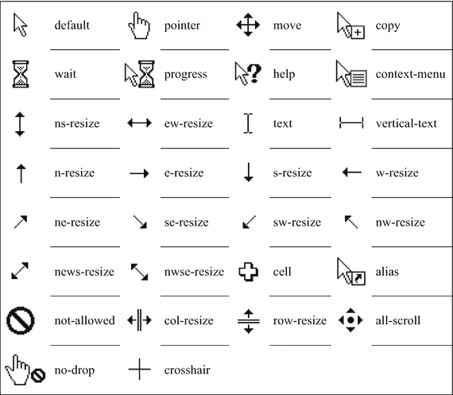

# 二十二、分类

分类属性指定元素如何显示以及是否可见。

## 显示

属性决定了包围一个元素的盒子的种类。它可以使任何元素显示为内联、块或任何其他类型。每个元素都有一个默认的显示值，这取决于元素的类型。

```html
display : none | inline | block | list-item | inline-block |
          inline-table | table | table-cell | table-row |
          table-column | table-column-group | table-footer-group |
          table-header-group | table-row-group | flex | inline-flex |
          grid | inline-grid | run-in

```

大多数 HTML 元素显示为内联或块；其他的有特殊的显示属性，比如`<li>`元素的`list-item`和`<td>`和`<th>`元素的`table-cell`。通过使用`display`属性，任何元素都可以被改变为这些或任何其他元素类型。例如，以下链接呈现为块元素，而不是内联元素:

```html
<a href="#" style="display: block;">Block link</a>

```

`display`的一个更有用的值是`inline-block`，它结合了块和内联的特性。一个`inline-block`元素就像一个内嵌元素，除了它也可以像块元素一样操作盒子模型的宽度、高度和垂直边距属性。这些特性与被替换的内联元素相同，比如``和`<button>`。因此，这些元素在 HTML 5 中被正式重新定义为`inline-block`元素。

`inline-block`的一个常见应用是让列表项元素(`<li>`)适合水平导航菜单。请注意，将列表项元素的显示类型从`list-item`更改为`inline-block`会自动移除列表标记。

```html
li {
  display: inline-block;
  width: 100px;
  background: #ccc;
}

```

有了这条规则，下面的标记呈现了三个灰色背景的盒子，如图 22-1 所示。


图 22-1

演示的内联块值

```html
<ul>
  <li>Item one</li>
  <li>Item two</li>
  <li>Item three</li>
</ul>

```

另一个有用的`display`值是`none`。它完全隐藏了一个元素，使得页面呈现得好像该元素不存在一样。

```html
.removed { display: none; }

```

## 能见度

通过将属性的值设置为`hidden`,`visibility`属性可以隐藏一个元素，而不会删除它所占据的空间。

```html
visibility (block) : inherit | visible | hidden | collapse

```

`collapse`值只用于某些表格元素:行(`<tr>`)、列(`<col>`)、列组(`<colgroup>`)和行组(`<thead>`、`<tbody>`和`<tfoot>`)。根据规范，`collapse`应该移除隐藏的元素(与`display: none`相同)并为其他元素腾出空间。遗憾的是，并不是所有主流浏览器都遵循这个值的规范。将`display`属性设置为`none`会导致更一致的浏览器行为，应该改为使用。

## 不透明

属性可以使一个元素及其内容透明。

```html
opacity : <number>

```

使用介于 0.0 和 1.0 之间的小数值来设置透明度。值为 1 时，元素是不透明的；0 表示元素完全透明或不可见。

```html
.half-transparent { opacity: 0.5;}

```

Chrome 1+、Firefox 1+、Safari 1.2+、Opera 9+和 IE 9+中都包含对这个 CSS 3 属性的支持。可以使用以下过滤器增强 IE 支持:

```html
.half-transparent {
  filter: alpha(opacity=50); /* IE 5-8 */
  opacity: 0.5;
}

```

## 漂浮物

属性将一个元素从它包含的元素中分离出来，并使它浮动在它的顶部，或者在左边或者在右边。它的目的是让文字环绕图像，在更现代的布局方法出现之前，它也常用于制作布局。浮动内联元素会自动将其更改为块元素。

```html
float : none | left | right

```

若要让文本和其他内联内容环绕图像，您可以将它向左或向右浮动。

```html


```

浮动允许阻塞。要水平对齐的元素。例如，可以用下面的类创建一个盒子网格:

```html
.box {
  float: left;
  width: 100px;
  height: 100px;
  margin: 0 1em;
  background: #ccc;
  border-radius: 10px;
}

```

这个类使盒子水平堆叠而不是垂直堆叠，这是块元素的正常行为(见图 22-2 )。


图 22-2

浮动框

```html
<div class="box"></div>
<div class="box"></div>
<div class="box"></div>

```

使用浮动的一个副作用。这些浮动框后面的任何元素也是水平排列的。`clear`属性旨在阻止这种行为。

## 清楚的

属性用于从元素的左边、右边或两边清除浮动元素。

```html
clear (block) : none | left | right | both

```

此属性通常被赋予其自己的类，该类与属性同名。

```html
.clear { clear: both; }

```

带有`clear`类的空`div`容器通常放在浮动元素之后。这个被清除的元素被移到浮动元素的下面，而不是出现在它们旁边。

```html
<div class="clear"></div>

```

因为浮动布局趋向于复杂和脆弱，它们已经被其他更现代的布局方法所取代，比如 flexbox 和 grid 模块。

## 光标

属性指定当光标悬停在一个元素上时，用户会看到什么。默认值是`auto`，意思是浏览器决定使用什么光标。标准光标值及其外观见表 22-1 。

表 22-1

标准光标值

<colgroup><col class="tcol1 align-left"> <col class="tcol2 align-left"></colgroup> 
|  |

除了这些值，可以使用`url`函数定义自定义光标。如果此游标不可用，可以在自定义游标之后指定一个通用游标，用逗号分隔。

```html
cursor: url(new.cur), pointer;

```