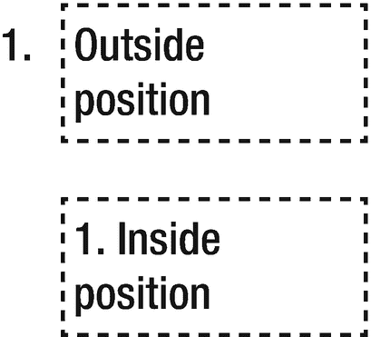

# 二十三、列表

CSS 列表属性处理列表元素，特别是`<ul>`、`<ol>`和`<li>`元素。

## 列表样式类型

列表呈现时在每个列表项元素前显示一个标记(`<li>`)。使用`list-style-type`属性可以改变这个标记的外观。对于一个无序列表(`<ul>`)，每个列表项都以同样的方式标记。可以使用此处显示的预定义项目符号值，将`disc`(实心圆)作为初始值:

```html
list-style-type : inherit | disc | circle | square | none

```

在有序列表(`<ol>`)中，每个列表项都用数字字符标记，以显示其在序列中的位置。所有主流浏览器都支持以下数值类型，以`decimal`作为初始值:

```html
list-style-type : inherit | decimal | none | upper-alpha |
                  lower-alpha | upper-roman | lower-roman |
                  lower-greek | lower-latin | armenian |
                  georgian | decimal-leading-zero

```

下面的示例为两个列表元素分配:一个新的列表样式。可以让`<ul>`显示有序的标记，让`<ol>`显示无序的标记，但这不是好的做法。

```html
ul { list-style-type: square; } /* ■ */
ol { list-style-type: upper-roman; } /* I, II, III, ... */

```

标记的颜色与列表元素的文本颜色相同。请记住，任何元素都可以通过将其显示类型更改为`list-item`来显示列表标记。

## 列表样式图像

作为预定义标记的替代，使用`list-style-image`属性允许自定义图像用作列表项目符号。

```html
list-style-image : inherit | none | url(<url>)

```

图像路径是在 CSS `url`函数中指定的。

```html
list-style-image: url(my-bullet.png)

```

该属性会覆盖使用`list-style-type`属性选择的任何标记类型。即便如此，指定一个`list-style-type`作为后备也是一个好主意，以防自定义项目符号图像由于任何原因不可用。

## 列表样式位置

列表标记通常位于元素框的外部。`list-style-position`提供了一种替代方法:将项目符号放在元素框中。

```html
list-style-position : inherit | outside | inside

```

选择`outside`会将每行文本与第一行的开头对齐，而`inside`会使后续文本行在标记下方换行。`inside`值也可视地缩进标记，如图 23-1 所示。



图 23-1

外部和内部标记放置

## 列表样式

`list-style`是设置所有列表属性的简写属性。这些值可以按任何顺序设置，因为它们之间没有歧义。也可以省略任何一个值，在这种情况下，将使用该属性的默认值。

```html
list-style : <list-style-type> + <list-style-image> + <list-style-position>

```

在下面的例子中，设置了`list-style`的`type`和`position`值，它们被继承到列表项中。

```html
<ul style="list-style: inside square;">
  <li>Apple</li>
  <li>Orange</li>
  <li>Pear</li>
</ul>

```

请记住，列表属性不仅可以设计列表容器`<ul>`和`<ol>,`的样式，还可以设计单个列表项`<li>`的样式。

## 计数器

CSS 中的元素可以使用`counter-increment`和`counter-reset`属性自动编号。`counter-reset`属性指定计数器的名称。它后面可选地跟有计数器的初始值，缺省情况下是零。

```html
/* Create a counter named chapter */
body { counter-reset: chapter; }

```

`counter-increment`属性接受计数器的名称，后跟一个可选的数字。默认情况下，number 为 1，它设置元素每出现一次计数器增加多少。

```html
/* Increment the counter at each <h1> */
h1:before { counter-increment: chapter; }

```

创建计数器的最后一步是使用 CSS `counter()`函数显示它，并将计数器的名称作为它的参数。在本例中，章节号显示在`<h1>`元素之前:

```html
/* Increment and display the counter */
h1:before {
  content: "Chapter " counter(chapter) " - ";
  counter-increment: chapter;
}

```

柜台。现在在`<h1>`元素前添加章节号。

```html
<h1>First</h1>  <!-- Chapter 1 - First -->
<h1>Second</h1> <!-- Chapter 2 - Second -->
<h1>Third</h1>  <!-- Chapter 3 - Third -->

```

可以添加另一个计数器来枚举`<h2>`子标题。此处，该计数器在每个`<h1>`元素处重置为零:

```html
h2:before {
    content: counter(chapter) "." counter(section) " ";
    counter-increment: section;
}
h1 { counter-reset: section; }

```

以下示例说明了计数器的显示方式:

```html
<h1>Head</h1>  <!-- Chapter 1 - Head -->
<h2>Sub</h2>   <!-- 1.1 Sub -->
<h2>Sub</h2>   <!-- 1.2 Sub -->
<h1>Head</h1>  <!-- Chapter 2 - Head -->
<h2>Sub</h2>   <!-- 2.1 Sub -->.

```

## 嵌套计数器

CSS 计数器可以嵌套任意多级。这些嵌套的计数器可以使用一个名为`counters()`的 CSS 函数进行组合和显示。该函数的第一个参数是计数器名称，第二个参数是分隔每个计数器的字符串。

```html
ul { counter-reset: mycounter; }
li:before {
  content: counters(mycounter, ".") " ";
  counter-increment: mycounter;
}

```

这些规则适用于以下无序列表(注意，会为每个嵌套列表自动创建一个新的计数器实例):

```html
<ul>
  <li>item</li>   <!-- 1 item -->
  <li>item</li>   <!-- 2 item -->
  <ul>
    <li>item</li> <!-- 2.1 item -->
    <li>item</li> <!-- 2.2 item -->
  </ul>
</ul>

```

所有主流浏览器都支持计数器，包括所有版本的 Chrome、Firefox、Safari 和 Opera，以及 IE 8+。