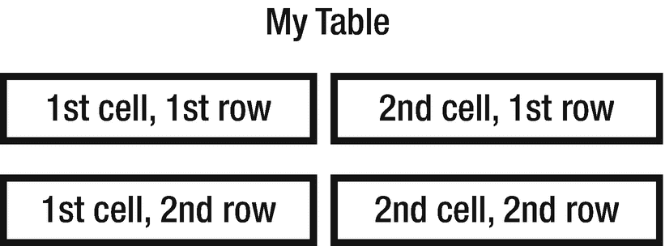

# 二十四、表格

CSS 有许多专门用于表格元素的属性。这些属性提供了对浏览器如何呈现表格数据的控制。

## 边框间距

相邻表格单元格的边框之间的距离可以用`border-spacing`属性来改变，该属性相当于 HTML 中的`cellspacing`属性。W3C 将该属性的初始值定义为 0，但大多数浏览器默认将其呈现为 2px。

```html
border-spacing : inherit | <length> [<length>]

```

该属性可以用一个或两个长度值来指定。有两个值，第一个设置水平间距，第二个设置垂直间距。

```html
.spacing {
  border-spacing: 5px 10px;
}

```

`border-spacing`是表格的属性，而不是单元格的属性，因此它应用于`<table>`元素，如下例所示:

```html
<table class="spacing">
  <caption>My Table</caption>
  <tr>
    <td>1st cell, 1st row</td>
    <td>2nd cell, 1st row</td>
  </tr>
  <tr>
    <td>1st cell, 2nd row</td>
    <td>2nd cell, 2nd row</td>
  </tr>
</table>

```

这张表格。如图 24-1 所示，实线边框应用于`<td>`元素。



图 24-1

示例表

表格单元格有边框和填充，但没有任何边距。他们用`border-spacing`代替。填充的工作方式与其他元素相同，其行为类似于 HTML 中的`cellpadding`属性。

## 边界崩溃

`border-collapse`属性决定表格边框是折叠成一个边框还是分开。

```html
border-collapse : inherit | separate | collapse

```

通常，表格单元格有自己独特的边框，并由使用`border-spacing`属性设置的距离分隔。如果边框设置为折叠，则单元格共享边框，并且忽略任何`border-spacing`属性的值。

```html
table { border-collapse: collapse; }

```

## 标题侧

元素为表格提供了一个标签。可以使用`caption-side`属性改变它的位置。

```html
caption-side : inherit | top | bottom

```

标题通常显示在顶部，但是也可以使用`caption-side`属性将其放置在表格的下方。该属性适用于`<caption>`元素，但也可以为`<table>`元素设置，因为它是继承的。

```html
caption { caption-side: bottom; }

```

## 空单元格

没有任何内容的表格单元格通常仍会显示其边框和背景。这种行为可以用`empty-cells`属性来改变。

```html
empty-cells : inherit | show | hide

```

将该属性的值设置为`hide`会导致单元格的边框和背景被隐藏。表格的布局不受影响。

## 表格布局

`table-layout`属性决定表格单元格的宽度应该是固定的还是可变的。与其他表属性不同，`table-layout`不会被继承。

```html
table-layout : auto | fixed

```

该属性最初设置为`auto`，这意味着表格单元格的宽度会自动扩展以适应其内容，即使这意味着超出其设置的宽度。为了强制表格的指定宽度，可以将`table-layout`设置为`fixed`。水平布局只取决于表格的设定宽度，而不取决于单元格的内容。

```html
/* Enforce table width */
.fixed { table-layout: fixed; }

```

固定的表格布局有一个额外的好处，即浏览器可以更快地呈现表格，因为它一收到第一行就知道表格的尺寸。