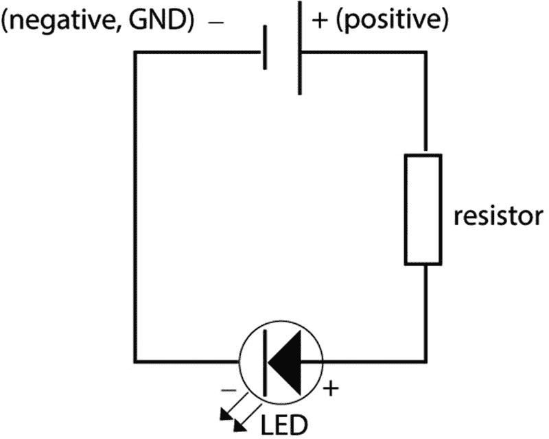
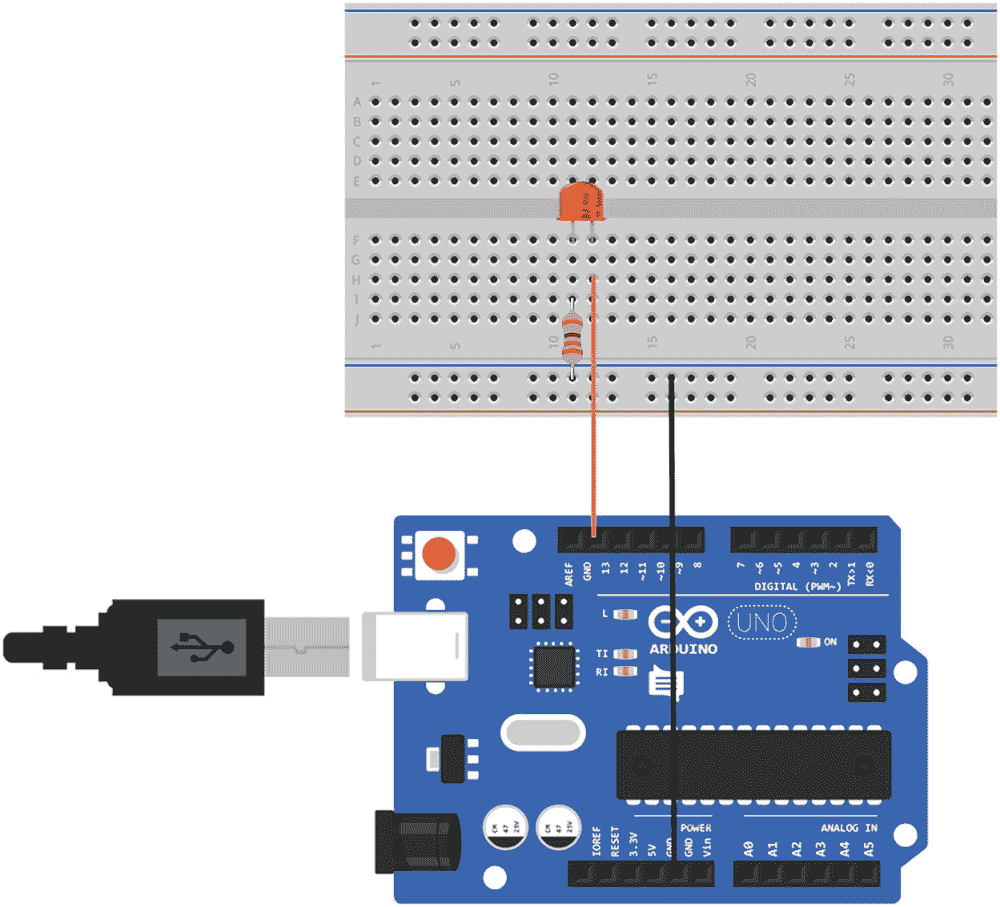
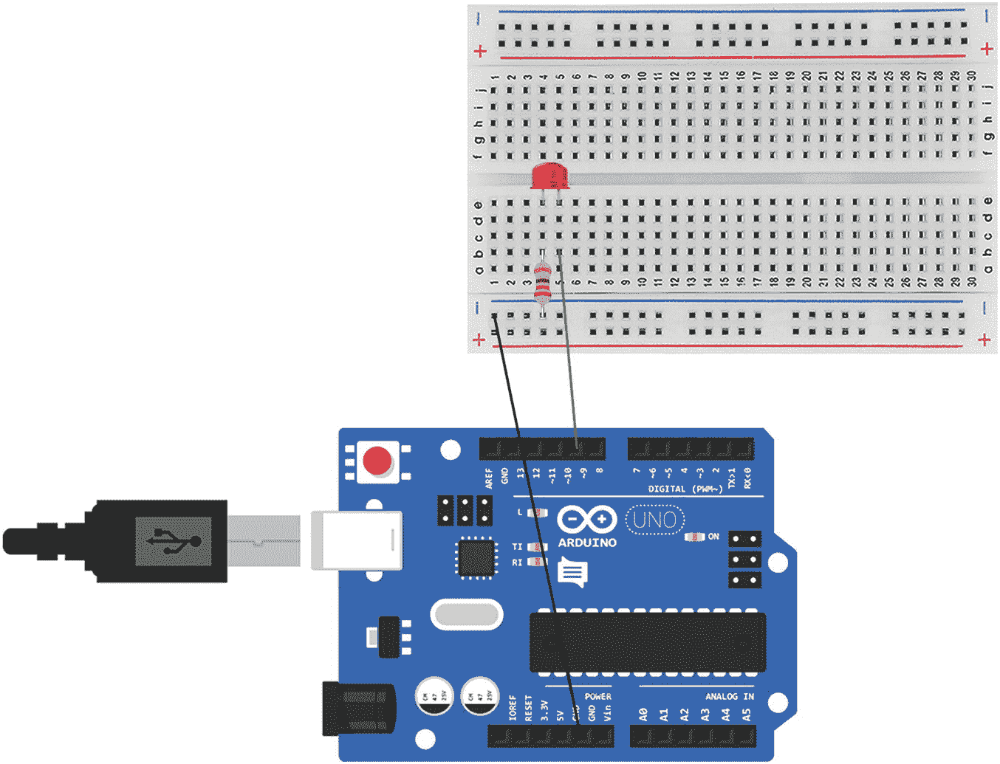

# 一、Arduino，电路和元件

本章介绍 Arduino 的电子学。它将解释 Arduino 是如何设置的，以及电流是如何流经电路和组件的。到本章结束时，你将使用一些基本元件，并创建四个基本电路:模拟输入，模拟输出，数字输入和数字输出。

## Arduino

Arduino 允许您创建自己的电子项目。它是一个开源硬件和软件的集合，允许您连接和控制其他组件来创建一个电路。自动植物浇水系统、披萨烤箱或遥控玩具车等项目都可以用 Arduino 制作。当您在项目中使用 Arduino 时，您需要执行以下操作:

*   将组件连接到它。
*   编写一个程序来控制这些组件。
*   验证程序是否编写正确。
*   将程序上传到 Arduino。

Arduino 需要通过 USB 端口连接到电脑，才能将程序上传到电脑。Arduinos 的程序叫做草图。一旦草图被上传，它就被存储在微控制器上，并一直保存到另一个草图被上传。新草图上传后，旧草图不再可用。

一旦草图被上传，你可以将 Arduino 从电脑上断开，如果它连接到另一个电源，程序仍然会运行。

Note

一旦草图被上传到 Arduino，它就不会以你所写的方式显示。您无法从 Arduino 中以可作为原始草图读取的形式取回草图，因此如果您想要保留它，请确保保存您的原始代码。

### 硬件烧坏

Arduino 板由许多组件组成，包括微控制器、数字和模拟引脚、电源引脚、电阻、二极管、电容和 LED。图 1-1 显示了一个 Arduino Uno。


图 1-1

An Arduino Uno

微控制器具有中央处理单元(CPU)；它存储上传的草图，并处理和指导命令。

数字和模拟引脚用于发送和接收数字和模拟数据。

Arduino 还有一个串行接口，允许 Arduino 通过串行端口向计算机发送数据；这就是我们在本书中向计算机发送数据和从计算机接收数据的方式。

## 电流

使用 Arduino，您可以创建一个电子电路，为连接到它的组件供电。由导电材料制成的电线连接着让电流通过的部件。

电是电子通过导电材料的运动。在导电材料中，电子可以很容易地在原子之间移动，但在非导电材料中却不能。

原子由质子、中子和电子组成。原子的中心是原子核、质子和中子；电子在外面。质子带正电荷，电子带负电荷。这两种电荷相互吸引。电子在围绕原子核的轨道上。在非导电材料如木头或瓷器中，电子很难移动；它们紧紧地束缚在原子上。在像铜和其他金属这样的导电材料中，电子与原子的结合非常松散，因此它们可以很容易地移动。这些电子在原子的外缘，被称为价电子。

电子在电路中从负极向正极移动。当电第一次被发现时，人们认为它是从正极到负极移动的，所以按照惯例，电子电路通常是从正极到负极，从正极到地(GND)。在本书的电路中，电流将向一个方向流动；这被称为直流电(DC)，而在交流电(AC)中，方向每秒钟改变一定次数。

为了让导电材料中的电子开始移动，它们需要一个推力，这个推力就是电压。电压是电路中较高势能和较低势能之差。电子想从较高的势能流向较低的势能，从正极流向负极。

产生电压的方式有很多种。在电池中，它是由化学反应产生的。在电池的负极会产生电子的积聚。当连接到电池的正极时，负电子被吸引到正极，从较高的势能到较低的势能。这导致它们推动电线上的电子；电子沿着导线分流。

在电学中，电流是指每秒钟通过某一点的电子数量。电流是以安培为单位测量的。电路中的每一个元件都会消耗一部分电能，并将其转化为另一种形式的能量，如光或声音。电路上的元件使用电路中的所有能量。

电路也有电阻。电阻是电流流过的物质减慢电流的程度。阻力就像水流路上的障碍。电阻以欧姆为单位，使用符号ω。电总是选择最容易流动的方式，阻力最小的路径。图 1-2 解释了电压、电流和电阻之间的关系。


图 1-2

An interpretation of voltage, current, and resistance

### 欧姆定律

物理学家和数学家乔治·西蒙·欧姆发现了电压、电流和电阻之间的关系；这个关系叫做欧姆定律。欧姆定律说电压等于安培乘以电阻，写成 V = I * R 其中 V 是伏特，I 是电流，R 是电阻。利用该公式，您还可以找到电阻 R = V / I，并找到电流 I = V / R，这些可以在图 1-3 中看到。


图 1-3

Ohms law

电路上的元件使用电路中的部分能量，并将其转化为另一种形式的能量，如光或声。电路上的所有能量都需要被电路使用。如果所有的能量没有用完，它需要去某个地方，否则会导致过热或着火。例如，如果电路上有一个 LED，并且它接收了太多的能量，那么灯将会非常亮，并且可能会熄灭。根据欧姆定律，你可以计算电阻，而不是 V = I * R，你可以用 R = V / I 来计算电阻，电阻等于电压除以电流。

### 电阻

电阻器是电路的关键元件，因为它们限制电路上的电流量。电阻器对电流有一定的阻力。每个组件都有一个最大的电流量，用它可以安全使用的安培数来衡量。例如，如果一个元件可以承受最大 0.023 安培的电流，即 23 毫安，而您的电路接收的是 5V(伏特)，则需要在电路中增加一个 220 欧姆的电阻，以便安全地使用 LED。电子元件将使用来自电路的一些功率；这被称为电压降，因此在计算电阻时可以考虑到这一点。图 1-4 显示了如何利用欧姆定律，在不同的电压和电流下计算的示例。


图 1-4

The formulae to find the resistance needed for a circuit

当你得到一个元件时，它也应该有一个数据手册，可能是在线的。这将为您提供有关电压降和最大电流的信息。这将允许你计算出你的电路需要什么样的电阻。

电阻器的阻值以欧姆为单位；他们有一个颜色代码来显示价值。电阻值告诉你它将消耗多少电流。

### 电子电路图

电路图直观地描述了一个电路。有几组图标用来显示电子电路中的元件。在本书中，我不会使用电子电路图来展示项目中使用的电路，而是使用 Arduino 和组件的图像。图 1-5 给你一个电路图的概念。这是一个 LED 的电路图。



图 1-5

A circuit diagram for an LED with a resistor

图 1-6 显示了一些可以在电路图中使用的图标。


图 1-6

Some circuit diagram icons

## Arduino 软体

Arduino 有自己的编程语言；它是一组 C 和 C++函数。Arduino 程序被称为草图，它们有一个. ion 扩展名。Arduino 有自己的集成开发环境(IDE ),它有一个编辑器和其他工具来帮助你编写和上传代码。

### 下载和设置 Arduino IDE

您可以在计算机上安装 Arduino IDE。Arduino IDE 可以在线获得，并且易于下载和安装；您可以遵循以下说明:

1.  前往 [`https://www.arduino.cc/en/Main/Software`](https://www.arduino.cc/en/Main/Software#_blank) 。
2.  “下载 Arduino IDE”部分包含 Mac 和 PC 的链接。

对于 MAC 电脑:

1.  点按“Mac OS X 10.7 Lion 或更新版本”链接，然后选择“仅下载”或“贡献并下载”；两个按钮都在图片下方。
2.  解压缩下载的文件。
3.  Arduino 图标将会出现，只需点击它即可打开 IDE。

对于 PC:

1.  根据您在计算机上拥有的管理员权限，单击链接 Windows Installer 或 Windows ZIP 文件进行非管理员安装。选择“仅下载”或“贡献并下载”。
2.  解压缩下载文件。
3.  您应该能够打开带有图标的 IDE。

当您打开 IDE 时，应该会打开一个新的草图。图 1-7 是一个编辑窗口的例子。


图 1-7

An Arduino IDE edit window

草图将包含两个功能，设置和循环。页面顶部有一个勾号图标。按下该按钮是为了验证您的代码是否编写正确。如果有任何问题，您会在控制台中看到一条红色消息。当您想要将草图上传到 Arduino 时，请单击箭头图标。控制台将显示与您的草图相关的消息。当草图被验证和上传后，它会显示你的代码和信息中的任何错误。

### 将 Arduino 连接到电脑

您需要一根 USB 2.0 型电缆来将 Arduino Uno 连接到您的电脑。USB 将用于向 Arduino 发送数据和从 Arduino 接收数据，以及为其供电。不同类型的 Arduinos 将使用不同类型的电缆。

双击图标打开 IDE 并用 USB 将 Arduino 连接到计算机后，您需要检查工具菜单，查看 Arduino Uno 是否作为主板列出，以及它连接到哪个端口。在菜单中进入工具/板，并检查板说“Arduino/genu ino Uno”；如果没有，从下拉菜单中选择 Uno。

#### 港口

您将通过其中一个 USB 端口将 Arduino 连接到计算机；这些端口有一个编号，在 Arduino IDE 的工具菜单中，您需要检查端口下拉列表来选择端口。

查看“工具/端口”菜单，确保 USB 端口被选中。根据您将 Arduino 插入的 USB 端口以及您使用的是 Mac 还是 PC，它看起来会略有不同。在 Mac 上，它应该显示类似“dev/Cu . usbmodem 621(Arduino/genu ino Uno)”的内容。在个人电脑上，它会显示类似“COM4 (Arduino/Genuino Uno)”的信息

Write a Sketch

Arduino 有一个内置的 LED，所以最容易写的草图是一个控制它并使它闪烁的草图。这是大多数人会写的第一个草图，并且如此普遍，以至于你拥有的 Arduino 在你得到它的时候可能已经安装了它。

Arduino IDE 有许多示例草图，blink 就是其中之一。在 IDE 中，如果您转到文件/Examples/01。你会看到眨眼的草图。您可以从那里打开它，或者从清单 1-1 中的代码复制它。您需要在上传之前保存它。

```js
void setup() {
  pinMode(13, OUTPUT);
}
void loop() {
  digitalWrite(13, HIGH);
  delay(1000);
  digitalWrite(13, LOW);
  delay(1000);
}
Listing 1-1
blink.ino

```

代码解释

每当你打开一个新的草图，你总是会得到设置和循环功能。首次运行程序时，会调用一次 setup 函数。当 Arduino 通电时，loop 函数将继续循环并执行其中的命令。blink.ino 正在使用 Arduino 上的 LED 并控制它。该 LED 位于 Arduino 上的数字引脚 13，因此在设置中，您可以使用 pinMode 功能来说明引脚 13 正被用作输出，它将会亮起。

该环路具有 digitalWrite 功能，可告知引脚 13 是高电平还是低电平(开或关)。延迟功能将循环暂停一会儿；否则，一旦它完成了上一行，它就会运行到下一行代码。延迟以毫秒为单位。表 1-1 更详细地解释了 blink.ino。

表 1-1

`blink.ino` explained

<colgroup><col align="left"> <col align="left"></colgroup> 
| `void setup() {``pinMode(13, OUTPUT);` | 设置是一种功能。函数可以返回值，在这种语言中，当你写函数时，你需要声明它将返回什么。setup()和 loop()都不返回任何内容，所以 void 关键字放在它们前面。函数由函数名后跟括号组成。括号可以是空的，也可以包含参数。当调用函数时，参数被传递给函数。花括号括起了函数的代码。 |
| `pinMode(13, OUTPUT);` | Arduino 库附带了许多您可以使用的功能。pinMode 是其中之一，digitalWrite 是另一个。当你使用一个函数时，它被称为调用一个函数。要调用一个函数，你要写函数名，后面跟着括号。如果函数需要参数，它们被放在括号内。如果不是，它们是空的。对函数的调用以分号结束。分号让程序编译器知道这是调用或命令的结尾。 |

您可以验证代码，检查它的语法是否正确，然后将它上传到 Arduino。要验证它，请按代码顶部的勾号箭头，要上传它，请单击箭头图标。这些都显示在图 1-7 中。

注意 Arduino IDE 对语法错误非常敏感，如果你忘记了一个“；”在一个命令的结尾，或者在应该是大写字母的时候写小写字母，你会得到一个错误。IDE 非常善于让您知道错误在哪里，并且通常很容易修复。

#### 试验板

试验板用于电子产品的原型制作；这是一种无需焊接即可将组件连接到 Arduino 的方法。它由塑料制成，上面有一系列的孔，用于部件的插脚和电线。它们通常有两个条形孔，分别用于电源和接地。试验板内部是导电的金属条。电线和插脚与这些金属条连接形成电路。它们可以有不同的尺寸。图 1-8 显示了一个试验板。


图 1-8

A Breadboard

#### 电缆

Arduino 初学者工具包附带了许多电缆，您可以在大多数项目中使用这些电缆在 Arduino 和使用试验板的组件之间建立电路。有些元件的引脚很难安装到试验板上。在第十章中，当你制作游戏控制器时，你可能需要使用不同头的电缆。有三种类型的电缆:男性对男性，女性对男性，女性对女性。如图 1-9 所示。


图 1-9

Cables

## 数字和模拟

在 Arduino 上，您可以使用数字输入、数字输出、模拟输入和模拟输出。数字输入或输出可以有两种状态，开或关(高或低)。当使用 5V 时，模拟输入或输出可以在 0 和 1023 之间。本章中的以下练习展示了数字输出和输入以及模拟输入和输出的示例。

Caution

连接组件时，必须拔掉 Arduino 的插头。当它连接到您的电脑时，会有电流通过，这可能会导致触电。如果一个组件的能量过大，它可能会爆裂或爆炸，所以如果发生这种情况，你不要太靠近。

Digital Output

用于数字输出的元件接收高电平信号表示开，接收低电平信号表示关。清单 1-1 中的代码使用数字输出。在本练习中，您将使用与清单 1-1 中相同的代码 blink.ino，它是一个连接到 Arduino 的 LED。为此，您需要:

*   1 x 火神一号
*   1 个 LED
*   1 x 220 欧姆电阻器

部件如图 1-10 所示，部件的设置如图 1-11 所示。在连接组件之前，请确保您已将 Arduino 从计算机或任何电源上拔下。Arduino 的长腿是正的，短腿是负的。



图 1-11

Setup for the components for the digital output exercise


图 1-10

Components for the digital output exercise: 1\. Breadboard, 2\. LED, 3\. 220 Ohm resistor, 4\. Arduino Uno

用 USB 将 Arduino 插回电脑。如果你上传的最后一个程序是 blink.ino，那么你应该会看到 LED 在闪烁。如果没有，重新上传 blink.ino。

### 模拟输出

模拟输出和输入产生一系列按顺序上升和下降的数字。在 Arduino 上，一些数字引脚旁边有一个“~”符号。这些引脚用于模拟输出，并使用 PWM(脉宽调制)。

#### 脉宽灯

PWM 用于通过数字引脚模拟模拟输出。数字信号可以是开或关的，它发送一个开的脉冲。PWM 通过改变脉冲的长度来模拟使用数字信号的模拟系统；现在是模拟 5V 和 0V 之间脉冲的“开启”时间。图 1-12 显示了模拟不同电压的脉冲宽度。


图 1-12

Pulse width modulation Analog Output

由于模拟信号可以产生一系列的数字，所以你可以循序渐进。在本练习中，LED 将在关闭前慢慢变亮，然后再次变亮。本练习的组件与图 1-10 相同。确保 Arduino 被拔出，然后如图 1-13 所示设置组件。LED 连接到数字引脚 9，旁边有一个~。



图 1-13

Setup for analog output

创建一个新的 ino 草图，我将其命名为 mine chapter_01_1.ino，并将清单 1-2 中的代码复制到其中。

```js
int analogOutPin = 9;
int outputValue = 0;

void setup() {
  pinMode(analogOutPin, OUTPUT);
}

void loop() {
  if (outputValue >= 40){
     outputValue = 0;
  } else {
     outputValue = outputValue + 1;
  }
  analogWrite(analogOutPin, outputValue);
  delay(200);
}

Listing 1-2
chapter_01_1.ino

```

代码解释

为了让 LED 逐渐变亮，你需要给它一个在每次循环中增加的值。这段代码中有许多新的编程概念。如果您还没有完全理解它们，不要太担心，因为接下来的几章将更详细地介绍编程。表 1-2 更详细地解释了 chapter_01_1.ino 中的代码。

表 1-2

chapter_01_1.ino explained

<colgroup><col align="left"> <col align="left"></colgroup> 
| `int analogOutPin = 9;` | 引脚 9 将用于 LED 通常的做法是将这个数字存储在整个程序中使用的变量中。这使得在整个程序中更容易看到该号码所代表的含义，并且如果您决定使用不同的 pin 号码，也允许您在代码中更改一次 pin 号码。 |
| `int outputValue = 0;` | 变量保存 LED 的值。 |
| `if (outputValue >= 40){``outputValue = 0;``} else {``outputValue = outputValue + 1;` | if else 语句检查某事是否为真；如果是，它做一件事，如果不是，它做另一件事。在这种情况下，它检查变量 outPutValue 的值是否大于或等于 40；如果是，它使变量包含值 0，这关闭 LED，如果不是，它增加 1，打开 LED 的亮度。 |
| `analogWrite(analogOutPin,``outputValue` | analogWrite 函数有两个参数:管脚号和值，在这种情况下，outputValue 中的值被发送到连接到管脚 9 的组件。在这种情况下，它是一个 LED，这将改变 LED 的亮度。 |

将草图上传到 Arduino 您应该会看到 LED 亮度增加，然后熄灭。

### 数字输入

显示数字输入的良好电路是开关按钮。开关按钮不是向上就是向下，它有两种状态:按下或未按下。它引入了另一个概念，叫做输入上拉。

带开关的 Arduino 有问题。当开关打开时，它没有完成电路，没有电压，所以 Arduino 不知道输入是什么；可能是 0，也可能是 1。由于它不知道您可能会得到奇怪的结果，所以它会产生噪声，因为输入值是未知的，并且它会尝试输入一些东西。上拉电阻解决了这个问题；当开关打开时，它设置一个电压。

上拉电阻内置于 Arduino 中，当使用 pinMode()函数时，可以通过将其设置为 INPUT_PULLUP 而不仅仅是 INPUT 来访问。当开关打开时，引脚读数为高，当开关按下时，引脚读数为低。

Digital Input

在本练习中，您将使用一个按钮来打开和关闭 Arduino 上的 LED。为此，您需要:

*   1 x 火神一号
*   1 个开关按钮

更换组件时，请记住断开 Arduino 与电脑的连接。开关安装在试验板上。一个引脚接地，另一个引脚连接数字引脚 2。图 1-14 显示了所需的组件，图 1-15 显示了 Arduino 的设置。


图 1-15

Setup for the components for the digital input exercise


图 1-14

Components for the digital input exercise: 1\. Breadboard, 2\. Switch, 3\. Arduino Uno

在 Arduino IDE 中创建一个新的草图，我称之为我的 chapter_01_2，并复制清单 1-3 中的代码。验证并将代码上传到 Arduino。当您按下按钮时，Arduino 上的 LED 应该会亮起。

```js
int buttonInput = 2;
int LEDOutput = 13;

void setup() {
pinMode(buttonInput, INPUT_PULLUP);
  pinMode(LEDOutput, OUTPUT);
}

void loop() {
  int sensorVal = digitalRead(buttonInput);
  if (sensorVal == HIGH) {
     digitalWrite(13, LOW);
  } else {
     digitalWrite(13, HIGH);
  }
}

Listing 1-3
chapter_01_2.ino

```

代码解释表 1-3 更详细地解释了 chapter_01_2.ino 的代码。

表 1-3

`chapter_01_2.ino` `explained`

<colgroup><col align="left"> <col align="left"></colgroup> 
| `pinMode(buttonInput, INPUT_PULLUP);` | 您需要使用 INPUT_PULLUP 作为按钮开关的 pinMode()函数中的第二个参数。 |
| `int sensorVal = digitalRead(buttonInput);` | 开关的值被读入每个循环的变量中。 |
| `if (sensorVal == HIGH) {``digitalWrite(LEDOutput, LOW);``} else {``digitalWrite(LEDOutput, HIGH);` | if/else 语句检查开关是高还是低。使用上拉意味着按钮的逻辑是相反的。如果它很高，这意味着它是上升的，所以 LED 是关闭的。当它是低电平时，它被按下，从而打开 LED。 |

### 模拟输入

模拟输入与光敏电阻和电位计等元件一起使用，这些元件提供不同的值。Arduino Uno 可以记录 0 到 5 伏之间的值；这样你可以得到一个介于 0 和 1023 之间的模拟输入值。模拟输入发送信号电压。当接收到信号电压时，会根据内部参考进行检查。图 1-16 中显示了一个示例。


图 1-16

An illustration of the analog input process

当接收到一个信号电压时，在线路上的多个点相对于内部基准电压进行测试。例如，它检查输入是否大于 0；如果不是，它检查它是否大于引用中的下一个数字，并一直检查直到它是。该点成为输入数字。

Analog Input

本练习使用电位计作为模拟输入。当电位计转到一半时，它会打开和关闭 Arduino 上的 LED。

本练习所需的组件如下:

*   1 x 火神一号
*   1 个电位计

图 1-17 显示了组件，图 1-18 显示了 Arduino 的设置。


图 1-18

Setup for the components for the analog input exercise


图 1-17

Components for the analog input exercise: 1\. Breadboard, 2\. Potentiometer, 3\. Arduino Uno

打开新草图。我叫它 chapter _ 01 _ 3；然后复制清单 1-4 中的代码。

```js
int pinAnalogInput  =  A0;
int LEDOutput = 13;
int valueLight =  0;

void setup() {
  pinMode(LEDOutput, OUTPUT);
}

void loop() {
  valueLight =  analogRead(pinAnalogInput);
  if (valueLight < 500) {
    digitalWrite(LEDOutput, LOW);
  } else {
    digitalWrite(LEDOutput, HIGH);
  }
  delay(500);
}

Listing 1-4chapter_01_3.ino

```

验证草图并将 USB 插回电脑，将草图上传到 Arduino。现在，当您将电位计转到一半时，Arduino 上的 LED 应该会忽明忽暗。

代码与本章前面的草图非常相似。主要区别在于模拟引脚 int pinAnalogInput = A0 的变量；模拟输入通过引脚 A0；

## 摘要

本章是对 Arduino 的基本介绍。它着眼于电路如何工作，以及模拟和数字输入和输出。这些是 Arduino 的基本模块，将在整本书中构建。下一章将带您开始学习 JavaScript，并构建一个能够接收 Arduino 发送的数据的 web 服务器。