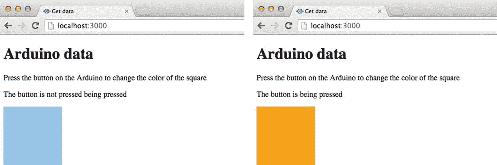
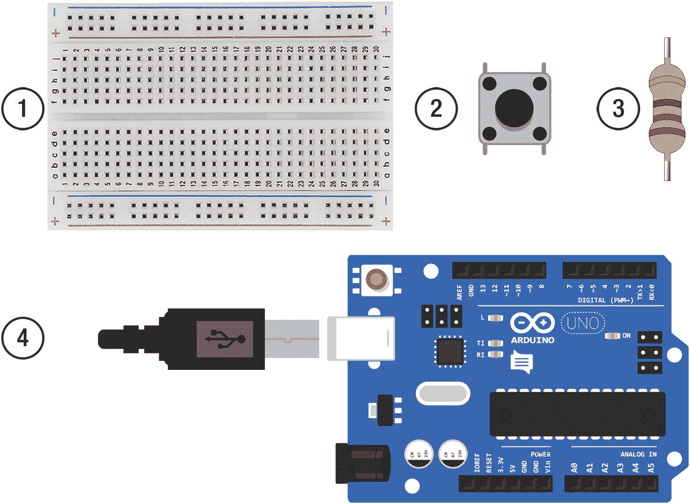
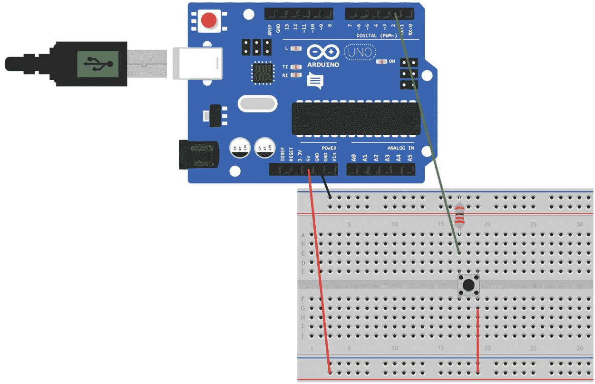
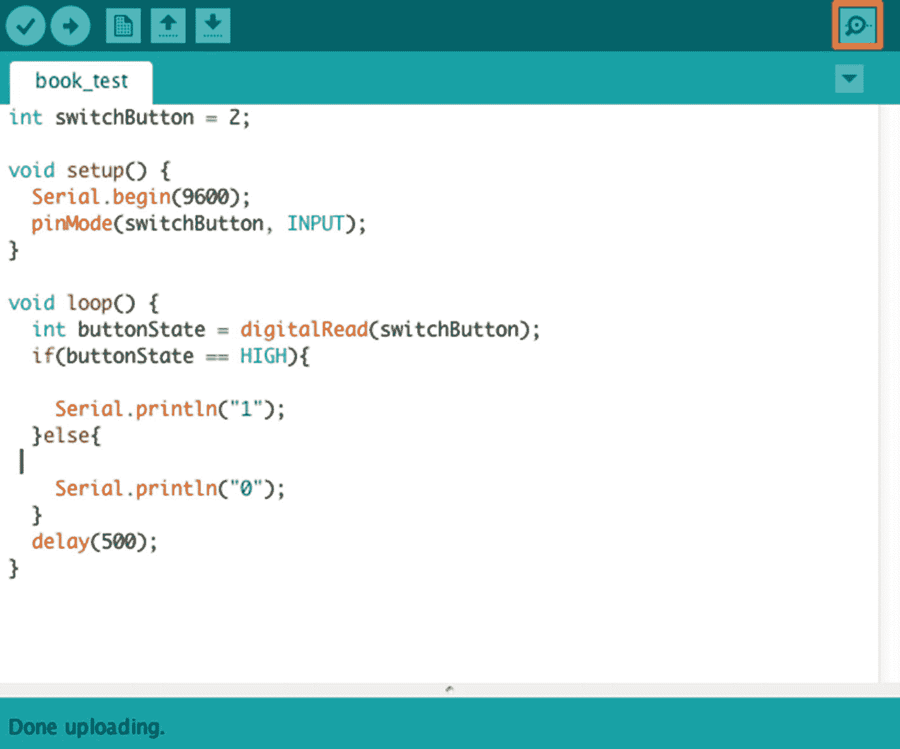
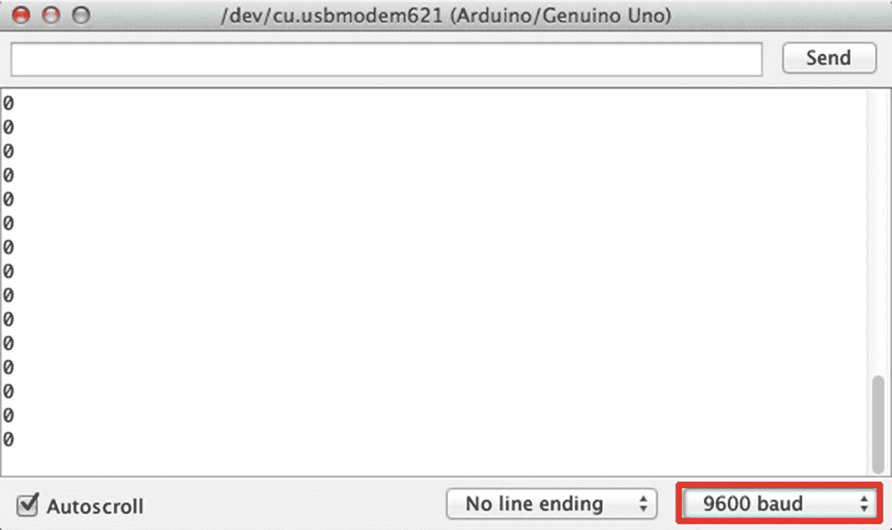

# 3.Arduino 到前端部分 I

在第 [2](02.html) 章中，你学习了如何用 Node.js 创建一个 web 服务器，并使用它向网页发送数据。在本章中，您将开始从 Arduino 向 Node.js 服务器发送数据，并在网页上使用这些数据。

数据将来自连接到 Arduino 的开关按钮，并通过串行端口进入您的计算机。您可以将这些数据导入 Node.js 服务器并在网页上使用。本章结束时，您将拥有一个带有彩色方块的网页，每次按下 Arduino 按钮，方块都会改变颜色。图 [3-1](#Fig1) 是你在本章结束时所做的一个例子。



图 3-1

Two possible outcomes of the exercise in Chapter [3](03.html)

## 串行端口介绍

串行端口将数据一个接一个地以单个位的形式传入和传出计算机。一个位的值可以是 0(低/关/假)或 1(高/开/真)。这些位可以连接在一起传输更复杂的数据，不同的位数有不同的名称。八位是一个字节，一千字节(KB)是 1024 字节(1024 x 8 位)，一兆字节(MB)是 1024 千字节。由于这些位只能是 0 或 1，所以它们被称为二进制数据。

使用 Arduino，您可以通过 USB 端口在电脑上来回发送串行数据。每个 Arduino 都有一个串口，有的不止一个。Arduino Uno 使用 RX(引脚 0)和 TX(引脚 1)进行通信。如果使用串行接口，则不能将任何东西连接到管脚 0 和 1。Arduino IDE 有一个内置的串行监视器来查看串行数据。

当您将 Arduino 连接到电脑时，它将连接到电脑的一个串行端口。您需要知道它连接到哪个端口，因为您需要在 Node.js 应用程序中引用它。

### 查找串行端口

在 Mac 和 Windows PC 上，串行端口号看起来略有不同。在 Mac 上，它看起来像这样:/dev/tty。 <type of="" input="" and="" port="" number="">or /dev/cu。<type of="" input="" and="" port="" number="">。在 Windows 中，它看起来会像这样:COM <port number="">。</port></type></type>

有多种方法可以找到 Arduino 连接的串行端口:

1.  连接 Arduino 后，打开 Arduino IDE。在菜单中单击工具菜单，然后将鼠标悬停在端口菜单上；您将看到所有设备都连接到串行端口，Arduino 的串行端口看起来像这样:/dev/tty . USB modem<port number="">(Arduino/Uno)在 Mac 上，它看起来像 COM <port number="">。</port></port>
2.  在 Mac 上，打开终端窗口，键入 ls /dev/tty.usbmodem*。您应该得到类似/dev/tty.usbmodem <port number="">的输出。</port>
3.  在 PC 上，打开设备管理器并打开端口(COM & LPT)菜单，您应该会看到类似 Arduino Uno COM <port number="">的内容。</port>

## 串行数据和 Arduino

有许多功能可以帮助您在 Arduino 之间传输串行数据。他们使用一个叫做串行的库。表 [3-1](#Tab1) 显示了库中可用的一些功能。

表 3-1

Arduino serial functions

<colgroup><col align="left"> <col align="left"></colgroup> 
| 命令 | 结果 |
| :-- | :-- |
| `Serial.begin(9600)` | begin 函数设置串行数据的传输速率；它以每秒的位数来衡量，称为波特率。 |
| `Serial.end()` | 表示串行通信结束，并释放引脚 RX 和 TX，以便用于其它输入和输出。 |
| `Serial.write()` | 将二进制数据写入串行端口。 |
| `Serial.println()` | 打印出串行数据。 |

### 波特率

波特率设置通过串行端口传输数据的速率。它是以每秒位数来衡量的。Arduino 可以使用的速率有 300、600、1200、2400、4800、9600、14400、19200、28800、38400、57600 或 115200。您可以设置的波特率的最大速度取决于您的设备。如果设备不能处理更高的速度，那么一些数据将不会被注册，您将会丢失数据。速率 9600 是 Arduino 的常用波特率。

Setting Up The Arduino Circuit

在本章中，您将把一个开关按钮连接到一个 Arduino，并使用串行功能来确定按钮是否被按下。

本章中 Arduino 的设置将使用 Arduino Uno、试验板、开关按钮、220 欧姆电阻器和跳线。图 [3-2](#Fig2) 显示了您需要的套件。



图 3-2

1\. Breadboard, 2\. Switch button, 3\. 220 ohm resistor, 4\. Arduino

一旦你准备好了工具包，你需要如图 [3-3](#Fig3) 所示进行设置，并将其连接到你电脑上的 USB 端口。连接组件时，请确保 Arduino 没有连接到电脑或任何其他电源。



图 3-3

The circuit setup Write The Arduino Code

当 Arduino 连接到电脑时，打开 Arduino IDE。在 IDE 中有两件事情需要设置:连接的板的类型和它连接的端口。以下是 IDE 的设置:

1.  在 Arduino IDE 菜单中，选择工具/电路板，然后选择 Arduino/Genuino Uno。
2.  在工具/端口菜单中选择 Arduino 连接的端口，它会显示类似于 PC 上的 COM3 (Arduino/Genuino Uno)或 Mac 上的/dev/Cu . USB modem 621(Arduino/genu ino Uno)的内容。

然后选择文件/新建打开一个新文件。将文件另存为 chapter_3。复制清单 [3-1](#Par20) 中的代码。

```js
    int switchButton = 2;
    void setup() {
        Serial.begin(9600);
        pinMode(switchButton, INPUT);
    }
    void loop() {
        int buttonState = digitalRead(switchButton);
        if(buttonState == HIGH){
        Serial.println("1");
    }else{
        Serial.println("0");
    }
        delay(500);
    }
Listing 3-1chapter_3 code

```

代码解释

表 [3-2](#Tab2) 描述了清单 [3-1](#Par20) 中的代码。

表 3-2

chapter_3.ino code explained

<colgroup><col align="left"> <col align="left"></colgroup> 
| `int switchButton = 2;` | 这段代码创建了一个变量来保存输入到 Arduino 中的开关数。在 Arduino 上，它连接到数字引脚 2。 |
| `Serial.begin(9600);` | 该功能设置数据传输的波特率。 |
| `pinMode(switchButton, INPUT);` | pinMode 是一个为引脚设置模式的功能，INPUT 是默认设置，用于接收数据。它被传递给保存数字 pin 号的 switchButton 变量。 |
| `int buttonState = digitalRead(switchButton);` | 变量 buttonState 保存来自按钮所连接的数字引脚 2 的数据。如果按钮被按下，它将为高电平，否则为低电平。 |
| `if(buttonState == HIGH){` `Serial.println("1");` `}else{` `Serial.println("0")` `;` | if 语句检查 buttonState 是否为高。如果是，按钮被按下，Serial.println 将向串行端口发送“1”。如果不是，else 语句将改为发送“0”。 |
| `delay(500);and` | 由于代码处于循环中，您可以延迟循环的再次开始。如果不这样做，代码可能在循环再次开始之前还没有执行完，您可能会丢失数据。延迟函数使用毫秒，500 是半秒。你需要在延迟中找到平衡点；你不想丢失数据，但如果你让延迟太长，你可能会错过按钮被按下。 |

Run The Arduino Code

单击勾号图标检查代码是否正确，然后单击箭头图标将代码发送到 Arduino。

代码上传后，在 IDE 中单击打开串行监视器；在图 [3-4](#Fig4) 中以红色显示。



图 3-4

How to open the serial port monitor

您应该开始在串行端口窗口中看到数据。它可能不是你期望看到的 0 或 1，但如果串行端口监视器中的波特率与代码中的波特率不匹配，就会发生这种情况。图 [3-5](#Fig5) 显示了可以在串行端口窗口中更改的位置。转到此下拉菜单，将比率更改为 9600。当按钮被按下时，你应该看到一系列的 1 被打印出来；否则输出应该是 0。



图 3-5

The drop-down changes the baud rate.

注意在使用使用串行端口的 web 应用程序之前，您需要关闭 Arduino IDE 中的串行端口监视器。如果不这样做，您将得到一个错误消息，说明端口已经在使用中。

## 使用前端的数据

现在您可以在 Arduino 中看到串行数据，下一步是将它发送到 Node.js 服务器，以便可以在 web 浏览器上显示。本章中的 Node.js 应用程序将从 Arduino 接收数据，并使用 Socket.io 将数据传递到前端。

### 串行端口库

您将导入的库之一是 SerialPort 库。这个库允许你通过串口从 Arduino 导入数据到 Node.js。

要使用 Node.js 中的库打开一个端口，您需要包含库的路径并创建一个新的 port 对象。

来自串行端口库的数据是一个缓冲区对象。缓冲区对象是通过串行端口进入的位流(二进制数据)。JavaScript 不能很好地处理二进制数据。SerialPort 有一个 readLine 解析器，可以将二进制数据转换成字符串。代码如下所示:

```js
serialport.parsers.readline("\n")

```

“\n”是在 JavaScript 中创建新行的方式。readLine 将二进制数据转换成文本行。当它看到换行符时，它知道这是当前数据流的结尾，因此它分离不同的数据流。

串行端口库中有许多函数，但我们将在本书中使用其中的几个。您可以在附录 b 中找到关于 SerialPort 库的更多信息。

### 下载串行端口库

您将使用 npm 来安装串行端口库。在 PC 上，在使用 npm 安装 SerialPort 之前，您需要下载几个其他的包。在 Mac 上，你将能够下载它，而不需要任何额外的库，所以你不需要做以下步骤。

如果您使用的是 PC，请按照以下步骤下载 SerialPort 库所需的支持库。

1.  首先，安装 node-gyp，因为它用于编译 Node.js 中的本机附加模块。你可以在 [`https://github.com/nodejs/node-gyp#installation`](https://github.com/nodejs/node-gyp#installation) 找到更多信息。
2.  还需要安装额外的 windows 构建工具。这些必须安装在以管理模式运行的控制台窗口中。通过右键单击 Windows 菜单并选择 CMD.exe(以管理员身份运行)或在搜索栏中键入来打开 CMD.exe。在控制台中键入 NPM install-g-production windows-build-tools。您可以在 [`https://github.com/felixrieseberg/windows-build-tools`](https://github.com/felixrieseberg/windows-build-tools) 了解更多关于工具的信息；安装可能需要几分钟时间。

Create a Node.js Application

本章的目录结构如下:

```js
/chapter_03
    /node_modules
    /views
        index.ejs
    index.js
    package.json

```

首先要为本章创建一个新的 Node.js 应用程序，并安装必要的库。

1.  创建一个新文件夹来存放应用程序。我把我的叫做 chapter_03。
2.  打开命令提示符(Windows 操作系统)或终端窗口(Mac)并导航到新创建的文件夹。
3.  当你在正确的目录键入 npm init 创建一个新的应用程序；您可以按下 return 键浏览每个问题，或者对它们进行更改。
4.  您现在可以开始添加必要的库；要在命令行中下载 Express.js，请键入 NPM install express @ 4 . 15 . 3–save。
5.  然后安装 ejs，键入 NPM install ejs @ 2 . 5 . 6–save。
6.  下载完成后，安装串口。在 Mac 上键入 NPM install serial port @ 4 . 0 . 7-save 在 Windows PC 上键入 NPM install serial port @ 4 . 0 . 7-build-from-source。
7.  然后最后安装 socket.io，输入 NPM install socket . io @ 1 . 7 . 3–save。

如果查看 package.json 文件，您应该会看到以下依赖项:

```js
"dependencies": {
    "ejs": "^2.5.6",
    "express": "^4.15.3",
    "serialport": "^4.0.7",
    "socket.io": "^1.7.3"
}

```

现在，您可以为应用程序编写代码了。在 chapter_03 文件夹的根目录下创建一个名为 index.js 的文件，复制清单 [3-2](#Par52) 中的代码。

注意在本书中，您将使用 index.js 中的串行端口库。您需要在 index.js 中添加一个对 Arduino 所连接的串行端口的引用。在 Mac 上显示<add in="" the="" serial="" port="" for="" your="" arduino="">的代码中，将其更改为“/dev/tty.usbmodem <port number="">”，在 PC 上将其更改为“COM <port number="">”。您需要保留“”并删除< >符号</port></port></add>

```js
    var http = require('http');
    var express = require('express');
    var app = express();
    var server = http.createServer(app);
    var io = require('socket.io')(server);
    var SerialPort = require('serialport');
    var serialport = new SerialPort('<add in the serial port    
    for your Arduino>', {
            parser: SerialPort.parsers.readline('\n')
    });
    app.engine('ejs', require('ejs').__express);
    app.set('view engine', 'ejs');
    app.get('/', function (req, res){
        res.render('index');
    });
    serialport.on('open', function(){
        console.log('serial port opened');
    });
    io.on('connection', function(socket){
        console.log('socket.io connection');
        serialport.on('data', function(data){
            data = data.trim();
            socket.emit('data', data);
        });
        socket.on('disconnect', function(){
            console.log('disconnected');
        });
    });
    server.listen(3000, function(){
        console.log('listening on port 3000...');
    });
Listing 3-2index.js code

```

记得添加你正在使用的串行端口。如果您现在运行这段代码，将会出现错误。它引用了一个尚未创建的 index.ejs 文件。

代码解释

表 [3-3](#Tab3) 描述了清单 [3-2](#Par52) 中的代码。

表 3-3

index.js explained

<colgroup><col align="left"> <col align="left"></colgroup> 
| `var SerialPort = require('serialport');` | 这会将 SerialPort 库引入 Node.js 应用程序，并将其存储为一个变量。 |
| `var serialport = new SerialPort('<serial port>'` | 该代码创建一个新的串行端口对象。您需要在< >之间添加 Arduino 所连接的串行端口。在 Mac 上它应该看起来像/dev/tty.usbmodem <port number="">，在 PC 上它应该看起来像 COM <port number="">。</port></port> |
| `{``parser: SerialPort.parsers.readline('\n')`T2】 | 使用 readline 对数据进行解析，' \n '会创建一个新行来分隔每行数据。 |
| `serialport.on('open', function(){` | 当端口打开时，将发出 open 事件。当串行端口打开时，您可以指定事件，在代码中有一个控制台日志，这样您就可以知道它是否已经打开。 |
| `serialport.on('data', function(data){` | 数据事件开始监视新数据，并将函数传递给新数据。 |
| `data = data.trim();` | 该函数允许您访问新数据，但首先需要删除字符前后的任何空白。 |
| `socket.emit('data', data);` | 使用 socket.io 函数 emit 将数据传递到前端；它的引用 id 为“数据”。 |

Interacting With A Web Page

来自 Arduino 的数据将用于更新网页。每次按下按钮，方块的颜色都会改变。一个变量将跟踪从 Arduino 发送的当前数据。当新数据进入页面时，有一个 JavaScript 函数检查新数据是否与当前数据不同。

如果是，并且数据是字符串“1”，那么该函数将从颜色列表数组中随机选取一个元素。然后更新方块的颜色。它还更新一段文本和当前变量，因此新数据成为当前数据。

如果新数据为“0 ”,正方形的颜色不会改变，但一段文本会更新。当前变量将再次用新数据更新。

您现在需要在 views 文件夹中创建一个 index.ejs 文件；首先在应用程序的根目录下创建一个 views 文件夹，然后在其中创建一个名为 index.ejs 的文件。将清单 [3-3](#Par60) 中的代码复制到 index.ejs 文件中。

```js
<!DOCTYPE html>
<html>
    <head>
        <meta charset="UTF-8">
        <title>Get data</title>
    </head>
    <body>
        <h1>Arduino data</h1>
        <p>Press the button on the Arduino to change the  
        color of the square</p>
        <p>The button is <span id="button-state"></span> </p>

        <svg width="120" height="120" viewBox="0 0 120
        120">
            <rect id="change-color"
             fill="LightSkyBlue"
             width="120"
             height="120"
             />
        </svg>
        <script src="/socket.io/socket.io.js"></script>
        <script>
            var socket = io();
            var current = "0";
            var shape = document.getElementById('change-color');
            var buttonState =
            document.getElementById('button-state');
            var colorArray = ["LightSkyBlue",
            "LightSlateGray","DarkOliveGreen", "orange",
            "DarkRed", "gold", “purple”];

            socket.on("data", function(data){
                if(data === "1"){
                    buttonState.innerHTML = "pressed";
                    if(data !== current){
                        var newColor = colorArray[Math.floor(Math.random()*colorArray.length)];
                        shape.style.fill = newColor;
                    }

                } else{
                    buttonState.innerHTML = "not pressed";
                }
                current = data;
            });
        </script>
    </body>
</html>

Listing 3-3index.ejs code

```

现在，在控制台窗口中，导航到应用程序的路径，并键入 nodemon index.js 或 node index.js 来启动应用程序。打开浏览器并转到 http://localhost:3000/查看应用程序的运行情况。

每次按下按钮，矩形的颜色都会改变。由于数组中的颜色是随机选取的，因此它可能会选取与当前颜色相同的颜色。如果您想确保矩形改变颜色，您可以为当前颜色创建一个变量，并检查新颜色是否不同。

代码解释

表 [3-4](#Tab4) 描述了清单 [3-3](#Par60) 中的代码。

表 3-4

index.ejs explained

<colgroup><col align="left"> <col align="left"></colgroup> 
| `<svg width="120" height="120" viewBox="0 0 120 120">` | 这将创建一个具有宽度、高度和颜色的可缩放矢量图形(SVG)正方形。在第 [4](04.html) 章中会有关于 SVG 的细节。 |
| `var current = "0";` | 这将创建一个保存串行数据当前值的变量。该变量将用于检查来自串行端口的数据是否已经改变。 |
| `var shape = document.getElementById('change-color');` | Shape 是一个保存对 SVG 矩形的引用的变量。该变量用于更新矩形的颜色。它使用 SVG 的 id 找到它。 |
| `var buttonState = document.getElementById('button-state');` | buttonState 是保存对 span 元素的引用的变量。它通过 id 查找元素，并更新其中的文本。 |
| `var colorArray = ["LightSkyBlue", "LightSlateGray","DarkOliveGreen", "orange", "DarkRed", "gold", "purple"];` | 变量 colorArray 包含不同颜色名称的数组。 |
| `socket.on("data", function(data){` | socket.on 函数正在侦听来自 socket.emit 的数据，其 id 为“data ”,并将传入的数据传递给一个函数。 |
| `if(data === "1"){` | if 语句检查新数据是否是字符串“1”如果是，则网页上的文本发生变化，并调用另一个 If 语句。 |
| `if(data !== "current"){` | 该 if 语句检查新数据是否与。==，不等于)当前数据。如果不相同，它执行语句中的代码。 |
| `var newColor = colorArray[Math.floor(Math.random()` `*colorArray.length)];` | 这段代码从 colorArray 中选择一种颜色。JavaScript Math.random()函数用于在 0 和数组中的元素数之间选择一个随机数。它乘以数组的长度，所以它只选择数组长度内的一个数。 |
| `shape.style.fill = newColor;` | 使用变量 shape，SVG 的填充样式被更改为新的颜色。 |
| `else{``buttonState.innerHTML = "not pressed";`T2】 | 如果新数据的值不是“1”，那么带有 id 按钮状态的 span 的 HTML 将更改为字符串“未按下” |
| `current = data;` | 保存当前数据值的变量需要用新数据的值来更新。 |

## 摘要

您现在应该有一个工作应用程序，当您按下 Arduino 上的按钮时，它的网页会更新。这一章中有很多新概念，第 4 章将更详细地介绍这些概念。