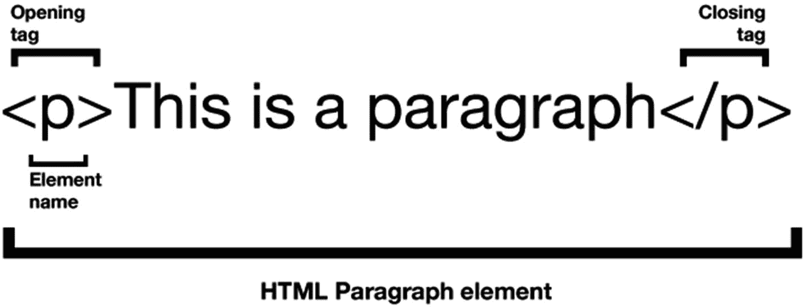
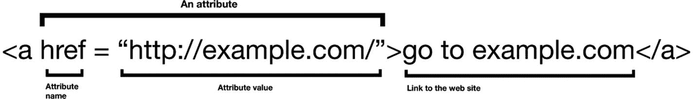
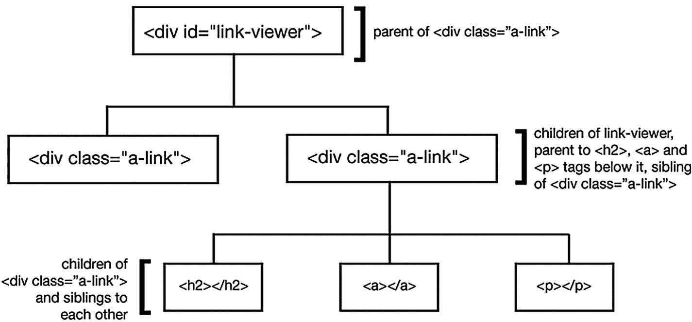
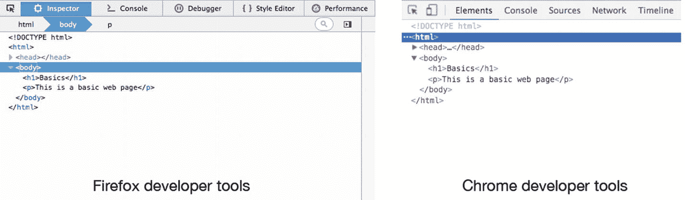
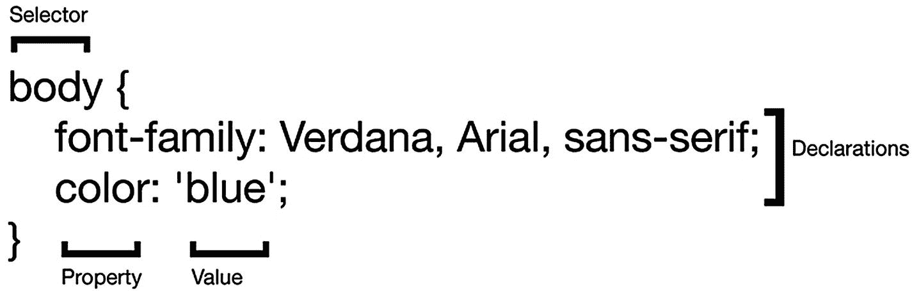
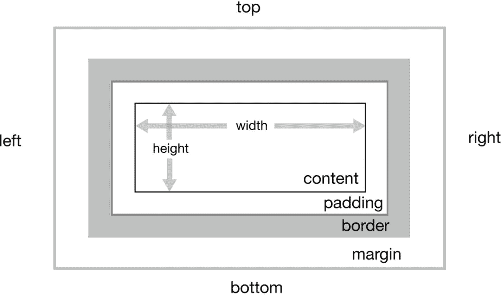
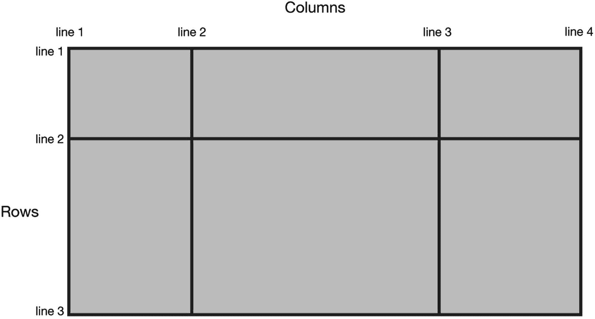
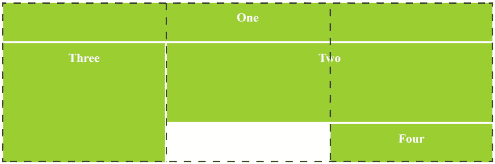
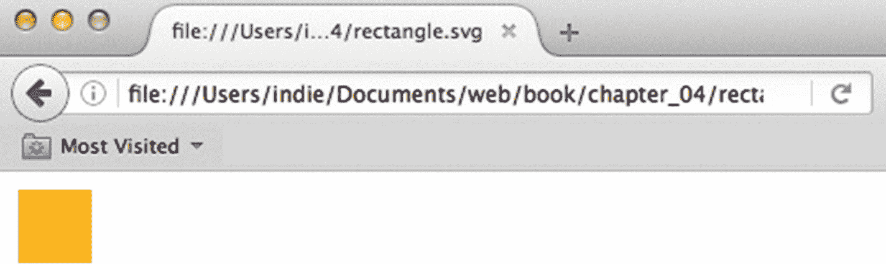

# 四、创建 Web 内容简介

在继续之前，理解超文本标记语言(HTML)、级联样式表(CSS)、可缩放矢量图形(SVG)和 JavaScript 是有好处的。这四个概念将贯穿全书，用于创建交互式 web 应用程序、处理数据以及向 Arduino 发送数据和从 Arduino 接收数据。如果你对其中一些领域有信心，就直接跳到你想了解更多的部分。如果你对所有这些科目都感到满意，请跳到第五章。

## 超文本标记语言

超文本标记语言(HTML)用于在网页上创建内容。如果您创建一个扩展名为. txt 的文件，它可以像许多其他文件类型一样在 web 浏览器中打开，那么您不需要 HTML 来创建内容。使用 HTML 的原因是它提供了你的页面结构。它允许您定义标题和段落，在页面上创建不同的内容块，以及放置图像。结构由 HTML 元素组成；这些元素可以用 CSS 样式化，并与 JavaScript 和 CSS 交互。图 4-1 显示了一个 HTML 段落元素的格式。



图 4-1

The structure of a paragraph element

### HTML 元素

HTML 元素通常由开始和结束标记组成。开始标记包含对元素类型的引用和元素的属性。

HTML 中的元素通常是块元素或行内元素。块元素在页面上一个接一个:例如，标题和段落。内联元素在块内工作并格式化元素。

#### 块状元素

有各种各样的块元素可用。表 4-1 列出了其中的一些。

表 4-1

Some HTML block elements

<colgroup><col align="left"> <col align="left"></colgroup> 
| 命令 | 结果 |
| :-- | :-- |
| `<h1></h1>, <h2></h2>, <h3></h3>, <h4></h4>, <h5></h5>, <h6></h6>` | 这些用于创建标题；数字越小，标题越重要。 |
| `<p></p>` | 段落元素用于创建文本段落， |
| `<ul>``<li>Orange</li>``<li>Melon</li>` | 标签创建了一个无序的元素列表；*   Element is a list item in the list. |
| `<ol>``<li>Orange</li>``<li>Melon</li>` | 一个

 |
| `<div></div>` | div 标签创建一个元素，它是其他元素的容器。它用于定义内容块。 |

#### 内嵌元素

表 4-2 列出了一些 HTML 中可用的行内元素。

表 4-2

Some HTML inline elements

<colgroup><col align="left"> <col align="left"></colgroup> 
| 命令 | 结果 |
| :-- | :-- |
| `<span></span>` | Span 本身不会改变它所环绕的文本，但是 CSS 或 JavaScript 可以使用它来选择一段文本。 |
| `<i></i>` | 将环绕的文本设为斜体。 |
| `<b></b>` | 用于使文本加粗。 |
| `<u></u>` | 给文本加下划线， |
| `<br>` | 此元素创建一个换行符；它没有结束标记。 |
| `<a></a>` | 这是一个锚元素，用于创建指向另一个页面的 URL 链接；它还包含另一个页面的 URL。 |
| `` | 这是用于向网页添加图像的标记；它没有结束标签，但是需要一个图像的源路径。 |

Basic HTML Page Structure

所有的网页都有一个基本的结构。

在文本编辑器中，创建一个名为 structure.html 的新 HTML 文件，并复制清单 4-1 中的 HTML。

```js
    <!DOCTYPE html>
    <html>
        <head>
            <title>A basic web page</title>
         <meta charset="utf-8">

        </head>
        <body>
            <h1>Basics</h1>
            <p>This is a basic web page</p>
        </body>
     </html>

Listing 4-1structure.html

```

HTML 解释道

清单 4-1 展示了一个网页的基本结构。文档的类型在顶部声明，然后内容被包装在一个 HTML 元素中。表 4-3 解释了清单 4-1 中的一些元素。

表 4-3

structure.html

<colgroup><col align="left"> <col align="left"></colgroup> 
| `<!DOCTYPE html>` | 这应该是任何或您的 HTML 文件的开头；它让浏览器知道它正在读取 HTML。 |
| `<html></html>` | 这是 html 元素，它包含了你的网页的所有内容。 |
| `<head></head>` | head 元素包含关于页面的信息，但是它的内容不会出现在页面上。它可以保存关于页面的元数据，比如字符编码，或者保存到 JavaScript 库和 CSS 文件的链接。 |
| `<title>A basic web page</title>` | 此元素保存将出现在 web 浏览器选项卡中的文本。 |
| `<meta charset="uft-8">` | 这告诉浏览器应该为页面使用什么样的字符编码。 |
| `<body></body>` | 这个元素保存网页的内容，即屏幕上显示的内容。 |

您可以在 web 浏览器中打开该页面，方法是从 web 浏览器的菜单中选择“文件”“➤”“打开文件”,然后导航到 structure.html，您将看到一个基本的网页。

### HTML 属性

HTML 属性是向元素添加附加信息的一种方式。它们被添加到元素的开始标记中。它们通常是一个键值对，格式为“属性名”=“值”一个例子是链接属性；如果您想创建一个从您的网页到另一个网站的链接，您可以使用 anchor 标记，并在这个标记中添加一个带有其他网站的 URL 值的属性。图 4-2 显示了锚元素的属性。



图 4-2

A link attribute

打开您创建的 structure.html 文件，将下面一行添加到 HTML 的正文中:

```js
<a href = "http://example.com/">go to example.com</a>

```

当你刷新页面时，你会看到一个到 example.com 的链接。

Note

属性值中不能有空格，但可以有下划线或破折号。

您会经常用到的两个属性是 ID 和 class。这两个属性都允许您为元素创建标识符。该标识符可用于选择 CSS 和 JavaScript 中的元素。

#### ID 属性

你可以给任何 HTML 元素一个 ID。ID 是该元素的唯一标识符。因为它是唯一的标识符，所以只能在一个页面上使用一次。这是一个具有 ID 的段落元素的示例:

```js
<p id="first_paragraph">This is the text of the first paragraph on a page</p>

```

#### 类别属性

类属性也是元素的标识符，但不同于 ID，因为它可以添加到页面上的多个元素中。这意味着您可以选择具有相同类的所有元素，并对它们进行更改。这是一个带有类的段落元素的示例:

```js
<p class="first_paragraph">This is the text of the first paragraph on a page</p>

```

### 嵌套元素

当你创建一个网页的时候，你会把元素放在元素里面，元素可以放在其他元素里面；这些是嵌套元素。

#### 父元素、子元素和同级元素

HTML 有一个由父元素、子元素和兄弟元素组成的树状结构。子元素从其父元素继承一些样式属性，但也可以覆盖这些属性。以下 HTML 显示了嵌套元素:

```js
    <!DOCTYPE html>
    <html>
        <head>
            <title>A basic web page</title>
            <meta charset="utf-8">
        </head>
        <body>
            <h1>Basics</h1>
            <p>This is a basic web page</p>
            <div id="link-viewer">
                <div class="a-link">
                    <h2>a new link</h2>
                <a href = "http://example.com/">go to example.com</a>
                <p>This is an example web page</p>
            </div>
            <div class="a-link">
                 <h2>a new link</h2>
                 <a href = "http://example.com/">go to example.com</a>
                 <p>This is an example web page</p>
            </div>
        </div>
    </body>
</html>

```

图 4-3 描述了不同元素之间的系列链接。



图 4-3

The family of the div “link-viewer”

### 文档对象模型

当浏览器显示网页时，它已经将 HTML 和 CSS 转换为文档对象模型(DOM)。浏览器首先读入并解析 HTML，然后创建一个树状结构的节点来表示元素。然后它解析 CSS 并将相关的 CSS 组合到 DOM 中的元素。然后，浏览器使用 DOM 创建网页。

#### 浏览器开发工具

大多数浏览器都有帮助开发人员查看页面和调试代码的工具。在 Firefox 和 Chrome 中，你可以在 Mac 上通过按 option + command + i 和 Ctrl + shift + i 打开它们。

尝试在 Firefox 或 Chrome 中打开 structure.html。打开开发者工具；在 Firefox 中点击 Inspector 标签，在 Chrome 中点击 Elements 标签——你可以看到网页的结构。您可以在工具中编辑 CSS 和 HTML，并立即查看更改是如何进行的。当您刷新页面时，它将返回到 HTML 的保存版本。图 4-4 显示了 Firefox 和 Chrome 中开发者工具的标签。



图 4-4

Developer tools in Firefox and Chrome Note

可以用`<!-- -->`注释掉 HTML。那些括号内的任何内容都不会出现在页面上。

在大多数文本编辑器中，如果你在一行代码上按下 Ctrl + /键，它会对你的代码进行注释或取消注释。

## 半铸钢ˌ钢性铸铁(Cast Semi-Steel)

级联样式表(CSS)用于定义网页的外观，并设置页面的布局和样式。这意味着内容(HTML)和样式(CSS)是分离的。有了 CSS，同样的 HTML 看起来会有很大的不同，而没有 CSS 就非常简单。

CSS 还允许您创建动态布局，该布局根据查看页面的设备而变化。这些响应式布局改变 HTML 元素的大小和位置，使它们适合查看者在任何设备上看到它们。

CSS 通过使用标记名或元素的属性来改变网页上元素的样式；它可以挂在这些上面，并为它们附加一个样式。HTML 元素的挂钩叫做选择器。CSS 由规则组成。图 4-5 显示了 HTML body 元素的 CSS 规则的构造。



图 4-5

A CSS rule

大多数浏览器会为 HTML 元素实现一些样式，这些样式会被你的 CSS 覆盖。

Add CSS To HTML

在同一个文件夹中创建两个新文件:一个名为 styles.css，一个名为 styles.css。在 styles.css，复制清单 4-2 中的 HTML。

```js
<!DOCTYPE html>
    <html>
         <head>
            <title>starting CSS</title>
            <meta charset="utf-8">
            <link rel="stylesheet" type="text/css" href="styles.css">
        </head>
        <body>
            <h1>Using CSS</h1>
            <p>This paragraph text will is styled with CSS so that it is blue.</p>
        </body>
    </html>

Listing 4-2styles.html

```

接下来，在 styles.css 中复制清单 4-3 中的代码。

```js
    body{
        font-family: Verdana, Arial, sans-serif;
    }
    h1{
        color: green;
        border: black solid 1px;
    }

    p{
        color: blue;
    }

Listing 4-3styles.css

```

在网页浏览器中打开 styles.html，你会看到 CSS 对 HTML 内容的影响。

您可以在 HTML 的头部编写 CSS，但是创建一个单独的文件并将其链接到 HTML 页面是一个很好的做法。

代码解释表 4-4 解释了 styles.css 和 styles.css

表 4-4

styles.html and styles CSS explained

<colgroup><col align="left"> <col align="left"></colgroup> 
| `<link rel="stylesheet" type="text/css" href="styles.css">` | 标签用来将 CSS 导入到 HTML 文件中。属性 href 有一个 CSS 文件的路径值。 |
| `body{``font-family: Verdana, Arial, sans-serif;` | 为 HTML 页面的主体创建 CSS is 规则。字体系列声明列出了您希望页面使用的字体。如果浏览器没有字体，它将尝试列表中的下一种。 |
| `{``parser: SerialPort.  parsers.readline('\n')` | 使用 readline 解析数据，并且“\n”创建一个新行来分隔每行数据。 |
| `h1{``color: green;``border: black solid 1px;` | 为 H1 元素创建 CSS 规则。有两个声明；color 更改字体颜色，border 在元素周围创建边框。 |
| `p{``color: blue;` | 为 p 元素创建一个 CSS 规则，将字体颜色改为蓝色。 |

### CSS 选择器

在 CSS 选择器中，选择 HTML 页面上的一个或多个元素。有不同类型的选择器。

#### 类型选择器

这些选择器将选择页面上具有相同标签名称的任何 HTML 元素。例如，h1 标记的选择器是:

```js
h1{
    background-color: orange;
}

```

#### 类别选择器

您可以使用 HTML 元素类名作为选择器。类选择器使用元素的类名和句点(。)在它之前；例如，以下规则将选择 HTML 页面上具有类 chosenElement 的所有元素:

```js
.chosenElement{
    background-color: orange;
}

```

#### ID 选择器

您可以使用 HTML 元素 ID 作为选择器。ID 选择器使用前面带有哈希(#)的元素的 ID；例如，以下规则将选择 HTML 页面上 ID 为 chosenElement 的元素:

```js
#chosenElement{
    background-color: orange;
}

```

#### 属性选择器

您可以通过关键字或关键字和值来选择 HTML 属性。下面的示例显示了正在设置样式的锚点标记的 href 属性:

```js
      a[href]{
        background-color: orange;
      }

```

#### 通用选择器

通用选择器是一个星号(*)，可以放在任何选择器之前，匹配该类型的任何元素；它可以在你的 CSS 开始时作为一个简单的 CSS 规则重置。

```js
*{
    margin: 0;
    padding: 0;
}

```

选择器为您提供了大量的控制:在一个 CSS 规则中可以有多个选择器，并且可以选择子元素、同级元素和特定嵌套位置的元素。

这可能会与附加了多种样式的元素混淆。CSS 中的层叠实现了许多规则，让您可以控制什么元素有什么样式。

### 级联规则

当您有嵌套元素时，一个样式附加到上面的元素，并将向下级联到下面的元素。决定将哪种样式应用于元素取决于一组三个规则:重要性、特异性和源顺序。重要性将战胜特异性和来源顺序，特异性将战胜来源顺序。

#### 特征

专一性看一个选择器有多专一。ID 比类更具体，因为 ID 是唯一的。一个类比一个标签名更具体。

#### 重要

在 CSS 中！重要的可以加在声明的末尾；例如:

```js
color: orange !important;

```

它将覆盖应用于元素的任何其他颜色规则。如果你和 CSS 有冲突，最好不要使用！重要；只有当样式不能以任何其他方式覆盖时，才在真正必要的时候使用它。

#### 来源订单

在样式表中，你可能有同样重要和特殊的选择器；如果是这种情况，样式表中后面的规则将生效。

### 盒子模型

CSS 盒子模型形成了页面的布局。页面上的所有元素看起来都有一个方框。盒子模型由内容、填充、边框和边距组成。图 4-6 为箱体模型。



图 4-6

The CSS box model Note

浏览器以不同的速率采用 CSS 规则和 JavaScript。在 caniuse.com 上，你可以查看哪些浏览器支持你想要使用的 CSS 或 JavaScript。

### 显示布局

有几种类型的显示布局；这些决定了 HTML 元素在网页上相对于其他元素的位置。块布局和内联布局在本章前面已经解释过了。其他包括位置、浮动、内嵌块、Flexbox 和 CSS 网格。

Flexbox 和 CSS grid 是新的，克服了 CSS 布局的许多问题。由于它们是新的，旧的浏览器不支持它们，虽然它们的规则可能会改变，但基本概念不会改变。

网页现在可以在不同大小的不同设备上浏览。当 CSS 第一次被引入时，网页被设计成在计算机屏幕上浏览。可能会有一些不同的尺寸，但没有今天这么多。随着移动设备变得越来越流行，web 开发人员开始为 web 页面创建响应式设计，以便可以根据查看页面的设备的大小和方向来调整相同内容的大小和位置。Flexbox 和 CSS grid 是使 web 内容更加灵活的模块。

CSS 网格有利于布局整个页面；您可以使用它们来创建行和列。Flexbox 非常适合对齐元素块中的内容，如果您只处理列或行。

### flex box(flex box)的缩写形式

Flexbox 是在 CSS3 中引入的，目前处于候选人推荐阶段。当对齐元素、排序元素、调整元素大小和定向元素时，它允许布局中的灵活性。

Flexbox 是一个模块，而不是一个 CSS 属性。模块的一些属性是为父容器设计的，而另一些是为子元素设计的。使用 Flexbox，您可以拥有 flex 容器和 flex 项目。

Using Flexbox

创建一个名为 flex.html 的 HTML 文件，并复制清单 4-4 中的代码。

```js
<!DOCTYPE html>
<html>
<head>
    <style>
        .container {
          display: flex;
          justify-content: space-between;
          flex-direction: row;

        }
        .item {
          background: YellowGreen;
          width: 200px;
          height: 220px;
          margin-top: 10px;
          line-height: 220px;
          color: white;
          font-weight: bold;
          font-size: 32px;
          text-align: center;
          list-style: none;
        }
    </style>

</head>

<body>
    <ul class="container">
      <li class="item">box 1</li>
      <li class="item">box 2</li>
      <li class="item">box 3</li>
    </ul>

</body>
</html>

Listing 4-4flex.html

```

在 web 浏览器中打开“flex.html ”,尝试将“内容对齐”属性更改为“居中”、“伸缩起点”、“伸缩终点”和“环绕空格”,每次刷新页面并查看差异。表 4-5 解释了一些 Flexbox CSS。

CSS 解释道

表 4-5

Flexbox CSS

<colgroup><col align="left"> <col align="left"></colgroup> 
| `display: flex` | 这将显示模式设置为 Flexbox。 |
| `body{` `justify-content: space-between;` | justify-content 属性定义主轴的对齐方式。 |
| `flex-direction: row;` | 这设置了内容的方向，一行中有四个值:default、row-reverse、column 和 column-reverse。 |

#### CSS 网格

由于 CSS grid 是新的，它不能在旧的浏览器上工作。CSS grid 将页面分为列和行。您定义列和行的宽度和高度，并定义 HTML 元素将占用多少列和行。

网格线划分每一行和每一列；这些行用于定义 HTML 元素在页面上占据的空间。图 4-7 显示了 CSS 网格上的网格线。



图 4-7

The layout of a CSS grid

三列 1Fr 每列将占据可用空间的 1/4。页面上所有的列都将具有相同的宽度。您可以将元素放置在网格的单元格中。图 4-8 显示了放置在 CSS 网格上的 div 元素。



图 4-8

HTML elements on a CSS Grid Using CSS Grid

创建一个名为 grid.html 的新 HTML 文件，并复制清单 4-5 中的代码，它应该复制图 4-8 。

```js
<!DOCTYPE html>
<html>
<head>
  <style>
    .wrapper > div {
     background-color: YellowGreen;
     text-align: center;
     color: white;
     line-height: auto;
     font-weight: bold;
     font-size: 32px;
     padding-top: 20px;
    }
    .wrapper {
     display: grid;
     grid-template-columns: repeat(3, 1fr);
     grid-gap: 5px;
     grid-auto-rows: 100px;
    }
    .one {
     grid-column: 1 / 4;
     grid-row: 1;
    }
    .two {
     grid-column: 2 / 4;
     grid-row: 2 / 4;
    }
    .three {
     grid-column: 1;
     grid-row: 2 / 5;
    }
    .four {
     grid-column: 3;
     grid-row: 4;
    }
  </style>
</head>
<body>

<div class="wrapper">

  <div class="one">One</div>
  <div class="two">Two</div>
  <div class="three">Three</div>
  <div class="four">Four</div>
</div>

</body>
</html>

Listing 4-5grid.html

```

css 解释表 4-6 解释了网格 CSS。

表 4-6

Grid CSS explained

<colgroup><col align="left"> <col align="left"></colgroup> 
| `.wrapper > div {` | 这将向任何 div 添加样式，这些 div 是带有类“wrapper”的 div 的子 div |
| :-- | :-- |
| `display: grid;` | 这将显示模式设置为 CSS 网格。 |
| `grid-template-columns: repeat(3, 1fr);` | 此属性设置列数以及它们将在页面上使用的宽度比例。Repeat 是一种向多个列添加相同格式的方法，将有 3 列，每列 1fr。 |
| `grid-gap: 5px;` | 这是每个网格项之间的间隙。 |
| `grid-auto-rows: 100px;` | 设置行高；有许多选项，包括最大含量、最小含量和自动。 |
| `grid-column: 1 / 4;` | 这指定了 div 将穿过多少列网格线。在这个例子中，有 3 列和 4 条网格线，所以设置为 1 / 4 的 div 将从第一条网格线开始，穿过整个页面到达第四条网格线。 |
| `grid-row: 2 / 5;` | 这指定了 div 将跨越多少行网格线；在这种情况下，它将从第二条网格线开始，到第五条网格线。 |

附录 B 列出了一些 Flexbox 和 CSS Grid 的好资源。

## 颜色

构建 web 应用程序时，颜色可以用多种方式表示。到目前为止，元素都被赋予了颜色和名称。最常见的颜色有一定数量的颜色名称。您不受这些颜色的限制，可以使用精确的颜色值来定义页面上的颜色。您可以通过红、绿、蓝(RGB)值来定义颜色。它们的十六进制值；以及色调、饱和度和亮度(HSL)值。

### RGB

RGB 颜色由三个数字组成。第一个数字代表红色，第二个代表绿色，第三个代表蓝色。该数字可以在 0 到 255 之间。在 CSS 中它被写成 rgb(120，0，0)，这将是一种深红色。

### 十六进制的

十六进制颜色由三个十六进制数字组成。十六进制数字使用以 16 为基数的数字系统；它用 16 个符号来代表所有的数字。这些符号是 0，1，2，3，4，5，6，7，8，9，A，B，C，D，E，f，在 CSS 中它被写成#780000，这将是一个暗红色。前两个数字(78)代表红色，第二个数字(00)代表绿色，第三对数字(00)代表蓝色。十六进制数 78 在十进制中是 120。

### high-speedlaunch 高速快艇

HSL 通过色调饱和度和亮度来定义颜色。在 CSS 中它被写成 hsl(0，100%，47%)。第一个数字是色调，然后饱和度和亮度用百分比表示。

## 可缩放矢量图形(SVG)

SVG 是一种基于 XML 的标记语言。这是一种描述 2D 矢量图形的方式。SVG 也有优点。它们是可搜索的，并且可以被 JavaScript 引用。它们在缩放时不会丢失质量，并且可以在网页上进行操作和制作动画。您可以使用 SVG 轻松创建基本形状，还可以在 InkScape 和 Illustrator 等软件中创建更复杂的插图，并将插图导出为 SVG 格式。SVG 中定义的一些基本形状是矩形、圆形和直线。

Create An SVG

创建一个新文件，将其命名为 rectangle.svg，并复制清单 4-6 中的代码。

```js
        <svg width="120" height="120" viewBox="0 0 120 120"
    xmlns:="http://www.w3.org/2000/svg">
  <rect x="10" y="10"
        width="100" height="100"
        fill="orange" fill-opacity="0.8"
/>
</svg>
Listing 4-6rectangle.svg

```

在浏览器中打开该文件，您应该会看到类似于图 4-9 的内容。



图 4-9

rectangle.svg in a web browser

解释表格 4-7 解释矩形。

表 4-7

rectangle.svg

<colgroup><col align="left"> <col align="left"></colgroup> 
| `<svg></svg>` | 创建一个 SVG 元素。 |
| `width="120" height="120" viewBox="0 0 120 120"` | 定义柠檬及其视图框的宽度和高度。 |
| `<rect x="10" y="10"``width="40"         height="40"``fill="orange"    fill-opacity="0.8"` | 这定义了一个矩形，它位于 SVG 区域左上 10 个像素处，宽度和高度为 100 个像素。它还有一种不透明的填充颜色。 |

SVG 元素有自己的坐标系，它位于 HTML 元素的盒子模型系统之外。

SVG 画布是绘制 SVG 的地方；它有一个定义 SVG 可视区域的视口。视窗之外的任何图形部分都将被剪切或不可见。<svg width="“120”" height="“120”">定义视口的宽度和高度。如果在 SVG 中没有指定单位，它们被认为是像素。</svg>

视口有一个坐标系统，x 轴和 y 轴从 SVG 左上角的 0，0 开始。正 x 轴从左向右移动，正 y 轴从上向下移动。

### SVG 缩放

因为 SVG 的坐标系从左上角的 0，0 开始，所以如果您更改 SVG 的高度，它会在 y 轴上向上缩放到 0。将清单 4-6 中代码的高度值变小，刷新浏览器；矩形的底部已经上移。

有时您希望高度从 SVG 的底部开始缩放，例如，如果您正在制作条形图上的条形动画。使用缩放变换可以做到这一点。打开清单 4-6 中的代码，用粗体进行修改。

```js
<svg width="120" height="120" viewBox="0 0 120 120"
    xmlns:="http://www.w3.org/2000/svg">
  <rect x="10" y="-110"
            width="100" height="100"
            fill="orange" fill-opacity="0.8"
            transform="scale(1, -1)"
/>
</svg>

```

SVG 中添加了一个缩放变换。标尺有两个 x 轴和 y 轴参数。通过在 y 轴(第二个参数)上将其缩放-1，矩形的高度与之前相同，但它是在负方向上缩放的。y 位置必须向下移动 120°，这样您就可以看到矩形，因为负比例已经将其向上缩放，现在它位于视图框之外。如果保存代码并刷新浏览器，SVG 看起来应该是一样的。现在尝试降低高度，在浏览器中你会注意到矩形从底部开始缩放。

### view box-检视方块

视框允许新的映射到视口坐标系。viewBox 参数为 viewBox = "min-x min-y width height。"min-x 和 min-y 定义了视图框的左上角。如果您将代码中的 viewBox 更改为 viewBox="10 10 120 120 ",结果将是矩形将向左上方移动 10 个像素。坐标 0，0 已经被重新映射，所以左角现在是 10，10。如果您将代码更改为 SVG width = " 120 " height = " 120 " viewBox = " 0 0 60 60 "，则 60 的 viewBox 宽度和高度将映射到 120 的视口宽度和高度；这将放大矩形。

## 计算机编程

计算机需要理解发送给它的指令，这样它才能执行命令。编程语言是一种编写人类可以理解的指令的方式，并且可以被处理(编译)成计算机可以理解的语言。

有一些概念和规则适用于大多数编程语言；每种语言都有不同的语法和实现，但概念通常是相同的。如果你已经知道一种计算机语言，你会在 JavaScript 中看到相似之处。这一节将描述一些通用的编程概念，以及它们是如何在 JavaScript 中实现的。

## 变量

变量是程序中数据的命名存储位置。它由一个键和一个值组成。该键可以是该编程语言中非保留字的任何字符串。可以在整个代码中使用变量来代替该值。在一些语言中，你可以创建一旦定义就不能更改的变量，或者定义变量可以保存什么类型的数据。

在 JavaScript 中，你不必定义变量的类型。您使用 var 或 let 关键字；比如 var x = 10 创建一个名为 x 的变量，它保存数值 10。一旦创建了 x，就可以更改它的内容。

### 经营者

运算符对变量或值执行操作。JavaScript 中的一些常见运算符如下:

*   +添加
*   -减号
*   *相乘
*   /划分
*   =给…赋值
*   ==等于
*   ===强相等，类型和值相同
*   ！==不等于
*   &&逻辑与
*   ||逻辑或
*   ++增量为 1
*   -递减 1

### 类型

类型是在编程语言中表示数据的方式。例如，2 可以是数字类型或字符串类型。不同的语言有不同的类型。字符串、数字和布尔值都是类型。您可以对变量做什么取决于它是什么类型以及它将如何响应操作符。

JavaScript 有七种数据类型:布尔、空、未定义、数字、字符串、符号和对象。

#### 布尔代数学体系的

布尔值可以有 true 或 false 值。如果您有一个带有布尔值的变量，您可以在条件语句中使用它，例如:

```js
var isDay = true;
if(isDay){
    console.log("it is daytime");
} else {
    console.log("it is nighttime");
}

```

#### 空

Null 只能有 null 值。您定义了一个变量，并赋予它一个 null 值。必须指定 Null。

#### 不明确的

如果变量已经声明但没有赋值，则变量的值为 undefined。它不同于 Null，因为 Null 必须被赋值，而 undefined 是没有赋值时的值。

#### 数字

在 JavaScript 中，只有一种数字叫做 Number。其值介于-(2 <sup>53</sup> -1)和 2 <sup>53</sup> -1 之间。浮点数可以表示为 can +Infinity、-Infinity 和 NaN(非数字)。

#### 线

String 类型表示 JavaScript 中的所有文本，无论是单个字符还是段落。字符串由双引号" "或单引号" "限定

#### 标志

符号对 JavaScript 来说是新的；它们是唯一的、不可变的，可以用作对象的键。

#### 目标

这些是您想要组合在一起的数据集合。它们是键/值对的集合。

### 声明

语句是执行一个动作的简单指令:例如，var x = 1 + 1 是一个语句。执行该语句时，变量 x 将保存 1 + 1 的值。

### 公式

表达式产生或计算一个值；1+1 是一个表达式。

### 数据结构

数据结构是组织数据的方式。它们将被分组在一起，并且将有一个从结构中提取数据的过程。

数组和对象是 JavaScript 中的数据结构。一个数组包含多个值，称为数组元素，它们没有键。一个对象可以包含多个键/值对。这些值可以是同一数组或对象中的不同类型。

因为数组中的值没有键，所以通过它们在数组中的位置来引用它们，例如:

```js
var fruits = ["oranges", "peaches", "mangoes", "bananas"];

```

变量 fruits 包含许多水果名称。通过数组中的位置来访问数组中的元素。数组位置从 0 开始。

```js
Fruits[0]; //returns "oranges"
Fruits[3]; //returns "bananas"

```

对象由键/值对组成，例如:

```js
var navelOrange = {
    fruit: "orange",
    color: "orange",
    genus: "citrus"
};

```

您可以使用键来访问这些值，例如:

```js
var navelOrangeType = navelOrange.genus; //returns "citrus"

```

您还可以向对象添加数据:

```js
navelOrange.pips = "yes";

```

### 条件语句

这些语句将在设定的条件下执行代码。比如一个变量等于某个东西。它们通常被称为 if/then 语句或 if/then/else 语句。

在 JavaScript 中，您可以创建 if 语句、if/else 语句或 if/ else if，例如:

```js
var fruit = "orange";

if(fruit === "orange") {
    console.log("it is an orange");
}

if(fruit === "orange") {
    console.log("it is an orange");
} else if (fruit === "apple"){
    console.log("it is an apple");
} else {
    console.log("it is not an apple or an orange");
}

```

### 环

循环让你一遍又一遍地运行同一段代码，直到某个条件变为真或假。在 JavaScript 中有 for 循环和 while 循环。例如，循环是迭代数组的好方法:

```js
var fruits = ["oranges", "peaches", "mangoes", "bananas"];

for(var i = 0; i < fruits.length; i++){
    console.log(fruits[i]);
}

```

for 循环定义了一个变量 I，它是一个计数器；检查 I 是否小于数组 i < fruits.length 中的元素数；，那么 I 递增，i++；。然后，函数 console.log 打印出数组 fruits 的元素以及当前的计数器编号。当它大于数组的长度时，循环停止运行。

Note

您可以在浏览器的开发工具中测试 JavaScript 代码。

1.  打开浏览器，在 Mac 上按 Cmd + Opt + I，在 Windows PC 上按 Ctrl + Shift + I。
2.  选择控制台选项卡。
3.  在>处键入 2+2，您应该会在下一行看到数字 4。

还有 while 循环:

```js
var x = 0;

while(x < 10){
    console.log(x);
    x++;
}

```

只要 x 小于 10，while 循环就会运行。输出将是 0–9。

对于循环，你需要确保有一个结束它们的条件。如果没有，循环将永远继续下去。在 while 循环中，x 在每次循环执行时递增，因此它将大于 10。

### 功能

你可以创建一小段代码来做一件特定的事情，并给它一个名字。这些被称为函数。比如说。如果你有把两个数相加的代码，你可以把它放在一个命名函数中。然后在整个代码中调用它。这意味着您没有重复代码，并且允许您以更容易调试的块的形式创建代码。

在 JavaScript 中，有多种方法可以创建函数，其中一种是通过创建命名函数。例如:

```js
function add(number1, number2){
    return number1 + number2;
}

var addUp = add(2, 6);  //addUp holds the value of 8

```

函数的名字是 add，它由两个参数传递，number1 和 number2 它会将这些相加并返回。

你通过名字调用一个函数，在圆括号中输入你想要累加的参数。

### 范围

作用域是可访问变量的代码范围。如果你在一个函数中创建一个变量，它只在这个函数内部有作用域，如果你试图在函数外部访问它，你会得到一个错误。

## 摘要

本章深入探讨了组成 web 应用程序的不同组件。它解释了 web 页面背后的概念、构建和样式，以及一些计算机编程的概念；这些将贯穿全书。在下一章中，您将创建一个应用程序来创建一个控制 Arduino 组件的网页。