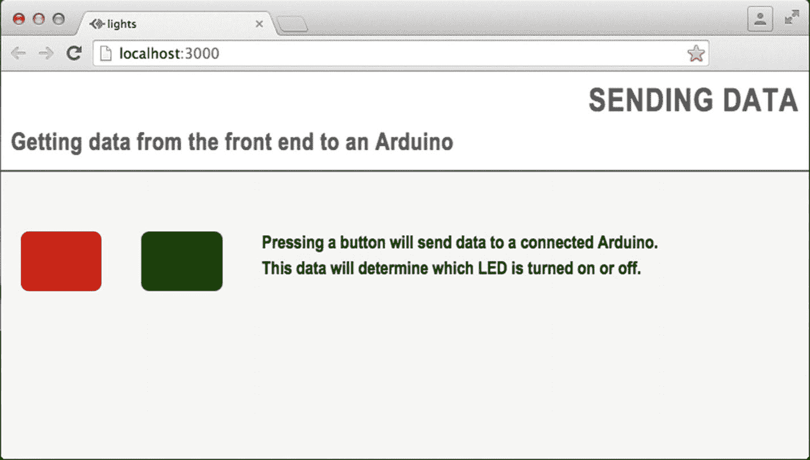
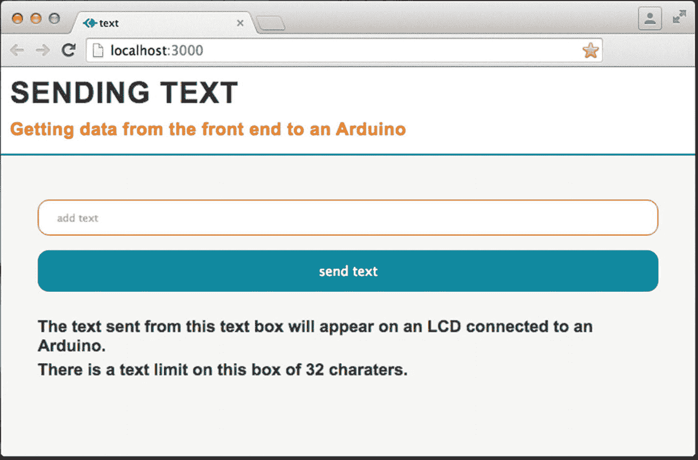
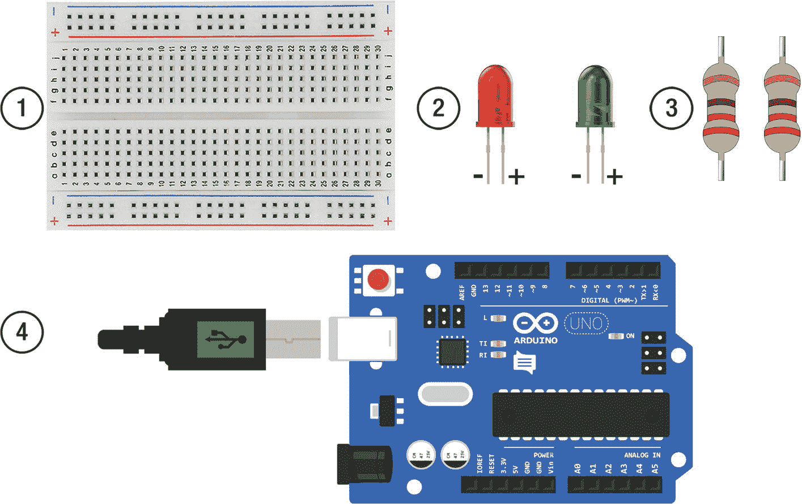
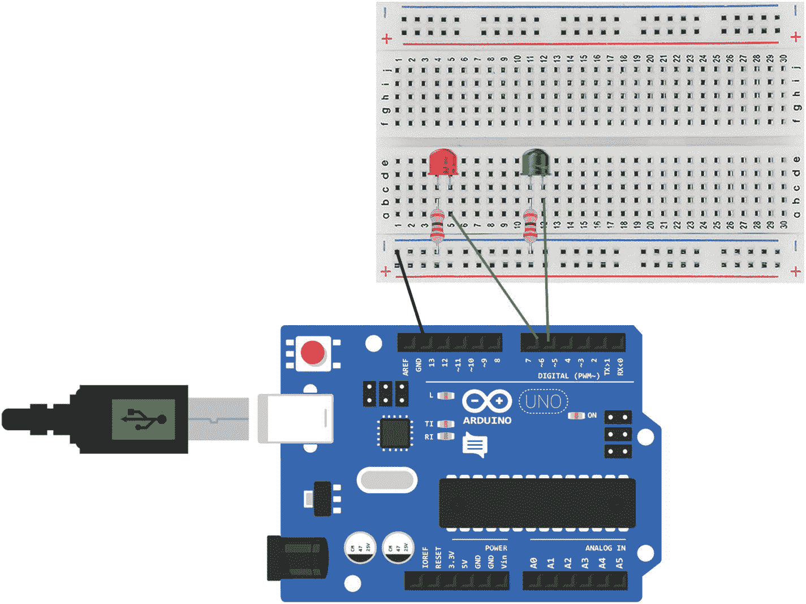
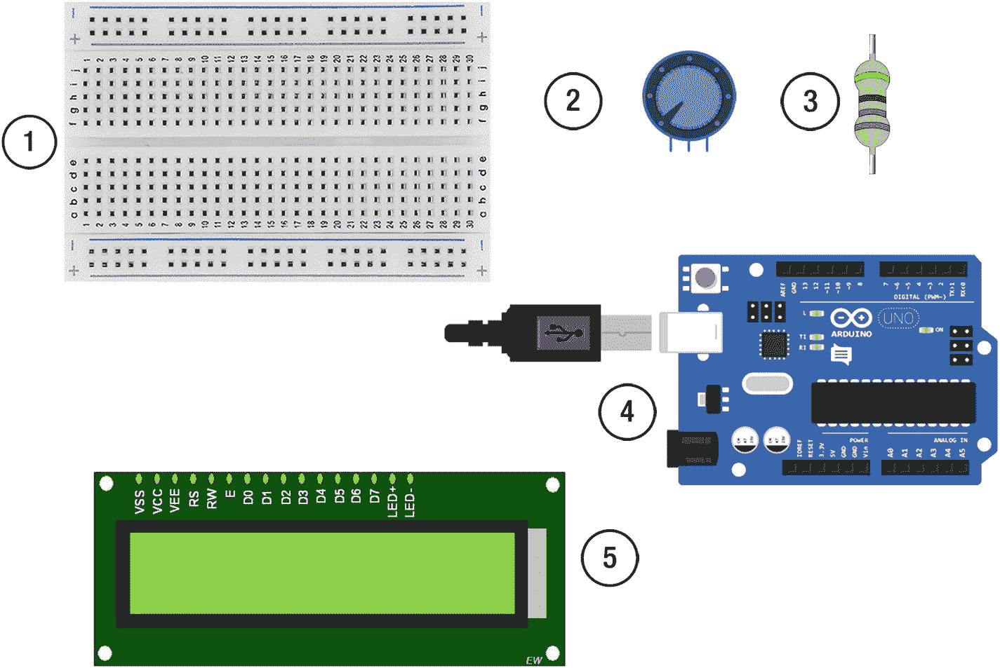
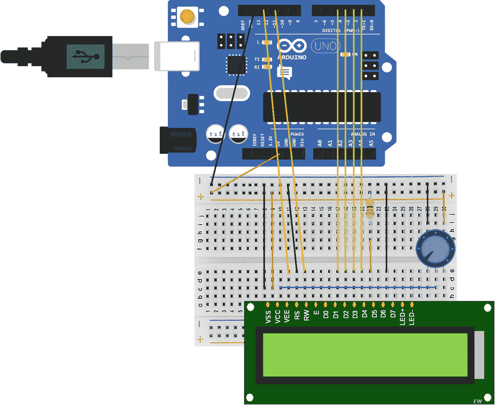

# 五、Arduino 前端

到目前为止，您已经使用串行端口向 web 服务器发送数据，但是串行端口可以是双向数据流；它可以发送和接收数据。在本章中，您将开始通过串行端口通过 web 服务器向 Arduino 发送数据。通过交互式网页，您可以控制连接到 Arduino 的组件。

## 应用程序

在本章中，您将创建两个 web 应用程序。一个将打开和关闭连接到 Arduino 的 LED。图 5-1 显示网页。



图 5-1

The web page for the first application

第二个将是一个应用程序，让你输入文本，然后显示在液晶显示屏上。图 5-2 显示了最终的网页。



图 5-2

The second will be an application that lets you input text that will then be displayed on an LCD screen

## LED 网络应用

第一步是构建应用程序的框架，其结构如下:

```js
/chapter_05
    /node_modules
    /public
        /css
            main.css
        /javascript
            main.js
    /views
        index.ejs
    index.js

```

安装模块时会自动创建节点模块文件夹。创建服务器的设置与第三章相同:

1.  创建一个新文件夹来存放应用程序。我把我的叫做 chapter_05。
2.  打开命令提示符(Windows 操作系统)或终端窗口(Mac)并导航到新创建的文件夹。
3.  当您在正确的目录中时，键入 npm init 创建一个新的应用程序，您可以按 return 键回答每个问题，或者对它们进行更改。
4.  您现在可以开始添加必要的库；要在命令行下载 Express.js，请键入 npm install express@4.15.3 - save。
5.  然后安装 ejs，并键入 npm install ejs@2.5.6 - save。
6.  下载完成后，安装串口。在 Mac 类型 npm 上安装 serial port @ 4 . 0 . 7-save；在 Windows PC 上键入 npm，安装 serial port @ 4 . 0 . 7-build-from-source。
7.  然后最后安装 socket.io，输入 npm install socket.io@1.7.3 - save。

Create a Node.js Server

在应用程序的路径中创建一个名为 index.js 的文件，并复制清单 5-1 中的代码。

```js
var http = require('http');
var express = require('express');
var app = express();
var server = http.createServer(app);
var io = require('socket.io')(server);

app.engine('ejs', require('ejs').__express);
app.set('view engine', 'ejs');

app.use(express.static(__dirname + '/public'));

app.get('/', function (req, res){
    res.render('index');
});

io.on('connection', function(socket){
    console.log('socket.io connection');

socket.on('disconnect', function(){
        console.log('disconnected');
    });
});

server.listen(3000, function(){
    console.log('listening on port 3000...');
});

Listing 5-1index.js code

```

代码解释

服务器有一个到网页的路由，并且还创建一个 web 套接字。函数 app.get 创建一个路由，以便在应用程序打开时呈现一个索引文件。

Create a Web Page

初始页面将包含两个颜色块，一个红色和一个绿色。当用户点击一个块时，它会变成开或关的颜色。每个颜色块将由一个带有背景色的 div 创建。

如果您还没有创建 index.ejs、main.css 和 main.js 文件，现在就创建；确保它们在正确的目录中。由于 index.ejs 文件中引用了 main.css 和 main.js，因此需要创建它们，即使此时它们中没有任何代码。在 index.ejs 文件中，复制清单 5-2 中的代码。

```js
<!DOCTYPE html>
<html>
<head>
    <meta charset="UTF-8">
    <title>lights</title>
    <link href="/css/main.css" rel="stylesheet" type="text/css">
</head>
<body>
    <header>
        <h1>SENDING DATA</h1>
        <h2>Getting data from the front end to an Arduino</h2>
    </header>
    <div id="content">
        <div class="container">
            <div id="red-block" class="color-block"></div>
            <div id="green-block" class="color-block"></div>
            <div class="text-block">
                <p>Pressing a button will send data to a connected Arduino.</p>
                <p>This data will determine which LED is turned on or off.</p>
            </div>
        </div>
    </div>
    <script src="/socket.io/socket.io.js"></script>
    <script src="javascript/main.js"></script>
</body>
</html>

Listing 5-2index.ejs code

```

代码解释

每个颜色块都有自己的 div。id 在 CSS 中用于给块着色，而类用于给两个颜色块设置样式。div 中没有子内容。

您可以通过在控制台窗口中导航到应用程序并键入 nodemon index.js 或 node index.js 来启动应用程序，从而检查到目前为止页面的外观。打开浏览器并转到 http://localhost:3000/查看应用程序的运行情况。

Add Style

该样式将被添加到 public/css 文件夹的 main.css 文件中。打开或创建 main.css 文件，并复制清单 5-3 中的代码。

```js
*{
   margin: 0;
   padding: 0;
}
body{
   font-family: "Arial Narrow", Arial, "Helvetica Condensed", Helvetica, sans-serif;
   color: #5a5b5a;
   background-color: #f4f4f4;
}
h1{
   letter-spacing: 1px;
   padding: 10px;
   direction:rtl;
   text-align:justify;
}
h2{
   letter-spacing: 0.5px;
   padding: 0 0 15px 10px;

}
p{
   font-weight: bold;
   margin-bottom: 5px;
   color: black;
}
header{
   border-bottom: 2px solid #5a5b5a;
   background-color: white;
}
.container {
   display: flex;
   flex-wrap:wrap;
   margin-top: 40px;
}
#red-block{
   background-color: #C80002;
}
.red-block-on{
   background-color: #ff0036 !important;
   box-shadow: rgba(0, 0, 0, 0.2) 0 -1px 7px 1px, inset #441313 0 -1px 9px, rgba(255, 0, 0, 0.5) 0 2px 12px;
}
#green-block{
   background-color: #1f5900;
}
.green-block-on{
   background-color: #1eff00 !important;
   border: 10px;
   box-shadow: rgba(0, 0, 0, 0.2) 0 -1px 7px 1px, inset #304701 0 -1px 9px, #89FF00 0 2px 12px;
}
.color-block, .text-block{

   margin: 20px;
}
.color-block{
    flex-basis:40px;
    height: 60px;
    border-radius: 8px;
    flex-grow: 1;
    cursor: pointer;
}
.text-block{
    flex-basis:200px;
    height: 200px;
   flex-grow: 8;
   font-size: 18px;
}
Listing 5-3main.css CSS

```

代码 ExplainedTable 5-1 解释了 main.css 中的 CSS

表 5-1

main.css CSS explained

<colgroup><col align="left"> <col align="left"></colgroup> 
| `h1{` `letter-spacing: 1px;` `padding: 10px;` `direction:rtl;` `text-align:justify;` | 字母间距增加了字母之间的间距，这可以使大写字母更容易阅读。方向:rtl 是一种将文本方向从右向左改变而不是从左向右的样式。 |
| flex-wrap:缠绕； | 当浏览器更小时，这将使 Flexbox 中的项目一个接一个地落下。 |
| 。`red-block-on{``background-color: #F00 !important;``box-shadow: rgba(0, 0, 0, 0.2) 0 -1px 7px 1px, inset #441313 0 -1px 9px, rgba(255, 0, 0, 0.5) 0 2px 12px;` | 单击红色和绿色框时，它们都处于打开状态。这是通过添加一个带有方框阴影的类来创建灯光打开的效果来实现的。！重要信息与背景色一起使用，以覆盖 div 的原始颜色。框阴影用于在 div 周围创建较亮的边缘。 |
| `.color-block{``border-radius: 22px;``flex-grow: 1;``cursor: pointer;` | flex-grow:1 命令确定项目将在 Flexbox 中占用多少空间。光标:指针用于当光标悬停在一个框上时改变光标。 |

如果您的服务器仍然运行 nodemon，您应该能够刷新页面并看到 CSS 所做的更改。如果您没有使用 nodemon，请重启服务器并刷新页面。

## 关于 Flexbox 的更多信息

这是一个很好的机会，让我们对 Flexbox 有更多的了解，并了解它的一些价值。表 5-2 列出了一些 Flexbox 值。

表 5-2

Flexbox values

<colgroup><col align="left"> <col align="left"></colgroup> 
| `flex-direction` | 默认值为 row 这意味着默认情况下，项目将水平放置。 |
| `justify-content: flex-start` | 这些项目将堆叠在该行的开头。 |
| `align-items:stretch` | 这些物品将被拉伸以填满容器。 |
| `flex-wrap: nowrap` | 这些物品将会排成一行。 |
| `Flex-shrink: 1` | 允许项目收缩。 |
| `flex-grow` | flex-grow 确定该项相对于其他项在 flex 容器中占据的空间量。在清单 5-3 的 CSS 中，两个色块的 flex-grow 值为 1，文本框的 flex-grow 值为 8。文本框将被赋予比颜色块更多的空间。 |

Add Interaction

JavaScript 用于在点击每个彩色块时添加动作。JavaScript 将被添加到 public/javascript 文件夹中的 main.js 文件中。打开您之前创建的空 main.js 文件，或者创建一个 main.js 文件，并复制清单 5-4 中的代码。

```js
var redBlock = document.getElementById("red-block");
var greenBlock = document.getElementById("green-block");

redBlock.addEventListener("click", function(){
     redBlock.classList.toggle("red-block-on");
});

greenBlock.addEventListener("click", function(){
     greenBlock.classList.toggle("green-block-on");
});

Listing 5-4main.js code

```

代码解释

有两个变量保存对页面上颜色块元素的引用，“redBlock”和“greenBlock”事件侦听器被添加到这些变量中。JavaScript 事件监听器总是监听特定事件的发生。当它发生时，它可以调用一个函数。在这种情况下，该函数改变块的颜色。它通过添加或删除一个名为“红块开”或“绿块开”的类来实现这一点添加或移除类来更改元素是常见的做法。这意味着改变的所有 CSS 都在一个地方。表 5-3 解释 main.js。

表 5-3

main.js explained

<colgroup><col align="left"> <col align="left"></colgroup> 
| `redBlock.addEventListener("click", function()` | 单击事件侦听器被添加到 redBlock div 中。这个监听器监听 div 被点击。当它被点击时，一个函数被调用。 |
| `redBlock.addEventListener("click", function()` | 单击事件侦听器被添加到 redBlock div 中。这个监听器监听 div 被点击。当它被点击时，一个函数被调用。 |
| `redBlock.classList.toggle("red-block-on");` | 这行代码使用了两个 JavaScript 函数 classList 和 toggle。classList 通常与 add 或 remove 一起使用来添加或删除类。通过与 toggle 一起使用，它将确定 div 是否具有该类；如果有，它删除它，如果没有，它添加它。 |

现在，在控制台窗口中，导航到应用程序的路径，并键入 nodemon index.js 或 node index.js 来启动应用程序。打开浏览器并转到 http://localhost:3000/查看应用程序的运行情况。

当你点击红色或绿色按钮时，你应该会看到它的变化，看起来就像一盏灯被打开或关闭。

Sending Data From The Front End

现在基本的应用程序已经设置好了，是时候从前端向 Arduino 发送数据了。每次在 web 浏览器中按下按钮，数据将被发送到 SerialPort 函数，因此可以通过串行端口将数据发送到 Arduino。

为此，代码将被添加到清单 5-1 和清单 5-4 中。

首先更新清单 5-4 中的 main.js 文件；更新以粗体显示。

```js
(function(){

    var socket = io();

    var redBlock = document.getElementById("red-block");
    var greenBlock = document.getElementById("green-block");

    redBlock.addEventListener("click", function(){
        var redClick = redBlock.classList.toggle("red-block-on");
        socket.emit('red', redClick + "_red");
    });

    greenBlock.addEventListener("click", function(){
        var greenClick = greenBlock.classList.toggle("green-block-on");
        socket.emit('green', greenClick + "_green");
     });
})();

```

代码解释表 5-4 解释 main.js 中的代码

表 5-4

main.js update explained

<colgroup><col align="left"> <col align="left"></colgroup> 
| `(function(){` `})();` | JavaScript 被包装在一个匿名函数中，该函数调用自身。它被称为立即调用函数表达式(IIFE)。它将 JavaScript 保存在一个块中，如果您将代码中的某个内容命名为您正在导入的库，它可以避免冲突。例如，如果您正在导入的库像在您创建的函数中一样有一个名为 greenClick 的变量，您就不必担心；它在自己的命名空间和范围内。 |
| `var greenClick = greenBlock.classList.toggle("green-block-on");` | Node.js 应用程序将向 Arduino 发送数据，告诉它根据前端的按钮是处于打开还是关闭模式来打开或关闭 LED。函数 toggle()根据开关的状态返回一个布尔值，真或假。该值可用于确定将按钮置于 on 状态的类是否已应用于 HTML 元素。变量 greenClick 和 redClick 将保存该值。 |
| `socket.emit('red', redClick + "_red");` | 当按钮被点击时，socket.emit()函数被触发，向服务器发送关于哪个按钮被点击及其状态的信息。 |

最后更新清单 5-1 中的 index.js 文件。更新以粗体显示。

```js
var http = require('http');
var express = require('express');
var app = express();
var server = http.createServer(app);
var io = require('socket.io')(server);

var SerialPort = require('serialport');

var serialport = new SerialPort('<add in the serial port for your Arduino>', {

    parser: SerialPort.parsers.readline('\n')

});

app.engine('ejs', require('ejs').__express);
app.set('view engine', 'ejs');

app.use(express.static(__dirname + '/public'));

app.get('/', function (req, res){
    res.render('index');
});

serialport.on('open', function(){

    console.log('serial port opened');

});

io.on('connection', function(socket){
    console.log('socket.io connection');

    socket.on('red', function(data){
        serialport.write(data + 'T');
    });

    socket.on('green', function(data){
        serialport.write(data + 'T');
    });

   socket.on('disconnect', function(){

        console.log('disconnected');
    });
});

server.listen(3000, function(){
    console.log('listening on port 3000...');
});

```

删除<add in="" the="" serial="" port="" for="" your="" arduino="">并将自己的串口添加到新的 serial port()函数中。</add>

大多数增加的内容都是你在前面章节中使用过的代码。SerialPort 库与 Arduino 的端口 id 一起包含在应用程序中。调用 serialport.on()函数打开串口。

前端 JavaScript 代码中有两个链接到 socket.emit()函数的 socket.on()函数。新增的是 serialport.write()函数。

代码解释表 5-5 解释 index.js。

表 5-5

index.js update explained

<colgroup><col align="left"> <col align="left"></colgroup> 
| `serialport.write(data + 'T');` | 该函数将数据从应用程序发送到串行端口。在这种情况下，来自前端的数据将被发送到串行端口。字符“T”也被添加到数据中。这是一个终结性的角色。它可以是你选择的任何角色。您需要一个终止字符，因为当 Arduino 接收数据时，它不知道数据的结尾是什么。它接收一个数据流，需要知道一段数据是什么，下一段是什么。“T”在 Arduino 程序中使用，让它知道这是一段数据的结尾 |

### 设置 LED

本章中 Arduino 的设置将使用 Arduino Uno、试验板、绿色和红色 LED、两个 220 欧姆电阻和跳线。图 5-3 显示了您需要的套件。



图 5-3

1\. Breadboard, 2\. A red and a green LED, 3\. Two 220 ohm resistors, 4\. An Arduino

一旦你准备好了工具包，你需要如图 5-4 所示进行设置，并将其连接到电脑上的 USB 端口。连接组件时，请确保 Arduino 没有连接到电脑或任何其他电源。



图 5-4

The LED circuit The Arduino Code

打开 Arduino IDE。在“工具”菜单中，确保在电路板上选择了正确的 Arduino 类型，并且 Arduino 连接的端口正在注册。

创建一个新的草图并将其命名为 chapter_05，从清单 5-5 中复制代码。

```js
const int redLed = 6;
const int greenLed = 5;

char charRead;
String inputString ="";

void setup() {                
  Serial.begin(9600);
  pinMode(redLed, OUTPUT);
  pinMode(greenLed, OUTPUT);
}

void loop() {
  if (Serial.available()) {
    charRead = Serial.read();
    if(charRead != 'T'){
      inputString += charRead;
    } else {

      if(inputString == "true_red"){

        digitalWrite(redLed, 1);
      } else if(inputString == "false_red") {
        digitalWrite(redLed, 0);
      } else if(inputString == "true_green") {
        digitalWrite(greenLed, 1);
      } else if(inputString == "false_green") {
        digitalWrite(greenLed, 0);
      }
      inputString = "";
    }
  }
}

Listing 5-5chapter_05.ino

```

验证脚本，然后将其上传到 Arduino。确保 Node.js 应用程序已关闭。如果它仍在运行，代码将不会上传到 Arduino，因为串行端口已经被应用程序使用。

代码解释表 5-6 解释了第五章中的代码。

表 5-6

chapter_05.ino explained

<colgroup><col align="left"> <col align="left"></colgroup> 
| `const int redLed = 6;` `const int greenLed = 5;` | 有两个常量变量保存两个 led 的数字引脚编号。 |
| `char charRead;` | 创建一个 char(单个字符)类型的变量来保存来自串行端口的数据的每个字符。 |
| `String inputString ="";` | inputString 是一个 String 类型的变量，它将用于连接通过特定数据的串行端口进入的所有字符。 |
| `if (Serial.available()) {` | if 语句检查是否有串行数据进入 Arduino。 |
| `charRead = Serial.read();` | 调用 Serial.read()函数从串行端口获取数据。数据将是单个字符，存储在变量 charRead 中。 |
| `if(charRead != 'T'){``inputString += charRead;` | if 语句检查 charRead 是否与字符“t”不相等。如果不相等，则意味着当前字符不是终止字符，所以它被添加到 inputString 中。 |
| `else{` | 如果字符是“T ”,则意味着所有当前数据都已收到，并且触发了 else 语句。 |
| `if(inputString == "true_red"){``...``digitalWrite(greenLed, 0);` | else 语句中有一系列 if 语句，它们检查数据是什么，并确定应该打开还是关闭哪个灯。 |
| `inputString = "";` | 一旦数据被用来打开或关闭 LED，inputString 被重置为空，因此它为下一条数据做好了准备。 |

一旦程序被上传到 Arduino，重启 Node.js 服务器并转到 http://localhost:3000/。当您点击红色或绿色按钮时，电路上相应的按钮应该打开或关闭。

## LCD Web 应用程序

本章中的第二个应用程序将文本数据发送到 Arduino，这些数据将在液晶显示器(LCD)上显示。应用程序将需要一个新目录，其结构如下:

```js
/chapter_05_lcd
    /node_modules
    /public
        /css
            main.css
        /javascript
            main.js
    /views
        index.ejs
    index.js

```

为应用程序创建框架应用程序:

1.  创建一个新文件夹来存放应用程序。我叫我的章 _05_lcd。
2.  打开命令提示符(Windows 操作系统)或终端窗口(Mac)并导航到新创建的文件夹。
3.  当您在正确的目录中时，键入 npm init 创建一个新的应用程序，您可以按 return 键回答每个问题，或者对它们进行更改。
4.  您现在可以开始添加必要的库；要在命令行下载 Express.js，请键入 npm install express@4.15.3 - save。
5.  然后安装 ejs，键入 npm install ejs@2.5.6 - save。
6.  下载完成后，安装串口。在 Mac 上键入 npm 安装 serial port @ 4 . 0 . 7–save，在 Windows PC 上键入 npm 安装 serial port @ 4 . 0 . 7–build-from-source。
7.  然后最后安装 socket.io，输入 npm install socket.io@1.7.3 - save。

为目录创建文件夹，也可以创建文件。

Note

使用 npm init 时，名称不能包含大写字母。

### 创建服务器

Node.js 服务器与清单 5-1 的最终版本几乎相同。为 chapter_05_lcd 应用程序打开或创建一个 index.js 文件，并复制清单 5-6 中的代码。

```js
var http = require('http');
var express = require('express');
var app = express();
var server = http.createServer(app);
var io = require('socket.io')(server);
var SerialPort = require('serialport');
var serialport = new SerialPort('<add in the serial port for your Arduino>', {
    parser: SerialPort.parsers.readline('\n')
});

app.engine('ejs', require('ejs').__express);
app.set('view engine', 'ejs');

app.use(express.static(__dirname + '/public'));

app.get('/', function (req, res){
    res.render('index');
});

serialport.on('open', function(){
    console.log('serial port opened');
});

io.on('connection', function(socket){

    console.log('socket.io connection');

    socket.on('input-text', function(data){
        serialport.write(data + 'T');
    });

    socket.on('disconnect', function(){
        console.log('disconnected');
    });
});

server.listen(3000, function(){
    console.log('listening on port 3000...');
});

Listing 5-6index.js

```

有一个名为“input-text”的新 socket.on()函数 id。这将监听具有相同 id 的 socket.emit，它将位于前端。它会将文本发送到 Arduino。

Create The Web Page

网页将非常简单，一个文本框和一个输入按钮。在 views 文件夹中打开或创建 index.js 文件，并复制清单 5-7 中的代码。

```js
<!DOCTYPE html>
<html>
<head>
    <meta charset="UTF-8">
    <title>text</title>
    <link href="/css/main.css" rel="stylesheet" type="text/css">
</head>
<body>
    <header>
        <h1>SENDING TEXT</h1>
        <h2>Getting data from the front end to an Arduino</h2>
    </header>
    <div id="content">
        <input type="text" id="input-text" placeholder="add text" maxlength="32">
        <input id="send-text" type="submit" value="send text">
        <div class="text-block">
            <p>The text sent from this text box will appear on an LCD connected to an Arduino.</p>
            <p>There is a text limit on this box of 32 charaters.</p>

        </div>
    </div>
    <script src="/socket.io/socket.io.js"></script>
    <script src="javascript/main.js"></script>
</body>
</html>
Listing 5-7index.ejs

```

HTML 使用输入框。在 HTML 中有许多创建表单的元素。这些表单可以发送到服务器进行处理。

代码解释表 5-7 解释了 index.ejs 中的代码。

表 5-7

index.ejs explained

<colgroup><col align="left"> <col align="left"></colgroup> 
| `<input type="text" id="input-text" placeholder="add text" maxlength="32">` | 这通过使 type = "text "创建了一个文本输入。它有保存默认文本的占位符文本。与 maxLength 一起发送的还有一个字符限制。 |
| `<input id="send-text" type="submit" value="send text">` | 这个输入是一个提交按钮，它的类型被设置为提交。它有一个值会出现在按钮上。 |

Make The Web Page Interactive

在 public/javascript 文件夹中打开或创建一个 main.js 文件，并将清单 5-8 中的代码复制到其中。

```js
(function(){
    var socket = io();

    var sendTextButton = document.getElementById("send-text");

    sendTextButton.addEventListener("click", function(){
        var sendText = document.getElementById("input-text").value;
         socket.emit('input-text', sendText); 

    });
})();

Listing 5-8main.js

```

代码解释表 5-8 解释 main.js 中的代码。

表 5-8

main.js explained

<colgroup><col align="left"> <col align="left"></colgroup> 
| `var sendTextButton = document.getElementById("send-text");` | 变量 sendTextButton 保存对输入按钮的引用。 |
| `sendTextButton.addEventListener("click", function(){` | 点击功能被添加到输入按钮。 |
| `var sendText = document.getElementById("input-text").value;` | 当单击输入按钮时，变量将获得文本输入框中的值。 |
| `socket.emit('input-text', sendText);` | 输入框中的文本通过 socket.emit 函数发送到服务器。 |

Style The Page

这个应用程序的 CSS 与清单 5-3 有些不同。它不使用 Flexbox，并且有输入样式。在 public/css 文件夹中打开或创建一个 main.css 文件，并复制到清单 5-9 中的 css 中。

```js
*{
 margin: 0;
 padding: 0
}

body{
 font-family: Arial, "Helvetica Condensed", Helvetica, sans-serif;
 color: #3a3b3a;
 background-color: #F4F4F4;
}

h1{
  letter-spacing: 1px;
  padding: 10px;
}

h2{
 letter-spacing: 0.5px;
 font-size: 19px;
 padding: 0 0 15px 10px;
 color: #E37222;
}

p{
 font-weight: bold;
 margin-bottom: 5px;
}

header{
 border-bottom: 2px solid #07889B;
 background-color: white;
}

#content {
  margin: 40px;
}

input[type=text], select {
  width: 100%;
  padding: 12px 20px;
  margin: 8px 0;
  display: inline-block;
  border: 1px solid #E37222;
  border-radius: 12px;
  box-sizing: border-box;

}

input[type=submit] {
  font-size: 14px;
  width: 100%;
  background-color: #07889B;
  color: white;
  padding: 14px 20px;
  margin: 8px 0;
  border: none;
  border-radius: 12px;
  cursor: pointer;
}

.text-block{
  width: 100%;
  font-size: 18px;
  margin-top: 20px;
}

Listing 5-9main.css

```

CSS 解释表 5-9 解释了 main.css 中的 CSS。

表 5-9

main.css explained

<colgroup><col align="left"> <col align="left"></colgroup> 
| `input[type=text], select {` | 这将选择输入文本框。 |
| `display: inline-block;` | 具有内嵌块的元素可以有宽度和高度。 |
| `box-sizing: border-box;` | 这使得盒子的角变圆。 |
| `input[type=submit] {` | 这将选择提交按钮。 |

### 设置液晶显示器

液晶屏上有很多控制组件的针脚。有一个寄存器选择(rs)引脚；这控制了数据在 LCD 存储器中的位置。Enable (en)引脚允许写入寄存器。共有八个数据引脚(d0–D7)。

电位计也是电路的一部分。这会改变屏幕的对比度。该应用所需的设备如图 5-5 所示。



图 5-5

1.breadboard, 2\. 10k ohm potentiometer, 3\. A 220 ohm resistor, 4\. An Arduino, 5\. An LCD screen

Arduino 的设置如图 5-6 所示。确保 Arduino 在组装时没有连接电源。



图 5-6

Setup for the LCD The Arduino Code

打开 Arduino IDE 并创建一个新的草图。将 Arduino 连接到您的计算机，并确保它出现在端口中并且是正确的板。将清单 5-10 中的代码复制到新草图中。保存为 chapter_05_lcd.ino，验证，然后上传到 Arduino。

```js
#include <LiquidCrystal.h>

const int rs = 12, en = 11, d4 = 5, d5 = 4, d6 = 3, d7 = 2;
LiquidCrystal lcd(rs, en, d4, d5, d6, d7);

char charRead;
String inputString = "";
String outputString = "";
String newOutputString = "";

void setup() {
  Serial.begin(9600);
  lcd.begin(16, 2);
}

void loop() {
  if (Serial.available()) {
    charRead = Serial.read();
    if(charRead != 'T'){
      inputString += charRead;
    } else {
      lcd.clear();
      outputString = inputString;
      inputString = "";
    }
  }

  if(newOutputString != outputString){
    lcd.print(outputString);
    newOutputString = outputString;
  }

  lcd.scrollDisplayLeft();
  delay(500);

}

Listing 5-10chapter_05_lcd.ino

```

代码解释表 5-10 解释了 chapter_05_lcd.ino 中的代码

表 5-10

chapter_05_lcd.ino explained

<colgroup><col align="left"> <col align="left"></colgroup> 
| `#include <LiquidCrystal.h>` | 将 LiquidCrystal 库引入草图。需要这个库来控制 LCD。 |
| `const int rs = 12, en = 11, d4 = 5, d5 = 4, d6 = 3, d7 = 2;` | 创建了许多整数变量来保存 LCD 上所用引脚的信息。引脚 12 是寄存器选择；引脚 11 是使能引脚；d4、d5、d6 和 d7 是数据引脚。 |
| `LiquidCrystal lcd(rs, en, d4, d5, d6, d7);` | 创建了一个称为 lcd 的液晶对象。 |
| `char charRead;``String inputString = "";``String outputString = "";` | 创建了许多变量来保存文本数据。 |
| `lcd.begin(16, 2);` | 这将初始化 LCD 并选择显示器的宽度和高度。 |
| `lcd.clear();` | clear()函数清空屏幕，以便显示新数据。 |
| `outputString = inputString;` | 将新字符串放入保存要显示的数据的变量中。 |
| `inputString = "";` | 重置输入字符串，为新数据做好准备。 |
| `if(newOutputString != outputString){` | 检查 outputString 是否与当前字符串不同。由于代码在循环函数中，如果没有检查，那么每次循环时，相同的字符串将被添加到输出字符串中。 |
| `lcd.print(outputString);` | 如果它是一个新的字符串，那么调用 LiquidCrystal 库的 print()函数，该字符串被传递并显示在 LCD 上。 |
| `newOutputString = outputString;` | 变量 newOutputString 被更新，为下一个循环做好准备。 |
| `lcd.scrollDisplayLeft();` | 函数的作用是:让文本向左滚动。 |

Arduino 更新后，在控制台窗口中转至应用程序的根目录，通过键入 nodemon index.js 或 node index.js 启动应用程序。打开 web 浏览器并转至 http://localhost:3000/。在框中键入一些文本，然后发送；这将需要几秒钟，但它会出现在液晶显示屏上。

使用电位计改变屏幕的对比度。如果您在屏幕上看不到任何东西，可能是对比度被调低了。

注意，由于该设置中有相当多的焊线，如果您没有在屏幕上显示数据，或者如果屏幕上有奇怪的字符，请检查所有的焊线。同时转动电位计，因为这会改变屏幕的对比度。

## 摘要

在本章中，您开始从服务器向 Arduino 发送数据以更改组件。现在您知道了使用 web 服务器向 Arduino 发送数据和从 Arduino 接收数据的主要原理。下一章将结合这些知识创建一个项目，将数据从 Arduino 发送到网页，并使用该信息更新连接到 Arduino 的组件。