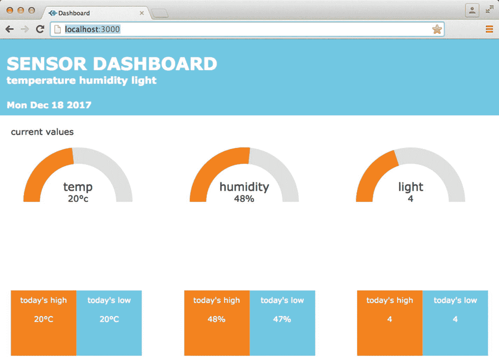

# 八、创建 Web 仪表板

您可以将传感器连接到 Arduino，并将数据发送到前端，以创建物联网仪表盘。在本章中，你将使用热、光和湿度传感器来收集数据，然后显示在网页上。仪表板上的可视化将对实时数据做出反应，这些数据将被存储，以给出每日的最高和最低读数。通过以这种方式使用数据可视化，您可以使数据更容易阅读、理解和分析。

## 仪表板

本章中的仪表板将获取温度、湿度和光照水平数据，并在环形图中显示每个数据。数据将存储在服务器上，存储在一个简单的 JavaScript 对象中，每天都会重置。每次值改变时，对象将被传递到前端，以便仪表板显示数据的准确图片。图 [8-1](#Fig1) 显示了仪表板在浏览器中的外观。



图 8-1

The dashboard application for this chapter

## 数据可视化原理

我们将数据可视化，以便更好地理解它，无论是探索数据、传达信息还是用数据讲述故事。数据可视化由点、线、区域、表面或体积组成。这些可以被修改成 Jacques Bertin 所说的视觉变量。他定义了七个视觉变量:位置、大小、价值、纹理、颜色、方向和形状。图 [8-2](#Fig2) 显示了七个视觉变量。


图 8-2

The seven visual variables and how they are related to points, lines, and area

随着时间的推移，其他研究人员加入了这些视觉变量。您使用哪些可视变量来表示数据将取决于数据的类型。数量型、序数型和分类型数据适用于某些变量。

定量数据是有数量的数据，例如，一袋中苹果的数量。有序数据是具有我们给定的顺序的数据，例如，你的前 10 部电影。分类数据用于标注，没有与之相关的数字，例如，国家列表。

有许多不同类型的图表可以用来表示数据，您选择哪种类型取决于您拥有的数据类型和您想要表达的内容。当选择您想要创建的可视化类型时，考虑谁将查看它，它需要有什么样的复杂程度，以及可视化是否使数据易于理解。

### 可视化的类型

您可以制作多种类型的图表来可视化数据，其中一些如图 [8-3](#Fig3) 所示。


图 8-3

1\. Clustered force layout, 2\. Cluster dendrogram, 3\. Scatter plot. Visualizations of data from [`https://census.gov/data/tables/2016/demo/popest/total-cities-and-towns.html`](https://census.gov/data/tables/2016/demo/popest/total-cities-and-towns.html) showing population estimates for 2016 for the 20 highest populated cites in the United States

### 标记可视化

在可视化上有正确的标签是非常重要的。你可以从一个好的标题开始，这个标题要与可视化显示的内容相匹配。拥有数据的键也很重要

### 颜色

您使用的颜色可能会模糊数据的含义。关于颜色，有几件事需要考虑。首先，颜色对不同的人有不同的意义，你不应该假设，因为你把一种颜色和某种意义联系起来，其他人也会。当你考虑你的浏览器时，你应该考虑这一点。

如果您使用颜色来表示某个范围的值，请确保相似的值不会有非常不同的颜色。观众会认为你试图突出非常不同的价值观。

有一个非常有用的在线工具叫做 ColorBrewer [`http://colorbrewer2.org/`](http://colorbrewer2.org/) ，它是用来帮助选择制图颜色的。它将为您的可视化提供良好的颜色值，并且它还有一个色盲安全模式。

在附录 B 中，我列出了一些数据可视化的好资源。

## 传感器

本章将使用温湿度传感器和光敏电阻。有许多公司生产这些类型的传感器；我用过 Elegoo 生产的。

### DHT11 温度和湿度传感器

这是一个测量温度和相对湿度的数字传感器。相对湿度是指空气中的水量与特定温度下空气中的水量之比。温度是用摄氏度来测量的。

### 光敏电阻

光敏电阻对光线有反应。当环境中的光强度增加时，电阻减小。它连接到一个模拟引脚，因此值在 0 到 1023 之间。亮度越高，输出越接近 0。

### 导入库

无论您决定使用哪种品牌的温度和湿度传感器，您都可能需要在 Arduino IDE 中安装一个温度和湿度传感器库。Elegoo 传感器有需要安装的可下载 ZIP 文件。这些后续步骤将介绍如何为 Elegoo 实现这一点；但是你可能会发现另一种传感器的不同步骤。

1.  打开 Arduino IDE。
2.  在菜单中，转到草图/包含库/添加。ZIP 库，将会打开一个窗口。
3.  导航到 ZIP 文件，双击该文件将其导入。
4.  您现在应该能够看到导入的库，因此通过查看菜单“草图/包含库”进行检查，您应该能够在库列表中看到库的名称。

Note

不同类型的温度和湿度传感器有不同的可下载库。如果您使用了不同品牌的传感器，您将使用其库，因此 ino 代码会略有不同。请参考您的传感器指南，找到正确的代码。

Set Up the Temperature and Heat Sensors

要设置温度和湿度，您需要一个温度和湿度传感器、一个 Arduino Uno、一根 USB 电缆和一根母线对公线。图 [8-4](#Fig4) 显示了组件。


图 8-4

The components needed to set up the temperature and humidity sensor: 1\. Breadboard, 2\. DHT11 temperature and humidity sensor, 3\. Arduino Uno

图 [8-5](#Fig5) 显示了部件应该如何连接。


图 8-5

Connecting the components to the Arduino Arduino Code

ino 代码将导入传感器库，并使用该库的 dht11.read()函数导入传感器数据。打开 Arduino IDE，创建一个名为 chapter_08.ino 的新草图，并复制清单 [8-1](#Par25) 中的代码。

```js
#include <SimpleDHT.h>
int pinTempHumidity = 2;
SimpleDHT11 dht11;
byte temperature = 0;
byte humidity = 0;
byte data[40] = {0};
void setup() {
  Serial.begin(9600);

}
void loop() {
  Serial.println("Current Reading");
  dht11.read(pinTempHumidity, &temperature, &humidity, data);
  Serial.print((int)temperature); Serial.print(" *C, ");
  Serial.print((int)humidity); Serial.println(" %");
  delay(10000);
}
Listing 8-1chapter_08.ino

```

代码解释表 [8-1](#Tab1) 解释了 chapter_08.ino 中的代码。

表 8-1

`chapter_08.ino` explained

<colgroup><col align="left"> <col align="left"></colgroup> 
| `#include <SimpleDHT.h>` | 这包括使用传感器所需的导入的 SimpleDHT 库。 |
| `int pinTempHumidity = 2;` | 为传感器使用的 pin 号创建一个变量。 |
| `SimpleDHT11 dht11;` | 创建一个变量来保存来自 SimpleDHT11 类型的传感器的数据。 |
| `byte temperature = 0;``byte humidity = 0;`T2】 | 创建三个变量来保存从传感器返回的字节数据。 |
| `dht11.read(pinTempHumidity, &temperature, &humidity, data);` | dht11.read()函数获取传感器所连接的引脚号，并返回传感器的温度、湿度和字节数据。 |
| `Serial.print((int)temperature);Serial.print(" *C, ");` `Serial.print((int)humidity);Serial.println(" %");` | Serial.print()函数在温度和湿度将字节数据转换为整数之前，打印来自传感器的值。 |

验证代码，然后通过 USB 将 Arduino 连接到端口，将草图上传到 Arduino。确保您在工具菜单中为 Arduino 选择了正确的端口:工具/端口。

现在为你的草图打开串行监视器，你应该看到每 10 秒钟就有一次数据传来。

Adding a Photoresistor

从电脑上拔下 Arduino 以设置光敏电阻。更新后的设置如图 [8-6](#Fig6) 所示。


图 8-6

The setup for the photoresitor

打开。并使用清单 [8-2](#Par31) 中的粗体代码对其进行更新。

```js
#include <SimpleDHT.h>
int pinTempHumidity = 2;
SimpleDHT11 dht11;
byte temperature = 0;
byte humidity = 0;
byte data[40] = {0};
int  pinLight  =  A0;    

int  valueLight =  0;

void setup() {
  Serial.begin(9600);
}
void loop() {
  Serial.println("Current Reading");
  dht11.read(pinTempHumidity, &temperature, &humidity, data);
  valueLight =  analogRead(pinLight);

  Serial.print((int)temperature); Serial.print(" *C, ");
  Serial.print((int)humidity); Serial.println(" %");
  Serial.print(valueLight, DEC);
  delay(10000);
}

Listing 8-2Updated chapter_08.ino

```

代码解释

表 [8-2](#Tab2) 解释了 chapter_08.ino 中的更新代码。

表 8-2

`chapter_08.ino` updated

<colgroup><col align="left"> <col align="left"></colgroup> 
| `int  pinLight  =  A0;` `int  valueLight =  0;` | 创建了两个新变量来保存来自光敏电阻的管脚号和值。 |
| `valueLight =  analogRead(pinLight);` | 电阻器的值存储在变量值灯中。 |
| `Serial.print(valueLight, DEC);` | 打印该值，DEC 是 Serial.print()函数的可选参数，它确保打印的值是十进制的。 |

将更新的草图上传到 Arduino，并在 Arduino IDE 中打开串行监视器；你应该从光敏电阻上看到它的价值。

Update the Arduino Sketch

如果您可以在串行监视器中看到来自温湿度传感器和光敏电阻的数据，则传感器设置正确。现在，您可以编写一个草图来格式化 Node.js 服务器的数据。草图有两个主要变化:首先，serial.print 函数需要发送用逗号分隔的所有数据。第二，来自光敏电阻的数据将被映射，因此数值将从低光的 0 到高光的 10。创建一个新草图，并复制清单 [8-3](#Par35) 中的代码。

```js
#include <SimpleDHT.h>
int pinTempHumidity = 2;
SimpleDHT11 dht11;
byte temperature = 0;
byte humidity = 0;
byte data[40] = {0};

int  pinLight  =  A0;    
int  valueLight =  0;

void setup() {
  Serial.begin(9600);
}
void loop() {
  dht11.read(pinTempHumidity, &temperature, &humidity, data);
  valueLight =  analogRead(pinLight);
  valueLight = map(valueLight, 0, 1023, 10, 0);

  Serial.println((String)temperature + "," + (String)humidity + "," + (String)valueLight);
  delay(500);
}

Listing 8-3chapter_08_final.ino

```

代码解释

表 [8-3](#Tab3) 解释了 chapter_08_final.ino 中的代码。

表 8-3

`chapter_08_final.ino explained`

<colgroup><col align="left"> <col align="left"></colgroup> 
| `valueLight = map(valueLight, 0, 1023, 10, 0);` | 一旦光敏电阻的值被读入变量值 Light，它就被映射成一个新值。当它从模拟引脚读取时，它将是一个介于 0 和 1023 之间的值，数字越大，亮度越低。贴图将采用这个数字，并将其转换为 0 到 10 之间的数字，0 表示较低的光线。 |
| `Serial.println((String)temperature + "," + (String)humidity + "," + (String)valueLight);` | 每个值都被转换成一个字符串，这样就可以用逗号将它与其他值连接起来。在 Node.js 服务器中使用逗号来确定每个新数据的起始位置。 |

The Dashboard Application

现在传感器已经设置好了，您可以为数据创建仪表板应用程序了。首先构建框架应用程序，其结构如下所示:

```js
/chapter_08
    /node_modules
    /public
        /css
            main.css
        /javascript
            main.js
            donut.js
    /views
        index.ejs
    index.js

```

创建服务器的设置与前面章节中的相同:

1.  创建一个新文件夹来存放应用程序。我叫我的章 _08。
2.  打开命令提示符(Windows 操作系统)或终端窗口(Mac)并导航到新创建的文件夹。
3.  在正确的目录中，键入 npm init 创建一个新的应用程序；您可以按下 return 键浏览每个问题或对其进行更改。
4.  您现在可以开始添加必要的库；要在命令行下载 Express.js，请键入 npm install express@4.15.3 - save。
5.  然后安装 ejs，键入 npm install ejs@2.5.6 - save。
6.  下载完成后，安装串口。在 Mac 上，键入 NPM install serial port @ 4 . 0 . 7–save；在 Windows PC 上，键入 NPM install serial port @ 4 . 0 . 7-build-from-source。
7.  然后最后安装 socket.io，输入 npm install socket.io@1.7.3 - save。

Set Up the Node.js Server

来自 Arduino 的数据有三部分:温度、湿度和亮度。它们将以逗号分隔的单个字符串的形式出现。字符串内容将被放入一个数组，然后可以传递到前端。字符串末尾将包含一个换行符，需要将其删除。打开应用程序的 index.js 文件，复制清单 [8-4](#Par48) 中的代码。

```js
var http = require('http');
var express = require('express');
var app = express();
var server = http.createServer(app);
var io = require('socket.io')(server);
var SerialPort = require('serialport');
var serialport = new SerialPort('<add in the serial port for your Arduino>', {
    parser: SerialPort.parsers.readline('\n')
});
app.engine('ejs', require('ejs').__express);
app.set('view engine', 'ejs');
app.use(express.static(__dirname + '/public'));
app.get('/', function (req, res){
    res.render('index');
});
io.on('connection', function(socket){
    console.log('socket.io connection');
    serialport.on('data', function(data){
        data = data.replace(/(\r\n|\n|\r)/gm,"");
        var dataArray = data.split(',');
        socket.emit("data", dataArray);
    });
    socket.on('disconnect', function(){
        console.log('disconnected');
    });
});
server.listen(3000, function(){
    console.log('listening on port 3000...');
});
Listing 8-4index.js

```

确保您更改的代码包含 Arduino 所连接的串行端口。

代码解释

表 8-4

index.js explained

<colgroup><col align="left"> <col align="left"></colgroup> 
| data = data . replace(/(\ r \ n &#124; \ n &#124; \ r)/GM，" ")； | 正则表达式将使用 replace()函数删除任何换行符。 |
| var dataArray = data.split('，')； | split 函数获取数据字符串，并在每次遇到逗号时将其拆分，然后创建每个单词的数组。 |

表 [8-4](#Tab4) 解释了 index.js 中的代码。

Create the Web Page

现在，您将创建包含仪表板的基本页面。它将有一个套接字，以便您可以测试数据是否到达前端。在 views 文件夹中打开或创建 index.ejs 文件，并复制清单 [8-5](#Par52) 中的代码。

```js
<!DOCTYPE html>
<head>
    <title>Dashboard</title>
</head>
<body>
    <div class="wrapper">
        <h1>Dashboard</h1>
        <p>This page will contain a dashboard of data</p>
    </div>
    <script src="https://cdn.socket.io/socket.io-1.2.0.js"></script>
    <script>
        var socket = io();
        socket.on("data", function(data){
            console.log(data);
        });
    </script>
</body>
</html>
Listing 8-5index.ejs

```

确保 Arduino 已连接到您的电脑，但串行监视器已关闭。在控制台中转到应用程序的根目录，键入 nodemon index.js 或 node index.js 来启动服务器。转到 http://localhost:3000 并打开页面。您应该看到保持页面，然后开始看到数据进入控制台。如果您打开浏览器的开发工具(在 mac 上为 Option + Command + i，在 Windows PC 上为 CTRL + Shift + i)，您还应该在控制台选项卡中看到数据。

Create the Donut Charts

该控制面板有两个主要元素，圆环图和当天的高/低数据。圆环图将使用 D3.js 创建，并且将是 180 度而不是 360 度。有三个图表，每种类型的数据一个。创建图表的代码将位于一个名为 donut.js 的独立 JavaScript 文件中；它使用显示模块模式。圆环图本身是在 main.js 文件中创建的，从 donut.js 调用方法。这使代码保持独立，意味着您可以使用相同的代码创建所有图表。donut.js 文件包含许多创建和更新甜甜圈的方法。

更新 index.js

进入 Node.js 服务器的数据将保存在一个对象中。这个对象将被传递到前端。打开清单 [8-4](#Par48) 中的代码，用清单 [8-6](#Par56) 中的粗体代码更新它。

```js
var http = require('http');
var express = require('express');
var app = express();
var server = http.createServer(app);
var io = require('socket.io')(server);
var SerialPort = require('serialport');
var serialport = new SerialPort('<add in the serial port for your Arduino>', {
    parser: SerialPort.parsers.readline('\n')
});

var sensors = {

    temp: {current: 0 , high:0, low:100 },
    humidity: {current: 0, high:0, low: 100},
    light: {current: 0, high:0, low: 10}

}

app.engine('ejs', require('ejs').__express);
app.set('view engine', 'ejs');

app.use(express.static(__dirname + '/public'));

app.get('/', function (req, res){

    res.render('index');
});

io.on('connection', function(socket){
    console.log('socket.io connection');

    socket.emit("initial-data", sensors);

    serialport.on('data', function(data){
        data = data.replace(/(\r\n|\n|\r)/gm,"");
        var dataArray = data.split(',');

        var hasChanged = updateValues(dataArray);
        if (hasChanged > 0){
           socket.emit("data", sensors);
        }

});
    socket.on('disconnect', function(){
        console.log('disconnected');
    });
});
server.listen(3000, function(){
    console.log('listening on port 3000...');
});

function updateValues(data){

    var changed = 0;
    var keyArray = ["temp", "humidity", "light"];

    keyArray.forEach(function(key, index){

        var tempSensor = sensors[key];
        var newData = data[index];
        if(tempSensor.current !== newData){
            sensors[key].current = data[index];
            changed = 1;
        }
        if(tempSensor.high < newData){
            sensors[key].high = data[index];
            changed = 1;
        }

        if(tempSensor.low > newData ){
            sensors[key].low = data[index];
        }
    });
    return changed;

}

Listing 8-6Updated index.js

```

代码解释

表 [8-5](#Tab5) 解释了 index.js 中的代码。

表 8-5

index.js explained

<colgroup><col align="left"> <col align="left"></colgroup> 
| `var sensors = {``temp: {current: 0 , high:0, low:100 },``humidity: {current: 0, high:0, low: 100},``light: {current: 0, high:0, low: 10}`T4】 | 变量 sensor 保存一个对象，该对象包含传感器的当前值以及最高和最低值。由于对象存储在服务器上，它将存储这些值，直到服务器重新启动。当来自传感器的新数据进来时，该对象被更新。 |
| `socket.emit("initial-data", sensors);` | 当浏览器连接到服务器时，当前传感器数据被发送给它。 |
| `var hasChanged = updateValues(dataArray);` | 变量 hasChanged 将保存函数 updateValues()的返回值。如果数据没有改变，变量 hasChanged 将为 0，如果数据改变，变量 has changed 将为 1。 |
| `if (hasChanged > 0){``socket.emit("data", sensors);`T2】 | 如果 hasChanged 大于 0，则数据已更改，调用 socket.emit，id 为“data”，将更新的传感器数据传递给前端。 |
| `function updateValues(data){}` | updateValues()函数被传递给新数据，它对照 sensor 对象检查新数据，看是否有任何值发生了更改。 |
| `var changed = 0;` | 它将名为的变量初始化为 0；这是将在函数结束时返回的变量。 |
| `var keyArray = ["temp", "humidity", "light"];` | 创建要测试的传感器阵列。 |
| `keyArray.forEach(function(key, index){` `});` | JavaScript forEach()函数被调用来遍历数组，它将使用数组项的数据作为键，使用数组项的位置作为索引。 |
| `var tempSensor = sensors[key];` `var newData = data[index];` | 创建两个变量来保存键和索引的值。 |
| `if(tempSensor.current !== newData){``sensors[key].current = data[index];``changed = 1;`T3】 | if 语句检查数据的当前值是否不等于新数据。如果数据改变了 sensors 对象中特定传感器的当前值，则更新 sensor 对象，并将变量 changed 设置为 1。还有 if 语句来检查高值和低值是否也发生了变化。 |
| `return changed;` | 然后返回已更改的变量。如果这些值都没有改变，那么代码就不会输入任何 If 语句，changed 返回 0。如果任何值已经更改，那么 changed 将返回 1。 |

Create the Donut Javascript

创建圆环图的代码将拥有自己的 JavaScript 文件。在 public/javascript 文件夹中创建一个名为 donut.js 的文件，并复制清单 [8-7](#Par59) 中的代码。

```js
var DonutChart = function(){
    var pi = Math.PI;
    var sensorDomainArray;
    var divIdName;
    var sensorAmount;
    var sensorText = "";

    var sensorScale;
    var foreground;
    var arc;
    var svg;
    var g;
    var textValue;
    function setSensorDomain(domainArray){
        sensorDomainArray = domainArray;
    }
    function setSvgDiv(name){
        divIdName = name;
    }
    function createChart(sensorTextNew, sensorType){
        sensorText = sensorTextNew;
        var margin = {top: 10, right: 10, bottom: 10, left: 10};
        var width = 240 - margin.left - margin.right;
        var height = 200;
        sensorScale = d3.scaleLinear()
            .range([0, 180]);
        arc = d3.arc()
            .innerRadius(70)
            .outerRadius(100)

            .startAngle(0);
        svg = d3.select(divIdName).append("svg")
            .attr("width", width + margin.left + margin.right)
            .attr("height", height + margin.top + margin.bottom);
        g = svg.append("g").attr("transform", "translate(" + width / 2 + "," + height / 2 + ")");
        g.append("text")
            .attr("text-anchor", "middle")
            .attr("font-size", "1.3em")
            .attr("y", -20)
            .text(sensorType);
        textValue = g.append("text")
         .attr("text-anchor", "middle")
         .attr('font-size', '1em')
         .attr('y', 0)
         .text(sensorAmount + "" +  sensorText);
        var background = g.append("path")
            .datum({endAngle: pi})
            .style("fill", "#ddd")
            .attr("d", arc)
            .attr("transform", "rotate(-90)")
        foreground = g.append("path")
            .datum({endAngle: 0.5 * pi})
            .style("fill", "#FE8402")
            .attr("d", arc)
            .attr("transform", "rotate(-90)");
    }
    function updateChart(newSensorValue){
        sensorScale.domain(sensorDomainArray);
        var sensorValue = sensorScale(newSensorValue);
        sensorValue = sensorValue/180;
        textValue.text(newSensorValue + "" +  sensorText);
        foreground.transition()
          .duration(750)
          .attrTween("d", arcAnimation(sensorValue * pi));
    }
    function arcAnimation(newAngle)

      return function(d) {
        var interpolate = d3.interpolate(d.endAngle, newAngle);

        return function(t) {
          d.endAngle = interpolate(t);
          return arc(d);
        };
      };
    }
    return{
        setSensorDomain: setSensorDomain,
        setSvgDiv: setSvgDiv,
        createChart:createChart,
        updateChart: updateChart
    }
};

Listing 8-7donut.js

```

代码解释

该代码使用 D3.js arc 函数创建一个圆环图。通常这些将是 360，但在这种情况下，它将是 180。当从 Arduino 发送新数据时，将调用 updateChart()方法，该方法调用函数 arcAnimation()，该函数计算出新旧角度之间的动画。表 [8-6](#Tab6) 详细介绍了 donut.js。

表 8-6

donut.js explained

<colgroup><col align="left"> <col align="left"></colgroup> 
| `var DonutChart = function(){` `};` | 所有的代码都包装在一个函数中；这是揭示模块模式的一部分。可以通过调用新的 donutChart()来创建新的甜甜圈。 |
| `function setSensorDomain(domainArray){``sensorDomainArray = domainArray;`T2】 | 此函数设置圆环图的域。该域是数据的最高和最低可能值的一组值。 |
| `function setSvgDiv(name){``divIdName = name;`T2】 | 将 HTML div 的名称放入变量 divIdName 的函数。 |
| `function createChart(sensorTextNew, sensorType){}` | 圆环图的初始设置包含在此方法中。传递给它两个参数:与数据类型一起使用的符号，例如，%;然后是它所代表的数据类型，温度、湿度或光线 |
| `sensorScale = d3.scaleLinear()` `.range([0, 180]);` | sensorScale 保存可视化的范围和域。范围是 0 到 180，因为甜甜圈可以从 0 到 180。 |
| `arc = d3.arc()``.innerRadius(70)``.outerRadius(100)`T3】 | d3.js arc()函数存储在代码顶部声明的变量 arc 中。您可以设置它的内半径和外半径，这将定义它的大小和圆环孔。 |
| `var background = g.append("path")``.datum({endAngle: pi})``.style("fill", "#ddd")``.attr("d", arc)`T4】 | 创建的背景弧将始终为 180 度，并且是灰色的；它被旋转到水平位置。 |
| `foreground = g.append("path")``.datum({endAngle: 0.5 * pi})``.style("fill", "#FE8402")``.attr("d", arc)`T4】 | 前景弧被创建，它有一个橙色填充。 |
| `function updateChart(newSensorValue){}` | 当有新数据并且需要更新圆环图时，会调用此函数。它有一个参数，新值。 |
| `sensorScale.domain(sensorDomainArray);` | 标度的定义域已设置。 |
| `var sensorValue = sensorScale(newSensorValue);` | 采用新值并将其映射到圆环图刻度。 |
| `sensorValue = sensorValue/180;` | 将值调整为 180。 |
| `textValue.text(newSensorValue + "" +  sensorText);` | 更新文本值。 |
| `foreground.transition()``.duration(750)`T2】 | 为圆环图创建持续时间为 750 毫秒的过渡。调用 arcAnimation()函数，它计算出弧线的过渡。 |
| `function arcAnimation(newAngle) {``return function(d) {``var interpolate = d3.interpolate(d.endAngle, newAngle);``return function(t) {``d.endAngle = interpolate(t);``return arc(d);``};``};``}` | 向该函数传递新数据的新角度，并返回新旧角度之间的动画。 |
| `return{` `setSensorDomain: setSensorDomain,` `setSvgDiv: setSvgDiv,` `createChart:createChart,` `updateChart: updateChart` | 返回一组可以在 donut.js 外部调用的方法，这些方法将在 main.js 中使用。 |

Create the Main.js File

在 public/javascript 文件夹中创建或打开 main.js 文件，并复制清单 [8-8](#Par63) 中的代码。

```js
(function(){
    var socket = io();
    var temperature = new DonutChart();
    temperature.setSensorDomain([-6,50]);
    temperature.setSvgDiv('#donut1');
    temperature.createChart('\u00B0'+"c", "temp");

    var humidity = new DonutChart();

    humidity.setSensorDomain([0,90]);
    humidity.setSvgDiv('#donut2');
    humidity.createChart('\u0025', "humidity");
    var light = new DonutChart();
    light.setSensorDomain([0,10]);
    light.setSvgDiv('#donut3');
    light.createChart('', "light");

    socket.on("initial-data", function(data){
        temperature.updateChart(data.temp.current);
        humidity.updateChart(data.humidity.current);
        light.updateChart(data.light.current);

});

    socket.on('data', function(data){
        temperature.updateChart(data.temp.current);
        humidity.updateChart(data.humidity.current);
        light.updateChart(data.light.current);
    });  
})();

Listing 8-8main.js

```

代码解释

这段代码将创建三个圆环图，并在有新数据时更新它们。有关 main.js 的更多详细信息，请参见表 [8-7](#Tab7)

表 8-7

main.js explained

<colgroup><col align="left"> <col align="left"></colgroup> 
| `var temperature = new DonutChart();` | 创建一个保存在名为 temperature 的变量中的新圆环图。 |
| `temperature.setSensorDomain([-6,50]);` | 设置温度的域；调用 donut.js setSensorDomain()方法并传递可能的最低和最高温度。这是可能的温度范围。 |
| `temperature.setSvgDiv('#donut1');` | donut.js setSvgDiv()方法被传递了将保存温度圆环图的 HTML div 的 id。 |
| `temperature.createChart('\u00B0'+"c", "temp");` | 调用 donut.js createChart()方法，并向其传递表示度数符号的 Unicode 和表示摄氏度的字母 c 以及图表的类型。使用相同的方法创建湿度和光照圆环图。 |
| `socket.on("initial-data", function(data){``temperature.updateChart(data.temp.current);``humidity.updateChart(data.humidity.current);``light.updateChart(data.light.current);`T4】 | 初始数据通过 socket.on()方法传递给前端，它调用 updateChart()方法并传入当前的温度、湿度或光线数据。 |
| `socket.on('data', function(data){``temperature.updateChart(data.temp.current);``humidity.updateChart(data.humidity.current);``light.updateChart(data.light.current);`T4】 | 新数据通过 id 为“data”的 socket.on()传递到前端。这将调用 updateChart()方法并传入当前的温度、湿度或光线数据。 |

Update the Front End

从清单 [8-5](#Par52) 中打开 index.ejs 代码并删除它；复制清单 [8-9](#Par67) 中的代码。

```js
<!DOCTYPE html>
<head>
    <meta charset="UTF-8">
    <title>Dashboard</title>
    <link href="/css/main.css" rel="stylesheet" type="text/css">
</head>
<body>
    <header>
        <h1>SENSOR DASHBOARD</h1>
        <h2>temperature humidity light</h2>
</header>
    <main>
        <h3>current values</h3>
        <div class="container">
            <div id="donut1" class="donut flex-child"></div>

            <div id="donut2" class="donut flex-child"></div>
            <div id="donut3" class="donut flex-child"></div>
        </div>
    </main>
    <script src="https://cdn.socket.io/socket.io-1.2.0.js"></script>
    <script src="https://d3js.org/d3.v4.js"></script>

    <script src="javascript/donut.js"></script>
    <script src="javascript/main.js"></script>
</body>
</html>

Listing 8-9index.ejs

```

代码解释

这段代码将为三个圆环图创建 div，这些 div 将在新数据进入时更新。它还包括 donut.js 脚本和 main.js 脚本。有关 index.ejs 的更多详细信息，请参见表 [8-8](#Tab8)

表 8-8

index.ejs explained

<colgroup><col align="left"> <col align="left"></colgroup> 
| `<div id="donut1" class="donut flex-child"></div>``<div id="donut2" class="donut flex-child"></div>`T2】 | 有三个 HTML div 标签，每个圆环图一个。 |
| `<script src="javascript/donut.js"></script>` `<script src="javascript/main.js"></script>` | public 文件夹中的两个脚本包含在内。需要首先调用 donut.js 脚本，因为 main.js 正在使用它。 |

Add the CSS

在 public/css 文件夹中打开或创建 main.css，并在列表 [8-10](#Par71) 中添加 css。

```js
*{
  margin: 0;
  padding: 0;
}

body{
  font-family: Verdana, Arial, sans-serif;
}
h2{
  font-size: 18px;
}
h3{
  font-size: 16px;
}
p{
  font-size: 14px;
}
header{
  background: #6BCAE2;

  color: white;
}
header h1{
  padding-top: 25px;
}
header h2{
  padding-bottom: 25px;
}
header h3{
  padding-bottom: 10px;
}
header h1,header h2, header h3, header p{
    padding-left: 12px;
}
main h3{
  font-weight: normal;
  margin: 20px;
}
.container{
    display: flex;
    flex-direction: row;
    flex-wrap: wrap;
    margin-top: 20px;
    justify-content: space-between;
}
.flex-child{
  margin: auto;
}

Listing 8-10main.css

```

通过在控制台窗口中导航到应用程序，并键入 nodemon index.js 或 node index.js 来启动应用程序，可以检查到目前为止页面的外观。确保 Arduino 已连接到您的电脑，并打开浏览器，然后转到 http://localhost:3000/查看应用程序的运行情况。

## 添加日常值

实时数据现在显示在仪表板上，但数据对象也存储传感器的最高和最低值，这些值也可以显示。目前，这些值将是服务器运行期间的值，但是通过一些更改，您可以在午夜重置这些值，使其成为每日的最高值和最低值。然后可以将这些值添加到仪表板中。您还可以向仪表板添加一个日期，该日期将在午夜更新。

为此，您将使用一个名为 node-schedule 的新库。这个库帮助你在 Node.js 中安排事件在特定的时间发生，它基于 cron 的思想，cron 是 unix 类型操作系统的时间调度器。要在 Node.js 服务器中使用它，您需要请求它，然后如图 [8-7](#Fig7) 所示使用它。


图 8-7

Basic code for the node-schedule library

该系统由一系列星星组成，从左到右代表秒(可选)、分钟、小时、一个月中的日子、一个月和一周中的日子。图 [8-7](#Fig7) 中的代码将在每分钟过去 10 秒时记录文本。图 [8-8](#Fig8) 显示了呼叫的格式


图 8-8

node-schedule format

这意味着:

```js
schedule.scheduleJob('10 * * * * *),

```

将安排功能在每分钟过 10 秒时运行

```js
schedule.scheduleJob('*/10 * * * * *),

```

将计划每 10 秒运行一次功能

```js
schedule.scheduleJob('10 * * * *),

```

将安排一项功能在整点后每 10 分钟运行一次。请注意，只有 5 个条目，而不是 6 个；秒*是可选的，因为这里没有用到，所以省略了。

```js
schedule.scheduleJob('*/10 * * * *),

```

将计划每 10 分钟运行一次功能

```js
schedule.scheduleJob('* 0 * * *),

```

将安排一个函数在每天午夜运行，这是您将用来每天更新网页上的日期和重置每天的值。

Add the Node-Schedule Library

可以使用 npm 安装节点计划库。

*   导航到应用程序目录并键入 npm 安装节点-计划@1.2.5

然后可以使用 var schedule = require(' node-schedule ')将该库添加到 index.js 文件中；

Update Index.js

打开清单 [8-4](#Par48) 中更新后的 index.js 文件，添加粗体代码:

```js
var http = require('http');
var express = require('express');
var app = express();
var server = http.createServer(app);
var io = require('socket.io')(server);
var SerialPort = require('serialport');
var serialport = new SerialPort('<add in the serial port for your Arduino>', {
    parser: SerialPort.parsers.readline('\n')
});

var schedule = require('node-schedule');

var sensors = {
    temp: {current: 0 , high:0, low:100 },
    humidity: {current: 0, high:0, low: 100},
    light: {current: 0, high:0, low: 10}
}

var changeDay = 0;

var j = schedule.scheduleJob('*/40 * * * * *', function(){

    for (key in sensors) {
        if (sensors.hasOwnProperty(key)) {
            sensors[key].current = 0;
            sensors[key].high = 0;
            sensors[key].low = 100;
        }
    }
    changeDay = 1;

});

app.engine('ejs', require('ejs').__express);
app.set('view engine', 'ejs');
app.use(express.static(__dirname + '/public'));

app.get('/', function (req, res){
    res.render('index');
});
io.on('connection', function(socket){
    console.log('socket.io connection');
    socket.emit("initial-data", sensors);
    serialport.on('data', function(data){
        data = data.replace(/(\r\n|\n|\r)/gm,"");
        var dataArray = data.split(',');
        var hasChanged = updateValues(dataArray);
        if (hasChanged > 0){
           socket.emit("data", sensors);
        }
        if(changeDay === 1){
            changeDay = 0;
            socket.emit('change-day', "true");
        }
});
    socket.on('disconnect', function(){
        console.log('disconnected');
    });
});
server.listen(3000, function(){
    console.log('listening on port 3000...');
});

```

您需要保留 updateValues()函数，我没有将它包含在本次更新中，因为它没有发生变化。

代码解释表 [8-9](#Tab9) 解释了 index.js 中的代码。

表 8-9

index.js update explained

<colgroup><col align="left"> <col align="left"></colgroup> 
| `var schedule = require('node-schedule');` | 创建一个变量来保存节点计划。 |
| `var j = schedule.scheduleJob('* 0 * * * *', function(){});` | 创建一个在午夜调用函数的计划。 |
| `for (key in sensors) {``if (sensors.hasOwnProperty(key)) {``sensors[key].current = 0;``sensors[key].high = 0;``sensors[key].low = 100;``}`T6】 | 使用 JavaScript for key in 函数遍历 sensors 对象；并为每个传感器重置电流、高值和低值。 |
| `changeDay = 1;` | 将 changeDay 设置为 1，以便代码的其余部分知道有新的一天。 |
| `if(changeDay === 1){``changeDay = 0;``socket.emit('change-day', "true");`T3】 | 当从传感器接收到新数据时，通过检查变量 changeDay 是否为 1 来查看这是否是新的一天。如果是，则将变量 changeDay 重置为 0，并发送一个 socket.emit 来让前端知道日期已经更改。 |

Update Main.js

需要更新 main.js 文件来处理新的日期数据。还有一个将日期添加到 web 页面的函数，打开清单 [8-8](#Par96) 中的 main.js 文件，添加粗体代码。

```js
(function(){
    var socket = io();
    var temperature = new DonutChart();
    temperature.setSensorDomain([-6,50]);
    temperature.setSvgDiv('#donut1');
    temperature.createChart('\u00B0'+"c", "temp");
    ...
    socket.on("initial-data", function(data){
        temperature.updateChart(data.temp.current);
        humidity.updateChart(data.humidity.current);
        light.updateChart(data.light.current);
        changeHighLow(data);
    });
    socket.on('data', function(data){
        temperature.updateChart(data.temp.current);
        humidity.updateChart(data.humidity.current);
        light.updateChart(data.light.current);
        changeHighLow(data);
    });  
    socket.on('change-day', function(data){
        changeDate();
    }) ;
    function changeHighLow(data){
        for (key in data) {
            if (data.hasOwnProperty(key)) {
                var className = key + "-high";
                document.getElementById(className).innerHTML = data[key].high;
                className = key + "-low";

                document.getElementById(className).innerHTML = data[key].low;
            }
        }
    }
    function changeDate(){
        var date = new Date();
        var displayDate = document.getElementById('date');
        displayDate.innerHTML = date.toDateString();
    }
    changeDate();
})();

```

代码解释

表 8-10

main.js update explained

<colgroup><col align="left"> <col align="left"></colgroup> 
| `changeHighLow(data);` | 调用一个函数，该函数将使用数据的最新最高值和最低值更新网页。 |
| `socket.on('change-day', function(data){``changeDate();`T2】 | 当调用 id 为“change-day”的 socket.emit 时，这意味着现在是午夜，需要更新网页日期。调用 changeDate()函数来完成这项工作。 |
| `function changeHighLow(data){}` | changeHighLow()函数将更新网页。它作为参数传递给数据对象；这个对象有数据的键和值。 |
| `for (key in data) {}` | JavaScript 中的 for 函数将让您遍历对象中的每一项。 |
| `var className = key + "-high";` `document.getElementById(className).innerHTML = data[key].high;` | 当接收到新数据时，关键字将是字符串“温度”、“湿度”或“光”这将与字符串“-high”连接在一起，构成保存传感器高值的 HTML 标记的类名。然后用新值更新该标签的 innerHTML。然后对低值进行同样的操作。 |
| `function changeDate(){``var date = new Date();``var displayDate = document.getElementById('date');``displayDate.innerHTML = date.toDateString();`T4】 | 函数 changeDate()使用 JavaScript Date()对象。这使您可以访问许多可以应用于 Date()对象的 JavaScript 函数，包括 toDateString()方法。这会将日期写成字符串。将保存日期的标签的内部 HTML 用最新的日期更新。 |

表 [8-10](#Tab10) 解释 main.js 中的代码。

Update Index.ejs File

需要更新 index.ejs 文件以显示新数据。打开清单 [8-9](#Par99) 中的 index.ejs 文件，添加粗体 HTML。

```js
<!DOCTYPE html>
<head>
    ...
</head>
<body>
    <header>
        <h1>SENSOR DASHBOARD</h1>
        <h2>temperature humidity light</h2>
        <h3><time id="date"></time></h3>
    </header>
    <main>
        <h3>current values</h3>
        <div class="container">
            ...
        </div>
        <div class="container">
            <div id="temp" class="high-low">
                <div class="high">
                    <p>today's high</p>
                    <p><span id="temp-high">27</span>&deg;C</p>
                </div>
                <div class="low">
                    <p>today's low</p>
                    <p><span id="temp-low">27</span>&deg;C</p>

                </div>
            </div>
            <div id="humidity" class="high-low">
                <div class="high">
                    <p>today's high</p>
                    <p><span id="humidity-high">27</span>%</p>
                </div>
                <div class="low">
                    <p>today's low</p>
                    <p><span id="humidity-low">27</span>%</p>
                </div>
            </div>
            <div id="light" class="high-low">
                <div class="high">
                    <p>today's high</p>
                    <p><span id="light-high">27</span></p>
                </div>
                <div class="low">
                    <p>today's low</p>
                    <p><span id="light-low">27</span></p>
                </div>
            </div>
        </div>
    </main>
    ...
</body>
</html>

```

代码解释

表 [8-11](#Tab11) 解释了 index.ejs 中的代码。

表 8-11

index.ejs update explained

<colgroup><col align="left"> <col align="left"></colgroup> 
| `<h3><time id="date"></time></h3>` | HTML 有一个时间标签，机器阅读器使用它来正确地解释时间。 |
| `<span id="temp-high">27</span>` | 跨度用于保存更新的数据。 |
| `&deg;` | 这会将度数符号放在页面上。 |

Update the CSS

打开清单 [8-10](#Par102) 中的 main.css 文件，并将以下 css 添加到文件的底部。

```js
.high-low{
    display: flex;
    flex-direction: row;
    justify-content: space-between;
    margin: 20px;
}
.high, .low{
  background-color: #FE8402;
  width: 120px;
  height: 120px;
  color: white;
  text-align: center;
  line-height: 2.5;
  display: inline-block;
  vertical-align: middle;
}
.low{
  background-color: #6BCAE2;
}

```

应用程序现在应该完成了；通过在控制台窗口中导航到应用程序并键入 nodemon index.js 或 node index.js 来启动应用程序，可以看到页面的外观。确保 Arduino 已连接到您的电脑，并打开浏览器，然后转到 http://localhost:3000/查看应用程序的运行情况。

## 摘要

您已经使用数据创建了一个仪表板。现在，您应该对如何获取原始数据、对其进行可视化并使用它来获得洞察力有了更好的理解。存储的数据可以用许多不同的方式进行分析和可视化。这一章应该只是你可以用仪表板做什么的起点。