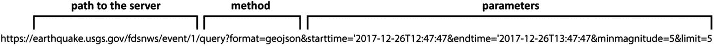
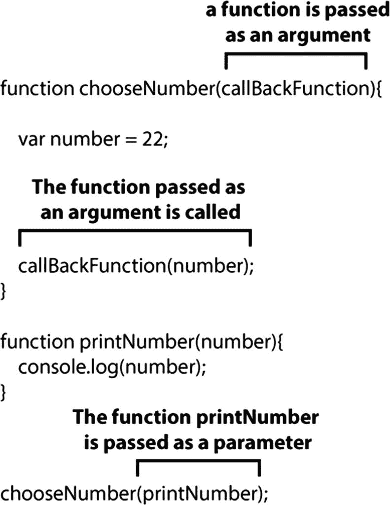
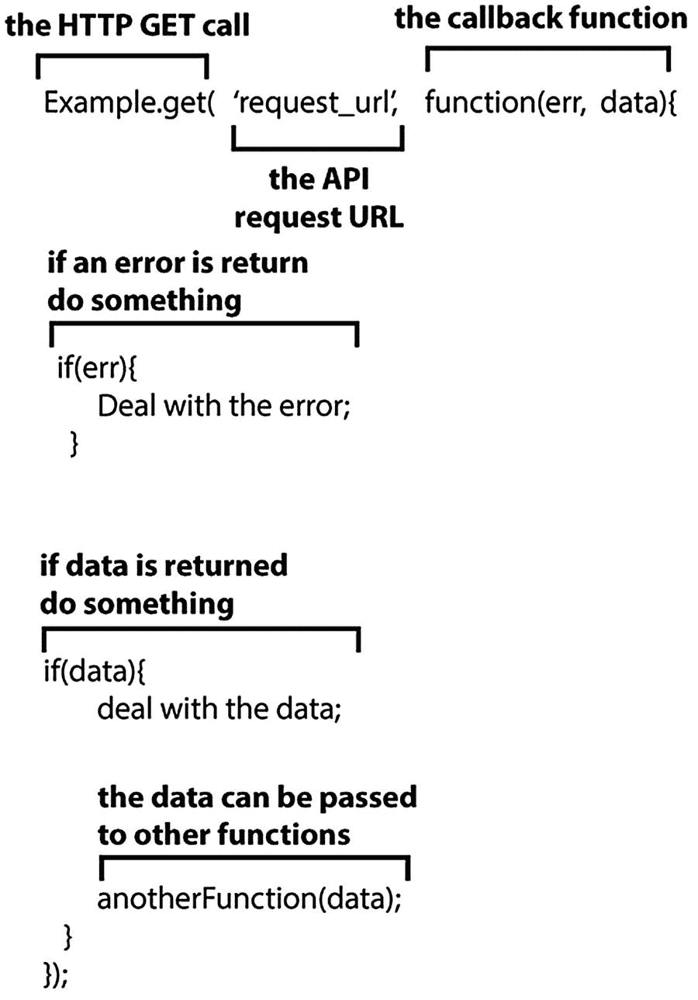
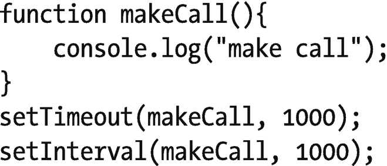
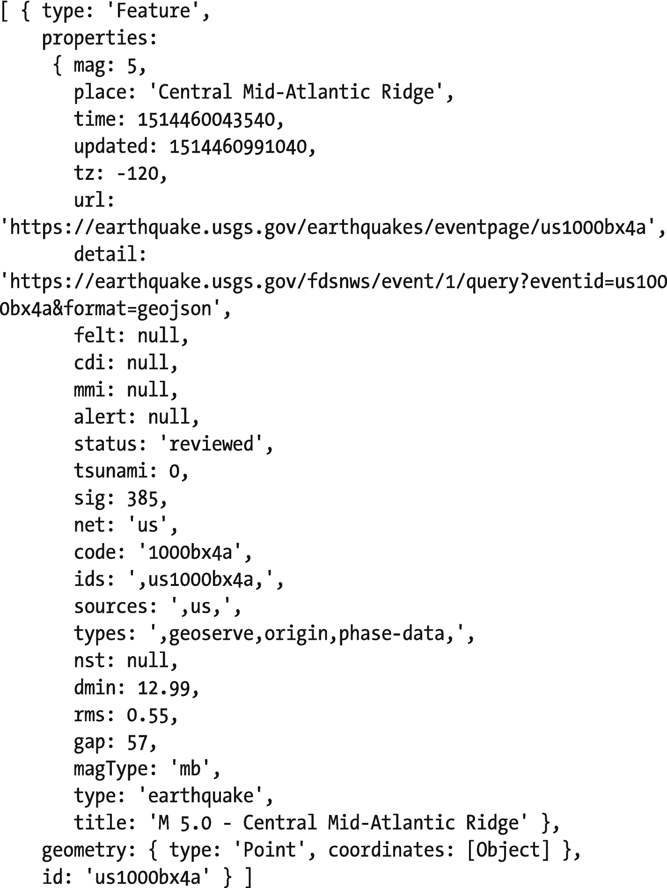
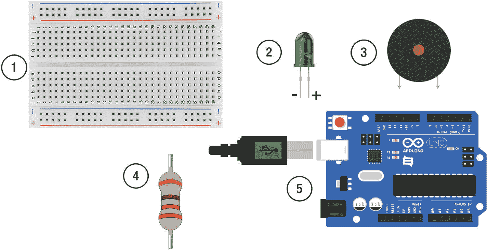
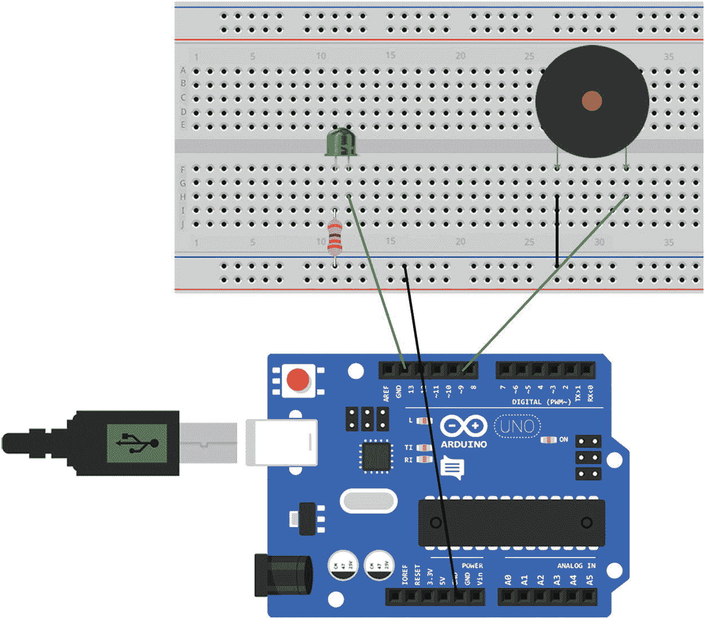
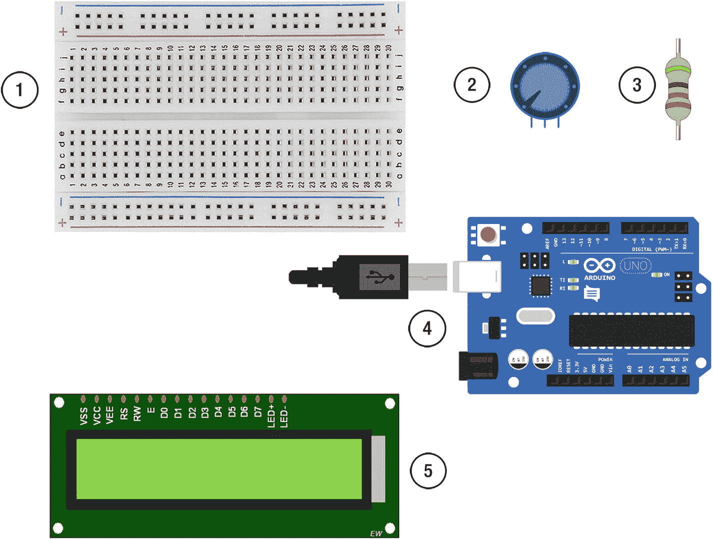
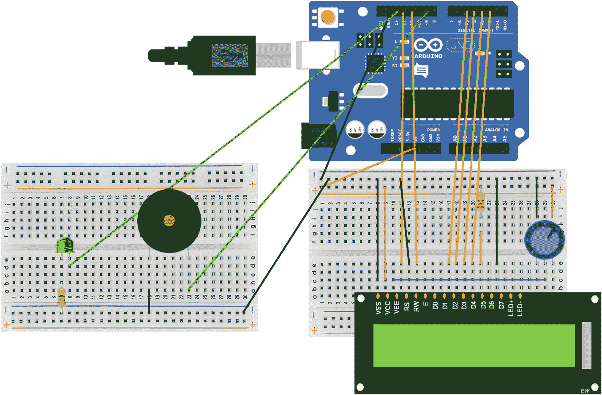

# 九、实时数据的物理数据可视化

在第七章和第八章中，你使用 Arduino 向网络发送数据，这样数据就可以在网页上可视化。本章将扭转这一局面。您将从在线来源获取数据，并使用它来驱动压电蜂鸣器、LED 和连接到 Arduino 的 LCD。您将创建一个 Node.js 服务器，它将链接到一个外部网站并从该网站请求数据。这些数据将被清理并通过串行端口从 Node.js 服务器传送到 Arduino。该数据是来自美国地质调查局网站(USGS)的地震数据。美国地质调查局的地震数据定期更新。USGS 已经创建了一个 API，一种访问数据的方法，您可以使用它来请求您想要的数据。

## 应用程序接口

API 代表应用程序编程接口。这是您的应用程序与其他外部应用程序对话的方式。把它想象成一份餐馆菜单。菜单上列出了厨房为你准备的食物；你向服务员要一个项目，他们去厨房，要求该项目，并把它带回来给你。同样，您的服务器可以向外部服务器发出请求，如果您以正确的方式发出请求，您的请求将会得到满足。通过使用 API 的方法，您可以向外部 web 应用程序发送数据，也可以从外部 web 应用程序接收数据。

大多数有 API 的网站都会有一个页面，上面有如何使用的说明。它将列出可供您使用的方法以及这些方法所需的参数。

当你向一个 API 发出请求时，你就是在调用这个 API。可以限制对服务器进行 API 调用的次数。这样服务器就不会因为请求而过载。

许多 web 应用程序都有您可以使用的 API。Twitter 有一个 API，可以让你搜索和下载推文。微软有一个情感 API，让你给它发送一个人的图像，它将返回该图像的情感分数。

一个 API 可以返回许多不同类型的文档，这取决于它是如何设置的。您可能会收到不同格式的数据。返回给你的数据量是有限制的。应用程序 API 页面应该让您知道这个限制。

要访问一些服务器的 API，你需要注册该应用程序，并获得一个 API 密钥。每次您发出请求时都会用到这个密钥，它允许外部应用程序监控您的请求。

在这一章中，你将使用美国地质勘探局的 API 来获取关于地震的数据。你不需要注册服务或者使用 API 密匙；返回的查询限制为 20，000 个。

## USGS API(USGS API)

美国地质调查局是一个研究美国地质的政府机构。他们的网站包括许多信息，包括水、火山和地震的信息。他们有许多 API，包括一个关于全球地震的 API。数据可以不同的数据格式返回，包括 CSV、XML 和 GeoJSON。该数据包含许多不同的字段，包括地震发生的时间、震级、经纬度坐标以及地震发生地点的名称。

对 API 的请求是一个 URL，在其中传递一个方法；您希望执行什么操作；和参数，要求数据的特定元素的键/值对。这些参数可以返回特定时间段、位置和震级的数据。

如果 URL 参数中没有为 time 指定时区，则假定它是 UTC。例如，字符串 2017-12-26T12:47:47 可以是隐式的 UTC 时区，而 2017-12-26T12:47:47 +00:00 将是显式的。图 9-1 显示了一个 USGS 请求 URL 的例子。



图 9-1

An API call URL to the USGS server

URL 有一个到服务器的路径、一个方法和参数。USGS API 有许多可用的方法，包括查询方法，这是一种数据请求。还指定了想要返回的数据类型，在本例中为 GeoJSON。还有一些参数可以用来询问数据的特定部分。每个参数都是一个键值对，用“&”字符分隔每个参数。你可以在美国地质勘探局网站上的 API 文档页面上看到完整的方法和参数列表，网址为[`seismic . USGS . gov/FDS NWS/event/1/`](https://earthquake.usgs.gov/fdsnws/event/1/)。

## 从外部服务器获取数据

在本章中，您将向外部服务器请求数据，当您获得这些数据时，您将获取您想要的部件，并通过串行端口将这些数据发送到 Arduino。要从外部服务器获取数据，您需要从 Node.js 服务器向 USGS 服务器发出一个客户端请求。你的服务器叫做客户端。为此，您将使用 HTTP GET 请求。HTTP 在第二章“什么是 Web 服务器”一节中讨论过

您可以使用 Node.js 附带的 http 库来发出 HTTP 请求，但是很多应用程序使用第三方库来简化请求的实现。在本章中，您将使用一个名为 axios 的库来发出 HTTP 请求。axios 的优势之一是它使用承诺，而 Node.js 本地 HTTP 请求使用回调。

### 回访和承诺

代码可以是同步的，也可以是异步的。同步代码一行接一行运行，因此代码

```js
console.log("Tuesday");
console.log("Wednesday");

```

将打印出字符串“星期二”,然后是“星期三”,代码会在第二个控制台日志执行之前等待第一个控制台日志执行。

异步代码将开始运行，但它之后的代码不会等到运行完成后再运行。HTTP 请求是异步的；这意味着当向外部服务器发出请求时，您的代码将继续运行；它不会等待外部服务器的响应。这样做的好处是，您的应用程序在等待外部服务器的响应时会继续工作。这也意味着请求之后的函数将不能访问响应数据，因此您不能保证在其他函数运行之前数据已经返回。

您将在其他函数中需要来自 HTTP 请求的响应数据，因此您需要一种方法让需要数据的其他函数等待，直到 HTTP 请求返回数据。回电或承诺是做到这一点的一种方式。

#### 回调函数

回调函数是作为参数传递给函数的函数。这意味着可以向第二个函数传递第一个函数获得的数据。图 9-2 显示了一个简单回调函数的例子。打印数字的方法作为参数传递给创建数字的函数。



图 9-2

An example of a synchronous callback function

这是一个简单的回调函数的同步例子。它们对于异步函数非常有用，因为作为参数传递的函数只有在异步函数完成某些事情时才会被调用。当你调用外部服务器时，你需要等待它返回一些东西给你，然后才能运行一个函数；这可以通过回调函数来完成。图 9-3 显示了一个向外部服务器发出请求的异步回调的伪代码示例。伪代码是一种不使用特定编程语言来解释代码如何工作的方法；它不会作为一段代码运行。



图 9-3

Pseudocode of an asynchronous callback

使用回调的一个缺点是你可能以嵌套的回调结束；如果您的应用程序需要来自一个服务器的数据，然后又需要来自另一个服务器的数据，那么这些调用将相互嵌套；这可能会变得混乱，很难搞清楚什么是所谓的什么。

#### 承诺

承诺是回调的一种替代方法。它是在发出请求之前创建的对象。这是一个承诺，某事会发生，可能是成功或失败。这是一个承诺，将有一个函数可以理解的值。它意味着承诺立即返回一个值，就像同步函数一样。这个值是一个承诺，它将在未来返回一个值，这个值可以是一个成功对象，也可以是一个失败对象。承诺使异步代码扁平化，从而减少嵌套回调的数量。

在本章中，您将使用一个名为 axios 的库向外部服务器发出请求。这是一个基于承诺的图书馆。

### 请求响应状态代码

当您向服务器发出 HTTP 请求时，调用函数将收到来自该服务器的响应代码。这可以用来检查响应是否成功，如果不成功，为什么不成功。响应分为 100、200、300、400 和 500 个数字类别:

*   100-信息回复，它们让你知道你的请求已经被接受和理解；例如，102 是处理的响应。
*   200 秒–成功响应，您的请求已被成功接收和处理:例如，200 秒表示 HTTP 请求已被成功处理。
*   300 秒–重定向响应。
*   400s 客户端错误响应，当调用服务器的客户端在请求中出错时:例如，402 payment required。
*   500s 服务器错误，当服务器出现错误时:例如，503 服务不可用；如果您呼叫的服务器当前没有运行，则使用此选项。

## 节点。JS 应用程序

本章中的应用程序将联系 USGS 服务器以请求数据。如果有新的数据，它将被处理并重新格式化，以便发送到 Arduino。

对 USGS 服务器的 API 请求是一个 URL，它告诉 USGS 服务器您想要取回的数据。在本章中，您将每 15 分钟请求一次数据。你的服务器将会询问 USGS 服务器自从你的服务器最后一次询问以来是否有地震发生。这将通过 URL 末尾的查询字符串来完成。查询字符串包含您希望返回的数据格式、查询的开始时间、查询的结束时间、您感兴趣的地震震级以及 USGS 服务器将向您发送的响应数量限制。

如果查看 USGS API，您会发现数据和时间的格式必须是 ISO8601 日期/时间格式。这种格式是共享时间的国际标准。JavaScript 具有将日期对象转换成 ISO8601 格式的函数。

axios 请求位于一个名为 makeCall()的函数中。使用 setTimeout()函数每隔 15 分钟调用一次 makeCall()函数。在调用该函数之前，会创建一个带有开始时间的变量。你可以设置任何时间，但是在你开始运行应用程序之前 2 个小时应该足够确保你得到地震数据返回。第一次使用 startTime 变量，调用 makeCall()作为 GET 请求的开始时间。使用 JavaScript new Date()函数创建结束时间。Date()函数从您的服务器(即您的计算机)获取日期和时间。

然后发出 axios GET 请求，并从 USGS 服务器返回 GeoJSON 对象。这个对象将包含许多关于最近地震的信息，包括震级、经纬度坐标和警报类型。只有部分数据会被传送到 Arduino，部分原因是 LCD 屏幕只能处理 64 个字符。从 GeoJSON 中检索相关数据，并创建一个可以传递给 Arduino 的字符串。

startTime 变量然后取 endTime 变量的值；该函数等待 15 分钟后再次被调用。从现在开始，开始时间和结束时间将相差 15 分钟。

Note

JavaScript new Date 函数用当前时间创建一个对象。这个当前时间是从您的计算机时钟中获取的。如果你电脑上的时间不正确，你将得不到最新的地震数据。您可能还想在 API 请求中显式设置 UTC。

### setTimeout 与 setInterval

JavaScript 中有两个调度函数:setTimeout 和 setInterval。两者都会在一定数量的毫秒后开始运行。图 9-4 显示了它们是如何工作的。



图 9-4

A setTimeout() and a setInterval() function

图 9-4 中的 setTimeout()和 setInterval()都会在 1000 毫秒(1 秒)后调用 makeCall()函数。setTimeout()函数将调用它一次，setInterval()将每秒调用一次。

本章中的 Node.js 应用程序使用 setTimout 函数来调用 makeCall()函数，尽管它必须每隔 15 分钟调用一次。这是因为 setInterval 将重复调用它的函数，即使该函数从最后一次调用起还没有结束运行。setTimeout()函数让它调用的函数完全运行。它只运行一次，所以在它调用的函数结束时必须再次调用 setTimeout()。

### GeoJSON 对象

USGS 服务器可以返回许多不同的数据类型，GeoJSON 就是其中之一。它的结构与 JSON 相似，是地理数据的标准。从 USGS 返回的 GeoJSON 有许多字段，包括状态代码、标题和要解析的数据。您可以像解析 JSON 对象一样解析数据。在 Node.js 服务器中，您将使用一行代码“var data = response . data . features；”它使用点符号深入到 GeoJSON 中以获得特征，这是一个要发送到 Arduino 的数据数组。图 9-5 显示了从 USGS 返回的 GeoJSON 特征的示例。



图 9-5

An example of the GeoJSON from a GET request to the USGS server Set Up the Node.js Server

在本章中，您将从 Node.js 服务器向 Arduino 发送数据，因此您不需要应用程序的 web 前端。应用程序的目录结构如下:

```js
/chapter_09
    /node_modules
    index.js

```

因为没有应用程序的前端，所以您不需要安装 express、ejs 或 socket.io。该库将向 USGS 服务器发出 HTTP 请求:

1.  创建一个新文件夹来存放应用程序。我叫我的章 _09。
2.  打开命令提示符(Windows 操作系统)或终端窗口(Mac)并导航到新创建的文件夹。
3.  当你在正确的目录键入 npm init 创建一个新的应用程序；您可以按下 return 键浏览每个问题或对其进行更改。
4.  下载完成后，安装串口。在 Mac 类型 npm 上安装 serial port @ 4 . 0 . 7-save；在 Windows PC 上，键入 NPM install serial port @ 4 . 0 . 7-build-from-source。
5.  下载 axios 库；在命令行键入 npm 安装 axios@0.17.1 - save。

在 chapter_09 应用程序的根目录下打开或创建一个 index.js 文件，并复制清单 9-1 中的代码。

```js
var http = require('http');
var axios = require('axios');

var startTime = '2017-12-26T12:47:47'
var makeCall = function(){
    var endTime = new Date();
    endTime = endTime.toISOString();
    endTime = endTime.split('.')[0];
    var url =    
  'https://earthquake.usgs.gov/fdsnws/event/1/query?format=geojson&starttime=' + startTime + '&endtime=' + endTime + '&minmagnitude=4&limit=1';
    var request = axios({
        method:'get',
        url:url,
        responseType:'json'
    });

    request.then(function(response) {
        console.log(response);
        var data = response.data.features;
        console.log(data);

        if(data.length > 0){
            var date = new Date(data[0].properties.time);

            var formatDay = (date.getMonth() + 1) + '/' + date.getDate() + '/' + date.getFullYear().toString().substr(2,2);
            var formatClock = date.getHours() + ":" + date.getMinutes();

            var quakeString = data[0].properties.mag + " "
            + formatDay + " " + formatClock + " " + data[0].properties.place;
            startTime = endTime;
        }
    })
      .catch(function(error){
        console.log('request error: ' + error);
    });
    setTimeout(makeCall, 600000);
}
makeCall();

Listing 9-1index.js

```

在控制台中转到应用程序的根目录，键入 nodemon index.js 或 node index.js 来启动服务器。您应该开始在控制台窗口中看到来自 console.log 函数的数据。

代码解释

表 9-1 解释了 index.js 中的代码。

表 9-1

`index.js` explained

<colgroup><col align="left"> <col align="left"></colgroup> 
| `var axios = require('axios');` | 将 axios 库包含到 Node.js 服务器中。 |
| `var startTime = '2017-12-26T12:47:47'` | 创建一个变量，以 ISO8601 日期/时间格式保存请求的开始时间。您应该在接近启动服务器的时间重置它。要指定 UTC，请将字符串“+00:00”添加到 startTime 字符串的末尾。 |
| `var endTime = new Date();` `endTime = endTime.toISOString();` | 变量 endTime 保存您希望 USGS 服务器请求结束的时间和日期，并使用 JavaScript toISOString()函数将其转换为 ISO 字符串。要指定 UTC，请将字符串“+00:00”添加到 endTime 字符串的末尾。 |
| `endTime = endTime.split('.')[0];` | 函数的作用是:返回一个在“.”后包含时区的字符串；USGS URL 不理解这一点，因此使用 JavaScript split()函数将它和其后的数据一起删除，在“.”上进行拆分 |
| `var url =``'`[`https://earthquake.usgs.gov/fdsnws/event/1/query?format=geojson&starttime`??`=' + startTime + '&endtime=' + endTime + '&minmagnitude=4&limit=1';`](https://earthquake.usgs.gov/fdsnws/event/1/query%3Fformat=geojson%26starttime) | 变量 url 包含将作为 HTTP GET 请求发送到 USGS 服务器的 URL。它包含格式、请求的开始和结束时间，以及返回一个地震的限制。它还包含 minmagnitude 参数，该参数返回大于指定最小值的震级。 |
| `var request = axios({``method:'get',``url:url,``responseType:'json'` | 变量 request 保存 axios HTTP 请求对象，该对象指定了所使用的 HTTP 方法:在本例中是 GET，它将调用的 URL 和它期望作为响应的数据类型。 |
| `request.then(function(response) {` | 请求是一种承诺。当请求对象返回数据时，将调用一个函数，并将响应数据作为其参数。 |
| `console.log(response);` | 值得在控制台中查看一下从 USGS 返回的响应数据。您将深入研究响应数据，以找到关于地震的数据。 |
| `var data = response.data.features;` `console.log(data);` | 你用点符号解析 GeoJSON，这样就可以下钻到你想要的数据；如果您查看控制台中的响应，您会看到您想要的数据在数据、要素中。如果您控制台记录这些数据，您会看到它是一个数组，里面有一个对象。 |
| `if(data.length > 0){` | 检查在你呼叫 USGS 的时间段内是否发生过地震。如果没有，那么数组数据的长度将是 0，你不需要更新 Arduino。如果它大于零，则运行 If 语句中的代码。 |
| `var date = new Date(data[0].properties.time);` | 地震的日期和时间存储在变量数据中。data[0]用作数组中数据的对象。因为数组中只有一个元素，所以获取它的总是 data[0]。然后，您可以深入到属性数据，然后是时间数据， |
| `var formatDay = (date.getMonth() + 1) + '/' + date.getDate() + '/' + date.getFullYear().toString().substr(2,2);` | 变量 formatDay 保存重新格式化的日期；它将以月/日/年的形式出现。substr(2，2)将四位数的年份字符串更改为两位数的年份字符串。 |
| `var quakeString = data[0].properties.mag + " "` `+ formatDay + " " +            formatClock + " " + data[0].properties.place;` | 变量 quakeString 将是发送到 Arduino 的字符串，它包括地震的震级、数据、时间和地点。 |
| `startTime = endTime;` | 变量 startTime 采用 endTime 的值，因此下一次循环将在 endTime 之前 15 分钟。 |
| `.catch(function(error){``console.log('request error: ' + error);` | catch 函数是 axios 库的一部分，它捕捉来自外部服务器的任何错误，您可以决定下一步做什么。 |
| `setTimeout(makeCall, 600000);` | 一旦 makeCall 函数运行，setTimeout 函数将被调用，以便在 600000 毫秒(15 分钟)后再次调用它。 |
| `makeCall();` | 调用 makeCall()函数。 |

## Arduino 组件

该应用将使用 LED、LCD 和压电蜂鸣器；将首先设置 LED 和压电。

### 压电蜂鸣器

压电蜂鸣器产生声音。它包含一种压电材料。压电材料在通电时会改变形状，从而产生声音。材料弯曲得越快，频率越高，声音也越大。Arduino 有一个称为 tone 的功能，它控制压电；它有两个论点。第一个参数是压电元件所附着的管脚号，第二个参数是压电元件的频率。

Set Up the Led And Piezo

首先，您只需设置压电和 LED，并让它们工作。图 9-6 显示了您将需要的组件:



图 9-6

The Arduino Components: 1\. Breadboard, 2\. LED, 3\. Piezo, 4 220 ohm resistor, 5\. Arduino Uno

*   220 欧姆电阻器
*   1 个 LED
*   220 欧姆电阻器
*   1 压电

如图 9-7 所示设置 Arduino 和组件。



图 9-7

Setup for the Arduino with Peizo and LED

打开 Arduino IDE，创建一个名为 chapter_09_01.ino 的新草图，并复制清单 9-2 中的代码。

```js
const int buzzer = 9;
const int led = 13;
int state = LOW;
boolean piezoState = false;

void setup(){
  pinMode(buzzer, OUTPUT);
  pinMode(led, OUTPUT);
}
void loop(){
  blink_led();
  digitalWrite(led, state);  
  buzz();

  if(piezoState){
    tone(buzzer, 500);
  }else{
    noTone(buzzer);
  }
  delay(500);
}
void blink_led()
{
  state = !state;
}
void buzz(){
   piezoState = !piezoState;
}

Listing 9-2chapter_09_01.ino

```

验证代码，然后通过 USB 将 Arduino 连接到端口，将草图上传到 Arduino。确保您在工具菜单中为 Arduino 选择了正确的端口:工具/端口。灯和压电蜂鸣器应每 500 毫秒开关一次。

代码解释

表 9-2 解释了 chapter_09_01.ino 中的代码。

表 9-2

`chapter_09_01.ino` explained

<colgroup><col align="left"> <col align="left"></colgroup> 
| `const int buzzer = 9;` `const int led = 13;` | 为压电和 LED 的引脚编号创建常量变量。 |
| `int state = LOW;` `boolean piezoState = false;` | 初始状态存储在压电和 LED 的变量中。 |
| `pinMode(buzzer, OUTPUT);` `pinMode(led, OUTPUT);` | 压电和 LED 都设置了引脚编号，并设置为输出。 |
| `blink_led();` | 调用一个名为 blink_led 的函数，这会将 led 的状态切换为高和低。 |
| `void blink_led()``{``state = !state;` | 函数 blink_led 没有返回值，所以它被声明为 void。它使状态变为非状态，高或低(开或关)。 |
| `digitalWrite(led, state);` | 告诉 LED 它处于什么状态。 |
| `buzz();` | 调用一个名为 buzz 的函数，该函数将计算出压电元件的当前状态，嗡嗡声或不嗡嗡声，然后进行相反的操作。 |
| `void buzz(){``piezoState = !piezoState;` | 函数 buzz 没有返回值，所以它被声明为 void。它使压电状态变成它不是的状态，不是真就是假。 |
| `if(piezoState){``tone(buzzer, 500);``}else{``noTone(buzzer);` | 检查压电状态变量是否包含值 true 如果是，则调用函数 tone()。它需要两个参数，压电元件的引脚数和蜂鸣器的频率。 |

Update the Node.js Server

需要更新 Node.js 服务器以包含 serialport 库，并将数据发送到 Arduino。打开清单 9-1 中的代码，用清单 9-3 中的粗体代码更新它。

```js
var http = require('http');
var axios = require('axios');
var SerialPort = require('serialport');

var serialport = new SerialPort('<add in the serial port for your Arduino>', {

    baudRate: 9600

});

serialport.on("open", function () {

    console.log('open');
    makeCall();

});

var startTime = '2017-12-26T12:47:47'

var makeCall = function(){

    var endTime = new Date();
      endTime = endTime.toISOString();
      endTime = endTime.split('.')[0];

    var url = 'https://earthquake.usgs.gov/fdsnws/event/1/query?format=geojson&starttime=' + startTime + '&endtime=' + endTime + '&minmagnitude=4&limit=1';

    var request = axios({
        method:'get',
        url:url,
        responseType:'json'
    });

    request.then(function(response) {
        var data = response.data.features;
        console.log(data);

        if(data.length > 0){
            var date = new Date(data[0].properties.time);
                var formatDay = (date.getMonth() + 1) + '/' + date.getDate() + '/' +  date.getFullYear().toString().substr(2,2);
            var formatClock = date.getHours() + ":" + date.getMinutes();

            var quakeString = data[0].properties.mag + " "
            + formatDay + " " + formatClock + " " + data[0].properties.place;

            console.log(quakeString);

            setTimeout(function() {
                serialport.write(quakeString, function() {
                    console.log('written to serialport');
                });
            }, 2000);

            startTime = endTime;
        }
    })
      .catch(function(error){
        console.log('request error: ' + error);
    });
    setTimeout(makeCall, 600000);
}

Listing 9-3updated index.js

```

删除 Arduino >的<add in="" the="" serial="" id="ITerm57">端口，并在新的 serial port()函数中添加自己的串口。请注意，makeCall()函数调用已从脚本底部移除，并添加到 serialport.on()函数中。</add>

代码解释

表 9-3 解释了更新后的 index.js 文件中的代码。

表 9-3

`updated index.js` explained

<colgroup><col align="left"> <col align="left"></colgroup> 
| `serialport.on("open", function () {``console.log('open');``makeCall();` | 一旦串行端口被打开，makeCall()函数被调用，您不希望在串行端口打开之前调用它，因为 makeCall()函数通过串行端口传递数据。 |
| `setTimeout(function() {` `}, 2000);` | 该 setTimeout 函数在将数据发送到 Arduino 之前提供两秒钟的延迟；这是为了确保串行端口确实准备好接收数据。 |
| `serialport.write(quakeString, function() {``console.log('written to serialport');` | serialport.write()函数将包含要发送到 Arduino 的数据的 quakeString 发送到串行端口，一旦接收到数据，它会在控制台记录数据已被写入 serialport。 |

Add An LCD To The Arduino

当 Arduino 接收到新的地震数据时，LCD 将开始显示数据，LED 将闪烁，蜂鸣器将蜂鸣。几秒钟后，闪烁和嗡嗡声将停止。LCD 的设置与第五章中的设置相同。这也意味着 LCD 的字符限制为 64 个字符。对于传递给它的大多数数据来说，这应该没问题，但是较长的字符串会被截断。部件如图 9-8 所示，具体如下:



图 9-8

The components for the LCD: 1\. Breadboard, 2\. potentiometer, 3\. 220 ohm resistor, 4\. Arduino Uno, 5\. LCD

*   220 欧姆电阻器
*   电位计
*   液晶显示

您需要设置 LCD，使其与压电和 LED 一起工作。我用了两个小试验板。

按照图 9-9 中的设置将 LCD、压电和 LED 连接到 Arduino。



图 9-9

Setup for the LCD, Piezo, and LED

打开一个新草图，将其命名为 chapter_09_02，并复制清单 9-4 中的代码。

```js
#include <LiquidCrystal.h>
const int rs = 12, en = 11, d4 = 5, d5 = 4, d6 = 3, d7 = 2;
LiquidCrystal lcd(rs, en, d4, d5, d6, d7);

const int buzzer = 9;
const int led = 13;

int state = LOW;
boolean piezoState = false;

int newData = 14;

void setup() {
  lcd.begin(16, 1);
  pinMode(buzzer, OUTPUT);
  pinMode(led, OUTPUT);
  Serial.begin(9600);
}

void loop() {
  if(Serial.available()){
    newData = 0;
    lcd.home();
    while(Serial.available() > 0){
      lcd.write(Serial.read());
    }
  }
  lcd.scrollDisplayLeft();
  if(newData < 12){
    newData = newData + 1;
    blink_led();
    digitalWrite(led, state);
    buzz();
    if(piezoState){
      tone(buzzer, 500);
    }else{
      noTone(buzzer);
    }
  }
  delay(500);
}

void blink_led(){
  state = !state;
}

void buzz(){
   piezoState = !piezoState;

}

Listing 9-4chapter_09_02.ino

```

验证脚本，然后将其上传到 Arduino。确保 Node.js 应用程序已关闭。如果它仍在运行，代码将不会上传到 Arduino，因为 Node.js 应用程序已经使用了串行端口。

LCD 的设置与第五章相同，LED 和压电的引脚和状态变量与列表 9-2 相同。

代码解释

表 9-4 解释了章节 _09_02.ino 中的代码。

表 9-4

`chapter_09_02.ino` explained

<colgroup><col align="left"> <col align="left"></colgroup> 
| `int newData = 14;` | 变量 newData 包含一个将停止压电蜂鸣和 LED 闪烁的值。 |
| `lcd.begin(16, 1);` | 函数的作用是:设置 lcd 使用的行数和列数。对于这个应用程序，您需要 1 行 16 列。 |
| `if(Serial.available()){` | 检查数据是否来自串行端口。 |
| `newData = 0;` | 如果有新数据到来，将 new data 变量设置为 0，这样 LED 和蜂鸣器将被激活。 |
| `lcd.home();` | 将 LCD 光标放在屏幕的左上角。 |
| `while(Serial.available() > 0){``lcd.write(Serial.read());` | 当有串行数据通过时，读取串行数据并将其写入 LCD。 |

当草图上传到 Arduino 时，确保 Arduino 仍然通过 USB 连接到您的计算机。在控制台中，导航至章节 9 应用程序。键入 node index.js 或 nodemon index.js 来启动应用程序。对 USGS 服务器的初始调用应该返回地震数据，因此压电应该发出蜂鸣声，LED 应该闪烁，并且文本应该出现在 LCD 上。请记住，您可能需要转动电位计才能看到液晶屏上的文本。

## 摘要

本章使用 Node.js 服务器从另一个服务器获取数据，而不是提供自己的网页。这使您能够从许多不同的来源获取数据，以驱动 Arduino 上的组件。你可以通过为不同震级的地震添加不同的 LED 来扩展第九章的项目，或者改变压电发出的声音。

下一章将介绍浏览器中的 3D，以及我们如何使用 Arduino 组件操作 3D 对象。