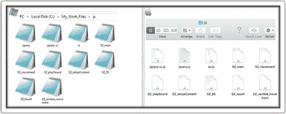

# 一、简介

“如果你有一个花园和一个图书馆，你就拥有了你需要的一切。”

马库斯·图利乌斯·西塞罗(公元前 106—公元前 43 年)

```html
var replaceWord1 = str.replace("garden", "computer");
var replaceWord2 = str.replace("a library", "time");

```

我从 1996 年开始开发软件，至今已经为大大小小的公司开发游戏十多年了。像现实世界中任何形式的开发一样，在考虑编码策略和构建流程之前，您需要知道为什么要构建游戏。在游戏世界中，这以游戏故事的形式出现。这包括背景，玩的理由，游戏的目标。

## 介绍我们的游戏:太空僵尸

这是我们的故事，我们将把它发展成一个游戏。

你好。我的名字是 Ace Star。时间是 2107 年。在过去的三个月里，我一直在仙女座星系唯一的卫星 ZC636 上担任安全警卫。除了我和一群来自地球的政要，还有一群大约 500 名顶尖科学家驻扎在这里进行秘密实验。

我需要你帮我。

昨晚，一个实验室发生了爆炸。一种气体释放出来，把实验室里所有的科学家都变成了僵尸。

我已经在殖民地主楼唯一的门外。其他幸存者都在里面。在地球救援到来之前，我是最后一道防线。

我发现我们的武器对僵尸毫无用处。然而，在跑出实验室时，我发现了一种新的实验性武器。

它似乎有效果。

我能听到他们来了。你准备好了吗？

让我们来看看我们将用于开发的一些图形。

<colgroup><col align="left"> <col align="left"></colgroup> 
|  | 这是我们游戏的背景图片。它将通过水平和垂直拉伸来填充屏幕。我们的僵尸将从地面和天空的交汇处诞生。一旦产卵，它们就会向我们靠近，变得越来越大。 |
|  | 向 Z 教授问好，我们的普通僵尸。就速度而言，他不是很快，也不会突然冲到前面。他只是以自己悠闲的速度向你走来！在我们的武器射击方面，他不会太难或太容易“中和”需要两次电击才能抓到他。 |
|  | 向颠茄说再见，我们最快的僵尸。盯紧她因为她会出现一分钟然后突然冲刺到前面。然而，她不会太难被压制。一次电击就能干掉她。 |
|  | 最后，这是布拉德，我们的重量级僵尸。不幸的是，由于长时间举重，他比一般的僵尸要慢。一旦产卵，它会慢慢加速。然而，他将更难被压制。需要三次电击才能抓到他。 |
|  | 这是我们的英雄在一个实验室找到的实验武器。当发射时，它会喷出一种特殊的液体，如果使用成功，这种液体会将僵尸包裹在一个气泡中。它需要经常重装。 |
|  | 这是我们的重新加载按钮。从游戏设计的角度来看，它为游戏增加了另一个维度。 |
|  | 这是我们游戏的标志。我们将不会看到它，直到本书的最后一章，当我们嵌入我们的游戏。 |
|  | 这是我们将嵌入到游戏中的盒子。最初，你会看到游戏横跨整个屏幕。然而，在接近尾声时，我们看到了将代码嵌入到这个盒子中。 |
|  | 这是我们在最后一章使用的背景图片。背景是当我们建立一个专门的网页来嵌入我们的游戏时使用的主要图像。 |

以下是游戏完成后的截图。


## 设置您的工作环境

本节讨论如何设置工作环境。

### 第一部分:设置我们的文件夹

您需要创建一个工作文件夹来存储您的所有工作文件。这使得将您的工作文件与计算机上的所有其他文件区分开来变得更加容易。所以首先，在 c 盘中创建一个名为`My_Work_Files`的根(或主)文件夹。

一旦你有了根文件夹，下一步就是创建游戏需要的子文件夹。在`My_Work_Files`中创建四个文件夹。将文件夹命名如下:

*   `CSS`
*   `Images`
*   `Raw Images`
*   `js`

你的文件夹应该看起来像下面的截图。


文件夹将保存特殊的代码文件，帮助构建游戏的设计。该文件夹中的所有文件将以`.css`结尾。

文件夹将保存我们所有的 JavaScript 文件，这些文件将构成我们游戏的引擎。它们将包含控制我们游戏中发生的事情的命令和指令。该文件夹中的所有文件将以`.js`结尾。

顾名思义,`Images`文件夹将包含游戏所需的所有图像或媒体文件。

从技术上讲，`Raw Images`文件夹不会用于原始图像。在我们的例子中，我们将使用这个文件夹作为我们所有媒体的临时专用空间。当我们需要它们时，我们会将它们移动到`Images`文件夹中。

### 第二部分:设置我们的文件

出于本书的目的，我将使用记事本(如果你使用苹果电脑，那么我将使用文本编辑)。我发现记事本更简单，更容易使用；但是，几乎任何 IDE(集成开发环境)都可以用于这个项目。因此，请继续使用您最熟悉的 IDE。

如果您确实想使用 IDE，这里列出了一些免费使用的 IDE:

*   月食。这是一个开源编辑器，通常用于 C 和 C++(以及其他高级语言)项目。
*   NetBeans。像 Eclipse 一样，这是一个开源编辑器；然而，它与过多的开发框架捆绑在一起。
*   阿普塔纳。这是一个在 web 开发人员中非常流行的 IDE，它可以插入 Eclipse。通常用于 HTML 项目。
*   代码运行。这是一个有点不寻常的选择，因为它运行在浏览器上(即，它是一个基于 web 的 IDE)。就我个人而言，我发现它非常适合在远程位置进行最后的修复。
*   Visual Studio 社区。这对个人程序员来说是免费的，它包含了 Visual Studio Professional 系列中所有令人惊叹的特性。

虽然使用 IDE 有它的好处，但我认为值得记住这句关于使用 IDE 处理多种语言的名言:“尽管许多 IDE 可以处理多种语言，但很少有人做得很好。此外，如果你才刚刚开始，这可能有些过头了。”

现在文件夹已经设置好了，让我们来创建您将用来开发游戏的文件。

首先，您需要创建一个`default.html`文件。如果使用的是 IDE，请单击“文件”“➤”“新建”,然后选择“HTML”。如果您正在使用记事本，请打开一个新文件，并将其另存为`default.html`。

您的文件夹现在应该看起来像这样:


现在，我们需要在我们创建的一些文件夹中创建文件。双击`js`文件夹。重复前面的步骤(即创建一个新文件，然后另存为)。以下是要输入的文件名:

*   `> SZ_main.js`
*   `> SZ_movement.js`
*   `> SZ_setupContent.js`
*   `> SZ_SS.js`
*   `> SZ_touch.js`
*   `> SZ_zombie_movement.js`

您的`js`文件夹现在应该是这样的:


最后，我们需要在`CSS`文件夹中创建一个文件。重复前面的步骤(即创建一个新文件，然后另存为)。要输入的文件名是

```html
> SZ_master.css.

```

您的`CSS`文件夹现在应该是这样的:


我们需要我们的文件在全球网络上成功地工作，所以我们应该尽量遵守标准化的命名约定。

最好避免在文件名中使用字符空格。从技术上讲，这在本地环境(Apple 和 Windows OS)中是可以接受的，但是，字符空间不被其他系统识别。理想情况下，使用下划线或连字符来分隔文件名中的单词。

不要使用任何特殊字符，例如！, ?、%、#或/。最好将文件名限制为下划线、数字和字母。

对于这个项目，你会注意到，我尝试一致地以`SZ_`开始我所有的文件名。这是因为它们是游戏名字的首字母——太空僵尸。在命名和组织文件时保持一致性和描述性是很重要的，这样就可以清楚地找到特定的数据和文件包含的内容。

通过以有意义的方式命名文件，您可以增加将来找到这些文件并知道它们包含什么信息的机会。当你来开发新游戏时，你将很容易通过搜索所有以`SZ_`开头的文件来定位空间僵尸文件。

最后，保持文件名尽可能短是一个好习惯。除了增加文件的大小，这也让他们更容易记住六个月后的事情。

## 托管和媒体文件

只要文件还在你的硬盘上(之前创建的文件和文件夹)，你就可以在你的电脑上轻松地测试游戏。这对刚起步的开发人员来说当然没问题。

尽管如此，当你开发了几个游戏时，你可能希望展示给所有人看和玩。

为此，您需要将文件上传到服务器计算机上。服务器本质上是一台连接到互联网的计算机。

### 第一部分:您的计算机与托管服务器

你需要在服务器上开一个账户。如果你在谷歌上搜索“服务器托管免费试用”，你有几个选择。如果你仍然不确定，请不要犹豫，在 Twitter 上给我发消息`@zarrarchishti`。


以下是可用主机选项的简短列表。

专用服务器

这是最昂贵的选择。本质上，你拥有连接到互联网的计算机。如果你是一家大公司或经销商，这是唯一的选择。

共享服务器

这通常是托管的最经济的选择。这对像你这样租用服务器的人来说意义重大。当然，主要优势是低得离谱的成本。然而，随着您的游戏开发专业知识的增加，您可能会发现这个选项有局限性，不适合您的特定需求。

云托管

前两个选项依赖于一台物理计算机，而云托管允许无限数量的计算机作为一个系统。

### 第二部分:下载项目的媒体

项目中使用的媒体文件(图像和声音文件)可供您下载。

打开您的互联网浏览器并转到以下 URL:

`http://zarrarchishtiauthor.com/downloads/`

单击下载按钮。这将启动下载。完成后，浏览器会通知您。导航到您的下载文件夹并找到下载的文件。

应该是一个叫`raw_media_1.rar`的文件。现在您需要将这个压缩文件解压到一个名为`Raw Media`的新文件夹中。双击该文件夹，您将看到以下四个文件夹:

*   `> Images`
*   `> JS`
*   `> sounds`
*   `> html_web`

首先，将所有四个文件夹复制到您的`Raw Images`文件夹，它位于`My_Work_Files`文件夹中。

在这个阶段，我们只对`JS`文件夹中的文件感兴趣。随着游戏的进行，我们将回到其他文件夹，根据需要复制文件。双击`JS`文件夹(在`Raw Images`文件夹中)。使用与之前相同的技术复制文件，继续复制所有文件，然后将它们粘贴到您自己的`js`文件夹(在`My_Work_Files`文件夹中)。

您的`js`文件夹(在`My_Work_Files`文件夹中)现在应该是这样的:



暂时就这样吧！我们已经成功地建立了我们的游戏开发环境。我们现在准备开始编码我们的游戏！


我们从`JS`文件夹中复制的文件是特殊的 JavaScript 程序，我们可以在游戏中使用。想象一下由谷歌等公司维护的代码库，其中包含的功能让我们的生活变得更加轻松。

这些文件——例如 jQuery——是快速、小型且功能丰富的 JavaScript 库。它们共同使 HTML 文档遍历和操作、事件处理、动画和 AJAX 等事情变得更加简单，并提供了一个可在多种浏览器上工作的易于使用的 API。

当使用这样的库时，我们不需要担心它们是如何工作的。我们只需要知道他们做了什么，这样我们就可以决定是否要在我们的游戏中使用他们。

使用 jQuery 等库的另一个优点是，它在所有主流浏览器中运行完全相同，包括 Internet Explorer 6！所以不用担心跨浏览器的问题。

通常，我们直接从源服务器链接到这些文件。这样做的好处是，当我们运行游戏时，我们总是得到代码的最新副本。然而，因为我们希望能够离线玩游戏，所以让我们选择将它们下载到本地文件夹中。

1.  在窗口中，是否出现了在此提取的选项？如果没有，需要从下面下载 WinRAR:[`http://www.win-rar.com/download.html`](http://www.win-rar.com/download.html)
2.  你在用笔记本电脑吗？要右击，需要先点击，然后点击鼠标垫。
3.  下载媒体文件时，您是否收到来自浏览器的消息，警告您下载不常用，可能有危险？如果是，这是因为我选择了 WINRAR 而不是 WINZIP 文件。这些文件并不危险。您可以单击“保持”;但是，在打开文件夹之前，请随意对其进行病毒检查。

