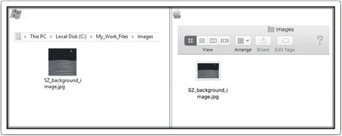
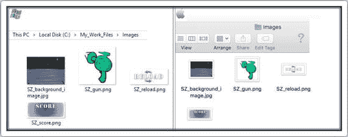

# 二、HTML 入门

> "Nine people can't have a baby in a month."

弗雷德·布鲁克斯

HTML 是一种用于开发网站的标记语言。那么为什么我们的游戏需要这个呢？最好把 HTML 想象成我们游戏的骨架或骨骼结构。

顺便说一下，一旦你完成了这一章，你不仅开始了你的游戏开发之旅，也开始了你的网页开发之旅！

## 你好世界

在我 20 年的编程生涯中，我学习了许多编程语言。我一直在做的第一个项目是学习如何输出单词“Hello World”对着屏幕。我打赌你也遵循这个传统，所以让我们用 HTML 开发一个“Hello World”页面。

使用在第一章的“第二部分:设置我们的文件”一节中使用的相同程序或 IDE，在记事本或文本编辑中打开`My_Work_Files`文件夹中的`default.html`文件。

当文件打开时，它应该是完全空白的。键入以下几行:

```html
<html>
 <head>
 </head>
 <body>
  <div id="SZ_maincontent">
   Hello World.
  </div>
 </body>
</html>

```

导航到菜单，单击文件，然后单击保存。您现在可以关闭该文件了。导航回菜单，单击文件，然后单击退出/关闭。

你准备好测试你的第一个程序了吗？

回到`My_Work_Files`文件夹，双击`default.html`文件。这将在您的默认 Internet 浏览器中打开；比如微软 Edge，谷歌 Chrome，或者 Safari。

在浏览器上打开的页面应该是一个完全空白的页面，上面写着“Hello World”显示在左上角。太好了。我们的程序成功了，我们已经编写了第一段代码！

显然，这还远不是一场游戏。尽管如此，从现在到那时要坚持工作。请放心，到本书结束时，我们将已经开发了整个游戏。这肯定是值得的。你将会学到很多不同的技术来开始你开发一套游戏的旅程！


HTML 代表超文本标记语言。超文本是你在互联网上导航的方法。Hyper 只是意味着它不是线性的，或者你可以通过点击链接去网络上的任何地方。标记是 HTML 标签对其中的文本所做的事情。他们将其标记为某种类型的文本(例如粗体文本)。

以下是您刚刚编码的每个标签的描述:

*   每个新网页的开头和结尾都需要这样做。这两个标签中的所有内容构成了页面的内容。
*   head 标签的内容包括页面标题、脚本、样式和元信息。
*   我们网页的所有视觉内容，如文本、超链接和图像，都包含在这个标签中。
*   这定义了我们页面的一个特定部分。最好将 div 标签视为容器。在更大的 div 标签中包含 div 标签并不罕见。

你会注意到结束标签和开始标签基本上是一样的，前面有一个正斜杠；例如，`</div>`表示您正在关闭那个特定的标签。

请记住，每个标签都必须关闭。

## 背景图像

游戏的背景图像不会改变、移动或与游戏互动。它为所有将被实际游戏控制的各种元素提供了背景。

首先，转到`My_Work_Files`文件夹的`Raw Images`文件夹中的`images`文件夹。找到名为`SZ_background_image.jpg`的文件。你需要将这个文件复制到你的`Images`文件夹中，看起来应该是这样的:



让我们重新打开`default.html`文件。通过选择“Hello World”行并单击删除/退格删除该行。现在键入以下新行(所有新文本都以粗体显示):

```html
<html>
 <head>
 </head>
 <body>
  <div id="SZ_maincontent">
   

  </div>
 </body>
</html>

```

保存文件，然后关闭它。回到`My_Work_Files`文件夹，双击`default.html`文件。

通过使用``标签，我们为页面定义了一个背景图片。需要注意的是，从技术上讲，图像并没有插入到我们的 HTML 页面中；相反，背景图片已经链接到我们的 HTML 页面。标签为背景图像创建了一个保存空间。

“Hello World”文本应该已经消失了，背景图像现在在它的位置上。它看起来不像是覆盖了屏幕。不要担心那个。我们将在下一章调整图片的大小。


在这一节中，您遇到了``标签，当您想要在 web 页面中放置图像时会用到它。

在``标签中，你会注意到

```html
id="SZ0_0"

```

顾名思义，这是图像标签的 ID。当我们在第四章开始用 JavaScript 编码时，会用到这个 ID。

此外，您可能已经注意到了`src`标签:

```html
src="img/SZ_background_image.jpg"

```

`src`，代表“源”，允许您指定图像的位置。在本节的前面，我们将`SZ_background_image.jpg`放在了`images`文件夹中。如您所见，`src`是图像文件的确切位置和名称。

现在，让我们回想一下上一节，我说过你总是需要包含结束标签。在本节的最后，我声明所有的标签都必须关闭。然而，我们刚刚编写的代码没有包含`</img>`。我忘了吗？

我所做的是在开始标签中关闭我们的标签。注意，在我们的`img`标签的末尾，`>`前面有一个正斜杠。如果您不需要在开始标签本身的内容之外添加元素，这是结束标签的另一种方式。

让我们分析一下我们的代码行:

```html


```

我们已经设法将所有关于我们的图像的信息放在开始标记中。不需要额外信息；因此，我们可以通过写`/>`来结束我们的标签。

如果你想知道，下面是同样有效的:

```html
</img>

```

## 添加剩余的图像

以下图片也需要添加到我们的 HTML 页面:

*   `SZ_gun.png`
*   `SZ_reload.png`
*   `SZ_score.png`

当我们完成游戏时，将会有更多的图像；然而，这就是我们在现阶段所需要的一切。

像以前一样，进入`My_Work_Files`文件夹的`Raw Images`文件夹中的`images`文件夹。找到三个新的`.png`文件，并将它们复制到你的`Images`文件夹中，看起来应该是这样的:



现在，重新打开`default.html`文件，键入以下新行(所有新文本都以粗体显示):

```html
<html>
 <head>
 </head>
 <body>
  <div id="SZ_maincontent">
   
   

   

   

  </div>
 </body>
</html>

```

保存文件，然后关闭它。回到`My_Work_Files`文件夹，双击`default.html`文件。

您现在应该会看到三个新图像。您可能需要向下滚动网页。同样，不要担心图像如何出现在页面上。请确保您可以看到之前的背景图像和我们刚刚添加的三个新图像。

在这个阶段，相当多的人问我 HTML5 游戏开发是否和 web 开发人员一样。是的，就像 Xbox 游戏机开发者只是一个 C#/C++表单开发者一样。然而 HTML5 游戏看起来和感觉上都不像一个普通的网站，不是吗？当你开发这个游戏的时候，你会发现一个 HTML5 游戏开发者必须学习作为一个网页开发者的所有知识，甚至更多。你需要弄清楚一个网络开发者的边界在哪里，然后学习为了你的游戏引擎你能把它们推进多远。

在这一章中，我们已经设法将四个初始的图形元素编码到我们的屏幕上。他们可能看起来不太好看，因为他们似乎不在正确的地方，也没有正确的大小。不过不用担心，在下一章中我们将对四张图片应用 CSS，这将使它们准确地对齐我们想要的位置。