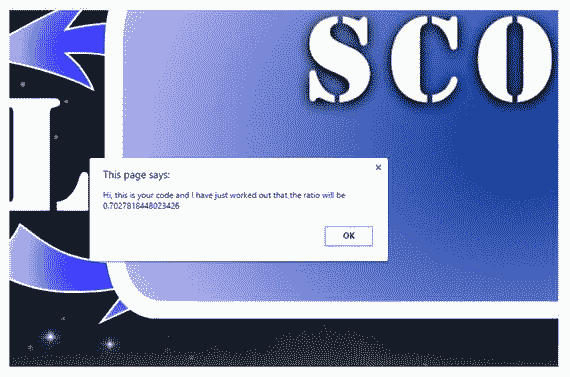
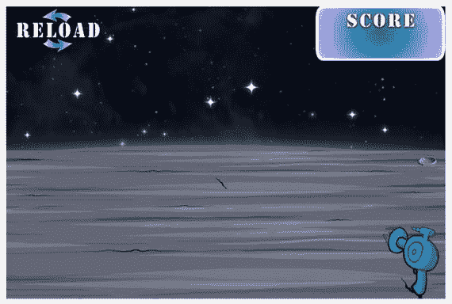

# 四、使用 JavaScript 应用智能

“总是把维护你代码的人想象成一个知道你住在哪里的暴力精神病患者。”

里克·奥斯本

如你所知，HTML 是我们游戏的骨架，CSS 是我们游戏的外观。那么 JavaScript 带来了什么呢？JavaScript 是一种用于在网站中创建交互性的编程语言。所以我们可以说我们使用 JavaScript 作为游戏的主控制器。

那么为什么我们的游戏需要它呢？显而易见的答案是，游戏需要能够创造僵尸，开枪，并响应用户的命令。这是事实，但是游戏需要 JavaScript 来执行大量的其他工作。例如，在前一章中，我们发现需要根据浏览器的大小来调整图像的大小。现在让我们用 JavaScript 来做这件事。

## 为什么我们需要调整大小？

我们的游戏可以在多种设备上玩；电脑，笔记本电脑，移动设备，平板电脑，甚至连接到大电视的控制台。在这些设备中，有许多不同的屏幕尺寸。手机和笔记本电脑有各种各样的屏幕尺寸。

让我们更进一步。如果有人调整了互联网浏览器窗口的大小，该怎么办？现在我们正在谈论无限多的组合。

为一切可以想象的事物创建图形将是极其耗时的。事实上，这是不可能的，因为似乎总是有新型号的手机(因此，新的屏幕尺寸)或新的电脑显示器问世。因此，我们需要找到一种通用的方法来调整任何屏幕尺寸的图像。

## 我们如何普遍调整大小？

如果你手边有一把 30 厘米的尺子，那就看看吧。想象我们为 15 厘米标记设计游戏。我们可以使用 JavaScript 来告诉我们标尺上的实际尺寸。所以我们假设它返回为 10 厘米。然后，我们可以计算出一个比率(即 10 除以 15)，该比率可用于所有测量；十除以十五是 0.67。这意味着当我们将它应用到我们的图像时，它们会变得更小，这正是我们想要的。同样，如果尺寸变大了，比如说 20 厘米，比例会反映这一点，并使所有图像比我们设计的要大。

让我们写一个函数来计算这个比率。打开`SZ_main.js`。这个文件应该是完全空白的。键入以下几行:

```html
//global vars
  //need to store the ratio
    var ratio;
  //need easy access to the width
    var newWidth;
//function that gets called when game starts
$(window).load(function () {
    //need to grab an instance of our screen
    var div = $(window);
    //we can now work out the ratio
    ratio = (div.width() / 1024);
    //while we are here we can grab the width for future use
   newWidth = div.width();
});

```

您现在可以保存并关闭该文件。

各种 JavaScript 术语的定义可以在下面的进一步信息部分找到。另一件要注意的事情是，我试图输入尽可能多的注释来解释我们的代码行(正如您在自己的编程语言中所习惯的那样)。

在测试之前，我们需要将这个文件链接到我们的`default.html`文件。因此，让我们重新打开`default.html`并键入以下三个新行(所有新文本都以粗体显示):

```html
<html>
 <head>
  <script src="js/jquery.js"></script>

  <script src="js/jquery-ui.js"></script>

  <script src="js/SZ_main.js"></script>

  <link href="css/SZ_master.css" rel="stylesheet" />
 </head>
 <body>
  <div id="SZ_maincontent">
   
   
   
   
  </div>
 </body>
</html>

```

保存文件，然后关闭它。

这三个新行包含了`<script>`标签。在我们的例子中，我们选择通过`src`属性将这个标签链接到一个外部脚本文件。或者，我们可以使用相同的标记来定义包含脚本语句的客户端脚本。

现在双击`default.html`文件。

什么都没有改变，是吗？这是因为 JavaScript 代码在后台执行任务。此外，我们还没有告诉它对我们的图像做任何事情。我们所做的只是在代码中存储一个值(即比率)。

尽管如此，看看我们的第一部分代码是否正常工作还是不错的。让我们添加一行代码，在屏幕上显示一个消息框。在这个框中，我们将输入代码刚刚计算出的比率值。这并不十分令人兴奋，但至少我们从代码中获得了某种形式的反馈。这太令人兴奋了。

现在打开`SZ_main.js`文件，键入以下新行(粗体部分):

```html
//global vars
  //need to store the ratio
    var ratio;
  //need easy access to the width
    var newWidth;
//function that gets called when game starts
$(window).load(function () {
    //need to grab an instance of our screen
    var div = $(window);
    //we can now work out the ratio
    ratio = (div.width() / 1024);
    //while we are here we can grab the width for future use
   newWidth = div.width();

 //We are adding in a temporary bit of code here

  window.alert("Hi this is your code and I have just worked out that the ratio will be "+ratio);

});

```

我们现在可以保存并关闭该文件。

我们刚刚使用了`window.alert()`方法，它通常显示一个带有指定消息和 OK 按钮的警告框。通常，警告框用于确保重要信息显示给用户。在我们的例子中，我们使用警告框来通知我们一个变量的值，在我们的代码中，这个值是我们无法访问的。

我应该注意到，警告框通过迫使浏览器阅读消息，将焦点从当前窗口移开。我不建议过度使用这种方法，因为它会转移用户玩游戏的注意力，直到盒子关闭。

回到我们的`My_Work_Files`文件夹，双击`default.html`文件。您应该会看到我们的网站有一个消息框:



我们这里有我们的代码与我们交谈。它告诉我们，它计算出的比值。

在继续之前，我们需要删除刚刚添加的两行。打开`SZ_main.js`文件。删除这两行代码后，代码应该再次显示如下:

```html
//global vars
  //need to store the ratio
    var ratio;
  //need easy access to the width
    var newWidth;
//function that gets called when game starts
$(window).load(function () {
    //need to grab an instance of our screen
    var div = $(window);
    //we can now work out the ratio
    ratio = (div.width() / 1024);
    //while we are here we can grab the width for future use
   newWidth = div.width();
});

```

在这本书里，你会创造出许多奇妙的功能，毫无疑问，在你继续开发的游戏里也是如此。然而，我希望你们珍惜这一刻，就像我在 1994 年学习 Pascal 编码时一样。


窗口框没有出现吗？别担心。以下建议之一应该会有所帮助:

*   返回并重新检查每一行代码是否相同
*   你是否漏掉了行尾的分号(`;`)？
*   您是否确保在 HTML 文件中添加了三行代码？
*   `js`文件夹中的九个文件是否都在它们应该在的位置？

如果你的代码仍然不工作，那么请不要犹豫，在 Twitter 上给我发消息`@zarrarchishti`。

接下来，我们将让这个比例发挥作用。


什么是函数？

我们会用 JavaScript 写很多函数。函数只是一组指令，当函数本身被调用运行时执行这些指令。所以当我们的函数被调用时，它决定了比例并存储了屏幕的宽度。

为什么//开头的台词写的像会话英语？

当你用双正斜杠(`//`)开始一行时，你是在告诉计算机忽略这一行。你为什么要这么做？它是为我们准备的，叫做评论热线。它的目的是给我们自己(或者其他程序员)留言。通过留下信息，我们打破了代码，使整个程序更容易阅读。你可以写任何你喜欢的东西。我喜欢用它来解释为什么注释后的代码是原来写的。

您不必注释每一行；然而，我总是被教导要注释尽可能多的代码行。对于一些程序员来说，这可能显得有些过火；然而，我发现当我几年后回到我的代码时，我写的注释帮助我理解了代码背后的推理。

为什么我们将另外两个文件添加到我们的 HTML 文件中？

说到添加`SZ_main.js`文件，我们还添加了 jQuery 和 jQuery-UI 文件。这些基本上都是高级函数(就像你写的那个)。只要我们使用它们的函数，我们所要做的就是将它们添加到我们的 HTML 中。

这些功能快速、可靠且功能丰富。世界上一些最大的公司使用它们，像我们这样的小游戏开发者也使用它们。

现在让我们看看我们写的一些 JavaScript 代码。

*   `var ratio` `;`我们在这里声明一个叫做`ratio`的变量。变量是可以存储数据的容器。我们可以将数据转换成比率并从中读取。
*   一旦整个页面加载完毕，这个函数就会被调用。这使得它非常有用，因为这个函数内部的指令要求元素(例如，图像)出现并加载到屏幕上。
*   `var div` `= $(window);`正如我们之前发现的，`var`创建了一个容器来存储数据。然而，在这种情况下，我们使用它来传递整个窗口的实例。这个名为`div`的变量现在包含了所有关于我们窗口的重要信息。例如，我们继续使用下面的语句。
*   `newWidth` `= div.width();`这意味着我们可以将窗口的宽度存储在名为`newWidth`的变量中。

## 让我们调整图像的大小

提醒一下，这些是理想尺寸的图片:

*   `SZ_gunWidth 133px`和`Height 150px`
*   `SZ_reloadWidth 200px`和`Height 90px`
*   `SZ_scoreWidth 235px`和`Height 100px`

打开`js`文件夹中的`SZ_setupContent.js`文件。当文件打开时，它应该是完全空白的。键入以下几行:

```html
//main function
  function main_call_setupContent() {
   //need to resize all elements
   //first we set their normal sizes in CSS

   //Gun
    $('#SZ0_1').css('width', 150 * ratio);
    $('#SZ0_1').css('height', 150 * ratio);

   //Reload Button
    $('#SZ0_2').css('width', 200 * ratio);
    $('#SZ0_2').css('height', 90 * ratio);

   //Score
    $('#SZ0_3').css('width', 235 * ratio);
    $('#SZ0_3').css('height', 100 * ratio);

}

```

保存并关闭该文件。

在某些时候，您可能希望重新访问这个函数并重新编码这个流。我建议您将图像 id 的值放入一个数组中；例如，

```html
var image_ids= ["#SZ0_1","#SZ0_2","#SZ0_3"];

```

然后，您还需要将每个图像的值放入另一个数组中；例如，

```html
var image_sizes = [ [150, 150], [200, 90], [235, 100] ];

```

然后，您可以编写一个`for loop`来执行相同的代码三次，用 ID 数组中的下一个值替换 ID，用 size 数组中的值替换宽度和高度值。

打开`SZ_main.js`文件，输入以下新行(新文本以粗体显示):

```html
//global vars
  //need to store the ratio
    var ratio;
  //need easy access to the width
    var newWidth;
//function that gets called when game starts
$(window).load(function () {
    //need to grab an instance of our screen
    var div = $(window);
    //we can now work out the ratio
    ratio = (div.width() / 1024);
    //while we are here we can grab the width for future use
   newWidth = div.width();

    //let’s apply the ratio to our elements

    main_call_setupContent();

});

```

在测试之前，我们需要将这个文件链接到我们的`default.html`文件。重新打开`default.html`文件并输入以下行(新文本以粗体显示):

```html
<html>
 <head>
  <script src="js/jquery.js"></script>
  <script src="js/jquery-ui.js"></script>
  <script src="js/SZ_main.js"></script>
  <script src="js/SZ_setupContent.js"></script>

  <link href="css/SZ_master.css" rel="stylesheet" />
 </head>
 <body>
  <div id="SZ_maincontent">
   
   
   
   
  </div>
 </body>
</html>

```

回到`My_Work_Files`文件夹，双击`default.html`文件。现在，您应该可以看到三个元素的大小已经调整，如下面的屏幕截图所示:



恭喜你！我们现在已经完成了游戏的第一部分！我们将在接下来的章节中进一步开发这个游戏。然而，主要的构建模块已经完成。从现在开始，我们将添加更多的 HTML，更多的 CSS，是的，甚至更多的 JavaScript，直到我们的游戏最终可以玩。


理想的尺寸从何而来(比如枪:宽 175px，高 200px)？

在任何开发可以开始之前采取的步骤是每个屏幕的布局设计。这是你在屏幕上放置元素的地方，比如枪。

你首先需要选择一个正常的尺寸。在我们的例子中，我们选择了屏幕宽度 1025px 和高度 800px。当然，用户拥有这种精确屏幕尺寸的可能性非常小。这也是我们之前算出比例的原因。

您可以使用任何软件设计程序(如 Macromedia Photoshop 或 Fireworks)来创建布局文件。一旦我们创建了大小为 1024 × 800 的新画布，我们就可以调整元素的大小并将其重新定位在画布上我们想要的位置。例如，我们把枪放在右下角，宽 175 像素，高 200 像素。

现在，我们可以将我们的比例应用到宽度和高度，以获得所使用的屏幕的准确大小。

我们用 JavaScript 创建了如下函数:

*   `function main_call_setupContent()` `{`需要注意的是，在我们调用这个函数之前，这个函数中的指令不会被执行，这是我们在`SZ_main.js`中通过调用`main_call_setupContent();`完成的。
*   `main_call_setupContent()` `;`现在指令才被程序执行。

最后，让我们看看下面一行代码:

*   我们可以直接从 JavaScript 中操作一个元素的 CSS。这是游戏开发中一个非常强大和有用的工具。例如，如果我们希望一个元素在拍摄后变大，我们可以直接从用于识别按钮点击的 JavaScript 代码中完成。