# 五、尝试一下：第一部分

代码从不说谎，但注释有时会说谎

罗恩·杰弗里斯

在这一章中，我们将研究我们想要我们的枪做什么。当用户按下屏幕上的任何地方，除了重新加载按钮，它应该被视为一个镜头。射击是如何发生的以及射击的后果在第七章中讨论。现在，让我们看看对用户点击的反应。

将会有一些令人敬畏的技术被使用，包括用于动画的精灵表和用于流体运动的数学。当你将来开发其他游戏时，你可能会发现自己会回来重用这些功能和技术。这正是商业游戏开发中发生的事情。

顺便说一下，这一章中的一些代码来自我最近为一个儿童游戏做的一个项目，这个项目在格拉斯哥的 Kelvingrove 艺术画廊和博物馆举办。

## 改变我们的光标并记录一次点击

在我们正在开发的射击游戏中，鼠标光标通常会变成十字准线。

只需使用 CSS 就可以改变光标。打开我们的`CSS`文件夹中的`SZ_master.css`文件。键入以下新行(粗体):

```html
html {
      height: 100%;
     }

+
body {
       padding: 0 0 0 0;
       margin: 0;
       user-select: none;
       cursor: crosshair;

     }
img  {
       max-width: 100%;
       height: auto;
       user-drag: none;
       user-select: none;
       -moz-user-select: none;
       -webkit-user-drag: none;
       -webkit-user-select: none;
       -ms-user-select: none;
     }
#SZ0_0 {
        posi
tion: fixed;
        top: 0;
        left: 0;
        min-width: 100%;
        min-height: 100%;
      }
 #SZ0_1 {
        position: fixed;
        bottom: 0;
        right: 0;
}
 #SZ0_2 {
        position: fixed;
        top: 0;
        left: 0;
}
 #SZ0_3 {
        position: fixed;
        top: 0;
        right: 0;
}

```

保存文件，然后关闭它。回到我们的`My_Work_Files`文件夹，双击`default.html`文件。

请注意，鼠标光标已从箭头变为十字光标。

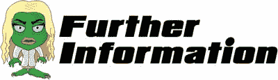

我们刚刚写的那行是什么？

`cursor: crosshair;`指定用鼠标点击时显示的光标类型。

您可能想知道还有哪些其他类型的光标可供您使用。以下是光标类型的列表。如果您愿意，可以将 CSS 文件中的单词 crosshair 替换为这些单词中的任何一个。

*   电子调整大小
*   移动
*   西北-调整大小
*   s-调整大小
*   文本
*   不掉线
*   夺取
*   n-调整大小
*   指针
*   se-调整大小
*   w-调整大小
*   不允许
*   帮助
*   重新调整大小
*   进步
*   SW-调整大小
*   等待

## 让我们的枪更真实

对用户来说，游戏越吸引人，他们就越喜欢一遍又一遍地玩。增加用户参与度的方法之一是在游戏中加入一些小细节。例如，如果当用户在屏幕上移动光标时，枪会做出反应，这不是很好吗？

为此，我们将使用 JavaScript。打开`js`文件夹中的`SZ_movement.js`文件。当文件打开时，它应该是完全空白的。键入以下几行:

```html
function rotateGun(e) {
//using the e value we can deduce the X co-ordinates
var xPos = e.clientX;

//We need to work out where the mouse cursor is as a percentage of the width of the screen

//We will work this out by dividing the current X position by the overall screen width which if you remember we put in newWidth
var currentXPositionPercentage = xPos/newWidth;

//We now want to apply this
to the maximum amount of rotation which is 50 however the starting rotation is -15 not 0
var amountToRotate = -15 + (currentXPositionPercentage * 50);

//Let’s rotate the gun!
  $("#SZ0_1").css('transform', 'rotate('+amountToRotate+'deg)');
}

```

我们现在可以保存并关闭该文件。

下面的“更多信息”一节详细解释了该代码。

在测试之前，我们需要将这个文件链接到我们的`default.html`文件。重新打开`default.html`文件，并在我们现有的一行中键入以下新行和额外的文本(所有新文本都以粗体显示):

```html
<html>
 <head>
  <script src="js/jquery.js"></script>
  <script src="js/jquery-ui.js"></script>
  <script src="js/SZ_main.js"></script>
  <script src="js/SZ_setupContent.js"></script>
  <script src="js/SZ_movement.js"></script>

  <link href="css/SZ_master.css" rel="stylesheet" />
 </head>
 <body>
  <div id="SZ_maincontent">
   
   
   
   
  </div>
 </body>
</html>

```

保存文件，然后关闭它。现在双击`default.html`文件。

试着沿着屏幕移动鼠标。枪应该旋转，就好像瞄准我们要射击的目标。我相信你会同意这比一把静止的枪更吸引人。

我想讨论一下前面代码中的一个有趣的地方。`onmousemove`顾名思义，当用户将鼠标移动到图像上时，触发一个 JavaScript 函数。它不会在手机等触摸屏设备上触发。您可能希望将来重新访问这部分代码，并修改它，以便当用户触摸图像的任何部分时它都会触发。

接下来，我们将看看使枪开火！

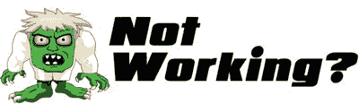

代码不起作用吗？其中一行不同于我们通常添加代码的方式。让我们一起经历这一切:

打开`default.html`文件。

找到以开始的行

```html


```

你是否完全按照显示的那样添加了额外的文本？

添加以下案文:

```html
onmousemove="rotateGun(event)"

```

在...之间

```html
id="SZ0_0" and src="

```

如果你的代码仍然不工作，那么请不要犹豫，在 Twitter 上给我发消息`@zarrarchishti`。

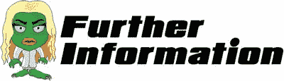

我们用 JavaScript 写了下面一行:

```html
var xPos = e.clientX;

```

按如下方式将`e`传递给我们的函数:

```html
function rotateGun(e) {

```

`e`包含已发生事件的所有信息。在本例中，是鼠标在我们的图像上移动，我们声明如下:

```html


```

当用户将鼠标移动到这个图像上时，我们的`rotateGun`函数被调用，移动的数据被传入。

在第一行中，您可以看到我们从`e`中提取了“clientX”。这是刚刚发生的鼠标事件的水平坐标(通常称为 x 轴)。

那么这个 X 轴是什么？试着把你的屏幕从左到右的用户动作想象成 X 轴。下图说明了我们想要的 X 轴和枪的旋转之间的关系。

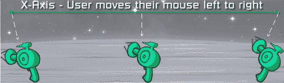

最左边和最右边的枪之间的最大旋转是 50 度。因此，通过找出我们在屏幕上的确切位置，我们可以使用一个数学方程来确定枪的确切旋转角度。

还有一点:我们用来实际旋转枪的代码是通过使用 JavaScript 和 CSS 来完成的。JavaScript 通过执行以下操作来完成大部分工作:

*   每次用户移动鼠标时提醒一个功能
*   已确定鼠标移动了多少
*   将上面的值应用到我们的数学方程中

从这里，我们把这个值交给 CSS，然后它实际上旋转枪。

随意摆弄数字，测试出现的不同旋转；例如，更改以下行

```html
var amountToRotate = -15 + (currentXPositionPercentage * 50);

```

把 50 改成 100。你会注意到枪的移动方式有了更大的变化。不断改变数字，直到你达到你满意的旋转水平。如果您想返回，只需键入前面的代码。

最后，我们在下面一行中遇到了另一个在 JavaScript 中操作 CSS 的例子:

```html
$("#SZ0_1").css('transform', 'rotate('+amountToRotate+'deg)');

```

顾名思义，`transform`属性将变换应用于任何元素。其他转换包括`scale`、`move`和`skew`。

## 用精灵表制作枪的动画

当用户点击屏幕时，我们想让我们的枪开火。为了做到这一点，我们将使用一种叫做 sprite sheets 的东西。在开始添加 sprite 工作表之前，我们需要编写一些代码。这是因为 sprite 工作表不是你的浏览器(例如 Chrome)可以像处理我们目前使用的图片那样单独处理的。

我们需要编写一些代码来指导浏览器如何处理我们的 sprite 工作表图像。为此，我们将使用 JavaScript。提醒一句，这段代码比你目前所写的稍微长一点。我鼓励你坚持下去，因为这个特殊的函数可以在你做的每个项目中重用，而不需要改变代码中的任何东西。请确保您完全按照所示复制所有代码。

### 第一部分

打开`js`文件夹中的`SZ_SS.js`文件。当文件打开时，它应该是完全空白的。键入以下几行:

```html
//We need a one stop function that will allow us to process sprite sheets
function setup_SpriteSheet(div_name, image_name, no_of_frames, widthx, heightx) {

 //need the ratio of the container's width/height
   var imageOrgRatio =  $(div_name).height() / $(div_name).width() ;

 //need to ensure no trailing decimals
   var ratio2 = Math.round(ratio * 10) / 10;

 //check that the width is completely divisible by the no of frames
   var newDivisible = Math.round((widthx * ratio2) / no_of_frames);

 //the new width will be the number of frames multiplied by our new divisible
   var newWidthx = newDivisible * no_of_frames;

 //also the new height will be our ratio times the height of the div containing our image
   var newHeightx = heightx * ratio2;

 //apply our new width to our CSS
   $(div_name).css('width', (newWidthx));

 //apply our new height to our CSS
   $(div_name).css('height', newHeightx);
//
 //take the image name and apply as a background image to our div
   $(div_name).css('background-image', 'url(' + image_name + ')');

 //finally we need to apply a background size remembering we need to multiply width by the number of frames
    $(div_name).css('background-size', newWidthx * no_of_frames + 'px ' + newHeightx + 'px');
}

```

最初，我只是想添加一个标准的 sprite 工作表库；但是，通过我们自己编码，我们在未来的游戏中有更多的灵活性。随着你构建更多的游戏，你会发现并不是所有的 sprite sheet——或者使用它们的所有参数——都是相同的。因此，您需要重新访问前面的函数并对其进行调整，以确保它适合您当前的项目。如果我们只使用一个标准函数，它将严重限制你可以使用的 sprite 表的类型。

与所有其他标准函数一样，只要我们将来将这个文件链接到任何 HTML 文件，就可以使用我们的小函数。

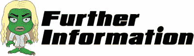

什么是雪碧床单？

sprite sheet 是一种特殊的图像，它在平铺的网格排列中包含几个图像。

那么为什么要用雪碧床单呢？

Sprite sheets 让游戏运行得更快，更重要的是，占用更少的内存。通过将几个图形编译成一个文件，你可以让你的游戏在只需要加载一个文件的时候就可以使用这些图形。

雪碧床单是怎么设计的？

我们的精灵表有三个部分。第一，正常的静态是枪重新装弹的时候，枪开火的时候。下面说明了这一点:

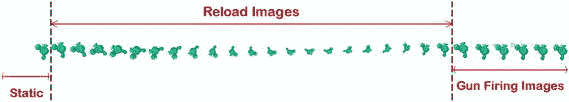

为什么我们需要编写自己的特殊函数来使用 sprite 工作表？

有许多方法来处理雪碧表。每个程序员设计他们的代码来操作适合他们的 sprite 表。我在这里使用了一个非常简单的方法，处理线性布局的精灵。

此外，我们的游戏不需要复杂的使用任何精灵表。由于您正在编写所有的代码，我想确保您只需要编写最少的代码。然而，你可以使用这些代码作为你下一个游戏的基础，并在你认为必要的时候在其上进行构建。

### 第二部分

既然我们已经设置了处理任何 sprite 表的函数，我们可以用我们的枪来测试它。首先，我们需要用 sprite sheet 版本替换我们枪的静态图像。

转到`My_Work_Files`文件夹的`Raw Images`文件夹中的`images`文件夹。将名为`SZ_gun_SS.png`的文件复制到`Images`文件夹，现在看起来应该像下面的截图。

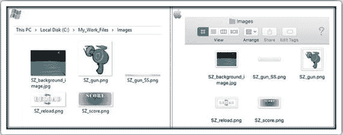

### 第三部分

接下来，我们需要通知代码枪是一个 sprite 表，并传递关于它的所有信息(例如，您复制的图像名称)。

我们将使用 JavaScript 来做到这一点。重新打开`js`文件夹中的`SZ_SS.js`文件。键入以下新行(所有新文本都以粗体显示):

```html
//We need a one stop function that will allow us to process sprite sheets
function setup_SpriteSheet(div_name, image_name, no_of_frames, widthx, heightx) {

 //need the ratio of the container's width/height
   var imageOrgRatio =  $(div_name).height() / $(div_name).width() ;

 //need to ensure no trailing decimals
   var ratio2 = Math.round(ratio * 10) / 10;

 //check that the width is completely divisible by the no of frames
   var newDivisible = Math.round((widthx * ratio2) / no_of_frames);

 //the new width will be the number of frames multiplied by our new divisible
   var newWidthx = newDivisible * no_of_frames;

 //also the new height will be our ratio times the height of the div containing our image
   var newHeightx = heightx * ratio2;

 //apply our new width to our CSS
   $(div_name).css('width', (newWidthx));

 //apply our new height to our CSS
   $(div_name).css('height', newHeightx);
//
 //take the image name and apply as a background image to our div
   $(div_name).css('background-image', 'url(' + image_name + ')');

 //finally we need to apply a background size remembering

we need to multiply width by the no of frames
    $(div_name).css('background-size', newWidthx * no_of_frames + 'px ' + newHeightx + 'px');
}

//setup the Gun

function setup_gun_SS(){

 //first let’s setup our gun SS

   setup_SpriteSheet("#SZ0_1","img/SZ_gun_SS.png",28,150,150);

 //need to access a special function in our js/ss.js file

    $("#SZ0_1").animateSprite({

        fps: 10,

        animations: {

            static: [0],

            reload: [1,2,3,4,5,6,7,8,9,10,11,12,13,14,15,16,17,18,19,20,21,22,23],

            fire: [24,25,26,27,28],

        },

        duration: 50,

        loop: false,

        complete: function () {

            // use complete only when you set animations with 'loop: false'

            //alert("animation End");

        }

    });

}

```

保存并关闭文件。

为一个特定的动画编写所有不同的帧会变得非常乏味。想象一下，如果你有超过 500 帧！将来，当重新访问`animateSprite`函数时，将其更改为取一系列值。您也可以尝试编写函数来获取一组范围；例如，帧(1 到 7、9 到 11 和 29 到 31)。

在测试之前，我们需要对 HTML 文件进行以下两项更改:

*   在头部引用新的 JavaScript 文件
*   将图像包含在它们自己的`div`中

重新打开`default.html`文件并键入以下新行。请小心替换现有的代码行，使整个文件看起来像下面的代码(所有新文本都以粗体显示):

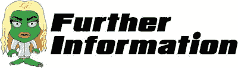

```html
<html>
 <head>
  <script src="js/jquery.js"></script>
  <script src="js/jquery-ui.js"></script>
  <script src="js/SZ_main.js"></script>
  <script src="js/SZ_setupContent.js"></script>
  <script src="js/SZ_movement.js"></script>
  <script src="js/ss.js"></script>

  <script src="js/SZ_SS.js"></script>

  <link href="css/SZ_master.css" rel="stylesheet" />
 </head>
 <body>
  <div id="SZ_maincontent">
   
   <div id="SZ0_1" ></div>

   <div id="SZ0_2" >

    

   </div>

   <div id="SZ0_3" >

    

   </div>

  </div>
 </body>
</html>

```

在本节中，我们用下面的代码设置了第一个 sprite 表:

```html

setup_SpriteSheet

("#SZ0_1","img/SZ_gun_SS.png",28,150,150);

```

让我们分别考虑括号中的每个参数。

*   `#SZ0_1`是图像 ID
*   `img/SZ_gun_SS.png`是精灵工作表的位置
*   `28`是我们的 sprite 工作表中包含的图像总数
*   `150,150`是 sprite 工作表中每个单独图像的大小

您可能已经注意到，我们对图像应用了一个特殊的功能。让我们仔细看看这个函数的每一行。

*   `fps:`我们希望应用于精灵工作表动画的理想每秒帧数
*   我们可以将一个 sprite 表中的图像细分成单独的动画
*   `duration` `:`我们希望每个动画运行的时间长度(以毫秒为单位)
*   `loop` `:`一旦动画结束，我们希望动画重复播放还是停止播放？
*   `complete: function () {`如果`loop`选项设置为假(即不重复)，那么一旦动画完成，我们可以给出一组要执行的指令。

### 第四部分

最后，我们需要确保我们调用的是`setup_gun_SS`函数。我们可以在`SZ_setupContent`文件中这样做，它初始化我们所有的图像。

打开`SZ_setupContent.js`文件，输入以下新行(所有新文本以粗体显示)。

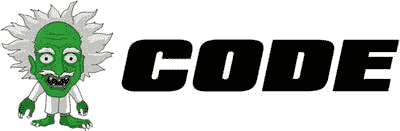

```html
//main function
  function main_call_setupContent() {
   //need to resize all elements
   //first we set their normal sizes in CSS

   //Gun
    $('#SZ0_1').css('width', 150 * ratio);
    $('#SZ0_1').css('height', 150 * ratio);

   //Reload Button
    $('#SZ0_2').css('width', 200 * ratio);
    $('#SZ0_2').css('height', 90 * ratio);

   //Score
    $('#SZ0_3').css('width', 235 * ratio);
    $('#SZ0_3').css('height', 100 * ratio);

    //Any sprite sheets?

      //Our Gun

        setup_gun_SS();

}

```

我们现在准备测试！但是，不要期望太高，因为我们最初告诉代码只显示第一张图片。因此，让我们测试一下，确保我们的代码按预期运行。

保存所有文件，然后关闭它们。回到`My_Work_Files`文件夹，双击`default.html`文件。枪应该和以前一模一样。事实上，整个屏幕看起来应该是一样的。这很好，因为我们已经用一个 sprite 表替换了静态的枪图像，并告诉它显示第一个图像。

接下来，我们看看如何使用我们编写的代码来制作枪支重新上膛的动画。

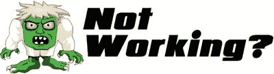

为什么我的屏幕看起来和以前一样？

这是个好消息。做了这么多工作之后，我想期待有所不同是很自然的。也许是一些像开枪这样的动画。

事实上，尽管我们删除了枪的图像并用大规模的 sprite sheet 图像替换它，但一切看起来都很正常，这正是我们希望从代码中得到的。

枪已经不在屏幕上了。

由于这是很大一部分代码，下面是一些可能发生的典型编码错误的建议:

*   回顾每一行代码，确保它与书中所写的一致。
*   检查您是否将`}`符号放置在指示的位置。
*   确保`SZ_gun_SS.png`在`images`文件夹中。
*   确保在 HTML 文件的头部包含了两个新的 JavaScript 文件(即`ss.js`和`SZ_SS.js`)。

这把枪看起来不对劲。

要么是枪看起来比它应该的要大得多，要么看起来像是图像的一部分被切掉了。这意味着枪的精灵表的设置方式有问题；特别是`SZ_SS.js`文件中的`setup_gun_SS()`函数。请重新检查您的代码，确保所有代码行都完全如所示。

如果你的代码仍然不工作，那么请不要犹豫，在 Twitter 上给我发消息`@zarrarchishti`。

## 给我们的枪装子弹

我们需要专注于重新装弹的两个方面:原因和结果。原因是用户点击了屏幕上的重新加载图像。效果是枪从 sprite 表中激活适当的图像。

打开`js`文件夹中的`SZ_touch.js`文件。当文件打开时，它应该是完全空白的。键入以下几行:

```html
//this function is called to reload our gun
function reloadGun(e) {
      //play the reload animation of our SS
       $("#SZ0_1").animateSprite("play", "reload");
}

```

保存并关闭该文件。

当重新访问这个项目时，为重新加载序列提供选项是一个好主意。如果枪是空的，我建议一个较长的序列，如果枪不是空的，我建议一个较短的序列。您需要定义两个 reload 函数，然后在调用 reload 函数之前检查枪的状态。这样，你就是在奖励用户在枪没子弹之前重新装弹！

在测试之前，我们需要将这个文件和函数链接到`default.html`文件。重新打开`default.html`文件，键入以下新行和对现有行的添加(全部以粗体显示):

```html
<html>
 <head>
  <script src="js/jquery.js"></script>
  <script src="js/jquery-ui.js"></script>
  <script src="js/SZ_main.js"></script>
  <script src="js/SZ_setupContent.js"></script>
  <script src="js/SZ_movement.js"></script>
  <script src="js/ss.js"></script>
  <script src="js/SZ_SS.js"></script>
  <script src="js/SZ_touch.js"></script>

  <link href="css/SZ_master.css" rel="stylesheet" />
 </head>
 <body>
  <div id="SZ_maincontent">
   
   <div id="SZ0_1" ></div>
   <div id="SZ0_2" >
    
   </div>
   <div id="SZ0_3" >
    
   </div>
  </div>
 </body>
</html>

```

保存文件，然后关闭它。回到`My_Work_Files`文件夹，双击`default.html`文件。

当屏幕出现时，尝试单击重新加载按钮。你应该看到枪会动。这一次，在第一个动画完成之前，单击几次该按钮。不顺利吧？我们需要解决这个问题，使枪不接受重新加载请求，直到前一个已经完成。

重新打开`js`文件夹中的`SZ_touch.js`文件。键入以下新行(粗体):

```html
//this function is called to reload our gun
function reloadGun(e) {
      //play the reload animation of our SS
       $("#SZ0_1").animateSprite("play", "reload");
}

//We need a flag to keep track to avoid repetition of animations before the first has finished

var canIclick= 0;

//this function is called to reload our gun
function reloadGun(e) {
 //Let’s check if we can allow this to occur

   if(canIclick== 0){

     //looks like we can so we better set our flag

       canIclick=1;

       $("#SZ0_1").animateSprite("play", "reload");
    }

}

```

保存并关闭该文件。回到`My_Work_Files`文件夹，双击`default.html`文件。同样，在第一个动画完成之前，单击几次重新加载按钮。问题已经解决了。

然而，我们现在有另一个问题:游戏只接受一次重新加载请求。我们不能在第一次尝试后让枪重新装弹。这是因为我们没有在代码中的任何地方重置我们的标志。所以让我们现在就开始吧。重新打开`SZ_SS.js`文件，键入以下新行(粗体):

```html
//We need a one stop function that will allow us to process sprite sheets
function setup_SpriteSheet(div_name, image_name, no_of_frames, widthx, heightx) {

 //need the ratio of the container's width/height
   var imageOrgRatio =  $(div_name).height() / $(div_name).width();

 //need to ensure no trailing decimals
   var ratio2 = Math.round(ratio * 10) / 10;

 //check that the width is completely divisible by the no of frames
   var newDivisible = Math.round((widthx * ratio2) / no_of_frames);

 //the new width will be the number of frames multiplied by our new divisible
   var newWidthx = newDivisible * no_of_frames;

 //also the new height will be our ratio times the height of the div containing our image
   var newHeightx = heightx * ratio2;

 //apply our new width to our CSS
   $(div_name).css('width', (newWidthx));

 //apply our new height to our CSS
   $(div_name).css('height', newHeightx);
//
 //take the image name and apply as a background image to our div
   $(div_name).css('background-image', 'url(' + image_name + ')');

 //finally we need to apply a background size remembering we need to multiply width by the no of frames
    $(div_name).css('background-size', newWidthx * no_of_frames + 'px ' + newHeightx + 'px');
}

//setup the Gun
function setup_gun_SS(){
 //first let’s setup our gun SS
   setup_SpriteSheet("#SZ0_1","img/SZ_gun_SS.png",28,150,150);
 //need to access a special function in our js/ss.js file
    $("#SZ0_1").animateSprite({
        fps: 10,
        animations: {
            static: [0],
            reload: [1,2,3,4,5,6,7,8,9,10,11,12,13,14,15,16,17,18,19,20,21,22,23],
            fire: [24,25,26,27,28],
        },
        duration: 50,
        loop: false,
        complete: function () {
            // use complete
only when you set animations with 'loop: false'
            //alert("animation End");
            //we need to reset our universal flag

              canIclick=0;

        }
    });
}

```

保存并关闭该文件。

当重新访问这个项目时，将我们所有的全局`var`存储在一个单独的文件中是一个好主意。我确信您在自己的编程环境中实践了这一点；它确保您的项目在未来是可管理的。如果你创建了一个全局的`var`文件，确保在你的 HTML 文件中使用`<script>`标签链接它。

回到`My_Work_Files`文件夹，双击`default.html`文件。

第一个动画完成后，再次单击“重新加载”按钮。这个问题现在应该解决了。

接下来，我们将通过使我们的枪开火来完成这一章。

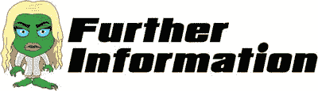

为什么枪在第一次试装后就停止了装弹？

在我们告诉我们的代码运行`reload`命令之前，我们询问它我们的标志(即`canIclick`)是否设置为 0。当程序启动时，我们将`canIclick`初始化为 0。一旦通过测试，代码做的第一件事就是将`canIclick`设置为 1。

下一次按下 Reload 按钮时，当询问`canIclick`是否为 0 时，它返回负值。因此，理想情况下，我们希望在重新装填枪支的动画完成后，将`canIclick`重置回 0。我们在`animate`命令的一个特殊子功能中实现了这一点。该函数特别询问动画结束后是否有任何特殊指令需要执行。

回想一下我们讨论`onmousemove`事件时，我们使用了以下内容:

```html
 -

```

顾名思义，每当图像被点击时，它就调用`reloadGun`函数。下面是我们可以使用的事件函数的简短列表。

*   当鼠标移动到一个元素上时，这个事件发生。
*   当鼠标移出一个元素时，这个事件发生。
*   当鼠标移动到一个元素或它的一个子元素上时，这个事件发生。
*   当用户将鼠标指针移出元素或其子元素时，会发生此事件。
*   当用户在一个元素上释放鼠标按钮时，这个事件发生。

## 开枪吧

如你所料，让我们的枪开火的方法和我们给枪装子弹的方法非常相似。首先，我们需要注册请求开枪的用户。然后，我们需要使枪有生命。

重新打开`js`文件夹中的`SZ_touch.js`文件。键入以下新行(粗体):

```html
//We need a flag to keep track to avoid repetition of animations before the first has finished
var canIclick= 0;

//this function is called to reload our gun
function reloadGun(e) {
 //Let’s check if we can allow this to occur
   if(canIclick== 0){
     //looks like we can so we better set our flag
       canIclick=1;
       $("#SZ0_1").animateSprite("play", "reload");
    }
}

//this function is called to fire our gun

function fireGun(e) {

 //Let’s check if we can allow this to occur

   if(canIclick== 0){

     //looks like we can so we better set our flag

       canIclick=1;

       $("#SZ0_1").animateSprite("play", "fire");

    }

}

```

保存文件并关闭它。

将来，在允许用户开枪之前，你可能会检查更多的变量(例如，如果屏幕暂停，或者在一关结束时)。此时，创建一个函数来检查所有参数值，然后输出结果决策是一个好主意。然后，在决定是否继续时，该输出将由其他功能(如是否可能暂停)和`fireGun()`功能进行全面检查。

在测试之前，我们需要将函数添加到`default.html`文件中。重新打开`default.html`文件。键入以下新行(粗体)和对现有行的添加(修改后的文本为红色):

```html
<html>
 <head>
  <script src="js/jquery.js"></script>
  <script src="js/jquery-ui.js"></script>
  <script src="js/SZ_main.js"></script>
  <script src="js/SZ_setupContent.js"></script>
  <script src="js/SZ_movement.js"></script>
  <script src="js/ss.js"></script>
  <script src="js/SZ_SS.js"></script>
  <script src="js/SZ_touch.js"></script>
  <link href="css/SZ_master.css" rel="stylesheet" />
 </head>
 <body>
  <div id="SZ_maincontent">
   

   <div id="SZ0_1" ></div>
   <div id="SZ0_2" >
    
   </div>
   <div id="SZ0_3" >
    
   </div>
  </div>
 </body>
</html>

```

保存文件，然后关闭它。回到`My_Work_Files`文件夹，双击`default.html`文件。现在点击屏幕上的任何地方。枪应该激活射击序列。

到现在为止，枪应该在做以下事情:


*   响应屏幕上的鼠标而移动
*   当用户单击重新加载按钮时重新加载
*   当用户点击屏幕上的任何地方时触发

在本节中，我们使用以下代码行调用了一组特定的 sprite 动画:

```html
$("#SZ0_1").animateSprite("play", "fire");

```

系统如何知道如何处理`"fire"`？如果你回到代码，注意我们写了如下内容:

```html
animations: {

            static: [0],

            reload: [1,2,3,4,5,6,7,8,9,10,11,12,13,14,15,16,17,18,19,20,21,22,23],

            fire: [24,25,26,27,28],

        },

```

我们定义的一个动画叫做`"fire"`，它是 24 到 28 张单独的精灵图片。

请注意，我们使用以下代码将两个鼠标事件插入到一个图像标记中:

```html


```

这是完全可能的，因为(a)您可以为一个元素定义多个鼠标事件，并且(b)这两个鼠标事件不会相互冲突。

## 最后一件事…

您可能已经注意到，当您单击重新加载按钮时，光标会保持为十字准线。如果它能变回一个更合适的光标就好了，这样更直观，也有助于更好的游戏体验。

我们可以通过改变 CSS 来做到这一点。您现在需要重新打开`SZ_master.css`文件，并键入以下新行(粗体):

```html
html {

      height: 100%;

     }
body {

       padding: 0 0 0 0;

       margin: 0;
       user-select: none;
       cursor: crosshair;
     }
img  {
       max-width: 100%;
       height: auto;
       user-drag: none;
       user-select: none;
       -moz-user-select: none;
       -webkit-user-drag: none;
       -webkit-user-select: none;
       -ms-user-select: none;
     }
#SZ0_0 {
        position: fixed;
        top: 0;
        left: 0;
        min-width: 100%;
        min-height: 100%;
      }
 #SZ0_1 {
        position: fixed;
        bottom: 0;
        right: 0;
}
 #SZ0_2 {
        position: fixed;
        top: 0;
        left: 0;
       cursor: pointer;

}
 #SZ0_3 {
        position: fixed;
        top: 0;
        right: 0;
}

```

保存文件，然后关闭它。回到`My_Work_Files`文件夹，双击`default.html`文件。

现在，当你将光标移到重载按钮上时，它会立即变成一个普通的“手”图像。类似地，当您将鼠标从重新加载按钮移开时，它应该会变回光标图像。

下一章将僵尸引入我们的游戏，这最终给了我们的玩家一些互动性。

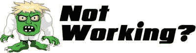

光标在重载按钮上时不会变成指针？此错误可能来自 HTML 文件。首先，检查您是否插入了这一行

```html
cursor: pointer;

```

在`#SZ0_2`部分。

如果您已经这样做了，那么我们需要看一下`default.html`文件。确保您已经按照指示将所有图像标签替换为`div`标签。

比如，以前是什么

```html


```

现在应该是

```html
<div id="SZ0_1" ></div>
 <div id="SZ0_2" >
  
 </div>
 <div id="SZ0_3" >
  
 </div>

```

如果你的代码仍然不工作，那么请不要犹豫，在 Twitter 上给我发消息`@zarrarchishti`。