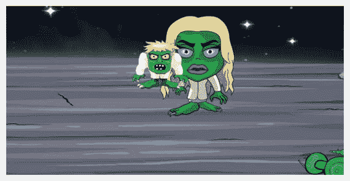

# 七、尝试一下：第二部分

> "If you do it right, it will last forever"

最大葡萄园

好消息是我们已经接近尾声了。稍微坏一点的消息是，这一章将会有相当多的编码。那么在这一章的结尾我们会看到什么呢？

*   这把枪将能够向僵尸开火。
*   僵尸会记录点击次数。如果达到最大命中数，僵尸就会变成泡泡。
*   泡泡僵尸会飞向远方。
*   我们需要记录枪发射的次数，并要求用户在达到最大次数时重新装弹。
*   最后，如果僵尸出现在屏幕上，我们需要宣布游戏结束。

## 打僵尸

你可能已经注意到，当你试图点击一个僵尸，枪不发射。这是因为我们没有将鼠标点击事件绑定到僵尸元素。我们可以将这个鼠标点击代码放在创建每个僵尸的函数中。

打开`SZ_zombie_movement.js`文件，输入以下新行(所有新文本以粗体显示):

```html
//let's create a zombie
function SZ_createZombie(whichOne){

 //create a new div to hold the zombie SS
   var div = document.createElement('div');

 //we need to hard code the CSS styles we want
   div.setAttribute('style','position: fixed; top:0; left:0;')

 //we want to position our zombie exactly at the tip of the planet
   var top_position= $('#SZ0_0').height() * 0.435;

 //Xpos can be anywhere on our x axis
   var left_position = Math.floor(Math.random() * ($('#SZ0_0').width())-(ratio*50)) + (ratio*50);

 //let's position our zombie
   div.style.left = left_position+'px'; div.style.top = top_position+'px';

 //give it an id
   div.id = 'zombie'+whichOne;

 //finally let's add our zombie to the screen
   document.body.appendChild(div);

 //put this new zombie through our SS function
  setup_zombie_SS(whichOne);

 //put this new zombie through our animate function
   SZ_animateZombie(whichOne);

 //bind the users mouse click to this zombie

 $("#zombie"+whichOne).bind('mousedown touchstart', function (e) {

        //first we want to fire the gun

        fireGun(event);

    });

}

//let's animate our zombie towards us
function SZ_animateZombie(whichOne){

    //assign the speed for each of our zombies
    var timex =  [13000,8000,16000,14000,10000,18000];

    //assign a user friendly name for our div

    var $zombiex = $("#zombie"+whichOne);

    //reset the zombies scale value
     $zombiex.css('transform','scale('+0+')');

    //work out the amount the zombie has to come towards us
     var amty =  ($(window).height()*0.7);// -($zombiex.height()*2));//topx);

    //each type of zombie will have their own walking style
     var ZS_ease = ['easeInSine','easeOutQuart','easeInOutQuad','easeInSine','easeOutQuart','easeInOutQuad'];

     //finally we are ready to animate

       $zombiex.delay(timex[whichOne-1]/3).animate({
                 //first bring our zombie slowly down the screen
                   left:   "+="+1+ "px",
          },{ easing:ZS_ease[whichOne-1],  duration: timex[whichOne-1],

              step: function(now, fx){
               //at each step we can manipulate the scale of our zombie
                if (fx.prop == "left") {
                    //work out the amount to scale
                    var xx = (fx.pos)*16;
                //do a check to see if we should end this animation
                       if(xx>15){
                         //stop all animation
                         $(this).stop();
                         //call a function to reset this zombie
                         SZ_resetZombie(whichOne);
                        } else {
                          //apply the scale
                          $(this).css('transform','scale('+xx+')');
                       }
                 }
              }, complete: function () {
                }

            });
}
//a function to completely reset our zombie
function SZ_resetZombie(whichOne){

    //assign a user friendly name for our div
     var $zombiex = $("#zombie"+whichOne);

    //we want to position our zombie exactly at the tip of the planet
     var top_position= $('#SZ0_0').height() * 0.435;

    //Xpos can be anywhere on our x axis

     var left_position = Math.floor(Math.random() * ($('#SZ0_0').width())-(ratio*50)) + (ratio*50);

    //let's re-position our zombie
     $zombiex.css({top: top_position+'px', left: left_position+'px'});

    //finally let's make the zombie come towards the screen again
     SZ_animateZombie(whichOne);
}

```

导航到菜单，单击文件，然后单击保存。您现在可以关闭该文件了。

我们现在准备测试！回到`My_Work_Files`文件夹，双击`default.html`文件。当你点击任何向屏幕走来的僵尸时，你应该会看到枪在开火。

这是通过给每个僵尸的`div`添加`'mousedown touchstart'`事件实现的。当再次访问这个项目时，您可能希望考虑安装一个“头像”类型的功能。为此，您需要执行以下操作:


1.  在定义僵尸头部的`div`中放置一个`div`。
2.  将相同的`'mousedown touchstart'`事件放置到这个新的`div`中，这将覆盖外部`div`的功能。
3.  如果这个新的 div `is`成功了，那么给用户更多的分数。
4.  如果击中了`div`，您可能要考虑奖励最大命中数；例如，如果通常需要三次击中才能杀死一个僵尸(这个功能将在下一节中添加)，那么只需一次爆头就足够了。

在前面的章节中，我们通过将鼠标事件添加到图像标签来绑定它们；例如

```html


```

然而，在本节中，我们需要向僵尸添加一个鼠标事件，它不是在我们的 HTML 页面中创建的。

因此，正如我们动态创建僵尸一样，我们也必须在运行时将事件绑定到它们。这是通过使用 JavaScript 代码完成的，如下所示:

```html
$("#zombie"+whichOne).bind('mousedown touchstart', function (e) {

```

在这一行中，我们不仅将`mousedown`事件绑定到每个僵尸，还定义了事件发生时执行的指令。


代码不起作用吗？检查你是否在你写的新代码中输入了`whichOne`(确保`O`是大写字母)。

当编写本书中的任何代码时，非常重要的一点是要意识到 JavaScript 在大写字母和小写字母之间有明显的区别。

JavaScript 不认为名为`whichone`的变量与名为`whichOne`的变量相同。

如果代码仍然不工作，那么请不要犹豫，在 Twitter 上给我发消息`@zarrarchishti`。

## 让点击率发挥作用

让我们回顾一下每个僵尸在“死亡”前能够承受的打击次数

*   教授 Z:两次击中
*   颠茄:一击
*   布拉德:三支安打

为了记录每个僵尸被击中的次数，我们需要使用一个数组。此外，我们需要记住重置每个僵尸的命中计数时，它重置。

打开`SZ_zombie_movement.js`文件，输入以下新行(所有新文本以粗体显示):

```html
//let's create a zombie
function SZ_createZombie(whichOne){

 //create a new div to hold the zombie SS
   var div = document.createElement('div');

 //we need to hard code the CSS styles we want
   div.setAttribute('style','position: fixed; top:0; left:0;')

 //we want to position our zombie exactly at the tip of the planet
   var top_position= $('#SZ0_0').height() * 0.435;

 //Xpos can be anywhere on our x axis

   var left_position = Math.floor(Math.random() * ($('#SZ0_0').width())-(ratio*50)) + (ratio*50);

 //let's position our zombie
   div.style.left = left_position+'px'; div.style.top = top_position+'px';

 //give it an id
   div.id = 'zombie'+whichOne;

 //finally let's add our zombie to the screen
   document.body.appendChild(div);

 //put this new zombie through our SS function
  setup_zombie_SS(whichOne);

 //put this new zombie through our animate function
   SZ_animateZombie(whichOne);

 //bind the users mouse click to this zombie
 $("#zombie"+whichOne).bind('mousedown touchstart', function (e) {
        //first we want to fire the gun
         fireGun(event);
        //acknowledge the hit

         zombieHit(whichOne-1);

    });

}

//let's animate our zombie towards us
function SZ_animateZombie(whichOne){

    //assign the speed for each of our zombies
    var timex =  [13000,8000,16000,14000,10000,18000];

    //assign a user friendly name for our div
    var $zombiex = $("#zombie"+whichOne);

    //reset the zombies scale value
     $zombiex.css('transform','scale('+0+')');

    //work out the amount the zombie has to come towards us
     var amty =  ($(window).height()*0.7);// -($zombiex.height()*2));//topx);

    //each type of zombie will have their own walking style
     var ZS_ease = ['easeInSine','easeOutQuart','easeInOutQuad','easeInSine','easeOutQuart','easeInOutQuad'];

     //finally we are ready to animate
       $zombiex.delay(timex[whichOne-1]/3).animate({
                 //first bring our zombie slowly down the screen
                   left:   "+="+1+ "px",
          },{ easing:ZS_ease[whichOne-1],  duration: timex[whichOne-1],

              step: function(now, fx){
               //at each step we can manipulate the scale of our zombie
                if (fx.prop == "left") {
                    //work out the amount to scale
                    var xx = (fx.pos)*16;
                //do a check to see if we should end this animation
                       if(xx>15){
                         //stop all animation
                        // $(this).stop();
                         //call a function to reset this zombie
                         SZ_resetZombie(whichOne);
                        } else {
                         //apply the scale
                          $(this).css('transform','scale('+xx+')');
                       }
                 }
              }, complete: function () {
                }
            });
}

//a function to completely reset our zombie
function SZ_resetZombie(whichOne){

    //reset this zombies hit counter

     zombieHits_counter[whichOne-1]=0;

    //assign a user friendly name for our div
     var $zombiex = $("#zombie"+whichOne);

    //we need to stop this zombies 
animations

     $zombiex.stop();

    //we want to position our zombie exactly at the tip of the planet
     var top_position= $('#SZ0_0').height() * 0.435;

    //Xpos can be anywhere on our x axis
     var left_position = Math.floor(Math.random() * ($('#SZ0_0').width())-(ratio*50)) + (ratio*50);

    //let's re-position our zombie
     $zombiex.css({top: top_position+'px', left: left_position+'px'});

    //finally let's make the zombie come towards the screen again
     SZ_animateZombie(whichOne);
}

```

保存并关闭该文件。

如果你将来要开发这个游戏的关卡，你想在重置僵尸之前添加一个检查。例如，如果杀死一个僵尸的结果是一个新的水平，那么不只是重置特定的僵尸，你想重置所有的僵尸。我甚至会让这个操作成为自己的功能，执行所有这些检查。

打开`js`文件夹中的`SZ_touch.js`文件。键入以下新行(所有新文本都以粗体显示):

```html
//We need a flag to keep track to avoid repetition of animations before the first has finished
var canIclick= 0;

//this function is called to reload our gun
function reloadGun(e) {
 //Let's check if we can allow this to occur
   if(canIclick== 0){
     //looks like we can so we better set our flag
       canIclick=1;
       $("#SZ0_1").animateSprite("play", "reload");
    }
}

//this function is called to fire our gun
function fireGun(e) {
 //Let's check if we can allow this to occur
   if(canIclick== 0){
     //looks like we can so we better set our flag
       canIclick=1;
       $("#SZ0_1").animateSprite("play", "fire");
    }
}

//array to keep track of the zombie hits

 var zombieHits_counter = [0,0,0,0,0,0];

//array for each zombies limit

 var zombieHits_limits = [2,1,3,2,1,3];

//this function will keep track of the zombie hits and act accordingly

function zombieHit(whichOne){

 //increment the counter

  zombieHits_counter[whichOne]++;

 //check to see if this zombie has reached its limit

  if(zombieHits_counter[whichOne] >= zombieHits_limits[whichOne]){

    //reset this zombie

     SZ_resetZombie(whichOne+1);

   }

}

```

保存并关闭该文件。我们现在准备测试！回到`My_Work_Files`文件夹，双击`default.html`文件。

现在，当我们对僵尸开火正确的次数后，僵尸在到达屏幕前应该会重置。所以如果我们向女僵尸开一枪，她应该会立刻复位。同样的，如果我们向男僵尸开三枪，他应该会复位。最后，如果我们向科学家僵尸开火两次，那么他应该会重置。

接下来，我介绍一下我们的泡泡僵尸。


我们使用了一些技术来跟踪和比较代码中的值。让我们仔细看看其中的一些。

```html
var ZS_ease = zombieHits_counter[whichOne]++;

```

`++`是一个赋值运算符，将变量的当前值加 1。

接下来，让我们看看如何检查是否达到了最大命中数。

```html
if(zombieHits_counter[whichOne] >= zombieHits_limits[whichOne]){

```

一个`if`语句就是我们所说的条件语句。当您希望对不同的决策执行不同的操作时，可以使用条件语句。所以在这种情况下，如果僵尸已经有了最大的命中次数，那么我们要重置它；否则，什么都不做。

你会在语句中看到`>=`，这意味着如果第一个值大于或等于第二个值。以下是我们可以用于其他情况的一些其他条件语句:

*   `<=`(小于或等于)
*   `==`(等于)
*   `<`(小于)
*   `>`(大于)
*   `!=`(不等于)

## 僵尸倒下了！

当僵尸被击中的次数达到最大值时，它会被重置。我们也需要僵尸出现在一个泡泡中，然而，给人一种僵尸已经在游戏中被制服和处理的错觉。

为此，需要完成以下工作。

1.  创建六个泡沫僵尸元素，准备在需要时部署。
2.  在重置僵尸之前，激活它的反泡沫僵尸。
3.  确保泡沫僵尸具有相同的比例和位置值，使其看起来好像行走的僵尸已转化为泡沫。
4.  最后，我们希望泡沫僵尸飘向太空。

### 第一部分:创建六个泡沫僵尸元素

为了创建六个泡泡僵尸，我们需要打开`SZ_zombie_movement.js`文件并键入以下新行(所有新文本都以粗体显示):

```html
//let's create a zombie
function SZ_createZombie(whichOne){

 //create a new div to hold the zombie SS
   var div = document.createElement('div');
 //and another for the bubble zombie SS

   var div2 = document.createElement('div');

 //we need to hard code the CSS styles we want
   div.setAttribute('style','position: fixed; top:0; left:0;')
 //and the same for our bubble zombie

   div2.setAttribute('style','position: fixed; top:0; left:0;')

 //we want to position our zombie exactly at the tip of the planet
   var top_position= $('#SZ0_0').height() * 0.435;

 //Xpos can be anywhere on our x axis
   var left_position = Math.floor(Math.random() * ($('#SZ0_0').width())-(ratio*50)) + (ratio*50);

 //let's position our zombie

   div.style.left = left_position+'px'; div.style.top = top_position+'px';
 //and the same for our bubble zombie

   div2.style.left = left_position+'px'; div2.style.top = top_position+'px';

 //give it an id
   div.id = 'zombie'+whichOne;
 //also for our bubble zombie

   div2.id = 'bubble_zombie'+whichOne;

 //finally let's add our zombie to the screen
   document.body.appendChild(div);
 //finally add in our bubble zombie to the screen too

   document.body.appendChild(div2);

 //put this new zombie through our SS function
  setup_zombie_SS(whichOne);

 //put this new zombie through our animate function
   SZ_animateZombie(whichOne);

 //bind the users mouse click to this zombie
 $("#zombie"+whichOne).bind('mousedown touchstart', function (e) {
        //first we want to fire the gun
         fireGun(event);
        //acknowledge the hit

         zombieHit(whichOne-1);
    });

}

//let's animate our zombie towards us
function SZ_animateZombie(whichOne){

    //assign the speed for each of our zombies
    var timex =  [13000,8000,16000,14000,10000,18000];

    //assign a user friendly name for our div

    var $zombiex = $("#zombie"+whichOne);

    //reset the zombies scale value
     $zombiex.css('transform','scale('+0+')');

    //work out the amount the zombie has to come towards us
     var amty =  ($(window).height()*0.7);// -($zombiex.height()*2));//topx);

    //each type of zombie will have their own walking style
     var ZS_ease = ['easeInSine','easeOutQuart','easeInOutQuad','easeInSine','easeOutQuart','easeInOutQuad'];

     //finally we are ready to animate
       $zombiex.delay(timex[whichOne-1]/3).animate({
                 //first bring our zombie slowly down the screen 

                   left:   "+="+1+ "px",
          },{ easing:ZS_ease[whichOne-1],  duration: timex[whichOne-1],

              step: function(now, fx){
                //at each step we can manipulate the scale of our zombie
                if (fx.prop == "left") {
                    //work out the amount to scale
                    var xx = (fx.pos)*16;
                //do a check to see if we should end this animation
                       if(xx>15){
                         //stop all animation
                         // $(this).stop();
                         //call a function to reset this zombie
                         SZ_resetZombie(whichOne);
                        } else {
                         //apply the scale
                          $(this).css('transform','scale('+xx+')');
                       }
                 }
              }, complete: function () {
                }
            });
}
//a function to completely reset our zombie
function SZ_resetZombie(whichOne){

    //reset this zombies hit counter
     zombieHits_counter[whichOne-1]=0;

    //assign a user friendly name for our div
     var $zombiex = $("#zombie"+whichOne);

    //we need to stop this zombies animations
     $zombiex.stop();

    //we want to position our zombie exactly at the tip of the planet
     var top_position= $('#SZ0_0').height() * 0.435;

    //Xpos can be anywhere on our x axis
     var left_position = Math.floor(Math.random() * ($('#SZ0_0').width())-(ratio*50)) + (ratio*50);

    //let's re-position our zombie
     $zombiex.css({top: top_position+'px', left: left_position+'px'});

    //finally let's make the zombie come towards the screen again
     SZ_animateZombie(whichOne);

}

```

保存并关闭该文件。

`appendChild()`是这段代码中使用的一个有趣的方法。此方法将一个节点作为另一个节点的最后一个子节点追加。所以在我们的例子中，我们将僵尸的`div`添加到 HTML 主体的末尾。

如果在未来，你需要添加一个元素，但不是作为最后一个孩子。你不妨用`insertBefore()`而不是`appendChild()`。`insertBefore()`方法将一个节点作为子节点插入，就在您指定的现有子节点之前。

在我们测试新创建的泡泡僵尸之前，我们需要添加他们的精灵表功能。

为此，我们现在需要打开`js`文件夹中的`SZ_SS.js`文件。键入以下新行(所有新文本都以粗体显示):

```html
//We need a one stop function that will allow us to process sprite sheets
function setup_SpriteSheet(div_name, image_name, no_of_frames, widthx, heightx) {

 //need the ratio of the container's width/height
   var imageOrgRatio =  $(div_name).height() / $(div_name).width() ;

 //need to ensure no trailing decimals
   var ratio2 = Math.round(ratio * 10) / 10;

 //check that the width is completely divisible by the no of frames
   var newDivisible = Math.round((widthx * ratio2) / no_of_frames);

 //the new width will be the number of frames multiplied by our new divisible
   var newWidthx = newDivisible * no_of_frames;

 //also the new height will be our ratio times the height of the div containing our image

   var newHeightx = heightx * ratio2;

 //apply our new width to our CSS
   $(div_name).css('width', (newWidthx));

 //apply our new height to our CSS
   $(div_name).css('height', newHeightx);
//
 //take the image name and apply as a background image to our div
   $(div_name).css('background-image', 'url(' + image_name + ')');

 //finally we need to apply a background size remembering we need to multiply width by the no of frames

    $(div_name).css('background-size', newWidthx * no_of_frames + 'px ' + newHeightx + 'px');
}

//setup the Gun
function setup_gun_SS(){
 //first let's apply our gun to our SS function

   setup_SpriteSheet("#SZ0_1","img/SZ_gun_SS.png",28,150,150);
 //need to access a special function in our js/ss.js file
    $("#SZ0_1").animateSprite({
        fps: 10,
        animations: {
            static: [0],
            reload: [1,2,3,4,5,6,7,8,9,10,11,12,13,14,15,16,17,18,19,20,21,22,23],
            fire: [24,25,26,27,28],
        },
        duration: 50,
        loop: false,
        complete: function () {
            // use complete only when you set animations with 'loop: false'
            //alert("animation End");
            //we need to reset our universal flag
              canIclick=0;
        }
    });
}

//setup a newly created zombie

function setup_zombie_SS(whichOne){

 //let's identify what type of zombie we should create
   var type_zombie = [1,2,3,1,2,3];

 //let's setup a speed for each type of zombie
   var speed_zombie = [100,50,150];

 //first let's setup our zombie SS
setup_SpriteSheet("#zombie"+whichOne,"img/zombiesSS_"+type_zombie[whichOne-1]+".png",9,20,20);
 //need to access a special function in our js/ss.js file
    $("#zombie"+whichOne).animateSprite({
        fps: 10,
        animations: {
            static: [0,1,2,3,4,5,6,7],
        },
        duration: speed_zombie[type_zombie[whichOne-1]-1],
        loop: true,
        complete: function () {
            // use complete only when you set animations with 'loop: false'
            //alert("animation End"); 

        }
    });

 //now let’s setup our bubble zombie SS

setup_SpriteSheet("#bubble_zombie"+whichOne,"img/SZ_bubble.png",3,20,20);

 //need to access a special function in our js/ss.js file

    $("#bubble_zombie"+whichOne).animateSprite({

        fps: 10,

        animations: {

            z1: [type_zombie[whichOne-1]-1],

        },

        duration: 1,

        loop: false,

        complete: function () {

            // use complete only when you set animations with 'loop: false'

            //alert("animation End");

        }

    });

}

```

保存并关闭该文件。

尽管我们之前已经提到过这一点，但是当试图找出代码中可能存在的问题时，使用`alert()`命令是非常有用的。在前面的代码中，您会看到一个带注释的`alert()`语句。在某个时候，我可能在这个函数的完成函数触发方面遇到了一些问题。通过放置这个`alert()`语句，我能够测试函数的完成时间是否准确。

像往常一样，记住删除(或注释掉)所有的`alert()`语句。

现在我们准备测试！回到`My_Work_Files`文件夹，双击`default.html`文件。

在僵尸冲向屏幕之前，你应该先看到六个随机放置在星球边缘的泡泡僵尸。


代码不起作用吗？检查你是否在你写在`SZ_zombie_movement.js`中的新代码中输入了`div2`。

同样在`SZ_SS.js`的新代码中，确保你已经输入了`bubble_zombie`而不仅仅是`zombie`(按照前面的代码)。

如果代码仍然不工作，那么请不要犹豫，在 Twitter 上给我发消息`@zarrarchishti`。

### 第二部分:激活反泡沫僵尸

在这一节中，当达到最大命中次数时，我们将集中精力用新的泡沫僵尸替换行走僵尸。此外，我们必须确保相应的泡沫僵尸不会显示，直到达到最大点击次数。

首先，打开`js`文件夹中的`SZ_touch.js`文件。修改以下粗体行:

```html
//We need a flag to keep track to avoid repetition of animations before the first has finished
var canIclick= 0;

//this function is called to reload our gun
function reloadGun(e) {
 //Let's check if we can allow this to occur
   if(canIclick== 0){
     //looks like we can so we better set our flag
       canIclick=1;
       $("#SZ0_1").animateSprite("play", "reload");
    }
}

//this function is called to fire our gun
function fireGun(e) {
 //Let's check if we can allow this to occur
   if(canIclick== 0){
     //looks like we can so we better set our flag
       canIclick=1;
       $("#SZ0_1").animateSprite("play", "fire");
    }
}

//array to keep track of the zombie hits

 var zombieHits_counter = [0,0,0,0,0,0];
//array for each zombies limit
 var zombieHits_limits = [2,1,3,2,1,3];

//this function will keep track of the zombie hits and act accordingly
function zombieHit(whichOne){

 //increment the counter
  zombieHits_counter[whichOne]++;

 //check to see if this zombie has reached its limit
  if(zombieHits_counter[whichOne] >= zombieHits_limits[whichOne]){
    //reset this zombie
     SZ_resetZombie(whichOne+1,1);

   }
}

```

保存并关闭该文件。打开`SZ_zombie_movement.js`文件。仔细修改一些旧行，并键入以下新行(所有修改的和新的文本都以粗体显示):

```html
//let's create a zombie

function SZ_createZombie(whichOne){

 //create a new div to hold the zombie SS
   var div = document.createElement('div');
 //and another for the bubble zombie SS
   var div2 = document.createElement('div');

 //we need to hard code the CSS styles we want
   div.setAttribute('style','position: fixed; top:0; left:0;')
 //and the same for our bubble zombie
   div2.setAttribute('style','position: fixed; top:0; left:0;')

 //we want to position our zombie exactly at the tip of the planet
   var top_position= $('#SZ0_0').height() * 0.435;

 //Xpos can be anywhere on our x axis
   var left_position = Math.floor(Math.random() * ($('#SZ0_0').width())-(ratio*50)) + (ratio*50);

 //record this left position

   leftx_zombie[whichOne-1]=left_position;

 //let's position our zombie

   div.style.left = left_position+'px'; div.style.top = top_position+'px';
 //and the same for our bubble zombie
   div2.style.left = left_position+'px'; div2.style.top = top_position+'px';

 //give it an id
   div.id = 'zombie'+whichOne;
 //also for our bubble zombie
   div2.id = 'bubble_zombie'+whichOne;

 //finally let's add our zombie to the screen
   document.body.appendChild(div);
 //finally add in our bubble zombie to the screen too
   document.body.appendChild(div2);

 //put this new zombie through our SS function
  setup_zombie_SS(whichOne);

 //put this new zombie through our animate function

   SZ_animateZombie(whichOne);

 //hide the bubble zombies at the start

   $("#bubble_zombie"+whichOne).css('transform','scale('+0+')');

 //bind the users mouse click to this zombie
 $("#zombie"+whichOne).bind('mousedown touchstart', function (e) {
        //first we want to fire the gun
         fireGun(event);
        //acknowledge the hit
         zombieHit(whichOne-1);
    });
}

//we need to keep track of the current scale values

 var scalex_zombie =  [0,0,0,0,0,0];

//we also need to keep track of the left position

 var leftx_zombie =  [0,0,0,0,0,0];

//let's animate our zombie towards us
function SZ_animateZombie(whichOne){

    //assign the speed for each of our zombies

    var timex =  [13000,8000,16000,14000,10000,18000];

    //assign a user friendly name for our div
    var $zombiex = $("#zombie"+whichOne);

    //reset the zombies scale value
     $zombiex.css('transform','scale('+0+')');

    //work out the amount the zombie has to come towards us
     var amty =  ($(window).height()*0.7);// -($zombiex.height()*2));//topx);

    //each type of zombie will have their own walking style
     var ZS_ease = ['easeInSine','easeOutQuart','easeInOutQuad','easeInSine','easeOutQuart','easeInOutQuad'];

     //finally we are ready to animate
       $zombiex.delay(timex[whichOne-1]/3).animate({
                 //first bring our zombie slowly down the screen
                   left:   "+="+0.001+ "px",
          },{ easing:ZS_ease[whichOne-1],  duration: timex[whichOne-1],

              step: function(now, fx){
                //at each step we can manipulate the scale of our zombie

                if (fx.prop == "left") {
                    //work out the amount to scale
                    var xx = (fx.pos)*16;
                //do a check to see if we should end this animation
                       if(xx>15){
                         //stop all animation
                        // $(this).stop();
                        //call a function to reset this zombie
                         SZ_resetZombie(whichOne,0);

                        } else {
                          //apply the scale
                          $(this).css('transform','scale('+xx+')');
                         //record this new scale value

                          scalex_zombie[whichOne-1]=xx;

                       }
                 }
              }, complete: function () {
                }
            });
}
//a function to completely reset our zombie

function SZ_resetZombie(whichOne, zombieBubble_generate){

    //reset this zombies hit counter

     zombieHits_counter[whichOne-1]=0;

    //assign a user friendly name for our div
     var $zombiex = $("#zombie"+whichOne);

    //we need to stop this zombies animations
     $zombiex.stop();

    //we want to position our zombie exactly at the tip of the planet
     var top_position= $('#SZ0_0').height() * 0.435;

    //should we generate a bubble zombie?

     if(zombieBubble_generate==1){

        //assign a user friendly name for our bubble zombie div

         var $bubble_zombiex = $("#bubble_zombie"+whichOne);

        //let's re-position our bubble zombie to our stored value

         $bubble_zombiex.css({top: top_position+'px',left: $zombiex.css("left")});

        //apply the scale                 $bubble_zombiex.css('transform','scale('+scalex_zombie[whichOne-1]+')');

     }

    //Xpos can be anywhere on our x axis
     var left_position = Math.floor(Math.random() * ($('#SZ0_0').width())-(ratio*50)) + (ratio*50);

    //record this left position

     leftx_zombie[whichOne-1]=left_position;

    //let's re-position our zombie

     $zombiex.css({top: top_position+'px', left: left_position+'px'});

     //finally let's make the zombie come towards the screen again
     SZ_animateZombie(whichOne);
}

```

您现在可以保存并关闭该文件。还有更多的代码要写，但是，让我们快速测试一下目前为止我们有什么。回到`My_Work_Files`文件夹，双击`default.html`文件。您应该观察到我们游戏中的以下变化:

*   游戏开始的时候，远处的泡泡僵尸已经不见了。
*   当你对一个僵尸达到最大命中数时，它会被一个泡泡僵尸取代。
*   泡泡僵尸应该与你刚刚击中的僵尸相对应。
*   泡沫僵尸应该与它要替换的僵尸的大小和位置大致相同。
*   请注意，你可能会注意到，僵尸可能会停止一起。这是为了我们后面要写的一些代码而特意做的。现在，只要刷新你的浏览器(按 F5)，游戏应该会重新启动。

接下来，我们让泡泡僵尸进入太空。


代码不起作用吗？首先，检查您是否已经修改了`SZ_resetZombie`函数以包含一个额外的参数(这个代码是红色的):

```html
function SZ_resetZombie(whichOne, zombieBubble_generate){

```

同样，我们调用这个函数的两次需要修改。请确保您的调用类似于以下代码:

在`SZ_touch.js`

```html
SZ_resetZombie(whichOne+1,1);

```

而在`SZ_zombie_movement.js`

```html
SZ_resetZombie(whichOne,0);

```

最后，确保以下代码行完全按照所示放置(即，在函数调用之外):

```html
//we need to keep track of the current scale values
var scalex_zombie =  [0,0,0,0,0,0];
//we also need to keep track of the left position
 var leftx_zombie =  [0,0,0,0,0,0];
//let's animate our zombie towards us
function SZ_animateZombie(whichOne){

```

如果代码仍然不工作，那么请不要犹豫，在 Twitter 上给我发消息`@zarrarchishti`。

### 第三部分:动画的泡沫僵尸

在最后一节中，我们将为每个气泡僵尸设置动画，这又会触发其对应的僵尸再次开始向屏幕播放动画。然后我们为泡泡僵尸提供了一个复位功能，让它可以再次安全使用。

首先，打开`SZ_movement.js`文件，键入以下新行(所有新文本以粗体显示):

```html
function rotateGun(e) {

//using the e value we can deduce the X co-ordinates
var xPos = e.clientX;

//We need to work out where the mouse cursor is as a percentage of the width of the screen

//We will work this out by dividing the current X position by the overall screen width which if you remember we put in newWidth
var currentXPositionPercentage = xPos/newWidth;

//We now want to apply this to the maximum amount of rotation which is 50 however the starting rotation is -15 not 0
var amountToRotate = -15 + (currentXPositionPercentage * 50);

//Let's rotate the gun!

  $("#SZ0_1").css('transform', 'rotate('+amountToRotate+'deg)');

}

//movement for our bubble zombie

function bubbleZombie_flyAway(whichOne){

 //assign a user friendly name for our div

    var $zombiex = $("#bubble_zombie"+whichOne);

     //first it should animate upwards with a 
bounce

       $zombiex.animate({

                 //bring our zombie up the screen

                   top:   "-="+100*ratio+ "px",

          },{ easing:"easeOutElastic",  duration: 400,

             complete: function () {

                //now the final animation where the bubble zombie disappears into 
space

                 $(this).delay(150).animate({

                  //slowly turn the alpha down

                   opacity:   "-="+1,

                  },{ easing:"easeOutQuint",  duration: 1000,

                     step: function(now, fx){

                       //at each step we can adjust the scale to make it look smaller

                if (fx.prop == "opacity" && fx.pos>=0.1) {

                    //work out the amount to scale

                    var xx = 0.5/(fx.pos);

                    //apply the scale

                    $(this).css('transform','scale('+xx+')');

                 }

                }, complete: function () {

                 }//end of second complete 
function

                });//end of second animation

             }//end of first complete function

        }); //end of first animation

}

```

保存并关闭该文件。

```html
In the code above we have written
$(this).delay(150).animate({

```

这通常会被写成

```html
$(this).animate({

```

然而，顾名思义，我们在调用这个函数之前应用了一个延迟。`jQuery`函数设置一个定时器来延迟队列中项目的执行。它接受一个整数作为参数，指示延迟执行的毫秒数。所以在我们的例子中，我们要求代码在执行我们的`animate`函数之前等待 150 毫秒。

我想补充一点，这个`delay()`方法只对某些游戏引擎是最好的，在这些引擎中，你在排队的 jQuery 效果之间有延迟。它没有提供取消延迟的方法；因此，在某些情况下，`delay()`并不能替代 JavaScript 的原生`setTimeout`函数，后者可能更合适。

接下来，我们需要调用我们的新函数。打开`js`文件夹中的`SZ_zombie_movement.js`文件。仔细修改一些旧行，并键入以下新行(所有修改的和新的文本都以粗体显示):

```html
//let's create a zombie
function SZ_createZombie(whichOne){

 //create a new div to hold the zombie SS
   var div = document.createElement('div');
 //and another for the bubble zombie SS
   var div2 = document.createElement('div');

 //we need to hard code the CSS styles we want
   div.setAttribute('style','position: fixed; top:0; left:0;')
 //and the same for our bubble zombie
   div2.setAttribute('style','position: fixed; top:0; left:0;')

 //we want to position our zombie exactly at the tip of the planet
   var top_position= $('#SZ0_0').height() * 0.435;

 //Xpos can be anywhere on our x axis
   var left_position = Math.floor(Math.random() * ($('#SZ0_0').width())-(ratio*50)) + (ratio*50);

 //record this left position
   leftx_zombie[whichOne-1]=left_position;

 //let's position our zombie
   div.style.left = left_position+'px'; div.style.top = top_position+'px';
 //and the same for our bubble zombie
   div2.style.left = left_position+'px'; div2.style.top = top_position+'px';

 //give it an id
   div.id = 'zombie'+whichOne;
 //also for our bubble zombie
   div2.id = 'bubble_zombie'+whichOne;

 //finally let's add our zombie to the screen
   document.body.appendChild(div);
 //finally add in our bubble zombie to the screen too
   document.body.appendChild(div2);

 //put this new zombie through our SS function
  setup_zombie_SS(whichOne);

 //put this new zombie through our animate function
   SZ_animateZombie(whichOne);

 //hide the bubble zombies at the start
   $("#bubble_zombie"+whichOne).css('transform','scale('+0+')');

 //bind the users mouse click to this zombie
 $("#zombie"+whichOne).bind('mousedown touchstart', function (e) {
   //make sure the zombie is currently walking

    if($("#zombie"+whichOne).css('opacity') != 0) {

        //first we want to fire the gun
         fireGun(event);
        //acknowledge the hit
         zombieHit(whichOne-1);
     }

    });
}

//we need to keep track of the current scale values
 var scalex_zombie =  [0,0,0,0,0,0];
//we also need to keep track of the left position
 var leftx_zombie =  [0,0,0,0,0,0];

//let's animate our zombie towards us
function SZ_animateZombie(whichOne){

    //assign the speed for each of our zombies
    var timex =  [13000,8000,16000,14000,10000,18000];

    //assign a user friendly name for our div
    var $zombiex = $("#zombie"+whichOne);

    //reset the zombies scale value
     $zombiex.css('transform','scale('+0+')');

    //reset the zombies opacity

     $zombiex.css({opacity:1});

    //work out the amount the zombie has to come towards us
     var amty =  ($(window).height()*0.7);// -($zombiex.height()*2));//topx);

    //each type of zombie will have their own walking style
     var ZS_ease = ['easeInSine','easeOutQuart','easeInOutQuad','easeInSine','easeOutQuart','easeInOutQuad'];

     //finally we are ready to animate
       $zombiex.delay(timex[whichOne-1]/3).animate({
                 //first bring our zombie slowly down the screen
                   left:   "+="+0.001+ "px",
          },{ easing:ZS_ease[whichOne-1],  duration: timex[whichOne-1],

              step: function(now, fx){
                //at each step we can manipulate the scale of our zombie
                if (fx.prop == "left") {
                    //work out the amount to scale
                    var xx = (fx.pos)*16;
                //do a check to see if we should end this animation
                       if(xx>15){
                         //stop all animation
                        // $(this).stop();
                         //call a function to reset this zombie
                         SZ_resetZombie(whichOne,0);
                        } else {
                          //apply the scale
                          $(this).css('transform','scale('+xx+')');
                         //record this new scale value
                          scalex_zombie[whichOne-1]=xx;
                       }
                 }
              }, complete: function () {
                }
            });
}
//a function to completely reset our zombie
function SZ_resetZombie(whichOne, zombieBubble_generate){

    //reset this zombies hit counter
     zombieHits_counter[whichOne-1]=0;

    //assign a user friendly name for our div
     var $zombiex = $("#zombie"+whichOne);

    //we need to stop this zombies animations
     $zombiex.stop();

    //we want to position our zombie exactly at the tip of the planet
     var top_position= $('#SZ0_0').height() * 0.435;

    //should we generate a bubble zombie?

     if(zombieBubble_generate==1){
        //assign a user friendly name for our bubble zombie div
         var $bubble_zombiex = $("#bubble_zombie"+whichOne);
        //let's re-position our bubble zombie to our stored value
         $bubble_zombiex.css({top: top_position+'px',left: $zombiex.css("left"), opacity:1});

        //apply the scale
         $bubble_zombiex.css('transform','scale('+scalex_zombie[whichOne-1]+')');
        //call our bubble zombie animation function

         bubbleZombie_flyAway(whichOne);

     }

    //Xpos can be anywhere on our x axis
     var left_position = Math.floor(Math.random() * ($('#SZ0_0').width())-(ratio*50)) + (ratio*50);

    //record this left position
     leftx_zombie[whichOne-1]=left_position;

    //let's re-position our zombie
     $zombiex.css({top: top_position+'px', left: left_position+'px', opacity:0});

     //finally let's make the zombie come towards the screen again
     //SZ_animateZombie(whichOne);
}

```

您现在可以保存并关闭该文件。我们现在准备测试我们的代码。回到`My_Work_Files`文件夹，双击`default.html`文件。你现在应该可以看到泡泡僵尸向上移动，然后向远处移动。

再次，请注意，你可能会注意到，僵尸可能会停止一起。这是为了我们稍后要写的一些代码而特意做的。现在，只要刷新你的浏览器(按 F5)，游戏应该会重新启动。

接下来，我们将只允许我们的枪在需要重新装弹之前发射一定数量的子弹。


代码不起作用吗？首先，检查您是否已经修改了`SZ_resetZombie`函数，以包含一个额外的参数(红色代码):

```html
$bubble_zombiex.css({top: top_position+'px',left: $zombiex.css("left"), opacity:1});

```

和

```html
$zombiex.css({top: top_position+'px', left: left_position+'px', opacity:0});

```

另外，SZ_movement.js 文件中代码的末尾有一些重复的字符。请确保它们都按此处所示进行编写:

```html
                 }

                }, complete: function () {

                 }//end of second complete function

                });//end of second animation

             }//end of first complete function

        }); //end of first animation

```

如果代码仍然不工作，那么请不要犹豫，在 Twitter 上给我发消息`@zarrarchishti.`


是什么原因导致泡沫僵尸向上反弹？

你在第六章中学到了缓动功能。提醒一下，缓动函数指定了僵尸随时间变化的速率。所以在我们的例子中，我们想让泡沫僵尸向上弹跳，所以我们用了`easeOutElastic:`。


什么是不透明？

属性设置或返回一个元素的透明度。这里是 1 完全不透明，0.5 是 50%透视，0 是完全透明。

泡沫僵尸飞走后发生了什么？

值得注意的是，我们要做的第一件事是执行以下检查:

```html
if (fx.prop == "opacity" && fx.pos>=0.1) {

```

`&&`表示逻辑与(即如果`fx`属性是`opacity`并且`fx`位置大于或等于 0.1)。

我们需要对该位置进行检查的原因是因为第一个值几乎总是 0。如果我们允许这样，那么我们将被零除，当然，这是未定义的。这将导致问题和不确定的行为。

最后，我们将这个值作为泡沫僵尸的比例值。随着时间的推移，这使得泡沫僵尸显得更小，从而给人以消失在远处的印象。

## 给枪装子弹

你可能已经注意到我们的重载按钮到目前为止是相当多余的。当然，它确实会让我们的枪动起来，尽管它在我们的游戏中没有任何作用。到目前为止，最终的目标是在枪停止射击之前给用户一个固定的射击次数。此时，重新加载按钮提示用户按下它以继续他们的游戏。

我们要做的第一件事是在游戏开始时隐藏重装按钮。打开我们的`CSS`文件夹中的`SZ_master.css`文件。键入以下新行(所有新文本都以粗体显示):

```html
html {

      height: 100%;

     }
body {
       padding: 0 0 0 0;
       margin: 0;
       user-select: none;
       cursor: crosshair;
     }
img  {
       max-width: 100%;
       height: auto;
       user-drag: none;
       user-select: none;
       -moz-user-select: none;
       -webkit-user-drag: none;
       -webkit-user-select: none;
       -ms-user-select: none;
     }
#SZ0_0 {
        position: fixed;
        top: 0;
        left: 0;
        min-width: 100%;
        min-height: 100%;
      }
 #SZ0_1 {
        position: fixed;
        bottom: 0;
        right: 0;
}
 #SZ0_2 {
        position: fixed;
        top: 0;
        left: 0;
        cursor: pointer;
      opacity:0;

}
 #SZ0_3 {
        position: fixed;
        top: 0;
        right: 0;
}

```

保存并关闭该文件。

在第三章，我建议你将这三个`div`(即`#SZ0_1`、`#SZ0_2`、`#SZ0_3`)组合在一起，因为它们具有相同的属性。然而，我们怎么能只为`#SZ0_2`增加一个新的属性呢？我们将使用以下代码来实现这一点:

```html
#SZ0_1, #SZ0_2, #SZ0_3 {

        position: fixed;

        top: 0;

        right: 0;

}

#SZ0_2 {

opacity:0;

}

```

用额外的`#SZ0_2`代码编写的任何东西都会附加上已经为它编写的任何东西。

回到`My_Work_Files`文件夹，双击`default.html`文件。重新加载按钮应该已经消失了。然而，如果你试图点击它，它仍然会开枪。因此，我们需要做一个检查，以确保我们只在 Reload 按钮可见时执行枪支动画。而且，这是一个在枪上放置最大数量子弹的好时机。

打开`SZ_zombie_movement.js`文件，输入以下修改的行(所有修改的文本为红色):

```html
//let's create a zombie
function SZ_createZombie(whichOne){

 //create a new div to hold the zombie SS
   var div = document.createElement('div');
 //and another for the bubble zombie SS
   var div2 = document.createElement('div');

 //we need to hard code the CSS styles we want
   div.setAttribute('style','position: fixed; top:0; left:0;')
 //and the same for our bubble zombie
   div2.setAttribute('style','position: fixed; top:0; left:0;')

 //we want to position our zombie exactly at the tip of the planet

   var top_position= $('#SZ0_0').height() * 0.435;

 //Xpos can be anywhere on our x axis
   var left_position = Math.floor(Math.random() * ($('#SZ0_0').width())-(ratio*50)) + (ratio*50);

 //record this left position
   leftx_zombie[whichOne-1]=left_position;

 //let's position our zombie
   div.style.left = left_position+'px'; div.style.top = top_position+'px';
 //and the same for our bubble zombie
   div2.style.left = left_position+'px'; div2.style.top = top_position+'px';

 //give it an id
   div.id = 'zombie'+whichOne;
 //also for our bubble zombie
   div2.id = 'bubble_zombie'+whichOne;

 //finally let's add our zombie to the screen
   document.body.appendChild(div);
 //finally add in our bubble zombie to the screen too
   document.body.appendChild(div2);

 //put this new zombie through our SS function
  setup_zombie_SS(whichOne);

 //put this new zombie through our animate function
   SZ_animateZombie(whichOne);

 //hide the bubble zombies at the start
   $("#bubble_zombie"+whichOne).css('transform','scale('+0+')');

 //bind the users mouse click to this zombie

 $("#zombie"+whichOne).bind('mousedown touchstart', function (e) {
   //make sure the zombie is currently walking
    if($("#zombie"+whichOne).css('opacity') != 0 && $("#SZ0_2").css('opacity') != 1) {

        //first we want to fire the gun
         fireGun(event);
        //acknowledge the hit
         zombieHit(whichOne-1);
      }
    });

}

//we need to keep track of the current scale values
 var scalex_zombie =  [0,0,0,0,0,0];
//we also need to keep track of the left position
 var leftx_zombie =  [0,0,0,0,0,0];

//let's animate our zombie towards us
function SZ_animateZombie(whichOne){

    //assign the speed for each of our zombies
    var timex =  [13000,8000,16000,14000,10000,18000];

    //assign a user friendly name for our div
    var $zombiex = $("#zombie"+whichOne);

    //reset the zombies scale value
     $zombiex.css('transform','scale('+0+')');

    //reset the zombies opacity
     $zombiex.css({opacity:1});

    //work out the amount the zombie has to come towards us
     var amty =  ($(window).height()*0.7);// -($zombiex.height()*2));//topx);

    //each type of zombie will have their own walking style
     var ZS_ease = ['easeInSine','easeOutQuart','easeInOutQuad','easeInSine','easeOutQuart','easeInOutQuad'];

     //finally we are ready to animate
       $zombiex.delay(timex[whichOne-1]/3).animate({
                 //first bring our zombie slowly down the screen
                   left:   "+="+0.001+ "px",
          },{ easing:ZS_ease[whichOne-1],  duration: timex[whichOne-1],

              step: function(now, fx){ 

               //at each step we can manipulate the scale of our zombie
                if (fx.prop == "left") {
                    //work out the amount to scale
                    var xx = (fx.pos)*16;
                //do a check to see if we should end this animation
                       if(xx>15){
                         //stop all animation
                                // $(this).stop();
                         //call a function to reset this zombie
                         SZ_resetZombie(whichOne,0);
                        } else {
                          //apply the scale
                          $(this).css('transform','scale('+xx+')');
                         //record this new scale value
                          scalex_zombie[whichOne-1]=xx;
                       }
                 }
              }, complete: function () {
                }
            });
}
//a function to completely reset our zombie
function SZ_resetZombie(whichOne, zombieBubble_generate){

    //reset this zombies hit counter
     zombieHits_counter[whichOne-1]=0;

    //assign a user friendly name for our div
     var $zombiex = $("#zombie"+whichOne);

    //we need to stop this zombies animations
     $zombiex.stop();

    //we want to position our zombie exactly at the tip of the planet
     var top_position= $('#SZ0_0').height() * 0.435;

    //should we generate a bubble zombie?
     if(zombieBubble_generate==1){
        //assign a user friendly name for our bubble zombie div
         var $bubble_zombiex = $("#bubble_zombie"+whichOne);
        //let's re-position our bubble zombie to our stored value
         $bubble_zombiex.css({top: top_position+'px',left: $zombiex.css("left"), opacity:1});
        //apply the scale    

         $bubble_zombiex.css('transform','scale('+scalex_zombie[whichOne-1]+')');
        //call our bubble zombie animation function
         bubbleZombie_flyAway(whichOne);
     }

    //Xpos can be anywhere on our x axis
     var left_position = Math.floor(Math.random() * ($('#SZ0_0').width())-(ratio*50)) + (ratio*50);

    //record this left position
     leftx_zombie[whichOne-1]=left_position;

    //let's re-position our zombie
     $zombiex.css({top: top_position+'px', left: left_position+'px', opacity:0});

     //finally let's make the zombie come towards the screen again
     //SZ_animateZombie(whichOne);
}

```

您现在可以保存并关闭该文件。

这里我们的决定是基于各种元素的不透明性。我们将在下一段代码中继续这样做。将这些检查放在一个单独的函数中是一个好主意，然后在需要它的代码中简单地调用那个函数。

接下来，我们需要确保在适当的时候显示和隐藏重载按钮。打开`SZ_touch.js`文件，输入以下新的和修改过的行(所有新文本以粗体显示):

```html
//We need a flag to keep track to avoid repetition of animations before the first has finished
var canIclick= 0;

//this function is called to reload our gun
function reloadGun(e) {
 //Let's check if we can allow this to occur
   if(canIclick== 0 && $("#SZ0_2").css('opacity') == 1){

     //looks like we can so we better set our flag
       canIclick=1;
       $("#SZ0_1").animateSprite("play", "reload");
     //reset the current shots

        current_shots=0;

     //hide the reload button

        $("#SZ0_2").css({opacity:0});

    }
}

//place a maximum number of shots

var max_shots=5;

//keep track of current number of shots

var current_shots=0;

//this function is called to fire our gun
function fireGun(e) {
 //Let's check if we can allow this to occur
   if(canIclick== 0 && $("#SZ0_2").css('opacity') != 1){

     //looks like we can so we better set our flag
       canIclick=1;
       $("#SZ0_1").animateSprite("play", "fire");
      //increment our shots

       current_shots++;

      //check to see if we have reached the maximum

       if(current_shots>=max_shots){

        //show the reload button

         $("#SZ0_2").css({opacity:1});

       }//if

    }
}

//array to keep track of the zombie hits
 var zombieHits_counter = [0,0,0,0,0,0];
//array for each zombies limit
 var zombieHits_limits = [2,1,3,2,1,3];

//this function will keep track of the zombie hits and act accordingly
function zombieHit(whichOne){

 //increment the counter
  zombieHits_counter[whichOne]++;

 //check to see if this zombie has reached its limit
  if(zombieHits_counter[whichOne] >= zombieHits_limits[whichOne]){
    //reset this zombie
     SZ_resetZombie(whichOne+1,1);
   }
}

```

您现在可以保存并关闭该文件。

回到`My_Work_Files`文件夹，双击`default.html`文件。你应该看到枪在开了五枪后需要重新装弹。按下重新装弹按钮，会发生两件事:重新装弹按钮消失，你可以再次开枪。

接下来，我们解决游戏中出现的一些问题。


代码是怎么知道什么时候开枪，什么时候给枪装弹的？

这是一个很好的问题，我想指出的是，您刚刚输入的代码可能是我们迄今为止编写的较为复杂和有趣的代码之一。确定这个问题的答案有两个步骤:(1)检查并设置重新加载按钮的不透明度，以及(2)根据允许的最大值检查射击次数。所以让我们仔细看看我们写了什么。

你会注意到我们经常处理不透明性；例如，我们编写的第一部分代码是

```html
opacity:0;

```

正如您在上一节中发现的，不透明度本质上是对象的透明度。在本例中，对象是`SZ0_2`，它是重新加载按钮图像。

开始时，我们将重新加载按钮的不透明度设置为 0。从这一点开始，我们所要做的就是在继续之前检查这个按钮的不透明度。这通过使用以下检查来完成:

```html
$("#SZ0_2").css('opacity') != 1

```

`!=`意为“不等于”

通过使用这个检查，我们可以告诉代码开枪或显示重新加载按钮。

一旦按下重新加载按钮，我们可以隐藏它，从而允许枪再次发射。

最后一个想法。我们什么时候不再允许开枪？以下代码设置了重新加载前可以发射的最大发射次数:

```html
var max_shots=5;

```

我们还需要记录当前的射击次数。我们使用以下变量来实现这一点:

```html
var current_shots=0;

```

现在，每次射击时，我们可以比较两个变量，如下所示:

```html
if(current_shots>=max_shots){

```

如果这是真的，我们停止任何进一步的射击，并迫使用户重新加载他们的枪。

## 清理深度并单击区域

你可能已经注意到，在地球表面的某些地方，点击鼠标不会引起枪战。这是因为你点击的是一个不可见的僵尸或者泡泡僵尸。但是，我们目前的法规不允许开枪。

### 第一部分:确保火炮射击

打开`SZ_zombie_movement.js`文件，键入以下新行(所有新文本以粗体显示)和一些修改过的行(全部以红色显示):

```html
//let's create a zombie
function SZ_createZombie(whichOne){

 //create a new div to hold the zombie SS
   var div = document.createElement('div');
 //and another for the bubble zombie SS
   var div2 = document.createElement('div');

 //we need to hard code the CSS styles we want
   div.setAttribute('style','position: fixed; top:0; left:0;')
 //and the same for our bubble zombie
   div2.setAttribute('style','position: fixed; top:0; left:0;')

 //we want to position our zombie exactly at the tip of the planet
   var top_position= $('#SZ0_0').height() * 0.435;

 //Xpos can be anywhere on our x axis
   var left_position = Math.floor(Math.random() * ($('#SZ0_0').width())-(ratio*50)) + (ratio*50);

 //record this left position
   leftx_zombie[whichOne-1]=left_position;

 //let's position our zombie
   div.style.left = left_position+'px'; div.style.top = top_position+'px';
 //and the same for our bubble zombie

   div2.style.left = left_position+'px'; div2.style.top = top_position+'px';

 //give it an id
   div.id = 'zombie'+whichOne;
 //also for our bubble zombie
   div2.id = 'bubble_zombie'+whichOne;

 //finally let's add our zombie to the screen
   document.body.appendChild(div);
 //finally add in our bubble zombie to the screen too
   document.body.appendChild(div2);

 //put this new zombie through our SS function
  setup_zombie_SS(whichOne);

 //put this new zombie through our animate function
   SZ_animateZombie(whichOne);

 //hide the bubble zombies at the start
   $("#bubble_zombie"+whichOne).css('transform','scale('+0+')');

 //bind the users mouse click to this zombie
 $("#zombie"+whichOne).bind('mousedown touchstart', function (e) {
   //make sure the reload button is showing
    if($("#SZ0_2").css('opacity') != 1) {
        //first we want to fire the gun
         fireGun(event);
        //acknowledge the hit

if($("#zombie"+whichOne).css('opacity') != 0){

         zombieHit(whichOne-1);

}

      }

    });

//bind the users mouse click to the bubble zombie

 $("#bubble_zombie"+whichOne).bind('mousedown touchstart', function (e) {

   //make sure the reload button is showing

    if($("#SZ0_2").css('opacity') != 1) {

        //first we want to fire the gun

         fireGun(event);

      }

    });

}

//we need to keep track of the current scale values

 var scalex_zombie =  [0,0,0,0,0,0];
//we also need to keep track of the left position
 var leftx_zombie =  [0,0,0,0,0,0];

//let's animate our zombie towards us
function SZ_animateZombie(whichOne){

    //assign the speed for each of our zombies
    var timex =  [13000,8000,16000,14000,10000,18000];

    //assign a user friendly name for our div
    var $zombiex = $("#zombie"+whichOne);

    //reset the zombies scale value

     $zombiex.css('transform','scale('+0+')');

    //reset the zombies opacity
     $zombiex.css({opacity:1});

    //work out the amount the zombie has to come towards us
     var amty =  ($(window).height()*0.7);// -($zombiex.height()*2));//topx);

    //each type of zombie will have their own walking style
     var ZS_ease = ['easeInSine','easeOutQuart','easeInOutQuad','easeInSine','easeOutQuart','easeInOutQuad'];

     //finally we are ready to animate

       $zombiex.delay(timex[whichOne-1]/3).animate({
                 //first bring our zombie slowly down the screen
                   left:   "+="+0.001+ "px",
          },{ easing:ZS_ease[whichOne-1],  duration: timex[whichOne-1],

              step: function(now, fx){
                //at each step we can manipulate the scale of our zombie
                if (fx.prop == "left") {
                    //work out the amount to scale
                    var xx = (fx.pos)*16;
                //do a check to see if we should end this animation

                       if(xx>15){
                         //stop all animation
                        // $(this).stop();
                         //call a function to reset this zombie
                         SZ_resetZombie(whichOne,0);
                       } else {
                         //apply the scale
                          $(this).css('transform','scale('+xx+')');
                         //record this new scale value
                          scalex_zombie[whichOne-1]=xx;
                       }
                 }
              }, complete: function () {
                }

            });
}
//a function to completely reset our zombie
function SZ_resetZombie(whichOne, zombieBubble_generate){

    //reset this zombies hit counter
     zombieHits_counter[whichOne-1]=0;

    //assign a user friendly name for our div
     var $zombiex = $("#zombie"+whichOne);

    //we need to stop this zombies animations
     $zombiex.stop();

    //we want to position our zombie exactly at the tip of the planet
     var top_position= $('#SZ0_0').height() * 0.435;

    //should we generate a bubble zombie?

     if(zombieBubble_generate==1){
        //assign a user friendly name for our bubble zombie div
         var $bubble_zombiex = $("#bubble_zombie"+whichOne);
        //let's re-position our bubble zombie to our stored value
         $bubble_zombiex.css({top: top_position+'px',left: $zombiex.css("left"), opacity:1});
        //apply the scale
         $bubble_zombiex.css('transform','scale('+scalex_zombie[whichOne-1]+')');
        //call our bubble zombie animation function

         bubbleZombie_flyAway(whichOne);
     }

    //Xpos can be anywhere on our x axis
     var left_position = Math.floor(Math.random() * ($('#SZ0_0').width())-(ratio*50)) + (ratio*50);

    //record this left position
     leftx_zombie[whichOne-1]=left_position;

    //let's re-position our zombie

     $zombiex.css({top: top_position+'px', left: left_position+'px', opacity:0});

     //finally let's make the zombie come towards the screen again
     //SZ_animateZombie(whichOne);
}

```

您现在可以保存并关闭该文件。

我想解释一下前面的红色代码。最初，该行代码是

```html
if($("#zombie"+whichOne).css('opacity') != 0 && $("#SZ0_2").css('opacity') != 1) {

```

然而，我们删除了`if`语句的第一部分，并将其放在更靠下的位置。这是因为我们需要确保重载按钮可见，不管僵尸的`div`。

回到`My_Work_Files`文件夹，双击`default.html`文件。你应该看到枪可以在地球表面的任何地方开火。

接下来，我们来看看僵尸的深度等级。

### 第二部分:僵尸深度等级

你可能已经注意到的另一个问题是，有时一个僵尸会从另一个僵尸身上走过，比如下面这个游戏的截图:



这里发生的是，女僵尸是一个较低的深度；然而，因为她在这种情况下更快，所以她出现在较慢的僵尸之上。为了解决这个问题，我们需要在玩游戏的时候不断检查和调整深度。还有，我们总希望自己的枪在丧尸上面。

打开`SZ_zombie_movement.js`文件，键入以下新行(所有新文本以粗体显示)和一些修改过的行(全部以红色显示):

```html
//let's create a zombie
function SZ_createZombie(whichOne){

 //create a new div to hold the zombie SS
   var div = document.createElement('div');
 //and another for the bubble zombie SS
   var div2 = document.createElement('div');

 //we need to hard code the CSS styles we want

   div.setAttribute('style','position: fixed; top:0; left:0;')
 //and the same for our bubble zombie
   div2.setAttribute('style','position: fixed; top:0; left:0;')

 //we want to position our zombie exactly at the tip of the planet
   var top_position= $('#SZ0_0').height() * 0.435;

 //Xpos can be anywhere on our x axis
   var left_position = Math.floor(Math.random() * ($('#SZ0_0').width())-(ratio*50)) + (ratio*50);

 //record this left position

   leftx_zombie[whichOne-1]=left_position;

 //let's position our zombie
   div.style.left = left_position+'px'; div.style.top = top_position+'px';
 //and the same for our bubble zombie
   div2.style.left = left_position+'px'; div2.style.top = top_position+'px';

 //give it an id
   div.id = 'zombie'+whichOne;
 //also for our bubble zombie
   div2.id = 'bubble_zombie'+whichOne;

 //finally let's add our zombie to the screen
   document.body.appendChild(div);
 //finally add in our bubble zombie to the screen too

   document.body.appendChild(div2);

 //put this new zombie through our SS function
  setup_zombie_SS(whichOne);

 //put this new zombie through our animate function
   SZ_animateZombie(whichOne);

 //hide the bubble zombies at the start
   $("#bubble_zombie"+whichOne).css('transform','scale('+0+')');

  //set the zindex for the zombie

  $("#zombie"+whichOne).css("z-index", whichOne+100);

  //set the zindex for the bubble zombie

  $("#bubble_zombie"+whichOne).css("z-index", whichOne);

 //ensure the zindex for the gun is the highest

  $("#SZ0_1").css("z-index", 200);

 //bind the users mouse click to this zombie

 $("#zombie"+whichOne).bind('mousedown touchstart', function (e) {
   //make sure the reload button is showing
    if($("#SZ0_2").css('opacity') != 1) {
        //first we want to fire the gun
         fireGun(event);
        //acknowledge the hit

if($("#zombie"+whichOne).css('opacity') != 0){
         zombieHit(whichOne-1);
}
      }
    });

//bind the users mouse click to the bubble zombie
 $("#bubble_zombie"+whichOne).bind('mousedown touchstart', function (e) {
   //make sure the reload button is showing
    if($("#SZ0_2").css('opacity') != 1) {
        //first we want to fire the gun
         fireGun(event);

      }
    });

}

//we need to keep track of the current scale values

 var scalex_zombie =  [0,0,0,0,0,0];
//we also need to keep track of the left position
 var leftx_zombie =  [0,0,0,0,0,0];

//let's animate our zombie towards us
function SZ_animateZombie(whichOne){

    //assign the speed for each of our zombies
    var timex =  [13000,8000,16000,14000,10000,18000];

    //assign a user friendly name for our div
    var $zombiex = $("#zombie"+whichOne);

    //reset the zombies scale value
     $zombiex.css('transform','scale('+0+')');

    //reset the zombies opacity
     $zombiex.css({opacity:1});

    //work out the amount the zombie has to come towards us
     var amty =  ($(window).height()*0.7);// -($zombiex.height()*2));//topx);

    //each type of zombie will have their own walking style

     var ZS_ease = ['easeInSine','easeOutQuart','easeInOutQuad','easeInSine','easeOutQuart','easeInOutQuad'];

     //finally we are ready to animate
       $zombiex.delay(timex[whichOne-1]/3).animate({
                 //first bring our zombie slowly down the screen
                   left:   "+="+0.001+ "px",
          },{ easing:ZS_ease[whichOne-1],  duration: timex[whichOne-1],

              step: function(now, fx){
               //at each step we can manipulate the scale of our zombie
                if (fx.prop == "left") {
                   //work out the amount to scale
                    var xx = (fx.pos)*16;
                //do a check to see if we should end this animation
                       if(xx>15){
                         //stop all animation

                         // $(this).stop();
                         //call a function to reset this zombie
                         SZ_resetZombie(whichOne,0);
                        } else {
                          //apply the scale
                          $(this).css('transform','scale('+xx+')');
                         //record this new scale value
                          scalex_zombie[whichOne-1]=xx;
                         //check the depth levels

                           var i = 0;

                           while (i < 6) {

                             //check to see if the scale is bigger

                               if(scalex_zombie[whichOne-1] >scalex_zombie[i] && ($(this).zIndex() < $("#zombie"+(i+1)).zIndex()) && scalex_zombie[i]!=0){

                               var i_index = $("#zombie"+(i+1)).zIndex();

                               //change the i one first

                               $("#zombie"+(i+1)).css("z-index", $(this).css( "z-index" ));

                               //now change this one

                               $(this).css("z-index", i_index);

                               } //end of if

                              i++;

                           }//end of while loop

                       }
                 }
              }, complete: function () {
                }

            });
}

//need to keep track of the current zindex for zombies

var zindex_current=0;

//a function to completely reset our zombie
function SZ_resetZombie(whichOne, zombieBubble_generate){

    //reset this zombies hit counter
     zombieHits_counter[whichOne-1]=0;

    //assign a user friendly name for our div
     var $zombiex = $("#zombie"+whichOne);

    //we need to stop this zombies animations

     $zombiex.stop();

    //we want to position our zombie exactly at the tip of the planet
     var top_position= $('#SZ0_0').height() * 0.435;

    //should we generate a bubble zombie?
     if(zombieBubble_generate==1){
        //assign a user friendly name for our bubble zombie div
         var $bubble_zombiex = $("#bubble_zombie"+whichOne);
        //let's re-position our bubble zombie to our stored value
         $bubble_zombiex.css({top: top_position+'px',left: $zombiex.css("left"), opacity:1});
        //apply the scale
         $bubble_zombiex.css('transform','scale('+scalex_zombie[whichOne-1]+')');
        //call our bubble zombie animation function
         bubbleZombie_flyAway(whichOne);
     }
    //Xpos can be anywhere on our x axis
     var left_position = Math.floor(Math.random() * ($('#SZ0_0').width())-(ratio*50)) + (ratio*50);

    //record this left position

     leftx_zombie[whichOne-1]=left_position;

    //let's re-position our zombie
     $zombiex.css({top: top_position+'px', left: left_position+'px', opacity:0});

 //set the zindex for the zombie

  zindex_current++;

  $("#zombie"+whichOne).css("z-index", zindex_current);

     //finally let's make the zombie come towards the screen again
     //SZ_animateZombie(whichOne);
}

```

您现在可以保存并关闭该文件。

回到`My_Work_Files`文件夹，双击`default.html`文件。你应该看到僵尸不再像以前那样互相重叠。还有，枪要一直出现在丧尸的上方。

接下来，我们看看如何在屏幕上创建一个游戏。


z 索引到底是什么？

z 索引是每个元素的顺序。想象一下，我们所有的元素，比如枪的图像或者分数的图像，就像一副纸牌一样排成一行。如果你稍微展开卡片，你可以完全看到最上面的卡片，而下面的卡片只能稍微看得见。这是因为当卡片重叠时，一张特定卡片的可见性取决于它在顶部的位置。

同样，当我们的元素相互重叠时，它们的可见性取决于它们的堆栈顺序或 z 索引。因此，z 索引较大的元素在与 z 索引较低的元素重叠时会更明显。

当我们连续随机放置的僵尸开始相互重叠时，这真的变得很有用。JavaScript 允许我们操纵 z-index，因此我们可以对元素进行重新排序，以确保离我们较远的元素位于较近的元素之后。

我们刚刚编写的下面一行代码中发生了什么？

```html
while (i < 6) {

```

这是一个`while`循环的例子。几乎所有的编程语言都有一个`while`循环，它本质上允许代码根据放置的条件重复执行。

所以在我们的例子中，`while`循环中的代码会持续执行，直到`i`变量不再小于 6。

## 介绍飞溅和“游戏结束”屏幕

到目前为止，我们的游戏立即开始，并没有真正结束。这将是很好的介绍屏幕和游戏屏幕。

### 第一部分:图像文件夹

转到`My_Work_Files`文件夹的`Raw Images`文件夹中的`images`文件夹。找到名为`splash_intro.png`和`splash_gameover.png`的文件，并将它们复制到`Images`文件夹，现在应该看起来像下面的截图:


### 第二部分:停止和启动

为了停止和开始游戏的启动画面和游戏结束画面，我们需要添加许多新代码，并对现有代码进行更改。请密切注意新行(粗体)和修改后的行(红色)。

几乎所有我们现有的文件都需要修改。因此，让我们从打开`default.html`文件开始，键入以下新行(所有新文本都以粗体显示):

```html
<html>
 <head>
  <script src="js/jquery.js"></script>
  <script src="js/jquery-ui.js"></script>
  <script src="js/SZ_main.js"></script>
  <script src="js/SZ_setupContent.js"></script>
  <script src="js/SZ_movement.js"></script>
  <script src="js/ss.js"></script>
  <script src="js/SZ_SS.js"></script>
  <script src="js/SZ_touch.js"></script>
  <script src="js/SZ_zombie_movement.js"></script>
  <link href="css/SZ_master.css" rel="stylesheet" />
 </head>
 <body>
  <div id="SZ_maincontent">
   
   <div id="SZ0_1" ></div>
   <div id="SZ0_2" >
    
   </div>

   <div id="SZ0_3" >
    
   </div>
   <div id="SZ0_4" onmousedown="start_game();"/>

  </div>
 </body>
</html>

```

保存文件，然后关闭它。

打开`SZ_master.css`文件，输入以下新行(所有新文本以粗体显示):

```html
html {
      height: 100%;
     }

body {
       padding: 0 0 0 0;
       margin: 0;
       user-select: none;
       cursor: crosshair;
     }
img  {
       max-width: 100%;
       height: auto;
       user-drag: none;
       user-select: none;
       -moz-user-select: none;
       -webkit-user-drag: none;
       -webkit-user-select: none;
       -ms-user-select: none;
     }
#SZ0_0 {
        position: fixed; 

        top: 0;
        left: 0;
        min-width: 100%;
        min-height: 100%;
      }
 #SZ0_1 {
        position: fixed;
        bottom: 0;
        right: 0;
      opacity:0;

}
 #SZ0_2 {
        position: fixed;
        top: 0;
        left: 0;  

        cursor: pointer;
        opacity:0;

}
 #SZ0_3 {
        position: fixed;
        top: 0;
        right: 0;
        opacity:0;

}
 #SZ0_4 {

        position: fixed;

        cursor: pointer;

        background-size:cover;

        opacity:0;

}

```

保存文件，然后关闭它。

打开`SZ_setupContent.js`文件，输入以下新行(所有新文本以粗体显示):

```html
  //we will need a new ratio var

   var ratio_use = ratio;

//main function
  function main_call_setupContent() {
   //need to resize all elements

   //first we set their normal sizes in CSS

   //Gun
    $('#SZ0_1').css('width', 150 * ratio);
    $('#SZ0_1').css('height', 150 * ratio);

   //Reload Button
    $('#SZ0_2').css('width', 200 * ratio);
    $('#SZ0_2').css('height', 90 * ratio);

   //Score
    $('#SZ0_3').css('width', 235 * ratio);
    $('#SZ0_3').css('height', 100 * ratio);

    //Intro and Game over

   if($(window).height()<$(window).width()){

     //work out a ratio based on height

     ratio_use =  $(window).height()/800;

    }//end 
if

    //apply this new ratio to our intro/game over

    $('#SZ0_4').css('width', 868 * ratio_use);

    $('#SZ0_4').css('height', 701 * ratio_use);

    $('#SZ0_4').css('left', ($(window).width()/2)-((868 * ratio_use)/2));

    //make sure it is half way

    $('#SZ0_4').css('top', ($(window).height()/2)-((701 * ratio_use)/2));

    //Any sprite sheets?
      //Our Gun
        setup_gun_SS();

   //Create all our 6 zombies
    for (i = 1; i < 7; i++) {
     //this will get called 6 times
     SZ_createZombie(i);
    }
   //call the 
intro

    start_end_game(0);

}

var gameEnded=0;

//Intro or Game Over of game

  function start_end_game(whichOne) {

           //hide the elements

           for (i = 1; i < 4; i++) {

            //this will get called 3 times

            $('#SZ0_'+i).css({opacity:0});

           }//for

           //hide the zombies

           for (i = 1; i < 7; i++) {

           //we need to stop this zombies animations

            $('#zombie_'+i).stop();

            $('#zombie_'+i).css({opacity:0});

            $('#bubble_zombie_'+i).css({opacity:0});

           }//for

        if(whichOne==0){

         //START OF 
GAME

        //change the background image

          $('#SZ0_4').css('background-image', 'url(img/splash_intro.png)');

        } else {

         //GAME OVER

        //show the score

          $('#SZ0_3').css({opacity:1});

        //change the background image

          $('#SZ0_4').css('background-image', 'url(img/splash_gameover.png)');

        }

        //make sure it is half way

         $('#SZ0_4').css('top', ($(window).height()/2)-((701 * ratio_use)/2));

           //finally show the intro or game over image

            $('#SZ0_4').css({opacity:1});

        //stop the user from firing

         gameEnded= 1;

}//end of function

//start the

game

  function start_game() {

        //reset the zindex

         zindex_current=0;

        //reload the gun

         current_shots=0;

        //allow user to fire

         gameEnded= 0;

           //hide the intro or game over image

            $('#SZ0_4').css({opacity:0});

          //make sure it is out of the way

             $('#SZ0_4').css('top', ($(window).height()));

           //show the 
elements

           for (i = 1; i < 4; i++) {

            //this will get called 3 times

            $('#SZ0_'+i).css({opacity:1});

           }//for

          //hide the reload button!

          $('#SZ0_2').css({opacity:0});

           //show the zombies

           for (i = 0; i < 7; i++) {

            //reset the Zombie

            SZ_resetZombie(i,0);

           }//for

          //ensure the score board is half opacity

          $('#SZ0_3').css({opacity:0.5});

}//end of function

```

保存文件，然后关闭它。

在`start_end_game`函数中，一次有过多的检查和动作。随着游戏的深入，这个函数将变得不可管理，所以我建议你试着把对另一个文件的检查分开，这样这个函数就可以检查各种元素的状态。

一种可能性是为某些条件设置标志。可以在某些事件上设置这些标志。这意味着当我们使用这个函数时，我们所做的只是检查标志的状态。

同样，有些行动应该是在它们自己的功能中；例如，基于前面的检查隐藏各种元素。

打开`SZ_touch.js`文件，键入以下新行(所有新文本以粗体显示)和一些修改过的行(全部以红色显示):

```html
  //We need a flag to keep track to avoid repetition of animations before the first has finished
var canIclick= 0;

//this function is called to reload our gun
function reloadGun(e) {
 //Let's check if we can allow this to occur
   if(canIclick== 0 && $("#SZ0_2").css('opacity') == 1){
     //looks like we can so we better set our flag
       canIclick=1;
       $("#SZ0_1").animateSprite("play", "reload");
     //reset the current shots
        current_shots=0;
     //hide the reload button
        $("#SZ0_2").css({opacity:0});
    }
}

//place a maximum number of shots
var max_shots=5;
//keep track of current number of shots

var current_shots=0;

//this function is called to fire our gun
function fireGun(e) {
 //Let's check if we can allow this to occur
   if(canIclick== 0 && gameEnded==0 && $("#SZ0_2").css('opacity') != 1){
     //looks like we can so we better set our flag
       canIclick=1;
       $("#SZ0_1").animateSprite("play", "fire");
      //increment our shots
       current_shots++;
      //check to see if we have reached the maximum
       if(current_shots>=max_shots){
        //show the reload button
         $("#SZ0_2").css({opacity:1});
       }//if
    }

}

//array to keep track of the zombie hits
 var zombieHits_counter = [0,0,0,0,0,0];
//array for each zombies limit
 var zombieHits_limits = [2,1,3,2,1,3];

//this function will keep track of the zombie hits and act accordingly
function zombieHit(whichOne){

 //increment the counter
  zombieHits_counter[whichOne]++;

 //check to see if this zombie has reached its limit
  if(zombieHits_counter[whichOne] >= zombieHits_limits[whichOne]){

    //reset this zombie
     SZ_resetZombie(whichOne+1,1);
   }
}

```

保存文件，然后关闭它。

给变量和函数起一个有意义的名字对于代码的可读性是很重要的。这在前面的代码中可以看到。随着你的游戏变得越来越大越来越复杂，如果你能像读小说一样阅读你之前写的代码，你将会减少理解它所需的时间。

打开`SZ_zombie_movement.js`文件，键入以下新行(所有新文本以粗体显示)和一些修改过的行(全部以红色显示):

```html
//let's create a zombie
function SZ_createZombie(whichOne){

 //create a new div to hold the zombie SS
   var div = document.createElement('div');
 //and another for the bubble zombie SS
   var div2 = document.createElement('div');

 //we need to hard code the CSS styles we want
   div.setAttribute('style','position: fixed; top:0; left:0; opacity:0');
 //and the same for our bubble zombie
   div2.setAttribute('style','position: fixed; top:0; left:0;');

 //we want to position our zombie exactly at the tip of the planet
   var top_position= $('#SZ0_0').height() * 0.435;

 //Xpos can be anywhere on our x axis
   var left_position = Math.floor(Math.random() * ($('#SZ0_0').width())-(ratio*50)) + (ratio*50);

 //record this left position
   leftx_zombie[whichOne-1]=left_position;

 //let's position our zombie
   div.style.left = left_position+'px'; div.style.top = top_position+'px';
 //and the same for our bubble zombie
   div2.style.left = left_position+'px'; div2.style.top = top_position+'px';

 //give it an id
   div.id = 'zombie'+whichOne;
 //also for our bubble zombie

   div2.id = 'bubble_zombie'+whichOne;

 //finally let's add our zombie to the screen
   document.body.appendChild(div); 

 //finally add in our bubble zombie to the screen too
   document.body.appendChild(div2);

 //put this new zombie through our SS function
  setup_zombie_SS(whichOne);

 //put this new zombie through our animate function
  // SZ_animateZombie(whichOne);

 //hide the bubble zombies at the start
   $("#bubble_zombie"+whichOne).css('transform','scale('+0+')');

 //set the zindex for the zombie
  $("#zombie"+whichOne).css("z-index", whichOne+100);
 //set the zindex for the bubble zombie
  $("#bubble_zombie"+whichOne).css("z-index", whichOne);
 //ensure the zindex for the gun is the highest
  $("#SZ0_1").css("z-index", 200);
 //also ensure the zindex for the intro/game over is the highest

  $("#SZ0_4").css("z-index", 201);

 //bind the users mouse click to this zombie
 $("#zombie"+whichOne).bind('mousedown touchstart', function (e) {
   //make sure the reload button is showing
    if($("#SZ0_2").css('opacity') != 1) {
        //first we want to fire the gun
         fireGun(event);
        //acknowledge the hit
if($("#zombie"+whichOne).css('opacity') != 0){
         zombieHit(whichOne-1);

}
      }
    });

//bind the users mouse click to the bubble zombie
 $("#bubble_zombie"+whichOne).bind('mousedown touchstart', function (e) {
   //make sure the reload button is showing
    if($("#SZ0_2").css('opacity') != 1) {
        //first we want to fire the gun
         fireGun(event);

      }
    });

}

//we need to keep track of the current scale values
 var scalex_zombie =  [0,0,0,0,0,0];
//we also need to keep track of the left position
 var leftx_zombie =  [0,0,0,0,0,0];

//let's animate our zombie towards us
function SZ_animateZombie(whichOne){

    //assign the speed for each of our zombies
    var timex =  [13000,8000,16000,14000,10000,18000];

    //assign a user friendly name for our div
    var $zombiex = $("#zombie"+whichOne);

    //reset the zombies scale value
     $zombiex.css('transform','scale('+0+')');

    //reset the zombies opacity
     $zombiex.css({opacity:1});

    //work out the amount the zombie has to come towards us
     var amty =  ($(window).height()*0.7);// -($zombiex.height()*2));//topx);

    //each type of zombie will have their own walking style
     var ZS_ease = ['easeInSine','easeOutQuart','easeInOutQuad','easeInSine','easeOutQuart','easeInOutQuad'];

     //finally we are ready to animate

       $zombiex.delay(timex[whichOne-1]/3).animate({
                 //first bring our zombie slowly down the screen
                   left:   "+="+0.001+ "px",
          },{ easing:ZS_ease[whichOne-1],  duration: timex[whichOne-1],

              step: function(now, fx){
                //at each step we can manipulate the scale of our zombie
                if (fx.prop == "left") {
                    //work out the amount to scale
                    var xx = (fx.pos)*16;
                    if(gameEnded==1){

                     xx=999;

                    }

                //do a check to see if we should end this animation
                       if(xx>15){
                         //stop all animation
                         $(this).stop();
                         //call a function to reset this zombie
                         //SZ_resetZombie(whichOne,0);
                         //game Over

                          $(this).css({opacity:0});

                          $(this).stop(true, true);

                          $(this).finish();

                        if(gameEnded==0 && xx!=999){

                         start_end_game(1);

                         }

                        } else {
                          //apply the scale
                          $(this).css('transform','scale('+xx+')');
                         //record this new scale value
                          scalex_zombie[whichOne-1]=xx;

                         //check the depth levels
                           var i = 0;
                           while (i < 6) {
                             //check to see if the scale is bigger
                              if(scalex_zombie[whichOne-1]>scalex_zombie[i] && ($(this).zIndex() < $("#zombie"+(i+1)).zIndex()) && scalex_zombie[i]!=0){
                                var i_index = $("#zombie"+(i+1)).zIndex();
                               //change the i one first
                               $("#zombie"+(i+1)).css("z-index", $(this).css( "z-index" ));
                               //now change this one
                               $(this).css("z-index", i_index);
                               } //end of if
                                      i++;
                           }//end of while loop
                       }
                 }
              }, complete: function () {
                }

            });
}
//need to keep track of the current zindex for zombies
var zindex_current=0;
//a function to completely reset our zombie
function SZ_resetZombie(whichOne, zombieBubble_generate){

    //reset this zombies hit counter
     zombieHits_counter[whichOne-1]=0;

    //assign a user friendly name for our div
     var $zombiex = $("#zombie"+whichOne);

    //we need to stop this zombies animations
     $zombiex.stop();

    //we want to position our zombie exactly at the tip of the planet
     var top_position= $('#SZ0_0').height() * 0.435;

    //should we generate a bubble zombie?
     if(zombieBubble_generate==1){
        //assign a user friendly name for our bubble zombie div
         var $bubble_zombiex = $("#bubble_zombie"+whichOne);
        //let's re-position our bubble zombie to our stored value 

         $bubble_zombiex.css({top: top_position+'px',left: $zombiex.css("left"), opacity:1});

        //apply the scale
         $bubble_zombiex.css('transform','scale('+scalex_zombie[whichOne-1]+')');
        //call our bubble zombie animation function
         bubbleZombie_flyAway(whichOne);
     }

    //Xpos can be anywhere on our x axis
     var left_position = Math.floor(Math.random() * ($('#SZ0_0').width())-(ratio*50)) + (ratio*50);

    //record this left position
     leftx_zombie[whichOne-1]=left_position;

    //let's re-position our zombie
     $zombiex.css({top: top_position+'px', left: left_position+'px', opacity:0});

 //set the zindex for the zombie
  zindex_current++;
  $("#zombie"+whichOne).css("z-index", zindex_current);

     //finally let's make the zombie come towards the screen again
       if(zombieBubble_generate==0){

        SZ_animateZombie(whichOne);

        }

}

```

保存文件，然后关闭它。

回到`My_Work_Files`文件夹，双击`default.html`文件。你应该马上看到介绍启动画面。您还应该注意到，分数和枪的图像不在那里，正如我们所希望的那样。当我们开始游戏的时候，它看起来应该和最近修改之前一样。当僵尸到达其路径的尽头时，你现在应该在屏幕上看到游戏。

恭喜你！你开发了一个工作游戏。

接下来，让我们改进我们的游戏，让它对我们的用户更有吸引力。


代码不起作用吗？我们在这里修改了很多文件，所以我的建议是仔细检查每个文件中的每一行代码，并与您自己的代码进行比较。甚至旧的灰色代码。耐心点，完成你的代码。

以下是我发现的一些问题:

确保在下面一行中有结束标记(显示为红色):

```html
<div id="SZ0_4" onmousedown="start_game();"/>

```

确保将这条线放在主函数的上方:

```html
   var ratio_use = ratio;

//main function

```

确保您在以下行中使用的是`ratio_use`而不是 ratio:

```html
$('#SZ0_4').css('width', 868 * ratio_use);

$('#SZ0_4').css('height', 701 * ratio_use);

```

确保您已经注释掉(`//`)以下行:

```html
// SZ_animateZombie(whichOne);

//SZ_resetZombie(whichOne,0);

```

如果代码仍然不工作，那么请不要犹豫，在 Twitter 上给我发消息`@zarrarchishti`。


游戏如何知道什么时候显示介绍闪屏，什么时候在屏幕上显示游戏？

当被调用时，下面的函数停止游戏并在屏幕上显示介绍或游戏:

```html
function start_end_game(whichOne) {

```

该函数的任务之一是根据传入的参数`whichOne`显示介绍图像或游戏结束图像。下面几行将显示这些图像中的任何一个:

```html
$('#SZ0_4').css('background-image', 'url(img/splash_intro.png)');

$('#SZ0_4').css('background-image', 'url(img/splash_gameover.png)');

```