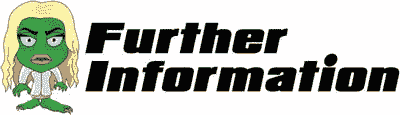
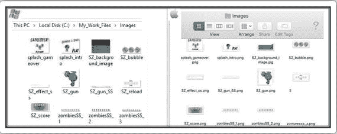
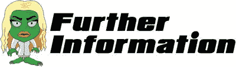
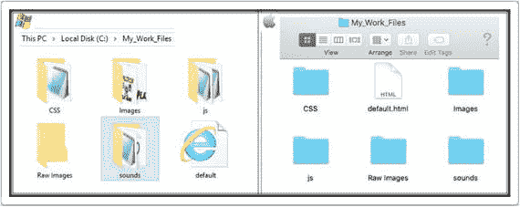
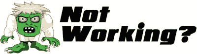
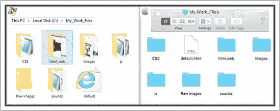
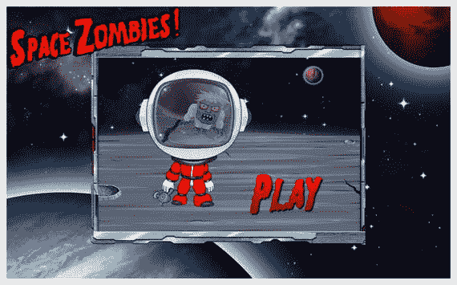

# 八、给我们的游戏增添一些光彩

简单是最高级的复杂

莱昂纳多达芬奇

我相信你已经注意到在我们的分数箱里没有实际的分数。我们需要的是，每当我们把一个僵尸送上太空，文本就会增加。为此，我们需要做到以下几点:

1.  在我们的 HTML 中添加一个文本字段。
2.  格式化此文本字段，使其根据屏幕大小改变大小和位置。
3.  从零开始，每出现一个泡泡僵尸就递增一次。
4.  每次玩新游戏时重置为零。

## 比分是多少？

打开`default.html`文件，键入以下新行(所有新文本以粗体显示)和一些修改过的行(全部以红色显示):

```html
<html>
 <head>
  <script src="js/jquery.js"></script>
  <script src="js/jquery-ui.js"></script>
  <script src="js/SZ_main.js"></script>
  <script src="js/SZ_setupContent.js"></script>
  <script src="js/SZ_movement.js"></script>
  <script src="js/ss.js"></script>
  <script src="js/SZ_SS.js"></script>
  <script src="js/SZ_touch.js"></script>
  <script src="js/SZ_zombie_movement.js"></script>

  <link href="css/SZ_master.css" rel="stylesheet" />
 </head>
 <body>
  <div id="SZ_maincontent">
   
   <div id="SZ0_1" ></div>
   <div id="SZ0_2" >
    
   </div>
   <div id="SZ0_3" style="background-image: url(img/SZ_score.png);">

    <div id="textx">0</div>

   </div>
   <div id="SZ0_4" onmousedown="start_game();"/>
  </div>
 </body>
</html>

```

保存此文件，然后关闭它。

在这个项目中，我们遇到过几次。正如您所猜测的，`background-image`属性为一个元素设置了一个或多个背景图像。重要的是要记住，默认情况下，`background-image`位于元素的左上角，并且在垂直和水平方向重复出现。因此，如果您希望属性以不同的方式运行，就需要处理这些属性。我总是建议也设置一个`background-color`属性。这是为了防止图像不可用或加载时间过长。

打开`SZ_master.css`文件，键入以下新行(所有新文本以粗体显示)和一些修改过的行(全部以红色显示):

```html
html {

      height: 100%;

     }

body {

       padding: 0 0 0 0;

       margin: 0;
       user-select: none;
       cursor: crosshair;
     }

img  {
       max-width: 100%;
       height: auto;
       user-drag: none;
       user-select: none;
       -moz-user-select: none;
       -webkit-user-drag: none;
       -webkit-user-select: none;
       -ms-user-select: none;
     }
#SZ0_0 {
        position: fixed;
        top: 0;
        left: 0;
        min-width: 100%;
        min-height: 100%;
      }
 #SZ0_1 {
        position: fixed;
        bottom: 0;
        right: 0;
        opacity:0;
}
 #SZ0_2 {
        position: fixed;
        top: 0;
        left: 0;
        cursor: pointer;
        opacity:0;

}
 #SZ0_3 {
        position: fixed;
        top: 0;
        right: 0;
        opacity:0;
        background-size:cover;

}

 #SZ0_4 {
        position: fixed;
        cursor: pointer;
        background-size:cover;

        opacity:0;
}
 #textx {

        position: relative;

        float: left;

        top: 40%;

        text-align:center;

        font-size: 4vmax;

        font-weight: bolder;

        colour: white;

        font-family: "Arial Black";

}

```

保存此文件，然后关闭它。

快好了。现在打开`SZ_setupContent.js`文件，键入以下新行(所有新文本以粗体显示)和一些修改过的行:

```html
    //we will need a new ratio var
   var ratio_use = ratio;

//main function
  function main_call_setupContent() {
   //need to resize all elements
   //first we set their normal sizes in CSS

   //Gun
    $('#SZ0_1').css('width', 150 * ratio);
    $('#SZ0_1').css('height', 150 * ratio);

   //Reload Button
    $('#SZ0_2').css('width', 200 * ratio);
    $('#SZ0_2').css('height', 90 * ratio);

   //Score
    $('#SZ0_3').css('width', 235 * ratio);
    $('#SZ0_3').css('height', 100 * ratio);

   //Intro and Game over
   if($(window).height()<$(window).width()){

     //work out a ratio based on height
     ratio_use =  $(window).height()/800;
    }//end if
    //apply this new ratio to our intro/game over
    $('#SZ0_4').css('width', 868 * ratio_use);
    $('#SZ0_4').css('height', 701 * ratio_use);

    $('#SZ0_4').css('left', ($(window).width()/2)-((868 * ratio_use)/2));
    //make sure it is half way
    $('#SZ0_4').css('top', ($(window).height()/2)-((701 * ratio_use)/2));

     $('#textx').css('width', '100%');

     $('#textx').css('height', '50%');

    //Any sprite sheets?
      //Our Gun
        setup_gun_SS();

   //Create all our 6 zombies
    for (i = 1; i < 7; i++) {
     //this will get called 6 times
     SZ_createZombie(i);
    }

   //call the intro
    start_end_game(0);
}

var gameEnded=0;
//Intro or Game Over of game
  function start_end_game(whichOne) {
           //hide the elements

           for (i = 1; i < 4; i++) {
            //this will get called 3 times
            $('#SZ0_'+i).css({opacity:0});
           }//for

           //hide the zombies
           for (i = 1; i < 7; i++) {
           //we need to stop this zombies animations
            $('#zombie_'+i).stop();
            $('#zombie_'+i).css({opacity:0});
            $('#bubble_zombie_'+i).css({opacity:0});
          //set the zindex for the zombie

            $("#zombie"+i).css("z-index", i+100);

           }//for

        if(whichOne==0){
         //START OF GAME
        //change the background image
          $('#SZ0_4').css('background-image', 'url(img/splash_intro.png)');
        } else {
         //GAME OVER
        //show the score

          $('#SZ0_3').css({opacity:1});
        //change the background image
          $('#SZ0_4').css('background-image', 'url(img/splash_gameover.png)');
        }

        //make sure it is half way
         $('#SZ0_4').css('top', ($(window).height()/2)-((701 * ratio_use)/2));
           //finally show the intro or game over image
            $('#SZ0_4').css({opacity:1});

        //stop the user from firing
         gameEnded= 1;

}//end of function

//need to store the current score

var current_score=0;

//we can call this function to update the score

function updateScore(){

 $("#textx").text(current_score);

}

//start the game
  function start_game() {

        //reset the score

         current_score=0;

         updateScore();

        //reset the zindex
         zindex_current=0;

        //reload the gun
         current_shots=0;

        //allow user to fire

         gameEnded= 0;

           //hide the intro or game over image
            $('#SZ0_4').css({opacity:0});
          //make sure it is out of the way
             $('#SZ0_4').css('top', ($(window).height()));

           //show the elements
           for (i = 1; i < 4; i++) {
            //this will get called 3 times
            $('#SZ0_'+i).css({opacity:1});
           }//for
          //hide the reload button!
          $('#SZ0_2').css({opacity:0});

           //show the zombies
           for (i = 0; i < 7; i++) {
             //reset the Zombie
            SZ_resetZombie(i,0);
           }//for
          //ensure the score board is half opacity

          $('#SZ0_3').css({opacity:0.5});

}//end of function

```

保存此文件，然后关闭它。

当你进一步开发这个游戏或者开始一个新游戏时，我建议你将 z 索引值(或者甚至起始值)存储在另一个文件中。这将有助于您将来进行修改，并需要跟踪各种元素的 z 索引值。

最后，打开`SZ_movement.js`文件，键入以下新行(所有新文本都用粗体显示)和一些修改过的行(都用红色显示):

```html
function rotateGun(e) {

//using the e value we can deduce the X co-ordinates
var xPos = e.clientX;

//We need to work out where the mouse cursor is as a percentage of the width of the screen

//We will work this out by dividing the current X position by the overall screen width which if you remember we put in newWidth
var currentXPositionPercentage = xPos/newWidth;

//We now want to apply this to the maximum amount of rotation which is 50 however the starting rotation is -15 not 0
var amountToRotate = -15 + (currentXPositionPercentage * 50);

//Let's rotate the gun!
  $("#SZ0_1").css('transform', 'rotate('+amountToRotate+'deg)');

}

//movement for our bubble zombie
function bubbleZombie_flyAway(whichOne){

        //update the score

         current_score++;

         updateScore();

 //assign a user friendly name for our div
    var $zombiex = $("#bubble_zombie"+whichOne);

     //first it should animate upwards with a bounce
       $zombiex.animate({
                 //bring our zombie up the screen
                   top:   "-="+50*ratio+ "px",
          },{ easing:"easeOutElastic",  duration: 400,

             complete: function () {  

                //now the final animation where the bubble zombie disappears into space
                 $(this).delay(150).animate({
                  //slowly turn the alpha down
                   opacity:   "-="+1,
                 },{ easing:"easeOutQuint",  duration: 1000,

                     step: function(now, fx){
                       //at each step we can adjust the scale to make it look smaller
                if (fx.prop == "opacity" && fx.pos>=0.1) {
                    //work out the amount to scale
                    var xx = 0.5/(fx.pos);
                    //apply the scale
                    $(this).css('transform','scale('+xx+')');
                 }
                }, complete: function () {
                 //finally let's make the zombie come towards the screen again
                  SZ_animateZombie(whichOne);
                 }//end of second complete function
                });//end of second animation
             }//end of first complete function

        }); //end of first animation
}

```

保存此文件，然后关闭它。

我们现在准备测试！回到`My_Work_Files`文件夹，双击`default.html`文件。您现在应该会看到乐谱文本出现。每次我们把僵尸送上太空，你都得一分。


这不起作用吗？如果不是，很有可能是`default.html`里写的代码。

最初，代码是这样的:

```html
   <div id="SZ0_3" >
    
   </div>

```

现在，我们把它改成这样:

```html
<div id="SZ0_3" style="background-image: url(img/SZ_score.png);">
    <div id="textx">0</div>
   </div>

```

请确保您已经完全按照显示的方式对这些行进行了编码。

如果代码仍然不工作，那么请不要犹豫，在 Twitter 上给我发消息(`@zarrarchishti`)。



updateScore(){实际上是如何更新屏幕上的文本的？

您可能已经注意到，我们最初创建了一个名为

```html
var current_score=0;

```

每当调用泡泡僵尸动画时，就会使用下面的行来更新:

```html
current_score++;

```

从前面我们知道++将变量加 1。仅仅这样并不能更新屏幕上的文本。看看我们函数中的代码。

```html
updateScore(){ :

$("#textx").text(current_score);

```

这将使用当前得分变量中的值替换文本`div`中的文本。此时，屏幕文本值会发生变化。

## 特效的喷洒

你可能已经注意到，当用户向僵尸开火时，没有视觉反馈。只有当达到最大点击数时，你才会看到气泡僵尸形式的反馈。所以在这一章中，我们给被击中的僵尸添加了一个特效。

### 第一部分:开始

转到`My_Work_Files`文件夹的`Raw Images`文件夹中的`images`文件夹。找到名为`SZ_effect_ss.png`的文件，并复制到`Images`文件夹中，现在看起来应该是这样的:



### 第二部分:显示效果

为了给屏幕添加特殊效果，我们需要精确定位用户击中僵尸的位置。一旦我们完成了这些，我们就可以使用我们的 sprite sheet 库来显示我们的效果。

打开`SZ_zombie_movement.js`文件，键入以下新行(所有新文本均为粗体)和一些修改过的行(均为红色):

```html
//let's create a zombie
function SZ_createZombie(whichOne){

 //create a new div to hold the zombie SS
   var div = document.createElement('div');
 //and another for the bubble zombie SS
   var div2 = document.createElement('div');
 //and another for the special effect SS

   var div3 = document.createElement('div');

 //we need to hard code the CSS styles we want
   div.setAttribute('style','position: fixed; top:0; left:0; opacity:0');
 //and the same for our bubble zombie

   div2.setAttribute('style','position: fixed; top:0; left:0;');
 //and the same for our special effect SS

   div3.setAttribute('style','position: fixed; top:0; left:0;');

 //we want to position our zombie exactly at the tip of the planet
   var top_position= $('#SZ0_0').height() * 0.435;

 //Xpos can be anywhere on our x axis

   var left_position = Math.floor(Math.random() * ($('#SZ0_0').width())-(ratio*50)) + (ratio*50);

 //record this left position
   leftx_zombie[whichOne-1]=left_position;

 //let's position our zombie
   div.style.left = left_position+'px'; div.style.top = top_position+'px';
 //and the same for our bubble zombie
   div2.style.left = left_position+'px'; div2.style.top = top_position+'px';
 //and the same for our special effect SS

   div3.style.left = left_position+'px'; div3.style.top = top_position+'px';

 //give it an id
   div.id = 'zombie'+whichOne;
 //also for our bubble zombie
   div2.id = 'bubble_zombie'+whichOne;
 //also for our special effect SS

   div3.id = 'zombie_effect'+whichOne;

 //finally let's add our zombie to the screen

   document.body.appendChild(div);
 //finally add in our bubble zombie to the screen too
   document.body.appendChild(div2);
 //finally add in our special effect SS to the screen too

   document.body.appendChild(div3);

 //put this new zombie through our SS function
  setup_zombie_SS(whichOne);

 //put this new zombie through our animate function
  // SZ_animateZombie(whichOne);

 //hide the bubble zombies at the start

   $("#bubble_zombie"+whichOne).css('transform','scale('+0+')');

//ensure no hits are registered on the special effects

$("#zombie_effect"+whichOne).css( 'pointer-events', 'none' );

 //set the zindex for the zombie
  $("#zombie"+whichOne).css("z-index", whichOne+100);
 //set the zindex for the bubble zombie
  $("#bubble_zombie"+whichOne).css("z-index", whichOne);
 //set the zindex for the special effect SS

  $("#zombie_effect"+whichOne).css("z-index", whichOne+150);

 //ensure the zindex for the gun is the highest
  $("#SZ0_1").css("z-index", 200);
 //also ensure the zindex for the intro/game over is the highest
  $("#SZ0_4").css("z-index", 201);

 //bind the users mouse click to this zombie

 $("#zombie"+whichOne).bind('mousedown touchstart', function (e) {
   //make sure the reload button is showing
    if($("#SZ0_2").css('opacity') != 1) {
        //first we want to fire the gun
         fireGun(event);
        //acknowledge the hit
if($("#zombie"+whichOne).css('opacity') != 0){
         var offset = $(this).offset();

          zombieHit(whichOne-1, e.pageX, e.pageY);

}
      }
    });

//bind the users mouse click to the bubble zombie

 $("#bubble_zombie"+whichOne).bind('mousedown touchstart', function (e) {
   //make sure the reload button is showing
    if($("#SZ0_2").css('opacity') != 1) {
        //first we want to fire the gun
         fireGun(event);

      }
    });

}

//we need to keep track of the current scale values

 var scalex_zombie =  [0,0,0,0,0,0];
//we also need to keep track of the left position
 var leftx_zombie =  [0,0,0,0,0,0];

//let's animate our zombie towards us
function SZ_animateZombie(whichOne){

    //assign the speed for each of our zombies
    var timex =  [13000,8000,16000,14000,10000,18000];

    //assign a user friendly name for our div
    var $zombiex = $("#zombie"+whichOne);

    //reset the zombies scale value
     $zombiex.css('transform','scale('+0+')');

    //reset the zombies opacity

     $zombiex.css({opacity:1});

    //work out the amount the zombie has to come towards us
     var amty =  ($(window).height()*0.7);// -($zombiex.height()*2));//topx);

    //each type of zombie will have their own walking style
     var ZS_ease = ['easeInSine','easeOutQuart','easeInOutQuad','easeInSine','easeOutQuart','easeInOutQuad'];

     //finally we are ready to animate
       $zombiex.delay(timex[whichOne-1]/3).animate({
                 //first bring our zombie slowly down the screen
                   left:   "+="+0.001+ "px",
          },{ easing:ZS_ease[whichOne-1],  duration: timex[whichOne-1],

              step: function(now, fx){
                //at each step we can manipulate the scale of our zombie
                if (fx.prop == "left") {
                    //work out the amount to scale
                    var xx = (fx.pos)*16;
                       if(gameEnded==1){
                               xx=999;
                       }
                //do a check to see if we should end this animation

                       if(xx>15){
                         //stop all animation
                         $(this).stop();
                         //call a function to reset this zombie
                         //SZ_resetZombie(whichOne,0);
                          //game Over
                          $(this).css({opacity:0});
                          $(this).stop(true, true);
                          $(this).finish();
                        if(gameEnded==0 && xx!=999){
                          start_end_game(1);
                         }
                        } else {
                          //apply the scale
                          $(this).css('transform','scale('+xx+')');
                         //record this new scale value

                          scalex_zombie[whichOne-1]=xx;

                         //check the depth levels
                           var i = 0;
                           while (i < 6) {
                             //check to see if the scale is bigger
                               if(scalex_zombie[whichOne-1]>scalex_zombie[i] && ($(this).zIndex() < $("#zombie"+(i+1)).zIndex()) && scalex_zombie[i]!=0){
                               var i_index = $("#zombie"+(i+1)).zIndex();
                               //change the i one first
                               $("#zombie"+(i+1)).css("z-index", $(this).css( "z-index" ));
                               //now change this one
                                      $(this).css("z-index", i_index); 

                               } //end of if
                              i++;
                           }//end of while loop
                       }
                 }
              }, complete: function () {
                }
            });
}

//need to keep track of the current zindex for zombies
var zindex_current=0;

//a function to completely reset our zombie
function SZ_resetZombie(whichOne, zombieBubble_generate){

    //reset this zombies hit counter
     zombieHits_counter[whichOne-1]=0;

    //assign a user friendly name for our div
     var $zombiex = $("#zombie"+whichOne);

    //we need to stop this zombies animations
     $zombiex.stop();

    //we want to position our zombie exactly at the tip of the planet
     var top_position= $('#SZ0_0').height() * 0.435;

    //should we generate a bubble zombie?

     if(zombieBubble_generate==1){
        //assign a user friendly name for our bubble zombie div
         var $bubble_zombiex = $("#bubble_zombie"+whichOne);
        //let's re-position our bubble zombie to our stored value
         $bubble_zombiex.css({top: top_position+'px',left: $zombiex.css("left"), opacity:1});

        //apply the scale
         $bubble_zombiex.css('transform','scale('+scalex_zombie[whichOne-1]+')');
        //call our bubble zombie animation function
         bubbleZombie_flyAway(whichOne);
     }

    //Xpos can be anywhere on our x axis
     var left_position = Math.floor(Math.random() * ($('#SZ0_0').width())-(ratio*50)) + (ratio*50);

    //record this left position

     leftx_zombie[whichOne-1]=left_position;

    //let's re-position our zombie
     $zombiex.css({top: top_position+'px', left: left_position+'px', opacity:0});

 //set the zindex for the zombie
zindex_current++;
  $("#zombie"+whichOne).css("z-index", zindex_current);

     //finally let's make the zombie come towards the screen again
       if(zombieBubble_generate==0){
        SZ_animateZombie(whichOne);
        }

}

```

保存文件，然后关闭它。

我们在前面的代码中引用了`e.pageX`和`e.pageY`属性。它们返回鼠标指针相对于文档左边缘的位置。这些属性考虑了页面的任何水平或垂直滚动。如果您将来要引用一些旧的代码，这个属性最初被定义为一个长整数；但是，CSSOM 视图模块将其重新定义为双浮点型。

打开`SZ_touch.js`文件，键入以下新行(所有新文本以粗体显示)和一些修改过的行(全部以红色显示):

```html
  //We need a flag to keep track to avoid repetition of animations before the first has finished
var canIclick= 0;

//this function is called to reload our gun
function reloadGun(e) {
 //Let's check if we can allow this to occur
   if(canIclick== 0 && $("#SZ0_2").css('opacity') == 1){
     //looks like we can so we better set our flag
       canIclick=1;
       $("#SZ0_1").animateSprite("play", "reload");
     //reset the current shots
        current_shots=0;
     //hide the reload button
        $("#SZ0_2").css({opacity:0});
    }
}

//place a maximum number of shots
var max_shots=5;
//keep track of current number of shots
var current_shots=0;

//this function is called to fire our gun
function fireGun(e) {
 //Let's check if we can allow this to occur
   if(canIclick== 0 && gameEnded==0 && $("#SZ0_2").css('opacity') != 1){
     //looks like we can so we better set our flag
       canIclick=1;
       $("#SZ0_1").animateSprite("play", "fire");
      //increment our shots
       current_shots++;
      //check to see if we have reached the maximum
       if(current_shots>=max_shots){
        //show the reload button
         $("#SZ0_2").css({opacity:1});
       }//if
    }
}

//array to keep track of the zombie hits
 var zombieHits_counter = [0,0,0,0,0,0];
//array for each zombies limit
 var zombieHits_limits = [2,1,3,2,1,3];

//this function will keep track of the zombie hits and act accordingly

function zombieHit(whichOne, xx, yy){

 //increment the counter
  zombieHits_counter[whichOne]++;

 //check to see if this zombie has reached its limit
  if(zombieHits_counter[whichOne] >= zombieHits_limits[whichOne]){

    //reset this zombie
     SZ_resetZombie(whichOne+1,1);
   }
        //let’s add in our special effect

        var whichOne2=whichOne+1;

      var $effect_zombiex = $("#zombie_effect"+whichOne2);

        //let's re-position our bubble zombie to our stored value

         $effect_zombiex.css({top: yy+'px',left: xx+'px', opacity:1});

         $effect_zombiex.animateSprite("play", "z1");

        //apply the scale

         $effect_zombiex.css('transform','scale('+scalex_zombie[whichOne]+')');

}

```

保存文件，然后关闭它。

在前面的代码中，我们动态定位我们的特效，使其正好出现在僵尸的`div`上。在某些情况下，根据特效精灵的大小，你可能需要考虑其他因素。例如，一些效果可能需要定位在除僵尸之外的元素上。你可能想要一个特殊的效果来显示当用户射击地面时，大块的地面被炸飞。这不是很难；我们会用僵尸`div`代替地面的`div`。

当我们偏移拍摄区域，使其包括僵尸的脚和地面区域时，这将成为一个轻微的挑战——给出一个地面效果和僵尸击中效果被触发的整体现实场景。正如我所建议的，我们需要考虑到这两种情况。

打开`SZ_SS.js`文件，输入以下新行(所有新文本以粗体显示):

```html
//We need a one stop function that will allow us to process sprite sheets
function setup_SpriteSheet(div_name, image_name, no_of_frames, widthx, heightx) {

 //need the ratio of the container's width/height
   var imageOrgRatio =  $(div_name).height() / $(div_name).width() ;

 //need to ensure no trailing decimals
   var ratio2 = Math.round(ratio * 10) / 10;

 //check that the width is completely divisible by the no of frames
   var newDivisible = Math.round((widthx * ratio2) / no_of_frames);

 //the new width will be the number of frames multiplied by our new divisible
   var newWidthx = newDivisible * no_of_frames;

 //also the new height will be our ratio times the height of the div containing our image
   var newHeightx = heightx * ratio2;

 //apply our new width to our CSS
   $(div_name).css('width', (newWidthx));

 //apply our new height to our CSS
   $(div_name).css('height', newHeightx);
//
 //take the image name and apply as a background image to our div
   $(div_name).css('background-image', 'url(' + image_name + ')');

 //finally we need to apply a background size remembering we need to multiply width by the no of frames
    $(div_name).css('background-size', newWidthx * no_of_frames + 'px ' + newHeightx + 'px');
}

//setup the Gun
function setup_gun_SS(){
 //first let's apply our gun to our SS function
   setup_SpriteSheet("#SZ0_1","img/SZ_gun_SS.png",28,150,150);
 //need to access a special function in our js/ss.js file
    $("#SZ0_1").animateSprite({
        fps: 10,
        animations: {
            static: [0],
            reload: [1,2,3,4,5,6,7,8,9,10,11,12,13,14,15,16,17,18,19,20,21,22,23],
            fire: [24,25,26,27,28],
        },
        duration: 50,
        loop: false,
        complete: function () {
            // use complete only when you set animations with 'loop: false'
            //alert("animation End");
            //we need to reset our universal flag
              canIclick=0;
        }
    });
}

//setup a newly created zombie
function setup_zombie_SS(whichOne){

 //let's identify what type of zombie we should create
   var type_zombie = [1,2,3,1,2,3];

 //let's setup a speed for each type of zombie
   var speed_zombie = [100,50,150];

 //first let's setup our zombie SS
   setup_SpriteSheet("#zombie"+whichOne,"img/zombiesSS_"+type_zombie[whichOne-1]+".png",9,20,20);
 //need to access a special function in our js/ss.js file
    $("#zombie"+whichOne).animateSprite({
        fps: 10,
        animations: {
            static: [0,1,2,3,4,5,6,7],
        },
        duration: speed_zombie[type_zombie[whichOne-1]-1],
        loop: true,
        complete: function () {
            // use complete only when you set animations with 'loop: false'
            //alert("animation End");
        }
    });

 //now let's setup our bubble zombie SS
   setup_SpriteSheet("#bubble_zombie"+whichOne,"img/SZ_bubble.png",3,20,20);
 //need to access a special function in our js/ss.js file
    $("#bubble_zombie"+whichOne).animateSprite({
        fps: 10,
        animations: {
            z1: [type_zombie[whichOne-1]-1],
        },
        duration: 1,
        loop: false,
        complete: function () {
            // use complete only when you set animations with 'loop: false'
            //alert("animation End");
        }
    });
 //not to forget our special effects SS

setup_SpriteSheet("#zombie_effect"+whichOne,"img/SZ_effect_ss.png",4,13,15);

 //need to access a special function in our js/ss.js file

    $("#zombie_effect"+whichOne).animateSprite({

        fps: 10,

        animations: {

            z1: [0,1,2,3],

        },

        duration: 20,

        loop: false,

        complete: function () {

            // use complete only when you set animations with 'loop: false'

            //alert("animation End");

           $("#zombie_effect"+whichOne).css({opacity:0});

        }

    });

}

```

保存文件，然后关闭它。

我们现在准备测试！回到`My_Work_Files`文件夹，双击`default.html`文件。现在当你向僵尸开火时，你应该会看到我们的特效出现在你点击的地方。我相信你会同意，这增加了我们玩家的游戏体验的深度！



我们如何准确定位我们点击的特效？

为了定位特效，我们首先需要确保当有鼠标点击僵尸时，我们通过 x 和 y 坐标。我们在`SZ_zombie_movement.js`中这样做。

```html
var offset = $(this).offset();

zombieHit(whichOne-1, e.pageX, e.pageY);

```

`offset()`方法为我们返回坐标。然后我们可以将它们传递给我们的`zombieHit`函数。这意味着我们必须修改`SZ_touch.js`中的`zombieHit`功能。

```html
function zombieHit(whichOne, xx, yy){

```

我们已经添加了两个变量，现在可以传入供我们使用。

```html
$effect_zombiex.css({top: yy+'px',left: xx+'px', opacity:1});

```

所以当我们开始定位特效时，我们可以用两个新的变量来表示 x 和 y 的位置。

## 打开声音效果

我们注意到，通过添加特效，我们可以增强用户的游戏体验。类似地，我们可以更进一步，为玩家执行的各种动作提供音频反馈。

### 第一部分:入门

转到`My_Work_Files`文件夹的`Raw Images`文件夹中的`images`文件夹。找到名为`sounds`的文件夹，并将其复制到`My_Work_Files`文件夹中。

您的`My_Work_Files`文件夹现在应该是这样的:



### 第二部分:添加声音效果

我们将在游戏中加入两种音效。第一个是玩家开枪的时候。第二次是玩家重新装弹的时候。让游戏播放声音并不困难，但是控制声音播放的时间就比较棘手了。

打开`default.html`文件，输入以下新行(所有新文本以粗体显示):

```html
<html>
 <head>
  <script src="js/jquery.js"></script>
  <script src="js/jquery-ui.js"></script>
 <script src="sounds/jquery.playSound.js"></script>

  <script src="js/SZ_main.js"></script>
  <script src="js/SZ_setupContent.js"></script>
  <script src="js/SZ_movement.js"></script>
  <script src="js/ss.js"></script>
  <script src="js/SZ_SS.js"></script>
  <script src="js/SZ_touch.js"></script>
  <script src="js/SZ_zombie_movement.js"></script>
  <link href="css/SZ_master.css" rel="stylesheet" />
 </head>
 <body>
  <div id="SZ_maincontent">
   
   <div id="SZ0_1" ></div> 

   <div id="SZ0_2" >
    
   </div>
   <div id="SZ0_3" style="background-image: url(img/SZ_score.png);">
    <div id="textx">999</div>
   </div>
   <div id="SZ0_4" onmousedown="start_game();"/>
  </div>
 </body>
</html>

```

保存文件，然后关闭它。

你当然可以创建自己的声音库，甚至可以自己编写声音库！然而，你选择的库类型取决于你的游戏需求。例如，在我们的游戏中，我们需要短的声音爆炸，而不是长的音乐文件。

在最基本的层面上，您可以使用`<audio>`标记，然后调用`play()`方法。

打开`SZ_touch.js`文件，输入以下新行(所有新文本以粗体显示):

```html
//We need a flag to keep track to avoid repetition of animations before the first has finished
var canIclick= 0;

//this function is called to reload our gun
function reloadGun(e) {
 //Let's check if we can allow this to occur
   if(canIclick== 0 && $("#SZ0_2").css('opacity') == 1){
     //looks like we can so we better set our flag
       canIclick=1;
       $("#SZ0_1").animateSprite("play", "reload");
     //reset the current shots
        current_shots=0;
     //hide the reload button
        $("#SZ0_2").css({opacity:0});
     //play the reload sound

       $.playSound('sounds/reload');

    }
}

//place a maximum number of shots

var max_shots=5;
//keep track of current number of shots
var current_shots=0;

//this function is called to fire our gun
function fireGun(e) {
 //Let's check if we can allow this to occur
   if(canIclick== 0 && gameEnded==0 && $("#SZ0_2").css('opacity') != 1){
     //looks like we can so we better set our flag
       canIclick=1;
       $("#SZ0_1").animateSprite("play", "fire");
      //increment our shots
       current_shots++;
     //play the fire sound

       $.playSound('sounds/fire');

      //check to see if we have reached the maximum
       if(current_shots>=max_shots){
        //show the reload button
         $("#SZ0_2").css({opacity:1});
       }//if
    }
}

//array to keep track of the zombie hits
 var zombieHits_counter = [0,0,0,0,0,0];
//array for each zombies limit
 var zombieHits_limits = [2,1,3,2,1,3];

//this function will keep track

of the zombie hits and act accordingly
function zombieHit(whichOne, xx, yy){

 //increment the counter
  zombieHits_counter[whichOne]++;

 //check to see if this zombie has reached its limit
  if(zombieHits_counter[whichOne] >= zombieHits_limits[whichOne]){

    //reset this zombie
     SZ_resetZombie(whichOne+1,1);
   }
        //let's add in our special effect
        var whichOne2=whichOne+1;
        var $effect_zombiex = $("#zombie_effect"+whichOne2);
        //let's re-position our bubble zombie to our stored value
         $effect_zombiex.css({top: yy+'px',left: xx+'px', opacity:1}); 

       $effect_zombiex.animateSprite("play", "z1");
        //apply the scale
         $effect_zombiex.css('transform','scale('+scalex_zombie[whichOne]+')');
}

```

保存文件，然后关闭它。

我们现在准备测试！回到`My_Work_Files`文件夹，双击`default.html`文件。当你开枪的时候，你应该会听到声音。此外，当您按下重新加载按钮时，您应该会听到重新加载的声音。同样，我相信你会同意这给我们的游戏增加了一个非常需要的维度。



声音不起作用吗？首先，确保您已经按照您的`default.html`中所示编写了下面的代码行。

```html
 <script src="sounds/jquery.playSound.js"></script>

```

另外，确保已经复制了`sounds`文件夹，如第一部分所示。

如果仍然不起作用，请确保复制如下所示的行；注意小写字母。

```html
$.playSound('sounds/reload');

$.playSound('sounds/fire');

```

如果还是不行，请不要犹豫，在 Twitter 上给我发消息(`@zarrarchishti`)。

## 嵌入游戏

你已经注意到游戏跨越了你的整个浏览器窗口。虽然有一些游戏是以这种方式运行的，但是大多数游戏都嵌入在一个较小的窗口中。我们将通过对我们的文件做一些调整，把我们所有的代码放在一个窗口中。

### 第一部分:入门

转到`My_Work_Files`文件夹的`Raw Images`文件夹中的`images`文件夹。找到名为`html_web`的文件夹，并将其复制到`My_Work_Files`文件夹，现在看起来应该是这样的:



### 第二部分:修改 default.html 文件

要嵌入游戏，首先需要修改`default.html`文件。打开`default.html`文件并输入以下新行(所有新文本以粗体显示):

```html
<html>
 <head>
  <script src="js/jquery.js"></script>
  <script src="js/jquery-ui.js"></script>
  <script src="sounds/jquery.playSound.js"></script>
  <script src="js/SZ_main.js"></script>
  <script src="js/SZ_setupContent.js"></script>
  <script src="js/SZ_movement.js"></script>
  <script src="js/ss.js"></script>
  <script src="js/SZ_SS.js"></script>
  <script src="js/SZ_touch.js"></script>
  <script src="js/SZ_zombie_movement.js"></script>
  <link href="css/SZ_master.css" rel="stylesheet" />
 </head>

 <body>
  <div id="logo"></div>

  <div id="box1"></div>

  <div id="SZ_maincontent">
   
   <div id="SZ0_1" ></div>
   <div id="SZ0_2" >
    
   </div>
   <div id="SZ0_3" style="background-image: url(img/SZ_score.png);">
    <div id="textx">999</div>
   </div>
   <div id="SZ0_4" onmousedown="start_game();"/>
  </div>
 </body>
</html>

```

保存文件，然后关闭它。

现在打开`SZ_master.css`文件，键入以下新行(所有新文本都用粗体显示)和一些修改过的行(都用红色显示):

```html
html {
      height: 100%;
      background: url(../html_web/webBG.jpg); background-size:cover;

}

body {

       padding: 0 0 0 0;

       margin: 0;
       user-select: none;
       cursor: crosshair;
     }
img  {
       max-width: 100%;
     height: 100%;

       user-drag: none;
       user-select: none;

       -moz-user-select: none;
       -webkit-user-drag: none;
       -webkit-user-select: none;
       -ms-user-select: none;
     }

#logo {

        position: absolute;

        z-index:9999;

        background: url(../html_web/logo.png); background-size:cover;

        pointer-events:none;

}

#box1 {

        position: absolute;

        z-index:9998;

        background: url(../html_web/box.png); background-size:cover;

        pointer-events:none;

}

#SZ_maincontent {

        position: relative;

        overflow: hidden;

}

#SZ0_0 {
        position: absolute;

        top: 0;
        left: 0;
        min-width: 100%;
        min-height: 100%;
      }
 #SZ0_1 {
        position: absolute;

        bottom: 0;
        right: 0;
        opacity:0;
}
 #SZ0_2 {
        position: absolute;

        top: 0;
        left: 0;
        cursor: pointer;
        opacity:0;

}
 #SZ0_3 {
        position: absolute;

        top: 0;
        right: 0;
        opacity:0;
        background-size:cover;
}

 #SZ0_4 {
        position: absolute;

        cursor: pointer;
        background-size:cover;
        opacity:0;
}
 #textx {
        position: relative;
        float: left;
        top: 40%;
        text-align:center;
        font-size: 4vmax;
        font-weight: bolder;
        colour: white;
        font-family: "Arial Black";
}

```

保存此文件，然后关闭它。

你差不多完成了。打开`SZ_setupContent.js`文件，键入以下新行(所有新文本以粗体显示)和一些修改过的行(全部以红色显示):

```html
      //we will need a new ratio var
   var ratio_use = ratio;

//main function
  function main_call_setupContent() {
   //need to resize all elements
   //first we set their normal sizes in CSS

//Main Div

    $('#SZ_maincontent').css('width', 600 * ratio);

    $('#SZ_maincontent').css('height', 400 * ratio);

    //make sure it is half way

    $('#SZ_maincontent').css('left', ($(window).width()/2)-((600 * ratio)/2));

    $('#SZ_maincontent').css('top', ($(window).height()/2)-((400 * ratio)/2));

//box1

    $('#box1').css('width', 631 * ratio);

    $('#box1').css('height', 457 * ratio);

    //make sure it is half way

    $('#box1').css('left', ($(window).width()/2)-((637 * ratio)/2));

    $('#box1').css('top', ($(window).height()/2)-((457 * ratio)/2));

//logo

    $('#logo').css('width', 400 * ratio);

    $('#logo').css('height', 146 * ratio);

    //make sure it is half way

    $('#logo').css('left', 0);

    $('#logo').css('top', 0);

   //Gun
    $('#SZ0_1').css('width', 150 * ratio);
    $('#SZ0_1').css('height', 150 * ratio);

   //Reload Button
    $('#SZ0_2').css('width', 200 * ratio);
    $('#SZ0_2').css('height', 90 * ratio);

   //Score
    $('#SZ0_3').css('width', 235 * ratio);
    $('#SZ0_3').css('height', 100 * ratio);

   //Intro and Game over
   if($(window).height()<$(window).width()){
     //work out a ratio based on height
     ratio_use =  $(window).height()/800;
    }//end if
    //apply this new ratio to our intro/game over
    $('#SZ0_4').css('width', 458 * ratio);

    $('#SZ0_4').css('height', 370 * ratio);

    $('#SZ0_4').css('left', 71 * ratio);

    // $('#SZ0_4').css('left', ($(window).width()/2)-((600 * ratio_use)/2));

    //make sure it is half way

    //$('#SZ0_4').css('top', ($(window).height()/2)-((400 * ratio_use)/2));

     $('#textx').css('width', '100%');
     $('#textx').css('height', '50%');

    //Any sprite sheets?
      //Our Gun
        setup_gun_SS();

   //Create all our 6 zombies
    for (i = 1; i < 7; i++) {
     //this will get called 6 times
     SZ_createZombie(i);
    }

   //call the intro
    start_end_game(0);
}

var gameEnded=0;
//Intro or Game Over of game
  function start_end_game(whichOne) {
           //hide the elements
           for (i = 1; i < 4; i++) {
            //this will get called 3 times
            $('#SZ0_'+i).css({opacity:0});
           }//for

           //hide the zombies

           for (i = 1; i < 7; i++) {
           //we need to stop this zombies animations
            $('#zombie_'+i).stop();
            $('#zombie_'+i).css({opacity:0});
            $('#bubble_zombie_'+i).css({opacity:0});
          //set the zindex for the zombie
            $("#zombie"+i).css("z-index", i+100);
           }//for

        if(whichOne==0){
         //START OF GAME
        //change the background image
          $('#SZ0_4').css('background-image', 'url(img/splash_intro.png)');
        } else {
         //GAME OVER
        //show the score

          $('#SZ0_3').css({opacity:1});
        //change the background image
          $('#SZ0_4').css('background-image', 'url(img/splash_gameover.png)');
        }

        //make sure it is half way
            $('#SZ0_4').css('top', 0);

           //finally show the intro or game over image
            $('#SZ0_4').css({opacity:1});

        //stop the user from firing
         gameEnded= 1;

}//end of function

//need to store the current score

var current_score=0;

//we can call this function to update the score
function updateScore(){
 $("#textx").text(current_score);
}

//start the game
  function start_game() {

        //reset the score
         current_score=0;
         updateScore();

        //reset the zindex
         zindex_current=0;

        //reload the gun
         current_shots=0;

        //allow user to fire
         gameEnded= 0;

           //hide the intro or game over image

            $('#SZ0_4').css({opacity:0});
          //make sure it is out of the way
             $('#SZ0_4').css('top', ($(window).height()));

           //show the elements

           for (i = 1; i < 4; i++) {
            //this will get called 3 times
            $('#SZ0_'+i).css({opacity:1});
           }//for
          //hide the reload button!
          $('#SZ0_2').css({opacity:0});

           //show the zombies

           for (i = 0; i < 7; i++) {
            //reset the Zombie
            SZ_resetZombie(i,0);
           }//for
          //ensure the score board is half opacity
          $('#SZ0_3').css({opacity:0.5});

}//end of function

```

保存此文件，然后关闭它。

最后，打开`SZ_zombie_movement.js`文件，键入以下新行(所有新文本都用粗体显示)和一些修改过的行(都用红色显示):

```html
//let's create a zombie
function SZ_createZombie(whichOne){

 //create a new div to hold the zombie SS
   var div = document.createElement('div');
 //and another for the bubble zombie SS
   var div2 = document.createElement('div');
 //and another for the special effect SS
   var div3 = document.createElement('div');

 //we need to hard code the CSS styles we want
   div.setAttribute('style','position: fixed; top:0; left:0; opacity:0; position: absolute; display: inherit;');

 //and the same for our bubble zombie
   div2.setAttribute('style','position: fixed; top:0; left:0; position: absolute;');

 //and the same for our special effect SS
   div3.setAttribute('style','position: fixed; top:0; left:0; position: absolute;');

 //we want to position our zombie exactly at the tip of the planet

   var top_position= $('#SZ0_0').height() * 0.435;

 //Xpos can be anywhere on our x axis
   var left_position = Math.floor(Math.random() * ($('#SZ0_0').width())-(ratio*50)) + (ratio*50);

 //record this left position
   leftx_zombie[whichOne-1]=left_position;

 //let's position our zombie
   div.style.left = left_position+'px'; div.style.top = top_position+'px';
 //and the same for our bubble zombie
   div2.style.left = left_position+'px'; div2.style.top = top_position+'px';
 //and the same for our special effect SS
   div3.style.left = left_position+'px'; div3.style.top = top_position+'px';

 //give it an id

   div.id = 'zombie'+whichOne;
 //also for our bubble zombie
   div2.id = 'bubble_zombie'+whichOne;
 //also for our special effect SS
   div3.id = 'zombie_effect'+whichOne;

 //finally let's add our zombie to the screen
   //document.body.appendChild(div);

     $('#SZ_maincontent').append(div);

 //finally add in our bubble zombie to the screen too
   //document.body.appendChild(div2);

     $('#SZ_maincontent').append(div2);

 //finally add in our special effect SS to the screen too
   document.body.appendChild(div3);

 //put this new zombie through our SS function
  setup_zombie_SS(whichOne);

 //put this new zombie through our animate function
  // SZ_animateZombie(whichOne);

 //hide the bubble zombies at the start
   $("#bubble_zombie"+whichOne).css('transform','scale('+0+')');

//ensure no hits are registered on the special effects
$("#zombie_effect"+whichOne).css( 'pointer-events', 'none' );

 //set the zindex for the zombie

  $("#zombie"+whichOne).css("z-index", whichOne+100);
 //set the zindex for the bubble zombie
  $("#bubble_zombie"+whichOne).css("z-index", whichOne);
 //set the zindex for the special effect SS
  $("#zombie_effect"+whichOne).css("z-index", whichOne+150);
 //ensure the zindex for the gun is the highest
  $("#SZ0_1").css("z-index", 200);
 //also ensure the zindex for the intro/game over is the highest
  $("#SZ0_4").css("z-index", 201);

 //bind the users mouse click to this zombie
 $("#zombie"+whichOne).bind('mousedown touchstart', function (e) {
   //make sure the reload button is showing
    if($("#SZ0_2").css('opacity') != 1) {
        //first we want to fire the gun
         fireGun(event);
        //acknowledge the hit
if($("#zombie"+whichOne).css('opacity') != 0){
         var offset = $(this).offset();
          zombieHit(whichOne-1, e.pageX, e.pageY);
}
      }
    });

//bind the users mouse click to the bubble zombie
 $("#bubble_zombie"+whichOne).bind('mousedown touchstart', function (e) {
   //make sure the reload button is showing
    if($("#SZ0_2").css('opacity') != 1) {
        //first we want to fire the gun
         fireGun(event);

      }
    });
}

//we need to keep track of the current scale values
 var scalex_zombie =  [0,0,0,0,0,0];
//we also need to keep track of the left position
 var leftx_zombie =  [0,0,0,0,0,0];

//let's animate our zombie towards us

function SZ_animateZombie(whichOne){

    //assign the speed for each of our zombies
    var timex =  [13000,8000,16000,14000,10000,18000];

    //assign a user friendly name for our div
    var $zombiex = $("#zombie"+whichOne);

    //reset the zombies scale value
     $zombiex.css('transform','scale('+0+')');

    //reset the zombies opacity
     $zombiex.css({opacity:1});

    //work out the amount the zombie has to come towards us
     var amty =  ($(window).height()*0.7);// -($zombiex.height()*2));//topx);

    //each type of zombie will have their own walking style
     var ZS_ease = ['easeInSine','easeOutQuart','easeInOutQuad','easeInSine','easeOutQuart','easeInOutQuad'];

     //finally we are ready to animate
       $zombiex.delay(timex[whichOne-1]/3).animate({
                 //first bring our zombie slowly down the screen
                   left:   "+="+0.001+ "px",
          },{ easing:ZS_ease[whichOne-1],  duration: timex[whichOne-1],

              step: function(now, fx){
                //at each step we can manipulate the scale of our zombie

                if (fx.prop == "left") {
                    //work out the amount to scale
                    var xx = (fx.pos)*16;
                       if(gameEnded==1){
                               xx=999;
                       }
                //do a check to see if we should end this animation
                       if(xx>15){
                         //stop all animation
                         $(this).stop();
                         //call a function to reset this zombie
                         //SZ_resetZombie(whichOne,0);
                         //game Over
                          $(this).css({opacity:0});
                          $(this).stop(true, true);
                          $(this).finish(); 

                        if(gameEnded==0 && xx!=999){
                          start_end_game(1);
                         }
                       } else {
                          //apply the scale
                          $(this).css('transform','scale('+xx+')');
                         //record this new scale value
                          scalex_zombie[whichOne-1]=xx;

                         //check the depth levels
                           var i = 0;
                           while (i < 6) {
                             //check to see if the scale is bigger
                               if(scalex_zombie[whichOne-1]>scalex_zombie[i] && ($(this).zIndex() < $("#zombie"+(i+1)).zIndex()) && scalex_zombie[i]!=0){
                               var i_index = $("#zombie"+(i+1)).zIndex();

                               //change the i one first
                               $("#zombie"+(i+1)).css("z-index", $(this).css( "z-index" ));
                               //now change this one
                               $(this).css("z-index", i_index);
                               } //end of if
                              i++;
                           }//end of while loop
                       }
                 }
              }, complete: function () {
                }
            });
}

//need to keep track of the current zindex for zombies
var zindex_current=0;

//a function to completely reset our zombie
function SZ_resetZombie(whichOne, zombieBubble_generate){

    //reset this zombies hit counter

     zombieHits_counter[whichOne-1]=0;

    //assign a user friendly name for our div
     var $zombiex = $("#zombie"+whichOne);

    //we need to stop this zombies animations
     $zombiex.stop();

    //we want to position our zombie exactly at the tip of the planet
     var top_position= $('#SZ0_0').height() * 0.435;

    //should we generate a bubble zombie?
     if(zombieBubble_generate==1){
        //assign a user friendly name for our bubble zombie div
         var $bubble_zombiex = $("#bubble_zombie"+whichOne);
        //let's re-position our bubble zombie to our stored value 

         $bubble_zombiex.css({top: top_position+'px',left: $zombiex.css("left"), opacity:1});

        //apply the scale
         $bubble_zombiex.css('transform','scale('+scalex_zombie[whichOne-1]+')');
        //call our bubble zombie animation function
         bubbleZombie_flyAway(whichOne);
     }

    //Xpos can be anywhere on our x axis
     var left_position = Math.floor(Math.random() * ($('#SZ0_0').width())-(ratio*50)) + (ratio*50);

    //record this left position

     leftx_zombie[whichOne-1]=left_position;

    //let's re-position our zombie
     $zombiex.css({top: top_position+'px', left: left_position+'px', opacity:0});

 //set the zindex for the zombie
 zindex_current++;
  $("#zombie"+whichOne).css("z-index", zindex_current);

     //finally let's make the zombie come towards the screen again

       if(zombieBubble_generate==0){
        SZ_animateZombie(whichOne);
        }

}

```

保存此文件，然后关闭它。

我们现在准备测试！回到`My_Work_Files`文件夹，双击`default.html`文件。您应该会看到以下屏幕:



你会同意，仅仅通过一些代码的调整，我们已经在游戏的整体设计上创造了一个巨大的进步。


没用吗？这里写的很多代码都是对已经写好的代码的修改。一行一行地检查加粗的代码并确保它看起来和显示的完全一样是很重要的。

请密切注意`SZ_master.css`中的变化，尤其是我们在几个地方添加了相同的行。

最后，注意像这样的变化:

```html
 // $('#SZ0_4').css('left', ($(window).width()/2)-((600 * ratio_use)/2));

```

请确保您已经完全按照显示的方式对这些行进行了编码。

如果它仍然不起作用，那么请不要犹豫，在 Twitter 上给我发消息(`@zarrarchishti`)。


游戏是怎么变小的？

游戏本身完全一样；我们所做的只是减少游戏在屏幕上所占的空间:

```html
 $('#SZ_maincontent').css('width', 600 * ratio);

 $('#SZ_maincontent').css('height', 400 * ratio);

```

我们如何在屏幕上显示额外的图形？

让我们分开来看每一个。围绕我们游戏的盒子是在下面的线中创建的:

```html
 <div id="box1"></div>

```

左上角的标志是用

```html
 <div id="logo"></div>

```

最后，我们把背景图像使用

```html
 background: url(../html_web/webBG.jpg); background-size:cover;   

```

## 游戏结束。重启？

我们的开发到此结束。我希望你和我一样喜欢编写这个游戏。我也希望你已经对游戏开发产生了热情，并继续创作一些真正令人敬畏的游戏。

如果你有任何问题或希望讨论你对其他游戏的想法，请联系我。

不知道该何去何从？我已经收集了一些关于如何进一步开发游戏的想法，现在你应该可以自己开发了。

*   如果您是数据库开发人员，您可能希望将分数记录到本地或服务器数据库中。为了更进一步，您可能想要创建一个屏幕来捕获用户的信息，比如他们的电子邮件地址。
*   有一个小蜘蛛一样的动画创建成精灵表。在游戏中随机加入这个。用户拍出来，给他们双倍积分。
*   我们在每章中都探讨了一些选项(例如，安装“头像”功能)。也许值得回去重温这些建议，并尝试自己重写代码。
*   放置一个暂停按钮。顾名思义，当点击时，所有的游戏都应该暂停。我通常会显示一个全屏图像，点击后会恢复游戏。
*   创建关卡！你需要一些方法来停止游戏并重置所有的游戏参数。此外，你会想给一些思考，为什么每个级别是不同的。我会在第一阶段介绍 Z 教授，然后在第二阶段介绍颠茄，最后在第三阶段介绍布拉德。在最后阶段，我会让三个僵尸随机出现。
*   最后，要有创意！用这个引擎做完全不同的事情。例如，我使用相同的引擎创建了一个马戏团主题的游戏。在这个游戏中，枪被替换为步枪，僵尸被替换为三种不同类型的目标(例如，一只鸭子)。目标会从左向右移动，并在三个不同的深度移动。虽然我不得不改变图形和微调代码，游戏的引擎保持不变。

让我知道你用这个引擎还创造了什么游戏。在 Twitter ( `@zarrarchishti`)上和我一起讨论吧！