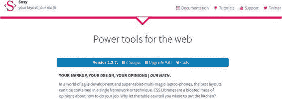

# 一、为直观的网页设计选择轻量级框架

## 什么是框架？

A framework is a premeditated set of concepts, modules, and standardized criteria that make the task of developing web sites and web applications easier. It provides generic functionality with already written modules and tailored components created in a standard manner. In short, it is a reusable software environment that allows web designers and developers to easily build their projects and solutions with minimal coding and without worrying about the low-level details. This reduces development time and provides easy upkeep and alterations whenever necessary. Usually, there are two kinds of frameworks .

*   前端框架(CSS 和 JavaScript 框架)
*   后端或服务器端编程框架

While back-end frameworks are used by web developers and programmers to build applications on the server-side, front-end frameworks are used by web designers and developers for implementing the Cascading Style Sheets language. In this book, you will get a glimpse into front-end frameworks, which basically are pre-prepared packages containing the structure of files and folders of Hypertext Markup Language (HTML) and CSS documents (some with JavaScript functions), which help designers and developers build interactive and immersive web sites. Frameworks allow you to use a common standardized structure that cuts out much of the groundwork of writing code from scratch and helps you reuse components, modules, and libraries, freeing you up to focus on core tasks at a high level.

## CSS 框架的组件

The following are the basic components of a CSS framework:

*   网格(帮助组织内容和设计布局的结构)
*   排版元素
*   跨浏览器兼容性
*   用于定位元素的帮助器类
*   实用程序类别
*   导航元素
*   用 Sass 等预处理程序编写的源代码
*   媒体元素(徽章、工具提示、评论等)

## 使用 CSS 框架的优势

Though some people have advocated not using CSS frameworks, mainly because of issues such as bloated structure, ingrained HTML markup, and a common aesthetic across framework-based web sites, using a CSS framework has several benefits. You should try using a CSS framework for the following reasons:

*   干净一致的编码
*   跨浏览器兼容性
*   基于网格的设计
*   整合健康编码实践的能力
*   易于构建的原型
*   易于维护和保养
*   允许重用和干净的同质代码结构
*   易于扩展和修改
*   可靠的文件
*   构建沉浸式网站的共同基础
*   易接近

A budding developer can find it difficult to build web sites just based on pure HTML, CSS, and JavaScript. In addition, grid-based layouts help budding designers to position, structure, and design the layout quite easily. You do not have to reinvent the wheel, meaning you can get some hands-on experience without the intricacies and dilemmas that you will come across when you code from scratch. Good and clean coding practices are imperative when you grow as a web designer, and frameworks are all about awesome cohesiveness and consistent coding that will hold you in good stead in times to come.

## 各种流行的框架

In this section, you will look at the most popular frameworks used by web designers across the globe. The most popular frameworks for designing web sites are Bootstrap, Foundation, and Materialize. Which one a developer chooses depends on the needs and requirements of a web site and its design. However, just because a framework is popular doesn’t mean it fits the bill when it comes to designing your projects. You need to consider several issues when it comes to selecting a framework; we’ll talk more about that later. Let’s now take a look at the various superlative frameworks that are in vogue today.

## 引导程序

Bootstrap is the most popular mobile-first framework in web design; it’s used extensively by developers across the globe (Figure 1-1). You can find more information on the official web site at [`getbootstrap.com/`](http://getbootstrap.com/) . Figure 1-1Bootstrap Bootstrap adopts a mobile-first paradigm by which you can build responsive web sites. It comes with components, modules, JavaScript functions, and media queries that help developers build immersive web sites with ease.

## 基础

Foundation was the earliest responsive framework and is as massive and advanced as Bootstrap for building web products and services (Figure 1-2). Foundation comes with cool features such as Flex Grid and Motion UI . The latest version, Foundation 6, is quicker, is lighter in size compared to its earlier versions, and is a solid front-end framework for designing beautiful web sites, e-mails, and apps that look good on any device. You can find more information on the official web site at [`foundation.zurb.com/`](http://foundation.zurb.com/) . Figure 1-2 Foundation

## 实现

Materialize is a modern front-end framework based on Google’s Material Design philosophy that helps developers build and design immersive web sites (Figure 1-3). You can find more information on the official web site at [`materializecss.com/`](http://materializecss.com/) . Figure 1-3Materialize Materialize has a superlative, creative user interface (UI) component library that incorporates cross-browser compatibility and device-agnostic capabilities for developing attractive and consistent web sites.

## 骨骼

As mentioned earlier, sometimes you don’t need a large framework, especially if you are embarking on a small project. Skeleton is a simple, responsive boilerplate and is extremely lightweight with 400 lines of code and with a mobile-based philosophy (Figure 1-4). You can find more information on the official web site at [`getskeleton.com/`](http://getskeleton.com/) . Figure 1-4Skeleton

## Milligram

Milligram is a minimalistic framework with just enough styles for small and interactive web sites (Figure 1-5). Its zipped file size is only 2KB. It comes with a mobile-first philosophy and supports the modern browser versions of Chrome, Firefox, Safari, IE, and Opera. Its cutting-edge features include the FlexBox grid system, and it is a simple, top-notch framework from a usability point of view. You can find more information on the official web site at [`milligram.io/`](http://milligram.io/) . Figure 1-5 Milligram

## UIkit

UIkit is a light and modular front-end framework for developing faster and powerful web interfaces (Figure 1-6). It has a massive collection of HTML, CSS, and JavaScript components and modules that can be extended with themes. It is flexible because it can be customized to give a unique feel to your web sites. You can find more information on the official web site at [`getuikit.com/v2/`](https://getuikit.com/v2/) . Figure 1-6UIkit

## 材质设计精简版

Google released its own front-end framework called Material Design Lite (MDL) that is based on its Material Design philosophy (Figure 1-7). MDL is a lightweight framework with few dependencies and is focused on simple web sites such as blogs and landing pages. It allows you to customize styles and web sites designed using MDL degrade gracefully in legacy browsers. You can find more information on the official web site at [`getmdl.io/`](https://getmdl.io/) . Figure 1-7Material Design Lite

## Susy！Susy

In today’s era of agile development and constant changes, the layout designs are crucial and cannot be restricted to a single framework, especially if your web site is intricate design-wise. With Susy (Figure 1-8), the settings are not set in stone, meaning you can use its integrated Sass-based libraries to create immersive layouts with potent structural designs. Susy is not a typical framework but more of a UI utility as it simplifies and streamlines the task of designing intricate grid layouts. You can find more information on the official web site at [`susy.oddbird.net/`](http://susy.oddbird.net/) . Figure 1-8 Susy

## 选择框架

As you can see, we have covered many popular frameworks. Choosing the right framework is quite important and depends on the needs and requirement of your projects. Some frameworks are bloated, meaning they have too many built-in styles, which might not be required for a small project. The following are some of the factors that you should consider when choosing a framework:

*   一个现有的 web 项目可能已经在使用一个特定的框架，而该框架不能与您想要的框架一起使用。
*   对于与性能相关的问题，一些项目可能不需要与重量级框架相关的混乱。
*   您可能需要不同的预处理器支持，比如对于 LESS 或 Sass，它们没有与您想要的框架集成。
*   使用特定框架构建的网站可能看起来很相似，如果没有进行定制以提供真实的外观和感觉的话。

There are several other factors such as the ease of use, speed of configuration, usability, features, widgets, components, long-term support, and reliability that you need to consider when choosing a framework. In summary, you need to choose your framework based on the requirements and needs of the project; especially when choosing lightweight front-end kits for small projects, given the bloat and bulk associated with massive frameworks.

## 网格的概念

A grid system allows you to structure and stack content horizontally and vertically in an easy manner. It is easily adaptable for any web site or web application and has a lot of advantages. It is usually responsive, meaning it adjusts itself based on the browser or device width. So, it displays the content appropriately in a mobile device, a laptop, a tablet, or a desktop depending on the size of the device. Plus, you have media queries, which help you define the grid layout based on the device width. Grids are usually 12-column containers in many frameworks but can be customized using methods specific to the framework. You can have flexible layouts wherein you can divide the page into several regions and place content using the markup. Another concept catching on in CSS designs is the FlexBox . The difference between a grid and FlexBox layout is that grid layouts are two-dimensional, while a FlexBox is usually one-dimensional wherein you can lay out content in a row or a column. The choice of using a grid layout or a FlexBox depends on how you want to structure your content. With a FlexBox you space out the content and build a structure using that content. Suppose you have certain items; it is up to you to decide how much space each item should take. Grid layouts, on the other hand, are content-agnostic. In grid layouts, you create a layout and place the content into rows and columns. In most modern frameworks, both the grid and the FlexBox are supported. While the usability of the grid layout is awesome, a FlexBox can help you place things more aesthetically. For a detailed explanation of the grid concept , you can refer the Mozilla developer network web site, specifically the following web page, for in-depth information: [`developer.mozilla.org/en-US/docs/Web/CSS/CSS_Grid_Layout`](https://developer.mozilla.org/en-US/docs/Web/CSS/CSS_Grid_Layout) .

## 摘要

In this chapter, we gave you an overview of some popular CSS frameworks. We also covered the benefits of using a CSS framework. CSS frameworks are comprised of components, modules, libraries, navigational elements, typography, media queries, tailor-made widgets, and grid layouts that make web design a breeze. We also gave you an overview of grid and FlexBox layouts. We will now dedicate a chapter for each of the frameworks mentioned in the introduction of the chapter, starting with Skeleton. With each chapter, we use a progressive approach, meaning the next framework is more extensive and a framework’s resourcefulness increases as you move through the book.