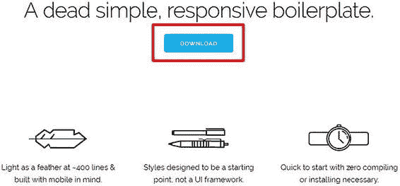
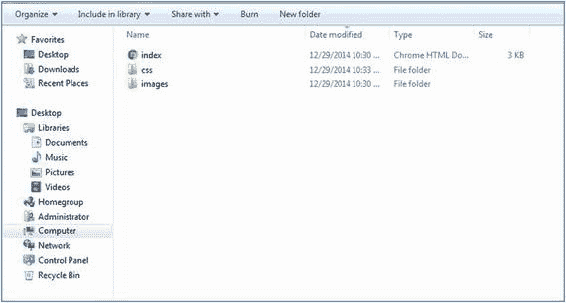
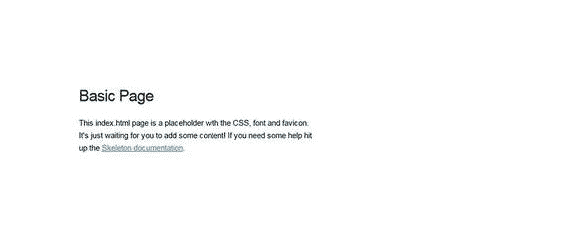
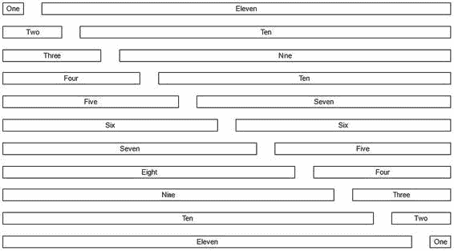
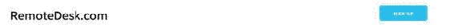
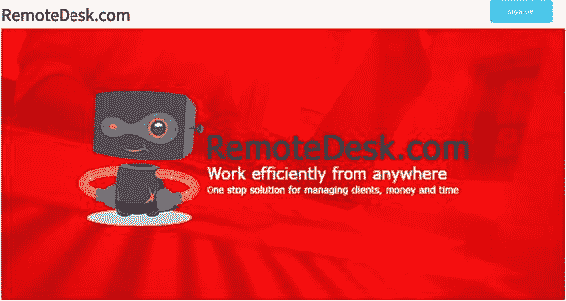
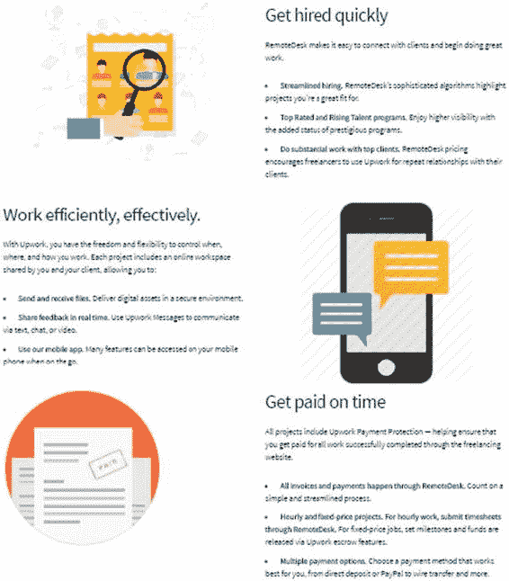
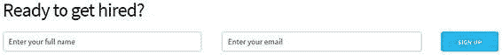
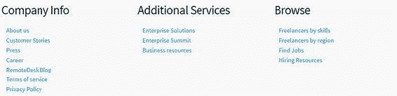

# 二、使用框架构建登录页面


## 安装骨架

To get started, go to the Skeleton web site at [`getskeleton.com/`](http://getskeleton.com/) . You will see the Download button, which is highlighted in a red box in Figure 2-1. Figure 2-1Skeleton download page Click Download to download the Skeleton .zip file. After unzipping the file, you will see the file structure shown in Figure 2-2. Figure 2-2 Content of the Skeleton framework The css folder is where you save your CSS files . By default, the css folder contains the Normalize and Skeleton style sheets. Normalize.css is a small CSS file that provides better cross-browser consistency in the default styling of HTML elements. It makes browsers render all elements more consistently and in line with modern standards. It precisely targets only the styles that need normalizing. You can find more information about Normalize on the official web site at [`necolas.github.io/normalize.css/`](https://necolas.github.io/normalize.css/) . You can also see the images folder where you can store your images. By default, the images folder contains the favicon image for Skeleton. The index.html file is your default web page. When you edit the page in Notepad++ or any editor, you will see the code displayed in Listing 2-1. <!DOCTYPE html> <html lang="en"> <head>   <!-- Basic Page Needs ––––––––––––––––––––––––––––––––––– -->   <meta charset="utf-8">   <title>Your page title here :)</title>   <meta name="description" content="">   <meta name="author" content="">   <!-- Mobile Specific Metas –––––––––––––––––––––––––––––– -->   <meta name="viewport" content="width=device-width, initial-scale=1">   <!—FONT  –––––––––––––––––––––––––––––––––––––––––––––-–– -->   <link href="//fonts.googleapis.com/css?family=Raleway:400,300,600" rel="stylesheet" type="text/css">   <!—CSS  –––––––-––––––––––––––––––––––––––––––––––––––––– -->   <link rel="stylesheet" href="css/normalize.css">   <link rel="stylesheet" href="css/skeleton.css">   <!—Favicon  ––––––––––––––––––––––––––––––––––––––––––––– -->   <link rel="icon" type="image/png" href="img/favicon.png"> </head> <body>   <!-- Primary Page Layout –––––––––––––––––––––––––––––––– -->   <div class="container">     <div class="row">       <div class="one-half column" style="margin-top: 25%">         <h4>Basic Page</h4>         <p>This index.html page is a placeholder with the CSS, font and favicon. It's just waiting for you to add some content! If you need some help hit up the <a href="http://www.getskeleton.com">Skeleton documentation</a>.</p>       </div>     </div>   </div> <!-- End Document ––––––––––––––––––––––––––––––––––––––––– --> </body> </html> Listing 2-1Basic Skeleton Example Now click the index.html file to display the web page, as shown in Figure 2-3. Figure 2-3Skeleton basic example in a browser

## 骨架网格系统

Like most other frameworks, Skeleton has its own grid system. It is essentially a 12-column grid with a maximum width of 960px. It is a responsive grid that adjusts itself depending on the browser/device size. Take a look at the code snippet in Listing 2-2 to understand how the grid system works. <body> <div class="container"> <!-- columns should be the immediate child of a .row -->              <div class="row">                    <div style="text-align:center; border: 1px solid black;" class="one column">One</div>                    <div style="text-align:center; border: 1px solid black;" class="eleven columns">Eleven</div>              </div> <br>   <!-- just use a number and class 'column' or 'columns' -->       <div class="row">             <div style="text-align:center; border: 1px solid black;" class="two columns">Two</div>             <div style="text-align:center; border: 1px solid black;" class="ten columns">Ten</div>       </div> <br>       <div class="row">              <div style="text-align:center; border: 1px solid black;" class="three columns">Three</div>              <div style="text-align:center; border: 1px solid black;" class="nine columns">Nine</div>       </div> <br>       <div class="row">              <div style="text-align:center; border: 1px solid black;" class="four columns">Four</div>              <div style="text-align:center; border: 1px solid black;" class="eight columns">Ten</div>       </div> <br>       <div class="row">              <div style="text-align:center; border: 1px solid black;" class="five columns">Five</div>              <div style="text-align:center; border: 1px solid black;" class="seven columns">Seven</div>       </div> <br>       <div class="row">              <div style="text-align:center; border: 1px solid black;" class="six columns">Six</div>              <div style="text-align:center; border: 1px solid black;" class="six columns">Six</div>       </div> <br>       <div class="row">              <div style="text-align:center; border: 1px solid black;" class="seven columns">Seven</div>              <div style="text-align:center; border: 1px solid black;" class="five columns">Five</div>       </div> <br>       <div class="row">              <div style="text-align:center; border: 1px solid black;" class="eight columns">Eight</div>              <div style="text-align:center; border: 1px solid black;" class="four columns">Four</div>       </div> <br>       <div class="row">              <div style="text-align:center; border: 1px solid black;" class="nine columns">Nine</div>              <div style="text-align:center; border: 1px solid black;" class="three columns">Three</div>       </div> <br>       <div class="row">              <div style="text-align:center; border: 1px solid black;" class="ten columns">Ten</div>              <div style="text-align:center; border: 1px solid black;" class="two columns">Two</div>       </div> <br>       <div class="row">              <div style="text-align:center; border: 1px solid black;" class="eleven columns">Eleven</div>              <div style="text-align:center; border: 1px solid black;" class="one columns">One</div>       </div> <br>       </div   </div> <!-- End Document ––––––––––––––––––––––––––––––––––––––––– --> </body> Listing 2-2Skeleton Grid System Demonstrated In Listing 2-2, you define a <body> element within which you define a <div> with the container class. Inside that, you define the <div> with the row class. Within that <div>, you define two <div>s, one with a column width of one column and other with a column width of eleven columns. Remember that the <div> with the column classes should be the immediate child of the <div> with the row class. To define one column, you use the one column class. Similarly, to define eleven columns, you use the eleven columns class. For two columns, the class is two columns. Note that you use an inline CSS style of <style="text-align:center; border: 1px solid black;"> with each column to align the text in the center and dedicate a black border of 1px for each column. You use the <br> element for spacing between each row. Basically, the code in Listing 2-2 defines different rows with a <div> class and defines columns of different widths. Figure 2-4 shows the output of the code on execution. Figure 2-4Skeleton grid system demonstrated As you can see in Figure 2-4, the first row has two columns defined with widths of one and eleven columns, respectively. The second row has two columns with widths of two and ten columns , respectively. Similarly, you define eleven rows each with two columns of varying widths. Now you have an idea how the grid system works in Skeleton.

## 骨骼属性概述

Let’s take a look at some attributes of the Skeleton framework.

*   Skeleton 的排版基础是 Raleway，一个基于 Google 的排版。字体大小默认为 HTML 的字体大小，版式保留类似于 HTML 基本版式的属性，如锚点、粗体、强调和下划线。
*   骨架中的按钮可以使用 button-primary 类创建，这很容易区分。如果不想要增强按钮，也可以选择标准按钮。为此，您只需使用 button 类，而不是 button-primary。您还可以使用<button>元素定义一个按钮，或者在 button 或 button-primary 类中使用一个锚标记</button>
*   使用

*   代码样式可以通过使用`类来设置。对于几个代码块，可以在一个

    ```html
    元素中使用元素。
    ```` 
*   Skeleton 中的表格类似于 HTML 表格，其中使用了和元素。与 HTML 类似，使用定义表格行，定义表格数据，定义表格标题；您将所有内容包装在主元素中。

*   Skeleton 使用以最小宽度为目标的移动优先查询。查询之外的样式适用于所有设备。这样做是为了防止手机和平板电脑等小型设备解析大量未使用的 CSS。框架根据设备大小使用以下媒体查询大小:
    *   手机:400 像素
    *   Phablet: 550px
    *   平板电脑:750 像素
    *   桌面:1000 像素
    *   HD 桌上型电脑:1200px

Skeleton also comes with many helper classes that can be used to limit the elements within a container , float the element to the left or right, and clear the floats on both sides.

## 用框架构建登陆网页

In this section, you will create a landing page for a freelance portal called RemoteDesk . The landing page shows the various things you can do on the freelance portal. You will design a web page that shows several aspects of the freelance portal along with company information and other basic features. We will divide the process of building the web page into six Steps. After these six Steps, you will have a complete landing page.

### 步骤 1:定义内容区域

You will define the <html> tags and then move on to include the necessary links for Skeleton and Normalize (included by default in Skeleton) and the custom style sheet in the <head> tags (more about that in the code explanation). Then you will define the <body> section after the <head> tags and within the <html> tags. Inside the <body> tags, you will define the <div> class with the necessary rows and columns with the required content. Essentially, each content area will be encapsulated in an element with the row class. Depending on the content, you will divide the area into sections using elements with the columns class in that section’s parent row. Let’s look at Listing 2-3. <html>     <head>         <!-- Step1: Include the necessary style and heading-->         <meta name="viewport" content="width=device-width, initial-scale=1.0,maximum-scale=1.0"/>         <link href="https://fonts.googleapis.com/css?family=Source+Sans+Pro" rel="stylesheet">         <link href="css/normalize.css" rel="stylesheet" type="text/css"/>         <link href="css/skeleton.css" rel="stylesheet" type="text/css"/>         <link href="css/style.css"  rel="stylesheet" type="text/css"/>         <title>Best Freelance management app</title>         <!-- end of Step 1-->     </head>     <body class="container">         <!-- Navigation area -->         <div class="row">             <div class="two columns logo">RemoteDesk.com</div>             <div class="eight columns">&nbsp;</div>             <div class="two columns">                 <a class="button button-primary" href="#">Sign up</a>             </div>         </div>         <!-- Navigation area ends -->     </body> </html> Listing 2-3Defining the Content Area As you can see in Listing 2-3, you define the viewport size inside the head section. A viewport controls the way a web page is displayed on a mobile device. If you do not use a viewport, a mobile device will render the page in a typical desktop screen width. Setting a viewport helps you exercise control over a page’s width and scaling on varied devices. You can find more about viewports at [`developers.google.com/speed/docs/insights/ConfigureViewport`](https://developers.google.com/speed/docs/insights/ConfigureViewport) . Then, by default in Skeleton, you set the links for Normalize and Skeleton. Remember that if the path to your files is different, you need to specify so. For now, they should be in the root folder , so the default path is good to go. Then you define the path for the custom style sheet called as style.css , which you will place in the css folder. You define a <body> tag and assign the container class to it. The container is the main centered wrapper. You define a <div> element and assign a row class to it. Inside that <div> element, you define three <div>s. The first <div> contains the content RemoteDesk.com and spans two columns. The next <div> spans eight columns, and you assign the &nbsp; value between the <div> tags. Essentially, &nbsp creates a nonbreaking space. It is used in programming and web design to create a space in a line that cannot be broken with word wrap. Using it will help create multiple spaces that are visible on a web page and not only in the source code. (We are using this because there are no offset classes in Skeleton compared to other frameworks like Bootstrap and Foundation.) The third <div> spans two columns and contains the Sign Up button, which we create using the button-primary class. Figure 2-5 shows the output of the code. Figure 2-5The output of the content area

### 步骤 2:完成标签内容

Now, you will create the rest of the content within the <body> tags. You will start with inserting an image, as shown in Listing 2-4. (Refer to the entire code in the code bundle to see the positioning of the various elements; we have included code in steps in the code bundle so that you can have a better understanding of each step. Finally, index.html contains the entire code for the landing page.) <div class="row masthead"></div> Listing 2-4Inserting the Header Image You have just used the row class and assigned a class called masthead to it. The image is defined in the code in the style sheet called Style.css. The image referred to, masthead.png, is located in the images folder where you will keep all the images. In style.css, you define the code, as shown in Listing 2-5. .masthead{     background: url("img/masthead.png") no-repeat center;     height: 462px;     background-size: cover; } Listing 2-5Inserting Header Image Remember that the code shown in Listing 2-5 is the code in the custom CSS style sheet called style.css . You assign a height of 462px and center the image. You also assign the value cover to the background-size property; this scales the background image to be as large as possible so that the background area is fully covered by the image. Now on executing the index.html page , you will get the output shown in Figure 2-6. Figure 2-6Output of the header image

### 步骤 3:定义自由职业门户

Next, you will create a later section of the page where you define the features of the freelance portal . To create this section, let’s look at the code snippet shown in Listing 2-6. <div class="row rewardingContent">             <div class="six columns">                 <h3>Plenty of rewarding projects</h3>                 <p>RemoteDesk is a great place to find more clients, and to run and grow your own freelance business.</p>                 <ul>                     <li><strong>Freedom to work on ideal projects.</strong> On RemoteDesk, you run your own business and choose your own clients and projects. Just complete your profile and we’ll highlight ideal jobs. Also search projects, and respond to client invitations.</li>                     <li><strong>Wide variety and high pay.</strong> Clients are now posting jobs in hundreds of skill categories, paying top price for great work.</li>                     <li><strong>More and more success.</strong> The greater the success you have on projects, the more likely you are to get hired by clients that use Upwork.</li>                 </ul>             </div>             <div class="six columns">                              </div>         </div> Listing 2-6Defining the Content Area for the “Rewarding” Section In Listing 2-6, you create another <div> with the row class. You also assign a rewardingContent custom class to it. Then, you divide the section of the page into two rows each spanning six columns in width. The first <div> within the <div> with the row class is assigned a width of six columns using the six columns class. You assign a heading inside it. You create a list using the <ul> tags and define the list items using the <li> tags. Then, you create the second <div> spanning six columns where you insert an image using the  tag. You also add a custom rewardingImg class to it. Next, you can see what to do with the custom classes, rewardingContent and rewardingImg, in the style.css style sheet, as shown in Listing 2-7. .rewardingContent {     margin-top:10px; } .rewardingImg {     width: 75%;     margin: 0 auto;     display: block; } Listing 2-7Defining Styles Related to the “Rewarding” Section In this code, you add a margin to the rewardingContent class to set the whitespace around the border. You use the display: block for the rewardingImg so that it occupies the space of the parent element. (You need to use the display: block property because Skeleton does not have any utility classes for responsive images.) You also define a width for the image and center it using margin: 0 auto. Figure 2-7 shows the later section of the page as created in Step 3. Figure 2-7Output of the “rewarding” section

### 步骤 4:完成各部分

Next, you will create the remaining three sections using the code in Listing 2-8. <div class="row hiredContent">           <div class="six columns">                          </div>           <div class="six columns">               <h3>Get hired quickly</h3>               <p>RemoteDesk makes it easy to connect with clients and begin doing great work.</p>               <ul>                   <li><strong>Streamlined hiring.</strong> RemoteDesk's sophisticated algorithms highlight projects you're a great fit for.</li>                   <li><strong>Top Rated and Rising Talent programs.</strong> Enjoy higher visibility with the added status of prestigious programs.</li>                   <li><strong>Do substantial work with top clients.</strong> RemoteDesk pricing encourages freelancers to use Upwork for repeat relationships with their clients.</li>               </ul>           </div>       </div>       <!-- Hired content end -->       <!-- work efficiency start-->       <div class="row workEfficiency">           <div class="six columns">               <h3>Work efficiently, effectively.</h3>               <p>With Upwork, you have the freedom and flexibility to control when, where, and how you work. Each project includes an online workspace shared by you and your client, allowing you to:</p>               <ul>                   <li><strong>Send and receive files.</strong> Deliver digital assets in a secure environment.</li>                   <li><strong>Share feedback in real time.</strong> Use Upwork Messages to communicate via text, chat, or video.</li>                   <li><strong>Use our mobile app.</strong> Many features can be accessed on your mobile phone when on the go.</li>               </ul>           </div>           <div class="six columns">                          </div>       </div>       <!-- Work efficiency end-->       <!-- Get paid section start -->       <div class="row getPaid">           <div class="six columns"></div>           <div class="six columns">               <h3>Get paid on time</h3>               <p>All projects include Upwork Payment Protection — helping ensure that you get paid for all work successfully completed through the freelancing website.</p>               <ul>                   <li><strong>All invoices and payments happen through RemoteDesk.</strong> Count on a simple and streamlined process.</li>                   <li><strong>Hourly and fixed-price projects. For hourly work, submit timesheets through RemoteDesk.</strong> For fixed-price jobs, set milestones and funds are released via Upwork escrow features.</strong>                   <li><strong>Multiple payment options.</strong> Choose a payment method that works best for you, from direct deposit or PayPal to wire transfer and more.</li>               </ul>           </div>       </div> Listing 2-8Adding Content to the Remaining Sections As shown in Listing 2-8, you create three rows using three <div>s with the row class. In the first <div> containing the row class, you create two <div>s each spanning six columns. In the first child <div>, you insert an image using the  tag, and in the second child <div>, you create a heading followed by creating a list using the <ul> and <li> tags. In short, you create the next three content blocks using a similar technique as you did in Step 3. Similarly, you create a similar structure for the remaining two <div>s with the row class by inserting two child <div>s, each spanning six columns. You also insert an image and create an unordered list similar to the previous <div>s. Then, you define the CSS styles for the custom CSS code in the style.css style sheet just like you did in Step 3\. Listing 2-9 shows the CSS style sheet code. .rewardingContent,.hiredContent,.workEfficiency,.getPaid{     margin-top:10px; } .rewardingImg,.hiringImg,.messagingImg,.paidImg {     width: 75%;     margin: 0 auto;     display: block; } Listing 2-9Adding Styles for the Remaining Sections Figure 2-8 shows the output of the code in Step 4. Figure 2-8Output of the content of the remaining sections

### 步骤 5:设计注册表单

In this Step, you will create a small sign-up form. Listing 2-10 shows the code for the form. <h3 class="row">Ready to get hired?</h3>         <div class="row quickSignup">             <div class="five columns"><input type="text" name="fullName" class="fullName u-full-width" id="fullName" placeholder="Enter your full name"/></div>             <div class="five columns"><input type="text" name="emailId" class="emailId u-full-width" id="emailId" placeholder="Enter your email"/></div>             <div class="two columns"><a class="button button-primary" href="#">Sign up</a></div>         </div> Listing 2-10Sign-up Form In Listing 2-10, you create a <div> and assign the row class to it. You then add three <div>s with the columns class within the <div> with the row class. You then add inputs in the first two <div>s for the full name and e-mail. Here you use a utility class provided by Skeleton; for example, u-full-width is used so that the fields occupy the full width of the container. You then place a Sign Up button in the last <div>. Figure 2-9 shows the output of the form. Figure 2-9Output of the sign-up form

### 步骤 6:创建页脚

Finally, you will create the footer. Listing 2-11 shows the code for the footer section. <div class="row footer">             <div class="four columns">                 <h4>Company Info</h4>                 <a class="column">About us</a>                 <a class="column">Customer Stories</a>                 <a class="column">Press</a>                 <a class="column">Career</a>                 <a class="column">RemoteDesk Blog</a>                 <a class="column">Terms of service</a>                 <a class="column">Privacy Policy</a>             </div>             <div class="four columns">                 <h4>Additional Services</h4>                 <a class="column">Enterprise Solutions</a>                 <a class="column">Enterprise Summit</a>                 <a class="column">Business resources</a>             </div>             <div class="four columns">                 <h4>Browse</h4>                 <a class="column">Freelancers by skills</a>                 <a class="column">Freelancers by region</a>                 <a class="column">Find Jobs</a>                 <a class="column">Hiring Resources</a>             </div>         </div> Listing 2-11Footer In Listing 2-11, you create a <div> tag and assign a row class to it. Within that <div>, you create three child <div>s, each spanning four columns using the four columns class. The first child <div> contains anchor links, <a>, for the company information. The second child <div> contains anchor links for the additional services, whereas the third child <div> contains anchor links for the Browse section. Figure 2-10 shows the footer section of the web page. Figure 2-10Output of the footer section You have just designed a landing page for the RemoteDesk freelance portal using Skeleton!

## 摘要

Skeleton is a simple framework that beginners can adopt quickly. It has a clean and concise code base. However, Skeleton does have its drawbacks.

*   它缺少其他框架提供的几个 CSS 特性。正因为如此，使用 Skeleton 的开发时间比同类产品要长。
*   12 列流体网格支持的最大宽度为 960 像素。
*   另一个缺点是缺乏社区支持。这个框架的最后一次更新是在三年前。此外，许多“拉”请求和问题仍然是开放的，这意味着所有的差异都还没有随着实质性的更新而得到解决。

Therefore, when it comes to massive, immersive web sites, Skeleton falls short. Nevertheless, it is a handy utility suitable for web projects, meant mainly for smaller screens. In the next chapter, you will design a product page with Milligram, another intuitive lightweight framework.