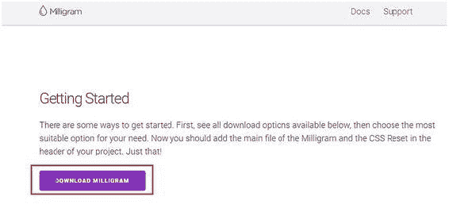

# 三、使用 Milligram 建立产品页面


## 安装 Milligram

There are different ways you can install Milligram. In this section, you will learn how to install Milligram by downloading the Milligram files. Go to the Milligram web site at [`milligram.io/`](http://milligram.io/) and click the Download Milligram button, as highlighted in Figure 3-1. The zip file will be downloaded. Figure 3-1Milligram download page Figure 3-2 shows the file structure . Figure 3-2Content of the Milligram framework The CSS files (both the usual ones as well as the minified versions) are present in the dist folder. Figure 3-3 shows the file structure. Figure 3-3File structure of Milligram framework (source: Milligram) You can also download the Milligram files or install it using Bower, NPM, or Yarn. For installation through Bower, NPM, and Yarn, you need to use the following commands from the command-line prompt: $ bower install milligram $ npm install milligram $ yarn add milligram Once you download Milligram, add the tags for the files in the head section of your HTML code. There is a preferred way of using Milligram that we will be showing in this chapter, which is to use a content delivery network (CDN) . A CDN is basically a system of distributed networks delivering web pages and other web content according to the geographic location of the users, the source of the web pages, and the location of the CDN server. There are many benefits of using CDN.

*   降低服务器负载
*   实现快速内容交付
*   确保高可用性
*   促进高并发网络主干容量
*   更好地控制资产交付

You can add the CDN code for Milligram using the following lines of code: <link href="https://fonts.googleapis.com/css?family=Roboto" rel="stylesheet"> <link href="https://cdnjs.cloudflare.com/ajax/libs/milligram/1.3.0/milligram.min.css" rel="stylesheet" type="text/css"/> The first line of code is the CDN link for the Google Roboto font. The second line of code is for the Milligram CSS minified file.

## Milligram 框架概述

In this section, you will get an overview of the various attributes of Milligram before you learn how to build a product page with the framework.

*   在字体设计上，Milligram 坚持 CSS3 的 rem 单位思想，为根元素定义了一个单一的字体大小，然后所有其他的 rem 单位都是该根元素的一个百分比，从而提供了更容易的可维护性和更简洁的代码。顺便说一下，Milligram 使用 Roboto 字体系列作为其排版的默认字体。
*   以 Milligram 为单位的块引号被引用在

    > 标记之间。在`标签之间定义了一个代码元素。如果你需要一个块，在
    > 
    > ```html
    > 标签中包装元素。
    > ````

*   clearfix 实用程序与 clearfix 类一起使用，而 float 由 float-left 和 float-right 类定义，这取决于您是否希望分别向左和向右浮动。
*   与 HTML 类似，以 Milligram 为单位的列表在

    标签中分别定义为有序列表、无序列表和描述列表。每个列表项都被包装在类似 HTML 的
    *   标签之间。
*   按钮由 button 类定义，带有锚标记
*   以 Milligram 为单位的表格类似于 HTML 表格，其中使用了和元素。与 HTML 类似，使用定义表格行，定义表格数据，定义表格标题，然后将所有内容包装在主元素中。

*   和 Skeleton 一样，Milligram 使用以最小宽度为目标的移动优先查询。查询之外的样式适用于所有设备。这样做是为了防止手机和平板电脑等小型设备解析大量未使用的 CSS。Milligram 根据设备大小使用以下媒体查询大小:
    *   比移动设备/屏幕大:40 雷姆(640 像素)
    *   大于平板设备/屏幕:80 雷姆(1280 像素)
    *   大于桌面设备/屏幕:120 雷姆(1920 像素)

## Milligram 网格系统

Grids in Milligram use the CSS Flexible Box Layout module standard wherein the grid is fluid, shrinking based on the browser at smaller sizes. The entire grid system is responsive with a maximum width of 112rem (1120px). See Listing 3-1 to understand the grid system in Milligram. <!DOCTYPE html> <html lang="en"> <head>   <meta charset="utf-8">   <title> Grid system</title>   <meta name="description" content="">   <meta name="author" content="">   <meta name="viewport" content="width=device-width, initial-scale=1"> <link href="https://cdnjs.cloudflare.com/ajax/libs/milligram/1.3.0/milligram.min.css" rel="stylesheet" type="text/css"> <link href="https://fonts.googleapis.com/css?family=Roboto" rel="stylesheet"> </head> <br> <div class="container">   <div class="row">     <div style="text-align:center; border: 1px solid black;" class="column">One</div>     <div style="text-align:center; border: 1px solid black;" class="column">Two</div>     <div style="text-align:center; border: 1px solid black;" class="column">Three</div>     <div style="text-align:center; border: 1px solid black;" class="column">Four</div>   </div> <br>   <div class="row">     <div style="text-align:center; border: 1px solid black;" class="column">One</div>     <div style="text-align:center; border: 1px solid black;" class="column column-50 column-offset-25">Two</div>   </div> </div> </html> Listing 3-1Grid System in Milligram In the code, you use the CDN links for the Google fonts and the Milligram minified CSS file. You also define the viewport. Just like Skeleton, the entire code is wrapped in a <div> element with a container class. All columns are defined within a row just like in many grid-based frameworks. However, Milligram is different from other frameworks in that you can add any number of columns within a row. You are not restricted to 12 columns like with many popular frameworks. In Listing 3-1, initially you define a row within the <div> with the container class. Then, you define four columns within that row using the column class. You use inline styles for assigning a border and aligning the text to the center for each column. Then you define another row and a column using a column class. Then you define another column within that row and use the column-50 class along with the column-offset-25 class. What the column-50 class does is assign a column width of 50 percent to the column, which will allocate 50 percent of the column content within the parent row. The column-offset-25 class moves the column to the right by 25 percent column space for that parent row. Figure 3-4 shows the output of the code. Figure 3-4Implementation of grid system of Milligram In Figure 3-4, you can see four columns, named One, Two, Three, and Four, in the first row. The second row has a column named One and a column named Two, which is offset by 25 percent and occupies 50 percent of the row width.

## 用 Milligram 建立产品页面

Now that you have a brief idea about Milligram, you will learn how to create a product page with Milligram. The Product page contains information about a Virtual Private Network (VPN) along with its features and pricing.

### 步骤 1:定义标题

Let’s look at the code in Listing 3-2 to start the first step of building the secure VPN product page. <!DOCTYPE html> <html>     <head>         <title>Secure VPN</title>         <!--include milligram via cdn-->         <meta name="viewport" content="width=device-width, initial-scale=1">         <link href="https://cdnjs.cloudflare.com/ajax/libs/milligram/1.3.0/milligram.min.css" rel="stylesheet" type="text/css">         <link href="https://fonts.googleapis.com/css?family=Roboto" rel="stylesheet">         <link href="css/style.css" rel="stylesheet" type="text/css">     </head>     <body class="container">         <div class="row contactArea">             <!--Div with width of 50% and offset from left 50%-->             <div class="column column-50 column-offset-50">                 <div class="contactColumn">Your IP: 115.166.129.152</div>                 <div class="contactColumn">Your Location: Unknown</div>                 <div class="contactColumn">Your Status: UNPROTECTED</div>             </div>         </div>    </body> </html> Listing 3-2 Defining the Header In Listing 3-2, you define the viewport and add the CDN links for the fonts and the Milligram CSS minified file. Then you introduce a link for the style.css custom CSS file. After defining the links in the <head> tag, you create a <body> element with the container class in it. Then you define a <div> with the row class. You assign another custom class called contactArea to it, which you will use to define the custom CSS code. Next, you define a <div> with a column of 50 percent width within the parent row and offset it by 50 percent within that row by using the column-50 and column-offset-50 classes. Within that <div>, you create three <div>s wherein you define the content that comprises the IP address, location, and status. Then, you define the custom CSS code using the contactArea and contactColumn classes in the custom style.css file. Listing 3-3 depicts the code in the style.css custom CSS file using the contactArea and contactColumn classes for the corresponding <div>s. .contactArea{     background: #666;     color: #fff;     text-align: right } .contactColumn{     font-size: 12px;     display: inline-block;     margin-right: 10px; } Listing 3-3Defining CSS for the Header In Listing 3-3, you define the background as gray and the color of the words as white for the contactArea class. You align the text to the right. For the <div> that is defined by the contactArea class, you define the font size as 12px and use a margin. You use the display: inline-block property, which essentially creates a grid of boxes that fills the browser width and wraps it. Here, it helps the content blocks of the header to retain their block-level characteristics and helps them appear next to each other without using a float attribute. Figure 3-5 shows the output of the code. Figure 3-5Output of the header area In Figure 3-5, you can see the elements floated to the right with the IP address and the rest of the content.

### 步骤 2:定义导航

Let’s now look at the code in Listing 3-4 to proceed with step 2. <div class="navigation row">      <div class="column column-25 logo">                </div>      <div class="column column-50 column-offset-25">          <a>Home</a>          <a>Pricing</a>          <a>Support</a>          <a>Login</a>      </div> </div> Listing 3-4 Defining the Navigation In Listing 3-4, you create a <div> and assign a row class to it. You also assign a custom navigation class to it, wherein you will define the custom CSS code in the style.css style sheet . You then create a <div> within the <div> with the row class and assign a column width of 25 percent to it by using the column-25 class. You also add a logo custom class to it. You then insert an image for that <div> using the  element. The path to the images is set to the images folder, with the logo.png as the image name. Within the same row, you create another <div> and assign a column width of 50 percent to it using the column-50 class for that parent row, and you offset that column by 25 percent to the right. You define the content in anchor link, <a>, tags. Listing 3-5 shows the custom CSS code linked to the code in Listing 3-4. .logo {     text-align: left; } .logo img {     width: 25%;     margin: 10px 0; } .navigation{     background: #ffc400;     text-align: right;     padding: 10px 0;     font-weight: bold; } .navigation a{     color: #000;     padding: 5px;     border: 2px solid #000; } Listing 3-5Defining the CSS for the Navigation As you can see in Listing 3-5, you define an image width of 25 percent and set a margin for it. In the navigation class, you define dark orange as the background color and align the text to the right. You set the padding and define the bold font weight for it. To the anchor links containing the Home, Pricing, Support, and Login links, you assign the black color and a black border with a padding of 5px. Figure 3-6 shows the output of the code. In Figure 3-6, you can see the orange background and the links in the anchor tags (i.e., Home, Pricing, Support, and Login) to the right of the screen. You can also see the logo on the left of the screen. Figure 3-6Output of the navigation

### 步骤 3:定义横幅区域

Let’s look at the code in Listing 3-6 to see the next step in the coding process for the secure VPN product page. <section class="mastHead row">             <div class="column column-60">                 <h2>Secure your data. Protect your privacy</h2>                 <h4>Protect your IP address and surf the web anonymously</h4>             </div>  </section> Listing 3-6HTML for the Banner Area In Listing 3-6, you define the <section> tags and assign the row class as well as the custom mastHead class to it. Inside that row, you define a <div> with a column of 60 percent width for the row for the <section> tag. Listing 3-7 shows the corresponding code for the mastHead class in the custom style.css style sheet. .mastHead {     height: 450px;     overflow: hidden;     background: #ffc400;     color: #000; } .mastHead h1,.mastHead h2,.mastHead h3,.mastHead h4,.mastHead h5,.mastHead h6{     color: #000 } Listing 3-7CSS for the Banner Area What you have done is set the height of the <section> with the mastHead class to 450px and set the background to dark orange, the same color as in step 2\. Then, you define black color to the content in that section. You also set the color of all the headings in that section to black with the mastHead class. Now you will split the sprite image shown in Figure 3-7 into three parts for the App Store, Google Play, and Windows Phone Store . The rest of the image for the Mac App Store and Windows PC will not be displayed on the page. Figure 3-7Sprite image for store icons You define the code for the unordered list in Listing 3-8 within which you assign a column width of 60 percent, after the headings. <section class="mastHead row">             <div class="column column-60">                 <h2>Secure your data. Protect your privacy</h2>                 <h4>Protect your IP address and surf the web anonymously</h4>                 <ul class="srote-badges">                     <li><a class="store-ios" title="Available on the App Store"></a></li>                     <li><a class="store-android" title="Get it on Google Play"></a></li>                     <li><a class="store-winphone" title="Download from Windows Phone Store"></a></li>                 </ul>             </div> </section> Listing 3-8Adding Store Information to the Banner Area As you can see from the code in Listing 3-8, you define the unordered list and assign the custom srote -badges class to it. You define the list in the anchor tags and assign the store-ios, store-android, and store-winphone custom classes to it. The corresponding custom CSS code in the style.css style sheet for the unordered list will look like Listing 3-9. ul.srote-badges{     list-style: none; } ul.srote-badges li a, .srote-badges a {     display: inline-block;     background: url(img/store-badges-70x245.png) no-repeat 0 0 #fff;     width: 245px;     height: 70px;     border-radius: 4px; } .srote-badges a.store-ios {     background-position: 0 0; } .srote-badges a.store-android {     background-position: 0 -70px; } .srote-badges a.store-winphone {     background-position: 0 -140px; } Listing 3-9Adding the CSS for Store Icons In Listing 3-9, you set list-style as none to remove the bullets. Further, you set the background as the sprite image by assigning the link to that image. Then, you define the width and height for it. You also assign a border-radius setting of 4px to the image . Next, you split the image into the first three parts and set the background position to 0 for the first part, -70px for the next part, and -140px for the third. The rest of the image cannot be seen. Next you define an Android phone image, as shown in Figure 3-8, to the right using another <div> within the same section class. Figure 3-8Application image for the banner area You assign a column width of 40 percent for the parent <section> tag and add the mastHeadImage class to it. Listing 3-10 shows the code within the entire <section> tags after incorporating everything from the sprite images into this Android image. <section class="mastHead row">             <div class="column column-60">                 <h2>Secure your data. Protect your privacy</h2>                 <h4>Protect your IP address and surf the web anonymously</h4>                 <ul class="srote-badges">                     <li><a class="store-ios" title="Available on the App Store"></a></li>                     <li><a class="store-android" title="Get it on Google Play"></a></li>                     <li><a class="store-winphone" title="Download from Windows Phone Store"></a></li>                 </ul>             </div>             <div class="column column-40 mastHeadImage"></div>         </section> Listing 3-10Adding the Application Image to the Banner Area Listing 3-11 shows the corresponding custom CSS code for the <div> element with the last mastHeadImage class. .mastHeadImage{     background: url("img/android-device1.png") no-repeat;     background-size: cover;     background-position: 0 15px; } Listing 3-11Adding the CSS for the Application Image in the Banner Area In Listing 3-11, you refer to the background and assign the image link. Then you set background-size to cover and set background-position as 15px. Figure 3-9 shows the output of the entire code so far. Figure 3-9Code output so far

### 步骤 4:设计内容区域

Moving Forward, you will design the content area . Listing 3-12 shows how to proceed with building the “benefits” section. <section class="info">             <div class="row">                 <h3 class="column">BENEFITS OF USING VPN IN TOUCH</h3>             </div>             <div class="row">                 <div class="column column-50">                     <h4>Unblock Websites</h4>                     <p>Bypass internet restriction and access to any websites: Unblock Facebook, Unblock Youtube.</p>                 </div>                 <div class="column column-50">                     <h4>Secure Your Data</h4>                     <p>Encrypt your private data before sending it from your computer, smartphone or tablet over the internet.</p>                 </div>             </div>             <div class="row">                 <div class="column column-50">                     <h4>Bypass content restrictions</h4>                     <p>Watch Netflix and BBC iPlayer, no matter where you are. Use Skype, Viber and all Voip services without restrictions.</p>                 </div>                 <div class="column column-50">                     <h4>Protect Your Privacy</h4>                     <p>Hide your IP address, protect your online identity while browsing and surf the web anonymously.</p>                 </div>             </div>             <div class="row">                 <div class="column column-50">                     <h4>Wifi Hotspot Security</h4>                     <p>Prevent sniffers and hackers from stealing your private data while using public hotspots.</p>                 </div>                 <div class="column column-50">                     <h4>Data Saving and Ad Blocker on Mobile</h4>                     <p>Save more bandwidth on your mobile 3G/4G data plan. Clear your mobile screen of obtrusive ads with Ad Blocking mode.</p>                 </div>             </div>         </section> Listing 3-12HTML for the Content Area In Listing 3-12, you use a <section> tag and enclose a <div> with a row class. Within that parent row, you use the <h3> heading to define the content for the level 3 heading. After that <div>, you create a <div> with the row class. You create two <div>s each with a column width of 50 percent of the parent <div> using the column-50 class. You define a level 4 <h4> and a paragraph element, <p>, with their respective content within each child <div>. Repeat the process three more times, wherein you create two <div>s within a parent <div> with a row class. Similarly, define <h4> and <p> under each child <div> with their respective content. Figure 3-10 shows the output of the code. Figure 3-10Output of the content area

### 步骤 5:创建定价区域

Next, you will create a pricing table wherein you will list the subscription price for the monthly, half-yearly, and yearly timeline. Let’s look at the code in Listing 3-13. <section class="pricingInfo">             <div class="row">                 <h3 class="column">Pricing Overview</h3>             </div>             <div class="row">                 <div  class="column">                 <table>                     <tbody>                         <tr>                             <td><strong>pricing</strong></td>                             <td>1 Month</td>                             <td>6 Months</td>                             <td>1 Year</td>                         </tr>                         <tr>                             <td><strong>Price</strong></td>                             <td>$9.98/month</td>                             <td>$2.99/month</td>                             <td>$2.49/month</td>                         </tr>                         <tr>                             <td><strong>Save</strong></td>                             <td>0%</td>                             <td>50%</td>                             <td>75%</td>                         </tr>                     </tbody>                 </table>                 </div>             </div>         </section> Listing 3-13HTML for the Pricing Area In Listing 3-13, you define the <section> tags within which you define the tables. Initially, you define a <div> with a row class where you use a heading of <h3> with the column class to define the content, i.e., Pricing Overview. Then, you create a <div> with the row class after the preceding <div> and assign another <div> with the column class within it. Moving forward, you define the table headings and the table rows with the list of items in the table, which is quite similar to the way you create tables in HTML. Place the content within the <section> tags. Figure 3-11 shows the output of the code. Figure 3-11Output of the pricing area

### 步骤 6:创建页脚

Finally, you will create a footer for your product page. Let’s look at the code in Listing 3-14 to understand how you design the footer of the web page. <footer>             <div class="row">                 <div class="column column-25 logo">                                          <p>&copy; Copyright 2017</p>                     <p>All rights reserved</p>                 </div>                 <div class="column column-25">                     <h6>LEARN MORE</h6>                     <a>Pricing</a><br>                     <a>How To Setup</a><br>                     <a>Servers</a><br>                     <a>Blog</a><br>                     <a>FAQ</a><br>                 </div>                 <div class="column column-25">                     <h6>LEGAL</h6>                     <a href="/legal#terms">Terms & Conditions</a><br>                     <a href="/legal#privacy">Privacy Policy</a><br>                     <a href="/legal#refund">Refund Policy</a><br>                 </div>             </div>         </footer> Listing 3-14HTML for the Footer In Listing 3-14, you define the footer content within the <footer> tags. Inside the <footer> tags, you initially define a <div> with the row class. Then, you create three child <div>s each with a column with a width of 25 percent of the parent row so that each child <div> takes a quarter of the parent row space. In the first child <div>, you assign a logo class to it. You then insert the logo image with the  tag. Then you enter the copyright information with the <p> tags. For this first child <div>, you define the custom CSS code in the style.css file, as shown in Listing 3-15. footer{     color:#fff;     background: #666;     padding: 10px 0; } footer .logo img,footer .logo p{     margin-left: 10px;     display: block; } footer .logo p{     margin-bottom: 0; } footer a{     color: #fff; } footer h6{     font-weight: bold;     border-bottom: 1px solid #fff; } Listing 3-15CSS for the Footer As you can see in Listing 3-15, you define the color, padding, and background for the <footer>. You define the left margin space and display: block; property for the footer and the image with the logo. Then, you assign the color to the anchors in the footer followed by defining the bold font and solid border for the footer and <h6> heading. Back in Listing 3-14, you define the second child <div> and define the <h6> heading with the content, along with the links , which you define in the anchor tags. The third child <div> contains the conditions and policy links defined between the <h6> and anchor <a> tags. That sums up the code. Figure 3-12 shows the snapshot of the footer part of the code. Figure 3-12Output of the footer area

## 摘要

In this chapter, you designed a page for a secure VPN product. Milligram is an awesome utility for lightweight projects. However, there are some constraints such as the maximum device size of 1120px and a lack of utility classes, which are required for massive immersive projects. Nevertheless, Milligram is an intuitive framework that doesn’t come with the bulk of huge frameworks and is especially helpful when you want to build simple mobile web pages. In the next chapter, you will look at another engaging framework, UIkit, which is quite useful for lightweight web projects.