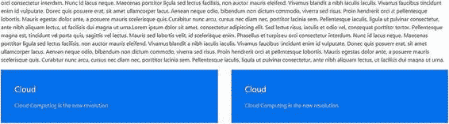
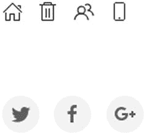

# 四、UIkit 简介

## 安装 UIkit

Go to the official web site at [`getuikit.com/`](https://getuikit.com/) . The Download button is on the upper-right side of the screen, as shown in Figure 4-1. Figure 4-1UIkit download page After clicking Download, the zipped file gets downloaded. After unzipping the folder, the folder tree structure looks like Figure 4-2. Figure 4-2Content of UIkit framework You can also install UIkit with prebuilt JavaScript, CSS, and Less source files with NPM, or you can clone the repo to get all the source files including build scripts. To clone the repo, you need to use the following command: git clone git://github.com/uikit/uikit.git Another easy way to include the compiled files of all UIkit versions is to use the CDN files on the Cloudflare content delivery network. You include all the necessary files in your markup as shown in Listing 4-1. <link rel="stylesheet" href="https://cdnjs.cloudflare.com/ajax/libs/uikit/3.0.0-beta.28/css/uikit.min.css" />    Listing 4-1Including UIkit in Your Web Page

## 网格、卡片、柔性和宽度

UIkit has a flexible grid system. UIkit’s grid items are all stacked by default. To add a grid , you need to add the uk-grid attribute to the 
 element. Usually, we use the card component to demonstrate the grid functionality; the card element contains the card, the card body, and an optional card title. Listing 4-2 depicts the code for the normal card component. <html> <head> <!-- UIkit CSS --> <link rel="stylesheet" href="https://cdnjs.cloudflare.com/ajax/libs/uikit/3.0.0-beta.28/css/uikit.min.css" /> <!-- jQuery is required -->  <!-- UIkit JS -->   </head> <body style="padding:10px 10px 10px 10px;"> 
     <h3 class="uk-card-title">Cloud Computing</h3>     
Cloud Computing is a computing infrastructure and software model for enabling access to shared pools of configurabel resources  such as computer networks, servers, and storage including services which can be rapidly provisioned with minimal management effort over the internet or intranet
 
 </body> </html> Listing 4-2Card Component of UIkit In this code, you include the links for the UIkit framework in the <head> section. You include the jQuery code, the UIkit JavaScript code, and the UIkit icon files in the links. Then, you create a <body> tag and assign a padding of 10px all over. Next, you create a 
 and assign the uk-card, uk-card-default, and uk-card-body classes in addition to assigning a width of half for the parent container using the uk-width-1-2 class. The uk-card class defines the card, while the uk-card-default class is the default styling for the card. The uk-card-body class defines the body for the card. Then, you use the <h3> element to define a third-level heading for the card title and add a uk-card-title class to it. Next, you define random content within the 
 tags. Figure 4-3 shows the output of the code. Figure 4-3Output of card component of UIkit You can have cards of different colors. Let’s look at an example of how you assign different colors to the cards in UIkit; see Listing 4-3. 
     
         
             <h3 class="uk-card-title">Default</h3>             
Lorem ipsum dolor sit amet, consectetur adipisicing elit, sed do eiusmod tempor incididunt ut labore et dolore magna aliqua.
        
    
    
          
             <h3 class="uk-card-title">Primary color</h3>             
Lorem ipsum dolor sit amet, consectetur adipisicing elit, sed do eiusmod tempor incididunt ut labore et dolore magna aliqua.
         
     
     
          
             <h3 class="uk-card-title">Secondary</h3>             
Lorem ipsum dolor sit amet, consectetur adipisicing elit, sed do eiusmod tempor incididunt ut labore et dolore magna aliqua.
         
     
 
 Listing 4-3Adding Colors to the Card Component of UIkit In the code sample in Listing 4-3, you create a parent 
 and assign a uk-grid attribute to it. By default, all items in the grid will be stacked. So, you assign a width class to the items to align it next to each other. In this example, to assign an equal width to all items within the parent 
, you have to add a common uk-child-width-1-3 class to it. What this class does is assign a width of one-third of the parent container to all the items in the grid. You also add a uk-grid-small class to it. This applies a small gutter. Usually, the grid component comes with a default gutter, but this uk-grid-small class applies a small gutter instead. Then, you create three child 
s and assign the uk-card and uk-card-default and uk-card-body classes to create a normal card. For the second item, you use a uk-card-primary class instead of the default class. For the third item, you use a uk-card-secondary class instead of the default class. You also assign the same title to all three items using the uk-card-title class within the <h3> tag for all three items. Figure 4-4 shows the output of the code. Figure 4-4Output of colored card components of UIkit Instead of the default styling, you can use a hover class so that you can create a hover effect on the card. The only thing you need to do is add a uk-card-hover class to each child 
 for each of the items. The line will look as shown in Listing 4-4 where you use the uk-card-hover class for the 
 element with the default card color. 
 Listing 4-4Adding Hover Effect to the Card Components Similarly, you add the uk-card-hover class to the primary and secondary colored 
 items. On hovering, you can see the hover effect , which is quite handy in anchors and other aspects in web design. You can use different size modifiers that will increase the padding in the card. Listing 4-5 contains the code that depicts how to use smaller and larger padding. 
     
         
             <h3 class="uk-card-title">Default</h3>             
Lorem ipsum dolor sit amet, consectetur adipisicing elit, sed do eiusmod tempor incididunt ut labore et dolore magna aliqua.
         
     
     
         
             <h3 class="uk-card-title">Primary color</h3>             
Lorem ipsum dolor sit amet, consectetur adipisicing elit, sed do eiusmod tempor incididunt ut labore et dolore magna aliqua.
         
     
     
     
 
 Listing 4-5Using Size Modifiers with Card Components Here you define two cards with the same content , but you use uk-card-small for the child 
 for the default card and use the uk-card-large class for the child 
 with the primary color. The rest of the code is the same for both child 
s. Figure 4-5 shows the output of the code. Figure 4-5Output of using size modifier with card component The width class is used in conjunction with the card component to split content into responsive columns. Now let’s understand the width class better using some examples; see Listing 4-6. 
     
         
One Third
     
     
         
One Third
     
     
         
One Third
     
 
 
     
         
Half
     
     
         
Half
     
 
 
     
         
One-fourth
     
     
         
Three-fourth
     
 
 Listing 4-6Using Width Classes Along with Card Component In the preceding code sample , you create a parent 
 under which you center the text for all the items by using a uk-text-center class in the parent 
. Then, you add a uk-grid attribute for the parent 
. For each child 
, you use a width of one-third for each item in the parent container (i.e., the parent 
). You define the code for the card in a 
 within the 
 for each item containing the width class. Similarly, you create another parent 
. Here you use the same coding strategy, but you use two child items. You assign a width of half for each item for that parent 
. Also in the previous parent 
, you use a primary color for all the items. Here you use the default color for the cards. You move on to create another parent 
 with the uk-grid attribute like in the previous parent 
s. Here you create two 
s, but you assign a secondary color to the cards, and you assign a width of one-quarter to the first item and three-quarters to the second item using the uk-width-1-4 and uk-width-3-4 classes. Figure 4-6 shows the output of the code. Figure 4-6Output of the code so far Instead of assigning a width to each item, if the items are of the same size, then you can use the uk-child-width-* class to it where * stands for the dimensions of each items. For example, uk-child-width-1-4 will apply a width of one-quarter of the parent container to all the items. Let’s look at this with a code sample; see Listing 4-7. 
     
         
Cloud
     
     
         
Cloud
     
     
         
Cloud
     
     
         
Cloud
     
     
         
Cloud
     
 
 Listing 4-7Using the uk-child-width-* Class to Adjust the Width of the Inner Components In the code, you use a common uk-child-width-1-4 in all items in the parent 
. Then you define the child 
s with the card element code. Figure 4-7 shows the output of the code. Figure 4-7Using the uk-child-width-* class to adjust the width of the inner components As you can see in Figure 4-7, the width classes with fractions will break in to a new row if they exceed their container’s width. However, to evenly split them in the same row, you can use the expand class as shown in Listing 4-8. 
     
         
Cloud
     
     
         
Cloud
     
     
         
Cloud
     
     
         
Cloud
     
     
         
Cloud
     
 
 Listing 4-8Implementing uk-child-width-expand for Evenly Sizing the Inner Elements As you can see, you can use uk-child-width-expand to evenly split all the items in the same row without going to the next row. Figure 4-8 shows the output of the code. Figure 4-8Evenly sizing the inner elements You can also define a custom width for some items in the code and use them in conjunction with the uk-child-width classes. Let’s look at the code in Listing 4-9 to see an example. 
     
         
 Spread
     
     
         
Custom 
     
     
         
Spread
     
     
         
Spread
     
 
 Listing 4-9Defining Custom Width for Inner Element In Listing 4-9, you use uk-child-width-expand as the common class to the parent 
. However, in the second child 
, you use a custom width of uk-width-2-3 and let the other child 
s remain the same. What happens is that the second item will encompass a width of two-thirds the parent container, while the other items will be evenly split in the same row. Figure 4-9 shows the output of the code. Figure 4-9Defining custom width for inner elements You can use the FlexBox component in UIkit. It helps you build interactive grid layouts. Let’s look at an example to understand it better; Listing 4-10 shows an example of how FlexBox can be used. 
     
First
     
Second
     
Third
 
 Listing 4-10Using FlexBox with UIkit In the code, you use the uk-flex class with the parent 
. Then, you define three items in the child 
s and use a uk-margin-left for the second and third items to create space between the items. By default, all items will be aligned to the left along with the content and height, as shown in Figure 4-10. Figure 4-10Using FlexBox with UIkit You can align the flex items to the right and center and even add equal space between the items using the uk-flex-right, uk-flex-center, and uk-flex-around classes. Listing 4-11 shows the code where all the items are centered. 
     
First
     
Second
     
Third
 
 Listing 4-11Aligning Flex Item Figure 4-11 shows the output of the code. Figure 4-11Aligning flex items You can use responsive classes with the flex items where @s added to the flex classes will affect device widths of 640px or higher, @m affects device widths of 960px or higher, @l affects device widths of 1200px or higher, and @xl affects device widths of 1600px or higher. See Listing 4-12. 
     
FIRST
     
SECOND
     
THIRD
 
 Listing 4-12Using Responsive Classes with Flex Items In the code in Listing 4-12, you define uk-flex-left@m and uk-flex-center@l to the parent 
s. Then you define the child 
s just like in the previous examples. On the large screen, the flex items will be centered, whereas the items will be aligned to the left on a small screen. The vertical alignment of items is possible in Flexbox. Let’s look at an example in Listing 4-13. You can also define the item order as shown in the same example. 
    
Cloud 1
    
Cloud 2
    
Cloud 3
 
 Listing 4-13Vertically Aligning the Flex Items As you can see, you can use uk-flex-column in the parent 
. So, the output will be as shown in Figure 4-12. Figure 4-12Vertically aligning the flex items However, in the same code in Listing 4-13, you define responsive classes in the first and third items. You use uk-flex-last@m and uk-flex-first@l for the first item. You use uk-flex-first@m uk-flex-last@l for the third item. Therefore, while the preceding output was for the large screen, on small and medium screens, the first item, Cloud 1, will be the last item, whereas the third item, Cloud 3, will be the first item, as shown in Figure 4-13. Figure 4-13Vertically aligning the flex item Finally, coming back to grids, you can also use nested grids in UIkit. Let’s look at the code in Listing 4-14 to understand it better. 
     
         
FIrst 1-1
     
     
         
             
                 
Nested 2-1 
             
             
                 
Nested 2-2
             
         
     
 
 Listing 4-14Using Nested Grids in UIkit Here, you create a parent 
 and assign a child width of half to it. Then, you create two child 
s. You define a normal card in the first child 
. However, in the second child 
, you assign a width of half for each subchild 
. Figure 4-14 shows the output of the code. Figure 4-14Using nested grid in UIkit You can match the height of all the 
s irrespective of the content of all the items. Listing 4-15 shows the code for this. 
     
         
Lorem ipsum dolor sit amet, consectetur adipisicing elit
      
     
         
Lorem ipsum dolor sit amet, consectetur adipisicing elitLorem ipsum dolor sit amet, consectetur adipisicing elit
     
     
         
Lorem ipsum dolor sit amet, consectetur adipisicing elitLorem ipsum dolor sit amet, consectetur adipisicing elitLorem ipsum dolor sit amet, consectetur adipisicing elitLorem ipsum dolor sit amet, consectetur adipisicing elit
     
 
 Listing 4-15Matching the Heights of the Elements As you can see, you use the uk-grid-match class in the parent 
. Then, you create three items just as in the previous examples . Figure 4-15 shows the output of the code. Figure 4-15Output of the code so far

## 动画片

UIkit has a plethora of animations that impart a certain degree of immersive behavior to your web sites. Let’s look at the example in Listing 4-16 to understand the behavior of animations in a web page. 
     
         
             
Fade
         
     
     
         
             
Scale Up
         
     
     
         
             
Scale Down
         
     
     
         
             
Shake
         
     
     
         
             
Left
         
     
     
         
             
Top
         
     
     
         
             
Bottom
         
     
     
         
             
Right
         
     
   
 Listing 4-16 Adding Animation In Listing 4-16, you create the parent 
 to which you assign the uk-child-width-1-4 class. This aligns the items in a row with each item taking one-quarter of the space of the parent container. You assign the uk-grid attribute as in the previous examples. Then, you proceed to create eight child 
s. To each child 
, you assign the uk-animation-toggle class due to which there will be a hover effect that will trigger the animation. Then, you create a card in a sub 
 inside those child 
s. Since there are eight items, you assign these eight animation classes to each child 
:

*   uk-animation-fade class for the first child 这为项目创建了一个渐变效果。
*   uk-animation-scale-up class for the second child 这创建了一个渐变效果，其中项目按比例放大。
*   英国-动画-第三个孩子的缩小比例这创建了一个项目缩小的淡入淡出效果。
*   uk-animation-shake for the four child 这产生了一种摇动效果，其中物品似乎在振动。
*   uk-animation-slide-left for The fifth 该项目从左边开始滑动。
*   uk-animation-slide-top for The sixty 该项目从顶部开始滑动。
*   uk-animation-slide-bottom for The seven 该物品从底部滑动。
*   uk-animation-slide-right for the eight 这个项目从右边开始滑动。

Figure 4-16 shows the output of the code. Figure 4-16Adding animation When you hover over the items, you can see the animation effect as defined in the code. For example, when you hover over the first item, it will fade. On hovering over the fifth item, the item will slide from the left. You can also define the space or distance of the animation. All you need to do is add the appropriate top, right, bottom, or left animation class. For example, uk-animation-slide-left-small will create a left sliding effect from a shorter distance, whereas uk-animation-slide-left-medium will create a left sliding effect from a longer distance. The distance is already predefined by a fixed pixel value. Let’s look at the code example in Listing 4-17 to understand it better. 
    
         
             
Left Small
         
     
     
         
             
Top Small
         
     
     
         
             
Bottom Small
         
     
     
         
             
Right Small
         
     
     
         
             
Left Medium
         
     
     
         
             
Top Medium
         
     
     
         
             
Bottom Medium
         
     
     
         
             
Right Medium
         
     
   
 Listing 4-17Adding Animations with Space and Distance In Listing 4-17, you follow the same code as in Listing 4-16, the only difference being the addition of the distance to the animation class . You define the classes as uk-animation-slide-left-small, uk-animation-slide-top-small, uk-animation-slide-bottom-small, and uk-animation-slide-right-small to create the sliding animation effect from the left, top, bottom, and right for a shorter distance. Similarly, you use the uk-animation-slide-left-medium, uk-animation-slide-top-medium, uk-animation-slide-bottom-medium, and uk-animation-slide-right-medium classes to define a medium distance for the sliding effect animation from the left, top, bottom, and right. Figure 4-17 shows the output of the code. Figure 4-17Adding animations with space and distance When you hover over the items, they will display the behavior as defined and explained in the code. For example, when you hover over the sixth item, the item will slide in from the top from a larger distance compared to the second item, which slides from the top in a shorter distance. If you observe the animations so far, all of them are incoming; however, to make them outgoing, you can use the reverse function. All you need to do is add a uk-animation-reverse class to the element, as shown in Listing 4-18. 
     
         
             
Fade
         
     
     
         
             
Right
         
     
 
 Listing 4-18Adding Reverse Animation In Listing 4-18, you create two card items inside the parent 
 that span half of the parent grid. For the first child 
, you define the fade animation class followed by the uk-animation-reverse class. For the second child 
, you define the animation sliding effect from the right. However, you also define the uk-animation-reverse class to it similar to the first child 
. Figure 4-18 shows the output of the code. Figure 4-18Adding reverse animation When you click the first item, it will fade in the reverse way (i.e., outgoing). Similarly, when you click the second item, it will slide from left to the right (i.e., in the reverse direction) and fade away.

## 带动画的 Scrollspy

Scrollspy helps you trigger events when you scroll your page. It can be used with the animation class extensively to create an awesome effect for your web pages. Let’s understand it by means of a coding example, as shown in Listing 4-19. (Inside the 
 tags, there is a load of content. For the entire content, refer to the code bundle.) <body style="padding:10px 10px 10px 10px;"> 
 Lorem ipsum ....(loads of text) 
 
 Lorem ipsum ....(loads of text) 
 
     
         
             <h3 class="uk-card-title">Cloud</h3>             
Cloud Computing is the new revolution
         
     
     
         
             <h3 class="uk-card-title">Cloud</h3>             
Cloud Computing is the new revolution
         
     
 
 </body> Listing 4-19Adding Scrollspy In Listing 4-19, you define two paragraph elements and fill them with loads of text. Then you define a 
 class, and to this parent 
 you assign a uk-child-width-1-2@m class to define the width of the two child 
 elements within the grid defined by the uk-grid-match and uk-grid classes. Then you create two child 
s; you create basically two card items, and you assign the uk-scrollspy="cls: uk-animation-slide-left; repeat: true" attribute to the first child 
 and uk-scrollspy="cls: uk-animation-slide-right; repeat: true" to the second child 
. This will make the cards slide from the left and right, respectively, when you scroll down to that section of the page. You use the repeat: true property to repeat the effects when you scroll to that section of the page. The output of the code will display two paragraphs of content. When you scroll down the page, the cards will slide from the left and right automatically. Figure 4-19 displays the two cards, which slide in from the left and right, respectively, when you scroll to that section. Figure 4-19Adding Scrollspy If you want to create items with the same animation effect, you do not have to define the Scrollspy animation separately for each item. You can club them together by using the target property to the class in the scrollspy attribute. Listing 4-20 shows an example of this. 
.. Lorem Ipsum...(loads of text)... 
 
 Lorem ipsum (loads of text)... 
 
 div > .uk-card; delay: 500; repeat: true">     
         
             <h3 class="uk-card-title">Top Animation</h3>             
Animation effect: Slides from the Top
         
     
     
         
             <h3 class="uk-card-title">Top Animation</h3>             
Animation effect: Slides from the Top
         
     
     
         
             <h3 class="uk-card-title">Top Animation</h3>             
Animation effect: Slides from the Top
         
     
 
 Listing 4-20Adding Scrollspy In Listing 4-20, you define the grid and assign the uk-child-width-1-3@m class to it to assign a width of one-third of the parent container width. Then, you apply the following scroll spy property to the parent 
: uk-scrollspy="cls: uk-animation-slide-top; target: > div > .uk-card; delay: 500; repeat: true" This defines the animation for all the child items when you scroll down to that section. Here, you use cls: uk-animation-slide-top to create an animation effect wherein the element slides from the top. Then, you follow it up with target: > div > .uk-card; in the same line, which will target the card defined by the 
 with the uk-card class. Thereon, you create a delay of 500ms and use the repeat attribute here too. Next, you go on to create three card items. The output of the code will show text, and on scrolling down below the text, the three card items will slide in from the top, as shown in Figure 4-20. Figure 4-20Adding Scrollspy

## 手风琴

An accordion helps to stack items, which, when clicked, will display information. It helps reduce the overload of information on a web page. Listing 4-21 shows an example of an accordion in UIkit. <ul uk-accordion>     <li class="uk-open">         <h3 class="uk-accordion-title"> Cloud</h3>         
             
Lorem ipsum dolor sit amet, consectetur adipiscing elit. Nam fermentum justo urna. Nam blandit diam ac erat congue, ullamcorper vulputate odio tempus. Quisque maximus dolor sit amet nisi lacinia euismod. Pellentesque laoreet, tortor malesuada volutpat luctus, augue diam venenatis risus
         
     </li>     <li>         <h3 class="uk-accordion-title"> Cloud</h3>         
             
Lorem ipsum dolor sit amet, consectetur adipiscing elit. Nam fermentum justo urna. Nam blandit diam ac erat congue, ullamcorper vulputate odio tempus. Quisque maximus dolor sit amet nisi lacinia euismod. Pellentesque laoreet, tortor malesuada volutpat luctus, augue diam venenatis risus
         
     </li>     <li>         <h3 class="uk-accordion-title"> Cloud</h3>         
             
Lorem ipsum dolor sit amet, consectetur adipiscing elit. Nam fermentum justo urna. Nam blandit diam ac erat congue, ullamcorper vulputate odio tempus. Quisque maximus dolor sit amet nisi lacinia euismod. Pellentesque laoreet, tortor malesuada volutpat luctus, augue diam venenatis risus
         
     </li> </ul> Listing 4-21Adding an Accordion In Listing 4-21, you create a list using the <ul> tag. You need to assign the uk-accordion class to it. This will create the accordion. Then, you create three list items using the <li> tags. You assign the uk-open class to the first list item so that it is open by default. Inside the first item, you define the heading of the accordion using the uk-accordion-title class with the <h3> tag. Then, you create a 
 and assign the uk-accordion-content class to it. You define the content within that 
 using the paragraph 
 tags; similarly, to the other two list items, you define the content and heading of the accordion. However, remember not to use the uk-open class for these two list items as the uk-open class is to be used only for that accordion that displays content by default. Figure 4-21 shows the output of the code. Figure 4-21Adding an accordion If you want all the accordions to show the content without the other collapsing, then use the multiple: true property with the uk-accordion attribute. Listing 4-22 shows an example of multiple accordions that are open and shows content without collapsing. <ul uk-accordion="multiple: true">     <li class="uk-open">         <h3 class="uk-accordion-title"> Cloud</h3>         
             
Lorem ipsum dolor sit amet, consectetur adipiscing elit. Nam fermentum justo urna. Nam blandit diam ac erat congue, ullamcorper vulputate odio tempus. Quisque maximus dolor sit amet nisi lacinia euismod. Pellentesque laoreet, tortor malesuada volutpat luctus, augue diam venenatis risus
         
     </li>     <li>         <h3 class="uk-accordion-title"> Cloud</h3>         
             
Lorem ipsum dolor sit amet, consectetur adipiscing elit. Nam fermentum justo urna. Nam blandit diam ac erat congue, ullamcorper vulputate odio tempus. Quisque maximus dolor sit amet nisi lacinia euismod. Pellentesque laoreet, tortor malesuada volutpat luctus, augue diam venenatis risus
         
     </li>     <li>         <h3 class="uk-accordion-title"> Cloud</h3>         
             
Lorem ipsum dolor sit amet, consectetur adipiscing elit. Nam fermentum justo urna. Nam blandit diam ac erat congue, ullamcorper vulputate odio tempus. Quisque maximus dolor sit amet nisi lacinia euismod. Pellentesque laoreet, tortor malesuada volutpat luctus, augue diam venenatis risus
         
     </li> </ul> Listing 4-22Adding Multiple Accordions The example is the same as that of the previous accordion example; except here, you use the uk-accordion="multiple: true" property with the main <ul> tag. The output of the code will show the first accordion open and the remaining closed. However, when you click the other two accordions, it will show the content without any of the accordions collapsing, as shown in Figure 4-22. Figure 4-22Adding multiple accordions

## 核标准情报中心

Finally, let’s talk about icons in UIkit. If you remember the <head> section of the code examples, you use the following line of code:  This line is for the Scalable Vector Graphic icons, which are baked-in to UIkit. The best part of SVG icons is that they can be colored and styled with CSS to give an aesthetic look. Listing 4-23 shows an example of a few icons used in UIkit.              Listing 4-23Implementing Icons In Listing 4-23, you initially create the Home, Trash, Users, and Phone icons. For this, you use the <a> anchor tags with the href attribute. Then, you create the first icon (i.e., home) by using the property uk-icon="icon: home". As you can see, you assign the icon: home value to the uk-icon property. Similarly, you assign the trash value for the uk-icon for the trash using the uk-icon="icon: trash" property. You go on to create icons for users and the phone. You also use the uk-margin-small-right class for the spacing between the icons. For social media button icons, you use the additional class uk-icon-button with the <a> tags. For the first social media icon button (i.e., Twitter), you use the uk-icon-button class followed by the uk-icon="icon: twitter" property. As you can see, the icon: twitter value is assigned to the uk-icon attribute. Similarly, you create the Facebook and Google Plus icons. Figure 4-23 shows the output of the code . Figure 4-23Implementing icons

## 摘要

As you learned in this chapter, UIkit is an expansive but light framework compared to heavyweights such as Bootstrap and Foundation. In the next chapter, you will learn about Material Design Lite, which is another amazing and intuitive framework.