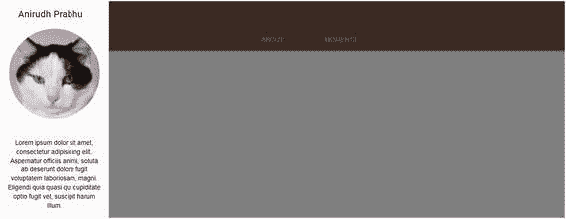

# 五、材质设计简要说明

## 安装 MDL

MDL can be downloaded in several ways. One of the easiest ways is to go to [`getmdl.io/started/index.html#download`](https://getmdl.io/started/index.html%23download) . You will see a Download MDL button, as shown in Figure 5-1. Figure 5-1Download link for MDL Click the button to download a zipped file containing the various CSS and JavaScript files. Figure 5-2 shows the tree structure of the unzipped components. Figure 5-2Structure of files in MDL The preferred way of including MDL in your document is to use the CDN links for the icons, CSS, and JavaScript files, as shown here: <link rel="stylesheet" href="https://fonts.googleapis.com/icon?family=Material+Icons"> <link rel="stylesheet" href="https://code.getmdl.io/1.3.0/material.indigo-pink.min.css">  Just include the three lines of the preceding code in your HTML page and you are good to go. We already defined the advantages of using CDN links in the previous chapters, and the creators of MDL also recommend using the CDN links. Alternatively, you can download and build MDL from the GitHub portal or by using Node or Bower . In this chapter, we will stick to showing the preferred way (in other words, using CDN-hosted files in your markup file) to demonstrate various examples.

## MDL 布局

In this section, you will look at some of the layout components of MDL so you can understand the MDL grid and other important attributes such as the footer and the tabs. Initially, you will look at the header and drawer concepts in MDL by way of some simple examples. Listing 5-1 shows a fixed header and a normal drawer in MDL. <html> <head> <link rel="stylesheet" href="https://fonts.googleapis.com/icon?family=Material+Icons"> <link rel="stylesheet" href="https://code.getmdl.io/1.3.0/material.indigo-pink.min.css">  </head> <body>  
          <header class = "mdl-layout__header">             
                <!-- Title -->                SUPERMAIL007                <!-- Add spacer, to align navigation to the right -->                

                <!-- Navigation -->                <nav class = "mdl-navigation">                   <a class = "mdl-navigation__link" href = ""                      style = "color:white">INBOX</a>                   <a class = "mdl-navigation__link" href = ""                      style = "color:white">SPAM</a>                   <a class = "mdl-navigation__link" href = ""                      style = "color:white">TRASH</a>                </nav>             
          </header>          
             SUPERMAIL007             <nav class = "mdl-navigation">                <a class = "mdl-navigation__link" href = "">INBOX</a>                <a class = "mdl-navigation__link" href = "">SPAM</a>                           <a class = "mdl-navigation__link" href = "">TRASH</a>             </nav>          
          <main class = "mdl-layout__content">             
Come Undone
          </main>       
    </body> </html> Listing 5-1Fixed Header with Normal Drawer in MDL In Listing 5-1, you can see the code for the fixed header and a normal drawer. Let’s look at each line of code to understand how it works. In the head section, you include all the CDN files for the MDL framework. Then, you create a body tag in which you will define the functional markup for the fixed header example. Then, you code a 
 and assign the mdl-layout, mdl-js-layout, and mdl-layout--fixed-header classes to it. The mdl-layout class identifies the container as an MDL component and is part of the outer container element. The mdl-js-layout class adds MDL behavior to the layout and is part of the outer container element. The mdl-layout--fixed-header class makes the header always visible, even on small screens. Then, you define the HTML <header> tag wherein you assign the mdl-layout__header class to it. The assigned class identifies the container as an MDL component. Within the <header> tag, you code a 
 and assign the mdl-layout__header-row class to it. The mdl-layout__header-row class identifies the container as an MDL header row and is mandatory on a header content container. Inside the 
, you create a  tag and assign the mdl-layout-title class to it that identifies the layout title text and that is needed on the layout title container. You use SUPERMAIL007 as the title content for the header. You then code another 
 to which you assign the mdl-layout-spacer class, which results in filling the remaining space and is usually used to align the elements to the right. Then, you create the navigation element with the <nav> tag and assign the mdl-navigation class to it, which identifies the container as an MDL navigation group. You create three anchor links using the <a> tag and assign the mdl-navigation__link class that identifies the anchor as an MDL navigation link. You then use the words INBOX, SPAM, and TRASH as the content for the anchor tags. You complete this header section with a closing <header> tag. Continuing, you create a 
 element and assign the mdl-layout__drawer class to it, which identifies the container as an MDL drawer. Then, you create a  element within that 
 and assign the mdl-layout-title class to it, which identifies the title text to the container. You use the content SUPERMAIL007, which is the same as the content for the header title in the <header> section. Then, you create the navigation element with the <nav> tag and assign the mdl-navigation class to it, which identifies the container as an MDL navigation group. You create three anchor links using the <a> tag and assign the mdl-navigation__link class to it, which identifies the anchor as an MDL navigation link. You then use the words INBOX, SPAM, and TRASH as the content for the anchor tags. Next, you create a <main> tag to define the layout’s primary content and assign the mdl-layout__content class to it. The mdl-layout__content class is mandatory for defining the container as the MDL layout content. You then use the closing tags. Figure 5-3 shows the code output. Figure 5-3Output of the fixed header and a normal drawer As you can see, you have created a fixed header that is visible on smaller screens too. In addition, when you click the navicon (i.e., the menu icon), the drawer slides out, as shown in Figure 5-4. Figure 5-4Drawer slides showing the content For a fixed drawer, all you need to do is to introduce the mdl-layout--fixed-drawer class to the first 
 within which the whole functional markup is defined. The 
 line of code looks like this: 
 Figure 5-5 shows the output of the code. Figure 5-5Fixed drawer Suppose you want a scrollable header that scrolls with the content. In such a scenario, you can remove the mdl-layout--fixed-header class from the first parent 
. In the <header> tag, you need to introduce the mdl-layout__header—scroll class. The rest of the code is the same, except that you need to put comprehensive content within the layout content <main> tag. The output will be similar, but when you scroll, the header will not be fixed but will scroll with the content. Kindly refer to the code bundle for the entire code and output. In Listing 5-2, you will look at the code for a fixed header with scrollable tabs . 
          <header class = "mdl-layout__header">             <!-- Top row, always visible -->             
                <!-- Title -->                SUPERMAIL007             
             <!-- Tabs -->             
                <a href = "#scroll-tab-1" class = "mdl-layout__tab is-active">INBOX</a>                <a href = "#scroll-tab-2" class = "mdl-layout__tab">SPAM</a>                <a href = "#scroll-tab-3" class = "mdl-layout__tab">TRASH</a>             
          </header>          
             SUPERMAIL007             <nav class = "mdl-navigation">                <a class = "mdl-navigation__link" href = "">INBOX</a>                <a class = "mdl-navigation__link" href = "">SPAM</a>                <a class = "mdl-navigation__link" href = "">TRASH</a>             </nav>          
          <main class = "mdl-layout__content">             <section class = "mdl-layout__tab-panel is-active" id = "scroll-tab-1">                
 Lorem ipsum dolor sit amet... (content) 
             </section>             <section class = "mdl-layout__tab-panel" id = "scroll-tab-2">                
 Lorem ipsum dolor sit amet, ...(content)
             </section>             <section class = "mdl-layout__tab-panel" id = "scroll-tab-3">                
 Lorem ipsum dolor sit amet....(content) 
             </section>          </main>       
 Listing 5-2Fixed Header with Scrollable Tabs In Listing 5-2, you define the parent 
 and assign the mdl-layout, mdl-js-layout, and mdl-layout--fixed-header classes to it. You then create a <header> tag to which you assign the mdl-layout__header class. Then, you create another 
 within the <header> tags to which you assign the mdl-layout__header-row class. You proceed to code a  tag to which you assign the mdl-layout-title class. You define the title content as SUPERMAIL007 . Next, you create the tabs. You create a 
 element to which you assign the mdl-layout__tab-bar and mdl-js-ripple-effect classes. The mdl-layout__tab-bar class identifies the container as an MDL tab bar, whereas the mdl-js-ripple-effect class is used for the immersive ripple effect. You then create three anchor links to which you assign the #scroll-tab-1, #scroll-tab-2, and #scroll-tab-3 href attributes, respectively. You also assign the mdl-layout__tab classes to each anchor link. In the first anchor link, you assign the is-active class because it should be active by default. Use the <header> closing tag to wrap up this section of the code. You then proceed to create a drawer similar to the example in Listing 5-1. Next, you define the layout content within the <main> tags and assign the mdl-layout__content class to the <main> tag. You then create the first <section> tag and assign the mdl-layout__tab-panel class to it. Only for this <section> tag, you introduce the is-active class. Then you assign an ID whose value is the href attribute to the first anchor tag created in the <header> tag (i.e., scroll-tab-1). Next, you create a 
 and assign the page content class to it and define the content. Similarly, you create two more sections similarly, the only difference being the ID assigned to them. You assign scroll-tab-2 and scroll-tab-3 as the value of the ID for the second and third sections, respectively. Moving forward, you complete the code with the necessary closing tags. Figure 5-6 shows the output of the code. Figure 5-6Output of scrollable tabs (We have used random content of Lorem Ipsum… in the code to illustrate this example, for the entire code with the massive content, refer to the code bundle for this chapter.) Next, you will learn about the grid system in MDL. The grid system in MDL is quite easy and helps lay out the content for multiple devices based on different screen sizes. By default, a grid in MDL has 12 columns for the desktop screen, 8 for tablets, and 4 for phone sizes, and cells are laid out sequentially in a row. As written on the MDL web site, there are two exceptions in MDL grid system.

*   如果一个单元格不适合某个屏幕大小的行，它将进入下一行。
*   如果某个单元格的指定列大小等于或大于当前屏幕大小的列数，则它会占据整行。

Listing 5-3 shows the code sample for a grid layout. 
   
Cloud
   
Cloud
   
Cloud
   
Cloud
   
Cloud
   
Cloud
   
Cloud
   
Cloud
   
Cloud
   
Cloud
   
Cloud
   
Cloud
 
 
   
Cloud
   
Cloud
   
Cloud
 
 
   
6 (8 tablet)
   
4 (6 tablet)
   
2 (4 phone)
 
 Listing 5-3 Grid Layout Listing 5-3 uses the following classes:

*   mdl-grid:将标识为 mdl 网格组件
*   mdl-cell:将标识为 mdl 单元
*   mdl-cell - 1-col:将单元格的列大小设置为桌面屏幕上 12 个单元格中的 1 个单元格
*   mdl-cell - 4-col:将单元格的列大小设置为桌面屏幕上 12 个单元格中的 4 个
*   mdl-cell - 8-col-tablet:在 tablet 屏幕上将单元格的列大小设置为 8 个单元格
*   mdl-cell - 6-col-tablet:在 tablet 屏幕上将单元格的列大小设置为 6 个单元格
*   mdl-cell - 4-col-phone:在电话屏幕上将单元格的列大小设置为 4 个单元格

If you see the code, you have used the mdl-grid class for the first parent 
. You move on to create 12 child 
s for 12 cells, and you use inline CSS styles for the borders of each cell. You assign mdl-cell and mdl-cell--1-col to each cell in the code, defining a total of 12 cells. Next, you create another parent 
, and similar to the first 
, you assign the mdl-grid class to it. Then, you create three child 
 cells and assign mdl-cell and mdl-cell--4-col classes for it. In the next parent 
, you create a grid with three cells and define screen sizes for each child 
 cell by customizing the size of each cell on the default desktop, tablet, and phone. Figure 5-7 shows the output of the code. Figure 5-7Grid system sample in MDL Now that you have gained insight into some of the components of MDL, let’s look at an example: how to build a web page with MDL.

## 使用 MDL 构建直观的网页

In this section, you will take a look at the process of building a web page for Anirudh Prabhu, co-author of this book. It is a simple example. We will divide it into several steps and then apply the finishing touches to create an aesthetic page.

### 步骤 1:创建部分

Listing 5-4 shows step 1, wherein you create the <head> section of the web page and include all the JavaScript and CSS files. <!DOCTYPE html> <html> <head>        <meta charset="UTF-8">        <title>Website Using Material Design Lite</title>        <meta name="viewport" content="width=device-width, initial-scale=1">        <link rel='stylesheet prefetch' href='https://fonts.googleapis.com/css?family=Roboto:400,100,500,300italic,500italic,700italic,900,300'>        <link rel="stylesheet" href="https://code.getmdl.io/1.3.0/material.brown-orange.min.css" />        <link rel='stylesheet prefetch' href='https://fonts.googleapis.com/icon?family=Material+Icons'>        <link rel="stylesheet" href="style.css"> </head> <body>   </body> </html> Listing 5-4<head> Section with All the JavaScript and CSS Files In Listing 5-4, you include the viewport attribute and the MDL files. You also add a custom style sheet, i.e., style. css .

### 步骤 2:创建带抽屉的固定页眉

In this section, you will add a code snippet between the <body> tags wherein you will define a fixed header and the header tile along with the drawer. See Listing 5-5. 
   <header class="mdl-layout__header">     
       <!-- Title -->       Anirudh Prabhu     
     <!-- Tabs -->     
       <a href="#fixed-tab-1" class="mdl-layout__tab is-active">About</a>       <a href="#fixed-tab-2" class="mdl-layout__tab">Moments</a>     
   </header>   
     Anirudh Prabhu     
            
     <!-- /.avatar -->     
       Lorem ipsum dolor sit amet, consectetur adipisicing elit. Aspernatur officiis animi, soluta ab deserunt dolore fugit voluptatem laboriosam, magni. Eligendi quia quasi qui cupiditate optio fugit vel, suscipit harum illum.     
     <!-- /.drawer-text -->   
   <!-- /.mdl-layout__drawer --> Listing 5-5Defining a Fixed Header and the Header Tile Along with the Drawer In Listing 5-5, initially, you define the 
 element to which you assign the mdl-layout, mdl-js-layout, mdl-layout--fixed-header, and mdl-layout--fixed-tabs classes. Then, you define the <header> tag to which you assign the mdl-layout__header class. Within the <header> tags, you create another 
 to which you assign the mdl-layout__header-row class, followed by creating a  element where you define the layout title using the mdl-layout-title class. Close the 
 tag and code another 
 for the fixed tabs to which you assign the mdl-layout__tab-bar and mdl-js-ripple-effect classes. Once you define the name of the tabs and close the concluding </header> tag, you define the code for the drawer. You code a 
 and assign the mdl-layout__drawer class to it. You create the layout title for the drawer and then code another 
 to which you assign a custom avatar class. Then you introduce an image with the help of the  tags. Next you code another 
, and you define the content for the drawer text. Next, you define the custom CSS styles in the style.css file, as shown Listing 5-6. .mdl-layout__drawer-button, .mdl-layout__drawer-button i {   color: white; } @media (max-width: 900px) {   .mdl-layout__drawer-button {     width: 100%;     margin: 0;     background-color: transparent;   } } img {   max-width: 100%;   height: auto;   display: block; } .avatar {   height: 200px;   width: 200px;   margin: 0 auto 2em; } .avatar-img {   height: 200px;   width: 200px;   margin: 0 auto;   border-radius: 50%; } .drawer-text {   padding: 1em;   text-align: center; } Listing 5-6Defining the Custom CSS styles In Listing 5-6, you define the color of the drawer button as white and define the background color for it. Then, you define the style for the image, i.e., the maximum width along with the height and display attributes. You define the styles for the avatar class and for the avatar-img classes, in other words, for the height, width, and margin (and the border radius for the image). Finally, you use custom styles to center the drawer text. Figure 5-8 shows the output of the code. Figure 5-8Output of a header and drawer If you click the navicon to display the sliding drawer, you can see the drawer image and content, as shown in Figure 5-9. Figure 5-9Sliding drawer content

### 步骤 3:创建“关于”部分

You will now define the content for the About section , as shown in Listing 5-7. <main class="mdl-layout__content">     
       
         <!-- Your content goes here -->         <!-- Hero section -->         
           
             <h1 class="mdl-typography--display-2">I'm Anirudh Prabhu</h1>             
               I'm a passionate mobile photographer             
             <a class="mdl-button mdl-js-button mdl-button--fab mdl-js-ripple-effect mdl-button--accent kitty-hero__text-button" href="#intro">               <i class="material-icons">keyboard_arrow_down</i>             </a>           
           <!-- /.hero-text -->         
         <!-- /.hero-section -->         <!-- INTRO -->         
           
             
               Welcome to my web page! I wish to display my mobile photography thru this web page.             
           
           <!-- /.about-kitty -->           
             
               Various mobiles and gadgets with which i have performed photography.             
           
           <!-- /.about-kitty -->           
             
               

               

               

             
             <!-- /.circle-container -->           
           <!-- /.about-kitty -->           
             
               
Xiaomi MI3
               
OnePlus 2
               
Sony DSC QX100
             
             <!-- /.topics-container -->           
         
         <!--/.mdl-grid -->         <!--/.mdl-grid -->       
       <!-- /.page-content -->         </main>   <!-- /.mdl-layout__content --> Listing 5-7About Section Code In Listing 5-7, you code a <main> tag to which you assign the mdl-layout__content class. You create a 
 and assign the mdl-layout__tab-panel and is-active classes to it. You also assign an ID of fixed-tab-1 to it, which is the href attribute for the anchor tag for the About section content. Within this, you code another 
 to define the page content. You create another section within and assign the custom class hero-section to it. Within this, you create another 
 to which you assign the custom hero-text class along with the mdl-typography--text-center class. This centers the text. You then define the content using different typography classes such as mdl-typography--display-2 and mdl-typography--display-1, which decides the font weight of the content. Next, you create a button, a circular one also called the fab button, by defining the mdl-button, mdl-js-button, mdl-button—fab, mdl-js-ripple-effect, and mdl-button—accent classes to define the look of the button. You used a drop-down MDL arrow and embed it in the button. After the hero section, you define a new parent 
 and assign the grid functionality to it. You then define the content for this introduction section. You define the mdl-cell mdl-cell--12-col class to it so that the content occupies 12 columns on a desktop. After you jot down the content, you then create three circles by using mdl-cell, mdl-cell--5-col, mdl-cell--1-col-tablet, and mdl-cell--hide-phone. This defines the cells based on the screen size such as tablets and phone, especially mdl-cell--hide-phone, which hides the content on a small phone. Next, you create the topic container section wherein you define the content that will eventually be placed next to the circles. Now you create custom styles for the section, as shown in Listing 5-8. .hero-section {   height: 100vh;   /* IE11 doesn't like min-height */   width: 100%;   margin: 0;   padding: 0;   background-color: rgba(121,85,72, 0.6);   background-image: -webkit-linear-gradient(rgba(121,85,72, 0.3), rgba(121,85,72, 0.3)), url(https://pacdn.500px.org/2185509/e9a80e8a5bb01d46da6830d55a34c6c61146d27d/cover_2048.jpg?2);   background-image: linear-gradient(rgba(121,85,72, 0.3), rgba(121,85,72, 0.3)), url(https://pacdn.500px.org/2185509/e9a80e8a5bb01d46da6830d55a34c6c61146d27d/cover_2048.jpg?2);   background-position: center center;   background-repeat: no-repeat;   background-size: cover;   position: relative;   display: -webkit-box;   display: -ms-flexbox;   display: flex;   -webkit-box-orient: vertical;   -webkit-box-direction: normal;       -ms-flex-direction: column;           flex-direction: column;   margin: auto; } .hero-text {   color: white;   margin: auto ; } @media screen and (max-width: 580px) {   .hero-text p {     white-space: pre-line;   } } .kitty-hero__text-button, .mdl-button--fab.kitty-hero__text-button {   position: absolute;   bottom: -28px;   left: 50%;   -webkit-transform: translateX(-50%);           transform: translateX(-50%); } /* ABOUT KITTY INTRO + CARDS */ .intro-section, .cards-section {   max-width: 960px; } /* ABOUT KITTY INTRO */ .intro-section, .mdl-grid.intro-section {   padding: 5em 2em 5em; } .about-kitty p {   max-width: 640px;   margin: auto ; } .circle-container {   width: 100%;   min-height: 100px;   padding: 2em 0;   display: -webkit-box;   display: -ms-flexbox;   display: flex;   -webkit-box-orient: vertical;   -webkit-box-direction: normal;       -ms-flex-direction: column;           flex-direction: column;   -webkit-box-align: end;       -ms-flex-align: end;           align-items: flex-end; } .circle-container .circle {   height: 16px;   width: 16px;   background-color: #c51162;   border-radius: 50%;   margin: 0 3px 9px; } .topics-container {   padding: 2em 0; } .topics-container .topic {   font-size: 20px;   margin: 0 2px 5px; } @media screen and (max-width: 480px) {   .topics-container .topic {     margin-bottom: 0.5em;   } } .embedded-img {   max-width: 150px;   max-height: 150px;   margin: 0.5em;   border-radius: 50%; } Listing 5-8Custom Styles In the custom style sheet, you are essentially defining the background image, height, width, color, and flex characteristics for the hero section. You thereon define the text for the content with the custom hero-text class. You then define the maximum width of the intro-section followed by assigning the margin and padding for the paragraphs as well as for the element defined with the about-kitty class (which incidentally defines the circles and their respective topics). Next, you define the styles for the circle container and the subsequent circles. Moving forward, you define the styles for the topic container and topics along with the media query. Finally, you define the maximum width and height along with the border radius for the embedded image. Figure 5-10 shows the output of the code. Figure 5-10Output of the About section

### 步骤 4:插入包含内容的图像

Now you will develop both the About and Moments tabs, as shown in Listing 5-9. <!-- Testimonial -->       
         
           <blockquote>             
               Taking an image, freezing a moment, reveals how rich reality truly is.             
             <footer>               — <cite>Anonymous</cite>             </footer>           </blockquote>         
         <!-- /.mdl-cell -->       
       <!--/.mdl-grid -->     
     <!-- /.page-content -->   
   <!-- /.tab1 --> Listing 5-9Code for About and Moments Tabs In Listing 5-9, you code a 
 and assign the mdl-grid, mdl-grid--no-spacing, and fullwidth- panel classes. While the mdl-grid--no-spacing class modifies the grid cells to have no margin between them, the fullwidth-panel class creates a panel that has a size of the entire grid. Within that 
, you create another 
 and allocate a space of 12 columns using the mdl-cell--12-col class. You assign the typography class to the content and center the text. You also use the quote-panel styling for the content using the quote-panel class. You then create a quote using the HTML <blockquote> tags. Moving forward, you assign custom styles for the panel and insert a background image in the custom CSS style sheet, i.e., style.css, as shown in Listing 5-10. /* FULLWIDTH BACKGROUND SECTION */ .fullwidth-panel {   color: white;   background-color: rgba(156, 39, 176, 0.6); } .fullwidth-panel p {   max-width: 640px;   margin: auto; } .quote-panel {   background-image: -webkit-linear-gradient(rgba(63, 81, 181, 0.5), rgba(63, 81, 181, 0.5)), url('https://udemy-images.udemy.com/course/750x422/394968_538b_7.jpg');   background-image: linear-gradient(rgba(63, 81, 181, 0.5), rgba(63, 81, 181, 0.5)), url('https://udemy-images.udemy.com/course/750x422/394968_538b_7.jpg');   background-position: center 5%;   background-repeat: no-repeat;   background-size: cover;   padding: 4em 2em 2em;   display: -webkit-box;   display: -ms-flexbox;   display: flex;   -ms-flex-line-pack: start;       align-content: flex-start; } @media screen and (min-width: 800px) {   .quote-panel {     background-position: center 0;     padding: 6em 2em;   } } @media screen and (min-width: 1200px) {   .quote-panel {     background-position: center 8%;     padding: 10em 2em 8em;   } } Listing 5-10Assigning Custom Styles In Listing 5-10, you assign the white color and define the background color to the section containing the fullwidth- panel class. You also define the maximum width and set an auto margin to it. Then, for the section pertaining to the quote-panel class, you insert a background image and define its position and size along with the padding. Using media queries, you assign the background position and padding for both the 800px and 1200px screen sizes. Figure 5-11 shows the output of the code. Figure 5-11Image with text

### 步骤 5:为“时刻”选项卡开发内容

Next, you will create the content for the second fixed tab, called Moments, which is next to the About fixed tab, as shown in Listing 5-11. 
       
         <!-- Your content goes here -->         <!-- CARDS  -->         
           
             
               <h2 class="mdl-card__title-text">Roses everywhere</h2>             
             
               Roses everywhere in flower market             
           
           <!-- /.mdl-card -->           
             
               <h2 class="mdl-card__title-text">Random flower</h2>             
             
               Random flower             
           
           
             
               <h2 class="mdl-card__title-text">Lilac</h2>             
             
               Lilacs are a beloved, fragrant shrub that produce clusters of light-purple flowers.             
           
           <!--/.mdl-card -->           
             
               <h2 class="mdl-card__title-text">Beautiful sunset at aguada beach</h2>             
             
               Beautiful sunset at aguada beach in Goa             
           
           <!--/.mdl-card -->           <!--/.mdl-card -->         
         <!--/.mdl-grid -->       
       <!-- /.page-content -->     
 Listing 5-11Code for Second Set of Fixed Tabs In Listing 5-11, you define the content for the second fixed tab, called Moments. Initially, you code a 
 and assign the grid class to it. You then jot down the code for four cards. For the first card, you use the mdl-card class and assign the space of 6 columns for the desktop and 12 columns for the tablet size using the mdl-cell, mdl-cell--6-col, and mdl-cell--12-col-tablet classes. Then, you define a shadow for aesthetics using the mdl-shadow--2dp class. Next, you code a 
 and assign a title for the card using the mdl-card__title class. Thereon, you define the title text using the mdl-card__title-text class. Next, you assign the supporting content to the title using the mdl-card__supporting-text class. Similarly, you create three more cards using different names for the content. After you create the cards, you define custom styles in the custom style.css sheet, as shown in Listing 5-12. /* CARDS SECTION */ .cards-section {   padding: 5em 0; } .mdl-card__title {   min-height: 300px; } .mdl-card__title > .mdl-card__title-text {   color: white; } .home-bringing-card .mdl-card__title {   background: -webkit-linear-gradient(rgba(0, 0, 0, 0.1), rgba(0, 0, 0, 0.8)), url('https://drscdn.500px.org/photo/210599845/q%3D80_h%3D300/v2?webp=true&sig=94f8683780d7d009224f477342bf4c34740920b5b75576cb8793ff52e7229b1a') center / cover;   background: linear-gradient(rgba(0, 0, 0, 0.1), rgba(0, 0, 0, 0.8)), url('https://drscdn.500px.org/photo/210599845/q%3D80_h%3D300/v2?webp=true&sig=94f8683780d7d009224f477342bf4c34740920b5b75576cb8793ff52e7229b1a') center / cover; } .play-card .mdl-card__title {   background: url('https://drscdn.500px.org/photo/225478901/q%3D80_h%3D450/v2?webp=true&sig=ddd21866e9502c5f56aef387adf4cc0553513de4582ed30a5bc57ba817f43b06') center / cover; } .image-card {   background: url('https://s3-us-west-2.amazonaws.com/s.cdpn.io/234228/image-card.jpg') center / cover; } .image-card > .mdl-card__actions {   height: 52px;   padding: 16px;   background: rgba(0, 0, 0, 0.6); } .image-card__title {   color: #fff;   font-size: 14px;   font-weight: 500; } .litter-card .mdl-card__title {   background: -webkit-linear-gradient(rgba(0, 0, 0, 0.1), rgba(0, 0, 0, 0.8)), url('https://drscdn.500px.org/photo/187345183/q%3D80_h%3D450/v2?webp=true&sig=883a5a5734775d4b4084bd4f5fe7cd7ac9728bf0b6fc5d4ee91a522444023e6e') center / cover;   background: linear-gradient(rgba(0, 0, 0, 0.1), rgba(0, 0, 0, 0.8)), url('https://drscdn.500px.org/photo/187345183/q%3D80_h%3D450/v2?webp=true&sig=883a5a5734775d4b4084bd4f5fe7cd7ac9728bf0b6fc5d4ee91a522444023e6e') center / cover; } .diet-card .mdl-card__title {   background: -webkit-linear-gradient(rgba(0, 0, 0, 0.1), rgba(0, 0, 0, 0.8)), url('https://drscdn.500px.org/photo/109883725/q%3D80_h%3D450/v2?webp=true&sig=29611a8077b1b73ce190f28e138ed7147973317e15ba8c9ed418a4f797683df8') center / cover;   background: linear-gradient(rgba(0, 0, 0, 0.1), rgba(0, 0, 0, 0.8)), url('https://drscdn.500px.org/photo/109883725/q%3D80_h%3D450/v2?webp=true&sig=29611a8077b1b73ce190f28e138ed7147973317e15ba8c9ed418a4f797683df8') center / cover; } .card-small {   min-height: auto; } .card-small > .mdl-card__title {   color: rgba(0, 0, 0, 0.87);   height: auto;   min-height: auto; } .card-small .mdl-card__title-text {   font-size: 16px; } .card-small .mdl-card__title-text:before {   content: "";   display: inline-block;   margin-right: 0.5em;   width: 18px;   height: 18px;   background-color: #c51162;   border-radius: 50%; } Listing 5-12Defining Custom Styles in the Custom style.css Sheet In Listing 5-12, you assign the padding for the section containing the cards-section class. You then define the minimum height and the white color for the card title section. Thereon, you define the custom styles and insert a background image for each of the four cards. Moving on, you define the minimum height of the card for smaller screens in addition to defining the color, height, and minimum height for the smaller screen-sized cards and the section containing the card title. You also define the font size, margins , height, background color, and border radius for the styling of the cards on smaller screens, as well as the title text. Figure 5-12 shows the output of the code. Figure 5-12Moments tab content

### 步骤 6:设计页脚部分

Finally, you will design a form and the footer section , as shown in Listing 5-13. <!-- Contact -->     
       <!--/.contact-intro  -->       
         <form action="#">           
             <input class="mdl-textfield__input" type="text" id="name">             <label class="mdl-textfield__label" for="name">Your name</label>           
           
             <input class="mdl-textfield__input" type="email" id="email">             <label class="mdl-textfield__label" for="email">Your email</label>           
           
             <button class="mdl-button mdl-js-button mdl-button--raised mdl-js-ripple-effect mdl-button--accent subscribe-button">               Join my fans             </button>           
           <!--/.button-container -->         </form>       
       <!--/.contact-panel -->       
         
           <i class="material-icons">email</i> <a href="mailto:info@amp.com">info@amp.com</a>         
         
           <a class="mdl-button mdl-js-button mdl-button--raised mdl-js-ripple-effect" href="twitter.com">twitter</a>           <a class="mdl-button mdl-js-button mdl-button--raised mdl-js-ripple-effect" href="plus.google.com">Google+</a>           <a class="mdl-button mdl-js-button mdl-button--raised mdl-js-ripple-effect" href="facebook.com">Facebook</a>         
       
       <!-- /.contact-panel -->     
     <!-- /.mdl-grid -->     <!-- FOOTER -->     <footer class="mdl-mini-footer mdl-color--brown-200">       
         <ul class="mdl-mini-footer__link-list">           <li><a href="#">Help</a></li>           <li><a href="#">Privacy & Terms</a></li>         </ul>       
       <!-- /.mdl-mini-footer__left-section -->     </footer> Listing 5-13Form and the Footer Section In Listing 5-13, you code a 
 and assign the grid class along with the no spacing class. You then define the space occupied by the grid columns on a tablet, phone, and desktop screen sizes. You assign custom classes to it so that you can use custom styles in the style.css sheet. You also assign the brown shade to this section using the mdl-color--brown-50 class. Moving forward, you define the form within the <form> tags. Inside the <form> tags, you create a 
 and assign mdl-textfield, mdl-js-textfield, and mdl-textfield--floating-label to design the text fields and use the MDL behavior for those fields. You create the Name and Email fields by adding the mdl-textfield__input to the input tag and mdl-textfield__label to the <label> tags apart from defining the type of the text fields. You then create a button. First, you create a container for the button by using the button-container class. Then, you define another 
 element within that 
 and assign the mdl-button, mdl-js-button, mdl-button—raised, mdl-js-ripple-effect, and mdl-button—accent classes. This creates the button, assigns the mdl behavior, and creates the required effects and color to the button . Then, you create a form. Once you are done with the form, you create the contact panel section to the right side of the form. You define another 
 and assign the column space for the cells depending on the screen size. You then define the typography, color contrast, and font using the mdl-typography--title-color-contrast, mdl-typography--text-nowrap, and mdl-typography--font-thin classes. Thereon, you define the e-mail icon using the material-icons class to the enclosed <i> tags. Then, you create another paragraph tags and create three anchor tags and define the button classes for the Twitter, Google+, and Facebook buttons using the mdl-button, mdl-js-button, mdl-button—raised, and mdl-js-ripple-effect classes. Finally, you define the footer by using the <footer> tags to which you assign the mdl-mini-footer and mdl-color--brown-200 classes for the footer type due to which it will inherit the footer type and brown color. Within this section, you define the position of the footer using the mdl-mini-footer__left-section, which will align it to the left. You then define the link list using the <ul> and <li> tags. Moving on, you define the custom styles for the preceding code, as shown in Listing 5-14. .contact-intro {   color: rgba(255, 255, 255, 0.87); } .contact-panel {   padding: 6em 4em;   display: -webkit-box;   display: -ms-flexbox;   display: flex;   -webkit-box-orient: vertical;   -webkit-box-direction: normal;       -ms-flex-direction: column;           flex-direction: column;   margin: auto; } .mdl-textfield {   display: block;   width: 100%;   padding: 20px 0; } @media screen and (min-width: 800px) {   .subscribe-button {     float: right;   } } .address-panel {   background-color: #dbdef1;   color: rgba(255, 255, 255, 0.87); } .address-panel .material-icons {   position: relative;   top: 0.2em;   display: inline-block ;   height: 30px;   width: 30px;   line-height: 30px;   background-color: #ff4081;   padding: 0.5em;   border-radius: 50%; } .mdl-mini-footer, .mdl-mini-footer .mdl-logo, .mdl-mini-footer--link-list a, .mdl-mini-footer__link-list a {   color: rgba(0, 0, 0, 0.54); } ul {   list-style-type: none; } /* UTILITIES */ .clearfix:after {   content: "";   display: table;   clear: both; } .float-right {   float: right; } .float-left {   float: left; } Listing 5-14Custom Styles for Listing 5-13 In Listing 5-14, you define the color for the contact and assign the padding and display properties for the contact-panel section. You also define the display type, width, and padding for the text fields in the form. You shift the submit button of the form to the right of the form section. For the same button, you use the clearfix and float properties to automatically clear the child elements without using any additional markup. You move on to define the background color of the panel along with the panel color. You also define the position, height, inline block display, padding, and border radius for the material icons. You set the color to the logo and link list of the footer. You remove the listing bullets from the list using the list-style- type : none; property. Figure 5-13 shows how the final page will look. Figure 5-13Complete web page with the footer section

## 摘要

In this chapter, you learned about the subtle nuances of the intuitive MDL framework. It is a lightweight framework and can help you design an interactive web site with ease. It is quite resourceful and is a vital cog in the wheel for small projects compared to heavyweight frameworks because it helps you build remarkable, immersive web pages. In the next chapter, you will look at the last light framework/utility covered in this book, called Susy.